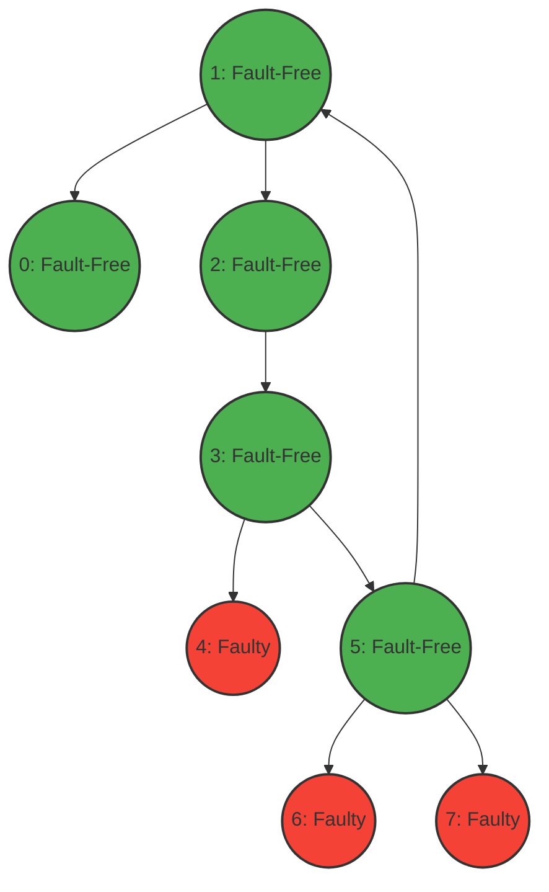
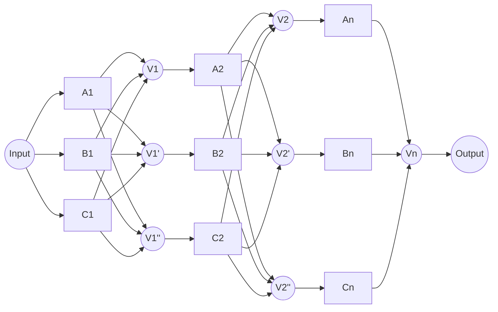

# 基本概念

## 检错码和纠错码基本原理及其与码距的关系

- **冗余核心**：在原始数据位（信息位）的基础上，按照某种数学规则增加额外的**校验位**（冗余位），使合法码字在空间中分散开。
    
- **检错原理**：接收方根据相同规则重新计算校验位，若不匹配，则说明传输中发生了比特翻转，判定码字“非法”，从而发现错误。
    
- **纠错原理**：利用多个校验位的交叉组合关系，对非法码字进行空间定位或代数特征计算（如计算故障字 Syndrome），找出出错的特定比特位并将其取反（翻转回来），实现**自动修正**。

- **码距定义**：任意两个合法码字之间对应位不同的个数称为码距。系统中所允许的任意两个合法码字之间的最小不同位数为**最小码距 ($d_{min}$)**。
    
- **数量约束关系**：
    
    1. **单纯检错**：若要检测出 $e$ 位错，要求 $d_{min} \ge e + 1$。
        
    2. **单纯纠错**：若要纠正 $t$ 位错，要求 $d_{min} \ge 2t + 1$。
        
    3. **纠检错结合**：若要同时纠正 $t$ 位错并检测出 $e$ 位错（$e \ge t$），要求 $d_{min} \ge e + t + 1$。

## 可修复性对可靠性和可用性有什么作用？

可靠性要求系统在一定时间t内无故障运行，可用性要求系统在t时刻无故障。因此在单部件系统中，可修复性可以提高可用性，对可靠性没有帮助。

## 什么是马尔科夫过程？马尔科夫过程满足泊松分布的前提是什么？

马尔科夫过程是指状态变量为离散的、时间变量为连续的随机过程。

**核心特征**：**无记忆性**（Memorylessness）。 系统未来的状态仅取决于**当前**所处的状态，而与过去是如何到达这个状态的**历史无关**。通俗讲就是“未来只由现在决定，与过去无关”。

马尔科夫计数过程（状态只增不减）要演变为**泊松分布**，必须在极短时间 $\Delta t$ 内满足以下三个物理前提：

1. **平稳性（时间独立）**：在相同长度的时间段内，事件发生的概率是恒定的，不随时间的推移而改变。
    
2. **独立增量（空间独立）**：在互不重叠的时间段内，事件发生的次数相互独立，彼此没有影响。
    
3. **普通性（稀疏性）**：在极短的时间 $\Delta t$ 内，**恰好发生 1 次**事件的概率与 $\Delta t$ 成正比（即 $\lambda\Delta t$），而**同时发生 2 次或更多次**事件的概率是高阶无穷小，可以忽略不计。

## 什么是拜占庭错误？什么是拜占庭一致性？

**拜占庭错误特征**：在分布式系统中，节点发生错误时的行为是不可预知的。节点不仅会出错，还会**撒谎、伪造信息、或者故意向不同节点发送自相矛盾的假消息**。

拜占庭一致性

**核心定义**：在一个可能包含“拜占庭叛徒（错误节点）”的分布式系统中，所有**健康（忠诚）的节点**依然能够跨越谎言，最终**达成完全相同的正确决定**。

要达成拜占庭一致性，分布式协议必须满足以下两个核心硬性指标：

1. **一致性 (Agreement)**：所有健康的节点必须决定相同的值。
    
2. **正确性/有效性 (Validity)**：当发送节点无故障时，所有无故障节点与发送节点一致。

# 请简述确定性时钟同步协议。

确定性时钟同步协议（Deterministic Clock Synchronization Protocol）**是指一类能够保证分布式系统中各个独立时钟之间的最大时间偏差（Skew）存在一个**可证明的、严格理论上限（Upper Bound）的同步协议。

### 1. 同步的两个核心目标（解决双面时钟/拜占庭问题）

为了在时钟漂移率受限于 $\rho$（即硬件时钟每天走快/走慢的比例有限）的系统里实现确定性同步，算法必须同时满足以下两个硬性条件：

- **一致性（Agreement）**：任意两个健康的进程，去读取同一个时钟（或互相读取对方的时钟）时，得到的值必须是**近似相等**的。
    
- **有效性（Validity）**：如果时钟 $C_i$ 属于一个健康的进程，那么网络中所有其他健康的进程，读取到的 $C_i$ 的值必须是**近似正确**的（不能被传输或故障严重扭曲）。
    

### 2. 逻辑时钟同步的数学模型

在硬件层面，我们无法直接更改晶振的物理时间 $H(t)$。因此，协议采用**逻辑时钟 $C(t)$** 的方案：

$$C(t) = H(t) + CORR(t)$$

- **$H(t)$**：不可更改的物理硬件时钟。
    
- **$CORR(t)$**：软件层面的**修正值（Correction）**。
    
- **同步本质**：算法通过定期计算并更新 $CORR(t)$，使得不同机器之间的逻辑时钟 $C(t)$ 维持在近似相等的范围内。
    

### 3. 同步消息传播的时间边界分析（最坏情况确定）

这里定量分析了“在确定性的最坏情况下，进程需要等待多久才能收齐同步消息”。

- **初始假设**：在 $T_0$ 时刻，所有健康时钟已经完成了一轮同步，最大时间偏差不超过 $\beta$（即 $|c_i(T_0) - c_j(T_0)| < \beta$）。
    
- **行为对齐**：当进程 $j$ 的本地时钟达到设定的同步时间点 $T_i$ 并发出同步帧时，由于初始偏差 $\beta$，其他健康进程最晚会在真实时间 $\beta$ 之后也达到 $T_i$ 并发出消息。
    
- **传输延迟**：消息在网络中的物理传输延迟在 $[\delta - \epsilon, \delta + \epsilon]$ 之间（$\delta$ 为平均延迟，$\epsilon$ 为抖动误差），即最大延迟为 $\delta + \epsilon$。
    
- **时钟漂移影响**：由于本地时钟存在 $\rho$ 的漂移率，测算这段时间时需要乘上速度因子 $(1+\rho)$。
    
- **确定性结论**：进程 $j$ 发出消息后，它能够百分之百确定：**在不晚于 $(1+\rho)(\beta + \delta + \epsilon)$ 的逻辑时间段内，一定能收齐网络中所有健康进程发来的时钟信息**。超过这个时间窗口未到的，即可视为超时故障。
    

### 4. 容错均值表决算法（FTA/WFTA 核心）

收齐各进程的时钟值后，必须排除可能存在的恶意欺骗或硬件异常（拜占庭错误）。

- **前提**：假设系统中最多有 $f$ 个时钟发生故障（发送了极大或极小的错误时间戳）。
    
- **表决策略**：进程将收集到的所有时钟值进行排序，**强行剔除最大的 $f$ 个值和最小的 $f$ 个值**。
    
- **结果计算**：对剩下的中间部分值取**平均数**，作为本轮同步的基准值，据此更新逻辑时钟的修正项 $CORR(t)$。

# Adaptive DSD协议



Adaptive DSD 算法基于经典的 **PMC 模型**（Preparata, Metze, and Chien 模型），并在此基础上做出了具体的设定。

#### **系统建模：**

- 系统由 $N$ 个节点构成，节点集合标识为 $\{0, 1, ..., N-1\}$。
    
- 每个节点只有两种状态：**正常 (Fault-Free, 0)** 或 **故障 (Faulty, 1)**。
    
- 节点之间通过互相测试（Test）来获取对方的状态信息。
    

#### **基本假设：**

- **通信链路可靠：** 假设节点之间的底层通信网络是完全连通且无故障的（即只考虑节点故障，不考虑链路故障或消息丢失）。
    
- **测试结果的非对称性 (PMC 核心假设)：**
    
    - 如果测试节点是**正常**的：它对被测试节点的诊断结果绝对准确。
        
    - 如果测试节点是**故障**的：它对被测试节点的诊断结果是不可预测的（即无论被测试节点是好是坏，故障节点给出的结果都不可信，可能是任意值）。
        
- **故障稳定性：** 在一个测试轮次执行期间，节点的状态不会发生改变（即故障是永久性的，而非瞬态的）。
    

#### **算法核心数据结构：`TESTED_UP`**

`TESTED_UP` 是 Adaptive DSD 算法中最核心的数组结构。系统中的每个节点 $i$ 都在本地维护一个大小为 $N$ 的数组 `TESTED_UP_i`。

- **定义：** 数组索引代表被测试的节点。`TESTED_UP_i[k] = j` 的物理含义是：**节点 $i$ 确认（或从可靠渠道得知），节点 $k$ 测试了节点 $j$，并且发现节点 $j$ 是正常的。**
    
- **作用：** 在系统稳定后，所有正常节点的 `TESTED_UP` 数组中记录的信息实际上构成了网络中当前所有正常节点的一个有向环形链表（即“信任链”）。
    

#### **测试机制与执行过程**

每个节点 $i$ 都会周期性地（或事件驱动地）执行 Adaptive DSD 算法。算法的核心机制是“**寻找下一个正常节点并同步其记忆**”。

以下是节点 $i$ 视角下的执行伪代码与过程解析：


```Plaintext
// 节点 i 执行的 Adaptive-DSD 过程
t = i
REPEAT
    t = (t + 1) MOD N
    向节点 t 发起测试并请求 t 返回其本地的 TESTED_UP_t 数组
UNTIL (节点 i 测试节点 t 发现其为 正常 / FAULT-FREE)

// 更新节点 i 自己找到的下一个正常节点
TESTED_UP_i[i] = t

// 吸收节点 t 的诊断视角
FOR j = 0 TO N-1 DO
    IF i != j THEN
        TESTED_UP_i[j] = TESTED_UP_t[j]
```

#### **过程拆解：**

1. **顺序探测 (Sequential Testing)：** 节点 $i$ 按照节点编号顺序 $(i+1, i+2, ...)$ 依次对相邻节点发起测试。如果测出对方是故障的，就直接跳过，继续测试下一个，直到找到第一个**正常**的节点 $t$。
    
2. **建立信任边：** 节点 $i$ 在本地记录下这一发现：`TESTED_UP_i[i] = t`。这代表 $i$ 指向了环中的下一个正常节点。
    
3. **信息反向传播 (Information Propagation)：** 因为 $i$ 已经亲自证实 $t$ 是正常的，根据 PMC 模型假设，$t$ 所持有的信息是绝对可靠的。因此，$i$ 会将 $t$ 维护的 `TESTED_UP_t` 数组内容直接拷贝到自己的 `TESTED_UP_i` 数组中（除了 $i$ 自己指向 $t$ 的那条记录不覆盖）。
    
    > 💡 **核心精髓：** 这种机制使得诊断信息（谁是正常的）顺着测试环的**逆方向**快速传播。


## `Diagnose` 算法

在节点 $i$ 本地，除了维护 `TESTED_UP_i` 之外，还维护一个大小为 $N$ 的数组 **`STATE_i`**：

- `STATE_i[k] = 0`：表示节点 $i$ 认为节点 $k$ **无故障 (FAULT-FREE)**。
    
- `STATE_i[k] = 1`：表示节点 $i$ 认为节点 $k$ **故障 (FAULTY)**。

### **Diagnose 算法执行流程（逐轮解析）**

假设节点 $i$ 启动了诊断算法，它将经历以下标准的迭代过程：

#### **第 1 轮迭代：初始化与自身确信**

- **全局盲测初始化：** 节点 $i$ 默认全网除了自己以外全都是坏的。将 `STATE_i` 数组中的所有元素初始化为 `FAULTY (1)`。
    
- **自身状态更新：** 节点 $i$ 确信自己是正常的，因此设置 `STATE_i[i] = FAULT-FREE (0)`。
    
- **定义当前指针：** 令跟踪指针 `ptr = i`。
    

#### **第 2 轮迭代：发现直接邻居**

- 节点 $i$ 查看自己直接测试并信任的节点是谁。
    
- 通过读取 `TESTED_UP_i[i]` 得到节点 $t_1$（即 $i$ 直接测试合法的节点）。
    
- 将 $t_1$ 的状态更新为正常：`STATE_i[t_1] = FAULT-FREE (0)`。
    
- 指针向前移动：`ptr = t_1`。
    

#### **第 3 轮及后续迭代：沿信任链盲随更新**

- 此时指针 `ptr` 指向了 $t_1$。由于 $t_1$ 已被证实正常，那么 $t_1$ 在 `TESTED_UP_i[t_1]` 中记录的“它所测试的正常节点 $t_2$”也是绝对可信的。
    
- 将 $t_2$ 的状态更新为正常：`STATE_i[t_2] = FAULT-FREE (0)`。
    
- 指针继续向前移动：`ptr = t_2`。
    
- 依此类推，每一轮迭代都利用上一步确定的正常节点，去解锁下一个正常节点。
    

#### **算法终止条件**

- 这个“顺藤摸瓜”的指针 `ptr` 沿着环一路向后探测。
    
- 当发现某个节点的 `TESTED_UP_i[ptr]` 重新指回了节点 $i$ 本身时（即：检测到 $i$ 无故障的那个上游节点已经被找到了），说明整个由正常节点构成的“信任环”已经全部遍历完毕。
    
- 此时，未被遍历到的节点（即 `STATE` 仍保持初始值 `FAULTY` 的节点）就是真正的故障节点。算法终止。

# 冗余投票器




# 2PC协议

1.简述实现原子操作的两阶段提交(2PC)协议;2尝试说明为什么2PC协议是一个有阻塞(bhlack)的协议，如何改进?

### **简述实现原子操作的两阶段提交 (2PC) 协议**

两阶段提交（Two-Phase Commit, 2PC）协议是为了在分布式系统中实现**分布式事务的原子性（Atomicity）**而设计的。它将整个事务的提交过程交由一个**协调者（Coordinator）**来组织，其余执行节点作为**参与者（Participants）**。

整个协议在逻辑上划分为两个独立的阶段：投票（Voting）与决策（Decision）。

#### **第一阶段：投票阶段 (Voting / Prepare Phase)**

1. **协调者发起请求：** 协调者向所有参与者广播 `Prepare`（准备提交）消息。
    
2. **参与者本地预留：** 参与者在本地执行事务操作，写好 Redo/Undo 日志，并锁定相关资源（如行锁、表锁），**但暂不真正提交**。
    
3. **反馈选票：** 参与者根据自身执行情况，向协调者回复。如果本地预留资源成功，回复 **YES**（同意提交）；如果失败或超时，回复 **NO**（中止事务）。
    

#### **第二阶段：决策阶段 (Decision / Commit Phase)**

协调者根据第一阶段收到的选票进行全局决策，并广播最终指令：

- **全局提交：** 只有当**所有参与者**都投了 YES，协调者才会向所有参与者广播 `COMMIT` 消息。参与者收到后释放锁，完成事务提交。
    
- **全局中止：** 只要有**任意一个参与者**投了 NO（或者协调者在等待选票时发生**安全的超时**），协调者就会广播 `ABORT` 消息。参与者利用 Undo 日志回滚状态，释放资源。

### **为什么 2PC 协议是一个有阻塞 (Blocking) 的协议？**

2PC 被定义为**阻塞型协议**，本质在于：**参与者在状态 $w$（已投 YES，等待最终决策）时发生了危险的超时，且此时协调者与部分获知决策的节点同时发生故障，导致存活的参与者必须无限期挂起（Blocked）**。

我们可以通过**并发集 (Concurrency Set)** 的理论条件来解释其底层缺陷：

> **非阻塞协议理论根本条件：**
> 
> 任何本地状态的并发集（即一个节点处于该状态时，全网其他节点可能处于的状态集合）中，**不能同时包含提交态（$c$）和中止态（$a$）**。

#### **2PC 违反该条件的阻塞场景：**

1. 某个参与者执行完第一阶段后，认为自己没问题，投了 **YES**，随后进入等待最终指令的状态 $w$。
    
2. 此时，协调者收集齐了选票，向部分节点发送了 `COMMIT`，但还没来得及发给全部节点，**协调者以及收到命令的节点就全部发生故障（宕机）了**。
    
3. 对于剩下那些停留在状态 $w$ 的存活参与者，由于其并发集中同时包含了 $\{c, a\}$（它们无法推断出死去的节点到底是提交了还是中止了）：
    
    - 它们**不敢单边决定提交**，因为可能有人投了 NO 导致事务需要中止。
        
    - 它们**不敢单边决定中止**，因为可能有其他节点已经收到 `COMMIT` 真正提交了。
        
4. **结果：** 这些存活的参与者无法通过启动终止协议（Termination Protocol）从彼此身上推导结果，只能**无限期挂起（Blocked），并持续锁定本地资源**，直到故障节点恢复。这往往会引发整个系统的死锁与瘫痪。

### **如何改进 2PC 协议？**

为了破除 2PC 的阻塞魔咒，学术界和现代工业界给出了不同的改进演进路径：

#### **改进方案一：学术演进 —— 三阶段提交 (3PC) 协议**

3PC 的核心思想是**破坏 2PC 违反并发集隔离的死穴**。它在等待态（$w$）和提交态（$c$）之间，引入了一个缓冲状态：**准备提交态（Prepare-to-commit, $p$）**，将第二阶段一拆为二：

1. **CanCommit（投票阶段）：** 协调者询问是否可以执行，参与者答 YES 或 NO（此时不锁资源，减少盲目锁表）。
    
2. **PreCommit（准备阶段）：** 若全票通过，协调者发送 `Prepare-to-commit`。参与者进入状态 $p$（锁定资源，写日志，但不正式提交）。然后发送ACK
    
3. **DoCommit（提交阶段）：** 收齐 ACK 后，发送最终 `COMMIT`。
    

- **如何防阻塞：** * 引入状态 $p$ 后，解耦了状态的并发集。当有存活节点处于状态 $p$ 时，全网**绝不可能有节点已经走向中止态（$a$）**。
    
    - 如果协调者此时故障，存活节点选举出**备份协调者**。备份协调者检查自身状态的并发集：只要看到有节点处于 $p$ 状态，就能安全地一致性推导——**决定提交**；如果大家都在 $w$ 状态，则**决定中止**。
        
    - 3PC 还为参与者引入了超时机制，若在状态 $p$ 等待最终 `COMMIT` 超时，参与者会自动集体选择提交，从而实现了**非阻塞**。
        

#### **3PC 的局限性：**

3PC 虽然在“单边节点故障”下解决了阻塞，但在**网络分区（脑裂）+ 协调者故障**的双重打击下依然会失效。例如：A 分区有进入 $p$ 态的节点选择提交，B 分区全在 $w$ 态选择中止，导致系统数据不一致。并且它多了一轮网络交互（延迟增加 50%），因此工业界极少直接部署 3PC。

#### **改进方案二：工业主流 —— 2PC + 共识算法（Paxos / Raft）组**

现代工业界分布式数据库（如 Google Spanner、TiDB、CockroachDB）并没有采用复杂的 3PC，而是采用 **2PC + Paxos/Raft** 的组合拳：

- **高可用协调者：** 将 2PC 的单点协调者（Coordinator）做成一个 Paxos 或 Raft 副本集群。
    
- **效果：** 事务的执行依然采用轻量、高效的 2PC（只需两轮交互）。一旦扮演协调者的 Leader 节点挂了，Raft/Paxos 集群会在几十毫秒内自动选举出新的 Leader。由于新 Leader 拥有完整的事务日志日志记录，它能立刻接管并无缝下发后续指令。
    
- **结论：** 这种方案**既保持了 2PC 的低延迟优势，又通过共识算法从根本上消除了单点故障带来的永久阻塞**，是目前最完美的工程解。