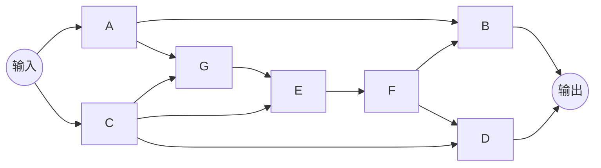
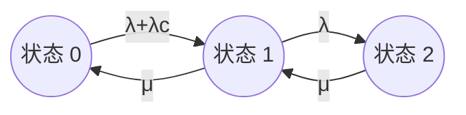
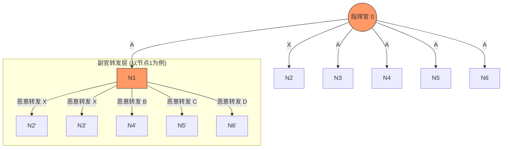
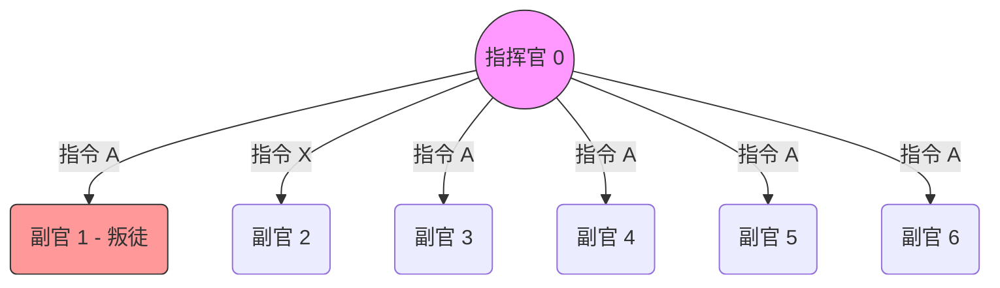
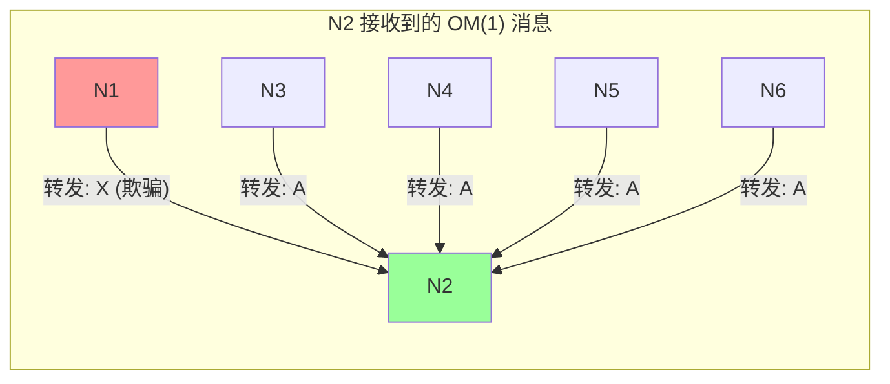
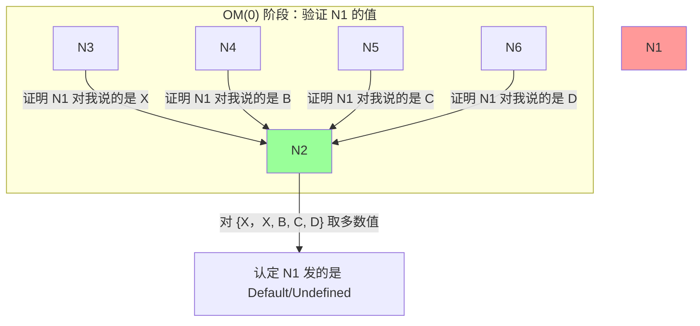
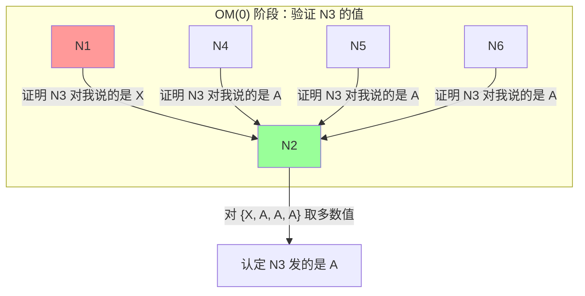
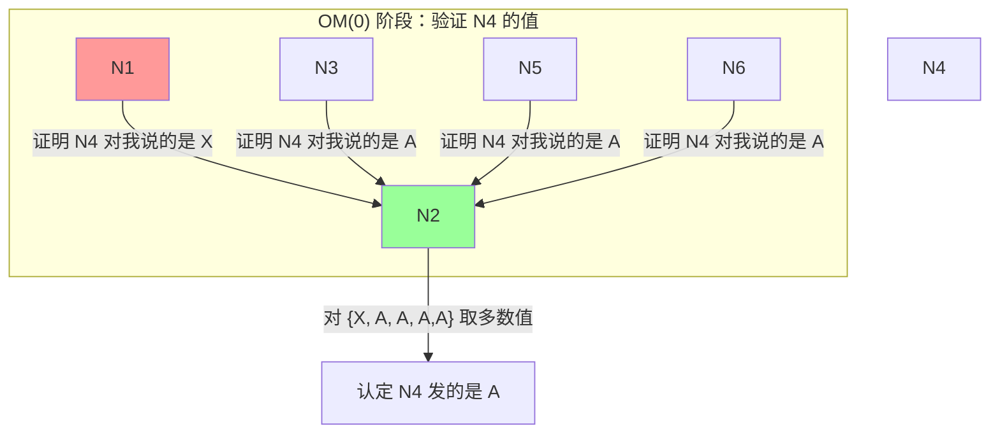

# 概念
## 一个码距为5的编码，最多可以纠正几位bit的错误?简要说明原因。

一个码距为 5 的编码，最多可以纠正 **2 位** bit 的错误。

纠错码的纠错能力与最小码距（Minimum Hamming Distance，常用 $d$ 表示）之间存在确定的数学关系。

#### 核心公式

若要使编码具有纠正 $t$ 位错误的能力，则要求最小码距 $d$ 满足以下关系：

$$d \geq 2t + 1$$

#### 推导过程

1. **已知条件：** 码距 $d = 5$。
    
2. **代入公式：** $5 \geq 2t + 1$。
    
3. **计算：** $2t \leq 4$，得出 $t \leq 2$。
    
4. **结论：** 因此，该编码最大能纠正的错误位数 $t$ 为 2。

## 比较说明可修复性对可用性A(t)和可靠性R(t)的影响。

要比较它对 **可用性 $A(t)$** 和 **可靠性 $R(t)$** 的影响，首先需要明确这两者的本质区别：

- **可靠性 $R(t)$**：系统在时间 $t$ 内**连续**保持正常运行的概率（强调“不断”）。
    
- **可用性 $A(t)$**：系统在时间 $t$ 这一时刻**处于**正常运行状态的概率（强调“在岗”，允许中间坏过又修好）。

### 1. 可修复性对可靠性 $R(t)$ 的影响

**结论：在标准定义下，可修复性对单一组件的可靠性指标几乎没有影响

- **定义约束：** 可靠性关注的是“首次失效时间”（Time to First Failure）。一旦系统发生故障，无论你修得有多快，该次“连续运行”的任务已经宣告失败。
    
- **数学体现：** 对于不可修复系统，可靠性主要由故障率 $\lambda$ 决定：
    
    $$R(t) = e^{-\lambda t}$$
    
    公式中并不包含修复率 $\mu$。

### 2. 可修复性对可用性 $A(t)$ 的影响

**结论：可修复性是决定可用性的关键支柱。**

- **直接正相关：** 可用性衡量的是系统“在岗”的时间比例。修得越快（$MTTR$ 越小），系统从故障中恢复的速度就越快，停机时间越短。
    
- **数学体现：** 在稳态情况下，可用性 $A$ 的经典公式为：
    
    $$A = \frac{MTBF}{MTBF + MTTR}$$
    
    从公式可见，当可修复性提升（即 $MTTR \to 0$）时，可用性 $A$ 将趋近于 $1$（即 100% 可用）。

## 简述Reliability Broadcast、 Atomic Broadcast, Casual Broadcast 的功能，并简要说明上述哪个协议能够保证消息的接受顺序与发送顺序相同。

#### **Reliability Broadcast (可靠广播)**

- **功能：** 保证消息传递的原子性（不可分性）。
    
- **核心特性：** 如果一个正确的节点（无故障节点）发送了消息，或者接收到了某个消息，那么所有正确的节点最终都会接收到该消息。
    
- **特点：** 它只管“到没到”，**不保证顺序**。即使发送者连续发送了消息 $M_1$ 和 $M_2$，接收者也可能先收到 $M_2$ 再收到 $M_1$。
    

#### **Atomic Broadcast (原子广播 / 全序广播)**

- **功能：** 在可靠广播的基础上，增加了全序（Total Order）一致性。
    
- **核心特性：** 所有正确的节点不仅能接收到相同的消息集，而且**接收消息的顺序必须完全一致**。
    
- **应用：** 这是分布式数据库同步、状态机复制（SMR）的基础，类似于 Paxos 或 Raft 协议实现的效果。
    

#### **Causal Broadcast (因果广播)**

- **功能：** 保证具有**因果关系**的消息按顺序传递。
    
- **核心特性：** 如果消息 $M_1$ 在逻辑上先于消息 $M_2$ 产生（例如 $M_2$ 是对 $M_1$ 的回复），那么任何节点在接收 $M_2$ 之前必须先接收 $M_1$。
    
- **特点：** 对于没有因果关系的并发消息，它不保证顺序。

### 哪个协议保证“接收顺序 = 发送顺序”？

能够保证消息的**接收顺序与发送顺序相同**的协议是：**Atomic Broadcast (原子广播)**。

#### **简要说明原因：**

1. **全序性（Total Order）：** 原子广播要求所有节点以相同的顺序递交消息。
    
2. **FIFO特性：** 在原子广播的定义中，通常隐含或明确包含了 **FIFO（先进先出）** 顺序。这意味着如果同一个发送者先发出了 $M_1$ 后发出 $M_2$，原子广播协议会强制要求所有接收者必须先处理 $M_1$，再处理 $M_2$。
    
3. **对比：** * **Reliability Broadcast** 完全不维护顺序。
    
    - **Causal Broadcast** 只能保证有因果关联的消息顺序，对于同一发送者发出的不相关消息，虽然通常也能通过因果链条覆盖，但其核心定义侧重于逻辑因果，而非绝对的全局物理顺序。

## 举例说明 Atomic Action并发控制中 serializability 的含义

### 1. Serializability 的含义

**Serializability** 指的是：多个原子动作在逻辑上并发执行的结果，必须与它们按某种次序**一个接一个地串行执行**的结果完全相同。

- **直观理解：** 只要并发执行后的系统状态，能对应上某种“先做 A 再做 B”或“先做 B 再做 A”的结果，那么这个并发过程就是正确的。
    
- **目的：** 既利用了并发带来的高性能，又保证了数据的一致性（仿佛每次只有一个任务在运行）。
    

### 2. 举例说明

假设有两个原子动作（事务）同时操作同一个银行账户，该账户初始余额为 **100元**：

- **Action T1 (取款)：** 读取余额，减去 50元，写回余额。
    
- **Action T2 (利息)：** 读取余额，增加 10%（即余额 × 1.1），写回余额。
    

#### 情况 A：串行执行（基准）

1. **先 T1 后 T2：** $(100 - 50) \times 1.1 = \mathbf{55}$ 元。
    
2. **先 T2 后 T1：** $(100 \times 1.1) - 50 = \mathbf{60}$ 元。
    

> **结论：** 只要最后的余额是 **55** 或 **60**，系统就是一致的。

#### 情况 B：不可串行化的并发（错误示例）

如果并发控制不当，操作可能会交织：

1. **T1** 读取余额 (100)。
    
2. **T2** 读取余额 (100)。
    
3. **T1** 计算 100 - 50 = 50，写回余额 **50**。
    
4. **T2** 还在用之前读到的 100 计算：$100 \times 1.1 = 110$，写回余额 **110**。
    

> **结果：** 最终余额为 **110**。这既不等于 55 也不等于 60。这就叫**不可串行化**，发生了“丢失更新”错误。

#### 情况 C：可串行化的并发（正确示例）

通过加锁（如两阶段锁 2PL）机制：

1. **T1** 获取锁，读取 100。
    
2. **T2** 尝试读取，但被阻塞（等待 T1 释放锁）。
    
3. **T1** 完成操作写回 50，释放锁。
    
4. **T2** 获得锁，读取最新的 50，计算 $50 \times 1.1 = 55$，写回 **55**。
    

> **结果：** 最终余额为 **55**。虽然是并发触发的，但结果等同于“先 T1 后 T2”，因此它是 **Serializable** 的。

### 3. 核心总结

- **Serializability** 并不要求时间上必须排队。
    
- 它要求的是**逻辑结果的等价性**。
    
- 如果没有实现可串行化，系统就会出现诸如“脏读”、“幻读”或“更新丢失”等容错领域极力避免的问题。

# **Piggybacking Acknowledgments（捎带确认机制）** 实现可靠广播的 **Trans Protocol**

**题目：** 请叙述利用 Piggybacking Acknowledgments 实现可靠广播的 Trans protocol 协议。并解释说明如下消息传送过程中，
消息序列：$A \to Ba \to Cb \to D\bar{b}c \to E\bar{b}\bar{c}d \to Ba \to Cb \to Fbce \to Gf$
，Trans Protocol 如何实现可靠广播；并说明消息 $Fbce$ 中，确认应答 $bc$ 是否有必要。假设，$A, B, C, \dots, etc$ 表示发送的消息，$a, b, c$ 表示对消息的确认，$\bar{a}, \bar{b}, \bar{e}$（原图中加横线的字母）表示对消息的否认（Negative Acknowledgment）。

### Trans Protocol 协议叙述

**Trans Protocol** 是一种通过广播介质实现可靠数据传输的协议，其核心特征包括：

- **捎带确认 (Piggybacking)：** 节点在广播自己的新消息时，不单独发送确认包，而是将对之前收到的消息的确认（ACK）信息附加在数据包首部。
    
- **负确认机制 (NACK)：** 接收方通过检查消息序列号发现“空洞”（丢包）。一旦发现缺失，就在下一次发送的消息中嵌入负确认信号（加横线的字母）。
    
- **重传逻辑：** 发送方收到 NACK 后，会从其缓冲区（Buffer）中取出对应的消息进行重传。
    
- **可靠性保障：** 消息会一直保存在发送方的缓冲区中，直到所有参与者都确认收到了该消息。

### 消息序列过程详细解释

我们逐步解析这个带有丢包和重传的典型场景：

1. **$A$**：节点发送消息 $A$。
    
2. **$Ba$**：发送消息 $B$，并确认已收到 $A$。
    
3. **$Cb$**：发送消息 $C$，并确认已收到 $B$。
    
4. **$D\bar{b}c$**：发送消息 $D$。此时该节点发现 $B$ 没收到或校验出错，因此发出**否认信号 $\bar{b}$**，同时它确认收到了 $C$。
    
5. **$E\bar{b}\bar{c}d$**：发送消息 $E$。由于之前的问题未解决，此节点继续发出**对 $B$ 和 $C$ 的否认信号 $\bar{b}, \bar{c}$**，同时确认收到了 $D$。
    
6. **$Ba, Cb$（重传阶段）**：原发送者收到 $\bar{b}, \bar{c}$ 后，意识到 $B$ 和 $C$ 丢失，于是依次**重传消息 $B$ 和 $C$**。
    
7. **$Fbce$**：在重传成功后，节点发送新消息 $F$，并捎带对重传成功的 $B, C$ 以及之前 $E$ 的**正向确认 $b, c, e$**。
    
8. **$Gf$**：发送消息 $G$，确认收到 $F$。
    

**实现可靠广播的关键：**

通过这种“确认+否认”的组合，协议能够精确定位丢失的消息并强制触发重传，确保所有参与节点最终的消息序列是一致且完整的。

### 消息 $Fbce$ 中，确认应答 $bc$ 是否有必要？

**结论：非常有必要。**

**原因说明：**

1. **确认重传结果：** 序列中 $D$ 和 $E$ 阶段都明确表示了 $b$ 和 $c$ 丢失（$\bar{b}, \bar{c}$）。如果 $F$ 不携带 $bc$，发送者就无法确定刚才的重传（步骤6）是否成功触达了报错的节点。
    
2. **清空缓冲区：** 发送方只有在收到针对重传消息的正向确认（ACK）后，才能将 $B$ 和 $C$ 从其重传缓冲区中删除。如果没有 $bc$，这些消息会一直占用内存，甚至可能引发后续无效的再次重传。
    
3. **协议闭环：** $bc$ 标志着系统从“错误/重传状态”回归到“正常/同步状态”，它是保证广播原子性（所有人都收到）的最终凭据。
    

**提示：** 在容错考试中，一定要强调 **NACK 触发重传** 和 **ACK 用于清理缓冲区** 这两个闭环动作。这一序列完美展示了协议如何处理“发现错误 -> 告知错误 -> 修复错误 -> 确认修复”的全过程。

# 可靠性工程中的经典分析题

请写出下面系统的Tie Set和Cut Set，并计算系统的可靠性。假设每个子部件的可靠性p均为0.9，且其故障相互独立。

### 系通通路集 (Tie Sets)

**Tie Set (最小通路集)** 是指能保证系统正常工作的最小部件集合。所有**最小路集**为：
- **T1:** $\{A, B\}$
    
- **T2:** $\{C, D\}$
    
- **T3:** $\{A, G, E, F, D\}$
    
- **T4:** $\{C, E, F, B\}$
    

> **注意：** 通路 $\{C, E, F, D\}$ 实际上包含在 $\{C, D\}$ 中吗，因为 $E, F$ 是额外的路径。但在可靠性计算中，我们只关注**最小**通路集。

### 系统割集 (Cut Sets)

**Cut Set (最小割集)** 是指如果这些部件全部故障，系统必将瘫痪的最小部件集合：

- **C1:** $\{A, C\}$ (切断所有输入)
    
- **C2:** $\{B, D\}$ (切断所有输出)
    
- **C3:** $\{A, E, D\}$
    
- **C4:** $\{A,F,D\}$
    
- **C5:** $\{B, F, C\}$ (切断中间关键交叉点)
	
- **C6:** $\{B, E, C\}$ (切断中间关键交叉点)
	
- **C7:** $\{B, G, C\}$ (切断中间关键交叉点)

## 基于最小路集与容斥原理

本项目通过对给定系统拓扑图的分析，利用最小路集（Minimal Tie Sets）**定义系统成功事件，并结合**容斥原理（Inclusion-Exclusion Principle）精确计算系统的整体可靠性。

### 1. 确定最小路集 (Minimal Tie Sets)

最小路集是指能保证系统正常工作的最小部件集合。从输入端到输出端，系统成功的路径组合如下：

- **$T_1 = \{A, B\}$**
    
- **$T_2 = \{C, D\}$**
    
- **$T_3 = \{C, E, F, B\}$**
    
- **$T_4 = \{A, G, E, F, D\}$**
    

因此，系统成功事件 $S$ 可表示为各路集的并集：

$$S = T_1 \cup T_2 \cup T_3 \cup T_4$$

### 2. 各阶交集概率计算

假设每个部件的可靠性均为 $p$，且各部件故障相互独立。

### 2.1 一阶项（各路集独立成功概率）

- $P(T_1) = p^2$
    
- $P(T_2) = p^2$
    
- $P(T_3) = p^4$
    
- $P(T_4) = p^5$
    
    **一阶总和 $\sum P(T_i) = 2p^2 + p^4 + p^5$**
    

### 2.2 二阶项（两两路集同时成功的概率）

计算时需注意去重（并集部件数）：

- $P(T_1 T_2) = P(A, B, C, D) = p^4$
    
- $P(T_1 T_3) = P(A, B, C, E, F) = p^5$
    
- $P(T_1 T_4) = P(A, B, G, E, F, D) = p^6$
    
- $P(T_2 T_3) = P(C, D, B, E, F) = p^5$
    
- $P(T_2 T_4) = P(C, D, A, G, E, F) = p^6$
    
- $P(T_3 T_4) = P(A, B, C, D, E, F, G) = p^7$
    
    **二阶总和 $\sum P(T_i T_j) = p^4 + 2p^5 + 2p^6 + p^7$**
    

### 2.3 三阶项

- $P(T_1 T_2 T_3) = P(A, B, C, D, E, F) = p^6$
    
- $P(T_1 T_2 T_4) = P(A, B, C, D, G, E, F) = p^7$
    
- $P(T_1 T_3 T_4) = P(A, B, C, E, F, G, D) = p^7$
    
- $P(T_2 T_3 T_4) = P(C, D, B, E, F, A, G) = p^7$
    
    **三阶总和 $\sum P(T_i T_j T_k) = p^6 + 3p^7$**
    

### 2.4 四阶项

- $P(T_1 T_2 T_3 T_4) = P(A, B, C, D, E, F, G) = p^7$
    
    **四阶总和 $P(T_1 T_2 T_3 T_4) = p^7$**
    

### 3. 容斥原理公式推导

系统可靠性 $R$ 根据容斥原理展开：

$$R = \sum P(T_i) - \sum P(T_i T_j) + \sum P(T_i T_j T_k) - P(T_1 T_2 T_3 T_4)$$

代入各阶项多项式：

$$R = (2p^2 + p^4 + p^5) - (p^4 + 2p^5 + 2p^6 + p^7) + (p^6 + 3p^7) - p^7$$

**化简合并同类项：**

$$R = 2p^2 + (p^4 - p^4) + (p^5 - 2p^5) + (-2p^6 + p^6) + (-p^7 + 3p^7 - p^7)$$

$$R = 2p^2 - p^5 - p^6 + p^7$$

### 4. 数值计算结果

当各子部件可靠性 $p = 0.9$ 时：

1. $2(0.9)^2 = 1.62$
    
2. $-(0.9)^5 = -0.59049$
    
3. $-(0.9)^6 = -0.531441$
    
4. $+(0.9)^7 = 0.4782969$
    

**求和计算：**

$$R = 1.62 - 0.59049 - 0.531441 + 0.4782969$$

$$R = 0.9763659$$

### 5. 结论

- **系统可靠性函数：** $R(p) = 2p^2 - p^5 - p^6 + p^7$
    
- **当 $p=0.9$ 时的精确值：** **$0.9763659$** (约 **$97.64\%$**)

# **冷备份（Standby）系统**可靠性建模

**系统描述：**

- **构成：** 供电部件（Power Supply）、切换部件（Switch）、功能部件 1 和 2（Unit one & Unit two）。
    
- **运行机制：** 系统采用 standby 模式。初始时 Unit one 工作，Unit two 备份。当工作部件故障时，由切换部件切换到备份部件。
    
- **参数假设：**
    
    - 功能部件故障率：$\lambda$
        
    - 切换部件故障率：$\lambda_c$
        
    - 修复率：$\mu$
        
    - 供电部件：题目第一部分假设不会出错，第二部分假设供电和切换均不出错。
        
    - 同一时刻不会发生两个及以上的错误（符合马尔可夫链特征）。
        

**要求：**

1. 画出马尔可夫过程图。
    
2. 给出可用性 $A(t)$ 和可靠性 $R(t)$ 的微分方程组。
    
3. 在简化条件下（供电、切换均不出错），求 $\mu = 10\lambda$ 且 $t \to \infty$ 时的稳定可用性 $A$。

### 马尔可夫过程图 

我们定义系统状态如下：

- **状态 0：** 两个功能部件均正常（一个工作，一个备份）。
    
- **状态 1：** 一个功能部件故障，另一个正在工作。
    
- **状态 2：** 系统失效（两个功能部件均故障，或切换部件故障）。

**注：** 计算 $R(t)$ 时，状态 2 为吸收状态（不可修复）；计算 $A(t)$ 时，状态 2 可修复。

### 微分方程组

设 $P_i(t)$ 为系统在时刻 $t$ 处于状态 $i$ 的概率。

#### (1) 可用性 $A(t)$ 的方程组（考虑修复）

$$\begin{cases} \frac{dP_0(t)}{dt} = -(\lambda + \lambda_c)P_0(t) + \mu P_1(t) \\ \frac{dP_1(t)}{dt} = (\lambda + \lambda_c)P_0(t) - (\lambda + \mu)P_1(t) + \mu P_2(t) \\ \frac{dP_2(t)}{dt} = \lambda P_1(t) - \mu P_2(t) \end{cases}$$

其中 $A(t) = P_0(t) + P_1(t)$。
>可用性 $A$ 定义为系统处于**所有正常工作状态**的概率之和

#### (2) 可靠性 $R(t)$ 的方程组（不考虑从失效态修复）

$$\begin{cases} \frac{dP_0(t)}{dt} = -(\lambda + \lambda_c)P_0(t) + \mu P_1(t) \\ \frac{dP_1(t)}{dt} = (\lambda + \lambda_c)P_0(t) - (\lambda + \mu)P_1(t) \\ \frac{dP_2(t)}{dt} = \lambda P_1(t) \end{cases}$$

其中 $R(t) = P_0(t) + P_1(t)$，初值为 $P_0(0)=1, P_1(0)=0, P_2(0)=0$。

### 稳态可用性 $A(\infty)$ 的计算

**条件简化：** 供电和切换部件均不出错（即 $\lambda_c = 0$）。

此时状态转移变为：状态 0 ($1^{st}$工作) $\xrightarrow{\lambda}$ 状态 1 ($2^{nd}$工作) $\xrightarrow{\lambda}$ 状态 2 (失效)。

当 $t \to \infty$ 时，各状态概率不再随时间变化，导数为 0：

1. $-\lambda P_0 + \mu P_1 = 0 \implies P_1 = \frac{\lambda}{\mu} P_0$
    
2. $\lambda P_1 - \mu P_2 = 0 \implies P_2 = \frac{\lambda}{\mu} P_1 = (\frac{\lambda}{\mu})^2 P_0$
    
3. 概率之和为 1：$P_0 + P_1 + P_2 = 1$
    

代入数值 $\mu = 10\lambda$，即 $\frac{\lambda}{\mu} = 0.1$：

$$P_0 + 0.1P_0 + 0.01P_0 = 1$$

$$1.11P_0 = 1 \implies P_0 = \frac{1}{1.11} \approx 0.9009$$

$$P_1 = 0.1 \times P_0 \approx 0.0901$$

**稳定可用性：**

$$A = P_0 + P_1 = \frac{1 + 0.1}{1.11} = \frac{1.1}{1.11} \approx 0.991$$

**最终答案：**

当 $t \to \infty$ 时，系统的稳态可用性约为 **0.991**（或 $110/111$）。

# 分布式系统中的拜占庭容错（Byzantine Fault Tolerance, BFT）协议;**Oral Messages (OM)** 算法

**题目：** 简述基于普通消息传递的拜占庭一致性协议（OM 算法）；并以节点 2 和 3 为例，画出正确节点 2 和 3 取得一致性的协议递归执行过程。 **场景设定：**

- 总节点数为 7（节点 0 为指挥官，节点 1-6 为副官）。
    
- **节点 0（指挥官）**：发送任意信息 "X" 给节点 2，发送信息 "A" 给其余节点（1, 3, 4, 5, 6）。注：节点 0 此行为表现为拜占庭故障。
    
- **节点 1（故障副官）**：向节点 2、3 恶意转发任意信息 "X"，向节点 4、5、6 恶意转发错误信息 B/C/D。
    
- **任务**：说明节点 2 和 3 如何通过协议达成一致。

## 拜占庭一致性协议 (OM 算法) 简述

基于普通消息传递的拜占庭一致性协议（通常指 $OM(m)$ 算法，其中 $m$ 是容忍的故障数量）通过递归转发消息来达成一致。其核心步骤如下：

1. **分发阶段**：指挥官向所有副官发送一个值。
    
2. **交互阶段**：每个副官作为新的指挥官，将自己收到的值通过 $OM(m-1)$ 协议发送给其余所有副官。
    
3. **决策阶段**：每个副官收集所有从其他副官处收到的值，取多数值（Majority）作为最终决策。如果无法取得多数值，则取默认值。
    
4. **容错条件**：在总节点数为 $n$，故障节点数为 $f$ 的情况下，必须满足 $n \geq 3f + 1$ 才能保证一致性。

## 协议递归执行过程图

在你的场景中，总节点数 $n = 7$。根据拜占庭容错理论，算法能容忍的最大故障节点数为 $m = \lfloor (7-1)/3 \rfloor = 2$。

这意味着递归过程将分为三层：**OM(2)**、**OM(1)** 和 **OM(0)**。为了展示节点 2 和 3 如何达成一致，我们需要跟踪它们接收到的多层加密/转发信息流。

## 递归第一层：OM(2) —— 指挥官发起

在这一层，指挥官 $L_0$（Commander）向所有副官发送原始指令。

## 递归第二层：OM(1) —— 副官作为“临时指挥官”转发

每个副官收到 $L_0$ 的指令后，作为指挥官执行 OM(1)，将其收到的值发送给其余 5 个副官。

### 以节点 2 观察到的 OM(1) 为例

节点 2 会收到来自 N1, N3, N4, N5, N6 转发的消息。

## 递归第三层：OM(0) 

这是最复杂的一层。为了验证 OM(1) 中收到的值的可靠性，每个副官在转发 OM(1) 的消息时，还会触发 OM(0)。

以 **节点 2 和节点 3 达成一致** 为核心，我们看他们如何通过其他节点的消息来校验 N1（叛徒）发出的干扰。

### 节点 2 对“N1 转发的值”进行的 OM(0) 校验

当 N1 告诉 N2 他收到了 "X" 时，N2 不会立刻相信，他会看其他节点（如 N3）汇报的“N1 说了什么”。

### 节点 2 对“N3 转发的值”进行的 OM(0) 校验

当 N3 告诉 N2 他收到了 "A" 时，N2 不会立刻相信，他会看其他节点汇报的“N3 说了什么”。

由于N3是忠诚节点，它会给其他节点说自己收到的是A

至于不忠诚的N1，无法预测它说的，就用X代替了

### 节点 2 对“N4 转发的值”进行的 OM(0) 校验

当 N4 告诉 N2 他收到了 "A" 时，N2 不会立刻相信，他会看其他节点汇报的“N4 说了什么”。

由于N4是忠诚节点，它会给其他节点说自己收到的是A

至于不忠诚的N1，无法预测它说的，就用X代替了

## 节点 2 与 节点 3 的最终决策表

在 OM(m) 递归结束时，每个节点会通过 `majority()` 函数决定最终值。

### 节点 2 的决策向量 $V_2$：

|**来自节点**|**OM(1) 接收值**|**OM(0) 递归后的多数值结果**|**说明**|
|---|---|---|---|
|**L0**|A|**A**|指挥官直接消息|
|**N1**|X|**Default/X**|叛徒 N1 消息混乱，被多数派抵消|
|**N3**|A|**A**|正确节点转发|
|**N4**|A|**A**|正确节点转发|
|**N5**|A|**A**|正确节点转发|
|**N6**|A|**A**|正确节点转发|
**最终结果：** $majority(A, X, A, A, A, A) = \mathbf{A}$

### 节点 3 的决策向量 $V_3$：

| **来自节点** | **OM(1) 接收值** | **OM(0) 递归后的多数值结果** | **说明**     |
| -------- | ------------- | ------------------- | ---------- |
| **L0**   | A             | **A**               | 指挥官直接消息    |
| **N1**   | X             | **Default/X**       | 叛徒 N1 消息混乱 |
| **N2**   | A             | **A**               | 正确节点转发     |
| **N4**   | A             | **A**               | 正确节点转发     |
| **N5**   | A             | **A**               | 正确节点转发     |
| **N6**   | A             | **A**               | 正确节点转发     |

**最终结果：** $majority(A, X, A, A, A, A) = \mathbf{A}$

## 结论

尽管 **N1 (副官1)** 向节点 2 和节点 3 发送了不同的错误信息（X, B, C, D 等），但由于系统中存在足够多的正确节点（N2, N3, N4, N5, N6），在 OM(0) 递归层的多数表决中，这些错误信息会被淹没。

最终，**节点 2 和节点 3 都将获得相同的向量 $V = \{A, X, A, A, A, A\}$**，从而达成 $majority(V) = A$ 的一致性。

这些递归层级保证了：只要叛徒总数 $m < n/3$，诚实副官总能通过“交换他们从其他副官处听到的消息”来剔除干扰。