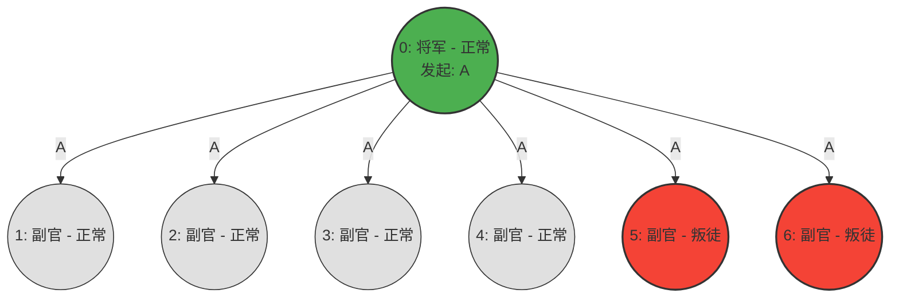
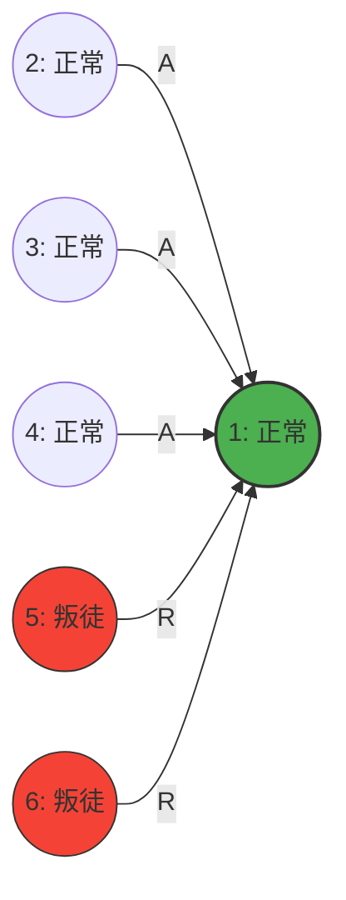
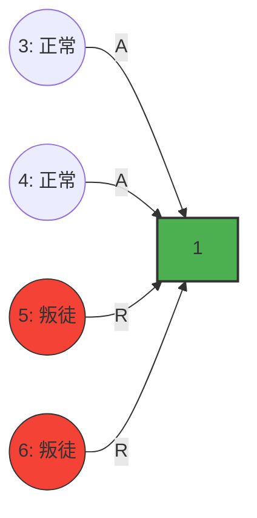
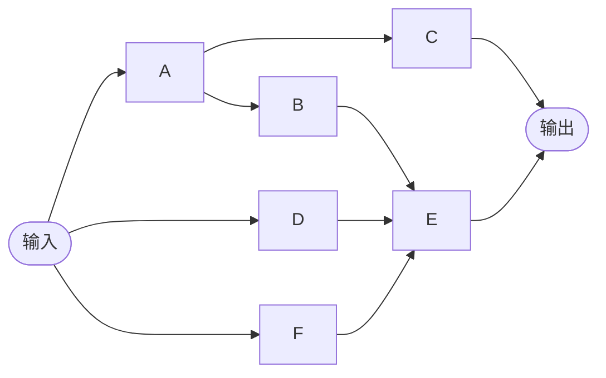
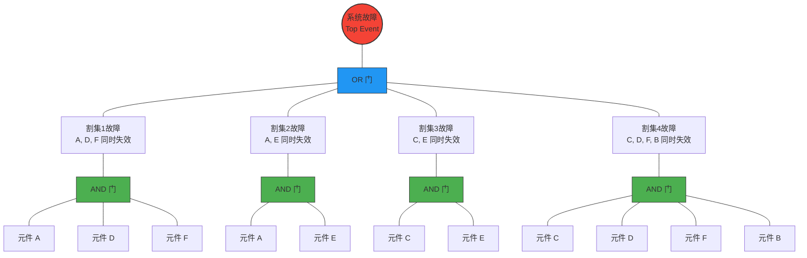
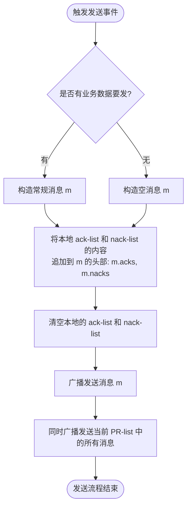

# 简答

## **什么是马尔科夫过程？马尔科夫过程满足泊松分布的前提是什么？**

见[[2022年#什么是马尔科夫过程？马尔科夫过程满足泊松分布的前提是什么？]]

##  **z(t), f(t), R(t), F(t)是什么，有什么关系？** 为什么z(t)描述部件故障比f(t)好？

- **$F(t)$ —— 累积故障概率函数（Cumulative Distribution Function, CDF）**
    
    - **含义**：部件在时间 $t$ 之前（包含 $t$ 时刻）发生故障的**总概率**。
        
        
- **$R(t)$ —— 可靠度函数（Reliability Function）**
    
    - **含义**：部件在时间 $t$ 之后仍然正常工作的概率（即**存活率**、安全运行概率）。
        
        
- **$f(t)$ —— 故障概率密度函数（Probability Density Function, PDF）**
    
    - **含义**：部件在某个特定时间点 $t$ 附近发生故障的**速率**或概率大小。它描述的是故障时间的分布形状。
        
    - **公式**：$f(t) = \frac{dF(t)}{dt} = -\frac{dR(t)}{dt}$
        
- **$z(t)$ —— 故障率函数（Hazard Rate Function，有时也写作 $\lambda(t)$）**
    
    - **含义**：**条件故障率**。指的是部件已经平安工作到了时间 $t$，在此基础上，它在接下来的极短时间 $\Delta t$ 内**发生故障的概率**。

这四个函数是互相关联的，只要知道其中任意一个，就可以推导出其他三个。它们的核心关系如下：

### 基础互补关系

- **可靠度与故障率互补**：部件要么活着，要么死了，所以：
    
    $$R(t) + F(t) = 1$$
    

### $z(t)$ 的核心推导公式

故障率 $z(t)$ 是在“已经活到 $t$”的条件下的故障密度，因此根据条件概率公式：

$$z(t) = \frac{f(t)}{R(t)} = \frac{f(t)}{1 - F(t)}$$

### 积分互换关系

如果我们知道故障率 $z(t)$，想要算可靠度 $R(t)$，可以通过积分得到：

$$R(t) = e^{-\int_{0}^{t} z(x) dx}$$

进而可以求出：

$$F(t) = 1 - e^{-\int_{0}^{t} z(x) dx}$$

$$f(t) = z(t) \cdot e^{-\int_{0}^{t} z(x) dx}$$

### 为什么描述部件故障时 $z(t)$ 比 $f(t)$ 更好？

在实际工程中，工程师更喜欢用 $z(t)$（故障率）来评估部件的健康状况，而不是 $f(t)$（故障密度）。

$z(t)$代表系统运行到t时刻后相对于当时的故障率，能清晰反映故障率的变化趋势；
而$f(t)$代表系统在t时刻相对于整体的故障率，不容易直接识别故障模式。

##  码距与检错数和纠错数什么关系？检错和纠错的基本原理是什么？

见[[2022年#检错码和纠错码基本原理及其与码距的关系]]

# **叙述拜占庭协议。画出n=7，m=2的情况。**

### 拜占庭协议（Byzantine Agreement）概述

拜占庭协议（Byzantine Agreement / Byzantine Fault Tolerance, BFT）是为了解决分布式系统在存在恶意节点（叛徒）的情况下，如何让所有正常节点达成一致意见的问题。

在存在恶意节点的情况下，协议必须满足以下两个核心条件：

1. **一致性（Agreement）：** 所有正常的节点最终必须决定相同的输出值。
    
2. **正确性（Validity）：** 如果所有正常的节点初始值相同，则最终决定的一致输出值必须等于该初始值。
    

根据 Lamport 的经典理论，在一个包含 $n$ 个节点的系统中，如果最多存在 $m$ 个恶意（拜占庭）节点，要达成拜占庭协议，系统总节点数必须满足：

$$n \ge 3m + 1$$

### $n=7, m=2$ 场景下的 OM(2) 算法执行图解

在 $n=7, m=2$（7个节点，最多2个叛徒）的场景下，正好满足 $7 \ge 3(2)+1$ 的临界条件。通常使用口头消息算法 **OM(2)（Oral Messages Algorithm）** 递归求解。

算法分为三步：

1. **将军（指挥官 Commander）** 向其余 6 个副官（Lieutenants）发送初始命令。
    
2. 6 个副官作为下一轮的指挥官，分别执行 **OM(1)**，将自己收到的值转发给其他所有人。
    
3. 每个人对收到的所有值取多数投票（Majority）决定最终结果。
    

为了完整展示算法过程，我们分别画出以下两种核心情况：

- **情况 A：将军是正常的，2个副官是叛徒。**
    
- **情况 B：将军本身就是叛徒，另有1个副官是叛徒。**
    

### 情况 A：将军（节点0）为正常节点，副官5和6是叛徒

假设正常将军（节点0）发送的命令是 **"ATTACK" (A)**。叛徒节点5和6会篡改信息或选择性不发。

#### 第一阶段：将军（节点0）广播初始命令

#### 第二阶段：副官之间互相转发（OM(1) 递归）

由于所有正常副官（1, 2, 3, 4）都会如实转发收到的 "A"，而叛徒（5, 6）会发送假消息 "RETREAT" (R)。 为了让图清晰，我们以**正常副官1**和**正常副官2**的视角为例展示它们收到的转发网络：

**副官 1 接收到的转发信息：**

**副官 2 接收到的转发信息：**

### 三阶段，逐个验证副官(OM(0)递归)

副官1像其他副官验证23456

**副官 1 接收到的其他副官关于2的信息：**

**注意判断的时候，原来的2节点也要带上**

$Majority\{A,A,A,R,R\}=A$

以此类推，最终1节点眼中其他节点的值是

$Majority\{0:A,1:A,2:A,3:A,4:A,5:X,6:X\}=A$

# **叙述确定性时钟同步协议。**

[[2022年#请简述确定性时钟同步协议。]]

# **画出与右边RBD相对应的故障树，计算可靠性（p）。**

min tieset = {A, C}, {D, E}, {F, E}, {A, B, E}

min cutset = {A, D, F}, {A, E}, {C, E}, {C, D, F, B}

- **树根（顶端事件）** 是所有最小割集的 **OR（或门）**。
    
- **每个割集内部** 的元件构成 **AND（与门）**。

可靠性即参考[[2023年#基于最小路集与容斥原理]]

#  叙述捎带确认协议

捎带确认（Piggybacking Acknowledgement）协议是一种通过将控制信息（如确认号 ACK、否认号 NACK）融合进普通数据目标中一同发送，从而减少网络中纯控制报文数量、提高带宽利用率的可靠通信协议。

### 节点核心数据结构

每个节点在本地常驻并维护以下 4 个列表，它们各自承担不同的追踪职责：

| **列表名称**            | **物理含义与作用**                                                                     |
| ------------------- | ------------------------------------------------------------------------------- |
| **`ack-list`**      | **待确认列表**：记录当前节点已成功接收、但尚未告诉其他节点的常规消息 ID 集合。                                     |
| **`nack-list`**     | **待请求重传列表**：记录当前节点发现自己“漏收”了的消息 ID 集合，用于向他人索要。                                   |
| **`received-list`** | **已接收缓存**：存放当前节点已经完整接收并暂存的所有实体消息本体。                                             |
| **`PR-list`**       | **待重传列表 (Pending Retransmit)**：存放当前节点发送出去但“生死未卜”（未收到所有人确认），或者别人向我索要、需要我重传的消息实体。 |
### 发送消息流程 (Sending Process)

当该节点触发发送行为时（无论是发送新消息，还是周期性无消息时构造的空消息），执行以下流水线：

### 接收消息流程 (Receiving Process)

当节点从网络中捕获到其他节点发来的消息 $m$ 时，严格按照以下三个步骤顺序处理：

#### 步骤一：处理消息本身并登记

1. 将当前收到的消息 $m.id$ 登记到本地的 `ack-list` 中（准备在下次发送时捎带出去告知天下）。
    
2. 将消息 $m$ 的实体存入 `received-list` 缓存。
    
3. **消除本地状态：** * 如果在本地 `nack-list` 中找到了 $m.id$，说明之前漏掉的消息现在补回来了，将其从 `nack-list` 中**删除**。
    
    - 如果在本地 `PR-list` 中发现了 $m$，将其从 `PR-list` 中**删除**。
        

#### 步骤二：解析消息携带的 `m.acks`（别人说他们收到了什么）

1. 遍历 `m.acks` 里的每个 ID。
    
2. 如果自己本地的 `ack-list` 里也躺着匹配的 ID，说明别的节点已经帮忙确认了，自己无需重复确认，将其从本地 `ack-list` 中**删除**。
    
3. 如果发现 `m.acks` 里某个消息 ID 被别人确认了，**但是自己本地的 `received-list` 里竟然没有这个消息**，说明自己错过了该消息，立刻将该 ID 加入本地 **`nack-list`**。
    

#### 步骤三：解析消息携带的 `m.nacks`（别人说他们漏掉了什么）

1. 遍历 `m.nacks` 里的每个 ID。
    
2. **检查本地缓存：**
    
    - **情况 A（我有）：** 如果在本地 `received-list` 中找到了匹配的消息，说明对方正在向我索要它。立刻将该消息实体放入 **`PR-list`** 中（等待下一次发送机会时顺便重传给对方）。
        
    - **情况 B（我也没有）：** 如果本地 `received-list` 里也找不到这个消息，说明全网都在漏收，立刻将该 ID 同样加入本地 **`nack-list`**。