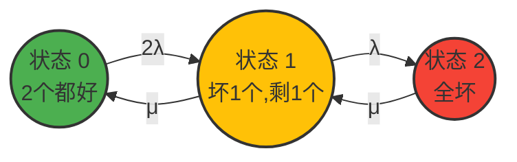

# 简答

## 什么是同步时钟协议？举例说明同步时钟协议的必要性。

**同步时钟协议（Clock Synchronization Protocol）**是分布式系统和计算机网络中用于**统一全网各个独立节点本地时钟**的一套规则和算法。

若时钟不同步，在交易时可以利用两地不同步的时钟用同一笔钱给两地转账获利。

## TMR在什么情况下比单个部件的可靠性高？TMR的MTTF是多少？

**TMR（Triple Modular Redundancy，三模冗余）** 是一种经典的容错技术。它通过将同一个部件复制三份（三个模块并行工作），并将它们的输出送入一个**多数表决器（Voter）**。只要三个模块中至少有两个正常工作，表决器就能输出正确的结果。

#### **核心结论：**

只有当**单个模块的可靠性 $R > 0.5$**，且表决器绝对可靠（可靠度为 1）时，TMR 系统的可靠性才会高于单个部件。

#### **数学推导与边界：**

设单个模块的可靠度为 $R$（$0 \le R \le 1$）。由于 TMR 满足“三选二”或“三选三”即可正常工作，根据二项分布，在不考虑表决器故障的理想情况下，TMR 系统的可靠度 $R_{TMR}$ 为：

$$R_{TMR} = \binom{3}{2} R^2(1-R) + \binom{3}{3} R^3 = 3R^2 - 2R^3$$

需要大于单个部件，即：
$$3R^2-2R^3>R$$

解得$R>0.5$

### TMR 的 MTTF 是多少？

**MTTF（Mean Time To Failure，平均无故障时间）** 是可靠度函数 $R(t)$ 在 $0$ 到 $\infty$ 时间段内的积分。

假设单个模块的故障率恒定为 $\lambda$（满足指数分布），则单个模块的可靠度为 $R(t) = e^{-\lambda t}$，其单个模块的 $\text{MTTF}_{single} = \frac{1}{\lambda}$。

#### **理想表决器下 TMR 的 MTTF 计算：**

将 $R(t) = e^{-\lambda t}$ 代入 TMR 的可靠度公式中：

$$R_{TMR}(t) = 3(e^{-\lambda t})^2 - 2(e^{-\lambda t})^3 = 3e^{-2\lambda t} - 2e^{-3\lambda t}$$

对 $R_{TMR}(t)$ 进行积分求 MTTF：

$$\text{MTTF}_{TMR} = \int_{0}^{\infty} (3e^{-2\lambda t} - 2e^{-3\lambda t}) dt$$

$$\text{MTTF}_{TMR} = \frac{3}{2\lambda} - \frac{2}{3\lambda} = \frac{9 - 4}{6\lambda} = \frac{5}{6\lambda}$$

#### **对比结论：**

- 单个部件的 $\text{MTTF} = \frac{1}{\lambda} = \frac{6}{6\lambda}$。
    
- TMR 系统的 $\text{MTTF} = \frac{5}{6\lambda}$。

# 叙述三阶段提交协议，说明为什么3PC是无阻塞协议。

三阶段提交（Three-Phase Commit, 3PC）协议是对两阶段提交（2PC）协议的改良版。它通过**将 2PC 的第二阶段一拆为二**，并全面**引入超时机制**，旨在解决 2PC 协议在协调者宕机时导致的系统永久阻塞问题。

3PC 同样包含一个**协调者（Coordinator）** 和多个**参与者（Participants）**，其执行流程分为以下三个阶段：

#### **第一阶段：CanCommit 阶段**

1. **协调者询问：** 协调者向所有参与者发送 `CanCommit` 请求，询问它们是否有能力执行当前分布式事务。
    
2. **参与者试探：** 参与者根据自身状态评估是否可以执行。此时**不锁定任何本地资源**，仅作状态检查。
    
3. **反馈：** 参与者若认为没问题则返回 **Yes**，否则返回 **No**。
    

#### **第二阶段：PreCommit 阶段**

- **进入条件：** 只有当第一阶段所有参与者都返回 Yes，协调者才会发起该阶段。
    

1. **协调者预发出：** 协调者向参与者广播 `PreCommit` 请求。
    
2. **参与者锁资源：** 参与者收到后，开始执行本地事务操作，写 Redo/Undo 日志，并**锁定相关资源（锁表/锁行）**。此时参与者进入“准备提交（Prepare-to-commit，简写为 $p$ 状态）”。
    
3. **反馈：** 参与者成功进入该状态后，向协调者返回 **ACK** 确认。
    

- _(注：如果第一阶段有人投 No 或超时，协调者在此阶段会广播 Abort 中止事务。)_
    

#### **第三阶段：DoCommit 阶段**

- **进入条件：** 第二阶段所有参与者都正确返回了 ACK。
    

1. **协调者正式发出：** 协调者向所有人广播最终的 `DoCommit` 命令。
    
2. **参与者正式提交：** 参与者收到后，真正执行本地事务提交，释放第一阶段和第二阶段锁定的资源。
    
3. **反馈：** 参与者返回 **ACK**，协调者收到全网 ACK 后，分布式事务宣告彻底完成。
    

### 2. 为什么 3PC 是一个无阻塞（Non-Blocking）协议？

要理解 3PC 为何能去阻塞，我们必须使用学术上的并发集（Concurrency Set）理论来进行本质剖析。

> **非阻塞协议的根本条件：**
> 
> 系统中任何本地状态的并发集（即一个节点处于该状态时，全网其他节点可能处于的状态集合）中，**不能同时包含提交态（$c$）和中止态（$a$）**。

2PC 之所以阻塞，是因为在等待最终命令的状态 $w$ 时，其并发集同时包含了 $\{c, a\}$。一旦协调者带着已经得知的决策挂掉，存活节点由于“生死两茫茫”，不敢单边做任何决策，从而引发阻塞。

3PC 通过引入缓冲状态——**准备提交态（$p$ 状态）**，完美达成了并发集的隔离条件，从而打破了阻塞：

#### **核心解耦逻辑（并发集隔离）：**

1. **当有节点处于 $p$（Prepare-to-commit）状态时：** 全网其余节点的并发集为 $\{w, p, c\}$。**这里绝对不包含中止态 $a$**。因为能进入 $p$ 状态，说明第一阶段全票通过（没有人投 No 导致 Abort）。
    
2. **当有节点处于 $w$（CanCommit 等待）状态时：** 全网其余节点的并发集为 $\{q, w, p\}$。**这里绝对不包含提交态 $c$**。因为只有大家都在 $p$ 状态并返回 ACK 后，协调者才被允许下达真正的 $c$（Commit）。

# 计算2个部件热备份的可靠性，计算可修复时的可用性。

对于**热备份**系统：

- **故障率（Downstream）：** 备份部件在通电受热状态下待命，它与主工作部件承受着**完全相同的环境应力**。这意味着，当 2 个部件都正常时，它们都有可能损坏。因此，状态 0（两台都好）走向状态 1（坏了一台）的转移概率是 **$2\lambda$**。
    
- **修复率（Upstream）：** 修复率取决于**维修工（修复资源）的数量**。通常在工程假设中，默认系统只有**一个维修工**（单修复通道）。因此，无论坏了一台（状态 1）还是全坏了（状态 2），由于只有一个人在修，修复率始终是一倍的 **$\mu$**。
    

> 💡 **状态定义：**
> 
> - **状态 0**：2 个部件都正常（系统正常运行）。
>     
> - **状态 1**：1 个部件损坏，1 个部件正常工作（系统正常运行，处于无冗余状态）。
>     
> - **状态 2**：2 个部件全部损坏（系统崩溃/故障停机）。

#### **热备份系统的马尔可夫状态转移图 

#### 可用性 $A(t)$ 的方程组（考虑修复）

$$\begin{cases} \frac{dP_0(t)}{dt} = -(2\lambda )P_0(t) + \mu P_1(t) \\ \frac{dP_1(t)}{dt} = (2\lambda)P_0(t) - (\lambda + \mu)P_1(t) + \mu P_2(t) \\ \frac{dP_2(t)}{dt} = \lambda P_1(t) - \mu P_2(t) \end{cases}$$

其中 $A(t) = P_0(t) + P_1(t)$。
>可用性 $A$ 定义为系统处于**所有正常工作状态**的概率之和

### 可靠性 $R(t)$ 的方程组（不考虑从失效态修复）

$$\begin{cases} \frac{dP_0(t)}{dt} = -(2\lambda)P_0(t) + \mu P_1(t) \\ \frac{dP_1(t)}{dt} = (2\lambda)P_0(t) - (\lambda + \mu)P_1(t) \\ \frac{dP_2(t)}{dt} = \lambda P_1(t) \end{cases}$$

其中 $R(t) = P_0(t) + P_1(t)$，初值为 $P_0(0)=1, P_1(0)=0, P_2(0)=0$。

# 知识补充：一阶线性微分方程的通解

一阶线性微分方程的标准形式为：

$$\frac{dy}{dx} + P(x)y = Q(x)$$

其中 $P(x)$ 和 $Q(x)$ 是关于自变量 $x$ 的已知连续函数。

- 当 $Q(x) = 0$ 时，方程称为**齐次**的。
    
- 当 $Q(x) \neq 0$ 时，方程称为**非齐次**的

通解为：

$$y = e^{-\int P(x) dx} \left[ \int Q(x) e^{\int P(x) dx} dx + C \right]$$