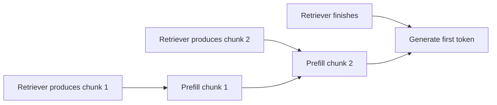
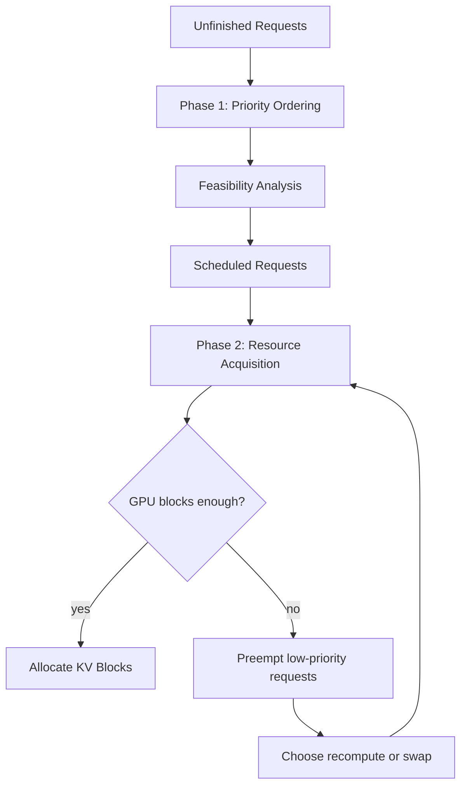

# Stream2LLM 论文笔记

论文：**Stream2LLM: Overlap Context Streaming and Prefill for Reduced Time-to-First-Token**

作者：Rajveer Bachkaniwala, Chengqi Luo, Richard So, Divya Mahajan, Kexin Rong

会议：MLSys 2026

代码：https://github.com/rajveerb/stream2llm/

## 核心问题

这篇论文关注 **带外部检索的 LLM 推理服务**。在 RAG、网页检索、向量检索等系统中，模型回答前通常需要先等待上下文检索完成。检索可能耗时数百毫秒到数秒，这会造成一个两难：

- **等待完整上下文再 prefill**：回答质量更有保障，但 Time-To-First-Token（TTFT）很高，用户感知延迟差。
- **只用部分上下文提前生成**：TTFT 下降，但可能因为上下文不完整而降低回答质量。

Stream2LLM 的核心想法是：**不要等检索全部结束，而是让检索结果以 chunk 形式流式进入推理系统，并把检索与 prefill 重叠起来**。这样，模型可以在上下文逐步到达时提前处理输入，从而降低 TTFT。

论文的关键判断是：**流式输入本身还不够**。在真实服务中有并发请求、GPU KV cache 竞争、异步 chunk 到达、输入更新和抢占，系统还需要流式感知的调度和缓存管理。

## 论文贡献

- 提出 **Stream2LLM**，在 vLLM 基础上支持并发流式输入，面向 prefill-decode 分离部署中的 prefill 实例。
- 支持两种检索输入模式：
  - **Append mode**：上下文逐步追加，典型场景是网页爬取。
  - **Update mode**：上下文集合不断被更高质量结果替换，典型场景是 ANNS 迭代检索。
- 提出 **两阶段调度架构**，把“请求优先级排序”和“GPU 资源分配/抢占”分离。
- 使用 **LCP（Longest Common Prefix）缓存失效机制**，在输入变化时只丢弃变化部分之后的 KV cache。
- 使用 **硬件感知的抢占代价模型**，在 recomputation 和 swap 之间选择更低成本的策略。
- 基于真实 crawler 和 ANNS 流式 trace 评估，最高带来约 **11x TTFT 改善**，同时保持与非流式基线相近的吞吐。

## 背景

### LLM 推理与 KV Cache

LLM 推理分为两个阶段：

- **Prefill**：一次性处理输入 tokens，计算每个位置的 Key/Value，并写入 KV cache。
- **Decode**：逐 token 自回归生成，每一步复用已有 KV cache。

对于输入序列 $x = [x_1, x_2, ..., x_n]$，prefill 会计算所有输入 token 的 KV。decode 第 $t$ 步生成新 token 时，会注意力访问之前所有 token 的 KV。

KV cache 的显存开销很大。论文给出估算：

$$
M_{KV} = 2L \ell d \frac{h_{kv}}{h} \cdot b
$$

其中：

- $L$ 是 transformer 层数。
- $\ell$ 是序列长度。
- $d$ 是隐藏维度。
- $h$ 是总 attention heads。
- $h_{kv}$ 是 KV heads。
- $b$ 是每个参数的字节数，FP16 通常为 2。

以 Llama-3.1-8B、32K token、FP16 为例，单请求 KV cache 大约需要 **4GB**。并发请求越多，显存压力越明显。

### vLLM 与 PagedAttention

vLLM 用 **PagedAttention** 把 KV cache 拆成固定大小的 block，避免为每个请求分配大块连续显存。这样可以：

- 降低显存碎片。
- 按需分配 block。
- 支持多个请求共享相同前缀的 KV block。

当显存不足时，vLLM 需要抢占请求，通常有两种方式：

- **Recomputation**：丢弃某个请求的 KV cache，之后恢复时重新 prefill。
- **Swapping**：把 KV block 从 GPU 交换到 CPU，之后恢复时再换回 GPU。

两者的代价不同。论文用如下模型比较：

$$
C_{recomp}(r) = \ell_r \cdot C_{prefill}
$$

$$
C_{swap}(r) = \left\lceil \frac{\ell_r}{k} \right\rceil \cdot \frac{M_{block}}{BW_{PCIe}}
$$

实际 swap 需要 GPU 到 CPU 和 CPU 到 GPU 两次传输，所以需要比较 $C_{recomp}(r)$ 与 $2 \cdot C_{swap}(r)$。

## 传统推理与流式推理

传统 RAG 推理会先等检索完成，再拼接最终输入：

$$
x = [D, q]
$$

因此 TTFT 近似为：

$$
T_{TTFT} = T_{retrieve} + T_{prefill}(|D| + |q|)
$$

如果检索时间占主导，TTFT 会很高。

Stream2LLM 把上下文拆成随时间到达的 chunk：

$$
d_1 \text{ at } t_1,\ d_2 \text{ at } t_2,\ ...
$$

模型不再等完整 $D$，而是在部分上下文到达时就开始 prefill，并随着新 chunk 到达继续处理。



这张图表达的是论文的核心重叠思想：检索和 prefill 不再串行，而是流水化执行。

## 两种流式模式

### Append Mode

Append mode 中，上下文单调增长：

$$
D_t \subseteq D_{t'}
$$

典型场景是网页爬取：页面陆续抓取完成，每个页面内容都可以直接追加到 prompt 中。

例子：

- $t_1$: `[c1]`
- $t_2$: `[c1, c2]`
- $t_3$: `[c1, c2, c3, q]`

这种模式下，已有前缀不变，KV cache 可以自然复用，主要问题是如何在 chunk 到达后及时调度请求。

### Update Mode

Update mode 中，检索结果会被替换或重新排序：

- $t_1$: `[c1, c2, q]`
- $t_2$: `[c1, c2', q]`
- $t_3$: `[c1', c2'', q]`

典型场景是 ANNS 迭代检索：系统先返回一个粗略 top-k，随后随着搜索深入，用更高质量候选替换旧结果。

这种模式的难点是 **cache invalidation**。如果输入变化后继续复用旧 KV，会得到错误结果；如果每次都全部丢弃，又会浪费大量计算。

## 系统挑战

论文总结了并发流式推理的几个关键挑战：

- **请求动态变化**：每个请求的输入长度随 chunk 到达而变化，输出长度也不可预测。
- **chunk 异步到达**：不同请求的 chunk 到达时间差异很大，刚收到 chunk 的请求通常应该被优先处理。
- **GPU 显存竞争**：多个请求同时保留增长中的 KV cache，显存容易不足。
- **抢占策略复杂**：显存不足时要决定抢占谁，以及选择 recomputation 还是 swap。
- **输入模式不同**：append mode 和 update mode 的 cache 复用、失效、抢占偏好不同。

## 系统设计

Stream2LLM 面向 **prefill-decode 分离架构**。论文只优化 prefill 实例，因为 TTFT 和输入处理主要发生在 prefill 阶段；decode 阶段的 TPOT 由独立 decode 实例处理。

### 两阶段调度

Stream2LLM 的核心设计是把调度拆成两个阶段：



### Phase 1：优先级排序与可行性分析

第一阶段只回答两个问题：

- 哪些请求优先级更高？
- 在当前 token budget 和 GPU block budget 下，哪些请求理论上可调度？

这个阶段不会真正分配资源，也不会修改请求状态。它会把无法调度的请求放入 `not_scheduled_reqs`，并保留其优先级信息。

### Phase 2：资源获取与自适应抢占

第二阶段才真正尝试分配 GPU KV block。如果分配失败，系统会从 `not_scheduled_reqs` 中按低优先级选择抢占对象，释放其 KV block。

抢占时，系统再根据硬件代价模型选择：

- 丢弃 KV，之后 recompute。
- swap 到 CPU，之后再 swap 回 GPU。

这个设计的好处是：调度策略只需要定义“谁更重要”，资源分配层负责“怎么腾出显存”。

### 请求生命周期

请求在三个队列间流转：

- `waiting`：已经到达但尚未调度。
- `running`：当前正在执行或已进入 batch。
- `finished`：请求完成。

如果 running 请求被抢占：

- recomputation 会重置其计算进度。
- swap 会保留其 KV，只是暂时移动到 CPU。

## KV Cache 失效机制

Stream2LLM 使用 **Longest Common Prefix（LCP）** 判断输入更新后哪些 KV 仍然有效。

假设旧输入为：

$$
[d_1, d_2, q]
$$

新输入为：

$$
[d_1, d_2', q]
$$

最长公共前缀是 $[d_1]$。系统只保留 $d_1$ 对应的 KV cache，失效并释放之后的 block，然后从 LCP 后面开始重新计算。

这种机制适合两类变化：

- append mode：新输入通常只是旧输入的扩展，LCP 很长。
- update mode：如果替换发生在后缀，LCP 仍能保留一部分缓存。

如果 update 经常改动开头部分，LCP 很短，cache 复用收益会下降。

## 硬件感知抢占

Stream2LLM 会为目标硬件离线 profile 两类函数：

- `recomputation_latency(T)`：重新 prefill $T$ 个 token 的时间。
- `swap_latency(C)`：在 GPU 和 CPU 之间移动 $C$ 个 KV block 的时间。

这些函数依赖 GPU 架构、PCIe/NVLink 带宽、prefill 性能等。论文在 A40、H100、H200 上进行了 profile，并用分段线性模型拟合。

调度器在抢占时比较 recomputation 和 swap 的预测代价，选择更低延迟的策略。

一个重要观察是：

- **Append mode** 中，已有 KV 更可能继续有效，swap 更有价值。
- **Update mode** 中，很多 KV 之后可能被失效，recomputation 往往更划算。

## 调度策略

论文实现并比较了四类策略。

| 策略 | 核心行为 | Append Mode 表现 | Update Mode 表现 |
|---|---|---|---|
| DEFAULT vLLM | 基本按到达顺序处理，不理解 chunk 到达 | 差 | 差 |
| FCFS | 完整请求和部分请求分层，层内按到达顺序 | 好 | 中等 |
| MCPS | 优先处理已计算 token 多的请求 | 好 | 差 |
| LCAS | 优先处理最近收到 chunk 的请求 | 好 | 好 |

### DEFAULT vLLM

默认 vLLM 调度器假设输入是静态的。它不关心 chunk 什么时候到达，也不关心输入是否更新。因此在流式场景下会出现：

- 新收到 chunk 的活跃请求被旧请求阻塞。
- update mode 中重计算成本没有被纳入优先级。
- 内存压力下尾延迟可能严重恶化。

### FCFS

FCFS 把请求分成两层：

- 输入已完成的 full requests。
- 仍在接收输入的 partial requests。

完整请求优先生成输出，层内按到达时间排序。它比默认 vLLM 更适合流式场景，但仍然不感知最近 chunk 到达时间和 recomputation 成本。

### MCPS

MCPS 优先处理 `num_computed_tokens` 更大的请求。它倾向于让已经做了很多计算的请求先完成。

在 append mode 中，这种策略还算合理，因为已计算 token 通常仍然有效。  
但在 update mode 中，如果输入更新导致 LCP 变短，`num_computed_tokens` 会突然下降，之前做过大量工作的请求会被降到低优先级，导致性能不稳定。

### LCAS

LCAS 按 `last_chunk_arrival_time` 排序，最近收到 chunk 的请求优先。

它的直觉是：刚收到新上下文的请求应该尽快 prefill，因为它的 KV cache 仍然热，且用户正在等待最新输入处理完成。

LCAS 在 append 和 update mode 中都表现较好。但它也有潜在问题：如果某些请求 chunk 到达不频繁，可能被持续延后。

## 实现方式

Stream2LLM 基于 vLLM v1 engine 修改，主要扩展包括：

- 在 scheduler 中识别流式请求生命周期事件：
  - 初始请求。
  - 新 chunk 到达。
  - 输入更新。
  - 输入完成。
- 在 KV cache manager 中支持：
  - LCP 计算。
  - GPU block pool。
  - CPU block pool。
  - recomputation 和 swap 两种抢占策略。
- 通过环境变量 `SCHEDULER_TYPE` 选择调度策略：
  - `DEFAULT_VLLM`
  - `FCFS`
  - `MCPS`
  - `LCAS`

论文给出的接口语义大致如下：

```python
# append mode
e.new_stream(rid="q1", ids=[query], ...)
for chunk in chunks:
    e.append(rid="q1", ids=[chunk], ...)
e.append(rid="q1", ..., finished=True)

# update mode
e.new_stream(rid="q2", ids=docs1 + [q], ...)
e.update(rid="q2", ids=docs2 + [q], ...)
e.update(rid="q2", ..., finished=True)
```

事件日志包括：

- `QUEUED`
- `SCHEDULED`
- `KV_ON_GPU`
- `PREEMPTED_SWAP`
- `PREEMPTED_RECOMPUTE`
- `FINISHED`

这些事件用于分析 TTFT、调度开销和抢占行为。

## 实验设置

论文构造了两个真实流式 workload。

### ANNS Update Mode

- 数据：Fineweb-edu corpus。
- 查询：SQuAD。
- 编码模型：e5-base-v2。
- 检索系统：DiskANN。
- 规模：500 queries。
- 平均总 tokens：13K。
- 平均检索延迟：4.5s。

这个 workload 模拟 ANNS 逐步 refinement：先返回部分候选，随后不断替换为更好的候选。

### Crawler Append Mode

- 工具：crawl4ai。
- 查询：OpenAI SimpleQA。
- 规模：4,322 queries。
- 平均总 tokens：9.1K。
- 平均检索延迟：9.9s。

这个 workload 模拟网页内容陆续抓取并追加到 prompt。

### 硬件与配置

- GPU：NVIDIA H200 141GB、H100 80GB。
- 模型：Llama-3.1-8B-Instruct。
- Tensor parallelism：2。
- GPU memory utilization：80%。
- 每轮 scheduling token budget：2048 到 8192。

### 对比方法

- **vLLM-NS**：默认 vLLM，不支持 streaming。
- **vLLM-S**：默认 vLLM 调度器，加上 streaming 支持。
- **Stream2LLM-FCFS**
- **Stream2LLM-MCPS**
- **Stream2LLM-LCAS**

评价指标：

- **TTFT**：请求到达至首 token 生成时间，衡量用户感知响应。
- **Trace Completion Time**：整个 workload 完成时间，衡量吞吐和端到端性能。

## 主要实验结果

### TTFT 改善

在 H200 上，streaming 显著改善 TTFT。

Crawler append mode：

- 低负载 QPS 0.5 到 1.0 时，streaming 相比非流式基线带来约 **3.9x 到 4.3x median TTFT 改善**。
- QPS 4.0 时，streaming 带来约 **10.8x 到 11.0x median TTFT 改善**。
- 高负载下，FCFS 和 LCAS 明显优于默认 streaming baseline；MCPS 因为不优先最近到达的页面 chunk，表现下降。

ANNS update mode：

- QPS 1.0 时，streaming schedulers 相比非流式基线有约 **2.49x 到 2.63x P95 TTFT 改善**。
- QPS 2.0 时，调度策略差异变明显：
  - FCFS 约 **2.26x P95 speedup**。
  - LCAS 约 **1.81x P95 speedup**。
  - MCPS 约 **1.53x P95 speedup**。

论文的结论是：**低负载时 streaming 架构本身贡献最大；负载升高和内存竞争增强后，调度策略变得关键。**

### 吞吐没有明显损失

论文用 trace completion time 证明：streaming 和调度优化没有牺牲整体吞吐。所有 scheduler，包括非流式基线，在不同 QPS 下的 trace completion time 曲线几乎重合。

这说明 Stream2LLM 的收益主要来自降低用户可见的 TTFT，而不是以牺牲系统吞吐为代价换来的。

### 内存压力下的表现

论文通过放大 chunk delay 制造 KV cache 内存压力：

- Crawler workload：delay 放大 10x。
- ANNS workload：delay 放大 30x。

结果显示：

- 默认 vLLM streaming 在内存压力下可能出现灾难性尾延迟，P99 甚至低于非流式 baseline。
- FCFS 和 LCAS 能显著改善尾延迟。
- 抢占策略选择很重要，recompute-only、swap-only 和 cost-based 的表现差异明显。
- Cost-based 策略通常能避免极端情况，在不同 workload 下取得更稳健表现。

### Update Mode 的 cache invalidation

ANNS workload 中，超过 10% 的请求会失效超过 **10,000 tokens**。这说明 update mode 的上下文替换确实会带来大量重计算压力。

不同调度策略的 invalidation 曲线几乎重合，说明失效行为主要由 retrieval workload 本身决定，而不是由 scheduler 决定。

### 调度开销很小

调度排序和 budget 分配的开销是微秒级：

- 50 个并发请求时，FCFS/LCAS 排序约 15 到 16 微秒，MCPS 约 12 到 13 微秒。
- 500 个请求时，P99 仍低于 165 微秒。

相比 prefill 计算，这个开销可以忽略。硬件 cost model 的离线 profile 每个 GPU 配置约 5 分钟，运行时只读取 JSON，不引入明显开销。

## 与相关工作的关系

Stream2LLM 和 AquaPipe、PipeRAG 都关注检索与推理重叠，但差别在于：

- AquaPipe 主要面向单请求 ANNS 流式 refinement，没有处理并发调度和 GPU 资源竞争。
- PipeRAG 关注检索-生成 pipeline，但不解决生产服务中的动态序列长度、抢占和 KV cache 失效问题。
- vLLM、Orca、Sarathi、FastServe 等优化 LLM serving，但基本假设输入序列在请求到达时已经固定。
- RadixAttention、Prompt Cache 等关注静态前缀共享，但没有处理动态输入更新后的 cache invalidation。

Stream2LLM 的定位是：**把 streaming input 作为生产 LLM serving 的一等公民，并补齐并发调度、抢占、KV cache 失效这些系统问题。**

## 论文结论

Stream2LLM 证明，在带检索的 LLM 服务中，**流式上下文输入可以显著降低 TTFT**。但真实并发环境下，单纯把 chunk 提前送进模型还不够，还需要：

- 流式感知的调度策略。
- 正确的动态输入 cache invalidation。
- 显存压力下的自适应抢占。
- 硬件相关的 recomputation/swap 代价模型。

论文的最终结论是：**streaming 应该成为低延迟 RAG/检索增强 LLM serving 的核心架构原语**，而不是单请求场景中的局部优化技巧。

## 个人理解

这篇论文的价值不在于“流式检索”这个想法本身，而在于它把这个想法推进到真实 serving 系统中：多个请求同时到达、输入不断变化、KV cache 显存紧张、请求可能被抢占。这些问题如果不解决，streaming 反而可能在高负载下放大尾延迟。

可以把 Stream2LLM 理解成对 vLLM 的一次“动态输入化”改造：

- 原来的 vLLM 假设 prompt 到达时基本完整。
- Stream2LLM 假设 prompt 是一个持续变化的对象。
- 因此 scheduler、cache manager、preemption policy 都必须围绕“输入还在变”重新设计。

对 RAG 系统来说，这篇论文给出的启发是：检索模块不一定要输出最终完整 context 才能交给 LLM；如果检索结果可以分阶段产生，那么推理系统也应该支持分阶段消费。真正困难的是保证这种分阶段消费在并发服务中仍然正确、高效、稳定。
