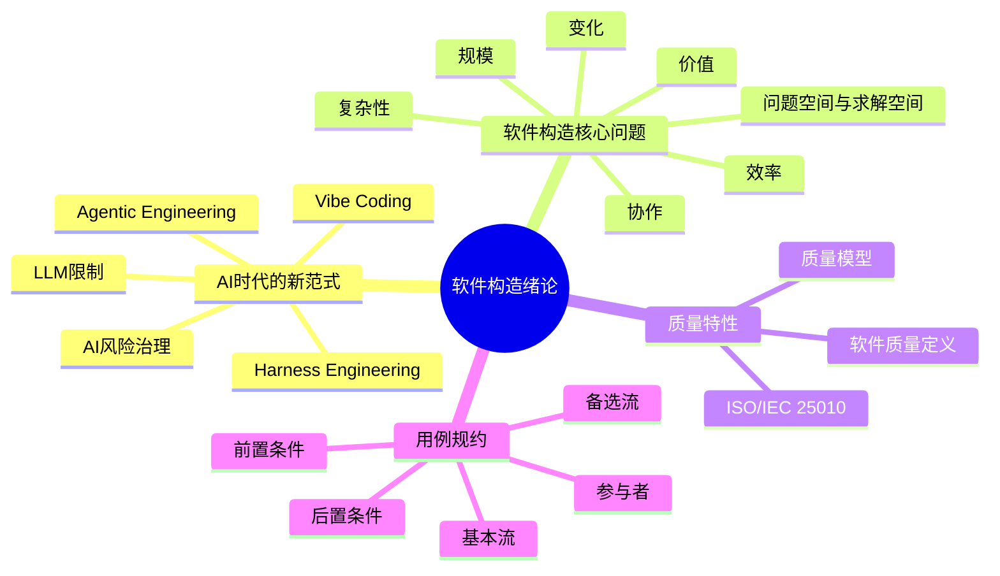
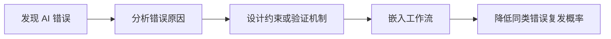
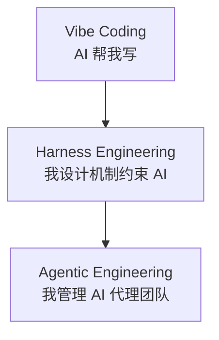
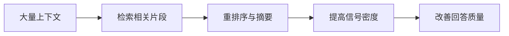
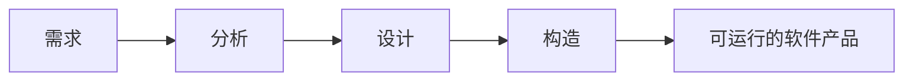
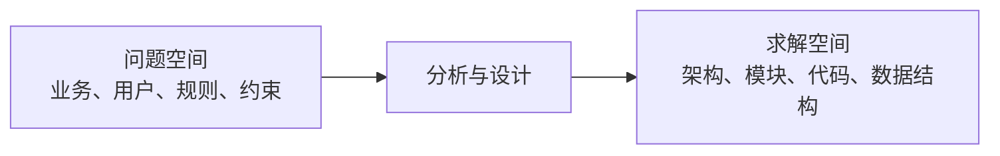
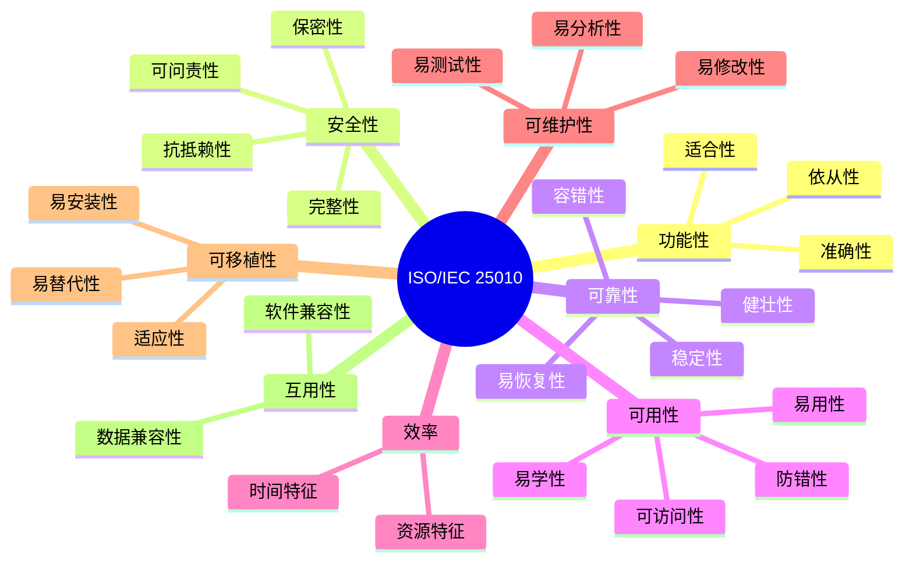
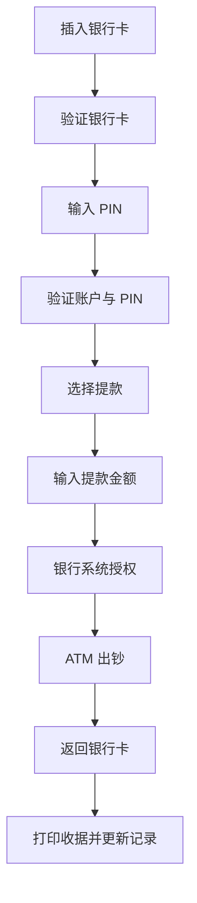
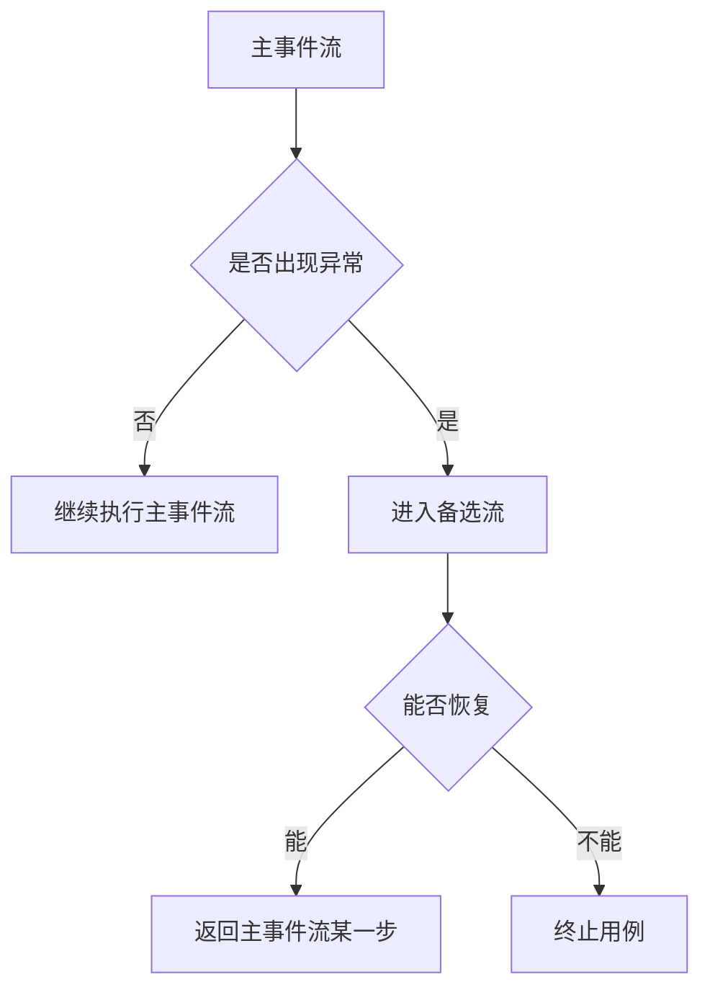

# 软件构造 绪论

## 核心脉络

本章从 **AI 时代的软件工程新范式** 切入，然后回到软件构造课程本身，说明软件构造要解决什么问题、为什么质量特性重要，以及如何用 **用例规约** 把需求表达得更工程化。

## AI 时代的软件工程新范式

### Vibe Coding

**Vibe Coding（氛围编码）** 是一种 **提示词驱动、AI 优先** 的开发方式。

- 开发者的主要工作从“键入代码”变成“描述意图”。
- AI 根据提示生成代码，开发者更多是在引导、试验和调整。
- 典型场景包括：
  - **快速原型设计**
  - **Hackathon 项目**
  - **个人临时自用软件**
  - **探索性编程**
  - **想法验证**
- 它的吸引力在于：
  - 降低技术门槛。
  - 提高生成速度。
  - 让“想到就能做出来”变得更接近现实。

**复习提示**：Vibe Coding 的关键词不是“工程可靠”，而是 **快速、轻量、试验性强**。

### Vibe Coding 的局限

当项目从“小玩具”变成“真实系统”时，Vibe Coding 的缺陷会快速暴露。

- **技术债务快速累积**
  - 代码能跑，不代表结构清晰。
  - 越到后期，越难维护、扩展和解释。
- **浅层学习陷阱**
  - 开发者可能“会演示”，但不能解释原理。
  - 容易形成对 AI 的依赖，而不是形成工程判断。
- **隐藏技术债务**
  - AI 生成代码可能低效、不安全、难测试。
  - 问题不一定在运行时立刻暴露。
- **规模失效**
  - 跨模块协作时，上下文变多，AI 更难保持一致性。
  - 单个局部功能能生成，不代表整体架构能成立。
- **基础概念不足**
  - 招聘和协作中，缺少基础概念认知会成为明显短板。

### Harness Engineering

**Harness Engineering** 的核心思想是：给 AI 设计 **缰绳** 和 **赛道**，让 AI 在可控范围内稳定产出。

- **缰绳**：约束、规则、验证、权限边界。
- **赛道**：流程、任务拆解、工具链、上下文组织。
- 核心公式可以理解为：
  - **模型 + 缰绳 = 可靠的 AI 代理**
- 核心哲学：
  - **每当发现 AI 犯错，就设计一种机制，让它以后不再犯同类错误。**

### Agentic Engineering

**Agentic Engineering** 进一步改变工程师的角色。

- 工程师不只是写代码的人，而是 **管理 AI 代理的架构师**。
- 人类负责：
  - 定义任务。
  - 拆解问题。
  - 设计流程。
  - 验收结果。
  - 控制风险。
- AI 负责：
  - 执行子任务。
  - 生成候选方案。
  - 自动化重复工作。
  - 协同完成复杂任务。

### 三种范式的对比

| 维度 | Vibe Coding | Harness Engineering | Agentic Engineering |
|---|---|---|---|
| **核心目标** | 写得快 | 管得好 | 做得对 |
| **人类角色** | 代码编写者与审核者 | 流程设计者与质量把关人 | 任务定义者与成果验收者 |
| **AI 角色** | 代码生成器与补全工具 | 自动化流水线执行引擎 | 自主协作的智能体 |
| **代码质量** | 参差不齐，可能缺乏架构深度 | 更强调可靠性与可维护性 | 以业务目标为导向，自适应优化 |
| **典型场景** | 单模块功能、脚本、小工具 | 企业级应用、DevOps 流程 | 复杂系统、多智能体协作 |
| **发展阶段** | 当前主流 | 快速发展中 | 未来愿景 |

**驾驶技术类比**：

- **Vibe Coding**：像开碰碰车，追求乐趣和快速移动，撞墙也无所谓。
- **Harness Engineering**：像造赛道和修缰绳，重点是控制方向和边界。
- **Agentic Engineering**：像赛车手或车队指挥，关注整体协同和结果。

## LLM 的技术限制

### 上下文窗口与注意力稀释

LLM 的“短期记忆”并不是无限可靠的。

- 每个新 token 都会消耗 **注意力预算**。
- 上下文越大，模型越难锁定真正关键的信息。
- **信噪比下降** 会导致输出质量下滑。

PPT 中给出的对比：

- **5K token** 窗口中有 **200 token** 相关信息：
  - 信号占比约 **4%**。
  - 模型较容易锁定事实。
- **200K token** 窗口中仍只有 **200 token** 相关信息：
  - 信号占比约 **0.1%**。
  - 信息被淹没，回答质量可能下降。

**易混点**：上下文窗口变大，不等于模型理解能力按比例变强。窗口变大也可能带来 **注意力稀释**。

### 迷失在中间效应

**迷失在中间（Lost in the Middle）** 指的是：

- 当关键信息位于上下文开头或结尾时，LLM 回答准确率较高。
- 当关键信息位于上下文中间时，检索和推理能力明显下降。
- 性能曲线呈现类似 **U 型**。

这也是 **RAG（检索增强生成）** 仍然重要的原因：

- RAG 不只是“塞更多材料”。
- 更关键的是把相关材料 **筛选出来、排到合适位置、提高信号密度**。

### 概率性与长程推理脆弱性

LLM 的输出具有 **概率性**。

- 每次响应都是新的概率计算。
- 它没有稳定、连续的“意识流”。
- 不能天然保证确定性和一致性。

长程推理中的问题：

- 多轮复杂任务里，一个小的上下文理解偏差会被后续步骤放大。
- 前面一步错了，后面可能在错误基础上继续“合理化”。
- 越长的链路越需要外部状态记录、检查点和验证机制。

### 当前解决方向

| 核心问题 | 解决策略 | 代表实践 |
|---|---|---|
| **上下文窗口过大** | 动态上下文管理、渐进式加载 | 流式处理、关键信息摘要提取 |
| **注意力稀释** | RAG 与重排序 | HyDE 等检索增强技术 |
| **长程推理脆弱** | 思维链原子化、外部记忆锚点 | MemGPT、步骤拆解、状态追踪 |
| **概率性不稳定** | 确定性围栏、自动化验证 | 代码执行沙箱、结果一致性检查 |

## AI 风险警示

### 知识产权与版权风险

AI 生成代码可能带来 **许可证合规** 和 **版权归属** 问题。

- **许可证合规事故**
  - 生成代码可能混入 GPL 等传染性许可证代码片段。
  - 企业商业软件可能因此面临被迫开源风险。
- **版权归属模糊**
  - AI 基于大量开源代码训练后生成的新代码，权利归属可能不清晰。
  - 可能涉及用户、AI 厂商、原始代码作者等多个主体。
- **典型案例**
  - GitHub Copilot 曾面临与开源许可证和开发者权利相关的集体诉讼。

### 安全风险

AI Agent 拥有 shell 权限时，能力很强，风险也很高。

- 它可以：
  - 执行命令。
  - 读取文件。
  - 修改文件。
  - 上传内容。
- 如果提示词被恶意构造，AI 可能被诱导执行危险操作。
- 多智能体协作中，一个子任务的错误可能被放大。

更广泛的安全维度包括：

- **计算机安全**：生成代码可能包含漏洞。
- **数据安全**：训练数据或上下文中的敏感信息可能泄露。
- **地理与政治安全**：AI 可能被用于攻击、欺骗、虚假信息生成。

### Agentic AI 的真实风险

**Clinejection** 攻击的核心思路：

- 攻击者在 GitHub issue 标题等输入位置注入恶意提示词。
- AI 解析任务时把恶意内容当成指令执行。
- 传统安全边界原本面向人类行为，AI 介入后信任模型被打破。

真实事故提醒：

- Claude Code 曾因开发者指令清理重复资源而误删 **2.5 年生产记录**。
- 这说明 Agent 不是“无害工具”，而是需要权限隔离、备份和审计的执行主体。

### Slopacolypse

**Slopacolypse（垃圾代码末日）** 指 AI 生成内容大量泛滥后，互联网和代码库被低质量内容污染的风险。

- AI 代码可能：
  - 看似正确，实际隐藏问题。
  - 过度抽象。
  - 堆砌死代码。
  - 盲目顺从用户错误假设。
  - 生成无人真正理解和维护的代码。
- Anthropic 的应对思路之一是 **AI 审 AI**：
  - 让 Claude Review Claude 写的代码。
  - 用多轮审查提高质量，但仍不能替代人的责任。

### 综合应对思路

| 层面 | 应对方式 |
|---|---|
| **企业层面** | 从单点防御转向生态联防；建立 AI 治理架构；核心数据不喂给未经保护的模型 |
| **技术层面** | AI 审 AI；确定性围栏；可观测性；沙箱执行；权限隔离 |
| **个人层面** | 对 AI 输出保持怀疑；核心业务逻辑人工审查；理解概率性本质 |

**复习提示**：AI 工具的核心风险不是“它会不会写代码”，而是 **它写出的东西是否可解释、可验证、可维护、可追责**。

## 软件构造的定位

### 软件构造是什么

**软件构造** 是从需求到代码的实现链路。

- 它把经过分析、设计后得到的：
  - **软件需求**
  - **设计方案**
- 转化为可运行的：
  - **软件产品**

软件构造既包含具体方法，也包含方法学，是软件工程的重要组成部分。

### 与软件工程导论的衔接

本课建立在《软件工程导论》的基础上。

- 先回顾软件工程的核心问题。
- 再进一步关注构造阶段中更容易被忽略的内容。
- 本章特别强调三个后续需要补足的方向：
  - **业务建模**
  - **质量特性**
  - **架构设计**

## 软件工程的核心问题

### 规模

软件工程的第一个核心问题是 **规模**。

- 小程序可以靠个人经验完成。
- 大系统需要：
  - 分工。
  - 协作。
  - 规范。
  - 架构。
  - 文档。
  - 质量保证。

PPT 使用 **盖房子与建筑工程** 作类比：

- 建筑施工用建筑材料分隔 **物理空间**。
- 软件开发用逻辑设施分隔 **信息空间**。

### 信息空间

**信息** 可以理解为：

- 能被人感知并表达的一切事物。
- 按香农的定义，信息是用来消除随机不确定性的东西。

软件开发本质上是在处理信息。

- **问题空间**：与待解问题相关的各种信息。
- **求解空间**：与解决方案相关的各种信息。
- 软件开发就是从 **问题空间** 到 **求解空间** 的映射。

### 复杂性

软件工程的第二个核心问题是 **复杂性**。

复杂性来源包括：

- **规模**
  - 系统越大，模块、状态、交互越多。
- **不确定性**
  - 需求、环境、用户行为都可能变化。
- **认知困境**
  - 不同角色只看到系统的一部分。

“盲人摸象”的寓言提醒我们：

- **认知的鸿沟**：不同人掌握的信息不同。
- **认知的藩篱**：专业背景限制理解。
- **认知的自大**：误以为自己看到的就是全部。
- **认知的自我设限**：过早限制问题理解方式。

### 抽象性与逻辑性

软件具有强烈的 **抽象性**。

- 想让软件“存在”，必须把想法 **物化**。
- 想让多人协作，必须把想法 **文档化**。

软件也具有 **逻辑性**。

- 软件是人的智力活动产物。
- 它更接近 **设计产物**，而不是传统制造产物。
- 代码不是把材料加工出来，而是把逻辑和规则组织出来。

### 软件退化

软件没有物理磨损，但会发生 **退化**。

- 软件不会像机器一样因摩擦自然损坏。
- 但会因为需求变化、环境变化、补丁叠加、架构腐化而变差。
- 传统硬件常用 **浴缸曲线** 描述故障率。
- 软件退化更像 **狼牙曲线**：
  - 修改一次，风险升高。
  - 修复后下降。
  - 再修改又升高。

### 变化、效率、协作、价值

软件工程还要处理以下问题：

- **变化**
  - 需求会变。
  - 技术会变。
  - 用户场景会变。
- **效率**
  - 不只是写得快，还要返工少、维护成本低。
- **协作**
  - 软件通常由多人、多角色、多组织共同完成。
- **价值**
  - 软件最终必须解决真实问题，而不是只完成技术实现。

### 两个空间

PPT 用医院预约排队系统举例：

- 业务现象属于医疗行业。
- 解决方案属于软件行业。
- 软件工程的难点在于：**由一种文化背景的人，替另一种文化背景的人创造产品。**

**复习提示**：问题空间与求解空间不是同一个东西。写代码前没有弄清问题空间，求解空间再漂亮也可能偏题。

## 质量特性与质量模型

### 软件质量

根据 ANSI/IEEE Std 729—1983，软件质量可以理解为：

- 与软件产品满足 **规定需求** 和 **隐含需求** 的能力有关的特征或特性的全体。

这里有两个重点：

- **规定需求**：用户或文档明确写出来的需求。
- **隐含需求**：用户没有明说，但合理情况下系统应该满足的要求。

例如：

- 用户可能只说“系统能登录”。
- 但隐含需求还包括：
  - 密码不能明文保存。
  - 登录失败不能泄露账户状态。
  - 高并发时不能轻易崩溃。

### 常见质量特性

GB/T 16260—2006 中提到的软件质量指标包括：

- **功能**
- **性能**
- **可用性**
- **可靠性**
- **成熟性**
- **容错性**
- **鲁棒性**
- **安全性**
- **信息安全性**
- **可修改性**
- **可变性**
- **易用性**
- **可测试性**
- **互操作性**

**易混点**：质量不是“没有 bug”这么简单。质量还包括性能、安全、可维护、可移植、易用等多个维度。

### 质量模型的作用

质量模型用于：

- **理解质量**
- **度量质量**
- **预测软件质量**
- **组织质量保证活动**

常见模型包括：

- **McCall 模型**：1977 年提出。
- **Boehm 模型**：1978 年提出。
- **ISO 9126**：1992 年提出。
- **ISO/IEC 25010**：2002 年提出。

### ISO/IEC 25010 质量模型

PPT 中列出的 ISO/IEC 25010 质量模型包含八类主特性：

| 主特性 | 子特性示例 |
|---|---|
| **功能性** | 适合性、准确性、依从性 |
| **安全性** | 保密性、完整性、抗抵赖性、可问责性、真实性 |
| **互用性** | 软件兼容性、数据兼容性、依从性 |
| **可靠性** | 稳定性、容错性、易恢复性、健壮性、依从性 |
| **可用性** | 可识别性、易学性、易用性、美观性、防错性、可访问性 |
| **效率** | 时间特征、资源特征、依从性 |
| **可维护性** | 易分析性、易修改性、修改稳定性、易测试性、自我报告 |
| **可移植性** | 适应性、易安装性、一致性、易替代性、依从性 |

## 课堂任务提示

课堂任务要求完成 **分组与选题**。

- 分组：
  - 自由组队。
  - 在学习通分组任务中进行。
  - 每组 **1-4 人**。
  - 选一名组长负责协调和提交。
- 选题：
  - 可使用 AI 辅助头脑风暴。
  - 选择一个 **中等复杂度** 的软件系统。
  - 必须有明确业务场景。
  - 至少包含 **6 个核心用例**。
  - 登录、注册不算核心用例。
  - 涉及 **前端 + 后端 + 数据存储**。
- 禁止选题：
  - 过于简单的单页面系统，例如计算器、天气查询。
  - 过于复杂的大型系统，例如完整电商平台。

**选题判断技巧**：一个好选题应该既能画出清晰业务流程，又不会大到失控。

## 用例规约

### 用例规约的基本组成

用例规约用于把一个用例的需求描述得更结构化。

常见字段包括：

- **用例名称**
- **用例标识符**
- **用例简述**
- **参与者**
  - 主要参与者
  - 次要参与者
- **前置条件**
- **主事件流**
- **后置条件**
- **备选流**

以 ATM 提款为例：

| 字段 | 内容 |
|---|---|
| **用例名称** | 提款 |
| **ID** | UC-ATM-USER-WITHDRAW |
| **简述** | 客户从有效银行账户提取特定数量的现金 |
| **主要参与者** | ATM 客户 |
| **次要参与者** | 银行系统 |
| **前置条件** | ATM 处于准备就绪状态 |
| **主事件流** | 验证 PIN、选择提款、输入金额、授权、出钞等 |
| **后置条件** | ATM 回到准备就绪状态 |
| **备选流** | 无效卡、PIN 错误、现金不足、余额不足等 |

### 参与者与条件

用例规约中不同元素的含义：

- **主要参与者**
  - 触发用例。
  - 例如 ATM 客户触发“提款”。
- **次要参与者**
  - 参与用例，但不主动触发。
  - 例如银行系统负责验证和授权。
- **前置条件**
  - 约束用例开始前的系统状态。
  - 例如 ATM 必须处于准备就绪状态。
- **后置条件**
  - 约束用例执行后的系统状态。
  - 例如 ATM 回到准备就绪状态。
- **主事件流**
  - 描述“美满结局”的步骤。
  - 即正常、成功完成用例的路径。
- **备选流**
  - 描述异常、例外、分支和失败路径。
  - 可能返回主事件流，也可能直接终止用例。

### ATM 提款基本流

ATM 提款的主事件流可以整理为：

1. **准备提款**：客户将银行卡插入 ATM 读卡机。
2. **验证银行卡**：ATM 读取账户代码，检查银行卡是否可接收。
3. **输入 PIN**：ATM 要求客户输入 4 位 PIN。
4. **验证账户代码和 PIN**：确认账户有效，PIN 正确。
5. **选择 ATM 选项**：客户选择“提款”。
6. **输入金额**：客户选择预设金额，如 100、200、500、1000 元。
7. **授权**：ATM 将卡 ID、PIN、金额、账户信息发送给银行系统。
8. **出钞**：ATM 提供现金。
9. **返回银行卡**：银行卡返还给客户。
10. **打印收据**：ATM 打印收据并更新内部记录。

### ATM 提款备选流

备选流描述“节外生枝”的路径。

| 编号 | 名称 | 触发位置 | 结果 |
|---|---|---|---|
| **WD-ALT-01** | 无效卡 | 基本流步骤 2 | 退卡，提示信息，用例终止 |
| **WD-ALT-02** | PIN 有误，重输 PIN | 基本流步骤 4 | 若仍有机会，回到步骤 3 |
| **WD-ALT-03** | PIN 有误，选退出 | 重新输入 PIN 时 | 退卡，用例终止 |
| **WD-ALT-04** | PIN 有误，吞卡退出 | 最后一次 PIN 仍错误 | ATM 保留卡，回到准备就绪状态 |
| **WD-ALT-05** | 账户有问题，退出 | 基本流步骤 4 | 显示消息，退卡，用例终止 |
| **WD-ALT-06** | 重选功能 | 基本流步骤 5 | ATM 无现金，返回步骤 5 |
| **WD-ALT-07** | 无现金，禁用提款，选退出 | 基本流步骤 5 | 退卡，用例终止 |
| **WD-ALT-08** | 现金不足，重新输入 | 基本流步骤 6 | 回到步骤 6 |
| **WD-ALT-09** | 现金不足，选退出 | 基本流步骤 6 | 退卡，用例终止 |
| **WD-ALT-10** | 余额不足，重新输入 | 基本流步骤 7 | 回到步骤 6 |
| **WD-ALT-11** | 余额不足，选退出 | 基本流步骤 7 | 退卡，用例终止 |

### 基本流与备选流关系

备选流有两类结果：

- **重新加入主事件流**
  - 例如 PIN 输入错误但还有机会，重新回到输入 PIN。
  - 例如现金不足但用户重新输入金额。
- **直接终止用例**
  - 例如无效卡。
  - 例如最后一次 PIN 错误导致吞卡。
  - 例如用户主动退出。

**复习提示**：写用例规约时，不要只写成功路径。真实系统的质量往往体现在 **异常路径是否想清楚**。

## 复习要点

- **Vibe Coding** 强调快速生成，适合探索和原型，但容易产生技术债务。
- **Harness Engineering** 强调用机制约束 AI，是从“会用 AI”到“工程化使用 AI”的关键。
- **Agentic Engineering** 强调管理 AI 代理，人类角色更像任务定义者和验收者。
- LLM 的限制主要包括：
  - **上下文窗口限制**
  - **注意力稀释**
  - **迷失在中间**
  - **概率性**
  - **长程推理脆弱性**
- AI 风险包括：
  - **版权与许可证风险**
  - **安全风险**
  - **提示词注入**
  - **垃圾代码泛滥**
- 软件构造是把 **需求和设计方案** 转化为 **可运行软件产品** 的过程。
- 软件工程核心问题包括：
  - **规模**
  - **复杂性**
  - **变化**
  - **效率**
  - **协作**
  - **价值**
  - **问题空间与求解空间**
- 软件质量不仅是“能运行”，还包括功能、安全、可靠、可用、效率、可维护、可移植、互用等维度。
- 用例规约应同时描述：
  - **主事件流**
  - **备选流**
  - **前置条件**
  - **后置条件**
  - **参与者**

## 易混点

- **Vibe Coding 与 Harness Engineering**
  - 前者关注“AI 帮我快速写”。
  - 后者关注“我如何让 AI 稳定可靠地写”。
- **上下文窗口大与效果好**
  - 大窗口不必然带来高质量。
  - 关键信息可能被噪声淹没。
- **问题空间与求解空间**
  - 问题空间属于业务与现实。
  - 求解空间属于软件设计与实现。
- **主事件流与备选流**
  - 主事件流是成功路径。
  - 备选流是异常、分支、失败或恢复路径。
- **质量与功能**
  - 功能只是质量的一部分。
  - 安全性、可靠性、可维护性同样是质量。

