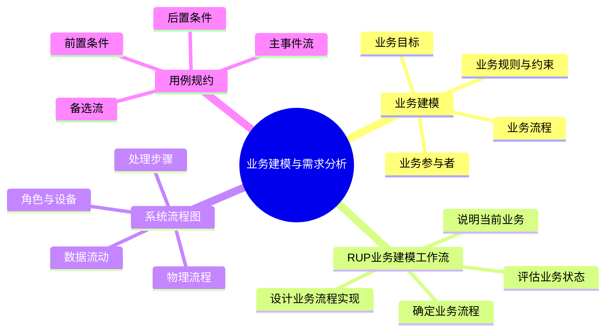
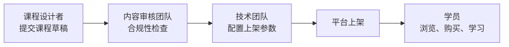
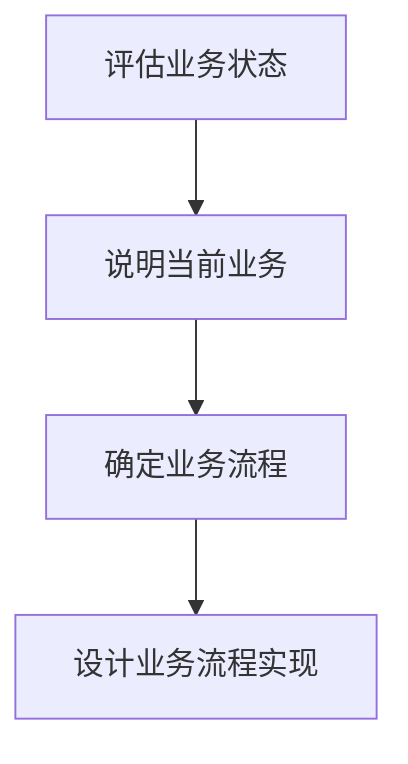
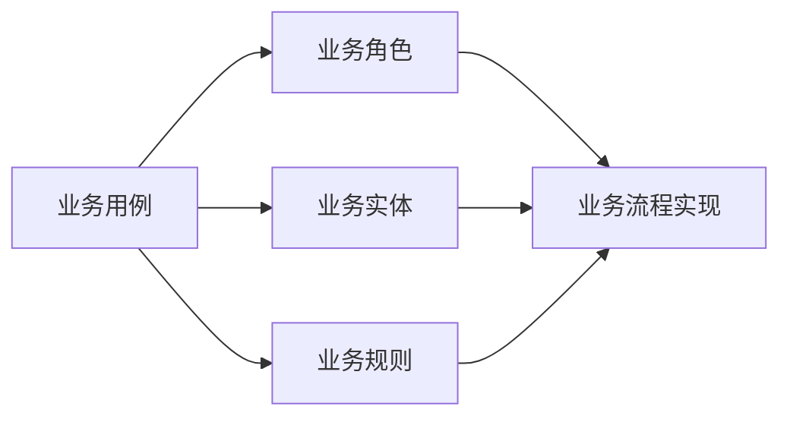
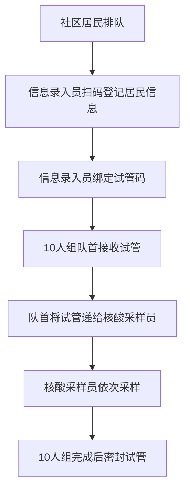
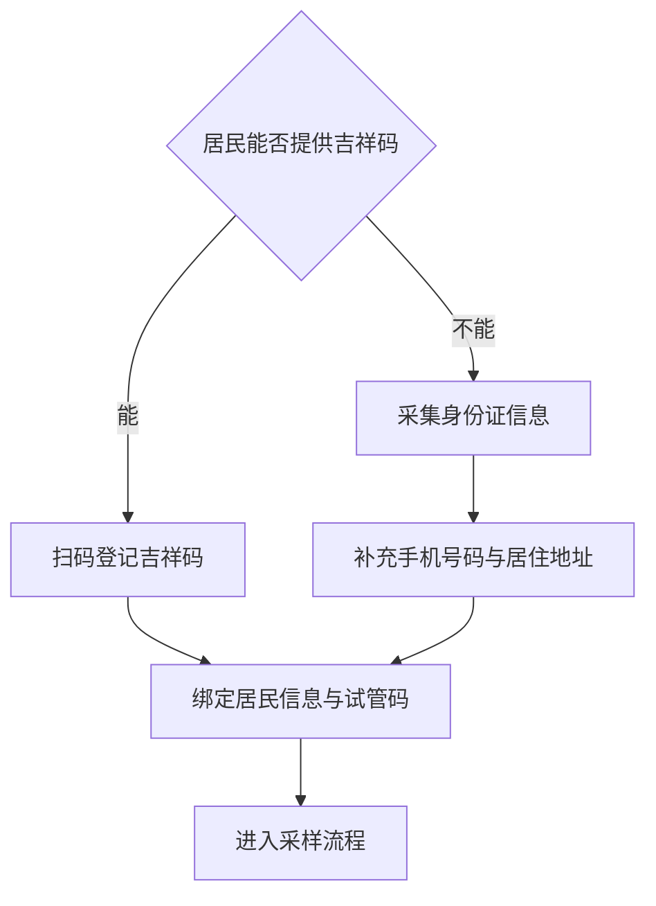
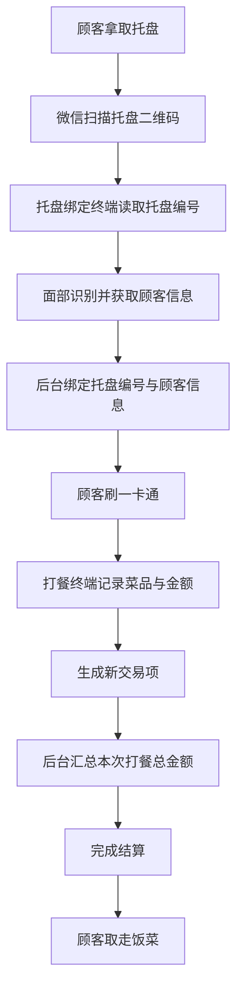
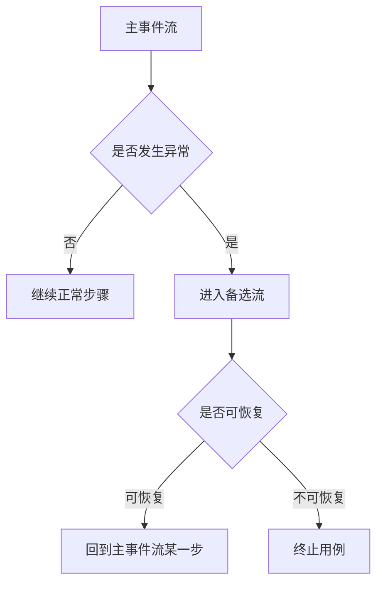
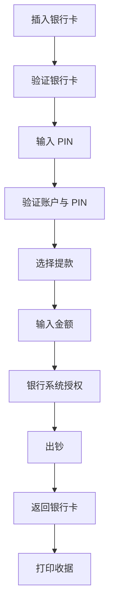

# 业务建模与需求分析

**范围**：章节二，业务建模与需求分析  
**整理方式**：按知识主题重组，重点保留业务建模框架、流程图案例和用例规约方法。

## 核心脉络

本章围绕 **需求分析之前如何理解业务** 展开。核心思想是：在写系统功能之前，先弄清组织目标、业务角色、业务流程、业务规则和约束。

## 业务建模

### 业务建模的含义

**业务建模** 旨在理解和描述组织的业务流程。

它关注的不是“软件界面怎么做”，而是：

- 组织想达成什么 **业务目标**。
- 哪些 **参与者或角色** 参与业务。
- 关键 **活动** 如何发生。
- 角色之间如何 **协作与交互**。
- 业务有哪些 **规则** 和 **约束**。

业务建模的核心输出通常包括：

- **业务目标**
- **业务参与者的职责与协作**
- **业务流程的抽象描述**
- **业务规则和约束**

**复习提示**：业务建模是系统设计的前置基础。没有业务建模，后面的需求分析容易变成“直接想功能”，从而遗漏真实业务规则。

### 在线教育平台示例

以在线教育平台的 **课程发布业务** 为例：

- **业务目标**
  - 支持课程创建、多级审核、上架销售和学员访问。
- **关键参与者**
  - 课程设计者。
  - 内容审核团队。
  - 技术团队。
  - 学员。
- **关键需求**
  - 课程设计者可提交课程草稿。
  - 内容审核团队进行合规性检查。
  - 技术团队配置课程上架参数，如定价、分类。
  - 学员可以浏览、购买并学习课程。
- **业务约束**
  - 需要支持多角色协作。
  - 流程需在 **3 个工作日内完成**。

## RUP 业务建模工作流

### 整体作用

**RUP 的业务建模工作流** 提供了一个结构化框架，用来指导如何分析业务。

它属于 **需求工程的前置阶段**，主要作用包括：

- 定义业务愿景和范围。
- 识别 **业务参与者（Business Actors）**。
- 识别 **业务用例（Business Use Cases）**。
- 通过业务对象模型描述业务流程。
- 输出业务用例图、业务活动图、业务规则文档等工件。

RUP 业务建模工作流可以概括为四个阶段：

### 评估业务状态

这个阶段的目标是 **摸清现状、对齐目标、统一方法、规范标准**。

需要完成的工作包括：

- 评估目标组织当前状态。
- 初步理解目标组织的目标。
- 选择业务建模方式。
- 制定业务建模指南。

可选建模方式包括：

- **业务用例建模**
  - 容易与系统用例建模混淆，需要特别区分。
- **BPMN**
  - 更偏向规范化业务流程表达。
- **业务流程图或系统流程图**
  - 更直观地表达流程、角色、数据和处理步骤。

### 业务建模指南

业务建模指南用于保证团队建模时口径一致。

模板内容通常包括：

- **文档目的与适用范围**
- **本次业务建模总体原则**
- **建模工具与标准语言说明**
- **核心业务术语统一字典**
- **各类视图绘制规范**
  - 用例视图。
  - 流程视图。
  - 实体视图。
- **建模产出交付物清单及标准模板**
- **建模工作节奏、分工与评审流程**
- **变更控制与版本管理规则**

**易混点**：指南不是形式主义。它解决的是多人建模时“每个人画法不同、术语不同、交付物标准不同”的问题。

### 说明当前业务

这个阶段关注 **理解当前目标组织的流程及结构**。

关键任务包括：

- 描述组织现有业务如何运行。
- 识别业务中的岗位、部门、职责和协作关系。
- 注意区分 **业务用例** 与 **系统用例**。
- 找到改进业务建模工作的目标。

### 业务用例模板

业务用例描述的是组织层面的业务目标和业务动作，不是软件系统按钮。

一个业务用例通常包含：

| 字段 | 说明 |
|---|---|
| **业务用例名称** | 体现价值导向和业务成果，可带 `<<业务用例>>` 构造型 |
| **业务参与者** | 组织中的真实业务岗位或角色，不是系统账号 |
| **业务目标** | 该业务动作要达成的业务价值或合规要求 |
| **前置业务条件** | 业务动作开始前必须完成的业务事项 |
| **后置业务条件** | 业务动作完成后的业务结果或业务状态 |
| **主业务流程** | 正常情况下完整的业务执行步骤，强调纯业务动作 |
| **业务异常或备选流程** | 业务不通过或出现问题时的处理规则 |
| **核心业务规则** | 合规要求、审核标准、权责划分等 |

**复习提示**：业务用例的核心重点是 **业务规则**。系统用例的核心重点通常是 **系统交互步骤**。

### 确定业务流程

这个阶段要让业务流程从模糊变得清楚。

需要做的事包括：

- 确定术语。
- 概述业务用例模型。
- 确定哪些业务用例需要优先详细说明。

优先详细说明的通常是：

- 风险较高的业务。
- 价值较高的业务。
- 角色协作复杂的业务。
- 规则和异常分支较多的业务。

### 设计业务流程实现

这个阶段把业务用例和实际执行链路绑定起来。

需要识别：

- **角色**
- **产品**
- **可交付工件**
- **事件**

并说明：

- 业务角色如何参与业务。
- 业务实体如何在流程中流转。
- 业务用例如何被具体实现。
- 角色、实体、用例实现之间如何绑定成完整执行链路。

## 业务用例与系统用例

### 核心区别

业务用例和系统用例最容易混淆。

| 对比维度 | 业务用例 | 系统用例 |
|---|---|---|
| **关注对象** | 组织要完成的业务结果 | 软件系统要支持的交互 |
| **参与者** | 真实业务岗位或外部业务角色 | 系统用户、外部系统、设备 |
| **动作性质** | 纯业务动作，不依赖软件界面 | 登录、查看、提交、标记等系统操作 |
| **前置条件** | 业务事项是否完成 | 系统状态、账号状态、数据状态 |
| **输出重点** | 业务价值、业务规则、业务状态 | 系统功能、交互步骤、异常处理 |

**一句话区分**：

- **业务用例**：组织要完成什么业务结果。
- **系统用例**：软件系统怎样支持用户完成操作。

### 课程合规审核业务用例

在线教育平台中，业务用例可以写成 **执行课程内容合规管控**。

- **业务参与者**
  - 内容审核专员。
  - 注意：这是业务岗位，不是系统里的“审核员账号”。
- **业务目标**
  - 完成课程内容合规核查。
  - 杜绝违规课程进入上架环节。
  - 保障平台课程合规性。
  - 规避内容风险。
  - 落实机构内容管控要求。
- **前置业务条件**
  - 授课教师已整理课程资料。
  - 资料包括课件、课程简介、资质文件、版权材料。
  - 课程资料已流转至合规审核岗位。
  - 待审核课程台账已登记。
- **主业务流程**
  - 合规审核专员接收资料并核对完整性。
  - 依据机构和行业要求逐项核查内容。
  - 核查版权资质、敏感信息、违规内容、教学内容合规性。
  - 确认符合要求后签署审核通过意见。
  - 更新课程业务状态。
  - 将课程资料移交至课程配置岗位。
- **异常流程**
  - 资料缺失：暂停审核，登记缺失项，通知补齐后重新发起。
  - 内容违规：驳回，填写违规项和整改要求。
  - 存疑复核：上报主管复核，再决定通过或驳回。
- **核心业务规则**
  - 严格遵守国家教育内容监管条例和机构内容管控细则。
  - 审核结果必须留存书面或台账记录。
  - 驳回整改后的课程必须重新走完整审核流程。
  - 审核岗位不得擅自放宽标准。

### 对应系统用例

同一业务如果落到软件系统里，就可能变成 **审核课程内容** 这个系统用例。

- **参与者**
  - 内容审核员。
- **前置条件**
  - 课程草稿已提交至系统。
  - 审核员账号正常可用。
- **主流程**
  - 审核员登录系统。
  - 查看待审核列表。
  - 核对课程资料和课程内容。
  - 标记合规或驳回。
  - 提交审核结果。
- **备选流程**
  - 驳回时填写原因。
  - 系统自动通知课程设计师。

**复习提示**：业务用例里强调“资料是否合规、谁负责、标准是什么”；系统用例里强调“用户在系统里点什么、提交什么、系统如何反馈”。

## 系统流程图

### 系统流程图的含义

**系统流程图** 是业务建模的重要工具之一，偏向描述系统的 **物理流程**。

它用于展示：

- 数据如何流动。
- 哪些处理步骤发生。
- 哪些程序、文档、数据库、人工过程参与其中。
- 现有或目标系统如何运转。

重要部件包括：

- **程序**
- **文档**
- **数据库**
- **人工过程**
- **设备**
- **数据流**

### 系统流程图的价值

系统流程图不仅用于“画流程”，更用于分析：

- 当前业务流程是否可行。
- 数据在哪里产生、传递、存储和使用。
- 哪些节点依赖人工操作。
- 哪些设备或系统参与处理。
- 流程哪里容易出错、拥堵或遗漏。
- 哪些地方存在可改进空间。

## 社区核酸采样信息收集案例

### 基本场景

PPT 用简化的社区核酸采样问题说明系统流程图的绘制过程。

重点关注：

- 涉及 **信息处理** 的流程。
- 系统流程图能表达什么。
- 哪些内容不能或不必画进系统流程图。

社区核酸采样的信息收集流程中：

- **数据采集任务主体**
  - 社区居民。
  - 信息录入员。
  - 核酸采样员。
- **需采集的数据**
  - 居民信息。
  - 与居民信息绑定的试管码。
- **需使用的数据**
  - 居民吉祥码。
  - 试管码。

### 角色与职责

| 角色 | 职责 |
|---|---|
| **信息录入员** | 给 10 人组绑定核酸采样试管；给队首发放绑定好的试管；扫码登记当前居民信息 |
| **社区居民** | 向信息录入员提供本人吉祥码；队首接过试管并递给核酸采样员 |
| **核酸采样员** | 从队首接过试管；依次为 10 位已登记居民采样；采样完成后密封试管 |

可以重构为如下流程：

### 特殊人群场景

需要考虑的特殊情况包括：

- 不会使用或没有智能手机。
- 不能提供吉祥码。
- 有交流障碍，例如听力障碍。
- 行动不便。

PPT 将其细分为三类：

- **不能提供吉祥码**
  - 需要在信息处理层面提供辅助方案。
- **可以到采样现场，但不方便长时间排队**
  - 可以在采样活动组织方案层面解决。
- **无法行动，不能到采样现场**
  - 也更适合在组织方案层面解决。

因此，系统流程图修改时重点处理 **不能提供吉祥码** 这一类。

### 数据变化

在特殊人群方案中：

- **数据采集任务主体不变**
  - 社区居民。
  - 信息录入员。
  - 核酸采样员。
- **需采集的数据不变**
  - 居民信息。
  - 与居民信息绑定的试管码。
- **需使用的数据发生变化**
  - 原本使用居民吉祥码。
  - 修改后允许使用居民身份证。
  - 也可能需要手机号码、居住地址。
  - 仍然需要试管码。

**复习提示**：流程图修改不是把所有特殊情况都塞进信息系统。要先判断问题属于 **组织方案层面** 还是 **信息处理层面**。

## 湖畔餐厅打餐流程案例

### 普通餐厅流程

一楼普通餐厅中，关键角色和设备包括：

| 角色或设备 | 职责 |
|---|---|
| **服务员** | 上菜；在刷卡终端输入需支付金额；给顾客打餐 |
| **顾客** | 向服务员点餐；在刷卡终端刷一卡通；取走饭菜 |
| **一卡通刷卡终端** | 显示并记录需支付金额；读取一卡通账号和金额；发送交易信息给后台服务器 |

关键数据：

- **需支付金额**
- **一卡通账号**
- **交易信息 = 一卡通账号 + 需支付金额**

普通餐厅的流程可概括为：

### 智慧餐厅流程

二楼智慧餐厅引入了更多设备和数据绑定关系。

关键角色和设备包括：

| 角色或设备 | 重要行为 |
|---|---|
| **托盘绑定终端** | 读取托盘编号；进行面部识别；获取顾客信息；发送托盘编号与顾客信息；显示绑定成功和余额 |
| **一卡通刷卡器** | 读取一卡通账号 |
| **打餐终端** | 显示并记录菜品信息；获取并显示交易信息；获取并显示需支付金额；发送新交易项给后台服务器 |
| **后台服务器** | 解析托盘编号与顾客信息；绑定托盘与顾客；提供交易信息；记录新交易项；完成结算 |
| **服务员** | 上菜；在打餐终端输入菜品信息 |
| **顾客** | 拿取托盘；扫码；面部识别；刷一卡通；自助打餐；取走饭菜 |

关键数据：

- **新交易项 = 托盘编号 + 需支付金额**
- **交易信息 = 一卡通账号 + 本次打餐总金额**

### 普通餐厅与智慧餐厅的对比

| 维度 | 普通餐厅 | 智慧餐厅 |
|---|---|---|
| **关键对象** | 顾客、一卡通、金额 | 顾客、托盘、一卡通、菜品、金额 |
| **设备复杂度** | 刷卡终端为主 | 托盘绑定终端、刷卡器、打餐终端、后台服务器 |
| **数据绑定** | 一卡通账号与金额绑定 | 托盘编号、顾客信息、菜品金额、账户信息多方绑定 |
| **流程风险** | 金额输入和刷卡交易 | 身份识别、托盘绑定、交易项汇总、后台结算 |
| **建模重点** | 交易信息如何生成 | 多设备、多数据如何协同 |

**复习提示**：系统流程图适合用来发现“多设备协作流程”里的弱点，例如数据绑定错位、重复录入、流程阻塞、责任边界不清。

## 用例规约

### 用例规约的组成

用例规约用于结构化描述系统需求。

常见字段包括：

- **用例名称**
- **用例标识符**
- **用例简述**
- **参与者**
- **前置条件**
- **主事件流**
- **后置条件**
- **备选流**

其中：

- **主要参与者** 触发用例。
- **次要参与者** 参与用例，但不主动触发。
- **前置条件** 约束用例开始之前的系统状态。
- **后置条件** 约束用例执行之后的系统状态。
- **主事件流** 描述成功完成用例的“美满结局”。
- **备选流** 描述异常、例外、失败或恢复路径。

### 主事件流与备选流

每个用例都有一个主事件流，并且可能有多个备选流。

备选流可能：

- 从主事件流的某一步发出。
- 从另一个备选流中发出。
- 最终返回主事件流。
- 不再返回主事件流，直接导致用例结束。

### ATM 提款用例

ATM 提款用例的基本信息：

| 字段 | 内容 |
|---|---|
| **用例名称** | 提款 |
| **ID** | UC-ATM-USER-WITHDRAW |
| **简述** | 客户从有效银行账户提取特定数量的现金 |
| **主要参与者** | ATM 客户 |
| **次要参与者** | 银行系统 |
| **前置条件** | ATM 处于准备就绪状态 |
| **后置条件** | ATM 回到准备就绪状态 |

主事件流可整理为：

1. **准备提款**：客户将银行卡插入 ATM 读卡机。
2. **验证银行卡**：ATM 读取账户代码，检查银行卡是否可接收。
3. **输入 PIN**：ATM 要求客户输入 4 位 PIN。
4. **验证账户代码和 PIN**：确认账户有效且 PIN 正确。
5. **选择 ATM 选项**：客户选择“提款”。
6. **输入金额**：客户选择预设金额，如 100、200、500、1000 元。
7. **授权**：ATM 将卡 ID、PIN、金额、账户信息发送给银行系统。
8. **出钞**：ATM 提供现金。
9. **返回银行卡**：银行卡返还。
10. **打印收据**：ATM 打印收据并更新内部记录。

### ATM 提款备选流

| 编号 | 名称 | 触发位置 | 处理结果 |
|---|---|---|---|
| **WD-ALT-01** | 无效卡 | 步骤 2 | 退卡，提示信息，用例终止 |
| **WD-ALT-02** | PIN 有误，重输 PIN | 步骤 4 | 若还有机会，回到步骤 3 |
| **WD-ALT-03** | PIN 有误，选退出 | 重输 PIN 时 | 退卡，用例终止 |
| **WD-ALT-04** | PIN 有误，吞卡退出 | 最后一次 PIN 错误 | ATM 保留卡，回到准备就绪状态 |
| **WD-ALT-05** | 账户有问题，退出 | 步骤 4 | 显示消息，退卡，用例终止 |
| **WD-ALT-06** | 重选功能 | 步骤 5 | ATM 无现金时，返回步骤 5 |
| **WD-ALT-07** | 无现金，禁用提款，选退出 | 步骤 5 | 退卡，用例终止 |
| **WD-ALT-08** | 现金不足，重新输入 | 步骤 6 | 回到步骤 6 |
| **WD-ALT-09** | 现金不足，选退出 | 步骤 6 | 退卡，用例终止 |
| **WD-ALT-10** | 余额不足，重新输入 | 步骤 7 | 回到步骤 6 |
| **WD-ALT-11** | 余额不足，选退出 | 步骤 7 | 退卡，用例终止 |

**复习提示**：备选流不是“附录”，而是需求分析中非常关键的部分。系统真正复杂的地方，常常藏在异常流程中。

## 复习要点

- **业务建模** 用于理解组织业务，而不是直接设计软件界面。
- 业务建模的核心输出包括：
  - **业务目标**
  - **业务参与者**
  - **业务流程**
  - **业务规则与约束**
- **RUP 业务建模工作流** 包括：
  - 评估业务状态。
  - 说明当前业务。
  - 确定业务流程。
  - 设计业务流程实现。
- **业务用例** 与 **系统用例** 的区别是本章重点：
  - 业务用例关注业务结果。
  - 系统用例关注系统交互。
- **系统流程图** 关注物理流程、数据流动、处理步骤和设备角色。
- 社区核酸采样案例说明：
  - 不同问题要区分组织方案层面和信息处理层面。
- 餐厅案例说明：
  - 设备越多，数据绑定关系越复杂，越需要流程建模。
- **用例规约** 要同时写清楚主事件流和备选流。

## 易混点

- **业务角色不是系统账号**
  - “内容审核专员”是业务岗位。
  - “审核员账号”才是系统层面的参与者。
- **业务流程不是系统操作流程**
  - 业务流程关注组织如何完成业务。
  - 系统操作流程关注用户如何使用软件。
- **流程图不是越全越好**
  - 系统流程图应突出信息处理和数据流动。
  - 纯组织安排、现场调度、非信息处理细节不一定要画进去。
- **备选流不是错误提示列表**
  - 它要说明异常从哪里发生、如何处理、是否回到主流程、是否终止用例。

