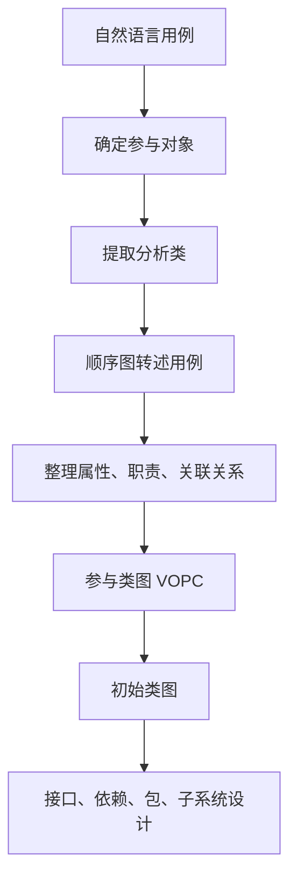
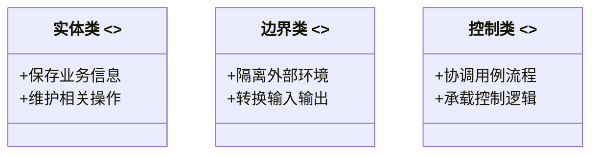
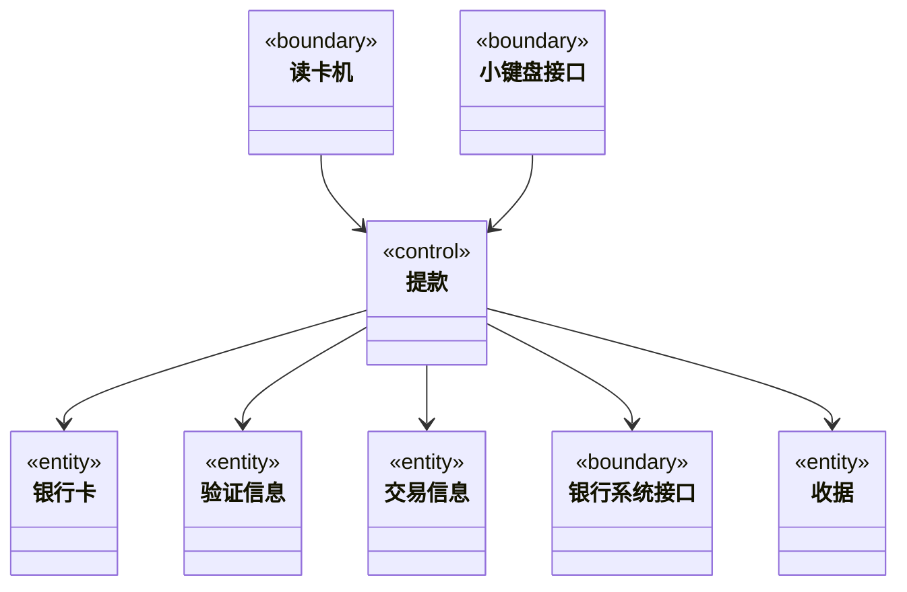
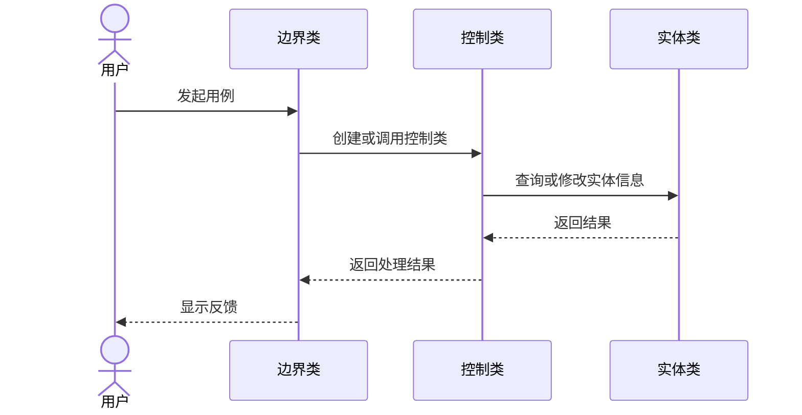
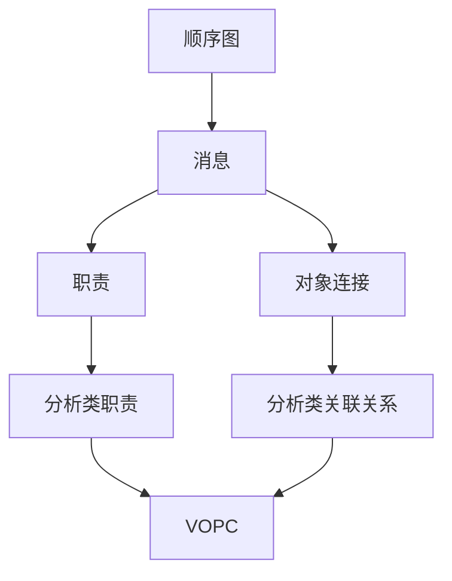
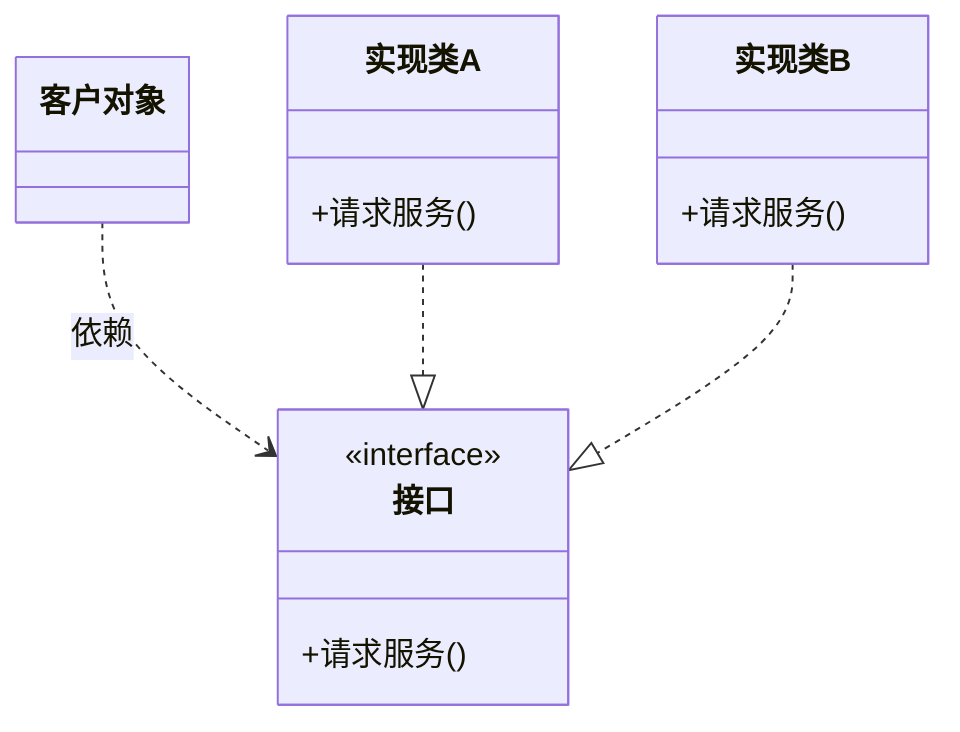
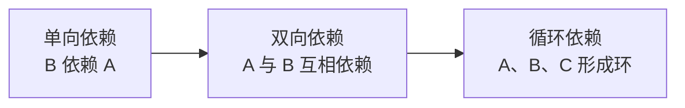
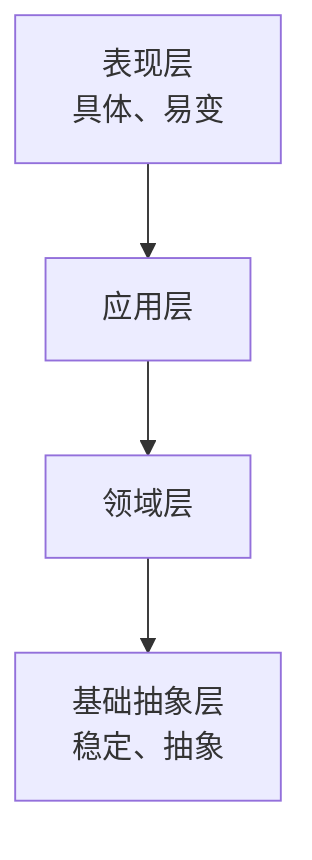
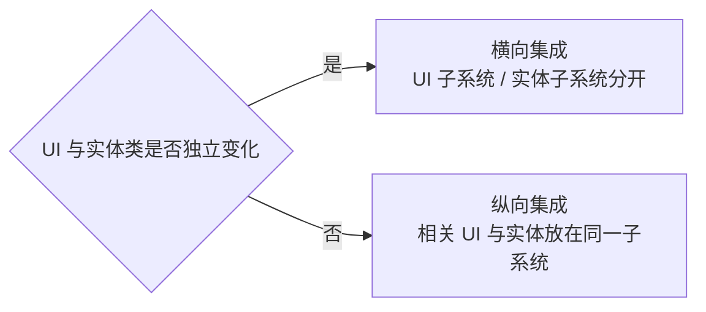
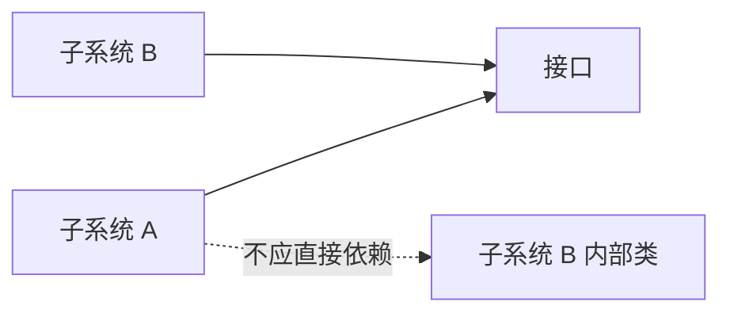

# 分析与设计

**范围**：章节三，分析与设计  
**整理方式**：按“面向对象分析 → 分析模型整理 → 子系统设计”重组。

## 核心脉络

本章讲的是从 **自然语言用例** 走向 **对象模型和设计结构** 的过程。

前半部分关注 **面向对象分析**：

- 从用例中找参与对象。
- 提取分析类。
- 用顺序图转述用例。
- 整理属性、职责、关联关系。
- 得到参与类图（VOPC）和初始类图。

后半部分关注 **设计子系统**：

- 通过接口降低耦合。
- 通过依赖规则控制复杂度。
- 通过包结构和分层组织系统。
- 通过子系统实现可替换、可部署、可演进的架构单元。

## 面向对象分析总览

### 分析活动

面向对象分析主要包括三类活动：

- **提取分析类**
  - 也叫提取分析对象。
  - 目的是捕获系统对象模型的雏形。
- **转述用例或场景**
  - 把文字描述变成对象之间的交互。
  - 常用 UML 顺序图或协作图。
- **整理分析类**
  - 确定属性、职责和关联关系。
  - 汇总成参与类图和初始类图。

**复习提示**：分析类属于 **概念层**，不是最终代码类。它更像“这个系统里有哪些重要概念、它们承担什么责任”的草图。

## 确定参与对象

### 参与对象的作用

确定每个用例中的 **参与对象**，是从自然语言用例迈向对象表示形式的第一步。

参与对象对应于 **问题空间中的主要概念**，通常会形成：

- **术语表（Glossary）**
- 最初的分析模型
- 可供用户评审的概念清单

### 参与对象的试探法

可以从用例文本中寻找这些内容：

- 开发人员或用户必须阐明的术语。
- 用例中的 **常用名词**。
- 系统需要跟踪的 **现实世界实体**。
- 系统需要跟踪的 **现实世界过程**。
- 用例本身。
- 数据来源或数据接受器。
- 接口产品。
- 总要使用的应用域术语。

### ATM 提款示例

| 参与对象类型 | 用例“提款”中的参与对象 |
|---|---|
| **用例本身** | 提款 |
| **常用名词** | 银行卡、卡 ID、账户代码、账户信息、PIN、预设金额、交易、收据 |
| **现实世界实体** | 银行卡 |
| **现实世界过程** | 验证账户代码、验证 PIN、授权、出钞、打印收据、更新内部记录 |
| **数据源或数据汇** | 读卡机、小键盘、ATM 屏幕、出钞机、收据打印机、银行系统 |
| **接口或外部系统** | 银行系统 |
| **应用域术语** | 卡 ID、账户代码、账户信息、PIN、交易、收据 |

**易混点**：参与对象不等于最终类。它只是从需求文本里先把“可能重要的概念”捞出来，后续还要筛选、归类和整理。

## 提取分析类

### 分析类的划分原则

提取分析类时，目标是尽量减小需求变化的影响。

核心原则是：

- **高内聚**
- **低耦合**

分析类通常分为三类：

- **实体类（entity）**
- **边界类（boundary）**
- **控制类（control）**

### 实体类

**实体类** 表示系统需要记录和维护的信息。

它关注：

- 必须持久保存或长期跟踪的信息。
- 与这些信息直接相关的操作。
- 问题领域中的核心概念。

实体类应该与下面两类内容 **弱耦合**：

- 系统外部环境。
- 用例特定的控制逻辑。

### 边界类

**边界类** 表示系统和外部要素之间的交互边界。

它负责：

- 描述外部环境与系统内部之间的交互。
- 翻译输入内容。
- 转换输出形式。
- 表达相应结果。
- 把实体类和控制类与外部环境隔离。

**注意**：边界类是概念层内容，不要直接等同于 UI 原型。

### 控制类

**控制类** 表示用例中特有行为的协调者。

它负责：

- 描述用例事件流中的控制行为。
- 协调实体类和边界类。
- 把实体类、边界类与某个用例特有的行为隔离开来。

控制类通常具有这样的特征：

- 一个用例通常对应一个控制类。
- 复杂用例可以分成多个控制类。
- 控制类在现实世界中通常没有直接对应物。
- 控制类常在用例开始时创建，用例结束时消失。

### 分析类提取规则

| 类别 | 提取方式 |
|---|---|
| **实体类** | 从参与对象中选取 |
| **边界类** | 通常一个参与者与用例之间的通信关联对应一个边界类 |
| **控制类** | 通常一个用例本身对应一个控制类 |

### 标识实体类的试探法

实体类可以从以下线索中寻找：

- 为理解用例必须阐明的术语。
- 用例中反复出现的名词。
- 系统需要一直跟踪的现实世界实体。
- 系统需要一直跟踪的现实世界活动。
- 用例本身背后的业务实体。
- 数据源点或终点。
- 总是使用的用户术语。

### 标识边界类的试探法

边界类可以从以下线索中寻找：

- 用户需要将数据输入系统的窗口或表格。
- 系统对用户的响应或消息。
- 外部系统接口。
- 设备接口。

边界类命名时应使用 **用户术语**，而不是实现技术术语。

### 标识控制类的试探法

控制类可以从以下线索中寻找：

- 为每个用例标识一个控制类。
- 如果用例复杂并能拆成更短事件流，可标识多个控制类。
- 可为用例中的每个参与者标识控制类。
- 控制类生命周期应是一个用例范围或用户界面范围。
- UI 原型有助于判断控制类活动的起点和终点。

### ATM 分析类示例

| 分析类类型 | 用例“提款”的分析类 |
|---|---|
| **实体类** | 银行卡、验证信息、交易信息、收据、内部记录 |
| **边界类** | 读卡机、小键盘接口、用户界面、出钞机、打印机、银行系统接口 |
| **控制类** | 提款 |

## 用例实现

### 工作目标

**用例实现** 的目标是把文字描述的用例表述为 UML 交互图。

常用形式包括：

- **顺序图**
  - 联系用例与分析类。
  - 表示用例行为如何分布在各分析类之间。
- **协作图**
  - 突出分析类之间如何连接。
  - 更强调对象之间的结构关系。

### 顺序图的试探画法

顺序图最上方对象通常按如下方式排列：

- 第一列：该用例的 **主动参与者**。
- 第二列：主动参与者与用例之间通信关联对应的 **边界类**。
- 第三列：管理该用例特定控制逻辑的 **控制类**。
- 后续列：被控制类或边界类访问的 **实体类**。

规则：

- 由初始化用例的边界类创建控制类。
- 实体类被控制类和边界类访问。
- 实体类一般不主动访问控制类和边界类。

### 顺序图如何分解用例

顺序图的价值在于把用例中的文字步骤拆成对象之间的消息。

- 顺序图明确对象的 **职责**。
- **职责** 是响应消息的能力。
- **消息** 由要求者提出。
- **职责** 由响应者承担。
- 消息把需求场景分解成更小颗粒。
- 消息本身会映射为分析类的职责。
- 消息传递路径会初步映射为分析类之间的关联关系。

**复习提示**：顺序图不是为了画得好看，而是为了把“谁负责什么”拆清楚。

## 整理分析类

### 参与类图

整理分析类的目标是根据一系列顺序图，总结各分析类之间的关系，形成 **参与类图**。

**参与类图（View of Participating Classes，VOPC）** 的特点：

- 以用例为单位汇总。
- 确定参与某个用例的分析类。
- 确定分析类的职责。
- 确定分析类之间的关联关系。
- 之后可综合出子系统和整个系统的初始类图。

整理分析类的主要工作：

- **确定分析类的属性**
- **确定分析类的职责**
- **确定分析类之间的关联关系**

### 确定属性

分析类主要依赖两方面知识：

- 分析类自身具有的信息，即 **属性**。
- 分析类指向其他分析类的 **关联关系**。

属性的作用：

- 让分析类实例拥有必要知识。
- 支撑它履行职责。
- 在逻辑上解释为什么这个类能完成某些任务。

这里讨论的是狭义属性：

- 分析类自身具有的简单信息。
- 类型通常是字符串、整型、布尔型等简单数据类型。
- 分析阶段属性是相对粗略的，不必过早纠结实现细节。

确定属性的工作主要围绕 **实体类** 展开：

- 扫描用例的事件流描述。
- 通过分析类职责间接获取属性。
- 给属性起简短名词。
- 对含义复杂的属性附加上下文说明。

### 确定职责

**职责** 是分析类实例响应消息并完成特定任务的能力。

职责包括：

- 为外部对象提供必要服务。
- 维护自身信息。
- 在后续设计中演化为设计类的一个或多个操作。

确定职责包括两个动作：

- **找出职责**
  - 职责与消息对应。
  - 画顺序图时通常也会顺带发现职责。
- **简要描述职责**
  - 职责名称应尽量简短。
  - 可附加文字说明，描述操作逻辑和返回结果。

**易混点**：消息和职责不是一对一。多条消息可能对应同一项职责，没有必要为每条消息都定义一个新职责。

### 确定关联关系

属性和职责属于某个特定分析类，而关联关系跨越多个分析类。

参与类图用于表达：

- 一组参与特定用例的分析类。
- 它们之间的关系。
- 它们在动态交互中形成的连接。

确定关联关系的步骤：

- 建立 VOPC。
- 将所有参与该用例的分析类加入图中。
- 根据顺序图等价导出的协作图，获得参与类。
- 将协作图中对象之间的连接，转化为 VOPC 中分析类之间的关联关系。

注意：

- 完整关联关系要根据 **所有事件流** 归纳。
- 可先从基本事件流入手。
- 再用备选流验证和补充。
- 如果基本事件流已涵盖所有参与类实例，VOPC 外观上会与协作图相似。

## 分析工作的收尾

### 检查分析模型

分析模型应以 **渐进、循环、迭代** 的方式形成。

- 第一次迭代通常无法保证正确和完整。
- 模型稳定前，需要与甲方多次协商和修改。
- 模型迭代稳定后，需要进行：
  - 开发方检查。
  - 开发方与甲方联合检查。

检查重点包括：

- **正确性**
- **完整性**
- **一致性**
- **可测试性**

### 分析阶段注意事项

需要特别注意：

- 标识实体对象时，不要过早陷入属性细节。
- 标识边界对象时，只是对用户界面的粗略建模。
- 控制类通常没有现实世界对应物。
- 控制类通常随用例开始而创建，随用例结束而消失。
- 如果控制类的开始和结束难以确定，可能说明用例入口和出口条件不清晰。

### 实体类与属性

实体类和属性的界限并不总是清楚。

适合建模为 **独立实体类** 的情况：

- 该客体具有较复杂的自身行为。
- 该客体具有独立标识，可能被多个对象共享或传递。

适合建模为 **类属性** 的情况：

- 除了简单 get/set，不具备更多行为。
- 不需要独立标识。
- 仅供一类对象使用。

模型可以演化：

- 如果实体类 A 几乎没有行为，只被类 B 使用，可把 A 转成 B 的属性。
- 如果类 X 的属性 y 逐渐显现复杂行为，可把 y 独立成实体类 Y。

### 泛化与继承

分析模型清晰后，应检查分析类之间的关系。

目标：

- 把一对多、多对多的复杂关系尽量变成受限的一对一关系。
- 把概念按从特殊到一般的方式组织成 **泛化（generalization）** 层次。
- 减少关系数量，降低复杂性。

重要提醒：

- **泛化不等于继承**。
- 继承是复用属性和行为的机制。
- 分析阶段只关注概念之间的归纳关系。
- 不要用“代码复用”解释分析阶段的继承关系。
- 继承是耦合度很高的关系，设计阶段也要慎用。

**结论**：**多用聚合，少用继承。**

### 何时进入系统设计

需求活动高度迭代。

可以考虑进入系统设计的信号：

- 模型大多数修改都变成修饰性修改。
- 没有更多信息提示模型存在明显问题。
- 继续追求每个细节完全正确的代价过高。

**复习提示**：分析模型不是越细越好。过早追求细节，可能在下一次需求变更后变成无用成本。

## 接口

### 软件的空间

软件没有物理性，但架构描述中的 **空间** 同时具有逻辑含义和物理含义。

可以视作架构空间的元素包括：

- 对象。
- 类。
- 组件。
- 包。

封装、接口等原则和技术，都可以用来指导面向对象设计。

### 封装和信息隐藏

封装隐藏的是使用者无须知道的设计细节。

包括：

- 数据结构。
- 协作类或对象。
- 方法实现。
- 私有操作。

得益于封装和信息隐藏，对象构成一种受保护的 **虚拟空间**。

### 接口的意义

理想情况下，希望类和对象之间完全无耦合。

但实际程序必须有协作：

- 对象需要引用其他对象。
- 类需要知道如何调用其他对象。
- 协作者之间需要请求行为或方法。

所以必须有 **接口**。

接口设计的原则：

- **接口设计要稳固**。
- **接口实现可以变化**。
- 客户对象不应知道实现细节。
- 一个类可以支持一个或多个接口。

### 接口对架构的意义

接口是一条通道，也是一扇大门，通向被封装保护起来的虚拟空间。

接口可以属于：

- 对象实例。
- 类。
- 包。
- 逻辑组件。

架构设计的目标：

- 让各虚拟空间之间的接口尽可能简单。
- 让接口用户依赖接口，而不是依赖具体实现类。
- 让接口成为搭建系统的脚手架。

## 依赖

### 依赖的种类

一个类 B **直接依赖** 类 A，如果：

- B 以数据成员形式含有指向 A 的引用或指针。
- B 在操作中以 A 作为参数。
- B 在方法实现中引用 A。

一个类 B **间接依赖** 类 A，如果：

- B 依赖的某个类 C 依赖于 A。

常见依赖形式：

- **单向依赖**：A → B。
- **双向依赖**：A → B，B → A。
- **循环依赖**：A → B，B → C，C → A。

### 依赖的启发规则

核心规则是 **最小依赖原则**。

- 类对另一个类的依赖，应建立在最小接口上。
- 避免臃肿接口。
- 对象应尽可能少地与其他对象直接交互。
- 目标是降低耦合度、提升可维护性。

具体建议：

- 尽可能使用单向依赖。
- 避免循环依赖。
- 只有当相关类在各种情况下都一起工作时，才考虑双向或循环依赖。

**复习提示**：依赖越多，变更传播越广。设计时不是消灭所有依赖，而是让依赖更少、更清晰、更稳定。

## 包结构与系统分层

### UML 包结构

**包** 是 UML 的模型元素通用分组机制。

包的作用：

- 提供封闭的专属名字空间。
- 包内名字必须唯一，不能冲突。
- 将语义相关的模型元素组织到一起。
- 建立模型中的 **语义边界**。
- 支持并行开发和配置管理。

包与组件的区别：

| 概念 | 含义 |
|---|---|
| **包** | 逻辑分组机制，提供名字空间 |
| **组件** | 物理分组机制，更接近部署或实现单元 |

### 系统分层

每个模型元素只能从属于一个包。

包与包之间也存在依赖关系，整个系统模型可以根据包依赖形成层次结构。

期望中的系统结构：

- **抽象、稳定的类** 尽量放在底层包。
- **具体、容易变化的类** 尽量放在顶层包。
- 尽可能减少其他类对易变类的依赖。

### 处理包的循环依赖

如果包之间出现循环依赖，可以考虑：

- 将相关包合并。
- 将相关包进一步分拆。
- 重新划分职责边界。
- 抽取稳定接口，打断直接依赖。

## 子系统

### 子系统的概念

**子系统** 是一种模型元素。

它同时具有：

- **包的语义**
  - 可以包含其他模型元素。
- **类的语义**
  - 具有行为。

子系统的行为由它包含的类或其他子系统提供。

子系统实现一个或多个接口，这些接口定义子系统可以执行的行为。

### 子系统的用途

子系统可以：

- 独立预定、配置或交付。
- 在接口保持不变时独立开发。
- 在分布式计算节点上独立部署。
- 在不破坏系统其他部分的情况下独立更改。

### 如何确定子系统

| 提示 | 说明 |
|---|---|
| **注意可选性** | 如果某些协作代表可选行为，或可以删除、升级、替换，应封装为独立子系统 |
| **注意用户界面** | UI 与实体类可独立变更时，可横向拆分；二者紧密耦合时，可纵向集成 |
| **注意参与者** | 不同参与者使用的功能可分开，因为需求可能独立变化 |
| **查找耦合与内聚** | 高耦合或高内聚类可组织成子系统，沿弱耦合边界分开 |
| **注意替换性** | 不同服务级别可表示为实现同一接口的不同子系统 |
| **注意分布节点** | 如果行为必须跨节点拆分，需要拆成更小、职责更受限的子系统 |

### 横向集成与纵向集成

当 UI 和实体类相对独立时，可以 **横向集成**：

- 边界类归入一个子系统。
- 实体类归入另一个子系统。

当 UI 和实体类紧密耦合时，可以 **纵向集成**：

- 相关边界类和实体类放入共同子系统。

### 子系统与包的区别

子系统与包在语义上不同：

- **子系统**
  - 是通过一个或多个接口提供行为的包。
  - 具有行为。
  - 可以实现接口。
- **包**
  - 只是容纳模型元素的容器。
  - 本身不提供行为。

子系统依赖关系应遵循：

- 子系统不应暴露自己的内部内容。
- 子系统只应依赖其他模型元素的接口。

## 复习要点

- 面向对象分析的路径是：**参与对象 → 分析类 → 顺序图 → 职责与关系 → VOPC → 初始类图**。
- 分析类分为：
  - **实体类**
  - **边界类**
  - **控制类**
- 实体类关注系统要记录和维护的信息。
- 边界类隔离系统与外部环境，不等于 UI 原型。
- 控制类协调用例事件流，通常没有现实世界对应物。
- 顺序图通过 **消息** 分解用例，并帮助确定对象职责。
- VOPC 以用例为单位汇总分析类及其关联关系。
- 分析模型是迭代形成的，不应过早追求细节完美。
- **泛化不等于继承**，继承耦合度很高，设计时应慎重。
- 接口让客户对象依赖稳定抽象，而不是依赖具体实现。
- 依赖应遵循 **最小依赖原则**。
- 包是逻辑分组机制，组件是物理分组机制。
- 子系统是能通过接口提供行为的包，支持独立开发、部署和替换。

## 易混点

- **参与对象与分析类**
  - 参与对象是从用例里找出的候选概念。
  - 分析类是经过筛选和分类后的概念层对象。
- **边界类与 UI 原型**
  - 边界类表达系统边界和交互职责。
  - UI 原型表达界面视觉和交互细节。
- **消息与职责**
  - 消息是对象之间的请求。
  - 职责是接收者响应请求的能力。
  - 多条消息可能对应同一职责。
- **实体类与属性**
  - 有复杂行为或独立标识的概念更像实体类。
  - 只有简单值且只被一个类使用的概念更像属性。
- **泛化与继承**
  - 泛化是概念归纳。
  - 继承是复用机制。
  - 分析阶段不能用复用来解释泛化。
- **包与子系统**
  - 包只组织模型元素。
  - 子系统通过接口提供行为。

