# 分析与设计

本章关注从 **自然语言需求** 走向 **对象模型和设计结构** 的过程。

分析阶段的重点是理解问题空间：系统里有哪些对象、对象承担什么职责、对象之间如何协作。设计阶段则开始关注实现结构：接口如何隔离变化、依赖如何控制、包和子系统如何组织。

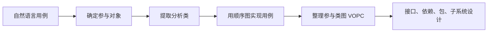

这条主线可以记成：**用例 → 对象 → 类 → 交互 → 关系 → 设计结构**。

## 面向对象分析总览

面向对象分析的核心目标是建立问题空间的对象模型。

主要活动包括：

- **确定参与对象**：从用例和术语中找出可能重要的对象。
- **提取分析类**：把参与对象整理为实体类、边界类、控制类。
- **用例实现**：用顺序图描述对象之间如何完成用例。
- **整理分析类**：补充属性、职责、关联关系，形成参与类图和初始类图。

分析类不是最终代码类。它更像一份概念层草图，用来回答“系统中有哪些重要概念”和“它们负责什么”。

## 确定参与对象

确定参与对象是从自然语言用例进入对象模型的第一步。

参与对象通常来自：

- 用例文本中反复出现的 **名词**。
- 系统必须长期跟踪的 **现实世界实体**。
- 系统必须处理的 **现实世界过程**。
- 数据来源和数据接受器。
- 外部系统和设备接口。
- 用户、开发人员或领域专家必须解释清楚的术语。

### ATM 提款示例

| 参与对象类型 | 用例“提款”中的候选对象 |
|---|---|
| 用例本身 | 提款 |
| 常用名词 | 银行卡、卡 ID、账户代码、账户信息、PIN、交易、收据 |
| 现实世界实体 | 银行卡、账户、收据 |
| 现实世界过程 | 验证银行卡、验证 PIN、授权、出钞、打印收据、更新记录 |
| 数据源或数据汇 | 读卡机、小键盘、用户界面、出钞机、打印机、银行系统 |
| 外部系统接口 | 银行系统接口 |

**注意**：参与对象只是候选概念，不等于最终分析类。后面还要筛选、分类和合并。

## 提取分析类

提取分析类的目标是把需求变化的影响限制在较小范围内。基本原则是：

- **高内聚**：一个类内部的职责应围绕同一个概念。
- **低耦合**：一个类不应过度依赖其他类的细节。

分析类通常分为三类：

- **实体类（entity）**：表示系统需要维护的信息。
- **边界类（boundary）**：表示系统和外部环境之间的交互边界。
- **控制类（control）**：表示用例内部的控制流程和协调逻辑。

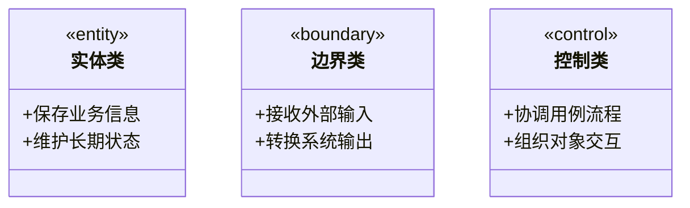

这张图对应课件中的三种分析类符号。实体类关注业务信息，边界类隔离外部交互，控制类承载用例流程。

### 分析类划分规则

| 类别 | 典型来源 | 关注点 |
|---|---|---|
| 实体类 | 参与对象中的领域概念 | 被系统记录、维护、查询的信息 |
| 边界类 | 参与者、外部系统、设备接口 | 系统边界上的输入输出 |
| 控制类 | 用例本身或复杂事件流 | 用例步骤、协调逻辑、事务流程 |

### 实体类

实体类表示系统需要长期保存或跟踪的信息。

实体类通常具备这些特征：

- 来源于问题领域中的核心概念。
- 具有业务含义，而不是纯技术含义。
- 可能需要持久化。
- 可能被多个用例共享。

实体类应尽量避免依赖外部设备、界面细节和某个用例专属流程。

### 边界类

边界类表示系统和外部世界之间的交互点。

边界类可以来自：

- 用户界面。
- 外部系统接口。
- 设备接口。
- 输入表单或输出消息。

边界类的作用是把实体类和控制类从外部环境中隔离出来。它不是 UI 原型，也不是具体按钮、页面或控件，而是概念层面的交互边界。

### 控制类

控制类表示用例中特有的控制逻辑。

控制类通常具有这些特征：

- 一个用例通常对应一个控制类。
- 复杂用例可以拆成多个控制类。
- 控制类在现实世界中通常没有直接对应物。
- 控制类常在用例开始时创建，在用例结束时消失。

控制类的存在可以避免把用例流程塞进实体类或边界类中，从而降低变化传播。

### ATM 分析类示例

| 分析类类型 | 用例“提款”的分析类 |
|---|---|
| 实体类 | 银行卡、验证信息、交易、收据、内部记录 |
| 边界类 | 读卡机接口、小键盘接口、用户界面、出钞机接口、打印机接口、银行系统接口 |
| 控制类 | 提款 |

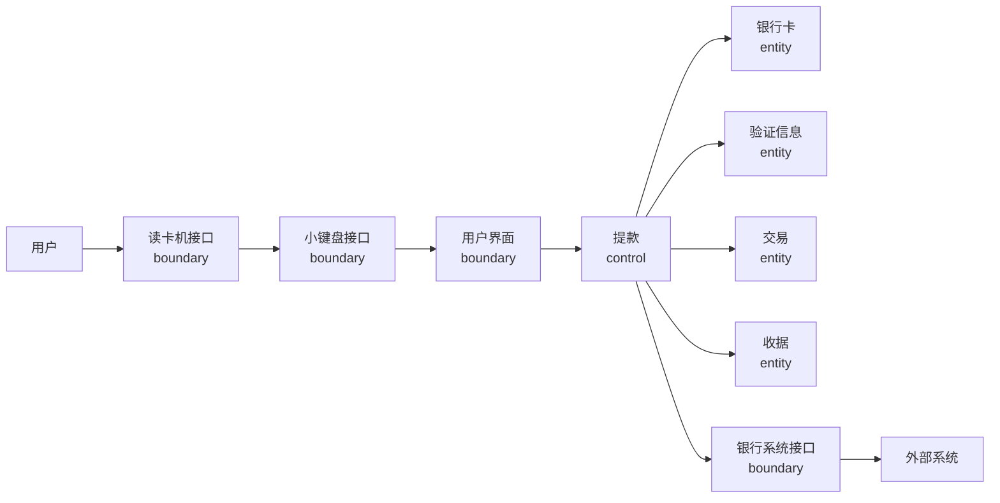

这张图复刻的是典型顺序图的对象布局：左侧是主动参与者，随后是边界类、控制类、实体类和外部系统接口。

## 用例实现

用例实现的目标是把文字描述的事件流转化为 UML 交互图。

常用交互图包括：

- **顺序图**：强调对象之间消息发生的时间顺序。
- **协作图**：强调对象之间的连接关系。

顺序图的价值不只是“画流程”，而是通过消息分配对象职责。

### 顺序图的对象布局

典型顺序图对象常按如下顺序排列：

- 第一列放 **主动参与者**。
- 第二列放主动参与者与用例之间的 **边界类**。
- 中间放管理用例流程的 **控制类**。
- 后续放被控制类访问的 **实体类**。
- 最右侧放外部系统接口和外部系统。

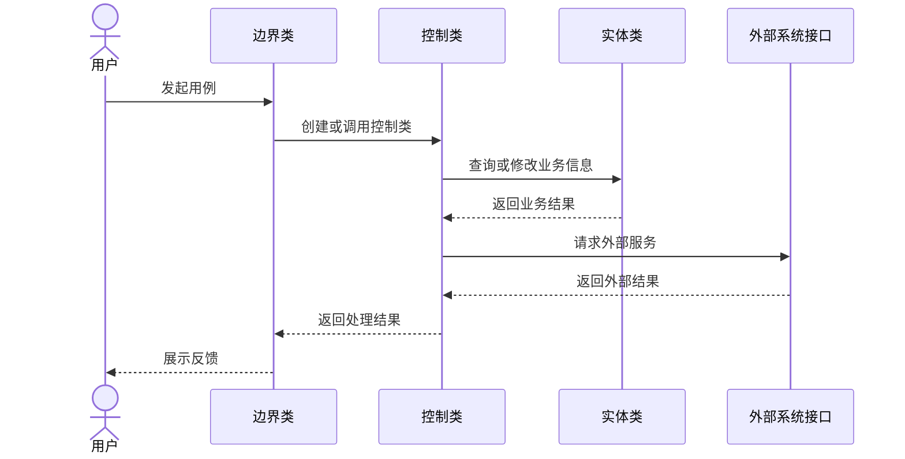

这对应课件中“用户、用户界面、控制逻辑、实体信息、外部系统接口”的排列方式。

## ATM 提款顺序图

ATM 提款用例可以拆成三段：

- **认证阶段**：读卡、获取卡信息、输入 PIN、验证账户。
- **交易阶段**：选择提款、输入金额、授权交易。
- **收尾阶段**：出钞、创建收据、打印收据、更新内部记录、退卡。

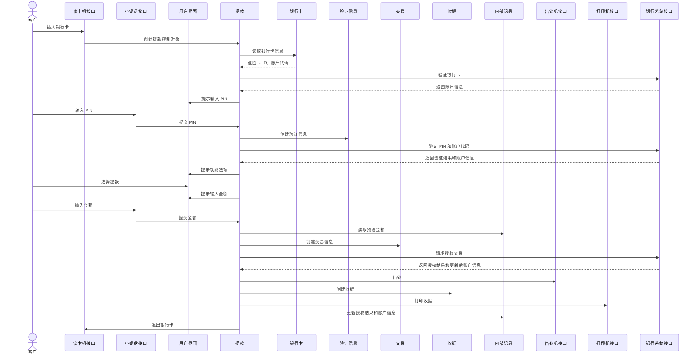

这张顺序图对应课件中的基本事件流。为了保持可读性，图中保留了主要消息，没有逐字复刻所有条件标注。

### PIN 错误备选流

课件中的备选流可以合并成一个带条件分支的顺序图。

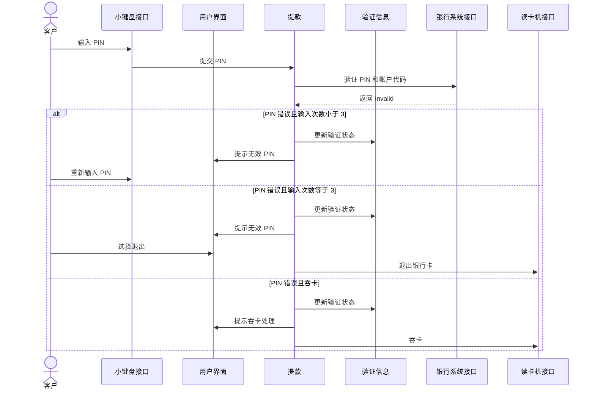

备选流的意义是补充基本事件流没有覆盖的边界情况。分析时不能只画成功路径，否则职责和关联关系会漏掉。

## 从顺序图到职责

顺序图中的每条消息都会提示一个职责。

例如：

- `提款 -> 银行卡: 读取银行卡信息` 表示 **银行卡** 应能提供卡 ID 和账户代码。
- `提款 -> 银行系统接口: 验证 PIN 和账户代码` 表示 **银行系统接口** 应能封装外部验证请求。
- `提款 -> 交易: 创建交易信息` 表示 **交易** 应保存提款金额、账户信息和授权结果。

职责不是方法签名。分析阶段只需要说明“这个对象应该能完成什么”，不必过早规定具体参数和返回值。

## 整理分析类

整理分析类的目标是把多个顺序图中的信息汇总成稳定的分析模型。

主要工作包括：

- **确定属性**：类需要知道什么信息。
- **确定职责**：类需要响应什么消息。
- **确定关联关系**：类之间为什么需要相互认识。

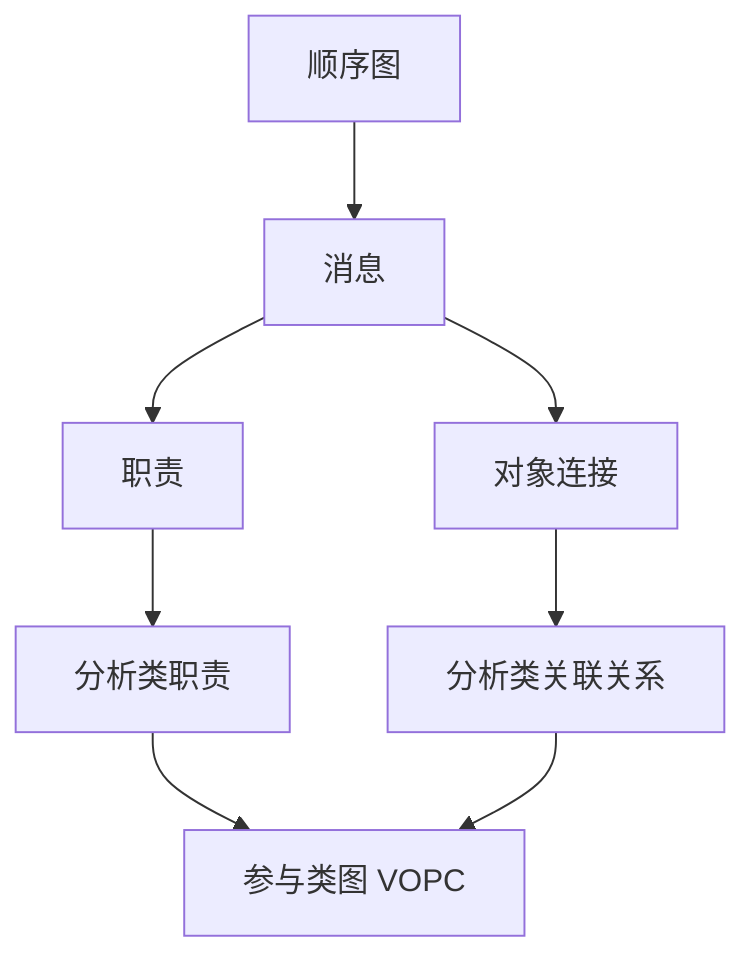

### 参与类图

参与类图（View of Participating Classes，VOPC）以用例为单位汇总分析类。

VOPC 需要表达：

- 哪些类参与了这个用例。
- 每个类承担哪些职责。
- 类之间存在哪些关联关系。
- 哪些关系来自基本流，哪些关系来自备选流。

VOPC 是从用例交互走向初始类图的桥梁。

### 确定属性

属性表示分析类实例需要知道的信息。

确定属性时可以从这些地方找：

- 用例事件流中被读取、比较、保存的信息。
- 顺序图消息中传递的参数。
- 实体类为了履行职责必须保存的状态。

分析阶段的属性应保持粗粒度，不必过早设计数据库字段或具体类型。

### 确定关联关系

关联关系来自对象之间的连接。

常见来源包括：

- 顺序图中对象之间的消息传递。
- 一个对象需要长期持有另一个对象。
- 一个对象需要通过另一个对象完成职责。

确定关联关系时要注意：

- 基本事件流可以先给出主要关系。
- 备选事件流用于补充异常路径中的关系。
- 不要把临时参数传递误判成长期关联。

## 分析模型检查

分析模型应通过迭代逐步稳定。

检查重点包括：

- **正确性**：模型是否符合需求事实。
- **完整性**：是否覆盖主要用例和备选流。
- **一致性**：不同图之间是否互相矛盾。
- **可测试性**：模型是否能支撑后续验证。

常见调整包括：

- 把行为很少、只被一个对象使用的实体类改成属性。
- 把行为复杂、具有独立标识的属性提升为实体类。
- 把过大的控制类拆成多个控制类。
- 把过度依赖的类重新划分边界。

## 泛化与继承

分析模型清晰后，可以检查类之间是否存在泛化关系。

需要区分：

- **泛化**：概念上的一般化和特殊化。
- **继承**：代码层面的复用机制。

分析阶段不要为了代码复用而建立继承关系。继承是一种高耦合关系，设计阶段也要谨慎使用。

**结论**：概念分析时可以使用泛化，但实现设计中应尽量避免滥用继承。很多情况下，聚合和组合比继承更稳定。

## 接口

接口用于隔离变化。

理想情况下，类之间不应知道彼此的实现细节。但系统必须协作，所以对象之间仍然需要一种稳定的通信方式，这就是接口。

接口设计的核心原则是：

- **客户对象依赖接口，而不是依赖实现类**。
- **接口应尽量稳定，实现可以变化**。
- **接口应保持最小，不应臃肿**。

### 供给接口与需求接口

课件中的 `Runnable` 示例可以这样理解：

- `MyThread` **实现** `Runnable`，所以 `Runnable` 是它对外提供的接口。
- `MultiJobs` **依赖** `Runnable`，所以 `Runnable` 是它需要的接口。
- 两者通过接口连接，而不是通过具体类连接。

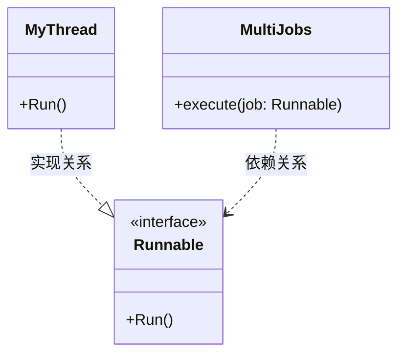

这张图复刻的是课件中的供给接口和需求接口思想。`MyThread` 提供 `Runnable`，`MultiJobs` 只要求对象满足 `Runnable`，因此调用者和实现者之间的耦合被接口削弱。

### 接口对架构的意义

接口像一扇门，通向被封装保护起来的内部空间。

接口可以属于：

- 对象。
- 类。
- 包。
- 子系统。

架构设计希望每个空间对外暴露尽量小而稳定的接口，使内部变化不轻易扩散到外部。

## 依赖

依赖表示一个模型元素需要另一个模型元素。

一个类 B **直接依赖** 类 A，通常是因为：

- B 的数据成员中保存了 A 的引用或指针。
- B 的操作参数或返回值中出现了 A。
- B 的方法实现中创建或调用了 A。

一个类 B **间接依赖** 类 A，通常是因为 B 依赖的类 C 又依赖 A。

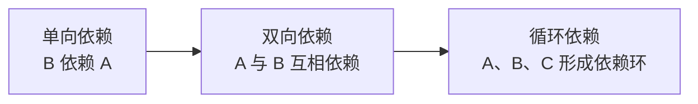

依赖控制的原则是 **最小依赖原则**：

- 类对其他类的依赖应建立在最小接口上。
- 尽量使用单向依赖。
- 避免循环依赖。
- 只有当相关类总是一起工作时，才考虑双向依赖。

依赖不是越少越好，而是越清晰、越稳定越好。

## 包结构

包是 UML 中的通用分组机制。

包的作用包括：

- 提供命名空间。
- 将语义相关的元素组织在一起。
- 建立模型边界。
- 支持并行开发和配置管理。

包和组件的区别：

| 概念 | 主要含义 |
|---|---|
| 包 | 逻辑分组机制，强调名字空间和语义边界 |
| 组件 | 物理实现或部署单元，强调可交付和可替换 |

### 包的可见性

课件中的 `Membership` 包可以整理成三层信息：

- **包外观**：只显示包名，表示一个命名空间。
- **包成员列表**：显示公有元素、私有元素和限定名。
- **包内部结构**：显示包内元素之间的关系和导入关系。

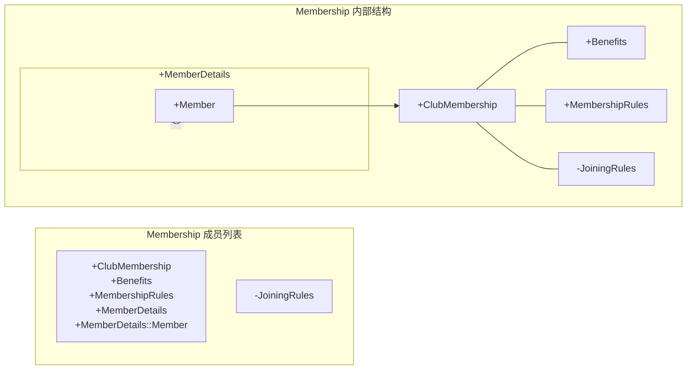

这张图复刻的是包图中的三个细节层次。`+` 表示公有元素，`-` 表示私有元素，`MemberDetails::Member` 表示限定名。

### 系统分层

包之间也存在依赖关系，因此可以根据依赖方向形成系统层次。

一般希望：

- 抽象、稳定的类放在底层。
- 具体、易变的类放在上层。
- 上层依赖下层，下层尽量不反向依赖上层。

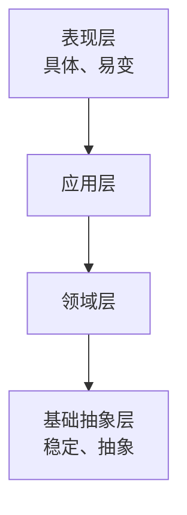

如果包之间出现循环依赖，可以考虑：

- 合并相关包。
- 拆分过大的包。
- 重新划分职责边界。
- 抽取接口打断直接依赖。

## 子系统

子系统是一种具有行为的模型元素。

它同时具有：

- **包的语义**：可以包含其他模型元素。
- **类的语义**：可以通过接口提供行为。

子系统与普通包的关键区别是：**子系统通过接口提供服务，而包只是组织元素**。

### 子系统的作用

子系统可以用于：

- 独立开发。
- 独立配置。
- 独立交付。
- 独立部署。
- 在接口不变的情况下独立替换。

### 如何确定子系统

| 线索 | 说明 |
|---|---|
| 可选性 | 可删除、升级、替换的功能适合封装为子系统 |
| 用户界面 | UI 和实体类独立变化时可以分开 |
| 参与者 | 不同参与者使用的功能可能独立变化 |
| 耦合与内聚 | 高内聚、低耦合的类群适合形成子系统 |
| 替换性 | 不同服务级别可以实现同一接口 |
| 分布节点 | 跨节点部署的行为需要更小的子系统边界 |

### 横向集成与纵向集成

当 UI 和实体类可以独立变化时，可以横向集成：

- UI 放在边界子系统。
- 实体类放在领域子系统。

当 UI 和实体类高度绑定时，可以纵向集成：

- 相关 UI、控制类、实体类放在同一子系统。

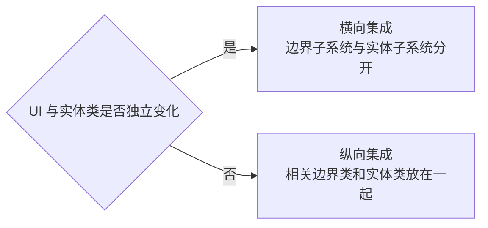

### 子系统依赖接口

子系统之间应通过接口依赖，而不是直接依赖彼此内部类。

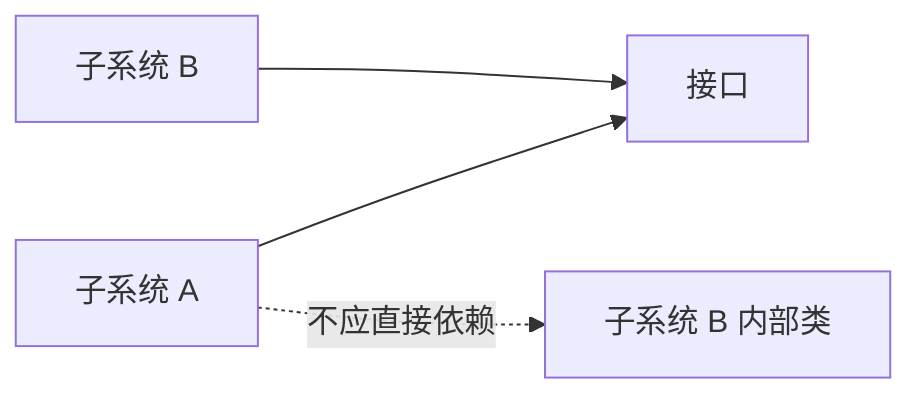

## 复习要点

- 面向对象分析的路径是：**参与对象 → 分析类 → 顺序图 → 职责与关系 → VOPC → 初始类图**。
- 分析类分为 **实体类、边界类、控制类**。
- 实体类关注系统要维护的信息。
- 边界类隔离系统与外部环境，不等于 UI 原型。
- 控制类协调用例事件流，通常没有现实世界对应物。
- 顺序图通过消息发现对象职责。
- VOPC 以用例为单位汇总分析类、职责和关联关系。
- 泛化是概念归纳，继承是代码复用机制，二者不能混用。
- 接口让客户对象依赖稳定抽象，而不是依赖具体实现。
- 依赖应遵循 **最小依赖原则**。
- 包是逻辑分组机制，组件更接近物理实现或部署单元。
- 子系统是能通过接口提供行为的包。

## 易混点

| 易混概念 | 区别 |
|---|---|
| 参与对象与分析类 | 参与对象是候选概念，分析类是经过筛选和分类后的概念层对象 |
| 边界类与 UI 原型 | 边界类表达交互职责，UI 原型表达界面细节 |
| 消息与职责 | 消息是请求，职责是接收者响应请求的能力 |
| 实体类与属性 | 有独立标识和复杂行为的更像实体类，简单值更像属性 |
| 泛化与继承 | 泛化是概念关系，继承是实现机制 |
| 包与子系统 | 包只组织元素，子系统通过接口提供行为 |
