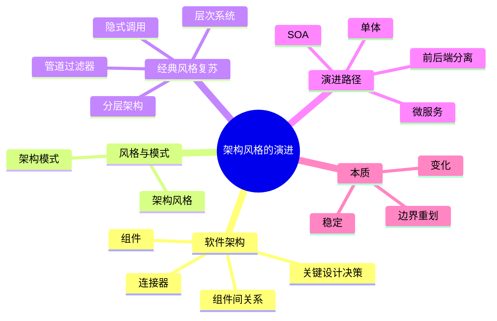
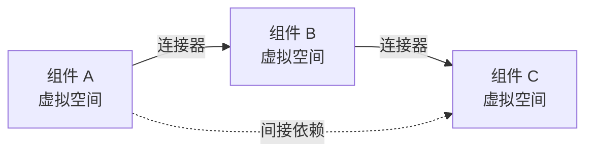
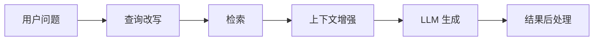
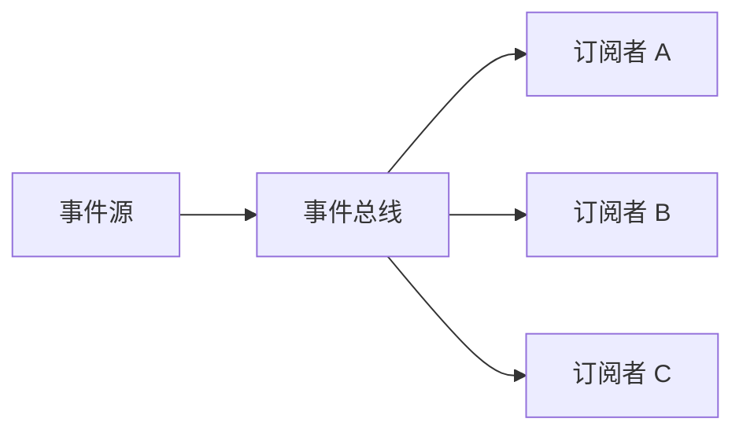
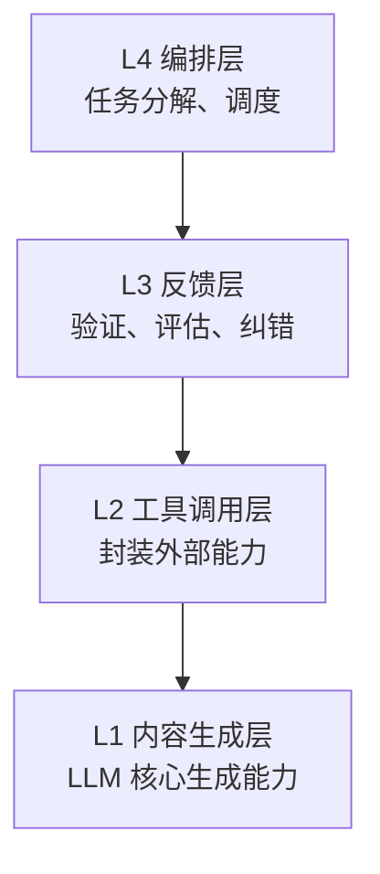
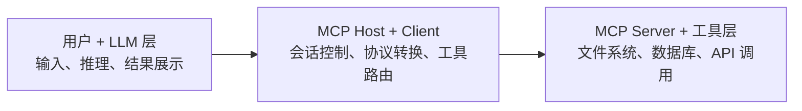
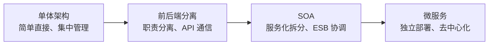
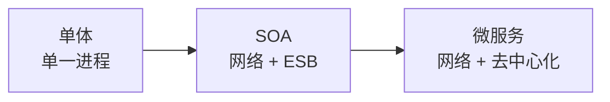
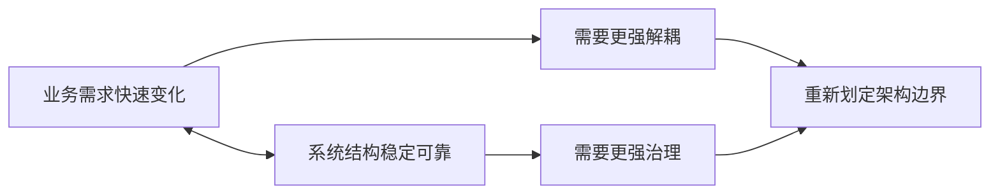

# 架构风格的演进

**范围**：章节四，架构风格的演进  
**整理方式**：按“架构定义 → 风格与模式 → 经典风格复兴 → 架构演进路径”重组。

## 核心脉络

本章讨论 **软件架构是什么**，以及架构风格为什么会随着系统规模、业务复杂度、团队规模和变更频率不断演进。

## 软件架构

### 软件架构的定义

**软件架构** 是对系统中的 **组件或子系统** 以及它们之间 **相互关系** 的描述。

也可以说，架构是软件系统的一组 **关键设计决策**。

这些决策通常：

- 定义在不同视图内。
- 涉及系统的功能特性。
- 涉及系统的非功能特性。
- 是软件设计活动的一种工作产品。

软件架构有两个核心要点：

- **组件**
  - 系统中一个被封装的部分。
- **组件间的关系**
  - 组件之间如何依赖、通信、协作。

### 组件与连接器

可以把模块、组件看成软件系统中的 **虚拟空间**。

组件间的关系也称为 **连接器（connectors）**。

连接器的作用是：

- 让不同虚拟空间之间可以互相访问。
- 让组件形成依赖关系。
- 让系统内部的信息、控制和数据流动起来。

连接器可以是：

- 具体模块。
- 本地过程调用。
- 远程过程调用。
- 网络协议。
- 消息队列。
- API。

**复习提示**：架构不只是“有哪些模块”，更重要的是 **模块之间如何连接**。同样的组件，不同连接方式会产生完全不同的系统性质。

## 架构风格与架构模式

### 基本区别

**架构风格（Architectural Style）** 是描述软件系统整体结构和组织方式的一种模式或范型。

**架构模式（Architectural Pattern）** 是在特定上下文中，针对反复出现的问题总结出的通用解决方案。

| 对比维度 | 架构风格 | 架构模式 |
|---|---|---|
| **抽象层级** | 宏观，系统整体结构的战略选择 | 中微观，针对特定问题的战术方案 |
| **关注点** | 组件类型、交互规则、架构约束 | 特定场景下的组件协作或代码组织 |
| **范围** | 通常适用于整个系统 | 可局部应用于子系统 |
| **类比** | 建筑风格，如现代主义、哥特式 | 建筑中的具体结构，如拱顶、悬臂梁 |
| **例子** | 分层架构、微服务、事件驱动、管道过滤器 | MVC、服务注册发现、发布订阅、CQRS |

### 架构风格

架构风格的本质是系统级别的 **设计哲学**。

它定义一套规则和约束，指导如何组织：

- 组件。
- 数据。
- 通信。
- 依赖。

典型特征包括：

- **有明确组件类型**
  - 例如分层架构中的层。
  - 例如微服务中的服务。
- **规定交互方式**
  - 例如分层架构的层间单向调用。
  - 例如微服务的 API 调用或事件驱动。
- **隐含设计目标**
  - 例如微服务追求独立部署。
  - 例如分层架构追求职责分离。

### 架构模式

架构模式的本质是针对特定问题的 **解决方案模板**。

它通常：

- 是某种架构风格的具体实现手段。
- 解决局部问题。
- 可复用于不同风格。
- 与技术栈无关，具体实现依赖框架。

例如：

- **MVC** 解决代码分层问题。
- **服务注册发现** 解决服务动态寻址问题。
- **发布订阅** 可用于微服务，也可用于单体系统。
- **CQRS** 将命令和查询职责分离。

**易混点**：风格回答“系统整体怎么组织”，模式回答“某类具体问题怎么解决”。

## 经典架构风格

| 架构风格 | 核心组件 | 连接件 | 约束 | 通信规则 |
|---|---|---|---|---|
| **管道过滤器** | 过滤器 | 管道 | 数据单向流动，过滤器独立无状态 | 管道传递数据流，过滤器按序处理 |
| **隐式调用风格** | 模块、过程、事件 | 事件声明、回调函数、事件总线、消息队列 | 组件仅通过事件通信，无直接依赖 | 异步触发事件，注册回调响应 |
| **层次系统风格** | 层 | 层间接口 | 每层仅调用下一层，禁止跨层调用 | 上层向下层发起请求，下层返回结果 |
| **分层架构** | 物理 Tier，如 Web 层、服务层、DB 层 | HTTP、RPC 等网络协议 | 各层独立部署，通常禁止跨物理层调用 | 跨网络请求 |

## 管道过滤器风格

### 传统定义

**管道过滤器风格** 中，数据流经一系列过滤器，并通过管道连接。

- **过滤器（Filter）** 独立处理数据。
- **管道（Pipe）** 负责传递数据流。
- 每个过滤器只关心自己的输入和输出。
- 过滤器之间尽量相互独立。

经典案例：

- Unix 命令管道。
- 编译器前端：
  - 词法分析。
  - 语法分析。
  - 语义分析。
  - 代码生成。

### AI 时代的复苏

管道过滤器风格天然适合 LLM 应用。

原因：

- LLM 的输入和输出本质上是 **文本或 Token 流**。
- 大任务可以拆成多个 LLM 调用。
- 多个步骤可以串行或并行处理。
- 每个步骤都像一个独立过滤器。

典型场景：

- **RAG 流程**
  - 查询 → 检索 → 增强 → 生成 → 输出。
- **Agent 工作流**
  - 规划 → 调用工具 → 观察结果 → 反馈循环。
- **Agent CLI**
  - 每个命令都像一个过滤器。

## 隐式调用风格

### 传统定义

**隐式调用风格** 中，组件不直接调用彼此，而是通过事件或消息间接触发。

特点：

- 调用者不知道被调用者是谁。
- 被调用者事先注册回调函数。
- 组件之间通过事件总线、消息队列或 Hook 解耦。

经典案例：

- GUI 按钮点击事件。
- 发布订阅系统。
- 消息队列。

### Agent 时代的角色

智能体的 **感知 - 思考 - 行动** 循环，本质上是事件驱动的。

Hook 和 Webhook 成为：

- 控制 LLM 行为的机制。
- 连接外部系统的机制。
- 扩展 Agent 能力的机制。

两种关键模式：

| 类型 | 适用场景 | 例子 |
|---|---|---|
| **进程内 Hook** | 大模型框架、MCP Host、Agent 本地逻辑扩展 | Prompt 预处理、工具调用管控、流式输出控制、结果后处理、生命周期监控 |
| **Webhook** | 跨系统、异步场景、分布式 Hook | Agent 异步任务通知、第三方服务集成、告警与通知 |

### AI Hook 与传统回调

| 对比维度 | 传统回调钩子 | AI 相关 Hook |
|---|---|---|
| **调用场景** | 本地进程内函数调用 | LLM 推理链路、Agent 调度、MCP 架构 |
| **核心目的** | 模块解耦、事件响应 | 控制模型输入输出、扩展模型能力 |
| **执行时机** | 绑定通用系统事件 | 绑定模型专属节点，如 Prompt、Token 流、工具调用 |
| **数据载体** | 函数指针、内存对象 | Prompt 文本、Token 流、工具调用结构体 |
| **关联架构** | 事件总线、消息队列 | MCP Host、大模型网关、智能体框架 |

## 层次系统风格

### 传统定义

**层次系统风格（Layered System）** 按抽象层次组织系统。

- 上层依赖下层。
- 下层为上层提供服务。
- 一般强调层间接口和调用方向。

经典案例：

- OSI 七层网络模型。
- 操作系统：
  - 硬件 → 驱动 → 内核 → 系统调用 → 应用。

### Harness Engineering 四层架构

Harness Engineering 的目标是：

**在确定性边界内释放 LLM 的创造力。**

它可以理解为一个从上到下约束递增的四层架构：

| 层级 | 名称 | 职责 | 示例 |
|---|---|---|---|
| **L4** | 编排层 | 任务拆解、流程调度、多 Agent 协调 | 主 Agent 分解任务，分配给子 Agent |
| **L3** | 反馈层 | 执行结果验证、质量评估、纠错 | AI 评审 AI、单元测试解析 |
| **L2** | 工具调用层 | 封装外部工具或 API，提供统一接口 | 文件操作、数据库查询、API 调用 |
| **L1** | 内容生成层 | LLM 核心生成能力 | 代码生成、文本生成、推理 |

**复习提示**：这四层不是为了限制 AI，而是为了让 AI 的创造力在可验证、可控制、可恢复的边界内发挥。

## 分层架构与 MCP

### Layer 与 Tier 的区别

这里要区分两个“层”：

- **Hierarchical Layering**
  - 同一进程内或同一系统内部的抽象层次。
  - 例如 OS 内核、OSI 七层协议栈。
- **Physical Tiering**
  - 不同物理节点、进程或部署单元。
  - 例如客户端、服务器、数据库。

**易混点**：Layer 更偏逻辑抽象，Tier 更偏物理部署。

### MCP 三层模型

**MCP（Model Context Protocol）** 是连接 AI 应用和外部系统的开源标准。

在架构上，它形成事实上的三层模型：

| 名称 | 职责 | 部署特点 |
|---|---|---|
| **用户 + LLM 层** | 用户交互、LLM 推理 | MCP 访问客户端 |
| **MCP Host + Client 层** | 协议转换、上下文管理、工具路由 | MCP 中间层，可独立部署 |
| **MCP Server + 工具层** | 实际工具执行、数据访问 | MCP 服务端，可独立扩展 |

MCP 的核心价值：

- 将 **LLM 能力边界** 与 **外部工具能力** 分离。
- 通过标准协议实现工具热插拔。
- 支持跨语言复用。
- 逐渐成为 LLM Agent 生态中的 **USB 接口**。

## 架构演进全景

架构演进的驱动力：

- **业务复杂度上升**
- **系统规模扩大**
- **团队规模扩大**
- **变更频率提高**

典型路径：

## 单体架构

### 定义

**单体架构** 将整个应用构建为一个单一、紧密结合的单元。

- 所有功能模块打包在一起。
- 部署在单个服务器上运行。
- 模块之间通常是进程内调用。

### 优点

- **开发简单**
  - IDE 支持好，调试方便。
- **部署简单**
  - 一个包，一键部署。
- **测试简单**
  - 端到端测试容易。
- **跨模块调用快**
  - 进程内调用，无网络开销。

### 适用场景

- 小规模项目。
- 代码量较小。
- 创业初期快速验证。
- 内部工具、管理后台。
- 团队规模小。

### 缺点

| 问题 | 说明 |
|---|---|
| **紧耦合** | 修改一个模块可能影响全局，代码冲突频繁 |
| **扩展性差** | 只能整体扩展，无法针对热点模块独立扩容 |
| **技术栈锁定** | 所有模块必须使用相同语言和框架 |
| **部署风险大** | 任何修改都需要重新部署整个应用 |
| **长期维护难** | 代码量膨胀后，新人难以理解和修改 |

“单体巨石”的典型症状：

- 编译或打包时间越来越长。
- 每次发布需要冻结所有开发。
- 一个小 bug 导致整个系统回滚。

## 前后端分离架构

### 背景

传统分层架构将系统分为表现层、业务层、数据层，各层垂直依赖。

随着企业应用复杂度增加，会暴露出：

- 层间依赖紧密。
- 修改某一层可能影响全局。
- 难以应对高并发或功能扩展。
- 所有功能打包为单体，部署成本高。
- 技术栈单一，限制技术选型。

### 定义

**前后端分离** 指前端和后端各自独立开发、测试和部署，通过 API 交互。

它是客户端 - 服务器风格的现代演进形态。

核心是：

- 明确划分客户端和服务器职责。
- 通过 API 定义系统交互规则。
- 通过物理隔离降低前后端耦合。

### 核心价值

| 维度 | 传统模式 | 前后端分离 |
|---|---|---|
| **开发方式** | 前端等待后端 | 并行开发 |
| **部署方式** | 一起部署 | 独立部署 |
| **技术栈** | 绑定，如 JSP + Java | 自由选择 |
| **性能** | 服务端渲染 | 静态托管 + API 调用 |

典型应用：

- 现代 Web 应用。
- 移动 App。
- 小程序生态。

## SOA

### 演进驱动力

SOA 出现的背景：

- 业务复杂度上升，单体难以支撑。
- 异构系统需要集成。
- 多个系统需要复用相同业务能力。
- 组织规模扩大，需要并行开发。

### 核心要点

**SOA（Service-Oriented Architecture）** 强调服务化拆分。

核心包括：

- **服务化拆分**
  - 按业务能力拆成独立服务。
- **松耦合**
  - 服务间通过标准接口交互。
- **ESB**
  - 企业服务总线作为服务间通信中枢。
- **接口标准化**
  - SOAP/XML、WSDL、REST 等。

### SOA 与传统分层

| 维度 | 传统分层 | SOA |
|---|---|---|
| **粒度** | 模块，进程内 | 服务，进程间 |
| **耦合度** | 紧耦合 | 松耦合 |
| **通信方式** | 本地调用 | 网络调用 + ESB |
| **复用层次** | 代码级 | 服务级 |

### SOA 的固有缺陷

SOA 的主要问题是 **过度中心化**。

| 问题 | 说明 |
|---|---|
| **ESB 成为瓶颈** | 所有流量经过 ESB，存在单点故障风险 |
| **ESB 过重** | 服务注册、发现、编排都集中在复杂中心 |
| **治理过重** | 需要复杂标准规范，如 WS-* 协议栈 |
| **扩展困难** | ESB 需要整体扩容，中小团队难以落地 |

### SOA 与微服务

| 维度 | SOA | 微服务 |
|---|---|---|
| **通信** | 重量级，ESB、SOAP | 轻量级，REST、gRPC |
| **治理** | 集中式，ESB | 去中心化 |
| **数据** | 倾向共享数据库 | 数据库 per 服务 |
| **部署** | 相对独立 | 完全独立 |

**复习提示**：SOA 为微服务铺路，但它的问题也很明显：中心太重，治理太重。

## 微服务架构

### 定义

**微服务架构** 将单一应用拆分为一组独立的小型服务。

每个服务：

- 围绕业务能力设计。
- 可独立开发。
- 可独立部署。
- 可独立扩展。
- 可独立管理数据。

服务间通过轻量级通信机制协作，例如：

- HTTP/REST。
- gRPC。
- 消息队列。

### 核心特征

| 特征 | 说明 |
|---|---|
| **单一职责** | 每个服务只做一件事，如用户服务、订单服务 |
| **独立部署** | 服务可独立发布、回滚，互不影响 |
| **轻量级通信** | HTTP/REST、gRPC，无 ESB |
| **去中心化治理** | 团队自主选型，无统一中心 |
| **技术异构性** | 不同服务可用不同语言 |
| **数据库分离** | 每个服务拥有自己的数据库 |

### 相比 SOA 的进化

| 维度 | SOA | 微服务 |
|---|---|---|
| **通信中枢** | ESB，重 | API 网关，轻 |
| **服务粒度** | 较粗，企业级 | 较细，业务功能级 |
| **数据管理** | 共享数据库 | 数据库 per 服务 |
| **团队结构** | 按技术划分 | 按业务能力划分 |

### 微服务的挑战

| 挑战 | 说明 | 应对 |
|---|---|---|
| **分布式复杂性** | 网络延迟、服务发现、负载均衡 | 服务网格、可观测性 |
| **数据一致性** | 跨服务事务难以保证 | Saga、最终一致性 |
| **运维复杂度** | 大量服务部署与监控 | DevOps、容器编排 |
| **调试困难** | 调用链跨多个服务 | 分布式链路追踪 |
| **服务治理** | 熔断、限流、降级 | 服务治理框架 |

### 微服务不是银弹

适合：

- 大型复杂系统。
- 高弹性要求。
- 多团队协作。
- 业务变化频繁。

不适合：

- 小型项目。
- 团队经验不足。
- 业务稳定少变。
- 运维能力不足。

**复习提示**：微服务解决单体的耦合问题，但引入了分布式系统复杂性。它不是“更高级就一定更好”。

## 演进本质

### 核心维度变化

| 维度 | 演进趋势 |
|---|---|
| **解耦程度** | 从低到高 |
| **治理方式** | 从集中到去中心化 |
| **技术约束** | 从统一技术栈到自由选择 |
| **运维复杂度** | 从低到高 |

### 演进逻辑

**解耦程度递增**：

**治理方式演变**：

- 集中治理。
- 标准化治理。
- 去中心化自治。

**技术约束变化**：

- 技术栈统一。
- 接口标准统一。
- 技术栈自由。

### 永恒的矛盾

所有架构演进都在解决一对核心矛盾：

**业务需求的快速变化** vs **系统结构的稳定可靠**

每一次架构演进，都是为了在 **变化** 与 **稳定** 之间找到新的平衡点。

### 演进不是取代

架构演进不是后一种完全取代前一种，而是 **扩展适用域**。

- 单体架构没有死亡：
  - 小规模。
  - 低变更。
  - 快速原型。
  - 内部工具。
- 微服务不是万能：
  - 会引入分布式复杂性。
  - 需要匹配团队和组织能力。

架构选型的关键问题是：

**我的系统现在和未来需要什么？**

## 复习要点

- 软件架构描述 **组件** 以及 **组件间关系**。
- 组件之间的关系也可以理解为连接器。
- 架构风格是系统级设计哲学，架构模式是特定问题的解决方案模板。
- 管道过滤器风格在 AI 时代复苏，因为 LLM 工作流天然适合文本流处理。
- 隐式调用风格在 Agent 场景中表现为 Hook、Webhook、事件驱动。
- Harness Engineering 四层架构包括：
  - **编排层**
  - **反馈层**
  - **工具调用层**
  - **内容生成层**
- Layer 偏逻辑抽象，Tier 偏物理部署。
- MCP 将 LLM 能力与外部工具能力通过标准协议分离。
- 架构演进路径可以理解为：
  - **单体 → 前后端分离 → SOA → 微服务**
- 微服务带来更高解耦，也带来更高运维和分布式复杂性。
- 架构演进的本质是：
  - **在变化与稳定之间不断重新划定边界。**

## 易混点

- **架构风格与架构模式**
  - 风格是整体组织哲学。
  - 模式是局部解决方案模板。
- **Layer 与 Tier**
  - Layer 是逻辑抽象层。
  - Tier 是物理部署层。
- **SOA 与微服务**
  - SOA 更中心化、更重治理。
  - 微服务更去中心化、更强调独立部署。
- **解耦与复杂度**
  - 解耦提升灵活性。
  - 解耦也会增加治理、部署、监控和调试成本。
- **微服务与银弹**
  - 微服务不是默认最优。
  - 小团队、小项目、低变更系统往往更适合单体或模块化单体。

