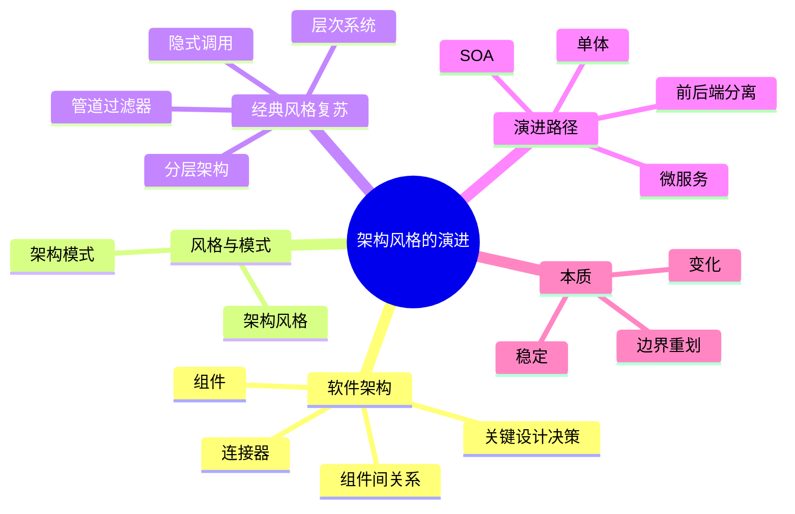
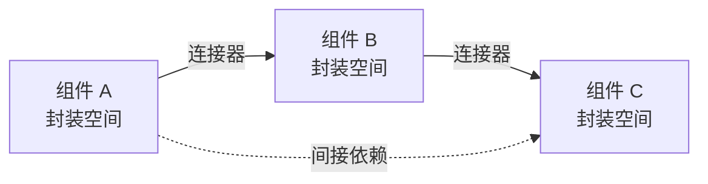
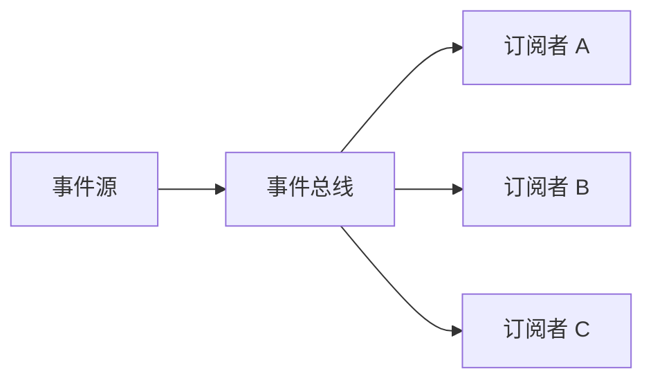
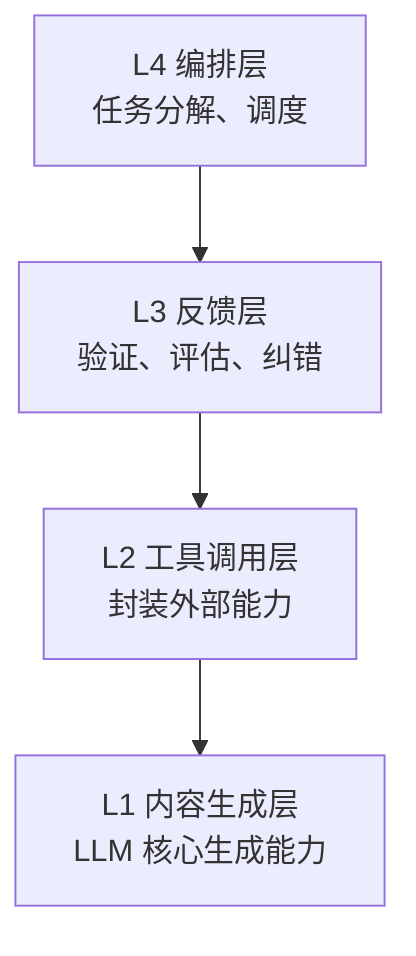
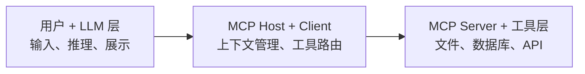
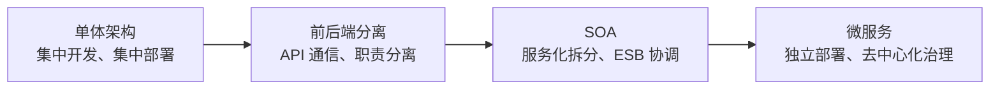
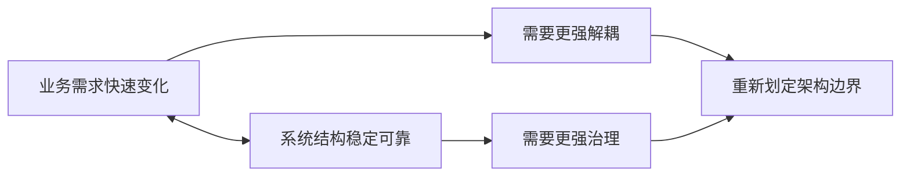

# 架构风格的演进

本章关注两个问题：

- **软件架构是什么**：系统由哪些组件组成，组件之间如何连接。
- **架构为什么演进**：业务复杂度、团队规模、部署方式和变更频率改变后，系统边界也必须重新划分。

这张 mindmap 可以作为本章索引：先理解架构的基本构成，再比较风格和模式，最后看架构如何从单体逐步演进到微服务。

## 软件架构

软件架构是对系统中 **组件或子系统** 以及它们之间 **相互关系** 的描述。

也可以把软件架构理解成一组关键设计决策：

- 系统被拆成哪些组件。
- 组件之间如何通信。
- 哪些部分稳定，哪些部分容易变化。
- 哪些非功能目标必须被架构支持，例如性能、可扩展性、可维护性和可靠性。

### 组件与连接器

组件是系统中被封装的部分。连接器表示组件之间如何协作。

连接器可以是：

- 本地函数调用。
- 模块依赖。
- RPC 或 HTTP API。
- 消息队列。
- 事件总线。
- 数据库连接。
- 网络协议。

架构不只是“有哪些模块”。同样的组件，如果连接方式不同，系统性质也会完全不同。

## 架构风格与架构模式

架构风格和架构模式都在描述结构经验，但抽象层级不同。

| 对比维度 | 架构风格 | 架构模式 |
|---|---|---|
| 抽象层级 | 系统级、整体结构 | 局部问题、解决方案模板 |
| 关注点 | 组件类型、交互规则、架构约束 | 某类场景下的组件协作 |
| 应用范围 | 通常影响整个系统 | 可局部应用于某个子系统 |
| 例子 | 分层架构、管道过滤器、微服务、事件驱动 | MVC、发布订阅、CQRS、服务发现 |

**架构风格** 回答的是：系统整体应该如何组织。

**架构模式** 回答的是：某类具体问题应该如何解决。

### 架构风格

架构风格是一种系统级设计哲学。

它通常规定：

- 系统中有哪些组件类型。
- 组件之间允许怎样通信。
- 依赖方向应该如何控制。
- 系统要优先满足哪些质量属性。

例如分层架构强调层间职责分离，微服务强调独立部署和服务自治。

### 架构模式

架构模式是针对重复出现的问题总结出的解决方案模板。

例如：

- **MVC**：把表现、控制和模型分开。
- **发布订阅**：让事件发送者和订阅者解耦。
- **服务注册发现**：解决服务实例动态变化后的寻址问题。
- **CQRS**：把命令和查询拆开，适合读写模型差异明显的系统。

同一个架构模式可以在不同架构风格中出现。

## 经典架构风格

| 架构风格 | 核心组件 | 连接器 | 主要约束 |
|---|---|---|---|
| 管道过滤器 | 过滤器 | 管道 | 数据按方向流动，过滤器只关心输入输出 |
| 隐式调用 | 事件源、订阅者 | 事件、回调、消息队列 | 组件不直接调用彼此 |
| 层次系统 | 层 | 层间接口 | 上层依赖下层，层间职责清晰 |
| 分层架构 | 物理 Tier | HTTP、RPC、数据库连接 | 不同层可独立部署 |

这几种风格并没有过时。它们会在新的技术场景中以新的名字重新出现。

## 管道过滤器风格

管道过滤器风格中，数据流经一系列过滤器。

- **过滤器** 独立处理输入数据并产生输出。
- **管道** 负责把一个过滤器的输出传给下一个过滤器。
- 每个过滤器尽量不关心前后步骤的内部实现。

经典例子包括 Unix 命令管道和编译器流水线。

### 在 AI 应用中的复兴

LLM 应用天然适合管道过滤器风格，因为很多任务都可以拆成文本流处理步骤。

例如 RAG 可以拆成：

每个步骤都像一个过滤器：

- 输入是一段文本、向量结果或结构化上下文。
- 输出是下一步需要的中间结果。
- 步骤之间可以串行，也可以局部并行。

## 隐式调用风格

隐式调用风格中，组件不直接调用彼此，而是通过事件、回调或消息间接协作。

特点是：

- 事件源不需要知道谁会响应事件。
- 订阅者提前注册回调或监听规则。
- 新订阅者可以加入系统，而不必修改事件源。

典型例子包括 GUI 事件、发布订阅系统和消息队列。

### Hook 与 Webhook

在 AI 应用中，Hook 和 Webhook 可以看成隐式调用风格的延伸。

| 类型 | 适用场景 | 例子 |
|---|---|---|
| 进程内 Hook | 本地推理链路或 Agent 框架内部扩展 | Prompt 预处理、工具调用拦截、流式输出处理 |
| Webhook | 跨系统异步通知 | Agent 任务完成通知、第三方服务集成、告警通知 |

传统回调和 AI Hook 的区别：

| 对比维度 | 传统回调 | AI Hook |
|---|---|---|
| 绑定位置 | 通用系统事件 | Prompt、Token 流、工具调用、Agent 生命周期 |
| 数据载体 | 函数参数、内存对象 | 文本、Token、工具调用结构体 |
| 目标 | 解耦模块、响应事件 | 控制模型行为、扩展模型能力 |

## 层次系统风格

层次系统风格按照抽象层次组织系统。

基本规则是：

- 上层使用下层服务。
- 下层不依赖上层。
- 每层通过清晰接口暴露能力。

经典例子包括 OSI 七层模型和操作系统结构。

### Harness Engineering 四层架构

Harness Engineering 可以理解为一种面向 LLM 应用的层次系统。

它的目标是：**在确定性边界内释放 LLM 的创造力**。

| 层级 | 名称 | 职责 |
|---|---|---|
| L4 | 编排层 | 任务拆解、流程调度、多 Agent 协作 |
| L3 | 反馈层 | 执行结果验证、质量评估、纠错 |
| L2 | 工具调用层 | 封装外部工具或 API |
| L1 | 内容生成层 | LLM 核心生成能力 |

这四层的意义不是限制 AI，而是让 AI 的不确定输出被验证、约束和恢复机制包住。

## Layer 与 Tier

这里要区分两个“层”。

| 概念 | 含义 | 例子 |
|---|---|---|
| Layer | 逻辑抽象层 | 表现层、应用层、领域层、基础设施层 |
| Tier | 物理部署层 | 浏览器、服务器、数据库 |

Layer 更偏设计结构，Tier 更偏部署结构。

### MCP 三层模型

MCP（Model Context Protocol）连接 AI 应用和外部工具，可以看成一种物理和逻辑混合的三层模型。

| 层 | 职责 |
|---|---|
| 用户 + LLM 层 | 用户交互、LLM 推理、结果展示 |
| MCP Host + Client 层 | 上下文管理、协议转换、工具路由 |
| MCP Server + 工具层 | 实际工具执行、文件系统、数据库或 API 访问 |

MCP 的核心价值是把 **LLM 能力边界** 和 **外部工具能力** 分开，用标准协议连接。

## 架构演进全景

架构演进通常由这些因素推动：

- 业务复杂度上升。
- 系统规模扩大。
- 团队规模扩大。
- 发布频率提高。
- 可用性和扩展性要求提高。

典型演进路径：

这不是绝对顺序，而是一条常见的复杂度增长路径。

## 单体架构

单体架构把整个应用构建为一个单一部署单元。

特点：

- 所有功能模块打包在一起。
- 通常运行在一个进程或一个应用包中。
- 模块之间多为进程内调用。

优点：

- 开发简单。
- 部署简单。
- 调试和端到端测试方便。
- 进程内调用开销低。

适用场景：

- 小型项目。
- 创业初期原型。
- 内部工具。
- 团队规模较小。
- 业务变化还不复杂。

缺点：

| 问题 | 说明 |
|---|---|
| 紧耦合 | 修改一个模块可能影响全局 |
| 扩展性差 | 只能整体扩容，无法针对热点模块单独扩展 |
| 技术栈锁定 | 所有模块通常被同一技术栈绑定 |
| 发布风险高 | 小改动也可能需要重新部署整个应用 |
| 长期维护难 | 代码量变大后理解和修改成本上升 |

单体不是错误。问题通常出现在系统已经变复杂，但边界仍停留在早期状态。

## 前后端分离架构

前后端分离把客户端和服务器拆开，通过 API 交互。

核心变化是：

- 前端负责展示和交互。
- 后端负责业务逻辑和数据。
- API 成为前后端之间的契约。
- 前后端可以独立开发、测试和部署。

| 维度 | 传统模式 | 前后端分离 |
|---|---|---|
| 开发方式 | 前端依赖后端页面 | 前后端并行开发 |
| 部署方式 | 一起部署 | 可独立部署 |
| 技术栈 | 往往绑定 | 可自由选择 |
| 性能策略 | 服务端渲染为主 | 静态托管 + API 调用 |

前后端分离本质上是把表现层从服务端应用中拆出来，让前端成为独立演进的部分。

## SOA

SOA（Service-Oriented Architecture）强调按业务能力拆成服务。

出现背景：

- 单体系统过大。
- 多个系统需要复用相同业务能力。
- 企业内部存在大量异构系统。
- 组织规模扩大，需要并行开发。

SOA 的核心包括：

- 服务化拆分。
- 标准化接口。
- 松耦合协作。
- 通常引入 ESB 作为通信和集成中心。

| 维度 | 传统分层 | SOA |
|---|---|---|
| 粒度 | 模块 | 服务 |
| 调用方式 | 进程内调用 | 网络调用 |
| 复用层次 | 代码复用 | 服务复用 |
| 治理方式 | 应用内部治理 | 企业服务治理 |

### SOA 的问题

SOA 的主要问题是中心化过重。

| 问题 | 说明 |
|---|---|
| ESB 成为瓶颈 | 所有服务通信都容易经过中心节点 |
| 标准复杂 | SOAP、WSDL、WS-* 等协议栈较重 |
| 治理成本高 | 服务注册、编排、监控集中在复杂平台 |
| 扩展困难 | 中心基础设施本身需要扩容和维护 |

SOA 为微服务铺路，但也暴露了“中心太重”的问题。

## 微服务架构

微服务架构把单一应用拆成一组小型服务。

每个服务通常：

- 围绕业务能力设计。
- 可独立开发。
- 可独立部署。
- 可独立扩展。
- 拥有自己的数据。

服务之间通过轻量级机制通信，例如 HTTP、gRPC 或消息队列。

### 核心特征

| 特征 | 说明 |
|---|---|
| 单一职责 | 每个服务围绕清晰业务能力 |
| 独立部署 | 服务可独立发布和回滚 |
| 轻量通信 | 使用 REST、gRPC 或消息队列 |
| 去中心化治理 | 不依赖重量级 ESB |
| 技术异构 | 不同服务可选择不同语言和框架 |
| 数据分离 | 服务拥有自己的数据模型和存储 |

### 微服务与 SOA

| 维度 | SOA | 微服务 |
|---|---|---|
| 通信中枢 | ESB，较重 | API 网关或服务网格，较轻 |
| 服务粒度 | 较粗，企业级能力 | 较细，业务功能级能力 |
| 数据管理 | 倾向共享数据库 | 数据库 per 服务 |
| 团队组织 | 常按技术或系统划分 | 更适合按业务能力划分 |

### 微服务的挑战

| 挑战 | 说明 | 常见应对 |
|---|---|---|
| 分布式复杂性 | 网络延迟、失败、重试、超时 | 服务治理、超时和重试策略 |
| 数据一致性 | 跨服务事务困难 | Saga、最终一致性 |
| 运维复杂度 | 服务数量多，部署和监控复杂 | DevOps、容器编排 |
| 调试困难 | 调用链跨多个服务 | 链路追踪、日志聚合 |
| 服务治理 | 熔断、限流、降级 | 网关、服务网格、治理框架 |

微服务不是银弹。它解决了单体的边界和部署问题，但引入了分布式系统复杂性。

## 演进本质

架构演进的核心不是追逐新名词，而是重新平衡：

**业务需求的快速变化** 和 **系统结构的稳定可靠**。

### 核心维度变化

| 维度 | 演进趋势 |
|---|---|
| 解耦程度 | 从低到高 |
| 治理方式 | 从集中到去中心化 |
| 技术约束 | 从统一技术栈到更自由的技术选择 |
| 运维复杂度 | 从低到高 |
| 发布方式 | 从整体发布到独立发布 |

### 演进不是取代

架构演进不是后一种完全取代前一种。

- 单体仍适合小规模、低变更、快速验证的场景。
- 前后端分离适合界面和服务端需要独立迭代的场景。
- SOA 适合企业级系统集成和服务复用。
- 微服务适合复杂业务、多团队协作和高频发布。

架构选型的关键问题不是“哪种架构更先进”，而是：

**当前系统的复杂度、团队能力和变化频率需要哪种边界？**

## 复习要点

- 软件架构描述 **组件** 和 **组件间关系**。
- 组件间关系也可以理解为连接器。
- 架构风格是系统级组织哲学，架构模式是局部问题的解决方案模板。
- 管道过滤器风格适合数据流和处理链。
- 隐式调用风格通过事件、回调或消息降低直接耦合。
- 层次系统强调上层依赖下层，下层提供稳定服务。
- Layer 是逻辑抽象层，Tier 是物理部署层。
- MCP 可以看作连接 LLM 和外部工具的三层结构。
- 常见演进路径是 **单体 → 前后端分离 → SOA → 微服务**。
- 微服务提高了解耦和独立部署能力，也带来分布式复杂性。
- 架构演进的本质是 **在变化与稳定之间重新划定边界**。

## 易混点

| 易混概念 | 区别 |
|---|---|
| 架构风格与架构模式 | 风格是整体组织哲学，模式是局部解决方案 |
| Layer 与 Tier | Layer 是逻辑抽象，Tier 是物理部署 |
| SOA 与微服务 | SOA 更中心化、更重治理；微服务更自治、更轻量 |
| 解耦与复杂度 | 解耦提升灵活性，但也提高治理、部署和调试成本 |
| 微服务与银弹 | 微服务不是默认最优，小项目常常更适合单体或模块化单体 |
