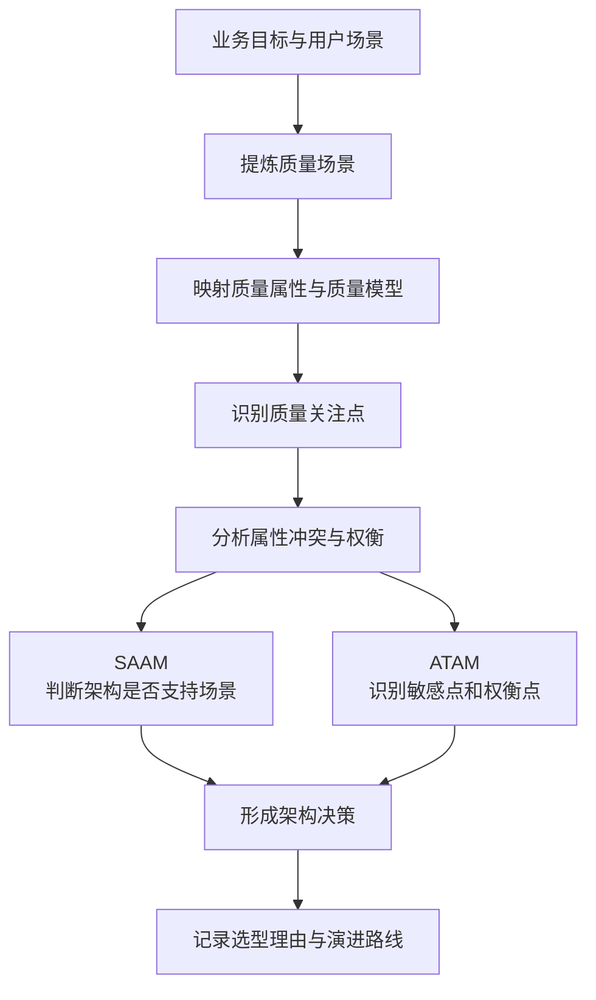
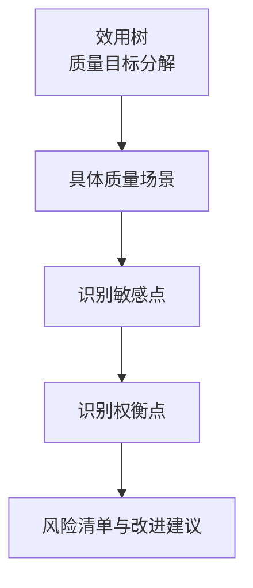
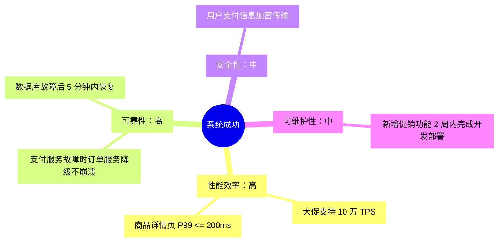
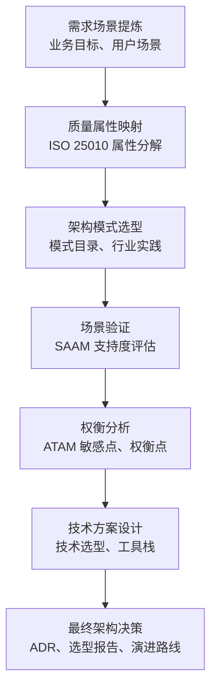

# 质量属性驱动的架构设计

架构设计不能只从功能需求推出。功能需求回答“系统要做什么”，质量属性回答“系统要做到什么程度”。

本章的核心是：把“高性能”“高可用”“安全”“可扩展”这类模糊目标，转化为 **可度量、可验证、可权衡** 的架构输入。

这张图可以概括本章主线：**质量场景是输入，质量模型帮助分类，SAAM/ATAM 用来评估，最终输出架构决策**。

## 质量场景

复杂系统的非功能需求通常来自两类输入。

| 来源 | 含义 | 示例 |
|---|---|---|
| 显性约束 | 需求文档中明确写出的限制 | 必须使用国密算法、必须部署在内网 |
| 隐性质量需求 | 业务目标背后隐含的质量期待 | 全球访问隐含性能和部署要求，7x24 服务隐含高可用要求 |

质量场景的价值是把模糊质量目标具体化。

例如：

- “高性能”可以转成：在 1000 并发下，支付服务 P99 响应时间不超过 200ms。
- “高可用”可以转成：单节点故障后，系统在 10 秒内完成备用节点接管。
- “安全”可以转成：用户支付信息在传输和存储过程中必须加密，并支持审计追踪。

### 质量场景六要素

一个完整的质量场景通常包含六个要素。

| 要素 | 说明 | 示例 |
|---|---|---|
| 刺激源 | 谁触发场景 | 用户、外部系统、硬件故障 |
| 刺激 | 发生了什么 | 并发访问、节点宕机、恶意请求 |
| 环境 | 在什么条件下发生 | 正常运行、高负载、故障状态 |
| 制品 | 被影响的系统部分 | 整个系统、支付服务、数据库 |
| 响应 | 系统应该怎么做 | 返回结果、切换节点、拒绝请求 |
| 响应度量 | 如何判断是否达标 | 响应时间、成功率、恢复时间 |

示例质量场景：

| 要素 | 内容 |
|---|---|
| 刺激源 | 1000 个用户 |
| 刺激 | 同时发起支付请求 |
| 环境 | 系统正常运行 |
| 制品 | 支付服务 |
| 响应 | 完成支付处理并返回结果 |
| 响应度量 | 2 秒内响应，成功率不低于 99.9% |

**易混点**：质量属性是抽象目标，质量场景是具体实例。只写“系统要可靠”不够，必须说明“什么条件下、哪个部件、如何响应、用什么指标判断”。

## 质量模型

质量模型是质量属性的分类框架。

| 概念 | 层次 | 作用 |
|---|---|---|
| 质量模型 | 分类框架 | 提醒架构师系统化考虑质量维度 |
| 质量属性 | 抽象目标 | 表示系统应该具备的性质 |
| 质量场景 | 可验证实例 | 把抽象目标落到具体指标 |

质量模型不会直接告诉你用 Redis、MySQL 还是 Kafka。它的作用是统一语言、避免遗漏、支持评估。

### ISO 25010

ISO 25010 常用于系统化整理质量属性。

| 质量属性 | 常见子特性 |
|---|---|
| 功能性 | 适合性、准确性、依从性 |
| 性能效率 | 时间特性、资源利用率、容量 |
| 可靠性 | 成熟性、容错性、易恢复性、健壮性 |
| 安全性 | 保密性、完整性、抗抵赖性、可核查性、真实性 |
| 易用性 | 易理解性、易学习性、易操作性、吸引性 |
| 兼容性 | 共存性、互操作性 |
| 可维护性 | 易分析性、易改变性、稳定性、易测试性 |
| 可移植性 | 适应性、易安装性、易替换性 |

质量模型回答“有哪些质量维度要考虑”，质量场景回答“某个维度如何被测试和验证”。

## 质量关注点

质量关注点是架构设计时最常遇到的问题主题。

| 质量关注点 | 典型指标 | 常见技术 |
|---|---|---|
| 高并发 | QPS、TPS、P99、并发数 | 缓存、异步、分库分表、熔断降级 |
| 高可用 | 可用性百分比、MTTF、MTTR | 冗余、故障转移、负载均衡 |
| 容错 | 错误率、恢复时间 | 断路器、重试、冗余 |
| 灾备恢复 | RPO、RTO | 数据备份、异地容灾、自动化恢复 |
| 强一致性 | 一致性延迟、事务成功率 | 2PC、Raft、Paxos、分布式事务 |
| 可扩展性 | 水平扩展能力、负载增长后的延迟 | 无状态服务、分片、消息队列 |

### 高并发

高并发要求系统在单位时间内处理大量请求，同时保持吞吐量和低延迟。

常见指标：

- **QPS**：每秒查询数，常用于接口层、缓存层。
- **TPS**：每秒事务数，常用于交易或数据库场景。
- **P99 延迟**：99% 的请求在某个时间内完成，比平均值更能反映尾部体验。
- **并发数**：系统同时处理的请求数量。

典型技术包括缓存、异步化、限流、分库分表和热点隔离。

### 高可用

高可用要求系统在约定时间内持续提供服务。

常见指标：

- **可用性百分比**：例如 99.9%、99.99%。
- **MTTF**：平均无故障时间。
- **MTTR**：平均修复时间。

| 可用性 | 每年允许停机时间 | 典型场景 |
|---|---:|---|
| 99% | 87.6 小时 | 一般系统 |
| 99.9% | 8.76 小时 | 普通商业网站 |
| 99.99% | 52.56 分钟 | 电商、支付 |
| 99.999% | 5.256 分钟 | 电信、金融核心 |

可用性每多一个 9，成本和复杂度都会明显上升。

### 容错与灾备

容错关注局部故障时系统如何继续运行。

常见技术：

- **断路器**：下游故障达到阈值后停止调用，避免故障扩散。
- **重试**：对临时失败进行有限次数重试。
- **冗余**：通过多副本降低单点故障影响。

灾备恢复关注灾难后如何恢复数据和服务。

| 指标 | 含义 | 示例 |
|---|---|---|
| RPO | 最大允许丢失多久的数据 | RPO = 5 分钟表示最多丢失 5 分钟数据 |
| RTO | 故障后多久必须恢复服务 | RTO = 1 小时表示 1 小时内恢复服务 |

RPO 和 RTO 越小，灾备成本越高。

### 强一致性与可扩展性

强一致性要求所有节点在同一时刻看到一致的数据状态。

典型场景：

- 银行转账。
- 库存扣减。
- 订单支付状态。

常见技术包括 2PC、Raft 和 Paxos。

可扩展性要求系统能够通过增加资源提升处理能力。

常见技术包括：

- 无状态服务。
- 水平扩展。
- 分片。
- 分布式缓存。
- 消息队列解耦。

## 质量属性之间的冲突

质量属性之间经常互相牵制。架构设计的难点不是“每个属性都要最好”，而是根据业务优先级做取舍。

### CAP 原理

CAP 指一致性、可用性和分区容错性三者无法同时完全满足。

| 要素 | 含义 |
|---|---|
| 一致性 C | 所有节点在同一时间看到相同数据 |
| 可用性 A | 系统总能对请求给出响应 |
| 分区容错性 P | 网络分区时系统仍能继续运行 |

现实分布式系统通常不能放弃 P，因为网络分区客观可能发生。因此实际设计多在 CP 和 AP 之间取舍。

| 组合 | 适用场景 | 代表系统 |
|---|---|---|
| CP | 金融交易、配置中心、强一致元数据 | ZooKeeper、Consul |
| AP | 电商浏览、社交动态、高并发读 | Cassandra、异步复制缓存 |
| CA | 不考虑网络分区的单节点或局域场景 | 传统单机数据库 |

### 常见冲突

| 冲突属性对 | 冲突本质 | 常见策略 |
|---|---|---|
| 安全性 vs 性能 | 加密、认证、审计会增加延迟 | 区分敏感数据、硬件加速、减少握手成本 |
| 安全性 vs 易用性 | 强认证增加用户操作成本 | 风险自适应认证、设备指纹、分级授权 |
| 可靠性 vs 性能 | 冗余和事务机制消耗资源 | 核心链路同步，非核心链路异步 |
| 可维护性 vs 性能 | 分层和拆分会拉长调用链 | 聚合高频服务、并行调用、缓存 |
| 可移植性 vs 性能 | 跨平台抽象可能降低执行效率 | 关键路径做平台特化，非关键路径保持抽象 |

**复习提示**：架构权衡不是简单折中，而是先确定业务优先级，再选择哪些场景必须保证，哪些场景可以接受退让。

## SAAM

SAAM（Software Architecture Analysis Method）是一种基于场景的架构分析方法。

它主要回答：

**这个候选架构能不能支持这些场景？**

### SAAM 与 ATAM

| 对比维度 | SAAM | ATAM |
|---|---|---|
| 核心关注点 | 架构是否满足场景 | 质量属性之间如何权衡 |
| 适用阶段 | 架构设计早期 | 架构设计中期 |
| 主要输出 | 场景支持度 | 敏感点、权衡点、风险清单 |
| 典型问题 | 这个方案行不行 | 冲突时应该牺牲什么 |

SAAM 更像早期筛选，ATAM 更像深入权衡。

### SAAM 步骤

| 步骤 | 工作内容 |
|---|---|
| 场景开发 | 利益相关者提出关键场景 |
| 架构描述 | 描述候选架构的组件、数据流和接口 |
| 场景分类 | 区分直接场景和间接场景 |
| 场景评估 | 判断架构对场景的支持程度 |
| 结果分析 | 汇总风险、修改成本和改进建议 |

场景支持度通常分为：

- **完全支持**：无需修改架构。
- **部分支持**：只需少量调整。
- **不支持**：需要较大重构。

### 电商系统示例

候选架构：

- **方案 A：单体架构**。所有模块一起部署，使用 MySQL 主从。
- **方案 B：微服务架构**。拆分用户、商品、订单、支付、库存服务。

| 场景 | 方案 A 支持度 | 方案 B 支持度 | 说明 |
|---|---|---|---|
| 大促期间 10 万用户浏览商品 | 部分支持 | 完全支持 | 商品服务可独立扩展 |
| 用户下单后 30 秒未支付自动取消 | 完全支持 | 完全支持 | 两者都可用定时任务或延迟队列 |
| 支付成功后自动扣减库存 | 完全支持 | 完全支持 | 微服务需要处理分布式事务 |
| 新增直播带货功能 | 不支持 | 部分支持 | 单体可能需要整体重构 |
| 支持多语言和多币种 | 不支持 | 部分支持 | 微服务可拆出国际化能力 |

SAAM 的重点不是直接宣布谁最好，而是说明每个场景下架构需要付出多少修改成本。

## ATAM

ATAM（Architecture Tradeoff Analysis Method）用于分析质量属性之间的权衡。

它主要回答：

**当质量属性冲突时，哪些架构决策最敏感，哪些决策必须取舍？**

### 核心概念

| 概念 | 含义 |
|---|---|
| 效用树 | 把抽象质量目标分解为具体质量场景 |
| 敏感点 | 对某个质量属性影响显著的架构决策 |
| 权衡点 | 同时影响多个质量属性、需要取舍的架构决策 |
| 风险 | 当前决策可能导致质量目标无法满足的地方 |

### 效用树示例

效用树的作用是把“系统成功”分解成可讨论、可排序、可验证的质量场景。

### 敏感点与权衡点

| 敏感点 | 影响的质量属性 | 说明 |
|---|---|---|
| 数据库分片数量 | 性能、可扩展性 | 分片越多写入吞吐可能越高，但跨分片查询更复杂 |
| 缓存 TTL | 性能、一致性 | TTL 越长命中率越高，但数据越可能过期 |
| 服务拆分粒度 | 可维护性、性能 | 拆得越细越灵活，但调用链更长 |

| 权衡点 | 正面影响 | 负面影响 | 决策思路 |
|---|---|---|---|
| 订单状态采用最终一致性 | 提升可用性，不阻塞下单 | 数据短暂不一致 | 用户可接受短暂延迟时采用 |
| 引入缓存 | 提升 QPS，降低数据库压力 | 增加一致性和运维复杂度 | 大促场景性能优先 |
| 订单和库存服务拆分 | 独立部署、故障隔离 | 分布式事务复杂 | 使用 Saga 或事件驱动 |

敏感点不一定是问题，它只是“很影响结果的参数或决策”。权衡点才强调“同时影响多个质量属性，需要做选择”。

## 质量属性驱动设计方法

质量属性驱动的架构设计可以概括为七个动作。

| 动作 | 核心问题 | 推荐方法 |
|---|---|---|
| 需求场景提炼 | 系统要解决什么问题 | 质量场景六要素 |
| 质量属性映射 | 哪些质量属性最重要 | ISO 25010 |
| 架构模式选型 | 哪种架构风格适合 | 架构风格对比 |
| 场景验证 | 候选方案是否支持场景 | SAAM |
| 权衡分析 | 冲突时如何取舍 | ATAM |
| 技术方案设计 | 用什么技术实现 | 技术选型矩阵 |
| 最终架构决策 | 如何记录决策 | ADR、选型报告 |

### 实战检查清单

需求场景：

- 是否列出核心业务目标？
- 是否为每个目标定义质量场景？
- 是否包含刺激源、刺激、环境、制品、响应、响应度量？
- 是否标注场景优先级？

架构选型：

- 是否比较至少两种候选架构？
- 是否说明每种架构对关键质量属性的支持程度？
- 是否识别显性约束和隐性质量需求？

权衡与验证：

- 是否识别敏感点？
- 是否识别权衡点？
- 是否说明哪些质量属性优先级更高？

决策输出：

- 是否记录最终架构选择？
- 是否说明选择理由和放弃理由？
- 是否规划演进路线？

## 复习要点

- **质量场景** 用六要素把模糊质量目标转成可验证指标。
- **质量模型** 提供质量属性分类框架，ISO 25010 可用于避免遗漏。
- **质量关注点** 是识别质量场景的入口，例如高并发、高可用、灾备、强一致性。
- **质量属性经常冲突**，典型例子是 CAP、安全性与性能、可维护性与性能。
- **SAAM** 主要判断架构是否支持场景，适合早期方案筛选。
- **ATAM** 主要识别敏感点、权衡点和风险，适合中期架构优化。
- **质量属性驱动设计** 的输出不是孤立技术选型，而是一组带理由、带权衡、带演进路线的架构决策。

## 易混点

| 易混概念 | 区别 |
|---|---|
| 质量属性与质量场景 | 质量属性是抽象目标，质量场景是可验证实例 |
| 显性约束与隐性质量需求 | 显性约束写在需求里，隐性质量需求藏在业务目标后面 |
| 高可用与容错 | 高可用关注服务持续可用，容错关注局部故障下如何维持运行 |
| RPO 与 RTO | RPO 关注最多丢多少数据，RTO 关注多久恢复服务 |
| SAAM 与 ATAM | SAAM 判断方案是否支持场景，ATAM 分析质量属性之间的取舍 |
| 敏感点与权衡点 | 敏感点影响某个质量属性，权衡点同时影响多个质量属性 |
