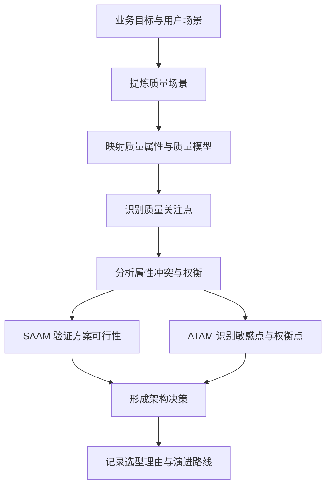
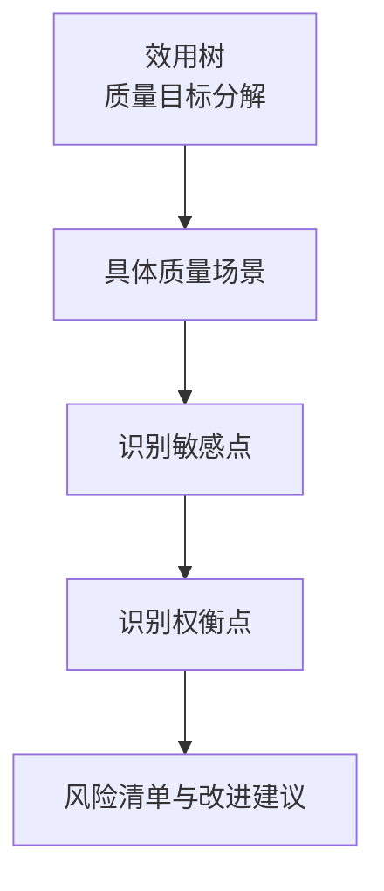
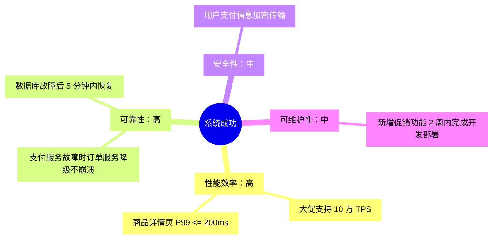
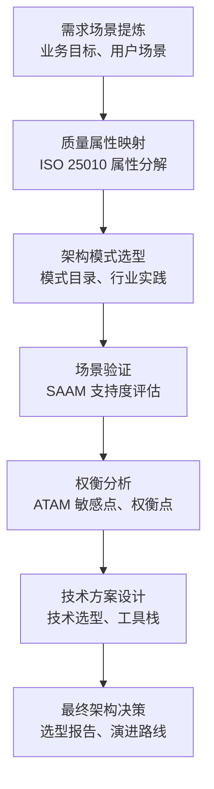

# 质量属性驱动的架构设计
**范围**：章节五，质量属性驱动的架构设计  
**整理方式**：按“质量场景 -> 质量关注点 -> 属性冲突与权衡 -> SAAM -> ATAM -> 七步设计法”重组。

## 核心脉络

本章的主线是：架构设计不能只由功能需求推出，还必须从一开始把 **非功能需求** 当作一等公民来处理。质量属性驱动设计的核心，是把“高性能”“高可用”“安全”“可扩展”这类模糊目标，转化为 **可度量、可验证、可权衡** 的架构设计输入。

**复习提示**：这章不是单独讲某个架构风格，而是讲“怎么用质量目标来驱动架构选择”。考试或设计题里，常见问法会是：给出业务目标，要求写质量场景、识别冲突、选择权衡策略。

## 架构设计与质量场景

### 非功能需求的两类来源

构建复杂系统时，业务逻辑通常只能导出系统的 **功能需求**，例如“支持下单”“完成支付”“查询商品”。但架构设计还必须响应两类非功能输入：

- **显性约束**：明确写出来的技术限制或合规要求。例如合规要求必须使用国密算法。
- **隐性质量需求**：业务目标背后隐藏的质量期待。例如“用户增长”隐含可扩展性需求，“全球访问”隐含性能、可靠性和部署约束。

质量场景的价值在于：把这些模糊的期待具体化为可评估目标。

| 业务需求 | 可以转化出的质量场景 |
|---|---|
| 支持全球用户访问 | 跨地域部署时，数据同步延迟不超过 1 秒，体现性能效率和可靠性 |
| 7x24 小时服务 | 单机房故障不影响核心业务，体现高可用性 |

### 质量场景

**质量场景（Quality Scenario）** 是对系统与外部环境之间交互的具体描述，用来具象化一个质量属性需求。它是软件架构评估中的核心概念。

一个完整质量场景通常包含六个要素：

| 要素 | 说明 | 示例 |
|---|---|---|
| **刺激源** | 谁触发了这个场景 | 用户、外部系统、硬件事件 |
| **刺激** | 发生了什么 | 用户并发访问、服务器宕机 |
| **环境** | 在什么条件下发生 | 正常运行、高负载、故障状态 |
| **制品** | 被影响的系统部分 | 整个系统、某个服务、数据库 |
| **响应** | 系统应该做什么 | 在 X 秒内响应、切换到备用节点 |
| **响应度量** | 如何衡量响应是否达标 | 响应时间 <= 200ms、可用性 99.99% |

示例：当 **1000 个用户** 同时发起支付请求时，在 **系统正常运行** 的环境下，**支付服务** 应在 **2 秒内完成响应**，且 **成功率 >= 99.9%**。

### 质量场景的作用

质量场景的主要作用是让质量属性 **可验证、可测试、可讨论**。

- 把“高性能”改写成“1000 并发下响应时间 <= 200ms”。
- 把“高可用”改写成“单节点故障后 10 秒内完成备用节点接管”。
- 为架构评估方法提供输入，例如 SAAM 和 ATAM。

**易混点**：质量属性是抽象目标，质量场景是具体实例。只说“系统要可靠”不够，必须说明“什么情况下、哪个部件、要如何响应、用什么指标判定”。

## 质量模型

### 质量模型、质量属性、质量场景

| 概念 | 层次 | 说明 |
|---|---|---|
| **质量模型** | 分类框架 | 定义系统有哪些质量属性，例如 ISO 25010 |
| **质量属性** | 抽象目标 | 例如系统应具有高性能、高可靠性 |
| **质量场景** | 具体可验证实例 | 例如 1000 并发下响应时间 <= 200ms |

标准质量模型的价值不是直接给出技术方案，而是帮助架构师系统化思考，避免只盯着某个局部目标。

### ISO 25010 的质量属性

ISO 25010 可用于系统化管理质量场景。它提供覆盖八大质量属性的分类框架：

| 质量属性 | 常见子特性 |
|---|---|
| **功能性** | 适合性、准确性、依从性 |
| **性能效率** | 时间特性、资源利用率、容量 |
| **可靠性** | 成熟性、容错性、易恢复性、健壮性 |
| **安全性** | 保密性、完整性、抗抵赖性、可核查性、真实性 |
| **易用性** | 易理解性、易学习性、易操作性、吸引性 |
| **兼容性** | 共存性、互操作性 |
| **可维护性** | 易分析性、易改变性、稳定性、易测试性 |
| **可移植性** | 适应性、易安装性、易替换性 |

**复习提示**：质量模型回答“要考虑哪些维度”，质量场景回答“某个维度如何落到可测试指标”。

## 质量关注点

质量关注点是架构师思考的切入点，也是常见的质量主题。它们通常能对应到指标和技术策略。

| 质量关注点 | 核心指标 | 关键技术 |
|---|---|---|
| **高并发** | QPS/TPS、P99 延迟、并发数 | 缓存、异步、分库分表、熔断降级 |
| **高可用** | 可用性百分比、MTTF、MTTR | 冗余、故障转移、负载均衡 |
| **容错** | 故障恢复时间、错误率阈值 | 断路器、重试、冗余设计 |
| **灾备恢复** | RPO、RTO | 数据备份、异地容灾、自动化恢复 |
| **强一致性** | 一致性延迟、读修复时间 | 共识算法、分布式事务 |
| **可扩展性** | 水平扩展能力、响应时间增长 | 无状态设计、分片、消息队列 |

### 高并发

**高并发** 要求系统在单位时间内处理大量用户请求，同时保证高吞吐量和低延迟。

常见场景：

- 电商大促期间支撑高 TPS。
- 社交平台热点事件带来百万级 QPS。
- 秒杀、抢购等瞬时流量场景。

核心指标：

- **吞吐量（Throughput）**：单位时间内系统处理的请求数或事务数。
- **TPS（Transaction Per Second）**：每秒事务数，常用于数据库或业务核心链路。
- **QPS（Query Per Second）**：每秒查询数，常用于缓存、接口层。
- **延迟（Latency）**：请求从发出到收到完整响应的耗时。
- **P99**：99% 的请求在 X 毫秒内完成，比平均值更能反映尾部体验。
- **并发数（Concurrency）**：系统同时处理的请求数量。

### 高可用

**高可用** 要求系统在约定时间内持续提供服务，避免因故障导致服务中断。

常见指标：

- **可用性百分比**：例如 99.9%、99.99%、99.999%。
- **MTTF**：平均无故障时间。
- **MTTR**：平均修复时间。

| 可用性 | 每年允许停机时间 | 每天允许停机时间 | 典型场景 |
|---|---:|---:|---|
| 99% | 87.6 小时 | 14.4 分钟 | 一般系统 |
| 99.9% | 8.76 小时 | 1.44 分钟 | 普通商业网站 |
| 99.99% | 52.56 分钟 | 8.64 秒 | 电商、支付 |
| 99.999% | 5.256 分钟 | 0.864 秒 | 电信、金融核心 |
| 99.9999% | 31.536 秒 | 0.0864 秒 | 高精度交易系统 |

**复习提示**：可用性每多一个 9，成本和复杂度都会显著上升，不能只喊口号。

### 容错

**容错** 要求系统在部分节点或部分服务故障时，仍能继续正常运行。

常见技术：

- **断路器模式（Circuit Breaker）**：下游故障达到阈值后停止调用，避免故障扩散。
- **重试**：对临时失败进行有限次数重试。
- **冗余设计**：通过多副本降低单点故障影响。

**易混点**：高可用关注“服务是否持续可用”，容错关注“局部故障时系统如何维持运行”。容错是高可用的重要实现手段之一。

### 灾备恢复

**灾备恢复** 关注系统遭遇自然灾害、人为失误、网络攻击等灾难后，如何快速恢复数据和服务。

两个核心指标：

- **RPO（Recovery Point Objective）**：最大允许丢失多久的数据。
- **RTO（Recovery Time Objective）**：故障后多久必须恢复服务。

| 指标 | 定义 | 示例 |
|---|---|---|
| **RPO** | 数据丢失的最大时间窗口 | RPO = 5 分钟表示最多丢失 5 分钟数据 |
| **RTO** | 服务恢复的最大时间 | RTO = 1 小时表示 1 小时内恢复服务 |

二者越小，灾备成本越高。金融核心系统可能要求 RPO 接近 0、RTO 小于 30 秒；普通业务系统可能接受 RPO 小于 1 小时、RTO 小于 4 小时。

### 强一致性

**强一致性** 要求分布式系统中所有节点在同一时刻对数据的视图完全一致。任何更新完成后，所有后续访问都能读取到最新值。

典型场景：

- 银行转账中，A 账户扣款和 B 账户入账必须同时成功或同时失败。
- 不允许出现 A 扣款成功但 B 未到账的中间状态。

关键技术：

- **2PC**：两阶段提交。
- **Raft、Paxos**：分布式共识算法。

### 可扩展性

**可扩展性** 要求系统通过增加资源实现性能提升。

常见场景：

- 用户量从千级增长到百万级。
- 数据量从 GB 增长到 TB。

关键指标：

- **水平扩展能力**：增加 N 倍资源后，性能提升多少倍。
- **响应时间增长**：负载翻倍时，响应时间增长比例。

关键技术：

- 无状态服务设计。
- 分库分表，包括水平拆分和垂直拆分。
- 分布式缓存。
- 消息队列解耦。

## 质量属性与质量场景的关系

质量属性是系统非功能质量需求的抽象分类与目标，质量场景是它的具体化、可量化、可测试实例。

在架构设计中，常见流程是：

1. 通过质量关注点识别并提炼质量场景。
2. 从场景中归纳对应的质量属性。
3. 用质量模型检查是否遗漏重要维度。
4. 形成完整的质量设计体系。

质量属性的核心价值包括：

- **提供系统化设计语言**：不同团队对“高可用”“弹性”等术语可能理解不同，标准模型能统一语言。
- **强制全面性思考**：避免只关注 Redis 还是 MySQL 这类实现细节，而忽略性能、安全、可靠性之间的全局权衡。
- **支持量化评估与合规**：例如用 MTTR、测试覆盖率、冗余验证等指标证明系统满足合同或合规要求。

**复习提示**：如果题目问“为什么需要质量属性模型”，答案不是“它能告诉我们用什么技术”，而是“它帮助系统化分类、统一语言、避免盲区、支持度量”。

## 质量属性之间的冲突

### CAP 原理

在分布式系统中，**一致性（C）**、**可用性（A）**、**分区容错性（P）** 三者无法同时满足，必须选择其中两个并放弃第三个。

| 要素 | 含义 |
|---|---|
| **一致性（Consistency）** | 所有节点在同一时间看到相同的数据状态，类似传统数据库的 ACID 特性 |
| **可用性（Availability）** | 系统在正常或部分节点故障时，仍能对用户请求做出响应 |
| **分区容错性（Partition Tolerance）** | 网络分区、节点通信中断时，系统仍能继续运行 |

为什么三者无法同时满足：

- 网络分区发生时，如果坚持强一致性，就需要等待所有节点确认，可能导致请求超时，从而牺牲可用性。
- 网络分区发生时，如果坚持可用性，就可能返回旧数据，从而牺牲一致性。

常见选择：

| 组合 | 典型场景 | 代表系统 |
|---|---|---|
| **CP** | 数据强一致场景，如金融交易 | ZooKeeper、Consul |
| **AP** | 高并发读场景，如电商、社交网络 | Cassandra、Redis 异步复制 |
| **CA** | 无分区场景，如单节点系统 | 传统关系型数据库，如 MySQL、Oracle |

**易混点**：现实分布式系统通常不能放弃 P，因为网络分区是客观可能发生的。因此实际设计常在 CP 和 AP 之间取舍。

### 典型冲突矩阵

| 冲突属性对 | 典型冲突场景 | 常见领域 | 冲突强度 |
|---|---|---|---|
| **安全性 vs 性能** | 加密算法增加计算延迟，身份验证降低吞吐量 | 金融支付、IoT | 高 |
| **安全性 vs 易用性** | 多因素认证降低用户体验，权限分级增加操作复杂度 | SaaS、医疗系统 | 高 |
| **可靠性 vs 性能** | 冗余副本同步消耗带宽，事务机制增加响应时间 | 分布式系统、数据库 | 中高 |
| **功能性 vs 可靠性** | 复杂业务逻辑增加故障点，实时更新带来一致性风险 | 工业控制系统 | 中高 |
| **可维护性 vs 性能** | 模块化分层拉长调用链，抽象层增加资源开销 | 微服务、中间件 | 中 |
| **可移植性 vs 性能** | 跨平台抽象降低执行效率，环境适配代码增加资源消耗 | 嵌入式、跨平台 App | 中 |

### 冲突应对策略

安全性与性能效率：

- 冲突本质：安全机制带来计算开销，与吞吐量和低延迟相冲突。
- 示例：支付网关使用 AES-256 加密后，单交易处理时间从 5ms 升到 15ms。
- 策略：敏感字段全加密，非敏感字段明文；使用 AES-NI 等硬件加速；用 TLS 1.3 减少握手时间。

性能效率与可靠性：

- 冲突本质：冗余保障需要更多资源。
- 示例：三副本同步写入让 TPS 从 10 万降到 3 万。
- 策略：核心数据同步复制，非关键数据异步复制；用 Saga 替代 2PC；根据网络状态动态选择副本。

安全性与易用性：

- 冲突本质：安全控制越严格，用户操作成本越高。
- 示例：医疗 App 中医生每 30 分钟重复登录，降低工作效率。
- 策略：风险自适应认证；低风险操作使用长期 Token，高风险操作强制生物识别；结合设备指纹和行为分析做静默认证。

可维护性与性能：

- 冲突本质：架构清晰度与执行效率存在张力。
- 示例：微服务拆分后，订单服务调用链从 3 层变成 8 层，平均延迟从 50ms 增至 120ms。
- 策略：用有界上下文聚合高频交互服务；并行调用；在网关层治理缓存，减少服务间调用。

通用策略框架：

- **选择架构模式**：例如可靠性和性能冲突时，可选择最终一致性；可维护性和性能冲突时，可选择垂直分片和读写分离。
- **组合技术栈**：例如硬件加速、轻量协议、智能压缩。
- **动态权衡机制**：系统运行时根据风险等级动态选择加密算法或降级策略。

## SAAM

### SAAM 与 ATAM 的关系

**SAAM（Software Architecture Analysis Method，软件架构分析方法）** 和 **ATAM（Architecture Tradeoff Analysis Method，架构权衡分析方法）** 都由 CMU SEI 提出。

| 对比维度 | SAAM | ATAM |
|---|---|---|
| **核心关注点** | 架构能否满足功能和质量需求 | 质量属性之间的权衡 |
| **适用阶段** | 架构设计早期，方案筛选 | 架构设计中期，方案优化 |
| **输出** | 场景支持度评估，如支持、部分支持、不支持 | 敏感点、权衡点、风险清单 |
| **关系** | ATAM 的前身和基础 | 在 SAAM 基础上增加权衡分析 |
| **总结** | 判断“这个架构行不行” | 决定“多个目标冲突时选哪个” |

### SAAM 的核心目标

SAAM 通过 **场景分析** 评估软件架构的适用性，重点验证架构是否满足功能需求和非功能需求。

核心特点：

- **场景驱动**：基于用户、开发者、运维人员提出的场景进行验证。
- **早期反馈**：在架构设计初期识别潜在问题，降低后期修改成本。

### SAAM 实施步骤

| 步骤 | 工作内容 |
|---|---|
| **场景开发** | 利益相关者共同提出关键场景 |
| **架构描述** | 描述待评估架构，包括组件图、数据流、接口定义 |
| **场景分类与优先级排序** | 区分直接场景和间接场景，并确定优先级 |
| **场景评估** | 判断架构对每个场景的支持程度 |
| **结果分析与改进建议** | 汇总未支持场景的修改成本与业务价值，提出优化路线 |

场景类型：

- **直接场景**：架构已经明确支持的现有需求。
- **间接场景**：架构可能需要调整才能支持的潜在需求。

支持程度：

- **完全支持**：无需修改架构。
- **部分支持**：只需要少量调整，例如参数优化。
- **不支持**：需要重大修改，例如组件重构。

### 电商系统示例

系统背景：B2C 电商平台，需要支持商品浏览、购物车、订单、支付、库存管理。

| 场景 | 描述 | 类型 | 优先级 |
|---|---|---|---|
| S1 | 大促期间，10 万用户同时浏览商品 | 直接 | 高 |
| S2 | 用户下单后，30 秒内未支付自动取消订单 | 直接 | 中 |
| S3 | 支付成功后，库存自动扣减 | 直接 | 高 |
| S4 | 新增直播带货功能，支持万人同时观看 | 间接 | 低 |
| S5 | 业务扩展到海外，支持多语言和多币种 | 间接 | 中 |

候选架构：

- **方案 A：单体架构**。所有模块打包部署，MySQL 主从。
- **方案 B：微服务架构**。拆分为用户、商品、订单、支付、库存服务。

评估结论：方案 B 在可扩展性和变更响应上更优，但要关注分布式事务复杂性。

| 场景 | 方案 A 支持度 | 方案 B 支持度 | 说明 |
|---|---|---|---|
| S1 高并发浏览 | 部分支持 | 完全支持 | A 需增加缓存层，B 可独立扩展商品服务 |
| S2 订单超时取消 | 完全支持 | 完全支持 | 两者都可用定时任务实现 |
| S3 支付扣库存 | 完全支持 | 完全支持 | B 需要关注分布式事务 |
| S4 直播带货 | 不支持 | 部分支持 | A 需整体重构，B 可新增服务 |
| S5 国际化 | 不支持 | 部分支持 | A 耦合高，B 可独立部署国际化服务 |

## ATAM

### 核心理念

**ATAM（Architecture Tradeoff Analysis Method）** 是系统化架构评估方法，核心在于围绕关键质量属性评估架构决策。

三个核心概念：

- **效用树（Utility Tree）**：把抽象质量目标分解为可验证的具体场景。
- **敏感点（Sensitivity Point）**：架构决策中对某个质量属性有显著影响的元素。
- **权衡点（Tradeoff Point）**：同时影响多个质量属性的架构决策。

### 效用树示例

电商系统效用树可以从“系统成功”这个根节点展开：

### ATAM 实施阶段

ATAM 可分为四个工作阶段：

| 阶段 | 步骤 | 核心工作 |
|---|---|---|
| **前期准备** | 组建评估团队 | 包括评估负责人、记录员、架构师、利益相关者代表 |
| **前期准备** | 定义评估范围 | 明确待评估架构范围和关键质量属性优先级 |
| **核心评估** | 生成效用树 | 用树状图或矩阵记录质量属性优先级 |
| **核心评估** | 架构描述 | 架构师展示逻辑视图、部署视图等关键决策 |
| **核心评估** | 质量属性分析 | 量化评估质量属性，例如 SLA < 200ms |
| **深度剖析** | 识别敏感点 | 分析架构决策对质量属性的敏感影响 |
| **深度剖析** | 发现权衡点 | 用质量属性交互矩阵分析冲突 |
| **结论输出** | 风险评估 | 分类架构风险和业务风险 |
| **结论输出** | 生成报告 | 总结关键权衡点、高优先级风险和改进建议 |

### 敏感点与权衡点示例

| 敏感点 | 影响的质量属性 | 说明 |
|---|---|---|
| **数据库分片数量** | 性能、可扩展性 | 分片越多写入性能越好，但跨分片查询越复杂 |
| **缓存 TTL 设置** | 性能、一致性 | TTL 越短数据越新鲜，但缓存命中率下降 |
| **服务拆分粒度** | 可维护性、性能 | 拆分越细部署越灵活，但调用链越长 |

| 权衡点 | 正面影响 | 负面影响 | 决策 |
|---|---|---|---|
| **订单状态使用最终一致性** | 高可用，不阻塞用户下单 | 数据可能短暂不一致 | 接受短暂不一致，用户刷新后可见 |
| **引入缓存** | 高性能，QPS 大幅提升 | 增加运维复杂性 | 大促场景性能优先 |
| **订单和库存服务拆分** | 独立部署、故障隔离 | 分布式事务复杂 | 引入 Saga 模式处理事务 |

**易混点**：敏感点不一定是坏事，它只是“很影响结果的参数或决策”。权衡点才强调“同时影响多个质量属性，需要取舍”。

## 质量属性驱动的架构设计方法

### 七步法

质量属性驱动的架构设计可以概括为七步：

| 步骤 | 核心问题 | 推荐方法 | 关联内容 |
|---|---|---|---|
| **需求场景提炼** | 系统要解决什么问题 | 质量场景六要素 | 质量场景 |
| **质量属性映射** | 哪些质量属性最重要 | ISO 25010 | 质量模型 |
| **架构模式选型** | 哪种架构风格适合 | 架构风格对比 | 架构风格 |
| **场景验证** | 方案能否满足需求 | SAAM | 场景支持度评估 |
| **权衡分析** | 冲突时如何取舍 | ATAM | 敏感点、权衡点 |
| **技术方案设计** | 用什么技术实现 | 技术选型矩阵 | 技术栈 |
| **最终架构决策** | 输出什么 | 架构决策记录 | ADR、选型报告 |

### 架构设计实战检查清单

需求分析：

- 是否列出 3-5 个核心业务目标？
- 是否为每个目标定义了质量场景，并包含六要素？
- 是否标注了每个场景的优先级？

架构选型：

- 是否考虑至少两种候选架构风格？
- 是否评估每种风格对关键质量属性的支持程度？

权衡与验证：

- 是否识别至少一个敏感点？
- 是否识别至少一个权衡点？
- 是否对关键场景进行验证？

技术方案：

- 是否识别关键技术决策点？
- 是否记录技术选型理由？

决策输出：

- 是否记录最终选型？
- 是否说明取舍理由？
- 是否规划演进路线？

## 复习要点

- **质量场景** 用六要素把模糊质量目标转成可验证指标。
- **质量模型** 提供系统化思考框架，ISO 25010 能避免设计盲区。
- **质量关注点** 是架构师识别质量场景的入口，如高并发、高可用、灾备、强一致性。
- **质量属性之间常有冲突**，典型例子是 CAP、安全性与性能、可维护性与性能。
- **SAAM** 主要判断架构是否支持场景，适合早期方案筛选。
- **ATAM** 主要识别敏感点、权衡点和风险，适合中期架构优化。
- **质量属性驱动设计** 的最终产物不是一个孤立技术选型，而是一组带理由、带权衡、带演进路线的架构决策。

