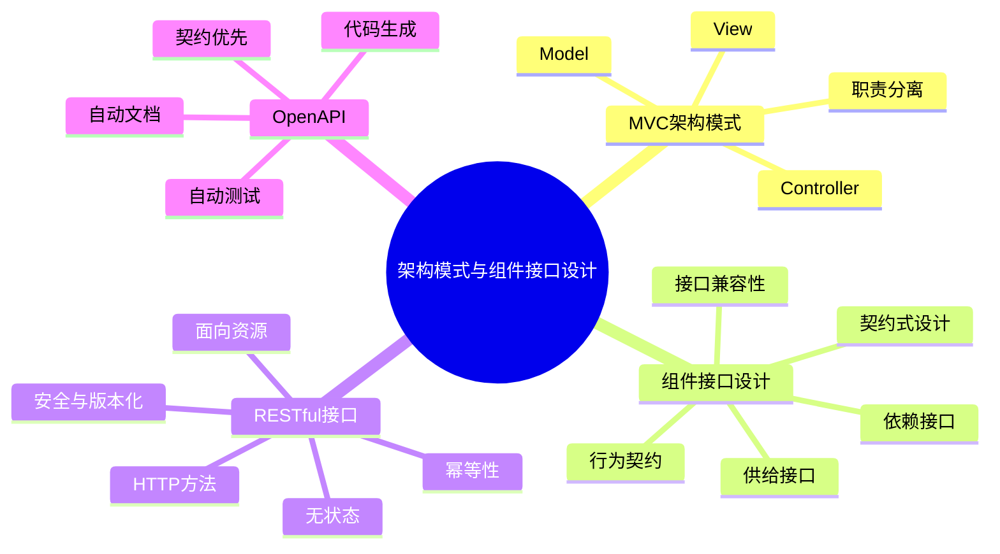
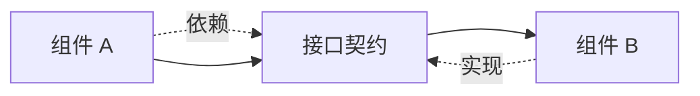
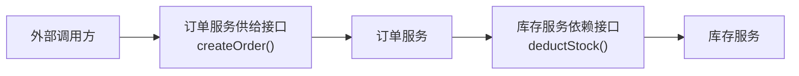
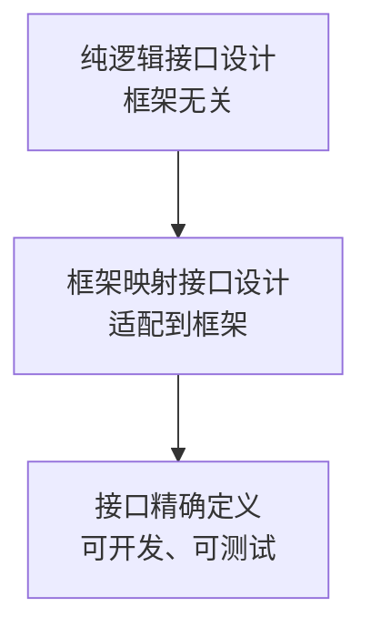
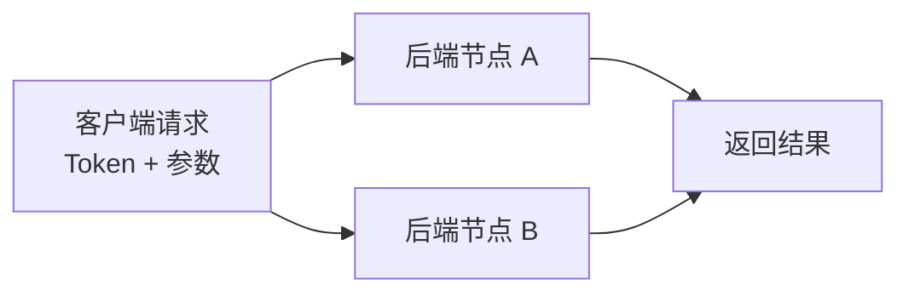
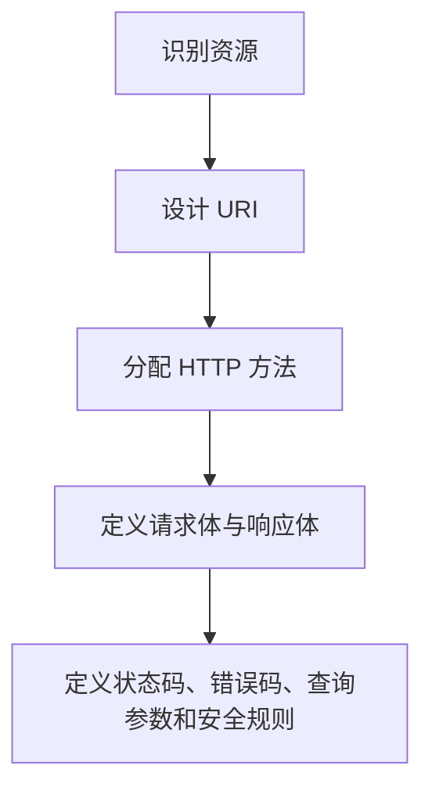
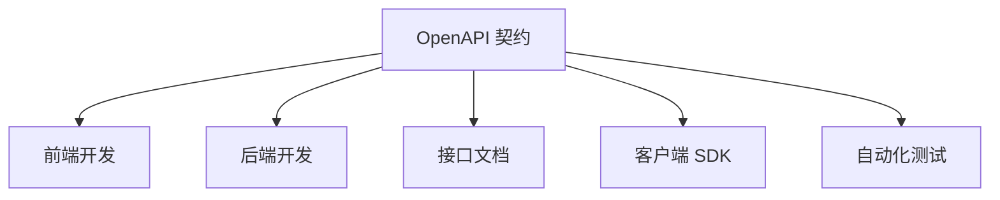

# 架构模式与组件接口设计

本章从 **MVC 架构模式** 进入，说明职责分离如何落到组件划分；随后讨论组件接口如何作为行为契约；最后落到前后端分离中常见的 **RESTful API** 和 **OpenAPI**。

这章的主线可以记成：**架构模式给出职责分离，接口定义组件契约，RESTful 规范网络接口，OpenAPI 让接口契约工程化**。

## MVC 架构模式

MVC（Model-View-Controller）是一种经典职责分离模式。

它把系统分成三类职责：

- **Model**：管理数据、业务规则和状态。
- **View**：展示数据和渲染界面。
- **Controller**：接收请求、调用模型、选择视图。

MVC 的核心目标是降低耦合：

- 数据和业务逻辑可以独立变化。
- 界面展示可以独立变化。
- 交互控制可以独立变化。

### MVC 三大组件

| 组件 | 职责 | 不应该负责 |
|---|---|---|
| Model | 业务规则、数据校验、状态维护、持久化协作 | 页面渲染、用户交互细节 |
| View | 展示数据、组织界面、渲染输出 | 业务规则和核心状态修改 |
| Controller | 接收请求、流程控制、调用 Model、选择 View | 长期保存业务状态 |

### MVC 与分析类

MVC 和用例分析中的三类分析类有对应关系。

| 用例分析类 | MVC 组件 | 对应关系 |
|---|---|---|
| 实体类 Entity | Model | 管理业务数据、规则和状态 |
| 边界类 Boundary | View | 负责外部交互和输入输出 |
| 控制类 Controller | Controller | 协调用例流程和对象交互 |

需要注意：经典 MVC 中 Model 可能主动通知 View 刷新；分析阶段的实体类通常更偏被动。这不是矛盾，而是从概念分析落到交互架构时做出的设计适配。

### MVC 的接口启示

MVC 不只是 UI 模式，它也说明了组件如何通过接口协作。

| 组件 | 暴露的接口 |
|---|---|
| Model | 业务操作接口 |
| View | 渲染接口 |
| Controller | 请求处理接口 |

组件边界明确之后，接口就成为边界之间的通信契约。

## 组件接口设计

接口是软件组件对外暴露的 **行为契约**。

接口规定：

- 组件能做什么。
- 调用方如何与组件交互。
- 输入是什么。
- 输出是什么。
- 约束条件是什么。

接口不应该暴露：

- 内部实现。
- 内部数据结构。
- 内部调用链。
- 临时技术细节。

接口是架构设计落地到代码、协议和框架的关键桥梁。

## 接口设计原则

| 原则 | 含义 |
|---|---|
| 最小权限原则 | 只暴露调用方真正需要的能力 |
| 单一职责原则 | 一个接口围绕一个稳定职责，不做万能接口 |
| 无环依赖原则 | 接口之间不要形成循环依赖 |
| 稳定抽象原则 | 越稳定的能力越应该抽象成接口 |
| 契约不可侵犯原则 | 发布后的签名、参数、返回值不能随意破坏 |
| 向后兼容原则 | 新版本应尽量兼容旧调用方 |

例子：订单服务对外暴露 `createOrder()`，不应该暴露内部如何调用库存、优惠券、支付服务。

### 供给接口与依赖接口

每个组件都有两种角色：

- **服务提供者**：对外提供能力。
- **服务消费者**：依赖外部能力完成自身职责。

| 类型 | 含义 | 示例 |
|---|---|---|
| 供给接口 | 组件对外提供的服务 | 订单服务提供 `createOrder()` |
| 依赖接口 | 组件完成自身功能所需要的外部服务 | 订单服务依赖库存服务 `deductStock()` |

供给接口回答“我能提供什么”，依赖接口回答“我需要什么”。

### 接口粒度

接口粒度指接口包含的操作数量和业务跨度。

| 类型 | 特点 | 优点 | 缺点 | 适用场景 |
|---|---|---|---|---|
| 细粒度接口 | 一个接口只做很小的操作 | 灵活、可复用 | 调用次数多，分布式场景网络开销大 | 进程内模块调用 |
| 粗粒度接口 | 一次调用完成完整业务动作 | 调用次数少，调用方简单 | 灵活性差，复用性差 | 微服务、前后端 API |

微服务间接口通常更偏粗粒度，因为网络调用成本高于进程内调用。

### 接口兼容性

接口发布后，必须考虑兼容性。

核心原则是：**不要让调用方为你的升级买单**。

兼容性规则：

- 不新增必填字段。
- 不把已有可选字段改成必填。
- 不改变已有字段类型。
- 不改变已有字段语义。
- 可以新增可选字段。
- 不应直接删除已有接口或字段。

| 类型 | 含义 |
|---|---|
| 向后兼容 | 新服务兼容旧调用方，调用方不升级也能工作 |
| 向前兼容 | 旧服务尽量兼容新调用方，服务端不升级也能处理部分新请求 |

## 接口设计流程

接口设计可以分成三个层次。

### 纯逻辑接口

纯逻辑接口只关注业务契约。

需要确定：

- 组件能做什么。
- 操作名是什么。
- 参数是什么。
- 返回什么。
- 前置条件和后置条件是什么。

输出通常是供给接口清单和依赖接口清单。

### 框架映射接口

框架映射接口把逻辑接口落到具体技术框架。

例如：

- Spring 的 `@Service`。
- Spring MVC 的 `@Controller`。
- NestJS 的 Controller 和 Provider。
- gRPC 的 service 定义。

这里开始出现框架约束，但仍然要避免让框架细节污染业务契约。

### 接口精确定义

精确定义用于让接口可开发、可测试、可生成。

常见形式：

- OpenAPI。
- Protobuf。
- GraphQL Schema。

输出包括接口文档、测试契约、客户端 SDK 或服务端代码骨架。

## 契约式设计

契约式设计（Design by Contract）把接口看成一份严谨契约。

| 契约元素 | 含义 | 示例 |
|---|---|---|
| 前置条件 | 调用接口前必须满足的条件 | 扣减库存前，库存必须大于等于扣减数量 |
| 后置条件 | 接口成功执行后必须满足的条件 | 扣减成功后，库存减少指定数量 |
| 不变量 | 无论接口是否调用，都必须始终成立 | 库存始终不能小于 0 |

契约式设计可以让接口从“函数说明”变成“行为保证”。

## RESTful 接口设计

REST（Representational State Transfer）是一种网络应用架构风格。

RESTful 指遵循 REST 风格设计的接口或服务。

REST 的核心思想是：**面向资源，用 URI 定位资源，用 HTTP 方法表达动作**。

### 面向资源

资源应该用名词表达。

| 错误示例 | 问题 | 正确示例 |
|---|---|---|
| `/getUser` | 用动词描述动作 | `GET /users/{id}` |
| `/createOrder` | URI 中混入操作 | `POST /orders` |
| `/deleteOrder` | 动作应交给 HTTP 方法 | `DELETE /orders/{id}` |

URI 设计规则：

- 使用名词复数，例如 `/users`、`/orders`。
- 使用层次结构表达从属关系，例如 `/orders/{orderId}/items`。
- 不暴露实现细节，例如 `.php`、`.jsp`。
- 多词可以使用连字符，例如 `/order-histories`。

### URI、URL 与 Path

| 概念 | 含义 |
|---|---|
| URI | 统一资源标识符，用于唯一标识资源 |
| URL | URI 的一种，同时包含访问地址 |
| Path | URL 中用于定位资源的路径部分 |

日常设计 REST API 时，重点通常是设计清晰的 Path。

### HTTP 方法

| 操作 | HTTP 方法 | 语义 | 幂等性 | 示例 |
|---|---|---|---|---|
| 查询列表 | `GET` | 获取资源集合 | 是 | `GET /orders` |
| 查询单个 | `GET` | 获取单个资源 | 是 | `GET /orders/123` |
| 新增 | `POST` | 服务端生成 ID 创建资源 | 否 | `POST /orders` |
| 全量覆盖 | `PUT` | 客户端指定 ID，有则改、无则创 | 是 | `PUT /orders/123` |
| 局部修改 | `PATCH` | 修改部分字段 | 建议保持幂等 | `PATCH /orders/123` |
| 删除 | `DELETE` | 删除指定资源 | 是 | `DELETE /orders/123` |

### 幂等性

幂等性指多次调用同一个接口，产生的效果与调用一次相同。

幂等性很重要，因为网络请求可能超时、重试或重复提交。

基本规则：

- `GET` 必须幂等。
- `PUT` 必须幂等。
- `DELETE` 必须幂等。
- `POST` 通常不幂等。

支付、下单、扣库存这类接口如果使用 `POST`，通常需要额外设计幂等键。

### 无状态

无状态指服务端不保存客户端会话状态，每次请求都必须携带必要信息。

无状态的好处：

- 任意后端节点都能处理请求。
- 更容易水平扩展。
- 更容易做负载均衡和故障转移。
- 服务端逻辑更容易测试。

## RESTful 设计规范

RESTful 接口设计可以按下面流程推进。

### 请求与响应

请求体和响应体通常使用 JSON。

响应体可以统一为：

| 字段 | 含义 |
|---|---|
| `code` | 业务码 |
| `msg` | 消息描述 |
| `data` | 响应数据 |

HTTP 状态码表达协议层结果，业务码表达业务语义。

### 状态码与业务码

| 状态码 | 含义 |
|---|---|
| `200` | 请求成功 |
| `201` | 创建成功 |
| `400` | 参数错误 |
| `401` | 未登录 |
| `403` | 无权限 |
| `404` | 资源不存在 |
| `409` | 冲突，例如重复提交 |
| `500` | 服务端错误 |

业务错误码可以按模块划分：

| 范围 | 含义 |
|---|---|
| `1000` 系列 | 用户参数 |
| `2000` 系列 | 订单相关 |
| `3000` 系列 | 库存相关 |
| `9000` 系列 | 系统错误 |

### 查询参数

常见查询参数包括：

| 类型 | 参数示例 |
|---|---|
| 分页 | `pageNum`、`pageSize` |
| 搜索 | `keyword` |
| 排序 | `sortField`、`sortOrder` |
| 时间范围 | `startTime`、`endTime` |

示例：

- `GET /orders?pageNum=1&pageSize=10`
- `GET /orders?keyword=headphone`
- `GET /orders?sortField=createTime&sortOrder=desc`
- `GET /orders?startTime=2026-01-01&endTime=2026-01-31`

### 安全与版本化

| 设计点 | 说明 |
|---|---|
| 身份认证 | 使用 `Authorization: Bearer {token}` |
| 接口限流 | 限制单位时间内请求次数 |
| 防重放 | 使用时间戳和 nonce 验证请求唯一性 |
| 输入校验 | 所有外部输入都必须校验 |

常见接口版本化方式：

| 策略 | 示例 | 特点 |
|---|---|---|
| URI 版本化 | `GET /api/v1/orders` | 最直观、最常用 |
| 请求头版本化 | `Accept-Version: v1` | URI 干净，但不够直观 |
| 媒体类型版本化 | `Accept: application/vnd.example.v1+json` | 更规范，但使用复杂 |

## RESTful 接口示例

| 模块 | 接口 | 含义 |
|---|---|---|
| 用户 | `GET /api/v1/users` | 查询用户列表 |
| 用户 | `GET /api/v1/users/{userId}` | 查询单个用户 |
| 用户 | `POST /api/v1/users` | 创建用户 |
| 用户 | `PUT /api/v1/users/{userId}` | 全量更新用户 |
| 用户 | `PATCH /api/v1/users/{userId}` | 局部更新用户 |
| 用户 | `DELETE /api/v1/users/{userId}` | 删除用户 |
| 订单 | `GET /api/v1/orders` | 查询订单列表 |
| 订单 | `GET /api/v1/orders/{orderId}` | 查询订单详情 |
| 订单 | `POST /api/v1/orders` | 创建订单 |
| 订单 | `PATCH /api/v1/orders/{orderId}` | 修改订单状态 |
| 库存 | `GET /api/v1/stock/{productId}` | 查询商品库存 |
| 库存 | `POST /api/v1/stock` | 初始化库存 |
| 库存 | `PATCH /api/v1/stock/{productId}` | 扣减或增加库存 |

## OpenAPI

OpenAPI 是 RESTful API 的设计蓝图和技术契约。

它可以让开发者和工具在不阅读源代码的情况下理解服务能力。

补充：

- OpenAPI 前身是 Swagger。
- Swagger 后来捐赠给 Linux 基金会并更名为 OpenAPI。
- OpenAPI 支持 JSON 和 YAML。
- YAML 更适合人工阅读，JSON 更适合机器处理。

### 契约优先

OpenAPI 的核心思想是 **契约优先（Contract-First）**。

也就是先定义接口契约，再并行开发前端、后端、测试和文档。

契约优先可以减少口头沟通偏差，让接口成为团队协作的共同事实来源。

### 核心价值

| 价值 | 说明 |
|---|---|
| 统一沟通语言 | 产品、前端、后端、测试共享同一份接口定义 |
| 自动生成文档 | 生成 Swagger UI、ReDoc 等可交互文档 |
| 自动生成代码 | 生成服务端骨架或客户端 SDK |
| 自动化测试 | 基于契约生成测试或校验实现是否符合规范 |
| 工具生态丰富 | API 网关、监控、安全扫描等工具可直接读取规范 |

### 核心组成

| 部分 | 作用 |
|---|---|
| `openapi` | 指定 OpenAPI 规范版本 |
| `info` | API 标题、版本、描述等元信息 |
| `servers` | API 可访问的服务器地址 |
| `paths` | 定义 URI 和 HTTP 方法，是核心部分 |
| `components` | 可复用组件，例如 schema、参数、响应 |

常见工具：

| 类型 | 工具 |
|---|---|
| 文档与调试 | Swagger UI、ReDoc |
| 代码生成 | OpenAPI Generator |
| 框架支持 | Spring Boot、NestJS、FastAPI |

## 复习要点

- **MVC** 的核心是职责分离。
- **Model** 管理数据、业务逻辑和状态。
- **View** 负责展示和渲染。
- **Controller** 负责请求处理和流程调度。
- 接口是组件对外暴露的 **行为契约**。
- 接口设计要关注最小权限、单一职责、无环依赖、稳定抽象和兼容性。
- 供给接口是“我提供什么”，依赖接口是“我需要什么”。
- REST 的核心是 **面向资源**。
- URI 用名词定位资源，HTTP 方法表达动作。
- RESTful 接口需要重点理解 **幂等性** 和 **无状态**。
- OpenAPI 是 RESTful 接口的工程化契约，支持文档、代码和测试生成。

## 易混点

| 易混概念 | 区别 |
|---|---|
| REST 与 RESTful | REST 是架构风格，RESTful 是遵循 REST 风格的接口或服务 |
| URI 与 URL | URI 标识资源，URL 是 URI 的一种并包含访问地址 |
| POST 与 PUT | POST 通常不幂等且由服务端生成 ID，PUT 通常幂等且全量替换 |
| PATCH 与 PUT | PATCH 是局部修改，PUT 是全量覆盖 |
| HTTP 状态码与业务错误码 | HTTP 状态码表达协议层结果，业务码表达业务语义 |
| 普通接口文档与 OpenAPI | 普通文档只是说明，OpenAPI 是可被工具解析、生成和测试的契约 |
