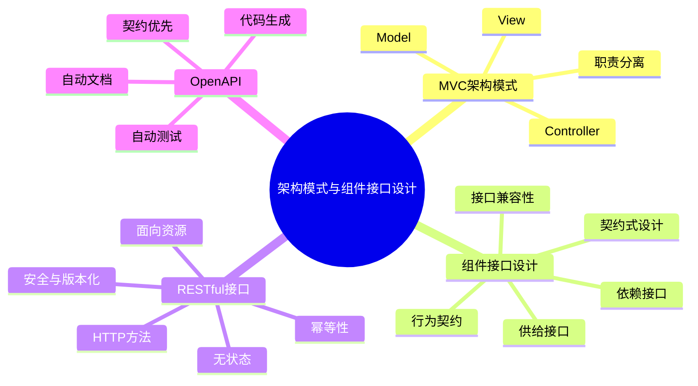
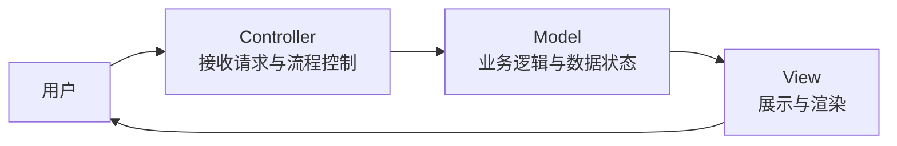
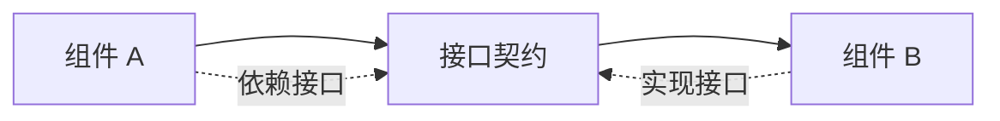
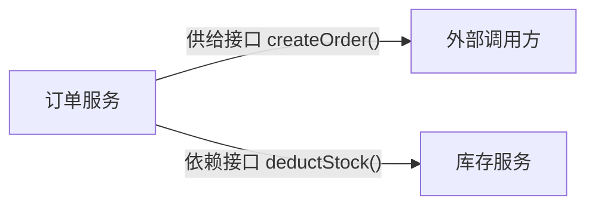
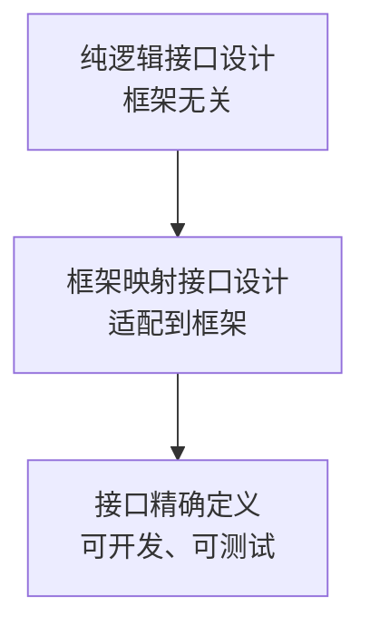
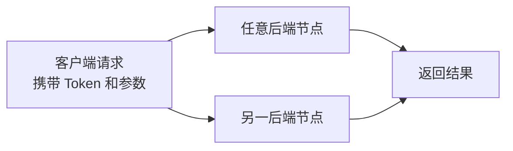
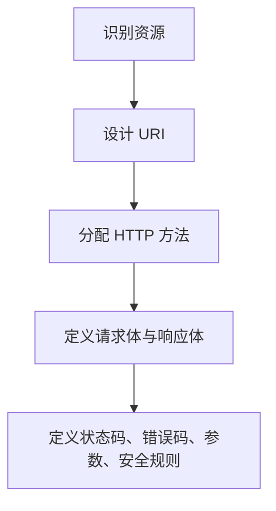
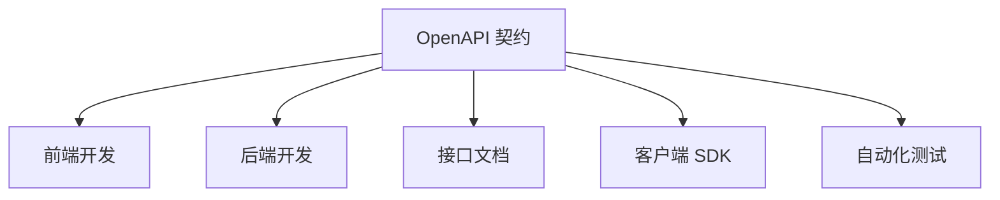

# 架构模式与组件接口设计

**范围**：章节六，架构模式与组件接口设计  
**整理方式**：按“MVC → 组件接口 → RESTful → OpenAPI”重组。

## 核心脉络

本章从 **MVC 架构模式** 切入，说明职责分离如何落到组件划分；再进一步讨论 **组件接口设计**，最后落到前后端分离中最常见的 **RESTful 接口** 和工程化接口规范 **OpenAPI**。

## MVC 架构模式

### 核心思想

**MVC（Model-View-Controller）** 是经典的职责分离模式。

它的核心思想是 **职责分离（Separation of Concerns）**：

- 数据与业务逻辑独立变化。
- 用户界面展示独立变化。
- 用户交互控制独立变化。
- 三者互不干扰，降低耦合。

目标：

- 提升 **可维护性**。
- 提升 **可测试性**。
- 提升 **可扩展性**。

### 三大组件

| 组件 | 职责 | 包含内容 | 特点 |
|---|---|---|---|
| **Model** | 负责数据管理、业务逻辑和状态维护 | 业务规则、数据校验、数据持久化 | 独立于界面，不关心数据如何展示 |
| **View** | 负责数据展示和渲染 | 页面、表单、图表、UI 组件 | 被动展示数据，不处理业务逻辑 |
| **Controller** | 接收用户请求、调用模型处理业务、选择视图展示 | 请求处理、流程控制、业务调度 | 连接 Model 和 View，协调交互 |

### MVC 与分析类的对应

MVC 与用例分析中的三类分析类高度对应。

| 用例分析类 | MVC 组件 | 对应关系 |
|---|---|---|
| **实体类 Entity** | **Model** | 都负责管理数据、业务规则和状态 |
| **边界类 Boundary** | **View** | 都负责与外部参与者交互，处理输入输出 |
| **控制类 Controller** | **Controller** | 都负责协调用例流程，调用实体或模型完成业务目标 |

注意：

- 经典 MVC 中，Model 可能主动通知 View，以便界面实时刷新。
- 用例分析阶段强调实体类被动，不主动发通知。
- 这不是矛盾，而是从分析模型落地到架构设计时，为交互体验做出的合理适配。

### MVC 的接口启示

MVC 的本质是一套组件划分和接口定义规范。

它展示了：

- 如何通过职责分离划分组件。
- 如何通过接口实现组件间解耦和交互。
- 组件调用关系本质上就是接口依赖关系。

| 组件 | 暴露的接口 |
|---|---|
| **Model** | 业务操作接口，定义系统能执行哪些核心业务 |
| **View** | 渲染接口，定义数据如何展示 |
| **Controller** | 请求处理接口，定义系统能接收哪些外部请求 |

## 组件接口设计

### 接口的定义

**接口** 是软件组件对外暴露的 **行为契约**。

接口规定：

- 组件能做什么。
- 如何与组件交互。
- 输入是什么。
- 输出是什么。
- 有哪些约束条件。

接口不暴露：

- 内部实现。
- 内部调用细节。
- 内部数据结构。

### 接口在架构中的作用

接口是架构落地的关键。

- **组件契约**
  - 定义组件之间的交互规则。
  - 是组件间通信的唯一依据。
- **依赖关系载体**
  - 组件间依赖关系，本质上是接口间依赖关系。
- **架构到技术栈的桥梁**
  - 将抽象架构设计连接到框架、语言、协议等具体实现。

## 接口设计原则

### 通用原则

| 原则 | 含义 |
|---|---|
| **最小权限原则** | 只暴露组件必须具备的能力，隐藏不必要细节 |
| **单一职责原则** | 一个接口只负责一件事，避免万能接口 |
| **无环依赖原则** | 接口依赖不能形成环路，否则系统耦合度极高 |
| **稳定抽象原则** | 越稳定、不易变化的组件，其接口越应该抽象 |
| **契约不可侵犯原则** | 接口发布后，方法签名、参数、返回值不能随意破坏 |
| **向后兼容原则** | 接口升级必须保证旧调用方仍能正常工作 |

例子：

- 订单服务接口不应暴露内部调用库存服务的细节。
- 调用方只需要知道“能创建订单”，不需要知道里面怎样扣库存。

### 供给接口与依赖接口

每个组件在架构中都有两种角色：

- 服务的 **提供者**。
- 服务的 **消费者**。

组件之间的交互，就是一个组件的 **供给接口** 满足另一个组件的 **依赖接口**。

| 类型 | 含义 | UML 表示 | 示例 |
|---|---|---|---|
| **供给接口（Provided Interface）** | 组件对外提供的服务和能力 | 实心圆 lollipop | 订单服务提供 `createOrder()` |
| **依赖接口（Required Interface）** | 组件完成自身功能所依赖的外部服务 | 空心圆 socket | 订单服务依赖库存服务 `deductStock()` |

### 接口粒度

**接口粒度** 指接口包含的操作数量和复杂度。

| 类型 | 特点 | 优点 | 缺点 | 适用场景 |
|---|---|---|---|---|
| **细粒度接口** | 一个接口只做非常具体的事 | 灵活、可复用性强 | 调用次数多，分布式环境下网络开销大 | 内部模块调用 |
| **粗粒度接口** | 一次调用完成完整业务功能 | 减少调用次数，简化调用方逻辑 | 灵活性较差，复用性较差 | 微服务间调用、前后端 API |

**复习提示**：微服务间接口通常优先粗粒度，因为网络调用比进程内调用更贵。

### 接口兼容性

接口一旦发布，就必须保证兼容性。

核心原则：

**永远不要让调用方为你的升级买单。**

兼容性法则：

- **不改必填**
  - 不能新增必填字段。
  - 不能把已有非必填字段改为必填。
- **不改类型或语义**
  - 不能改变已有字段类型。
  - 不能改变已有字段业务含义。
- **只加不减**
  - 可以新增接口或字段。
  - 不应删除已有接口或字段。
- **新增可选**
  - 新字段必须可选。

两种兼容性：

| 类型 | 含义 |
|---|---|
| **向后兼容** | 新服务兼容旧调用方，调用方不升级也能工作 |
| **向前兼容** | 旧服务兼容新调用方，服务端不升级也尽量能工作 |

## 接口设计流程

标准接口设计流程可以分为三步：

### 纯逻辑接口设计

关注：

- 组件能做什么。
- 操作名是什么。
- 参数是什么。
- 返回什么。
- 有哪些约束。

输出：

- 组件提供接口清单。
- 组件依赖接口清单。

### 框架映射接口设计

将逻辑接口映射到具体框架。

例如：

- Spring 的 `@Service`。
- Spring 的 `@Controller`。
- 框架适配后的组件类型。
- 框架内的调用方式。

### 接口精确定义

用标准化格式描述完整契约。

例如：

- **OpenAPI**
- **Protobuf**

输出：

- 接口文档。
- 可生成代码的规范。
- 可测试的接口契约。

## 两种接口设计方法

### 契约式设计

**契约式设计（Design by Contract, DbC）** 将接口视为一份严谨契约。

契约包含：

| 契约元素 | 含义 |
|---|---|
| **前置条件** | 调用接口前必须满足的条件 |
| **后置条件** | 接口成功执行后必须满足的条件 |
| **不变量** | 无论接口是否调用，都必须始终为真的状态 |

例如调用 `deductStock()`：

- 前置条件：库存大于等于要扣减的数量。
- 后置条件：库存减少指定数量。
- 不变量：库存始终大于等于 0。

### 面向服务的接口设计

**面向服务的接口设计** 将接口视为服务能力的体现。

需要考虑：

- 接口类型：同步或异步。
- 接口粒度。
- 数据结构：DTO。
- 传输协议。
- 序列化格式。
- 安全策略。
- 容错策略。
- 版本策略。
- 文档规范。

## RESTful 接口设计

### REST 与 RESTful

**REST（Representational State Transfer）** 是一种软件架构风格，由 Roy Fielding 在 2000 年提出，用于设计网络应用。

**RESTful** 指遵循 REST 风格设计的接口或服务。

它不是一个强制标准，而是一套设计原则和约束条件。

前后端分离架构需要接口具备：

- **跨平台**
  - Web、小程序、App 都能调用。
- **高并发**
  - 支持大规模并发请求。
- **可扩展**
  - 方便水平扩展。
- **标准化**
  - 前后端有统一协作规范。

### 面向资源

REST 的核心思想是 **面向资源（Resource-Oriented）**。

REST 将系统中的事物都视为资源。

资源是名词，例如：

- 用户。
- 订单。
- 商品。
- 库存。

设计接口时：

- 不用动词命名接口。
- 用 URI 定位资源。
- 用 HTTP 方法表达动作。

| 错误示例 | 正确示例 |
|---|---|
| `/getUser` | `GET /users` |
| `/createOrder` | `POST /orders` |
| `/deleteOrder` | `DELETE /orders/{id}` |

### URI、URL 与 Path

| 概念 | 含义 |
|---|---|
| **URI** | 统一资源标识符，用于唯一标识资源 |
| **URL** | URI 的一种，不仅标识资源，还提供访问地址 |
| **Path** | REST 接口中 URI 的路径部分，用于定位资源 |

URI 设计规则：

- 使用名词复数：`GET /users`，不要写 `GET /user`。
- 使用层次化结构：`GET /orders/{orderId}/items`。
- 不暴露实现细节：避免 `.php`、`.jsp` 等后缀。
- 使用连字符分隔单词：`GET /order-histories`。

### HTTP 方法

| 操作 | HTTP 方法 | 语义 | 幂等性 | 示例 |
|---|---|---|---|---|
| 查询列表 | `GET` | 获取资源集合 | 是 | `GET /orders` |
| 查询单个 | `GET` | 获取单个资源 | 是 | `GET /orders/123` |
| 新增 | `POST` | 服务端生成 ID 创建资源 | 否 | `POST /orders` |
| 全量覆盖 | `PUT` | 客户端指定 ID，有则改、无则创 | 是 | `PUT /orders/123` |
| 局部修改 | `PATCH` | 只修改请求体中提供的字段 | 建议是 | `PATCH /orders/123` |
| 删除 | `DELETE` | 删除指定资源 | 是 | `DELETE /orders/123` |

### 幂等性

**幂等性（Idempotency）** 指多次调用同一个接口，产生的效果与调用一次完全相同。

重要性：

- 网络不稳定时请求可能重试。
- 幂等性能保证系统行为确定。
- 避免重复扣款、重复创建等问题。

规则：

- `GET` 必须幂等。
- `PUT` 必须幂等。
- `DELETE` 必须幂等。
- `POST` 通常不幂等。

### 无状态

**无状态（Stateless）** 指服务端不保存客户端会话状态。

每次请求必须携带所有必要信息。

价值：

- **高可用**
  - 任意服务器都能处理任意请求。
- **高并发**
  - 服务端不用维护会话。
- **易扩展**
  - 更容易水平扩展。
- **易测试维护**
  - 服务端逻辑更简单。

## RESTful 设计规范

### 标准流程

### 请求与响应

请求体和响应体通常统一使用 JSON。

响应体建议统一结构：

- **code**：业务码。
- **msg**：消息描述。
- **data**：响应数据。

注意：

- JSON 正式格式不允许注释。
- 教学示例里的注释不能出现在真实 JSON 中。

### 状态码与业务错误码

常见 HTTP 状态码：

| 状态码 | 含义 |
|---|---|
| **200** | OK，成功 |
| **201** | Created，创建成功 |
| **400** | Bad Request，参数错误 |
| **401** | Unauthorized，未登录 |
| **403** | Forbidden，无权限 |
| **404** | Not Found，资源不存在 |
| **409** | Conflict，冲突，如重复提交 |
| **500** | Internal Server Error，服务错误 |

业务错误码示例：

| 范围 | 含义 |
|---|---|
| **1000 系列** | 用户参数 |
| **2000 系列** | 订单相关 |
| **3000 系列** | 库存相关 |
| **9000 系列** | 系统错误 |

### 查询参数

REST 查询参数本质上是把网页列表功能接口化。

常见参数：

- **分页**
  - `pageNum`
  - `pageSize`
- **搜索**
  - `keyword`
- **排序**
  - `sortField`
  - `sortOrder`
- **时间范围**
  - `startTime`
  - `endTime`

示例：

- `GET /orders?pageNum=1&pageSize=10`
- `GET /orders?keyword=headphone`
- `GET /orders?sortField=createTime&sortOrder=desc`
- `GET /orders?startTime=2026-01-01&endTime=2026-01-31`

### 安全规范

| 安全措施 | 含义 |
|---|---|
| **身份认证 Token** | 登录后服务端颁发 Token，客户端通过 `Authorization: Bearer {token}` 携带 |
| **接口限流** | 限制单位时间请求次数，防止恶意攻击或滥用 |
| **防重放** | 请求中加入时间戳和 nonce，服务端验证唯一性和时效性 |

### 接口版本化

接口会迭代升级，但必须保持旧调用方兼容。

常见版本化策略：

| 策略 | 示例 | 特点 |
|---|---|---|
| **URI 版本化** | `GET /api/v1/orders` | 最常用，直观清晰 |
| **请求头版本化** | `Accept-Version: v1` | URI 更干净，但不够直观 |
| **媒体类型版本化** | `Accept: application/vnd.mycompany.v1+json` | 更规范，但使用复杂 |

## RESTful 接口示例

### 用户模块

- `GET /api/v1/users`：用户列表。
- `GET /api/v1/users/{userId}`：获取单个用户。
- `POST /api/v1/users`：创建用户。
- `PUT /api/v1/users/{userId}`：全量更新用户。
- `PATCH /api/v1/users/{userId}`：局部更新用户。
- `DELETE /api/v1/users/{userId}`：删除用户。

### 订单模块

- `GET /api/v1/orders`：订单列表。
- `GET /api/v1/orders/{orderId}`：订单详情。
- `POST /api/v1/orders`：创建订单。
- `PUT /api/v1/orders/{orderId}`：全量替换订单。
- `PATCH /api/v1/orders/{orderId}`：修改订单状态。
- `DELETE /api/v1/orders/{orderId}`：取消或删除订单。

### 库存模块

- `GET /api/v1/stock/{productId}`：查询商品库存。
- `POST /api/v1/stock`：初始化库存。
- `PATCH /api/v1/stock/{productId}`：扣减或增加库存。

## OpenAPI

### 基本概念

**OpenAPI** 是 RESTful 接口的 **设计蓝图** 和 **技术契约**。

它用于描述 RESTful API，让开发者或机器在不访问源代码、不依赖人工文档、不检查网络流量的情况下理解服务功能。

补充：

- OpenAPI 前身是 Swagger。
- Swagger 于 2015 年捐赠给 Linux 基金会后改名为 OpenAPI。
- OpenAPI 支持 JSON 和 YAML。
- YAML 因可读性较好更常用。

### 契约优先

OpenAPI 的核心思想是 **契约优先（Contract-First）**。

也就是：

- 在写代码之前，先定义接口契约。
- 这份契约作为前后端、服务间协作的唯一依据。
- 代码、文档、测试都围绕契约生成或验证。

### 核心价值

| 价值 | 说明 |
|---|---|
| **统一沟通语言** | 为产品、开发、测试提供清晰无二义的接口文档 |
| **自动化文档生成** | 生成可交互 API 文档，如 Swagger UI |
| **自动化代码生成** | 生成服务端框架代码、客户端 SDK |
| **自动化测试** | 基于规范生成测试用例，验证实现是否符合设计 |
| **生态丰富** | API 网关、监控工具、安全工具广泛支持 |

### 核心组成

| 部分 | 作用 |
|---|---|
| **openapi** | 指定 OpenAPI 规范版本 |
| **info** | API 元数据，如标题、版本、描述 |
| **paths** | 定义所有 URI 和对应 HTTP 方法，是文档核心 |
| **components** | 可复用组件，如 schemas、响应、参数 |
| **servers** | 指定 API 可访问的服务器地址 |

### 工具生态

| 类型 | 工具 |
|---|---|
| **文档与调试** | Swagger UI、ReDoc |
| **代码生成** | OpenAPI Generator |
| **框架支持** | Spring Boot、NestJS 等 |

## 复习要点

- **MVC** 的核心是职责分离。
- MVC 三大组件：
  - **Model**：数据、业务逻辑、状态。
  - **View**：展示和渲染。
  - **Controller**：请求处理和流程调度。
- 接口是组件对外暴露的 **行为契约**。
- 接口设计要遵循：
  - **最小权限**
  - **单一职责**
  - **无环依赖**
  - **稳定抽象**
  - **兼容性**
- 供给接口是“我提供什么”，依赖接口是“我需要什么”。
- REST 的核心是 **面向资源**。
- URI 用名词定位资源，HTTP 方法表达动作。
- REST 两大基石：
  - **幂等性**
  - **无状态**
- OpenAPI 是 RESTful 接口的工程化契约。
- OpenAPI 的核心价值是让接口从“手工描述”变成 **可生成、可测试、可协作** 的工程资产。

## 易混点

- **REST 与 RESTful**
  - REST 是架构风格。
  - RESTful 是遵循 REST 风格的接口或服务。
- **URI 与 URL**
  - URI 标识资源。
  - URL 是 URI 的一种，并包含访问地址。
- **POST 与 PUT**
  - POST 通常由服务端生成 ID，通常不幂等。
  - PUT 通常由客户端指定 ID，全量替换，必须幂等。
- **PATCH 与 PUT**
  - PUT 是全量覆盖。
  - PATCH 是局部修改。
- **HTTP 状态码与业务错误码**
  - HTTP 状态码表达协议层结果。
  - 业务错误码表达业务异常细分。
- **接口文档与 OpenAPI**
  - 普通文档只是说明。
  - OpenAPI 是可被工具解析、生成、测试的契约。

