# 分布式系统基础设施

本章关注支撑高并发、高吞吐和高可用的三类基础设施：

- **资源池化**：复用昂贵资源，控制单节点并发能力。
- **缓存体系**：缩短数据访问路径，降低延迟和后端压力。
- **消息中间件**：通过异步通信实现解耦、削峰和最终一致性。

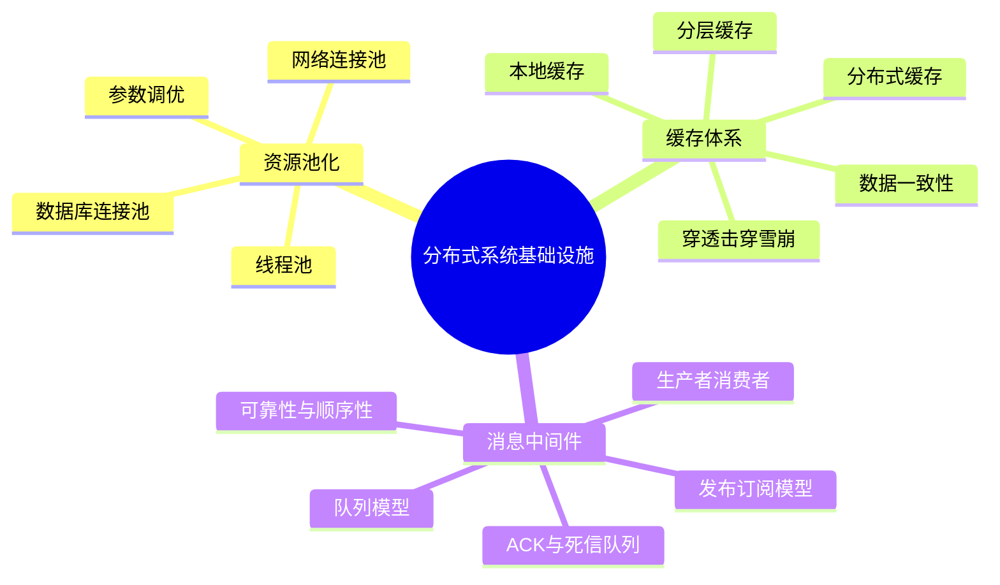

这三类基础设施解决的问题不同，但目标一致：**让系统在更高并发和更多故障下仍然可控**。

## 资源池化

资源池化是把昂贵资源集中管理、重复使用。

常见被池化的资源包括：

- 线程。
- 数据库连接。
- HTTP、RPC、gRPC 网络连接。
- 对象实例。

资源池化的核心不是无限创建资源，而是通过上限、队列和拒绝策略控制系统压力。

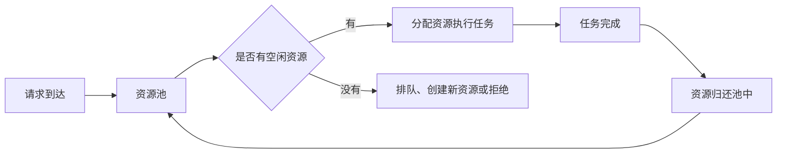

资源池决定的是单节点承载能力。池太小会阻塞，池太大会放大上下文切换和下游压力。

## 线程池

线程池管理线程资源。

它要解决两个问题：

- 频繁创建和销毁线程成本高。
- 线程过多会造成上下文切换，降低整体吞吐。

线程池的基本流程：

- 提前创建或按需创建线程。
- 任务进入任务队列。
- 空闲线程从队列取任务执行。
- 执行完成后线程不销毁，而是等待下一次任务。

### 线程池关键参数

| 参数 | 含义 |
|---|---|
| `corePoolSize` | 核心线程数，即使空闲也保留 |
| `maxPoolSize` | 最大线程数，限制可创建线程上限 |
| `workQueue` | 任务队列，用于缓冲待执行任务 |
| `RejectedExecutionHandler` | 队列和线程都满时的拒绝策略 |

### 任务提交流程

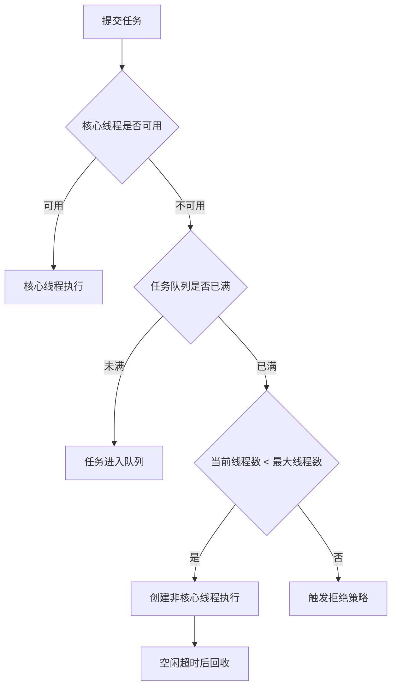

### 拒绝策略

| 策略 | 行为 | 适用理解 |
|---|---|---|
| `AbortPolicy` | 直接抛异常 | 快速暴露过载 |
| `CallerRunsPolicy` | 提交任务的线程自己执行 | 反向降低提交速度，有自然降级效果 |
| `DiscardOldestPolicy` | 丢弃队列中最旧任务后重试 | 适合旧任务价值较低的场景 |
| `DiscardPolicy` | 静默丢弃新任务 | 风险高，必须能接受任务丢失 |

### 队列选择

| 队列类型 | 特点 | 风险 |
|---|---|---|
| 有界队列 | 容量明确，能限制堆积 | 满后触发拒绝策略 |
| 无界队列 | 不容易拒绝任务 | 可能导致内存压力 |
| 同步移交队列 | 不存储任务，直接交给线程 | 不适合大量排队 |

## 数据库连接池

数据库连接池复用数据库连接。

数据库连接创建成本通常包括：

- TCP 建连。
- 数据库认证。
- 连接初始化。

连接池的工作方式：

- 系统启动或首次请求时创建一批连接。
- 请求到来时借用空闲连接。
- 使用完成后归还连接，而不是关闭连接。
- 无连接可用时等待、创建新连接或失败。

| 参数 | 含义 |
|---|---|
| `minPoolSize` | 最小空闲连接数 |
| `maxPoolSize` | 最大连接数，防止压垮数据库 |
| `maxIdleTime` | 空闲连接超时时间 |
| `acquireRetryAttempts` | 获取连接失败后的重试次数 |

数据库连接池不是越大越好。上游连接池过大，可能直接把数据库打满。

## 网络连接池

网络连接池用于复用 HTTP、RPC、gRPC 等网络连接。

目标是：

- 减少建连成本。
- 降低请求延迟。
- 提高连接利用率。
- 提升吞吐量。

| 协议 | 连接复用特点 |
|---|---|
| HTTP/1.1 | Keep-Alive 支持连接复用，但同连接上的请求通常串行 |
| HTTP/2 | 支持多路复用，同一连接可并发处理多个请求 |
| gRPC | 基于 HTTP/2，可在同一连接上并发发送 RPC 请求 |

HTTP/2 和 gRPC 的多路复用能显著提高长连接利用率。

## 资源池参数调优

常见估算方式：

| 资源池 | 调整思路 |
|---|---|
| CPU 密集型线程池 | 线程数接近 CPU 核心数 |
| IO 密集型线程池 | 线程数可按 `CPU核心数 * (1 + 等待时间 / 计算时间)` 估算 |
| 数据库连接池 | 根据数据库最大连接数和业务并发量限制上限 |
| 网络连接池 | 最大连接数可参考 `QPS × 平均请求耗时` |

调优时要同时看：

- 上游请求量。
- 下游承载能力。
- 队列长度。
- 拒绝数量。
- 平均延迟和 P99 延迟。

资源池的本质是 **控制并发，而不是盲目放大并发**。

## 缓存体系

缓存是把经常访问的数据放在离应用更近、访问更快的位置。

缓存的目标：

- 减少数据库访问。
- 避免重复计算。
- 降低磁盘或网络 I/O。
- 提高响应速度。

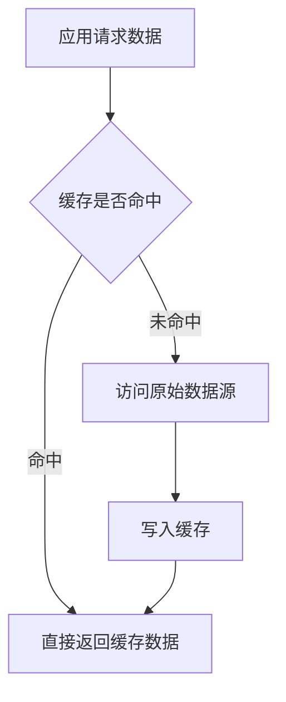

缓存带来的新问题是：**缓存中的数据如何和权威数据源保持一致**。

## 本地缓存

本地缓存把数据放在应用进程内存中。

优点：

- 访问速度极快。
- 不需要网络通信。
- 适合热点数据和重复计算结果。

限制：

- 容量受单机内存限制。
- 应用重启后缓存丢失。
- 多节点部署时缓存不同步。
- 不适合跨节点共享数据。

### 缓存淘汰策略

| 策略 | 原理 | 适合场景 |
|---|---|---|
| LRU | 淘汰最近最少使用的数据 | 时间局部性强的访问 |
| LFU | 淘汰访问频率最低的数据 | 长期热点明显的数据 |
| TTL | 超过生存时间后自动失效 | 有时效性的数据 |

### 并发控制

| 方式 | 原理 | 问题 |
|---|---|---|
| 本地锁 | 同一时刻只允许一个线程修改缓存 | 高并发时锁竞争明显 |
| 分段锁 | 不同数据段使用不同锁 | 锁管理复杂，同段仍会竞争 |

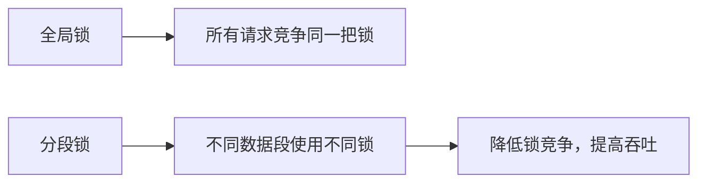

## 分布式缓存

分布式缓存把数据存储在多个缓存节点上。

常见技术：

- Redis。
- Memcached。

特点：

- 可通过增加节点扩展容量。
- 可支持复制和故障转移。
- 多应用节点可以共享缓存。
- 比本地缓存慢，因为需要网络通信。

### 数据分布

大规模缓存集群需要解决：

- Key 如何分布到多个节点。
- 新增或删除节点时如何减少迁移。
- 如何避免热点倾斜。

常见方案是 **一致性哈希**。

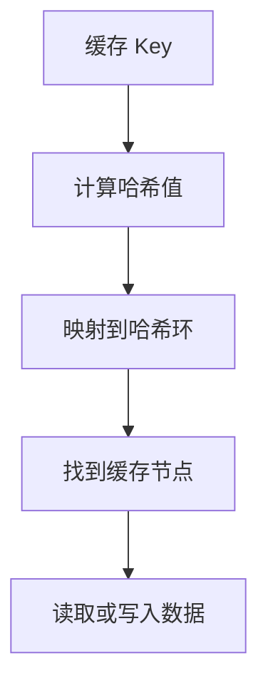

一致性哈希的价值是节点变化时只迁移部分数据，降低扩缩容成本。

### 一致性处理

| 方法 | 思路 |
|---|---|
| 分布式锁 | 写缓存前先加锁，避免多个节点同时写 |
| 数据版本号 | 更新时比较版本，避免旧数据覆盖新数据 |
| 主动更新 | 数据源变化后主动通知缓存刷新 |
| 被动更新 | 缓存过期或访问时再加载新数据 |
| 读写分离 | 写节点保证一致性，读节点承担读流量 |

## 分层缓存

分层缓存把多种缓存组合起来。

典型结构：

- **L1 本地缓存**：最快，容量小。
- **L2 分布式缓存**：容量大，可共享。
- **L3 数据源**：权威数据。

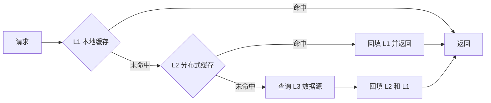

优点：

- 结合本地缓存的速度和分布式缓存的容量。
- 提高整体命中率。
- 降低数据库压力。

缺点：

- 管理复杂。
- 多层缓存一致性更难保证。
- 需要明确更新和失效策略。

## 经典缓存问题

| 问题 | 含义 | 典型解决方案 |
|---|---|---|
| 缓存穿透 | 查询不存在的数据，缓存和数据库都没有 | 缓存空值、布隆过滤器、参数校验 |
| 缓存击穿 | 热点 Key 失效，大量请求打到数据库 | 互斥锁、逻辑过期、后台刷新 |
| 缓存雪崩 | 大量 Key 同时过期或缓存整体不可用 | 随机 TTL、缓存高可用、限流降级 |
| 数据不一致 | 数据库和缓存更新存在时序间隙 | 先更新 DB 再删缓存、延迟双删、订阅变更日志 |

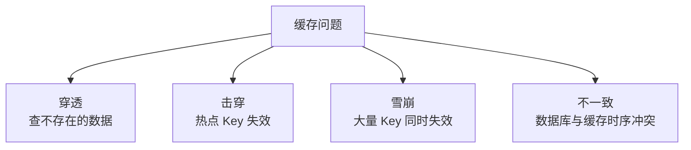

### 缓存穿透

缓存穿透通常来自不存在的 ID 或恶意请求。

解决思路：

- 对不存在的数据缓存空值，并设置短 TTL。
- 使用布隆过滤器提前判断 ID 是否可能存在。
- 做请求参数校验，过滤非法 ID。

### 缓存击穿

缓存击穿通常发生在单个热点 Key 失效时。

解决思路：

- 使用互斥锁，只允许一个线程查询 DB 并回填缓存。
- 使用逻辑过期，让旧值短暂可用，同时后台刷新。

### 缓存雪崩

缓存雪崩是大量 Key 同时失效或缓存集群整体不可用。

解决思路：

- TTL 加随机偏移，避免同一时间过期。
- 热点数据使用逻辑过期。
- 缓存集群做高可用。
- 必要时限流降级，保护数据库。

### 数据不一致

缓存不一致来自数据库更新和缓存更新之间的时间窗口。

| 方案 | 思路 | 代价 |
|---|---|---|
| 先更新数据库，再删除缓存 | 简单直接，让下一次读重新加载 | 仍可能短暂不一致 |
| 延迟双删 | 更新数据库后延迟再删一次缓存 | 延迟时间依赖经验 |
| 订阅数据库变更日志 | 通过 binlog 等变更日志同步缓存 | 架构复杂 |
| 分布式事务 | 让 DB 和缓存更新具备原子性 | 性能损耗高，实现复杂 |

## 消息中间件

消息中间件用于在分布式系统中传递消息。

它让生产者和消费者通过消息异步协作，而不是直接同步调用。

核心作用：

- 系统解耦。
- 异步通信。
- 削峰填谷。
- 数据同步。
- 提升扩展性。

## 生产者与消费者

| 概念 | 含义 | 示例 |
|---|---|---|
| 生产者 | 创建并发送消息的一方 | 订单服务发送 `order_created` |
| 消费者 | 接收并处理消息的一方 | 库存服务消费订单消息并扣减库存 |

生产者关注：

- 把业务事件转成消息。
- 选择 Topic 或 Queue。
- 处理发送重试。
- 必要时使用事务消息。

消费者关注：

- 订阅消息。
- 反序列化消息。
- 执行业务逻辑。
- 保证幂等。
- 成功后 ACK，失败时重试或进入死信队列。

## 队列模型与发布订阅模型

| 模型 | 特点 | 适用场景 |
|---|---|---|
| 队列模型 | 点对点，一条消息只被一个消费者消费 | 任务队列、数据处理管道 |
| 发布订阅模型 | 一对多，一条消息广播给多个订阅者 | 事件通知、微服务事件分发 |

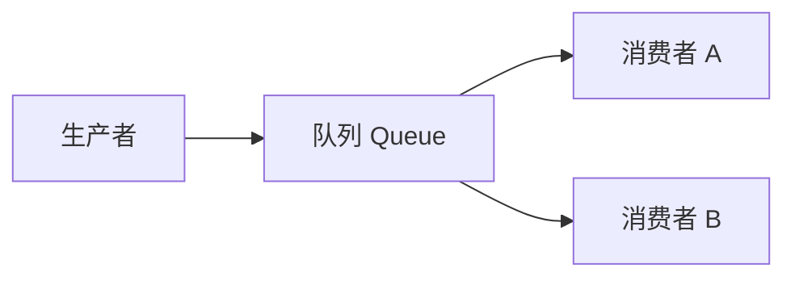

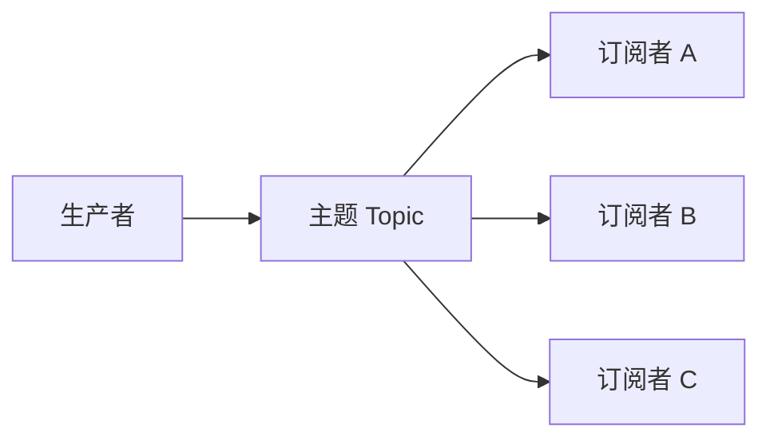

队列强调任务分摊，主题强调事件广播。

## ACK、死信队列与分区

### ACK 与 NACK

- **ACK**：消费者处理成功后确认，中间件删除或标记消息已消费。
- **NACK**：消费者处理失败后拒绝，消息重新投递或进入死信队列。

ACK 机制用于避免消息未处理就丢失。

### 死信队列

死信队列（DLQ）存放无法正常消费的消息。

常见触发原因：

- 重试次数超过阈值。
- 消费者显式拒绝。
- 消息格式错误。
- 下游系统持续失败。

死信队列的价值是让坏消息离开主队列，避免阻塞正常消息，同时保留排查入口。

### 分区

分区把 Topic 划分为多个并行单元。

作用：

- 提升吞吐量。
- 支持消费者并行处理。
- 按业务 Key 分区时，可以保证同一对象消息有序。

例如订单消息按 `orderId` 分区，同一订单的状态变更会进入同一个分区。

## 消息中间件关键问题

| 问题 | 原因 | 解决思路 |
|---|---|---|
| 可用性 | 中间件是通信枢纽，故障会影响上下游 | 集群部署、主从复制、多副本、故障转移 |
| 消息丢失 | 网络抖动、未持久化、节点故障 | 生产者确认、持久化、多副本、消费者 ACK |
| 消息重复 | 发送重试、ACK 丢失、重复投递 | 消息唯一 ID、幂等消费、唯一索引 |
| 顺序性 | 多分区、多消费者、并发消费 | 同业务 Key 进同一分区，单线程有序消费 |
| 最终一致性 | 异步处理有延迟，可能失败或堆积 | 补偿机制、重试、定期对账 |
| 消息堆积 | 生产速度大于消费速度 | 扩容消费者、优化消费逻辑、限流降级 |

### 重复消费

重复消费最典型的原因是：业务已经处理成功，但 ACK 没送达。

解决方式：

- 使用消息唯一标识。
- 消费前查询处理记录。
- 使用数据库唯一索引防止重复写入。
- 对关键操作设计幂等接口。

### 顺序性

需要顺序的场景：

- 订单状态：创建 → 支付 → 发货。
- 用户积分流水。
- 账户余额变更。

解决方式：

- 同一业务对象发送到同一个分区或队列。
- 消费端对同一 Key 单线程处理。
- 使用中间件提供的顺序消息能力。

### 最终一致性

消息中间件常用于实现最终一致性。

典型流程：

- 主业务先完成本地事务。
- 发送业务事件消息。
- 下游服务异步消费消息并更新自己的状态。
- 失败时重试、补偿或定期对账。

### 消息堆积

消息堆积说明生产速度超过消费速度。

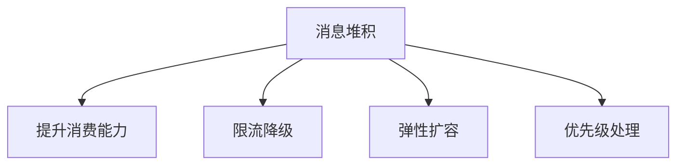

处理思路：

- 增加消费者数量。
- 优化消费者处理逻辑。
- 非核心业务限流或降级。
- 扩展分区数量。
- 优先处理高优先级消息。

## 复习要点

- **资源池化** 的核心是复用昂贵资源，并通过上限、队列和拒绝策略控制并发。
- 线程池重点关注 `corePoolSize`、`maxPoolSize`、`workQueue` 和拒绝策略。
- 数据库连接池可以减少建连成本，但不能超过数据库承载能力。
- HTTP/2 和 gRPC 通过多路复用提高网络连接利用率。
- **缓存** 的本质是缩短数据访问路径。
- 本地缓存快，但多节点共享和一致性差。
- 分布式缓存可扩展，但引入网络开销和一致性问题。
- 分层缓存通常是 **L1 本地缓存 + L2 分布式缓存 + L3 数据源**。
- 缓存经典问题包括 **穿透、击穿、雪崩、数据不一致**。
- 消息中间件用于 **异步、解耦、削峰、数据同步**。
- 消息中间件关键难点是 **不丢、不重、有序、可恢复、最终一致**。

## 易混点

| 易混概念 | 区别 |
|---|---|
| 缓存穿透与缓存击穿 | 穿透是查不存在数据，击穿是热点 Key 失效 |
| 缓存击穿与缓存雪崩 | 击穿通常是单个热点 Key，雪崩是大量 Key 或整个缓存不可用 |
| 本地锁与分布式锁 | 本地锁只管单进程，分布式锁用于多节点协作 |
| 队列与主题 | 队列是一条消息被一个消费者处理，主题是一条消息广播给多个订阅者 |
| ACK 与幂等 | ACK 解决确认问题，幂等解决重复处理的副作用 |
| 最终一致性与强一致性 | 最终一致允许短暂不一致，强一致要求立即一致 |
