# 分布式系统基础设施

**范围**：章节七，分布式系统基础设施  
**整理方式**：按“资源池化 → 缓存体系 → 消息中间件”重组。

## 核心脉络

本章讲的是分布式系统中支撑高并发、高吞吐和高可用的三类基础设施：

- **资源池化**：提高单节点资源利用率，决定单节点承载能力。
- **缓存体系**：缩短数据访问路径，降低响应延迟。
- **消息中间件**：通过异步通信实现系统解耦、削峰填谷和最终一致性。

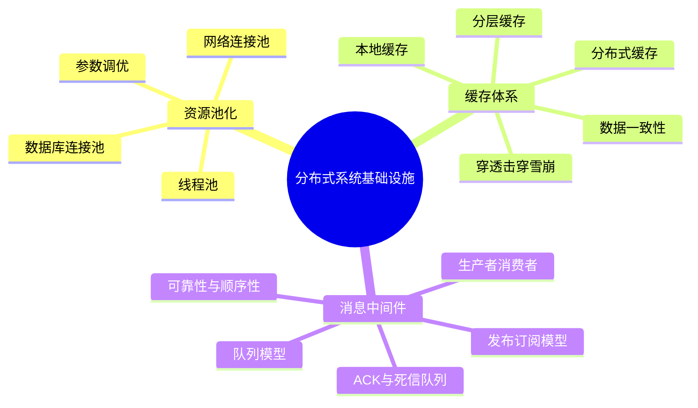

## 资源池化

### 基本概念

**资源池化（Resource Pooling）** 是指将分布式系统中的各类资源进行集中管理和统一调配，形成可共享的资源集合。

常见资源包括：

- **计算资源**
- **存储资源**
- **网络资源**
- **线程资源**
- **数据库连接**
- **网络连接**

它的地位：

- 决定 **单节点承载能力**。
- 是并发系统的基础。
- 为后续负载均衡提供单节点基准。

### 资源池化的基本思路

资源池化的核心不是“无限创建资源”，而是：

- 预先创建一批资源。
- 请求到来时从池中借用资源。
- 使用完成后归还资源。
- 通过参数控制资源上限、等待队列和拒绝策略。

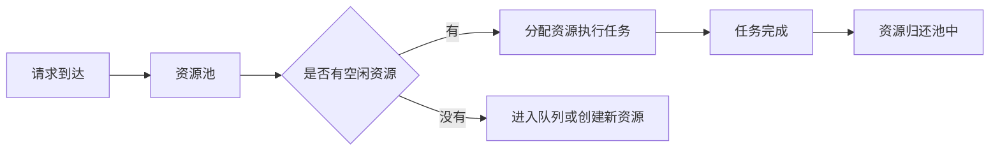

## 线程池

### 原理

**线程池（Thread Pool）** 管理的是线程资源。

它要解决的问题：

- 频繁创建和销毁线程会消耗操作系统资源。
- 线程过多会导致上下文切换频繁，反而降低性能。

核心思想：

- 预先创建一定数量的线程。
- 任务到来后进入任务队列。
- 空闲线程从队列中取任务执行。
- 任务完成后线程不销毁，而是继续等待新任务。

### 关键参数

| 参数 | 含义 |
|---|---|
| **corePoolSize** | 核心线程数，即使空闲也保留 |
| **maxPoolSize** | 最大线程数，限制线程池可创建线程上限 |
| **workQueue** | 任务队列，用于缓冲待执行任务 |
| **RejectedExecutionHandler** | 队列和线程都满时的拒绝策略 |

### 任务提交流程

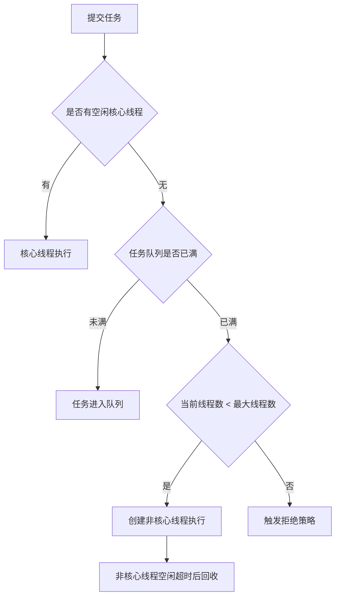

### 拒绝策略

| 策略 | 行为 |
|---|---|
| **AbortPolicy** | 直接抛出 `RejectedExecutionException` |
| **CallerRunsPolicy** | 由提交任务的线程直接执行任务 |
| **DiscardOldestPolicy** | 丢弃队列中最旧任务，再重试提交 |
| **DiscardPolicy** | 静默丢弃新提交任务 |

**复习提示**：`CallerRunsPolicy` 有天然降级效果，因为提交线程被迫执行任务，会反向降低提交速度。

### 任务队列选择

| 队列类型 | 含义 | 风险或特点 |
|---|---|---|
| **有界队列** | 有明确最大容量 | 能防止无限堆积，但可能触发拒绝策略 |
| **无界队列** | 没有固定容量上限 | 不易拒绝，但可能导致内存压力 |
| **同步移交队列** | 任务提交时直接交给工作线程 | 适合直接交付，不适合大量排队 |

## 数据库连接池

### 原理

**数据库连接池（Database Connection Pool）** 管理数据库连接资源。

数据库连接创建成本高，可能包括：

- TCP 三次握手。
- 数据库认证。
- 连接初始化。

核心思想：

- 系统启动或首次请求时创建一批连接。
- 请求到来时从池中获取空闲连接。
- 用完后归还池中，而不是关闭连接。
- 无连接可用时根据配置等待或创建新连接。

### 关键参数

| 参数 | 含义 |
|---|---|
| **minPoolSize** | 保持的最小空闲连接数 |
| **maxPoolSize** | 最大连接数，防止耗尽数据库资源 |
| **maxIdleTime** | 连接空闲超时时间 |
| **acquireRetryAttempts** | 获取连接失败后的重试次数 |

## 网络连接池

### 基本概念

**网络连接池（Network Connection Pool）** 管理网络连接资源，常见于 HTTP、RPC、gRPC 等通信框架。

它和数据库连接池类似，目标都是：

- 减少连接创建成本。
- 复用连接。
- 降低延迟。
- 提升吞吐量。

### 协议差异

| 协议 | 连接池支持特点 |
|---|---|
| **HTTP/1.1** | Keep-Alive 支持连接复用，但多个请求通常串行处理 |
| **HTTP/2** | 支持连接复用和多路复用，可在同一连接上并行交错处理多个请求 |
| **gRPC** | 基于 HTTP/2，可在同一连接上并行发送和接收多个 RPC 请求与响应 |

网络连接池是高性能网络通信的基石。

- 高并发场景下能降低延迟。
- 大量数据传输时能提升吞吐量。
- gRPC 和 HTTP/2 借助多路复用表现更好。

## 资源池参数调优

### 常见估算

| 类型 | 调整思路 |
|---|---|
| **CPU 密集型线程池** | 线程数约等于 CPU 核心数 |
| **IO 密集型线程池** | 线程数约等于 `CPU核心数 * (1 + 平均等待时间 / 计算时间)` |
| **数据库连接池** | 根据数据库最大连接数和业务并发量调整上限 |
| **网络连接池** | 最大连接数约等于 `QPS × 平均请求耗时（秒）` |

### 优点与缺点

优点：

- **提高资源利用率**
- **增强系统灵活性和可扩展性**
- **降低硬件与运维成本**
- **便于集中管理、监控和配置**

缺点：

- **增加系统复杂性**
- **可能存在资源竞争**
- **核心资源池存在单点故障风险**

**复习提示**：资源池不是越大越好。池太小会阻塞，池太大会争抢资源、放大上下文切换和下游压力。

## 缓存体系

### 基本概念

**缓存（Caching）** 是将经常访问的数据临时存储在离数据源更近或访问速度更快的位置。

目的：

- 减少原始数据源访问。
- 避免重复计算。
- 减少磁盘或网络 I/O。
- 提高系统性能和响应速度。

常见形式：

- **本地缓存**
- **分布式缓存**
- **分层缓存**

### 缓存读写原理

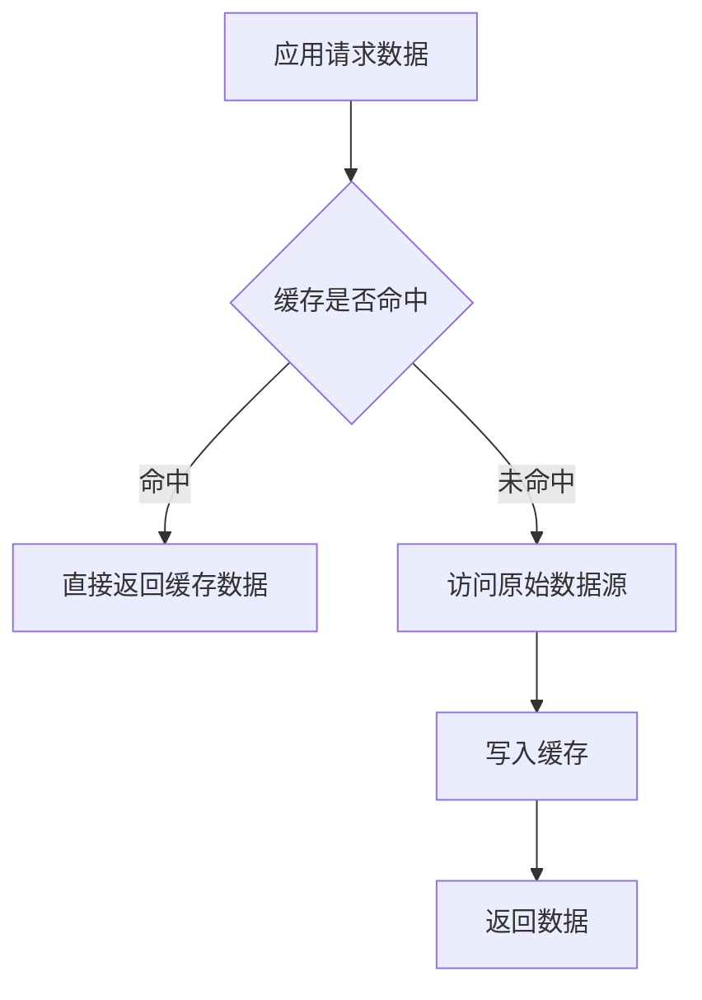

缓存更新需要处理：

- 原始数据变化后，缓存如何同步。
- 何时主动更新缓存。
- 何时让缓存自然失效。
- 如何避免缓存与数据库不一致。

## 本地缓存

### 特点

**本地缓存（Local Cache）** 将数据存储在应用服务器本地内存中。

优点：

- 访问速度极快。
- 适合热点数据。
- 适合防重复计算。

限制：

- 容量受单机内存限制。
- 服务器重启后缓存丢失。
- 多节点部署时缓存不同步。
- 不适合多个节点共享数据。

### 缓存淘汰策略

| 策略 | 原理 | 优点 | 缺点 |
|---|---|---|---|
| **LRU** | 淘汰最近最少使用的数据 | 适合时间局部性强的访问 | 只看最近访问时间，不看长期频率 |
| **LFU** | 淘汰访问频率最低的数据 | 更能保留长期热点 | 实现复杂，可能过度依赖历史频率 |
| **TTL** | 数据超过生存时间后自动失效 | 简单直观，适合时效性数据 | TTL 过长会脏，过短会降低命中率 |

### 并发控制

| 方式 | 原理 | 问题 |
|---|---|---|
| **本地锁** | 同一时刻只允许一个线程访问或修改缓存 | 并发高时锁竞争严重 |
| **分段锁** | 将缓存划分为多个段，每段独立加锁 | 同段仍会竞争，锁管理更复杂 |

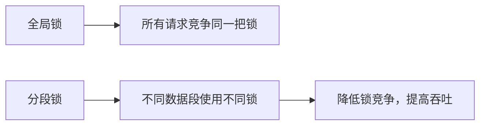

## 分布式缓存

### 基本概念

**分布式缓存（Distributed Cache）** 将数据分散存储在多个服务器上，形成缓存集群。

常见技术：

- **Redis**
- **Memcached**

特点：

- 可通过增加节点扩展容量和性能。
- 支持数据复制和故障转移。
- 高可用性较好。
- 访问速度通常慢于本地缓存，因为需要网络通信。

### 数据分布

大规模分布式缓存需要解决：

- 数据如何均匀分布到多个节点。
- 添加或删除节点时，如何减少数据迁移。
- 如何避免负载严重倾斜。

常见方案是 **一致性哈希**。

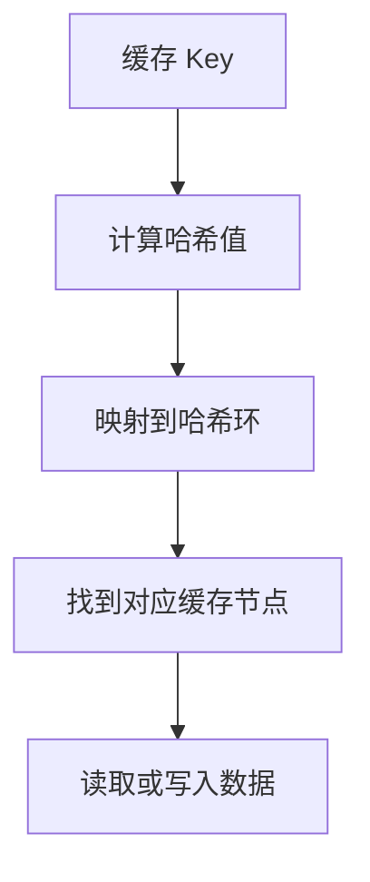

一致性哈希的价值：

- 实现自动分片。
- 提高负载均衡能力。
- 节点变化时只迁移附近部分数据。
- 降低数据不一致风险和维护成本。

### 一致性处理

常见方法：

- **分布式锁**
  - 写缓存前先获取锁，防止多个节点同时写。
- **数据版本号**
  - 更新时比较版本，避免旧数据覆盖新数据。
- **读写分离**
  - 写节点保证一致性，读节点承担读流量。
- **主动更新**
  - 数据源变化后主动通知缓存更新。
- **被动更新**
  - 缓存过期或访问时发现失效，再加载新数据。

## 分层缓存

### 基本架构

**分层缓存（Multi-Level Cache）** 将多种缓存组合成多层结构。

典型结构：

- **L1 本地缓存**
  - 极速响应，容量小。
- **L2 分布式缓存**
  - 容量大，高可用，可多节点共享。
- **L3 数据库或持久化存储**
  - 权威数据源。

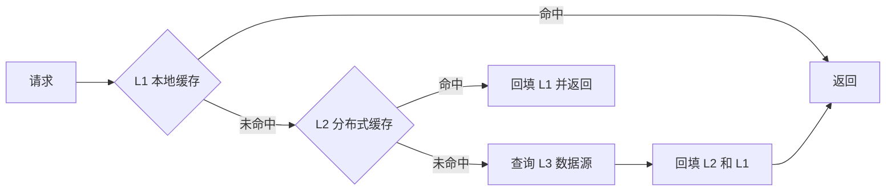

### 优缺点

优点：

- 结合本地缓存的速度和分布式缓存的容量。
- 提高缓存命中率。
- 提升整体性能。

缺点：

- 管理复杂。
- 多层缓存一致性更难保证。
- 需要设计清晰的更新和失效策略。

## 经典缓存问题

### 缓存穿透

**缓存穿透（Cache Penetration）** 指大量请求查询不存在的数据，缓存和数据库都没有记录，请求直接穿透到数据库。

常见原因：

- 恶意构造不存在的 ID。
- 业务校验不严格。
- 缓存无法存储“不存在”这个结果。

解决方案：

- **缓存空值**
  - 对不存在的数据缓存 `null`，设置短 TTL。
- **布隆过滤器**
  - 查询缓存前先判断 ID 是否可能存在。
- **请求参数校验**
  - 在业务层过滤明显非法的 ID 或格式。

### 缓存击穿

**缓存击穿（Cache Breakdown）** 指某个热点 Key 突然失效，大量并发请求同时打到数据库。

典型场景：

- 秒杀商品库存 Key 失效。
- 大量用户同时查询同一热点商品。
- 数据库连接池被打满，延迟暴涨。

解决方案：

- **互斥锁**
  - 只有一个线程查询 DB 并回填缓存，其他线程等待或重试。
- **逻辑过期**
  - 不设物理 TTL，而是存逻辑过期时间，用后台线程异步刷新热点数据。

### 缓存雪崩

**缓存雪崩（Cache Avalanche）** 指大量 Key 同时过期，或缓存服务整体宕机，导致请求集中打到数据库。

解决方案：

- **随机化 TTL**
  - 基准过期时间加随机偏移，分散失效时间。
- **逻辑过期**
  - 避免热点数据在同一时刻物理失效。
- **缓存高可用**
  - 防止缓存集群单点故障。

### 数据不一致

**数据不一致（Data Inconsistency）** 的根源是数据更新操作与缓存失效机制之间存在时序间隙。

典型场景：

- 支付成功后数据库状态已改为已支付，但缓存仍显示待支付。
- 秒杀库存扣减后缓存未更新，导致超卖。

| 方案 | 原理 | 适用场景 | 缺点 |
|---|---|---|---|
| **先更新数据库，再删缓存** | 数据库更新后立即让缓存失效 | 简单场景，对一致性要求不高 | 仍可能短暂不一致 |
| **延迟双删** | 数据库更新后延迟再次删除缓存 | 主从架构、高并发场景 | 延迟时间依赖经验 |
| **订阅数据库变更日志** | 监听增量变更，将变更同步到缓存 | 高一致性、复杂关联数据 | 架构复杂 |
| **分布式事务** | 通过 2PC 或 TCC 保证原子性 | 金融级强一致业务 | 性能损耗高，实现复杂 |

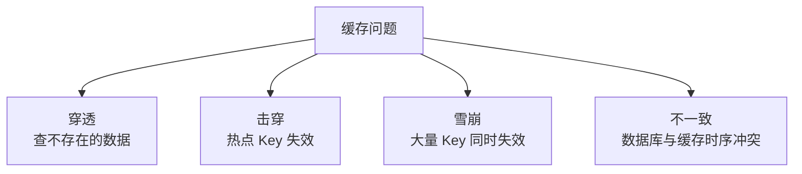

## 消息中间件

### 基本概念

**消息中间件（Message Middleware）** 是分布式系统中用于传递消息的中间件软件。

它扮演发送者和接收者之间的桥梁，让不同应用、服务或进程通过消息进行异步通信，而无需直接相互了解或依赖。

地位：

- 分布式系统异步通信的核心基础设施。
- 系统解耦的重要手段。
- 大流量削峰的重要手段。

常见形式：

- **消息队列（Queue）**
- **消息主题（Topic）**

### 生产者与消费者

| 概念 | 含义 | 示例 |
|---|---|---|
| **生产者（Producer）** | 创建并发送消息的一方 | 订单服务生成 `order_created` 消息 |
| **消费者（Consumer）** | 接收并处理消息的一方 | 库存服务订阅订单消息并扣减库存 |

生产者职责：

- 将业务事件转化为消息。
- 序列化业务数据。
- 选择消息发送到哪个主题或队列。
- 可通过重试、事务消息保障消息必达。

消费者职责：

- 订阅 Topic 或 Queue。
- 反序列化消息。
- 执行业务逻辑。
- 保证幂等性。
- 成功后发送 ACK，失败时重试或转死信队列。

### 队列模型与发布订阅模型

| 模型 | 特点 | 适用场景 |
|---|---|---|
| **队列模型** | 点对点，一条消息只被一个消费者消费；可支持 FIFO 和负载均衡 | 任务队列、数据处理管道 |
| **发布订阅模型** | 一对多，一条消息广播给所有订阅者；生产者与消费者解耦更强 | 实时广播、跨系统通知、微服务事件分发 |

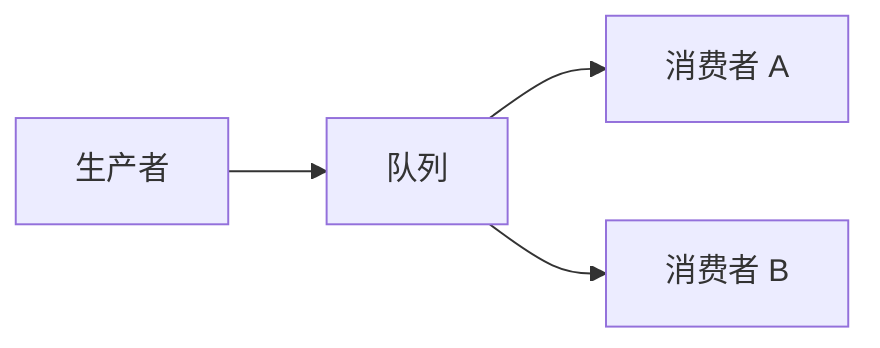

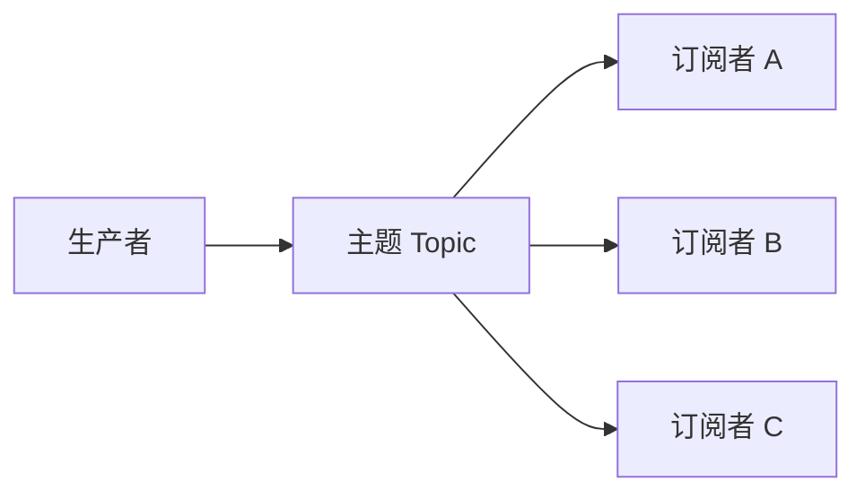

## 消息中间件的作用

| 作用 | 解决的问题 | 核心思路 |
|---|---|---|
| **系统解耦** | 直接 HTTP/RPC 调用导致强耦合 | 生产者只发消息，不关心消费者是谁 |
| **异步通信** | 同步调用阻塞主流程 | 发送消息后立即返回，消费者异步处理 |
| **流量削峰填谷** | 突发流量压垮数据库或下游服务 | 请求先进入队列，消费者按能力处理 |
| **数据同步与分发** | 多系统之间同步困难 | 通过持久化、事务、订阅机制分发消息 |
| **扩展性提升** | 业务增长后消息处理压力上升 | 扩容生产者、消费者和中间件节点 |

## ACK、死信队列与分区

### 消息确认

**ACK**：消费者处理成功后显式确认，中间件删除消息。  
**NACK**：消费者处理失败后拒绝，消息重新入队或进入死信队列。

### 死信队列

**死信队列（Dead Letter Queue, DLQ）** 用于存储无法被正常消费的消息。

触发条件：

- 消息重试次数超过阈值。
- 消费者显式拒绝消息。
- 消息格式错误。
- 下游系统持续失败。

作用：

- 避免坏消息一直阻塞主队列。
- 便于人工排查。
- 支持修复后重新投递。

### 分区

**分区（Partition）** 将主题划分为多个并行单元。

作用：

- 提升吞吐量。
- 支持多个消费者并行处理。
- 可按订单 ID 等 Key 做分区，保证同一业务对象的消息进入同一分区。

## 消息中间件关键问题

### 可用性

问题：

- 消息中间件是系统通信枢纽。
- 一旦不可用，上下游服务可能无法协作。

解决思路：

- 集群部署。
- 主从复制。
- 多副本冗余。
- 监控告警。
- 自动故障转移。

### 消息丢失或重复

可能原因：

- 网络抖动。
- 节点故障。
- 消息未持久化。
- 生产者重试导致重复投递。

解决思路：

- 生产者使用事务机制，确保消息成功写入队列。
- 中间件启用持久化和多副本。
- 消费者通过 ACK 确认。
- 失败消息进入死信队列。
- 消费端保证幂等性。

### 重复消费

问题：

- 消费者处理成功，但 ACK 未送达。
- 中间件认为消息未处理，重新投递。
- 业务可能出现重复扣款、重复创建物流单等副作用。

解决思路：

- 使用分布式锁。
- 使用消息唯一标识。
- 消费前查询处理记录。
- 数据库唯一索引防止重复插入。

### 顺序性

需要顺序的场景：

- 订单状态：创建 → 支付 → 发货。
- 用户积分变更。
- 账户流水处理。

乱序原因：

- 多分区。
- 多消费者。
- 并发消费。

解决思路：

- 将同一业务对象的消息发送到同一个分区或队列。
- 消费端使用单线程或有序队列。
- 使用中间件提供的顺序消息能力。

### 最终一致性

问题：

- 异步消息处理有延迟。
- 消息可能失败、重试或堆积。
- 不同系统的数据短时间内可能不一致。

解决思路：

- **分布式事务**
  - 多系统同时成功或失败。
- **补偿机制**
  - 出错后执行反向操作修复状态。
- **定期对账**
  - 扫描业务数据，纠正不一致。

### 消息堆积

问题：

- 生产者速度大于消费者速度。
- 大促期间订单激增。
- 队列堆积可能耗尽资源。

解决思路：

- 增加消费者数量。
- 优化消费者处理逻辑。
- 非核心业务限流降级。
- 弹性扩容。
- 对消息分级，优先处理高优先级消息。

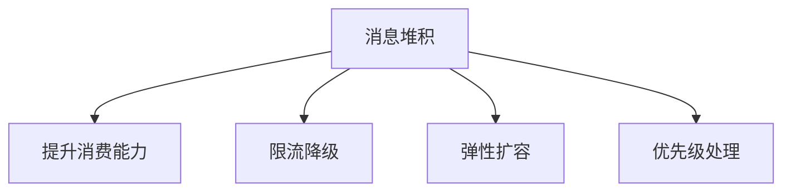

## 复习要点

- **资源池化** 的核心是复用昂贵资源，减少创建销毁成本。
- 线程池的核心参数包括：
  - **corePoolSize**
  - **maxPoolSize**
  - **workQueue**
  - **拒绝策略**
- 数据库连接池能避免频繁创建数据库连接。
- HTTP/2 和 gRPC 借助多路复用提升网络连接利用率。
- 缓存的本质是缩短数据访问路径。
- 本地缓存快但不适合多节点共享。
- 分布式缓存可扩展、高可用，但会引入网络开销和一致性问题。
- 分层缓存通常是 **L1 本地缓存 + L2 分布式缓存 + L3 数据源**。
- 缓存经典问题包括：
  - **穿透**
  - **击穿**
  - **雪崩**
  - **数据不一致**
- 消息中间件用于：
  - **异步**
  - **解耦**
  - **削峰**
  - **数据同步**
- 消息中间件关键难点包括：
  - **可用性**
  - **消息不丢不重**
  - **幂等消费**
  - **顺序性**
  - **最终一致性**
  - **消息堆积**

## 易混点

- **缓存穿透与缓存击穿**
  - 穿透：查不存在的数据，缓存和数据库都没有。
  - 击穿：热点 Key 失效，大量请求打到数据库。
- **缓存击穿与缓存雪崩**
  - 击穿通常是单个热点 Key。
  - 雪崩是大量 Key 同时失效或缓存整体不可用。
- **本地锁与分布式锁**
  - 本地锁只管单进程。
  - 分布式锁用于多节点协作。
- **消息重复与重复消费**
  - 消息可能被重复投递。
  - 消费者必须设计成幂等，避免重复处理产生副作用。
- **队列与主题**
  - 队列是一条消息被一个消费者消费。
  - 主题是一条消息广播给多个订阅者。

