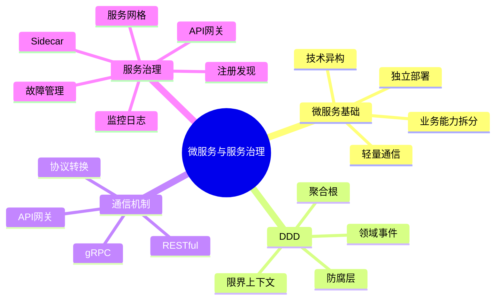
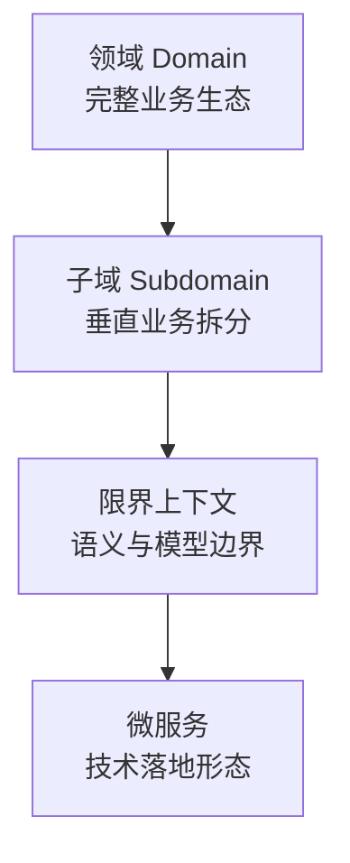
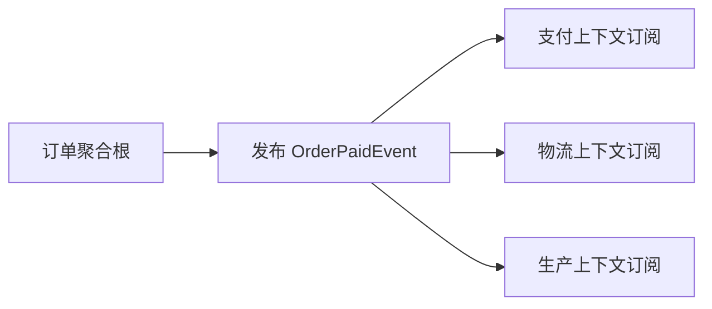
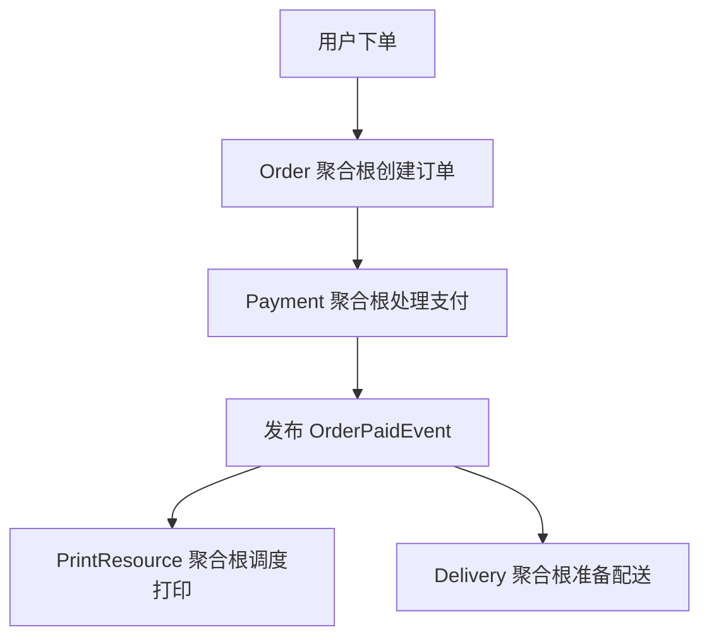
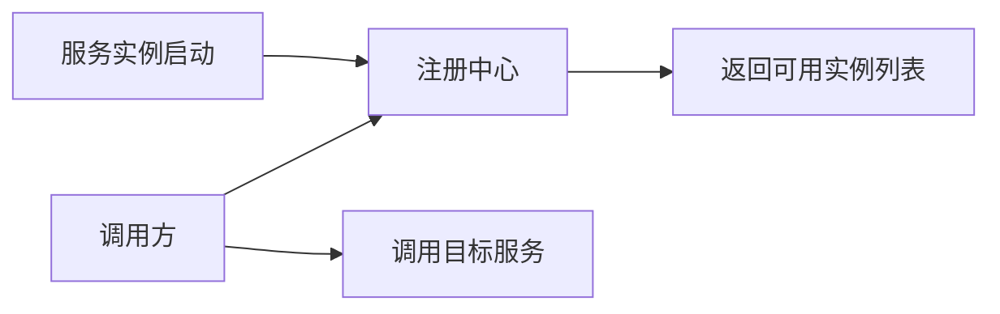
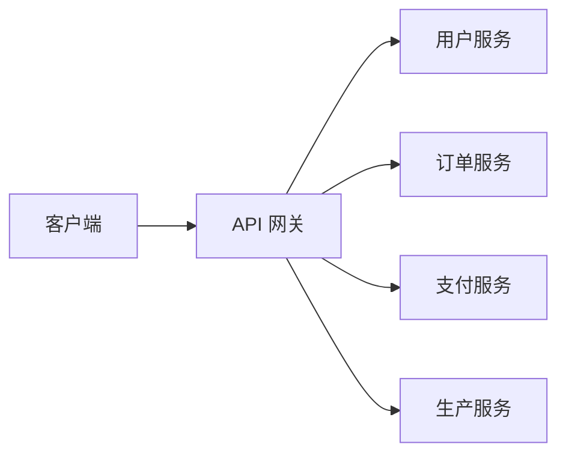
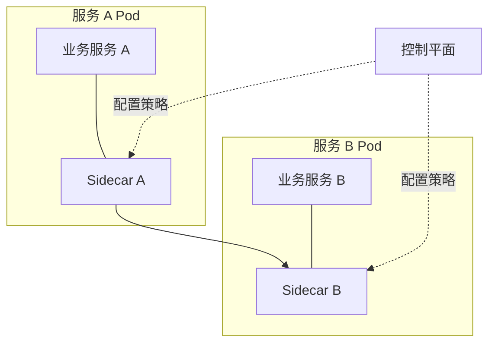
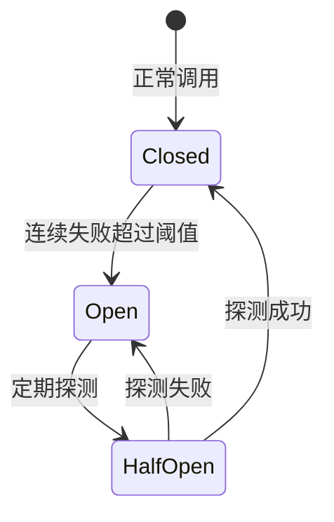

# 微服务与服务治理

本章是在微服务架构和分布式基础设施之后，进一步回答几个落地问题：

- 微服务应该按什么边界拆。
- DDD 如何帮助识别服务边界。
- 微服务之间如何通信。
- 服务治理如何处理动态实例、统一入口、安全、监控和故障。

这章的核心主线是：**先用 DDD 找业务边界，再用微服务落地部署边界，最后用服务治理管理分布式复杂性**。

## 微服务架构基础

微服务架构可以概括为：把一个应用拆成一组小型服务，每个服务运行在自己的进程中，围绕业务能力构建，通过轻量机制通信，并可以独立部署和演进。

关键点包括：

| 关键点 | 含义 |
|---|---|
| 业务功能边界 | 服务按业务能力拆分，而不是按技术层拆分 |
| 独立性 | 服务独立进程、独立部署、独立维护 |
| 轻量通信 | 使用 RESTful、gRPC、消息队列等机制 |
| 技术异构 | 不同服务可用不同语言、框架、数据库，但需要受控 |

### 核心设计原则

| 原则 | 说明 |
|---|---|
| 高内聚、低耦合 | 服务内部功能完整，服务之间减少频繁依赖 |
| 单一职责与数据自治 | 服务围绕特定业务责任，并维护自己的数据 |
| 技术异构受控 | 可自主选型，但不能让维护成本失控 |
| 服务规模受控 | 服务应能被小团队快速开发、测试、部署 |

单一职责不是“一个服务只做一个函数”。一个服务可以包含多个相关功能，只要它们围绕同一个业务能力形成闭环。

### 密码管理示例

密码管理微服务可以包含：

- 创建密码。
- 修改密码。
- 检查密码。
- 恢复密码。
- 密码有效性检查。
- 密码数据库备份与恢复。
- 完整性检查与修复。
- 消息处理。
- 故障处理。
- 数据一致性管理。

这些功能虽然不止一个操作，但都围绕 **密码管理** 这个高内聚业务能力，因此适合放在同一个服务中。

## DDD 与微服务划分

DDD（领域驱动设计）用于解决微服务拆分中最容易出错的问题：**服务边界怎么划**。

DDD 能帮助回答：

- 服务边界如何划分。
- 数据如何分类与隔离。
- 服务之间如何协调。
- 什么模型只在什么范围内有效。

本章重点关注两个概念：

- **限界上下文**：业务语义边界。
- **聚合根**：事务一致性边界的入口。

正确路线是：先识别业务语义边界，再映射为微服务；而不是先按 Controller、Service、DAO 这种技术层拆服务。

## 限界上下文

限界上下文（Bounded Context）是在特定业务领域内保持术语、规则和模型语义一致的逻辑边界。

它强调：

- 边界内部术语含义统一。
- 边界内部业务规则自洽。
- 领域模型只在这个边界内有效。
- 一旦跨越边界，同一个名词可以有不同含义。

一句话：**出了这个边界，同一个名词可以不是同一个东西**。

### “用户”的多重含义

| 上下文 | “用户”的含义 | 核心关注 |
|---|---|---|
| 电商会员上下文 | 会员等级、积分、收货地址、优惠券 | 忠诚度、消费能力 |
| 订单上下文 | 下单人、手机号、配送信息 | 履约、交付 |
| 风控上下文 | 行为画像、风险等级、黑名单标识 | 风险评估、安全 |

如果强行共用一个“用户”模型，会导致模型膨胀、业务逻辑交织和系统耦合。

### 限界上下文的作用

限界上下文主要解决：

- **业务概念歧义**：在边界内统一语言。
- **职责和变更范围**：一个上下文对应一个相对独立的变更单元。
- **微服务拆分依据**：理想情况下，一个限界上下文可以映射成一个微服务。

### 如何识别限界上下文

可以按下面步骤识别：

- **梳理整体业务域**：例如注册、浏览商品、下单、支付、发货、售后、积分。
- **拆分业务子域**：按业务职能、组织结构或业务流程拆分。
- **寻找歧义术语**：找同名不同义、局部有效的规则。
- **判断内聚和耦合**：经常一起变更、规则互相约束的内容适合放一起。
- **固化上下文映射关系**：用同步接口、异步事件、消息队列或防腐层连接。

### 向微服务映射

| 规则 | 含义 |
|---|---|
| 一对一原则 | 一个限界上下文对应一个微服务，适合中小型项目 |
| 允许合并，避免强拆 | 小上下文可合并，完整上下文不要被技术原因强拆 |
| 数据库边界隔离 | 一个微服务对应独立数据库实例或独立表，避免跨上下文直接连表 |
| 防腐层保护 | 外部模型不能直接侵入本上下文核心模型 |

防腐层（Anti-Corruption Layer）负责适配和转换外部模型，让内部领域模型保持语义纯净。

## 聚合根

聚合（Aggregate）是一组关联领域对象的集合，被视为一个数据修改单元。

聚合根（Aggregate Root）是聚合对外暴露的唯一入口。

聚合根负责：

- 控制外部访问。
- 维护业务规则。
- 定义事务边界。
- 保证数据一致性和完整性。

通俗理解：**聚合根是聚合内部状态的守门员**。

### 限界上下文与聚合

| 概念 | 边界类型 | 解决问题 | 范围 |
|---|---|---|---|
| 限界上下文 | 语义边界 | 某个概念在什么语境下是什么意思 | 较大，划分业务领域和职责 |
| 聚合 | 一致性边界 | 一次事务中哪些对象必须一起修改 | 较小，划分数据修改单元 |

不同限界上下文的聚合根通常通过领域事件协作，实现最终一致性。

### 聚合根设计原则

- **设计小聚合**：避免性能瓶颈和并发冲突。
- **引用其他聚合只引用 ID**：降低耦合，避免加载整个对象图。
- **聚合根是唯一可变入口**：内部对象修改必须通过聚合根方法。
- **聚合根拥有独立生命周期**：内部对象依赖聚合根存在。

### 如何识别聚合根

核心问题是：

**为了完成这个业务操作，哪些数据必须被原子性更新，才能保证业务规则不被破坏？**

识别步骤：

- 找出业务操作和不变量。
- 聚类需要一起原子修改的对象。
- 选择能代表整个对象集群的核心对象作为聚合根。
- 在聚合根上定义业务方法，封装内部状态。

### 订单聚合根示例

订单聚合根的核心不变量是：

**订单总金额必须等于所有订单项的单价 × 数量之和。**

设计要点：

- 以 `Order` 为聚合根。
- `OrderItem` 和 `Address` 是聚合内对象。
- 外部只能通过 `pay`、`addItem` 等方法修改订单。
- 总额计算由聚合内部控制。
- 支付成功后发布 `OrderPaidEvent`。

## 照片打印系统案例

照片打印系统可以拆成五个核心子域。

| 子域 | 说明 |
|---|---|
| 用户域 | 用户注册、登录、权限、认证 |
| 订单域 | 照片上传、规格选择、订单生成和状态流转 |
| 支付域 | 多渠道资金结算、退款、支付流水 |
| 生产域 | 打印任务调度、设备状态、耗材库存 |
| 物流域 | 地址管理、物流单号、配送状态追踪 |

### 限界上下文与微服务映射

| 限界上下文 | 职责 | 微服务 |
|---|---|---|
| 用户上下文 | 注册、登录、权限管理、身份认证 | User Service |
| 订单上下文 | 照片上传、规格选择、订单生成 | Order Service |
| 支付上下文 | 支付结算、多渠道适配 | Payment Service |
| 生产上下文 | 打印任务调度、设备监控、耗材管理 | Production Service |
| 物流上下文 | 地址、物流单号、配送状态 | Logistics Service |

### 跨上下文协作

协作方式包括：

- **API 网关路由**：移动应用统一通过网关访问微服务。
- **事件驱动**：订单支付成功后发布事件，生产和物流异步启动后续流程。
- **共享内核**：例如全局唯一订单 ID 作为共享标识。

### 聚合根示例

| 聚合根 | 核心数据 | 核心操作 |
|---|---|---|
| User | 用户基础信息、认证凭证、个人偏好 | 注册、登录、第三方账户绑定 |
| Order | 订单信息、打印规格、收件地址 | 创建订单、修改参数、更新状态 |
| Payment | 支付流水、渠道、金额 | 发起支付、查询状态、退款 |
| PrintResource | 设备状态、耗材库存、打印队列 | 查询打印机、执行任务、扣减库存 |
| Delivery | 物流信息、承运商、物流单号 | 生成物流单、更新状态、查询轨迹 |

## 微服务通信机制

微服务倾向使用轻量协议。

原因：

- 服务数量多，通信开销必须受控。
- 服务之间需要松耦合。
- 服务可能跨语言、跨平台。
- 对外和对内通信诉求不同。

传统 XML + SOAP 的问题是协议重、消息冗长、解析成本高、耦合度高，不适合轻量化微服务场景。

### RESTful 与 gRPC

| 特性 | RESTful | gRPC |
|---|---|---|
| 通信对象 | 对外 API、移动端、第三方系统 | 微服务内部通信 |
| 契约特征 | 松散契约，适合频繁迭代 | 强契约，适合稳定接口 |
| 性能 | JSON/HTTP，文本格式，中等性能 | ProtoBuf/HTTP/2，二进制格式，高性能低延迟 |
| 跨平台难度 | Web 天然兼容，浏览器可直接调用 | 需要客户端库，浏览器原生支持弱 |
| 典型场景 | API 网关与前端、第三方支付 | 内部服务高频数据校验 |

gRPC 的局限：

- 需要提前定义 `.proto` 文件。
- 接口变更要重新生成代码。
- 灵活性低于 RESTful。
- 浏览器原生支持较弱。
- 对外暴露常需要网关转换成 HTTP/RESTful。

### 协议选择

| 场景 | 推荐选择 |
|---|---|
| 对外接口 | RESTful，跨平台、易调试 |
| 内部稳定高性能通信 | gRPC，强类型、低延迟 |
| 内部接口频繁变化 | RESTful，松散耦合 |
| 历史系统集成 | API 网关做协议转换，兼容 SOAP 等旧接口 |

### RESTful 示例

照片打印系统基础 URL：

- `https://print-service.com/api/v1`

| 接口 | 含义 |
|---|---|
| `GET /api/v1/orders/123` | 获取订单 ID 为 123 的订单 |
| `GET /api/v1/orders/user/456` | 获取用户 ID 为 456 的订单列表 |

订单响应体通常包含：

- `orderId`
- `userId`
- `createdAt`
- `media`
- `quantity`
- `price`
- `status`
- `photoUrl`
- `size`
- `deliveryAddress`

## 服务治理关键技术

微服务的复杂性不只来自业务拆分，还来自运行时治理。

服务治理要解决：

- 服务实例动态变化。
- 服务调用路由。
- 安全认证和权限控制。
- 限流、熔断、超时。
- 监控、日志和故障排查。

## 服务注册与发现

微服务实例会动态扩缩容，地址也会变化，因此需要服务注册与发现。

核心机制：

| 机制 | 说明 |
|---|---|
| 服务注册 | 服务启动时向注册中心提交地址和元数据 |
| 服务发现 | 调用方从注册中心获取可用实例 |
| 健康检查 | 通过心跳或探测更新服务状态 |
| 动态更新 | 实例上下线后更新服务列表 |

服务注册方式：

- **主动注册**：服务启动时主动注册。
- **被动注册**：外部组件监测服务状态并更新注册中心。

服务发现方式：

- **客户端发现**：客户端获取实例列表并自行负载均衡。
- **服务端发现**：通过 API 网关或负载均衡器转发请求。

典型工具：

- Consul。
- Eureka。
- Nacos。
- Kubernetes Service。
- Istio。

## API 网关

API 网关是微服务系统的统一入口。

核心功能包括：

| 功能 | 说明 |
|---|---|
| 流量路由 | 按路径、请求头、用户身份转发请求 |
| 协议适配 | HTTP/HTTPS 与 gRPC 等内部协议转换 |
| 安全管控 | JWT、OAuth2、API Key、RBAC/ABAC、HTTPS |
| 流量治理 | 限流、熔断、超时、灰度发布 |
| 监控追踪 | 日志、响应时间、错误码、Trace ID |
| 边缘处理 | 请求签名、A/B 测试、静态资源托管 |

API 网关把外部调用和内部微服务拓扑隔离开，是对外接口治理的核心位置。

## Sidecar 与服务网格

Sidecar 模式把辅助功能作为独立进程部署在主服务旁边。

Sidecar 负责：

- 服务发现。
- 负载均衡。
- 熔断限流。
- 监控采集。
- 日志追踪。
- 服务间通信代理。

优点：

- 剥离非业务逻辑。
- 主服务无需关心通信细节。
- 适配多语言微服务。

### 服务网格

服务网格（Service Mesh）是微服务间通信的基础设施层。

它由两部分组成：

| 组成 | 说明 |
|---|---|
| 数据平面 | 每个服务旁的 Sidecar，例如 Envoy，负责转发、负载均衡、TLS、故障处理 |
| 控制平面 | 集中配置路由策略、安全策略、服务发现和监控 |

典型工具：

- Istio。
- Linkerd。
- Consul Connect。

### Sidecar 与服务网格区别

| 维度 | Sidecar 模式 | 服务网格 |
|---|---|---|
| 定位 | 单个服务的辅助工具 | 全局通信基础设施 |
| 范围 | 一对一，服务与 Sidecar 组合 | 所有 Sidecar 构成通信网络 |
| 控制平面 | 通常没有 | 有 |
| 功能 | 局部通信、监控、代理能力 | 流量、安全、观测性的完整体系 |

## 监控、日志与故障管理

微服务拆分后，故障定位从“看一个进程”变成“看一条调用链”。

因此需要：

- 指标监控。
- 日志采集。
- 链路追踪。
- 超时、重试、熔断和降级。

### 服务监控指标

应用层指标：

- 平均延迟。
- P95/P99 延迟。
- TPS/QPS。
- 并发量。
- 错误率。
- 服务间调用成功率。
- 熔断或限流触发次数。
- 业务指标，例如订单创建量、登录频次。

基础设施指标：

- CPU 使用率。
- 内存使用率。
- 磁盘 I/O。
- 网络带宽。
- 网络延迟。
- 丢包率。
- 线程数。
- 文件句柄数。

可用性与弹性指标：

- 服务实例在线状态。
- 健康检查结果。
- 请求重试次数。

### 日志记录内容

基础信息：

- 请求 ID。
- 客户端 IP。
- 服务名。
- 实例 ID。
- 时间戳。

运行时细节：

- 业务日志。
- 错误日志。
- 异常堆栈。
- 调用链日志。
- 上下游服务地址和结果。

环境配置：

- 限流阈值。
- 熔断策略。
- 依赖服务版本。

### 故障管理

主要故障类型：

- **内部逻辑错误**。
- **外部依赖失效**。
- **性能下降**。

HTTP 状态码可用于标准化故障报告：

- `404`：资源不可访问。
- `422`：不可处理的实体，例如订单输入错误。

常见治理机制：

- **超时机制**：检测服务无响应或过慢，但超时过长会拖慢整体链路。
- **断路器模式**：连续失败超过阈值后阻断请求，避免故障扩散。
- **重试机制**：处理短暂失败，但必须避免重试风暴。
- **降级机制**：非核心功能失败时返回兜底结果。

断路器的三个状态：

- **Closed**：正常调用。
- **Open**：直接拒绝或快速失败。
- **HalfOpen**：少量探测请求判断服务是否恢复。

## 复习要点

- 微服务应按 **业务能力** 拆分，而不是按技术层拆分。
- DDD 中，**限界上下文** 用于划定业务语义边界。
- 一个名词在不同限界上下文中可以有不同含义。
- 理想情况下，一个限界上下文对应一个微服务。
- **聚合根** 是聚合对外唯一入口，负责维护业务不变量和事务边界。
- 跨上下文协作常通过领域事件实现最终一致性。
- RESTful 适合对外接口，gRPC 适合稳定、高性能的内部通信。
- 服务注册与发现解决实例地址动态变化问题。
- API 网关是微服务统一入口，负责路由、安全、协议适配、流量治理。
- Sidecar 是单服务旁路代理，服务网格是全局通信治理体系。
- 微服务必须配套监控、日志、超时、熔断、降级等治理机制。

## 易混点

| 易混概念 | 区别 |
|---|---|
| 限界上下文与微服务 | 限界上下文是业务语义边界，微服务是技术部署形态 |
| 限界上下文与聚合 | 限界上下文解决概念含义边界，聚合解决事务一致性边界 |
| 高内聚与服务很小 | 高内聚不是小到不能再小，而是围绕同一业务能力 |
| RESTful 与 gRPC | RESTful 灵活、易调试、适合对外；gRPC 高性能、强契约、适合内部稳定服务 |
| Sidecar 与服务网格 | Sidecar 是局部代理模式，服务网格是由 Sidecar 和控制平面组成的全局治理方案 |
| API 网关与服务网格 | API 网关治理南北向流量，服务网格治理服务间东西向流量 |
