# 分布式事务与高可用设计

**来源**：Lecture-SC-2026-ldl-Chap09.pptx  
**范围**：章节九，存储系统设计与分布式事务  
**整理方式**：按“存储架构如何改变数据流动规则 → 一致性问题如何出现 → 分布式事务如何修复”的逻辑重组。

## 核心脉络

本章的关键不是一上来背分布式事务方案，而是先理解：

- **事务一定运行在某种存储架构之上**。
- 存储系统为了提升**性能、容量、可用性**，常常会引入主从、读写分离、CQRS、分库分表、异步写等设计。
- 这些设计会让数据不再只停留在一个数据库、一个节点、一个本地事务里。
- 因此，系统获得了高可用和扩展性，但也会产生**一致性治理问题**。
- **分布式事务**本质上就是在这种架构选择之后，对一致性问题进行补偿、协调或修复。

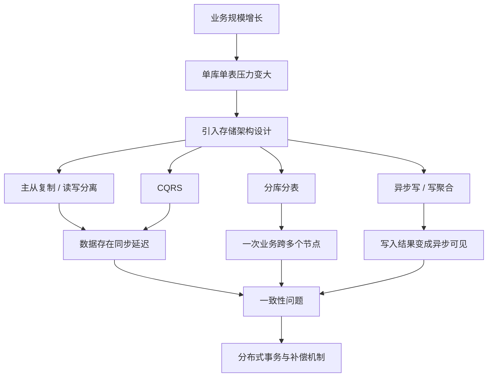

**一句话总览**：  
高可用设计负责让系统“扛得住、扩得开、挂了还能跑”，分布式事务负责让这些设计带来的数据不一致风险“可控、可补、可收敛”。

## 存储系统设计的意义

### 为什么先讲存储架构

PPT 特别提醒了一个常见误区：**不要脱离存储架构直接谈分布式事务**。

原因是：

- 如果系统只有一个数据库，一个本地事务就能解决很多一致性问题。
- 一旦系统变成主从、分片、微服务、多数据库、多缓存、多消息队列，数据就会分布在多个地方。
- 这时，事务边界被拉长，单机数据库事务无法覆盖完整业务链路。
- 所以，分布式事务不是凭空出现的，而是由**分布式存储与分布式服务架构**自然带来的问题。

### 存储架构的核心目标

存储系统设计通常围绕这些目标展开：

- **提升读取性能**
  - 用从库、缓存、读模型承担大量读请求。
  - 避免所有查询都打到主库。
- **提升写入吞吐**
  - 用分库分表分摊写压力。
  - 用异步写、写聚合减少同步阻塞。
- **提升系统可用性**
  - 主从复制让主库故障后可以切换。
  - 多副本、多节点降低单点风险。
- **支撑业务扩展**
  - 数据量和并发量增长后，单机数据库不再够用。
  - 架构必须允许横向扩展。

### 常见存储架构模式

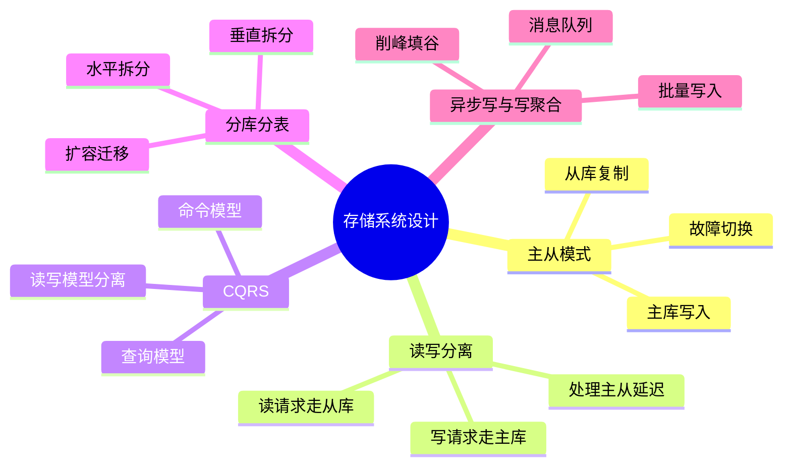

## 主从模式

### 基本结构

**主从模式**是最经典的数据库高可用与扩展设计。

- **Master 主库**
  - 负责写请求。
  - 产生数据变更日志。
  - 通常是系统的数据写入入口。
- **Slave 从库**
  - 从主库同步数据。
  - 可以承担读请求。
  - 主库故障时，某个从库可以被提升为新的主库。

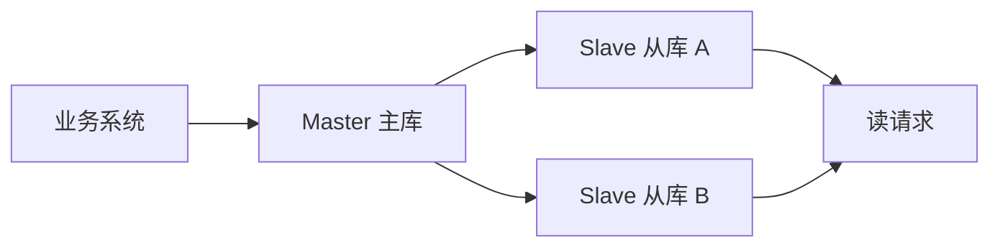

### MySQL 主从复制过程

MySQL 主从复制的核心链路是：

- 主库执行写操作。
- 主库把变更写入 **binlog**。
- 从库的 **I/O 线程**读取主库 binlog。
- 从库把读取到的日志写入 **relay log**。
- 从库的 **SQL 线程**重放 relay log。
- 从库数据逐步追上主库。

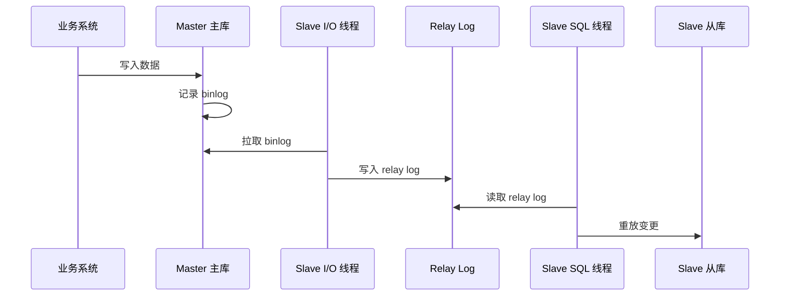

### 异步复制与半同步复制

MySQL 默认常见的是**异步复制**：

- 主库提交事务后，不等待从库确认。
- 主库不知道从库是否已经：
  - 收到 binlog。
  - 写入 relay log。
  - 成功重放日志。
- 优点是**写入性能好**。
- 缺点是**主从延迟和丢失风险更高**。

MySQL 5.5 之后支持**半同步复制**：

- 主库提交前，至少等待一个从库确认。
- 从库收到 binlog 并写入 relay log 后返回 ACK。
- 主库收到 ACK 后再提交。
- 优点是**一致性更强**。
- 缺点是**写入性能下降**，因为写链路多了一段等待。

| 复制方式 | 主库是否等待从库 | 一致性 | 性能 | 风险 |
|---|---:|---|---|---|
| **异步复制** | 不等待 | 较弱 | 高 | 从库可能落后，主库故障时可能丢数据 |
| **半同步复制** | 等至少一个从库 ACK | 较强 | 较低 | 延迟增加，但数据丢失风险降低 |

### 复制风暴

如果一个主库挂了太多从库，会出现**复制风暴**：

- 每个从库都要向主库拉取日志。
- 从库数量太多时，主库不仅要处理业务写入，还要处理大量复制请求。
- 主库压力反而被放大。

解决思路之一是**级联复制**：

- 少量从库直接连接主库。
- 其他从库再从这些中间从库复制。
- 这样可以减少主库的复制压力。

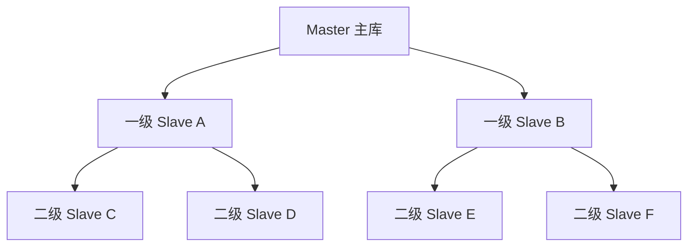

## 读写分离

### 基本思想

互联网应用通常是**读多写少**：

- 浏览商品、查看详情、读取评论、搜索列表都是读。
- 下单、支付、修改资料是写。

因此可以采用读写分离：

- **写请求**进入主库。
- **读请求**进入从库。
- 主从复制负责把主库数据同步到从库。
- 读压力被多个从库分摊。

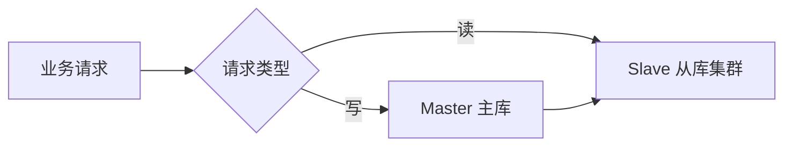

### 路由方式

读写分离需要判断请求应该去哪里，常见有两种方式：

- **Proxy 代理层路由**
  - 在业务系统和数据库之间增加代理。
  - 代理识别 SQL 类型，把读写请求转发到不同数据库。
  - 对业务代码侵入较小。
- **应用内路由**
  - 在业务代码中区分读库和写库。
  - 控制更细，但代码侵入更明显。
  - 应用需要理解数据源选择规则。

### 主从延迟问题

读写分离最大的问题是：**刚写完的数据，马上去从库读，可能读不到**。

例如：

- 用户刚修改昵称。
- 写入已经提交到主库。
- 从库还没同步完成。
- 用户刷新页面走从库，看到的还是旧昵称。

常见处理策略：

- **同步复制**
  - 强化一致性。
  - 代价是写入变慢。
- **关键读强制走主库**
  - 对刚写完后必须立即可见的数据，直接读主库。
  - 例如支付结果、订单状态确认。
- **会话级读主**
  - 用户写入后的短时间内，同一个会话读主库。
  - 过一段时间后再恢复读从库。

**复习提示**：  
读写分离不是免费的性能优化，它把压力分散出去的同时，也把“读到旧数据”的风险带了进来。

## CQRS

### 基本定义

**CQRS（Command Query Responsibility Segregation）**，即**命令查询职责分离**。

核心思想是：

- **Command 命令**负责改变系统状态，也就是写。
- **Query 查询**负责读取系统状态，也就是读。
- 写模型和读模型可以使用不同的数据结构、数据库或存储系统。

PPT 强调：数据库读写分离和缓存，都可以看作 CQRS 的特殊形式。

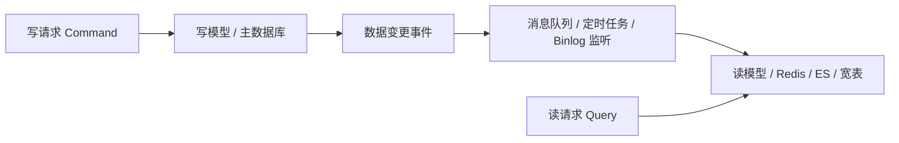

### CQRS 的组成

CQRS 通常包含：

- **写存储**
  - 处理业务写入。
  - 维护权威数据。
  - 例如主库。
- **读存储**
  - 面向查询优化。
  - 可以是从库、Redis、Elasticsearch、宽表。
- **数据同步机制**
  - 消息队列。
  - 定时任务。
  - binlog 监听。
  - 事件流。

### 搜索场景示例

用户信息存储在数据库中，但昵称搜索、关键词搜索不适合直接打数据库。

可以设计为：

- 数据库保存用户账号信息，作为写模型。
- Elasticsearch 保存面向搜索的索引，作为读模型。
- 通过 binlog 监听或消息中间件同步变更。
- 用户搜索时直接查 Elasticsearch。

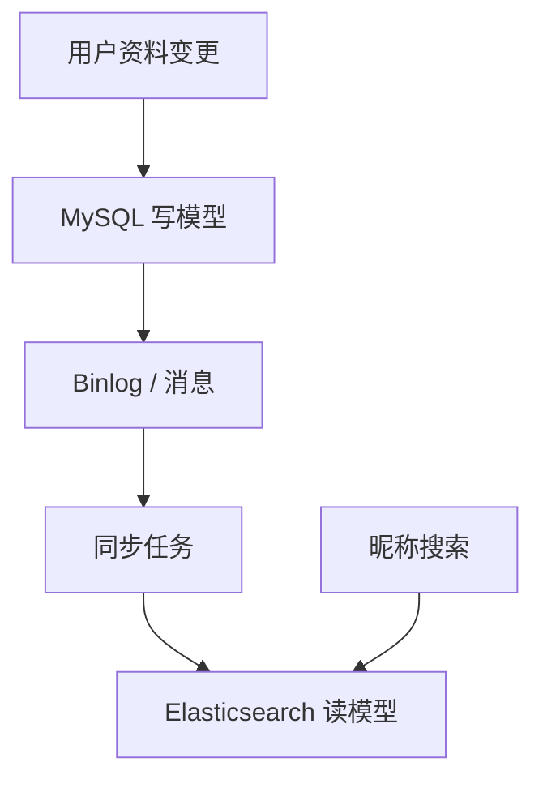

### 多表查询场景示例

在线业务数据库如果已经分库分表，多表 join 会很困难：

- 数据分散在不同库表。
- 跨库 join 性能低。
- 查询复杂度高。

CQRS 的做法是：

- 在线库作为写模型。
- 后台监听数据变化。
- 提前聚合生成**宽表**。
- 查询请求直接读宽表，避免在线复杂 join。

### CQRS 的特点

- **读写存储可以差异化**
  - 写存储关注写性能、事务和数据正确性。
  - 读存储关注查询性能、搜索能力和展示效率。
- **读模型可以冗余**
  - 同一份数据可以派生出多个查询模型。
  - 例如缓存、搜索索引、报表表。
- **最终一致性是常态**
  - 写模型更新后，读模型需要同步时间。
  - 读到旧数据是需要被业务接受或额外治理的。

## 分库分表

### 基本概念

**数据分片（sharding）**的本质是：  
把数据和请求拆到多个节点上并行处理。

在数据库场景中，分库分表主要解决两个问题：

- 单库承受不了高并发。
- 单表数据量太大，读写和索引维护变慢。

### 分库与分表

- **分库**
  - 把数据拆到多个数据库中。
  - 目标是分摊数据库服务器资源压力。
  - 更关注连接数、CPU、磁盘 I/O、并发写入能力。
- **分表**
  - 把一张大表拆成多张结构相同或相关的小表。
  - 目标是降低单表数据量。
  - 更关注索引大小、查询扫描范围、单表写入压力。

### 垂直拆分

**垂直拆分**是按业务或字段维度拆。

垂直分库：

- 按业务模块拆数据库。
- 例如电商系统拆成商品库、订单库、用户库。
- 好处是业务边界更清晰，资源相互隔离。

垂直分表：

- 按字段访问频率或字段大小拆表。
- 例如商品基本信息表和商品详情表。
- 高频字段放在主表，低频大字段放到扩展表。
- 好处是减少单次查询加载的数据量。

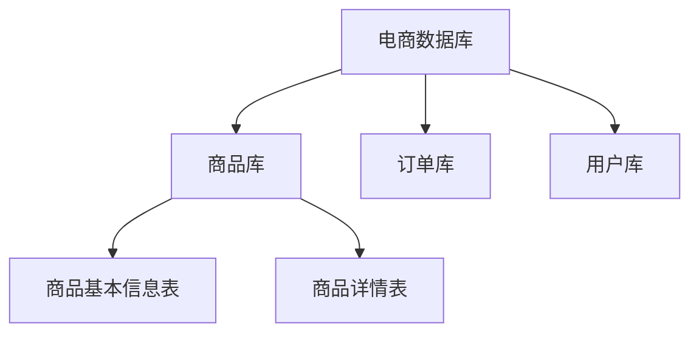

**注意**：  
垂直拆分更偏向**业务解耦和字段访问优化**，不一定直接解决某张表行数过大的问题。

### 水平拆分

**水平拆分**是按数据规则拆。

例如：

- 按用户 ID 取模。
- 按订单 ID 范围。
- 按时间区间。

水平分库：

- 把同类数据分散到多个数据库。
- 解决单库并发压力。

水平分表：

- 把同一张逻辑表拆成多张物理表。
- 解决单表数据量过大。

水平分库加水平分表：

- 同时解决高并发和大数据量问题。
- 但路由、扩容、跨分片查询会更复杂。

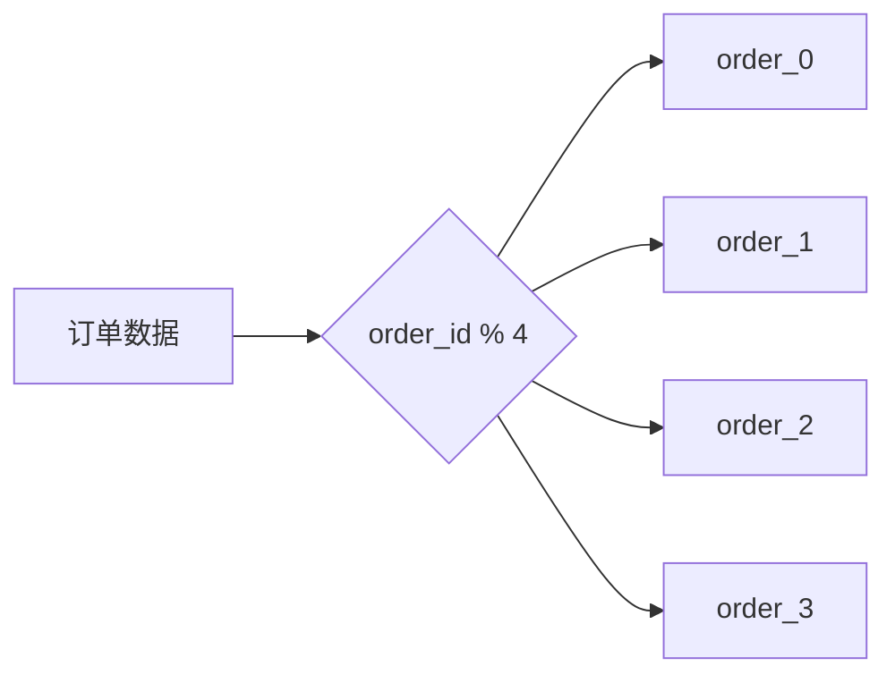

### 范围分片

**范围分片**按照有序字段划分数据。

常见字段：

- 时间。
- 自增 ID。
- 地区编号。

优点：

- 范围查询友好。
- 扩容逻辑直观。
- 历史数据归档方便。

缺点：

- 容易产生热点。
- 新数据可能集中写入最新分片。
- 数据分布可能不均匀。

### 哈希分片

**哈希分片**用哈希或取模把数据打散。

优点：

- 数据分布较均匀。
- 请求压力更容易被分摊。

缺点：

- 范围查询不友好。
- 扩容时可能需要大量数据迁移。
- 改变分片数量会影响路由结果。

| 分片方式 | 优点 | 缺点 | 适合场景 |
|---|---|---|---|
| **范围分片** | 范围查询方便，扩容直观 | 容易热点，分布可能不均 | 按时间归档、历史查询 |
| **哈希分片** | 数据分布均匀，并发分摊好 | 扩容迁移成本高，范围查询差 | 用户、订单等高并发点查 |

### 一致性哈希

一致性哈希用于降低扩容或缩容时的数据迁移量。

核心思想：

- 构造一个 `2^32` 大小的哈希环。
- 分片节点和数据 key 都映射到环上。
- 数据沿顺时针方向找到第一个分片节点。
- 新增或删除节点时，只影响相邻区间的数据。

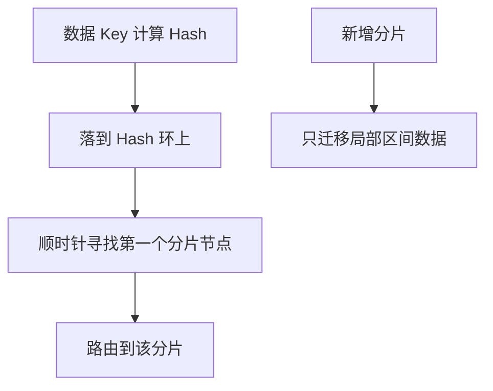

### 虚拟节点

如果真实分片节点太少，一致性哈希可能仍然不均匀。

解决办法是**虚拟节点**：

- 一个真实节点对应多个虚拟节点。
- 虚拟节点分散在哈希环上。
- 数据更均匀地落到不同真实节点上。
- 扩容时迁移也更平滑。

### 分库分表扩容

系统需要扩容通常有两个原因：

- 某些分片的数据量或访问量明显高于其他分片。
- 当前分片容量接近瓶颈。

PPT 提到一种扩容方式：**从库升级法**。

大致流程：

- 给原分片增加从库并完成数据同步。
- 暂时阻塞写入，确认主从数据一致。
- 把原库和从库拆成新的数据范围。
- 放开写入，业务按新路由访问。
- 删除各分片中的冗余数据。

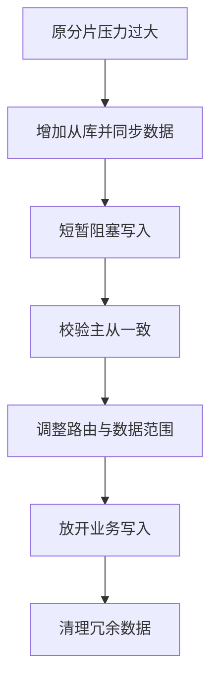

**复习提示**：  
分库分表真正难的不是“把数据拆开”，而是拆开后的**路由、跨分片查询、扩容迁移、事务一致性**。

## 异步写与写聚合

### 异步写

**异步写**把同步写入拆成两个阶段：

- 前台快速接收请求。
- 后台再慢慢执行真实写入。

用户看到的是：

- 请求已提交。
- 处理结果稍后可查。

系统内部则是：

- 请求先进入数据池或消息队列。
- 后台消费者按数据库承载能力处理。
- 处理结果写入数据库、缓存或状态表。

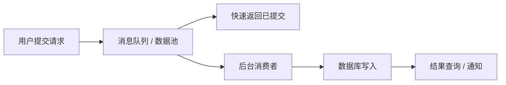

### 异步写适用场景

PPT 给出的典型场景包括：

- **跨公网调用**
  - 第三方接口慢、不稳定。
  - 例如微信、支付宝等外部接口调用。
  - 可以先入队，再异步消费。
- **秒杀系统**
  - 大量购买请求先进入消息队列。
  - 消费者按数据库能力扣减库存。
  - 处理结果写入 Redis。
  - 用户查询 Redis 得知成功或失败。

### 写聚合

**写聚合**是把多个细粒度写请求合并成批量写。

典型做法：

- 生产者把同 topic、同 partition 的消息批量发送。
- 后台把多个写请求合并后再落库。
- 对同一行的多次更新可以聚合成一次更新。

例如库存扣减：

- 原本有 100 个请求，每个请求扣库存 1。
- 如果逐条写库，会产生 100 次写入和 100 次锁竞争。
- 写聚合后，可以合并成一次“库存减少 100”的操作。

优势：

- 减少网络往返。
- 降低数据库写次数。
- 降低行锁竞争。
- 提升吞吐量。

代价：

- 结果不再立即可见。
- 需要处理失败重试和幂等。
- 需要明确用户能否接受“处理中”状态。

## 分布式事务基础

### 高可用与一致性的取舍

分布式系统绕不开 CAP 思想：

- **C（一致性）**：所有节点看到的数据一致。
- **A（可用性）**：系统总能对请求给出响应。
- **P（分区容错性）**：网络分区时系统仍能工作。

在真实分布式系统里，网络分区无法彻底避免，因此通常要在一致性和可用性之间做取舍。

本章的核心结论是：

- 存储架构为了高可用和高性能，会引入多副本、多节点、异步同步。
- 这些设计会让一致性变复杂。
- 分布式事务是对这种复杂性的治理手段。

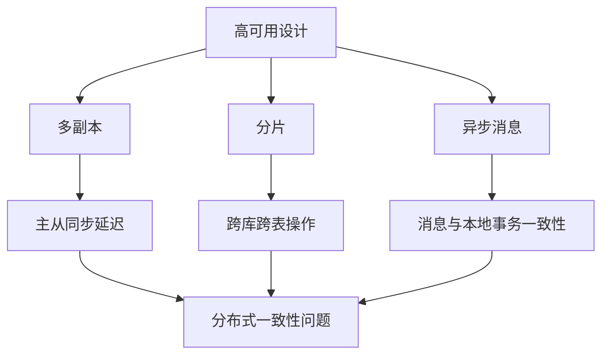

### 本地事务与 ACID

传统数据库事务强调 **ACID**：

| 特性 | 含义 | 例子 |
|---|---|---|
| **原子性** | 要么全部成功，要么全部失败 | 转账时 A 扣钱和 B 加钱必须一起完成 |
| **一致性** | 事务前后数据满足业务约束 | 总金额不能凭空增加或减少 |
| **隔离性** | 并发事务不能互相破坏 | 两个转账不能把余额扣成错误状态 |
| **持久性** | 提交后结果不会丢 | 数据库崩溃后已提交结果仍存在 |

单库场景中，数据库事务可以覆盖完整操作。  
分布式场景中，一个业务可能跨多个服务和数据库，单库事务就不够了。

### 什么是分布式事务

**分布式事务**是指：  
一个业务事务跨越多个节点、服务或数据库，需要保证这些局部操作在业务语义上保持一致。

例如电商下单：

- 订单服务创建订单。
- 库存服务扣减库存。
- 优惠服务锁定优惠券。
- 支付服务创建支付单。

这些动作不一定在同一个数据库里。  
如果库存扣了但订单没创建，或者订单创建了但优惠券没锁住，系统就会进入异常状态。

### 一致性类型

| 类型 | 含义 | 典型场景 |
|---|---|---|
| **强一致性** | 任意时刻所有节点数据都一致 | 银行转账、金融清算 |
| **弱一致性** | 不保证立即一致，也不承诺具体收敛时间 | CDN 缓存、聊天状态、广告展示 |
| **最终一致性** | 没有新写入后，经过有限时间最终一致 | 电商订单、用户资料同步、日志处理 |

**易混点**：

- 弱一致性不是“最终一定一致”。
- 最终一致性强调经过一段时间后会收敛。
- 强一致性通常代价最高，对可用性和性能影响最大。

### BASE 理论

BASE 是很多柔性事务方案的理论基础。

- **Basically Available，基本可用**
  - 出现故障时，核心功能仍然可用。
  - 例如大促时关闭非核心功能，只保留下单主链路。
- **Soft State，软状态**
  - 系统允许短暂处于中间状态。
  - 例如订单显示“处理中”。
- **Eventually Consistent，最终一致**
  - 通过重试、补偿、异步同步，最终达到一致状态。

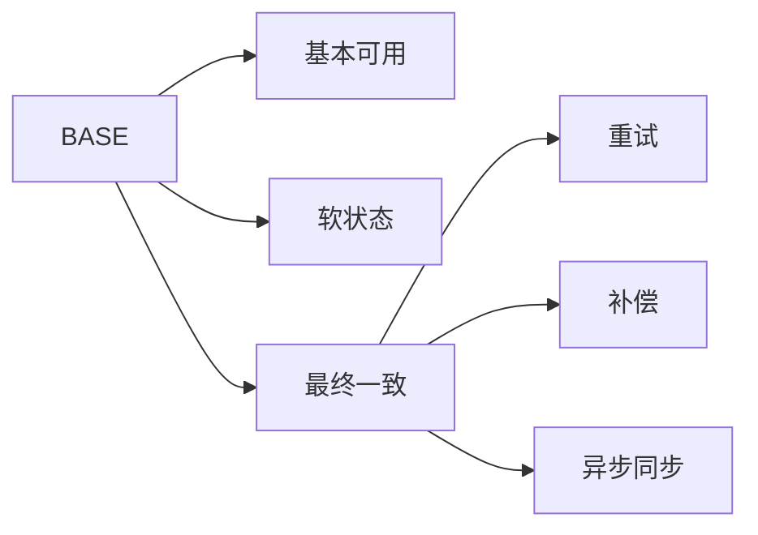

### 幂等性

分布式事务中非常重要的一点是**幂等性**。

幂等的意思是：

- 同一个操作执行一次和执行多次，最终结果一样。

为什么重要：

- 分布式系统会重试。
- 消息可能重复投递。
- 回调可能多次到达。
- 网络超时不代表操作没有成功。

例如支付回调：

- 支付平台可能多次通知“支付成功”。
- 订单服务必须保证不会重复发货、重复加积分、重复扣款。

**复习提示**：  
只要系统里有消息、重试、回调、补偿，就一定要考虑幂等。

## XA 与二阶段提交

### 基本角色

**XA 协议**是 X/Open 提出的分布式事务接口规范。  
典型实现是 **2PC（Two-Phase Commit，二阶段提交）**。

2PC 中有两个角色：

- **协调者**
  - 负责询问所有参与者是否可以提交。
  - 根据所有参与者的反馈决定提交或回滚。
- **参与者**
  - 执行本地事务准备。
  - 按协调者指令提交或回滚。

### 执行流程

2PC 分为两个阶段：

- **Prepare 阶段**
  - 协调者询问所有参与者能否提交。
  - 参与者执行本地操作但暂不提交。
  - 参与者返回 ready 或失败。
- **Commit / Rollback 阶段**
  - 如果所有参与者都 ready，协调者通知全部提交。
  - 只要有一个失败，协调者通知全部回滚。

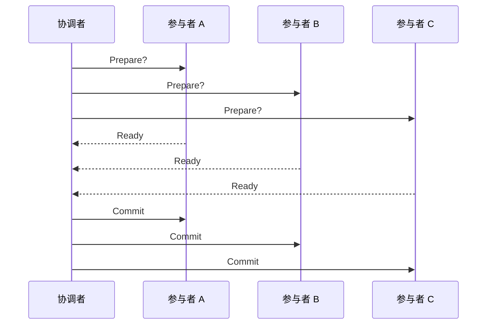

### 优缺点

优点：

- 一致性强。
- 思路清晰。
- 适合强一致性短事务。

缺点：

- **阻塞**
  - 参与者在 prepare 后要等待协调者决定。
  - 等待期间资源可能被锁住。
- **性能低**
  - 至少两轮通信。
  - 写入链路长。
- **协调者单点风险**
  - 协调者故障会导致参与者不确定该提交还是回滚。

适用场景：

- 金融转账。
- 强一致性短事务。
- 对性能要求低于一致性要求的场景。

## TCC 模式

### 基本思想

**TCC（Try-Confirm-Cancel）**是一种柔性事务方案。  
它把一个业务操作拆成三个阶段：

- **Try**
  - 检查资源。
  - 预留资源。
  - 例如冻结余额、预占库存。
- **Confirm**
  - 正式提交业务。
  - 使用 Try 阶段预留的资源。
- **Cancel**
  - 回滚 Try 阶段的影响。
  - 释放冻结资源或预占库存。

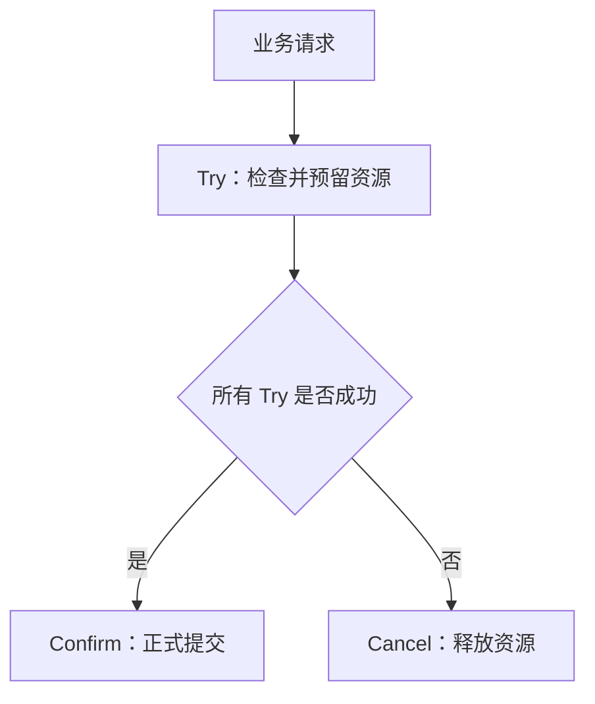

### 下单库存示例

以订单创建和库存预占为例：

- Try 阶段
  - 订单服务创建待确认订单。
  - 库存服务预占库存。
- Confirm 阶段
  - 订单状态改为正式订单。
  - 库存扣减确认。
- Cancel 阶段
  - 订单取消。
  - 库存释放。

### TCC 的特点

优势：

- 不依赖数据库强锁长时间阻塞。
- 适合微服务架构。
- 业务可控性强。
- 性能通常高于 XA/2PC。

代价：

- 每个服务都要实现 Try、Confirm、Cancel。
- 业务侵入性较强。
- 需要处理空回滚、悬挂、重复 Confirm / Cancel。
- 必须保证接口幂等。

适用场景：

- 高并发短事务。
- 需要快速响应。
- 业务可以明确预留和释放资源。
- 例如订单创建、库存预占、优惠券锁定。

## Saga 模式

### 基本思想

**Saga** 适合处理跨多个服务的长流程事务。

它的核心做法是：

- 把一个大的分布式事务拆成多个本地事务。
- 每个本地事务都有一个对应的补偿操作。
- 前面的步骤成功后继续执行后面的步骤。
- 如果后续失败，就调用已经成功步骤的补偿操作。

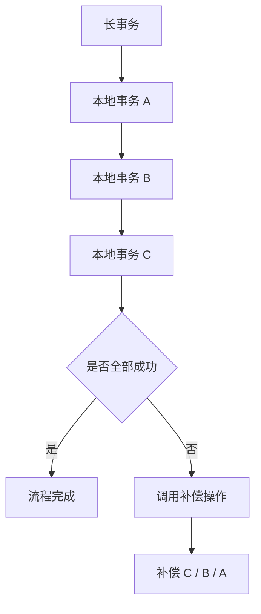

### 正向操作与补偿操作

每个本地事务通常包含两类逻辑：

- **正向操作**
  - 实际执行业务逻辑。
  - 例如创建订单、扣减库存、生成物流单。
- **补偿操作**
  - 撤销正向操作的业务影响。
  - 例如取消订单、回退库存、取消物流单。

注意：

- 补偿不一定等于数据库 rollback。
- 它更像一个业务上的“反向动作”。
- 有些动作无法完全撤销，只能做业务补救。

### 有协调者模式

有协调者的 Saga 中，会有一个中心组件保存执行状态。

特点：

- 协调者知道当前执行到哪一步。
- 每个步骤成功后，协调者触发下一步。
- 某一步失败时，协调者按相反顺序触发补偿。

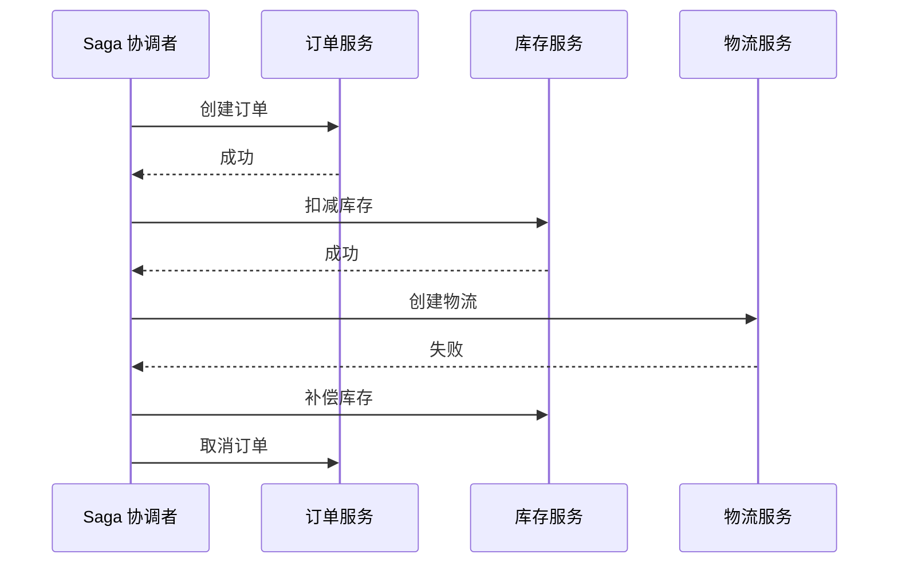

优点：

- 流程清晰。
- 状态可追踪。
- 失败补偿容易统一管理。

缺点：

- 协调者本身复杂。
- 协调者需要高可用。
- 流程编排会集中在一个地方。

### 无专门协调者模式

无协调者 Saga 中，服务之间通过事件或消息推进流程。

特点：

- 服务 A 完成后发消息。
- 服务 B 收到消息后执行自己的本地事务。
- 失败时再发补偿消息。
- 没有一个专门节点集中控制全流程。

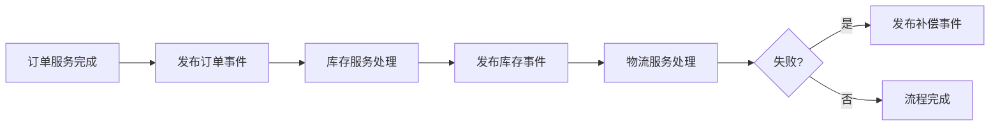

优点：

- 服务更松耦合。
- 没有明显中心节点。
- 适合事件驱动架构。

缺点：

- 流程分散，排查困难。
- 全局状态不直观。
- 补偿链路更难理解和测试。

### Saga 适用场景

Saga 适合：

- 跨多个服务的长流程事务。
- 业务允许最终一致性。
- 中间状态可接受。
- 补偿操作可以被业务定义。

例如：

- 订单取消。
- 物流状态变更。
- 跨服务审批流程。
- 需要较长时间完成的业务链路。

## 基于消息的最终一致性

### 核心问题

消息最终一致性要解决的问题是：  
**本地事务和消息发送必须保持一致**。

典型风险：

- 订单数据库写成功了，但消息没发出去。
- 消息发出去了，但订单数据库写失败了。

这两种情况都会导致下游服务和上游服务状态不一致。

### 基本流程

PPT 中给出的流程可以整理为：

- 生产者发送 **prepare 消息**到 MQ。
- 生产者执行本地事务。
- 如果本地事务成功，则把 prepare 消息标记为可发送，也就是发送 confirm。
- 消费方收到可投递消息后处理自己的业务。
- 如果本地事务失败，则丢弃 prepare 消息。
- MQ 定期回查生产者，询问某条 prepare 消息应该提交还是丢弃。
- 生产者根据本地事务状态回答 MQ。

```mermaid
sequenceDiagram
  participant P as 生产者 / 订单服务
  participant MQ as 消息队列
  participant DB as 订单数据库
  participant C as 消费者 / 库存服务

  P->>MQ: 发送 prepare 消息
  P->>DB: 执行本地事务
  DB-->>P: 本地事务成功
  P->>MQ: confirm 消息可投递
  MQ->>C: 投递消息
  C->>C: 执行业务处理
```

### MQ 回查机制

如果 MQ 没收到生产者的 confirm 或 rollback，就会回查。

回查的意义：

- MQ 不靠猜测决定消息状态。
- 生产者根据本地事务真实结果回答。
- 从而保证**本地事务状态和消息状态一致**。

```mermaid
flowchart TD
  A["MQ 发现 prepare 消息悬而未决"] --> B["回查生产者"]
  B --> C{"本地事务状态"}
  C -->|"成功"| D["提交消息并投递"]
  C -->|"失败"| E["丢弃消息"]
  C -->|"未知"| F["稍后继续回查"]
```

### 重要限制

PPT 特别强调：  
**下游业务失败不会触发上游业务回滚。**

也就是说：

- 消息事务只保证**生产者本地事务和消息发送**的一致性。
- 它不保证消费者一定成功完成业务。
- 如果库存服务处理失败，订单服务不会自动回滚。
- 下游失败只能通过业务补偿处理。

例如：

- 订单创建成功。
- 消息成功发给库存服务。
- 库存服务扣减失败。
- 此时订单服务不会自动 rollback。
- 系统可能需要取消订单、退款、通知用户或进入人工处理。

这也是为什么 PPT 说：  
**消息最终一致性最快，但一致性保证范围也最有限。**

### 适用场景

基于消息的最终一致性适合：

- 高吞吐量系统。
- 跨服务异步协作。
- 业务允许最终一致性。
- 下游失败可以通过补偿处理。

典型例子：

- 电商下单。
- 订单创建后通知库存、积分、优惠券、物流等系统。
- 日志、统计、异步通知。

## 事务方案对比

| 方案 | 一致性 | 性能 | 复杂度 | 典型场景 |
|---|---|---|---|---|
| **XA/2PC** | 强一致 | 低 | 高，协调者有单点和阻塞风险 | 金融转账、强一致短事务 |
| **TCC** | 柔性一致 | 高 | 中，需要实现 Try / Confirm / Cancel | 微服务短事务，订单和库存预占 |
| **Saga** | 最终一致 | 中 | 中，需要补偿事务 | 长流程事务，订单取消、跨服务流程 |
| **消息最终一致性** | 最终一致 | 高 | 中，需要 MQ 事务消息和回查 | 高吞吐、跨服务异步协作 |

### 选型思路

```mermaid
flowchart TD
  A["需要分布式事务"] --> B{"是否必须强一致"}
  B -->|"是"| C["优先考虑 XA/2PC"]
  B -->|"否"| D{"是否是短事务且可预留资源"}
  D -->|"是"| E["考虑 TCC"]
  D -->|"否"| F{"是否是长流程业务"}
  F -->|"是"| G["考虑 Saga"]
  F -->|"否"| H{"是否适合异步消息驱动"}
  H -->|"是"| I["考虑消息最终一致性"]
  H -->|"否"| J["重新审视业务边界和一致性要求"]
```

### 从一致性到性能的取舍

大致可以这样记：

- **XA/2PC**
  - 一致性最强。
  - 性能和可用性代价最大。
- **TCC**
  - 用业务预留和确认代替数据库长事务。
  - 适合短链路、高并发。
- **Saga**
  - 用一组本地事务和补偿事务完成长流程。
  - 适合业务流程长、允许最终一致的场景。
- **消息最终一致性**
  - 性能最好。
  - 保证范围主要是本地事务和消息发送的一致。
  - 下游失败要靠补偿。

```mermaid
flowchart LR
  A["强一致"] --> B["XA/2PC"]
  B --> C["TCC"]
  C --> D["Saga"]
  D --> E["消息最终一致性"]
  E --> F["高性能 / 高可用 / 最终一致"]
```

## 典型场景串联

### 电商下单链路

一个电商下单系统可能同时用到本章多个设计：

- 商品浏览走读库或缓存。
- 用户搜索走 Elasticsearch。
- 订单表按用户 ID 或订单 ID 分库分表。
- 秒杀请求先进入消息队列削峰。
- 库存扣减可能使用 TCC 预占。
- 下单成功后通过消息通知积分、优惠券、物流等系统。
- 如果某个下游失败，通过 Saga 或补偿任务修复。

```mermaid
flowchart TD
  A["用户下单"] --> B["消息队列削峰"]
  B --> C["订单服务"]
  C --> D["分库分表订单库"]
  C --> E["库存服务 TCC 预占"]
  C --> F["优惠券服务"]
  C --> G["支付服务"]
  C --> H["发布订单事件"]
  H --> I["积分服务"]
  H --> J["物流服务"]
  H --> K["搜索 / 报表读模型"]
```

### 这章和前面章节的关系

第九章和微服务、高可用、架构设计关系很紧：

- 微服务拆分后，服务有自己的数据库，天然产生跨服务事务。
- 服务治理解决调用、发现、网关、监控问题。
- 存储系统设计解决数据容量和性能问题。
- 分布式事务解决跨服务、跨数据库之后的数据一致性问题。

```mermaid
flowchart LR
  A["微服务拆分"] --> B["数据分散"]
  B --> C["存储架构扩展"]
  C --> D["高可用与高并发"]
  D --> E["一致性风险"]
  E --> F["分布式事务"]
```

## 易混点

### 主从复制不是强一致保障

主从复制常常是异步的。  
它能提升读能力和可用性，但不能自动保证读到的一定是最新数据。

### 读写分离不是简单地把读丢给从库

刚写完马上读的场景要特别处理。  
否则用户可能看到旧数据，造成业务体验或数据判断错误。

### CQRS 不是只加缓存

缓存可以看作一种简单读模型，但 CQRS 的范围更大。  
它强调命令模型和查询模型可以独立设计、独立优化、异步同步。

### 分库分表会削弱本地事务边界

拆分之后，一次业务操作可能跨多个库表。  
这时原本单库事务能解决的问题，会变成分布式事务问题。

### TCC 的 Cancel 不是数据库自动回滚

TCC 的 Cancel 是业务写出来的反向逻辑。  
它需要处理资源释放、状态变更、重复调用等问题。

### Saga 的补偿不一定完全恢复原状

有些业务动作无法真正撤销。  
补偿更多是把系统带回一个业务可接受的状态。

### 消息事务不保证消费者成功

消息最终一致性保证的是“本地事务和消息发送一致”。  
消费者处理失败时，需要业务补偿、重试或人工介入。

## 复习要点

- **存储系统设计是分布式事务的前置背景**。
- **主从复制**通过 binlog、relay log 和从库重放实现数据同步。
- **异步复制性能好但一致性弱，半同步复制一致性更强但性能下降**。
- **读写分离**提升读性能，但要处理主从延迟。
- **CQRS**把写模型和读模型拆开，让读写分别优化，但通常带来最终一致性。
- **垂直拆分**偏业务和字段维度，**水平拆分**偏数据分布和并发分摊。
- **一致性哈希**用于降低扩缩容时的数据迁移量，虚拟节点用于改善分布均匀性。
- **异步写**适合削峰填谷，**写聚合**适合减少细粒度写入和锁竞争。
- **分布式事务**解决的是跨节点、跨服务、跨数据库的业务一致性问题。
- **强一致性、弱一致性、最终一致性**要区分清楚。
- **BASE**强调基本可用、软状态、最终一致，是柔性事务的思想基础。
- **幂等性**是重试、消息、补偿机制能够可靠运行的前提。
- **XA/2PC**强一致但阻塞、性能低、协调者有风险。
- **TCC**适合短事务和资源预留场景。
- **Saga**适合长流程事务，通过正向操作和补偿操作保证最终一致。
- **消息最终一致性**性能高，但下游失败不会自动回滚上游。


