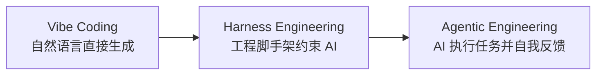
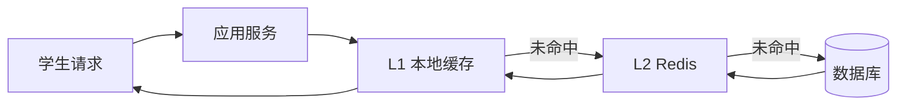
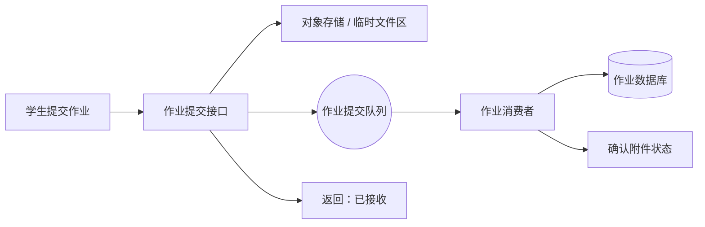
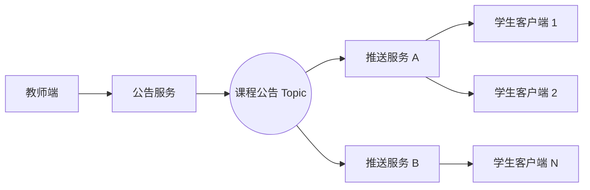

# 软件构造期末复习

这份笔记按复习材料整理，重点做两件事：

- 把资料中带 `*` 的重点知识点链接到已有章节笔记，方便回看原文。
- 把样例题先抄出题目，再根据前面章节笔记给出答题思路。

## 重点索引

### 绪论与 AI 软件工程

- **Vibe Coding、Harness Engineering、Agentic Engineering**：见 [[Chap01#Vibe Coding|Vibe Coding]]、[[Chap01#Harness Engineering|Harness Engineering]]、[[Chap01#Agentic Engineering|Agentic Engineering]]。
- **Vibe Coding 的局限性**：见 [[Chap01#Vibe Coding 的局限|Vibe Coding 的局限]]。
- **LLM 的技术限制**：见 [[Chap01#上下文窗口与注意力稀释|上下文窗口与注意力稀释]]、[[Chap01#迷失在中间效应|迷失在中间效应]]、[[Chap01#概率性与长程推理脆弱性|概率性与长程推理脆弱性]]。
- **AI 风险警示**：见 [[Chap01#AI 风险警示|AI 风险警示]]、[[Chap01#知识产权与版权风险|知识产权与版权风险]]、[[Chap01#安全风险|安全风险]]、[[Chap01#Agentic AI 的真实风险|Agentic AI 的真实风险]]、[[Chap01#Slopacolypse|Slopacolypse]]。
- **软件工程核心问题**：见 [[Chap01#软件工程的核心问题|软件工程的核心问题]]。
- **软件质量与 ISO/IEC 25010**：见 [[Chap01#质量特性与质量模型|质量特性与质量模型]]、[[Chap01#软件质量|软件质量]]、[[Chap01#ISO/IEC 25010 质量模型|ISO/IEC 25010 质量模型]]。

### 业务建模与需求分析

- **业务建模定义与核心输出**：见 [[Chap02#业务建模的含义|业务建模的含义]]。
- **RUP 业务建模工作流**：见 [[Chap02#RUP 业务建模工作流|RUP 业务建模工作流]]。
- **业务用例与系统用例**：见 [[Chap02#业务用例与系统用例|业务用例与系统用例]]。
- **系统流程图**：见 [[Chap02#系统流程图|系统流程图]]。
- **用例规约、基本流与备选流**：见 [[Chap02#用例规约|用例规约]]、[[Chap02#主事件流与备选流|主事件流与备选流]]。

### 分析与设计

- **确定参与对象**：见 [[Chap03#确定参与对象|确定参与对象]]。
- **提取分析类**：见 [[Chap03#提取分析类|提取分析类]]、[[Chap03#实体类|实体类]]、[[Chap03#边界类|边界类]]、[[Chap03#控制类|控制类]]。
- **用例实现与顺序图**：见 [[Chap03#用例实现|用例实现]]、[[Chap03#顺序图的对象布局|顺序图的对象布局]]、[[Chap03#ATM 提款顺序图|ATM 提款顺序图]]。
- **整理分析类**：见 [[Chap03#整理分析类|整理分析类]]、[[Chap03#确定属性|确定属性]]、[[Chap03#确定关联关系|确定关联关系]]。
- **接口、依赖、包结构、系统分层、子系统**：见 [[Chap03#接口|接口]]、[[Chap03#依赖|依赖]]、[[Chap03#包结构|包结构]]、[[Chap03#系统分层|系统分层]]、[[Chap03#子系统|子系统]]。

### 架构风格与架构演进

- **软件架构、组件、连接器**：见 [[Chap04#软件架构|软件架构]]、[[Chap04#组件与连接器|组件与连接器]]。
- **架构风格与架构模式**：见 [[Chap04#架构风格与架构模式|架构风格与架构模式]]。
- **管道过滤器、隐式调用、层次系统、Layer 与 Tier**：见 [[Chap04#管道过滤器风格|管道过滤器风格]]、[[Chap04#隐式调用风格|隐式调用风格]]、[[Chap04#层次系统风格|层次系统风格]]、[[Chap04#Layer 与 Tier|Layer 与 Tier]]。
- **单体架构、前后端分离、SOA、微服务**：见 [[Chap04#单体架构|单体架构]]、[[Chap04#前后端分离架构|前后端分离架构]]、[[Chap04#SOA|SOA]]、[[Chap04#微服务架构|微服务架构]]。
- **架构演进本质**：见 [[Chap04#演进本质|演进本质]]。

### 质量属性驱动的架构设计

- **质量场景与六要素**：见 [[Chap05#质量场景|质量场景]]、[[Chap05#质量场景六要素|质量场景六要素]]。
- **质量模型与 ISO 25010**：见 [[Chap05#质量模型|质量模型]]、[[Chap05#ISO 25010|ISO 25010]]。
- **高并发、高可用、容错与灾备、强一致性与可扩展性**：见 [[Chap05#高并发|高并发]]、[[Chap05#高可用|高可用]]、[[Chap05#容错与灾备|容错与灾备]]、[[Chap05#强一致性与可扩展性|强一致性与可扩展性]]。
- **CAP 与质量属性冲突**：见 [[Chap05#质量属性之间的冲突|质量属性之间的冲突]]、[[Chap05#CAP 原理|CAP 原理]]。
- **SAAM、ATAM、七步法**：见 [[Chap05#SAAM|SAAM]]、[[Chap05#ATAM|ATAM]]、[[Chap05#质量属性驱动设计方法|质量属性驱动设计方法]]。

### 架构模式与组件接口设计

- **MVC 核心思想**：见 [[Chap06#MVC 架构模式|MVC 架构模式]]、[[Chap06#MVC 三大组件|MVC 三大组件]]。
- **组件接口设计**：见 [[Chap06#组件接口设计|组件接口设计]]、[[Chap06#接口设计原则|接口设计原则]]、[[Chap06#供给接口与依赖接口|供给接口与依赖接口]]。
- **接口粒度、兼容性、契约式设计**：见 [[Chap06#接口粒度|接口粒度]]、[[Chap06#接口兼容性|接口兼容性]]、[[Chap06#契约式设计|契约式设计]]。
- **RESTful 接口设计**：见 [[Chap06#RESTful 接口设计|RESTful 接口设计]]、[[Chap06#面向资源|面向资源]]、[[Chap06#HTTP 方法|HTTP 方法]]、[[Chap06#幂等性|幂等性]]、[[Chap06#无状态|无状态]]。
- **OpenAPI**：见 [[Chap06#OpenAPI|OpenAPI]]。

### 分布式系统基础设施

- **资源池化、线程池、连接池**：见 [[Chap07#资源池化|资源池化]]、[[Chap07#线程池|线程池]]、[[Chap07#线程池关键参数|线程池关键参数]]、[[Chap07#数据库连接池|数据库连接池]]、[[Chap07#资源池参数调优|资源池参数调优]]。
- **缓存体系、本地缓存、分布式缓存、分层缓存**：见 [[Chap07#缓存体系|缓存体系]]、[[Chap07#本地缓存|本地缓存]]、[[Chap07#分布式缓存|分布式缓存]]、[[Chap07#分层缓存|分层缓存]]。
- **经典缓存问题**：见 [[Chap07#经典缓存问题|经典缓存问题]]、[[Chap07#缓存穿透|缓存穿透]]、[[Chap07#缓存击穿|缓存击穿]]、[[Chap07#缓存雪崩|缓存雪崩]]、[[Chap07#数据不一致|数据不一致]]。
- **消息中间件**：见 [[Chap07#消息中间件|消息中间件]]、[[Chap07#生产者与消费者|生产者与消费者]]、[[Chap07#队列模型与发布订阅模型|队列模型与发布订阅模型]]、[[Chap07#ACK、死信队列与分区|ACK、死信队列与分区]]。
- **消息关键问题**：见 [[Chap07#重复消费|重复消费]]、[[Chap07#顺序性|顺序性]]、[[Chap07#最终一致性|最终一致性]]、[[Chap07#消息堆积|消息堆积]]。

### 微服务与服务治理

- **微服务定义与核心原则**：见 [[Chap08#微服务架构基础|微服务架构基础]]、[[Chap08#核心设计原则|核心设计原则]]。
- **DDD、限界上下文、聚合根**：见 [[Chap08#DDD 与微服务划分|DDD 与微服务划分]]、[[Chap08#限界上下文|限界上下文]]、[[Chap08#聚合根|聚合根]]。
- **RESTful 与 gRPC**：见 [[Chap08#微服务通信机制|微服务通信机制]]、[[Chap08#RESTful 与 gRPC|RESTful 与 gRPC]]、[[Chap08#协议选择|协议选择]]。
- **服务治理技术**：见 [[Chap08#服务注册与发现|服务注册与发现]]、[[Chap08#API 网关|API 网关]]、[[Chap08#Sidecar 与服务网格|Sidecar 与服务网格]]。
- **监控、日志与故障管理**：见 [[Chap08#监控、日志与故障管理|监控、日志与故障管理]]、[[Chap08#故障管理|故障管理]]。

### 分布式事务与高可用设计

- **主从模式与主从复制**：见 [[Chap09#主从模式|主从模式]]、[[Chap09#MySQL 主从复制过程|MySQL 主从复制过程]]、[[Chap09#异步复制与半同步复制|异步复制与半同步复制]]。
- **读写分离与主从延迟**：见 [[Chap09#读写分离|读写分离]]、[[Chap09#主从延迟问题|主从延迟问题]]。
- **CQRS**：见 [[Chap09#CQRS|CQRS]]、[[Chap09#多表查询场景示例|多表查询场景示例]]。
- **分库分表**：见 [[Chap09#分库分表|分库分表]]、[[Chap09#垂直拆分|垂直拆分]]、[[Chap09#水平拆分|水平拆分]]、[[Chap09#范围分片|范围分片]]、[[Chap09#一致性哈希|一致性哈希]]、[[Chap09#分库分表扩容|分库分表扩容]]。
- **异步写与写聚合**：见 [[Chap09#异步写与写聚合|异步写与写聚合]]。
- **分布式事务基础理论**：见 [[Chap09#分布式事务基础|分布式事务基础]]、[[Chap09#什么是分布式事务|什么是分布式事务]]、[[Chap09#一致性类型|一致性类型]]、[[Chap09#BASE 理论|BASE 理论]]、[[Chap09#幂等性|幂等性]]。
- **分布式事务解决方案**：见 [[Chap09#XA 与二阶段提交|XA 与二阶段提交]]、[[Chap09#TCC 模式|TCC 模式]]、[[Chap09#Saga 模式|Saga 模式]]、[[Chap09#基于消息的最终一致性|基于消息的最终一致性]]。

## 概念理解题

### Vibe Coding、Harness Engineering 与 Agentic Engineering

**题目**：简述 Vibe Coding 与 Harness Engineering 的核心区别，并说明从 Vibe Coding 到 Agentic Engineering 的演进逻辑。

**答案**：

- **Vibe Coding** 更强调用自然语言直接驱动 AI 生成代码，开发者把意图交给模型，模型负责快速生成实现。它适合探索、原型开发和低风险代码，但缺点是可控性弱，容易出现上下文遗漏、隐性缺陷和不可维护代码。
- **Harness Engineering** 的核心不是让 AI 自由发挥，而是给 AI 搭建可控的工程脚手架，包括需求约束、测试、工具链、代码审查、执行环境和反馈回路。它把 AI 放进工程流程里，让 AI 生成结果可以被验证、约束和修正。
- **Agentic Engineering** 是进一步演进：AI 不只是生成代码，而是能围绕目标进行任务拆解、工具调用、执行反馈和多轮修复。开发者的角色从“直接写代码”逐渐变成“定义目标、设计约束、审查结果、治理风险”。

演进逻辑可以概括为：

### 单体巨石与适用场景

**题目**：什么是“单体巨石”的典型症状？单体架构适用于哪些场景？

**答案**：

- **单体巨石**指系统所有模块高度耦合在一个部署单元中，随着业务增长逐渐变得难以修改、难以测试、难以部署。
- 典型症状包括：
  - 模块边界模糊，修改一个功能容易影响其他功能。
  - 构建、测试、发布周期越来越长。
  - 团队协作冲突频繁，不同业务线互相阻塞。
  - 单个模块的故障可能拖垮整个系统。
  - 技术栈难以局部升级，只能整体迁移。
- 单体架构不是错误架构，它适合：
  - 业务规模较小、团队较小、需求变化还不剧烈的系统。
  - 初创产品、课程项目、内部工具、原型系统。
  - 对独立扩展、独立部署要求不高的场景。

### 异步写与写聚合

**题目**：请对比异步写与写聚合的核心思想，并说明它们分别适用于什么样的高并发场景。

**答案**：

| 方案 | 核心思想 | 主要解决问题 | 典型场景 |
|---|---|---|---|
| **异步写** | 前台请求先入队，后台消费者再写入真实存储 | 削峰、降低同步等待、隔离慢服务 | 秒杀下单、作业提交、跨公网调用、日志写入 |
| **写聚合** | 把多个细粒度写请求合并成批量写或一次汇总写 | 减少写次数、降低锁竞争、提升吞吐 | 库存批量扣减、计数器累加、消息批量刷盘 |

异步写更关注**请求链路解耦**，写聚合更关注**落库动作合并**。两者可以一起用：先把大量请求放入消息队列，再由消费者批量聚合写入数据库。

### 业务用例与系统用例

**题目**：简述业务用例与系统用例的区别与联系。

**答案**：

- **业务用例**描述组织或业务流程如何达成业务目标，关注业务参与者、业务活动和业务价值，不一定限定在某个软件系统内。
- **系统用例**描述软件系统对外提供什么功能，关注系统边界、用户交互、前置条件、主事件流和备选流。
- 两者的联系是：业务用例帮助理解业务全貌，系统用例从业务流程中抽取出需要由软件系统承担的部分。系统用例通常来源于业务用例，但粒度更接近软件需求。

## 找错并解释题

### RESTful 无状态与 Session

**题目**：观点：在 RESTful 接口设计中，所有 HTTP 方法都应该设计成无状态的，而状态信息可以保存在服务器端的 Session 中。

**错误点**：把 RESTful 的**无状态**理解错了。

**解释**：

- RESTful 的无状态是指服务端不依赖服务器端 Session 保存客户端上下文。每次请求都应该携带足够的信息，例如 token、资源 ID、请求参数。
- HTTP 方法本身不是“有状态/无状态”的主体，真正需要无状态的是**客户端与服务端交互方式**。
- 如果把会话状态存在服务器端 Session 中，服务端就需要记住客户端上下文，这会降低横向扩展能力，也不利于负载均衡。

正确说法是：RESTful 接口应尽量保持服务端无状态，请求本身携带完成处理所需的信息。

### 管道过滤器与 AI 时代

**题目**：观点：管道-过滤器风格在当前的 AI 时代已经过时，因为 LLM 不需要这种传统的数据处理模式。

**错误点**：低估了管道过滤器在 AI 应用中的作用。

**解释**：

- 管道过滤器风格的核心是把处理流程拆成多个独立步骤，每个过滤器完成单一转换，管道负责连接输入输出。
- AI 应用中常见的 RAG、Agent 工作流、数据清洗、提示词构造、检索、重排、生成、校验，本质上都可以组织成管道。
- LLM 不会消灭这种架构风格，反而让它重新重要，因为 AI 系统更需要可插拔、可观测、可替换的处理链路。

### 一致性哈希与范围分区

**题目**：观点：水平分库分表时，一致性哈希分区比范围分区更好，因为它永远不会产生数据偏斜。

**错误点**：一致性哈希不能保证永远没有数据偏斜。

**解释**：

- 一致性哈希的优势是扩缩容时只迁移局部数据，迁移成本低于普通取模。
- 如果真实节点数量少、哈希函数分布不好、热点 key 集中，仍然可能产生数据偏斜。
- 虚拟节点可以缓解偏斜，但不是绝对消除偏斜。
- 范围分区也不是必然更差，它适合按时间、ID 做范围查询和归档，只是容易出现新数据热点。

正确比较应该看场景：范围分区适合范围查询，一致性哈希适合扩缩容频繁、点查为主的分布式场景。

### AI 生成代码与知识产权风险

**题目**：观点：AI 生成的代码完全由开发者控制，开发者可以随意使用，不存在任何知识产权或版权方面的风险。

**错误点**：忽略了 AI 生成内容的来源不透明和合规风险。

**解释**：

- AI 生成代码可能受训练数据影响，生成与开源项目、商业代码或受版权保护代码相似的内容。
- 开发者虽然控制提示词和使用方式，但不完全控制模型内部生成机制。
- 在商业项目中，还要考虑开源许可证、代码归属、数据泄露、安全漏洞等风险。

正确做法是：对 AI 生成代码进行审查、测试、许可证检查和安全扫描，不能把生成结果直接视为无风险资产。

## 质量属性分析题

### 在线支付系统质量属性

**题目**：假设你正在设计一个在线支付系统，请识别至少三个关键质量属性，并针对其中两个质量属性分析它们之间可能存在的冲突，提出至少一种应对策略。

**答案**：

在线支付系统的关键质量属性包括：

- **安全性**：支付请求、账户信息、交易凭证必须防篡改、防泄露、防重放。
- **可用性**：支付链路需要在高峰期和部分故障下仍能提供服务。
- **一致性**：订单状态、支付状态、账户余额、回调结果必须保持业务一致。
- **性能**：支付请求需要在可接受时间内完成响应。
- **可审计性**：交易过程需要可追踪，支持对账、风控和问题追溯。

典型冲突：

- **强一致性 vs 可用性/性能**
  - 如果所有交易都使用强同步、多方确认、严格分布式事务，系统一致性更强，但延迟更高，可用性更容易受某个下游服务影响。
  - 应对策略：核心资金链路使用强一致或准强一致；非核心通知、积分、营销等链路使用消息最终一致性。
- **安全性 vs 用户体验/性能**
  - 强认证、风控校验、多因子验证会提升安全性，但增加操作步骤和响应延迟。
  - 应对策略：使用风险分级。低风险交易走轻量校验，高风险交易触发二次验证。

一个可行的架构取舍是：

- 支付创建、扣款、订单状态变更走严格事务边界和幂等控制。
- 支付成功后的通知、积分、报表统计走消息中间件异步处理。
- 所有关键操作记录审计日志，支持对账和补偿。

## 综合设计题

### 案例背景

某在线教育平台在直播大班课场景中，遇到以下性能问题：

- **问题一**：每次课程开始时，大量学生同时登录并请求课程详情、课件列表等数据，导致数据库连接池耗尽，响应时间从 `50ms` 飙升到 `5s`。
- **问题二**：课后学生集中提交作业，包括附件上传，导致文件存储服务和数据库写入压力过大，部分请求超时失败。
- **问题三**：教师发布公告后，需要实时推送到数千名学生客户端，但同步推送造成教师端接口阻塞。

### 分层缓存方案

**题目**：针对问题一，请设计一套分层缓存方案，至少包含 L1 和 L2，说明每一层的缓存类型、存储内容、TTL 策略。

**答案**：

可以采用 **L1 本地缓存 + L2 分布式缓存 + DB 回源** 的结构。

| 层级 | 缓存类型 | 存储内容 | TTL 策略 |
|---|---|---|---|
| **L1** | 应用本地缓存，例如 Caffeine / Guava Cache | 热门课程详情、课件列表、直播入口配置 | 短 TTL，例如 30 秒到 2 分钟，降低单机重复请求 |
| **L2** | 分布式缓存，例如 Redis | 全量热门课程详情、课件元数据、课程状态 | 中等 TTL，例如 5 到 30 分钟，根据课程更新频率调整 |
| **DB** | 关系数据库 | 权威课程数据 | 不设置 TTL，作为最终数据源 |

访问流程：

这套方案的目标是让开课瞬间的大量读请求尽量在缓存层命中，避免全部打到数据库连接池。

### 缓存击穿防护

**题目**：为防止缓存击穿，针对“课程详情”热点数据，请设计一种防护方案。

**答案**：

课程详情是典型热点 key，可以采用以下组合方案：

- **互斥锁回源**
  - 当热点 key 过期且大量请求同时到达时，只允许一个线程回源数据库。
  - 其他请求等待锁释放后读取新缓存，避免大量请求同时打 DB。
- **热点数据预热**
  - 在课程开始前，把课程详情、课件列表、直播入口提前写入 Redis 和本地缓存。
  - 避免第一波学生请求触发冷启动。
- **逻辑过期**
  - 缓存中保存数据和逻辑过期时间。
  - 过期后先返回旧值，同时异步刷新缓存。
  - 适合课程详情这种短时间内允许轻微旧数据的读场景。

### 作业提交异步写方案

**题目**：针对问题二，请设计基于消息队列的异步写方案，说明写请求如何处理、消费者如何消费、如何保证作业不丢失。

**答案**：

作业提交可以拆成“前台接收 + 后台处理”：

- 学生提交作业时，应用服务先完成基本校验。
- 附件先上传到对象存储或临时文件区，生成文件地址。
- 作业元数据和文件地址写入消息队列。
- 前台快速返回“提交中”或“已接收”。
- 后台消费者从队列中拉取消息，完成数据库写入、附件状态确认、查重、通知等操作。

防丢失策略：

- **消息持久化**：队列消息必须持久化，避免 MQ 重启丢消息。
- **生产确认**：生产者发送消息后等待 broker ACK，再返回提交成功。
- **消费 ACK**：消费者处理成功后再 ACK；失败则重试或进入死信队列。
- **幂等写入**：用作业提交 ID 或学生 ID + 课程 ID + 作业 ID 做唯一键，避免重复消费导致重复提交。
- **补偿扫描**：定期扫描临时文件区和提交记录，发现已上传但未入库的数据后重新投递。

### 公告推送消息模型

**题目**：针对问题三，请选择适合的消息模型，并画出架构示意图，标出生产者、消费者、主题/队列等关键组件。

**答案**：

公告推送适合使用**发布-订阅模型**，因为同一条公告需要被多个学生客户端接收。

- **生产者**：教师端公告服务。
- **主题**：课程公告 Topic，例如 `course.announcement.<courseId>`。
- **消费者**：推送服务、WebSocket 网关、学生客户端订阅连接。

这样教师端只负责发布公告消息，不需要同步等待数千个客户端推送完成。推送服务可以水平扩展，客户端离线时也可以结合站内信或未读公告表进行补偿。

### 资源池优化建议

**题目**：针对问题一中“数据库连接池耗尽”的情况，请从线程池和数据库连接池的参数调整角度，给出至少三条优化建议，并说明理由。

**答案**：

- **限制业务线程池最大并发**
  - 不能让无限请求直接冲进数据库访问逻辑。
  - 通过合理设置核心线程数、最大线程数和队列长度，让系统在高峰期排队或快速失败，而不是把 DB 连接池打满。
- **调整数据库连接池大小**
  - 连接池过小会导致请求等待连接，连接池过大又可能压垮数据库。
  - 应根据数据库最大连接数、应用实例数、平均查询耗时计算合理连接数。
- **设置连接获取超时和慢查询超时**
  - 获取连接不能无限等待，否则请求线程会堆积。
  - 慢 SQL 应设置超时和监控，避免少量慢请求占满连接。
- **区分读写数据源**
  - 课程详情、课件列表属于高频读请求，可以优先走缓存和读库。
  - 写请求和关键一致性请求再走主库。
- **配合限流和降级**
  - 开课瞬间可以对非核心接口限流。
  - 如果课件列表暂时不可用，可以先返回课程基础信息，降低数据库压力。

核心思路是：线程池控制进入系统的并发，连接池控制进入数据库的并发，缓存减少真正需要进入数据库的请求。
