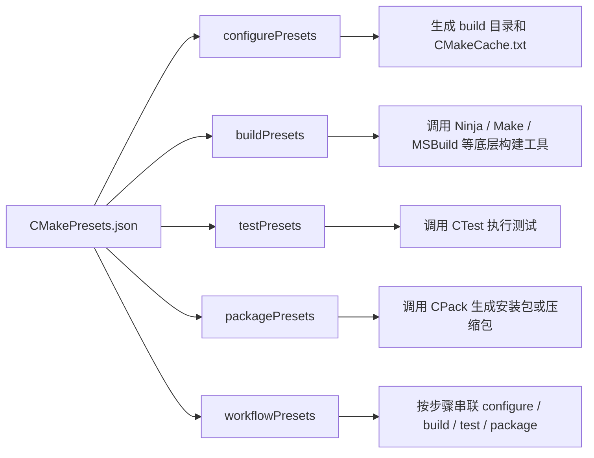

# CMake Presets 使用笔记

`CMake Presets` 是 CMake 提供的一套**预设配置机制**：把平时写在命令行里的 `-G`、`-B`、`-D`、测试参数、打包参数等内容，整理到项目根目录下的 JSON 文件里。之后开发者、CI、IDE 都可以通过一个稳定的 preset 名称执行同一套配置。

最典型的变化是把下面这种命令：

```shell
cmake -S . -B build/debug -G Ninja -DCMAKE_BUILD_TYPE=Debug -DCMAKE_EXPORT_COMPILE_COMMANDS=ON
cmake --build build/debug -j 16
ctest --test-dir build/debug --output-on-failure
```

整理成：

```shell
cmake --preset debug
cmake --build --preset debug
ctest --preset debug
```

本文以 CMake 4.4.0 官方文档为参考。基础的 `configurePresets` 从 CMake 3.19 开始支持，后续版本逐步加入了 build、test、package、workflow、include、schema 等能力；实际项目中要根据团队的最低 CMake 版本选择合适的 presets `version`。

## 它解决的是什么问题

CMake 命令行很灵活，但灵活也意味着容易漂移：同一个项目，不同人可能使用不同 generator、不同 build 目录、不同 `CMAKE_BUILD_TYPE`，CI 里又复制一套相似但不完全一致的命令。`CMakePresets.json` 的核心价值就是把这些“构建入口参数”固定下来。

- **减少命令行心智负担**：开发者不需要记住一串 `cmake -S -B -G -D...` 参数，只需要记住 `debug`、`release`、`asan` 这类 preset 名称。
- **统一本地、CI 和 IDE 行为**：命令行、Visual Studio、VS Code CMake Tools、CLion 等工具可以读取同一份 preset 配置，减少“我本地能编，CI 不能编”的差异。
- **让构建目录可预测**：每个 configure preset 都可以指定 `binaryDir`，例如 `build/debug`、`build/release`，避免不同配置互相污染。
- **把工程选项显式记录下来**：`cacheVariables` 可以集中记录 `CMAKE_BUILD_TYPE`、`CMAKE_CXX_COMPILER`、`CMAKE_EXPORT_COMPILE_COMMANDS`、项目自定义选项等。
- **方便扩展多个构建变体**：可以用 `inherits` 抽出公共配置，再派生 `debug`、`release`、`asan`、`cuda`、`cross-aarch64` 等配置。
- **把常用工作流串起来**：`workflowPresets` 可以把 configure、build、test、package 按顺序执行，适合 CI 或发布前检查。

可以把 presets 理解成“CMake 项目的入口菜单”：



这里要注意：presets 不是替代 `CMakeLists.txt` 的构建逻辑，而是替代“如何调用 CMake”的入口参数。真正的 target、依赖、编译选项仍然应该写在 `CMakeLists.txt` 或被它包含的 `.cmake` 文件里。

## 两个文件：项目配置与个人配置

CMake 默认读取项目根目录下的两个文件：

| 文件 | 是否建议提交 | 用途 |
| --- | --- | --- |
| `CMakePresets.json` | 建议提交 | 项目级公共配置，例如 `debug`、`release`、`ci`、`asan`。 |
| `CMakeUserPresets.json` | 不建议提交 | 开发者本机配置，例如本地编译器路径、私有 toolchain、个人 build 目录。 |

这两个文件格式相同。常见约定是：

- `CMakePresets.json` 放团队共享的、跨机器相对稳定的配置。
- `CMakeUserPresets.json` 放个人机器相关的配置，并加入 `.gitignore`。
- 如果两者同时存在，`CMakeUserPresets.json` 可以引用或继承 `CMakePresets.json` 中的 preset。

从 CMake 4.4 开始，还可以用 `--presets-file <file>` 显式指定 presets 文件。指定后，默认的 `CMakePresets.json` 和 `CMakeUserPresets.json` 会被忽略。这个选项适合临时实验或特殊 CI 入口，但普通项目通常还是使用默认文件名。

## Preset 的几种类型

Preset 不是一种配置，而是一组配置类型。它们对应 CMake 常见工作流的不同阶段。

| 类型 | JSON 字段 | 执行命令 | 解决的问题 |
| --- | --- | --- | --- |
| configure preset | `configurePresets` | `cmake --preset <name>` | 生成构建目录，设置 generator、cache 变量、toolchain 等。 |
| build preset | `buildPresets` | `cmake --build --preset <name>` | 基于某个 configure preset 编译 target。 |
| test preset | `testPresets` | `ctest --preset <name>` | 基于某个 configure preset 运行测试。 |
| package preset | `packagePresets` | `cpack --preset <name>` | 基于某个 configure preset 打包。 |
| workflow preset | `workflowPresets` | `cmake --workflow --preset <name>` | 串联 configure、build、test、package。 |

其中最核心的是 `configurePresets`。后面的 build、test、package preset 通常都通过 `configurePreset` 字段指向某个 configure preset，从而知道应该使用哪个 build 目录。

## 最小可用示例

下面是一份适合普通 C++ 项目的 `CMakePresets.json`。它提供了 `debug` 和 `release` 两套配置，并为它们分别定义 build、test 和 workflow preset。

```json
{
  "version": 6,
  "cmakeMinimumRequired": {
    "major": 3,
    "minor": 25,
    "patch": 0
  },
  "configurePresets": [
    {
      "name": "base",
      "hidden": true,
      "generator": "Ninja",
      "binaryDir": "${sourceDir}/build/${presetName}",
      "cacheVariables": {
        "CMAKE_EXPORT_COMPILE_COMMANDS": "ON"
      }
    },
    {
      "name": "debug",
      "inherits": "base",
      "displayName": "Debug",
      "cacheVariables": {
        "CMAKE_BUILD_TYPE": "Debug"
      }
    },
    {
      "name": "release",
      "inherits": "base",
      "displayName": "Release",
      "cacheVariables": {
        "CMAKE_BUILD_TYPE": "Release"
      }
    }
  ],
  "buildPresets": [
    {
      "name": "debug",
      "configurePreset": "debug",
      "jobs": 16
    },
    {
      "name": "release",
      "configurePreset": "release",
      "jobs": 16
    }
  ],
  "testPresets": [
    {
      "name": "debug",
      "configurePreset": "debug",
      "output": {
        "outputOnFailure": true
      },
      "execution": {
        "stopOnFailure": true,
        "noTestsAction": "error"
      }
    },
    {
      "name": "release",
      "configurePreset": "release",
      "output": {
        "outputOnFailure": true
      }
    }
  ],
  "workflowPresets": [
    {
      "name": "check-debug",
      "steps": [
        {
          "type": "configure",
          "name": "debug"
        },
        {
          "type": "build",
          "name": "debug"
        },
        {
          "type": "test",
          "name": "debug"
        }
      ]
    }
  ]
}
```

对应命令如下：

```shell
# 配置 Debug 构建目录：build/debug
cmake --preset debug

# 编译 Debug 配置
cmake --build --preset debug

# 运行 Debug 测试
ctest --preset debug

# 一条命令完成 configure -> build -> test
cmake --workflow --preset check-debug
```

这个例子里最值得记住的是：

- `base` 是一个 **hidden preset**，不能直接执行，只用来被其他 preset 继承。
- `debug` 继承 `base` 后，`binaryDir` 中的 `${presetName}` 会展开成 `debug`，所以构建目录是 `build/debug`。
- `buildPresets.debug.configurePreset` 指向 `debug`，所以 `cmake --build --preset debug` 会自动知道要构建 `build/debug`。
- `testPresets.debug.configurePreset` 也指向 `debug`，所以 `ctest --preset debug` 会自动在对应 build 目录下找测试。

## 根对象字段

`CMakePresets.json` 的根节点是一个 JSON object，常见字段如下。

| 字段 | 是否常用 | 含义 |
| --- | --- | --- |
| `version` | 必填 | presets 文件格式版本，不等于项目版本，也不等于 CMake 版本。 |
| `cmakeMinimumRequired` | 建议写 | 表示使用这份 presets 至少需要的 CMake 版本。 |
| `$schema` | 可选 | JSON schema 地址，主要用于编辑器校验和补全；该字段从 presets version 8 开始支持。 |
| `include` | 可选 | 包含其他 presets 文件，适合把平台、工具链或 CI 配置拆开。 |
| `configurePresets` | 常用 | 配置阶段预设。 |
| `buildPresets` | 常用 | 构建阶段预设。 |
| `testPresets` | 常用 | 测试阶段预设。 |
| `packagePresets` | 视项目而定 | 打包阶段预设。 |
| `workflowPresets` | 视项目而定 | 多阶段工作流预设。 |
| `vendor` | 少见 | IDE 或厂商工具扩展字段，CMake 本身不解释其中内容。 |

如果想获得编辑器补全，并且项目允许要求 CMake 3.28 以上，可以使用 presets version 8 或更高版本并加入 `$schema`：

```json
{
  "version": 8,
  "$schema": "https://cmake.org/cmake/help/latest/manual/cmake-presets.7.html#schema",
  "cmakeMinimumRequired": {
    "major": 3,
    "minor": 28,
    "patch": 0
  },
  "configurePresets": []
}
```

不过实际项目里不要为了追新随意提高 `version`。如果只需要 configure、build、test，`version: 2` 或 `version: 3` 就可能足够；如果需要 workflow 和 package，通常至少使用 `version: 6`。

## Configure Preset

`configurePresets` 对应普通 CMake 命令里的配置阶段：

```shell
cmake -S . -B build/debug -G Ninja -DCMAKE_BUILD_TYPE=Debug
```

它负责生成 build tree（构建树），也就是包含 `CMakeCache.txt`、`compile_commands.json`、Ninja 文件或 Makefile 的目录。

常用字段如下：

| 字段 | 对应命令行 | 含义 |
| --- | --- | --- |
| `name` | `--preset <name>` | preset 的机器可读名称，命令行使用它。 |
| `displayName` | 无直接对应 | 给 IDE 或 GUI 展示的人类可读名称。 |
| `description` | 无直接对应 | 描述该 preset 的用途。 |
| `hidden` | 无直接对应 | 隐藏 preset，常用于抽象公共基类。 |
| `inherits` | 无直接对应 | 继承一个或多个 preset 的字段。 |
| `generator` | `-G` | 指定生成器，例如 `Ninja`、`Unix Makefiles`。 |
| `binaryDir` | `-B` | 指定构建目录。 |
| `installDir` | `CMAKE_INSTALL_PREFIX` | 指定安装前缀。 |
| `toolchainFile` | `CMAKE_TOOLCHAIN_FILE` | 指定交叉编译或自定义工具链文件。 |
| `cacheVariables` | `-D` | 设置 CMake cache 变量。 |
| `environment` | 环境变量 | 配置阶段使用的环境变量。 |
| `condition` | 无直接对应 | 根据平台或条件启用 / 禁用 preset。 |

一个常见的 `configurePresets` 写法是把公共选项放在 `base`，具体构建类型只覆盖少量 cache 变量：

```json
{
  "configurePresets": [
    {
      "name": "base",
      "hidden": true,
      "generator": "Ninja",
      "binaryDir": "${sourceDir}/build/${presetName}",
      "cacheVariables": {
        "CMAKE_EXPORT_COMPILE_COMMANDS": "ON",
        "BUILD_TESTING": "ON"
      }
    },
    {
      "name": "asan",
      "inherits": "base",
      "cacheVariables": {
        "CMAKE_BUILD_TYPE": "Debug",
        "ENABLE_ASAN": "ON"
      }
    }
  ]
}
```

这里的 `ENABLE_ASAN` 是项目自定义选项，通常会在 `CMakeLists.txt` 中通过 `option(ENABLE_ASAN "Enable AddressSanitizer" OFF)` 定义。

## Build Preset

`buildPresets` 对应构建阶段：

```shell
cmake --build build/debug --target app -j 16
```

它一般不重新指定 `binaryDir`，而是通过 `configurePreset` 绑定到一个 configure preset。

```json
{
  "buildPresets": [
    {
      "name": "app-debug",
      "configurePreset": "debug",
      "targets": ["app"],
      "jobs": 16,
      "verbose": true
    }
  ]
}
```

常用字段如下：

| 字段 | 含义 |
| --- | --- |
| `name` | build preset 名称，用于 `cmake --build --preset <name>`。 |
| `configurePreset` | 关联的 configure preset，CMake 通过它找到构建目录。 |
| `configuration` | 多配置生成器使用的配置名，例如 `Debug`、`Release`。 |
| `targets` | 要构建的 target 列表。 |
| `jobs` | 并行构建任务数，类似 `-j`。 |
| `cleanFirst` | 构建前先清理。 |
| `verbose` | 输出更详细的构建命令。 |

单配置生成器和多配置生成器的区别要特别注意：

- `Ninja`、`Unix Makefiles` 通常是**单配置生成器**，构建类型在 configure 阶段通过 `CMAKE_BUILD_TYPE=Debug` 或 `Release` 决定。
- `Ninja Multi-Config`、Visual Studio、Xcode 通常是**多配置生成器**，configure 阶段不只生成一种配置，build 阶段再用 `configuration` 指定 `Debug` 或 `Release`。

## Test Preset

`testPresets` 对应 CTest：

```shell
ctest --test-dir build/debug --output-on-failure --stop-on-failure
```

示例：

```json
{
  "testPresets": [
    {
      "name": "unit-debug",
      "configurePreset": "debug",
      "output": {
        "outputOnFailure": true
      },
      "filter": {
        "include": {
          "label": "unit"
        }
      },
      "execution": {
        "jobs": 8,
        "stopOnFailure": true,
        "noTestsAction": "error"
      }
    }
  ]
}
```

常用字段如下：

| 字段 | 含义 |
| --- | --- |
| `configurePreset` | 关联 configure preset，用于推导测试所在的 build 目录。 |
| `configuration` | 多配置生成器下要测试的配置，例如 `Debug`。 |
| `filter` | 过滤测试，可以按名称、标签等筛选。 |
| `execution.jobs` | 并行测试数量。 |
| `execution.stopOnFailure` | 第一个测试失败后停止。 |
| `execution.noTestsAction` | 没有测试时如何处理，常见值是 `error` 或 `ignore`。 |
| `output.outputOnFailure` | 测试失败时输出失败测试的 stdout / stderr。 |

如果项目使用 `add_test()` 和 `enable_testing()`，推荐至少给常用配置加一个 test preset。它能让本地和 CI 使用同一条测试入口。

## Package Preset

`packagePresets` 对应 CPack：

```shell
cpack --preset release-tgz
```

示例：

```json
{
  "packagePresets": [
    {
      "name": "release-tgz",
      "configurePreset": "release",
      "generators": ["TGZ"],
      "configurations": ["Release"],
      "output": {
        "verbose": true
      }
    }
  ]
}
```

常用字段如下：

| 字段 | 含义 |
| --- | --- |
| `configurePreset` | 关联 configure preset，用于推导 build 目录。 |
| `generators` | CPack 生成器，例如 `TGZ`、`ZIP`、`DEB`、`RPM`。 |
| `configurations` | 多配置生成器下要打包的配置。 |
| `variables` | 传给 CPack 的变量，类似 `cpack -D`。 |
| `configFile` | 指定 CPack 配置文件。 |
| `output.verbose` | 输出更详细的打包日志。 |

只有项目在 `CMakeLists.txt` 中使用了 `include(CPack)` 或生成了 `CPackConfig.cmake`，`cpack` 才有足够信息完成打包。

## Workflow Preset

`workflowPresets` 用于按顺序执行多个步骤：

```shell
cmake --workflow --preset check-debug
```

示例：

```json
{
  "workflowPresets": [
    {
      "name": "release-all",
      "steps": [
        {
          "type": "configure",
          "name": "release"
        },
        {
          "type": "build",
          "name": "release"
        },
        {
          "type": "test",
          "name": "release"
        },
        {
          "type": "package",
          "name": "release-tgz"
        }
      ]
    }
  ]
}
```

workflow 有两个重要约束：

- 第一步必须是 `configure`。
- 后续步骤只能是 `build`、`test` 或 `package`，并且这些步骤关联的 `configurePreset` 要和第一步匹配。

它很适合 CI 中的标准检查，例如：

```shell
cmake --workflow --preset ci
```

如果只是本地开发，分开执行 `cmake --preset debug`、`cmake --build --preset debug`、`ctest --preset debug` 通常更灵活。

## 宏展开

Presets 支持宏展开，可以避免写死路径。常用宏如下：

| 宏 | 含义 | 常见用途 |
| --- | --- | --- |
| `${sourceDir}` | 项目源码根目录。 | `binaryDir`、`installDir`。 |
| `${sourceParentDir}` | 源码根目录的父目录。 | 把 build 目录放到源码树外。 |
| `${sourceDirName}` | 源码目录名。 | 构造外部 build 路径。 |
| `${presetName}` | 当前 preset 的 `name`。 | `build/${presetName}`。 |
| `${generator}` | 当前 generator 名称。 | 少数需要按 generator 分目录的场景。 |
| `${hostSystemName}` | 宿主系统名，例如 `Linux`、`Windows`、`Darwin`。 | 配合 `condition` 做平台选择。 |
| `${fileDir}` | 定义该 preset 的 presets 文件所在目录。 | include 拆分后定位相对路径。 |
| `${pathListSep}` | 平台路径列表分隔符，Linux/macOS 是 `:`，Windows 是 `;`。 | 拼接 `PATH`。 |
| `$env{NAME}` | 读取 preset 环境或父进程环境变量。 | 引用环境变量。 |
| `$penv{NAME}` | 只读取父进程环境变量。 | 在 `PATH` 前后追加内容，避免循环引用。 |

例如给 Ninja 添加一个本地路径：

```json
{
  "configurePresets": [
    {
      "name": "ninja-local",
      "generator": "Ninja",
      "binaryDir": "${sourceDir}/build/${presetName}",
      "environment": {
        "PATH": "${sourceDir}/third_party/ninja/bin${pathListSep}$penv{PATH}"
      }
    }
  ]
}
```

`$env{PATH}` 和 `$penv{PATH}` 的区别很实用：如果你正在定义 `PATH`，再用 `$env{PATH}` 引用它自己可能形成循环；`$penv{PATH}` 明确表示只引用启动 CMake 之前的父环境。

## 条件启用

`condition` 可以根据平台启用或禁用某个 preset。比如 Windows 专用配置：

```json
{
  "configurePresets": [
    {
      "name": "windows-msvc",
      "generator": "Visual Studio 17 2022",
      "binaryDir": "${sourceDir}/build/${presetName}",
      "condition": {
        "type": "equals",
        "lhs": "${hostSystemName}",
        "rhs": "Windows"
      }
    }
  ]
}
```

常见 condition 类型包括：

| 类型 | 含义 |
| --- | --- |
| `equals` / `notEquals` | 比较两个字符串是否相等。 |
| `inList` / `notInList` | 判断字符串是否在列表中。 |
| `matches` / `notMatches` | 用正则匹配字符串。 |
| `anyOf` / `allOf` | 多个条件中任一满足 / 全部满足。 |
| `not` | 对条件取反。 |
| `const` | 常量条件，等价于直接写 `true` 或 `false`。 |

对跨平台项目来说，`condition` 比在 README 里口头说明“这个 preset 只适合 Windows”更可靠，因为不满足条件时 preset 会被 CMake 视为不可用。

## include 与配置拆分

当 presets 变多时，可以用 `include` 把配置拆到多个 JSON 文件中：

```json
{
  "version": 6,
  "include": [
    "cmake/presets/linux.json",
    "cmake/presets/windows.json"
  ],
  "configurePresets": [
    {
      "name": "base",
      "hidden": true,
      "binaryDir": "${sourceDir}/build/${presetName}"
    }
  ]
}
```

使用 `include` 时要注意：

- 被 include 的相对路径是相对于当前 presets 文件，而不是 shell 当前目录。
- 如果一个 preset 继承了另一个文件中的 preset，必须通过 `include` 建立可达关系。
- include 不能形成环，例如 `a.json` include `b.json`，`b.json` 又 include `a.json`。
- 项目级 `CMakePresets.json` include 的文件也应该随项目一起提供；个人私有路径更适合放在 `CMakeUserPresets.json`。

## 常用命令

### 列出 preset

```shell
# 默认列出 configure presets
cmake --list-presets

# 明确列出某一类 preset
cmake --list-presets=configure
cmake --list-presets=build
cmake --list-presets=test
cmake --list-presets=package
cmake --list-presets=all

# 列出 build / test / package / workflow preset
cmake --build --list-presets
ctest --list-presets
cpack --list-presets
cmake --workflow --list-presets
```

### 配置项目

```shell
# 使用 configure preset
cmake --preset debug

# 指定源码目录，CMake 会从该源码目录查找 presets 文件
cmake -S /path/to/project --preset debug

# 命令行参数可以覆盖 preset 中的变量
cmake --preset debug -DCMAKE_BUILD_TYPE=RelWithDebInfo

# CMake 4.4 起可以显式指定 presets 文件
cmake --presets-file cmake/presets/dev.json --preset debug
```

### 构建项目

```shell
# 使用 build preset
cmake --build --preset debug

# 仍然可以追加命令行覆盖参数
cmake --build --preset debug --target app -j 8

# 多配置生成器常见写法
cmake --build --preset msvc --config Debug
```

### 运行测试

```shell
# 使用 test preset
ctest --preset debug

# 追加 CTest 参数
ctest --preset debug -R unit --output-on-failure

# 多配置生成器指定测试配置
ctest --preset msvc -C Debug
```

### 打包

```shell
# 使用 package preset
cpack --preset release-tgz

# 查看可用 package preset
cpack --list-presets
```

### 执行 workflow

```shell
# CMake 3.25+ 支持 workflow preset
cmake --workflow --preset check-debug

# CMake 3.31+ 支持省略紧跟在 --workflow 后的 --preset
cmake --workflow check-debug

# CMake 4.4+ 可配合 --presets-file
cmake --workflow --presets-file cmake/presets/ci.json --preset ci
```

## 版本选择

Presets 文件中的 `version` 是 **presets schema 版本**，不是 `cmake_minimum_required()` 的项目版本。大致可以按功能选择：

| presets version | 最低 CMake 版本 | 主要能力 |
| --- | --- | --- |
| `1` | 3.19 | configure preset 和基础宏展开。 |
| `2` | 3.20 | build preset、test preset。 |
| `3` | 3.21 | condition、`toolchainFile`、`installDir`。 |
| `4` | 3.23 | `include`、`${fileDir}`。 |
| `5` | 3.24 | `${pathListSep}`、test 输出截断相关配置。 |
| `6` | 3.25 | package preset、workflow preset。 |
| `8` | 3.28 | `$schema` 字段。 |
| `10` | 3.31 | `$comment` 字段、`graphviz` 字段。 |
| `12` | 4.4 | 新的 warnings/errors 字段、`${fileDir}` 行为调整、测试参数透传能力。 |

实践建议：

- 只需要 `debug` / `release` 和测试入口时，优先考虑 `version: 3` 或 `version: 4`，兼容性更好。
- 需要 `workflowPresets` 或 `packagePresets` 时，使用 `version: 6`。
- 需要 `$schema` 编辑器补全时，使用 `version: 8` 或更高，并把最低 CMake 版本同步写清楚。
- 团队项目不要把 `version` 设得过高，否则老机器上的 CMake 会直接无法解析 presets 文件。

## 推荐项目写法

一个比较稳的工程实践是：

- **公共配置写进 `CMakePresets.json`**：至少提供 `debug`、`release`，并明确 `generator`、`binaryDir`、`CMAKE_EXPORT_COMPILE_COMMANDS`。
- **个人配置写进 `CMakeUserPresets.json`**：例如本地 LLVM 路径、自定义 `CMAKE_CXX_COMPILER`、私有 SDK 目录。
- **用 hidden preset 管公共字段**：不要在每个 preset 里重复写 `generator`、`binaryDir`、公共 cache 变量。
- **build/test preset 名称尽量和 configure preset 对齐**：例如三者都叫 `debug`，日常命令就很好记。
- **CI 使用专门的 preset**：比如 `ci-debug` 或 `ci-release`，其中可以开启 `warnings`、`errors`、`noTestsAction: error` 等更严格配置。
- **不要把机器私有绝对路径提交到公共文件**：`/home/xxx/sdk`、`C:\Users\xxx\...` 这类路径应该进入 `CMakeUserPresets.json` 或通过环境变量传入。
- **不要把 target 逻辑塞进 presets**：target、依赖、编译特性属于 `CMakeLists.txt`；presets 只负责选择“怎么配置、怎么构建、怎么测试”。

## 常见坑

- **修改 `CMAKE_BUILD_TYPE` 后最好重新 configure**：单配置生成器下，构建类型写入 `CMakeCache.txt`；直接改 preset 后只 build 可能不会得到预期结果。
- **不同 preset 不要共用同一个 `binaryDir`**：`debug` 和 `release` 共用一个 build 目录很容易互相污染。
- **Visual Studio generator 的平台不要写进 `generator` 字符串**：preset 中应使用 `architecture` 字段，而不是把平台名拼到 generator 名称里。
- **`CMakeUserPresets.json` 不要提交**：它通常包含本机路径或个人偏好，提交后会污染团队配置。
- **命令行仍然可以覆盖 preset**：这很灵活，但也可能让本地状态和 preset 预期不一致；排查问题时要检查实际执行命令。
- **`ctest --preset` 依赖已经 configure 过的 build 目录**：test preset 会根据 `configurePreset` 推导目录，但不会替你生成未存在的构建树。

## 一个更贴近日常的模板

如果只是想给 C++ 项目快速加 presets，可以从这份开始：

```json
{
  "version": 4,
  "cmakeMinimumRequired": {
    "major": 3,
    "minor": 23,
    "patch": 0
  },
  "configurePresets": [
    {
      "name": "default",
      "hidden": true,
      "generator": "Ninja",
      "binaryDir": "${sourceDir}/build/${presetName}",
      "cacheVariables": {
        "CMAKE_EXPORT_COMPILE_COMMANDS": "ON",
        "BUILD_TESTING": "ON"
      }
    },
    {
      "name": "debug",
      "inherits": "default",
      "cacheVariables": {
        "CMAKE_BUILD_TYPE": "Debug"
      }
    },
    {
      "name": "release",
      "inherits": "default",
      "cacheVariables": {
        "CMAKE_BUILD_TYPE": "Release"
      }
    }
  ],
  "buildPresets": [
    {
      "name": "debug",
      "configurePreset": "debug"
    },
    {
      "name": "release",
      "configurePreset": "release"
    }
  ],
  "testPresets": [
    {
      "name": "debug",
      "configurePreset": "debug",
      "output": {
        "outputOnFailure": true
      },
      "execution": {
        "noTestsAction": "error"
      }
    }
  ]
}
```

配合日常命令：

```shell
cmake --preset debug
cmake --build --preset debug
ctest --preset debug

cmake --preset release
cmake --build --preset release
```

如果后面需要 CI 一键执行，再把 `version` 升到 `6` 并加入 `workflowPresets` 即可。

## 参考资料

- [cmake-presets(7) 官方文档](https://cmake.org/cmake/help/latest/manual/cmake-presets.7.html)
- [cmake(1) 官方文档：`--preset`、`--list-presets`、`--workflow`](https://cmake.org/cmake/help/latest/manual/cmake.1.html)
- [ctest(1) 官方文档：`--preset`](https://cmake.org/cmake/help/latest/manual/ctest.1.html)
- [cpack(1) 官方文档：`--preset`](https://cmake.org/cmake/help/latest/manual/cpack.1.html)
