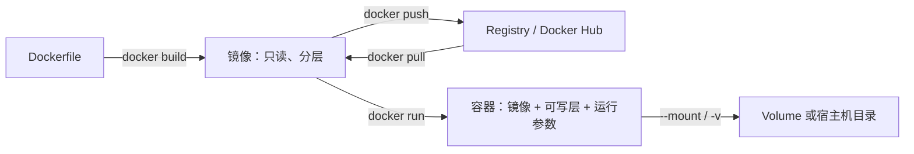
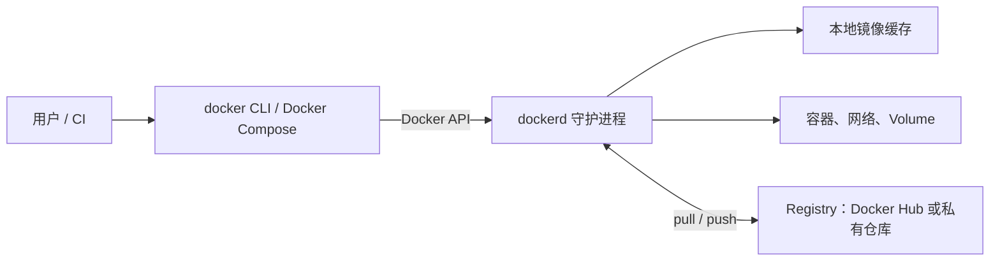
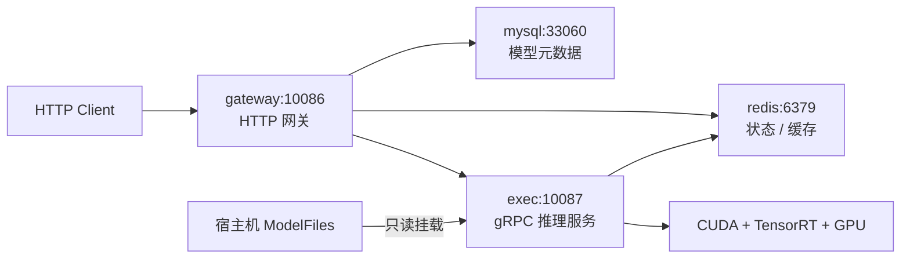

# Docker 使用笔记

Docker 是一套用于**构建、交付和运行容器化应用**的平台。它把应用程序、运行时、依赖库与必要配置打包为镜像（image），再由镜像启动隔离的容器（container）。因此，开发机、测试环境和生产环境可以运行同一份应用交付物，减少“本地能跑、上线失败”的环境差异。

本文以 Docker 官方文档为准，命令采用当前推荐的 `docker <对象> <操作>` 形式；例如 `docker image ls`。较短的旧式别名（如 `docker images`、`docker ps`）通常仍可用。

## Docker 想解决什么问题

传统部署常把应用直接安装到宿主机：不同项目争抢 Python、Node.js、系统库和端口；迁移时又要重新配置依赖。虚拟机能隔离环境，但每个虚拟机通常都需要完整的客户机操作系统，启动和资源开销更大。

Docker 的目标是将“应用如何运行”标准化为可移植的镜像，并以容器作为部署、测试和运行单元。

- **一致性交付**：镜像带上应用依赖和配置，减少环境漂移；CI、测试和生产可复用同一个镜像。
- **轻量隔离**：容器不是完整虚拟机。Linux 上主要借助 namespace 隔离进程、网络、挂载点等资源，并用 cgroups 管理资源限制；多个容器共享宿主机内核。
- **快速启停与高密度运行**：容器本质上是受隔离约束的进程，通常比启动完整虚拟机更快、占用更少。
- **可复现构建**：Dockerfile 将构建步骤写成代码，镜像按层（layer）缓存和复用。

> 容器并不等于安全边界的全部。不要默认以 root 运行、不应随意使用 `--privileged`，也不要把 Docker Socket 挂进不可信容器。

## 核心术语

| 术语 | 含义 | 可以类比为 |
| --- | --- | --- |
| Docker Engine | 运行 Docker 的核心服务，包含守护进程 `dockerd`、API 和命令行能力。 | 本机的容器运行平台。 |
| Docker Client | `docker` 命令行客户端；它把请求发给 `dockerd`。 | 遥控器。 |
| 镜像（image） | 不可变、分层的只读应用模板，包含运行应用所需文件与配置。 | 程序安装包 / 类模板。 |
| 容器（container） | 某个镜像的一个可运行实例，具有自己的可写层和运行配置。 | 已实例化的进程 / 对象。 |
| Dockerfile | 描述如何构建镜像的文本文件。 | 镜像构建配方。 |
| 仓库（repository） | 同一镜像名称下的一组版本标签，例如 `nginx:1.27`、`nginx:latest`。 | 一个制品仓库。 |
| 标签（tag） | 镜像版本或用途的可变名称，例如 `v1.2.0`、`prod`。 | Git 的轻量标签，但可被覆盖。 |
| 摘要（digest） | 内容的 SHA-256 标识，如 `@sha256:...`，精确指向不可变镜像版本。 | Git commit hash。 |
| Registry | 存储和分发镜像的服务；Docker Hub 是默认的公共 Registry。 | 包仓库服务器。 |
| Volume | 由 Docker 管理的持久化存储，生命周期独立于容器。 | Docker 管理的数据盘。 |
| Bind mount | 将宿主机指定路径挂到容器内。 | 直接映射本机目录。 |
| Network | 容器间通信与对外联网的虚拟网络。 | 应用的虚拟局域网。 |

### 镜像、容器与数据的关系



- 删除容器时，容器的**可写层**会消失；数据库、上传文件等需要放进 volume 或 bind mount。
- 一个镜像可启动多个彼此隔离的容器；同一份镜像层也可以被本机多个镜像共享。
- 标签便于阅读但可变；生产部署希望可复现时，应使用明确版本号，必要时使用 `@sha256:<digest>` 固定版本。

## Docker 架构与运行流程

Docker 使用客户端—服务端架构。`docker` 客户端通过 Unix socket 或网络 REST API 与 `dockerd` 通信；守护进程负责构建镜像、创建容器、管理网络和卷。Docker Compose 也是一个客户端，用来声明并管理多容器应用。



执行 `docker run nginx` 时，Docker 大致按以下顺序工作：

1. 在本地查找 `nginx:latest`；没有则从配置的 Registry 拉取。
2. 基于镜像创建容器，添加一个容器专属可写层。
3. 按命令参数配置网络、端口、环境变量、挂载和资源限制。
4. 启动镜像的 `ENTRYPOINT` / `CMD` 指定的主进程。
5. 主进程退出时，容器停止；除非挂载持久存储，写入可写层的数据随容器删除而丢失。

## Docker Hub：像 GitHub，但存的是镜像

Docker Hub 是 Docker 默认使用的公共镜像 Registry。它的设计逻辑确实与 GitHub 有相似之处：都有用户或组织、公开/私有仓库、权限管理和自动化集成；但**存储模型不同**。

| 对比项 | GitHub | Docker Hub |
| --- | --- | --- |
| 核心对象 | 源码仓库与 Git 提交历史。 | 镜像仓库与分层镜像制品。 |
| 版本标识 | commit SHA、branch、tag。 | digest、tag。 |
| 常见动作 | `git clone` / `git push`。 | `docker pull` / `docker push`。 |
| 运行方式 | 源码通常需构建后才能运行。 | 镜像可以直接由 `docker run` 创建容器。 |
| 自动化 | GitHub Actions、Webhooks。 | 自动构建、Webhooks，并可与 GitHub / Bitbucket 集成。 |

镜像命名通常形如：

```text
[registry-host[:port]/]namespace/repository[:tag][@digest]

# Docker Hub 上的示例
docker.io/library/nginx:1.27-alpine
docker.io/<你的用户名>/hello-docker:v1.0.0
```

- 未写 registry 时，Docker 默认使用 Docker Hub；未写 namespace 的官方镜像会落到隐式的 `library` 命名空间，例如 `nginx` 等价于 `docker.io/library/nginx:latest`。
- 优先选择带 **Docker Official Image**、Verified Publisher 等可信标识的镜像，并查看维护状态、Dockerfile、版本标签与漏洞信息。
- Docker Hub 有拉取频率限制和不同套餐限制；CI 或生产环境建议显式认证、使用缓存或部署私有 Registry / 云厂商镜像仓库。

## 安装 Docker

### 选择 Docker Desktop 还是 Docker Engine

| 环境 | 建议 | 说明 |
| --- | --- | --- |
| macOS / Windows | Docker Desktop | 安装简单；其内部通过 Linux VM 提供容器运行环境，并带 GUI、Compose 等工具。 |
| Ubuntu / Linux 服务器 | Docker Engine | 安装守护进程和 CLI，适合服务器与 CI。 |
| Linux 桌面 | Docker Desktop 或 Engine | 初学和需要 GUI 时选 Desktop；追求简洁时选 Engine。 |

安装入口和发行版支持范围应以 [Docker 官方安装文档](https://docs.docker.com/engine/install/) 为准。下面是 Ubuntu 使用官方 `apt` 仓库安装 Docker Engine 的流程；Ubuntu 24.04 / 22.04 等受支持版本可使用。

### Ubuntu：通过官方 apt 仓库安装

如果机器上有旧的 `docker.io`、`docker-compose`、`containerd`、`runc` 等包，官方文档建议先处理冲突包。**这一步会改动系统软件，请先确认当前是否已有需要保留的容器环境。**

```shell
# 添加 Docker 的签名密钥与官方 apt 源
sudo apt update
sudo apt install -y ca-certificates curl
sudo install -m 0755 -d /etc/apt/keyrings
sudo curl -fsSL https://download.docker.com/linux/ubuntu/gpg \
  -o /etc/apt/keyrings/docker.asc
sudo chmod a+r /etc/apt/keyrings/docker.asc

sudo tee /etc/apt/sources.list.d/docker.sources >/dev/null <<EOF
Types: deb
URIs: https://download.docker.com/linux/ubuntu
Suites: $(. /etc/os-release && echo "${UBUNTU_CODENAME:-$VERSION_CODENAME}")
Components: stable
Architectures: $(dpkg --print-architecture)
Signed-By: /etc/apt/keyrings/docker.asc
EOF

sudo apt update
sudo apt install -y docker-ce docker-ce-cli containerd.io docker-buildx-plugin docker-compose-plugin
```

验证安装：

```shell
sudo systemctl status docker
sudo docker run hello-world
docker version
docker compose version
```

默认情况下，Docker socket 只能由 root 或 `docker` 组访问。若希望当前用户不必每次写 `sudo`：

```shell
sudo usermod -aG docker "$USER"
# 重新登录终端，或临时执行：newgrp docker
docker run hello-world
```

> `docker` 组拥有接近 root 的权限，因为它可以控制 Docker 守护进程；只应将受信任用户加入该组。

### Docker Hub 拉取超时：为 Docker Engine 配置本地代理

在某些网络中，终端可以通过本地代理访问 Docker Hub，但 Docker 守护进程 `dockerd` **不会自动继承当前终端的代理环境变量**。如果 `docker run hello-world` 或 `docker pull` 提示连接 `registry-1.docker.io:443` 超时，应为 Docker Engine 单独配置代理。

先检查宿主机能否访问 Registry。返回 `401 Unauthorized` 是正常的，它表示 Registry 可达、但尚未携带拉取镜像所需的认证令牌：

```shell
curl -I --connect-timeout 10 https://registry-1.docker.io/v2/
```

编辑 `/etc/docker/daemon.json`，写入代理配置。以下假设本地 HTTP 代理监听在 `127.0.0.1:7897`；应替换成自己代理软件的实际地址与端口。

```json
{
  "proxies": {
    "http-proxy": "http://127.0.0.1:7897",
    "https-proxy": "http://127.0.0.1:7897",
    "no-proxy": "localhost,127.0.0.1"
  }
}
```

> `daemon.json` 必须是**合法 JSON**，不能写 `#` 或 `//` 注释。若文件已有其他 Docker 配置，应将 `proxies` 合并到同一个 JSON 对象中，而不是追加第二个对象。

重启服务并验证：

```shell
sudo systemctl restart docker
sudo systemctl status docker --no-pager
docker run hello-world
```

`sudo systemctl show --property=Environment docker` 显示为空不代表配置未生效：这里使用的是 `daemon.json` 配置方式，而不是给 systemd 服务注入环境变量。若 Docker 仍拉取超时，依次检查代理端口是否正在监听、`daemon.json` 是否可解析，以及 `sudo journalctl -u docker -n 50 --no-pager` 中是否有启动错误。Docker Desktop 的代理应在 Desktop 设置中配置，不使用此文件。

## 镜像命令：`docker image`

`docker image` 用于管理本地镜像；`docker pull` 是 `docker image pull` 的常用别名。镜像名称一般写作 `[registry-host[:port]/]namespace/repository[:tag][@digest]`。

### `docker search`：搜索 Docker Hub

```shell
docker search [选项] <关键词>
docker search --filter is-official=true nginx
```

| 参数 | 用途 | 示例 |
| --- | --- | --- |
| `--filter is-official=true` | 只显示官方镜像。 | `--filter is-official=true` |
| `--filter is-automated=true` | 只显示自动构建的镜像。 | `--filter is-automated=true` |
| `--filter stars=50` | 按最低收藏数过滤。 | `--filter stars=50` |
| `--limit <数量>` | 限制结果数，默认 25。 | `--limit 10` |
| `--no-trunc` | 不截断描述字段。 | `--no-trunc` |

### `docker image pull`：拉取镜像

```shell
docker image pull [选项] <名称>[:<标签>|@<摘要>]
docker pull nginx:1.27-alpine
```

| 参数 | 用途 | 示例 |
| --- | --- | --- |
| `-a, --all-tags` | 拉取仓库下全部标签；镜像多时占用空间较大。 | `docker pull -a alpine` |
| `--platform <系统/架构>` | 在多平台镜像中选择目标平台。 | `docker pull --platform linux/arm64 nginx:1.27` |
| `-q, --quiet` | 减少拉取进度输出。 | `docker pull -q alpine:3.21` |

#### 使用 tag 或 digest 拉取

```shell
# 用 tag 拉取：便利，但 tag 可能被维护者重新指向新镜像
docker pull python:3.13-slim

# 用 digest 固定一个精确的不可变版本：适合可复现的生产部署
docker pull python@sha256:<从镜像仓库或拉取输出获得的摘要>
```

`latest` 只是普通默认标签，不代表“最稳定”或“最新发布”；项目部署应优先使用明确版本标签或 digest。

### `docker image ls`：查看本地镜像

```shell
docker image ls [选项] [仓库[:标签]]
docker image ls --digests
```

| 参数 | 用途 | 示例 |
| --- | --- | --- |
| `-a, --all` | 显示中间镜像层，而非只显示顶层镜像。 | `docker image ls -a` |
| `--digests` | 显示每个镜像的内容摘要。 | `docker image ls --digests` |
| `-q, --quiet` | 只输出镜像 ID，适合脚本。 | `docker image ls -q` |
| `--filter <条件>` | 按条件过滤，例如悬空镜像。 | `--filter dangling=true` |
| `--format <模板>` | 自定义列或输出格式。 | `--format '{{.Repository}}:{{.Tag}}'` |

### `docker image inspect`：查看镜像详细配置

```shell
docker image inspect nginx:1.27-alpine
```

该命令输出镜像的完整 JSON 配置，可用于查看默认 `CMD`、`ENTRYPOINT`、环境变量、工作目录和镜像 ID。

| 参数 | 用途 | 示例 |
| --- | --- | --- |
| `-f, --format <模板>` | 按 Go template 格式只输出需要的字段。 | `docker image inspect -f '{{.Config.Cmd}}' nginx:1.27-alpine` |

### `docker image history`：查看镜像层历史

```shell
docker image history --no-trunc nginx:1.27-alpine
```

该命令按层显示镜像的大小和构建历史，适合排查镜像为什么过大、某层来自哪条 Dockerfile 指令。

| 参数 | 用途 | 示例 |
| --- | --- | --- |
| `--no-trunc` | 完整显示构建命令与层 ID，不截断长文本。 | `docker image history --no-trunc nginx:1.27-alpine` |
| `-q, --quiet` | 仅输出层 ID。 | `docker image history -q nginx:1.27-alpine` |
| `--format <模板>` | 自定义输出列。 | `docker image history --format '{{.Size}} {{.CreatedBy}}' nginx:1.27-alpine` |
| `-H, --human` | 以人类可读单位显示大小；默认启用。 | `docker image history --human=false nginx:1.27-alpine` |

### `docker image tag`：为镜像添加名称或版本标签

```shell
# 给同一个本地镜像添加另一个仓库名 / 版本名，不会复制镜像层
docker image tag hello-docker:1.0.0 myname/hello-docker:1.0.0
```

`tag` 没有常用命令行选项；它接收一个源镜像和一个目标镜像名称。目标名称通常写成 `<命名空间>/<仓库>:<版本>`，为之后的 `docker push` 指定发布位置。

| 参数 | 用途 | 示例 |
| --- | --- | --- |
| `<源镜像>` | 已存在的本地镜像名、tag 或镜像 ID。 | `hello-docker:1.0.0` |
| `<目标镜像>` | 要新增的镜像名称与标签；不会复制镜像层。 | `myname/hello-docker:1.0.0` |

### `docker image rm`：删除本地镜像

```shell
# 删除本地标签或镜像
docker image rm nginx:1.27-alpine
```

镜像仍被容器引用时，Docker 通常会拒绝删除；应先确认容器是否还需要它。删除本地镜像不影响 Docker Hub 上的远程镜像。

| 参数 | 用途 | 示例 |
| --- | --- | --- |
| `-f, --force` | 强制删除镜像标签或镜像；使用前确认没有容器依赖它。 | `docker image rm -f app:old` |
| `--no-prune` | 删除标签时不顺带清理未被引用的父镜像层。 | `docker image rm --no-prune app:old` |

## 容器命令：`docker container`

`docker run` 会在需要时拉取镜像、创建新容器并启动它；而 `docker start` 只启动一个已经创建且已停止的容器。常用工作流如下：

```shell
# 前台临时交互：退出后自动清理
docker run --rm -it ubuntu:24.04 bash

# 后台启动一个 Nginx，并映射宿主机 8080 到容器 80
docker run -d --name web -p 8080:80 nginx:1.27-alpine

# 访问 http://localhost:8080 后，查看与停止容器
docker container ls
docker logs web
docker stop web
docker rm web
```

### `docker run`：创建并运行新容器

完整参数以 [官方 `docker container run` 参考](https://docs.docker.com/reference/cli/docker/container/run/) 为准；下表列出日常最常见、最需要理解的参数。

| 参数 | 做什么 | 使用示例 |
| --- | --- | --- |
| `-d, --detach` | 后台运行并输出容器 ID。 | `docker run -d nginx` |
| `-it`（`-i` + `-t`） | `-i` 保持标准输入；`-t` 分配伪终端。组合后可交互使用 shell。 | `docker run --rm -it alpine sh` |
| `--rm` | 容器退出后自动删除；适合一次性任务和测试。 | `docker run --rm alpine echo hello` |
| `--name <名称>` | 指定易读容器名，避免使用随机名。 | `docker run --name redis-dev redis:7` |
| `-p <主机端口>:<容器端口>` | 发布端口给宿主机；容器内 `80` 不会自动暴露到主机。 | `-p 127.0.0.1:8080:80` |
| `-P, --publish-all` | 将镜像声明的所有 `EXPOSE` 端口映射到随机主机端口。 | `docker run -P nginx` |
| `-e KEY=VALUE` | 设置容器环境变量。 | `-e POSTGRES_PASSWORD=change-me` |
| `--env-file <文件>` | 从文件读取多个环境变量，避免命令过长；机密文件不要提交 Git。 | `--env-file .env` |
| `-v <源>:<目标>[:选项]` | 简写挂载；可挂 bind mount 或 named volume。 | `-v app-data:/var/lib/app` |
| `--mount type=...,src=...,dst=...` | 键值对式挂载，语义更清楚，推荐用于正式命令。 | `--mount type=volume,src=db-data,dst=/var/lib/postgresql/data` |
| `-w, --workdir <目录>` | 设置容器内工作目录。 | `-w /app` |
| `-u, --user <UID[:GID]>` | 指定容器进程用户，减少 root 运行风险。 | `-u 1000:1000` |
| `--restart <策略>` | 进程退出或 Docker 重启后按策略重启。常用 `unless-stopped`、`on-failure`。 | `--restart unless-stopped` |
| `--network <网络>` | 连接到指定 Docker 网络；同网络容器可通过名称互访。 | `--network app-net` |
| `--cpus <数量>` | 限制可使用的 CPU 数量。 | `--cpus 1.5` |
| `-m, --memory <大小>` | 限制内存，例如 `512m`、`2g`。 | `--memory 512m` |
| `--read-only` | 将容器根文件系统设为只读；需要写入的路径另行挂载。 | `--read-only` |
| `--pull always\|missing\|never` | 控制运行前是否拉取镜像；默认 `missing`。 | `--pull always nginx:1.27` |
| `--gpus all` | 将所有 GPU 交给容器；需正确安装 NVIDIA Container Toolkit。 | `--gpus all nvidia/cuda:... nvidia-smi` |
| `--privileged` | 给容器大量扩展权限。**高风险，仅在明确必要时使用。** | 避免常规业务使用。 |

### `docker container ls`：列出容器

```shell
docker container ls [选项]
docker ps -a  # 常用别名
```

| 参数 | 用途 | 示例 |
| --- | --- | --- |
| `-a, --all` | 包括已经停止的容器。 | `docker container ls -a` |
| `-q, --quiet` | 只输出容器 ID，适合脚本。 | `docker container ls -q` |
| `--filter <条件>` | 按状态、名称、镜像等过滤。 | `--filter status=exited` |
| `--format <模板>` | 自定义输出格式。 | `--format 'table {{.Names}}\t{{.Status}}'` |
| `-s, --size` | 显示容器可写层的大小。 | `docker container ls -s` |

### `docker start`：启动已停止的容器

```shell
docker start web
```

`docker start` 只能启动**已停止且已创建**的容器；它会保留容器最初创建时指定的镜像、端口、挂载、环境变量与网络配置。可以在一个命令后写多个容器名称。

| 参数 | 用途 | 示例 |
| --- | --- | --- |
| `<容器> [<容器>...]` | 指定一个或多个已停止容器的名称或 ID。 | `docker start web redis` |
| `-a, --attach` | 启动后附着到容器的标准输出和标准错误，并将终端信号转发给容器。 | `docker start -a web` |
| `-i, --interactive` | 启动后附着容器的标准输入；通常与 `-a` 配合。 | `docker start -ai shell-demo` |
| `--detach-keys <按键序列>` | 覆盖从附着模式脱离的按键序列；默认通常是 `Ctrl-p Ctrl-q`。 | `docker start -a --detach-keys 'ctrl-\\' web` |
| `--checkpoint <名称>` | 从指定 checkpoint 恢复容器状态；实验性 daemon 功能，日常使用很少。 | `docker start --checkpoint checkpoint-1 web` |
| `--checkpoint-dir <目录>` | 指定 checkpoint 文件的自定义存储目录；与 `--checkpoint` 配合。 | `docker start --checkpoint cp1 --checkpoint-dir /checkpoints web` |

### `docker stop`：优雅停止运行中的容器

```shell
docker stop -t 30 web
```

Docker 会先向容器主进程发送停止信号（未配置时通常为 `SIGTERM`）；进程在等待时间内未退出时，再发送 `SIGKILL`。停止信号可在 Dockerfile 的 `STOPSIGNAL` 或创建容器时的 `--stop-signal` 中预先配置。

| 参数 | 用途 | 示例 |
| --- | --- | --- |
| `<容器> [<容器>...]` | 指定一个或多个运行中的容器。 | `docker stop web redis` |
| `-s, --signal <信号>` | 指定先发送的停止信号，可用 `SIGTERM`、`SIGINT` 或数字 `15`。 | `docker stop --signal SIGINT web` |
| `-t, --timeout <秒>` | 发送停止信号后等待的秒数；超时后强制 `SIGKILL`。Linux 默认通常为 10 秒；`-1` 表示无限等待。 | `docker stop -t 30 web` |

### `docker restart`：停止后重新启动容器

```shell
docker restart -t 30 web
```

`restart` 等价于按停止规则关闭容器后再启动，适合配置未改变但应用进程需要重启的场景。它不会重建镜像或重新创建容器。

| 参数 | 用途 | 示例 |
| --- | --- | --- |
| `<容器> [<容器>...]` | 指定一个或多个容器。 | `docker restart web redis` |
| `-s, --signal <信号>` | 指定重启前发送的停止信号。 | `docker restart --signal SIGINT web` |
| `-t, --timeout <秒>` | 指定停止阶段的等待时间；超时后强制终止再启动。 | `docker restart -t 30 web` |

### `docker logs`：查看应用日志

```shell
docker logs -f --tail 100 web
```

| 参数 | 用途 | 示例 |
| --- | --- | --- |
| `-f, --follow` | 持续跟随新日志，类似 `tail -f`。 | `docker logs -f web` |
| `--tail <数量>` | 只显示最后若干行；`all` 显示全部。 | `docker logs --tail 100 web` |
| `-t, --timestamps` | 每行附带时间戳。 | `docker logs -t web` |
| `--since <时间>` | 只显示指定时间之后的日志。 | `docker logs --since 10m web` |
| `--until <时间>` | 只显示指定时间之前的日志。 | `docker logs --until 2026-08-01T12:00:00 web` |
| `--details` | 显示日志驱动提供的额外属性。 | `docker logs --details web` |

### `docker exec`：在运行中的容器执行命令

```shell
docker exec -it web sh
```

| 参数 | 用途 | 示例 |
| --- | --- | --- |
| `-d, --detach` | 后台执行命令。 | `docker exec -d web touch /tmp/ready` |
| `-i, --interactive` | 保持标准输入。 | `docker exec -i web cat > /tmp/input` |
| `-t, --tty` | 分配伪终端；常与 `-i` 连用。 | `docker exec -it web sh` |
| `-e, --env KEY=VALUE` | 为这一次执行设置环境变量。 | `docker exec -e DEBUG=1 web env` |
| `--env-file <文件>` | 为这一次执行从文件加载环境变量。 | `docker exec --env-file .env web env` |
| `-u, --user <用户或 UID>` | 指定执行命令的用户。 | `docker exec -u 0 web id` |
| `-w, --workdir <目录>` | 指定命令工作目录。 | `docker exec -w /app web ls` |

### `docker cp`、`inspect`、`stats` 与 `rm`：复制、检查、监控和删除

```shell
docker cp web:/etc/nginx/nginx.conf ./nginx.conf
docker inspect -f '{{.NetworkSettings.IPAddress}}' web
docker stats --no-stream web
docker rm web
```

| 命令 | 常用参数 | 用途 | 示例 |
| --- | --- | --- | --- |
| `docker cp <源> <目标>` | `-a, --archive`：保留 UID/GID；`-L, --follow-link`：跟随符号链接。 | 在容器与宿主机之间复制文件。 | `docker cp web:/etc/nginx/nginx.conf .` |
| `docker inspect <对象>` | `-f, --format <模板>`；`-s, --size`：显示大小。 | 输出容器、镜像、卷、网络详细 JSON。 | `docker inspect -f '{{.State.ExitCode}}' web` |
| `docker stats [容器...]` | `--no-stream`：仅采样一次；`--format`：自定义输出。 | 实时查看 CPU、内存、网络、I/O 使用。 | `docker stats --no-stream web` |
| `docker container rm <容器>` | `-f, --force`：停止后删除；`-v, --volumes`：删除关联匿名卷。 | 删除停止容器。 | `docker container rm -v web` |

> `docker exec` 用于排障或临时检查；不要把“进入容器手动改文件”当作正式发布流程。修复应写入源码与 Dockerfile，再构建新镜像。

## 存储与挂载

容器可写层是短生命周期的；挂载是将数据与容器生命周期解耦的关键。日常主要使用以下两种方式。

| 类型 | 适合场景 | 生命周期 / 位置 | 推荐写法 |
| --- | --- | --- | --- |
| Named volume（命名卷） | 数据库数据、生产持久化数据。 | Docker 管理，独立于容器；不依赖具体宿主机目录。 | `--mount type=volume,src=db-data,dst=/var/lib/postgresql/data` |
| Bind mount（绑定挂载） | 本地开发源码、配置文件、日志目录。 | 明确使用宿主机路径；依赖目录布局和权限。 | `--mount type=bind,src="$PWD",dst=/app` |
| tmpfs mount | 敏感临时数据或高频临时文件。 | 只在宿主机内存中；容器停止后消失。 | `--tmpfs /tmp` |

### Bind mount：把本地代码挂进容器

```shell
# 将当前目录只读挂载为容器的 /app，并在容器中执行 Python
docker run --rm -it \
  --mount type=bind,src="$PWD",dst=/app,readonly \
  --workdir /app \
  python:3.13-slim python main.py
```

`--mount type=bind` 的常用字段如下；字段用逗号分隔，顺序无关。

| 字段 | 用途 | 示例 |
| --- | --- | --- |
| `type=bind` | 声明这是宿主机路径的绑定挂载。 | `type=bind` |
| `src=<宿主机路径>` | 指定宿主机的文件或目录，可写 `source` 作为同义词。 | `src="$PWD"` |
| `dst=<容器路径>` | 指定容器内的绝对目标路径，可写 `target` / `destination`。 | `dst=/app` |
| `readonly` 或 `ro` | 以只读方式挂载，防止容器修改宿主机文件。 | `readonly` |
| `bind-create-src` | 源目录不存在时自动在宿主机创建；默认会报错。 | `bind-create-src` |
| `bind-propagation=<模式>` | 控制子挂载是否传播；一般应用不需要设置。 | `bind-propagation=rshared` |

- `src` 是 Docker **守护进程所在机器**的路径，不是客户端所在机器；远程 Docker daemon 时尤其要注意。
- `--mount type=bind` 的源路径默认必须存在；`-v` 若源路径不存在可能自动创建目录，容易掩盖拼写错误。
- 把宿主机目录挂到容器内已有文件的目标目录时，原有文件会被挂载内容遮蔽。
- 开发时需要可写源码可去掉 `readonly`；生产环境一般不要把源码目录从宿主机挂进去。

### Named volume：持久化数据库

```shell
# 创建命名卷（也可以由 docker run 自动创建）
docker volume create pg-data

# 将 PostgreSQL 数据目录放入命名卷
docker run -d --name postgres \
  -e POSTGRES_PASSWORD='change-me' \
  --mount type=volume,src=pg-data,dst=/var/lib/postgresql/data \
  -p 127.0.0.1:5432:5432 \
  postgres:17

# 即使删除容器，pg-data 仍会保留
docker rm -f postgres
docker volume ls
docker volume inspect pg-data
```

### `docker volume`：管理命名卷

| 命令 | 常用参数 | 用途 | 示例 |
| --- | --- | --- | --- |
| `docker volume create [名称]` | `-d, --driver`：指定卷驱动；`-o, --opt`：传递驱动选项；`--label`：加元数据。 | 创建命名卷。 | `docker volume create pg-data` |
| `docker volume ls` | `-q`：只输出名称；`--filter`：过滤；`--format`：自定义输出。 | 列出本机卷。 | `docker volume ls` |
| `docker volume inspect <卷>` | `-f, --format <模板>`：选择字段。 | 查看挂载点、驱动和标签等详情。 | `docker volume inspect pg-data` |
| `docker volume rm <卷>` | `-f, --force`：强制删除。 | 删除未被使用的命名卷。 | `docker volume rm pg-data` |
| `docker volume prune` | `-a, --all`：删除全部未使用卷；`--filter label=...`：按标签过滤；`-f`：不确认。 | 清理未使用卷。 | `docker volume prune` |

挂载命名卷时使用 `--mount type=volume,src=<卷名>,dst=<容器路径>`；常用字段如下。

| 字段 | 用途 | 示例 |
| --- | --- | --- |
| `type=volume` | 声明这是 Docker 管理的卷。 | `type=volume` |
| `src=<卷名>` | 指定或创建命名卷。 | `src=pg-data` |
| `dst=<容器路径>` | 指定卷在容器中的绝对目标路径。 | `dst=/var/lib/postgresql/data` |
| `readonly` 或 `ro` | 以只读方式挂载卷。 | `readonly` |
| `volume-nocopy` | 不把容器目标目录已有文件复制到新建的空卷。 | `volume-nocopy` |

卷内容独立于容器，多个容器可同时挂载同一个卷；但共享写入是否安全由具体应用决定。将**非空卷**挂载到容器已有内容的目录会遮蔽原目录内容；空卷第一次挂载到有内容的目录时，Docker 默认可能把容器中的初始文件复制进卷。

## 创建自己的镜像

### Dockerfile：先理解语法与执行模型

Dockerfile 是按顺序执行的构建配方，基本语法为 `INSTRUCTION arguments`。第一个有效构建指令通常是 `FROM`，每个 `FROM` 会开启一个新的构建阶段；会改变文件系统的指令通常形成可缓存的镜像层。

```dockerfile
# 注释或 parser directive
FROM ubuntu:22.04 AS builder
RUN apt-get update && apt-get install -y cmake
CMD ["/app/server"]
```

- Docker 从上到下匹配构建缓存；某一层失效后，后续层都会重建。因此先写变化少的基础依赖，再 `COPY` 经常变化的源码。
- `RUN apt-get update && ...` 是 **shell 形式**，由 `/bin/sh -c` 执行，适合管道、变量与 `&&`。`CMD ["/app/server"]` 是 **exec 形式**，不会经过 shell，推荐用于长期运行服务的启动命令。
- `docker build -f docker/Dockerfile.gateway .` 中，`-f` 只指定 Dockerfile；最后的 `.` 才是**构建上下文**。`COPY` / `ADD` 只能读取上下文内的文件。

### Dockerfile 的常用指令

| 指令与语法 | 用途与约束 | 示例 |
| --- | --- | --- |
| `FROM <镜像> [AS <阶段>]` | 指定基础镜像并开启新阶段；命名阶段可被 `COPY --from=<阶段>` 引用。 | `FROM python:3.13-slim AS runtime` |
| `ARG <名称>[=<默认值>]` | 仅构建期可用。`FROM` 前的 ARG 只可供 `FROM` 使用；要在阶段内使用须重新声明。**不能传密钥。** | `ARG JOBS=4` |
| `ENV <名称>=<值>` | 写入镜像配置，构建期和运行期都可见；不适合密码。 | `ENV LD_LIBRARY_PATH=/usr/local/lib` |
| `WORKDIR <目录>` | 设置后续 `RUN`、`COPY`、`CMD` 工作目录；不存在会创建。 | `WORKDIR /app` |
| `COPY [--from=<阶段>] <源>... <目标>` | 从构建上下文或前一阶段复制文件。普通复制优先于 `ADD`。 | `COPY --from=builder /out/server /app/server` |
| `RUN <命令>` | 构建时执行命令并生成镜像层；安装 APT 包后应同层清理缓存。 | `RUN apt-get update && apt-get install -y curl && rm -rf /var/lib/apt/lists/*` |
| `USER <用户>[:<组>]` | 设置后续构建命令和默认容器进程用户。 | `USER appuser` |
| `EXPOSE <端口>[/tcp\|udp]` | 声明容器监听端口；**不会**自动发布到宿主机。 | `EXPOSE 8000` |
| `VOLUME ["/路径"]` | 声明应持久化的数据目录；实际挂载通常由 Compose 控制。 | `VOLUME ["/app/Log"]` |
| `CMD ["程序", "参数"]` | 默认启动命令，可被 `docker run` 或 Compose `command` 覆盖。 | `CMD ["./server"]` |
| `ENTRYPOINT ["程序"]` | 固定主程序，运行时参数会附在其后。 | `ENTRYPOINT ["python"]` |
| `HEALTHCHECK CMD <命令>` | 定义容器健康检查，可供 Compose 等待服务就绪。 | `HEALTHCHECK CMD curl -f http://localhost:8000/health || exit 1` |
| `LABEL <键>=<值>` / `STOPSIGNAL <信号>` | 分别添加镜像元数据、定义 `docker stop` 的首个信号。 | `STOPSIGNAL SIGTERM` |

`ARG` 与 `ENV` 的区别是：前者默认不会留在运行容器中，适合依赖版本、构建并行度；后者会保留，适合 `PATH`、运行库路径。`RUN` 发生在 `docker build`，而 `CMD` 只会在容器启动时执行。

### 多阶段构建：`FROM ... AS ...` 的概念模型

一条 `FROM <基础镜像> AS <阶段名>` 会创建一个独立的**构建阶段**。可以把阶段理解为同一份 Dockerfile 中的多个“小镜像环境”：每个阶段都有自己的基础文件系统，后面的阶段默认看不到前面阶段写入的文件。


多阶段构建的最小示例：

```dockerfile
# 第一个阶段：这里可以很重，专门负责编译
FROM ubuntu:22.04 AS builder
RUN apt-get update && apt-get install -y --no-install-recommends g++
WORKDIR /src
COPY main.cpp .
RUN g++ -O2 main.cpp -o /out/hello

# 第二个阶段：从一个全新的干净系统开始
FROM ubuntu:22.04 AS runtime
COPY --from=builder /out/hello /app/hello
WORKDIR /app
CMD ["./hello"]
```

执行 `docker build -t hello .` 后，交付的是最后的 `runtime` 阶段镜像，而不是 `builder`：其中只有 Ubuntu 基础文件、`/app/hello` 以及 runtime 阶段显式创建或复制的内容；`g++`、源码和 `/src` 下的中间文件都被留在 builder 阶段。

| 概念 | 如何理解 | 常见用法 |
| --- | --- | --- |
| `AS builder` | 给当前阶段命名；名称是 Dockerfile 内部引用，不是最终镜像 tag。 | `FROM nvidia/cuda:...-devel AS builder` |
| 第二个 `FROM` | 创建全新的阶段，不会自动继承 builder 文件。 | `FROM ubuntu:22.04 AS runtime` |
| `COPY --from=builder <源> <目标>` | 跨阶段复制唯一的“数据通道”；只带走选定文件。 | 复制二进制、`/usr/local` 动态库、生成配置。 |
| 最后一个阶段 | 默认成为 `docker build` 的最终镜像。 | 用作最小、可部署的 `runtime`。 |
| `--target <阶段>` | 构建时在某个阶段停止，便于排查构建失败或进入 builder 调试。 | `docker build --target builder -t app:builder .` |

阶段也可以多于两个，常见链路是：`base`（公共工具）→ `deps`（第三方依赖）→ `builder`（编译业务）→ `test`（运行测试）→ `runtime`（最终交付）。但阶段不是越多越好：只有在各阶段能明显隔离职责、复用缓存或缩小最终镜像时才值得拆分。

`InferenceServers` 的 Gateway 与 Exec Dockerfile 都正是 `builder → runtime` 两阶段：前者在 builder 中编译 gRPC 等依赖及 C++ 服务，后者只带入可执行文件和运行库；Exec 的两个阶段分别使用 CUDA `devel` 与 CUDA `runtime` 基础镜像。

### 一个可运行的 Python Web 示例

目录结构：

```text
hello-docker/
├── app.py
├── requirements.txt
├── Dockerfile
└── .dockerignore
```

`app.py`：

```python
from flask import Flask

app = Flask(__name__)


@app.get("/")
def hello() -> str:
    return "Hello from Docker!\n"


app.run(host="0.0.0.0", port=8000)
```

`requirements.txt`：

```text
flask==3.1.0
```

`Dockerfile`：

```dockerfile
FROM python:3.13-slim

WORKDIR /app

# 先安装依赖：只有依赖清单变化时才会重新执行这一层
COPY requirements.txt .
RUN pip install --no-cache-dir -r requirements.txt

# 再复制频繁变化的应用源码
COPY app.py .

# 用非 root 用户运行应用
RUN useradd --create-home --uid 10001 appuser
USER appuser

EXPOSE 8000
CMD ["python", "app.py"]
```

`.dockerignore`：

```text
.git
.venv
__pycache__/
*.py[cod]
.env
```

`.dockerignore` 会把无关文件排除在构建上下文之外：减少传输、避免把 `.git`、本地虚拟环境或机密 `.env` 打进镜像。`COPY` 只能读取构建上下文内的文件，不能任意读取父目录。

### `docker build`：构建自定义镜像

```shell
cd hello-docker

# 最后的 . 是构建上下文；-t 给镜像起名称与标签
docker build -t hello-docker:1.0.0 .

# 启动并访问 http://localhost:8000
docker run --rm --name hello -p 8000:8000 hello-docker:1.0.0
```

命令格式为 `docker build [选项] <构建上下文>`；最后的 `.` 是当前目录构建上下文。

| 参数 | 做什么 | 示例 |
| --- | --- | --- |
| `-t, --tag <名称:标签>` | 为构建结果命名并打标签。 | `-t hello-docker:1.0.0` |
| `-f, --file <路径>` | 使用非默认名称或路径的 Dockerfile。 | `-f docker/Dockerfile` |
| `--build-arg KEY=VALUE` | 传入构建期 `ARG`。不要传密码或 token，它们可能进入构建记录。 | `--build-arg APP_VERSION=1.0.0` |
| `--no-cache` | 不使用构建缓存，适合排查缓存问题。 | `--no-cache` |
| `--pull` | 构建前尝试拉取更新的基础镜像。 | `--pull` |
| `--target <阶段>` | 多阶段构建时只构建到指定阶段。 | `--target production` |
| `--platform linux/amd64` | 指定目标平台；跨平台构建通常结合 Buildx。 | `--platform linux/amd64` |

### InferenceServers：多阶段 C++ / CUDA 服务镜像案例

前面的 Flask 示例用于理解最小 Dockerfile。实际服务项目需要进一步拆分构建依赖、运行依赖、配置和数据。本节参考 个人项目：`AI推理服务系统` 当前的 Docker 配置：它把 HTTP Gateway 和 GPU 推理 Exec 拆为两个镜像，再用 Compose 编排 Redis、MySQL 与两个服务。



项目的相关结构是：

```text
InferenceServers/
├── CMakePresets.json                 # release-gateway / release-exec
├── InferenceGatewayServer/           # HTTP 网关源码
├── InferenceExecServer/              # CUDA / TensorRT 推理源码
├── ModelFiles/                       # 运行时模型，不进入镜像
└── docker/
    ├── Dockerfile.gateway
    ├── Dockerfile.exec
    ├── Dockerfile.*.dockerignore
    ├── config.gateway.ini
    ├── config.exec.ini
    ├── compose.yml
    └── scripts/install-source-deps.sh
```

### 为什么要拆成 Gateway 与 Exec 两个镜像

| 镜像 | 构建期依赖 | 运行期依赖 | 不应携带的内容 |
| --- | --- | --- | --- |
| `inference-gateway` | CMake、编译器、Boost、gRPC、jsoncpp、MySQL Connector、hiredis。 | 网关二进制、`/usr/local` 动态库、Boost / OpenSSL / Zlib 运行库。 | CUDA、TensorRT、模型文件、编译器和源码。 |
| `inference-exec` | CUDA devel、TensorRT、CMake、编译器、gRPC、hiredis。 | Exec 二进制、CUDA runtime、TensorRT runtime、`/usr/local` 动态库。 | MySQL Connector、jsoncpp、模型文件、编译器和源码。 |

这对应 CMake Preset 中的 `release-gateway` 与 `release-exec`：每个 Dockerfile 只构建自身服务需要的 target 与依赖，避免一个“全能镜像”体积大、构建慢、攻击面也更大。

### Gateway Dockerfile：builder 与 runtime 的完整思路

下面是根据项目 `docker/Dockerfile.gateway` 整理的核心版本。`install-source-deps.sh` 统一从源码安装 gRPC、hiredis 等依赖，`ARG` 则固定它们的版本和并行度。

```dockerfile
# 阶段 1：只负责编译，不会进入最终运行镜像
FROM ubuntu:22.04 AS builder

ARG JSONCPP_REF=1.9.6
ARG HIREDIS_REF=v1.2.0
ARG GRPC_REF=v1.65.5
ARG MYSQL_CONCPP_REF=
ARG JOBS=4
ENV DEBIAN_FRONTEND=noninteractive

RUN apt-get update && apt-get install -y --no-install-recommends \
    build-essential ca-certificates cmake git \
    libboost-atomic-dev libboost-filesystem-dev libboost-system-dev \
    libssl-dev pkg-config zlib1g-dev \
    && rm -rf /var/lib/apt/lists/*

WORKDIR /workspace

# 依赖脚本通常比业务源码稳定，先复制以提升缓存命中
COPY docker/scripts/install-source-deps.sh /tmp/install-source-deps.sh
RUN JSONCPP_REF="${JSONCPP_REF}" HIREDIS_REF="${HIREDIS_REF}" \
    GRPC_REF="${GRPC_REF}" MYSQL_CONCPP_REF="${MYSQL_CONCPP_REF}" \
    INSTALL_JSONCPP=ON INSTALL_MYSQL_CONCPP=ON JOBS="${JOBS}" \
    bash /tmp/install-source-deps.sh

# 源码变化只会使这里和后续 CMake 构建层失效
COPY . /workspace
RUN cmake --preset release-gateway && cmake --build --preset release-gateway

# 阶段 2：只复制运行所需的产物
FROM ubuntu:22.04 AS runtime
RUN apt-get update && apt-get install -y --no-install-recommends \
    ca-certificates libboost-atomic1.74.0 libboost-filesystem1.74.0 \
    libboost-system1.74.0 libssl3 zlib1g \
    && rm -rf /var/lib/apt/lists/*

COPY --from=builder /usr/local /usr/local
RUN ldconfig
WORKDIR /app
COPY --from=builder /workspace/build-release-gateway/bin/InferenceGatewayServer /app/InferenceGatewayServer
COPY docker/config.gateway.ini /app/config.ini
RUN mkdir -p /app/Log
EXPOSE 10086
CMD ["./InferenceGatewayServer"]
```

| 片段 | 意图 | 关键约束 |
| --- | --- | --- |
| `ARG *_REF` | 固定第三方版本，允许 `--build-arg` 覆盖。 | 不要把 token、密码传给 `ARG`，它可能出现在构建记录中。 |
| `COPY install-source-deps.sh` 后再安装 | 源码未变化时复用昂贵的依赖编译缓存。 | 不能先 `COPY .`，否则任何源码变化都会导致依赖重编。 |
| `cmake --preset release-gateway` | 复用本地与容器相同的 target 和 CMake 参数。 | Dockerfile 中产物路径必须匹配 preset 的 `binaryDir`。 |
| 第二个 `FROM` | 丢弃 CMake、编译器、Git、源码和临时构建目录。 | 运行阶段仍须安装动态库所依赖的系统运行库。 |
| `COPY --from=builder /usr/local` 与 `ldconfig` | 带入源码编译安装的 gRPC、hiredis、jsoncpp、MySQL Connector。 | `/usr/local/lib*` 新增后应刷新动态链接器缓存。 |
| `COPY config.gateway.ini` | 镜像内配置使用 Compose 服务名。 | 不要复制本机可变的根目录 `config.ini`，更不要复制机密配置。 |

> 当前项目镜像以 root 运行。生产环境可在 runtime 阶段创建 `appuser`，对 `/app/Log` 授权后再 `USER appuser`；密码等配置改由 `.env`、secrets 或部署平台的密钥系统提供。

### Exec Dockerfile：CUDA、TensorRT 与模型目录

`docker/Dockerfile.exec` 保持同样的两阶段结构，但 builder 基于 `nvidia/cuda:12.9.0-devel-ubuntu22.04`，runtime 基于更小的 `nvidia/cuda:12.9.0-runtime-ubuntu22.04`。它用构建参数选择本地 TensorRT 压缩包：

```dockerfile
ARG TENSORRT_ARCHIVE=docker/vendor/TensorRT-10.10.0.31.Linux.x86_64-gnu.cuda-12.9.tar.gz
COPY ${TENSORRT_ARCHIVE} /tmp/tensorrt.tar.gz
RUN tar -xzf /tmp/tensorrt.tar.gz -C /opt && mv /opt/TensorRT-* /opt/TensorRT

ENV TRT_ROOT=/opt/TensorRT
ENV LD_LIBRARY_PATH=/opt/TensorRT/lib:/usr/local/lib:/usr/local/lib64:${LD_LIBRARY_PATH}

COPY --from=builder /opt/TensorRT /opt/TensorRT
COPY --from=builder /workspace/build-release-exec/bin/InferenceExecServer /app/InferenceExecServer
COPY docker/config.exec.ini /app/config.ini
VOLUME ["/app/Log", "/app/ModelFiles"]
EXPOSE 10087
CMD ["./InferenceExecServer"]
```

- `devel` 镜像提供 CUDA 编译所需工具链，`runtime` 镜像只保留运行所需组件；这就是多阶段构建在 GPU 服务上的直接价值。
- TensorRT 压缩包是**构建输入**，必须进入 Exec 的上下文；Gateway 不需要它，所以项目使用 `Dockerfile.gateway.dockerignore` 将其排除。`.dockerignore` 写错会导致 `COPY ${TENSORRT_ARCHIVE}` 失败。
- `ModelFiles` 是**运行时数据**，不应 `COPY` 进镜像。Compose 将 `../ModelFiles` 只读挂载到 `/app/ModelFiles`，并与 `config.exec.ini` 的 `ModelRepository.Root=/app/ModelFiles` 对应。

### 构建这两个镜像

在 `InferenceServers` 项目根目录执行。Dockerfile 在 `docker/` 下，但上下文仍使用 `.`，使 Docker 能访问项目根目录的源码和 CMake 文件。

```shell
docker build -f docker/Dockerfile.gateway -t inference-gateway:ubuntu22.04 .

docker build -f docker/Dockerfile.exec \
  --build-arg TENSORRT_ARCHIVE=docker/vendor/TensorRT-10.10.0.31.Linux.x86_64-gnu.cuda-12.9.tar.gz \
  -t inference-exec:cuda12.9 .
```

### Compose YAML：先学会写 `compose.yml`

Docker Compose 使用 YAML 描述一个多容器应用。推荐文件名是 `compose.yaml` 或 `compose.yml`；使用 Compose v2 时，不需要再写旧教程常见的顶层 `version: "3"`，当前规范已经合并了旧的 2.x / 3.x 格式。

#### YAML 的四个基础规则

```yaml
# 1. 映射：键后面有冒号，子项用空格缩进
services:
  api:
    image: example/api:1.0

# 2. 列表：每一项以 - 开头，且缩进必须对齐
    ports:
      - "8080:8000"
      - "127.0.0.1:9000:9000"

# 3. 标量：字符串、数字、布尔值和空值
    restart: unless-stopped
    read_only: true
    replicas: 2

# 4. 注释：# 之后是注释；缩进不能用 Tab，统一使用空格
```

- 同一缩进层级的键属于同一个映射。`services`、`networks`、`volumes` 是顶层映射；`api`、`redis` 是 `services` 下的服务名。
- `ports`、`volumes`、`command` 等可以使用列表。短语法便于快速写，长语法更明确、更适合复杂配置。
- 端口映射、包含 `:` 的挂载路径、可能被 YAML 当成布尔值或数字的值建议加引号，例如 `"8080:80"`、`"false"`、`"0123"`。
- YAML 缩进错误可能改变数据层级；先运行 `docker compose config`，不要靠肉眼猜最终配置。

#### Compose 文件的顶层结构

| 顶层字段 | 用途 | 常见场景 |
| --- | --- | --- |
| `name` | 指定 Compose 项目名，影响容器、网络、卷的前缀。 | `name: inference-servers` |
| `services` | 定义应用服务，是必需的核心字段。 | `gateway`、`exec`、`redis`、`mysql`。 |
| `networks` | 声明自定义网络与网络驱动。 | 前后端隔离、接入外部网络。 |
| `volumes` | 声明命名卷。 | 数据库持久化，如 `mysql-data`。 |
| `configs` | 声明非敏感配置对象。 | 需要以文件形式交付的静态配置。 |
| `secrets` | 声明机密对象。 | 密码、访问令牌、私钥；生产环境优于明文 `environment`。 |

#### 一个可运行的服务模板

下面的结构覆盖最常用字段。`api` 可以通过服务名 `db` 访问数据库；不需要写数据库容器 IP，也不应在容器内写 `localhost:5432`。

```yaml
name: demo-app

services:
  db:
    image: postgres:17
    environment:
      POSTGRES_DB: app
      POSTGRES_USER: app
      POSTGRES_PASSWORD: ${POSTGRES_PASSWORD:?请在 .env 中设置密码}
    volumes:
      - db-data:/var/lib/postgresql/data
    healthcheck:
      test: ["CMD-SHELL", "pg_isready -U app -d app"]
      interval: 5s
      timeout: 3s
      retries: 20

  api:
    build:
      context: .
      dockerfile: docker/Dockerfile.api
      args:
        APP_VERSION: ${APP_VERSION:-dev}
    image: demo-api:${APP_VERSION:-dev}
    depends_on:
      db:
        condition: service_healthy
    environment:
      DATABASE_URL: postgres://app:${POSTGRES_PASSWORD}@db:5432/app
    env_file:
      - .env
    ports:
      - "127.0.0.1:8080:8000"
    volumes:
      - ./Log:/app/Log
    restart: unless-stopped

volumes:
  db-data:
```

`POSTGRES_PASSWORD` 同时出现于变量替换和 `environment` 只是为了讲解连接关系；实际项目中应通过 secrets 或应用读取的配置文件避免把密码展开到容器环境变量和 `docker compose config` 输出中。

#### 服务字段：从意图理解怎么写

| 字段 | 写法 | 用途与约束 |
| --- | --- | --- |
| `image` | `image: redis:7` | 使用已有镜像，或为 `build` 的结果命名。应使用明确版本而非裸 `latest`。 |
| `build` | `build: .` 或 `build: { context: ., dockerfile: Dockerfile }` | 构建镜像。`context` 决定 `COPY` 能看到哪些文件，`dockerfile` 仅选择配方。 |
| `command` / `entrypoint` | `command: ["redis-server", "--appendonly", "yes"]` | 覆盖镜像的 `CMD` / `ENTRYPOINT`。列表形式避免 shell 转义问题。 |
| `environment` | 映射或列表：`DEBUG: "1"` / `- DEBUG=1` | 注入容器环境变量。敏感值优先使用 secrets；普通本机变量可放 `env_file`。 |
| `env_file` | `env_file: [.env]` | 从文件读取环境变量；文件路径相对 Compose 文件。`.env` 不应提交机密。 |
| `ports` | `- "127.0.0.1:8080:8000"` | 发布宿主机端口。短格式依次为 `[主机 IP:]主机端口:容器端口[/协议]`。 |
| `expose` | `expose: ["8000"]` | 仅记录/暴露给 Compose 网络内的服务，不发布到宿主机。 |
| `volumes` | `- data:/var/lib/app`、`- ./Log:/app/Log` | 前者是命名卷，后者是 bind mount；只读写成 `:ro`。 |
| `networks` | `networks: [backend]` | 服务可加入多个网络；同网络服务可用服务名 DNS 互访。 |
| `depends_on` | `db: { condition: service_healthy }` | 控制启动顺序；配合健康检查才能等待依赖真正可用。 |
| `healthcheck` | `test`、`interval`、`timeout`、`retries` | 定义服务就绪探针；`test` 常用 `CMD` 或 `CMD-SHELL` 数组。 |
| `restart` | `unless-stopped` | 进程退出或 Docker 重启后的重启策略。常用 `no`、`on-failure`、`unless-stopped`、`always`。 |
| `user` / `read_only` | `user: "10001:10001"` | 约束运行身份与文件系统写权限，降低服务权限。 |
| `profiles` | `profiles: [debug]` | 将可选服务分组，须配合 `docker compose --profile debug up` 启动。 |
| `deploy.resources` | GPU 设备与资源预留。 | 适合 Exec 等 GPU 服务；需要本机运行时与 Compose 支持。 |

#### 变量替换、`.env` 与多文件覆盖

Compose 在读取 YAML 时就会替换 `${变量}`；这和容器内的 `environment` 是两个层次。常用写法如下：

| 写法 | 含义 | 示例 |
| --- | --- | --- |
| `${VAR}` | 使用环境变量或 `.env` 中的 `VAR`；未定义时通常为空并给出警告。 | `image: app:${TAG}` |
| `${VAR:-默认值}` | 未定义或为空时使用默认值。 | `image: app:${TAG:-dev}` |
| `${VAR:?错误信息}` | 未定义或为空时直接报错并中止。 | `${DB_PASSWORD:?请设置 DB_PASSWORD}` |
| `$$` | 转义为容器内的字面量 `$`，不由 Compose 替换。 | `command: ["sh", "-c", "echo $$HOSTNAME"]` |

可用多个 `-f` 叠加配置：后指定文件覆盖或补充先指定文件，常用于公共生产配置与本地开发覆盖。所有相对路径默认以**第一个** `-f` 指定文件所在目录为基准。

```shell
docker compose -f compose.yml -f compose.dev.yml config
```

### Compose：将四个服务变成一个应用

`docker/compose.yml` 中的 `redis`、`mysql`、`exec` 和 `gateway` 会处在同一个 Compose 网络中。因此服务配置使用 `redis:6379`、`mysql:33060`、`exec:10087`，而不是宿主机的 `localhost`。

```yaml
services:
  exec:
    build:
      context: ..
      dockerfile: docker/Dockerfile.exec
    image: inference-exec:cuda12.9
    depends_on:
      redis:
        condition: service_healthy
    ports:
      - "10087:10087"
    volumes:
      - ../ModelFiles:/app/ModelFiles:ro
      - ../Log/docker-exec:/app/Log
    deploy:
      resources:
        reservations:
          devices:
            - driver: nvidia
              count: all
              capabilities: [gpu]
```

| Compose 字段 | 此项目中的作用 | 注意点 |
| --- | --- | --- |
| `build.context` / `build.dockerfile` | 使用项目根目录作上下文，选择服务专属 Dockerfile。 | `dockerfile` 相对 context 解析；context 写错会让 `COPY` 找不到源码。 |
| `image` | 给 Compose 构建结果命名。 | 可在 Compose 外用 `docker run` 调试该镜像。 |
| `depends_on.condition: service_healthy` | Exec 等 Redis、Gateway 等 MySQL / Redis 的健康检查通过再启动。 | `service_started` 只代表进程启动，不代表服务已经可用。 |
| `ports` | 发布 HTTP / gRPC 端口给宿主机。 | 容器之间通信只需服务名，不需发布端口。 |
| `volumes` | Redis / MySQL 用命名卷；日志和模型用 bind mount。 | 模型加 `:ro`，防止推理服务修改模型文件。 |
| `environment` | 当前项目为容器设置 `NO_PROXY` / `no_proxy`，避免服务名访问错误走代理。 | 演示密码不要硬编码；应使用 `.env`、`env_file` 或 secrets。 |
| `deploy.resources.reservations.devices` | 向 Exec 服务申请 NVIDIA GPU。 | 宿主机需要 NVIDIA 驱动与 NVIDIA Container Toolkit，Compose 实现也必须支持该字段。 |

### `docker compose` 全局参数：选择项目与配置

所有 Compose 子命令都可以写成 `docker compose [全局选项] <子命令> [子命令选项]`。在 `InferenceServers` 中，为避免默认找不到 `docker/compose.yml`，命令前统一使用 `-f docker/compose.yml`。

| 参数 | 用途 | 示例 |
| --- | --- | --- |
| `-f, --file <文件>` | 指定 Compose 文件；可重复传入，后面的文件覆盖或补充前面的文件。 | `-f compose.yml -f compose.dev.yml` |
| `-p, --project-name <名称>` | 指定项目名，影响容器、网络、命名卷前缀。 | `-p inference-dev` |
| `--project-directory <目录>` | 指定项目目录与相对路径基准。 | `--project-directory .` |
| `--env-file <文件>` | 指定变量替换使用的环境文件。 | `--env-file .env.dev` |
| `--profile <名称>` | 启用一个可选服务 profile，可重复使用。 | `--profile debug` |
| `--parallel <数量>` | 限制拉取或构建时的最大并发数；网络差时可调小。 | `--parallel 2 pull` |
| `--progress auto\|tty\|plain\|json\|quiet` | 控制构建和拉取进度输出格式，CI 常用 `plain`。 | `--progress plain build` |
| `--dry-run` | 预演会执行哪些动作，不实际改变 Compose 项目。 | `--dry-run up --build -d` |

### `docker compose config`：校验、变量替换与渲染 YAML

```shell
docker compose -f docker/compose.yml config
```

这是写完 YAML 后应优先执行的命令。它会解析 YAML、读取 `.env` / `--env-file`、合并多个 `-f` 文件并输出最终规范化配置；能尽早发现缩进、变量未定义、路径和服务字段问题。

| 参数 | 用途 | 示例 |
| --- | --- | --- |
| `-q, --quiet` | 只校验，不输出渲染后的配置。 | `docker compose config -q` |
| `--services` | 只列出服务名。 | `docker compose config --services` |
| `--volumes` | 只列出命名卷。 | `docker compose config --volumes` |
| `--networks` | 只列出网络。 | `docker compose config --networks` |
| `--images` | 只列出服务使用的镜像。 | `docker compose config --images` |
| `--environment` | 输出插值后用于 Compose 的环境变量。 | `docker compose config --environment` |
| `--no-interpolate` | 不替换 `${VAR}`，便于检查原始变量表达式。 | `docker compose config --no-interpolate` |

### `docker compose build` 与 `pull`：准备服务镜像

```shell
# 构建有 build 字段的服务镜像；只构建 gateway 也可以
docker compose -f docker/compose.yml build gateway

# 拉取使用 image 字段的服务镜像
docker compose -f docker/compose.yml pull redis mysql
```

| 命令 | 常用参数 | 用途 | 示例 |
| --- | --- | --- | --- |
| `docker compose build [服务...]` | `--no-cache`：不使用缓存；`--pull`：拉取更新基础镜像；`--build-arg`：传递构建参数；`--progress`：控制输出。 | 构建或重建带 `build` 的服务镜像。 | `docker compose build --pull exec` |
| `docker compose pull [服务...]` | `--ignore-buildable`：跳过可构建服务；`--policy always\|missing`：拉取策略；`--quiet`：安静输出。 | 拉取带 `image` 的服务镜像。 | `docker compose pull --policy always redis mysql` |

`build` 不会创建容器，`pull` 不会构建 Dockerfile；`up --build` 会把“构建、创建、启动”串起来。

### `docker compose up`：创建并启动服务

```shell
# 构建并后台启动完整项目；--wait 等待服务进入 running / healthy
docker compose -f docker/compose.yml up --build --wait -d

# 只启动 gateway 以及它的依赖
docker compose -f docker/compose.yml up -d gateway
```

`up` 会按需构建或拉取镜像、创建网络与容器并启动服务。前台模式会汇集服务日志；按 `Ctrl-C` 时 Compose 会停止容器，后台模式使用 `-d` 后容器继续运行。

| 参数 | 用途 | 示例 |
| --- | --- | --- |
| `-d, --detach` | 后台运行。 | `up -d` |
| `--build` | 启动前构建带 `build` 的服务。 | `up --build -d` |
| `--pull always\|missing\|never` | 启动前的镜像拉取策略。 | `up --pull always -d` |
| `--wait` / `--wait-timeout <秒>` | 等待服务达到 running 或 healthy；`--wait` 隐含后台运行。 | `up --wait --wait-timeout 60` |
| `--no-deps` | 只启动指定服务，不启动它依赖的服务。 | `up -d --no-deps gateway` |
| `--force-recreate` | 即使镜像和配置没有变化也重建容器。 | `up -d --force-recreate` |
| `--no-recreate` | 已存在容器时不重建；与 `--force-recreate` 互斥。 | `up -d --no-recreate` |
| `--remove-orphans` | 删除不在当前 YAML 中定义、但同项目遗留的容器。 | `up -d --remove-orphans` |
| `--scale <服务>=<数量>` | 临时扩容服务实例；服务不能固定 `container_name`。 | `up -d --scale gateway=3` |
| `--no-attach <服务>` | 前台模式不跟随某个吵闹服务的日志。 | `up --no-attach mysql` |

### `docker compose ps`、`logs` 与 `top`：观察运行状态

```shell
docker compose -f docker/compose.yml ps
docker compose -f docker/compose.yml logs -f --tail 100 gateway
docker compose -f docker/compose.yml top exec
```

| 命令 | 常用参数 | 用途 | 示例 |
| --- | --- | --- | --- |
| `docker compose ps [服务...]` | `-a, --all`：包含停止容器；`-q`：仅 ID；`--status <状态>`：过滤；`--format`：自定义输出。 | 查看该项目的服务容器状态和端口。 | `docker compose ps -a` |
| `docker compose logs [服务...]` | `-f`：持续跟随；`-n, --tail`：尾部行数；`--since` / `--until`：时间范围；`-t`：时间戳；`--index`：副本序号。 | 查看服务日志。 | `docker compose logs -f -n 100 gateway` |
| `docker compose top [服务...]` | 无常用额外参数。 | 查看服务容器内运行的进程。 | `docker compose top exec` |
| `docker compose stats [服务...]` | `--no-stream`：只采样一次；`--format`：自定义输出。 | 查看 CPU、内存、网络和 I/O 使用。 | `docker compose stats --no-stream` |

### `docker compose exec` 与 `run`：执行临时命令

```shell
# 在已经运行的 gateway 容器内打开 shell
docker compose -f docker/compose.yml exec gateway sh

# 创建一次性新容器执行数据库迁移；退出后自动删除
docker compose -f docker/compose.yml run --rm gateway ./migrate
```

| 命令 | 常用参数 | 用途 | 示例 |
| --- | --- | --- | --- |
| `docker compose exec <服务> <命令>` | `-d`：后台执行；`-e`：临时环境变量；`-T`：关闭默认 TTY；`--index`：选择副本；`-u`：用户；`-w`：工作目录。 | 在**运行中**服务容器执行命令；默认可交互并分配 TTY。 | `exec -T gateway ./health-check` |
| `docker compose run <服务> <命令>` | `--rm`：退出后删除；`--no-deps`：不启动依赖；`--service-ports`：保留端口发布；`-e`：环境变量；`-v`：额外挂载。 | 创建一个**一次性新容器**执行命令，不影响已运行服务容器。 | `run --rm --no-deps gateway sh` |

不要用 `exec` 手工修改程序文件作为发布手段；修复应进入源码、Dockerfile 或配置，再重建容器。

### `docker compose start`、`stop`、`restart` 与 `down`：控制生命周期

```shell
docker compose -f docker/compose.yml stop -t 30 gateway
docker compose -f docker/compose.yml start gateway
docker compose -f docker/compose.yml restart -t 30 exec
docker compose -f docker/compose.yml down
```

| 命令 | 常用参数 | 用途 | 示例 |
| --- | --- | --- | --- |
| `docker compose start [服务...]` | 无常用选项。 | 启动已存在但停止的服务容器，不重新创建。 | `docker compose start gateway` |
| `docker compose stop [服务...]` | `-t, --timeout <秒>`：优雅停止等待时间。 | 停止服务但保留容器、网络和命名卷。 | `docker compose stop -t 30 gateway` |
| `docker compose restart [服务...]` | `-t, --timeout <秒>`：停止阶段等待时间。 | 停止后重启服务容器，不重建镜像或容器。 | `docker compose restart -t 30 exec` |
| `docker compose down` | `-v, --volumes`：删除命名卷与匿名卷；`--rmi local\|all`：删除镜像；`--remove-orphans`：删除遗留服务；`-t`：停止超时。 | 停止并删除服务容器和项目网络，默认保留命名卷。 | `docker compose down --remove-orphans` |

`down -v` 会删除 `volumes:` 声明的命名卷以及匿名卷；对于本项目意味着 Redis / MySQL 数据可能永久丢失，执行前要确认备份。

这个案例的核心原则是：**按服务拆镜像、按构建和运行拆阶段、把模型/日志/数据库数据放到运行时卷、用 Compose 服务名连接依赖，并让 CMake Preset、Dockerfile 与 Compose 的路径保持一致。**

## 发布镜像到 Docker Hub

发布前，在 Docker Hub 网页创建一个仓库，例如 `<你的用户名>/hello-docker`。然后登录、给本地镜像打上目标仓库标签并推送：

```shell
# 登录 Docker Hub；可使用 Personal Access Token，避免在终端明文输入密码
docker login

# 同一镜像可拥有多个名字/标签；这里不复制镜像层
docker image tag hello-docker:1.0.0 <你的用户名>/hello-docker:1.0.0
docker image tag hello-docker:1.0.0 <你的用户名>/hello-docker:latest

# 推送指定版本；建议始终推送明确版本标签
docker push <你的用户名>/hello-docker:1.0.0
docker push <你的用户名>/hello-docker:latest

# 在另一台机器验证
docker pull <你的用户名>/hello-docker:1.0.0
docker run --rm -p 8000:8000 <你的用户名>/hello-docker:1.0.0
```

### `docker login`：登录镜像仓库

| 参数 | 用途 | 示例 |
| --- | --- | --- |
| `<服务器地址>` | 登录指定 Registry；省略时登录 Docker Hub。 | `docker login ghcr.io` |
| `-u, --username <用户名>` | 指定用户名；密码或访问令牌仍建议通过安全提示输入。 | `docker login -u myname` |
| `--password-stdin` | 从标准输入读取访问令牌，适合 CI；避免令牌出现在命令历史。 | `printf '%s' "$TOKEN" \| docker login -u myname --password-stdin` |

### `docker image push`：推送镜像

```shell
docker image push [选项] <名称>[:<标签>]
```

| 参数 | 用途 | 示例 |
| --- | --- | --- |
| `-a, --all-tags` | 推送这个本地镜像仓库的全部标签。 | `docker push -a myname/hello-docker` |
| `-q, --quiet` | 减少上传进度输出。 | `docker push -q myname/hello-docker:1.0.0` |
| `--platform <系统/架构>` | 仅推送指定平台的 manifest；多平台发布时需理解 manifest 列表影响。 | `docker push --platform linux/amd64 myname/app:1.0` |

日常发布优先一条条推明确版本，避免意外把实验标签一同发布。

### 发布流程小结


## 清理与排障

| 目的 | 命令 | 注意点 |
| --- | --- | --- |
| 查看磁盘占用 | `docker system df` | 先看清楚镜像、容器、卷、构建缓存分别占了多少。 |
| 删除已停止容器 | `docker container prune` | 会删除所有停止容器，执行前确认。 |
| 删除未使用镜像 | `docker image prune -a` | `-a` 会删除未被容器使用的镜像，可能需要重新拉取。 |
| 删除未使用卷 | `docker volume prune` | **可能删除数据库数据**；先用 `docker volume ls` 确认。 |
| 清理未使用资源 | `docker system prune` | 可加 `-a` 和 `--volumes`，但后两者影响更大。 |
| 排查容器不能启动 | `docker logs <容器>`、`docker inspect <容器>` | 先看日志、退出码、端口冲突、挂载路径和环境变量。 |
| 进入运行中的容器 | `docker exec -it <容器> sh` | 许多精简镜像没有 `bash`，使用 `sh`。 |

## 实用习惯与安全清单

- 用明确版本而不是裸 `latest`；对高要求的生产部署使用 digest 固定镜像内容。
- 镜像尽量小：选合适的基础镜像、使用多阶段构建、通过 `.dockerignore` 缩小构建上下文。
- Dockerfile 中优先使用 `COPY`，不要把密码、token、私钥复制进镜像或通过 `ARG` 传入。
- 容器中尽量使用非 root 用户；限制端口绑定、CPU/内存和文件系统写权限。
- 数据库、上传内容等使用命名卷或经过备份的外部存储；不要依赖容器可写层保存数据。
- 开发阶段用 bind mount 加速代码迭代，生产阶段用构建好的不可变镜像发布。
- 定期更新基础镜像并重建，关注官方镜像维护状态和漏洞扫描结果。
- 多个服务（应用、数据库、缓存）一起运行时，使用 `compose.yaml` 与 `docker compose up` 管理，避免维护一长串 `docker run` 命令。

## 官方参考

- [Docker 概览与架构](https://docs.docker.com/get-started/docker-overview/)
- [Docker Hub 文档](https://docs.docker.com/docker-hub/)
- [安装 Docker Engine](https://docs.docker.com/engine/install/) / [Ubuntu 安装步骤](https://docs.docker.com/engine/install/ubuntu/)
- [镜像与镜像层](https://docs.docker.com/get-started/docker-concepts/the-basics/what-is-an-image/)
- [`docker container run` 参数参考](https://docs.docker.com/reference/cli/docker/container/run/)
- [`docker image pull` 参数参考](https://docs.docker.com/reference/cli/docker/image/pull/) / [`docker image build` 参数参考](https://docs.docker.com/reference/cli/docker/image/build/) / [`docker image push` 参数参考](https://docs.docker.com/reference/cli/docker/image/push/)
- [Bind mount](https://docs.docker.com/engine/storage/bind-mounts/) / [Volume](https://docs.docker.com/engine/storage/volumes/)
- [Dockerfile 指令参考](https://docs.docker.com/reference/dockerfile/)
- [构建上下文与 `.dockerignore`](https://docs.docker.com/build/concepts/context/) / [构建缓存失效规则](https://docs.docker.com/build/cache/invalidation/)
- [多阶段构建](https://docs.docker.com/build/building/multi-stage/) / [Compose 服务字段参考](https://docs.docker.com/reference/compose-file/services/)
- [Compose 文件规范](https://docs.docker.com/reference/compose-file/) / [Compose CLI 与全局参数](https://docs.docker.com/reference/cli/docker/compose/)
- [`docker compose up`](https://docs.docker.com/reference/cli/docker/compose/up/) / [`down`](https://docs.docker.com/reference/cli/docker/compose/down/) / [`exec`](https://docs.docker.com/reference/cli/docker/compose/exec/) / [`logs`](https://docs.docker.com/reference/cli/docker/compose/logs/)
