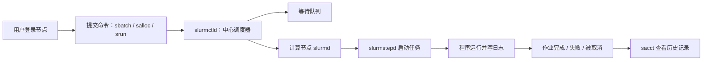

# Slurm 使用笔记

`Slurm` 是 Linux 集群里常见的**资源管理与作业调度系统**。普通用户不直接登录计算节点长期跑程序，而是向 Slurm 描述“我要多少 CPU、多少内存、多少 GPU、跑多久、在哪个分区跑”，然后由 Slurm 决定作业何时启动、分配哪些节点、如何记录资源使用。

这篇笔记参考了 USTC 的 [Slurm 资源管理与作业调度系统安装配置](https://scc.ustc.edu.cn/hmli/doc/linux/slurm-install/slurm-install.html) 和 SchedMD 官方的 [Quick Start User Guide](https://slurm.schedmd.com/quickstart.html)。USTC 文档里有大量安装、配置、数据库和管理员操作，这里只保留用户需要理解的部分。

## 它解决的是什么问题

在共享集群上直接运行程序会遇到几个问题：

- **资源会互相抢占**：多个用户同时在同一台机器上跑重任务，CPU、内存、GPU、磁盘 I/O 都可能互相干扰。
- **任务需要排队**：集群资源有限，大任务不能立即运行时，需要一个系统记录请求、排序并在资源可用时启动。
- **资源使用需要可追踪**：作业用了多少核时、GPU 时、内存、运行多久，需要记录下来用于配额、审计或性能分析。
- **长任务需要托管**：用户断开 SSH 后，批处理作业仍应由调度系统在计算节点上运行，而不是依赖登录节点上的 shell。

Slurm 的基本思路是：用户提交 **job（作业）**，Slurm 为作业创建 **allocation（资源分配）**，再在资源分配里启动一个或多个 **job step（作业步骤）**。



从用户视角看，`slurmctld` 负责接收请求、排队和分配资源；计算节点上的 `slurmd` 负责真正启动任务并回报状态。你平时主要接触的是 `sbatch`、`srun`、`salloc`、`squeue`、`sinfo`、`scancel`、`sacct` 这些命令。

## 核心术语

| 术语 | 含义 | 用户需要关心什么 |
| --- | --- | --- |
| `login node` | 登录节点，用户 SSH 进入后编辑代码、编译轻量程序、提交作业的地方。 | **不要在登录节点长期跑重计算**，真正计算应提交给 Slurm。 |
| `compute node` | 计算节点，实际运行作业的机器。 | 通过 Slurm 间接使用，不建议直接 SSH 上去乱跑进程。 |
| `partition` | 分区，也常被叫作队列。它把一组节点按用途、时长、硬件类型或策略分组。 | 提交作业时常用 `--partition` 或 `-p` 选择。 |
| `job` | 作业，一次提交给 Slurm 的整体请求。 | 会获得一个 `JOBID`，之后查询、取消和统计都围绕它。 |
| `job step` | 作业步骤，作业内部真正启动的一段程序。 | `srun` 常用于创建 step；一个批处理脚本里可以有多个 step。 |
| `task` | 任务，Slurm 负责启动的进程数量。 | MPI 程序常用 `--ntasks` 指定进程数。 |
| `CPU` / `core` | CPU 计算资源。Slurm 选项里常写作 CPU，但实际含义受集群配置影响。 | 单进程多线程程序常用 `--cpus-per-task`。 |
| `memory` | 内存资源。 | 常用 `--mem` 指定每个节点内存，或 `--mem-per-cpu` 指定每 CPU 内存。 |
| `GRES` | Generic Resource，通用资源，典型例子是 GPU。 | 老一些或站点习惯中常用 `--gres=gpu:1`。 |
| `TRES` | Trackable RESources，可追踪资源，如 CPU、内存、GPU、节点等。 | 记账、限制和优先级通常围绕 TRES 统计。 |
| `account` | 账户或项目组，用于记账和权限控制。 | 多项目用户可能要用 `--account` 或 `-A` 指定。 |
| `QOS` | Quality of Service，服务质量。它会影响优先级、抢占和资源限制。 | 有些集群要求用 `--qos` 选择短作业、长作业或特殊资源策略。 |

可以把层级关系理解成：

```text
cluster
├── partition: gpu
│   ├── node: gpu001
│   │   ├── CPU / memory
│   │   └── GRES: gpu
│   └── node: gpu002
└── partition: cpu
    └── node: cpu001

user
└── job 123456
    ├── allocation: 2 nodes, 8 tasks, 1 hour
    ├── step 123456.batch
    └── step 123456.0
```

## 最小工作流

日常使用最常见的是这个循环：

```shell
# 1. 看集群有哪些分区和节点状态
sinfo

# 2. 提交批处理作业
sbatch train.sbatch

# 3. 查看自己的作业队列
squeue -u "$USER"

# 4. 看历史作业记录
sacct -j <job_id>

# 5. 取消作业
scancel <job_id>
```

如果只想先试一下环境，可以用交互式方式申请资源：

```shell
salloc -p gpu --gres=gpu:1 --cpus-per-task=8 --mem=32G --time=01:00:00

# 分配成功后，在 allocation 里启动程序
srun python check_cuda.py

# 用完退出交互 shell，资源会释放
exit
```

## 查看集群资源：`sinfo`

`sinfo` 用来查看 partition 和 node 的状态。

```shell
sinfo
sinfo -p gpu
sinfo -Nel
```

常见输出字段：

| 字段 | 含义 |
| --- | --- |
| `PARTITION` | 分区名，带 `*` 的通常是默认分区。 |
| `AVAIL` | 分区是否可用。 |
| `TIMELIMIT` | 该分区允许的最大运行时间。 |
| `NODES` | 当前状态下的节点数量。 |
| `STATE` | 节点状态，例如 `idle`、`alloc`、`mix`、`down`、`drain`。 |
| `NODELIST` | 节点名称列表。 |

常见节点状态：

- `idle`：空闲，可以被调度。
- `alloc`：已经被作业占满。
- `mix`：部分资源已分配，还有剩余资源。
- `down`：节点不可用。
- `drain`：节点被排空，通常是维护、故障或管理员主动设置。

如果看到 `down` 或 `drain`，普通用户一般不用自己处理。可以用下面的命令看原因，方便判断是否要换分区或联系管理员：

```shell
scontrol show node <node_name>
```

## 提交批处理作业：`sbatch`

`sbatch` 是最适合长任务的入口：它提交一个脚本，脚本会在 Slurm 分配到资源后运行。你可以关闭 SSH，作业仍由 Slurm 托管。

一个最小脚本：

```shell
#!/bin/bash
#SBATCH --job-name=hello
#SBATCH --partition=cpu
#SBATCH --nodes=1
#SBATCH --ntasks=1
#SBATCH --cpus-per-task=4
#SBATCH --mem=8G
#SBATCH --time=00:10:00
#SBATCH --output=logs/%x-%j.out
#SBATCH --error=logs/%x-%j.err

set -euo pipefail

echo "作业 ID: $SLURM_JOB_ID"
echo "运行节点: $SLURM_JOB_NODELIST"
echo "工作目录: $SLURM_SUBMIT_DIR"

python main.py
```

提交：

```shell
mkdir -p logs
sbatch hello.sbatch
```

`#SBATCH` 行是 Slurm 指令，必须放在脚本开头的注释区域里。脚本真正执行时，这些行不会被 shell 当成普通注释忽略，而是先被 `sbatch` 解析。

### 常用 `sbatch` 参数

| 参数 | 含义 | 示例 |
| --- | --- | --- |
| `--job-name` / `-J` | 作业名，方便在队列和日志里识别。 | `--job-name=train` |
| `--partition` / `-p` | 选择分区。 | `--partition=gpu` |
| `--account` / `-A` | 指定记账账户或项目。 | `--account=lab_x` |
| `--qos` | 指定 QOS。 | `--qos=normal` |
| `--nodes` / `-N` | 请求节点数。 | `--nodes=2` |
| `--ntasks` / `-n` | 请求任务数，MPI 进程数常用它表达。 | `--ntasks=8` |
| `--cpus-per-task` / `-c` | 每个 task 需要多少 CPU。 | `--cpus-per-task=8` |
| `--mem` | 每个节点需要多少内存。 | `--mem=64G` |
| `--mem-per-cpu` | 每个 CPU 需要多少内存。 | `--mem-per-cpu=4G` |
| `--time` / `-t` | 运行时间上限。到时后作业会被终止。 | `--time=02:00:00` |
| `--gres` | 请求通用资源，常用于 GPU。 | `--gres=gpu:1` |
| `--gpus` | 请求 GPU 数量，较新的 Slurm 常见。 | `--gpus=1` |
| `--output` / `-o` | 标准输出文件。 | `--output=logs/%x-%j.out` |
| `--error` / `-e` | 标准错误文件。 | `--error=logs/%x-%j.err` |
| `--mail-type` | 邮件通知类型，取决于集群是否配置。 | `--mail-type=END,FAIL` |
| `--dependency` | 设置作业依赖。 | `--dependency=afterok:123456` |

`%x` 会展开成作业名，`%j` 会展开成 job id。把日志写成 `logs/%x-%j.out` 通常比默认的 `slurm-<job_id>.out` 更容易整理。

## 资源请求怎么写

资源参数的核心问题是：**你的程序到底是单进程多线程、多进程 MPI，还是 GPU 任务**。

### 单进程 CPU 程序

例如一个 Python、C++ 或 Rust 程序内部开 8 个线程：

```shell
#!/bin/bash
#SBATCH --job-name=cpu-one
#SBATCH --partition=cpu
#SBATCH --nodes=1
#SBATCH --ntasks=1
#SBATCH --cpus-per-task=8
#SBATCH --mem=32G
#SBATCH --time=01:00:00
#SBATCH --output=logs/%x-%j.out

set -euo pipefail

export OMP_NUM_THREADS="$SLURM_CPUS_PER_TASK"
python run.py
```

这里 `--ntasks=1` 表示只启动一个进程，`--cpus-per-task=8` 表示这个进程需要 8 个 CPU。很多 OpenMP、NumPy、PyTorch CPU 算子会读取 `OMP_NUM_THREADS`，所以最好显式设置。

### MPI 多进程程序

例如 2 个节点、每个节点 4 个 MPI rank：

```shell
#!/bin/bash
#SBATCH --job-name=mpi-demo
#SBATCH --partition=cpu
#SBATCH --nodes=2
#SBATCH --ntasks-per-node=4
#SBATCH --cpus-per-task=1
#SBATCH --mem=16G
#SBATCH --time=00:30:00
#SBATCH --output=logs/%x-%j.out

set -euo pipefail

srun ./mpi_program
```

MPI 程序推荐在批处理脚本里用 `srun` 启动，让 Slurm 知道每个进程都是作业步骤的一部分。是否需要 `mpirun` 取决于集群 MPI 栈和管理员配置；不确定时优先看本集群文档。

### 单卡 GPU 程序

```shell
#!/bin/bash
#SBATCH --job-name=gpu-one
#SBATCH --partition=gpu
#SBATCH --nodes=1
#SBATCH --ntasks=1
#SBATCH --cpus-per-task=8
#SBATCH --mem=64G
#SBATCH --gres=gpu:1
#SBATCH --time=04:00:00
#SBATCH --output=logs/%x-%j.out

set -euo pipefail

nvidia-smi
python train.py
```

有的集群使用 `--gres=gpu:1`，有的集群支持或推荐 `--gpus=1`、`--gpus-per-node=1`。GPU 参数和 GPU 类型命名高度依赖站点配置，先用 `sinfo`、本集群说明或示例脚本确认。

### 多卡分布式训练

下面是一个常见的 PyTorch DDP 形状：2 个节点，每节点 4 张 GPU，每张 GPU 一个进程。

```shell
#!/bin/bash
#SBATCH --job-name=ddp
#SBATCH --partition=gpu
#SBATCH --nodes=2
#SBATCH --ntasks-per-node=4
#SBATCH --cpus-per-task=8
#SBATCH --gres=gpu:4
#SBATCH --mem=0
#SBATCH --time=08:00:00
#SBATCH --output=logs/%x-%j.out

set -euo pipefail

MASTER_ADDR="$(scontrol show hostnames "$SLURM_JOB_NODELIST" | head -n 1)"
MASTER_PORT=29500
NNODES="$SLURM_JOB_NUM_NODES"
NPROC_PER_NODE=4

srun torchrun \
  --nnodes="$NNODES" \
  --nproc-per-node="$NPROC_PER_NODE" \
  --rdzv-backend=c10d \
  --rdzv-endpoint="$MASTER_ADDR:$MASTER_PORT" \
  train.py
```

注意点：

- `--ntasks-per-node=4` 和 `--gres=gpu:4` 表示每个节点启动 4 个进程并申请 4 张 GPU。
- `--mem=0` 在一些集群表示申请节点全部内存，但不是所有站点都允许；不确定时写明确数值，例如 `--mem=128G`。
- `MASTER_PORT` 可能和别人冲突，可以按作业 ID 做简单偏移，例如 `MASTER_PORT=$((20000 + SLURM_JOB_ID % 20000))`。

## 交互式任务：`salloc` 与 `srun`

交互式任务适合调试环境、检查数据、跑短命令。

### `salloc`：先拿资源，再手动运行

```shell
salloc -p gpu --gres=gpu:1 -c 8 --mem=32G -t 01:00:00

# 分配成功后
srun hostname
srun nvidia-smi
python debug.py

# 结束 allocation
exit
```

`salloc` 更像“给我一个带资源的交互 shell”。进入后运行的普通命令是否受 Slurm 完整约束，取决于站点配置；为了让进程成为 Slurm 记录的作业步骤，推荐用 `srun <command>` 启动关键程序。

### `srun`：直接启动一个交互命令

```shell
srun -p cpu -N 1 -n 1 -c 4 --mem=8G -t 00:10:00 --pty bash
```

这会申请资源并在计算节点上启动一个交互式 bash。退出这个 bash 后，资源释放。

也可以直接跑短命令：

```shell
srun -p cpu -N 1 -n 1 hostname
```

如果你已经在 `sbatch` 脚本或 `salloc` allocation 里，再调用 `srun` 通常是在已有资源分配中创建一个新的 job step。

## 查看队列：`squeue`

查看自己的作业：

```shell
squeue -u "$USER"
```

只看某个作业：

```shell
squeue -j <job_id>
```

自定义输出格式：

```shell
squeue -u "$USER" -o "%.18i %.9P %.24j %.8u %.2t %.10M %.10l %.6D %R"
```

常见状态：

| 状态 | 含义 |
| --- | --- |
| `PD` | Pending，排队中。 |
| `R` | Running，运行中。 |
| `CG` | Completing，正在收尾。 |
| `CD` | Completed，完成。 |
| `F` | Failed，失败。 |
| `TO` | Timeout，达到时间上限。 |
| `CA` | Cancelled，被取消。 |

`squeue` 最后一列常显示原因。常见 pending reason：

| 原因 | 大致含义 | 用户侧动作 |
| --- | --- | --- |
| `Resources` | 资源暂时不够。 | 等待，或降低资源请求。 |
| `Priority` | 优先级不够。 | 等待，或使用合适的 QOS / 分区。 |
| `PartitionTimeLimit` | 请求时间超过分区限制。 | 降低 `--time` 或换分区。 |
| `QOSMax...` | 超过 QOS 限制。 | 减少 CPU/GPU/内存/时间，或换 QOS。 |
| `AssocMax...` | 超过账户或用户关联限制。 | 减少请求，或确认项目配额。 |
| `Dependency` | 依赖作业尚未满足条件。 | 等前置作业完成，或检查依赖 ID。 |

## 取消和发信号：`scancel`

取消一个作业：

```shell
scancel <job_id>
```

取消自己的某个名字的作业：

```shell
scancel -u "$USER" --name train
```

取消 job array 的某个元素：

```shell
scancel 123456_7
```

给作业发信号：

```shell
scancel --signal=TERM <job_id>
```

默认情况下，作业到达时间限制或被取消时，Slurm 会尝试终止相关进程。程序如果需要保存 checkpoint，应自己处理 `SIGTERM`，并在脚本里留出足够的收尾时间。

## 查看历史记录：`sacct`

`squeue` 更适合看当前队列，`sacct` 更适合看已经结束或正在运行的作业统计。

```shell
sacct -j <job_id>
sacct -j <job_id> --format=JobID,JobName,Partition,State,ExitCode,Elapsed,MaxRSS,ReqMem,AllocCPUS
sacct -u "$USER" --starttime=2026-07-01 --format=JobID,JobName,State,Elapsed
```

常见字段：

| 字段 | 含义 |
| --- | --- |
| `State` | 作业状态，例如 `COMPLETED`、`FAILED`、`TIMEOUT`、`CANCELLED`、`OUT_OF_MEMORY`。 |
| `ExitCode` | 程序退出码，`0:0` 通常表示正常结束。 |
| `Elapsed` | 实际运行时间。 |
| `ReqMem` | 请求内存。 |
| `MaxRSS` | 记录到的最大常驻内存，是否准确取决于站点记账配置。 |
| `AllocCPUS` | 分配到的 CPU 数。 |

如果 `sacct` 没有输出，可能是时间范围不对，也可能是集群没有启用完整 accounting。可以加 `--starttime` 指定更早日期。

## 查看作业细节：`scontrol`

`scontrol show job` 能看到比 `squeue` 更完整的作业信息：

```shell
scontrol show job <job_id>
```

排队时重点看：

- `JobState`：当前状态。
- `Reason`：为什么还没运行。
- `Partition`、`QOS`、`Account`：是否选错分区、QOS 或账户。
- `NumNodes`、`NumCPUs`、`ReqTRES`：资源请求是否过大。
- `TimeLimit`：运行时间是否超过分区限制。

运行时重点看：

- `NodeList`：作业在哪些节点上。
- `RunTime`：已经跑多久。
- `WorkDir`：提交作业时的工作目录。
- `StdOut`、`StdErr`：日志文件路径。

## 常用环境变量

Slurm 启动作业时会注入一批环境变量，脚本里可以直接用。

| 变量 | 含义 |
| --- | --- |
| `SLURM_JOB_ID` | 当前 job id。 |
| `SLURM_JOB_NAME` | 作业名。 |
| `SLURM_SUBMIT_DIR` | 执行 `sbatch` 时所在目录。 |
| `SLURM_JOB_NODELIST` | 分配到的节点列表。 |
| `SLURM_JOB_NUM_NODES` | 分配到的节点数。 |
| `SLURM_NTASKS` | 作业请求的 task 数。 |
| `SLURM_CPUS_PER_TASK` | 每个 task 的 CPU 数。 |
| `SLURM_ARRAY_JOB_ID` | job array 的主 job id。 |
| `SLURM_ARRAY_TASK_ID` | job array 当前元素的索引。 |

常见用法：

```shell
echo "JOB=$SLURM_JOB_ID NODELIST=$SLURM_JOB_NODELIST"
cd "$SLURM_SUBMIT_DIR"
export OMP_NUM_THREADS="${SLURM_CPUS_PER_TASK:-1}"
```

如果要把压缩的节点列表展开：

```shell
scontrol show hostnames "$SLURM_JOB_NODELIST"
```

## 作业数组：批量跑相似任务

如果要用 100 个随机种子、100 个数据分片或 100 组参数跑同一脚本，不要手写 100 个 `sbatch`。可以用 job array：

```shell
#!/bin/bash
#SBATCH --job-name=sweep
#SBATCH --partition=cpu
#SBATCH --array=0-99
#SBATCH --ntasks=1
#SBATCH --cpus-per-task=4
#SBATCH --mem=8G
#SBATCH --time=00:30:00
#SBATCH --output=logs/%x-%A_%a.out

set -euo pipefail

python run_one.py --seed "$SLURM_ARRAY_TASK_ID"
```

提交后，Slurm 会创建一个数组作业。日志里的 `%A` 是数组主 job id，`%a` 是数组元素索引。

限制并发数量：

```shell
# 最多同时运行 8 个数组元素
#SBATCH --array=0-99%8
```

取消某个元素：

```shell
scancel 123456_17
```

取消整个数组：

```shell
scancel 123456
```

## 作业依赖：串联工作流

作业依赖适合“预处理完成后训练，训练成功后评估”。

```shell
prep_id=$(sbatch --parsable preprocess.sbatch)
train_id=$(sbatch --parsable --dependency=afterok:${prep_id} train.sbatch)
sbatch --dependency=afterok:${train_id} eval.sbatch
```

常见依赖类型：

| 类型 | 含义 |
| --- | --- |
| `after:<job_id>` | 指定作业开始后，当前作业才可运行。 |
| `afterok:<job_id>` | 指定作业成功结束后，当前作业才可运行。 |
| `afternotok:<job_id>` | 指定作业失败后，当前作业才可运行。 |
| `afterany:<job_id>` | 指定作业结束后，不管成功失败，当前作业才可运行。 |

`--parsable` 会让 `sbatch` 输出更容易被脚本捕获的 job id，适合写流水线脚本。

## 常见脚本模板

### Python 训练模板

```shell
#!/bin/bash
#SBATCH --job-name=train
#SBATCH --partition=gpu
#SBATCH --nodes=1
#SBATCH --ntasks=1
#SBATCH --cpus-per-task=8
#SBATCH --gres=gpu:1
#SBATCH --mem=64G
#SBATCH --time=08:00:00
#SBATCH --output=logs/%x-%j.out
#SBATCH --error=logs/%x-%j.err

set -euo pipefail

cd "$SLURM_SUBMIT_DIR"
export OMP_NUM_THREADS="${SLURM_CPUS_PER_TASK:-1}"

module load cuda || true

python -u train.py \
  --config configs/base.yaml \
  --output-dir "outputs/${SLURM_JOB_ID}"
```

`python -u` 会让 Python 标准输出更及时地写入日志，调试训练进度时很有用。

### 编译加运行模板

```shell
#!/bin/bash
#SBATCH --job-name=build-run
#SBATCH --partition=cpu
#SBATCH --nodes=1
#SBATCH --ntasks=1
#SBATCH --cpus-per-task=16
#SBATCH --mem=32G
#SBATCH --time=01:00:00
#SBATCH --output=logs/%x-%j.out

set -euo pipefail

cd "$SLURM_SUBMIT_DIR"

cmake --build build/release -j "$SLURM_CPUS_PER_TASK"
srun ./build/release/benchmark
```

如果编译会占很多 CPU 或内存，也应该放到作业里做；如果只是轻量编辑、配置和小规模编译，通常可以在登录节点完成。

## 日志和输出管理

默认情况下，`sbatch` 会把标准输出写到 `slurm-<job_id>.out`。建议显式设置日志路径：

```shell
#SBATCH --output=logs/%x-%j.out
#SBATCH --error=logs/%x-%j.err
```

几个实用习惯：

- **提交前创建日志目录**：`sbatch` 不一定会自动创建不存在的目录，所以先 `mkdir -p logs`。
- **长任务使用实时输出**：Python 用 `python -u`，C/C++ 程序注意 flush，避免日志长时间不更新。
- **把配置也写入输出目录**：训练类任务建议把 config、git commit、环境信息写到 `outputs/$SLURM_JOB_ID`。
- **不要把大量小文件直接打到共享文件系统**：大规模 array 作业尤其要注意 I/O 压力，能合并就合并。

## 排队和失败排查

### 作业一直 `PD`

先看原因：

```shell
squeue -j <job_id> -o "%.18i %.2t %R"
scontrol show job <job_id>
```

常见处理：

- `Resources`：资源不够，等即可；如果着急，可以减少节点数、GPU 数、内存或时间。
- `Priority`：优先级不够，通常只能等；检查是否有更合适的 QOS。
- `PartitionTimeLimit`：`--time` 超过分区上限，降低时间或换分区。
- `QOSMaxGRESPerUser`、`AssocMaxGRES` 一类：超过用户、账户或 QOS 的 GPU/CPU 限额，降低请求或等待已有作业释放。
- `ReqNodeNotAvail`：请求的节点不可用，检查是否指定了节点、约束或分区。

### 作业失败

先看三处：

```shell
sacct -j <job_id> --format=JobID,JobName,State,ExitCode,Elapsed,MaxRSS,ReqMem
scontrol show job <job_id>
tail -n 200 logs/<name>-<job_id>.err
```

常见状态：

- `FAILED`：程序非零退出，优先看 stderr 和 `ExitCode`。
- `TIMEOUT`：超过 `--time`，需要缩短任务或增加时间。
- `OUT_OF_MEMORY`：内存不够，增加 `--mem` / `--mem-per-cpu`，或降低 batch size。
- `CANCELLED`：用户或系统取消，检查是否自己 `scancel`，或者是否触发了策略限制。

### GPU 作业拿不到卡

检查点：

- 确认分区是否真的是 GPU 分区：`sinfo -p gpu`。
- 确认 GPU 请求方式符合站点习惯：`--gres=gpu:1`、`--gpus=1`、`--gpus-per-node=1` 可能并不都可用。
- 作业启动后看 `CUDA_VISIBLE_DEVICES` 和 `nvidia-smi`。
- 多卡任务确认 `--ntasks-per-node`、`--gres=gpu:<n>` 和程序的进程数一致。

## `sbatch`、`srun`、`salloc` 怎么选

| 命令 | 适合场景 | 典型用法 |
| --- | --- | --- |
| `sbatch` | 长任务、可重复任务、训练、批量实验。 | 提交脚本，排队后后台运行。 |
| `salloc` | 交互式调试，需要先拿一块资源慢慢试。 | 申请资源后进入交互 shell。 |
| `srun` | 启动作业步骤，或直接运行短任务。 | 在 `sbatch` / `salloc` 内启动程序。 |

经验规则：

- **正式任务优先 `sbatch`**：日志、资源、退出状态都更可追踪。
- **调试环境用 `salloc`**：比如检查 CUDA、conda、数据路径、单个 batch。
- **并行程序用 `srun` 启动**：让 Slurm 知道进程布局，便于绑定、统计和清理。

## 好习惯

- **先小规模试跑**：先用短时间、小数据、小资源验证脚本，再提交大任务。
- **资源请求写实一点**：请求过小容易失败，请求过大容易排队很久，也会影响公平调度。
- **总是设置 `--time`**：不要依赖默认时间；时间上限也是调度器判断能否塞进空档的重要信息。
- **总是保存日志**：`--output` 和 `--error` 写清楚，失败时才有证据。
- **少在登录节点跑重任务**：登录节点是入口，不是计算资源池。
- **脚本里写 `set -euo pipefail`**：尽早暴露未定义变量和失败命令。
- **记录运行环境**：关键任务建议打印 `hostname`、`nvidia-smi`、`module list`、`conda env export` 或 git commit。
- **尊重站点差异**：Slurm 命令是通用的，但 partition、QOS、account、GPU 类型、模块系统和容器入口都由集群本地配置决定。

## 速查表

| 目标 | 命令 |
| --- | --- |
| 查看分区和节点 | `sinfo` |
| 查看某分区 | `sinfo -p gpu` |
| 提交批处理作业 | `sbatch job.sbatch` |
| 查看自己的队列 | `squeue -u "$USER"` |
| 查看作业详情 | `scontrol show job <job_id>` |
| 取消作业 | `scancel <job_id>` |
| 查看历史统计 | `sacct -j <job_id>` |
| 申请交互资源 | `salloc -p gpu --gres=gpu:1 -c 8 --mem=32G -t 01:00:00` |
| 启动交互 shell | `srun -p cpu -N 1 -n 1 --pty bash` |
| 展开节点列表 | `scontrol show hostnames "$SLURM_JOB_NODELIST"` |
| 提交依赖作业 | `sbatch --dependency=afterok:<job_id> next.sbatch` |

## 参考资料

- [Slurm 资源管理与作业调度系统安装配置，USTC](https://scc.ustc.edu.cn/hmli/doc/linux/slurm-install/slurm-install.html)
- [Slurm Quick Start User Guide，SchedMD](https://slurm.schedmd.com/quickstart.html)
- [Slurm `sbatch` 手册，SchedMD](https://slurm.schedmd.com/sbatch.html)
- [Slurm `scancel` 手册，SchedMD](https://slurm.schedmd.com/scancel.html)
- [Slurm QOS 文档，SchedMD](https://slurm.schedmd.com/qos.html)
