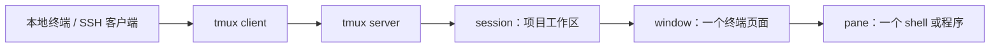

# tmux 使用笔记

`tmux` 是一个 terminal multiplexer（终端复用器）：它让一个终端窗口承载多个 shell，并让这些 shell 在终端关闭、SSH 断开后继续运行。之后重新连上机器，再 attach（接回）原来的会话即可。

它特别适合下面的场景：

- 通过 SSH 在远程机器上编译、训练、下载或运行服务，不希望网络波动把任务一并中断。
- 一个项目同时需要编辑器、日志、测试、监控和 REPL，不想在多个终端窗口之间来回切换。
- 在一台机器上维护多个独立工作上下文，例如一个会话用于项目开发，另一个会话用于线上排障。
- 想把常用终端布局写成脚本，一条命令恢复工作环境。

本文以本机安装的 `tmux 3.2a` 手册为准。不同版本的少数选项可能不同；遇到不确定的参数时，以 `man tmux` 和 `tmux <命令> -h` 为准。

## 它解决的是什么问题

普通终端和 SSH 连接通常绑定得很紧：终端程序退出，或者网络连接断开，前台 shell 收到挂断信号，依附于它的任务可能随之结束。`tmux` 在中间加了一层常驻的 server（服务器进程）。



关闭 `tmux client` 或 SSH 断开时，`tmux server`、session 和 pane 中运行的 shell 通常仍在；重新连接后，新的 client 可以接回同一个 session。注意，这不是任务的永久容灾：远程主机重启、tmux server 被杀掉、任务自身崩溃时，进程仍会结束。

## 核心层级：server、session、window、pane 与 client

先建立这套模型，后面的命令就不容易混淆。

| 对象 | 含义 | 类比 | 常用操作 |
| --- | --- | --- | --- |
| `server` | 管理所有 tmux 会话的后台进程，通过 Unix socket 与客户端通信。 | 一栋楼的物业。 | 通常由首次创建 session 自动启动。 |
| `session` | 一组 window 的持久工作区，可被多个 client 同时连接。 | 一个项目工作区。 | 创建、列出、接回、销毁。 |
| `window` | session 内的一个完整终端页面，可包含多个 pane。 | 浏览器的一个标签页。 | 新建、切换、重命名、关闭。 |
| `pane` | window 中的一个矩形区域，每个 pane 连接一个独立的伪终端（PTY）。 | 标签页内的一块分屏。 | 分割、聚焦、缩放、调整大小、关闭。 |
| `client` | 当前显示 tmux 的终端实例。多个终端可同时连接同一 session。 | 观察和操作工作区的窗口。 | attach、detach。 |

一个 session 至少有一个 window，一个 window 至少有一个 pane。层级关系可记为：

```text
tmux server
└── session: project
    ├── window 0: editor
    │   ├── pane 0: nvim
    │   └── pane 1: git status / shell
    └── window 1: run
        └── pane 0: build or service log
```

## 最小工作流：创建、离开与接回

最常用的循环只有三步。

```shell
# 1. 创建名为 project 的 session，并进入它
tmux new-session -s project

# 2. 在 tmux 内按 Ctrl-b，然后按 d：离开但不停止任务
#    写作：Prefix d；默认 Prefix 是 Ctrl-b。

# 3. 以后重新接回这个 session
tmux attach-session -t project
```

`new-session` 可简写为 `new`，`attach-session` 可简写为 `attach` 或 `a`。若机器上只有一个 session，下面的简写也很方便：

```shell
tmux                 # 等价于创建一个新 session
tmux ls              # 列出所有 session
tmux a               # 接回唯一的 session；多个 session 时会报歧义
tmux kill-session -t project
```

### 推荐的首次使用

假设要在远程机器上运行一个很久的训练任务：

```shell
ssh user@host
tmux new -s train

# 现在已在 tmux 内
python train.py --config configs/base.yaml
```

此时按 `Ctrl-b d`，再关闭 SSH 窗口。下次登录后：

```shell
tmux attach -t train
```

会回到原 pane，仍可看到程序输出。若程序已经结束，shell 仍在，可以直接检查日志或重启任务。

### 创建或接回：日常最实用的一条命令

`new-session -A` 表示：指定 session 已存在时接回它；不存在时才创建。

```shell
tmux new-session -A -s project
```

可把它理解为“确保我进入 `project`”。它很适合 shell alias：

```shell
alias tproject='tmux new-session -A -s project'
```

## 命令行结构与全局选项

基本形式是：

```shell
tmux [全局选项] <命令> [命令选项] [参数]
```

不写 `<命令>` 时，tmux 默认执行 `new-session`。常见全局选项如下。

| 选项 | 含义 | 使用场景 |
| --- | --- | --- |
| `-V` | 输出 tmux 版本。 | 排查文档与本机版本差异。 |
| `-f <file>` | 使用指定配置文件，而不是默认的 `~/.tmux.conf`。 | 测试新配置、为脚本准备隔离配置。 |
| `-L <socket-name>` | 指定 socket 名，从而使用独立 tmux server。 | 同一用户运行彼此隔离的多套 tmux。 |
| `-S <socket-path>` | 指定 socket 的完整路径；会忽略 `-L`。 | 需要显式指定 socket 位置的特殊环境。 |
| `-u` | 强制向终端输出 UTF-8。 | 终端 locale 配置不完整但需要中文或 Unicode 时。 |
| `-2` | 假定终端支持 256 色，相当于 `-T 256`。 | 老旧终端的兼容场景。 |
| `-v` | 写入调试日志；重复两次会记录更多终端输出。 | 调试 tmux 本身，不建议日常开启。 |

`-L` 和 `-S` 会连接不同的 server，因此用错它们时会出现“看不到已有 session”的现象。普通使用不要加这两个选项。

## Session：会话管理

### 创建 session：`new-session`

```shell
tmux new-session [-AdDEPX] [-c 起始目录] [-e 变量=值] [-n 窗口名] \
  [-s 会话名] [-t 目标会话] [-x 宽] [-y 高] [shell-command]
```

常用参数：

| 参数 | 含义 |
| --- | --- |
| `-s <name>` | 指定 session 名。命名后更容易 attach、kill 和脚本化。 |
| `-n <name>` | 指定创建出的第一个 window 名。 |
| `-c <dir>` | 指定第一个 pane 的工作目录。 |
| `-d` | Detached，创建后不立刻把当前终端接入。适合脚本。 |
| `-A` | session 已存在时 attach，而不是报错或再建一个。 |
| `-e <name=value>` | 为 session 设置环境变量。可以重复使用。 |
| `-x <width>`、`-y <height>` | 设置 session 尺寸；多 client 或脚本化布局时才常用。 |
| `shell-command` | 第一个 pane 要运行的命令；省略时启动默认 shell。 |

示例：

```shell
# 在仓库目录创建名为 homepage 的 session，第一个 window 叫 editor
tmux new -s homepage -n editor -c ~/Projects/homepage

# 后台创建一个运行命令的 session；命令结束后 pane 是否关闭取决于 shell 和配置
tmux new -d -s build -c ~/Projects/homepage 'npm run build'

# 创建并为其中的程序提供环境变量
tmux new -s api -e APP_ENV=development 'python -m app'
```

### 列出、接回与离开

```shell
tmux list-sessions                 # 或 tmux ls
tmux attach-session -t project     # 或 tmux a -t project
tmux detach-client                 # 让当前 client 离开；tmux 内用 Prefix d 更方便
```

`list-sessions` 支持 `-F <format>` 自定义输出。tmux 的 format 字段以 `#{...}` 表示：

```shell
tmux list-sessions -F '#{session_name}: #{session_windows} windows, attached=#{session_attached}'
```

在另一个终端接回已被占用的 session 时，`attach-session -d` 会先断开其他 client，再接入当前 client：

```shell
tmux attach -d -t project
```

这是“抢占显示权”，不会停止 session 内的程序；但会让另一端终端退出 tmux，应在确有需要时使用。

### 重命名与销毁

```shell
tmux rename-session -t old-name new-name
tmux kill-session -t project
tmux kill-server                    # 杀掉所有 session，慎用
```

`kill-session` 会终止该 session 中的 window、pane 和其下的 shell/前台任务。它不是 detach 的替代品。要暂时离开，请用 `Prefix d`。

## Window：终端页面管理

一个 session 可以有多个 window。将“编辑”“运行”“日志”“数据库”放在不同 window 往往比把所有内容塞进一个复杂分屏更清晰。

### 常用命令

| 命令 | 用途 |
| --- | --- |
| `tmux new-window -t project -n logs` | 在 `project` 中创建名为 `logs` 的 window。 |
| `tmux new-window -t project -c ~/Projects/homepage` | 在指定目录创建 window。 |
| `tmux list-windows -t project` | 列出 session 的 window。 |
| `tmux select-window -t project:1` | 选中编号为 `1` 的 window。 |
| `tmux rename-window -t project:1 server` | 重命名 window。 |
| `tmux kill-window -t project:logs` | 关闭一个 window。 |
| `tmux move-window -s project:1 -t project:3` | 把一个 window 移到新位置。 |

`new-window` 的常用选项和 `new-session` 类似：`-n` 命名、`-c` 指定目录、`-d` 创建但不切换过去、`-t` 指定目标位置，末尾可跟要运行的 `shell-command`。

### 默认快捷键

以下所有写作 `Prefix x` 的组合，默认都表示先按并松开 `Ctrl-b`，再按 `x`；不是同时按。

| 快捷键 | 操作 |
| --- | --- |
| `Prefix c` | 新建 window。 |
| `Prefix n` / `Prefix p` | 切到下一个 / 上一个 window。 |
| `Prefix 0` 到 `Prefix 9` | 直接切换到相应编号的 window。 |
| `Prefix w` | 交互式选择 window。 |
| `Prefix ,` | 重命名当前 window。 |
| `Prefix &` | 关闭当前 window，会要求确认。 |
| `Prefix l` | 回到上一次访问的 window。 |

## Pane：分屏与布局

pane 是 tmux 最直观的能力：在同一个 window 中同时运行编辑器、构建命令与日志跟踪。

### 创建分屏：`split-window`

```shell
tmux split-window [-bdfhIvPZ] [-c 起始目录] [-t 目标 pane] \
  [-l 大小 | -p 百分比] [shell-command]
```

最重要的选项：

| 参数 | 含义 |
| --- | --- |
| `-h` | 左右并排分割。 |
| `-v` | 上下分割。省略时通常也是上下分割。 |
| `-c <dir>` | 新 pane 的工作目录。 |
| `-t <target-pane>` | 指定从哪个 pane 分割。 |
| `-l <size>` | 新 pane 占用固定列数或行数，取决于分割方向。 |
| `-p <percent>` | 新 pane 占可用空间的百分比。 |
| `-b` | 在当前 pane 的左侧或上方创建，而不是右侧或下方。 |
| `-d` | 创建后不把焦点切到新 pane。 |
| `shell-command` | 在新 pane 中运行的命令。 |

示例：

```shell
# 当前 window 左右分屏：右侧运行测试
tmux split-window -h 'npm test -- --watch'

# 当前 pane 下方创建 30% 高度的日志 pane
tmux split-window -v -p 30 'tail -F logs/app.log'

# 在指定 pane 的同目录右侧开一个 shell
tmux split-window -h -t project:editor.0
```

在 tmux 内更常用默认快捷键：

| 快捷键 | 操作 |
| --- | --- |
| `Prefix %` | 左右并排分割。 |
| `Prefix "` | 上下分割。 |
| `Prefix o` | 切到下一个 pane。 |
| `Prefix ;` | 切回上一个活动 pane。 |
| `Prefix 方向键` | 切到对应方向的 pane。 |
| `Prefix q` | 短暂显示 pane 编号，随后按编号可选中。 |
| `Prefix x` | 关闭当前 pane，会要求确认。 |
| `Prefix z` | 放大 / 恢复当前 pane；不会销毁其他 pane。 |
| `Prefix Space` | 在预置布局之间轮换。 |
| `Prefix {` / `Prefix }` | 与前一个 / 后一个 pane 交换位置。 |

### 调整 pane 大小与布局

命令行可精确控制尺寸：

```shell
# 向右扩展当前 pane 10 列
tmux resize-pane -R 10

# 指定 pane 绝对宽度为 100 列、高度为 30 行
tmux resize-pane -t project:editor.1 -x 100 -y 30

# 应用预置布局
tmux select-layout -t project:editor tiled
```

`resize-pane` 使用 `-L`、`-R`、`-U`、`-D` 表示向左、右、上、下调整；`select-layout` 常用布局有：

| 布局 | 效果 |
| --- | --- |
| `even-horizontal` | 多个 pane 上下等高排列。 |
| `even-vertical` | 多个 pane 左右等宽排列。 |
| `main-horizontal` | 一个较大的主 pane 在上，其余 pane 在下。 |
| `main-vertical` | 一个较大的主 pane 在左，其余 pane 在右。 |
| `tiled` | 尽量均匀地平铺全部 pane。 |

默认状态下，`Ctrl-方向键` 每次调整一个字符单元，`Alt-方向键` 每次调整五个字符单元。

## 快捷键、命令提示符与帮助

### Prefix 是什么

tmux 需要区分“发给 shell 的按键”和“tmux 自己的操作”。因此多数 tmux 快捷键都以 Prefix 开头，默认 Prefix 为 `Ctrl-b`。

例如按 `Ctrl-b c` 时，`c` 不会输入 shell，而是新建 window。若确实要把 `Ctrl-b` 发给当前程序，按 `Prefix Ctrl-b`。

### 命令提示符

按 `Prefix :` 进入 tmux 的命令提示符，可直接执行 tmux 命令：

```text
new-window -n logs 'tail -F logs/app.log'
```

这里不需要再写开头的 `tmux`。同一类命令可以从 shell、`~/.tmux.conf`、命令提示符和快捷键绑定中执行；区别主要在于引号和转义由谁解析。

### 自带帮助

| 位置 | 操作 |
| --- | --- |
| shell | `man tmux` 阅读完整手册。 |
| shell | `tmux <命令> -h` 查看该子命令的简要用法，例如 `tmux split-window -h`。 |
| tmux 内 | `Prefix ?` 查看所有按键绑定。 |
| tmux 内 | `Prefix :` 后输入命令；按 `Tab` 可补全。 |
| tmux 内 | `Prefix ~` 查看 tmux 消息和报错。 |

注意：`tmux -h` 不是完整帮助选项；它只会显示顶层 usage。应使用 `man tmux`，或把 `-h` 放到具体子命令后。

## 复制、滚动与粘贴

tmux 有自己的 scrollback history（滚动历史），因此鼠标滚轮和终端复制行为可能与直接使用 shell 不同。

### Copy mode

按 `Prefix [` 进入 copy mode。此时可以浏览 pane 的历史输出；默认按键模式通常是 Emacs 风格。常用操作：

| 操作 | 默认 / vi 模式常用按键 |
| --- | --- |
| 进入复制模式 | `Prefix [` |
| 向上翻页 | `Page Up`，或进入复制模式后移动光标。 |
| 开始选择 | Emacs 模式常用 `Space`；vi 模式常用 `v`。 |
| 复制选择 | Emacs 模式常用 `Enter`；vi 模式常用 `y`。 |
| 粘贴最近复制内容 | `Prefix ]` |
| 选择某个历史 buffer 再粘贴 | `Prefix =` |

将复制模式改为 vi 风格：

```tmux
setw -g mode-keys vi
```

其中 `setw` 是 `set-window-option` 的缩写，`-g` 表示全局默认值。复制到 tmux buffer 不等于自动进入操作系统剪贴板；跨系统剪贴板需要终端的鼠标复制、OSC 52、`xclip`/`wl-copy`、macOS `pbcopy` 或 tmux 插件等额外方案。

### 调整历史行数

默认历史容量可能不足以保存长日志。可以增大 `history-limit`：

```tmux
set -g history-limit 50000
```

该选项影响新建 window。配置改完后，已有 pane 的历史并不会自动补回已经丢失的内容。

## target：精确指定要操作的对象

命令行控制 tmux 时，`-t` 非常关键。它后面的 target（目标）可以定位 session、window 或 pane。

| 目标写法 | 含义 |
| --- | --- |
| `project` | 名为 `project` 的 session。 |
| `project:1` | `project` 的编号为 `1` 的 window。 |
| `project:editor` | `project` 中名为 `editor` 的 window。 |
| `project:1.0` | `project` 的 window `1` 中编号为 `0` 的 pane。 |
| `:1.0` | 当前 session 的 window `1`、pane `0`。 |
| `%3` | 全局 pane ID 为 `3` 的 pane，适合脚本中使用。 |

例如：

```shell
tmux send-keys -t project:editor.0 'git status' Enter
tmux capture-pane -t project:run.1 -p
tmux kill-pane -t project:editor.2
```

省略 `-t` 时，tmux 多数命令会针对当前 client 所在的对象；但在脚本、CI 或多个 session 并存时，应该显式写 `-t`，避免命令打到错误的 window 或 pane。

## 自动化：发送命令、抓取输出与脚本化布局

### 向 pane 输入命令：`send-keys`

```shell
tmux send-keys -t project:run.0 'python train.py --resume' Enter
```

`send-keys` 将按键发送给目标 pane；`Enter` 是 tmux 识别的按键名，表示真正按下回车。没有最后的 `Enter`，命令只会出现在提示符上，不会执行。

不要把它当作复杂任务编排器：交互式程序、shell 初始化慢、提示符变化、密码输入和竞争条件都会让脚本变脆弱。对于可重复的服务，优先写 shell 脚本、systemd、Docker Compose 或专门的任务系统。

### 抓取输出：`capture-pane`

```shell
# -p：把内容打印到标准输出；-S -200：从最近 200 行开始
tmux capture-pane -t project:run.0 -p -S -200

# 保存完整可见与历史输出时，可先抓取再重定向
tmux capture-pane -t project:run.0 -p -S - > run.log
```

`capture-pane` 适合临时诊断或让脚本读取日志尾部。它抓取的是终端显示内容，其中可能包含颜色控制符、进度条覆盖和截断行；结构化日志仍应由程序写入文件。

### 以脚本创建开发布局

下面示例创建一个 detached session：第一个 window 用于编辑，第二个 window 左右分为服务和日志。最后再 attach。

```shell
#!/usr/bin/env bash
set -euo pipefail

session="homepage"
root="$HOME/Projects/homepage"

tmux has-session -t "$session" 2>/dev/null && exec tmux attach -t "$session"

tmux new-session -d -s "$session" -n editor -c "$root"
tmux new-window -t "$session" -n dev -c "$root"
tmux split-window -h -t "$session:dev" -c "$root"
tmux send-keys -t "$session:dev.0" 'npm run dev' Enter
tmux send-keys -t "$session:dev.1" 'tail -F .next/*.log' Enter
tmux select-window -t "$session:editor"
exec tmux attach -t "$session"
```

脚本中的 `has-session` 用于探测 session 是否存在；`2>/dev/null` 隐藏“找不到 session”的预期错误。`exec` 让脚本进程直接替换成 tmux client。

## 配置文件 `~/.tmux.conf`

tmux server 第一次启动时会读取系统配置（若存在）和用户配置 `~/.tmux.conf`。修改配置后，已有 server 不会自动重新读取，需要执行：

```shell
tmux source-file ~/.tmux.conf
```

下面是一份保守、易理解的起点：

```tmux
# 将 Prefix 改为 Ctrl-a；仍允许向程序发送 Ctrl-a。
unbind C-b
set -g prefix C-a
bind C-a send-prefix

# window 和 pane 从 1 开始编号；新 pane 保持当前目录。
set -g base-index 1
setw -g pane-base-index 1
set -g renumber-windows on
bind c new-window -c '#{pane_current_path}'
bind '"' split-window -v -c '#{pane_current_path}'
bind % split-window -h -c '#{pane_current_path}'

# 使用鼠标选择 pane、调整边界和滚动；复制模式采用 vi 按键。
set -g mouse on
setw -g mode-keys vi
set -g history-limit 50000

# 使用 h/j/k/l 调整 pane，-r 表示可以连续按，不必重复输入 Prefix。
bind -r h resize-pane -L 5
bind -r j resize-pane -D 5
bind -r k resize-pane -U 5
bind -r l resize-pane -R 5

# Prefix r 重新加载配置，并在状态栏提示。
bind r source-file ~/.tmux.conf \; display-message 'tmux 配置已重新加载'
```

几点说明：

- `set -g` 设置全局 session 选项，`setw -g` 设置全局 window 选项；两者不要混用。
- `#{pane_current_path}` 是 tmux format，运行绑定时会展开为当前 pane 的目录，因此分屏不会莫名回到 home 目录。
- 配置里的 `\;` 是转义后的分号：它作为 `bind r` 的绑定命令的一部分，而不是在读取配置时立刻把两条命令拆开。
- 如果将 Prefix 改成 `Ctrl-a`，它会与 shell 的“跳到行首”快捷键冲突；需要时按两次 `Ctrl-a`，第一次由 tmux 识别为 Prefix，第二次通过 `send-prefix` 发给 shell。

## SSH 使用建议与边界

### 推荐流程

```shell
ssh user@remote-host
tmux new -A -s project

# 工作完成后：Prefix d
exit
```

下次登录：

```shell
ssh user@remote-host
tmux a -t project
```

不要在本地 tmux 内再 SSH 后就误以为远程任务得到了保护。**应当在运行任务的那台远程机器上启动 tmux**。本地 tmux 只能保护本地 SSH 客户端；若 SSH 本身断线，远端 shell 是否存活仍取决于远端是否在 tmux、screen、systemd 等持久环境中。

### 多端同时 attach 的注意点

同一 session 可以被多个 client 同时 attach，这对结对调试和临时观察有用；但两个客户端会同时看到同一个 pane，也都能输入字符。共享交互式 shell 时要先沟通，避免互相干扰。

窗口大小也会受多个 client 影响。需要固定脚本布局或排查尺寸异常时，先只保留一个 client，或者了解 `window-size`、`aggressive-resize` 等选项的行为。

## 常见问题

### `duplicate session` 或 `session already exists`

同名 session 已存在。不要重复 `new`，改用：

```shell
tmux attach -t project
# 或一次性创建 / 接回
tmux new -A -s project
```

### `no server running` 或看不到预期 session

先执行：

```shell
tmux ls
```

若确实没有 session，就重新创建。若你明明创建过却看不到，检查是否：

- 登录了不同用户；tmux server 按用户隔离。
- 连接到了不同主机。
- 使用了不同的 `-L` / `-S` socket 参数。
- 远程主机重启，或 tmux server 被终止。

### SSH 断开后任务还是没了

常见原因是任务并不在远程 tmux 中运行，或 pane/shell 被关闭了。进入 tmux 后运行任务，再用 `Prefix d` 离开；不要按 `exit`、`Ctrl-d` 或 `Prefix x` 去关闭其所在 pane。

### 颜色不对、鼠标不能用、中文乱码

- 先确认本地终端的 `TERM` 和 locale 配置；SSH 场景还要确认远端 terminfo 是否存在。
- 鼠标功能需在配置中启用 `set -g mouse on`，重新加载配置后再试。
- 中文乱码可检查 `locale` 输出；必要时用 tmux 的 `-u` 强制 UTF-8 输出，但根源仍应是正确配置 locale。
- 不要盲目把 `TERM` 硬编码为某个值。终端能力和远端 terminfo 不匹配时，反而会导致 `clear`、颜色或按键异常。

### tmux 里无法向上滚动

按 `Prefix [` 进入 copy mode 后再滚动；或启用鼠标：

```tmux
set -g mouse on
```

### 怎么彻底退出

先确认没有重要任务，再关闭所有 session：

```shell
tmux kill-server
```

更稳妥的是只关闭指定 session：

```shell
tmux kill-session -t project
```

## 一页速查

```shell
# session
tmux new -s project                 # 创建并进入
tmux new -A -s project              # 存在就接回，不存在就创建
tmux ls                             # 列出会话
tmux a -t project                   # 接回会话
tmux kill-session -t project        # 结束会话

# window / pane
tmux new-window -t project -n logs  # 新建 window
tmux split-window -h                # 左右分屏
tmux split-window -v -p 30          # 上下分屏，新 pane 占 30%
tmux select-layout tiled            # 平铺 pane
tmux resize-pane -R 10              # 当前 pane 向右扩 10 列

# 自动化与观察
tmux send-keys -t project:1.0 'make test' Enter
tmux capture-pane -t project:1.0 -p -S -100
tmux source-file ~/.tmux.conf
```

| 目标 | 默认快捷键 |
| --- | --- |
| 暂时离开，任务继续运行 | `Prefix d` |
| 新建 window | `Prefix c` |
| 切换 window | `Prefix n` / `Prefix p` / `Prefix 数字` |
| 左右 / 上下分屏 | `Prefix %` / `Prefix "` |
| 切换 pane | `Prefix 方向键` 或 `Prefix o` |
| 放大当前 pane | `Prefix z` |
| 复制 / 粘贴 tmux buffer | `Prefix [` / `Prefix ]` |
| 查看全部快捷键 | `Prefix ?` |
| 输入 tmux 命令 | `Prefix :` |

最值得养成的习惯是：**远程工作先执行 `tmux new -A -s <项目名>`，离开时只 detach，不要 kill。** 其余 window、pane、复制和配置技巧，可以在这条稳定工作流上逐步加入。
