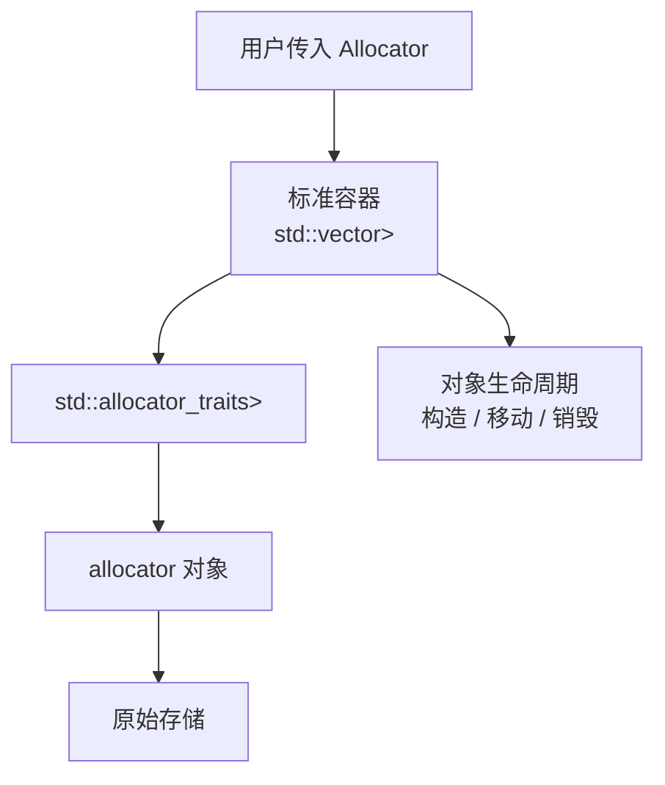

# C++ allocator 内存分配器笔记

`allocator` 是 C++ 标准库里连接“容器”和“内存策略”的抽象。它的核心目标不是替代 `new` / `delete`，而是让 `std::vector`、`std::list`、`std::map`、`std::basic_string` 这类容器在不改变自身算法的前提下，可以把底层存储交给不同的分配策略管理。

先用一句话压住全局：

> `allocator` 管“原始存储从哪里来”，容器管“对象什么时候构造、移动、销毁”，`allocator_traits` 管“用统一方式调用不同 allocator”。

## 为什么需要 allocator

### C 语言的内存控制很直接，但语义太低

C 语言主要用这些接口控制堆内存：

```c
void* malloc(size_t size);
void* calloc(size_t count, size_t size);
void* realloc(void* ptr, size_t new_size);
void free(void* ptr);
```

它们的优点是直接、稳定、跨语言边界友好；问题也很明显：

- **只有字节，没有对象语义**。`malloc` 返回的是一段未初始化字节，不会调用构造函数；`free` 也不会调用析构函数。
- **类型信息丢失**。返回值是 `void*`，使用者必须自己转换，并自己保证大小、对齐、生命周期都匹配。
- **错误路径容易泄漏**。多处 `malloc` 后，中间某一步失败，需要手写清理路径。
- **`realloc` 对 C++ 对象不友好**。它可能移动字节，但不会调用移动构造、复制构造或析构函数。
- **分配策略难以组合到泛型容器里**。C 里的数据结构如果要支持自定义分配，一般要把函数指针或上下文指针塞进每个 API。

C11 加了 `aligned_alloc`，改善了对齐分配问题，但仍然只解决“字节存储”，不解决 C++ 对象生命周期。

### 早期 C++ 的 `new` / `delete` 有对象语义，但策略太硬

C++ 的 `new` / `delete` 至少补上了构造和析构：

```cpp
Widget* p = new Widget(args...);
delete p;
```

它比 `malloc` / `free` 更适合对象，但用于容器时仍然不够：

- **分配和构造被绑在一起**。容器经常需要先申请一整段未初始化存储，再按需构造其中一部分元素；`new T[n]` 会一次构造所有元素，不适合 `vector::reserve`。
- **释放和析构被绑在一起**。容器扩容时需要销毁已经构造的元素，再释放整段存储；这两个动作需要分开处理。
- **全局策略太粗**。重载全局 `operator new` 会影响整个进程，很难只让某个容器走 arena、pool 或调试分配器。
- **容器内部节点类型不可见**。`std::list<T>` 实际分配的是内部 node，不是单纯的 `T`；用户传入 `Allocator<T>` 后，容器还需要得到“同一策略下的 `Allocator<Node>`”。

所以 allocator 被引入标准库，不是为了让用户平时手写 `alloc.allocate(1)`，而是为了让容器可以把这几件事拆开：


`allocator` 主要负责 A 和 E；容器通过 `allocator_traits` 调用构造、销毁和传播规则。

## allocator 的核心思想

### 分离存储和对象生命周期

以 `std::vector<T>` 为例，它的 capacity 可能大于 size：

```text
_M_start          _M_finish          _M_end_of_storage
   |                  |                       |
   v                  v                       v
  [ 已构造元素 ... ][ 未初始化存储 ............ ]
```

这里有两种不同资源状态：

- `[start, finish)` 是已经构造好的 `T` 对象。
- `[finish, end_of_storage)` 只是适合放 `T` 的原始存储，还不是 `T` 对象。

这也是 allocator API 里反复强调“分配未初始化存储”的原因：**分配内存不等于构造对象**。

### allocator 是容器类型的一部分

标准容器通常长这样：

```cpp
template<
    class T,
    class Allocator = std::allocator<T>
>
class vector;
```

所以：

```cpp
std::vector<int>
std::vector<int, MyAllocator<int>>
```

是两个不同类型。这个设计让 allocator 在编译期可见，容器可以内联调用分配器，也能按 allocator 的类型属性选择 move、swap、copy 时的行为。缺点是分配策略会污染类型系统；C++17 的 PMR 就是为了解决这一点。

### 标准容器不直接依赖 allocator 的全部成员

C++11 以后，标准库通过 `std::allocator_traits<Alloc>` 访问 allocator。用户自定义 allocator 不必再提供一整套历史成员，只要满足核心要求，缺省行为由 traits 补齐。

```cpp
using Traits = std::allocator_traits<Alloc>;

auto p = Traits::allocate(alloc, n);
Traits::construct(alloc, p, args...);
Traits::destroy(alloc, p);
Traits::deallocate(alloc, p, n);
```

这也是写泛型内存管理代码时的基本原则：**不要直接调用 `alloc.construct`，优先走 `std::allocator_traits`**。

## allocator、traits 和容器的关系

先把三者分工说清楚：

| 角色 | 负责什么 | 不负责什么 |
| --- | --- | --- |
| 容器 | 决定什么时候扩容、移动元素、构造元素、销毁元素、释放旧存储。 | 不应该假设 allocator 有完整旧式接口。 |
| `allocator` | 提供具体分配策略，比如走全局堆、arena、pool、统计分配器。 | 不知道容器里哪些位置已经构造了对象。 |
| `allocator_traits` | 把不同 allocator 统一成标准接口，并提供缺省类型和缺省行为。 | 不保存容器状态，也不决定容器扩容策略。 |

可以把标准容器对 allocator 的使用想成这一层调用链：



这张图里最重要的是两条线：

- **存储线**：容器通过 `allocator_traits::allocate` / `deallocate` 向 allocator 申请和释放原始存储。
- **生命周期线**：容器通过 `allocator_traits::construct` / `destroy` 在那段存储上开始或结束对象生命周期。

所以 allocator 不是“帮容器管理所有东西”的大管家。更准确地说：

> allocator 提供“哪里拿内存、怎么还内存”的策略；容器负责“哪些位置现在真的是对象”。

### 以 `std::vector<T, Alloc>` 为例

`std::vector` 的核心状态可以简化成：

```cpp
template<class T, class Alloc = std::allocator<T>>
class vector {
    using traits = std::allocator_traits<Alloc>;
    using pointer = typename traits::pointer;

    Alloc alloc_;
    pointer begin_;
    pointer end_;
    pointer cap_;
};
```

这里的三个指针表达两个范围：

```text
[begin_, end_)  是已经构造好的 T 对象
[end_, cap_)    是还没构造对象的原始存储
```

当 `vector::push_back(value)` 发现容量够用时，大致做：

```cpp
traits::construct(alloc_, end_, value);
++end_;
```

当容量不够时，大致流程是：

1. 用 `traits::allocate(alloc_, new_capacity)` 申请更大的原始存储。
2. 用 `traits::construct` 把旧元素移动 / 复制构造到新存储。
3. 用 `traits::destroy` 销毁旧存储里的已构造元素。
4. 用 `traits::deallocate` 释放旧存储。
5. 更新 `begin_`、`end_`、`cap_`。

这里有个容易混淆的点：**`allocate` 得到的只是 capacity，`construct` 才让 size 增长**。这也是 `vector::reserve(n)` 只增加 capacity，不增加 size 的根本原因。

### 以节点容器为例

`std::list<T, Allocator<T>>` 对 allocator 的需求更微妙，因为它实际分配的通常不是单独的 `T`，而是内部节点：

```cpp
template<class T>
struct ListNode {
    ListNode* prev;
    ListNode* next;
    T value;
};
```

用户传进来的是 `Allocator<T>`，但容器内部要分配 `ListNode<T>`。这时就需要 `allocator_traits` 的 rebind：

```cpp
using value_alloc = Allocator<T>;
using node_alloc =
    typename std::allocator_traits<value_alloc>
        ::template rebind_alloc<ListNode<T>>;
using node_traits = std::allocator_traits<node_alloc>;
```

也就是说，`rebind_alloc<Node>` 不是历史包袱那么简单，它解决的是：

> 用户只指定“怎么分配 T”，但容器内部可能需要“用同一策略分配别的内部类型”。

### 为什么容器要用 `allocator_traits`

如果没有 `allocator_traits`，容器要直接面对各种 allocator 差异：

- 有的 allocator 定义了 `pointer`，有的没有。
- 有的 allocator 定义了 `construct`，有的没有。
- 有的 allocator 需要 `rebind`，有的可以从模板参数推导。
- 有状态 allocator 在 move / copy / swap 时是否传播也不一样。

`allocator_traits` 把这些差异收敛成一组稳定接口：

```cpp
using pointer = typename std::allocator_traits<Alloc>::pointer;
using node_alloc = typename std::allocator_traits<Alloc>
    ::template rebind_alloc<Node>;

auto p = std::allocator_traits<Alloc>::allocate(alloc, n);
std::allocator_traits<Alloc>::construct(alloc, std::addressof(*p), args...);
std::allocator_traits<Alloc>::destroy(alloc, std::addressof(*p));
std::allocator_traits<Alloc>::deallocate(alloc, p, n);
```

容器因此可以只依赖 traits 的统一接口，而不是要求每个 allocator 都长得和 C++03 时代一样完整。

### allocator 传播影响容器语义

allocator 不是只有 `allocate` / `deallocate`。如果 allocator 有状态，比如保存 arena 指针，那么容器在复制、移动、交换时必须知道这个状态怎么处理。

| 场景 | 容器关心的问题 | traits 类型 |
| --- | --- | --- |
| copy assignment | 左侧容器是否换成右侧 allocator？ | `propagate_on_container_copy_assignment` |
| move assignment | 左侧容器是否接管右侧 allocator？ | `propagate_on_container_move_assignment` |
| swap | 两个容器是否交换 allocator？ | `propagate_on_container_swap` |
| 快速接管内存 | 两个 allocator 是否总能互相释放内存？ | `is_always_equal` |

这解释了为什么两个 `std::vector<T, MyAlloc<T>>` move assignment 时，有时能直接偷走右侧 buffer，有时必须逐元素移动：**如果 allocator 不传播、也不相等，左侧不能随便释放右侧 allocator 分配出来的内存**。

### 嵌套对象是另一层问题

普通 allocator 只控制当前容器这一层。例如：

```cpp
std::vector<std::string, MyAllocator<std::string>> values;
```

这里 `MyAllocator<std::string>` 主要控制 `vector` 的元素数组；每个 `std::string` 自己的字符 buffer 是否使用同一套策略，是另一层 allocator-aware construction 问题。

C++11 的 `std::uses_allocator` 和 `std::scoped_allocator_adaptor` 就是为了解决“构造元素时，要不要继续把 allocator 传给元素内部”。

PMR 把这个问题做成了更容易使用的运行期模型。本文只保留传统 allocator 视角下的接口关系；PMR 的完整设计、内置资源和容器别名见 [[cpp-pmr|C++ PMR 内存资源笔记]]。

## 标准演进脉络

| 标准 | allocator 相关变化 | 解决的问题 |
| --- | --- | --- |
| C++98 / C++03 | 标准容器支持 allocator 模板参数；allocator 需要提供较多 typedef、`rebind`、`construct`、`destroy` 等成员。 | 让容器能替换底层分配策略，但自定义 allocator 写起来笨重。 |
| C++11 | 引入 `std::allocator_traits`、`std::allocator_arg_t`、`std::uses_allocator`、`std::scoped_allocator_adaptor`；容器 move/copy/swap 的 allocator 传播规则标准化。 | 降低自定义 allocator 负担，并解决嵌套容器如何传播分配器。 |
| C++14 | `uses_allocator` 继承的 `integral_constant` 获得 `operator()`；一些 traits 行为通过缺陷报告修正。 | 小幅改善类型特性使用体验。 |
| C++17 | 引入 `<memory_resource>` 与 `std::pmr`；未初始化内存算法增加 `uninitialized_move`、`destroy`、`destroy_at` 等；`std::allocator<void>`、若干成员 typedef / `rebind` 开始弃用。 | 让分配策略可以运行期多态；让显式生命周期工具更完整。 |
| C++20 | `std::allocator` 移除历史成员 `address`、`construct`、`destroy`、`max_size`、`rebind` 等；`std::construct_at`、ranges 未初始化算法、`uses_allocator_construction_args`、`make_obj_using_allocator`、`uninitialized_construct_using_allocator` 出现；`polymorphic_allocator` 增加 bytes/object 接口。 | 把对象构造销毁从 allocator 成员转向独立生命周期工具，并补齐 uses-allocator 构造的显式接口。 |
| C++23 | 引入 `std::allocation_result`、`std::allocator<T>::allocate_at_least`、`std::allocator_traits<Alloc>::allocate_at_least`；垃圾回收支持相关接口移除。 | 让连续容器可以利用“实际分到的容量”减少扩容次数。 |

## `std::allocator<T>`

**用途**

`std::allocator<T>` 是标准容器默认使用的分配器。它通常把分配请求转发给全局 `operator new`，释放请求转发给全局 `operator delete`。

**原型**

```cpp
#include <memory>

namespace std {
template<class T>
struct allocator;
}
```

**模板参数**

| 参数 | 含义 |
| --- | --- |
| `T` | 被分配存储对应的对象类型。`std::allocator<int>` 表示分配适合放 `int` 的未初始化存储。 |

**成员类型**

注意：C++20 移除了 `std::allocator<T>` 自身的很多历史成员，但 `std::allocator_traits<std::allocator<T>>` 仍然会提供统一访问类型。

| 类型 | 含义 |
| --- | --- |
| `using value_type = T;` | 被分配对象的类型。 |
| `using size_type = std::size_t;` | C++20 前是 allocator 成员；表示对象数量，不是字节数。 |
| `using difference_type = std::ptrdiff_t;` | C++20 前是 allocator 成员；表示指针差值。 |
| `using pointer = T*;` | C++17 弃用，C++20 移除；指向 `T` 存储的指针类型。 |
| `using const_pointer = const T*;` | C++17 弃用，C++20 移除；指向 `const T` 的指针类型。 |
| `using reference = T&;` | C++17 弃用，C++20 移除；历史接口，新代码通常不依赖。 |
| `using const_reference = const T&;` | C++17 弃用，C++20 移除；历史接口。 |
| `template<class U> struct rebind { using other = std::allocator<U>; };` | C++17 弃用，C++20 移除；把当前 allocator 换成分配 `U` 的同策略 allocator。 |
| `using propagate_on_container_move_assignment = std::true_type;` | C++11 起；容器 move assignment 时 allocator 可以传播。 |
| `using is_always_equal = std::true_type;` | C++11 起，C++23 弃用 allocator 自身成员；任意两个默认 allocator 实例都等价。 |

**重要约束**

| 约束 | 说明 |
| --- | --- |
| 只管理存储 | `allocate` 只申请未初始化存储，不构造 `T` 对象。 |
| 析构和释放分离 | `deallocate` 只释放存储，不调用析构函数。 |
| 无状态 | `std::allocator<T>` 通常不保存资源指针或计数器，任意两个实例可互相释放同类型存储。 |
| `n` 是对象数量 | `allocate(n)` 的 `n` 表示 `T` 的个数，实际字节数通常是 `n * sizeof(T)`。 |
| 不完整类型受限 | 对不完整类型调用 `allocate` 不合法；GCC 11 的默认实现会做 `sizeof(T)` 检查。 |

### `allocator::allocator`

**用途**

构造一个默认 allocator，或从同一策略下的其他 `value_type` allocator 转换构造。

**原型**

```cpp
allocator() noexcept;
allocator(const allocator& other) noexcept;

template<class U>
allocator(const allocator<U>& other) noexcept;
```

**函数参数**

| 参数 | 类型 | 含义 |
| --- | --- | --- |
| `other` | `const allocator&` | 同类型 allocator。默认 allocator 无状态，所以复制不携带额外资源。 |
| `other` | `const allocator<U>&` | 其他 `U` 类型的默认 allocator，用于容器内部 rebind 或泛型转换。 |

**返回值**

| 类型 | 含义 |
| --- | --- |
| 无 | 构造函数不返回值。 |

### `allocator::allocate`

**用途**

分配能容纳 `n` 个 `T` 对象的未初始化存储。

**原型**

```cpp
T* allocate(std::size_t n);
```

**函数参数**

| 参数 | 类型 | 含义 |
| --- | --- | --- |
| `n` | `std::size_t` | 要分配的 `T` 对象数量，不是字节数。 |

**返回值**

| 类型 | 含义 |
| --- | --- |
| `T*` | 指向未初始化存储的指针；这段存储适合放置 `n` 个连续 `T` 对象。 |

**重要约束**

| 约束 | 说明 |
| --- | --- |
| 不构造对象 | 返回后只能做指针运算和对象构造，不能直接读取元素值。 |
| 可能抛异常 | 分配失败通常抛 `std::bad_alloc`；请求长度非法可能抛 `std::bad_array_new_length`。 |
| `allocate(0)` 特殊 | 返回值不适合解引用；实现可以返回非空哨兵。 |
| 对齐由实现保证 | 对 `T` 的普通对齐和过度对齐，allocator 应返回满足 `alignof(T)` 的地址。 |

### `allocator::deallocate`

**用途**

释放先前由匹配 allocator 分配的未初始化存储。

**原型**

```cpp
void deallocate(T* p, std::size_t n);
```

**函数参数**

| 参数 | 类型 | 含义 |
| --- | --- | --- |
| `p` | `T*` | 先前由 `allocate(n)` 得到的指针。 |
| `n` | `std::size_t` | 分配时传入的对象数量，必须和分配规模匹配。 |

**返回值**

| 类型 | 含义 |
| --- | --- |
| `void` | 不返回值。 |

**重要约束**

| 约束 | 说明 |
| --- | --- |
| 不销毁对象 | 调用前必须先销毁 `[p, p + constructed_count)` 中已经构造的对象。 |
| 指针必须匹配 | `p` 必须来自兼容 allocator 的分配结果。 |
| 数量必须匹配 | `n` 必须符合对应分配调用的规模要求。 |

### `allocator::allocate_at_least`

**用途**

C++23 起，分配至少能容纳 `n` 个 `T` 的未初始化存储，并返回实际容量。

**原型**

```cpp
std::allocation_result<T*, std::size_t>
allocate_at_least(std::size_t n);
```

**函数参数**

| 参数 | 类型 | 含义 |
| --- | --- | --- |
| `n` | `std::size_t` | 请求容量下限，按 `T` 对象数量计算。 |

**返回值**

| 类型 | 含义 |
| --- | --- |
| `std::allocation_result<T*, std::size_t>` | `ptr` 是存储指针，`count` 是实际可容纳的 `T` 对象数量，且 `count >= n`。 |

**重要约束**

| 约束 | 说明 |
| --- | --- |
| C++23 接口 | GCC 11 的 libstdc++ 没有这个成员。 |
| 释放数量受限 | 后续 `deallocate(ptr, m)` 中的 `m` 必须满足标准规定的范围。 |

### C++20 前的历史成员

**用途**

这些成员是早期 allocator 模型的一部分。C++20 新代码应优先使用 `std::allocator_traits` 和显式生命周期工具。

**原型**

```cpp
T* address(T& x) const noexcept;                    // C++20 前
const T* address(const T& x) const noexcept;        // C++20 前

template<class U, class... Args>
void construct(U* p, Args&&... args);              // C++20 前

template<class U>
void destroy(U* p);                                // C++20 前

std::size_t max_size() const noexcept;             // C++20 前
```

**重要约束**

| 约束 | 说明 |
| --- | --- |
| 新代码不直接依赖 | 用 `std::addressof`、`std::construct_at`、`std::destroy_at` 或 `allocator_traits` 替代。 |
| traits 仍可统一访问 | 即使 allocator 自身没有这些成员，`allocator_traits` 也会提供对应兜底行为。 |

**从本机 GCC 11 推断**

- `/usr/include/c++/11/bits/allocator.h` 中，C++20 模式下 `std::allocator<T>::allocate/deallocate` 直接作为成员出现，并在常量求值时调用全局 `::operator new/delete`。
- `/usr/include/c++/11/ext/new_allocator.h` 显示默认实现会检查最大分配数，过大时抛 `std::bad_array_new_length` 或 `std::bad_alloc`。
- GCC 11 没有 C++23 的 `std::allocator<T>::allocate_at_least`，因为该接口晚于 libstdc++ 11。

## `std::allocator_traits<Alloc>`

**用途**

`std::allocator_traits` 是 allocator 的标准访问层。标准容器和泛型组件应通过它调用 allocator，而不是假设 allocator 一定有所有成员。

**原型**

```cpp
#include <memory>

namespace std {
template<class Alloc>
struct allocator_traits;
}
```

**模板参数**

| 参数 | 含义 |
| --- | --- |
| `Alloc` | 被适配的 allocator 类型。它至少需要提供 `value_type`，以及可被 traits 使用的分配 / 释放接口。 |

**成员类型**

| 类型 | 含义 |
| --- | --- |
| `using allocator_type = Alloc;` | 原始 allocator 类型。 |
| `using value_type = typename Alloc::value_type;` | allocator 负责分配的对象类型。 |
| `using pointer = ...;` | 如果存在则为 `Alloc::pointer`，否则为 `value_type*`。 |
| `using const_pointer = ...;` | 如果存在则为 `Alloc::const_pointer`，否则由 `std::pointer_traits<pointer>` 重绑定到 `const value_type`。 |
| `using void_pointer = ...;` | 如果存在则为 `Alloc::void_pointer`，否则由 `std::pointer_traits<pointer>` 重绑定到 `void`。 |
| `using const_void_pointer = ...;` | 如果存在则为 `Alloc::const_void_pointer`，否则由 `std::pointer_traits<pointer>` 重绑定到 `const void`。 |
| `using difference_type = ...;` | 如果存在则为 `Alloc::difference_type`，否则为 `std::pointer_traits<pointer>::difference_type`。 |
| `using size_type = ...;` | 如果存在则为 `Alloc::size_type`，否则为 `std::make_unsigned<difference_type>::type`。 |
| `using propagate_on_container_copy_assignment = ...;` | 如果存在则为 `Alloc::propagate_on_container_copy_assignment`，否则为 `std::false_type`。 |
| `using propagate_on_container_move_assignment = ...;` | 如果存在则为 `Alloc::propagate_on_container_move_assignment`，否则为 `std::false_type`。 |
| `using propagate_on_container_swap = ...;` | 如果存在则为 `Alloc::propagate_on_container_swap`，否则为 `std::false_type`。 |
| `using is_always_equal = ...;` | 如果存在则为 `Alloc::is_always_equal`，否则为 `std::is_empty<Alloc>::type`。 |

**成员别名模板**

| 别名 | 含义 |
| --- | --- |
| `template<class T> using rebind_alloc = ...;` | 得到同一分配策略下用于 `T` 的 allocator；优先使用 `Alloc::rebind<T>::other`，否则从 `Alloc` 的模板形态推导。 |
| `template<class T> using rebind_traits = std::allocator_traits<rebind_alloc<T>>;` | 得到重绑定 allocator 对应的 traits。 |

**重要约束**

| 约束 | 说明 |
| --- | --- |
| 标准访问层 | 标准容器通过它访问 allocator，不应该假设 allocator 自身有完整历史接口。 |
| 可补默认行为 | 缺少 `pointer`、`size_type`、`construct`、`destroy` 等成员时，traits 会按标准规则补出默认行为。 |
| 不建议特化 | C++23 起，用户程序显式或部分特化 `std::allocator_traits` 是格式错误的，不要求实现诊断。 |
| 构造和分配分离 | `construct` 不分配存储，`destroy` 不释放存储。 |

### `allocator_traits::allocate`

**用途**

通过 allocator 分配未初始化存储。

**原型**

```cpp
static pointer allocate(Alloc& a, size_type n);
static pointer allocate(Alloc& a, size_type n, const_void_pointer hint);
```

**函数参数**

| 参数 | 类型 | 含义 |
| --- | --- | --- |
| `a` | `Alloc&` | 用于执行分配的 allocator 对象。 |
| `n` | `size_type` | 要分配的 `value_type` 对象数量。 |
| `hint` | `const_void_pointer` | 可选局部性提示，表示希望靠近的内存位置；实现可以忽略。 |

**返回值**

| 类型 | 含义 |
| --- | --- |
| `pointer` | 指向未初始化存储的 allocator 指针类型。 |

**重要约束**

| 约束 | 说明 |
| --- | --- |
| 一参数版本 | 等价于调用 `a.allocate(n)`。 |
| 带 hint 版本 | 如果 `a.allocate(n, hint)` 良构则调用它，否则退化为 `a.allocate(n)`。 |
| 不构造对象 | 返回的只是存储，元素生命周期尚未开始。 |

### `allocator_traits::allocate_at_least`

**用途**

C++23 起，通过 allocator 分配至少 `n` 个对象的存储，并保留 allocator 自身的优化空间。

**原型**

```cpp
static constexpr std::allocation_result<pointer, size_type>
allocate_at_least(Alloc& a, size_type n);
```

**函数参数**

| 参数 | 类型 | 含义 |
| --- | --- | --- |
| `a` | `Alloc&` | 用于执行分配的 allocator 对象。 |
| `n` | `size_type` | 请求容量下限，按 `value_type` 对象数量计算。 |

**返回值**

| 类型 | 含义 |
| --- | --- |
| `std::allocation_result<pointer, size_type>` | `ptr` 是存储指针，`count` 是实际容量，且 `count >= n`。 |

**重要约束**

| 约束 | 说明 |
| --- | --- |
| 有成员则调用成员 | 如果 `a.allocate_at_least(n)` 良构，则直接使用它的返回值。 |
| 没有成员则兜底 | 否则等价于返回 `{a.allocate(n), n}`。 |
| 释放规模受限 | 后续 `deallocate` 的数量参数必须满足 C++23 对 `allocate_at_least` 的匹配要求。 |

### `allocator_traits::deallocate`

**用途**

通过 allocator 释放未初始化存储。

**原型**

```cpp
static void deallocate(Alloc& a, pointer p, size_type n);
```

**函数参数**

| 参数 | 类型 | 含义 |
| --- | --- | --- |
| `a` | `Alloc&` | 用于释放存储的 allocator 对象。 |
| `p` | `pointer` | 先前由兼容分配调用返回的指针。 |
| `n` | `size_type` | 对应分配规模，按 `value_type` 对象数量计算。 |

**返回值**

| 类型 | 含义 |
| --- | --- |
| `void` | 不返回值。 |

**重要约束**

| 约束 | 说明 |
| --- | --- |
| 不销毁对象 | 已构造对象必须先通过 `destroy` 或其他生命周期工具销毁。 |
| 调用 allocator | 等价于 `a.deallocate(p, n)`。 |

### `allocator_traits::construct`

**用途**

在已经分配好的存储中构造对象。

**原型**

```cpp
template<class T, class... Args>
static void construct(Alloc& a, T* p, Args&&... args);
```

**模板参数**

| 参数 | 含义 |
| --- | --- |
| `T` | 要构造的对象类型。它可以不同于 `Alloc::value_type`，这对容器内部 node 很重要。 |
| `Args...` | 传给 `T` 构造函数的参数类型。 |

**函数参数**

| 参数 | 类型 | 含义 |
| --- | --- | --- |
| `a` | `Alloc&` | allocator 对象；如果它提供 `construct` 成员，traits 会优先使用。 |
| `p` | `T*` | 指向适合放置 `T` 的未初始化存储。 |
| `args...` | `Args&&...` | 转发给 `T` 构造函数的参数。 |

**返回值**

| 类型 | 含义 |
| --- | --- |
| `void` | 不返回值。 |

**重要约束**

| 约束 | 说明 |
| --- | --- |
| 不分配存储 | `p` 必须已经指向合法未初始化存储。 |
| 有成员则调用成员 | 如果 `a.construct(p, args...)` 良构则调用它。 |
| C++20 兜底 | 否则 C++20 起使用 `std::construct_at(p, args...)`。 |

### `allocator_traits::destroy`

**用途**

销毁已经构造好的对象。

**原型**

```cpp
template<class T>
static void destroy(Alloc& a, T* p);
```

**模板参数**

| 参数 | 含义 |
| --- | --- |
| `T` | 要销毁的对象类型。 |

**函数参数**

| 参数 | 类型 | 含义 |
| --- | --- | --- |
| `a` | `Alloc&` | allocator 对象；如果它提供 `destroy` 成员，traits 会优先使用。 |
| `p` | `T*` | 指向已经构造好的对象。 |

**返回值**

| 类型 | 含义 |
| --- | --- |
| `void` | 不返回值。 |

**重要约束**

| 约束 | 说明 |
| --- | --- |
| 不释放存储 | 销毁后仍需单独调用 `deallocate` 释放原始存储。 |
| C++20 兜底 | allocator 没有 `destroy` 成员时，C++20 起使用 `std::destroy_at(p)`。 |

### `allocator_traits::max_size`

**用途**

查询 allocator 理论上支持的最大对象数量。

**原型**

```cpp
static size_type max_size(const Alloc& a) noexcept;
```

**函数参数**

| 参数 | 类型 | 含义 |
| --- | --- | --- |
| `a` | `const Alloc&` | 被查询的 allocator。 |

**返回值**

| 类型 | 含义 |
| --- | --- |
| `size_type` | 最大可分配 `value_type` 对象数量。 |

**重要约束**

| 约束 | 说明 |
| --- | --- |
| 有成员则调用成员 | 如果 `a.max_size()` 良构则调用它。 |
| 否则推导默认值 | 通常由 `size_type` 最大值和 `sizeof(value_type)` 推导。 |

### `allocator_traits::select_on_container_copy_construction`

**用途**

决定容器被复制构造时，新容器应该使用哪个 allocator。

**原型**

```cpp
static Alloc select_on_container_copy_construction(const Alloc& a);
```

**函数参数**

| 参数 | 类型 | 含义 |
| --- | --- | --- |
| `a` | `const Alloc&` | 源容器当前使用的 allocator。 |

**返回值**

| 类型 | 含义 |
| --- | --- |
| `Alloc` | 复制构造的新容器应该使用的 allocator。 |

**重要约束**

| 约束 | 说明 |
| --- | --- |
| 有成员则调用成员 | 如果 `a.select_on_container_copy_construction()` 良构则调用它。 |
| 否则复制原 allocator | 默认返回 `a`。 |

**从本机 GCC 11 推断**

GCC 11 的 `/usr/include/c++/11/bits/alloc_traits.h` 里能看到 traits 的典型 SFINAE 兜底逻辑：

- 如果 allocator 有 `construct`，就调用 allocator 的 `construct`。
- 否则 C++17 及以前用 placement new。
- C++20 起用 `std::construct_at`。
- `destroy` 同理，C++20 起用 `std::destroy_at`。
- `std::allocator<T>` 有单独的 `allocator_traits<allocator<T>>` 特化，用来保留默认 allocator 的高效路径和标准语义。

## allocator 传播规则

容器复制、移动、交换时，不只是元素要处理，allocator 自身也有状态。比如 arena allocator 可能保存一个 arena 指针，统计 allocator 可能保存计数器指针。

`allocator_traits` 用三个类型控制容器操作：

| 类型 | 为 `true` 时 | 为 `false` 时 |
| --- | --- | --- |
| `propagate_on_container_copy_assignment` | copy assignment 会把右侧 allocator 复制到左侧。 | 左侧保留原 allocator，必要时重新分配元素。 |
| `propagate_on_container_move_assignment` | move assignment 会把右侧 allocator 移到左侧。 | 只有 allocator 相等或 `is_always_equal` 为真时，容器才能直接接管内存；否则需要逐元素移动。 |
| `propagate_on_container_swap` | `swap` 会交换 allocator。 | allocator 不交换；如果两边 allocator 不相等，某些容器 swap 可能有未定义行为或需要额外约束。 |

另一个重要属性是：

```cpp
std::allocator_traits<Alloc>::is_always_equal
```

它表示 allocator 的任意两个实例是否都能互相释放彼此分配的内存。`std::allocator<T>` 是典型的 always equal allocator，因为它没有状态，最终都走同一套全局 `operator new/delete`。

## `std::uses_allocator`

**用途**

`std::uses_allocator<T, Alloc>` 用于判断类型 `T` 是否支持 allocator-aware construction（感知 allocator 的构造）。

**原型**

```cpp
#include <memory>

namespace std {
template<class T, class Alloc>
struct uses_allocator;

template<class T, class Alloc>
inline constexpr bool uses_allocator_v = uses_allocator<T, Alloc>::value; // C++17
}
```

**模板参数**

| 参数 | 含义 |
| --- | --- |
| `T` | 被检测的类型。 |
| `Alloc` | 准备传给 `T` 构造函数的 allocator 类型。 |

**返回值 / 成员常量**

| 成员 | 含义 |
| --- | --- |
| `uses_allocator<T, Alloc>::value` | 如果 `T` 支持使用 `Alloc` 构造，则为 `true`，否则为 `false`。 |
| `uses_allocator_v<T, Alloc>` | C++17 起的变量模板，等价于上面的 `value`。 |

**重要约束**

| 约束 | 说明 |
| --- | --- |
| 依赖 `allocator_type` | 默认规则要求 `T` 有嵌套类型 `allocator_type`。 |
| allocator 可转换 | `Alloc` 必须可转换为 `T::allocator_type`。 |
| 不直接构造对象 | 它只是类型特性，不会分配内存，也不会调用构造函数。 |

**uses-allocator 构造约定**

如果 `std::uses_allocator_v<T, Alloc>` 为 `true`，那么 `T` 必须支持以下两种构造约定之一：

| 约定 | 形式 | 含义 |
| --- | --- | --- |
| 前导 allocator | `T(std::allocator_arg, alloc, args...)` | allocator 放在普通参数前面，靠 `allocator_arg_t` 明确标记。 |
| 尾随 allocator | `T(args..., alloc)` | allocator 放在普通参数后面。 |

如果 `uses_allocator_v` 为真但两种构造都不成立，程序格式错误。

### `std::allocator_arg_t` / `std::allocator_arg`

**用途**

标记前导 allocator 构造形式。

**原型**

```cpp
struct allocator_arg_t { explicit allocator_arg_t() = default; };

inline constexpr allocator_arg_t allocator_arg{};
```

**重要约束**

| 约束 | 说明 |
| --- | --- |
| 只做标签 | `allocator_arg` 本身不保存 allocator，只用于区分构造函数重载。 |
| 配合前导约定 | 典型构造形式是 `T(std::allocator_arg, alloc, args...)`。 |

### `std::uses_allocator_construction_args`

**用途**

C++20 起，生成一组适合按 uses-allocator 规则构造 `T` 的 tuple 参数。

**原型**

```cpp
template<class T, class Alloc, class... Args>
constexpr auto uses_allocator_construction_args(const Alloc& alloc,
                                                Args&&... args) noexcept;
```

**模板参数**

| 参数 | 含义 |
| --- | --- |
| `T` | 准备构造的对象类型。 |
| `Alloc` | allocator 类型。 |
| `Args...` | 原始构造参数类型。 |

**函数参数**

| 参数 | 类型 | 含义 |
| --- | --- | --- |
| `alloc` | `const Alloc&` | 准备传给 `T` 的 allocator。 |
| `args...` | `Args&&...` | 原始构造参数。 |

**返回值**

| 类型 | 含义 |
| --- | --- |
| `auto` | 一个 tuple，里面的参数顺序已经匹配 `T` 支持的构造约定。 |

**重要约束**

| 约束 | 说明 |
| --- | --- |
| 不直接构造 | 它只准备参数，不创建对象。 |
| `pair` 有特殊处理 | 对 `std::pair` 会分别给 `first` 和 `second` 准备 uses-allocator 参数。 |

### `std::make_obj_using_allocator`

**用途**

C++20 起，按 uses-allocator 规则构造并返回一个对象。

**原型**

```cpp
template<class T, class Alloc, class... Args>
constexpr T make_obj_using_allocator(const Alloc& alloc, Args&&... args);
```

**函数参数**

| 参数 | 类型 | 含义 |
| --- | --- | --- |
| `alloc` | `const Alloc&` | 构造对象时使用的 allocator。 |
| `args...` | `Args&&...` | 传给 `T` 构造函数的原始参数。 |

**返回值**

| 类型 | 含义 |
| --- | --- |
| `T` | 按 allocator-aware 规则构造出的对象。 |

**重要约束**

| 约束 | 说明 |
| --- | --- |
| 返回对象本身 | 不要求调用方提供未初始化存储。 |
| 适合普通对象 | 如果要在已有原始存储上构造，用 `uninitialized_construct_using_allocator`。 |

### `std::uninitialized_construct_using_allocator`

**用途**

C++20 起，在未初始化存储中按 uses-allocator 规则构造对象。

**原型**

```cpp
template<class T, class Alloc, class... Args>
constexpr T* uninitialized_construct_using_allocator(T* p,
                                                     const Alloc& alloc,
                                                     Args&&... args);
```

**函数参数**

| 参数 | 类型 | 含义 |
| --- | --- | --- |
| `p` | `T*` | 指向未初始化存储的位置。 |
| `alloc` | `const Alloc&` | 构造对象时使用的 allocator。 |
| `args...` | `Args&&...` | 传给 `T` 构造函数的原始参数。 |

**返回值**

| 类型 | 含义 |
| --- | --- |
| `T*` | 返回 `p`，即新对象所在地址。 |

**重要约束**

| 约束 | 说明 |
| --- | --- |
| 调用方提供存储 | `p` 必须指向适合放置 `T` 的未初始化存储。 |
| 构造失败会抛异常 | 如果 `T` 构造失败，异常向外传播。 |

**使用场景**

- `std::tuple`、容器适配器、PMR 容器等需要把 allocator 继续传给成员对象。
- 自定义类型内部也持有 allocator-aware 成员时，可以声明 `allocator_type` 并实现前导或尾随 allocator 构造。

## `std::scoped_allocator_adaptor`

**用途**

`std::scoped_allocator_adaptor` 用于多层容器，让外层容器构造内层元素时继续传递 allocator。

**原型**

```cpp
#include <scoped_allocator>

namespace std {
template<class OuterAlloc, class... InnerAllocs>
class scoped_allocator_adaptor;
}
```

**模板参数**

| 参数 | 含义 |
| --- | --- |
| `OuterAlloc` | 外层容器自身存储使用的 allocator。 |
| `InnerAllocs...` | 构造元素或更深层嵌套对象时继续传递的 allocator 列表。 |

**成员类型**

| 类型 | 含义 |
| --- | --- |
| `outer_allocator_type` | 外层 allocator 类型，等于 `OuterAlloc`。 |
| `inner_allocator_type` | 传给元素构造的内层 allocator 类型。 |
| `value_type` | 外层 allocator 的 `value_type`。 |
| `pointer` / `size_type` / `difference_type` | 来自外层 allocator traits 的指针和大小类型。 |

**重要约束**

| 约束 | 说明 |
| --- | --- |
| 外层分配 | `allocate` / `deallocate` 使用 `outer_allocator()`。 |
| 内层构造 | `construct` 构造元素时使用 `inner_allocator()` 参与 uses-allocator 构造。 |
| 多层传播 | 如果有多个 `InnerAllocs`，会形成递归 adaptor，继续向更内层传递。 |

### `scoped_allocator_adaptor::outer_allocator`

**用途**

返回外层容器存储使用的 allocator。

**原型**

```cpp
outer_allocator_type& outer_allocator() noexcept;
const outer_allocator_type& outer_allocator() const noexcept;
```

**返回值**

| 类型 | 含义 |
| --- | --- |
| `outer_allocator_type&` | 外层 allocator 引用。 |
| `const outer_allocator_type&` | 只读外层 allocator 引用。 |

### `scoped_allocator_adaptor::inner_allocator`

**用途**

返回构造元素时要传下去的 allocator。

**原型**

```cpp
inner_allocator_type& inner_allocator() noexcept;
const inner_allocator_type& inner_allocator() const noexcept;
```

**返回值**

| 类型 | 含义 |
| --- | --- |
| `inner_allocator_type&` | 内层 allocator 引用。 |
| `const inner_allocator_type&` | 只读内层 allocator 引用。 |

### `scoped_allocator_adaptor::allocate`

**用途**

使用外层 allocator 分配外层容器自身的存储。

**原型**

```cpp
pointer allocate(size_type n);
pointer allocate(size_type n, const_void_pointer hint);
```

**函数参数**

| 参数 | 类型 | 含义 |
| --- | --- | --- |
| `n` | `size_type` | 要分配的外层 `value_type` 对象数量。 |
| `hint` | `const_void_pointer` | 可选局部性提示。 |

**返回值**

| 类型 | 含义 |
| --- | --- |
| `pointer` | 外层 allocator 返回的未初始化存储指针。 |

### `scoped_allocator_adaptor::construct`

**用途**

在外层存储中构造元素，并把内层 allocator 传给支持 allocator-aware construction 的元素。

**原型**

```cpp
template<class T, class... Args>
void construct(T* p, Args&&... args);
```

**模板参数**

| 参数 | 含义 |
| --- | --- |
| `T` | 要构造的元素类型。 |
| `Args...` | 原始构造参数类型。 |

**函数参数**

| 参数 | 类型 | 含义 |
| --- | --- | --- |
| `p` | `T*` | 指向未初始化存储的位置。 |
| `args...` | `Args&&...` | 传给 `T` 构造函数的原始参数。 |

**返回值**

| 类型 | 含义 |
| --- | --- |
| `void` | 不返回值。 |

**重要约束**

| 约束 | 说明 |
| --- | --- |
| 使用内层 allocator | 如果 `T` 使用 allocator，则传入 `inner_allocator()`。 |
| 不负责扩容策略 | 它只构造对象，不决定容器何时扩容。 |

### `scoped_allocator_adaptor::destroy`

**用途**

销毁已构造元素。

**原型**

```cpp
template<class T>
void destroy(T* p);
```

**函数参数**

| 参数 | 类型 | 含义 |
| --- | --- | --- |
| `p` | `T*` | 指向已构造对象的位置。 |

**返回值**

| 类型 | 含义 |
| --- | --- |
| `void` | 不返回值。 |

### `scoped_allocator_adaptor::select_on_container_copy_construction`

**用途**

复制构造容器时，同时为外层和内层 allocator 选择新 allocator。

**原型**

```cpp
scoped_allocator_adaptor select_on_container_copy_construction() const;
```

**返回值**

| 类型 | 含义 |
| --- | --- |
| `scoped_allocator_adaptor` | 新容器复制构造时应使用的 adaptor。 |

**使用场景**

`std::vector<std::string, AllocForString>` 这样的类型只控制外层 `vector` 的元素数组；如果想让每个 `string` 的字符缓冲也走同一策略，需要 `std::scoped_allocator_adaptor` 或 PMR。

PMR 出现后，很多运行期传播场景可以用 `std::pmr::vector<std::pmr::string>` 更直接表达；但在非 PMR、自定义 allocator 类型体系里，`scoped_allocator_adaptor` 仍然有价值。

## PMR 和本文的边界

C++17 的 PMR（Polymorphic Memory Resource，多态内存资源）本质上还是 allocator 模型的一条分支：

```cpp
std::pmr::vector<T>
// 等价于使用 std::pmr::polymorphic_allocator<T> 的 vector 别名
```

它的核心变化是：传统 allocator 把分配策略放进容器类型里，而 PMR 把策略放进运行期的 `std::pmr::memory_resource*`。

| 对比项 | 传统 allocator | PMR |
| --- | --- | --- |
| 策略绑定位置 | 编译期模板参数，例如 `std::vector<T, MyAlloc<T>>`。 | 运行期资源指针，例如 `std::pmr::vector<T>{resource}`。 |
| 容器类型 | 不同 allocator 会形成不同容器类型。 | 同一个 `std::pmr::vector<T>` 可以绑定不同资源。 |
| 嵌套传播 | 需要 `std::uses_allocator` / `std::scoped_allocator_adaptor` 配合。 | PMR 容器和 PMR 字符串等类型更容易共享同一个资源。 |

这篇文章重点放在传统 allocator、`allocator_traits` 和标准容器如何协作。PMR 的完整模型、`memory_resource` 接口、内置资源和实际例子，单独见 [[cpp-pmr|C++ PMR 内存资源笔记]]。

## 未初始化内存和显式生命周期工具

allocator 代码经常和这些标准库函数一起出现。它们不是 allocator 本身，但思想上高度相关：**在原始存储上批量构造、移动、销毁对象**。

**重要约束**

| 约束 | 说明 |
| --- | --- |
| 不负责分配 | 这些函数假设目标位置已经有足够的未初始化存储。 |
| 管对象生命周期 | 它们负责构造、移动构造、复制构造或销毁对象。 |
| 异常回滚 | 未初始化构造类算法如果中途抛异常，会销毁已经构造成功的对象。 |

### `std::uninitialized_copy` / `std::uninitialized_copy_n`

**用途**

把已有对象复制构造到未初始化存储中。

**原型**

```cpp
template<class InputIt, class NoThrowForwardIt>
NoThrowForwardIt uninitialized_copy(InputIt first,
                                    InputIt last,
                                    NoThrowForwardIt d_first);

template<class InputIt, class Size, class NoThrowForwardIt>
NoThrowForwardIt uninitialized_copy_n(InputIt first,
                                      Size count,
                                      NoThrowForwardIt d_first);
```

**函数参数**

| 参数 | 类型 | 含义 |
| --- | --- | --- |
| `first` | `InputIt` | 源范围起点。 |
| `last` | `InputIt` | 源范围终点，不包含该位置。 |
| `count` | `Size` | 要复制构造的元素数量。 |
| `d_first` | `NoThrowForwardIt` | 目标未初始化存储起点。 |

**返回值**

| 类型 | 含义 |
| --- | --- |
| `NoThrowForwardIt` | 指向目标范围末尾的迭代器。 |

**重要约束**

| 约束 | 说明 |
| --- | --- |
| 目标必须未初始化 | `d_first` 开始的位置不能已经有活跃对象。 |
| 源对象保持不变 | 复制构造不会移动源范围元素。 |

### `std::uninitialized_move` / `std::uninitialized_move_n`

**用途**

把已有对象移动构造到未初始化存储中。

**原型**

```cpp
template<class InputIt, class NoThrowForwardIt>
NoThrowForwardIt uninitialized_move(InputIt first,
                                    InputIt last,
                                    NoThrowForwardIt d_first);

template<class InputIt, class Size, class NoThrowForwardIt>
std::pair<InputIt, NoThrowForwardIt>
uninitialized_move_n(InputIt first,
                     Size count,
                     NoThrowForwardIt d_first);
```

**函数参数**

| 参数 | 类型 | 含义 |
| --- | --- | --- |
| `first` | `InputIt` | 源范围起点。 |
| `last` | `InputIt` | 源范围终点，不包含该位置。 |
| `count` | `Size` | 要移动构造的元素数量。 |
| `d_first` | `NoThrowForwardIt` | 目标未初始化存储起点。 |

**返回值**

| 类型 | 含义 |
| --- | --- |
| `NoThrowForwardIt` | `uninitialized_move` 返回目标范围末尾。 |
| `std::pair<InputIt, NoThrowForwardIt>` | `uninitialized_move_n` 返回源范围末尾和目标范围末尾。 |

**重要约束**

| 约束 | 说明 |
| --- | --- |
| C++17 起 | 这是 C++17 补齐的未初始化移动算法。 |
| 源对象仍需处理 | move 后源对象仍然活着，后续仍需按规则销毁或赋值。 |

### `std::uninitialized_fill` / `std::uninitialized_fill_n`

**用途**

在未初始化存储中批量复制构造同一个值。

**原型**

```cpp
template<class ForwardIt, class T>
void uninitialized_fill(ForwardIt first, ForwardIt last, const T& value);

template<class ForwardIt, class Size, class T>
ForwardIt uninitialized_fill_n(ForwardIt first, Size count, const T& value);
```

**函数参数**

| 参数 | 类型 | 含义 |
| --- | --- | --- |
| `first` | `ForwardIt` | 目标未初始化存储起点。 |
| `last` | `ForwardIt` | 目标未初始化存储终点。 |
| `count` | `Size` | 要构造的对象数量。 |
| `value` | `const T&` | 用来复制构造每个对象的值。 |

**返回值**

| 类型 | 含义 |
| --- | --- |
| `void` | `uninitialized_fill` 不返回值。 |
| `ForwardIt` | `uninitialized_fill_n` 返回目标范围末尾。 |

### `std::uninitialized_default_construct` / `std::uninitialized_value_construct`

**用途**

C++17 起，在未初始化存储中批量默认初始化或值初始化对象。

**原型**

```cpp
template<class ForwardIt>
void uninitialized_default_construct(ForwardIt first, ForwardIt last);

template<class ForwardIt, class Size>
ForwardIt uninitialized_default_construct_n(ForwardIt first, Size count);

template<class ForwardIt>
void uninitialized_value_construct(ForwardIt first, ForwardIt last);

template<class ForwardIt, class Size>
ForwardIt uninitialized_value_construct_n(ForwardIt first, Size count);
```

**函数参数**

| 参数 | 类型 | 含义 |
| --- | --- | --- |
| `first` | `ForwardIt` | 目标未初始化存储起点。 |
| `last` | `ForwardIt` | 目标未初始化存储终点。 |
| `count` | `Size` | 要构造的对象数量。 |

**返回值**

| 类型 | 含义 |
| --- | --- |
| `void` | 范围版本不返回值。 |
| `ForwardIt` | `_n` 版本返回目标范围末尾。 |

**重要约束**

| 约束 | 说明 |
| --- | --- |
| default construct | 对标 `T;` 风格初始化，标量类型可能不被清零。 |
| value construct | 对标 `T{}` 风格初始化，标量类型会值初始化。 |

### `std::construct_at`

**用途**

C++20 起，在指定地址处构造对象，是 placement new 的标准函数封装。

**原型**

```cpp
template<class T, class... Args>
constexpr T* construct_at(T* location, Args&&... args);
```

**模板参数**

| 参数 | 含义 |
| --- | --- |
| `T` | 要构造的对象类型。 |
| `Args...` | 构造参数类型。 |

**函数参数**

| 参数 | 类型 | 含义 |
| --- | --- | --- |
| `location` | `T*` | 指向未初始化存储的位置。 |
| `args...` | `Args&&...` | 转发给 `T` 构造函数的参数。 |

**返回值**

| 类型 | 含义 |
| --- | --- |
| `T*` | 返回 `location`。 |

### `std::destroy_at` / `std::destroy` / `std::destroy_n`

**用途**

C++17 起，销毁一个对象或一段对象范围。

**原型**

```cpp
template<class T>
void destroy_at(T* p);

template<class ForwardIt>
void destroy(ForwardIt first, ForwardIt last);

template<class ForwardIt, class Size>
ForwardIt destroy_n(ForwardIt first, Size count);
```

**函数参数**

| 参数 | 类型 | 含义 |
| --- | --- | --- |
| `p` | `T*` | 指向要销毁的对象。 |
| `first` | `ForwardIt` | 要销毁范围的起点。 |
| `last` | `ForwardIt` | 要销毁范围的终点。 |
| `count` | `Size` | 要销毁的对象数量。 |

**返回值**

| 类型 | 含义 |
| --- | --- |
| `void` | `destroy_at` 和 `destroy` 不返回值。 |
| `ForwardIt` | `destroy_n` 返回销毁范围末尾。 |

**重要约束**

| 约束 | 说明 |
| --- | --- |
| 对象必须已构造 | 不能对未开始生命周期的存储调用销毁。 |
| 不释放存储 | 销毁后仍需 allocator 或资源释放底层存储。 |

### `std::ranges` 未初始化内存算法

**用途**

C++20 起，提供 ranges 形式的未初始化内存算法和显式构造 / 销毁函数对象。

**原型**

```cpp
std::ranges::uninitialized_copy(...);
std::ranges::uninitialized_fill(...);
std::ranges::uninitialized_move(...);
std::ranges::construct_at(...);
std::ranges::destroy_at(...);
```

**函数参数**

| 参数 | 类型 | 含义 |
| --- | --- | --- |
| `...` | 迭代器 / 哨兵 / range / 数量参数 | 和非 ranges 版本语义对应，但通常返回结构化结果类型。 |

**重要约束**

| 约束 | 说明 |
| --- | --- |
| C++20 起 | 需要 `<memory>` 和 ranges 支持。 |
| 返回结果更明确 | 很多算法返回 `in_out_result` 等结构，便于知道源和目标各自走到哪里。 |

### `std::start_lifetime_as` / `std::start_lifetime_as_array`

**用途**

C++23 起，在已有字节存储上显式开始隐式生命周期类型对象的生命周期。

**原型**

```cpp
template<class T>
T* start_lifetime_as(void* p) noexcept;

template<class T>
T* start_lifetime_as_array(void* p, std::size_t n) noexcept;
```

**模板参数**

| 参数 | 含义 |
| --- | --- |
| `T` | 要开始生命周期的隐式生命周期类型。 |

**函数参数**

| 参数 | 类型 | 含义 |
| --- | --- | --- |
| `p` | `void*` | 指向已有字节存储的位置。 |
| `n` | `std::size_t` | 数组元素数量。 |

**返回值**

| 类型 | 含义 |
| --- | --- |
| `T*` | 指向生命周期已经开始的 `T` 对象或数组首元素。 |

**重要约束**

| 约束 | 说明 |
| --- | --- |
| C++23 起 | GCC 11 的 libstdc++ 不提供这个接口。 |
| 限定对象类别 | 主要服务隐式生命周期类型，不是任意类型的通用构造替代品。 |

## C++23 的 `allocate_at_least`

这一组接口分成两层：

- `std::allocation_result` 负责表达“指针 + 实际容量”。
- `allocate_at_least` 负责分配至少请求大小的未初始化存储。

### `std::allocation_result<Pointer, SizeType>`

**用途**

记录 `allocate_at_least` 的返回结果。

**原型**

```cpp
#include <memory>

namespace std {
template<class Pointer, class SizeType = std::size_t>
struct allocation_result {
    Pointer ptr;
    SizeType count;
};
}
```

**模板参数**

| 参数 | 含义 |
| --- | --- |
| `Pointer` | 分配结果的指针类型，例如 `T*` 或 fancy pointer。 |
| `SizeType` | 容量计数类型，默认是 `std::size_t`。 |

**成员变量**

| 成员 | 类型 | 含义 |
| --- | --- | --- |
| `ptr` | `Pointer` | 指向分配得到的未初始化存储。 |
| `count` | `SizeType` | 实际可容纳的对象数量。 |

**重要约束**

| 约束 | 说明 |
| --- | --- |
| 只记录结果 | 它不拥有内存，也不会自动释放。 |
| `count` 是对象数量 | 不是字节数。对于 `allocator<T>`，表示可容纳多少个 `T`。 |

### `std::allocator<T>::allocate_at_least`

**用途**

C++23 起，分配至少能容纳 `n` 个 `T` 的未初始化存储。

**原型**

```cpp
constexpr std::allocation_result<T*, std::size_t>
allocator<T>::allocate_at_least(std::size_t n);
```

**函数参数**

| 参数 | 类型 | 含义 |
| --- | --- | --- |
| `n` | `std::size_t` | 请求容量下限，按 `T` 对象数量计算。 |

**返回值**

| 类型 | 含义 |
| --- | --- |
| `std::allocation_result<T*, std::size_t>` | `ptr` 是存储指针，`count` 是实际容量，且 `count >= n`。 |

**重要约束**

| 约束 | 说明 |
| --- | --- |
| 不构造对象 | 返回的只是未初始化存储。 |
| 连续容器友好 | `std::vector` / `std::basic_string` 这类容器可以把 `count` 当作真实 capacity。 |
| 实现支持较新 | GCC 11 的 libstdc++ 早于该接口。 |

### `std::allocator_traits<Alloc>::allocate_at_least`

**用途**

C++23 起，用统一 traits 入口调用 allocator 的 `allocate_at_least`，并为旧 allocator 提供兜底。

**原型**

```cpp
static constexpr std::allocation_result<pointer, size_type>
allocator_traits<Alloc>::allocate_at_least(Alloc& a, size_type n);
```

**函数参数**

| 参数 | 类型 | 含义 |
| --- | --- | --- |
| `a` | `Alloc&` | 用于分配存储的 allocator。 |
| `n` | `size_type` | 请求容量下限，按 `allocator_traits<Alloc>::value_type` 对象数量计算。 |

**返回值**

| 类型 | 含义 |
| --- | --- |
| `std::allocation_result<pointer, size_type>` | `ptr` 是存储指针，`count` 是实际容量，且 `count >= n`。 |

**重要约束**

| 约束 | 说明 |
| --- | --- |
| 有成员则调用成员 | 如果 `a.allocate_at_least(n)` 良构，则返回该调用结果。 |
| 无成员则精确分配 | 否则退化为 `{a.allocate(n), n}`。 |
| 释放数量范围 | 释放时传给 `deallocate` 的数量必须不小于原始请求 `n`，且不大于返回的 `count`。 |
| 特性测试宏 | 使用前可检查 `__cpp_lib_allocate_at_least >= 202302L`。 |

## 自定义 allocator 最小要求

现代 C++ 中，一个简单 allocator 通常只需要提供：

```cpp
template<class T>
class MyAllocator {
public:
    using value_type = T;

    MyAllocator() noexcept = default;

    template<class U>
    MyAllocator(const MyAllocator<U>&) noexcept;

    [[nodiscard]] T* allocate(std::size_t n);
    void deallocate(T* p, std::size_t n) noexcept;
};
```

如果 allocator 有状态，还应该认真考虑：

| 成员 | 什么时候需要 |
| --- | --- |
| `operator==` | 容器需要知道两个 allocator 是否能互相释放内存。 |
| `is_always_equal` | allocator 无状态，或所有实例共享同一个全局资源时可设为 `std::true_type`。 |
| `propagate_on_container_move_assignment` | move assignment 后左侧是否应该接管右侧 allocator。 |
| `propagate_on_container_copy_assignment` | copy assignment 后左侧是否应该换成右侧 allocator。 |
| `propagate_on_container_swap` | swap 时 allocator 是否一起交换。 |
| `select_on_container_copy_construction` | 复制构造容器时是否复制 allocator 状态，或重置为默认资源。 |

不要在 C++20 新代码里继续依赖 allocator 自身的 `construct` / `destroy` / `rebind` 成员。用：

```cpp
std::allocator_traits<Alloc>::construct(...)
std::allocator_traits<Alloc>::destroy(...)
std::allocator_traits<Alloc>::rebind_alloc<U>
```

## 实际例子：带统计 allocator 的简化 `RawVector`

这个例子实现一个简化版连续容器：

- `CountingAllocator<T>` 负责统计分配和释放次数。
- `RawVector<T, Allocator>` 用 `std::allocator_traits` 管理存储和对象生命周期。
- 扩容时分配新存储、移动构造元素、销毁旧元素、释放旧存储。

它不是要替代 `std::vector`，而是把 allocator 的正确使用路径摊开给你看。

```cpp
#include <cassert>
#include <cstddef>
#include <iostream>
#include <memory>
#include <new>
#include <string>
#include <type_traits>
#include <utility>

/**
 * @brief 记录 allocator 分配和释放行为的共享统计信息。
 */
struct AllocationStats {
    std::size_t allocate_calls = 0;
    std::size_t deallocate_calls = 0;
    std::size_t bytes_allocated = 0;
    std::size_t bytes_deallocated = 0;
};

/**
 * @brief 一个满足 C++11 allocator 模型的统计分配器。
 *
 * @tparam T 被分配对象的类型。
 */
template <typename T>
class CountingAllocator {
public:
    using value_type = T;
    using propagate_on_container_move_assignment = std::true_type;
    using is_always_equal = std::false_type;

    /**
     * @brief 构造一个不记录统计信息的 allocator。
     */
    CountingAllocator() noexcept = default;

    /**
     * @brief 构造一个共享统计信息的 allocator。
     *
     * @param stats 非 owning 指针，调用方负责保证它比 allocator 和容器活得更久。
     */
    explicit CountingAllocator(AllocationStats* stats) noexcept
        : mStats(stats)
    {
    }

    /**
     * @brief 从同一统计策略下的其他 value_type allocator 转换构造。
     *
     * @tparam U 原 allocator 管理的对象类型。
     * @param other 源 allocator，统计信息指针会被共享。
     */
    template <typename U>
    CountingAllocator(const CountingAllocator<U>& other) noexcept
        : mStats(other.stats())
    {
    }

    /**
     * @brief 分配能容纳 n 个 T 的未初始化存储。
     *
     * @param n 要分配的对象数量，不是字节数。
     * @return 指向未初始化存储的 T 指针。
     * @throws std::bad_array_new_length 当 n 过大导致字节数溢出。
     * @throws std::bad_alloc 当全局 operator new 分配失败。
     */
    [[nodiscard]] T* allocate(std::size_t n)
    {
        if (n > max_size()) {
            throw std::bad_array_new_length();
        }

        const std::size_t bytes = n * sizeof(T);
        if (mStats != nullptr) {
            mStats->allocate_calls += 1;
            mStats->bytes_allocated += bytes;
        }

        return static_cast<T*>(::operator new(bytes));
    }

    /**
     * @brief 释放 allocate 返回的未初始化存储。
     *
     * @param p allocate 返回的指针，可以为空时不做任何事。
     * @param n 当初分配的对象数量。
     */
    void deallocate(T* p, std::size_t n) noexcept
    {
        if (p == nullptr) {
            return;
        }

        const std::size_t bytes = n * sizeof(T);
        if (mStats != nullptr) {
            mStats->deallocate_calls += 1;
            mStats->bytes_deallocated += bytes;
        }

        ::operator delete(p);
    }

    /**
     * @brief 返回共享统计信息指针。
     *
     * @return 非 owning 指针，可能为空。
     */
    [[nodiscard]] AllocationStats* stats() const noexcept
    {
        return mStats;
    }

    /**
     * @brief 返回该 allocator 理论上支持的最大对象数量。
     *
     * @return 最大可分配 T 对象数量。
     */
    [[nodiscard]] std::size_t max_size() const noexcept
    {
        return static_cast<std::size_t>(-1) / sizeof(T);
    }

private:
    AllocationStats* mStats = nullptr;
};

/**
 * @brief 比较两个 CountingAllocator 是否能互相释放内存。
 *
 * @tparam T 左侧 allocator 的 value_type。
 * @tparam U 右侧 allocator 的 value_type。
 * @param lhs 左侧 allocator。
 * @param rhs 右侧 allocator。
 * @return 如果二者共享同一个统计对象，则认为相等。
 */
template <typename T, typename U>
bool operator==(const CountingAllocator<T>& lhs,
                const CountingAllocator<U>& rhs) noexcept
{
    return lhs.stats() == rhs.stats();
}

template <typename T, typename U>
bool operator!=(const CountingAllocator<T>& lhs,
                const CountingAllocator<U>& rhs) noexcept
{
    return !(lhs == rhs);
}

/**
 * @brief 一个演示 allocator_traits 用法的简化连续容器。
 *
 * @tparam T 元素类型。
 * @tparam Allocator 分配 T 对象存储的 allocator 类型。
 */
template <typename T, typename Allocator = std::allocator<T>>
class RawVector {
public:
    using value_type = T;
    using allocator_type = Allocator;
    using traits_type = std::allocator_traits<allocator_type>;
    using size_type = typename traits_type::size_type;
    using pointer = typename traits_type::pointer;

    /**
     * @brief 构造空容器。
     *
     * @param alloc 容器持有的 allocator。
     */
    explicit RawVector(const allocator_type& alloc = allocator_type())
        : mAllocator(alloc)
    {
    }

    /**
     * @brief 销毁所有已构造元素，并释放底层存储。
     */
    ~RawVector()
    {
        clear();
        releaseStorage();
    }

    RawVector(const RawVector&) = delete;
    RawVector& operator=(const RawVector&) = delete;

    /**
     * @brief 移动构造，直接接管 rhs 的存储和 allocator。
     *
     * @param rhs 被移动的容器，移动后为空。
     */
    RawVector(RawVector&& rhs) noexcept
        : mAllocator(std::move(rhs.mAllocator)),
          mData(rhs.mData),
          mSize(rhs.mSize),
          mCapacity(rhs.mCapacity)
    {
        rhs.mData = nullptr;
        rhs.mSize = 0;
        rhs.mCapacity = 0;
    }

    /**
     * @brief 移动赋值，释放当前资源后接管 rhs。
     *
     * @param rhs 被移动的容器。
     * @return 当前对象引用。
     */
    RawVector& operator=(RawVector&& rhs) noexcept
    {
        if (this == &rhs) {
            return *this;
        }

        clear();
        releaseStorage();

        if constexpr (traits_type::propagate_on_container_move_assignment::value) {
            mAllocator = std::move(rhs.mAllocator);
        } else {
            assert(mAllocator == rhs.mAllocator &&
                   "非传播 allocator 必须相等才能直接接管存储");
        }

        mData = rhs.mData;
        mSize = rhs.mSize;
        mCapacity = rhs.mCapacity;

        rhs.mData = nullptr;
        rhs.mSize = 0;
        rhs.mCapacity = 0;
        return *this;
    }

    /**
     * @brief 在尾部原地构造一个元素。
     *
     * @tparam Args T 构造函数参数类型。
     * @param args 传给 T 构造函数的参数。
     * @return 新构造元素的引用。
     */
    template <typename... Args>
    T& emplaceBack(Args&&... args)
    {
        if (mSize == mCapacity) {
            reserve(nextCapacity());
        }

        T* slot = std::addressof(mData[mSize]);
        traits_type::construct(mAllocator, slot, std::forward<Args>(args)...);
        mSize += 1;
        return *slot;
    }

    /**
     * @brief 保证容量至少为 new_capacity。
     *
     * @param new_capacity 目标容量，按元素数量计算。
     */
    void reserve(size_type new_capacity)
    {
        if (new_capacity <= mCapacity) {
            return;
        }

        pointer new_data = traits_type::allocate(mAllocator, new_capacity);
        size_type constructed = 0;

        try {
            for (; constructed < mSize; ++constructed) {
                traits_type::construct(
                    mAllocator,
                    std::addressof(new_data[constructed]),
                    std::move_if_noexcept(mData[constructed]));
            }
        } catch (...) {
            destroyRange(new_data, constructed);
            traits_type::deallocate(mAllocator, new_data, new_capacity);
            throw;
        }

        destroyRange(mData, mSize);
        releaseStorage();

        mData = new_data;
        mCapacity = new_capacity;
    }

    /**
     * @brief 销毁所有已构造元素，但保留容量。
     */
    void clear() noexcept
    {
        destroyRange(mData, mSize);
        mSize = 0;
    }

    /**
     * @brief 返回元素数量。
     *
     * @return 已构造元素数量。
     */
    [[nodiscard]] size_type size() const noexcept
    {
        return mSize;
    }

    /**
     * @brief 返回当前容量。
     *
     * @return 已分配存储能容纳的元素数量。
     */
    [[nodiscard]] size_type capacity() const noexcept
    {
        return mCapacity;
    }

    /**
     * @brief 返回指定位置元素。
     *
     * @param index 元素下标，必须小于 size()。
     * @return 元素引用。
     */
    T& operator[](size_type index) noexcept
    {
        return mData[index];
    }

    const T& operator[](size_type index) const noexcept
    {
        return mData[index];
    }

private:
    /**
     * @brief 计算下一次扩容容量。
     *
     * @return 新容量。
     */
    [[nodiscard]] size_type nextCapacity() const noexcept
    {
        return mCapacity == 0 ? 1 : mCapacity * 2;
    }

    /**
     * @brief 销毁 [data, data + count) 范围内的对象。
     *
     * @param data 范围起始指针，可能为空。
     * @param count 已构造对象数量。
     */
    void destroyRange(pointer data, size_type count) noexcept
    {
        for (size_type i = 0; i < count; ++i) {
            traits_type::destroy(mAllocator, std::addressof(data[i]));
        }
    }

    /**
     * @brief 释放当前底层存储，但不销毁对象。
     */
    void releaseStorage() noexcept
    {
        if (mData != nullptr) {
            traits_type::deallocate(mAllocator, mData, mCapacity);
            mData = nullptr;
            mCapacity = 0;
        }
    }

    allocator_type mAllocator;
    pointer mData = nullptr;
    size_type mSize = 0;
    size_type mCapacity = 0;
};

int main()
{
    AllocationStats stats;
    RawVector<std::string, CountingAllocator<std::string>> names{
        CountingAllocator<std::string>(&stats)};

    names.emplaceBack("Ada");
    names.emplaceBack("Bjarne");
    names.emplaceBack("Barbara");

    std::cout << "size = " << names.size() << '\n';
    std::cout << "capacity = " << names.capacity() << '\n';
    std::cout << "second = " << names[1] << '\n';
    std::cout << "allocate calls = " << stats.allocate_calls << '\n';
    std::cout << "bytes allocated = " << stats.bytes_allocated << '\n';
}
```

这段代码里最重要的动作是：

- `reserve` 用 `traits_type::allocate` 申请未初始化存储。
- 扩容搬迁元素时，用 `traits_type::construct` 在新存储中移动构造对象。
- 如果移动构造中途抛异常，先销毁已经构造的新元素，再释放新存储，最后重新抛出。
- 旧存储里的对象用 `traits_type::destroy` 销毁，再用 `traits_type::deallocate` 释放存储。
- `CountingAllocator` 本身只关心“存储”，完全不碰 `std::string` 的构造和析构。

如果用 C++23 改造 `reserve`，可以把：

```cpp
pointer new_data = traits_type::allocate(mAllocator, new_capacity);
```

换成：

```cpp
auto result = traits_type::allocate_at_least(mAllocator, new_capacity);
pointer new_data = result.ptr;
new_capacity = result.count;
```

这样容器可以利用 allocator 实际给出的容量。

## 实际例子：让 allocator 走内存池

如果你希望 STL 容器不直接走全局堆，而是把释放过的内存块缓存起来复用，可以把 allocator 接到一个 memory pool（内存池）上。

下面这个例子实现一个按 `(bytes, alignment)` 分桶的 free-list pool：

- `FreeListMemoryPool` 负责缓存已经释放的原始内存块。
- `PoolAllocator<T>` 把 STL allocator 接口转发到 `FreeListMemoryPool`。
- 它支持 `std::vector` 这种一次申请多个 `T` 的连续容器，也支持节点容器内部 rebind 后分配 node。

这个例子重点是接口形状，不追求多线程安全。真实工程里，如果多个线程共享同一个 pool，需要加锁、thread-local pool，或者使用成熟 allocator / PMR pool。

```cpp
#include <cstddef>
#include <iostream>
#include <limits>
#include <map>
#include <new>
#include <type_traits>
#include <utility>
#include <vector>

/**
 * @brief 记录内存池从系统申请和归还内存的次数。
 */
struct PoolStats {
    std::size_t system_allocations = 0;
    std::size_t system_deallocations = 0;
    std::size_t reused_blocks = 0;
};

/**
 * @brief 内存池分桶键，按字节数和对齐值区分 freelist。
 */
struct BlockKey {
    std::size_t bytes = 0;
    std::size_t alignment = 0;

    /**
     * @brief 给 std::map 使用的严格弱序。
     *
     * @param rhs 右侧分桶键。
     * @return 如果当前键应排在 rhs 前面，则返回 true。
     */
    bool operator<(const BlockKey& rhs) const noexcept
    {
        if (bytes != rhs.bytes) {
            return bytes < rhs.bytes;
        }
        return alignment < rhs.alignment;
    }
};

/**
 * @brief 一个简单的 free-list 内存池，按分配大小和对齐要求复用内存块。
 *
 * 这个 pool 管理 host memory。它只负责原始存储，不知道里面是否构造了对象。
 */
class FreeListMemoryPool {
public:
    FreeListMemoryPool() = default;

    FreeListMemoryPool(const FreeListMemoryPool&) = delete;
    FreeListMemoryPool& operator=(const FreeListMemoryPool&) = delete;

    /**
     * @brief 释放所有缓存块，归还给系统分配器。
     */
    ~FreeListMemoryPool()
    {
        release();
    }

    /**
     * @brief 申请一段满足 bytes 和 alignment 的原始存储。
     *
     * @param bytes 需要的字节数。
     * @param alignment 返回地址需要满足的对齐值。
     * @return 指向原始存储的指针。
     */
    [[nodiscard]] void* allocate(std::size_t bytes, std::size_t alignment)
    {
        const BlockKey key = normalize(bytes, alignment);
        FreeNode*& head = mFreeLists[key];

        if (head != nullptr) {
            FreeNode* node = head;
            head = head->next;
            mStats.reused_blocks += 1;
            return node;
        }

        mStats.system_allocations += 1;
        return ::operator new(key.bytes, std::align_val_t(key.alignment));
    }

    /**
     * @brief 把一段原始存储还给内存池，等待后续复用。
     *
     * @param ptr allocate 返回的指针，可以为空。
     * @param bytes 当初请求的字节数。
     * @param alignment 当初请求的对齐值。
     */
    void deallocate(void* ptr, std::size_t bytes, std::size_t alignment) noexcept
    {
        if (ptr == nullptr) {
            return;
        }

        const BlockKey key = normalize(bytes, alignment);
        FreeNode* node = static_cast<FreeNode*>(ptr);
        node->next = mFreeLists[key];
        mFreeLists[key] = node;
    }

    /**
     * @brief 释放 pool 缓存的所有空闲块。
     */
    void release() noexcept
    {
        for (auto& entry : mFreeLists) {
            const BlockKey key = entry.first;
            FreeNode* node = entry.second;
            while (node != nullptr) {
                FreeNode* next = node->next;
                ::operator delete(node, std::align_val_t(key.alignment));
                mStats.system_deallocations += 1;
                node = next;
            }
            entry.second = nullptr;
        }
    }

    /**
     * @brief 返回当前统计信息。
     *
     * @return 统计信息的只读引用。
     */
    [[nodiscard]] const PoolStats& stats() const noexcept
    {
        return mStats;
    }

private:
    struct FreeNode {
        FreeNode* next = nullptr;
    };

    /**
     * @brief 规范化分配请求，保证释放后的 block 至少能存下 freelist 指针。
     *
     * @param bytes 原始请求字节数。
     * @param alignment 原始请求对齐值。
     * @return 规范化后的分桶键。
     */
    static BlockKey normalize(std::size_t bytes, std::size_t alignment) noexcept
    {
        return {
            bytes < sizeof(FreeNode) ? sizeof(FreeNode) : bytes,
            alignment < alignof(FreeNode) ? alignof(FreeNode) : alignment,
        };
    }

    std::map<BlockKey, FreeNode*> mFreeLists;
    PoolStats mStats;
};

/**
 * @brief 把 STL allocator 接口适配到 FreeListMemoryPool。
 *
 * @tparam T 被分配对象的类型。
 */
template <typename T>
class PoolAllocator {
public:
    using value_type = T;
    using propagate_on_container_move_assignment = std::true_type;
    using is_always_equal = std::false_type;

    PoolAllocator() noexcept = default;

    /**
     * @brief 构造一个绑定到指定内存池的 allocator。
     *
     * @param pool 非 owning 指针，调用方负责保证 pool 比使用它的容器活得更久。
     */
    explicit PoolAllocator(FreeListMemoryPool* pool) noexcept
        : mPool(pool)
    {
    }

    /**
     * @brief 从其他 value_type 的 PoolAllocator 转换构造，共享同一个内存池。
     *
     * @tparam U 源 allocator 的 value_type。
     * @param other 源 allocator。
     */
    template <typename U>
    PoolAllocator(const PoolAllocator<U>& other) noexcept
        : mPool(other.pool())
    {
    }

    /**
     * @brief 分配 n 个 T 对象所需的未初始化存储。
     *
     * @param n 对象数量，不是字节数。
     * @return 指向未初始化存储的 T 指针。
     */
    [[nodiscard]] T* allocate(std::size_t n)
    {
        if (n > maxSize()) {
            throw std::bad_array_new_length();
        }

        const std::size_t bytes = n * sizeof(T);
        if (mPool == nullptr) {
            return static_cast<T*>(
                ::operator new(bytes, std::align_val_t(alignof(T))));
        }
        return static_cast<T*>(mPool->allocate(bytes, alignof(T)));
    }

    /**
     * @brief 释放 allocate 返回的未初始化存储。
     *
     * @param ptr allocate 返回的指针。
     * @param n 分配时的对象数量。
     */
    void deallocate(T* ptr, std::size_t n) noexcept
    {
        if (ptr == nullptr) {
            return;
        }

        const std::size_t bytes = n * sizeof(T);
        if (mPool == nullptr) {
            ::operator delete(ptr, std::align_val_t(alignof(T)));
            return;
        }
        mPool->deallocate(ptr, bytes, alignof(T));
    }

    /**
     * @brief 返回底层内存池指针。
     *
     * @return 非 owning 指针，可能为空。
     */
    [[nodiscard]] FreeListMemoryPool* pool() const noexcept
    {
        return mPool;
    }

private:
    /**
     * @brief 返回理论最大可分配对象数。
     *
     * @return 最大对象数量。
     */
    static constexpr std::size_t maxSize() noexcept
    {
        return std::numeric_limits<std::size_t>::max() / sizeof(T);
    }

    FreeListMemoryPool* mPool = nullptr;
};

template <typename T, typename U>
bool operator==(const PoolAllocator<T>& lhs,
                const PoolAllocator<U>& rhs) noexcept
{
    return lhs.pool() == rhs.pool();
}

template <typename T, typename U>
bool operator!=(const PoolAllocator<T>& lhs,
                const PoolAllocator<U>& rhs) noexcept
{
    return !(lhs == rhs);
}

int main()
{
    FreeListMemoryPool pool;

    {
        std::vector<int, PoolAllocator<int>> values{PoolAllocator<int>(&pool)};
        values.reserve(1024);
        for (int i = 0; i < 1024; ++i) {
            values.push_back(i);
        }
    }

    {
        std::vector<int, PoolAllocator<int>> values{PoolAllocator<int>(&pool)};
        values.reserve(1024);  // 这次会复用上一段 vector 释放回 pool 的 block。
        values.push_back(7);
    }

    const PoolStats& stats = pool.stats();
    std::cout << "system allocations = " << stats.system_allocations << '\n';
    std::cout << "reused blocks = " << stats.reused_blocks << '\n';
}
```

这里有几个关键点：

- `PoolAllocator<T>` 自身不拥有 `FreeListMemoryPool`，只保存一个非 owning 指针。
- `operator==` 比较的是底层 pool 指针，因为只有同一个 pool 分配出来的内存才能安全互相释放。
- `deallocate` 没有立刻归还系统，而是把 block 放回 pool，下一次同样大小和对齐的请求可以复用。
- 这个 pool 按 `(bytes, alignment)` 分桶，因此 `std::vector<T>` 一次申请多个元素时，也可以缓存整块连续存储。

## 实际例子：用 `cudaMalloc` / `cudaFree` 写 device allocator

如果 allocator 的底层分配走 `cudaMalloc` / `cudaFree`，得到的是 **device memory（GPU 显存）**。它和普通 host memory 有一个非常重要的区别：

> 普通 STL 容器会在 CPU 侧对 allocator 返回的指针做 placement new、析构、迭代器解引用等操作；这些操作不能直接作用在 device pointer 上。

所以不建议写：

```cpp
std::vector<int, CudaDeviceAllocator<int>> values;
```

因为 `std::vector` 会在 host 代码里构造和访问元素，而 `cudaMalloc` 返回的地址只能由 GPU kernel 或 CUDA copy API 正确访问。

更合理的用法是：把 allocator 当作 device storage allocator，配一个专门的 RAII wrapper，例如下面的 `DeviceBuffer<T>`。

```cpp
#include <cuda_runtime.h>

#include <cstddef>
#include <iostream>
#include <memory>
#include <stdexcept>
#include <type_traits>
#include <vector>

/**
 * @brief 检查 CUDA runtime API 返回值，失败时抛出异常。
 *
 * @param status CUDA runtime API 返回状态。
 * @param expr 被检查的表达式字符串。
 * @param file 发生错误的源文件。
 * @param line 发生错误的源代码行号。
 */
inline void cuda_check(cudaError_t status,
                      const char* expr,
                      const char* file,
                      int line)
{
    if (status == cudaSuccess) {
        return;
    }

    throw std::runtime_error(std::string("CUDA error at ") + file + ":" +
                             std::to_string(line) + " for " + expr + ": " +
                             cudaGetErrorString(status));
}

#define CUDA_CHECK(expr) cuda_check((expr), #expr, __FILE__, __LINE__)

/**
 * @brief 使用 cudaMalloc / cudaFree 管理 device memory 的 allocator。
 *
 * @tparam T device memory 中存放的元素类型。
 */
template <typename T>
class CudaDeviceAllocator {
public:
    using value_type = T;
    using propagate_on_container_move_assignment = std::true_type;
    using is_always_equal = std::true_type;

    CudaDeviceAllocator() noexcept = default;

    template <typename U>
    CudaDeviceAllocator(const CudaDeviceAllocator<U>&) noexcept
    {
    }

    /**
     * @brief 分配 n 个 T 的 device memory。
     *
     * @param n 元素数量，不是字节数。
     * @return device 指针，指向 GPU 显存。
     * @throws std::runtime_error 当 cudaMalloc 失败。
     */
    [[nodiscard]] T* allocate(std::size_t n)
    {
        if (n == 0) {
            return nullptr;
        }

        void* ptr = nullptr;
        CUDA_CHECK(cudaMalloc(&ptr, n * sizeof(T)));
        return static_cast<T*>(ptr);
    }

    /**
     * @brief 释放 allocate 返回的 device memory。
     *
     * @param ptr device 指针，可以为空。
     * @param n 分配时的元素数量；cudaFree 不需要这个值，但 allocator 接口需要保留。
     */
    void deallocate(T* ptr, std::size_t n) noexcept
    {
        (void)n;
        if (ptr == nullptr) {
            return;
        }

        // allocator 的 deallocate 通常不应抛异常；真实工程可在这里记录日志。
        (void)cudaFree(ptr);
    }
};

template <typename T, typename U>
bool operator==(const CudaDeviceAllocator<T>&,
                const CudaDeviceAllocator<U>&) noexcept
{
    return true;
}

template <typename T, typename U>
bool operator!=(const CudaDeviceAllocator<T>& lhs,
                const CudaDeviceAllocator<U>& rhs) noexcept
{
    return !(lhs == rhs);
}

/**
 * @brief 一个只管理 device memory 的 RAII buffer。
 *
 * @tparam T 元素类型，示例中要求可平凡复制，便于 cudaMemcpy。
 * @tparam Allocator device memory allocator 类型。
 */
template <typename T, typename Allocator = CudaDeviceAllocator<T>>
class DeviceBuffer {
public:
    using value_type = T;
    using allocator_type = Allocator;
    using traits_type = std::allocator_traits<allocator_type>;

    /**
     * @brief 分配 count 个 T 的 device memory。
     *
     * @param count 元素数量。
     * @param allocator device allocator。
     */
    explicit DeviceBuffer(std::size_t count,
                          const allocator_type& allocator = allocator_type())
        : mAllocator(allocator),
          mData(traits_type::allocate(mAllocator, count)),
          mSize(count)
    {
    }

    /**
     * @brief 释放 device memory。
     */
    ~DeviceBuffer()
    {
        traits_type::deallocate(mAllocator, mData, mSize);
    }

    DeviceBuffer(const DeviceBuffer&) = delete;
    DeviceBuffer& operator=(const DeviceBuffer&) = delete;

    /**
     * @brief 移动构造，转移 device memory 所有权。
     *
     * @param rhs 被移动的 buffer。
     */
    DeviceBuffer(DeviceBuffer&& rhs) noexcept
        : mAllocator(std::move(rhs.mAllocator)),
          mData(rhs.mData),
          mSize(rhs.mSize)
    {
        rhs.mData = nullptr;
        rhs.mSize = 0;
    }

    /**
     * @brief 返回 device 指针。
     *
     * @return 指向 GPU 显存的 T 指针。
     */
    [[nodiscard]] T* data() noexcept
    {
        return mData;
    }

    /**
     * @brief 返回只读 device 指针。
     *
     * @return 指向 GPU 显存的 const T 指针。
     */
    [[nodiscard]] const T* data() const noexcept
    {
        return mData;
    }

    /**
     * @brief 返回元素数量。
     *
     * @return buffer 中的元素数量。
     */
    [[nodiscard]] std::size_t size() const noexcept
    {
        return mSize;
    }

    /**
     * @brief 从 host vector 拷贝数据到 device memory。
     *
     * @param values host memory 中的输入数据。
     */
    void copyFromHost(const std::vector<T>& values)
    {
        static_assert(std::is_trivially_copyable<T>::value,
                      "cudaMemcpy 示例只支持 trivially copyable 类型");
        if (values.size() != mSize) {
            throw std::runtime_error("host vector size mismatch");
        }
        CUDA_CHECK(cudaMemcpy(mData, values.data(), mSize * sizeof(T),
                              cudaMemcpyHostToDevice));
    }

    /**
     * @brief 从 device memory 拷贝数据回 host vector。
     *
     * @return host memory 中的输出数据。
     */
    [[nodiscard]] std::vector<T> copyToHost() const
    {
        static_assert(std::is_trivially_copyable<T>::value,
                      "cudaMemcpy 示例只支持 trivially copyable 类型");
        std::vector<T> values(mSize);
        CUDA_CHECK(cudaMemcpy(values.data(), mData, mSize * sizeof(T),
                              cudaMemcpyDeviceToHost));
        return values;
    }

private:
    allocator_type mAllocator;
    T* mData = nullptr;
    std::size_t mSize = 0;
};

/**
 * @brief 给 device buffer 中每个 int 加一。
 *
 * @param values device 指针，指向一段连续 int 数组。
 * @param size 数组元素数量。
 */
__global__ void addOneKernel(int* values, std::size_t size)
{
    const std::size_t global_idx =
        blockIdx.x * static_cast<std::size_t>(blockDim.x) + threadIdx.x;
    if (global_idx < size) {
        values[global_idx] += 1;
    }
}

int main()
{
    std::vector<int> host{1, 2, 3, 4};
    DeviceBuffer<int> device_values(host.size());
    device_values.copyFromHost(host);

    constexpr int threads_per_block = 128;
    const int blocks = static_cast<int>(
        (device_values.size() + threads_per_block - 1) / threads_per_block);
    addOneKernel<<<blocks, threads_per_block>>>(device_values.data(),
                                                device_values.size());
    CUDA_CHECK(cudaGetLastError());
    CUDA_CHECK(cudaDeviceSynchronize());

    const std::vector<int> result = device_values.copyToHost();
    for (int value : result) {
        std::cout << value << ' ';
    }
    std::cout << '\n';
}
```

这段 CUDA 示例里最重要的是边界：

- `CudaDeviceAllocator<T>::allocate` 返回的是 device pointer，不是 CPU 可以直接解引用的普通指针。
- `DeviceBuffer<T>` 只用 allocator 分配 / 释放显存，不调用 `allocator_traits::construct` 或 `destroy`。
- 对 trivially copyable 类型，host 和 device 之间用 `cudaMemcpy` 搬运字节。
- 真正读写 device memory 的地方是 `addOneKernel`，不是普通 C++ for 循环。

## 常见坑点

- **不要把 `allocate` 返回的存储当作对象数组直接读写**。对象生命周期还没开始，必须先 `construct_at` 或 `allocator_traits::construct`。
- **`deallocate` 前必须先销毁已构造对象**。allocator 不知道哪些位置已经构造，容器自己负责记录。
- **`deallocate(p, n)` 的 `n` 要匹配分配规模**。尤其是 C++23 `allocate_at_least` 场景，释放规模有额外约束。
- **有状态 allocator 的相等性非常重要**。如果两个 allocator 不能互相释放内存，`operator==` 不能随便返回 true。
- **嵌套容器不会自动传播普通 allocator**。需要 `scoped_allocator_adaptor`，或者改用 PMR 模型；PMR 细节见 [[cpp-pmr|C++ PMR 内存资源笔记]]。
- **不要把 device allocator 直接塞给普通 STL 容器然后在 host 上访问元素**。`cudaMalloc` 返回的是 device pointer，普通容器的 host 侧构造 / 析构 / 解引用不适用于它。
- **`std::allocator<void>` 和旧 typedef 不要在新代码中依赖**。C++20 已移除很多历史成员，写泛型代码应依赖 `allocator_traits`。
- **不要把 allocator 当成智能指针**。它不表达单个对象所有权；它表达的是一套分配和释放存储的策略。

## 参考资料

- cppreference.cn: [`std::allocator`](https://cppreference.cn/w/cpp/memory/allocator)
- cppreference.cn: [`std::allocator_traits`](https://cppreference.cn/w/cpp/memory/allocator_traits)
- cppreference.cn: [`std::uses_allocator`](https://cppreference.cn/w/cpp/memory/uses_allocator)
- cppreference.cn: [`std::construct_at`](https://cppreference.cn/w/cpp/memory/construct_at)
- cppreference.cn: [`std::allocator_traits<Alloc>::allocate_at_least`](https://cppreference.cn/w/cpp/memory/allocator_traits/allocate_at_least)
- 本机 GCC 11.4 / libstdc++: `/usr/include/c++/11/bits/allocator.h`
- 本机 GCC 11.4 / libstdc++: `/usr/include/c++/11/bits/alloc_traits.h`
- 本机 GCC 11.4 / libstdc++: `/usr/include/c++/11/bits/uses_allocator.h`
- 本机 GCC 11.4 / libstdc++: `/usr/include/c++/11/bits/uses_allocator_args.h`
- 本机 GCC 11.4 / libstdc++: `/usr/include/c++/11/scoped_allocator`
