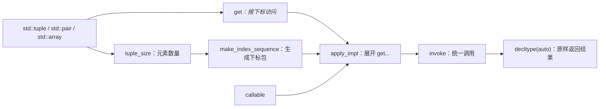

# C++17 `std::apply`：从 tuple 展开到 GCC 源码

`std::apply` 是 C++17 在 `<tuple>` 中加入的高阶函数。它接收一个可调用对象和一个 tuple-like 对象，把后者的所有元素展开成实参，再调用前者。

```cpp
auto arguments = std::make_tuple(10, 20);

const int result = std::apply(
    [](int left, int right) {
        return left + right;
    },
    arguments);
```

上面的调用可以近似理解为：

```cpp
const int result = std::invoke(
    callable,
    std::get<0>(arguments),
    std::get<1>(arguments));
```

先记住几个结论：

- `std::apply` **不是 `std::tuple` 的成员函数**，而是建立在 `tuple_size`、`get` 和调用协议之上的自由函数。
- 它会使用 tuple 中的**全部元素**，元素顺序就是 `get<0>`、`get<1>`、……的顺序。
- tuple 的长度在编译期已知，因此源码使用 `index_sequence<0, 1, ...>` 展开参数，不需要运行时循环。
- `std::apply` 使用完美转发保留 callable、tuple 和 tuple 元素的值类别；是否发生复制或移动，最终取决于传参方式和 callable 的形参。
- 调用最终由 `std::invoke` 语义完成，所以除了函数和 Lambda，也支持函数对象、成员函数指针和成员变量指针。
- C++17 中标准库直接保证可用于 `std::tuple`、`std::pair` 和 `std::array`。自定义“类 tuple 类型”存在后文所述的兼容性边界。

## 接口

使用 `std::apply` 需要包含 `<tuple>`：

```cpp
#include <tuple>
```

### 原型

```cpp
template <class F, class Tuple>
constexpr decltype(auto) apply(F&& f, Tuple&& t);
```

本机 GCC 11.4.0 的实现还根据 callable 是否可能抛出异常，为函数计算条件 `noexcept`。

### 参数

| 参数 | 类型 | 含义 |
| --- | --- | --- |
| `f` | `F&&` | 要调用的 callable（可调用对象），可以是函数、函数对象、Lambda 或成员指针。这里是 forwarding reference（转发引用）。 |
| `t` | `Tuple&&` | 提供全部实参的 tuple-like 对象，同样是转发引用。C++17 中常用的标准类型是 `std::tuple`、`std::pair` 和 `std::array`。 |

模板形参名 `Tuple` 不代表参数必须是 `std::tuple`。实现真正需要的是：

- `std::tuple_size_v<std::remove_reference_t<Tuple>>` 可以给出元素数量；
- 对每个合法下标 `I`，`std::get<I>(std::forward<Tuple>(t))` 都是合法表达式；
- `f` 可以接受这些 `get` 表达式产生的所有实参。

### 返回值

返回值就是调用 callable 得到的结果。返回类型写成 `decltype(auto)`，因此能够保留：

- 普通值，例如 `int`；
- 左值引用，例如 `int&`；
- 右值引用，例如 `T&&`；
- `void`。

`std::apply` 不会额外包装返回结果。

```cpp
#include <cassert>
#include <tuple>

struct Task {
    int priority;
};

int main() {
    Task task{3};

    // std::tie(task) 创建 tuple<Task&>，没有复制 task。
    // 成员变量指针调用的结果是 int&，apply 的 decltype(auto) 会保留该引用。
    int& priority = std::apply(&Task::priority, std::tie(task));
    priority = 9;

    assert(task.priority == 9);
}
```

这里需要特别注意生命周期：如果 callable 返回对 tuple 内部对象的引用，那么该引用不能比被引用对象活得更久。

### 特性测试宏

支持 C++17 `std::apply` 的标准库会定义：

```cpp
__cpp_lib_apply == 201603L
```

可以通过 `<version>` 或提供该功能的标准头文件进行检查：

```cpp
#include <tuple>

static_assert(__cpp_lib_apply >= 201603L);
```

## `std::apply` 位于哪一层

`std::apply` 和 `std::tuple` 之间不是继承关系。它们属于“数据类型 + 编译期描述 + 访问接口 + 泛型算法”的组合。



各层的职责如下：

| 层级 | 相关接口 | 作用 |
| --- | --- | --- |
| 数据存储 | `tuple`、`pair`、`array` | 保存一组编译期长度固定的元素 |
| 数量描述 | `tuple_size<T>` | 给出元素数量 |
| 类型描述 | `tuple_element<I, T>` | 给出第 `I` 个元素的类型；`apply` 源码没有直接使用它，但它属于 tuple 协议的重要部分 |
| 元素访问 | `get<I>(value)` | 取得第 `I` 个元素，并保留 `const` 和值类别 |
| 下标生成 | `make_index_sequence<N>` | 生成 `0` 到 `N - 1` 的编译期整数包 |
| 参数展开 | `apply` | 把每个 `get<I>` 结果展开为独立实参 |
| 统一调用 | `invoke` | 处理普通 callable、成员函数指针和成员变量指针 |

从类型模型上看，tuple 是 **product type（乘积类型）**：所有字段同时存在。`std::apply` 的职责就是消除这层打包，把乘积类型重新变成一次普通函数调用的参数列表。

## 基础用法：调用普通函数

下面的示例可以独立编译运行：

```cpp
#include <cassert>
#include <tuple>

/**
 * @brief 先把 base 与 offset 相加，再乘以 scale。
 *
 * @param base 基础值。
 * @param offset 加到基础值上的偏移量。
 * @param scale 对相加结果使用的缩放倍数。
 * @return `(base + offset) * scale`。
 */
int calculate(int base, int offset, int scale) {
    return (base + offset) * scale;
}

int main() {
    // tuple 中元素的顺序必须与 calculate 的形参顺序一致。
    const auto arguments = std::make_tuple(10, 2, 3);

    // 等价于 calculate(get<0>(arguments), get<1>(arguments),
    //                  get<2>(arguments))。
    const int result = std::apply(calculate, arguments);

    assert(result == 36);
}
```

这里的 tuple 不是运行时参数数组。`calculate` 的实参数量和每个实参类型都由编译器确定，类型不匹配会产生编译错误。

## 使用泛型 Lambda 处理异构元素

`std::apply` 经常和泛型 Lambda、C++17 fold expression（折叠表达式）一起使用：

```cpp
#include <iostream>
#include <string>
#include <tuple>

int main() {
    const auto record = std::make_tuple(
        std::string{"worker-0"},
        8,
        0.75);

    std::apply(
        [](const auto&... fields) {
            // fields 是函数形参包。
            // 下面的逗号折叠会按从左到右的顺序输出每个字段。
            ((std::cout << fields << '\n'), ...);
        },
        record);
}
```

输出为：

```shell
worker-0
8
0.75
```

这段代码中发生了两次参数包处理：

- `std::apply` 在内部把 `get<0>(record)`、`get<1>(record)` 和 `get<2>(record)` 展开成 Lambda 实参；
- 泛型 Lambda 再把收到的 `fields...` 用折叠表达式逐项处理。

## 用于 `std::pair` 和 `std::array`

虽然接口名位于 `<tuple>`，但它并不只处理 `std::tuple`。

```cpp
#include <array>
#include <cassert>
#include <tuple>
#include <utility>

int main() {
    const std::pair<int, int> rectangle{6, 7};

    const int area = std::apply(
        [](int width, int height) {
            return width * height;
        },
        rectangle);

    assert(area == 42);

    const std::array<int, 4> values{1, 2, 3, 4};

    const int sum = std::apply(
        [](const auto... elements) {
            // 一元左折叠要求参数包非空；这里 array 的长度固定为 4。
            return (elements + ...);
        },
        values);

    assert(sum == 10);
}
```

三种标准 tuple-like 类型的差别主要在存储语义：

| 类型 | 元素数量 | 元素类型 |
| --- | --- | --- |
| `std::tuple<Ts...>` | 编译期固定 | 可以完全不同 |
| `std::pair<T, U>` | 固定为 2 | 可以不同 |
| `std::array<T, N>` | 编译期固定为 `N` | 全部相同 |

对 `std::apply` 而言，它们都能提供编译期元素数量和 `get<I>` 访问。

## 调用成员函数和访问成员变量

如果只把 `apply` 想成 `f(args...)`，成员指针的行为会显得有些特殊。实际上，它遵循的是 `std::invoke` 调用规则。

```cpp
#include <cassert>
#include <functional>
#include <tuple>

class Calculator {
public:
    explicit Calculator(int scale) : mScale(scale) {}

    /**
     * @brief 把 value 与 offset 相加，并使用对象中的比例缩放。
     *
     * @param value 输入值。
     * @param offset 加到输入值上的偏移量。
     * @return `(value + offset) * mScale`。
     */
    [[nodiscard]] int scaleAndAdd(int value, int offset) const noexcept {
        return (value + offset) * mScale;
    }

private:
    int mScale;
};

struct Task {
    int priority;
};

int main() {
    const Calculator calculator{3};

    // 调用成员函数指针时，第一个 tuple 元素表示目标对象；
    // 后续 tuple 元素依次对应成员函数的普通参数。
    const auto function_arguments = std::make_tuple(
        std::cref(calculator),
        10,
        2);

    const int result = std::apply(
        &Calculator::scaleAndAdd,
        function_arguments);

    assert(result == 36);

    Task task{5};

    // 成员变量指针只需要一个对象参数。
    // std::tie 保留 task 的引用，apply 也保留成员访问产生的 int&。
    int& priority = std::apply(&Task::priority, std::tie(task));
    priority = 8;

    assert(task.priority == 8);
}
```

`std::cref(calculator)` 创建 `reference_wrapper<const Calculator>`，避免把整个对象复制进 tuple。`std::invoke` 认识 `reference_wrapper`，因此可以把它当作目标对象使用。

## 引用、修改与移动语义

`std::apply` 的两个形参都是转发引用。内部继续对 tuple 调用 `std::forward`，因此 `get<I>` 产生的引用类型取决于调用时传入的 tuple：

| 传入形式 | tuple 元素通常以何种形式传给 callable |
| --- | --- |
| 可变左值 tuple | `T&` |
| `const` 左值 tuple | `const T&` |
| 非 `const` 右值 tuple | `T&&` |
| `const` 右值 tuple | `const T&&`，通常不能用于真正的移动构造 |

下面的示例分别演示原地修改和移动独占资源：

```cpp
#include <cassert>
#include <memory>
#include <tuple>
#include <utility>

int main() {
    std::tuple<int, int> point{3, 4};

    // point 是可变左值，所以 get 产生 int&。
    // Lambda 显式接收引用，可以直接修改 tuple 内部元素。
    std::apply(
        [](int& x, int& y) {
            x *= 2;
            y *= 2;
        },
        point);

    assert(std::get<0>(point) == 6);
    assert(std::get<1>(point) == 8);

    auto owned_value = std::make_tuple(std::make_unique<int>(42));

    // callable 按值接收 unique_ptr，因此必须把 tuple 作为右值传入。
    // apply 自身不主动移动元素；std::move 只是允许 get 产生右值引用，
    // 真正的移动发生在 unique_ptr 形参构造时。
    const int answer = std::apply(
        [](std::unique_ptr<int> value) {
            return *value;
        },
        std::move(owned_value));

    assert(answer == 42);
    assert(std::get<0>(owned_value) == nullptr);
}
```

如果把 `owned_value` 作为左值传给这个 Lambda，编译器将尝试用 `std::unique_ptr<int>&` 初始化按值形参，而 `unique_ptr` 不可复制，所以代码无法通过编译。

## 编译期调用

`std::apply` 在 C++17 中是 `constexpr`。只要 tuple、callable 和实际运算都满足常量表达式要求，就可以在编译期完成调用。

```cpp
#include <tuple>

constexpr auto values = std::make_tuple(2, 3, 4);

constexpr int product = std::apply(
    [](int x, int y, int z) constexpr {
        return x * y * z;
    },
    values);

static_assert(product == 24);
```

## 一个可复用示例：遍历异构 tuple

`std::apply` 只负责把 tuple 展开。结合折叠表达式，可以在它之上构造 `tuple_for_each`：

```cpp
#include <functional>
#include <iostream>
#include <string>
#include <tuple>
#include <utility>

/**
 * @brief 按 tuple 下标顺序对每个元素调用同一个函数。
 *
 * @tparam Tuple tuple-like 对象类型，包含引用和值类别信息。
 * @tparam Function 可以接受 tuple 中每一种元素类型的 callable 类型。
 * @param tuple 要遍历的 tuple-like 对象；函数不取得其所有权。
 * @param function 立即调用的 callable；其生命周期只需覆盖本次函数调用。
 */
template <typename Tuple, typename Function>
constexpr void tuple_for_each(Tuple&& tuple, Function&& function) {
    std::apply(
        [&function](auto&&... elements) {
            // decltype(elements) 保留每个元素自己的引用和值类别。
            // 逗号折叠保证从左到右依次调用 function。
            (std::invoke(
                 function,
                 std::forward<decltype(elements)>(elements)),
             ...);
        },
        std::forward<Tuple>(tuple));
}

int main() {
    const auto record = std::make_tuple(
        7,
        std::string{"ready"},
        0.5);

    tuple_for_each(record, [](const auto& value) {
        std::cout << value << '\n';
    });
}
```

这个函数要求 `function` 能处理 tuple 中的每一种元素类型。它适合日志、序列化入口、字段检查等异构数据场景，但不等同于运行时容器遍历。

## 本地 GCC 11.4.0 源码

本文参考的本地环境如下：

| 项目 | 内容 |
| --- | --- |
| 编译器 | `g++ (Ubuntu 11.4.0-1ubuntu1~22.04.3) 11.4.0` |
| 实现 | GNU libstdc++ |
| 头文件 | `/usr/include/c++/11/tuple` |
| 核心位置 | `/usr/include/c++/11/tuple:1852` 附近 |
| 调用辅助 | `/usr/include/c++/11/bits/invoke.h` |

下面保留本地头文件中的核心实现，只省略了外围命名空间、条件编译和无关接口：

```cpp
#define __cpp_lib_apply 201603

template <typename _Fn, typename _Tuple, size_t... _Idx>
constexpr decltype(auto)
__apply_impl(_Fn&& __f, _Tuple&& __t, index_sequence<_Idx...>)
{
  return std::__invoke(std::forward<_Fn>(__f),
                       std::get<_Idx>(std::forward<_Tuple>(__t))...);
}

template <typename _Fn, typename _Tuple>
constexpr decltype(auto)
apply(_Fn&& __f, _Tuple&& __t)
noexcept(__unpack_std_tuple<is_nothrow_invocable, _Fn, _Tuple>)
{
  using _Indices
    = make_index_sequence<tuple_size_v<remove_reference_t<_Tuple>>>;
  return std::__apply_impl(std::forward<_Fn>(__f),
                           std::forward<_Tuple>(__t),
                           _Indices{});
}
```

以下名字以下划线开头，是 libstdc++ 的实现细节：

- `std::__apply_impl` 不是标准公共接口；
- `std::__invoke` 是 libstdc++ 内部实现，用户代码应该调用公开的 `std::invoke`；
- `std::__unpack_std_tuple` 用于计算该实现的条件 `noexcept`；
- 不应在业务代码中直接包含 `<bits/invoke.h>`，只需要包含声明公开 API 的标准头文件。

### 第一步：取得 tuple 长度

公共入口先计算：

```cpp
tuple_size_v<remove_reference_t<_Tuple>>
```

假设调用代码是：

```cpp
std::tuple<int, double, const char*> arguments;
std::apply(callable, arguments);
```

由于 `arguments` 是左值，转发引用推导得到的 `_Tuple` 是：

```cpp
std::tuple<int, double, const char*>&
```

`remove_reference_t<_Tuple>` 去掉引用后变成：

```cpp
std::tuple<int, double, const char*>
```

随后 `tuple_size_v` 得到 `3`。

这里不能随意改成 `remove_cvref_t`：它是 C++20 才提供的别名。C++17 源码使用 `remove_reference_t`，而 `tuple_size` 已经为 `const`、`volatile` 等 cv 限定提供了转发特化。

### 第二步：生成编译期下标包

源码用 tuple 长度实例化：

```cpp
using _Indices = std::make_index_sequence<3>;
```

结果等价于：

```cpp
using _Indices = std::index_sequence<0, 1, 2>;
```

`index_sequence` 本身不保存运行时数组。它只是把一组整数编码进类型，目的是让这些整数成为后续模板的参数包 `_Idx...`。

空 tuple 也能正常工作：

```cpp
std::make_index_sequence<0>  // 得到 index_sequence<>
```

此时 `get<_Idx>(...)...` 展开为空参数列表，最终调用一个零参数 callable。

### 第三步：展开每个 `get<I>`

当 `_Idx...` 是 `0, 1, 2` 时：

```cpp
std::get<_Idx>(std::forward<_Tuple>(__t))...
```

展开后可以理解为：

```cpp
std::get<0>(std::forward<_Tuple>(__t)),
std::get<1>(std::forward<_Tuple>(__t)),
std::get<2>(std::forward<_Tuple>(__t))
```

这是 `std::apply` 的核心：**先把元素下标变成模板参数包，再用包展开生成固定数量的函数实参。**

源码对每一次 `get` 都使用 `std::forward<_Tuple>(__t)`，因此：

- 左值 tuple 产生元素左值；
- `const` tuple 产生 `const` 元素引用；
- 非 `const` 右值 tuple 允许元素继续作为右值向下传递。

### 第四步：通过 `std::__invoke` 调用

本地 `/usr/include/c++/11/bits/invoke.h` 中的核心入口是：

```cpp
template<typename _Callable, typename... _Args>
constexpr typename __invoke_result<_Callable, _Args...>::type
__invoke(_Callable&& __fn, _Args&&... __args)
noexcept(__is_nothrow_invocable<_Callable, _Args...>::value)
{
  using __result = __invoke_result<_Callable, _Args...>;
  using __type = typename __result::type;
  using __tag = typename __result::__invoke_type;
  return std::__invoke_impl<__type>(__tag{},
                                    std::forward<_Callable>(__fn),
                                    std::forward<_Args>(__args)...);
}
```

`__invoke_result` 除了计算返回类型，还选择内部调用标签。不同标签最终处理不同表达式：

| callable 类型 | 近似调用形式 |
| --- | --- |
| 普通函数、Lambda、函数对象 | `f(args...)` |
| 成员函数指针，对象或引用 | `(object.*member_function)(args...)` |
| 成员函数指针，指针或可解引用对象 | `((*pointer).*member_function)(args...)` |
| 成员变量指针，对象或引用 | `object.*member_object` |
| 成员变量指针，指针或可解引用对象 | `(*pointer).*member_object` |

这解释了为什么前面的成员函数示例要把目标对象放在 tuple 的第一个位置，也解释了为什么 `apply` 能返回成员变量引用。

### 第五步：原样返回调用结果

`__apply_impl` 和 `apply` 都使用 `decltype(auto)`。例如：

```cpp
decltype(auto) result = std::__invoke(...);
```

如果 `std::__invoke` 的结果是 `int&`，`apply` 也返回 `int&`；如果结果是 `void`，`apply` 也返回 `void`。实现不创建额外的结果对象。

## 去掉实现细节后的等价版本

下面用公开的 C++17 API 写一个教学版本。它不是标准库替代品，但完整保留了理解 `std::apply` 所需的核心结构。

```cpp
#include <functional>
#include <tuple>
#include <type_traits>
#include <utility>

namespace demo {

/**
 * @brief 根据编译期下标取出 tuple 元素，并展开为 callable 的实参。
 *
 * @tparam Function callable 类型，包含引用和值类别信息。
 * @tparam Tuple tuple-like 对象类型，包含引用和值类别信息。
 * @tparam Indices 要访问的编译期元素下标。
 * @param function 要调用的 callable。
 * @param tuple 提供调用实参的 tuple-like 对象。
 * @param indices 只用于模板推导的空对象，不携带运行时数据。
 * @return `std::invoke` 的结果，并保留其引用类型和值类别。
 */
template <typename Function, typename Tuple, std::size_t... Indices>
constexpr decltype(auto) apply_impl(
    Function&& function,
    Tuple&& tuple,
    std::index_sequence<Indices...> indices)
    noexcept(noexcept(std::invoke(
        std::forward<Function>(function),
        std::get<Indices>(std::forward<Tuple>(tuple))...))) {
    // indices 的值不在运行时使用；命名它只是为了说明参数含义。
    static_cast<void>(indices);

    return std::invoke(
        std::forward<Function>(function),
        std::get<Indices>(std::forward<Tuple>(tuple))...);
}

/**
 * @brief 把 tuple-like 对象的所有元素展开后调用 callable。
 *
 * @tparam Function callable 类型，包含引用和值类别信息。
 * @tparam Tuple tuple-like 对象类型，包含引用和值类别信息。
 * @param function 要调用的 callable。
 * @param tuple 提供全部调用实参的 tuple-like 对象。
 * @return callable 的调用结果，并保留其引用类型和值类别。
 */
template <typename Function, typename Tuple>
constexpr decltype(auto) apply(Function&& function, Tuple&& tuple)
    noexcept(noexcept(apply_impl(
        std::forward<Function>(function),
        std::forward<Tuple>(tuple),
        std::make_index_sequence<
            std::tuple_size_v<std::remove_reference_t<Tuple>>>{}))) {
    constexpr std::size_t tuple_size =
        std::tuple_size_v<std::remove_reference_t<Tuple>>;

    return apply_impl(
        std::forward<Function>(function),
        std::forward<Tuple>(tuple),
        std::make_index_sequence<tuple_size>{});
}

}  // namespace demo
```

这个版本和 GCC 11 实现的结构相同：

1. 公共入口通过 `tuple_size_v` 得到元素数量；
2. `make_index_sequence` 把数量变成下标参数包；
3. `apply_impl` 展开 `get<Indices>(tuple)...`；
4. `std::invoke` 执行最终调用；
5. `decltype(auto)` 和 `std::forward` 保留返回类型及实参值类别。

## GCC 11 中的 `noexcept` 计算

本机实现的公共入口带有：

```cpp
noexcept(__unpack_std_tuple<is_nothrow_invocable, _Fn, _Tuple>)
```

对 `std::tuple<Elements...>`，内部变量模板把 tuple 元素类型展开到 `is_nothrow_invocable`，近似判断：

```cpp
std::is_nothrow_invocable_v<Function, Elements...>
```

cv 限定和引用也会传播到 `Elements...`。例如左值 `tuple<int>` 会按 `int&` 检查，`const` 左值 `tuple<int>` 会按 `const int&` 检查。

GCC 11 这段辅助实现只对 `std::tuple` 的若干 cv/ref 形式提供特化；其他类型使用默认的 `false`。因此在当前本地版本中，即使对 `std::pair` 或 `std::array` 的实际调用不会抛异常，`noexcept(std::apply(...))` 也可能得到 `false`。这是阅读特定 libstdc++ 版本时应区分的**实现细节**，不要把它误解为 `pair` 或 `array` 不能使用 `apply`。

## 常见错误与边界

### callable 必须接收全部元素

`std::apply` 不会自动丢弃多余元素，也不会只取 callable 需要的前几个元素。

```cpp
const auto values = std::make_tuple(1, 2, 3);

// 错误：Lambda 只有两个形参，但 apply 会展开三个实参。
// std::apply([](int x, int y) { return x + y; }, values);
```

如果只需要部分字段，应明确使用 `std::get`，或者先构造只包含目标字段的新 tuple。

### `std::make_tuple` 默认保存值

`std::make_tuple` 通常会 decay（退化）参数并保存值。希望保存引用时，可以使用 `std::tie`、`std::ref` 或明确声明引用 tuple。

```cpp
int value = 10;

auto copied = std::make_tuple(value);  // 保存 int 副本。
auto referred = std::tie(value);       // 保存 int& 引用语义。

std::apply([](int& x) { x = 20; }, referred);
// value 现在是 20，copied 中的副本仍然是 10。
```

`std::forward_as_tuple` 也能保存转发引用，但它可能引用临时对象。把这样的 tuple 保存到当前完整表达式之外，很容易产生悬空引用。

### 移动 tuple 不等于每个元素一定被移动

把 tuple 写成 `std::move(tuple)` 只会让内部 `get<I>` 产生右值引用。callable 如果仍按 `const T&` 接收元素，就不会发生移动；只有后续构造或赋值真正选择移动操作时，元素状态才会改变。

### 返回引用时要检查生命周期

下面的写法会返回对临时 tuple 内部元素的引用，完整表达式结束后引用立即悬空：

```cpp
// 错误示例：临时 tuple 在分号处销毁。
// const int& dangling = std::apply(
//     [](const int& value) -> const int& { return value; },
//     std::make_tuple(42));
```

`decltype(auto)` 的价值是忠实保留 callable 返回类型，但它不会替用户管理生命周期。

### 自定义 tuple-like 类型的兼容性

结构化绑定支持通过 `tuple_size`、`tuple_element` 和适当的 `get` 把用户类型适配成“类 tuple 类型”。但在本机 GCC 11 的 `std::apply` 源码中，访问写成了限定名：

```cpp
std::get<_Idx>(...)
```

因此，只给用户命名空间增加一个可由 ADL（实参依赖查找）找到的 `get`，并不足以让该类型可靠地用于这里的 `std::apply`。向 `namespace std` 随意添加函数重载也不是安全、通用的解决办法。

C++17 工程中需要可移植行为时，优先把参数放进标准的 `std::tuple`、`std::pair` 或 `std::array`。如果库需要开放自定义 tuple 协议，可以实现自己的 `apply`，并明确设计 `get` 的查找方式。

### 不要直接依赖双下划线接口

下面这些名字属于 libstdc++ 实现，不是 ISO C++ 公共 API：

```cpp
std::__apply_impl
std::__invoke
std::__unpack_std_tuple
```

它们可能随编译器、标准库或版本变化。业务代码应只使用 `std::apply`、`std::invoke` 等公开接口。

## 与相邻接口的区别

| 接口 | 输入模型 | 核心行为 |
| --- | --- | --- |
| `std::get<I>(tuple)` | 一个 tuple-like 对象 | 取出一个指定位置的元素 |
| `std::apply(f, tuple)` | 一个 callable 和一个 tuple-like 对象 | 展开全部元素并调用 `f` |
| `std::make_from_tuple<T>(tuple)` | 一个 tuple-like 对象 | 展开全部元素并直接构造 `T` |
| `std::visit(visitor, variant...)` | 一个 visitor 和一个或多个 `variant` | 根据运行时激活的候选类型调用 visitor |

`apply` 和 `visit` 外形相似，但处理的数据模型不同：

- tuple 是乘积类型，全部元素同时存在，`apply` 展开全部元素；
- variant 是和类型，某一时刻只有一个候选项激活，`visit` 要先进行运行时分派。

## 何时适合使用

适合使用 `std::apply` 的情况包括：

- 参数已经以 `tuple`、`pair` 或 `array` 形式保存，现在需要调用现有函数；
- 编写与 tuple 长度无关的泛型工具，例如日志、字段检查或序列化适配；
- 需要把工厂参数先打包，稍后统一调用；
- 需要用 tuple 携带目标对象和普通实参，再调用成员函数指针；
- 需要结合折叠表达式处理异构字段。

以下情况通常不适合：

- 数据长度在运行时变化，例如 `std::vector<T>`；这类数据应使用迭代器、范围或标准算法；
- 只需要访问一两个已知字段，直接使用命名成员或 `std::get` 往往更清楚；
- tuple 字段很多且语义依赖位置，导致调用点难以理解；此时具名结构体通常比继续扩展 tuple 更合适。

## 总结

`std::apply` 的实现很短，但连接了多项重要的 C++17 机制：

```cpp
tuple_size
    -> make_index_sequence
    -> get<Indices>(tuple)...
    -> invoke(callable, arguments...)
    -> decltype(auto)
```

理解它时，重点不是背诵几行源码，而是建立下面的模型：

> tuple 把一组不同类型的实参编码成一个对象；`index_sequence` 在编译期生成位置；参数包展开把这些位置恢复成独立实参；`invoke` 完成统一调用；完美转发和 `decltype(auto)` 负责保留值类别与返回类型。

这套结构也是阅读许多现代 C++ 泛型库实现时会反复遇到的基本模式。
