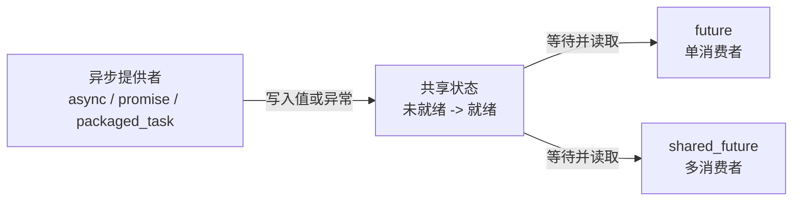

# C++ 异步并发三剑客：`async`、`promise` 与 `packaged_task`

`std::thread` 解决的是“**在哪个线程执行一段代码**”，但裸线程没有返回值通道：线程函数不能直接把结果返回给创建者，异常也不能跨线程自动传播。

`<future>` 在这个基础上提供了一套“**异步结果通道**”：生产者把值或异常写入共享状态，消费者通过 `std::future` 等待并取出结果。围绕这条通道，标准库提供了三种常见生产方式：

- `std::async`：把**调度、执行、结果保存**打包成一次函数调用，适合临时并行任务。
- `std::promise`：只提供**手动写入结果或异常**的接口，执行线程和完成时机完全由程序控制。
- `std::packaged_task`：把**可调用对象与结果通道**绑定起来，但不负责决定在哪执行，适合任务队列和线程池。
- `std::future` / `std::shared_future`：位于消费端，负责等待、超时检查、获取值和重新抛出异常。


本文默认读者已经理解 `std::thread` 的创建、移动、`join()`、`detach()` 和基本同步问题，使用 **C++20** 作为接口基准。

## 先建立选择结论

| 需求 | 首选工具 | 原因 |
| --- | --- | --- |
| 启动一个临时计算并取得返回值 | `std::async(std::launch::async, ...)` | 写法最短，返回值和异常自动进入 `future`。 |
| 由实现决定立即执行还是延迟执行 | `std::async(...)` | 默认策略允许实现选择 `async` 或 `deferred`。 |
| 已经有线程，需要在某个时刻手动报告结果 | `std::promise<T>` | 生产者显式调用 `set_value()` 或 `set_exception()`。 |
| 把“可执行任务”先放入队列，稍后由工作线程执行 | `std::packaged_task<R(Args...)>` | 调用任务时自动保存返回值或异常，调度与结果通道解耦。 |
| 一个结果只允许一个消费者取走 | `std::future<T>` | 只能移动，`get()` 只能消费一次。 |
| 一个结果需要广播给多个消费者 | `std::shared_future<T>` | 可以复制，每个消费者都能等待并多次 `get()`。 |

不要仅仅因为名字里有 `async` 就认为 `std::async` 一定并行。**默认启动策略允许延迟执行**；需要并发时应显式指定 `std::launch::async`。

## 标准版本边界

这组 API 的核心能力在 C++11 就已经出现，C++11 到 C++20 的变化主要是接口约束、类型推导表达方式和少量签名修正，而不是重新设计执行模型。

| 标准 | 主要变化 |
| --- | --- |
| C++11 | 引入 `<future>`、`async`、`promise`、`packaged_task`、`future`、`shared_future`、`launch`、`future_status` 和 `future_error`。 |
| C++14 | 没有改变这组组件的核心模型，主要承接缺陷修正。 |
| C++17 | `async` 的返回类型从 `std::result_of` 表达改为 `std::invoke_result_t`；移除 `packaged_task` 的 allocator 构造接口；`shared_future` 的复制操作成为 `noexcept`。 |
| C++20 | `async` 声明带有 `[[nodiscard]]`，忽略返回的 `future` 更容易触发编译器警告；约束以 `is_constructible_v`、`is_move_constructible_v` 和 `is_invocable_v` 等形式写清。执行语义基本保持不变。 |

下面写出的原型以 C++20 为准。`std::packaged_task` 的类模板实参推导指引由 LWG 3117 在 C++23 阶段补入，部分标准库将它作为缺陷修正回溯到了旧语言模式；严格面向可移植 C++20 代码时，不应依赖这种回溯实现，推荐显式写出 `std::packaged_task<int(int)>` 这类函数签名。

## 核心模型：共享状态

理解这套 API 的关键不是先背三个类，而是理解 **shared state（共享状态）**。

共享状态通常位于生产者和消费者对象之外，内部至少保存：

- 当前结果是否已经就绪。
- 一个值、一个 `void` 完成信号，或者一个异常。
- 等待该结果所需的同步状态。
- 对共享状态本身的生命周期管理。



`promise`、`packaged_task` 以及 `async` 创建的内部任务属于**异步提供者**；`future` 和 `shared_future` 属于**异步返回对象**。二者不必是同一个对象，也不必位于同一个线程，它们只是引用同一个共享状态。

### 共享状态的结果只有两条正常路径

- **值路径**：生产者保存 `T`，或者对 `void` 结果只保存“完成”状态。
- **异常路径**：生产者保存 `std::exception_ptr`。消费者调用 `get()` 时，保存的异常在消费线程中重新抛出。

共享状态从“未就绪”变成“就绪”只发生一次。成功设置结果的操作与成功观察到就绪状态的等待操作之间存在同步关系，因此生产者在完成前的写入，对成功返回的 `wait()` 或 `get()` 一侧可见。

```cpp
std::promise<int> result_promise;
std::future<int> result_future = result_promise.get_future();

// 二者引用同一个共享状态，而不是直接互相调用。
```

### 对象生命周期不等于共享状态生命周期

- 移动 `promise`、`packaged_task` 或 `future` 时，转移的是对共享状态的引用；被移动对象随后通常没有共享状态。
- 只要仍有提供者或返回对象引用共享状态，共享状态就可以继续存在。
- `promise` 或 `packaged_task` 在尚未提供结果时销毁，会**放弃共享状态**：共享状态中保存 `future_error(future_errc::broken_promise)` 并变为就绪，而不是让消费者永久等待。
- 普通 `future` 析构通常不等待；但当共享状态由 `std::async` 创建、任务尚未完成，并且该对象释放的是最后一个共享状态引用时，释放操作可能阻塞。

## 消费端：`std::future` 与 `std::shared_future`

两类返回对象都定义在 `<future>` 中。定时等待还会使用 `<chrono>` 中的时间类型。

### `future` 的 C++20 接口

```cpp
namespace std {

template<class R>
class future {
public:
    future() noexcept;
    future(future&& rhs) noexcept;
    future(const future&) = delete;
    ~future();

    future& operator=(future&& rhs) noexcept;
    future& operator=(const future&) = delete;

    shared_future<R> share() noexcept;

    // 三种标准特化的返回类型不同。
    R get();                    // future<R>
    R& get();                   // future<R&>
    void get();                 // future<void>

    bool valid() const noexcept;
    void wait() const;

    template<class Rep, class Period>
    future_status wait_for(
        const chrono::duration<Rep, Period>& rel_time) const;

    template<class Clock, class Duration>
    future_status wait_until(
        const chrono::time_point<Clock, Duration>& abs_time) const;
};

}  // namespace std
```

实际标准库分别提供 `future<R>`、`future<R&>` 和 `future<void>`，上面的三个 `get()` 是为了集中展示三种特化的接口，不会同时出现在同一个实例中。

#### 构造、移动和状态查询

| 原型 | 参数 | 返回值 / 效果 | 约束与异常 |
| --- | --- | --- | --- |
| `future() noexcept` | 无 | 创建没有共享状态的对象，`valid() == false`。 | 不抛异常。 |
| `future(future&& rhs) noexcept` | `rhs`：被转移的返回对象 | 接管 `rhs` 的共享状态；完成后 `rhs.valid() == false`。 | `future` 不可复制。 |
| `future& operator=(future&& rhs) noexcept` | `rhs`：被转移的返回对象 | 先释放当前状态，再接管 `rhs` 的状态，返回 `*this`。 | 不抛异常。 |
| `~future()` | 无 | 释放当前共享状态引用。 | 对 `async` 创建的未完成状态，释放最后一个引用时可能等待。 |
| `bool valid() const noexcept` | 无 | 仅当对象引用共享状态时返回 `true`。 | `true` 不代表结果已经就绪。 |
| `shared_future<R> share() noexcept` | 无 | 移动共享状态并返回 `shared_future<R>`。 | 调用后原 `future.valid() == false`。 |

`valid()` 只回答“有没有共享状态”，不回答“结果完成没有”。查询是否完成应使用 `wait_for()` 或 `wait_until()`。

#### 获取结果

| 原型 | 返回值 | 行为 |
| --- | --- | --- |
| `R future<R>::get()` | 将共享状态中的 `R` 以移动方式返回。 | 等待就绪；若保存的是异常则重新抛出；最后释放共享状态。 |
| `R& future<R&>::get()` | 返回共享状态中保存的引用。 | 被引用对象必须仍然存活；同步结果通道不会延长该对象生命周期。 |
| `void future<void>::get()` | 无。 | 等待完成并检查异常，因此即使没有业务返回值也不应只调用 `wait()` 后丢弃。 |

`future::get()` 是**破坏性消费**：无论取得值还是重新抛出任务异常，调用后该 `future` 都不再拥有共享状态。需要多次读取时，先调用 `share()`。

#### 等待接口与 `future_status`

```cpp
namespace std {

enum class future_status {
    ready,
    timeout,
    deferred
};

}  // namespace std
```

| 原型 | 参数 | 返回值 | 行为 |
| --- | --- | --- | --- |
| `void wait() const` | 无 | 无 | 一直阻塞到共享状态就绪；如果状态来自 `launch::deferred`，可能在当前等待线程中执行任务。 |
| `wait_for(const chrono::duration<Rep, Period>& rel_time) const` | `rel_time`：最长相对等待时长 | `ready`、`timeout` 或 `deferred` | 延迟任务直接返回 `deferred`，不会因这次定时等待而开始执行。 |
| `wait_until(const chrono::time_point<Clock, Duration>& abs_time) const` | `abs_time`：最长等待到的绝对时间点 | `ready`、`timeout` 或 `deferred` | 除时间表达方式外，与 `wait_for()` 的状态语义相同。 |

`wait()` 只等待，不提取值，也不会重新抛出共享状态里的任务异常。最终需要观察结果或异常时仍应调用 `get()`。

```cpp
#include <chrono>
#include <future>
#include <iostream>
#include <thread>

int main() {
    using namespace std::chrono_literals;

    std::future<int> result = std::async(std::launch::async, [] {
        std::this_thread::sleep_for(50ms);
        return 42;
    });

    if (result.wait_for(10ms) == std::future_status::timeout) {
        std::cout << "任务仍在执行\n";
    }

    // get() 会继续等待，并消费唯一一次结果。
    std::cout << "result = " << result.get() << '\n';
}
```

### 无效 `future` 的操作边界

以下操作会使 `future` 失去共享状态：

- 默认构造后还没有被赋予有效状态。
- 被移动后。
- 调用 `get()` 后。
- 调用 `share()` 后。

在 C++20 中，对无效 `future` 调用除析构、移动赋值、`share()`、`valid()` 以外的成员函数属于未定义行为。实现被建议抛出 `future_error(future_errc::no_state)`，但程序不能依赖这个诊断。

### `shared_future` 的 C++20 接口

```cpp
namespace std {

template<class R>
class shared_future {
public:
    shared_future() noexcept;
    shared_future(const shared_future& rhs) noexcept;
    shared_future(future<R>&& rhs) noexcept;
    shared_future(shared_future&& rhs) noexcept;
    ~shared_future();

    shared_future& operator=(const shared_future& rhs) noexcept;
    shared_future& operator=(shared_future&& rhs) noexcept;

    const R& get() const;       // shared_future<R>
    R& get() const;             // shared_future<R&>
    void get() const;           // shared_future<void>

    bool valid() const noexcept;
    void wait() const;

    template<class Rep, class Period>
    future_status wait_for(
        const chrono::duration<Rep, Period>& rel_time) const;

    template<class Clock, class Duration>
    future_status wait_until(
        const chrono::time_point<Clock, Duration>& abs_time) const;
};

}  // namespace std
```

`shared_future` 的 `valid()`、`wait()`、`wait_for()` 和 `wait_until()` 与 `future` 语义相同，关键差异在所有权和 `get()`：

- `shared_future` 可以复制；复制品引用同一个共享状态。
- `get()` 不消费状态，可以调用多次；如果保存的是异常，每次 `get()` 都会重新抛出。
- `shared_future<R>::get()` 返回 `const R&`，避免每个消费者都移动或复制结果。
- 返回引用的生命周期不超过共享状态；不要把该引用保存到比所有相关 `shared_future` 更长寿的对象中。
- 共享状态本身支持多消费者等待，但这不自动保证 `R` 的可变操作线程安全。推荐每个线程持有自己的 `shared_future` 副本，并把普通 `R` 当作只读值使用。

构造和赋值接口的效果如下：

| 原型 | 参数 | 返回值 / 效果 |
| --- | --- | --- |
| `shared_future() noexcept` | 无 | 创建无共享状态对象，`valid() == false`。 |
| `shared_future(const shared_future& rhs) noexcept` | `rhs`：要共享的返回对象 | 引用与 `rhs` 相同的共享状态；`rhs` 保持有效。 |
| `shared_future(future<R>&& rhs) noexcept` | `rhs`：独占返回对象 | 接管 `rhs` 的状态；完成后 `rhs.valid() == false`。 |
| `shared_future(shared_future&& rhs) noexcept` | `rhs`：被移动的共享返回对象 | 接管 `rhs` 的状态；完成后 `rhs.valid() == false`。 |
| `operator=(const shared_future& rhs) noexcept` | `rhs`：要共享的返回对象 | 释放当前状态，改为共享 `rhs` 的状态，返回 `*this`。 |
| `operator=(shared_future&& rhs) noexcept` | `rhs`：被移动的共享返回对象 | 释放当前状态并接管 `rhs` 的状态，返回 `*this`。 |
| `~shared_future()` | 无 | 释放一个共享状态引用；最后一个引用释放后销毁共享状态。 |

默认构造或被移动后的 `shared_future` 没有共享状态。C++20 只允许对这种无效对象执行析构、复制/移动赋值和 `valid()`；调用 `get()` 或等待函数属于未定义行为。实现被建议诊断为 `future_error(no_state)`，但程序同样不能依赖一定抛出。

```cpp
#include <future>
#include <iostream>
#include <thread>
#include <vector>

int main() {
    std::promise<int> source;
    std::shared_future<int> shared_result = source.get_future().share();

    std::vector<std::thread> consumers;
    for (int consumer_id = 0; consumer_id < 3; ++consumer_id) {
        // 每个线程保存一个 shared_future 副本。
        consumers.emplace_back([consumer_id, shared_result] {
            std::cout << "consumer " << consumer_id
                      << ": " << shared_result.get() << '\n';
        });
    }

    source.set_value(42);

    for (std::thread& consumer : consumers) {
        consumer.join();
    }
}
```

## `std::async`：把执行与结果通道一起创建

`std::async` 是最高层的入口。它接收一个可调用对象及其参数，创建共享状态，并返回与该状态关联的 `future`。

### C++20 原型

```cpp
namespace std {

template<class F, class... Args>
[[nodiscard]]
future<invoke_result_t<decay_t<F>, decay_t<Args>...>>
async(F&& f, Args&&... args);

template<class F, class... Args>
[[nodiscard]]
future<invoke_result_t<decay_t<F>, decay_t<Args>...>>
async(launch policy, F&& f, Args&&... args);

}  // namespace std
```

**模板参数**：

- `F`：可调用对象的推导类型，可以是函数、函数对象、Lambda、成员函数指针等。
- `Args...`：传给可调用对象的参数类型包。
- 返回类型由 `std::invoke_result_t<std::decay_t<F>, std::decay_t<Args>...>` 推导，可以是值、引用或 `void`。

**函数参数**：

- `policy`：启动策略位掩码，决定立即异步执行、延迟执行，或允许实现二选一。
- `f`：待调用对象，使用转发引用接收；`async` 会在返回前将其衰减后复制或移动到内部状态。
- `args...`：调用参数；同样在 `async` 返回前完成衰减复制或移动。

**返回值**：

- 返回 `std::future<R>`，其中 `R` 是按衰减后的可调用对象和参数执行 `std::invoke` 所得到的类型。
- 可调用对象正常返回时，结果进入共享状态；抛出异常时，异常进入共享状态并在 `future::get()` 中重新抛出。

**C++20 约束**：

- `decay_t<F>` 必须能由传入的 `F` 构造并满足移动构造要求。
- 每个 `decay_t<Args>` 必须能由对应实参构造并满足移动构造要求。
- `decay_t<F>` 必须能以这些衰减参数通过 `std::invoke` 调用。

**调用 `async` 本身可能抛出的异常**：

- 内部状态分配失败时抛出 `std::bad_alloc`。
- 仅指定 `std::launch::async` 且无法启动新执行线程时，抛出 `std::system_error`，错误条件为 `std::errc::resource_unavailable_try_again`。
- 保存 `f` 和 `args...` 时执行的用户类型复制或移动，也可能在 `async` 调用阶段暴露相应异常；这与任务开始执行后保存到 `future` 的异常不同。C++20 的原始措辞在这一点上不够清晰，后来由 LWG 3582 补充明确，因此工程代码仍应把任务状态构造视为可能失败的同步步骤。

### `std::launch` 启动策略

```cpp
namespace std {

enum class launch : /* 未指定的底层类型 */ {
    async = /* 未指定值 */,
    deferred = /* 未指定值 */
};

}  // namespace std
```

`launch` 是位掩码类型，不要依赖枚举的具体整数值。

| 策略 | 执行线程 | 开始时机 | 重要语义 |
| --- | --- | --- | --- |
| `std::launch::async` | 如同在一个由内部 `std::thread` 表示的新执行线程中 | `async` 调用期间完成任务状态创建后即可执行 | `get()` / `wait()` 会像 `join()` 一样等待关联线程完成；它不是线程池接口。 |
| `std::launch::deferred` | 第一个非定时等待者所在的线程 | 第一次调用 `get()` 或 `wait()` 等非定时等待函数时 | 如果从不进行非定时等待，任务可能永远不执行；`wait_for()` 返回 `deferred`。 |


传入既没有标准策略位也没有实现扩展策略位的值，在 C++20 中属于未定义行为。

### 需要并发时显式指定 `launch::async`

```cpp
#include <future>
#include <iostream>
#include <numeric>
#include <vector>

long long sum_range(const std::vector<int>& values,
                    std::size_t begin,
                    std::size_t end) {
    return std::accumulate(values.begin() + static_cast<std::ptrdiff_t>(begin),
                           values.begin() + static_cast<std::ptrdiff_t>(end),
                           0LL);
}

int main() {
    const std::vector<int> values{1, 2, 3, 4, 5, 6, 7, 8};
    const std::size_t middle = values.size() / 2;

    std::future<long long> left_sum = std::async(
        std::launch::async,
        sum_range,
        std::cref(values),
        0,
        middle);

    // 主线程同时处理另一半。
    const long long right_sum = sum_range(values, middle, values.size());
    const long long total = left_sum.get() + right_sum;

    std::cout << "total = " << total << '\n';
}
```

这里使用 `std::cref(values)` 是因为 `async` 默认保存参数副本。它只保存引用包装器，不拥有 `values`；主线程调用 `left_sum.get()` 前必须保证 `values` 仍然存活，并且不能与异步只读操作并发修改同一个 `vector`。

### 默认策略不承诺并发

```cpp
std::future<int> result = std::async([] {
    return expensive_computation();
});
```

上面等价于允许 `async | deferred`。实现可以启动线程，也可以直到 `result.get()` 时才在调用 `get()` 的线程中执行。因此：

- 只是想利用并行性时，使用 `std::launch::async`。
- 确实接受惰性求值时，才使用默认策略或 `std::launch::deferred`。
- 不要用默认策略编写依赖任务及时启动的锁、条件变量或生产者—消费者协议，否则实现选择 `deferred` 时可能死锁。

### 临时 `future` 可能让两个任务串行化

```cpp
// 两个返回值都没有保存。
std::async(std::launch::async, first_task);
std::async(std::launch::async, second_task);
```

每个表达式末尾都会销毁临时 `future`。如果它释放的是 `async` 共享状态的最后一个引用，析构过程可能等到任务完成，于是 `second_task` 可能在 `first_task` 结束后才启动。

正确做法是保存句柄并显式决定等待点：

```cpp
std::future<void> first = std::async(std::launch::async, first_task);
std::future<void> second = std::async(std::launch::async, second_task);

first.get();
second.get();
```

C++20 给 `async` 加上 `[[nodiscard]]`，正是为了让忽略返回值更容易被诊断。

## `std::promise`：手动完成异步结果

`std::promise<R>` 是一个异步提供者。构造 `promise` 时创建共享状态，`get_future()` 取得消费端，然后由程序在任意合适位置显式写入值或异常。

它本身**不创建线程、不接收可调用对象，也不执行任务**。因此它适合已经拥有执行上下文，只缺少一次性结果通道的场景，例如：

- 给已有 `std::thread` 增加返回值和异常通道。
- 将回调式 API 的一次完成事件转换成 `future`。
- 一个线程在满足业务条件后，手动唤醒等待结果的线程。
- 只需要发送“完成”信号时使用 `promise<void>`。

### C++20 类模板与接口原型

```cpp
namespace std {

template<class R>
class promise {
public:
    promise();

    template<class Allocator>
    promise(allocator_arg_t, const Allocator& allocator);

    promise(promise&& rhs) noexcept;
    promise(const promise&) = delete;
    ~promise();

    promise& operator=(promise&& rhs) noexcept;
    promise& operator=(const promise&) = delete;
    void swap(promise& other) noexcept;

    future<R> get_future();

    // promise<R> 的值接口。
    void set_value(const R& value);
    void set_value(R&& value);
    void set_value_at_thread_exit(const R& value);
    void set_value_at_thread_exit(R&& value);

    // 三种特化共有的异常接口。
    void set_exception(exception_ptr exception);
    void set_exception_at_thread_exit(exception_ptr exception);
};

template<class R>
class promise<R&> {
public:
    // 构造、移动、swap、get_future 和异常接口同上。
    void set_value(R& value);
    void set_value_at_thread_exit(R& value);
};

template<>
class promise<void> {
public:
    // 构造、移动、swap、get_future 和异常接口同上。
    void set_value();
    void set_value_at_thread_exit();
};

template<class R>
void swap(promise<R>& left, promise<R>& right) noexcept;

template<class R, class Allocator>
struct uses_allocator<promise<R>, Allocator> : true_type {};

}  // namespace std
```

这里只对三个特化中不同的值接口做了拆分；它们都拥有构造、移动、`get_future()`、`set_exception()` 等公共能力。

非成员 `swap(left, right)` 的效果等同于 `left.swap(right)`；`uses_allocator` 特化表明 `promise` 支持 uses-allocator 构造协议。

### 构造、所有权和 `get_future()`

| 原型 | 参数 | 返回值 / 效果 | 异常与约束 |
| --- | --- | --- | --- |
| `promise()` | 无 | 创建新的共享状态。 | 分配失败可抛 `std::bad_alloc`。 |
| `promise(allocator_arg_t, const Allocator& allocator)` | `allocator`：为共享状态分配内存的 allocator | 使用指定 allocator 创建共享状态。 | `Allocator` 满足 C++17 allocator 要求；分配异常向外传播。 |
| `promise(promise&& rhs) noexcept` | `rhs`：被转移的提供者 | 接管 `rhs` 的共享状态；`rhs` 随后没有共享状态。 | 不抛异常，不可复制。 |
| `promise& operator=(promise&& rhs) noexcept` | `rhs`：被转移的提供者 | 放弃当前状态，再接管 `rhs` 的状态，返回 `*this`。 | 当前状态尚未就绪时，其消费者会观察到 `broken_promise`。 |
| `void swap(promise& other) noexcept` | `other`：另一个同类型 `promise` | 交换两者引用的共享状态。 | 不抛异常。 |
| `future<R> get_future()` | 无 | 返回与当前 `promise` 共享状态关联的唯一 `future<R>`。 | 同一共享状态只能成功调用一次；重复调用抛 `future_already_retrieved`；没有状态则抛 `no_state`。 |
| `~promise()` | 无 | 放弃并释放当前共享状态。 | 未设置结果时，关联 `future` 变为就绪并在 `get()` 时抛 `broken_promise`。析构函数本身不把该异常抛到当前线程。 |

`get_future()` 可以发生在设置结果之前或之后。先 `set_value()` 再 `get_future()` 仍然合法，只要该共享状态此前没有取过 `future`。

### 设置值

| 原型 | 参数 | 返回值 / 效果 | 异常与约束 |
| --- | --- | --- | --- |
| `void promise<R>::set_value(const R& value)` | `value`：复制进共享状态的值 | 无；原子地保存值并使状态就绪。 | 复制 `R` 的异常可能传播；重复满足状态抛 `promise_already_satisfied`；无状态抛 `no_state`。 |
| `void promise<R>::set_value(R&& value)` | `value`：移动进共享状态的值 | 无；保存值并使状态就绪。 | 移动 `R` 的异常可能传播；状态错误同上。 |
| `void promise<R&>::set_value(R& value)` | `value`：要保存的左值引用 | 无；保存引用并使状态就绪。 | 不延长 `value` 生命周期；状态错误同上。 |
| `void promise<void>::set_value()` | 无 | 无；不保存业务值，只把状态设为就绪。 | 状态错误同上。 |

同一个共享状态只能保存一次结果。结果可以是值或异常，两条路径互斥：调用过 `set_value()` 后不能再调用 `set_exception()`，反之亦然。

### 设置异常

```cpp
void set_exception(std::exception_ptr exception);
```

- **参数**：`exception` 是要保存的非空 `std::exception_ptr`，常由 `std::current_exception()` 或 `std::make_exception_ptr()` 获得。在 C++20 中传入空指针违反前置条件。
- **返回值**：无。成功时保存异常并立即使共享状态就绪。
- **异常**：共享状态已有值或异常时抛 `future_error(future_errc::promise_already_satisfied)`；对象没有共享状态时抛 `future_error(future_errc::no_state)`。

### 在线程退出时才使状态就绪

```cpp
void promise<R>::set_value_at_thread_exit(const R& value);
void promise<R>::set_value_at_thread_exit(R&& value);
void promise<R&>::set_value_at_thread_exit(R& value);
void promise<void>::set_value_at_thread_exit();

void set_exception_at_thread_exit(std::exception_ptr exception);
```

这些函数会立即保存值或异常，但不会立即把共享状态标记为就绪。状态被安排在线程退出时、该线程所有 `thread_local` 对象销毁之后变为就绪。

- **用途**：消费者不仅依赖计算完成，还必须确认生产线程的线程局部清理已经结束。
- **返回值**：均为 `void`。
- **异常与约束**：与相应的立即设置接口一致；同一个共享状态仍然只能满足一次。
- **注意**：调用后状态虽然尚未就绪，却已经被满足；不能再调用另一组 `set_*` 接口。

### 用 `promise` 给 `thread` 增加异常通道

`std::thread` 的入口函数如果让异常逃逸，程序会调用 `std::terminate()`。使用 `promise` 时必须在生产线程内部捕获异常，再显式写入共享状态。

```cpp
#include <exception>
#include <future>
#include <iostream>
#include <stdexcept>
#include <thread>
#include <utility>

/**
 * @brief 执行除法，并通过 promise 返回结果或异常。
 *
 * @param result_promise 当前线程独占的结果提供者。
 * @param numerator 被除数。
 * @param denominator 除数。
 */
void divide_worker(std::promise<int> result_promise,
                   int numerator,
                   int denominator) {
    try {
        if (denominator == 0) {
            throw std::invalid_argument("denominator must not be zero");
        }
        result_promise.set_value(numerator / denominator);
    } catch (...) {
        // 必须在 catch 处理期间取得当前异常。
        result_promise.set_exception(std::current_exception());
    }
}

int main() {
    std::promise<int> result_promise;
    std::future<int> result_future = result_promise.get_future();

    std::thread worker(
        divide_worker,
        std::move(result_promise),
        42,
        0);

    try {
        std::cout << result_future.get() << '\n';
    } catch (const std::invalid_argument& error) {
        std::cout << "worker failed: " << error.what() << '\n';
    }

    worker.join();
}
```

`std::promise` 不能复制，因此需要用 `std::move(result_promise)` 把所有权交给工作线程。`future::get()` 重新抛出的仍是原来的 `std::invalid_argument`，不是统一转换成 `future_error`。

### `broken_promise` 防止永久等待

```cpp
#include <future>
#include <iostream>

int main() {
    std::future<int> result;

    {
        std::promise<int> source;
        result = source.get_future();
        // source 未设置结果就离开作用域。
    }

    try {
        static_cast<void>(result.get());
    } catch (const std::future_error& error) {
        if (error.code() == std::make_error_code(
                                std::future_errc::broken_promise)) {
            std::cout << "生产者在提供结果前退出\n";
        }
    }
}
```

这里的异常不是生产者主动抛出的业务异常，而是结果通道的生命周期错误。

## `std::packaged_task`：把可调用对象包装成异步提供者

`std::packaged_task<R(ArgTypes...)>` 保存一个可调用对象和一个共享状态。调用任务的 `operator()` 时，它通过类似 `std::invoke` 的规则执行内部可调用对象：

- 正常返回时，把返回值写入共享状态。
- 抛出异常时，把异常写入共享状态；任务异常不会从 `operator()` 直接逃逸。
- `get_future()` 返回读取该状态的 `future<R>`。

它与 `async` 最关键的区别是：**`packaged_task` 不负责调度**。程序可以立即调用、交给 `std::thread`、放进任务队列，或者移动给某个工作线程。

### C++20 类模板与接口原型

```cpp
namespace std {

template<class>
class packaged_task;  // 主模板不定义。

template<class R, class... ArgTypes>
class packaged_task<R(ArgTypes...)> {
public:
    packaged_task() noexcept;

    template<class F>
    explicit packaged_task(F&& f);

    ~packaged_task();

    packaged_task(const packaged_task&) = delete;
    packaged_task& operator=(const packaged_task&) = delete;

    packaged_task(packaged_task&& rhs) noexcept;
    packaged_task& operator=(packaged_task&& rhs) noexcept;
    void swap(packaged_task& other) noexcept;

    bool valid() const noexcept;
    future<R> get_future();

    void operator()(ArgTypes... args);
    void make_ready_at_thread_exit(ArgTypes... args);
    void reset();
};

template<class R, class... ArgTypes>
void swap(packaged_task<R(ArgTypes...)>& left,
          packaged_task<R(ArgTypes...)>& right) noexcept;

}  // namespace std
```

非成员 `swap(left, right)` 的效果等同于 `left.swap(right)`，返回值为 `void` 且不抛异常。

模板实参必须是**函数类型签名**，例如：

```cpp
std::packaged_task<int(int, int)> add_task;
std::packaged_task<void(std::string)> log_task;
std::packaged_task<const Config&()> config_task;
```

`R` 是写入 `future<R>` 的结果类型，`ArgTypes...` 是以后调用 `task(args...)` 时的形参类型。它们描述包装器对外暴露的调用接口，不要求与原可调用对象的声明逐字相同，只要可按该签名调用且结果可转换为 `R`。

### 构造、移动和状态接口

| 原型 | 参数 | 返回值 / 效果 | 异常与约束 |
| --- | --- | --- | --- |
| `packaged_task() noexcept` | 无 | 创建既没有共享状态也没有内部任务的对象。 | `valid() == false`。 |
| `template<class F> explicit packaged_task(F&& f)` | `f`：要保存的可调用对象 | 创建共享状态，并转发构造内部任务。 | `remove_cvref_t<F>` 不能是当前 `packaged_task` 类型；`F&` 必须能以 `ArgTypes...` 调用并产生兼容 `R`；分配或构造异常向外传播。 |
| `packaged_task(packaged_task&& rhs) noexcept` | `rhs`：被转移任务 | 同时接管任务和共享状态，`rhs` 随后无状态。 | 不可复制。 |
| `packaged_task& operator=(packaged_task&& rhs) noexcept` | `rhs`：被转移任务 | 放弃当前状态，再接管 `rhs` 的任务和状态，返回 `*this`。 | 旧状态未就绪时，旧 `future` 会观察到 `broken_promise`。 |
| `void swap(packaged_task& other) noexcept` | `other`：同签名任务 | 交换内部任务与共享状态。 | 不抛异常。 |
| `bool valid() const noexcept` | 无 | 有共享状态时返回 `true`。 | 不表示任务已执行。 |
| `future<R> get_future()` | 无 | 返回当前共享状态的唯一 `future<R>`。 | 重复取得抛 `future_already_retrieved`；无状态抛 `no_state`。 |
| `~packaged_task()` | 无 | 放弃并释放当前共享状态。 | 尚未执行时，关联 `future` 会观察到 `broken_promise`。 |

C++11/C++14 曾提供接受 allocator 的 `packaged_task` 构造接口及相应 `uses_allocator` 支持，它们从 C++17 起移除。不要把 `promise` 仍保留的 allocator 构造接口误套到 C++20 的 `packaged_task` 上。

### 执行、线程退出完成和复用

#### `operator()`

```cpp
void operator()(ArgTypes... args);
```

- **参数**：`args...` 与类模板签名中的 `ArgTypes...` 对应。签名写成值类型会建立值形参；写成 `T&` / `const T&` 才保留引用语义。
- **返回值**：始终为 `void`。原任务的返回值进入共享状态，只能通过关联 `future<R>` 读取。
- **异常**：内部任务抛出的业务异常被保存，不从本次调用传播；任务无共享状态时抛 `future_error(no_state)`，当前状态已经执行过时抛 `future_error(promise_already_satisfied)`。

#### `make_ready_at_thread_exit()`

```cpp
void make_ready_at_thread_exit(ArgTypes... args);
```

- 立即调用内部任务并保存返回值或异常，但在线程退出、`thread_local` 对象销毁后才把共享状态设为就绪。
- 返回值为 `void`。
- 无状态或重复执行的错误与 `operator()` 相同。

#### `reset()`

```cpp
void reset();
```

- 保留内部可调用对象，为它创建一个**新的共享状态**，使任务可以再次执行。
- 返回值为 `void`。
- 原共享状态会被放弃；若旧状态尚未完成，旧 `future` 将得到 `broken_promise`。
- 调用后必须再次 `get_future()` 才能取得新一轮结果。
- 没有共享状态时抛 `future_error(no_state)`；分配新状态或移动内部任务时也可能抛异常。

`reset()` 复用的是同一个内部可调用对象的后续状态，不保证把有状态函数对象恢复到刚构造时的成员值。

### 把任务交给指定线程执行

```cpp
#include <future>
#include <iostream>
#include <stdexcept>
#include <thread>
#include <utility>

int main() {
    std::packaged_task<int(int, int)> divide_task(
        [](int numerator, int denominator) {
            if (denominator == 0) {
                throw std::invalid_argument(
                    "denominator must not be zero");
            }
            return numerator / denominator;
        });

    std::future<int> result = divide_task.get_future();

    // packaged_task 只能移动；工作线程在这里成为任务执行者。
    std::thread worker(std::move(divide_task), 42, 2);

    try {
        std::cout << "result = " << result.get() << '\n';
    } catch (const std::exception& error) {
        std::cout << "task failed: " << error.what() << '\n';
    }

    worker.join();
}
```

这里 `std::thread` 只负责执行 `packaged_task::operator()`，返回值与异常的保存由任务包装器自动完成。相比手写 `promise`，它省去了 `try-catch + set_value/set_exception`。

### `reset()` 之后再次执行

```cpp
#include <future>
#include <iostream>

int main() {
    std::packaged_task<int()> next_value(
        [counter = 0]() mutable {
            return ++counter;
        });

    std::future<int> first = next_value.get_future();
    next_value();
    std::cout << first.get() << '\n';  // 1

    next_value.reset();
    std::future<int> second = next_value.get_future();
    next_value();
    std::cout << second.get() << '\n'; // 2：闭包状态没有回到 0。
}
```

### 在线程池中的典型形态

线程池的 `submit()` 经常先把带参数任务绑定为无参数任务，再把它的 `operator()` 放入队列：

```cpp
using ReturnType = std::invoke_result_t<F, Args...>;

std::packaged_task<ReturnType()> task(
    [function = std::forward<F>(function),
     ... arguments = std::forward<Args>(arguments)]() mutable
        -> ReturnType {
        return std::invoke(
            std::move(function),
            std::move(arguments)...);
    });

std::future<ReturnType> result = task.get_future();
task_queue.push(std::move(task));
return result;
```

这段代码表达的是典型结构，不是完整队列实现。工程上还要注意：

- `packaged_task` 只能移动；C++20 的 `std::function<void()>` 要求目标可复制，不能直接保存捕获了移动任务的 Lambda。
- 队列元素可以使用自定义 move-only type erasure（只移动类型擦除），或者把任务放进 `std::shared_ptr<packaged_task<...>>` 后再捕获指针。
- `packaged_task` 只负责一次任务的结果通道，不提供排队、线程复用、取消、优先级或背压。

## 可调用对象与参数如何传递

`async` 和 `packaged_task` 都能接受普通函数、函数对象、Lambda 和成员函数指针，但二者接收参数的时机不同：

- `async(f, args...)` 同时接收可调用对象和本次调用参数，并在 `async` 返回前把它们保存到共享状态。
- `packaged_task<R(Args...)>(f)` 构造时只保存可调用对象；真正的调用参数在以后执行 `task(args...)` 时传入。
- `promise` 不保存也不调用可调用对象，它只接收最终值或异常。

### `async` 使用衰减复制语义

C++20 可以用下面的近似过程理解 `async` 的参数保存：

```cpp
auto stored_function = std::decay_t<F>(std::forward<F>(f));
auto stored_argument = std::decay_t<Arg>(std::forward<Arg>(arg));
```

实际调用由类似 `std::invoke(std::move(stored_function), std::move(stored_argument)...)` 的规则完成。重要结果是：

- 传入普通左值时，默认保存副本；任务不会隐式持有左值引用。
- 传入右值时，可以把 move-only 类型移动进异步状态。
- 数组和函数类型会发生标准衰减。
- 要保留引用调用语义，显式使用 `std::ref()` 或 `std::cref()`。
- 保存引用包装器、指针、`std::span` 或 `std::string_view` 不会延长底层对象生命周期。

`std::ref()` 只解决“按引用传参”，**不解决数据竞争**。主线程和异步任务并发访问同一对象时仍需遵守 C++ 内存模型。

### 支持的常见可调用形式

```cpp
#include <functional>
#include <future>
#include <iostream>
#include <memory>
#include <utility>

int square(int value) {
    return value * value;
}

class Calculator {
public:
    [[nodiscard]] int multiply(int value) const {
        return mFactor * value;
    }

private:
    int mFactor = 6;
};

struct AddOffset {
    int mOffset;

    [[nodiscard]] int operator()(int value) const {
        return value + mOffset;
    }
};

int main() {
    // 普通函数。
    std::future<int> from_function = std::async(
        std::launch::async,
        square,
        6);

    // 函数对象。
    std::future<int> from_functor = std::async(
        std::launch::async,
        AddOffset{2},
        40);

    // 成员函数指针：对象指针、reference_wrapper 或对象值都可按 std::invoke 规则使用。
    Calculator calculator;
    std::future<int> from_member = std::async(
        std::launch::async,
        &Calculator::multiply,
        std::cref(calculator),
        7);

    // move-only 参数和 move-only 闭包都可以移动进异步状态。
    auto owned_value = std::make_unique<int>(40);
    std::future<int> from_move_only = std::async(
        std::launch::async,
        [offset = std::make_unique<int>(2)](
            std::unique_ptr<int> value) {
            return *value + *offset;
        },
        std::move(owned_value));

    std::cout << from_function.get() << ' '
              << from_functor.get() << ' '
              << from_member.get() << ' '
              << from_move_only.get() << '\n';
}
```

成员函数示例用 `std::cref(calculator)` 保存引用语义；也可以传 `&calculator`。无论哪种写法，异步任务完成前 `calculator` 都必须存活。

### 引用参数必须显式包装

```cpp
#include <functional>
#include <future>
#include <iostream>

void increment(int& value) {
    ++value;
}

int main() {
    int value = 41;

    std::future<void> done = std::async(
        std::launch::async,
        increment,
        std::ref(value));

    // get() 既等待完成，也观察潜在异常；返回后异步写入对当前线程可见。
    done.get();
    std::cout << value << '\n';
}
```

如果去掉 `std::ref`，`async` 会尝试用衰减后的 `int` 副本调用需要 `int&` 的函数，通常无法通过可调用约束。

### 重载函数需要先消除歧义

函数名指向重载集合时，模板实参推导无法凭 `async` 的后续参数可靠地选出目标重载。可以显式转换函数指针，或者用 Lambda 包装：

```cpp
int parse(int value);
double parse(double value);

auto int_parse = static_cast<int (*)(int)>(&parse);
std::future<int> first = std::async(
    std::launch::async,
    int_parse,
    42);

std::future<double> second = std::async(
    std::launch::async,
    [](double value) {
        return parse(value);
    },
    42.0);
```

### `packaged_task` 的签名决定调用边界

```cpp
auto consume = [](std::unique_ptr<int> value) {
    return *value;
};

std::packaged_task<int(std::unique_ptr<int>)> task(consume);
std::future<int> result = task.get_future();

auto value = std::make_unique<int>(42);
task(std::move(value));
```

`packaged_task` 的构造函数对内部可调用对象做类型擦除，任务对象自身因而拥有统一的 `R(ArgTypes...)` 调用接口。它不要求内部函数对象可复制，但 `packaged_task` 自身也因此只允许移动。

## 异常传播与 `future_error`

这套组件中存在两类不同的异常，处理时不要混为一谈。

### 任务异常：异步工作的业务失败

- `async` 执行的可调用对象抛异常时，标准库自动保存异常。
- `packaged_task` 的内部可调用对象抛异常时，包装器自动保存异常。
- `promise` 不执行任务，必须由程序 `catch (...)` 后调用 `set_exception(std::current_exception())`。
- `future::get()` 或 `shared_future::get()` 在消费线程重新抛出原异常；异常的动态类型会被保留。
- 只调用 `wait()` 不会重新抛出任务异常。

```cpp
std::future<int> result = std::async(std::launch::async, []() -> int {
    throw std::runtime_error("remote failure");
});

try {
    static_cast<void>(result.get());
} catch (const std::runtime_error& error) {
    // 在调用 get() 的线程中执行。
    std::cerr << error.what() << '\n';
}
```

### 通道异常：API 使用或生命周期错误

通道错误使用 `std::future_error` 表示，其错误条件来自 `std::future_errc`。

```cpp
namespace std {

enum class future_errc {
    broken_promise = /* 实现定义的非零值 */,
    future_already_retrieved = /* 实现定义的非零值 */,
    promise_already_satisfied = /* 实现定义的非零值 */,
    no_state = /* 实现定义的非零值 */
};

template<>
struct is_error_code_enum<future_errc> : true_type {};

const error_category& future_category() noexcept;
error_code make_error_code(future_errc error) noexcept;
error_condition make_error_condition(future_errc error) noexcept;

}  // namespace std
```

`future_errc` 的各个枚举值互不相同且都不为零，但具体数值由实现决定。

| 枚举值 | 典型触发条件 | 在哪里观察 |
| --- | --- | --- |
| `broken_promise` | `promise` / `packaged_task` 在结果就绪前放弃最后一个提供者引用 | 关联 `future::get()`。 |
| `future_already_retrieved` | 对同一 `promise` 或同一轮 `packaged_task` 重复调用 `get_future()` | 第二次 `get_future()` 直接抛出。 |
| `promise_already_satisfied` | 对同一共享状态重复设置值/异常，或同一轮 `packaged_task` 执行两次 | 第二次设置或执行操作直接抛出。 |
| `no_state` | 对被移动、默认构造或其他无共享状态的提供者执行需要状态的操作 | 相应提供者操作直接抛出；无效 `future` 的多数操作在 C++20 中不能依赖一定抛出。 |

错误支持函数的接口含义如下：

- `future_category()`：返回 `future` 错误类别的全局引用，其类别名称为 `"future"`。
- `make_error_code(error)`：返回 `std::error_code(static_cast<int>(error), future_category())`。
- `make_error_condition(error)`：返回 `std::error_condition(static_cast<int>(error), future_category())`。
- `is_error_code_enum<future_errc>`：标准库特化为 `true_type`，因此 `future_errc` 可按错误码枚举参与 `error_code` 构造和比较。

### `std::future_error` 接口

```cpp
namespace std {

class future_error : public logic_error {
public:
    explicit future_error(future_errc error);

    const error_code& code() const noexcept;
    const char* what() const noexcept;
};

}  // namespace std
```

| 原型 | 参数 | 返回值 / 行为 |
| --- | --- | --- |
| `explicit future_error(future_errc error)` | `error`：通道错误枚举 | 用 `make_error_code(error)` 初始化内部错误码。通常由标准库抛出，业务代码很少主动构造。 |
| `const error_code& code() const noexcept` | 无 | 返回内部 `std::error_code` 的常量引用，可与 `future_errc` 对应错误码比较。 |
| `const char* what() const noexcept` | 无 | 返回包含 `code().message()` 的空字符结尾说明字符串。具体措辞依实现而异。 |

推荐按 `code()` 做稳定分支，`what()` 只用于日志：

```cpp
try {
    result_promise.set_value(42);
    result_promise.set_value(43);
} catch (const std::future_error& error) {
    if (error.code() == std::future_errc::promise_already_satisfied) {
        // 某些标准库支持 future_errc 到 error_code 的隐式转换。
    }
}
```

为了让意图在所有代码审查环境中都足够明确，也可以写：

```cpp
if (error.code() == std::make_error_code(
                        std::future_errc::promise_already_satisfied)) {
    // 处理重复满足共享状态。
}
```

## 三种生产方式的控制权对比

| 维度 | `std::async` | `std::promise` | `std::packaged_task` |
| --- | --- | --- | --- |
| 谁创建共享状态 | `async` 内部 | `promise` 构造函数 | `packaged_task` 的可调用对象构造函数 |
| 谁执行工作 | `async` 根据启动策略安排 | 用户自己的线程或回调 | 用户决定何时、在哪调用任务 |
| 如何提供值 | 自动保存函数返回值 | 手动 `set_value()` | 调用 `operator()` 后自动保存返回值 |
| 如何提供异常 | 自动捕获任务异常 | 手动 `set_exception()` | 自动捕获任务异常 |
| 是否保存可调用对象 | 是 | 否 | 是 |
| 是否直接负责调度 | 是，但不是线程池 | 否 | 否 |
| 典型用途 | 临时异步计算、并行分治 | 手动完成事件、已有线程返回值、回调桥接 | 线程池、任务队列、延后选择执行线程 |

从抽象层级看：

- `async` 最省代码，但调度控制最少。
- `packaged_task` 保留“调用函数自动产出结果”的便利，同时把调度交还给程序。
- `promise` 最底层，只承诺一次性写入结果，适合结果并不直接来自某个函数返回值的情况。

## 常见陷阱与工程边界

### 把 `future` 当成取消句柄

C++20 的 `future` 没有 `cancel()`。销毁 `future`、停止等待或超时返回都不会请求任务停止。需要协作取消时，可以让任务显式检查原子标志，或结合 C++20 的 `std::stop_token` / `std::jthread` 设计另一条停止通道。

### 认为 `wait_for(timeout)` 会终止任务

超时只表示等待者暂时返回，生产者仍可能继续执行。后续仍可再次等待或调用 `get()`。

### 只 `wait()` 不 `get()`

`wait()` 不会观察任务异常，且不消费返回值。即使类型是 `future<void>`，也应在最终完成点调用 `get()`。

### 对无效对象继续操作

移动、`get()` 和 `share()` 会改变对象是否拥有共享状态。跨多个分支转移 `future` 时，调用前先保证所有权逻辑清晰；`valid()` 可以用于防御性检查，但不应替代明确的所有权设计。

### 引用结果或引用参数悬空

`future<T&>`、`shared_future<T&>`、`std::ref`、指针、`span` 和 `string_view` 都不拥有目标对象。异步任务可能比创建它的栈帧活得更久，必须显式证明生命周期。

### 在任务内部等待依赖任务

标准 `async` 没有线程池饥饿问题的统一保证，但使用自建线程池和 `packaged_task` 时很常见：所有工作线程都阻塞等待仍在同一队列里的任务，导致没有线程继续取任务。任务依赖图、工作线程数量和等待策略需要一起设计。

### 用大量 `async(launch::async, ...)` 代替线程池

`launch::async` 的标准语义近似为每次调用关联一个新执行线程，不保证复用固定工作线程。大量细粒度任务可能产生较高创建开销或资源耗尽。持续、高频、需要限流的任务更适合固定线程池与 `packaged_task` 队列。

### 期待 C++20 `future` 原生支持 continuation

C++20 的标准 `future` 没有 `.then()`、`when_all()`、`when_any()`，也不能直接 `co_await`。复杂异步依赖需要自行组合、使用线程池框架，或选择提供 sender/receiver、协程 task 等抽象的库。

## 一组实用规则

- **需要确定并行时写 `std::launch::async`**，不要依赖默认策略。
- **始终保存 `async` 返回的 `future`**，并在明确位置调用 `get()`。
- **把 `get()` 视为结果与异常的统一边界**；`wait()` 只是等待工具。
- **一个消费者用 `future`，多个消费者先 `share()`**；每个线程最好持有自己的 `shared_future` 副本。
- **现有线程手动报告结果用 `promise`**；记得在线程入口捕获异常并调用 `set_exception()`。
- **任务队列使用 `packaged_task`**；队列本身必须支持 move-only 元素或采用明确的所有权包装。
- **引用传参显式使用 `std::ref` / `std::cref`**，并单独检查生命周期和数据竞争。
- **把任务异常和通道异常分开处理**：前者是业务失败，后者通常暴露所有权或状态机错误。
- **不要把超时理解成取消**，也不要把共享状态同步理解成业务对象自动线程安全。


## 参考资料

- [C++20 工作草案 N4861：Futures](https://timsong-cpp.github.io/cppwp/n4861/futures)
- [C++20 工作草案 N4861：Shared state](https://timsong-cpp.github.io/cppwp/n4861/futures.state)
- [C++20 工作草案 N4861：Class template promise](https://timsong-cpp.github.io/cppwp/n4861/futures.promise)
- [C++20 工作草案 N4861：Class template future](https://timsong-cpp.github.io/cppwp/n4861/futures.unique.future)
- [C++20 工作草案 N4861：Function template async](https://timsong-cpp.github.io/cppwp/n4861/futures.async)
- [C++20 工作草案 N4861：Class template packaged_task](https://timsong-cpp.github.io/cppwp/n4861/futures.task)
- [LWG 3117：Missing packaged_task deduction guides](https://cplusplus.github.io/LWG/issue3117)
- [LWG 3582：Unclear where std::async exceptions are handled](https://cplusplus.github.io/LWG/issue3582)
