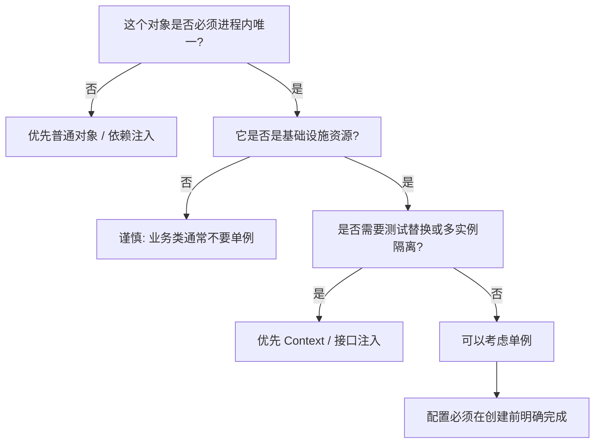

# C++ 你真的需要单例吗

前面我们花了不少篇幅整理单例的写法：Meyers Singleton、CRTP 单例、带配置的单例基类。

但真正写工程时，第一反应不应该是“这个类怎么写成单例”，而应该先问一句：

**这个类真的应该是进程内唯一的吗？**

单例模式解决的是“唯一实例 + 全局访问入口”。它很方便，但也会引入全局状态、隐式依赖、测试困难和初始化顺序问题。

所以这篇笔记不讨论“单例怎么写”，而讨论“什么时候不该写单例”。

## 先给结论

单例适合表达**进程级基础设施**，不适合表达普通业务对象。

比较稳的规则是：

- 如果对象代表**进程内唯一资源**，并且全局只有一个实例才符合语义，可以考虑单例。
- 如果对象只是“很多地方都要用”，但不要求唯一，优先考虑 **Context** 或 **依赖注入**。
- 如果对象需要在测试中替换、按请求创建、按租户隔离、按模型隔离，通常不要做单例。
- 如果对象需要运行时热更新配置，单例本身不够，需要额外设计快照、锁、RCU 或重新加载协议。

一句话版本：

**单例应该服务于资源唯一性，而不是服务于偷懒少传参数。**

## 判断一个类能不能做单例

可以用这几个问题自检：

- **它是不是进程级唯一？** 如果未来可能有多个实例，比如多个模型、多个租户、多个连接组、多个调度队列，就不要急着单例。
- **它是不是基础设施？** 日志、配置、运行时上下文、资源池更像基础设施；业务服务、策略对象、请求处理器更像应用逻辑。
- **它是否需要被测试替换？** 如果单元测试里经常要替换 fake/mock，实现成单例会让测试很难写。
- **它是否依赖启动配置？** 如果依赖配置，必须明确配置发生在 `getInstance()` 前，还是运行中可以修改。
- **它是否有生命周期边界？** 如果它应该跟随请求、连接、会话、模型或 pipeline 生命周期，就不应该是进程级单例。
- **它是否会引入隐藏依赖？** 如果函数内部到处 `Xxx::getInstance()`，调用关系会变得不透明。

可以画成一个简单决策图：



这个图的核心是：**唯一性必须来自业务语义或资源约束，而不是来自调用方便。**

## Context 是什么

`Context` 可以理解成“显式传递的一组运行时依赖”。

它不要求里面的每个对象都是单例，只是把一组进程级、服务级或请求级依赖收在一起，交给需要它们的对象。

例如：

```cpp
struct AppContext {
    Logger& logger;
    ConfigCenter& config;
    ThreadPool& thread_pool;
    ConnectionPool& database_pool;
};
```

业务对象通过构造函数拿到它：

```cpp
class UserService {
public:
    /**
     * @brief 创建用户服务。
     *
     * @param context 应用级上下文，生命周期必须长于 UserService。
     */
    explicit UserService(AppContext& context)
        : mContext(context)
    {
    }

    void createUser()
    {
        mContext.logger.info("create user");
        // 使用 mContext.database_pool 访问数据库。
    }

private:
    AppContext& mContext;
};
```

`Context` 的好处是依赖关系很清楚：

- `UserService` 需要哪些基础设施，一看构造函数就知道。
- 测试时可以构造一个 `TestContext` 或 fake 依赖。
- 不会在业务代码深处突然调用全局单例。

`Context` 的代价是参数会多一点，但这个代价换来的是可测试性和架构清晰度。

## 依赖注入是什么

依赖注入比 `Context` 更细粒度：对象只接收自己真正需要的依赖，而不是拿到一整个上下文。

```cpp
class OrderService {
public:
    /**
     * @brief 创建订单服务。
     *
     * @param logger 日志接口，调用方保证生命周期长于 OrderService。
     * @param repository 订单仓库接口，调用方保证生命周期长于 OrderService。
     */
    OrderService(Logger& logger, OrderRepository& repository)
        : mLogger(logger),
          mRepository(repository)
    {
    }

    void submitOrder(const Order& order)
    {
        mRepository.save(order);
        mLogger.info("order submitted");
    }

private:
    Logger& mLogger;
    OrderRepository& mRepository;
};
```

依赖注入适合业务类，因为业务类通常：

- 不应该决定依赖对象的创建方式。
- 需要在测试中替换依赖。
- 可能按不同场景组合不同实现。

如果一个类能通过构造函数传依赖解决问题，就不要急着让它自己去拿单例。

## 日志系统

日志系统是最常被写成单例的对象。

它可以做成单例，因为：

- 进程里通常希望统一日志格式、日志级别、输出目标。
- 日志系统经常被底层模块使用，传参成本高。
- 程序崩溃或异常边界上，日志入口越稳定越好。

但日志也不一定必须单例。

如果工程比较小，或者日志只是基础设施，下面这种写法可以接受：

```cpp
Logger::configure(config);
Logger::getInstance().info("server started");
```

但在业务对象里，更推荐传入 `Logger&`：

```cpp
class ModelRunner {
public:
    explicit ModelRunner(Logger& logger)
        : mLogger(logger)
    {
    }

private:
    Logger& mLogger;
};
```

这样 `ModelRunner` 不关心 Logger 是单例、普通对象，还是测试里的 fake logger。

我的建议是：

- **日志后端**可以是单例，比如全局 `Logger` 或 `LogSystem`。
- **业务类使用日志**时优先通过 `Context` 或构造函数拿 `Logger&`。
- 只有特别底层、没有依赖注入入口的代码，才直接调用 `Logger::getInstance()`。

## 线程池

线程池经常被误写成单例。

它可以是单例的情况：

- 整个进程只有一个通用后台线程池。
- 所有任务共享同一套调度策略。
- 线程数来自启动配置，运行时不需要按模块隔离。

例如：

```cpp
ThreadPool::configure(ThreadPoolConfig{.worker_count = 8});
ThreadPool::getInstance().submit(task);
```

但很多时候线程池不应该是单例：

- 推理任务和后台清理任务优先级不同。
- CPU 计算任务和 IO 任务不应该抢同一批线程。
- 不同模型、不同租户、不同 pipeline 需要资源隔离。
- 测试里希望构造一个单线程线程池，让执行顺序更可控。

这种情况下更适合显式持有：

```cpp
class InferenceEngine {
public:
    InferenceEngine(ThreadPool& compute_pool, ThreadPool& io_pool)
        : mComputePool(compute_pool),
          mIoPool(io_pool)
    {
    }

private:
    ThreadPool& mComputePool;
    ThreadPool& mIoPool;
};
```

判断线程池能不能单例，关键看一句话：

**这个线程池是不是整个进程的唯一调度资源？**

如果答案不是非常确定，就不要单例。

## 连接池

连接池比线程池更不适合默认单例。

因为连接池通常天然存在多个维度：

- 不同数据库。
- 不同账号。
- 不同读写角色。
- 不同租户。
- 不同服务 endpoint。
- 不同超时和重试策略。

如果把连接池写成单例，很容易把这些差异塞进一个全局对象里，最后变成一个巨大的全局状态容器。

更合理的方式是把连接池作为应用上下文的一部分：

```cpp
struct AppContext {
    ConnectionPool& main_database;
    ConnectionPool& analytics_database;
};
```

或者由更上层的资源管理器持有多个 pool：

```cpp
class DatabaseManager {
public:
    ConnectionPool& mainPool();
    ConnectionPool& analyticsPool();

private:
    ConnectionPool mMainPool;
    ConnectionPool mAnalyticsPool;
};
```

这里 `DatabaseManager` 可以是进程级对象，但 `ConnectionPool` 本身不必是单例。

我的建议是：

- **单数据库小服务**：连接池做单例可以接受，但要谨慎。
- **多数据库、多租户、多 endpoint**：不要让连接池单例，显式建多个 pool。
- **连接池管理器**可以是单例或 Context 成员，但池本身最好按资源边界建模。

## 全局配置中心

配置中心比较适合做单例，但要分清两种配置：

- **启动配置**：程序启动时加载，之后不变。
- **运行时配置**：程序运行中可能热更新。

启动配置中心适合单例：

```cpp
ConfigCenter::load("server.toml");
auto port = ConfigCenter::getInstance().getInt("server.port");
```

它的特点是：

- 加载一次。
- 只读访问。
- 生命周期覆盖整个进程。
- 所有模块看到同一份配置。

运行时配置中心则不能只是“一个单例 map”这么简单。

如果配置会热更新，需要考虑：

- 读写并发。
- 配置快照一致性。
- 订阅通知。
- 更新失败回滚。
- 某个业务操作应该读新配置还是旧配置。

一种更稳的方式是让配置中心返回快照：

```cpp
class ConfigCenter {
public:
    std::shared_ptr<const AppConfig> snapshot() const;
};
```

业务代码拿到的是不可变快照：

```cpp
auto config = config_center.snapshot();
runWithConfig(*config);
```

所以配置中心可以是单例，但配置数据本身最好按“不可变快照”设计，不要到处直接读写一个全局可变对象。

## 业务管理类

很多项目里会出现各种 `Manager`：

- `UserManager`
- `ModelManager`
- `TaskManager`
- `SessionManager`
- `OrderManager`
- `RequestManager`

这些名字很容易诱导我们把它写成单例，但这类对象最需要警惕。

业务管理类通常不应该默认单例，因为它们经常有这些特点：

- 依赖很多外部资源。
- 需要在测试里替换依赖。
- 可能未来支持多租户或多模型。
- 可能按请求、会话、模型、pipeline 拆分实例。
- 里面容易堆积大量业务状态。

比如 `ModelManager`，听起来像全局唯一，但实际可能有多种设计：

- 单进程只部署一个模型，可以是进程级对象。
- 一个进程部署多个模型，就应该是普通对象或由 `ModelRegistry` 管理。
- 不同模型需要不同 GPU、不同线程池、不同缓存策略，就更不应该做全局单例。

业务管理类更推荐这样组织：

```cpp
class ModelManager {
public:
    ModelManager(Logger& logger, ModelRepository& repository)
        : mLogger(logger),
          mRepository(repository)
    {
    }

private:
    Logger& mLogger;
    ModelRepository& mRepository;
};
```

然后由 `AppContext` 或更上层的 `Application` 负责创建：

```cpp
class Application {
public:
    Application()
        : mModelManager(mLogger, mModelRepository)
    {
    }

private:
    Logger mLogger;
    ModelRepository mModelRepository;
    ModelManager mModelManager;
};
```

这个结构比 `ModelManager::getInstance()` 更容易测试，也更容易演进。

## 哪些情境下必须使用单例

严格说，**必须使用单例的场景很少**。

很多“看起来必须单例”的对象，其实也可以用 `Application` 顶层对象持有，然后通过 Context 或依赖注入传下去。

真正接近“必须单例”的情况，通常有这些特征：

- 底层 C API、回调或信号处理只允许注册一个全局入口。
- 某个资源从操作系统或运行时语义上就是进程唯一。
- 全局异常边界、崩溃处理、日志兜底路径无法方便传依赖。
- 第三方库要求通过全局初始化和全局销毁管理运行时。

例如：

- 崩溃信号处理器。
- 进程级日志兜底器。
- 某些第三方 runtime 的全局初始化入口。
- 全局 metrics registry。
- 进程级配置中心。

即使在这些场景里，也可以把“全局入口”限制在很薄的一层：

```cpp
class MetricsRegistry {
public:
    static MetricsRegistry& getInstance();

    void registerCounter(std::string name);
    void add(std::string_view name, double value);

private:
    MetricsRegistry() = default;
};
```

业务代码不一定直接依赖它，可以继续通过接口或 Context 使用。

也就是说，必须单例的通常是**底层入口**，不是整条业务链路。

## 推荐对比表

| 对象类型 | 能否单例 | 更推荐的方式 | 原因 |
|---|---|---|---|
| 日志后端 | 可以 | 单例或 Context 中的引用 | 通常是进程级基础设施，但业务类最好依赖 `Logger&`。 |
| 配置中心 | 可以 | 启动只读配置可单例；热更新配置用快照 | 全局一致性重要，但运行时更新要额外设计。 |
| 通用线程池 | 可以但谨慎 | Context 持有或显式传入 | 如果存在资源隔离需求，就不应该全局唯一。 |
| 连接池 | 谨慎 | 按数据库/租户/endpoint 显式建池 | 连接池天然可能有多个实例。 |
| GPU/设备运行时上下文 | 可以 | 进程级 runtime 或 Context | 取决于是否支持多设备、多实例隔离。 |
| 业务 Manager | 默认不要 | 依赖注入 / Application 持有 | 业务状态和依赖复杂，未来经常需要多实例。 |
| 请求上下文 | 不要 | 每个请求一个对象 | 生命周期不是进程级。 |
| 会话对象 | 不要 | 每个 session 一个对象 | 天然多实例。 |
| 策略/算法对象 | 不要 | 普通对象或工厂创建 | 通常需要组合、替换、测试。 |

## 一个实用判断

如果你想把一个类写成单例，可以先尝试写出它的非单例版本：

```cpp
class Service {
public:
    Service(Logger& logger, ConfigCenter& config)
        : mLogger(logger),
          mConfig(config)
    {
    }

private:
    Logger& mLogger;
    ConfigCenter& mConfig;
};
```

如果这个版本很自然，说明它大概率不需要单例。

如果你发现它确实代表进程唯一资源，并且每个调用方都传它会造成明显噪声，再考虑单例：

```cpp
Logger::getInstance().info("message");
```

但不要把这个入口扩散到所有业务代码深处。更好的折中是：

```cpp
struct AppContext {
    Logger& logger;
    ConfigCenter& config;
};
```

让边界层知道单例，业务层只知道依赖。

## 我的经验规则

- **基础设施可以单例，业务逻辑不要默认单例。**
- **进程级唯一可以单例，生命周期更短的对象不要单例。**
- **只读启动配置可以单例，热更新配置需要快照和并发设计。**
- **全局入口可以单例，内部实现可以继续依赖注入。**
- **如果只是为了少传参数，那不是单例的理由。**
- **如果测试时很想替换它，那就别让业务代码直接调用它的 `getInstance()`。**

## 核心结论

单例不是“高级全局变量”，而是表达**进程级唯一基础设施**的一种接口形式。

在工程里更稳的层次是：

- 最底层可以有少量单例，负责日志、配置、runtime 这类进程级入口。
- 应用层用 `Application` 或 `AppContext` 显式组织依赖。
- 业务层通过构造函数拿依赖，不直接到处调用全局单例。

所以，真正的问题不是“我会不会写单例”，而是：

**这个对象的唯一性，是系统语义要求的，还是我为了调用方便加上的？**

如果答案是后者，优先考虑 Context 或依赖注入。
