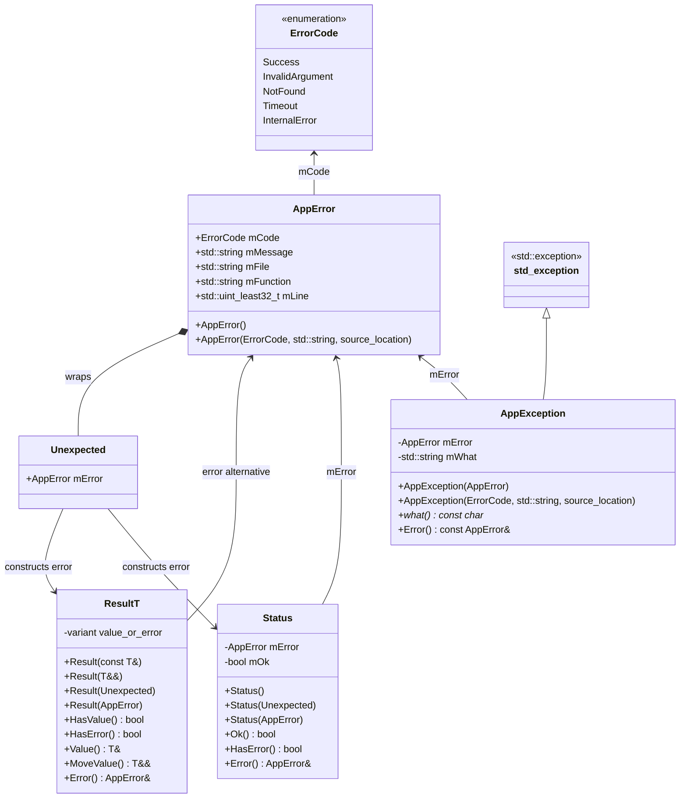

# C++ 错误系统笔记

这篇笔记整理一个轻量级 C++ 错误系统。它的核心目标是：**让错误可以被显式返回、可以携带上下文、可以在边界处转换成异常，并且尽量保留错误发生的位置**。

代码里主要有几类对象：

- `ErrorCode`：机器可判断的错误类型。
- `AppError`：错误码 + 错误消息 + 源码位置。
- `Unexpected`：构造 `Result<T>` 或 `Status` 时用于表达错误分支的包装类型。
- `Result<T>`：返回“值或错误”。
- `Status`：返回“成功或错误”，适合没有业务返回值的函数。
- `AppException`：把 `AppError` 接到 C++ 异常体系里。

## 工业级错误处理的主要思路

工业级错误处理通常不是简单地“遇到错误就抛异常”或“返回一个 `int`”。更重要的问题是：**这个错误是不是业务流程里可预期的一部分？当前层有没有能力处理？如果不能处理，应该如何保留上下文并向上传递？**

- **错误必须有机器可判断的类型**。  
  只返回字符串不够，因为调用方很难根据字符串稳定地分支处理。`ErrorCode` 的价值就是给错误一个稳定枚举值，比如 `InvalidArgument`、`NotFound`、`Timeout`。

- **错误必须有人能读懂的上下文**。  
  错误码适合程序判断，错误消息适合人定位问题。`AppError` 把 `ErrorCode` 和 `mMessage` 放在一起，避免只知道“失败了”，但不知道“为什么失败”。

- **错误最好携带发生位置**。  
  线上排查时，错误发生在哪个文件、哪一行、哪个函数非常关键。C++20 的 `std::source_location` 可以在创建错误时自动捕获调用点。

- **不要在底层混杂太多策略**。  
  底层库最好只构造和返回错误，不直接打印日志、不直接退出进程。日志、重试、降级、转换异常这些策略，通常放在更高层。

### 可预期业务错误

**可预期业务错误**是系统正常运行中可能出现、调用方也有机会处理的失败。它们不应该默认用异常表达，而应该用 `Result<T>` 或 `Status` 显式返回。

典型例子：

- 用户输入非法：`InvalidArgument`。
- 查询资源不存在：`NotFound`。
- 外部服务超时，但调用方可以重试或降级：`Timeout`。
- 配置项缺失，调用方可以使用默认值或提示用户修复。

这类错误的特点是：

- 它们是业务协议的一部分，不是程序崩坏。
- 调用方可能会根据错误码分支处理。
- 错误路径应该在函数签名里可见。

所以推荐写成：

```cpp
Result<User> FindUser(UserId id);
Status SaveConfig(const Config& config);
```

而不是：

```cpp
User FindUserOrThrow(UserId id);
void SaveConfigOrThrow(const Config& config);
```

返回值风格的好处是，调用方读接口时就知道这个函数可能失败，也知道应该检查 `Result<T>` 或 `Status`。

### 什么时候抛异常

异常更适合表达**当前层无法处理、需要跳出当前控制流**的错误。它不是不能用于业务错误，而是不要在每一个普通分支上都用异常。

适合抛异常的场景：

- **程序边界层**：CLI `main()`、RPC handler、HTTP controller、任务入口、线程入口。边界层可以统一捕获异常，转成日志、错误响应或进程退出码。
- **构造函数失败**：构造函数不能返回 `Result<T>`，如果对象无法建立有效不变量，抛异常通常比构造半残对象更好。
- **不可恢复错误**：例如内部状态损坏、关键资源初始化失败、违反不变量。
- **桥接第三方库**：第三方库本身用异常表达失败，当前层不想把所有异常立即翻译成返回值。

这套系统里的 `AppException` 就是异常桥接层。它不替代 `Result<T>` 和 `Status`，而是在需要异常语义的地方包装 `AppError`。

推荐风格是：

```cpp
Result<Token> LoadToken();

Token LoadTokenOrThrow() {
    auto token = LoadToken();
    if (!token) {
        throw AppException(token.Error());
    }
    return token.MoveValue();
}
```

这样底层仍然是显式错误返回，边界层可以选择异常风格。

### 什么时候写 `try-catch`

`try-catch` 不应该到处写。一个工程里最常见的问题是：每一层都 catch 一下、打一条日志、再 throw，最后同一个错误被打印很多遍，而且上下文反而更乱。

适合写 `try-catch` 的位置：

- **线程入口或任务入口**：防止异常穿出线程函数导致 `std::terminate`。
- **进程边界**：`main()` 捕获所有预期异常，打印日志并返回退出码。
- **服务边界**：RPC / HTTP handler 捕获异常，转换成错误响应。
- **异常转换点**：把第三方异常转换成 `AppError`、`Status` 或 `AppException`。
- **需要补充上下文的地方**：catch 后增加更高层上下文，再向上传播。

不推荐写 `try-catch` 的位置：

- 只是为了立刻 `throw;`，没有增加上下文。
- 只是为了打一条重复日志。
- 明明可以用 `Result<T>` / `Status` 返回的普通业务分支。

一个边界层示例：

```cpp
int main() {
    try {
        RunApplication();
        return 0;
    } catch (const AppException& error) {
        std::cerr << "application error: " << error.what() << '\n';
        return 1;
    } catch (const std::exception& error) {
        std::cerr << "unexpected std::exception: " << error.what() << '\n';
        return 2;
    } catch (...) {
        std::cerr << "unknown fatal error\n";
        return 3;
    }
}
```

### 什么时候打日志

日志应该尽量放在**错误被最终处理的地方**，而不是每一层传播错误时都打。

推荐打日志的位置：

- **边界层最终处理错误时**：例如请求失败、任务失败、程序退出。
- **错误被吞掉或降级时**：如果不向上传播，就应该记录为什么吞掉。
- **重试耗尽时**：第一次失败可能只是瞬时错误，最终失败更值得记录。
- **跨系统边界时**：调用外部服务失败、解析外部输入失败、写数据库失败。

一般不推荐底层函数直接打日志：

```cpp
Result<User> FindUser(UserId id) {
    if (!Exists(id)) {
        // 不建议：底层不知道上层是否会把 NotFound 当作正常分支。
        // LOG_ERROR("user not found");
        return MakeError(ErrorCode::NotFound, "user not found");
    }
    ...
}
```

更推荐让上层决定：

```cpp
auto user = FindUser(id);
if (!user) {
    if (user.Error().mCode == ErrorCode::NotFound) {
        // 可能是正常业务分支，不一定要打 error 日志。
        return MakeDefaultUser();
    }

    // 当前层决定无法处理，再记录或继续向上传播。
    return user.Error();
}
```

### 处理决策表

| 场景 | 推荐机制 | 是否打日志 | 说明 |
|---|---|---|---|
| 参数非法、资源不存在、业务超时 | `Result<T>` / `Status` | 通常不在底层打 | 可预期错误，让调用方决定处理方式。 |
| 无返回值操作失败 | `Status` | 由调用方决定 | 比 `Result<void>` 更直接。 |
| 有返回值操作失败 | `Result<T>` | 由调用方决定 | 成功值和错误互斥。 |
| 构造函数无法建立不变量 | 异常 | 边界层捕获时打 | 构造函数不能返回 `Result<T>`。 |
| 线程入口、任务入口 | `try-catch` | 捕获时打 | 防止异常逃逸导致程序终止。 |
| RPC / HTTP / CLI 边界 | `try-catch` + 转换响应 | 捕获时打 | 统一错误响应和日志策略。 |
| 第三方库抛异常 | `try-catch` 转成 `AppError` 或 `AppException` | 转换处可补上下文 | 隔离第三方错误模型。 |
| 违反内部不变量 | 异常或 fail-fast | 通常打 | 表示代码缺陷或不可恢复状态。 |

这篇笔记里的错误系统适合采用这样的主线：

- **底层和业务层**：用 `Result<T>` / `Status` 返回可预期错误。
- **边界和不可恢复位置**：用 `AppException` 抛出或桥接异常。
- **`try-catch` 放在边界层和转换点**，不要每层都 catch。
- **日志放在最终处理点**，不要每层重复打印同一个错误。

整体数据流是：


这套设计的重点是：**错误不是只存在一瞬间的返回码，而是一个可以携带类型、消息和位置的对象**。

## UML 类图



这张图表达的是：

- `AppError` 是错误信息的中心对象。
- `Unexpected` 只是一个错误分支包装器，用来构造 `Result<T>` 或 `Status`。
- `Result<T>` 内部用 `std::variant<T, AppError>` 表示成功值或错误。
- `Status` 保存 `AppError + bool`，表示无返回值操作的成功或失败。
- `AppException` 继承 `std::exception`，内部仍然保存 `AppError`，用于异常边界。

## `std::source_location`

`std::source_location` 是 C++20 标准库提供的调用点信息捕获工具，定义在 `<source_location>` 中。它的目标是替代很多场景里手写的 `__FILE__`、`__LINE__`、`__func__` 宏，让普通函数也能拿到**调用点**的源码位置。

先看 MSVC STL 里的实现形态：

```cpp
struct source_location {
    static consteval source_location current(
        const uint_least32_t _Line_ = __builtin_LINE(),
        const uint_least32_t _Column_ = __builtin_COLUMN(),
        const char* const _File_ = __builtin_FILE(),
        const char* const _Function_ = __builtin_FUNCTION()) noexcept {
        source_location _Result{};
        _Result._Line     = _Line_;
        _Result._Column   = _Column_;
        _Result._File     = _File_;
        _Result._Function = _Function_;
        return _Result;
    }

    constexpr source_location() noexcept = default;

    constexpr uint_least32_t line() const noexcept {
        return _Line;
    }

    constexpr uint_least32_t column() const noexcept {
        return _Column;
    }

    constexpr const char* file_name() const noexcept {
        return _File;
    }

    constexpr const char* function_name() const noexcept {
        return _Function;
    }

private:
    uint_least32_t _Line{};
    uint_least32_t _Column{};
    const char* _File     = "";
    const char* _Function = "";
};
```

这段源码可以拆成三部分理解：

- **`current()` 是一个静态工厂函数**。  
  你不会手动填写 `_Line_`、`_File_` 这些参数，通常直接调用 `std::source_location::current()`，让编译器自动把当前位置填进去。

- **位置信息来自编译器 builtin**。  
  `__builtin_LINE()`、`__builtin_COLUMN()`、`__builtin_FILE()`、`__builtin_FUNCTION()` 不是普通运行时函数，而是编译器提供的内建能力。它们在调用点展开成当前行号、列号、文件名和函数名。

- **对象内部只是保存一份轻量信息**。  
  `source_location` 内部保存两个整数和两个 `const char*`。`_File` 和 `_Function` 通常指向编译器生成的静态字符串，不需要 `source_location` 自己分配或释放内存。

它暴露出来的接口就是：

| 接口 | 含义 |
|---|---|
| `std::source_location::current()` | 返回当前调用点的源码位置信息。 |
| `loc.file_name()` | 当前调用点所在文件名。 |
| `loc.function_name()` | 当前调用点所在函数名。 |
| `loc.line()` | 当前调用点所在行号。 |
| `loc.column()` | 当前调用点所在列号，是否有意义取决于编译器支持。 |

### 为什么 `current()` 是 `consteval`

MSVC 源码里 `current()` 被声明成：

```cpp
static consteval source_location current(...) noexcept
```

`consteval` 表示这个函数必须在编译期求值。对 `source_location` 来说这很自然，因为文件名、函数名、行号、列号本来就是编译器在编译时知道的信息。

这带来两个效果：

- 调用 `current()` 不需要在运行时去查询栈帧，也不需要做昂贵的反射。
- 捕获到的位置是静态源码位置，而不是运行时调用栈。

这也解释了为什么 `std::source_location` 很轻量：它不是 stack trace，只是一个“当前位置快照”。

### 默认参数为什么能捕获调用点

`std::source_location` 最适合作为默认参数使用：

```cpp
Unexpected MakeError(
    ErrorCode code,
    std::string message,
    const std::source_location& loc = std::source_location::current());
```

这样调用方写：

```cpp
return MakeError(ErrorCode::NotFound, "user not found");
```

`loc` 捕获的是调用 `MakeError(...)` 的位置，而不是 `MakeError` 函数内部的位置。这一点很重要：错误系统需要记录的是**错误被创建的业务现场**。

原因是 C++ 的默认参数在**调用点**补齐。调用方没有传 `loc` 时，编译器会在调用点补上：

```cpp
return MakeError(
    ErrorCode::NotFound,
    "user not found",
    std::source_location::current());
```

由于 `current()` 里的默认参数又使用了 `__builtin_LINE()`、`__builtin_FILE()` 等 builtin，所以最终记录的是这行 `return MakeError(...)` 所在的位置。

如果不把 `source_location` 放在默认参数，而是在函数内部写：

```cpp
Unexpected MakeError(ErrorCode code, std::string message) {
    auto loc = std::source_location::current();
    return Unexpected{AppError{code, std::move(message), loc}};
}
```

那么 `loc` 记录的就是 `MakeError` 函数内部那一行。这样所有错误都会看起来像是在 `MakeError` 里创建的，反而失去了定位价值。

### 和宏的区别

相比传统宏：

```cpp
__FILE__
__LINE__
__func__
```

`std::source_location` 的好处是：

- 不需要手写宏包装函数。
- 可以作为普通函数默认参数传递。
- 类型安全，接口清晰。
- 对库代码更友好，调用点信息不会因为封装函数而完全丢失。

这套错误系统里，`AppError` 构造函数和 `MakeError` 都接收：

```cpp
const std::source_location& loc = std::source_location::current()
```

所以调用方通常不需要手动传位置：

```cpp
return MakeError(ErrorCode::InvalidArgument, "user_id must be positive");
```

错误对象里会自动保存：

- `mFile = loc.file_name()`
- `mFunction = loc.function_name()`
- `mLine = loc.line()`

这就是 `AppError` 能在日志里输出 `origin=file.cpp:123 function_name` 的来源。

## 带 Doxygen 注释的接口代码

下面是一版带完整 Doxygen 风格中文注释的代码。

### `Error.h`

```cpp
#pragma once

#include <cstdint>
#include <iosfwd>
#include <source_location>
#include <stdexcept>
#include <string>
#include <string_view>
#include <utility>
#include <variant>

/**
 * @brief 应用级错误码。
 *
 * ErrorCode 用于让调用方以稳定、类型化的方式判断错误类别。
 * std::uint16_t 可以限制枚举底层存储大小，适合日志、协议或跨模块传递。
 */
enum class ErrorCode : std::uint16_t {
    Success = 0,       ///< 操作成功。
    InvalidArgument,   ///< 输入参数非法或不满足前置条件。
    NotFound,          ///< 请求的资源不存在。
    Timeout,           ///< 操作超时。
    InternalError      ///< 内部错误，通常表示未预期状态或实现缺陷。
};

/**
 * @brief 应用级错误对象。
 *
 * AppError 把机器可判断的错误码、面向人的错误消息，以及错误创建位置放在一起。
 * 它是 Result<T>、Status 和 AppException 共享的错误载体。
 */
struct AppError {
    ErrorCode mCode{ErrorCode::InternalError};  ///< 错误码，表示错误类别。
    std::string mMessage;                       ///< 错误说明，面向日志和排查。
    std::string mFile;                          ///< 创建错误的位置所在文件。
    std::string mFunction;                      ///< 创建错误的位置所在函数。
    std::uint_least32_t mLine{0};               ///< 创建错误的位置所在行号。

    /**
     * @brief 构造一个默认内部错误。
     *
     * 默认构造主要用于容器或占位场景。实际返回错误时更推荐使用
     * AppError(ErrorCode, std::string, std::source_location) 或 MakeError()。
     */
    AppError() = default;

    /**
     * @brief 构造一个带源码位置的错误对象。
     *
     * @param error_code 错误码，描述错误类别。
     * @param error_message 错误消息，描述具体失败原因。
     * @param loc 错误创建点，默认捕获调用构造函数的位置。
     */
    AppError(
        ErrorCode error_code,
        std::string error_message,
        const std::source_location& loc = std::source_location::current());
};

/**
 * @brief Result<T> 和 Status 的错误分支包装类型。
 *
 * Unexpected 用于让调用方显式表达“这里返回的是错误，不是正常值”。
 * 这种包装可以避免某些构造函数重载之间的歧义。
 */
struct Unexpected {
    AppError mError;  ///< 被包装的应用错误对象。
};

/**
 * @brief 构造 Unexpected 错误包装对象。
 *
 * @param code 错误码，描述错误类别。
 * @param message 错误消息，描述具体失败原因。
 * @param loc 错误创建点，默认捕获调用 MakeError() 的位置。
 * @return Unexpected 可直接用于构造 Result<T> 或 Status 的错误分支。
 */
Unexpected MakeError(
    ErrorCode code,
    std::string message,
    const std::source_location& loc = std::source_location::current());

/**
 * @brief 表示一个可能成功返回 T，也可能失败返回 AppError 的结果类型。
 *
 * @tparam T 成功分支保存的值类型。
 *
 * Result<T> 适合用于有业务返回值的函数，例如查找对象、解析配置、
 * 打开资源、执行可能失败的计算等。
 */
template <typename T>
class Result {
private:
    std::variant<T, AppError> mData;  ///< 成功值或错误对象。任意时刻只持有其中之一。

public:
    /**
     * @brief 从左值构造成功结果。
     *
     * @param value 成功返回值，会被拷贝进 Result。
     */
    Result(const T& value) : mData(value) {}

    /**
     * @brief 从右值构造成功结果。
     *
     * @param value 成功返回值，会被移动进 Result。
     */
    Result(T&& value) : mData(std::move(value)) {}

    /**
     * @brief 从 Unexpected 构造错误结果。
     *
     * @param error 错误包装对象，其内部 AppError 会被移动进 Result。
     */
    Result(Unexpected error) : mData(std::move(error.mError)) {}

    /**
     * @brief 从 AppError 构造错误结果。
     *
     * @param error 错误对象，会被移动进 Result。
     */
    Result(AppError error) : mData(std::move(error)) {}

    /**
     * @brief 判断当前 Result 是否持有成功值。
     *
     * @return 持有 T 时返回 true，持有 AppError 时返回 false。
     */
    bool HasValue() const {
        return std::holds_alternative<T>(mData);
    }

    /**
     * @brief 判断当前 Result 是否持有错误。
     *
     * @return 持有 AppError 时返回 true，持有 T 时返回 false。
     */
    bool HasError() const {
        return !HasValue();
    }

    /**
     * @brief 允许在 if 语句中直接判断是否成功。
     *
     * @return 成功时返回 true，失败时返回 false。
     */
    explicit operator bool() const {
        return HasValue();
    }

    /**
     * @brief 获取成功值的可修改引用。
     *
     * @return T& 成功值引用。
     * @throws std::logic_error 当前 Result 不持有成功值时抛出。
     */
    T& Value() {
        if (!HasValue()) {
            throw std::logic_error("Result has no value");
        }
        return std::get<T>(mData);
    }

    /**
     * @brief 获取成功值的只读引用。
     *
     * @return const T& 成功值引用。
     * @throws std::logic_error 当前 Result 不持有成功值时抛出。
     */
    const T& Value() const {
        if (!HasValue()) {
            throw std::logic_error("Result has no value");
        }
        return std::get<T>(mData);
    }

    /**
     * @brief 移出成功值。
     *
     * @return T&& 成功值右值引用。
     * @throws std::logic_error 当前 Result 不持有成功值时抛出。
     *
     * 调用后 Result 内部的 T 处于被移动后的有效但未指定状态。
     */
    T&& MoveValue() {
        if (!HasValue()) {
            throw std::logic_error("Result has no value");
        }
        return std::move(std::get<T>(mData));
    }

    /**
     * @brief 获取错误对象的可修改引用。
     *
     * @return AppError& 错误对象引用。
     * @throws std::logic_error 当前 Result 持有成功值时抛出。
     */
    AppError& Error() {
        if (HasValue()) {
            throw std::logic_error("Result has no error");
        }
        return std::get<AppError>(mData);
    }

    /**
     * @brief 获取错误对象的只读引用。
     *
     * @return const AppError& 错误对象引用。
     * @throws std::logic_error 当前 Result 持有成功值时抛出。
     */
    const AppError& Error() const {
        if (HasValue()) {
            throw std::logic_error("Result has no error");
        }
        return std::get<AppError>(mData);
    }
};

/**
 * @brief 表示一个只有成功或失败状态、没有业务返回值的结果类型。
 *
 * Status 适合用于保存、删除、刷新缓存、初始化模块这类只关心是否成功的操作。
 */
class Status {
private:
    AppError mError{ErrorCode::Success, ""};  ///< 失败时保存错误；成功时保持 Success 占位。
    bool mOk{true};                           ///< true 表示成功，false 表示失败。

public:
    /**
     * @brief 构造成功状态。
     */
    Status() = default;

    /**
     * @brief 从 Unexpected 构造失败状态。
     *
     * @param error 错误包装对象，其内部 AppError 会被移动进 Status。
     */
    Status(Unexpected error);

    /**
     * @brief 从 AppError 构造失败状态。
     *
     * @param error 错误对象，会被移动进 Status。
     */
    Status(AppError error);

    /**
     * @brief 判断状态是否成功。
     *
     * @return 成功返回 true，失败返回 false。
     */
    bool Ok() const;

    /**
     * @brief 判断状态是否失败。
     *
     * @return 失败返回 true，成功返回 false。
     */
    bool HasError() const;

    /**
     * @brief 允许在 if 语句中直接判断是否成功。
     *
     * @return 成功返回 true，失败返回 false。
     */
    explicit operator bool() const;

    /**
     * @brief 获取错误对象的可修改引用。
     *
     * @return AppError& 错误对象引用。
     * @throws std::logic_error 当前 Status 成功时抛出。
     */
    AppError& Error();

    /**
     * @brief 获取错误对象的只读引用。
     *
     * @return const AppError& 错误对象引用。
     * @throws std::logic_error 当前 Status 成功时抛出。
     */
    const AppError& Error() const;
};

/**
 * @brief 构造一个成功 Status。
 *
 * @return Status 成功状态对象。
 */
Status Ok();

/**
 * @brief 将 ErrorCode 转成稳定字符串。
 *
 * @param code 错误码。
 * @return std::string_view 指向静态字符串常量，不需要调用方管理生命周期。
 */
std::string_view ToString(ErrorCode code);

/**
 * @brief 将 AppError 格式化成人类可读字符串。
 *
 * @param error 错误对象。
 * @return std::string 格式化后的错误说明，包含错误码、消息和源码位置。
 */
std::string ToString(const AppError& error);

/**
 * @brief 将 AppError 写入输出流。
 *
 * @param output 输出流。
 * @param error 错误对象。
 * @return std::ostream& 原输出流，支持链式输出。
 */
std::ostream& operator<<(std::ostream& output, const AppError& error);

/**
 * @brief 应用级异常类型。
 *
 * AppException 用于把 AppError 接入 C++ 异常机制，适合在边界层抛出，
 * 例如 CLI 入口、RPC 边界、测试代码或无法继续恢复的场景。
 */
class AppException final : public std::exception {
private:
    AppError mError;    ///< 被异常持有的错误对象。
    std::string mWhat;  ///< 缓存后的 what() 字符串，保证 c_str() 生命周期稳定。

public:
    /**
     * @brief 从 AppError 构造异常。
     *
     * @param error 错误对象，会被移动进异常对象。
     */
    explicit AppException(AppError error);

    /**
     * @brief 从错误码、消息和源码位置构造异常。
     *
     * @param code 错误码。
     * @param message 错误消息。
     * @param loc 异常创建点，默认捕获调用构造函数的位置。
     */
    explicit AppException(
        ErrorCode code,
        std::string message,
        const std::source_location& loc = std::source_location::current());

    /**
     * @brief 返回异常描述字符串。
     *
     * @return const char* 指向异常内部缓存字符串，生命周期与异常对象一致。
     */
    const char* what() const noexcept override;

    /**
     * @brief 获取异常内部保存的 AppError。
     *
     * @return const AppError& 错误对象只读引用。
     */
    const AppError& Error() const noexcept;
};
```

### `Error.cpp`

```cpp
#include "Error.h"

#include <ostream>
#include <sstream>

AppError::AppError(
    ErrorCode error_code,
    std::string error_message,
    const std::source_location& loc)
    : mCode(error_code),
      mMessage(std::move(error_message)),
      mFile(loc.file_name()),
      mFunction(loc.function_name()),
      mLine(loc.line()) {}

Unexpected MakeError(ErrorCode code, std::string message, const std::source_location& loc) {
    return Unexpected{AppError{code, std::move(message), loc}};
}

Status Ok() {
    return Status();
}

std::string_view ToString(ErrorCode code) {
    switch (code) {
        case ErrorCode::Success:
            return "Success";
        case ErrorCode::InvalidArgument:
            return "InvalidArgument";
        case ErrorCode::NotFound:
            return "NotFound";
        case ErrorCode::Timeout:
            return "Timeout";
        case ErrorCode::InternalError:
            return "InternalError";
    }

    return "Unknown";
}

std::string ToString(const AppError& error) {
    std::ostringstream output;
    output << '[' << ToString(error.mCode) << "] " << error.mMessage;

    if (!error.mFile.empty()) {
        output << " (origin=" << error.mFile << ':' << error.mLine;
        if (!error.mFunction.empty()) {
            output << ' ' << error.mFunction;
        }
        output << ')';
    }

    return output.str();
}

std::ostream& operator<<(std::ostream& output, const AppError& error) {
    return output << ToString(error);
}

Status::Status(Unexpected error) : mError(std::move(error.mError)), mOk(false) {}

Status::Status(AppError error) : mError(std::move(error)), mOk(false) {}

bool Status::Ok() const {
    return mOk;
}

bool Status::HasError() const {
    return !mOk;
}

Status::operator bool() const {
    return mOk;
}

AppError& Status::Error() {
    if (mOk) {
        throw std::logic_error("Status has no error");
    }
    return mError;
}

const AppError& Status::Error() const {
    if (mOk) {
        throw std::logic_error("Status has no error");
    }
    return mError;
}

AppException::AppException(AppError error)
    : mError(std::move(error)), mWhat(ToString(mError)) {}

AppException::AppException(
    ErrorCode code,
    std::string message,
    const std::source_location& loc)
    : AppException(AppError{code, std::move(message), loc}) {}

const char* AppException::what() const noexcept {
    return mWhat.c_str();
}

const AppError& AppException::Error() const noexcept {
    return mError;
}
```

## 接口说明

### `AppError`

**Purpose:** 保存一次错误的完整上下文。

**Member Variables:**

| Member | Type | Meaning |
|---|---|---|
| `mCode` | `ErrorCode` | 错误类别，给程序判断用。 |
| `mMessage` | `std::string` | 错误说明，给人排查用。 |
| `mFile` | `std::string` | 错误创建位置所在文件。 |
| `mFunction` | `std::string` | 错误创建位置所在函数。 |
| `mLine` | `std::uint_least32_t` | 错误创建位置所在行号。 |

**Important Interfaces:**

| Method | Prototype | Meaning |
|---|---|---|
| constructor | `AppError()` | 构造默认内部错误，主要用于占位。 |
| constructor | `AppError(ErrorCode, std::string, const std::source_location& = std::source_location::current())` | 构造带错误码、消息和调用点位置的错误。 |

`AppError` 是这套系统的核心数据结构。`Result<T>`、`Status` 和 `AppException` 都是在传播或包装它。

### `Result<T>`

**Purpose:** 表示“成功时返回 `T`，失败时返回 `AppError`”。

**Class / Member Source:**

```cpp
template <typename T>
class Result {
private:
    std::variant<T, AppError> mData;
};
```

**Important Interfaces:**

| Method | Prototype | Meaning |
|---|---|---|
| constructor | `Result(const T& value)` | 拷贝成功值。 |
| constructor | `Result(T&& value)` | 移动成功值。 |
| constructor | `Result(Unexpected error)` | 从错误包装构造失败结果。 |
| constructor | `Result(AppError error)` | 直接从错误对象构造失败结果。 |
| `HasValue` | `bool HasValue() const` | 判断是否成功。 |
| `HasError` | `bool HasError() const` | 判断是否失败。 |
| `operator bool` | `explicit operator bool() const` | 支持 `if (result)` 判断成功。 |
| `Value` | `T& Value()` / `const T& Value() const` | 获取成功值；失败时抛 `std::logic_error`。 |
| `MoveValue` | `T&& MoveValue()` | 移出成功值；失败时抛 `std::logic_error`。 |
| `Error` | `AppError& Error()` / `const AppError& Error() const` | 获取错误；成功时抛 `std::logic_error`。 |

`Result<T>` 适合函数确实有业务返回值的场景。例如“读取配置文件并返回配置对象”“查找用户并返回用户信息”“解析字符串并返回 AST”。

### `Status`

**Purpose:** 表示“成功或失败”，但成功时没有额外返回值。

**Class / Member Source:**

```cpp
class Status {
private:
    AppError mError{ErrorCode::Success, ""};
    bool mOk{true};
};
```

**Important Interfaces:**

| Method | Prototype | Meaning |
|---|---|---|
| constructor | `Status()` | 构造成功状态。 |
| constructor | `Status(Unexpected error)` | 从错误包装构造失败状态。 |
| constructor | `Status(AppError error)` | 从错误对象构造失败状态。 |
| `Ok` | `bool Ok() const` | 判断是否成功。 |
| `HasError` | `bool HasError() const` | 判断是否失败。 |
| `operator bool` | `explicit operator bool() const` | 支持 `if (status)` 判断成功。 |
| `Error` | `AppError& Error()` / `const AppError& Error() const` | 获取错误；成功时抛 `std::logic_error`。 |

`Status` 适合“只关心成功失败”的函数，例如删除文件、刷新缓存、初始化模块、提交任务等。

### `AppException`

**Purpose:** 把 `AppError` 接入 C++ 异常体系。

**Member Variables:**

| Member | Type | Meaning |
|---|---|---|
| `mError` | `AppError` | 异常携带的错误对象。 |
| `mWhat` | `std::string` | 缓存后的 `what()` 文本，保证 `what()` 返回指针有效。 |

**Important Interfaces:**

| Method | Prototype | Meaning |
|---|---|---|
| constructor | `explicit AppException(AppError error)` | 从错误对象构造异常。 |
| constructor | `explicit AppException(ErrorCode, std::string, const std::source_location& = std::source_location::current())` | 从错误码、消息和调用点位置构造异常。 |
| `what` | `const char* what() const noexcept override` | 返回异常说明字符串。 |
| `Error` | `const AppError& Error() const noexcept` | 获取结构化错误对象。 |

这类异常适合放在边界层，而不是底层逻辑到处抛。例如：

- CLI `main()` 里捕获并打印。
- RPC handler 边界把异常转换成错误响应。
- 测试代码里让失败快速中断。
- 无法恢复的初始化失败。

## 使用方式

### 返回 `Result<T>`

当函数成功时需要返回业务值，使用 `Result<T>`：

```cpp
Result<std::string> LoadUserName(int user_id) {
    if (user_id <= 0) {
        return MakeError(ErrorCode::InvalidArgument, "user_id must be positive");
    }

    if (user_id == 42) {
        return std::string{"alice"};
    }

    return MakeError(ErrorCode::NotFound, "user not found");
}
```

调用方可以显式检查：

```cpp
auto result = LoadUserName(7);
if (!result) {
    std::cerr << result.Error() << '\n';
    return;
}

std::cout << "user=" << result.Value() << '\n';
```

这段代码的错误路径是显式的：调用方必须在使用 `Value()` 前判断是否成功。即使忘记判断，`Value()` 也会抛出 `std::logic_error`，避免静默读错分支。

### 返回 `Status`

当函数只需要表达成功或失败时，使用 `Status`：

```cpp
Status SaveConfig(std::string_view path) {
    if (path.empty()) {
        return MakeError(ErrorCode::InvalidArgument, "config path is empty");
    }

    return Ok();
}
```

调用方式：

```cpp
Status status = SaveConfig("app.toml");
if (!status) {
    std::cerr << status.Error() << '\n';
    return;
}
```

`Status` 比 `Result<void>` 更直接，也避免了给 `void` 做模板特化。

### 向上传播错误

`Result<T>` 和 `Status` 的一个典型用法是逐层传播错误：

```cpp
Result<std::string> LoadToken();

Status Connect() {
    auto token = LoadToken();
    if (!token) {
        return token.Error();
    }

    // 使用 token.Value() 建立连接。
    return Ok();
}
```

这里 `LoadToken()` 返回 `Result<std::string>`，而 `Connect()` 返回 `Status`。当底层失败时，直接把 `AppError` 传给 `Status`，保留原始错误码、消息和源码位置。

### 在边界处抛异常

如果某层 API 更适合用异常，可以把 `AppError` 转成 `AppException`：

```cpp
std::string LoadTokenOrThrow() {
    auto token = LoadToken();
    if (!token) {
        throw AppException(token.Error());
    }
    return token.MoveValue();
}
```

边界处捕获：

```cpp
try {
    const auto token = LoadTokenOrThrow();
    std::cout << token << '\n';
} catch (const AppException& error) {
    std::cerr << "application error: " << error.what() << '\n';
    std::cerr << "code: " << ToString(error.Error().mCode) << '\n';
}
```

这种模式把两种风格接起来：

- 底层和中间层：用 `Result<T>` / `Status` 显式传播。
- 边界层：用 `AppException` 统一中断和捕获。

## 设计取舍和限制

- **`Result<T>` 目前不支持 `T = void`。**  
  无返回值函数应该使用 `Status`。如果确实想写 `Result<void>`，需要单独做模板特化。

- **`Result<T>` 使用 `std::variant<T, AppError>`，会要求 `T` 满足 variant 的基本构造和移动要求。**  
  大多数普通值类型没问题；如果 `T` 是不可移动资源，需要额外设计。

- **`Value()` 和 `Error()` 在错误分支用错时会抛 `std::logic_error`。**  
  这是调用方违反接口约定，不是业务错误。业务错误应该放在 `AppError` 里。

- **`ToString(const AppError&)` 应该返回 `std::string`。**  
  因为它需要拼接动态内容，不能返回指向临时字符串的 `std::string_view`。

- **底层函数不要直接打日志。**  
  返回 `AppError` 后，让上层决定是打印日志、重试、降级还是转换成异常。这样错误系统更容易复用。

## 小结

这套错误系统的核心是把错误当成结构化对象处理：

- `ErrorCode` 负责机器可判断的错误类别。
- `AppError` 负责保存错误码、消息和源码位置。
- `MakeError` 负责在调用点创建错误，并自动捕获 `std::source_location`。
- `Result<T>` 负责“值或错误”。
- `Status` 负责“成功或错误”。
- `AppException` 负责把结构化错误接到异常体系。

如果记一条主线，就是：**内部用返回值显式传播错误，边界处再决定是否转换成异常**。
