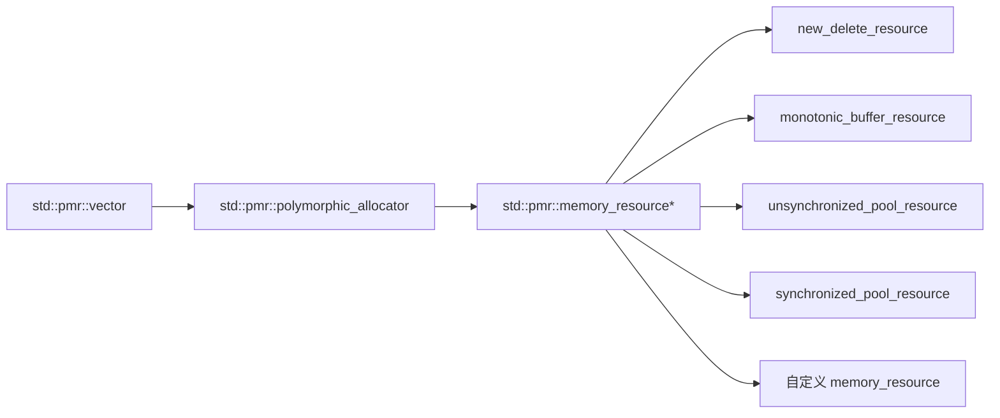

# C++ PMR 内存资源笔记

PMR 是 **Polymorphic Memory Resource（多态内存资源）** 的缩写。它是 C++17 引入的一套标准库设施，定义在：

```cpp
#include <memory_resource>
```

核心命名空间是：

```cpp
namespace std::pmr;
```

一句话概括：

> PMR 把“容器如何申请内存”从容器类型里拆出来，用一个运行期的 `memory_resource*` 控制分配策略。

它不是为了替代所有 `new` / `delete`，也不是为了让所有程序都更快。它主要解决的是：**在需要大量动态分配、需要统一生命周期、需要运行期切换分配策略的场景里，传统 allocator 太笨重、太容易污染类型系统。**

## PMR 要解决什么问题

### 传统 allocator 会污染容器类型

标准容器的 allocator 是模板参数的一部分：

```cpp
#include <vector>

template <typename T, typename Allocator>
using Vec = std::vector<T, Allocator>;
```

这意味着：

```cpp
std::vector<int, AllocA<int>>
std::vector<int, AllocB<int>>
```

是两个不同类型。

如果一个函数写成：

```cpp
void consume(const std::vector<int>& values);
```

它只能接收默认 allocator 的 `std::vector<int>`。一旦你想把自定义 allocator 放进类型里，函数签名、类成员、模板参数都会被 allocator 传染。

PMR 的做法是把容器类型固定下来：

```cpp
std::pmr::vector<int>
```

不管底层使用默认堆、arena、pool，容器类型都还是同一个 `std::pmr::vector<int>`。

### 传统 allocator 很难运行期切换策略

普通 allocator 通常是编译期类型：

```cpp
std::vector<int, MyAllocator<int>> values;
```

如果你想根据运行时条件选择不同分配策略：

- 小请求用栈上 buffer。
- 大请求退回全局堆。
- 测试时注入失败分配器。
- 单线程用无锁 pool，多线程用同步 pool。

传统 allocator 会让代码很快变成模板迷宫。

PMR 把策略变成运行期对象：

```cpp
std::pmr::memory_resource* resource = chooseResource();
std::pmr::vector<int> values{resource};
```

容器只保存一个 `memory_resource*`，真正怎么分配由这个资源对象决定。

### 短生命周期对象需要批量释放

很多系统代码会在一个阶段里创建大量临时对象：

- 解析配置文件。
- 构建 AST。
- 处理一次 HTTP / RPC 请求。
- 临时拼接字符串。
- 图算法或 DP 中构建中间结构。

这些对象往往一起创建、一起销毁。如果每个小对象都单独 `new` / `delete`，分配器开销和碎片都可能变得明显。

`std::pmr::monotonic_buffer_resource` 的模型是：

- 分配时只向前推进一个指针。
- 单个 `deallocate` 基本不做事。
- 最后通过 `release()` 或析构一次性释放整批内存。

这非常适合“阶段性内存”的场景。

### 嵌套容器需要统一内存来源

考虑：

```cpp
std::vector<std::string> names;
```

这里至少有两层动态分配：

- `vector` 自己的元素数组。
- 每个 `string` 的字符 buffer。

如果只控制外层 `vector` 的 allocator，内层 `string` 仍然可能走默认堆。PMR 的 allocator-aware construction（感知 allocator 的构造）会尽量把同一个资源继续传给内层 PMR 对象：

```cpp
std::pmr::monotonic_buffer_resource arena;
std::pmr::vector<std::pmr::string> names{&arena};

names.emplace_back("a very long string that probably allocates");
```

这里 `vector` 的元素数组和 `pmr::string` 的字符 buffer 都可以来自同一个 `arena`。

## PMR 是怎么解决的

PMR 把“allocator 类型”和“分配策略”拆成两层。



这张图的含义是：

- `std::pmr::vector<T>` 的 allocator 类型固定是 `std::pmr::polymorphic_allocator<T>`。
- `polymorphic_allocator<T>` 内部只保存一个 `std::pmr::memory_resource*`。
- `memory_resource` 是运行期多态基类，真正的分配策略由派生类实现。

所以 PMR 的核心不是某一个容器，而是这个分层模型：

| 层级 | 角色 |
| --- | --- |
| `std::pmr::memory_resource` | 抽象内存资源，定义 `allocate` / `deallocate` / `is_equal` 契约。 |
| `std::pmr::polymorphic_allocator<T>` | STL allocator 适配层，把容器的分配请求转发给 `memory_resource`。 |
| `std::pmr::vector<T>` 等容器别名 | 使用 `polymorphic_allocator<T>` 的标准容器别名。 |
| `monotonic_buffer_resource` / pool resource | 标准库提供的具体资源实现。 |

## 最小例子

下面这个例子把 `std::pmr::vector<int>` 的内存放进一块栈上 buffer。buffer 用完后，才会向上游资源申请更多内存。

```cpp
#include <array>
#include <cstddef>
#include <iostream>
#include <memory_resource>
#include <vector>

int main()
{
    std::array<std::byte, 4096> buffer{};
    std::pmr::monotonic_buffer_resource arena(buffer.data(), buffer.size());

    std::pmr::vector<int> values{&arena};
    for (int i = 0; i < 100; i++) {
        values.push_back(i);
    }

    std::cout << values.size() << '\n';
}
```

注意这里有两个生命周期：

- `values` 不拥有 `arena`，它只保存资源指针。
- `arena` 使用 `buffer`，所以 `buffer` 必须比 `arena` 活得更久，`arena` 必须比 `values` 活得更久。

更安全的顺序通常是：

```cpp
buffer -> resource -> containers
```

析构顺序则反过来：

```cpp
containers -> resource -> buffer
```

## 头文件和容器别名

PMR 的核心资源类型在 `<memory_resource>` 中：

```cpp
#include <memory_resource>
```

容器别名分散在对应容器头里。用哪个容器，就 include 哪个容器：

```cpp
#include <memory_resource>
#include <string>
#include <unordered_map>
#include <vector>

std::pmr::vector<int> values;
std::pmr::string name;
std::pmr::unordered_map<std::pmr::string, int> table;
```

常见别名可以理解成：

```cpp
namespace std::pmr {
    template <typename T>
    using vector = std::vector<T, std::pmr::polymorphic_allocator<T>>;

    using string = std::basic_string<
        char,
        std::char_traits<char>,
        std::pmr::polymorphic_allocator<char>>;
}
```

## `std::pmr::memory_resource`

**用途**

`memory_resource` 是所有 PMR 内存资源的抽象基类。它定义“按字节申请 / 释放内存”的接口，容器不会直接知道具体资源类型，只通过这个基类指针分配。

**原型**

```cpp
namespace std::pmr {
class memory_resource {
public:
    memory_resource() = default;
    memory_resource(const memory_resource&) = default;
    virtual ~memory_resource();

    memory_resource& operator=(const memory_resource&) = default;

    void* allocate(std::size_t bytes,
                   std::size_t alignment = alignof(std::max_align_t));

    void deallocate(void* p,
                    std::size_t bytes,
                    std::size_t alignment = alignof(std::max_align_t));

    bool is_equal(const memory_resource& other) const noexcept;

private:
    virtual void* do_allocate(std::size_t bytes,
                              std::size_t alignment) = 0;

    virtual void do_deallocate(void* p,
                               std::size_t bytes,
                               std::size_t alignment) = 0;

    virtual bool do_is_equal(const memory_resource& other) const noexcept = 0;
};
}
```

**重要接口**

| 接口 | 含义 |
| --- | --- |
| `allocate(bytes, alignment)` | 申请至少 `bytes` 字节，并满足 `alignment` 对齐的原始内存。 |
| `deallocate(p, bytes, alignment)` | 释放之前由同一兼容资源申请的内存。`bytes` 和 `alignment` 必须匹配。 |
| `is_equal(other)` | 判断两个资源是否可以互相释放对方分配的内存。 |
| `do_allocate` | 派生类实现真正的分配逻辑。 |
| `do_deallocate` | 派生类实现真正的释放逻辑。 |
| `do_is_equal` | 派生类实现资源等价关系。 |

**使用示例：直接申请原始内存**

```cpp
#include <cstddef>
#include <memory_resource>

int main()
{
    std::pmr::memory_resource* resource = std::pmr::new_delete_resource();

    void* raw = resource->allocate(128, alignof(double));

    // 使用 raw 指向的原始内存。这里省略对象构造，只演示资源接口。

    resource->deallocate(raw, 128, alignof(double));
}
```

这个例子里的 `deallocate` 必须使用同一个资源，并且传回相同的 `bytes` 和 `alignment`。PMR 不会像 `free(p)` 那样只靠指针找大小。

**使用示例：自定义统计资源**

```cpp
#include <cstddef>
#include <memory_resource>
#include <vector>

class CountingResource final : public std::pmr::memory_resource {
public:
    explicit CountingResource(
        std::pmr::memory_resource* upstream = std::pmr::get_default_resource())
        : mUpstream(upstream)
    {
    }

    std::size_t bytesAllocated() const noexcept
    {
        return mBytesAllocated;
    }

    std::size_t bytesDeallocated() const noexcept
    {
        return mBytesDeallocated;
    }

private:
    void* do_allocate(std::size_t bytes, std::size_t alignment) override
    {
        mBytesAllocated += bytes;
        return mUpstream->allocate(bytes, alignment);
    }

    void do_deallocate(void* p, std::size_t bytes, std::size_t alignment) override
    {
        mBytesDeallocated += bytes;
        mUpstream->deallocate(p, bytes, alignment);
    }

    bool do_is_equal(const std::pmr::memory_resource& other) const noexcept override
    {
        // 这个资源只允许自己释放自己分配的内存。
        return this == &other;
    }

private:
    std::pmr::memory_resource* mUpstream;
    std::size_t mBytesAllocated = 0;
    std::size_t mBytesDeallocated = 0;
};

int main()
{
    CountingResource counter;

    std::pmr::vector<int> values{&counter};
    values.resize(1024);

    const std::size_t allocated = counter.bytesAllocated();
    (void)allocated;
}
```

这个自定义资源没有自己管理内存，只是把请求转发给上游资源，同时记录字节数。很多调试型 resource 都是这个结构。

## `operator==` 和 `operator!=`

**用途**

判断两个 `memory_resource` 是否等价。等价的含义不是“地址一定相同”，而是：一个资源分配的内存是否可以由另一个资源释放。

**原型**

```cpp
bool operator==(const std::pmr::memory_resource& a,
                const std::pmr::memory_resource& b) noexcept;

bool operator!=(const std::pmr::memory_resource& a,
                const std::pmr::memory_resource& b) noexcept;
```

**使用示例**

```cpp
#include <cassert>
#include <memory_resource>

int main()
{
    auto* heap = std::pmr::new_delete_resource();
    auto* also_heap = std::pmr::new_delete_resource();

    assert(*heap == *also_heap);

    std::pmr::monotonic_buffer_resource arena;
    assert(*heap != arena);
}
```

多数标准资源的 `is_equal` 语义是对象身份：只有同一个 resource 对象才相等。`new_delete_resource()` 是特殊的全局资源，多次调用返回同一个资源对象。

## 默认资源函数

PMR 有一组全局函数，用来取得或修改默认资源。

### `std::pmr::new_delete_resource`

**用途**

返回一个使用全局 `::operator new` 和 `::operator delete` 的资源。它通常是默认资源的初始值。

**原型**

```cpp
std::pmr::memory_resource* std::pmr::new_delete_resource() noexcept;
```

**使用示例**

```cpp
#include <memory_resource>
#include <vector>

int main()
{
    std::pmr::vector<int> values{std::pmr::new_delete_resource()};
    values.push_back(42);
}
```

这个例子和普通 `std::vector<int>` 的分配来源接近，但容器类型是 PMR 版本，后续可以很容易换成别的 resource。

### `std::pmr::null_memory_resource`

**用途**

返回一个永远不成功分配的资源。调用它的 `allocate` 通常会抛出 `std::bad_alloc`。

**原型**

```cpp
std::pmr::memory_resource* std::pmr::null_memory_resource() noexcept;
```

**使用示例：禁止上游扩容**

```cpp
#include <array>
#include <cstddef>
#include <iostream>
#include <memory_resource>
#include <vector>

int main()
{
    std::array<std::byte, 128> buffer{};

    // 初始 buffer 用完后，不允许退回堆分配。
    std::pmr::monotonic_buffer_resource arena(
        buffer.data(),
        buffer.size(),
        std::pmr::null_memory_resource());

    std::pmr::vector<int> values{&arena};

    try {
        for (int i = 0; i < 1000; i++) {
            values.push_back(i);
        }
    } catch (const std::bad_alloc&) {
        std::cout << "buffer exhausted\n";
    }
}
```

`null_memory_resource()` 很适合测试“我有没有意外走到堆分配”，也适合给固定容量 arena 做上游资源。

### `std::pmr::get_default_resource`

**用途**

返回当前默认资源。默认构造的 `std::pmr::polymorphic_allocator<T>` 会使用它。

**原型**

```cpp
std::pmr::memory_resource* std::pmr::get_default_resource() noexcept;
```

**使用示例**

```cpp
#include <cassert>
#include <memory_resource>
#include <vector>

int main()
{
    std::pmr::memory_resource* current = std::pmr::get_default_resource();

    std::pmr::vector<int> values; // 使用当前默认资源。

    assert(values.get_allocator().resource() == current);
}
```

### `std::pmr::set_default_resource`

**用途**

设置新的默认资源，并返回旧的默认资源。

**原型**

```cpp
std::pmr::memory_resource*
std::pmr::set_default_resource(std::pmr::memory_resource* resource) noexcept;
```

**参数**

| 参数 | 含义 |
| --- | --- |
| `resource` | 新默认资源。传入 `nullptr` 时，标准语义会恢复到 `new_delete_resource()`。 |

**返回值**

| 类型 | 含义 |
| --- | --- |
| `std::pmr::memory_resource*` | 旧的默认资源。 |

**使用示例：RAII 恢复默认资源**

```cpp
#include <memory_resource>
#include <vector>

class DefaultResourceGuard {
public:
    explicit DefaultResourceGuard(std::pmr::memory_resource* next)
        : mPrevious(std::pmr::set_default_resource(next))
    {
    }

    ~DefaultResourceGuard()
    {
        std::pmr::set_default_resource(mPrevious);
    }

    DefaultResourceGuard(const DefaultResourceGuard&) = delete;
    DefaultResourceGuard& operator=(const DefaultResourceGuard&) = delete;

private:
    std::pmr::memory_resource* mPrevious;
};

int main()
{
    std::pmr::monotonic_buffer_resource arena;

    {
        DefaultResourceGuard guard{&arena};
        std::pmr::vector<int> values; // 默认构造，使用 arena。
        values.resize(100);
    }

    std::pmr::vector<int> normal; // 默认资源已经恢复。
}
```

**注意点**

`set_default_resource` 修改的是进程级默认资源。它很方便，但也容易让远处代码受到影响。工程代码里更推荐显式把 `memory_resource*` 传给需要的容器或对象。

## `std::pmr::polymorphic_allocator<T>`

**用途**

`polymorphic_allocator<T>` 是 PMR 和标准容器之间的适配器。它满足 allocator 的接口要求，但内部只保存一个 `memory_resource*`。

**原型**

```cpp
namespace std::pmr {
template <typename T>
class polymorphic_allocator {
public:
    using value_type = T;

    polymorphic_allocator() noexcept;
    polymorphic_allocator(memory_resource* resource) noexcept;

    template <typename U>
    polymorphic_allocator(const polymorphic_allocator<U>& other) noexcept;

    T* allocate(std::size_t n);
    void deallocate(T* p, std::size_t n) noexcept;

    template <typename U, typename... Args>
    void construct(U* p, Args&&... args);

    template <typename U>
    void destroy(U* p);

    polymorphic_allocator select_on_container_copy_construction() const noexcept;

    memory_resource* resource() const noexcept;
};
}
```

**构造参数**

| 构造方式 | 含义 |
| --- | --- |
| `polymorphic_allocator()` | 使用当前 `get_default_resource()`。 |
| `polymorphic_allocator(memory_resource*)` | 显式绑定一个资源。 |
| `polymorphic_allocator<U>` 转换构造 | 不同 `T` 之间共享同一个资源指针。 |

**重要接口**

| 接口 | 含义 |
| --- | --- |
| `allocate(n)` | 为 `n` 个 `T` 申请原始内存。 |
| `deallocate(p, n)` | 释放 `n` 个 `T` 对应的原始内存。 |
| `construct(p, args...)` | 在 `p` 上构造对象，并处理 allocator-aware 类型。 |
| `destroy(p)` | 调用对象析构函数。 |
| `resource()` | 返回内部保存的 `memory_resource*`。 |
| `select_on_container_copy_construction()` | 容器拷贝构造时选择 allocator。PMR 中它返回默认资源。 |

### 使用示例：绑定容器

```cpp
#include <memory_resource>
#include <vector>

int main()
{
    std::pmr::monotonic_buffer_resource arena;

    std::pmr::polymorphic_allocator<int> alloc{&arena};
    std::pmr::vector<int> values{alloc};

    values.push_back(1);
    values.push_back(2);

    // 可以直接查看 allocator 绑定的是哪个资源。
    std::pmr::memory_resource* resource = alloc.resource();
    (void)resource;
}
```

通常可以更直接地写成：

```cpp
std::pmr::vector<int> values{&arena};
```

容器会用 `memory_resource*` 构造 `polymorphic_allocator<int>`。

### 使用示例：手动分配对象数组

```cpp
#include <memory_resource>
#include <new>

int main()
{
    std::pmr::monotonic_buffer_resource arena;
    std::pmr::polymorphic_allocator<int> alloc{&arena};

    int* data = alloc.allocate(4);

    for (int i = 0; i < 4; i++) {
        alloc.construct(data + i, i * 10);
    }

    for (int i = 0; i < 4; i++) {
        alloc.destroy(data + i);
    }

    alloc.deallocate(data, 4);
}
```

实际业务里很少手动用 `polymorphic_allocator` 管对象生命周期，更多是交给容器。这个例子主要说明 allocator 的基本契约。

### 使用示例：嵌套 PMR 容器

```cpp
#include <memory_resource>
#include <string>
#include <vector>

int main()
{
    std::pmr::monotonic_buffer_resource arena;

    std::pmr::vector<std::pmr::string> names{&arena};

    names.emplace_back("short");
    names.emplace_back("a long string that will likely allocate dynamically");
}
```

`std::pmr::vector<std::pmr::string>` 的外层数组和内层字符串都可以使用同一个 `arena`。这就是 PMR 在嵌套容器里的实际价值。

### 使用示例：拷贝构造的默认资源陷阱

```cpp
#include <cassert>
#include <memory_resource>
#include <vector>

int main()
{
    std::pmr::monotonic_buffer_resource arena;
    std::pmr::vector<int> a{&arena};
    a.push_back(1);

    std::pmr::vector<int> b = a;

    // PMR allocator 的 select_on_container_copy_construction()
    // 返回默认资源，所以 b 不一定继续使用 arena。
    assert(b.get_allocator().resource() == std::pmr::get_default_resource());

    // 如果希望拷贝结果继续使用 arena，需要显式传 allocator/resource。
    std::pmr::vector<int> c{a, &arena};
    assert(c.get_allocator().resource() == &arena);
}
```

这点很容易忽略。PMR 容器复制时，不要默认以为资源也会一起复制过去。

### C++20 补充接口

一些实现会在 C++20 模式下提供更方便的字节 / 对象分配接口：

```cpp
void* allocate_bytes(std::size_t nbytes,
                     std::size_t alignment = alignof(std::max_align_t));

void deallocate_bytes(void* p,
                      std::size_t nbytes,
                      std::size_t alignment = alignof(std::max_align_t));

template <typename U>
U* allocate_object(std::size_t n = 1);

template <typename U>
void deallocate_object(U* p, std::size_t n = 1);

template <typename U, typename... Args>
U* new_object(Args&&... args);

template <typename U>
void delete_object(U* p);
```

使用示例：

```cpp
#include <memory_resource>

struct Node {
    int value;
};

int main()
{
    std::pmr::monotonic_buffer_resource arena;
    std::pmr::polymorphic_allocator<std::byte> alloc{&arena};

#if __cplusplus >= 202002L
    Node* node = alloc.new_object<Node>(42);
    alloc.delete_object(node);
#endif
}
```

如果你的目标是 C++17，就不要依赖这些接口。

## `std::pmr` 容器别名

**用途**

PMR 容器别名把标准容器的 allocator 固定成 `std::pmr::polymorphic_allocator<T>`。

常见别名：

| 别名 | 大致等价于 |
| --- | --- |
| `std::pmr::vector<T>` | `std::vector<T, std::pmr::polymorphic_allocator<T>>` |
| `std::pmr::string` | `std::basic_string<char, std::char_traits<char>, std::pmr::polymorphic_allocator<char>>` |
| `std::pmr::map<K, V>` | `std::map<K, V, Compare, std::pmr::polymorphic_allocator<std::pair<const K, V>>>` |
| `std::pmr::unordered_map<K, V>` | `std::unordered_map<K, V, Hash, Eq, std::pmr::polymorphic_allocator<std::pair<const K, V>>>` |
| `std::pmr::list<T>` | `std::list<T, std::pmr::polymorphic_allocator<T>>` |
| `std::pmr::deque<T>` | `std::deque<T, std::pmr::polymorphic_allocator<T>>` |

**使用示例**

```cpp
#include <memory_resource>
#include <string>
#include <unordered_map>

int main()
{
    std::pmr::monotonic_buffer_resource arena;

    std::pmr::unordered_map<std::pmr::string, int> counts{&arena};
    counts.emplace("apple", 3);
    counts.emplace("banana", 5);
}
```

注意：`std::pmr::unordered_map<std::pmr::string, int>` 只能保证 map 节点使用 PMR。key 的 `pmr::string` 也需要是 PMR 类型，才能让字符串内部 buffer 也使用资源。

## `std::pmr::monotonic_buffer_resource`

**用途**

`monotonic_buffer_resource` 是递增式 arena。它适合大量短生命周期对象，分配很快，释放通常成批发生。

**原型**

```cpp
class monotonic_buffer_resource : public std::pmr::memory_resource {
public:
    monotonic_buffer_resource() noexcept;
    explicit monotonic_buffer_resource(std::pmr::memory_resource* upstream) noexcept;
    explicit monotonic_buffer_resource(std::size_t initial_size) noexcept;
    monotonic_buffer_resource(std::size_t initial_size,
                              std::pmr::memory_resource* upstream) noexcept;
    monotonic_buffer_resource(void* buffer,
                              std::size_t buffer_size) noexcept;
    monotonic_buffer_resource(void* buffer,
                              std::size_t buffer_size,
                              std::pmr::memory_resource* upstream) noexcept;

    monotonic_buffer_resource(const monotonic_buffer_resource&) = delete;
    monotonic_buffer_resource& operator=(const monotonic_buffer_resource&) = delete;

    void release() noexcept;
    std::pmr::memory_resource* upstream_resource() const noexcept;
};
```

**构造参数**

| 参数 | 含义 |
| --- | --- |
| `initial_size` | 第一次向上游申请 buffer 时的建议大小。 |
| `buffer` / `buffer_size` | 用户提供的初始 buffer。通常可以是栈上数组或预分配内存。 |
| `upstream` | 初始 buffer 不够时继续申请内存的上游资源。 |

**重要接口**

| 接口 | 含义 |
| --- | --- |
| `release()` | 释放从上游资源获得的所有额外 buffer，并回到初始状态。 |
| `upstream_resource()` | 返回上游资源指针。 |

**使用示例：固定 buffer，不允许退回堆**

```cpp
#include <array>
#include <cstddef>
#include <memory_resource>
#include <string>
#include <vector>

int main()
{
    std::array<std::byte, 2048> buffer{};

    std::pmr::monotonic_buffer_resource arena(
        buffer.data(),
        buffer.size(),
        std::pmr::null_memory_resource());

    std::pmr::vector<std::pmr::string> words{&arena};
    words.emplace_back("pmr");
    words.emplace_back("arena");
}
```

这个写法很适合测试：如果容量不够，程序会抛 `std::bad_alloc`，不会悄悄退回全局堆。

**使用示例：`release()` 批量释放**

```cpp
#include <memory_resource>
#include <string>
#include <vector>

void handleBatch()
{
    std::pmr::monotonic_buffer_resource arena;

    {
        std::pmr::vector<std::pmr::string> temp{&arena};
        temp.emplace_back("temporary object");

        // temp 必须先析构，不能在它还活着时 release arena。
    }

    arena.release();
}
```

`release()` 会让仍然指向 arena 内存的对象全部悬空。因此要先销毁使用这个资源的容器和对象，再 release。

**使用示例：查看上游资源**

```cpp
#include <cassert>
#include <memory_resource>

int main()
{
    auto* upstream = std::pmr::new_delete_resource();
    std::pmr::monotonic_buffer_resource arena{upstream};

    assert(arena.upstream_resource() == upstream);
}
```

**注意点**

- 单个 `deallocate` 通常不归还内存。
- 很适合“构建一批对象，然后整批销毁”的模式。
- 不适合长期运行且对象频繁增删的结构，因为释放不及时会让内存持续增长。

## `std::pmr::pool_options`

**用途**

`pool_options` 用来配置 pool resource 的池化策略。

**原型**

```cpp
struct pool_options {
    std::size_t max_blocks_per_chunk = 0;
    std::size_t largest_required_pool_block = 0;
};
```

**成员变量**

| 成员 | 含义 |
| --- | --- |
| `max_blocks_per_chunk` | 一个 chunk 最多包含多少个 block。为 0 表示让实现选择。 |
| `largest_required_pool_block` | 由 pool 管理的最大 block 大小。更大的分配会直接交给上游资源。为 0 表示让实现选择。 |

**使用示例**

```cpp
#include <memory_resource>

int main()
{
    std::pmr::pool_options options;
    options.max_blocks_per_chunk = 1024;
    options.largest_required_pool_block = 256;

    std::pmr::unsynchronized_pool_resource pool{options};
}
```

调小 `max_blocks_per_chunk` 可以避免一次拿太多内存，但会增加向上游补充 chunk 的频率。

## `std::pmr::unsynchronized_pool_resource`

**用途**

`unsynchronized_pool_resource` 是非线程安全的 pool resource。它适合单线程中大量小对象反复分配 / 释放的场景。

它和 `monotonic_buffer_resource` 的区别是：

- `monotonic_buffer_resource` 基本不复用单个释放的 block。
- `unsynchronized_pool_resource` 会维护不同大小的 block pool，可以复用释放后的 block。

**原型**

```cpp
class unsynchronized_pool_resource : public std::pmr::memory_resource {
public:
    unsynchronized_pool_resource();
    explicit unsynchronized_pool_resource(std::pmr::memory_resource* upstream);
    explicit unsynchronized_pool_resource(const std::pmr::pool_options& options);
    unsynchronized_pool_resource(const std::pmr::pool_options& options,
                                 std::pmr::memory_resource* upstream);

    unsynchronized_pool_resource(const unsynchronized_pool_resource&) = delete;
    unsynchronized_pool_resource& operator=(const unsynchronized_pool_resource&) = delete;

    void release();
    std::pmr::memory_resource* upstream_resource() const noexcept;
    std::pmr::pool_options options() const noexcept;
};
```

**重要接口**

| 接口 | 含义 |
| --- | --- |
| `release()` | 释放 resource 管理的所有内存。 |
| `upstream_resource()` | 返回上游资源。 |
| `options()` | 返回构造时使用的 pool 配置。 |

**使用示例：单线程 node 容器**

```cpp
#include <list>
#include <memory_resource>
#include <string>

int main()
{
    std::pmr::pool_options options;
    options.largest_required_pool_block = 512;

    std::pmr::unsynchronized_pool_resource pool{options};

    std::pmr::list<std::pmr::string> logs{&pool};
    logs.emplace_back("first log message");
    logs.emplace_back("second log message");

    logs.clear(); // 节点释放回 pool，后续插入可以复用。
    logs.emplace_back("reuse a node-sized block");
}
```

**使用示例：查看配置和上游资源**

```cpp
#include <cassert>
#include <memory_resource>

int main()
{
    std::pmr::unsynchronized_pool_resource pool{
        std::pmr::pool_options{64, 1024},
        std::pmr::new_delete_resource()};

    std::pmr::pool_options options = pool.options();
    assert(options.max_blocks_per_chunk == 64);
    assert(pool.upstream_resource() == std::pmr::new_delete_resource());
}
```

**注意点**

`unsynchronized_pool_resource` 不做线程同步。不要让多个线程同时通过同一个资源分配 / 释放，除非你在外部加锁。

## `std::pmr::synchronized_pool_resource`

**用途**

`synchronized_pool_resource` 是线程安全的 pool resource。它适合多个线程共享同一个内存资源，并且有大量小对象分配 / 释放的场景。

**原型**

```cpp
class synchronized_pool_resource : public std::pmr::memory_resource {
public:
    synchronized_pool_resource();
    explicit synchronized_pool_resource(std::pmr::memory_resource* upstream);
    explicit synchronized_pool_resource(const std::pmr::pool_options& options);
    synchronized_pool_resource(const std::pmr::pool_options& options,
                               std::pmr::memory_resource* upstream);

    synchronized_pool_resource(const synchronized_pool_resource&) = delete;
    synchronized_pool_resource& operator=(const synchronized_pool_resource&) = delete;

    void release();
    std::pmr::memory_resource* upstream_resource() const noexcept;
    std::pmr::pool_options options() const noexcept;
};
```

**使用示例：多线程共享 pool**

```cpp
#include <memory_resource>
#include <thread>
#include <vector>

void worker(std::pmr::memory_resource* resource)
{
    std::pmr::vector<int> values{resource};
    for (int i = 0; i < 1000; i++) {
        values.push_back(i);
    }
}

int main()
{
    std::pmr::synchronized_pool_resource pool;

    std::thread t0(worker, &pool);
    std::thread t1(worker, &pool);

    t0.join();
    t1.join();
}
```

**使用示例：手动 release**

```cpp
#include <memory_resource>
#include <vector>

int main()
{
    std::pmr::synchronized_pool_resource pool;

    {
        std::pmr::vector<int> values{&pool};
        values.resize(1000);
    }

    pool.release();
}
```

和其他 resource 一样，`release()` 必须在使用该资源的对象销毁后调用。

**使用示例：查看配置和上游资源**

```cpp
#include <cassert>
#include <memory_resource>

int main()
{
    std::pmr::pool_options options;
    options.max_blocks_per_chunk = 128;

    std::pmr::synchronized_pool_resource pool{
        options,
        std::pmr::new_delete_resource()};

    assert(pool.options().max_blocks_per_chunk == 128);
    assert(pool.upstream_resource() == std::pmr::new_delete_resource());
}
```

## 三种内置资源怎么选

| 资源 | 线程安全 | 释放模型 | 适合场景 |
| --- | --- | --- | --- |
| `new_delete_resource()` | 取决于全局 new/delete | 单次申请，单次释放 | 默认堆分配，作为上游资源。 |
| `monotonic_buffer_resource` | 不提供同步 | 单次释放基本无效，`release()` 批量释放 | 请求级临时对象、解析器、短生命周期 arena。 |
| `unsynchronized_pool_resource` | 否 | 小 block 可复用，`release()` 批量归还 | 单线程大量小对象反复增删。 |
| `synchronized_pool_resource` | 是 | 小 block 可复用，`release()` 批量归还 | 多线程共享 pool。 |
| `null_memory_resource()` | 不分配 | 申请直接失败 | 固定容量测试、禁止 fallback。 |

## 完整小例子：请求级 arena

下面模拟一次请求处理：所有临时字符串和数组都走同一个 arena，请求结束后整体销毁。

```cpp
#include <array>
#include <cstddef>
#include <memory_resource>
#include <string>
#include <vector>

struct RequestContext {
    std::array<std::byte, 8192> buffer{};
    std::pmr::monotonic_buffer_resource arena{buffer.data(), buffer.size()};
};

std::pmr::vector<std::pmr::string> parseNames(
    const std::vector<std::string>& input,
    std::pmr::memory_resource* resource)
{
    std::pmr::vector<std::pmr::string> names{resource};
    names.reserve(input.size());

    for (const std::string& item : input) {
        names.emplace_back(item);
    }

    return names;
}

int main()
{
    RequestContext context;

    std::vector<std::string> input = {
        "alice",
        "bob",
        "charlie",
    };

    std::pmr::vector<std::pmr::string> names =
        parseNames(input, &context.arena);
}
```

这里 `context` 必须比 `names` 活得更久。真实工程里通常会把 `names` 的使用限制在请求处理函数内部，避免把 arena 分配出来的对象逃逸到更长生命周期。

## 常见坑

### `memory_resource` 不拥有容器

容器只保存 `memory_resource*`，不会延长 resource 的生命周期。

```cpp
std::pmr::vector<int> makeBadVector()
{
    std::pmr::monotonic_buffer_resource arena;
    std::pmr::vector<int> values{&arena};
    values.push_back(1);
    return values; // 错误：返回后 values 的资源指针悬空。
}
```

正确做法是让 resource 的生命周期覆盖容器：

```cpp
void fillValues(std::pmr::vector<int>& values)
{
    values.push_back(1);
}

int main()
{
    std::pmr::monotonic_buffer_resource arena;
    std::pmr::vector<int> values{&arena};

    fillValues(values);
}
```

### `monotonic_buffer_resource` 不适合长期碎片化结构

如果对象不断创建和删除，但 resource 一直不 release，`monotonic_buffer_resource` 不会因为单个对象析构就回收空间。

这类场景更适合 pool resource 或普通堆分配。

### 不要随意改全局默认资源

`set_default_resource` 会影响默认构造的 PMR allocator。库代码里随意设置它，可能影响调用方完全不相关的容器。

更推荐显式传入：

```cpp
std::pmr::vector<int> values{resource};
```

而不是依赖远处某个 `set_default_resource(resource)`。

### PMR 类型要一路用到底

如果你写：

```cpp
std::pmr::vector<std::string> names{&arena};
```

外层 `vector` 的元素数组来自 `arena`，但 `std::string` 自己的字符 buffer 仍然使用普通 allocator。

如果希望字符串内容也走 PMR，要写：

```cpp
std::pmr::vector<std::pmr::string> names{&arena};
```

这个坑在嵌套容器里非常常见。

## 小结

PMR 的关键不是某个“更快的 allocator”，而是一套把分配策略运行期化的接口模型：

- `memory_resource` 抽象“从哪里拿内存”。
- `polymorphic_allocator<T>` 把这个资源接到标准容器 allocator 协议上。
- `std::pmr::vector/string/map` 等别名让容器类型不再被具体 allocator 污染。
- `monotonic_buffer_resource` 适合短生命周期批量释放。
- pool resource 适合大量小对象反复分配释放。
- 默认资源函数适合全局配置，但工程里要谨慎使用。

真正使用 PMR 时，最重要的自检问题是：

- 这个 resource 的生命周期是否覆盖所有使用它的对象？
- 嵌套对象是不是也用了 PMR 类型？
- 这个场景是批量释放、重复复用，还是普通堆分配更合适？
- 有没有因为拷贝构造或默认构造意外回到 `get_default_resource()`？
