# C++ Traits：从类型耦合到编译期可扩展架构

> 本文面向已经掌握模板、模板特化、`if constexpr` 和基本 STL 用法，希望进一步理解大型 C++ 库设计方法的读者。目标不是只记住 `traits<T>::xxx` 的语法，而是理解：**为什么要建立 Traits 层、它和模板特化究竟是什么关系、什么时候值得设计 Traits，以及怎样避免把 Traits 写成新的“万能垃圾桶”。**

---

## 目录

- [1. Traits 要解决的根本问题](#1-traits-要解决的根本问题)
- [2. 不使用 Traits 时常见设计及其局限](#2-不使用-traits-时常见设计及其局限)
- [3. Traits 的本质：编译期类型映射与适配层](#3-traits-的本质编译期类型映射与适配层)
- [4. Traits 和模板特化到底是什么关系](#4-traits-和模板特化到底是什么关系)
- [5. Traits 带来的工程价值](#5-traits-带来的工程价值)
- [6. 设计一个 Traits 时必须考虑的问题](#6-设计一个-traits-时必须考虑的问题)
- [7. 标准库中的典型 Traits](#7-标准库中的典型-traits)
- [8. 开源库与高性能计算中的 Traits](#8-开源库与高性能计算中的-traits)
- [9. Traits 的常见误用与反模式](#9-traits-的常见误用与反模式)
- [10. 什么时候用 Traits，什么时候直接特化](#10-什么时候用-traits什么时候直接特化)
- [11. 完整示例项目：Traits 驱动的二进制编解码框架](#11-完整示例项目traits-驱动的二进制编解码框架)
- [12. 总结](#12-总结)

---

## 1. Traits 要解决的根本问题

泛型算法表面上只接收一个模板参数 `T`，但真正执行时往往需要知道大量与 `T` 有关的信息。例如，一个通用算法可能需要知道：

- `T` 的值类型是什么；
- `T` 是否支持某项操作；
- `T` 对应的指针、差值、索引或累加类型是什么；
- `T` 属于随机访问迭代器、双向迭代器还是输入迭代器；
- `T` 是否可以按字节复制；
- `T` 应该选择哪一种序列化策略、内存分配策略或设备指令；
- 某个容器的元素类型、分配器类型和传播规则是什么；
- 某个 GPU 架构应该选择哪种 MMA Atom、Copy Atom、共享内存布局和流水线阶段数。

这会产生一个核心矛盾：

> 泛型算法希望只描述“稳定的流程”，但它又必须获得“随类型变化的信息”。

如果算法直接认识所有具体类型，那么算法会逐渐演变成一个不断增长的类型分支中心；如果每一种类型都重新实现整个算法，又会造成大量重复代码。Traits 的目标，就是在这两种极端之间建立一个独立的**编译期描述与适配层**。

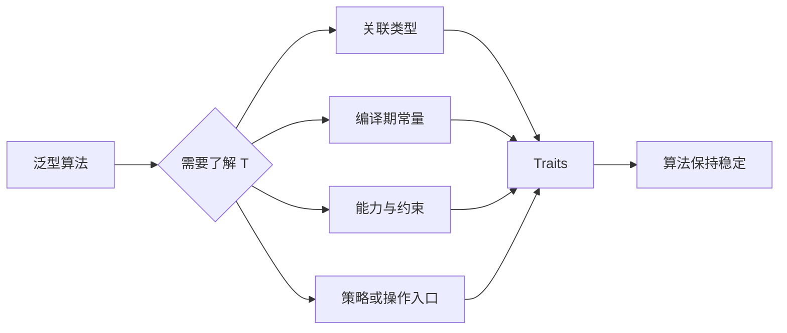

从工程角度看，Traits 解决的不是“怎样少写一个 `if constexpr`”，而是下面这个更重要的问题：

> **类型知识应该由谁拥有，算法变化与类型变化应该如何解耦。**

---

## 2. 不使用 Traits 时常见设计及其局限

### 2.1 把所有信息塞进类型自身

最直观的做法，是要求每个类型都定义算法需要的成员类型和静态常量。

```cpp
/**
 * @brief 一个直接把算法元信息写入自身的迭代器类型。
 */
class MyIterator {
public:
    using value_type = int;
    using difference_type = std::ptrdiff_t;
    static constexpr bool random_access = true;
};
```

这种方式在完全由你控制的封闭代码中并不错误，但它有明显边界：

- 内置类型无法添加成员，例如 `int*`；
- 第三方类型和标准库类型通常不能修改；
- 一个类型可能需要同时适配多个互不相关的框架，把所有框架元数据塞进类型本身会污染其职责；
- 框架升级时，可能迫使业务类型同步修改；
- 类型本身开始依赖算法框架，依赖方向被倒置。

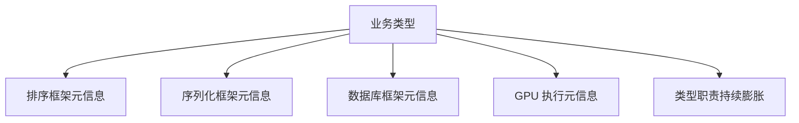

好的类型设计通常希望业务对象只描述自身数据和固有行为，而不是了解所有可能使用它的外部算法。

### 2.2 在算法内部枚举具体类型

第二种做法，是在算法中用 `if constexpr` 判断所有已知类型。

```cpp
/**
 * @brief 根据具体元素类型选择不同块大小的示例。
 * @tparam T 元素类型。
 */
template <typename T>
void launch_kernel() {
    if constexpr (std::same_as<T, float>) {
        constexpr int block_size = 128;
        // 使用 float 对应配置。
    } else if constexpr (std::same_as<T, double>) {
        constexpr int block_size = 64;
        // 使用 double 对应配置。
    } else if constexpr (std::same_as<T, std::uint8_t>) {
        constexpr int block_size = 256;
        // 使用 uint8_t 对应配置。
    } else {
        static_assert(std::same_as<T, void>, "unsupported type");
    }
}
```

`if constexpr` 本身是非常重要的语言工具，问题不在于使用它，而在于**谁负责维护分支集合**。当所有类型知识都集中在算法中时，会出现以下问题：

- 每增加一种类型，都必须修改算法源码；
- 算法作者必须知道所有业务类型；
- 算法所在库无法被下游用户独立扩展；
- 多个算法会重复相同的类型判断；
- 类型数量、架构数量、布局数量和策略数量组合后容易发生组合爆炸；
- 算法的核心流程被大量配置分支淹没。

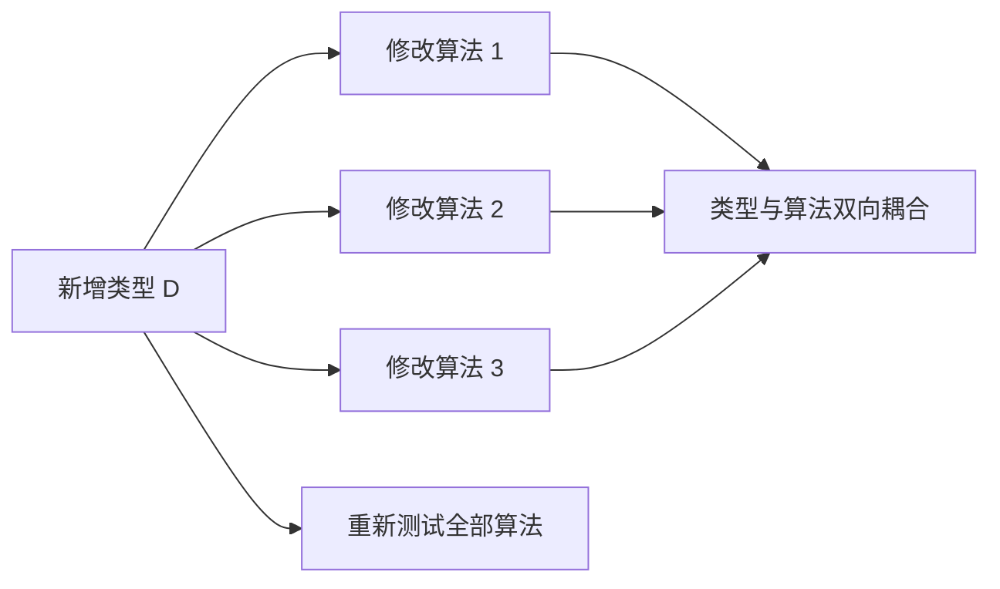

应当注意：如果分支表达的是算法内部天然存在的少数路径，例如“平凡可复制类型走 `memcpy`，其他类型逐元素复制”，`if constexpr` 完全合理。真正危险的是在算法里逐个枚举 `A`、`B`、`C` 等具体类型。

### 2.3 直接特化整个算法

既然不同类型需要不同实现，似乎可以直接特化函数或类模板。

```cpp
/**
 * @brief 通用处理函数模板声明。
 */
template <typename T>
void process(const T& value);

/**
 * @brief float 对应的完整函数模板特化。
 */
template <>
void process<float>(const float& value) {
    // float 的完整处理流程。
}

/**
 * @brief double 对应的完整函数模板特化。
 */
template <>
void process<double>(const double& value) {
    // double 的完整处理流程。
}
```

当不同类型的**完整流程确实不同**时，直接特化是正确方案。但如果不同类型之间有 90% 的流程相同，只有块大小、关联类型或某个操作节点不同，那么直接特化整个算法会带来：

- 公共流程被复制；
- 修复一个公共 Bug 时要修改多份实现；
- 不同特化容易逐渐发生行为漂移；
- 类型维度、架构维度、布局维度交叉后形成大量实现组合；
- 代码审查难以确认各特化是否仍然保持相同语义。

例如，一个 GEMM 主循环有加载、同步、MMA、流水线推进和尾部处理等大量公共步骤，而不同数据类型只改变 MMA 指令、Tile Shape 和共享内存布局。为每个组合复制完整 Kernel，维护成本会迅速失控。

### 2.4 使用运行时继承和虚函数

另一个常见思路是定义抽象基类，通过运行时多态选择行为。

```cpp
/**
 * @brief 运行时编解码器接口。
 */
class Codec {
public:
    /**
     * @brief 虚析构函数。
     */
    virtual ~Codec() = default;

    /**
     * @brief 执行运行时编码。
     */
    virtual void encode() const = 0;
};
```

运行时多态适合“对象的动态类型只有运行时才能确定”的场景，但它无法替代 Traits：

- `int`、`float`、裸指针等内置类型不能继承你的接口；
- 需要构造对象并通过指针或引用调用；
- 选择发生在运行时，无法直接驱动 `constexpr`、数组大小、模板实例化和指令选择；
- 虚调用、对象布局和生命周期管理可能产生额外成本；
- 关联类型无法通过虚函数直接表达。

Traits 和虚函数不是谁淘汰谁，而是分别服务于**静态多态**与**动态多态**。

| 维度 | Traits / 静态多态 | 虚函数 / 动态多态 |
|---|---|---|
| 选择时机 | 编译期 | 运行时 |
| 是否需要对象 | 通常不需要 | 需要对象或接口引用 |
| 能否产生关联类型 | 可以 | 不直接支持 |
| 能否驱动模板实例化 | 可以 | 不可以 |
| 内置类型适配 | 可以 | 不可以直接继承 |
| 代码生成 | 每个实例可能单独生成 | 通常共享虚函数实现 |
| 适合场景 | 类型在编译期已知 | 动态类型在运行时才知道 |

---

## 3. Traits 的本质：编译期类型映射与适配层

### 3.1 Traits 可以视为“类型函数”

最简化地说，Traits 是从一个或多个类型，映射到一组编译期信息的模板：

```text
Traits<T> -> {
    编译期常量,
    关联类型,
    能力描述,
    策略类型,
    可选的静态操作
}
```

例如：

```cpp
/**
 * @brief 一个最小的数值 Traits 示例。
 * @tparam T 被描述的数值类型。
 */
template <typename T>
struct NumericTraits;

/**
 * @brief float 的 Traits 完整特化。
 */
template <>
struct NumericTraits<float> {
    using accumulator_type = double;
    static constexpr int vector_width = 4;
    static constexpr bool supports_atomic = true;
};
```

算法不再直接判断 `T == float`，而是询问：

```cpp
/**
 * @brief 使用 Traits 提供的关联类型和常量执行计算。
 * @tparam T 输入数值类型。
 */
template <typename T>
void reduce_values() {
    using Accumulator = typename NumericTraits<T>::accumulator_type;
    constexpr int width = NumericTraits<T>::vector_width;

    // 公共归约流程只依赖抽象后的属性。
}
```

这意味着算法依赖的不是具体类型，而是一个稳定的**编译期协议**。

### 3.2 Traits 通常承担三类职责

#### 关联类型

关联类型是依赖于 `T` 的其他类型。例如：

- 迭代器的 `value_type` 与 `difference_type`；
- 分配器的 `pointer` 与 `size_type`；
- 浮点计算的累加类型；
- 容器的元素类型；
- GPU 操作对应的 MMA Atom 或 Copy Atom。

```cpp
/**
 * @brief 描述输入类型对应的累加类型。
 */
template <typename T>
struct AccumulatorTraits;

/**
 * @brief half 类型可映射到 float 累加类型的示意特化。
 */
template <>
struct AccumulatorTraits<Half> {
    using type = float;
};
```

#### 编译期常量和能力

Traits 可以暴露大小、对齐、类别、版本、能力开关等信息：

```cpp
/**
 * @brief 描述设备架构相关能力。
 */
template <typename Arch>
struct ArchitectureTraits {
    static constexpr bool supports_tma = false;
    static constexpr int warp_size = 32;
};
```

#### 策略或定制操作入口

Traits 可以关联一个 Policy 类型，让 Traits 负责“选择谁做”，Policy 负责“具体怎么做”。

```cpp
/**
 * @brief 通过 Traits 选择具体执行策略。
 * @tparam T 输入类型。
 */
template <typename T>
void serialize(const T& value) {
    using Policy = typename SerializationTraits<T>::policy;
    Policy::encode(value);
}
```

这是一种很有价值的职责划分：

- Traits 负责类型分类、元数据和策略选择；
- Policy 负责可执行行为；
- 泛型算法负责组织稳定流程。

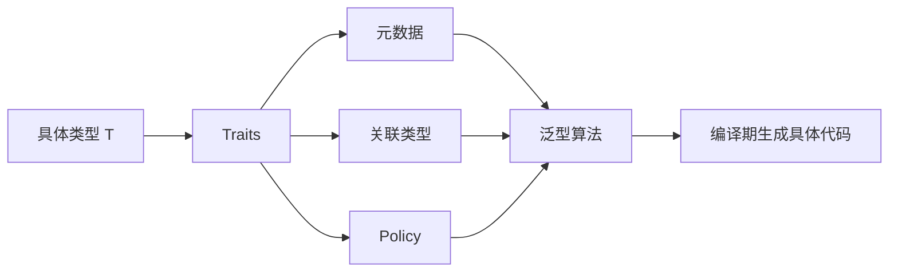

### 3.3 Traits 也是一种外部适配器

Traits 的价值不仅是“保存信息”，还在于把不统一的类型接口适配为统一协议。

假设某些类型定义了 `pointer`，另一些类型没有定义。算法若直接写 `Alloc::pointer`，就要求所有分配器都提供该成员；`allocator_traits` 则可以在缺失时计算合理默认值。

因此，一个成熟的 Traits 往往具有两层能力：

- 优先读取类型自身提供的信息；
- 若类型未提供，则根据规则推导默认值。

这使 Traits 具有类似编译期 Adapter 的作用。

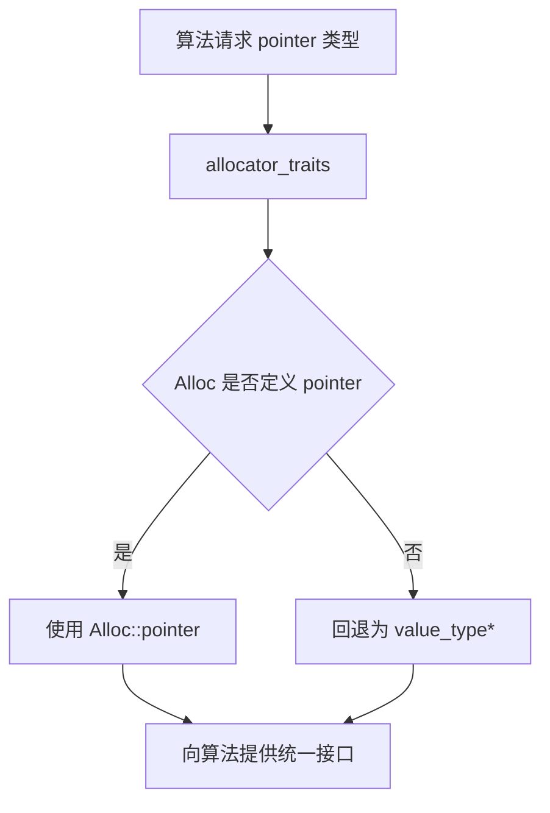

---

## 4. Traits 和模板特化到底是什么关系

这是最容易混淆的地方，可以用一句话概括：

> **模板特化是 C++ 语言机制；Traits 是利用模板、特化、检测和约束构建出来的一种设计结构。**

模板特化回答的是：

> 某个模板在特定模板参数下，应当采用什么定义？

Traits 回答的是：

> 泛型算法需要的类型知识，应该如何集中描述、统一访问并允许外部扩展？

两者不处于同一层级。Traits 经常使用完整特化和偏特化实现，但模板特化还可以用于很多非 Traits 场景，例如：

- 为特定类型实现不同容器；
- 为特定格式实现不同解析器；
- 为特定设备实现完全不同的执行后端；
- 实现函数对象、格式化器或哈希器。

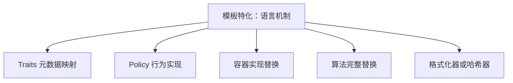

### 4.1 为什么不总是直接特化算法

假设一个算法由以下部分组成：

```text
参数校验 -> 资源准备 -> 数据加载 -> 核心操作 -> 尾部处理 -> 结果提交
```

如果不同类型只改变“核心操作”使用的具体指令，以及少量 Tile 参数，那么直接特化整个算法会复制其余公共流程。Traits 则可以只抽出真正变化的部分：


另一方面，如果 CPU 实现与 GPU 实现从数据结构、调度方式到执行流程都完全不同，那么直接特化后端类或选择两个独立实现反而更清晰。Traits 不是为了强行消灭所有特化，而是为了避免**不必要地特化整个流程**。

### 4.2 一个实用判断标准

- 不同类型改变的是**属性、关联类型、常量或局部策略**：优先考虑 Traits；
- 不同类型改变的是**整个控制流、状态机或算法语义**：考虑直接特化或独立实现；
- 只有少量固定分支，且分支属于算法内部固有逻辑：`if constexpr` 足够；
- 类型只能在运行时确定：使用虚函数、`std::variant`、类型擦除或注册表；
- 只需要表达“能不能调用”：Concept 往往比单独设计 Traits 更直接。

| 问题 | 更合适的工具 |
|---|---|
| `T` 是否可复制、可比较或可迭代 | Concept / type trait |
| `T` 的元素类型、累加类型是什么 | Traits |
| `T` 应选择哪个局部策略 | Traits + Policy |
| 不同 `T` 的完整算法完全不同 | 模板特化 / 重载 / 独立后端 |
| 类型在运行时才确定 | 动态多态 / 类型擦除 / variant |
| 只有两个稳定的编译期路径 | `if constexpr` / tag dispatch |

---

## 5. Traits 带来的工程价值

### 5.1 稳定算法与易变类型知识分离

Traits 最重要的价值是建立清晰的变化边界：

- 算法负责稳定流程；
- Traits 负责随类型变化的信息；
- Policy 负责可替换的局部行为；
- Concept 负责入口约束和错误诊断。

这样新增类型时，通常只需补充对应 Traits 或 Policy，不必修改算法主体。

### 5.2 支持内置类型、第三方类型和不可侵入扩展

由于 Traits 位于类型外部，它可以描述：

- `int*` 等内置类型；
- 标准库容器；
- 无法修改源码的第三方类型；
- 不希望依赖框架的业务类型。

这避免了“为了接入一个框架而污染业务对象”的侵入式设计。

### 5.3 避免复制公共算法

Traits 让算法只保留一份公共流程，只把变化点参数化。它降低了：

- Bug 修复遗漏风险；
- 多份特化行为漂移风险；
- 测试矩阵复杂度；
- 代码审查负担；
- 组合维度增加时的实现数量。

### 5.4 提供统一的编译期协议

算法不必知道信息来自哪里，只需使用统一写法：

```cpp
/**
 * @brief 通过统一 Traits 协议获取类型信息。
 */
template <typename T>
void algorithm() {
    using Value = typename traits<T>::value_type;
    constexpr auto category = traits<T>::category;
    using Policy = typename traits<T>::policy;
}
```

这类似于运行时接口，但它在编译期生效，并且可以返回类型和常量。

### 5.5 零运行时分派成本

Traits 查询、特化选择和 Policy 绑定都在编译期完成。编译器看到的是已经确定的类型、常量和函数，因此通常可以：

- 内联调用；
- 消除无效分支；
- 把常量用于数组大小和循环展开；
- 为不同类型生成专门代码；
- 在 GPU 代码中选择不同指令与静态布局。

需要强调，“零运行时分派成本”不代表“零成本”。Traits 可能增加：

- 模板实例化数量；
- 编译时间；
- 二进制代码膨胀；
- 错误信息复杂度。

因此 Traits 设计仍需控制模板层次和实例化规模。

### 5.6 形成开放的扩展点

一个良好的 Traits 模板相当于向下游用户声明：

> 你可以通过满足这一编译期协议，让新类型进入我的泛型算法。

不过，开放扩展点必须明确约束，否则可能出现冲突特化、ODR 问题和语义不一致。后文会详细讨论。

---

## 6. 设计一个 Traits 时必须考虑的问题

### 6.1 主模板应该“不完整”还是提供默认值

常见方案一：只声明主模板，不定义。

```cpp
/**
 * @brief 只有显式支持的类型才允许实例化。
 */
template <typename T>
struct codec_traits;
```

优点：

- 未支持类型会尽早失败；
- 不会意外采用错误默认行为；
- 适合必须显式注册的协议。

缺点：

- 报错可能表现为“不完整类型”，可读性一般；
- Concept 检测时需要额外技巧。

常见方案二：主模板提供 `supported = false`。

```cpp
/**
 * @brief 默认拒绝未知类型，并为约束检测提供稳定成员。
 */
template <typename T>
struct codec_traits {
    static constexpr bool supported = false;
};
```

优点：

- 易于构造 Concept；
- 可给出定制化 `static_assert`；
- 检测表达式更稳定。

缺点：

- 如果其他成员只存在于特化中，错误仍可能比较深；
- 设计者要防止用户绕过 `supported` 直接访问不存在成员。

选择原则：

- 需要严格显式注册：主模板不完整或 `supported=false`；
- 可以安全推导通用默认行为：主模板提供默认实现；
- 默认行为可能悄悄产生错误语义：宁可拒绝，不要“聪明回退”。

### 6.2 必须规范化 `const`、`volatile` 和引用

用户传入的类型可能是：

```text
T
const T
T&
const T&
T&&
```

如果 Traits 只特化了 `T`，直接查询 `traits<const T&>` 会失败。通常应在算法入口统一归一化：

```cpp
/**
 * @brief 移除引用与 cv 限定后的统一类型。
 */
template <typename T>
using normalized_t = std::remove_cvref_t<T>;

/**
 * @brief 使用规范化类型查询 Traits。
 */
template <typename T>
void use_traits(T&& value) {
    using Value = normalized_t<T>;
    using Traits = my_traits<Value>;
}
```

但不能机械地总是移除所有限定：

- 指针的顶层 `const` 与指向对象的 `const` 不同；
- 引用类别有时本身就是语义的一部分；
- `volatile` 在硬件寄存器和并发底层代码中可能不能丢失；
- 数组类型可能需要保留长度信息。

设计前要明确 Traits 描述的是“值类型本身”，还是“完整表达式类型”。

### 6.3 完整特化、偏特化和受约束特化如何分工

#### 完整特化：描述一个明确类型

```cpp
/**
 * @brief std::string 的完整 Traits 特化。
 */
template <>
struct codec_traits<std::string> {
    static constexpr bool supported = true;
};
```

#### 偏特化：描述一类具有模板结构的类型

```cpp
/**
 * @brief 所有 std::vector<T, Alloc> 的 Traits 偏特化。
 */
template <typename T, typename Alloc>
struct codec_traits<std::vector<T, Alloc>> {
    using element_type = T;
    using allocator_type = Alloc;
};
```

#### 受约束特化：描述满足某种语义类别的类型

```cpp
/**
 * @brief 所有整数类型的受约束 Traits 特化。
 */
template <typename T>
    requires std::integral<T>
struct codec_traits<T> {
    static constexpr bool supported = true;
};
```

设计时要关注特化重叠：

- `bool` 同时满足 `std::integral`，但可能需要单独处理；
- 多个受约束偏特化可能同时匹配；
- 越具体的特化通常应表达越特殊的语义；
- 不应依赖读者难以推断的复杂偏序关系。

### 6.4 Traits、Concept 和检测习惯应分层

Traits 与 Concept 的职责不同：

- Traits 描述“这个类型有什么”；
- Concept 判断“这个模板参数是否满足入口要求”；
- `requires` 表达式检测“某个语法是否有效”。

推荐组合：

```cpp
/**
 * @brief 默认不支持未知类型。
 */
template <typename T>
struct codec_traits {
    static constexpr bool supported = false;
};

/**
 * @brief 判断类型是否可编码。
 */
template <typename T>
concept Encodable = codec_traits<std::remove_cvref_t<T>>::supported;

/**
 * @brief 只接受可编码类型的泛型入口。
 */
template <Encodable T>
void encode(const T& value) {
    using Traits = codec_traits<std::remove_cvref_t<T>>;
    typename Traits::policy policy;
    // 使用 Traits 选择的策略。
}
```

Concept 不应只是为了“显得现代”。它最有价值的作用是：

- 在模板入口附近失败；
- 清晰表达库的语义要求；
- 避免错误深入几十层模板后才爆发；
- 帮助重载解析选择正确路径。

### 6.5 Traits 中应该放行为吗

没有绝对禁止。标准库中的一些 Traits 包含静态函数，例如 `std::char_traits`；很多库也会把小型定制操作直接放在 Traits 中。但大型设计中最好区分：

- 元数据、关联类型、类别：放在 Traits；
- 较复杂或有状态的行为：放在 Policy、函数对象或独立实现；
- Traits 只通过 `using policy = ...` 选择 Policy。

这样做的好处是：

- Traits 保持轻量；
- 行为可以独立测试；
- 同一 Policy 可被多个 Traits 复用；
- 元数据与执行逻辑不会互相污染；
- 更容易替换行为而不改变描述协议。

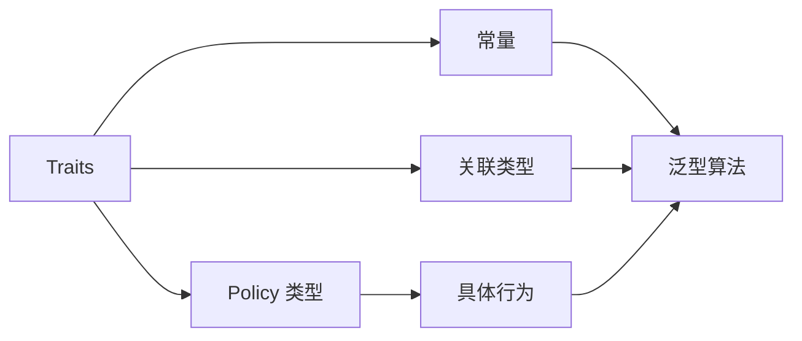

### 6.6 是否允许类型自身提供嵌套信息

有两种常见风格：

- 外部特化式：所有信息都通过 `traits<T>` 特化提供；
- 自描述 + 适配式：类型可定义嵌套成员，Traits 负责读取和补默认值。

后者类似标准库 `iterator_traits` 和 `allocator_traits` 的设计精神。它适合“类型作者通常能够修改类型，但还要支持裸指针或旧类型”的场景。

设计时应回答：

- 类型作者和算法作者是否属于同一团队；
- 是否需要适配第三方类型；
- 是否需要默认推导；
- 用户应在哪里声明扩展；
- 冲突时类型内成员与外部特化谁优先。

### 6.7 扩展点应该由谁拥有

Traits 主模板一般放在框架命名空间中，用户为自己的类型提供特化时，也必须遵守 C++ 的特化声明规则。对于自定义库，常见写法是：

```cpp
namespace framework {

/**
 * @brief 框架定义的 Traits 主模板。
 */
template <typename T>
struct traits;

} // namespace framework

namespace framework {

/**
 * @brief 为用户类型提供 Traits 完整特化。
 */
template <>
struct traits<user::MyType> {
    static constexpr bool supported = true;
};

} // namespace framework
```

需要明确：

- 特化必须在允许声明该特化的命名空间中；
- 同一个程序中不能出现互相冲突的特化；
- 特化定义应放在所有使用点都能看到的头文件中；
- 多个动态库分别提供同一特化可能导致 ODR 与行为不一致；
- 不要随意特化 `std` 命名空间中的模板。

对于标准库模板，只有标准明确允许、且满足指定条件时才可为用户定义类型提供特化。很多 `std::is_*` 类型特征不允许用户特化，擅自特化会导致未定义行为。常见明确扩展点包括符合要求的 `std::hash`、`std::formatter`，以及用户定义算术类型对应的 `std::numeric_limits` 等。应逐项查阅对应标准规定，而不是把“标准模板都能特化”当作通用规则。

### 6.8 默认值必须安全，而不是仅仅方便

Traits 很容易设计出过度聪明的回退机制。一个默认值只有在以下条件下才值得提供：

- 对所有匹配类型都语义正确；
- 不会掩盖用户忘记注册；
- 不会导致数据损坏、安全问题或 ABI 不兼容；
- 推导规则简单且可解释；
- 用户可以显式覆盖。

例如，未知对象默认按 `memcpy` 序列化通常是危险的，因为对象可能包含指针、填充字节、虚表和非平凡生命周期。此时正确做法是默认拒绝，而不是自动回退。

### 6.9 错误信息必须在公共入口附近产生

模板库最糟糕的体验之一，是用户漏写一个 Traits 特化，最终却在几十层实现内部看到“没有名为 `policy` 的类型”。改进方式包括：

- 使用 Concept 约束公共 API；
- 在入口处 `static_assert(Traits::supported)`；
- 给主模板提供稳定的检测成员；
- 将实现细节放入 `detail` 命名空间；
- 让错误信息直接说明缺少哪个定制点。

```cpp
/**
 * @brief 在公共入口处给出明确诊断。
 */
template <typename T>
void encode(const T& value) {
    using Value = std::remove_cvref_t<T>;
    static_assert(
        codec_traits<Value>::supported,
        "encode<T>: 请为 T 提供 codec_traits 特化"
    );
}
```

### 6.10 控制模板实例化与编译时间

Traits 会促进静态分派，但大型库不能忽视编译成本：

- 避免在 Traits 中嵌套过深的元编程；
- 不要反复计算同一个复杂类型表达式；
- 使用中间别名改善可读性和诊断；
- 把与模板参数无关的实现移到普通函数或 `.cpp` 文件；
- 对高频组合考虑显式实例化；
- 避免把所有实现都塞进一个巨型头文件；
- 检查不同 Traits 组合是否造成不必要的代码膨胀。

在高性能代码中，编译期专门化是性能来源之一，但也必须管理实例化空间。CUTLASS 一类库之所以构建复杂，并不是 Traits 没有代价，而是它用更高的编译成本换取大量静态专门化能力。

### 6.11 Traits 需要测试什么

Traits 不仅要测试运行结果，还应测试编译期协议：

```cpp
/**
 * @brief 编译期验证 Traits 协议。
 */
static_assert(Encodable<int>);
static_assert(Encodable<std::vector<int>>);
static_assert(!Encodable<void*>);
static_assert(std::same_as<codec_traits<int>::wire_type, unsigned int>);
```

测试范围包括：

- 正确类型是否匹配正确特化；
- 不支持类型是否被拒绝；
- `const T&` 等修饰类型是否正确归一化；
- 偏特化是否意外覆盖更具体特化；
- 默认值是否符合规则；
- Traits 选择的 Policy 是否产生正确运行结果；
- 新增类型后是否无需修改公共算法。

---

## 7. 标准库中的典型 Traits

标准库中的 Traits 并不都采用完全相同形式，但它们共享一个核心思想：**把类型相关知识集中到统一模板协议中，使泛型组件能够以同一种方式访问。**

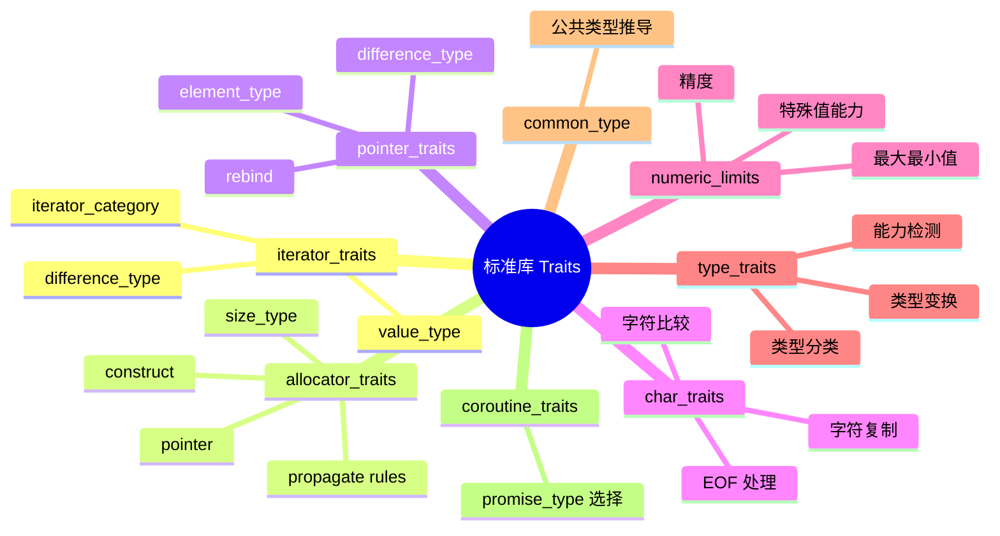

### 7.1 `std::iterator_traits`

泛型迭代器算法需要获得：

- `value_type`；
- `difference_type`；
- `pointer`；
- `reference`；
- `iterator_category` 或相关概念信息。

如果算法直接要求 `Iterator::value_type`，裸指针 `int*` 就无法满足，因为裸指针没有成员类型。`iterator_traits` 提供了统一入口，并可对指针进行专门处理。

```cpp
/**
 * @brief 通过 iterator_traits 获取迭代器值类型。
 * @tparam Iterator 任意受支持的迭代器类型。
 */
template <typename Iterator>
void consume_range(Iterator first, Iterator last) {
    using Value = typename std::iterator_traits<Iterator>::value_type;

    for (; first != last; ++first) {
        const Value& value = *first;
        // 处理 value。
    }
}
```

其设计价值不只是读取嵌套类型，更是让普通迭代器与裸指针都符合统一协议。

### 7.2 `std::allocator_traits`

`allocator_traits<Alloc>` 是非常典型的“编译期适配器”。它统一暴露：

- `value_type`、`pointer`、`const_pointer`；
- `size_type`、`difference_type`；
- `rebind_alloc<T>`；
- `allocate`、`deallocate`、`construct`、`destroy`；
- 容器复制、移动、交换时分配器是否传播的规则。

如果 Allocator 没定义某些成员，`allocator_traits` 可以按标准规则提供默认推导。这让容器实现不需要针对“完整分配器”和“最小分配器”写两套代码。

```cpp
/**
 * @brief 通过 allocator_traits 使用任意兼容分配器。
 */
template <typename Allocator>
void allocate_one(Allocator& allocator) {
    using Traits = std::allocator_traits<Allocator>;
    using Pointer = typename Traits::pointer;

    Pointer pointer = Traits::allocate(allocator, 1);
    Traits::deallocate(allocator, pointer, 1);
}
```

### 7.3 `std::pointer_traits`

`pointer_traits<Ptr>` 把裸指针和 fancy pointer 统一为相似接口，提供：

- `pointer`；
- `element_type`；
- `difference_type`；
- `rebind<U>`；
- `pointer_to`。

它允许分配器与容器不必假设指针一定是 `T*`，这对共享内存、持久化内存、GPU 地址包装等自定义指针类型很重要。

### 7.4 `std::char_traits`

`basic_string<CharT, Traits, Allocator>` 的第二个模板参数就是字符 Traits。`char_traits` 不仅保存类型信息，还提供字符比较、赋值、查找、复制、长度计算以及 EOF 转换等静态操作。

```cpp
/**
 * @brief 使用自定义字符 Traits 的字符串类型示意。
 */
using CustomString = std::basic_string<char, CustomCharTraits>;
```

这说明 Traits 并不被严格限制为“只能有常量和类型”。如果操作与被描述类型紧密相关、无状态、体量较小，把静态操作放在 Traits 中也是成熟做法。

### 7.5 `std::numeric_limits<T>`

`numeric_limits<T>` 描述某个数值类型的边界和能力，例如：

- `min()`、`max()`、`lowest()`；
- `digits`、`digits10`；
- 是否有无穷大、NaN；
- 是否有符号；
- 舍入方式和指数范围。

算法因此不需要用 `if (T == float)` 逐类型判断数值性质。

```cpp
/**
 * @brief 使用 numeric_limits 获取类型安全的最大值。
 */
template <typename T>
[[nodiscard]] constexpr T largest_value() {
    return std::numeric_limits<T>::max();
}
```

### 7.6 `<type_traits>` 中的类型特征

`std::is_integral_v<T>`、`std::is_trivially_copyable_v<T>`、`std::remove_reference_t<T>` 等也体现 Traits 思想：

- 分类 Traits：回答某个性质是否成立；
- 变换 Traits：从一个类型计算另一个类型；
- 关系 Traits：判断两个类型之间的关系；
- 构造与赋值 Traits：判断某种表达式是否可行。

它们更接近纯粹的“编译期类型函数”。现代 C++ 中，很多 `_t` 和 `_v` 别名让使用更简洁：

```cpp
/**
 * @brief 根据类型是否可平凡复制选择路径。
 */
template <typename T>
void copy_objects(T* destination, const T* source, std::size_t count) {
    if constexpr (std::is_trivially_copyable_v<T>) {
        std::memcpy(destination, source, count * sizeof(T));
    } else {
        std::copy_n(source, count, destination);
    }
}
```

这里 `if constexpr` 与 Traits 配合得很好：Traits 提供性质，算法根据性质选择少量稳定路径。问题从来不是禁止 `if constexpr`，而是避免在算法内硬编码所有具体类型。

### 7.7 `std::common_type` 与 `std::common_reference`

这类 Traits 从多个类型计算一个共同类型，用于算术、比较、范围和泛型接口。它们展示了 Traits 不必是“一种类型到一组属性”，也可以是：

```text
Traits<T, U, ...> -> 某个关联类型
```

### 7.8 `std::coroutine_traits`

协程返回类型与参数类型共同决定 `promise_type`。编译器通过 `coroutine_traits<R, Args...>::promise_type` 获取协程所需协议。这是 Traits 作为**语言与用户类型之间编译期适配层**的典型案例。

---

## 8. 开源库与高性能计算中的 Traits

在大型模板库中，Traits 常常与 Policy、Tag Dispatch、Concept、CRTP 和静态工厂组合使用。

### 8.1 序列化与 RPC 框架

Traits 可描述：

- 类型编号；
- Schema 版本；
- 是否定长；
- 字段访问方式；
- 编码策略；
- 是否支持零拷贝；
- 是否需要字节序转换。

泛型框架只组织缓冲区、错误处理和递归流程，具体类型通过 Traits 接入。

### 8.2 数学库与表达式模板

Eigen 一类库会通过 Traits 描述：

- 标量类型；
- 行列数是否静态已知；
- 存储顺序；
- 对齐要求；
- 表达式类别；
- 是否适合向量化；
- 返回表达式类型。

这使表达式组合仍可在编译期推导出最终执行策略。

### 8.3 CUDA、CUTLASS 与 CuTe 风格代码

高性能 GPU 模板库特别依赖编译期信息，因为很多内容必须在编译时确定：

- Tile Shape；
- Warp 或 Warpgroup 划分；
- MMA Atom；
- Copy Atom；
- Shared Memory Layout；
- Pipeline Stage 数量；
- 架构能力；
- 数据类型和累加类型；
- 对齐与向量化宽度。

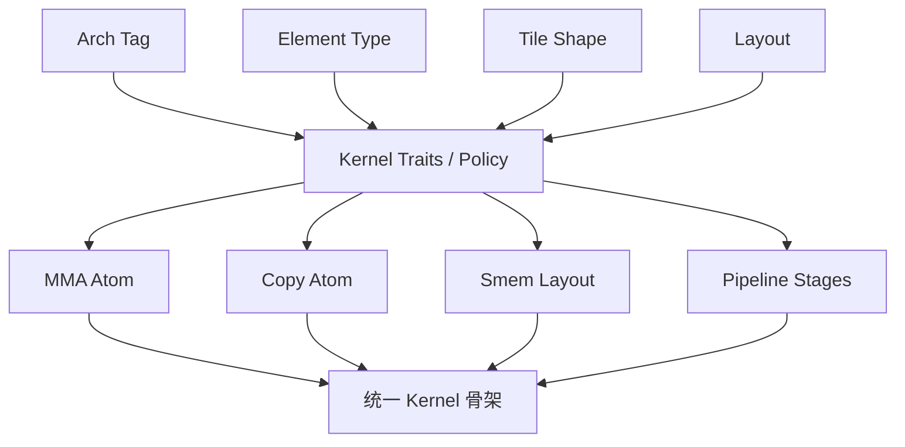

统一 Kernel 骨架可以继续描述：

```text
加载 -> 同步 -> MMA -> 流水线推进 -> Epilogue
```

而 Traits/Policy 负责把抽象节点绑定到特定架构实现。需要注意，真实 CUTLASS/CuTe 设计比简单 `FooTraits<T>` 更丰富，常常直接使用类型本身承载静态结构、Tag、Policy 和组合式模板，但其背后的核心思想仍是：**把变化点转化为编译期类型信息，避免复制整个算法骨架。**

### 8.4 容器、内存池与资源管理

Traits 可以描述：

- 对象是否需要析构；
- 是否可移动；
- 内存对齐；
- 分配器传播规则；
- 地址类型；
- 资源是否线程安全；
- 是否支持批量分配。

但涉及运行时资源状态时，不应把所有内容塞进无状态 Traits。Traits 更适合选择资源类型和静态能力，实际资源对象仍应正常持有状态。

---

## 9. Traits 的常见误用与反模式

### 9.1 把 Traits 当成全局配置垃圾桶

```cpp
/**
 * @brief 一个职责过载的反面示例。
 */
template <typename T>
struct EverythingTraits {
    static constexpr int network_timeout = 1000;
    static constexpr int database_pool_size = 32;
    static constexpr bool enable_logging = true;
    using allocator = SomeAllocator;
    using codec = SomeCodec;
    using scheduler = SomeScheduler;
};
```

如果这些配置不真正由 `T` 决定，就不应放在 `Traits<T>` 中。Traits 应描述与模板参数存在稳定语义关系的信息，而不是借模板机制隐藏全局配置。

### 9.2 Traits 与 Policy 不分

如果 Traits 中包含数百行复杂算法，它已经不再是轻量描述层。此时应考虑：

- 抽出 Policy；
- 抽出函数对象；
- 抽出后端实现类；
- Traits 只保留 `using policy = ...`。

### 9.3 对每个具体类型都写完整特化

如果一整类类型共享规则，例如所有整数、所有 `std::vector<T>`，应优先使用受约束特化或偏特化。逐个写 `int`、`long`、`long long` 特化会重复规则，也容易漏类型。

### 9.4 默认回退过于宽松

未知类型自动按字节复制、自动认为线程安全、自动认为可零拷贝等，可能产生严重错误。无法证明安全时，主模板应拒绝实例化。

### 9.5 算法仍然知道所有具体类型

有时表面引入了 Traits，但算法仍写：

```cpp
/**
 * @brief 名义上使用 Traits，实际上仍枚举具体类型的反面示例。
 */
template <typename T>
void bad_algorithm() {
    if constexpr (std::same_as<T, A>) {
        // A 路径。
    } else if constexpr (std::same_as<T, B>) {
        // B 路径。
    }
}
```

真正的解耦应该让算法根据**语义属性或类别**分派，而不是继续认识类型名字。

### 9.6 为标准库类型特征做非法特化

不要为了让某个泛型算法通过，就擅自特化 `std::is_trivially_copyable<MyType>` 等标准类型特征。很多标准类型特征不允许用户特化。正确做法通常是：

- 定义自己的 Traits；
- 定义自己的 Concept；
- 为标准明确允许的扩展点提供合法特化；
- 修改算法约束，使其表达真实语义。

### 9.7 只追求“零开销”，忽略二进制膨胀

每个 Traits 组合都可能产生不同模板实例。对配置维度进行笛卡尔积会带来：

- 编译变慢；
- 链接变慢；
- 可执行文件增大；
- 指令缓存压力；
- 调试困难。

静态多态不是越多越好。某些低频路径可以使用运行时分派，减少实例化组合。

---

## 10. 什么时候用 Traits，什么时候直接特化

下面的决策图可以作为实际设计时的检查清单。

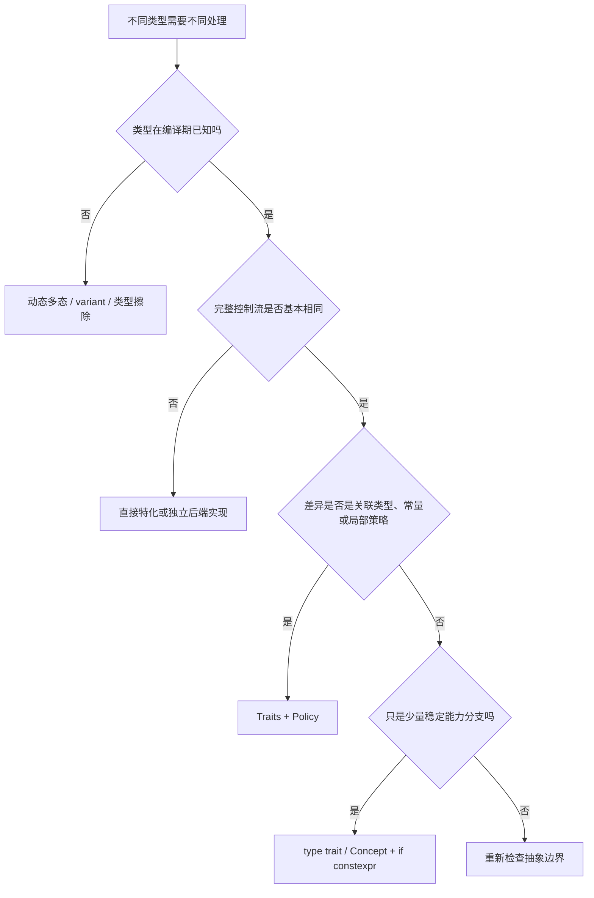

可以进一步用以下问题判断：

- 新增一种类型时，是否应该修改算法源码？
- 不同类型之间有多少公共控制流？
- 变化点能否命名为明确的属性、类别或策略？
- 这个信息是否真正依赖模板参数？
- 下游用户是否需要在不修改框架的情况下扩展？
- 是否需要支持内置类型或第三方类型？
- 选择结果是否必须用于编译期常量、类型推导或指令生成？
- 静态专门化产生的实例数量是否可控？

一个非常实用的经验是：

> **先找到稳定流程，再识别变化点；Traits 只描述变化点，不负责掩盖一个本来就不存在的公共算法。**

---

## 11. 完整示例项目：Traits 驱动的二进制编解码框架

下面构建一个小型但完整、可编译、可测试的 C++20 项目。这个项目不是为了实现生产级序列化协议，而是集中演示 Traits 的关键设计：

- 主模板默认拒绝未知类型；
- 使用完整特化支持 `bool`、`std::string` 和业务对象；
- 使用受约束偏特化支持所有整数与浮点类型；
- 使用偏特化递归支持 `std::vector<T, Allocator>`；
- Traits 提供元数据、关联类型和 Policy；
- Policy 提供具体编解码行为；
- `encode/decode` 保持唯一公共入口；
- Concept 与 `static_assert` 提供编译期诊断；
- 新增 `Point` 后，`std::vector<Point>` 自动获得支持；
- 单元测试验证编译期协议与运行时往返结果。

### 11.1 项目目标与非目标

项目实现以下线格式：

- 整数：固定宽度小端字节；
- `float` / `double`：保留位模式后按整数编码；
- 字符串：`uint32_t` 长度前缀 + 原始字符；
- `vector`：`uint32_t` 元素数量 + 递归编码各元素；
- `Point`：按 `x`、`y`、`label` 字段顺序编码。

项目故意省略的生产特性：

- Schema 演进与兼容迁移；
- 校验和、压缩和加密；
- 恶意输入的资源上限；
- 跨语言协议定义；
- 零拷贝视图；
- 可变长度整数；
- 错误码体系；
- 大端主机完整验证。

### 11.2 架构图

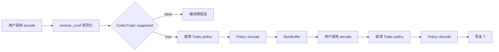

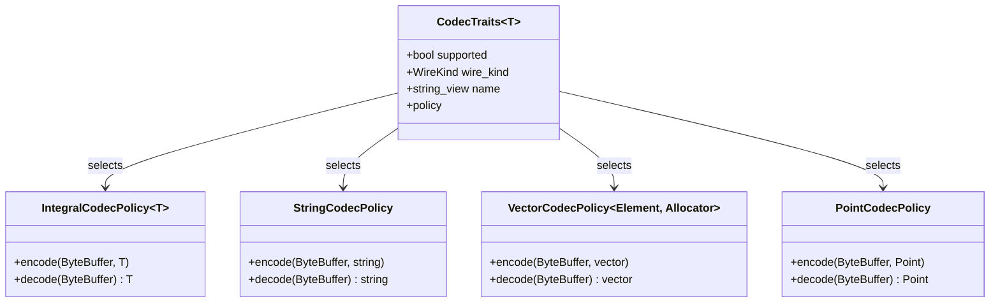

### 11.3 项目目录

```text
traits_tutorial_project/
├── CMakeLists.txt
├── include/
│   └── traits_demo/
│       ├── byte_buffer.hpp
│       ├── codec_fwd.hpp
│       ├── codec_traits.hpp
│       ├── codec.hpp
│       └── model.hpp
├── src/
│   └── main.cpp
└── tests/
    └── test_codec.cpp
```

### 11.4 构建方式

```bash
cmake -S . -B build -G Ninja
cmake --build build
ctest --test-dir build --output-on-failure
./build/traits_demo_app
```

本教程生成时已使用 GCC 14.2、C++20 和 Ninja 实际构建，并通过测试。

### 11.5 `CMakeLists.txt`

```cmake
cmake_minimum_required(VERSION 3.20)
project(traits_tutorial_project LANGUAGES CXX)

set(CMAKE_CXX_STANDARD 20)
set(CMAKE_CXX_STANDARD_REQUIRED ON)
set(CMAKE_CXX_EXTENSIONS OFF)

add_library(traits_demo INTERFACE)
target_include_directories(traits_demo INTERFACE ${CMAKE_CURRENT_SOURCE_DIR}/include)

add_executable(traits_demo_app src/main.cpp)
target_link_libraries(traits_demo_app PRIVATE traits_demo)

add_executable(traits_demo_test tests/test_codec.cpp)
target_link_libraries(traits_demo_test PRIVATE traits_demo)

enable_testing()
add_test(NAME traits_demo_test COMMAND traits_demo_test)
```

### 11.6 `byte_buffer.hpp`：只管理字节，不理解对象

```cpp
#pragma once

#include <cstddef>
#include <cstdint>
#include <cstring>
#include <span>
#include <stdexcept>
#include <vector>

namespace traits_demo {

/**
 * @brief 一个最小可用的字节缓冲区。
 *
 * 该类型只负责保存字节与维护读取游标，不负责理解对象类型。
 * “对象如何编码”由 CodecTraits 选择的策略负责。
 */
class ByteBuffer {
public:
    /**
     * @brief 向缓冲区尾部追加一段原始字节。
     * @param bytes 待追加的连续字节序列。
     */
    void append(std::span<const std::byte> bytes) {
        data_.insert(data_.end(), bytes.begin(), bytes.end());
    }

    /**
     * @brief 从当前读取位置取出指定数量的字节。
     * @param size 需要读取的字节数。
     * @return 指向内部存储的只读字节视图。
     * @throws std::out_of_range 剩余数据不足时抛出。
     */
    [[nodiscard]] std::span<const std::byte> read(std::size_t size) {
        if (read_pos_ + size > data_.size()) {
            throw std::out_of_range("ByteBuffer: insufficient bytes");
        }

        const auto result = std::span<const std::byte>{data_}.subspan(read_pos_, size);
        read_pos_ += size;
        return result;
    }

    /**
     * @brief 清空读取进度，但保留已经写入的数据。
     */
    void rewind() noexcept {
        read_pos_ = 0;
    }

    /**
     * @brief 获取缓冲区中保存的全部字节。
     */
    [[nodiscard]] const std::vector<std::byte>& data() const noexcept {
        return data_;
    }

    /**
     * @brief 获取尚未读取的字节数。
     */
    [[nodiscard]] std::size_t remaining() const noexcept {
        return data_.size() - read_pos_;
    }

private:
    std::vector<std::byte> data_;
    std::size_t read_pos_{0};
};

} // namespace traits_demo
```

### 11.7 `codec_fwd.hpp`：打破递归模板声明依赖

```cpp
#pragma once

namespace traits_demo {

class ByteBuffer;

/**
 * @brief 将任意受支持类型编码到字节缓冲区。
 * @tparam T 待编码对象类型。
 */
template <typename T>
void encode(ByteBuffer& buffer, const T& value);

/**
 * @brief 从字节缓冲区解码一个对象。
 * @tparam T 目标对象类型。
 * @return 解码后的对象。
 */
template <typename T>
[[nodiscard]] T decode(ByteBuffer& buffer);

} // namespace traits_demo
```

### 11.8 `codec_traits.hpp`：Traits 协议与特化集合

```cpp
#pragma once

#include <concepts>
#include <cstdint>
#include <string>
#include <string_view>
#include <type_traits>
#include <vector>

#include "traits_demo/byte_buffer.hpp"
#include "traits_demo/codec_fwd.hpp"

namespace traits_demo {

/**
 * @brief 线格式的大类，用于展示 Traits 可以暴露编译期元数据。
 */
enum class WireKind {
    scalar,
    text,
    sequence,
    object
};

/**
 * @brief 整数编码策略的前置声明。
 */
template <std::integral T>
struct IntegralCodecPolicy;

/**
 * @brief 浮点编码策略的前置声明。
 */
template <std::floating_point T>
struct FloatingCodecPolicy;

/**
 * @brief 字符串编码策略的前置声明。
 */
struct StringCodecPolicy;

/**
 * @brief 顺序容器编码策略的前置声明。
 */
template <typename Element, typename Allocator>
struct VectorCodecPolicy;

/**
 * @brief CodecTraits 的主模板。
 *
 * 默认不支持任何未知类型。相比直接让主模板不完整，显式 supported=false
 * 可以让 Concept 与 static_assert 给出更可读的诊断。
 */
template <typename T>
struct CodecTraits {
    static constexpr bool supported = false;
};

/**
 * @brief bool 的完整特化。
 *
 * bool 不使用 std::make_unsigned_t，因此单独给出特化。
 */
template <>
struct CodecTraits<bool> {
    static constexpr bool supported = true;
    static constexpr WireKind wire_kind = WireKind::scalar;
    static constexpr std::string_view name = "bool";
    using policy = IntegralCodecPolicy<std::uint8_t>;
    using wire_type = std::uint8_t;
};

/**
 * @brief 所有非 bool 整数类型的受约束偏特化。
 */
template <typename T>
    requires std::integral<T> && (!std::same_as<T, bool>)
struct CodecTraits<T> {
    static constexpr bool supported = true;
    static constexpr WireKind wire_kind = WireKind::scalar;
    static constexpr std::string_view name = "integral";
    using policy = IntegralCodecPolicy<T>;
    using wire_type = std::make_unsigned_t<T>;
};

/**
 * @brief 所有浮点类型的受约束偏特化。
 */
template <typename T>
    requires std::floating_point<T>
struct CodecTraits<T> {
    static constexpr bool supported = (sizeof(T) == 4 || sizeof(T) == 8);
    static constexpr WireKind wire_kind = WireKind::scalar;
    static constexpr std::string_view name = "floating_point";
    using policy = FloatingCodecPolicy<T>;
    using wire_type = std::conditional_t<sizeof(T) == 4, std::uint32_t, std::uint64_t>;
};

/**
 * @brief std::string 的完整特化。
 */
template <>
struct CodecTraits<std::string> {
    static constexpr bool supported = true;
    static constexpr WireKind wire_kind = WireKind::text;
    static constexpr std::string_view name = "std::string";
    using policy = StringCodecPolicy;
};

/**
 * @brief std::vector<T> 的偏特化。
 *
 * 只有元素类型本身可编码时，vector 才可编码。
 */
template <typename Element, typename Allocator>
struct CodecTraits<std::vector<Element, Allocator>> {
    static constexpr bool supported = CodecTraits<std::remove_cv_t<Element>>::supported;
    static constexpr WireKind wire_kind = WireKind::sequence;
    static constexpr std::string_view name = "std::vector";
    using element_type = Element;
    using policy = VectorCodecPolicy<Element, Allocator>;
};

/**
 * @brief 统一移除 const、volatile 与引用后的类型。
 */
template <typename T>
using normalized_t = std::remove_cvref_t<T>;

/**
 * @brief 判断类型是否存在有效的 CodecTraits 描述。
 */
template <typename T>
concept Encodable = CodecTraits<normalized_t<T>>::supported;

/**
 * @brief 获取类型对应的线格式大类。
 * @tparam T 需要查询的类型。
 */
template <Encodable T>
inline constexpr WireKind wire_kind_v = CodecTraits<normalized_t<T>>::wire_kind;

} // namespace traits_demo
```

### 11.9 `codec.hpp`：Policy 实现与统一算法入口

```cpp
#pragma once

#include <bit>
#include <cstddef>
#include <cstdint>
#include <limits>
#include <stdexcept>
#include <type_traits>
#include <utility>
#include <vector>

#include "traits_demo/codec_traits.hpp"

namespace traits_demo {

/**
 * @brief 将整数按小端序写入缓冲区。
 */
template <std::integral T>
struct IntegralCodecPolicy {
    /**
     * @brief 编码整数值。
     */
    static void encode(ByteBuffer& buffer, T value) {
        using Unsigned = std::make_unsigned_t<T>;
        Unsigned bits = static_cast<Unsigned>(value);

        for (std::size_t index = 0; index < sizeof(T); ++index) {
            const auto byte_value = static_cast<unsigned char>((bits >> (index * 8U)) & 0xFFU);
            const std::byte byte{byte_value};
            buffer.append(std::span<const std::byte>{&byte, 1});
        }
    }

    /**
     * @brief 从小端序字节恢复整数值。
     */
    [[nodiscard]] static T decode(ByteBuffer& buffer) {
        using Unsigned = std::make_unsigned_t<T>;
        Unsigned bits = 0;
        const auto bytes = buffer.read(sizeof(T));

        for (std::size_t index = 0; index < sizeof(T); ++index) {
            bits |= static_cast<Unsigned>(std::to_integer<unsigned char>(bytes[index])) << (index * 8U);
        }

        return static_cast<T>(bits);
    }
};

/**
 * @brief 将 float 或 double 的位模式编码为固定宽度整数。
 */
template <std::floating_point T>
struct FloatingCodecPolicy {
    using Wire = typename CodecTraits<T>::wire_type;

    /**
     * @brief 编码浮点数，保持其 IEEE 位模式。
     */
    static void encode(ByteBuffer& buffer, T value) {
        static_assert(sizeof(T) == sizeof(Wire));
        IntegralCodecPolicy<Wire>::encode(buffer, std::bit_cast<Wire>(value));
    }

    /**
     * @brief 从固定宽度整数位模式恢复浮点数。
     */
    [[nodiscard]] static T decode(ByteBuffer& buffer) {
        const Wire bits = IntegralCodecPolicy<Wire>::decode(buffer);
        return std::bit_cast<T>(bits);
    }
};

/**
 * @brief 使用 uint32_t 长度前缀编码字符串。
 */
struct StringCodecPolicy {
    /**
     * @brief 编码字符串长度和字符内容。
     */
    static void encode(ByteBuffer& buffer, const std::string& value) {
        if (value.size() > std::numeric_limits<std::uint32_t>::max()) {
            throw std::length_error("StringCodecPolicy: string too large");
        }

        IntegralCodecPolicy<std::uint32_t>::encode(
            buffer,
            static_cast<std::uint32_t>(value.size())
        );

        const auto* begin = reinterpret_cast<const std::byte*>(value.data());
        buffer.append(std::span<const std::byte>{begin, value.size()});
    }

    /**
     * @brief 解码字符串长度和字符内容。
     */
    [[nodiscard]] static std::string decode(ByteBuffer& buffer) {
        const auto size = IntegralCodecPolicy<std::uint32_t>::decode(buffer);
        const auto bytes = buffer.read(size);
        return std::string{
            reinterpret_cast<const char*>(bytes.data()),
            bytes.size()
        };
    }
};

/**
 * @brief 使用 uint32_t 元素数量前缀编码 std::vector<T>。
 */
template <typename Element, typename Allocator>
struct VectorCodecPolicy {
    /**
     * @brief 逐元素编码顺序容器。
     */
    static void encode(ByteBuffer& buffer, const std::vector<Element, Allocator>& values) {
        if (values.size() > std::numeric_limits<std::uint32_t>::max()) {
            throw std::length_error("VectorCodecPolicy: vector too large");
        }

        IntegralCodecPolicy<std::uint32_t>::encode(
            buffer,
            static_cast<std::uint32_t>(values.size())
        );

        for (const auto& value : values) {
            traits_demo::encode(buffer, value);
        }
    }

    /**
     * @brief 逐元素解码顺序容器。
     */
    [[nodiscard]] static std::vector<Element, Allocator> decode(ByteBuffer& buffer) {
        const auto size = IntegralCodecPolicy<std::uint32_t>::decode(buffer);
        std::vector<Element, Allocator> values;
        values.reserve(size);

        for (std::uint32_t index = 0; index < size; ++index) {
            values.push_back(traits_demo::decode<Element>(buffer));
        }

        return values;
    }
};

/**
 * @brief 统一编码入口。
 *
 * 算法自身不枚举具体类型，只通过 CodecTraits 取得策略。
 */
template <typename T>
void encode(ByteBuffer& buffer, const T& value) {
    using Value = normalized_t<T>;
    static_assert(
        CodecTraits<Value>::supported,
        "encode<T>: T has no valid CodecTraits specialization"
    );

    using Policy = typename CodecTraits<Value>::policy;

    if constexpr (std::same_as<Value, bool>) {
        Policy::encode(buffer, static_cast<std::uint8_t>(value ? 1U : 0U));
    } else {
        Policy::encode(buffer, value);
    }
}

/**
 * @brief 统一解码入口。
 *
 * 返回类型由调用方指定，具体实现仍由 Traits 所关联的策略决定。
 */
template <typename T>
[[nodiscard]] T decode(ByteBuffer& buffer) {
    using Value = normalized_t<T>;
    static_assert(
        CodecTraits<Value>::supported,
        "decode<T>: T has no valid CodecTraits specialization"
    );

    using Policy = typename CodecTraits<Value>::policy;

    if constexpr (std::same_as<Value, bool>) {
        return Policy::decode(buffer) != 0U;
    } else {
        return Policy::decode(buffer);
    }
}

} // namespace traits_demo
```

### 11.10 `model.hpp`：让业务类型通过 Traits 接入

```cpp
#pragma once

#include <string>
#include <string_view>

#include "traits_demo/codec.hpp"

namespace traits_demo {

/**
 * @brief 示例业务对象。
 */
struct Point {
    int x{};
    int y{};
    std::string label;

    /**
     * @brief 比较两个点对象的全部字段。
     */
    friend bool operator==(const Point&, const Point&) = default;
};

/**
 * @brief Point 对应的编码策略。
 */
struct PointCodecPolicy {
    /**
     * @brief 按字段顺序编码 Point。
     */
    static void encode(ByteBuffer& buffer, const Point& point) {
        traits_demo::encode(buffer, point.x);
        traits_demo::encode(buffer, point.y);
        traits_demo::encode(buffer, point.label);
    }

    /**
     * @brief 按相同字段顺序解码 Point。
     */
    [[nodiscard]] static Point decode(ByteBuffer& buffer) {
        return Point{
            .x = traits_demo::decode<int>(buffer),
            .y = traits_demo::decode<int>(buffer),
            .label = traits_demo::decode<std::string>(buffer)
        };
    }
};

/**
 * @brief 为第三方式业务类型 Point 提供完整 Traits 特化。
 *
 * 泛型 encode/decode 无须修改，即可自动支持 Point 及 vector<Point>。
 */
template <>
struct CodecTraits<Point> {
    static constexpr bool supported = true;
    static constexpr WireKind wire_kind = WireKind::object;
    static constexpr std::string_view name = "traits_demo::Point";
    static constexpr std::uint32_t schema_version = 1;
    using policy = PointCodecPolicy;
};

} // namespace traits_demo
```

### 11.11 `main.cpp`：使用统一入口完成往返编码

```cpp
#include <iostream>
#include <vector>

#include "traits_demo/model.hpp"

/**
 * @brief 展示 Traits 驱动的统一编解码流程。
 */
int main() {
    using traits_demo::ByteBuffer;
    using traits_demo::Point;

    const std::vector<Point> source{
        Point{.x = 1, .y = 2, .label = "first"},
        Point{.x = -7, .y = 42, .label = "second"}
    };

    ByteBuffer buffer;
    traits_demo::encode(buffer, source);
    buffer.rewind();

    const auto restored = traits_demo::decode<std::vector<Point>>(buffer);

    std::cout << "encoded bytes: " << buffer.data().size() << '\n';
    std::cout << "restored objects: " << restored.size() << '\n';
    std::cout << "round trip: " << std::boolalpha << (source == restored) << '\n';

    return source == restored ? 0 : 1;
}
```

### 11.12 `test_codec.cpp`：编译期与运行时测试

```cpp
#include <cassert>
#include <cmath>
#include <string>
#include <vector>

#include "traits_demo/model.hpp"

/**
 * @brief 验证标量、字符串、容器和自定义对象的往返编码。
 */
int main() {
    using traits_demo::ByteBuffer;
    using traits_demo::Point;

    static_assert(traits_demo::Encodable<int>);
    static_assert(traits_demo::Encodable<std::string>);
    static_assert(traits_demo::Encodable<std::vector<Point>>);
    static_assert(!traits_demo::Encodable<void*>);

    ByteBuffer buffer;

    traits_demo::encode(buffer, -12345);
    traits_demo::encode(buffer, 3.25);
    traits_demo::encode(buffer, std::string{"traits"});
    traits_demo::encode(buffer, Point{.x = 8, .y = 9, .label = "P"});
    traits_demo::encode(buffer, std::vector<int>{1, 2, 3, 5, 8});

    buffer.rewind();

    assert(traits_demo::decode<int>(buffer) == -12345);
    assert(std::abs(traits_demo::decode<double>(buffer) - 3.25) < 1e-12);
    assert(traits_demo::decode<std::string>(buffer) == "traits");
    assert((traits_demo::decode<Point>(buffer) == Point{.x = 8, .y = 9, .label = "P"}));
    assert((traits_demo::decode<std::vector<int>>(buffer) == std::vector<int>{1, 2, 3, 5, 8}));
    assert(buffer.remaining() == 0);

    return 0;
}
```


### 11.13 这个项目中的 Traits 到底做了什么

以 `std::vector<Point>` 为例，编译器执行的逻辑可以概念化为：

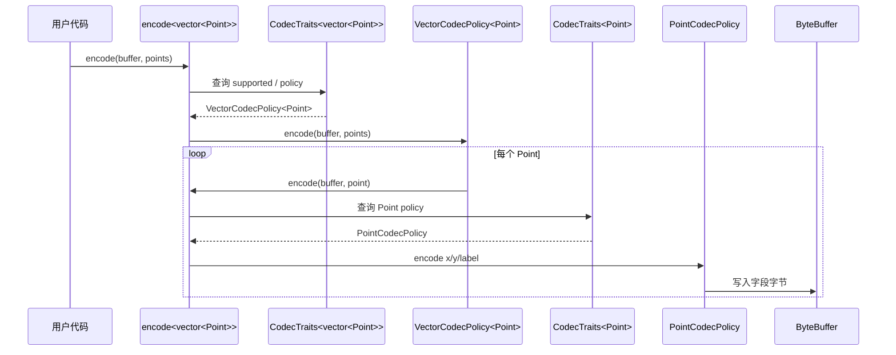

关键点在于：

- `encode` 并不知道 `int`、`string`、`vector` 或 `Point` 的名字；
- 它只知道所有支持类型都应提供 `CodecTraits<T>::policy`；
- `vector` Policy 递归调用同一个公共 `encode`；
- 当 `Point` 获得 Traits 特化后，`vector<Point>` 的偏特化自动成立；
- 新增类型不会迫使修改统一入口，也不会复制缓冲区和递归流程。

### 11.14 为什么这里不直接特化 `encode<Point>`

当然可以写：

```cpp
/**
 * @brief 直接特化 Point 编码入口的替代方案示意。
 */
template <>
void encode<Point>(ByteBuffer& buffer, const Point& point) {
    encode(buffer, point.x);
    encode(buffer, point.y);
    encode(buffer, point.label);
}
```

对单个简单类型而言，这并没有立即造成灾难。但随着框架增加以下公共逻辑：

- 版本写入；
- 长度检查；
- 错误上下文；
- 统计指标；
- Schema 注册；
- 压缩或校验；
- tracing；
- 编码前后的公共 Hook；

直接特化每个 `encode<T>` 会让这些公共逻辑散落在所有特化中。Traits + Policy 则允许统一入口先完成公共工作，再调用类型 Policy：

```cpp
/**
 * @brief 带公共前后处理的统一编码入口示意。
 */
template <typename T>
void encode(ByteBuffer& buffer, const T& value) {
    using Value = std::remove_cvref_t<T>;
    using Traits = CodecTraits<Value>;
    using Policy = typename Traits::policy;

    begin_trace(Traits::name);
    validate_schema<Value>();
    Policy::encode(buffer, value);
    end_trace(Traits::name);
}
```

这样，类型差异只存在于 Policy，而公共框架行为始终只有一份。

### 11.15 如何新增一个业务类型

假设新增：

```cpp
/**
 * @brief 新增业务对象。
 */
struct UserRecord {
    std::uint64_t id{};
    std::string name;
};
```

只需定义 Policy 与 Traits：

```cpp
/**
 * @brief UserRecord 的字段级编码策略。
 */
struct UserRecordCodecPolicy {
    /**
     * @brief 编码 UserRecord。
     */
    static void encode(ByteBuffer& buffer, const UserRecord& value) {
        traits_demo::encode(buffer, value.id);
        traits_demo::encode(buffer, value.name);
    }

    /**
     * @brief 解码 UserRecord。
     */
    [[nodiscard]] static UserRecord decode(ByteBuffer& buffer) {
        return UserRecord{
            .id = traits_demo::decode<std::uint64_t>(buffer),
            .name = traits_demo::decode<std::string>(buffer)
        };
    }
};

/**
 * @brief UserRecord 的 Traits 完整特化。
 */
template <>
struct CodecTraits<UserRecord> {
    static constexpr bool supported = true;
    static constexpr WireKind wire_kind = WireKind::object;
    static constexpr std::string_view name = "UserRecord";
    static constexpr std::uint32_t schema_version = 1;
    using policy = UserRecordCodecPolicy;
};
```

随后以下类型都会自然获得支持：

```cpp
/**
 * @brief 验证新增类型及其容器组合均可编码。
 */
static_assert(Encodable<UserRecord>);
static_assert(Encodable<std::vector<UserRecord>>);
```

公共 `encode/decode` 完全不需要修改，这正是 Traits 扩展边界的意义。

### 11.16 项目中值得注意的工程细节

- `CodecTraits<T>` 主模板显式提供 `supported=false`，让 Concept 和诊断稳定；
- `normalized_t<T>` 统一处理引用和顶层 cv 限定；
- `bool` 单独完整特化，避免套用普通整数规则时碰到 `make_unsigned<bool>` 等问题；
- `std::vector<Element, Allocator>` 保留分配器模板参数，不错误假设只有默认分配器；
- Traits 只选择 Policy，复杂编码行为不堆在 Traits 中；
- `Point` 的特化位于 Traits 主模板所属命名空间；
- `vector` 通过递归公共 API 组合元素类型，而不是自己枚举元素类型；
- 单元测试既验证运行结果，也用 `static_assert` 验证编译期协议；
- 字节缓冲区与类型系统解耦，便于以后替换为网络缓冲区、文件映射或零拷贝 Writer。

### 11.17 生产化时应该继续演进什么

如果把这个示例扩展为真实项目，建议按以下方向演进：

- 把 `ByteBuffer` 拆分为 Writer 与 Reader 接口；
- 为 Reader 设置最大字符串和容器长度，防止恶意输入耗尽内存；
- 设计结构化错误类型，而不是只抛标准异常；
- 引入 Schema ID、版本和兼容策略；
- 明确整数宽度，不直接把平台相关的 `int` 暴露为跨语言协议；
- 为连续平凡元素实现批量编码优化；
- 增加 `std::span`、`std::array`、`std::optional`、`std::variant` 等偏特化；
- 对重复类型实例考虑显式实例化；
- 通过 fuzzing 验证解码器对畸形输入的鲁棒性；
- 避免通过 Traits 默认接受任意 trivially copyable 对象，因为填充字节和 ABI 仍可能不稳定。

---

## 12. 总结

Traits 的语法往往只有几行，但它代表的是一种重要的架构思维：

- 泛型算法不应直接认识所有具体类型；
- 类型本身也不应被迫嵌入所有外部框架知识；
- 模板特化负责实现不同模板参数下的定义变化；
- Traits 利用特化建立统一、可扩展的编译期类型协议；
- Concept 负责约束，Traits 负责描述，Policy 负责局部行为，算法负责稳定流程；
- 当变化只是属性、关联类型或局部策略时，Traits 能避免复制完整算法；
- 当完整流程和语义都不同，直接特化或独立实现更诚实；
- Traits 的真正价值不是技巧炫耀，而是控制依赖方向、扩展边界和变化范围。

可以把最终心智模型压缩为下面这张图：

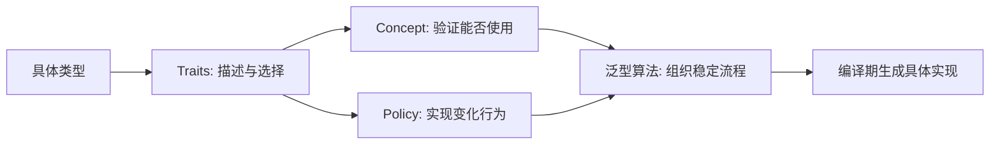

最后再用一句工程化表述概括：

> **Traits 是把“算法必须知道的类型知识”从算法和类型本身中抽离出来，形成一个可特化、可检测、可组合的编译期适配层。**

当你在 STL、Boost、Eigen、fmt、CUDA、CUTLASS 或 CuTe 中看到大量 `xxx_traits<T>`、Tag、Policy 和嵌套类型时，不应只把它们理解成模板技巧。它们背后通常是在做同一件事：**保留一份稳定算法，把类型差异压缩到明确的编译期扩展点中。**
