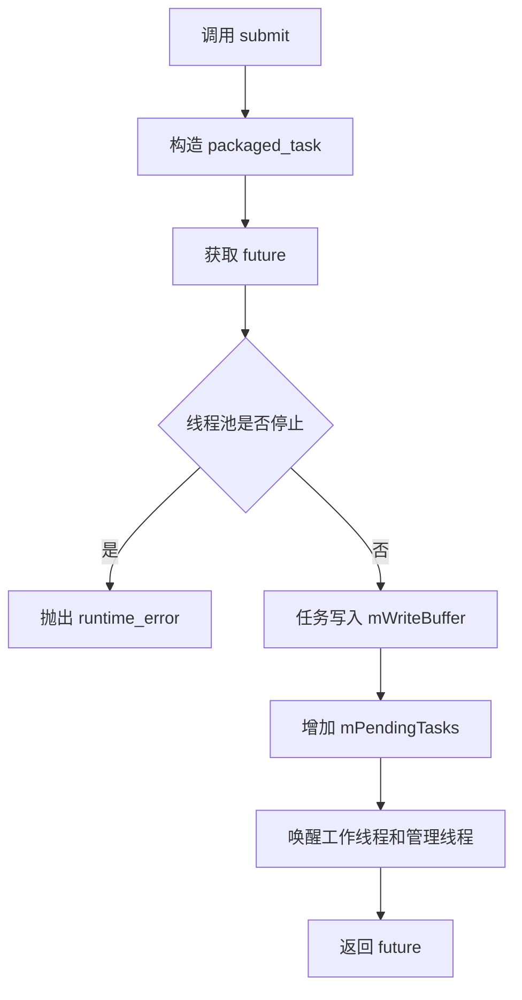
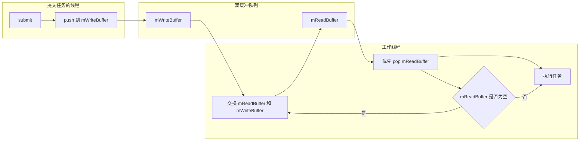
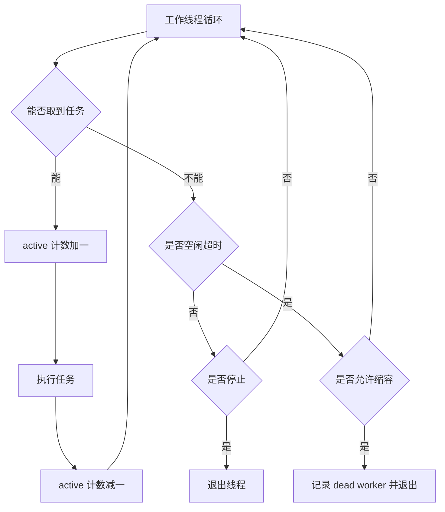
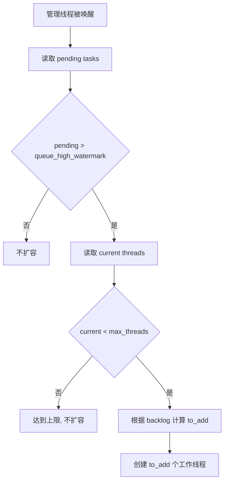
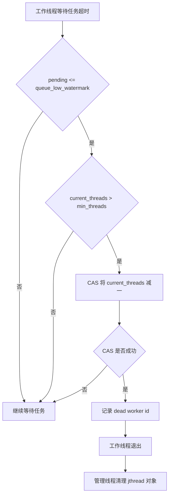
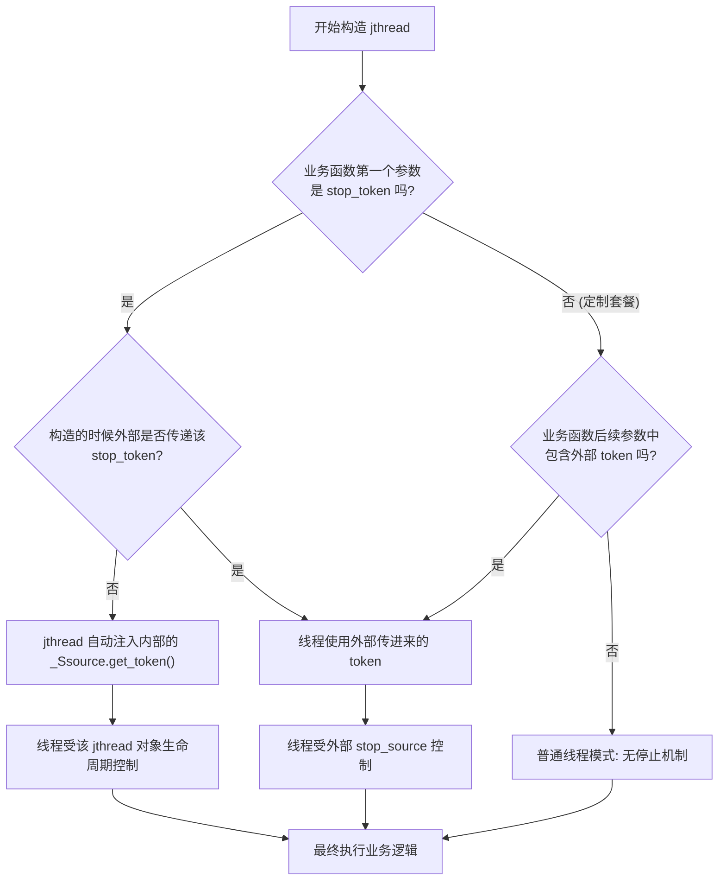

# C++20 弹性线程池实现说明

```cpp
#pragma once

#include <algorithm>
#include <atomic>
#include <chrono>
#include <condition_variable>
#include <functional>
#include <future>
#include <memory>
#include <mutex>
#include <queue>
#include <stdexcept>
#include <thread>
#include <type_traits>
#include <utility>
#include <vector>

/**
 * @brief C++20 弹性线程池。
 *
 * 使用 std::jthread 管理线程生命周期，使用双缓冲队列降低任务提交时的锁竞争。
 * queue_high_watermark 用于触发扩容，queue_low_watermark 配合 idle_timeout 用于空闲缩容。
 */
class ThreadPool {
public:
    /**
     * @brief 线程池内部统一保存的任务类型。
     *
     * 任务已经被包装成无参数、无返回值形式；原始返回值通过 std::future 返回给 submit() 调用者。
     */
    using Task = std::function<void()>;

    /**
     * @brief 线程池运行参数。
     */
    struct Config {
        /**
         * @brief 保底工作线程数量。
         *
         * 空闲缩容时线程池不会低于该数量；传入 0 时会被 normalizeConfig() 修正为 1。
         */
        std::size_t min_threads = 2;

        /**
         * @brief 允许创建的最大工作线程数量。
         *
         * 高水位扩容时不会超过该数量；传入 0 时会被 normalizeConfig() 修正为 1。
         */
        std::size_t max_threads = std::thread::hardware_concurrency();

        /**
         * @brief 工作线程空闲等待超时时间。
         *
         * 工作线程在该时间内没有拿到任务，会进入缩容判断流程。
         */
        std::chrono::milliseconds idle_timeout{1000};

        /**
         * @brief 触发扩容的任务队列高水位线。
         *
         * 当待执行任务数大于该值时，管理线程会尝试创建更多工作线程。
         */
        std::size_t queue_high_watermark = 50;

        /**
         * @brief 允许缩容的任务队列低水位线。
         *
         * 只有待执行任务数不大于该值时，空闲超时的工作线程才允许退出。
         */
        std::size_t queue_low_watermark = 10;
    };

    /**
     * @brief 使用默认配置创建线程池。
     */
    ThreadPool()
        : ThreadPool(Config{}) {
    }

    /**
     * @brief 使用指定配置创建线程池。
     *
     * @param config 线程池配置，构造时会自动修正不合法的线程数和水位线。
     */
    explicit ThreadPool(Config config)
        : mConfig(normalizeConfig(config)) {
        std::lock_guard lock(mWorkersMutex);

        // 构造阶段先创建保底线程，确保线程池一启动就能处理任务。
        for (std::size_t i = 0; i < mConfig.min_threads; ++i) {
            createWorkerUnlocked();
        }

        // 管理线程负责后续扩容和清理已退出的工作线程对象。
        startManagerThread();
    }

    /**
     * @brief 停止线程池，并等待已经提交的任务执行完成。
     */
    ~ThreadPool() {
        stop();
    }

    /**
     * @brief 禁止复制线程池。
     *
     * 线程池独占管理工作线程、条件变量和任务队列，复制这些同步资源没有明确语义。
     */
    ThreadPool(const ThreadPool&) = delete;

    /**
     * @brief 禁止复制赋值线程池。
     *
     * 线程池独占管理工作线程、条件变量和任务队列，复制赋值这些同步资源没有明确语义。
     */
    ThreadPool& operator=(const ThreadPool&) = delete;

    /**
     * @brief 提交一个任务到线程池。
     *
     * @tparam F 可调用对象类型。
     * @tparam Args 可调用对象参数类型。
     * @param f 待执行的可调用对象。
     * @param args 传递给可调用对象的参数。
     * @return std::future<std::invoke_result_t<F, Args...>> 用于获取任务返回值或异常。
     */
    template <typename F, typename... Args>
    auto submit(F&& f, Args&&... args) -> std::future<std::invoke_result_t<F, Args...>> {
        using ReturnType = std::invoke_result_t<F, Args...>;

        // promise 负责把任务返回值或异常传递到 future。
        auto promise = std::make_shared<std::promise<ReturnType>>();
        auto future = promise->get_future();
        auto task = [promise,
                     f = std::forward<F>(f),
                     ... args = std::forward<Args>(args)]() mutable {
            try {
                if constexpr (std::is_void_v<ReturnType>) {
                    std::invoke(std::forward<F>(f), std::forward<Args>(args)...);
                    promise->set_value();
                } else {
                    promise->set_value(std::invoke(std::forward<F>(f), std::forward<Args>(args)...));
                }
            } catch (...) {
                promise->set_exception(std::current_exception());
            }
        };

        {
            // 提交和 stop() 共用这把锁，避免 stop() 设置停止状态后仍有新任务入队。
            std::lock_guard submit_lock(mSubmitMutex);
            if (mStopping.load(std::memory_order_acquire)) {
                throw std::runtime_error("ThreadPool is stopping");
            }

            // 线程池内部任务统一成 void()，调用方通过 future 观察执行结果。
            enqueueTaskUnlocked(std::move(task));
        }

        return future;
    }

    /**
     * @brief 停止接收新任务，并等待已经提交的任务执行完成。
     */
    void stop() {
        {
            // 先阻止新的 submit() 入队，再唤醒各类等待线程进入退出流程。
            std::lock_guard submit_lock(mSubmitMutex);
            bool expected = false;
            if (!mStopping.compare_exchange_strong(expected, true, std::memory_order_acq_rel)) {
                return;
            }
        }

        // 唤醒工作线程和管理线程，避免它们继续阻塞在条件变量上。
        mTaskCv.notify_all();
        mManagerCv.notify_all();

        // 管理线程先退出，后续不再创建新工作线程或清理容器。
        mManagerThread.request_stop();
        if (mManagerThread.joinable()) {
            mManagerThread.join();
        }

        std::lock_guard lock(mWorkersMutex);
        for (auto& worker : mWorkers) {
            // jthread 析构也会 join，这里显式 join 让 stop() 的完成语义更清晰。
            if (worker.joinable()) {
                worker.join();
            }
        }
        mWorkers.clear();
        mCurrentThreads.store(0, std::memory_order_relaxed);
    }

    /**
     * @brief 返回当前工作线程数量。
     *
     * @return 当前线程池内仍被管理的工作线程数量。
     */
    [[nodiscard]] std::size_t threadCount() const noexcept {
        return mCurrentThreads.load(std::memory_order_relaxed);
    }

    /**
     * @brief 返回正在执行任务的线程数量。
     *
     * @return 当前正在执行任务的工作线程数量。
     */
    [[nodiscard]] std::size_t activeThreadCount() const noexcept {
        return mActiveThreads.load(std::memory_order_relaxed);
    }

    /**
     * @brief 返回尚未开始执行的任务数量。
     *
     * @return 等待工作线程获取的任务数量。
     */
    [[nodiscard]] std::size_t pendingTaskCount() const noexcept {
        return mPendingTasks.load(std::memory_order_relaxed);
    }

private:
    /**
     * @brief 修正线程池配置中的非法值。
     *
     * @param config 调用方传入的配置。
     * @return Config 修正后的配置。
     */
    static Config normalizeConfig(Config config) {
        if (config.max_threads == 0) {
            config.max_threads = 1;
        }
        if (config.min_threads == 0) {
            config.min_threads = 1;
        }
        if (config.max_threads < config.min_threads) {
            config.max_threads = config.min_threads;
        }
        if (config.queue_low_watermark > config.queue_high_watermark) {
            config.queue_low_watermark = config.queue_high_watermark;
        }
        return config;
    }

    /**
     * @brief 在已经通过提交/停止检查后，将任务写入写缓冲队列。
     *
     * @param task 已包装成 void() 的任务对象。
     */
    void enqueueTaskUnlocked(Task task) {
        {
            std::lock_guard lock(mWriteMutex);
            mWriteBuffer.push(std::move(task));
        }

        // mPendingTasks 表示尚未被工作线程取走的任务数量，是扩缩容判断的核心指标。
        mPendingTasks.fetch_add(1, std::memory_order_relaxed);

        // 同时通知消费者和管理者：消费者可以取任务，管理者可以根据积压判断是否扩容。
        mTaskCv.notify_one();
        mManagerCv.notify_one();
    }

    /**
     * @brief 从双缓冲队列中取出一个任务。
     *
     * @param task 输出参数，成功时接收一个待执行任务。
     * @return true 成功取到任务。
     * @return false 当前读写缓冲都没有可执行任务。
     */
    bool moveTaskTo(Task& task) {
        if (mReadBuffer.empty()) {
            // 只有读缓冲耗尽时才接触写缓冲，把生产者队列整批交换给消费者。
            std::lock_guard write_lock(mWriteMutex);
            if (!mWriteBuffer.empty()) {
                std::swap(mReadBuffer, mWriteBuffer);
            }
        }

        if (mReadBuffer.empty()) {
            return false;
        }

        // 任务一旦从队列中弹出，就不再计入 pending。
        task = std::move(mReadBuffer.front());
        mReadBuffer.pop();
        mPendingTasks.fetch_sub(1, std::memory_order_relaxed);
        return true;
    }

    /**
     * @brief 判断双缓冲队列中是否仍有任务。
     *
     * @return true 读缓冲或写缓冲中至少有一个任务。
     * @return false 当前没有排队任务。
     *
     * @note 调用方需要已经持有 mReadMutex，因此函数名带 Unlocked 表示不会再锁读缓冲。
     */
    bool hasQueuedTasksUnlocked() const {
        if (!mReadBuffer.empty()) {
            return true;
        }

        // 写缓冲由提交线程写入，检查时仍然需要持有写锁。
        std::lock_guard write_lock(mWriteMutex);
        return !mWriteBuffer.empty();
    }

    /**
     * @brief 工作线程尝试获取一个任务，必要时等待新任务或空闲超时。
     *
     * @param task 输出参数，成功时接收一个待执行任务。
     * @param stop_token jthread 提供的协作式停止令牌。
     * @param idle_timed_out 输出参数，返回 false 时用于区分是否因为空闲超时。
     * @return true 成功获取任务。
     * @return false 没有获取任务，原因可能是停止或空闲超时。
     */
    bool tryGetTask(Task& task, std::stop_token stop_token, bool& idle_timed_out) {
        idle_timed_out = false;
        std::unique_lock read_lock(mReadMutex);

        while (!stop_token.stop_requested()) {
            // 快路径：读缓冲有任务时直接取；读缓冲为空时尝试和写缓冲交换。
            if (moveTaskTo(task)) {
                return true;
            }

            // stop() 采用 drain 语义：队列取空后，工作线程才响应停止并退出。
            if (mStopping.load(std::memory_order_acquire)) {
                return false;
            }

            // 等待期间释放 mReadMutex；被唤醒后重新检查停止状态和两个缓冲队列。
            const bool notified = mTaskCv.wait_for(
                read_lock,
                mConfig.idle_timeout,
                [&] {
                    return stop_token.stop_requested()
                        || mStopping.load(std::memory_order_acquire)
                        || hasQueuedTasksUnlocked();
                });

            if (!notified) {
                // 超时不直接退出，交给 workerLoop() 根据低水位线和最小线程数决定。
                idle_timed_out = true;
                return false;
            }
        }

        return false;
    }

    /**
     * @brief 工作线程主循环。
     *
     * @param stop_token jthread 提供的协作式停止令牌。
     */
    void workerLoop(std::stop_token stop_token) {
        while (!stop_token.stop_requested()) {
            Task task;
            bool idle_timed_out = false;

            if (tryGetTask(task, stop_token, idle_timed_out)) {
                // active 只统计正在执行任务的线程，不包含等待任务的空闲线程。
                mActiveThreads.fetch_add(1, std::memory_order_relaxed);
                try {
                    task();
                } catch (...) {
                    // packaged_task 会把任务异常保存到 future；这里兜底防止线程异常退出。
                }
                mActiveThreads.fetch_sub(1, std::memory_order_relaxed);
                continue;
            }

            if (idle_timed_out && shouldRetireIdleWorker()) {
                // 当前线程被选中缩容退出，先记录 id 供管理线程清理 mWorkers。
                rememberDeadWorker();
                return;
            }

            // 停止状态下，tryGetTask() 已经确认没有可取任务，线程可以退出。
            if (mStopping.load(std::memory_order_acquire)) {
                return;
            }
        }
    }

    /**
     * @brief 判断当前空闲工作线程是否允许退出。
     *
     * @return true 当前线程成功占用一个缩容名额，可以退出。
     * @return false 当前线程应继续等待任务。
     */
    bool shouldRetireIdleWorker() {
        if (mPendingTasks.load(std::memory_order_relaxed) > mConfig.queue_low_watermark) {
            return false;
        }

        std::size_t current = mCurrentThreads.load(std::memory_order_relaxed);
        while (current > mConfig.min_threads) {
            // 多个空闲线程可能同时超时，CAS 确保不会把线程数减到 min_threads 以下。
            if (mCurrentThreads.compare_exchange_weak(
                    current, current - 1, std::memory_order_relaxed, std::memory_order_relaxed)) {
                return true;
            }
        }

        return false;
    }

    /**
     * @brief 记录即将退出的工作线程 id。
     *
     * 管理线程稍后会根据这些 id 从 mWorkers 中移除对应的 std::jthread 对象。
     */
    void rememberDeadWorker() {
        std::lock_guard lock(mDeadWorkersMutex);
        mDeadWorkers.push_back(std::this_thread::get_id());
        mManagerCv.notify_one();
    }

    /**
     * @brief 创建管理线程。
     *
     * 管理线程负责高水位扩容和清理已主动退出的工作线程对象。
     */
    void startManagerThread() {
        mManagerThread = std::jthread([this](std::stop_token stop_token) {
            while (!stop_token.stop_requested() && !mStopping.load(std::memory_order_acquire)) {
                {
                    std::unique_lock lock(mManagerMutex);
                    // 周期性醒来或被任务提交唤醒；只有超过高水位时才需要扩容。
                    mManagerCv.wait_for(lock, std::chrono::milliseconds(200), [&] {
                        return stop_token.stop_requested()
                            || mStopping.load(std::memory_order_acquire)
                            || mPendingTasks.load(std::memory_order_relaxed) > mConfig.queue_high_watermark;
                    });
                }

                if (stop_token.stop_requested() || mStopping.load(std::memory_order_acquire)) {
                    break;
                }

                // 先根据积压扩容，再清理已经因空闲缩容退出的线程对象。
                expandIfNeeded();
                cleanupDeadWorkers();
            }

            // 退出前做最后一次清理，避免 dead worker id 留在缓存中。
            cleanupDeadWorkers();
        });
    }

    /**
     * @brief 根据高水位线和当前积压任务数创建更多工作线程。
     */
    void expandIfNeeded() {
        const std::size_t pending = mPendingTasks.load(std::memory_order_relaxed);
        if (pending <= mConfig.queue_high_watermark) {
            return;
        }

        std::lock_guard lock(mWorkersMutex);
        const std::size_t current = mCurrentThreads.load(std::memory_order_relaxed);
        if (current >= mConfig.max_threads) {
            return;
        }

        // backlog 表示超过高水位线的任务数量；积压越多，一次扩容越多。
        const std::size_t backlog = pending - mConfig.queue_high_watermark;
        const std::size_t desired = std::max<std::size_t>(
            1, (backlog + mConfig.queue_high_watermark - 1) / mConfig.queue_high_watermark);
        const std::size_t to_add = std::min(mConfig.max_threads - current, desired);

        // createWorkerUnlocked() 要求调用方已经持有 mWorkersMutex。
        for (std::size_t i = 0; i < to_add; ++i) {
            createWorkerUnlocked();
        }
    }

    /**
     * @brief 清理已经主动退出的工作线程对象。
     */
    void cleanupDeadWorkers() {
        std::vector<std::thread::id> dead_workers;
        {
            std::lock_guard lock(mDeadWorkersMutex);
            // 先交换到局部变量，减少持有 mDeadWorkersMutex 的时间。
            dead_workers.swap(mDeadWorkers);
        }

        if (dead_workers.empty()) {
            return;
        }

        std::lock_guard lock(mWorkersMutex);
        for (const auto& id : dead_workers) {
            // std::jthread 对象必须从容器中移除，否则 workers 数组会保留已退出线程。
            const auto it = std::find_if(mWorkers.begin(), mWorkers.end(), [&](const std::jthread& worker) {
                return worker.get_id() == id;
            });
            if (it != mWorkers.end()) {
                mWorkers.erase(it);
            }
        }
    }

    /**
     * @brief 创建一个新的工作线程。
     *
     * @pre 调用方必须已经持有 mWorkersMutex。
     */
    void createWorkerUnlocked() {
        mWorkers.emplace_back([this](std::stop_token stop_token) {
            workerLoop(stop_token);
        });
        mCurrentThreads.fetch_add(1, std::memory_order_relaxed);
    }

    /**
     * @brief 线程池配置，构造时已经过 normalizeConfig() 修正。
     */
    Config mConfig;

    /**
     * @brief 线程池是否正在停止。
     *
     * true 表示不再接收新任务；工作线程会在队列取空后退出。
     */
    std::atomic<bool> mStopping{false};

    /**
     * @brief 当前正在执行任务的工作线程数量。
     */
    std::atomic<std::size_t> mActiveThreads{0};

    /**
     * @brief 当前被线程池管理的工作线程数量。
     *
     * 扩容时增加，空闲线程成功缩容退出前减少。
     */
    std::atomic<std::size_t> mCurrentThreads{0};

    /**
     * @brief 等待被工作线程取走的任务数量。
     *
     * 该值用于状态查询、高水位扩容判断和低水位缩容判断。
     */
    std::atomic<std::size_t> mPendingTasks{0};

    /**
     * @brief 消费者优先读取的任务队列。
     *
     * 工作线程会先从该队列取任务；为空时才尝试与 mWriteBuffer 交换。
     */
    std::queue<Task> mReadBuffer;

    /**
     * @brief 生产者写入的任务队列。
     *
     * submit() 路径只把新任务写入该队列，减少和消费者读队列的锁竞争。
     */
    std::queue<Task> mWriteBuffer;

    /**
     * @brief 保护 mReadBuffer 的互斥锁。
     */
    mutable std::mutex mReadMutex;

    /**
     * @brief 保护 mWriteBuffer 的互斥锁。
     */
    mutable std::mutex mWriteMutex;

    /**
     * @brief 工作线程等待新任务或停止信号的条件变量。
     */
    std::condition_variable mTaskCv;

    /**
     * @brief 当前被线程池持有的工作线程对象。
     */
    std::vector<std::jthread> mWorkers;

    /**
     * @brief 保护 mWorkers 容器的互斥锁。
     */
    std::mutex mWorkersMutex;

    /**
     * @brief 管理线程对象。
     *
     * 负责扩容判断和清理因空闲缩容而退出的工作线程。
     */
    std::jthread mManagerThread;

    /**
     * @brief 保护管理线程条件变量等待状态的互斥锁。
     */
    std::mutex mManagerMutex;

    /**
     * @brief 管理线程等待扩容信号、清理信号或停止信号的条件变量。
     */
    std::condition_variable mManagerCv;

    /**
     * @brief 已主动退出、等待从 mWorkers 中清理的工作线程 id。
     */
    std::vector<std::thread::id> mDeadWorkers;

    /**
     * @brief 保护 mDeadWorkers 的互斥锁。
     */
    std::mutex mDeadWorkersMutex;

    /**
     * @brief 保护 submit() 和 stop() 之间状态切换的互斥锁。
     *
     * 该锁保证 stop() 设置 mStopping 后，不会再有新的任务进入写缓冲队列。
     */
    std::mutex mSubmitMutex;
};

  ```

## 核心目的

  

这个线程池用于学习现代 C++ 并发编程中的几个关键设计：

  

- **任务提交与任务执行解耦**：调用方通过 `submit()` 提交任意可调用对象，并通过 `std::future` 获取返回值或异常。

- **线程生命周期自动管理**：使用 `std::jthread` 承载工作线程和管理线程，减少手写 `join()` / 停止令牌管理时的遗漏风险。

- **双缓冲任务队列**：把任务生产者和消费者常用的锁分开，降低高频提交任务时的锁竞争。

- **动态扩缩容**：根据任务积压数量自动增加线程，根据空闲时间和低水位线自动回收线程。

  

## 当前配置模型

  

线程池通过 `ThreadPool::Config` 控制运行行为：

  

- **`min_threads`**：线程池保底工作线程数量，空闲缩容时不会低于这个值。

- **`max_threads`**：线程池允许扩容到的最大工作线程数量。

- **`idle_timeout`**：工作线程等待任务的最长空闲时间，超时后会判断是否可以退出。

- **`queue_high_watermark`**：待执行任务数量超过该值时，管理线程尝试扩容。

- **`queue_low_watermark`**：待执行任务数量不高于该值时，空闲工作线程才允许缩容退出。

  

可以把线程数约束理解成：

  

$min\_threads \le current\_threads \le max\_threads$

  

## 任务提交流程

  

`submit()` 做了三件事：

  

- **包装任务**：用 `std::packaged_task` 保存可调用对象，使任务返回值和异常都能进入 `std::future`。

- **检查停止状态**：通过 `mSubmitMutex` 保护提交和停止之间的临界区，避免线程池停止时仍然有新任务进入队列。

- **写入写缓冲队列**：任务进入 `mWriteBuffer`，随后唤醒一个工作线程和管理线程。

  



  

这条路径的关键点是：**提交线程只需要短暂持有写队列锁**，不会直接和工作线程执行任务的逻辑绑在一起。

  

## 双缓冲队列逻辑

  

线程池内部有两个任务队列：

  

- **`mWriteBuffer`**：任务生产者写入的位置，由 `mWriteMutex` 保护。

- **`mReadBuffer`**：工作线程优先读取的位置，由 `mReadMutex` 保护。

  

普通单队列线程池通常只有一个队列和一个互斥锁。提交任务和取任务都会争抢同一把锁，任务提交非常频繁时，生产者和消费者容易互相阻塞。

  

这里的双缓冲思路是：

  

- **提交任务只操作写缓冲**：`enqueueTaskUnlocked()` 把任务 push 到 `mWriteBuffer`。

- **工作线程优先消费读缓冲**：`moveTaskTo()` 先从 `mReadBuffer` 取任务。

- **读缓冲为空时整体交换**：如果 `mReadBuffer` 为空，工作线程短暂锁住 `mWriteMutex`，把 `mWriteBuffer` 和 `mReadBuffer` 交换。

- **交换后批量消费**：交换完成后，工作线程可以继续从 `mReadBuffer` 消费一批任务，提交线程则继续向新的 `mWriteBuffer` 写入。

  



  

这张图的重点是：**交换队列是一个批处理动作**。工作线程不需要每执行一个任务都和提交线程争同一把队列锁，只有读缓冲耗尽时才需要接触写缓冲。

  

## 工作线程取任务流程

  

工作线程主循环在 `workerLoop()` 中，真正取任务的逻辑在 `tryGetTask()` 中：

  

- **先尝试取任务**：调用 `moveTaskTo()`，从读缓冲取任务；读缓冲为空时尝试和写缓冲交换。

- **没有任务则等待**：通过 `mTaskCv.wait_for()` 等待新任务、停止信号，或者等待超时。

- **超时后返回空闲状态**：如果超过 `idle_timeout` 仍没有任务，`idle_timed_out` 会被置为 `true`。

- **执行任务时计数**：开始执行前增加 `mActiveThreads`，任务结束后减少 `mActiveThreads`。

  



  

这个流程把 **正常执行、停止退出、空闲缩容退出** 分开处理，阅读时可以重点看 `tryGetTask()` 和 `shouldRetireIdleWorker()` 之间的配合。

  

## 动态扩容逻辑

  

动态扩容由管理线程负责，入口是 `startManagerThread()` 中创建的 `mManagerThread`。

  

管理线程会被两类事件唤醒：

  

- **周期性唤醒**：每隔约 200ms 检查一次状态。

- **任务提交唤醒**：`submit()` 入队后会通知 `mManagerCv`，让管理线程更快看到积压任务。

  

当待执行任务数超过高水位线时，管理线程调用 `expandIfNeeded()`：

  

- **读取积压任务数**：`pending = mPendingTasks.load(...)`。

- **判断高水位线**：只有 `pending > queue_high_watermark` 才扩容。

- **检查最大线程数**：如果 `current >= max_threads`，不再增加线程。

- **按积压量计算新增线程数**：积压越多，一次可增加的线程越多，但不会超过 `max_threads`。

  

当前新增线程数的核心计算是：

  

$$
backlog = pending - queue\_high\_watermark
$$

  

$$
desired = \max(1, \lceil backlog / queue\_high\_watermark \rceil)
$$

  

$$
to\_add = \min(max\_threads - current\_threads,\ desired)
$$

  



  

这个策略比较保守：**不是一超过高水位线就直接拉满线程数**，而是按积压程度逐步增加线程，避免短时间任务峰值导致线程数量过度震荡。

  

## 动态缩容逻辑

  

缩容不是由管理线程主动杀线程，而是由工作线程在空闲超时后自己决定是否退出。这样做的好处是：**只有真正空闲的线程会退出**，不会中断正在执行的任务。

  

缩容判断在 `shouldRetireIdleWorker()` 中：

  

- **任务数量必须低于低水位线**：如果 `mPendingTasks > queue_low_watermark`，说明队列里仍有一定压力，不缩容。

- **线程数必须高于最小线程数**：如果 `current_threads <= min_threads`，保底线程继续存在。

- **使用 CAS 减少线程计数**：多个空闲线程可能同时超时，`compare_exchange_weak` 保证只有成功减少计数的线程会退出。

- **退出前记录线程 id**：线程调用 `rememberDeadWorker()`，管理线程之后在 `cleanupDeadWorkers()` 中从 `mWorkers` 移除对应 `std::jthread`。

  



  

这里的低水位线用于防止扩缩容反复抖动：**高水位负责加线程，低水位负责允许减线程**。两者之间形成一个缓冲区，任务量在中间范围波动时，线程池不会频繁改变线程数量。

  

## 关键成员变量

  

- **`mPendingTasks`**：等待被工作线程取走的任务数量，用于状态查询、扩容判断和缩容判断。

- **`mActiveThreads`**：正在执行任务的线程数量，主要用于观察线程池当前忙碌程度。

- **`mCurrentThreads`**：线程池当前管理的工作线程数量，用于扩容上限和缩容下限判断。

- **`mReadBuffer` / `mWriteBuffer`**：双缓冲任务队列，分别服务消费者和生产者。

- **`mTaskCv`**：工作线程等待新任务或停止信号。

- **`mManagerCv`**：管理线程等待扩容信号或停止信号。

- **`mDeadWorkers`**：记录已主动退出的工作线程 id，供管理线程清理 `std::jthread` 容器。

- **`mSubmitMutex`**：保护提交和停止之间的临界区，避免停止后仍有任务进入队列。

  

## 测试

  ```cpp
  #include <chrono>
#include <future>
#include <iostream>
#include <numeric>
#include <thread>
#include <vector>

#include "ThreadPool.hpp"

int main() {
    // 配置线程池
    ThreadPool::Config config;
    config.min_threads = 2;
    config.max_threads = 8;
    config.queue_high_watermark = 20;
    config.queue_low_watermark = 5;
    
    ThreadPool pool(config);
    
    // 示例1：提交简单任务
    auto future1 = pool.submit([](int a, int b) {
        return a + b;
    }, 10, 20);
    std::cout << "10 + 20 = " << future1.get() << "\n";
    
    // 示例2：批量提交任务
    std::vector<std::future<int>> futures;
    for (int i = 0; i < 100; ++i) {
        futures.push_back(pool.submit([i]() {
            // 模拟不同耗时任务
            std::this_thread::sleep_for(std::chrono::milliseconds((i % 10) * 10));
            return i * i;
        }));
    }
    
    // 收集结果
    std::vector<int> results;
    for (auto& fut : futures) {
        results.push_back(fut.get());
    }
    
    std::cout << "Sum of squares: " 
              << std::accumulate(results.begin(), results.end(), 0) 
              << "\n";
    
    // 查看线程池状态
    std::cout << "Thread count: " << pool.threadCount() << "\n";
    std::cout << "Active threads: " << pool.activeThreadCount() << "\n";
    std::cout << "Pending tasks: " << pool.pendingTaskCount() << "\n";

    std::this_thread::sleep_for(config.idle_timeout + std::chrono::milliseconds(200));
    std::cout << "Thread count after idle: " << pool.threadCount() << "\n";
    
    // 线程池会在析构时自动停止
    return 0;
}

  ```

测试中的配置为：

  

```cpp

ThreadPool::Config config;

config.min_threads = 2;

config.max_threads = 8;

config.queue_high_watermark = 20;

config.queue_low_watermark = 5;

```

  

批量提交 100 个任务后，任务积压会超过 `queue_high_watermark`，线程池扩容到最多 8 个线程。任务全部完成并等待超过 `idle_timeout` 后，待执行任务数为 0，满足低水位缩容条件，线程数回落到 `min_threads`。

  

典型输出为：

  

```shell

Thread count: 8

Active threads: 0

Pending tasks: 0

Thread count after idle: 2

```

  

这说明：

  

- **扩容路径生效**：高积压任务推动线程池从 2 个线程增长到 8 个线程。

- **缩容路径生效**：任务完成后，空闲工作线程自动退出，只保留 2 个保底线程。

  

## 已知限制和后续方向

  

- **双缓冲队列仍然不是无锁结构**：它降低了生产者和消费者竞争同一把锁的频率，但队列交换时仍需要锁住写缓冲。

- **任务优先级未实现**：当前任务按 FIFO 处理，不区分高优先级任务或延迟敏感任务。

- **扩容策略偏保守**：当前按高水位线比例增加线程，适合学习和一般任务；如果任务耗时差异很大，可以考虑结合平均执行时间或吞吐量做更细的策略。

- **停止语义是 drain 模式**：`stop()` 停止接收新任务，但会等待已提交任务执行完成；如果需要立即丢弃队列任务，需要额外设计 `shutdownNow()` 之类的接口。

## std::jthread

在 C++20 之前，`std::thread` 的使用总是让人提心吊胆。如果你忘记在它析构前调用 `join()` 或 `detach()`，程序就会直接调用 `std::terminate` 崩溃。

`std::jthread` (Joining Thread) 的出现就是为了解决这些“痛点”。它不仅实现了 **RAII（资源获取即初始化）**，还引入了一套极其优雅的**协作式停止机制**。

### std::jthread 的核心改进

`std::jthread` 与 `std::thread` 的最大区别在于：

1. **自动结合 (Auto-joining)**：当 `std::jthread` 对象生命周期结束（析构）时，如果它仍然是可结合的（joinable），它会自动请求停止并调用 `join()`。
    
2. **协作式中断 (Stop Token)**：它内置了一个停止状态，允许你安全地请求线程停止，而不是粗暴地杀死线程。

这套机制由三个核心组件组成：`std::stop_source`、`std::stop_token` 和 `std::stop_callback`。

### std::stop_token 

`stop_token` 是一个轻量级的持有者，它指向一个共享停止状态。它是**只读**的。

当你拷贝一个 `stop_token` 或从 `stop_source` 获取 token 时，它们内部都指向同一个**原子引用计数的状态对象**。这类似于 `std::shared_ptr` 的引用计数机制，但它共享的是“停止信号”。

```cpp
class stop_token {
public:
    //检查是否已经收到了停止请求
    [[nodiscard]] bool stop_requested() const noexcept;

    //检查此 token 是否能接收到停止请求（即是否关联了一个有效的 stop_source）
    [[nodiscard]] bool stop_possible() const noexcept;
    
    //构造函数与拷贝
    stop_token() noexcept;
    stop_token(const stop_token& other) noexcept;
};
```

- **`stop_requested()`**：
    
    - **返回值**：`bool`。
        
    - **含义**：线程内部应频繁调用此函数。如果返回 `true`，说明外部调用了 `request_stop()`。
        
- **功能**：作为线程内部的监控哨兵，感知外部的停止指令。
### std::stop_source

`stop_source` 是停止请求的**发起方**。


```cpp
class stop_source {
public:
    //默认构造函数，创建一个新的共享停止状态
    stop_source();

    //获取关联的 stop_token
    [[nodiscard]] stop_token get_token() const noexcept;

    //检查是否已经请求停止
    [[nodiscard]] bool stop_requested() const noexcept;

    //发起停止动作
    bool request_stop() noexcept;
};
```

- **`get_token()`**：
    
    - **返回值**：`std::stop_token`。
        
    - **功能**：生成一个与之绑定的令牌，交给线程去监控。
        
- **`request_stop()`**：
    
    - **功能**：将共享状态原子地改为“已请求停止”。它会同步唤醒所有阻塞在 `stop_callback` 上的逻辑。

### std::stop_callback 

`stop_callback` 利用 RAII 机制，在停止请求发生时执行回调。

```cpp
template<class Callback>
class stop_callback {
public:
    // 构造函数
    template<class C>
    explicit stop_callback(const stop_token& st, C&& cb)
        noexcept(std::is_nothrow_constructible_v<Callback, C>);

    // 析构函数
    ~stop_callback();
};
```

- 如果在构造 `stop_callback` 时，`st` 已经收到了停止请求，则回调函数 `cb` 会在**构造函数内立即执行**。
    
- 如果在构造后收到停止请求，`cb` 会在调用 `request_stop()` 的线程中执行。
    
- **RAII 移除**：当 `stop_callback` 对象析构时，它会自动从 `stop_token` 关联的列表中卸载回调。这意味着回调不会再被触发。

### std::jthread 

`std::jthread` 的关键在于它如何管理内部的 `std::stop_source` 以及如何在构造时“注入” `stop_token`。

#### 构造函数 (Constructor)


```cpp
template <class _Fn, class... _Args>
explicit jthread(_Fn&& _Fx, _Args&&... _Ax) {
    // 检查点：如果我把 token 放在 _Fx 的第一个参数位置，剩下的 _Ax... 还能对得上吗？
    if constexpr (is_invocable_v<decay_t<_Fn>, stop_token, decay_t<_Args>...>) {
        // 【自动注入模式】
        // 传递：函数 + 内部生成的 token + 你给的其他参数
        _Impl._Start(_STD forward<_Fn>(_Fx), _Ssource.get_token(), _STD forward<_Args>(_Ax)...);
    } else {
        // 【普通模式】
        // 传递：函数 + 你给的所有参数（即便你手动传了 token，也在这里当普通参数处理）
        _Impl._Start(_STD forward<_Fn>(_Fx), _STD forward<_Args>(_Ax)...);
    }
}
```

- **参数含义**：
    
    - `_Fx`: 可调用对象（函数、Lambda 等）。
        
    - `_Ax`: 传递给 `f` 的参数。
        
- **自动注入机制**： 这是 `jthread` 最巧妙的地方。它会通过 `is_invocable_v<decay_t<_Fn>, stop_token, decay_t<_Args>...>` 进行编译期检查。
    
    1. 如果 `_Fx` 的第一个参数可以接受 `std::stop_token` 类型，**且外部没传**，`jthread` 会自动将它内部维护的 `stop_token` 传给 ``_Fx``。
        
    2. 如果不能，则正常调用 `_Fx(_Ax...)`。
        
- **功能**：启动新线程并初始化内部停止状态（stop state）。

#### 析构函数 (Destructor)


```cpp
~jthread();
```

- **内部逻辑实现**（伪代码）：
    

    
    ```cpp
    if (joinable()) {
        request_stop(); // 发起停止请求
        join();         // 等待线程结束
    }
    ```
    
- **功能**：这是 `jthread` 安全性的来源。相比 `std::thread` 析构时若未 join 会崩溃，`jthread` 确保了线程能够优雅退出或被强制同步。

#### get_stop_source

```cpp
stop_source get_stop_source() noexcept;
```

获取与该线程关联的停止源。

- **返回类型**: `std::stop_source`
    
- **功能**: 允许你从外部获取“控制开关”，以便在其他地方触发停止。

#### get_stop_token

```cpp
stop_token get_stop_token() const noexcept;
```

获取与该线程关联的停止令牌。本质调用了`std::stop_source`的 `get_token`

- **返回类型**: `std::stop_token`
    
- **功能**: 允许你把这个令牌传递给其他函数，让它们也能检查该线程是否应该停止。

#### request_stop

```cpp
bool request_stop() noexcept;
```

发出停止请求。本质调用了`std::stop_source`的 `request_stop`

- **返回类型**: `bool` (如果这是第一次请求停止且成功，返回 `true`)
    
- **功能**: 设置内部状态为“已请求停止”。此时，所有持有相关 `stop_token` 的地方通过 `stop_requested()` 都会得到 `true`。
    
- **注意**: 即使调用了此函数，线程也不会立即退出，除非线程内部逻辑有检查并退出。


### 整体工作流程与协作图

我们可以用一段涵盖上述所有接口的代码来展示它们的协作：

```cpp

void complex_worker(std::stop_token st, int id) {
    // 1. 注册回调：一旦停止，立即打印
    std::stop_callback cb(st, [id] {
        std::cout << "线程 " << id << " 的停止回调被触发！" << std::endl;
        });

    while (true) {
        // 2. 轮询检查
        if (st.stop_requested()) {
            std::cout << "线程 " << id << " 通过 token 发现停止请求，正在退出..." << std::endl;
            return;
        }

        // 模拟工作
        std::this_thread::sleep_for(std::chrono::milliseconds(100));
    }
}

int main() {
    // jthread 启动，内部自动创建 stop_source 并将 token 注入 complex_worker
    std::jthread jt(complex_worker, 42);

    std::this_thread::sleep_for(std::chrono::seconds(1));

    // 手动调用请求停止（即使不写，jthread 析构时也会调用）
    // 返回值：true 表示这是第一次发起停止
    bool success = jt.request_stop();

    if (success) {
        std::cout << "成功发起停止信号。" << std::endl;
    }

    // jt 析构，自动调用 join()
    return 0;
}

```

### 并不是只能用jthread自己的stop_token

我们可以把 `jthread` 的构造逻辑想象成一个决策树：



所以完全可以外部的一个`stop_source`控制多个`jthread`

```cpp
#include <thread>
#include <vector>
#include <iostream>

// 业务处理函数
void worker(std::stop_token st, int id) {
    while (!st.stop_requested()) {
        // 执行业务逻辑...
    }
    std::cout << "Worker " << id << " 已安全停止。\n";
}

int main() {
    // 1. 创建一个独立的停止源，不属于任何线程
    std::stop_source global_shutdown_signal;

    // 2. 获取对应的令牌
    std::stop_token token = global_shutdown_signal.get_token();

    // 3. 启动 10 个线程，全部共享同一个 token 的副本
    std::vector<std::jthread> pool;
    for (int i = 0; i < 10; ++i) {
        // 注意：我们手动传入 token，jthread 发现参数匹配会优先使用它
        pool.emplace_back(worker, token, i);
    }

    std::this_thread::sleep_for(std::chrono::seconds(2));

    // 4. 一对多通知：在这里点一下开关
    std::cout << "主站发起全局停止信号...\n";
    global_shutdown_signal.request_stop(); 

    // 所有线程会几乎同时跳出 while 循环
    return 0;
}
```

```bash
Worker 3 已安全停止。
Worker 9 已安全停止。
Worker 1 已安全停止。
Worker 2 已安全停止。
Worker 4 已安全停止。
Worker 6 已安全停止。
Worker 8 已安全停止。
Worker 0 已安全停止。
Worker 7 已安全停止。
Worker 5 已安全停止。
```