# GPU 通信基础：从单机互连到 AI 集群

训练或推理一个大模型时，GPU 不只是各自做矩阵乘法。每一步都可能需要交换梯度、激活值、参数分片、KV cache 或训练数据。**通信路径、拓扑和软件栈**决定了这些数据是否能以足够低的延迟和足够高的带宽移动；算力再高，通信跟不上时 GPU 也只能等待。

本文按从近到远的层级建立直觉：先看一台 GPU 服务器内部的 PCIe、NVLink、NVSwitch 与 NUMA，再看跨服务器的 InfiniBand / RoCE 和 RDMA，最后说明 GPUDirect、NCCL、MPI 如何把硬件能力变成训练与推理框架可用的通信。

## 先建立全景：通信不是一张网，而是一组分层的数据路径

一个 AI 集群至少有三类数据流：

- **GPU 内和 GPU 间计算流**：模型并行时的激活值、注意力输出、KV cache；数据并行时的梯度；专家并行时的 token 路由。
- **存储到 GPU 的 I/O 流**：训练样本、checkpoint、embedding 或推理数据从本地 NVMe、并行文件系统或对象存储进入 GPU 显存。
- **控制流**：进程发现、rank 建立、任务调度、健康检查、checkpoint 元数据等。这类流量通常走 CPU 和普通以太网，数据量小但对正确性很重要。

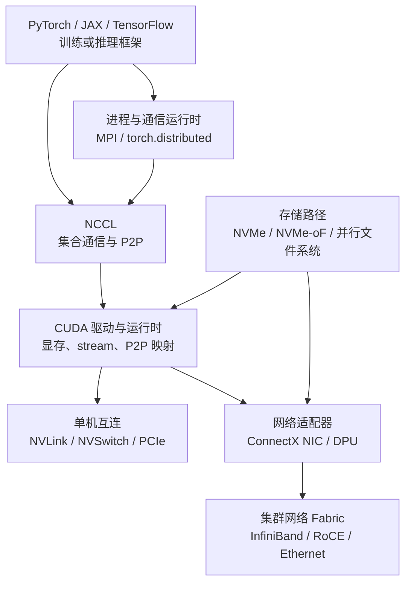

可以把 NCCL 看成“**根据拓扑选择并驱动数据路径**”的层：同一台机器内它优先使用 NVLink 或允许的 PCIe P2P；跨机器时，它经由 NIC 和网络 Fabric 发送数据。MPI 则更像通用的分布式进程通信模型；两者常常协作，而不是互相替代。

## 性能语言：带宽、延迟与同步

通信性能不只是一张“多少 GB/s”的规格表。最常用的近似模型是：

$$
T_{comm} \approx \alpha \cdot n_{msg} + \frac{V}{B_{effective}}
$$

- $\alpha$ 是一次消息启动、协议处理、排队等造成的**延迟项**。
- $n_{msg}$ 是消息或通信轮次的数量。
- $V$ 是需要传输的数据量。
- $B_{effective}$ 是实际有效带宽，而非链路标称峰值；它会受拓扑、协议、拥塞、分片和软件实现影响。

因此：

- **小消息或频繁同步**主要受延迟影响，例如流水线并行边界的激活值传递。
- **大梯度桶或大规模 AllReduce**主要受带宽影响，例如数据并行的梯度同步。
- **collective（集合通信）**还受最慢 rank 影响：一个节点走了跨 NUMA、拥塞网络或错误路径，整个同步组都可能在等它。

## 单机 GPU 节点：先看主板上的真实拓扑

典型 8-GPU 服务器不是“8 张卡并排接在同一根总线上”。它通常有两颗或更多 CPU socket，每颗 CPU 各自连接一部分 PCIe Root Complex、GPU、NIC 和 NVMe。GPU 之间还可能有 NVLink / NVSwitch 专用互连。

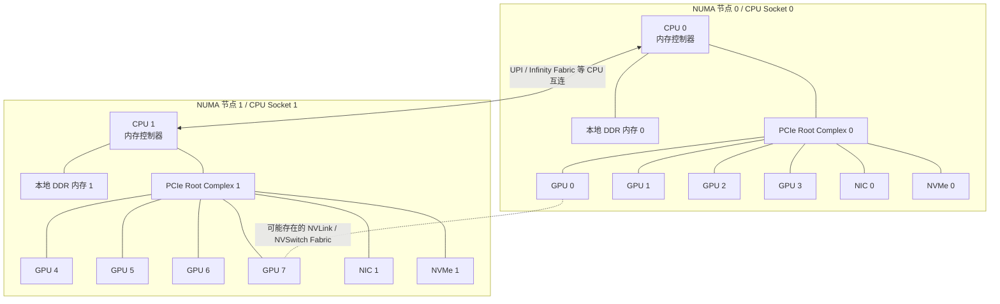

这是一张概念图，不代表每台服务器的实际连线。关键是：**GPU、NIC、NVMe 相对 CPU socket 的位置会改变数据路径**。GPU 0 往 NIC 0 发送数据，和 GPU 0 往 NIC 1 发送数据，即使 NIC 标称速率相同，也可能跨过 CPU socket 间互连，延迟和可用带宽都会不同。

先把图中的几个设备认清：

- **本地 DDR 内存**：DDR 是 CPU 主内存（RAM）使用的一类内存技术；“本地”是相对于某颗 CPU socket 而言。`RAM 0` 直接连接 CPU 0，CPU 0 访问它最快；CPU 1 要访问它则需要跨 socket。这正是 NUMA 中“访问时间不统一”的来源。
- **NIC（Network Interface Card，网络接口卡）**：就是网卡。普通服务器网卡主要收发以太网包；AI 集群中常见的高性能 NIC（例如 ConnectX）还能作为 InfiniBand 或 RoCE 的 RDMA 适配器，把 GPU 或 CPU 内存中的数据送进集群网络。
- **SSD（Solid State Drive，固态硬盘）**：一种使用闪存的持久化存储设备，用于保存训练数据、模型权重和 checkpoint。它描述的是存储介质 / 设备类型。
- **NVMe（Non-Volatile Memory Express）**：一种专为 SSD 设计的高性能访问协议，通常通过 PCIe 连接。因此图中的 `NVMe 0` 可理解为“一块走 PCIe 的 NVMe SSD”；**SSD 是设备，NVMe 是该设备常用的协议**。

### PCIe：通用 I/O 骨干

**PCI Express（PCIe）** 是 CPU 与 GPU、NIC、NVMe 等设备之间最常见的高速串行总线。它以 point-to-point 链路连接设备与 Root Complex，中间可以经过 PCIe switch。

- **用途**：GPU 启动、CPU 与 GPU 数据交换、GPU 与 NIC/NVMe 的 DMA 路径，以及没有 NVLink 时部分 GPU P2P 通信。
- **优势**：生态通用；GPU、NIC、SSD 都能挂接；代际升级带来更高的每 lane 带宽。
- **约束**：PCIe 带宽是分层共享的，设备同挂在一个 switch 或 Root Complex 下时会争抢上行链路；跨 CPU socket 时还会经过 UPI、Infinity Fabric 等 CPU 互连。
- **不要只看代际**：`PCIe Gen5 x16` 是链路能力，不保证某个 GPU 到某个 NIC 的路径都独享这个能力；要看设备是否同 root、是否有 PCIe switch 和上行超卖。

这里有两个容易混淆的组件：

- **PCIe Host Bridge（主机桥）/ Root Complex**：CPU 通往 PCIe Fabric 的入口；现代服务器中通常集成在 CPU 内。设备需要访问 CPU 内存，或要离开本 PCIe 层级时，常需要经过它。两张卡分别挂在不同 Host Bridge 下，路径通常比同一 switch 下更长。
- **PCIe bridge（PCIe 桥）**：连接两个 PCIe 层级、转发配置请求和数据访问的逻辑桥接点。PCIe switch 的端口会形成这种分层结构，因此口语中也常把“经过 switch”描述为“经过 PCIe bridge”。多个设备共享 switch 的上行口时，会竞争这条上行带宽。

在 CUDA 语境中，GPU-to-GPU 的 PCIe P2P 代表一张 GPU 能直接访问另一张 GPU 的显存映射。它是否可用取决于 GPU、平台、IOMMU/ACS 设置、驱动以及真实 PCIe 拓扑；不能假设“同机就一定能 P2P”。

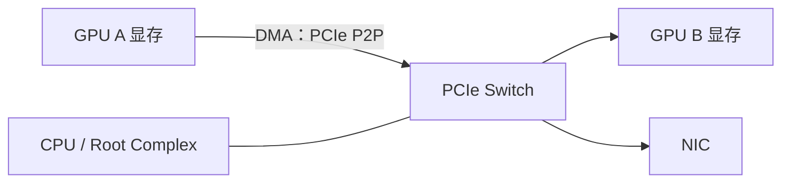

同一个 PCIe switch 下的 GPU 与 NIC 往往是较短的路径；但 switch 上行到 Host Bridge / CPU 的带宽可能是共享资源。训练通信中，应同时关注 GPU-GPU 和 GPU-NIC 的亲和性。

### NUMA：CPU 内存不是一个等距的大池子

**NUMA（Non-Uniform Memory Access，非统一内存访问）** 表示多 socket 机器中，每颗 CPU 都有本地内存和本地 I/O；访问另一颗 CPU 连接的内存或设备需要跨 socket，代价更高。

它仍然是**一台物理服务器内部**的概念，不是多台机器组成的集群。典型的双路服务器有两颗物理 CPU（两个 socket），因而常有两个 NUMA node；但“一个 socket 对应一个 NUMA node”只是常见情况，不是硬规则。部分单路服务器也会把一个 CPU 划分为多个 NUMA node，以暴露更细的内存与 I/O 亲和性。

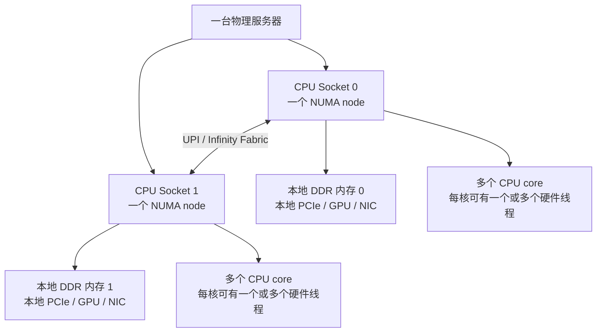

**NUMA、CPU 核和线程不是同一个概念**，它们描述的是不同层次：

- **CPU socket**：主板上安装的一颗物理 CPU 封装。一台机器可以是一颗 CPU（单路），也可以是两颗或更多 CPU（双路 / 多路）。
- **NUMA node**：一组“离某些 CPU core 更近”的内存和 I/O 资源。它关注访问距离与带宽；多 socket 机器通常因此形成多个 NUMA node。
- **CPU core（核心）**：一颗 CPU 内真正执行指令的计算核心。多核 CPU 是“一颗 socket 内有很多 core”，并不意味着有很多物理 CPU，也不等于 NUMA。
- **硬件线程 / logical CPU（逻辑 CPU）**：一个 core 可通过 SMT / Hyper-Threading 暴露多个可调度执行上下文。操作系统看到的“CPU 线程数”通常是逻辑 CPU 数，例如 32 个 core、每核 2 线程会显示为 64 个 logical CPU；它们共享同一核心的部分执行资源。

换句话说，图中的“CPU 0 本地 DDR 内存”不是全机所有 CPU 到它距离都相同的 RAM。CPU 0 和与其 PCIe Host Bridge 相连的设备更靠近它；CPU 1 或其下的设备访问它，需要额外穿过 socket 间互连。

对于 GPU 工作负载，NUMA 至少影响两件事：

- **CPU 侧工作线程与页锁定内存**：数据加载、网络辅助线程、MPI/NCCL 的 CPU 线程若绑定在远端 NUMA 节点，可能制造额外跨 socket 流量。
- **GPU-NIC 与 GPU-SSD 路径**：即使启用 GPUDirect，设备若分别挂在不同 CPU socket 的 PCIe 域，DMA 仍可能经过更长的主板路径。

NCCL 的拓扑术语能帮助读懂距离：`PIX` 是最多经过一个 PCIe bridge，`PXB` 是经过多个 PCIe bridge，`PHB` 经过 PCIe Host Bridge，`SYS` 则跨 NUMA 节点和 CPU socket 互连；`NVL` 表示经由 NVLink。官方文档对这些路径和 P2P 选择有明确说明。[NCCL topology / P2P 说明](https://docs.nvidia.com/deeplearning/nccl/user-guide/docs/troubleshooting/gpu_troubleshooting.html)

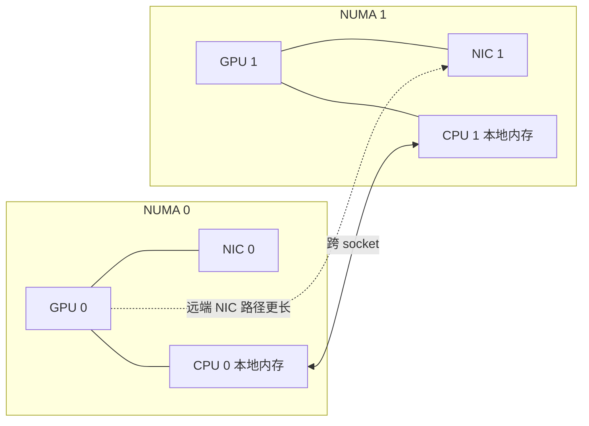

**实务原则**：尽量让一个 GPU rank 的 CPU 核、GPU、NIC 和其数据路径处在同一个 NUMA 域；多网卡机器中再让不同 GPU 尽量“就近”使用各自的 NIC。这是拓扑感知 placement 的核心。

### NVLink：面向 GPU 的高带宽点对点互连

**NVLink**是 NVIDIA GPU（以及部分 CPU / GPU 组合）间的专用互连。它提供与 PCIe 不同的高带宽、低延迟数据通道，典型目标是让 GPU 可更高效地直接访问对端显存并进行 GPU-GPU 通信。

- **意图**：降低模型并行和多 GPU collective 的通信压力，提升 GPU 间 P2P 访问效率。
- **实现直觉**：GPU 有多条 NVLink lane；不同产品代际、GPU 型号和系统设计的 lane 数、总带宽、可连接对象都不同。
- **约束**：NVLink 并不等于“任意规模、任意 GPU 都全互连”。小系统可能是特定 GPU 对之间的直连 mesh；大系统通常需要 NVSwitch 扩展。
- **使用场景**：同节点内的 tensor parallel、pipeline 并行边界通信、AllReduce / AllGather / ReduceScatter，以及需要跨 GPU 访问显存的路径。

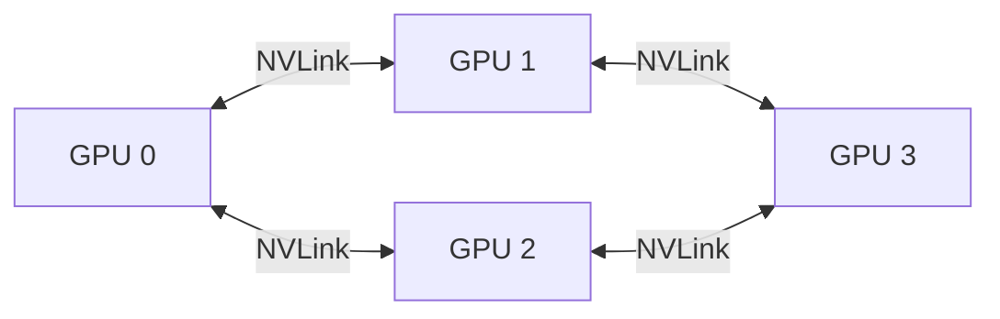

上图表示一种直连网格的思维模型。真实服务器可能有不同的连接图，某些 GPU 对之间需要经由更多跳数，带宽也未必一致。因此使用 `nvidia-smi topo -m` 和 NCCL 拓扑日志确认实际路径，比根据“机器有 NVLink”推断更可靠。

### NVSwitch：把有限 NVLink 端口扩展成 GPU Fabric

**NVSwitch**是专门转发 NVLink 流量的交换芯片。它不是普通以太网或 InfiniBand 交换机，而是用于在一个 NVLink domain 内把更多 GPU 连接成高带宽 Fabric。

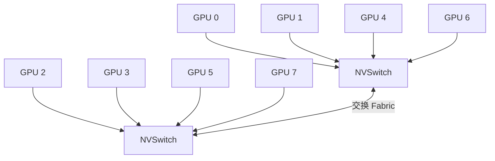

它解决的问题是：GPU 的直连端口数量有限，而大模型训练希望许多 GPU 之间都有相近且很高的带宽。NVSwitch 让多个 GPU 可通过交换 Fabric 通信，并让拓扑比稀疏直连 mesh 更规整。

现代机架级系统把这个想法扩展得更远。例如 NVIDIA 的 GB300 NVL72 参考架构中，72 张 GPU 经 NVLink switch trays 构成同一 NVLink domain；每张 GPU 有 18 条第五代 NVLink 指向机架内不同 NVSwitch。[NVIDIA NVL72 硬件组件说明](https://docs.nvidia.com/enterprise-reference-architectures/nvl72-ai-factory/latest/components.html)

要注意两个边界：

- **NVSwitch 扩展的是 NVLink 域，不等于整个数据中心网络。** 跨 NVLink 域、跨一般节点或跨机架的 scale-out 通信，通常仍走 InfiniBand 或 RoCE/Ethernet。
- **“有 NVSwitch”不自动保证应用快。** 通信模式、GPU/NIC placement、算法、并发作业和网络拥塞仍然决定端到端性能。

### GPUDirect P2P：同机 GPU 显存之间的直接访问

前面提到的“GPU-GPU PCIe P2P”就是 **GPUDirect Peer-to-Peer（GPUDirect P2P）** 的典型场景。它是 NVIDIA GPUDirect 技术族中专门面向**同一台机器内两张 GPU**的能力：GPU 可以通过 PCIe 或 NVLink 直接复制数据，或直接 load / store 对端 GPU 的显存，而不必把数据先放进 CPU 的 DDR 内存。NVIDIA 将其定义为可在 PCIe、NVLink 等 memory fabric 上进行 GPU-to-GPU copy 和直接 load/store 的能力，并由 CUDA Driver 原生支持。[NVIDIA GPUDirect P2P 概览](https://developer.nvidia.com/gpudirect)

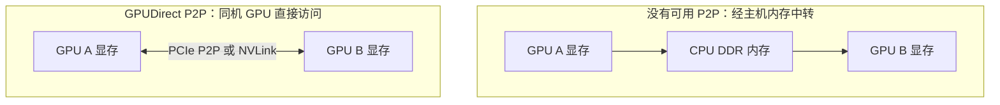

这里的“直接”与 GDR 一样，是指**没有主机 DDR staging copy**，而不是数据凭空跳过物理互连：

- 经由 **NVLink / NVSwitch** 时，GPU 使用专用 GPU Fabric 访问对端显存。
- 经由 **PCIe P2P** 时，GPU 的 DMA / 内存访问请求在 PCIe Fabric 中转发，可能经过 PCIe switch 或 Host Bridge；路径是否短、是否支持由真实主板拓扑决定。
- CUDA 可以用 peer-copy 路径搬运整块 buffer，也可在 P2P memory access 已启用时，使一个 GPU 上运行的 kernel 访问另一个 GPU 的显存。两者都是 P2P，但前者更像复制，后者更像远端内存访问。

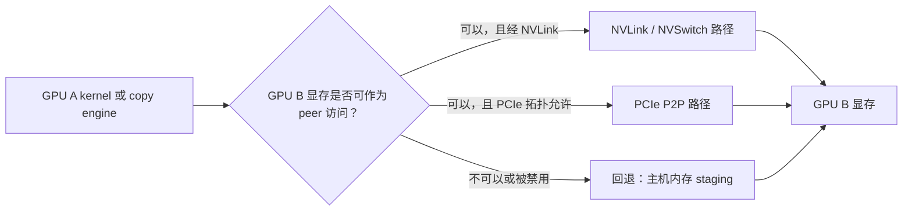

CUDA 会根据设备与拓扑报告 P2P 能力；应用 / 运行时也需要为对应 GPU 对启用 peer access。CUDA 编程指南说明，能否互相寻址取决于 PCIe / NVLink 拓扑，可通过 `cudaDeviceCanAccessPeer()` 查询，并通过 `cudaDeviceEnablePeerAccess()` 启用；在没有 NVSwitch 的系统中，每张 GPU 的系统级 peer connection 数还存在上限。[CUDA 多 GPU P2P 文档](https://docs.nvidia.com/cuda/cuda-programming-guide/03-advanced/multi-gpu-systems.html)

**GPUDirect P2P、RDMA 与 Storage 的边界**：

| 技术 | 谁直接访问 GPU 显存 | 典型范围 | 解决的中转问题 |
| --- | --- | --- | --- |
| **GPUDirect P2P** | 另一张 GPU | 同机 | GPU A ↔ CPU DDR ↔ GPU B |
| **GPUDirect RDMA** | NIC、DPU 等第三方 PCIe 设备 | 通常跨节点网络数据面 | GPU ↔ CPU DDR ↔ NIC |
| **GPUDirect Storage** | NVMe、文件系统 / 存储路径 | 本地或远端存储 I/O | GPU ↔ CPU DDR ↔ 存储 |

对 NCCL 而言，它会优先利用 CUDA 报告为可直接访问的 GPU-GPU P2P 路径，通常是 NVLink，或是拓扑和驱动允许的 PCIe；不可用时才使用共享主机内存等回退传输。[NCCL GPU-to-GPU P2P 排障说明](https://docs.nvidia.com/deeplearning/nccl/user-guide/docs/troubleshooting/gpu_troubleshooting.html)

## 扩展方向：scale-up、scale-out 与 scale-across

这三个词不是三种具体协议，而是按**通信范围和资源边界**描述 AI 基础设施怎样变大。在传统服务器语境中，scale-up 也常被称为“纵向扩展”；在当代 AI 网络语境中，它进一步指一个高带宽、紧耦合的 GPU 本地域。不同厂商对“本地”的具体边界略有不同，可能是一台服务器、一个 rack，或少量紧耦合 rack；因此读设计文档时要先确认它的 domain 边界。

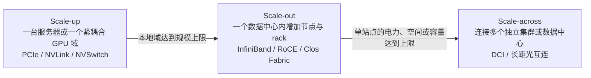

| 方向 | 本质 | 常见通信范围 | AI 通信与网络特征 |
| --- | --- | --- | --- |
| **scale-up（向上扩展）** | 增强一个紧耦合系统 / domain 的计算、内存和本地互连能力 | 同机 GPU，或现代 rack-scale NVLink 域 | 追求极低延迟与极高带宽；常见 PCIe、NVLink、NVSwitch；适合频繁的 TP 集合通信 |
| **scale-out（向外扩展）** | 增加更多相对独立的节点 / rack，并把工作分布到它们 | 单个数据中心内的多节点、多 rack 集群 | 依赖 IB 或 RoCE/Ethernet 的 east-west Fabric；DP、跨节点 PP、MoE 等在此层通信 |
| **scale-across（跨域扩展）** | 连接多个独立的 scale-out 集群、建筑、园区或数据中心 | 跨站点、城域乃至区域 | 使用数据中心互连（DCI）、长距光链路等；延迟更高、站点间带宽通常比站内少，需更强的流量调度与容错 |

### Scale-up：先把本地域做强

经典意义上，scale-up 是给**一台机器**加更强的 CPU、更多内存、更多 GPU 或更快的本地总线。在 AI 系统中，NVLink / NVSwitch 把这个概念延伸到紧耦合 GPU domain：GPU 间可像一个更大的本地计算单元那样高频通信。NVIDIA 的 GB200 / GB300 文档将机架内 NVLink 描述为 scale-up Fabric；例如 NVL72 内的 72 张 GPU 可构成一个高带宽 domain。[NVIDIA DGX GB Rack 网络说明](https://docs.nvidia.com/dgx/dgxgb200-user-guide/networking.html)

它的限制是物理的：一台服务器的槽位、供电、散热与 CPU PCIe lane 有限；即使扩大到 rack，NVLink switch 的端口数和 domain 设计也有上限。

### Scale-out：用网络把更多节点组成集群

scale-out 不是把单机无限加大，而是增加更多拥有独立 OS、CPU、GPU 和内存的服务器，并让分布式运行时把任务分给它们。节点之间不共享普通 CPU 内存，必须经 NIC 和网络 Fabric 通信。

AI 里最常见的图景就是：**节点内 / rack 内的 NVLink 做 scale-up，rack 之间的 InfiniBand 或 RoCE 做 scale-out。**NVIDIA 也将 GPU Cluster Interconnect Network（CIN）称为 scale-out / east-west 网络。[NVIDIA AI 数据中心网络分层](https://docs.nvidia.com/ncx/ncp-software-reference-guide/latest/data-center-architecture.html)

### Scale-across：跨站点连接多个大集群

**scale-across** 是近年 AI 网络中更常出现的词，但不像 scale-up / scale-out 那样有完全统一的历史边界。本文采用当前主流用法：当一个数据中心的电力、空间或 GPU 容量不够时，将多个已完成 scale-out 的集群跨建筑、园区、城域或区域连接起来，使它们协同服务同一工作负载或资源池。

- 它的重点是**跨站点 reach 与韧性**，不是单纯再加几台服务器。
- 站点间光纤传播延迟显著高于机房内链路；例如 100 km 光纤往返约为 1 ms 量级，因此不应直接把最频繁、最同步的 TP collective 放到这层。
- 站内 scale-out Fabric 通常追求接近无阻塞；scale-across 链路往往更昂贵、相对带宽更稀缺，需要 DCI、光传输、流量工程、缓冲、拥塞控制以及更强的容错 / 异步设计。

Broadcom 对这一新分层的定义也将 scale-across 描述为连接分布在城域和区域距离上的 scale-out 集群；这与本文的使用边界一致。[Scale-across AI networking 说明](https://www.broadcom.com/topics/what-is-scale-across-networking-for-ai-clusters)

## 跨节点网络：从 NIC 到 Fabric

单台机器内即使有 NVLink/NVSwitch，模型或 batch 规模继续扩大后，还是必须跨服务器通信。路径变为：GPU 显存 → NIC → 交换网络 → 对端 NIC → 对端 GPU 显存。

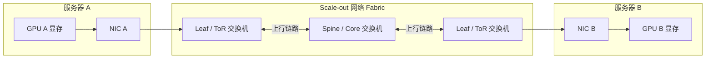

### InfiniBand：面向高性能计算的低延迟 Fabric

**InfiniBand（IB）** 是一种常用于 HPC 和 AI 集群的互连技术。它定义了链路、适配器、交换机和网络管理机制，常见于需要高吞吐、低延迟和大规模 RDMA 的训练集群。

- **HCA / NIC**：主机通道适配器（Host Channel Adapter），例如 NVIDIA ConnectX 系列，负责把主机或 GPU 数据送入 IB Fabric；HCA、RNIC 与通用 NIC 的关系见下一节。
- **Fabric**：由交换机和链路组成的可扩展网络；常用 leaf-spine、fat-tree 或 dragonfly 等拓扑来提供更多路径和较高双向带宽。
- **Subnet Manager（SM）**：负责发现、路由和管理 Fabric；这与以太网里“主机各自靠 IP 路由”的体验不同。
- **优势**：原生围绕 RDMA 设计，适合大规模集合通信和低延迟消息；具体能力仍取决于网卡、交换机、布线与配置。

### NIC、RNIC 与 HCA：同一块卡的不同语境

这三个词都可能指服务器中的那张网络适配器卡，但强调的能力不同：

- **NIC（Network Interface Card）**：最宽泛的“网卡”称呼，只说明它把主机接入网络。普通 Ethernet NIC 可收发 IP / TCP / UDP 包，却不一定支持 RDMA。
- **RNIC（RDMA NIC）**：支持 RDMA 的 NIC。它除了常规收发，还在硬件中实现 Queue Pair、Completion Queue、内存注册、RDMA Read / Write 等数据面能力，因此应用可把工作请求投递给网卡，由网卡 DMA 和网络硬件完成传输。
- **HCA（Host Channel Adapter）**：InfiniBand 语境中的主机侧适配器，即主机接入 IB Fabric 的端点。很多资料把运行 InfiniBand 的 RDMA 适配器称为 HCA；在 Ethernet / RoCE 语境中则更常称它为 RNIC 或 RoCE NIC。

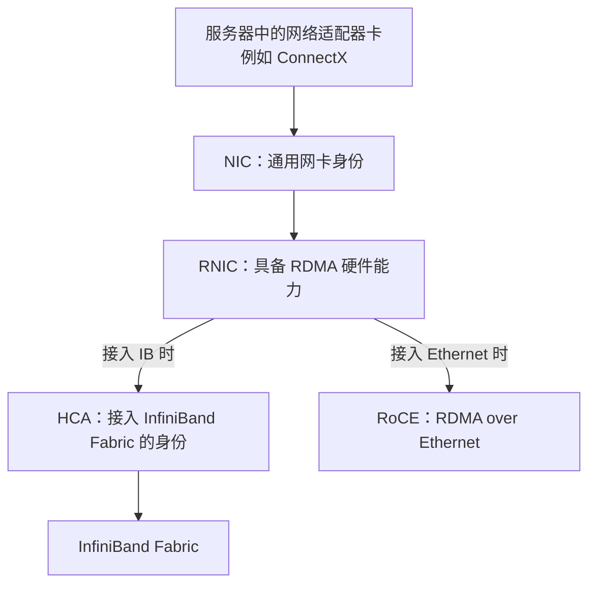

因此，**RNIC 不是一定要额外插一张卡**，而是说这张 NIC 具备 RDMA 能力；HCA 也不是与 NIC 完全不同的硬件类别，而是 InfiniBand 传统中对主机端适配器的叫法。以 ConnectX 为例，同一产品系列可提供 InfiniBand 或支持 RoCE 的 Ethernet 配置；NVIDIA 的 DGX BasePOD 参考架构也明确约定：将配置为 InfiniBand 的网络适配器称为 HCA，将配置为 Ethernet / RoCE 的称为 NIC。[DGX BasePOD 网络适配器术语](https://docs.nvidia.com/dgx-basepod/reference-architecture-infrastructure-foundation-enterprise-ai/latest/_downloads/487a2093a4564bef969f38abba12a1f5/ra-11127-001-dbphb100-referencearch.pdf)

从 GPU 通信角度看，关键不是标签，而是这张卡是否同时满足：

- **RDMA 能力**：能否作为 RNIC 执行 verbs / UCX / NCCL 所需的 RDMA 操作。
- **GPUDirect RDMA 能力与软件支持**：能否 DMA GPU 显存，而非先走 CPU DDR staging。
- **拓扑亲和性**：它与目标 GPU 是否同 NUMA node、同 PCIe switch 或至少处于较短 PCIe 路径。

### RoCE 与以太网：在 Ethernet 上承载 RDMA

**RoCE（RDMA over Converged Ethernet）** 让 RDMA 语义运行在以太网上。它常用于已有高性能 Ethernet Fabric、云环境或希望与通用网络生态统一的部署。

- RoCE 不是“普通 TCP 更快”这么简单；它要求端到端网络能正确处理 RDMA 流量和拥塞。
- 传统 RoCEv2 部署通常会讨论无损或近无损设计，包括 Priority Flow Control（PFC）、Explicit Congestion Notification（ECN）与拥塞控制。错误的 PFC / ECN 配置可能把局部拥塞扩大为长尾甚至死锁风险。
- InfiniBand 和 RoCE 都能提供 RDMA；应用看到的可能都是 verbs/UCX/NCCL 等接口，底层 Fabric 的运维和拥塞模型却不同。

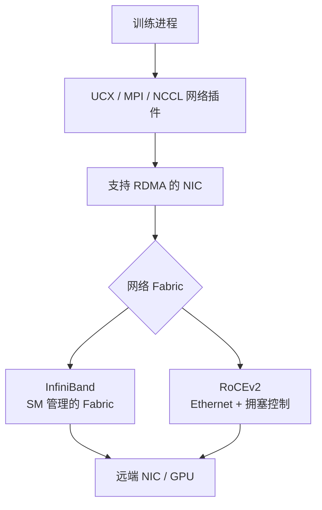

## RDMA：让设备直接搬运远端内存

**RDMA（Remote Direct Memory Access，远程直接内存访问）** 允许一端的网卡直接读写另一端已注册的内存区域，而不是让远端 CPU 在每次数据到达时参与拷贝和协议处理。

它的关键不是“完全没有 CPU”，而是**数据面不需要 CPU 逐字节搬运**：CPU 仍需要创建 Queue Pair、注册内存、建立连接和投递工作请求；NIC 则在数据面执行 DMA 和网络传输。

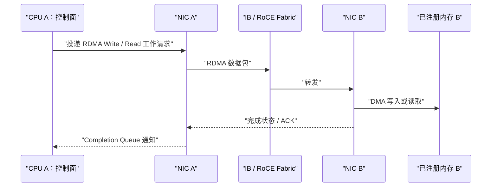

### RDMA 必须理解的对象

- **内存注册（memory registration）**：NIC 需要知道哪些虚拟页可被 DMA、物理页在哪里、访问权限是什么。注册有成本，频繁注册小缓冲区会损害性能。
- **Queue Pair（QP）与 Work Queue**：应用/运行时把 send、receive、read、write 等工作请求提交给 NIC；完成事件写入 Completion Queue。
- **RDMA Read / Write**：一侧发起对远端注册内存的读或写，适合高吞吐的数据路径。
- **Send / Receive**：双方显式配对的消息语义。不同上层库选择不同模型，但它们都可利用 RDMA NIC。
- **一致性与完成语义**：远端内存“被写到”不自动等于 GPU kernel 已经可以安全读取；仍要通过 stream、事件、协议或库语义建立正确的先后关系。

## GPUDirect RDMA：把 GPU 显存接到 RDMA 数据面

没有 GPUDirect RDMA 时，跨节点数据通常需要经过 CPU 内存的 bounce buffer：GPU 先拷到 host memory，NIC 再发送；对端反向执行。这个路径耗费 PCIe、CPU 内存带宽与 CPU 资源，也引入额外同步。

**GPUDirect RDMA（GDR）** 让 NIC 能对 GPU 显存执行 DMA，使 GPU 与 NIC 在数据路径上直接交换数据。NVIDIA 的定义是：GPU 与第三方 peer device（例如 ConnectX NIC、BlueField DPU）通过 PCIe 直接交换数据。[GPUDirect RDMA 官方说明](https://docs.nvidia.com/datacenter/cloud-native/gpu-operator/latest/gpu-operator-rdma.html)

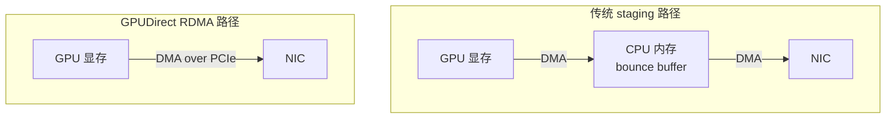

这里的“直接”需要精确理解：

- **启用 GDR 时**：大块数据不需要先落到 CPU 的 DDR 内存，也不需要 CPU core 逐字节拷贝。NIC 作为 PCIe peer 可以直接 DMA 读取或写入 GPU 显存。
- **它仍会经过硬件互连**：若 GPU 和 NIC 挂在同一个 PCIe switch 下，数据一般经过该 switch；若处在不同 PCIe 域，可能经过 PCIe Host Bridge；若分属不同 CPU socket，还可能穿过 UPI / Infinity Fabric 等 socket 间互连。这里“经过 CPU 所在的 I/O / 互连硬件”不等于“经过 CPU 内存并由 CPU 复制”。
- **CPU 仍参与控制面**：CPU / 驱动需要注册 GPU buffer、建立 RDMA 队列、投递通信请求并处理完成事件；被绕开的主要是数据面的 host-memory staging copy。
- **未启用或不支持 GDR 时**：常见回退路径是 GPU DMA 到 CPU DDR 内存，NIC 再从 DDR 内存 DMA 发送；这会占用主机内存带宽，并多出一次中转与同步。

GDR 的收益来自少一次或多次 staging copy，但不是脱离拓扑的魔法：

- GPU 与 NIC 应尽量处于短 PCIe 路径，最好同 NUMA / 同 PCIe 域；跨 socket 仍可能变慢。
- GPU、驱动、NIC、内核接口、IOMMU/ACS、容器运行环境和库版本都必须支持。现代 Linux 平台通常优先使用 DMA-BUF；NVIDIA 文档也建议优先于旧的 `nvidia-peermem` 模块。
- NCCL 会结合拓扑和环境选择 GDR；不能只凭“已安装驱动”推断它正在使用。应观察 NCCL 日志、拓扑和基准测试。

## GPUDirect Storage：把 GPU 显存接到存储 I/O 数据面

**GPUDirect Storage（GDS）** 解决的是另一条路径：GPU 与存储，而非 GPU 与远端 GPU。这里的 NVMe 通常指通过 PCIe 连接的 NVMe SSD；`NVMe-oF` 则是通过网络访问远端 NVMe 存储。GDS 让本地或远端存储（如 NVMe、NFS、NVMe-oF）与 GPU 显存之间进行直接 DMA，避免 CPU bounce buffer。

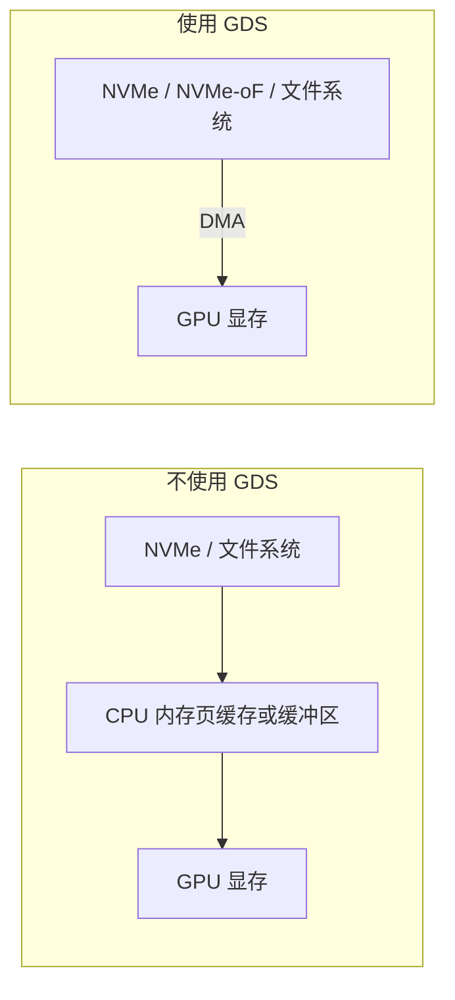

GDS 的价值是降低 CPU 开销、减少内存拷贝，并改善大块数据 I/O 的吞吐和延迟。它不是所有数据加载都必然更快：小而零散的读取、存储端吞吐不足、文件系统不支持、GPU 到存储设备路径过长，都会限制收益。GDS 官方文档将 `cuFile` 作为面向文件系统数据路径的主要接口，并强调平台与 I/O 路径评估。[GPUDirect Storage 文档](https://docs.nvidia.com/gpudirect-storage/)

## 集群网络拓扑：为什么要关心 rail、leaf-spine 与超卖

训练集群网络的目的不是只让任意两台机器“能 ping 通”，而是让大量 GPU rank 同时交换数据时仍有可预测的带宽和延迟。

### Leaf-spine / Clos：提供多条等价路径

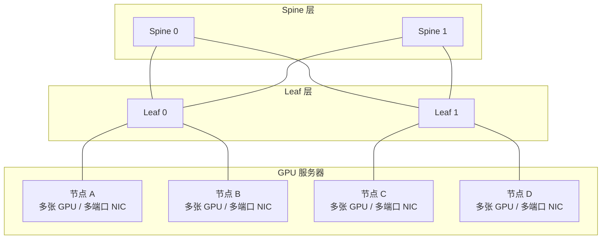

图中的 `Leaf` 和 `Spine` 都是**交换机角色**，不是服务器、GPU 或网卡：

- **Leaf（叶交换机）**：最靠近计算节点的接入层交换机。服务器 NIC、存储或 DPU 直接接到 leaf；它汇聚本 leaf 下所有端点的流量。它也常被叫作 access switch，物理上放在机架顶部时常叫 ToR（Top of Rack）switch，但“leaf”强调的是它在 Clos 拓扑中的逻辑角色。
- **Spine（脊交换机）**：汇聚 / 转发层交换机。它不直接连接 GPU 服务器，而是连接所有 leaf，使不同 leaf 下的服务器互通。在典型两层 leaf-spine 中，spine 之间通常不相连。
- **Clos**：一种多级互连网络架构；最常见的两层 Clos 就是 leaf-spine。关键连线规则是：**每个 leaf 都连接到每个 spine**，因此任意两个不同 leaf 下的节点之间都有多条等价路径。

以图中的节点 A 到节点 C 为例：

```text
节点 A → Leaf 0 → Spine 0 或 Spine 1 → Leaf 1 → 节点 C
```

- 如果两个节点接在**同一个 leaf**，流量通常只在这个 leaf 内转发，不必经过 spine。
- 如果接在**不同 leaf**，流量经过任意一台连接两侧 leaf 的 spine；`Spine 0` 和 `Spine 1` 都是同样跳数、同样路由代价的路径，这就是“多条等价路径”。
- 路由可用 ECMP（Equal-Cost Multi-Path，等价多路径）或面向 AI Fabric 的自适应路由在这些路径间分担流量。**等价**不表示当下绝对同样快：一条路径可能正拥塞或故障，因此拥塞感知与健康检查仍很重要。

扩容时也能用这个分工理解：增加 **leaf** 主要增加可接入的服务器 / NIC 数；增加 **spine** 主要增加 leaf 之间的总带宽和可用路径。集群继续变大时可加第三层 **super-spine**，把多个 leaf-spine pod 再连接起来；NVIDIA 的大规模 AI Factory 参考架构也在约千节点规模引入 super-spine 以维持非阻塞的点对点连接。[NVIDIA Clos / leaf-spine 术语说明](https://docs.nvidia.com/networking-ethernet-software/knowledge-base/Setup-and-Getting-Started/layer-1-Data-Center-Cheat-Sheet/)

Leaf-spine（Clos）网络让跨 leaf 的流量可经由多台 spine 分担。AI 训练常讨论以下指标：

- **双向带宽 / bisection bandwidth**：把集群切成两半时，两半之间能同时通过多少流量。大量 AllReduce、AlltoAll 时它比单端口峰值更重要。
- **超卖比（oversubscription）**：服务器下行总带宽高于 leaf 上行总带宽时，所有服务器同时跨 leaf 通信就会争抢带宽。业务流量较稀疏时可接受；大规模同步训练往往希望低超卖甚至无超卖。
- **拥塞控制与自适应路由**：集合通信会制造持续的大象流。Fabric 若不能均衡分流或及时反馈拥塞，就会产生长尾，拖慢整个 collective。

### 多 rail：让 GPU 与 NIC 的并行关系保持一致

一台训练服务器常有多块 NIC 或多端口 NIC。**rail** 可以理解为一组从 GPU/NIC 到 Fabric 的相对独立网络平面。常见目标是使 `GPU i → NIC i → 对应 rail` 的映射在各节点尽量一致。

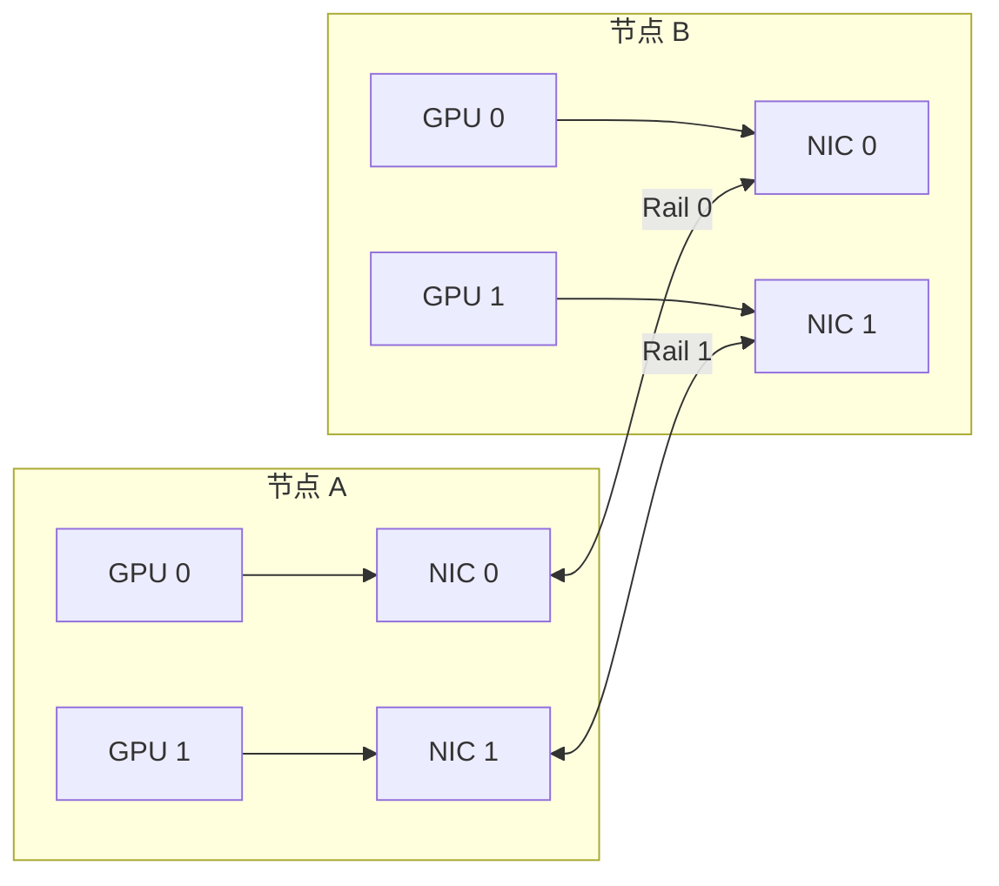

这种布线和 rank 映射可减少“GPU 0 的数据先绕到远端 NIC，再穿过 Fabric”的情况，也让各 NIC、交换路径上的负载更均匀。NCCL 的 `NCCL_CROSS_NIC` 相关策略就与网络是否是 rail-optimized 有关；通常应由实际拓扑和基准测试决定，而不是盲目固定环境变量。

## 集合通信：训练到底在交换什么

集合通信（collective communication）指一组 rank 共同完成的通信操作。每个 rank 必须以一致的顺序、数据量和数据类型参与；不一致可能导致挂起、崩溃或数据损坏。[NCCL collective 语义](https://docs.nvidia.com/deeplearning/nccl/user-guide/docs/usage/collectives.html)

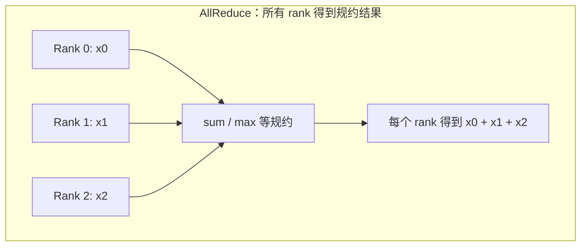

| 操作 | 数据效果 | AI 训练 / 推理中的典型用途 |
| --- | --- | --- |
| **AllReduce** | 所有 rank 规约并各自得到完整结果 | 数据并行梯度同步；部分 tensor parallel 归约 |
| **AllGather** | 每个 rank 收集所有 rank 的分片 | 参数或激活值分片重组；FSDP / ZeRO 的参数恢复 |
| **ReduceScatter** | 先规约，再把结果分片分发 | 梯度规约后直接保留分片；常与 AllGather 组合 |
| **AlltoAll** | 每个 rank 向每个其他 rank 发送不同分片 | MoE 的 token dispatch / combine |
| **Broadcast** | 一个 root 向所有 rank 复制数据 | 初始化参数、控制数据、特定流水线数据分发 |
| **Send / Recv** | 两个指定 rank 点对点交换 | pipeline parallel 相邻 stage 的激活值与梯度 |

### AllReduce 为什么常用 ring 或 tree

NCCL 会根据消息大小、拓扑、GPU / NIC 数量选择算法和协议，应用通常不手工指定逐跳路径。理解两种抽象算法有助于判断瓶颈：

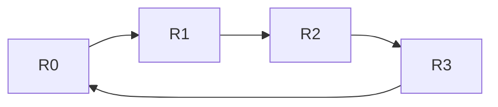

- **Ring AllReduce**：将数据切块，沿环执行 reduce-scatter 后再 all-gather。每个 rank 持续向邻居传递数据，容易把大消息带宽跑满，代价近似为 $2\frac{p-1}{p}V$ 的数据量（$p$ 为 rank 数）。
- **Tree AllReduce**：以树形完成规约和广播，通信轮次约为 $O(\log p)$，对小消息、低延迟场景更有吸引力。
- **实际实现是混合和拓扑感知的**：一个 collective 可以拆到多个 channel、多个 NIC，且节点内与节点间使用不同路径。因此“ring 一定慢 / tree 一定快”是错误简化。

## NCCL：GPU 集合通信的拓扑感知执行层

**NCCL（NVIDIA Collective Communications Library）** 是面向多 GPU 的集合通信库，提供拓扑感知的 `AllReduce`、`AllGather`、`ReduceScatter`、`Broadcast`、`AlltoAll` 等操作以及点对点通信。它不是完整的分布式编程框架，而是为 GPU 间数据交换提供高效执行。[NCCL 官方概览](https://docs.nvidia.com/deeplearning/nccl/)

```mermaid
flowchart TB
    Framework["PyTorch Distributed / DeepSpeed / Megatron-LM"]
    PG["ProcessGroupNCCL<br>或框架通信适配层"]
    NCCL["NCCL communicator<br>rank、拓扑、算法、channel"]
    subgraph Transports["NCCL 可选传输路径"]
        P2P["NVLink / PCIe P2P"]
        SHM["共享主机内存<br>回退路径"]
        NET["NIC + InfiniBand / RoCE<br>可用 GPUDirect RDMA"]
    end
    Framework --> PG --> NCCL
    NCCL --> P2P
    NCCL --> SHM
    NCCL --> NET
```

### NCCL 的关键概念

- **rank**：通信组中一个逻辑参与者的编号。常见做法是一张 GPU 对应一个进程 / 一个 rank，但这不是唯一模型。
- **communicator**：定义哪些 rank 参与同一组通信，以及各自 rank 编号的对象。
- **CUDA stream**：NCCL 操作提交到 stream；因此通信可以和计算在不同 stream 上安排重叠，但真实重叠仍受 SM、DMA、互连和依赖关系限制。
- **拓扑发现**：NCCL 读取系统 PCIe / GPU / NIC 拓扑，选择 P2P、共享内存或网络路径。官方排障文档也指出 NCCL 依赖 `/sys` 来发现 PCI 拓扑。[NCCL GPU 排障说明](https://docs.nvidia.com/deeplearning/nccl/user-guide/docs/troubleshooting/gpu_troubleshooting.html)
- **bootstrap 与数据面分离**：rank 初始发现、交换连接信息可走 TCP socket 或 MPI；真正大数据 collective 再走 NVLink、PCIe、IB/RoCE 等高性能路径。

### 训练框架中的一次梯度同步

```mermaid
sequenceDiagram
    participant F as "每个 GPU rank 的 forward/backward"
    participant B as "梯度 bucket 就绪"
    participant N as "NCCL AllReduce 或 ReduceScatter"
    participant T as "节点内 NVLink / PCIe"
    participant W as "节点间 IB / RoCE + GDR"
    participant O as "优化器 step"

    F->>B: "反向传播产生部分梯度"
    B->>N: "bucket 达到可通信大小"
    N->>T: "先走节点内路径"
    N->>W: "跨节点交换与规约"
    W-->>N: "规约结果"
    N-->>O: "梯度已同步或已分片"
    F-->>F: "同时继续计算后续梯度"
```

这里的重叠是数据并行性能的核心：如果梯度 bucket 在反向传播中尽早就绪，NCCL 可以在后续 layer 仍在计算时同步前面的梯度。但最后一个 bucket 常难以隐藏，网络与 collective 性能最终会暴露出来。

## MPI：进程模型、控制面与通用通信语义

**MPI（Message Passing Interface）** 是一套并行进程通信标准及其实现生态。它定义 communicator、rank、point-to-point、collective 等通用语义，覆盖 CPU 集群、高性能计算和 GPU 加速场景。

MPI 与 NCCL 的关系可以这样理解：

- **MPI 更通用**：它面向任意进程与内存，提供进程启动、rank 管理、丰富的点对点和 collective 语义；其底层可以使用 TCP、shared memory、InfiniBand verbs、UCX 等。
- **NCCL 更专注 GPU 数据面**：它围绕 CUDA device buffer 和多 GPU collective 做拓扑感知优化，优先利用 NVLink、PCIe P2P、GPUDirect RDMA 等路径。
- **它们可以协作**：MPI 负责启动进程、建立全局 rank、交换 NCCL `ncclUniqueId` 等 bootstrap 信息；每个进程内的 GPU 数据 collective 由 NCCL 执行。NCCL 文档专门提供了与 MPI 一起使用的说明。

```mermaid
flowchart LR
    Launcher["mpirun / 作业调度器"] --> P0["进程 0<br>MPI rank 0 + GPU 0"]
    Launcher --> P1["进程 1<br>MPI rank 1 + GPU 1"]
    P0 <-->|"MPI：发现、控制、小消息或通用通信"| P1
    P0 <-->|"NCCL：GPU buffer collective"| P1
```

**CUDA-aware MPI**表示 MPI 实现可以直接把 GPU buffer 作为 send/receive 缓冲区，而不要求应用显式复制到 CPU 内存。它是否进一步走 GDR、走哪种 Fabric，仍取决于 MPI 实现、UCX/verbs、驱动和拓扑。Open MPI 的 CUDA 支持文档明确将其定义为可直接发送和接收 GPU buffer 的能力。[Open MPI CUDA-aware 支持](https://docs.open-mpi.org/en/main/tuning-apps/accelerators/cuda.html)

## 训练并行策略如何映射到通信

并行策略决定“传什么”，通信栈决定“怎么传”。

```mermaid
flowchart TB
    Model["一个大模型训练任务"]
    DP["数据并行 DP<br>每卡一份模型"]
    TP["张量并行 TP<br>一层张量切分"]
    PP["流水线并行 PP<br>层切分成 stage"]
    EP["专家并行 EP<br>专家分散到多卡"]
    Model --> DP & TP & PP & EP
    DP --> DPC["梯度 AllReduce / ReduceScatter"]
    TP --> TPC["每层 AllReduce / AllGather"]
    PP --> PPC["相邻 stage Send / Recv"]
    EP --> EPC["token AlltoAll"]
```

| 并行方式 | 主要通信 | 通信特征 | 拓扑偏好 |
| --- | --- | --- | --- |
| 数据并行（DP） | 梯度 AllReduce / ReduceScatter | 大消息、每次迭代出现，可部分与反向计算重叠 | 可跨节点，依赖高带宽 scale-out 网络 |
| 张量并行（TP） | 层内 AllReduce / AllGather | 高频、位于模型关键路径，延迟敏感 | 尽量放在同一 NVLink / NVSwitch 域 |
| 流水线并行（PP） | 邻居 stage 的 Send / Recv | 规则点对点、激活值传递 | 相邻 stage 就近放置；跨节点会引入气泡和延迟 |
| 专家并行（EP） | AlltoAll | 目的地分散、流量可能不均衡 | 高 bisection bandwidth、良好拥塞控制尤为重要 |
| ZeRO / FSDP | AllGather + ReduceScatter | 参数 / 梯度按需分片重组 | 同时要求节点内与节点间 collective 高效 |

一个常见 placement 原则是：**把最频繁、最延迟敏感的通信放在最快的局部互连，把吞吐型、可重叠的通信留给 scale-out 网络。** 例如 TP group 尽量局限在一个 NVLink 域，而 DP group 跨节点扩展。实际选择还要受模型大小、节点 GPU 数、全局 batch、网络规模和容错要求制约。

## 推理通信：与训练相同的底座，不同的压力点

推理也依赖这些通信路径，但瓶颈常与训练不同：

- **TP 推理**：每生成一个 token 都会经过多层通信，decode 阶段 batch 小、延迟敏感，所以通常强烈偏好同节点 NVLink / NVSwitch。
- **Prefill**：计算量大、并行度较高，通信可部分隐藏；长上下文下 KV cache 的布局和传输也很关键。
- **PD 分离（prefill-decode disaggregation）**：prefill 实例向 decode 实例传递 KV cache；这变成新的跨节点大数据流，需要专门的 KV transfer 协议和高效 NIC/GDR 路径。
- **MoE 推理**：token 路由同样带来 AlltoAll；请求分布不均时更容易出现流量偏斜和尾延迟。

```mermaid
flowchart LR
    Request["请求与 prompt"] --> P["Prefill GPU 组<br>生成 KV cache"]
    P -->|"KV cache 传输<br>NIC / RDMA"| D["Decode GPU 组<br>逐 token 生成"]
    D --> Response["流式响应"]
```

这里最重要的区别是：训练常关心平均 step 时间与吞吐，在线 decode 更关心每个 token 的 P99 延迟。相同的网络带宽，在不同请求形态与并行策略下会得到非常不同的体验。

## 读拓扑与排查路径：从“慢”回到硬件事实

遇到 collective 慢、吞吐低或偶发卡住时，先把问题拆成控制面、拓扑、网络和语义四层，而不是先猜 NCCL 参数。

### 先确认单机拓扑

```shell
nvidia-smi topo -m
nvidia-smi topo -p2p p
lspci -tv
numactl --hardware
```

- `nvidia-smi topo -m`：查看 GPU、NIC、CPU NUMA 之间的路径标签；重点找 `NV#`、`PIX`、`PXB`、`PHB`、`SYS`。
- `nvidia-smi topo -p2p p`：检查 GPU P2P 访问能力；这不是性能测试，但能发现明显不可用路径。
- `lspci -tv`：查看 GPU/NIC/NVMe 是否挂在同一个 PCIe tree。
- `numactl --hardware`：查看 CPU socket、NUMA 内存和 CPU 核分布；再检查进程绑核、网卡 IRQ 与数据加载线程是否就近。

### 再确认 NCCL 选择的路径

```shell
NCCL_DEBUG=INFO NCCL_DEBUG_SUBSYS=INIT,GRAPH,NET \
torchrun --nproc_per_node=8 train.py
```

日志可帮助确认 communicator、网络接口、P2P、NIC、channel 与算法选择。调试变量适合定位问题，不宜不加控制地长期用于生产，因为大量日志本身会干扰性能与可读性。

### 最后用基准把问题隔离

- **节点内**：测试 GPU-GPU 的 P2P / NCCL AllReduce，区分 NVLink、PCIe 或 SHM 回退问题。
- **节点间**：在固定 GPU-NIC 映射下测试两节点和多节点 collective，区分 NIC、Fabric、GDR 与拥塞问题。
- **逐级放大**：从 2 GPU → 单机全卡 → 2 节点 → 小规模集群；每级记录消息大小、算法、带宽、延迟和失败日志。
- **避免只测峰值**：同时覆盖小消息与大消息；训练 bucket、MoE AlltoAll、TP 层内消息的大小分布并不相同。

## 常见误解

- **“同一台机器的 GPU 通信一定不经过 CPU。”** 不对。没有可用 NVLink / PCIe P2P 时，可能经由共享主机内存；即使允许 P2P，跨 Root Complex 或 NUMA 的路径也不等价。
- **“RDMA 就是不占 CPU。”** 不对。RDMA 减少的是数据面的 CPU 拷贝与参与；控制面、内存注册、队列投递、完成处理仍需要 CPU。
- **“开了 GPUDirect RDMA，GPU 到 NIC 就没有 PCIe 了。”** 不对。GDR 正是让 NIC 通过 PCIe 等本地 I/O 路径 DMA GPU 显存；它消除的是 CPU bounce buffer，不是物理互连。
- **“NVSwitch 可以取代 InfiniBand。”** 不对。NVSwitch 扩展 NVLink domain；规模超出该域的节点间 scale-out 通信通常仍依赖 IB 或 RoCE/Ethernet。
- **“NCCL 只等于 AllReduce。”** 不对。它也支持 AllGather、ReduceScatter、AlltoAll、Broadcast、Gather / Scatter 和点对点；不同并行策略依赖不同 primitive。
- **“NCCL 与 MPI 二选一。”** 不对。常见部署中 MPI / 调度器负责进程世界与 bootstrap，NCCL 负责 GPU 集合通信数据面。
- **“带宽越高，训练一定越快。”** 不完整。还要看通信是否处在关键路径、能否与计算重叠、消息大小、拥塞、最慢 rank 和并行策略。

## 一条端到端数据路径的复盘

以跨两台服务器的 data-parallel 梯度 AllReduce 为例，实际链路可抽象为：

```mermaid
flowchart LR
    A["GPU 0 反向传播<br>梯度 bucket 就绪"]
    B["NCCL 选择算法与 channel"]
    C["节点内规约<br>NVLink / NVSwitch / PCIe"]
    D["GPU 显存到就近 NIC<br>GPUDirect RDMA"]
    E["InfiniBand / RoCE Fabric"]
    F["对端 NIC DMA 到 GPU 显存"]
    G["对端节点内规约"]
    H["每个 GPU 获得同步梯度"]
    A --> B --> C --> D --> E --> F --> G --> H
```

这条路径中任何一段都可能成为瓶颈：GPU-NIC 跨 NUMA、PCIe 上行共享、GDR 未启用、网卡端口降速、网络超卖、拥塞控制不当、NCCL 选到回退传输，或某个 rank 没有按相同顺序进入 collective。性能排查应按这条链路逐段验证。

## 复习清单

- **PCIe** 是 GPU、NIC、NVMe 的通用 I/O 骨干；必须看真实 PCIe tree 与共享上行带宽。
- **NUMA** 让 CPU 内存和 I/O 设备具有远近之分；GPU、NIC、CPU 核、内存的亲和性会影响通信。
- **NVLink** 是 GPU 专用高带宽 P2P 互连；**NVSwitch** 用来把更多 GPU 连接为 NVLink Fabric。
- **InfiniBand / RoCE** 是跨节点 scale-out 网络；前者是原生 HPC Fabric，后者是在以太网上提供 RDMA。
- **RDMA** 让 NIC 直接操作已注册的远端内存；**GPUDirect RDMA** 进一步让 NIC 直接 DMA GPU 显存。
- **GPUDirect Storage** 把 GPU 显存与 NVMe / 文件系统 I/O 的 bounce-buffer 路径缩短为直接 DMA 数据路径。
- **NCCL** 是 GPU 拓扑感知的集合通信执行库；**MPI** 是更通用的进程通信标准和生态，两者可协作。
- 优化通信的第一步不是改参数，而是画出：**rank → GPU → PCIe / NVLink → NIC → Fabric → 对端 NIC → 对端 GPU** 的实际路径。

## 官方资料

- [NVIDIA NCCL 文档](https://docs.nvidia.com/deeplearning/nccl/)：NCCL 的 communicator、collective、环境变量和故障排查入口。
- [NCCL 集合通信语义](https://docs.nvidia.com/deeplearning/nccl/user-guide/docs/usage/collectives.html)：AllReduce、AllGather、ReduceScatter、AlltoAll 等操作的定义与约束。
- [NCCL GPU 拓扑排障](https://docs.nvidia.com/deeplearning/nccl/user-guide/docs/troubleshooting/gpu_troubleshooting.html)：PCIe 拓扑、GPU P2P 与 NCCL 发现机制。
- [NVIDIA GPUDirect RDMA 与 GDS](https://docs.nvidia.com/datacenter/cloud-native/gpu-operator/latest/gpu-operator-rdma.html)：GPUDirect RDMA、DMA-BUF 与 GPUDirect Storage 的部署层说明。
- [NVIDIA GPUDirect Storage 文档](https://docs.nvidia.com/gpudirect-storage/)：GDS、`cuFile` 与存储数据路径。
- [NVIDIA NVL72 参考架构硬件说明](https://docs.nvidia.com/enterprise-reference-architectures/nvl72-ai-factory/latest/components.html)：第五代 NVLink、NVSwitch 与机架级 NVLink domain 示例。
- [Open MPI 的 CUDA-aware 支持](https://docs.open-mpi.org/en/main/tuning-apps/accelerators/cuda.html)：MPI 直接发送和接收 GPU buffer 的说明。
