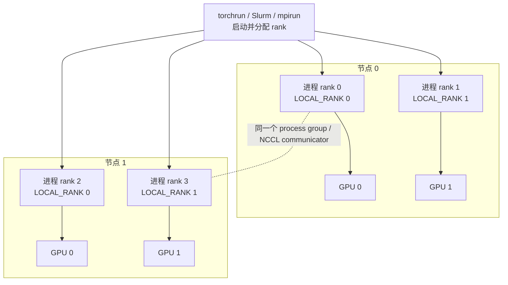
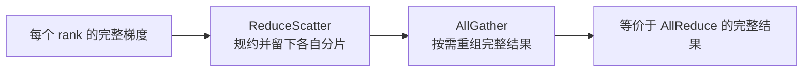
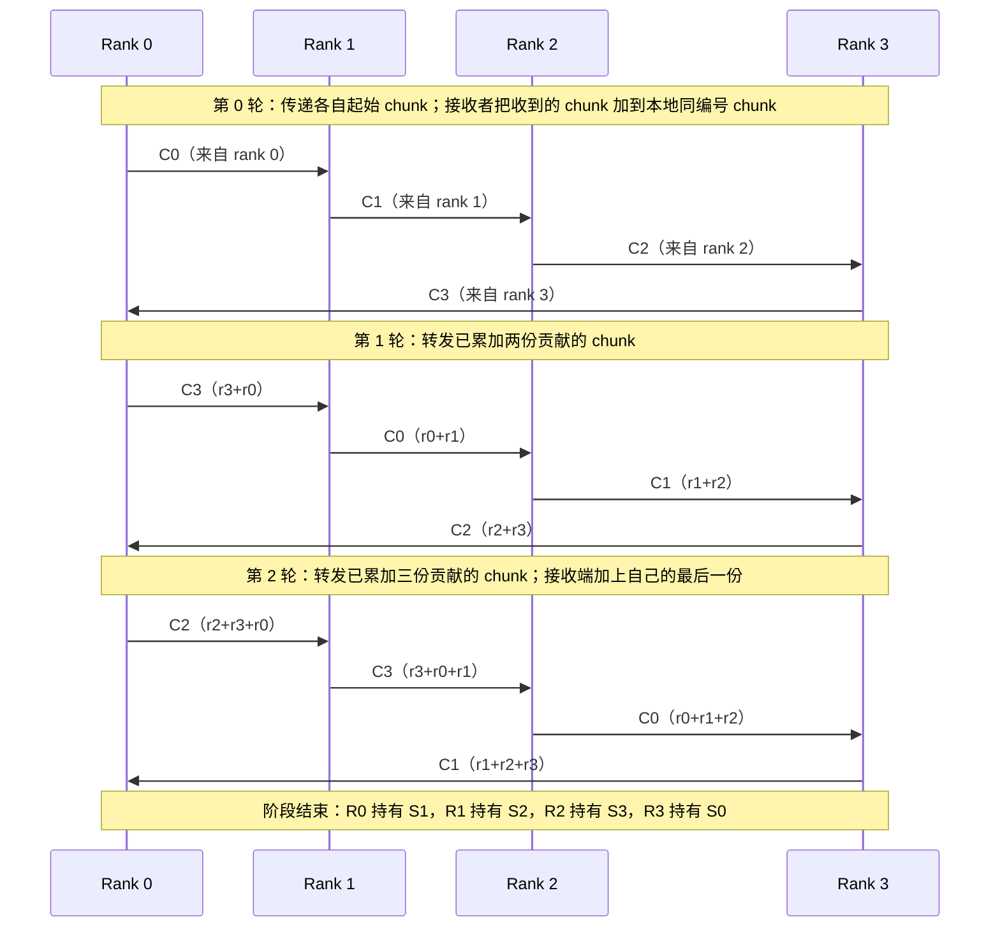
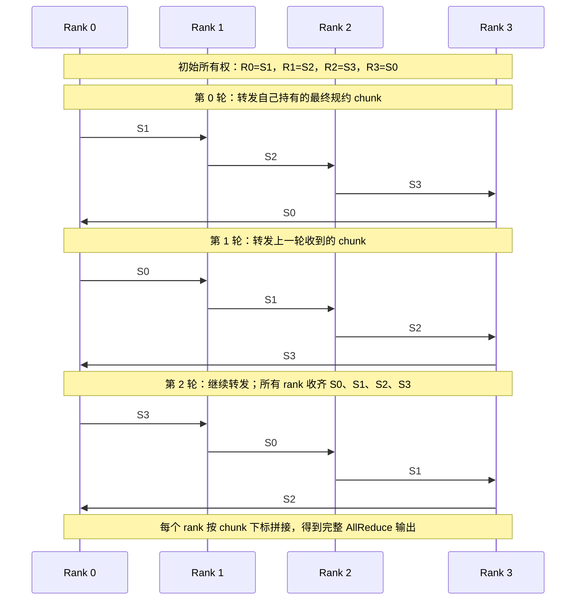
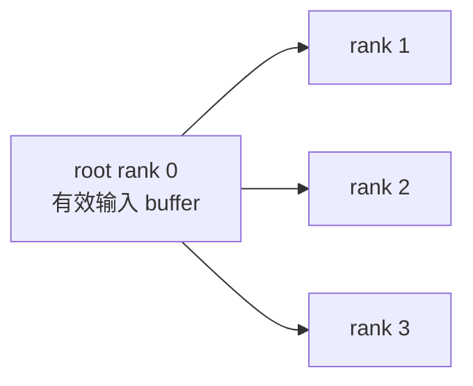
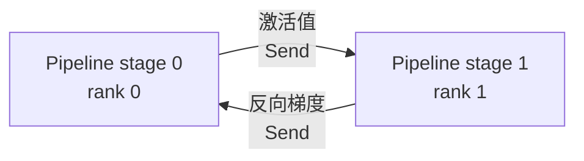
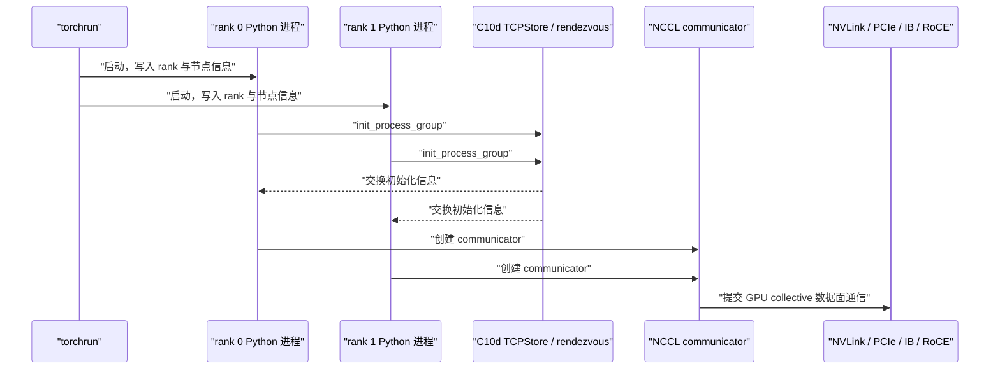
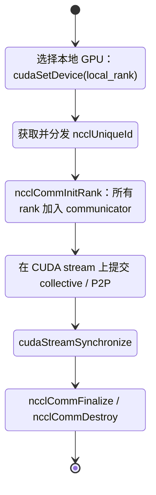
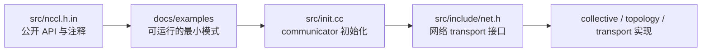

# 从 torchrun 到 NCCL：集合通信原语与接口实践

本文从“每个 rank 有一块 GPU buffer，如何与其他 rank 交换”开始，学习最常见的集合通信（collective）原语，再分别落到两层接口：

- **PyTorch 层**：用 `torchrun` 启动进程，用 `torch.distributed` 的 NCCL backend 操作 CUDA tensor。这是训练框架和应用代码最常用的入口。
- **NCCL 原生层**：用 C++/CUDA 直接创建 `ncclComm_t`，在 `cudaStream_t` 上提交 `ncclAllReduce()` 等操作。这一层能看清 communicator、rank、GPU、stream 与 MPI bootstrap 的关系。

本文示例以已安装的 PyTorch 和已克隆的 NCCL 源码为前提：

- PyTorch：以 `torch 2.5.0+cu121` 为例。
- NCCL：以下相对路径均以 **NCCL 源码仓库根目录** 为起点。

它们是**学习与实验路径**，不是要求把代码拷进当前博客工程。运行前仍须确认 GPU 数量、CUDA、NCCL、MPI 与网络环境匹配。

## 先建立运行模型：进程、rank、GPU 与 communicator

分布式 GPU 程序常采用“一 GPU 一进程”：每个进程有一个全局 `rank`，绑定一张本地 GPU。所有参加某次通信的一组 rank 组成一个 communicator / process group。



几个名字要严格区分：

| 名字 | 含义 | 典型来源 |
| --- | --- | --- |
| `rank` | communicator 内唯一的逻辑编号，范围是 `0 .. world_size - 1` | `dist.get_rank()`、`MPI_Comm_rank()`、`ncclCommUserRank()` |
| `world_size` / `nranks` | communicator 参加者总数 | `dist.get_world_size()`、`MPI_Comm_size()`、`ncclCommCount()` |
| `LOCAL_RANK` | 当前物理节点内的进程编号，常用于选择本机 GPU | `torchrun` 环境变量或 MPI shared-memory communicator |
| process group / `ncclComm_t` | 定义参与者集合和通信上下文的对象 | PyTorch `ProcessGroupNCCL` / NCCL communicator |
| CUDA stream | NCCL 操作被异步提交到的 GPU stream | PyTorch 当前 CUDA stream / `cudaStream_t` |

**最重要的约束**：同一 communicator 中的所有 rank 必须以一致顺序发起同一组 collective，并使用一致的元素数和数据类型。否则常见结果不是立即抛异常，而是某些 rank 永远在等待，从表现上看就是 hang。[NCCL collective 语义](https://docs.nvidia.com/deeplearning/nccl/user-guide/docs/usage/collectives.html)

## 原语总览：输入、输出与训练用途

设 world size 为 $p$，每个 rank 的输入分片大小为 $m$ 个元素；`reduce` 以 `sum` 为例。下表中的“每个 rank”都指同一个 communicator 内的参与者。

| 原语 | 每个 rank 的输入 | 每个 rank 的输出 | 典型 AI 用途 |
| --- | --- | --- | --- |
| **AllReduce** | $m$ | 对全部 rank 的逐元素规约结果，大小 $m$ | 数据并行梯度同步、TP 层内规约 |
| **AllGather** | $m$ | 按 rank 顺序拼接的 $p \times m$ | FSDP/ZeRO 参数重组、TP 激活值拼接 |
| **ReduceScatter** | $p \times m$ | 规约后的第 `rank` 个分片，大小 $m$ | 分片梯度同步；AllReduce 的常见替代 / 前半段 |
| **AlltoAll** | $p \times m$，按目的 rank 切块 | $p \times m$，按来源 rank 排列 | MoE token dispatch / combine |
| **Broadcast** | root 有 $m$ 个有效元素 | 所有 rank 得到 root 的 $m$ 个元素 | 参数初始化、控制数据分发 |
| **Send / Recv** | 指定发送方 / 接收方各有 $m$ | 接收方得到发送方数据 | Pipeline Parallel 相邻 stage、显式邻居交换 |

`AllReduce` 可以分解为 `ReduceScatter + AllGather`。在参数、梯度本来就分片保存的 ZeRO / FSDP 场景中，这种分解避免每张 GPU 都长期持有完整规约结果。



## AllReduce：最常见的梯度同步

### 数据语义

令 rank $r$ 的输入为 $x_r$。`sum` AllReduce 的输出在每个 rank 上都相同：

$$
y = \sum_{r=0}^{p-1} x_r
$$

数据并行训练中，各 rank 对不同 mini-batch 计算本地梯度 $g_r$，AllReduce 之后得到全局梯度和 $\sum_r g_r$。若优化器需要梯度平均值，还要除以 $p$；框架是否自动做平均，取决于上层实现，不能把“用了 AllReduce”直接等同于“已经平均”。

### Ring AllReduce：把大 buffer 切块后绕环传递

Ring AllReduce 常用于大消息。它把一个长度为 $V$ 的 buffer 切成 $p$ 个 chunk，逻辑上把 $p$ 个 rank 连成环：


算法分为两个阶段：

1. **Reduce-Scatter**：每轮把一个 chunk 传给右邻居，同时从左邻居收一个 chunk 并规约。共 $p-1$ 轮；结束时每个 rank 只持有一个已经完成规约的 chunk。
2. **AllGather**：继续沿环转发这些已规约 chunk。再经过 $p-1$ 轮，所有 rank 收齐全部 chunk，恢复完整规约结果。

下面使用 4 个 rank 做完整展开。记 $C_j$ 为原始 buffer 的第 $j$ 个 chunk，$S_j = \sum_r C_j^{(r)}$ 为第 $j$ 个 chunk 的最终规约结果。每条箭头表示同一轮中并发的发送；接收端会对 Reduce-Scatter 收到的数据执行本地 `sum`。

#### 阶段一：Reduce-Scatter 的 3 轮



此时每个 rank 都只完成了一个 chunk，而不是完整 AllReduce 结果。例如 Rank 0 在最后一轮收到 `C1` 后加上本地的 `C1`，得到 $S_1$。

#### 阶段二：AllGather 的 3 轮



每个 rank 在两个阶段总共传输约 $2\frac{p-1}{p}V$ 数据，并经历 $2(p-1)$ 轮邻居通信。它没有单一 root 瓶颈、容易吃满大消息带宽；但 rank 数增多时轮数线性增加，所以小消息或高延迟场景常会选择 tree 等其他算法。NCCL 会依据消息大小和真实拓扑选择算法、协议和 channel，应用层不应假定每一次 `ncclAllReduce()` 都必定使用 ring。

## 其余原语：先看数据布局，再写代码

### AllGather

每个 rank 贡献一个长度为 $m$ 的分片，所有 rank 得到按**源 rank**排列的完整 buffer：

```text
rank 0 输入 [a0, a1]      ┐
rank 1 输入 [b0, b1]      ├─ AllGather → 每个 rank 都得到 [a0, a1, b0, b1, c0, c1]
rank 2 输入 [c0, c1]      ┘
```

- 输出大小是输入的 $p$ 倍。
- NCCL 的 `recvbuff` 中，rank `i` 的数据位于 `i * sendcount` 偏移处。
- 常用于“每张卡只保存一段、但当前计算需要完整拼接”的情况。

### ReduceScatter

先对每个对应位置做规约，再将完整规约结果均匀切成 $p$ 段，rank `r` 只得到第 `r` 段：

```text
每个 rank 输入： [chunk 0 | chunk 1 | chunk 2 | chunk 3]
                    ↓ 对每个 chunk 跨 rank 规约
rank 0 ← sum(chunk 0)    rank 1 ← sum(chunk 1)
rank 2 ← sum(chunk 2)    rank 3 ← sum(chunk 3)
```

- 若每个输出分片为 $m$，每个输入必须有 $p \times m$ 个元素。
- NCCL 的参数是 `recvcount`，即每个 rank **输出**的元素数；这与容易误读的“总输入元素数”不同。
- 适合梯度已经按参数分片、且每张卡只需保留自己梯度 shard 的场景。

### AlltoAll

每个 rank 把输入切成 $p$ 个等长块：第 `j` 块发给 rank `j`；同时从每个源 rank 收一块。输出按**源 rank**排列：

```text
rank r 的输入： [给 rank 0 的块 | 给 rank 1 的块 | ... | 给 rank p-1 的块]
rank r 的输出： [来自 rank 0 的块 | 来自 rank 1 的块 | ... | 来自 rank p-1 的块]
```

- 它不是 AllGather：AllGather 把同一份本地分片广播给所有人；AlltoAll 向不同目的地发送不同分片。
- MoE 中 token 先按 expert 所在 rank 分桶，再执行 AlltoAll；专家计算结束后通常再 AlltoAll 把结果送回原 rank。
- AlltoAll 的流量更分散，网络 bisection bandwidth、拥塞控制和负载均衡比普通 AllReduce 更关键。

### Broadcast

root rank 的 buffer 复制给所有 rank：



- `root` 是 communicator 内的 **rank**，不是 CUDA device id。
- 只有 root 的输入数据有意义；所有 rank 都得到相同输出。
- 典型用途是初始化参数或分发少量控制数据；训练中的大参数同步通常不靠每 step Broadcast，而靠梯度 AllReduce 等方式保持副本一致。

### Send / Recv

`Send / Recv` 是显式点对点通信：发送方指定目标 `peer`，接收方指定来源 `peer`。它们不自动组成全局 collective。



- NCCL 的 `ncclSend()` 与对端 `ncclRecv()` 必须匹配相同 `count`、`datatype` 和 peer；不像 MPI receive 那样提供 `MPI_ANY_SOURCE` 或 message tag。
- 一次 rank 同时 send/recv 多个 peer 时，应使用 `ncclGroupStart()` / `ncclGroupEnd()` 把操作聚合提交，避免 GPU 侧互相等待。
- PyTorch 可用 `dist.isend()`、`dist.irecv()` 和 `dist.batch_isend_irecv()` 表达同一类模式。NCCL backend 不支持 P2P tag，因此不要把 tag 当成它的匹配机制。

## PyTorch：用 torchrun 启动 NCCL 通信组

### `torchrun` 做什么，不做什么

`torchrun` 是 launcher：它在每台机器上创建 worker 进程，设置 `RANK`、`LOCAL_RANK`、`WORLD_SIZE`、`MASTER_ADDR`、`MASTER_PORT` 等环境变量。脚本调用 `dist.init_process_group(backend="nccl")` 后，PyTorch 创建 `ProcessGroupNCCL`；NCCL 再建立 communicator 并选择节点内 / 节点间 transport。



这条默认路径**不需要 MPI**。MPI 可以作为另一种 launcher / bootstrap 或 CPU 通信工具，但普通 PyTorch DDP 的 `torchrun + NCCL` 已能完成跨节点 GPU 通信。`torchrun` 的进程发现与 NCCL 的大数据 transport 是两件事。[torchrun 文档](https://docs.pytorch.org/docs/stable/elastic/run.html) [NCCL setup 文档](https://docs.nvidia.com/deeplearning/nccl/user-guide/docs/setup.html)

### PyTorch 关键接口

| 接口 | 原型 | 用途与关键约束 |
| --- | --- | --- |
| `init_process_group` | `dist.init_process_group(backend="nccl")` | 用环境变量 / store 创建默认 process group；NCCL 下每个进程应先绑定自己的 CUDA device。 |
| `all_reduce` | `dist.all_reduce(tensor, op=dist.ReduceOp.SUM)` | 原地修改 `tensor` 为规约结果。 |
| `all_gather_into_tensor` | `dist.all_gather_into_tensor(output, input)` | `output` 要容纳 `world_size` 份 `input`。 |
| `reduce_scatter_tensor` | `dist.reduce_scatter_tensor(output, input, op=...)` | `input` 的元素数应为 `world_size * output.numel()`。 |
| `all_to_all_single` | `dist.all_to_all_single(output, input)` | 未提供 split sizes 时，输入输出按 world size 等分。 |
| `broadcast` | `dist.broadcast(tensor, src)` | 原地写入所有 rank 的 `tensor`；`src` 是 rank。 |
| `batch_isend_irecv` | `dist.batch_isend_irecv([dist.P2POp(...)])` | 批量提交匹配的非阻塞 P2P 操作，并对返回 request 调用 `wait()`。 |

### 一份可运行的 PyTorch 原语练习

将下面内容保存为 `torchrun_collectives.py`。它假定每个进程独占一张 GPU，并用同一个 process group 依次演示六种原语；示例以可读性为先，不是 benchmark。

```python
"""用 torchrun + NCCL 演示常见集合通信与环形 Send/Recv。"""

import os

import torch
import torch.distributed as dist


def show_tensor(name: str, tensor: torch.Tensor, rank: int) -> None:
    """同步当前 GPU，再打印当前 rank 持有的小 tensor。"""
    torch.cuda.synchronize()
    print(f"[rank {rank}] {name}: {tensor.cpu().tolist()}", flush=True)


def main() -> None:
    # torchrun 为每个 worker 设置这些环境变量。
    local_rank = int(os.environ["LOCAL_RANK"])
    torch.cuda.set_device(local_rank)
    device = torch.device("cuda", local_rank)

    # 使用 env:// 默认 rendezvous；backend='nccl' 让 CUDA tensor 走 NCCL。
    dist.init_process_group(backend="nccl")
    rank = dist.get_rank()
    world_size = dist.get_world_size()

    # 1. AllReduce：所有 rank 都得到 1 + 2 + ... + world_size。
    allreduce_input = torch.full((2,), float(rank + 1), device=device)
    dist.all_reduce(allreduce_input, op=dist.ReduceOp.SUM)
    show_tensor("AllReduce(sum)", allreduce_input, rank)

    # 2. AllGather：输出按源 rank 拼接。
    gather_input = torch.tensor([rank * 10, rank * 10 + 1], device=device)
    gather_output = torch.empty(world_size * gather_input.numel(), device=device,
                                dtype=gather_input.dtype)
    dist.all_gather_into_tensor(gather_output, gather_input)
    show_tensor("AllGather", gather_output, rank)

    # 3. ReduceScatter：每个 rank 输入 world_size 个 chunk，只保留规约后的本 rank chunk。
    chunk_size = 2
    reduce_scatter_input = torch.full((world_size * chunk_size,), float(rank + 1),
                                      device=device)
    reduce_scatter_output = torch.empty(chunk_size, device=device)
    dist.reduce_scatter_tensor(
        reduce_scatter_output, reduce_scatter_input, op=dist.ReduceOp.SUM
    )
    show_tensor("ReduceScatter(sum)", reduce_scatter_output, rank)

    # 4. AlltoAll：第 dst 个 chunk 发给 rank dst；输出按源 rank 排列。
    # 例如 rank 2 给 rank 1 的 chunk 中填 201，便于从输出看出来源与目的地。
    alltoall_input = torch.empty(world_size * chunk_size, device=device)
    for dst_rank in range(world_size):
        alltoall_input[dst_rank * chunk_size : (dst_rank + 1) * chunk_size] = (
            rank * 100 + dst_rank
        )
    alltoall_output = torch.empty_like(alltoall_input)
    dist.all_to_all_single(alltoall_output, alltoall_input)
    show_tensor("AlltoAll", alltoall_output, rank)

    # 5. Broadcast：只有 src=0 的初始内容有意义；调用后每张 GPU 都得到相同数据。
    broadcast_tensor = torch.tensor([10, 20], device=device) if rank == 0 else \
        torch.zeros(2, device=device, dtype=torch.int64)
    dist.broadcast(broadcast_tensor, src=0)
    show_tensor("Broadcast(src=0)", broadcast_tensor, rank)

    # 6. Send / Recv：每个 rank 向右邻居发送，并从左邻居接收，构成一个环。
    # 将 send 和 recv 放在同一个 batch 中，所有 rank 都以相同顺序提交匹配操作。
    next_rank = (rank + 1) % world_size
    prev_rank = (rank - 1 + world_size) % world_size
    send_tensor = torch.full((2,), rank, device=device, dtype=torch.int64)
    recv_tensor = torch.empty_like(send_tensor)
    requests = dist.batch_isend_irecv([
        dist.P2POp(dist.isend, send_tensor, next_rank),
        dist.P2POp(dist.irecv, recv_tensor, prev_rank),
    ])
    for request in requests:
        request.wait()
    show_tensor("Recv from previous rank", recv_tensor, rank)

    # 确保全部 rank 都结束 P2P，再销毁 process group。
    dist.barrier()
    dist.destroy_process_group()


if __name__ == "__main__":
    main()
```

单机两卡运行：

```shell
CUDA_VISIBLE_DEVICES=0,1 \
  torchrun \
  --standalone --nproc_per_node=2 torchrun_collectives.py
```

两节点、每节点 8 卡时，在节点 0 运行：

```shell
torchrun --nnodes=2 --nproc_per_node=8 --node_rank=0 \
  --master_addr=<节点0可访问IP> --master_port=29500 \
  torchrun_collectives.py
```

节点 1 使用完全相同的命令，只把 `--node_rank=1`。实际集群通常由 Slurm、Kubernetes 或其他作业系统负责在每个节点执行这条 launcher 命令。

### 这份 PyTorch 示例应看到什么

若 `world_size=4`：

- `AllReduce(sum)` 的每个元素是 `1 + 2 + 3 + 4 = 10`。
- `AllGather` 在每个 rank 上都是 `[0, 1, 10, 11, 20, 21, 30, 31]`。
- `ReduceScatter(sum)` 的每个元素也是 `10`，但每个 rank 只拿两个元素。
- rank `r` 的 `AlltoAll` 输出第 `src` 个 chunk 为 `src * 100 + r`。
- `Broadcast` 都是 `[10, 20]`。
- rank `r` 的 P2P 接收 buffer 由 `prev_rank` 填充。

## NCCL 原生接口：从头文件理解 communicator 与原语

NCCL 源码仓库中，权威声明位于 `src/nccl.h.in`。它是生成公开 `nccl.h` 的模板；学习接口时优先看它，而不是先钻进 `src/` 的 transport 实现。

### communicator 初始化接口

#### `ncclCommInitAll`

**用途**

单进程管理多张本地 GPU 时，一次创建所有 communicator。它内部完成本进程内的协调，不能扩展到多个节点。

**原型**

```cpp
ncclResult_t ncclCommInitAll(ncclComm_t* comm, int ndev, const int* devlist);
```

**参数**

| 参数 | 类型 | 含义 |
| --- | --- | --- |
| `comm` | `ncclComm_t*` | 调用方预分配的 communicator 数组，至少容纳 `ndev` 个元素；成功后每个元素对应一张 GPU。 |
| `ndev` | `int` | 加入 communicator 的本地 CUDA device 数。 |
| `devlist` | `const int*` | CUDA device id 数组；传 `NULL` 时使用前 `ndev` 张可见 GPU。数组顺序决定 communicator 中的 rank 顺序。 |

**返回值**

| 类型 | 含义 |
| --- | --- |
| `ncclResult_t` | `ncclSuccess` 表示初始化成功；其他值应用 `ncclGetErrorString()` 输出原因。 |

**副作用 / 约束**

- 它只适合单机、单进程多 GPU 的学习或特定应用模型。
- 每张 GPU 的通信仍应提交到该 GPU 对应的 CUDA stream。
- 生命周期结束前，应在完成 stream 同步后销毁每个 communicator。

最小初始化片段：

```cpp
// 单进程管理 GPU 0、1；comms[0] 的 user rank 为 0，comms[1] 为 1。
const int devices[] = {0, 1};
ncclComm_t comms[2];
NCCL_CHECK(ncclCommInitAll(comms, 2, devices));
```

#### `ncclGetUniqueId` 与 `ncclCommInitRank`

**用途**

为多进程 / 多节点场景创建 communicator。rank 0 生成唯一 ID，外部 bootstrap（MPI、TCP store、作业系统等）把它发给所有 rank；每个进程在绑定本地 GPU 后以自己的全局 rank 加入同一 communicator。

**原型**

```cpp
ncclResult_t ncclGetUniqueId(ncclUniqueId* uniqueId);

ncclResult_t ncclCommInitRank(
    ncclComm_t* comm, int nranks, ncclUniqueId commId, int rank);
```

**参数**

| 参数 | 类型 | 含义 |
| --- | --- | --- |
| `uniqueId` / `commId` | `ncclUniqueId` | 同一个 communicator 的所有 rank 必须使用完全相同的唯一 ID。 |
| `comm` | `ncclComm_t*` | 输出 communicator。 |
| `nranks` | `int` | 全局参与者数量。 |
| `rank` | `int` | 当前进程在 communicator 中的唯一编号，范围为 `0 .. nranks - 1`。 |

**副作用 / 约束**

- 调用前必须先 `cudaSetDevice(local_rank)`，使当前进程的 NCCL rank 与正确本地 GPU 绑定。
- `ncclCommInitRank()` 隐含跨 rank 同步；每个 rank 应由独立进程 / 线程并发调用，或用 `ncclGroupStart()` / `ncclGroupEnd()` 聚合初始化调用。
- NCCL 本身没有作业 launcher；MPI 只是常见的 ID 分发器，不是 NCCL 跨节点数据面必需品。

### 通信原语的 NCCL C API 对照

以下声明和枚举摘自 NCCL 源码仓库的 `src/nccl.h.in`。这是生成公开 `nccl.h` 的模板；不同 NCCL 版本可能新增类型或 API，实际编译应以本机安装的 `nccl.h` 为准。

先看索引：所有 API 都返回 `ncclResult_t`；所有 buffer 指针都是 **GPU device pointer**；所有操作都提交到 `cudaStream_t stream`，调用返回不等于 GPU 已完成。

| 原语 | 规约操作 | 关键长度参数 | 结果布局 |
| --- | --- | --- | --- |
| `ncclAllReduce` | 需要 `ncclRedOp_t op` | `count` | 每个 rank 的 `recvbuff[0:count]` 都是完整规约结果。 |
| `ncclAllGather` | 不需要 | `sendcount` | `recvbuff` 按源 rank 拼接。 |
| `ncclReduceScatter` | 需要 `op` | `recvcount` | 每个 rank 只保留自己编号对应的规约分片。 |
| `ncclAlltoAll` | 不需要 | `count` | 以等长 chunk 交换，输出按源 rank 排列。 |
| `ncclBroadcast` | 不需要 | `count` | root 的数据复制到所有 rank。 |
| `ncclSend` / `ncclRecv` | 不需要 | `count` | 指定的两个 peer 间传输同样的类型和元素数。 |

#### 公共句柄、返回值与枚举

**句柄与返回类型来源**

```cpp
// `ncclComm_t` 是不透明指针；应用只能创建、传递和销毁，不能访问内部字段。
typedef struct ncclComm* ncclComm_t;

// 每次 NCCL API 调用的返回状态。
typedef enum {
  ncclSuccess            = 0,
  ncclUnhandledCudaError = 1,
  ncclSystemError        = 2,
  ncclInternalError      = 3,
  ncclInvalidArgument    = 4,
  ncclInvalidUsage       = 5,
  ncclRemoteError        = 6,
  ncclInProgress         = 7,
  ncclTimeout            = 8,
  ncclNumResults         = 9,
} ncclResult_t;
```

`ncclSuccess` 是唯一的成功返回值。失败时用 `ncclGetErrorString(result)` 打印信息；通信、网络等异步错误还应结合 `ncclCommGetAsyncError()` 检查。示例中的 `NCCL_CHECK` 宏就是把这里的返回值变成带文件行号的错误报告。

**`ncclDataType_t`：buffer 中一个元素的解释方式**

```cpp
typedef enum {
  ncclInt8       = 0,  ncclChar   = 0,
  ncclUint8      = 1,
  ncclInt32      = 2,  ncclInt    = 2,
  ncclUint32     = 3,
  ncclInt64      = 4,
  ncclUint64     = 5,
  ncclFloat16    = 6,  ncclHalf   = 6,
  ncclFloat32    = 7,  ncclFloat  = 7,
  ncclFloat64    = 8,  ncclDouble = 8,
  ncclBfloat16   = 9,
  ncclFloat8e4m3 = 10,
  ncclFloat8e5m2 = 11,
  ncclNumTypes   = 12,
} ncclDataType_t;
```

`count`、`sendcount`、`recvcount` 的单位都是**元素个数**，不是 byte 数；元素字节数由 `datatype` 决定。例如传输 1024 个 `float` 应使用 `count = 1024` 与 `datatype = ncclFloat`，而不是把 `4096` 作为 `count`。`ncclFloat` / `ncclFloat32`、`ncclHalf` / `ncclFloat16`、`ncclInt` / `ncclInt32` 是同值别名。传入的枚举必须与实际 device buffer 的元素布局匹配。

**`ncclRedOp_t`：AllReduce 与 ReduceScatter 的逐元素规约规则**

```cpp
typedef enum { ncclNumOps_dummy = 5 } ncclRedOp_dummy_t;

typedef enum {
  ncclSum      = 0,
  ncclProd     = 1,
  ncclMax      = 2,
  ncclMin      = 3,
  ncclAvg      = 4,
  ncclNumOps   = 5,
  ncclMaxRedOp = 0x7fffffff >> (32 - 8 * sizeof(ncclRedOp_dummy_t)),
} ncclRedOp_t;
```

`ncclSum` 是梯度同步最常用的操作；`ncclProd`、`ncclMax`、`ncclMin` 分别表示乘积、最大值、最小值；`ncclAvg` 表示平均规约。`ncclNumOps` 是内建操作数量，不是可传给 collective 的实际操作；`ncclMaxRedOp` 是为 ABI 兼容预留的合法枚举上界。高级场景还可用 `ncclRedOpCreatePreMulSum()` 创建“先乘标量、再求和”的动态规约操作，但它不属于本节的基本原语。

**所有原语共享的参数约束**

| 参数 | 类型 | 含义与约束 |
| --- | --- | --- |
| `comm` | `ncclComm_t` | 已成功初始化、尚未销毁的 communicator。参与同一 collective 的所有 rank 必须属于同一个 communicator，并以相同顺序发起匹配调用。 |
| `stream` | `cudaStream_t` | NCCL kernel 和传输任务入队的 CUDA stream。调用通常异步返回；访问输出、释放 buffer 或销毁 communicator 前要用 CUDA event / stream 同步建立依赖。 |
| `sendbuff` | `const void*` | 只读的 GPU device pointer。它指向的元素类型由 `datatype` 指定，至少在该 stream 中操作完成前保持有效。 |
| `recvbuff` | `void*` | 可写的 GPU device pointer。调用会写入结果；其容量由原语的布局规则决定。 |
| `datatype` | `ncclDataType_t` | buffer 单个元素的 NCCL 类型，所有配对 rank 对同一次操作必须匹配。 |
| `count` / `sendcount` / `recvcount` | `size_t` | 元素数，不是字节数。不同函数用不同名字强调“哪个 buffer 的局部长度”是基本单位。 |

#### `ncclAllReduce`

**用途与原理**

每个 rank 输入同样长度的数组；NCCL 对相同下标的元素应用 `op`，把相同的完整结果写到每个 rank。设第 `r` 个 rank 的输入为 $x_r$，`ncclSum` 的结果为 $y[i] = \sum_r x_r[i]$。NCCL 会按拓扑、消息大小等选择 Ring、Tree 或其他内部算法；应用代码只描述数据契约，不指定具体算法。

**原型**

```cpp
ncclResult_t ncclAllReduce(
    const void* sendbuff,
    void* recvbuff,
    size_t count,
    ncclDataType_t datatype,
    ncclRedOp_t op,
    ncclComm_t comm,
    cudaStream_t stream);
```

**参数**

| 参数 | 类型 | 含义 |
| --- | --- | --- |
| `sendbuff` | `const void*` | 当前 rank 的输入数组，包含 `count` 个 `datatype` 元素。 |
| `recvbuff` | `void*` | 当前 rank 的输出数组，容量至少为 `count` 个元素；每个 rank 都得到完整结果。 |
| `count` | `size_t` | 每个 rank 的输入、输出元素数。 |
| `datatype` | `ncclDataType_t` | 输入与输出元素类型，如 `ncclFloat`。 |
| `op` | `ncclRedOp_t` | 对等下标元素执行的规约，如 `ncclSum`。 |
| `comm` | `ncclComm_t` | 全部参与规约的 rank 集合。 |
| `stream` | `cudaStream_t` | 操作入队的 CUDA stream。 |

**副作用 / 约束**

- 每个 rank 的 `count`、`datatype`、`op` 必须一致。
- `sendbuff == recvbuff` 时为原地 AllReduce；否则两个 buffer 可分离。
- 典型用途是数据并行梯度求和；若上层需要平均梯度，要确认是 NCCL 使用 `ncclAvg`，还是在 AllReduce 后由框架除以 `world_size`。

#### `ncclAllGather`

**用途与原理**

每个 rank 提供一个等长局部片段，NCCL 按**源 rank 编号**把全部片段拼接到每个 rank 的输出中。它没有规约操作：rank `i` 的输入放到每个输出的第 `i` 个片段。

**原型**

```cpp
ncclResult_t ncclAllGather(
    const void* sendbuff,
    void* recvbuff,
    size_t sendcount,
    ncclDataType_t datatype,
    ncclComm_t comm,
    cudaStream_t stream);
```

**参数**

| 参数 | 类型 | 含义 |
| --- | --- | --- |
| `sendbuff` | `const void*` | 当前 rank 的输入片段，长度为 `sendcount`。 |
| `recvbuff` | `void*` | 完整输出，至少容纳 `nranks * sendcount` 个元素。 |
| `sendcount` | `size_t` | 每个 rank 发送的局部元素数。 |
| `datatype` | `ncclDataType_t` | 每个元素的类型。 |
| `comm` | `ncclComm_t` | 提供 `nranks` 与 rank 编号。 |
| `stream` | `cudaStream_t` | 操作入队 stream。 |

**布局与约束**

```text
recvbuff[rank_i * sendcount : (rank_i + 1) * sendcount]
    = rank_i 的 sendbuff
```

- `sendbuff == recvbuff + rank * sendcount` 时是原地 AllGather。
- 输出大小随 `nranks` 线性增长；FSDP/ZeRO 中常见的参数重组要注意这份临时完整 buffer 的显存开销。

#### `ncclReduceScatter`

**用途与原理**

它是“AllReduce 后只保留自己分片”的组合：所有 rank 对完整输入的同一位置做规约，但 rank `i` 仅接收规约结果的第 `i` 个等长分片。因此每个 rank 只写 `recvcount` 个元素。

**原型**

```cpp
ncclResult_t ncclReduceScatter(
    const void* sendbuff,
    void* recvbuff,
    size_t recvcount,
    ncclDataType_t datatype,
    ncclRedOp_t op,
    ncclComm_t comm,
    cudaStream_t stream);
```

**参数**

| 参数 | 类型 | 含义 |
| --- | --- | --- |
| `sendbuff` | `const void*` | 当前 rank 的完整待规约数组，至少含 `nranks * recvcount` 个元素。 |
| `recvbuff` | `void*` | 当前 rank 的结果分片，至少含 `recvcount` 个元素。 |
| `recvcount` | `size_t` | 每个 rank 最终保留的元素数，不是完整输入长度。 |
| `datatype` | `ncclDataType_t` | 输入、输出元素类型。 |
| `op` | `ncclRedOp_t` | 规约规则，常用 `ncclSum`。 |
| `comm` | `ncclComm_t` | 参与规约与分片分配的 communicator。 |
| `stream` | `cudaStream_t` | 操作入队 stream。 |

**布局与约束**

```text
完整规约结果 result 的第 rank 个分片：
recvbuff = result[rank * recvcount : (rank + 1) * recvcount]
```

- NCCL 假设每个 rank 的 `sendbuff` 长度等于 `nranks * recvcount`。
- `recvbuff == sendbuff + rank * recvcount` 时可原地执行。
- 分片优化器状态或分片梯度场景中，它避免每张 GPU 都保存完整 AllReduce 结果。

#### `ncclAlltoAll`

**用途与原理**

每个 rank 把输入切为 `nranks` 个等长 chunk：第 `j` 块发送给 rank `j`。同时它从每个源 rank 接收一个 chunk，输出按**源 rank**排列。这是 MoE 将 token 按专家目的地重排的基础模式；不等长 token 数则需要在上层先计算 split，并用多个 P2P 操作或更高层封装表达。

**原型**

```cpp
ncclResult_t ncclAlltoAll(
    const void* sendbuff,
    void* recvbuff,
    size_t count,
    ncclDataType_t datatype,
    ncclComm_t comm,
    cudaStream_t stream);
```

**参数**

| 参数 | 类型 | 含义 |
| --- | --- | --- |
| `sendbuff` | `const void*` | 当前 rank 的发送总 buffer，至少有 `nranks * count` 个元素。 |
| `recvbuff` | `void*` | 当前 rank 的接收总 buffer，至少有 `nranks * count` 个元素。 |
| `count` | `size_t` | 发给**每一个目的 rank**、也从**每一个源 rank**接收的元素数。 |
| `datatype` | `ncclDataType_t` | chunk 元素类型。 |
| `comm` | `ncclComm_t` | 决定 `nranks`、源 rank 和目的 rank 的编号。 |
| `stream` | `cudaStream_t` | 操作入队 stream。 |

**布局与约束**

```text
发送：sendbuff + destination_rank * count  → destination_rank
接收：recvbuff + source_rank      * count  ← source_rank
```

- 这是等长 All-to-All；每对 `(source, destination)` 的 chunk 都是相同 `count`。
- 输出第 `i` 块来自 rank `i`，不是当前 rank 原本发给 `i` 的那一块。

#### `ncclBroadcast`

**用途与原理**

`root` rank 提供输入，NCCL 将它复制到 communicator 中每个 rank 的输出 buffer。`root` 是 communicator 内的**逻辑 rank**，不是 CUDA device id。

**原型**

```cpp
ncclResult_t ncclBroadcast(
    const void* sendbuff,
    void* recvbuff,
    size_t count,
    ncclDataType_t datatype,
    int root,
    ncclComm_t comm,
    cudaStream_t stream);
```

**参数**

| 参数 | 类型 | 含义 |
| --- | --- | --- |
| `sendbuff` | `const void*` | root 上的有效输入，长度为 `count`；非 root 上的内容不会成为广播源。 |
| `recvbuff` | `void*` | 每个 rank 的输出，容量至少为 `count` 个元素。 |
| `count` | `size_t` | 广播的元素数。 |
| `datatype` | `ncclDataType_t` | 元素类型。 |
| `root` | `int` | 广播源的 communicator rank，范围为 `0 .. nranks - 1`。 |
| `comm` | `ncclComm_t` | 广播参与者集合。 |
| `stream` | `cudaStream_t` | 操作入队 stream。 |

**副作用 / 约束**

- root 与全部接收方都要调用该 API；不能只有 root 调用。
- `sendbuff == recvbuff` 时为原地 Broadcast。
- 旧接口 `ncclBcast(void* buff, ...)` 只表达原地广播；新代码优先使用显式区分输入、输出的 `ncclBroadcast()`。

#### `ncclSend` 与 `ncclRecv`

**用途与原理**

这是一对显式点对点操作。发送方调用 `ncclSend()`，接收方调用匹配的 `ncclRecv()`；两侧的 `count` 和 `datatype` 必须相同。它们适合 pipeline parallel 邻 stage 传 activation，或显式实现环形邻居交换。

**原型**

```cpp
ncclResult_t ncclSend(
    const void* sendbuff,
    size_t count,
    ncclDataType_t datatype,
    int peer,
    ncclComm_t comm,
    cudaStream_t stream);

ncclResult_t ncclRecv(
    void* recvbuff,
    size_t count,
    ncclDataType_t datatype,
    int peer,
    ncclComm_t comm,
    cudaStream_t stream);
```

**参数**

| 参数 | `ncclSend` 类型与含义 | `ncclRecv` 类型与含义 |
| --- | --- | --- |
| `sendbuff` / `recvbuff` | `const void*`：发送的 GPU buffer，含 `count` 个元素。 | `void*`：接收的 GPU buffer，容量至少为 `count` 个元素。 |
| `count` | `size_t`：发送元素数。 | `size_t`：期望接收元素数；必须与匹配发送方相同。 |
| `datatype` | `ncclDataType_t`：发送元素类型。 | `ncclDataType_t`：接收元素类型；必须与匹配发送方相同。 |
| `peer` | `int`：目标 communicator rank。 | `int`：源 communicator rank。 |
| `comm` | `ncclComm_t`：两端共同使用的 communicator。 | `ncclComm_t`：两端共同使用的 communicator。 |
| `stream` | `cudaStream_t`：发送任务入队的 stream。 | `cudaStream_t`：接收任务入队的 stream。 |

**副作用 / 约束**

- NCCL P2P 没有 MPI 的 `MPI_ANY_SOURCE` 和 message tag；接收方必须明确知道 `peer`。
- 对 GPU 而言，P2P 操作可能等待对端匹配调用。若一个 rank 同时存在多个互相等待的 Send / Recv，应把相关调用包在 `ncclGroupStart()` / `ncclGroupEnd()` 内，让 NCCL 一起提交并推进。例如环形交换中“先 Send 再 Recv”在所有 rank 上都可能卡住，而“一个 group 内同时声明 Send 和 Recv”可表达成对交换。
- 指针的内容与存储空间至少要存活到相应 CUDA stream 中的 NCCL 操作完成。

### 一份 MPI bootstrap + NCCL C++/CUDA 练习

下面的示例采用最常见的“一 MPI 进程一 GPU”模式。MPI 只负责进程启动、查询 rank、计算 node-local rank、广播 `ncclUniqueId`；AllReduce 等 GPU 数据面由 NCCL 负责。

将其保存为 `nccl_collectives_mpi.cc`。为保持示例聚焦，所有 collective 都在同一个 stream 上串行演示，并在每次操作后同步和打印；真实训练应使用 bucket、异步 stream 和计算通信重叠，而不是每一步同步。

```cpp
#include <cuda_runtime.h>
#include <mpi.h>
#include <nccl.h>

#include <cstdio>
#include <cstdlib>
#include <vector>

/** @brief 检查 CUDA 调用；失败时中止整个 MPI 作业，避免其他 rank 永久等待。 */
#define CUDA_CHECK(command)                                                     \
  do {                                                                          \
    const cudaError_t error = (command);                                        \
    if (error != cudaSuccess) {                                                 \
      std::fprintf(stderr, "CUDA 失败 %s:%d: %s\\n", __FILE__, __LINE__,      \
                   cudaGetErrorString(error));                                 \
      MPI_Abort(MPI_COMM_WORLD, EXIT_FAILURE);                                  \
    }                                                                           \
  } while (0)

/** @brief 检查 NCCL 调用；失败时中止整个 MPI 作业，避免 collective 不匹配。 */
#define NCCL_CHECK(command)                                                     \
  do {                                                                          \
    const ncclResult_t result = (command);                                      \
    if (result != ncclSuccess) {                                                \
      std::fprintf(stderr, "NCCL 失败 %s:%d: %s\\n", __FILE__, __LINE__,      \
                   ncclGetErrorString(result));                                \
      MPI_Abort(MPI_COMM_WORLD, EXIT_FAILURE);                                  \
    }                                                                           \
  } while (0)

/**
 * @brief 返回当前 MPI 进程在本物理节点中的 local rank，用于选择本机 GPU。
 *
 * @param world_comm 全局 MPI communicator。
 * @return 当前节点内的编号，从 0 开始。
 */
int get_local_rank(MPI_Comm world_comm) {
  int world_rank = 0;
  MPI_Comm_rank(world_comm, &world_rank);

  MPI_Comm local_comm = MPI_COMM_NULL;
  MPI_Comm_split_type(world_comm, MPI_COMM_TYPE_SHARED, world_rank,
                      MPI_INFO_NULL, &local_comm);

  int local_rank = 0;
  MPI_Comm_rank(local_comm, &local_rank);
  MPI_Comm_free(&local_comm);
  return local_rank;
}

/**
 * @brief 从当前 GPU 的 device buffer 复制少量元素到 host 并打印。
 *
 * @param name 当前原语名称。
 * @param device_buffer 指向当前 GPU 上的 float buffer，不拥有其内存。
 * @param count 要打印的元素个数。
 * @param rank 当前 NCCL/MPI rank。
 */
void print_device_buffer(const char* name, const float* device_buffer,
                         std::size_t count, int rank) {
  std::vector<float> host_buffer(count);
  CUDA_CHECK(cudaMemcpy(host_buffer.data(), device_buffer,
                        count * sizeof(float), cudaMemcpyDeviceToHost));
  std::printf("[rank %d] %s:", rank, name);
  for (const float value : host_buffer) {
    std::printf(" %.1f", value);
  }
  std::printf("\\n");
}

int main(int argc, char** argv) {
  MPI_Init(&argc, &argv);

  int rank = 0;
  int world_size = 0;
  MPI_Comm_rank(MPI_COMM_WORLD, &rank);
  MPI_Comm_size(MPI_COMM_WORLD, &world_size);

  // 每个进程绑定本节点内不同 GPU；多节点时各节点都会有 local_rank 0、1、...。
  const int local_rank = get_local_rank(MPI_COMM_WORLD);
  int device_count = 0;
  CUDA_CHECK(cudaGetDeviceCount(&device_count));
  if (local_rank >= device_count) {
    std::fprintf(stderr, "rank %d 需要本地 GPU %d，但本节点仅有 %d 张 GPU\\n",
                 rank, local_rank, device_count);
    MPI_Abort(MPI_COMM_WORLD, EXIT_FAILURE);
  }
  CUDA_CHECK(cudaSetDevice(local_rank));

  cudaStream_t stream = nullptr;
  CUDA_CHECK(cudaStreamCreate(&stream));

  // 只有 rank 0 生成 unique ID；MPI 把同一个字节序列广播给所有 NCCL rank。
  ncclUniqueId unique_id;
  if (rank == 0) {
    NCCL_CHECK(ncclGetUniqueId(&unique_id));
  }
  MPI_Bcast(&unique_id, sizeof(unique_id), MPI_BYTE, 0, MPI_COMM_WORLD);

  ncclComm_t comm = nullptr;
  NCCL_CHECK(ncclCommInitRank(&comm, world_size, unique_id, rank));

  constexpr std::size_t kChunkSize = 2;
  const std::size_t max_count = static_cast<std::size_t>(world_size) * kChunkSize;
  float* device_send = nullptr;
  float* device_recv = nullptr;
  CUDA_CHECK(cudaMalloc(&device_send, max_count * sizeof(float)));
  CUDA_CHECK(cudaMalloc(&device_recv, max_count * sizeof(float)));
  std::vector<float> host_send(max_count);

  // 1. AllReduce：每个 rank 贡献 [rank+1, rank+1]，所有人得到总和。
  host_send.assign(max_count, 0.0F);
  host_send[0] = static_cast<float>(rank + 1);
  host_send[1] = static_cast<float>(rank + 1);
  CUDA_CHECK(cudaMemcpyAsync(device_send, host_send.data(),
                             kChunkSize * sizeof(float), cudaMemcpyHostToDevice,
                             stream));
  NCCL_CHECK(ncclAllReduce(device_send, device_recv, kChunkSize, ncclFloat,
                           ncclSum, comm, stream));
  CUDA_CHECK(cudaStreamSynchronize(stream));
  print_device_buffer("AllReduce(sum)", device_recv, kChunkSize, rank);

  // 2. AllGather：每个 rank 发送两个元素；输出按源 rank 顺序排列。
  host_send[0] = static_cast<float>(rank * 10);
  host_send[1] = static_cast<float>(rank * 10 + 1);
  CUDA_CHECK(cudaMemcpyAsync(device_send, host_send.data(),
                             kChunkSize * sizeof(float), cudaMemcpyHostToDevice,
                             stream));
  NCCL_CHECK(ncclAllGather(device_send, device_recv, kChunkSize, ncclFloat,
                           comm, stream));
  CUDA_CHECK(cudaStreamSynchronize(stream));
  print_device_buffer("AllGather", device_recv, max_count, rank);

  // 3. ReduceScatter：输入有 world_size 个 chunk；当前 rank 仅保留自己的规约 chunk。
  for (std::size_t i = 0; i < max_count; ++i) {
    host_send[i] = static_cast<float>(rank + 1);
  }
  CUDA_CHECK(cudaMemcpyAsync(device_send, host_send.data(),
                             max_count * sizeof(float), cudaMemcpyHostToDevice,
                             stream));
  NCCL_CHECK(ncclReduceScatter(device_send, device_recv, kChunkSize, ncclFloat,
                               ncclSum, comm, stream));
  CUDA_CHECK(cudaStreamSynchronize(stream));
  print_device_buffer("ReduceScatter(sum)", device_recv, kChunkSize, rank);

  // 4. AlltoAll：第 dst 个 chunk 发给 rank dst；接收 buffer 的第 src 个 chunk 来自 rank src。
  for (int dst_rank = 0; dst_rank < world_size; ++dst_rank) {
    for (std::size_t offset = 0; offset < kChunkSize; ++offset) {
      host_send[static_cast<std::size_t>(dst_rank) * kChunkSize + offset] =
          static_cast<float>(rank * 100 + dst_rank);
    }
  }
  CUDA_CHECK(cudaMemcpyAsync(device_send, host_send.data(),
                             max_count * sizeof(float), cudaMemcpyHostToDevice,
                             stream));
  NCCL_CHECK(ncclAlltoAll(device_send, device_recv, kChunkSize, ncclFloat,
                          comm, stream));
  CUDA_CHECK(cudaStreamSynchronize(stream));
  print_device_buffer("AlltoAll", device_recv, max_count, rank);

  // 5. Broadcast：仅 root=0 的 send buffer 有效；所有 rank 的 recv buffer 都获得它。
  host_send[0] = rank == 0 ? 10.0F : 0.0F;
  host_send[1] = rank == 0 ? 20.0F : 0.0F;
  CUDA_CHECK(cudaMemcpyAsync(device_send, host_send.data(),
                             kChunkSize * sizeof(float), cudaMemcpyHostToDevice,
                             stream));
  NCCL_CHECK(ncclBroadcast(device_send, device_recv, kChunkSize, ncclFloat,
                           /* root rank */ 0, comm, stream));
  CUDA_CHECK(cudaStreamSynchronize(stream));
  print_device_buffer("Broadcast(root=0)", device_recv, kChunkSize, rank);

  // 6. Send / Recv：每个 rank 向右邻居发送，同时从左邻居接收。
  const int next_rank = (rank + 1) % world_size;
  const int prev_rank = (rank - 1 + world_size) % world_size;
  host_send[0] = static_cast<float>(rank);
  host_send[1] = static_cast<float>(rank);
  CUDA_CHECK(cudaMemcpyAsync(device_send, host_send.data(),
                             kChunkSize * sizeof(float), cudaMemcpyHostToDevice,
                             stream));

  // 对称 send/recv 需要同时进展；group 把两次调用聚合为一个 NCCL launch。
  NCCL_CHECK(ncclGroupStart());
  NCCL_CHECK(ncclSend(device_send, kChunkSize, ncclFloat, next_rank, comm, stream));
  NCCL_CHECK(ncclRecv(device_recv, kChunkSize, ncclFloat, prev_rank, comm, stream));
  NCCL_CHECK(ncclGroupEnd());
  CUDA_CHECK(cudaStreamSynchronize(stream));
  print_device_buffer("Recv from previous rank", device_recv, kChunkSize, rank);

  // 清理顺序：先确保 stream 无在途工作，再释放 NCCL communicator、device buffer、stream。
  CUDA_CHECK(cudaStreamSynchronize(stream));
  NCCL_CHECK(ncclCommFinalize(comm));
  NCCL_CHECK(ncclCommDestroy(comm));
  CUDA_CHECK(cudaFree(device_send));
  CUDA_CHECK(cudaFree(device_recv));
  CUDA_CHECK(cudaStreamDestroy(stream));
  MPI_Finalize();
  return EXIT_SUCCESS;
}
```

### 安装 NCCL 与 NVIDIA HPC SDK

先区分三个层次：**GPU 驱动**负责让操作系统使用 GPU；**CUDA Toolkit / HPC SDK**提供编译器、CUDA 开发库和工具；**NCCL**提供 GPU 集合通信库。运行 PyTorch 通常不需要单独为 Python 安装 NCCL，但编译本文的原生 C++ 示例需要能找到 `nccl.h` 与 NCCL 库。

| 目标 | 推荐路线 | 得到什么 |
| --- | --- | --- |
| 只运行 PyTorch 训练 | 安装匹配 CUDA 的 PyTorch；先确认框架可用 | PyTorch 运行时使用的 NCCL backend。 |
| 编译独立 NCCL C++ 程序 | 发行版 NCCL 开发包，或从 NCCL 源码构建 | `nccl.h`、动态/静态库与 examples。 |
| HPC / MPI / 原生 CUDA 开发环境 | 安装 NVIDIA HPC SDK | NVIDIA HPC 编译器、CUDA 组件、MPI 通信栈及其随附的 NCCL。 |

**不要混淆运行时与开发包**：例如 Ubuntu 的 `libnccl2` 是运行时库，而 `libnccl-dev` 额外提供 C/C++ 编译所需的头文件和开发链接文件。版本选择要同时满足 NVIDIA 驱动、CUDA、PyTorch 或编译器的兼容性；升级网络仓库中的 NCCL 包也可能连带升级 CUDA，先阅读对应发行版的官方说明。[NCCL 安装指南](https://docs.nvidia.com/deeplearning/nccl/install-guide/index.html)

#### 路线一：安装 NCCL 发行包

适合只想编译、链接和运行原生 NCCL 程序，而不打算修改 NCCL 本身。先按[NCCL 下载页与安装指南](https://docs.nvidia.com/deeplearning/nccl/install-guide/index.html)为自己的 Ubuntu、RHEL / Rocky、SUSE 或其他发行版添加对应 NVIDIA 软件源，再安装开发包。以 Ubuntu 为例：

```shell
# 已按官方说明配置 NVIDIA 软件源后：
sudo apt update
sudo apt install libnccl2 libnccl-dev
```

RHEL / Rocky 一般使用 `libnccl`、`libnccl-devel`，需要静态链接时再安装 `libnccl-static`。不要把示例中的包名、CUDA 版本或软件源地址原样固定到所有机器；请以下载页中与 CPU 架构、Linux 发行版和 CUDA 版本匹配的条目为准。

#### 路线二：克隆并构建 NCCL 源码

适合学习本文后续的 API、example 和 transport 源码，或需要在本地修改 NCCL。`src.build` 构建 NCCL 库；随后构建 example 可以同时检查 CUDA、NCCL 与 MPI 工具链是否能协同工作。

```shell
git clone https://github.com/NVIDIA/nccl.git
cd nccl
export NCCL_ROOT="$PWD"

# 构建库；编译并行度按机器 CPU 资源调整。
make -j src.build

# 构建仓库中的示例；MPI=1 启用 MPI 多进程示例。
make -j examples MPI=1
```

源码构建得到的是当前 checkout 的版本；要复现实验，请记录 Git tag / commit、CUDA 版本和编译器版本。若只使用发行包，不需要 clone 这个仓库。

#### 路线三：安装 NVIDIA HPC SDK

[NVIDIA HPC SDK](https://developer.nvidia.com/hpc-sdk) 是面向 C/C++、Fortran、MPI 和多节点 HPC 工作负载的完整开发套件，随附 NCCL 等通信库。它**不是**运行 PyTorch 或使用 NCCL 的必要前提；当你希望使用 `nvc` / `nvc++` / `nvfortran`、SDK 自带 MPI，或在集群上统一管理编译器与通信库时再安装。

在 [HPC SDK 下载页](https://developer.nvidia.com/hpc-sdk/downloads) 选择架构、Linux 发行版与 CUDA 变体。该页面随版本变化更新 tar、APT、DNF/YUM 和 Zypper 命令；tar 安装的一般形式如下，尖括号内容由下载页实际文件名替换：

```shell
tar xpzf nvhpc_<发行版>_Linux_<架构>_cuda_<CUDA版本>.tar.gz
nvhpc_<发行版>_Linux_<架构>_cuda_<CUDA版本>/install
```

安装程序会选择安装目录。安装后，应按安装程序或集群环境模块提供的脚本设置环境；概念上需要让编译器与 MPI 命令进入 `PATH`：

```shell
export NVHPCSDK_HOME=<HPC_SDK_安装根目录>
export PATH="$NVHPCSDK_HOME/compilers/bin:$NVHPCSDK_HOME/comm_libs/mpi/bin:$PATH"
```

HPC SDK 随附 NCCL；若使用其编译器但希望改用自行安装的 NCCL，可通过 `NVCOMPILER_NCCL_HOME` 指向外部 NCCL 根目录。实际 NCCL 所在的 `comm_libs` 子目录会随 SDK 和 CUDA 版本变化，应以当前 SDK 文档和安装目录为准。[HPC SDK 安装指南](https://docs.nvidia.com/hpc-sdk/installation-guide/index.html)

#### 安装后的最小检查

```shell
# 驱动与 GPU 是否可见。
nvidia-smi

# 选择自己实际使用的工具链检查；没有 HPC SDK 时，nvc++ 不应作为必需项。
nvcc --version
nvc++ --version
mpirun --version

# Linux 发行包方式下，检查动态链接器是否已发现 NCCL。
ldconfig -p | rg libnccl
```

最后运行下一节的单机 AllReduce example。它能同时验证：GPU 选择、CUDA stream、NCCL 库加载，以及 MPI bootstrap（若启用 MPI example）。跨节点前，先确保每个节点上驱动、NCCL / HPC SDK 版本、网卡驱动和作业环境一致。

### 构建和运行原生示例

下面把“将本文代码保存为 `nccl_collectives_mpi.cc`”落实为一个独立小项目。它采用 NCCL 仓库自己的 `makefiles/common.mk` 与 `makefiles/examples.mk`，不手写容易随 CUDA、MPI、NCCL 安装位置变化的 `-I` / `-L` 参数。

#### 项目目录与 Makefile

先创建一个工作目录，并把前一节的 C++ 代码保存为 `nccl_collectives_mpi.cc`：

```text
nccl-collectives-lab/
├── Makefile
└── nccl_collectives_mpi.cc
```

`Makefile` 内容如下。`NCCL_ROOT` 指 NCCL 源码仓库，`NCCL_HOME` 指 `make src.build` 生成的 `build/` 目录；两者都可以在命令行覆盖。

```makefile
# NCCL 源码仓库；运行 make 时可用 NCCL_ROOT=<路径> 覆盖。
NCCL_ROOT ?= <NCCL源码仓库根目录>

# 源码构建默认把 nccl.h 和 libnccl.so 放在这里。
NCCL_HOME ?= $(NCCL_ROOT)/build
CUDA_HOME ?= /usr/local/cuda

# 让 examples.mk 选择 mpicxx / mpirun 相关配置。
MPI = 1

include $(NCCL_ROOT)/makefiles/common.mk
include $(NCCL_ROOT)/makefiles/examples.mk

TARGET := nccl_collectives_mpi
SOURCES := nccl_collectives_mpi.cc
OBJECTS := $(SOURCES:.cc=.o)

all: $(TARGET)

$(TARGET): $(OBJECTS)
	$(MPICXX) $(CXXFLAGS) $(OBJECTS) $(LIBRARIES) $(LDFLAGS) -o $@

%.o: %.cc
	$(MPICXX) $(CXXFLAGS) $(INCLUDES) -c $< -o $@

clean:
	rm -f $(OBJECTS) $(TARGET)

.PHONY: all clean
```

这里用的是 Makefile 的 **tab 缩进**；若把命令行前的 tab 改成空格，`make` 会报错。这个例子使用 `mpicxx` 链接，即使源文件后缀是 `.cc`，因为它需要 MPI 的头文件与运行时库；CUDA Runtime 与 NCCL 库由 NCCL 的 example 构建规则链接。

#### 构建步骤

以下命令使用 `NCCL_ROOT` 表示 NCCL 源码仓库根目录。先构建 NCCL 库，再在小项目目录中构建可执行文件：

```shell
export NCCL_ROOT=<NCCL源码仓库根目录>

# 只构建 NCCL 库，产物位于 $NCCL_ROOT/build。
make -C "$NCCL_ROOT" -j src.build

cd <nccl-collectives-lab目录>
make NCCL_ROOT="$NCCL_ROOT"
```

若用的是发行版安装的 NCCL，而不是源码构建：将 `NCCL_HOME` 设置为该发行版的 NCCL 安装前缀，且确保其中有 `include/nccl.h` 与 `lib/libnccl.so`；仍需要可用的 CUDA Toolkit 和 MPI。

```shell
make NCCL_ROOT=<NCCL源码仓库根目录> NCCL_HOME=<NCCL安装前缀>
```

#### 单机启动：一进程一张 GPU

假设该机器对进程可见 $G$ 张 GPU，就启动 $G$ 个 MPI 进程。`mpirun` 为每个进程分配全局 MPI rank；程序内部调用 `MPI_Comm_split_type(..., MPI_COMM_TYPE_SHARED, ...)` 得到节点内的 `local_rank`，再执行 `cudaSetDevice(local_rank)`。

```shell
# 两张可见 GPU 的最小示例。
mpirun -np 2 ./nccl_collectives_mpi

# 八张可见 GPU 时通常是一进程一张卡。
mpirun -np 8 ./nccl_collectives_mpi
```

```text
mpirun -np 4
  ├── MPI rank 0 → local_rank 0 → cudaSetDevice(0)
  ├── MPI rank 1 → local_rank 1 → cudaSetDevice(1)
  ├── MPI rank 2 → local_rank 2 → cudaSetDevice(2)
  └── MPI rank 3 → local_rank 3 → cudaSetDevice(3)
```

`CUDA_VISIBLE_DEVICES` 会决定程序看到哪些 GPU 及其重新编号；例如 `CUDA_VISIBLE_DEVICES=3,5` 时，程序内的 device `0`、`1` 分别对应物理 GPU `3`、`5`。因此 `-np` 不应超过每节点**可见** GPU 数，否则代码中的 `local_rank >= device_count` 检查会失败。

#### 多节点启动：launcher 负责放置进程，NCCL 负责数据面

多节点时，每个节点都需要有相同的可执行文件、兼容的驱动 / CUDA / NCCL / MPI 环境，并能访问其他节点的 MPI 控制面与 NCCL 网络接口。通常由集群调度器启动，而不是手工 SSH 到每个节点分别执行程序。

如果环境使用 Open MPI 的 hostfile，可将每行写成主机名加 slots，例如：

```text
# hosts
node-a slots=8
node-b slots=8
```

然后让 Open MPI 每节点放置 8 个进程：

```shell
mpirun --hostfile hosts --map-by ppr:8:node -np 16 \
  -x NCCL_DEBUG=INFO \
  -x NCCL_SOCKET_IFNAME=<节点间通信网卡> \
  ./nccl_collectives_mpi
```

此时的 rank 与 GPU 映射为：

```text
node-a：global rank 0..7   → local_rank 0..7 → 本机 GPU 0..7
node-b：global rank 8..15  → local_rank 0..7 → 本机 GPU 0..7
```

在 Slurm 集群中，优先让 Slurm 管理节点与 GPU 资源；常见的等价启动形式是：

```shell
srun --nodes=2 --ntasks-per-node=8 --gpus-per-task=1 \
  ./nccl_collectives_mpi
```

具体的 `mpirun` 参数、hostfile 格式和 `srun` 选项取决于 Open MPI、MPICH、HPC-X 及集群策略。这里不应把 `rank % GPU数` 写进程序来猜 GPU；保持本文的 `MPI_COMM_TYPE_SHARED` + `cudaSetDevice(local_rank)`，并让 launcher 保证“每节点进程数 = 每节点分配的可见 GPU 数”。

#### 与官方 examples 的关系

NCCL 源码仓库的官方 examples 已提供单进程、多线程、MPI 多进程 communicator、P2P ring 与 AllReduce 示例；`MPI=1` 会启用 MPI 版本。可以先构建并阅读它们，理解 Makefile 与本文项目的对应关系：

```shell
cd "$NCCL_ROOT"
make -j examples MPI=1
```

优先运行仓库已有示例，而不是一开始自己搭构建命令：

```shell
cd "$NCCL_ROOT/docs/examples/01_communicators/03_one_device_per_process_mpi/c"
make
mpirun -np 2 ./one_device_per_process_mpi

cd "$NCCL_ROOT/docs/examples/03_collectives/01_allreduce/c"
make
./allreduce
```

官方的 MPI communicator example 位于 `docs/examples/01_communicators/03_one_device_per_process_mpi/`；本文的独立项目只是把它的构建方式扩展为“初始化后依次调用所有基本原语”。

### communicator 的生命周期



几个生命周期规则：

- communicator 和 CUDA device 绑定；在调用 `ncclCommInitRank()` 前设置正确 device。
- NCCL 调用通常只是向 `stream` 入队，不代表 GPU 数据已经完成；消费结果、释放 buffer 或销毁 communicator 前要建立正确同步。
- 多 communicator / 多 stream 并行时，所有 rank 的 collective 发起顺序仍须全局一致。
- 发生不可恢复的通信错误时，实际程序应有统一的异常处理和 communicator abort 策略；示例的 `MPI_Abort` 用于教学代码快速失败，避免其他 rank 无限等待。

## PyTorch 与 NCCL 原生 API 的映射

| PyTorch | NCCL C API | 主要差异 |
| --- | --- | --- |
| `dist.init_process_group("nccl")` | `ncclGetUniqueId` + 外部 broadcast + `ncclCommInitRank` | PyTorch 隐藏了 rendezvous、unique ID 和 communicator 生命周期。 |
| `dist.all_reduce(tensor)` | `ncclAllReduce(send, recv, ...)` | PyTorch 原地修改 tensor；原生 API 显式区分 send / recv，也允许两者相同。 |
| `dist.all_gather_into_tensor(out, inp)` | `ncclAllGather(send, recv, ...)` | 都要求 `out/recv` 提前分配完整聚合空间。 |
| `dist.reduce_scatter_tensor(out, inp)` | `ncclReduceScatter(send, recv, ...)` | PyTorch 明确传 output tensor；NCCL 的 `recvcount` 是输出分片长度。 |
| `dist.all_to_all_single(out, inp)` | `ncclAlltoAll(send, recv, ...)` | PyTorch 可用 split sizes 支持不等长分块；此处 NCCL 基础 API 示范等长分块。 |
| `dist.broadcast(tensor, src)` | `ncclBroadcast(send, recv, ..., root, ...)` | PyTorch 的同一 tensor 既承载 root 输入又承载输出；NCCL 分开指针更直观。 |
| `dist.batch_isend_irecv([...])` | `ncclSend` + `ncclRecv` + `ncclGroupStart/End` | PyTorch 返回 request；NCCL 侧要用 CUDA stream 同步和 group 保证配对通信进展。 |

## 从 NCCL 源码开始阅读

不要从最复杂的 kernel 或网络 transport 直接读起。推荐按“接口 → 示例 → 初始化 → transport / 算法”的顺序：



| 仓库相对路径 | 阅读重点 |
| --- | --- |
| `src/nccl.h.in` | `ncclComm_t`、初始化、collective、P2P、group 调用的声明和接口注释。 |
| `docs/examples/01_communicators/` | `ncclCommInitAll`、pthread 与 MPI `ncclCommInitRank` 三种初始化模型。 |
| `docs/examples/02_point_to_point/` | `ncclSend` / `ncclRecv` 与 `ncclGroupStart/End` 的环形示例。 |
| `docs/examples/03_collectives/` | 最小 AllReduce 示例与正确性验证。 |
| `src/init.cc` | 从源码角度追踪 communicator 初始化、rank 加入与拓扑初始化。 |
| `src/include/net.h` | 从接口角度理解 NCCL 网络 transport 对 NIC / RDMA 的抽象。 |

当前仓库的 `docs/examples/README.md` 还包含更新的 user buffer registration、symmetric memory、device API 与 kernel fusion 示例。它们适合在基本 host API 跑通后再看；第一阶段先把本文六种原语、stream 语义和拓扑日志学熟。

## 调试顺序：先验证语义，再验证路径和性能

### 语义与启动问题

- 检查每个进程的 `RANK`、`LOCAL_RANK`、`WORLD_SIZE`、当前 CUDA device；“所有进程都绑 GPU 0”是最常见的起步错误之一。
- 确认每个 rank 调用同样的 collective 顺序、相同 `count` / dtype / root；分支条件只能依赖所有 rank 一致的信息。
- P2P 场景检查 `Send / Recv` 是否互相匹配；对称交换用 group 聚合。
- 先在单机 2 GPU 跑通，再扩展到单机全卡、双节点和多节点。不要一开始就在大集群排查一个未验证的最小程序。

### NCCL 路径与网络问题

```shell
NCCL_DEBUG=INFO NCCL_DEBUG_SUBSYS=INIT,GRAPH,NET \
  torchrun --standalone --nproc_per_node=2 torchrun_collectives.py
```

- `INIT`：看 rank、communicator 与 bootstrap。
- `GRAPH`：看 NCCL 发现的 GPU / PCIe / NVLink / NIC 拓扑和 channel。
- `NET`：看跨节点使用的网卡和网络 transport。

调试时可配合：

```shell
nvidia-smi topo -m
nvidia-smi topo -p2p p
```

前者确认 GPU 与 NIC 的 NUMA / PCIe / NVLink 路径，后者确认 GPU P2P 能力。确认能通信后再跑 `nccl-tests` 测量不同消息大小下的带宽和延迟；功能正确不等于走到了预期的 NVLink、IB/RoCE 或 GPUDirect 路径。

## 学习路线

1. 用本文的 `torchrun_collectives.py` 在单机 2 GPU 上观察每个原语的输出布局。
2. 只学习 `AllReduce`，把 Ring 的 Reduce-Scatter 与 AllGather 两阶段画在纸上。
3. 阅读并运行 NCCL `01_communicators` 的 `ncclCommInitAll` 与 MPI `ncclCommInitRank` example。
4. 将 PyTorch 的一个调用与 C API 对照，例如 `dist.all_to_all_single` 对照 `ncclAlltoAll`，明确谁负责 buffer、rank、stream 与同步。
5. 在两节点环境运行最小 AllReduce，打开 `NCCL_DEBUG=INFO`，把日志中选中的 NIC 和 `nvidia-smi topo -m` 对照。
6. 最后再读 `src/init.cc`、`src/include/net.h` 和网络 transport 实现；此时源码中的 bootstrap、topology、channel 才有具体问题可以对应。

## 官方与本地参考

- [NCCL 安装指南](https://docs.nvidia.com/deeplearning/nccl/install-guide/index.html)：发行版软件源、开发包、源码包与兼容性要求。
- [NVIDIA HPC SDK 下载页](https://developer.nvidia.com/hpc-sdk/downloads) 与 [安装指南](https://docs.nvidia.com/hpc-sdk/installation-guide/index.html)：选择平台、安装包及编译器 / MPI 环境配置。
- [NCCL 用户文档](https://docs.nvidia.com/deeplearning/nccl/)：communicator、collective、P2P、环境变量与排障的总入口。
- [NCCL collective 操作语义](https://docs.nvidia.com/deeplearning/nccl/user-guide/docs/usage/collectives.html)：AllReduce、AllGather、ReduceScatter、AlltoAll、Broadcast 等精确定义。
- [NCCL 与 MPI](https://docs.nvidia.com/deeplearning/nccl/user-guide/docs/mpi.html)：MPI bootstrap / CPU 通信与 NCCL GPU 通信如何协作。
- [PyTorch `torch.distributed`](https://docs.pytorch.org/docs/stable/distributed.html)：NCCL backend、collective 与 P2P API。
- [PyTorch `torchrun`](https://docs.pytorch.org/docs/stable/elastic/run.html)：多进程、多节点 launcher 与环境变量。
- NCCL 源码仓库中的示例说明：`docs/examples/README.md`。
