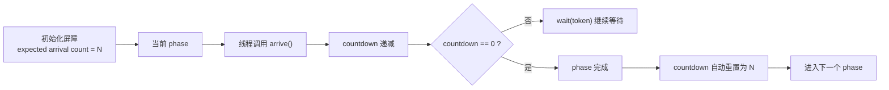
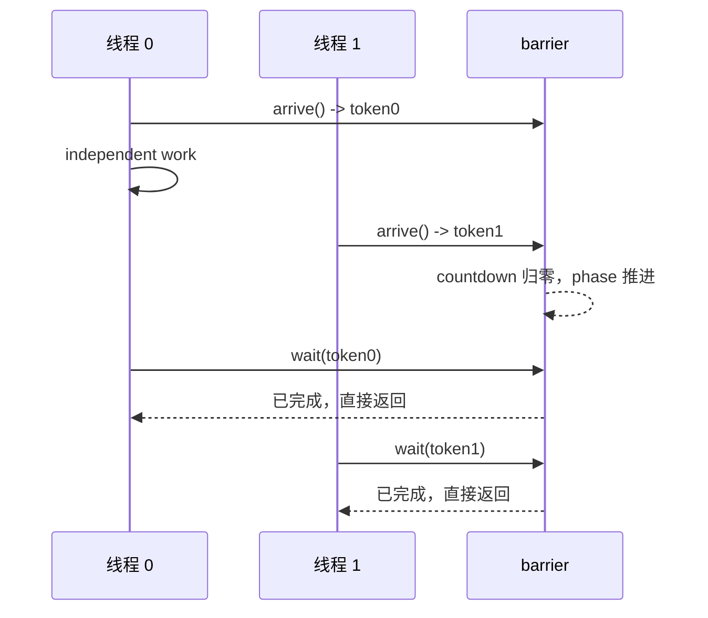
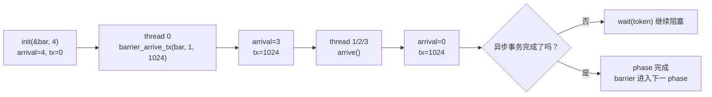
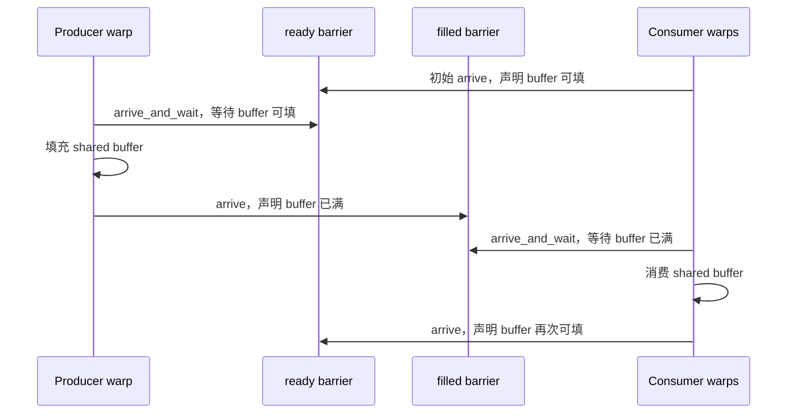

# CUDA Asynchronous Barriers 笔记

这篇笔记整理 CUDA Programming Guide 里的
[Asynchronous Barriers](https://docs.nvidia.com/cuda/cuda-programming-guide/04-special-topics/async-barriers.html)
章节。

先记住一句话：

> `cuda::barrier` 可以看成 `__syncthreads()` 的更细粒度版本：它把“我已经到达同步点”和“我现在需要等待同步完成”拆成了两个动作。

传统的 `__syncthreads()` 是一个阻塞式同步点：线程执行到这里以后必须停住，直到整个 thread block 都到达。异步屏障的核心变化是：

- **split arrive/wait（到达和等待分离）**：线程可以先调用 `arrive()` 表示自己已经完成前置工作，然后继续做不依赖同步结果的计算，最后再调用 `wait()`。
- **支持更灵活的参与集合**：屏障的 expected arrival count（期望到达数）由初始化时指定，不一定等于整个 block 的线程数。
- **可以配合异步内存操作**：Hopper 之后的 transaction barrier（事务屏障）可以把“线程到齐”和“异步搬运完成”绑定在一起。
- **适合 warp specialization（warp 特化）**：生产者 warp 和消费者 warp 可以用单向同步构造流水线，而不必每一步都全员阻塞。

如果只是让整个 block 或整个 warp 简单同步，仍然优先使用 `__syncthreads()` 或 `__syncwarp()`。这些基础同步原语更直接，也通常有更好的简单场景性能。

## 总体模型

异步屏障围绕一个循环使用的 phase（阶段）工作。每个 phase 都有一个 countdown（倒计数），线程或事务通过 arrive 操作把 countdown 向下减；当 countdown 归零时，这个 phase 完成，屏障自动进入下一个 phase。



`arrive()` 返回的 `arrival_token` 和当时的 phase 绑定。后续 `wait(std::move(token))` 会判断这个 token 对应的 phase 是否已经完成：

- 如果 phase 已经推进，`wait()` 不会阻塞。
- 如果 phase 还没推进，`wait()` 会阻塞到 countdown 归零。
- 如果线程已经阻塞在 `wait()` 中，phase 推进后线程会被唤醒。

这也是异步屏障比 `__syncthreads()` 更灵活的地方：**同步完成条件仍然严格，但等待动作可以延后**。

## 头文件和基本写法

使用高级 C++ API 通常需要：

```cpp
#include <cuda/barrier>
#include <cooperative_groups.h>
```

常见写法如下：

```cpp
#include <cuda/barrier>
#include <cooperative_groups.h>

namespace cg = cooperative_groups;

__global__ void init_barrier_kernel()
{
    using barrier_t = cuda::barrier<cuda::thread_scope_block>;

    __shared__ barrier_t bar;
    cg::thread_block block = cg::this_thread_block();

    if (block.thread_rank() == 0) {
        init(&bar, block.size());
    }

    // 初始化本身也需要同步。所有线程必须在使用 bar 之前看到构造完成的状态。
    block.sync();
}
```

这里有一个容易忽略的点：**屏障初始化之前不能使用屏障同步**。因此初始化后还需要用 `block.sync()` 或 `__syncthreads()` 做一次 bootstrapping（引导同步）。

## `cuda::barrier`

**用途**

`cuda::barrier` 表示一组 device 线程之间可重复使用的同步点。它既能表达普通线程同步，也能作为异步内存操作的完成条件。

**原型**

```cpp
template <cuda::thread_scope Scope,
          class CompletionFunction = /* empty completion */>
class cuda::barrier;
```

实际头文件中的内部类型名会随 CUDA 版本变化，学习时重点看两个模板参数：

| 模板参数 | 含义 |
| --- | --- |
| `Scope` | 屏障的同步和内存可见性范围，例如 `cuda::thread_scope_block`。 |
| `CompletionFunction` | 可选完成函数。每个 phase 完成时执行一次，默认是空函数。 |

**常用类型**

```cpp
using barrier_t = cuda::barrier<cuda::thread_scope_block>;
```

最常见的屏障对象放在 shared memory 中：

```cpp
__shared__ barrier_t bar;
```

**生命周期 / 不变量**

- 屏障必须先初始化，再参与 arrive/wait。
- 如果屏障对象放在 shared memory 中，通常由一个线程初始化，然后用 `__syncthreads()` 或 `block.sync()` 引导同步。
- 每个 phase 的 arrive 数量必须和屏障协议匹配。少 arrive 会导致等待线程无法通过；多 arrive 或 token 使用错误会进入未定义行为。
- 屏障可重复使用，但必须遵守 phase token 的使用规则。

## `cuda::thread_scope`

**用途**

`cuda::thread_scope` 描述同步操作的作用范围和内存可见性范围。它不只用于 `cuda::barrier`，也会出现在 CUDA 原子操作、pipeline 等接口里。

**枚举值**

```cpp
enum thread_scope {
    thread_scope_system = __ATOMIC_SYSTEM,
    thread_scope_device = __ATOMIC_DEVICE,
    thread_scope_block  = __ATOMIC_BLOCK,
    thread_scope_thread = __ATOMIC_THREAD
};
```

| 枚举值 | 同步范围 | 典型使用场景 |
| --- | --- | --- |
| `thread_scope_block` | 当前 thread block 内部 | 最常见。shared memory 协作、block 内 producer-consumer、block 内异步拷贝同步。 |
| `thread_scope_device` | 当前 GPU device | 更大范围的 device 侧同步语义，通常需要配合更严格的执行模型。 |
| `thread_scope_system` | 系统范围，包括 CPU 和其他 GPU | 统一内存、系统级可见性或跨设备协作等细粒度场景。 |
| `thread_scope_thread` | 当前线程 | 对屏障本身意义很小，更常见于原子操作的最弱同步范围。 |

写 `cuda::barrier<cuda::thread_scope_block>` 时，意思是：**参与者在同一个 block 中，同步完成后只需要保证 block 范围内的内存可见性**。这也是 block 内 shared memory 协作最常用的配置。

## `init`

**用途**

初始化屏障对象，并指定每个 phase 需要多少次 arrive 才算完成。

**原型**

```cpp
void init(cuda::barrier<Scope, CompletionFunction>* bar,
          cuda::std::ptrdiff_t expected,
          CompletionFunction completion = CompletionFunction{});
```

**参数**

| 参数 | 类型 | 含义 |
| --- | --- | --- |
| `bar` | `cuda::barrier<Scope, CompletionFunction>*` | 指向要初始化的屏障对象，通常位于 shared memory。 |
| `expected` | `cuda::std::ptrdiff_t` | 当前 phase 的 expected arrival count。倒计数从这个值开始。 |
| `completion` | `CompletionFunction` | 可选完成函数。最后一次 arrive 使 phase 完成后、等待线程放行前执行一次。 |

**副作用 / 约束**

- `init()` 必须发生在任何线程调用 `arrive()`、`wait()` 或 `arrive_and_wait()` 之前。
- 如果只有一个线程调用 `init()`，需要在初始化后执行一次 block 级同步，确保其他线程看到初始化结果。
- `expected` 不一定等于 `block.size()`，但后续每个 phase 的 arrive 协议必须和它一致。

## `barrier::arrive`

**用途**

表示当前线程已经到达屏障，并返回一个和当前 phase 绑定的 token。

**原型**

```cpp
using arrival_token = /* implementation-defined */;

arrival_token arrive(cuda::std::ptrdiff_t update = 1);
```

**参数**

| 参数 | 类型 | 含义 |
| --- | --- | --- |
| `update` | `cuda::std::ptrdiff_t` | 本次 arrive 对 countdown 的减少量，默认是 1。 |

**返回值**

| 类型 | 含义 |
| --- | --- |
| `arrival_token` | 记录当前 phase 的令牌，后续传给 `wait()`。 |

**副作用 / 约束**

- `arrive()` 本身不等待，它只更新屏障状态并返回 token。
- `update > 1` 表示一次调用贡献多个到达名额。只有当你能严格保证协议正确时才应该这么做，例如一个线程代表一个已经收敛的 warp 到达。
- 调用 `arrive()` 时，当前 phase 的 countdown 必须非零。
- 如果某次 `arrive()` 让 countdown 归零，屏障会自动完成当前 phase，并重置到下一 phase。

**使用场景**

```cpp
auto token = bar.arrive();

// 这里可以做不依赖本轮同步结果的工作。
do_independent_work();

bar.wait(cuda::std::move(token));
```

这个模式适合隐藏同步等待时间：线程先声明“我前置工作做完了”，然后趁等待其他线程的时间继续做独立计算。

## `barrier::arrive_and_wait`

**用途**

`arrive_and_wait()` 是 `arrive()` + `wait()` 的便捷组合：当前线程先对屏障贡献一次到达信号，然后立刻等待当前 phase 完成。

它的语义更接近传统的阻塞式屏障，但仍然使用 `cuda::barrier` 的 phase / expected count 机制。

**原型**

```cpp
void arrive_and_wait();
```

**等价理解**

可以把它近似理解成：

```cpp
auto token = bar.arrive();
bar.wait(cuda::std::move(token));
```

但写成 `arrive_and_wait()` 更直接，也能避免手动保存和移动 `arrival_token`。

**返回值**

| 类型 | 含义 |
| --- | --- |
| `void` | 不返回 token，因为等待动作已经在函数内部完成。 |

**副作用 / 约束**

- 当前线程会先 arrive，再阻塞等待本 phase 完成。
- 它没有 split arrive/wait 的 overlap 空间：调用后线程不会继续执行独立工作，而是直接等待。
- 和 `arrive()` 一样，调用时当前 phase 的 countdown 必须非零。
- 所有参与线程仍然必须满足屏障初始化时的 expected arrival count，否则等待线程会卡住。

**使用场景**

当你只需要“到达并等待”，不需要在 arrive 和 wait 之间插入独立计算时，可以用它让代码更清楚：

```cpp
// producer 必须等到当前 buffer 被 consumer 释放，才能覆盖 shared memory。
ready[buffer_id].arrive_and_wait();

fill_shared_buffer(buffer_id);
```

在 producer-consumer 示例中，`ready[buffer_id].arrive_and_wait()` 表示 producer 既贡献了自己的 ready 到达信号，也等待 consumer 释放该 buffer；`filled[buffer_id].arrive_and_wait()` 表示 consumer 既贡献了自己的 filled 到达信号，也等待 producer 填满该 buffer。

## `barrier::wait`

**用途**

等待某个 `arrival_token` 对应的 phase 完成。

**原型**

```cpp
void wait(arrival_token&& token) const;
```

**参数**

| 参数 | 类型 | 含义 |
| --- | --- | --- |
| `token` | `arrival_token&&` | `arrive()` 返回的 phase token。调用时通常写 `cuda::std::move(token)` 或 `std::move(token)`。 |

**副作用 / 约束**

- `wait()` 只能使用当前 phase 或直接前一个 phase 的 token。使用更旧或无效 token 是未定义行为。
- 如果 token 对应的 phase 已经完成，`wait()` 会直接返回。
- 如果 phase 尚未完成，`wait()` 会阻塞到 phase 推进。

## 为什么 `cuda::barrier` 的接口里看不见 `phase` 参数？

`phase` 一直都在；高层 `cuda::barrier` 只是把它封装进 `arrival_token`，不让调用者手写 `0` 或 `1`。

```cpp
auto token = bar.arrive();
// token 绑定这一次 arrive 所在的 phase。

do_independent_work();
bar.wait(cuda::std::move(token));
// wait 根据 token 知道自己要等哪一代。
```

也就是说，`arrival_token` 不是普通的“我到过这里”的布尔标记；它是“我在第几代 barrier 到达”的不透明凭证。因而高层接口的正确用法是把 token 交回 `wait()`，而不是自行推导 phase。

只有降到 `cuda::ptx::mbarrier_try_wait_parity()` 这类底层接口时，phase 才会重新作为显式的 `0/1` parity 参数出现：

```cpp
// 低层 mbarrier：调用者自己维护每轮的 parity。
while (!cuda::ptx::mbarrier_try_wait_parity(native_handle, parity)) {
}
parity ^= 1;
```

因此后面“显式阶段跟踪”一节并不是另一套机制，而是把 `arrival_token` 在高层 API 中替你保存的那部分状态拿出来手动管理。CUTLASS 的 `ClusterBarrier::wait(ptr, phase)` 也属于这一层：它直接包装 `mbarrier` 的 parity wait；同时还能让 cluster 内其他 CTA 对目标 CTA 的 barrier 执行远端 `arrive`。

## Phase 使用规则

异步屏障最容易出错的地方不是 API 调用本身，而是 phase 规则。可以把每个 phase 看成一个严格的批次：



关键约束：

- `arrive()` 必须发生在屏障当前 phase 中。
- `wait(token)` 必须发生在 token 对应 phase 或紧接着的下一 phase 中。
- 如果某个线程的 `arrive()` 让 countdown 归零，在屏障被下一轮 `arrive()` 复用之前，相关线程必须按协议完成 `wait()`。
- 不要把 token 长期保存到后面很多轮再用。

直观理解：`arrival_token` 不是“永久门票”，它只是在当前同步轮次附近有效。

## Warp Entanglement

异步屏障在硬件层面会受到 warp divergence（warp 分歧）的影响。

如果一个 warp 中的 32 个线程收敛地执行 arrive-on 操作，硬件可以把它合并成更少的屏障更新；如果这些线程因为分支分歧而各自执行，屏障可能需要处理更多次独立更新。

| 情况 | 屏障更新特点 | 建议 |
| --- | --- | --- |
| warp 收敛执行 arrive | 更新次数少，开销更低 | 最理想。 |
| warp 严重分歧后 arrive | 可能产生更多屏障更新 | 在 arrive 前用 `__syncwarp()` 重新收敛。 |
| 只有一个 lane 代表 warp `arrive(32)` | 更新次数少，但协议更脆弱 | 只在能证明 32 个 lane 都已经完成对应工作时使用。 |

实践里可以记住一个简单规则：**如果 arrive 前有 warp 内分支，而且后续确实希望整个 warp 一起到达，就先 `__syncwarp()` 再 arrive。**

## 显式阶段跟踪

除了保存 `arrival_token`，CUDA 还提供了更底层的 `cuda::ptx::mbarrier_try_wait_parity()` 系列接口，用 phase parity（阶段极性）跟踪屏障翻转。

**用途**

显式阶段跟踪适合更底层的异步内存操作协议：有些线程只负责等待数据完成，不一定参与普通 token 式 arrive；这时用 parity 观察 phase 翻转会更自然。

**基本接口**

```cpp
bool cuda::ptx::mbarrier_try_wait_parity(
    uint64_t* bar,
    const uint32_t& phase_parity);
```

| 参数 | 类型 | 含义 |
| --- | --- | --- |
| `bar` | `uint64_t*` | 底层 mbarrier 对象地址，或由 `cuda::device::barrier_native_handle()` 取得的 native handle。 |
| `phase_parity` | `const uint32_t&` | 等待的 phase 极性。偶数 phase 为 0，奇数 phase 为 1。 |

初始 phase 的 parity 是 0。每完成一个 phase，parity 在 0 和 1 之间翻转。

**示例**

```cpp
#include <cuda/barrier>
#include <cuda/ptx>
#include <cooperative_groups.h>

namespace cg = cooperative_groups;

__device__ void compute(float* data, int iteration);

__global__ void split_arrive_wait_kernel(int iteration_count, float* data)
{
    using barrier_t = cuda::barrier<cuda::thread_scope_block>;

    __shared__ barrier_t bar;
    int parity = 0;

    cg::thread_block block = cg::this_thread_block();

    if (block.thread_rank() == 0) {
        init(&bar, block.size());
    }
    block.sync();

    for (int i = 0; i < iteration_count; ++i) {
        // 当前线程到达，但不在这里阻塞。
        (void)cuda::ptx::mbarrier_arrive(
            cuda::device::barrier_native_handle(bar));

        compute(data, i);

        // 等待当前 parity 对应的 phase 完成。
        while (!cuda::ptx::mbarrier_try_wait_parity(
            cuda::device::barrier_native_handle(bar), parity)) {
        }

        parity ^= 1;
    }
}
```

**注意点**

- `mbarrier_try_wait_parity()` 是 try-wait 风格接口，示例里用 `while` 轮询把它变成阻塞等待。
- 每轮完成后必须更新本地 `parity`，否则下一轮可能等待错误的 phase。
- 这类接口更接近 PTX mbarrier 指令，适合需要控制底层同步协议的代码；普通 block 内同步优先用 `cuda::barrier` 的 `arrive()` / `wait()`。
- 显式 phase tracking 只适用于 thread-block 或 cluster scope 的 shared-memory barrier。

## mbarrier 的 phase/parity 和多槽流水线

前面讲的是“单个 barrier 一轮一轮复用”。到了 TMA、`cp.async.bulk` 或 warp specialization 的多槽流水线里，问题会变成：

- shared memory 有多个 buffer slot，例如 4 个 pipe 槽位。
- producer 不断把新 tile 写进某个 slot。
- consumer 不断从某个 slot 读取已经写好的 tile。
- 同一个 slot 会被反复复用，所以同一个 mbarrier 也会反复经历第 0 轮、第 1 轮、第 2 轮……

这时 `phase/parity` 就是为了回答一个问题：**我现在等的是这个 slot 的哪一代数据？**

先把本章的几个结论放在前面：

- **`mbarrier.init` 后 active phase 从 0 开始**，所以第一代可读数据通常对应 `full.wait(0)`。
- **`wait(p)` 等的是 phase `p` 这一代完成**，不是等 barrier 变成 `p`。
- **`arrive()` 不带 phase**，它永远作用在 barrier 当前内部 active phase。
- **slot 解决物理位置，phase/parity 解决复用代数**。4 个 slot 的流水线里，slot 每轮前进，只有绕回同一个 slot 时 parity 才翻转。
- **读写流水线通常用两组 barrier**：`full[slot]` 表示“这一代数据写好了”，`empty[slot]` 表示“这一代数据消费完了”。

### phase 是代数，parity 是最低位

可以把每个 mbarrier 想成有一个内部 generation counter：

$$
\text{phase} = 0, 1, 2, 3, ...
$$

每完成一次 barrier phase，硬件把它推进到下一代：

$$
\text{phase} \leftarrow \text{phase} + 1
$$

底层 wait 接口通常不让你传完整 phase number，而是传一个 0/1 的 **parity（极性）**：

$$
\text{parity} = \text{phase} \bmod 2
$$

所以：

| phase | parity |
| --- | --- |
| `0` | `0` |
| `1` | `1` |
| `2` | `0` |
| `3` | `1` |

这就是为什么底层接口叫 `mbarrier_try_wait_parity()`：它不是等“某个 slot index”，而是等“这个 barrier 当前 parity 对应的那一代完成”。

高层 `cuda::barrier` 用 `arrival_token` 保存这个代数；底层 mbarrier 让你自己保存 parity。两者本质上是在维护同一件事，只是抽象层级不同。

### slot 和 phase 是两维状态

多槽流水线里最容易混的是两个概念：

| 名字 | 作用 | 常见取值 |
| --- | --- | --- |
| `slot` / `pipe` | 用哪个 shared memory buffer 和哪个 barrier 对象。 | `0..NumStages-1` |
| `phase` / `parity` | 这个 slot 当前复用到第几代。 | `0/1` parity |

如果有 4 个 pipe 槽位，逻辑 tile 编号是 `stage`，那么：

$$
\text{slot} = \text{stage} \bmod 4
$$

同一个 slot 每隔 4 个 stage 被复用一次，所以它的 phase 只在绕环时推进：

$$
\text{parity} = \left\lfloor \frac{\text{stage}}{4} \right\rfloor \bmod 2
$$

对应关系如下：

| 逻辑 stage | slot | parity | 含义 |
| --- | --- | --- | --- |
| `0` | `0` | `0` | slot 0 的第 0 代数据。 |
| `1` | `1` | `0` | slot 1 的第 0 代数据。 |
| `2` | `2` | `0` | slot 2 的第 0 代数据。 |
| `3` | `3` | `0` | slot 3 的第 0 代数据。 |
| `4` | `0` | `1` | slot 0 被复用，进入第 1 代数据。 |
| `5` | `1` | `1` | slot 1 被复用，进入第 1 代数据。 |
| `8` | `0` | `0` | slot 0 再次复用，parity 回到 0。 |

这张表非常重要：**parity 不是每个循环迭代都翻转，而是当前 pipeline state 绕过所有 slot、回到同一个 slot 时才翻转**。

一个最小的状态对象可以这样写：

```cpp
/**
 * @brief 描述 ring pipeline 中下一次访问的 slot 和 parity。
 *
 * @tparam NumStages shared memory pipeline slot 数量。
 */
template <int NumStages>
struct PipelineState {
    int index = 0;  // 当前要访问的 slot。
    int phase = 0;  // 当前 slot 的 phase parity。

    /**
     * @brief 前进到下一个逻辑 stage。
     *
     * @details
     * index 每轮加 1；只有绕回 slot 0 时才翻转 parity。
     */
    __device__ void advance()
    {
        ++index;
        if (index == NumStages) {
            index = 0;
            phase ^= 1;
        }
    }
};
```

CUTLASS 里的 `PipelineState<K_PIPE_MAX>` 也是这个思路：它把 `(slot, phase)` 绑在一起，避免手写 `pipe = (pipe + 1) % N` 时忘记处理 phase 翻转。

### 为什么只用 slot 不够

假设 4 个 slot 全部被填满：

```text
slot 0: stage 0
slot 1: stage 1
slot 2: stage 2
slot 3: stage 3
```

这时 producer 的下一个目标是 `stage 4`，也就是重新使用 `slot 0`。consumer 的下一个读取目标仍然是 `stage 0`，也是 `slot 0`。

所以只看 `slot`，两边都会看到 `0`：

```text
producer write_slot = 0
consumer read_slot  = 0
```

但它们指的不是同一代：

| 角色 | 逻辑目标 | slot | parity |
| --- | --- | --- | --- |
| consumer | 读取 `stage 0` | `0` | `0` |
| producer | 准备写入 `stage 4` | `0` | `1` |

这就是 phase/parity 的作用：**同一个物理 slot，可以用 parity 区分旧数据和新数据**。

没有 parity，就会出现经典的 ABA 问题：你以为自己还在等 slot 0 的旧事件，但 slot 0 可能已经完成旧事件、又开始了新事件，甚至 parity 绕回来以后看起来又像旧状态。

因此底层 mbarrier 协议通常要求：等待者不能落后同一个 barrier 超过一个 phase 周期。换句话说，不能把一个 parity 保存很多轮以后再拿来等。高层 `arrival_token` 里“只能等待当前或上一 phase”的限制，本质上也是在防这个问题。

### 每个 slot 通常需要两类 barrier

生产者-消费者流水线里，一个 slot 有两个方向的同步：

| barrier | 谁 signal | 谁 wait | 表示什么 |
| --- | --- | --- | --- |
| `full[slot]` / producer barrier | producer 或异步 copy 完成 | consumer | 这个 slot 的数据已经写好，可以读。 |
| `empty[slot]` / consumer barrier | consumer 消费完成 | producer | 这个 slot 已经空出来，可以覆盖。 |

如果是 TMA load，`full[slot]` 往往是 transaction barrier：

- producer 发起 TMA 时，对 `full[slot]` 声明 expected transaction bytes。
- TMA 写 shared memory 完成后，硬件让 transaction count 归零。
- consumer 用 `wait(full[slot], phase)` 等这一代数据可读。

`empty[slot]` 通常是普通 barrier：

- consumer 用完 shared memory 后 `arrive(empty[slot])`。
- producer 下次复用这个 slot 前，先 `wait(empty[slot], phase)`，避免覆盖还没消费完的数据。

更精确地说：

- `full[slot]` 的 phase `p` 表示：**slot 里的第 `p` 代数据已经写好**。
- `empty[slot]` 的 phase `p` 表示：**slot 里的第 `p` 代数据已经消费完**。
- producer 准备写第 `p ^ 1` 代数据前，要先确认第 `p` 代已经 empty。

有些源码会把 producer 的 `write_state.phase` 初始化成 `1`，看起来和这句话相反。其实那通常是另一种等价记法：**producer state 里的 phase 先拿来等 `empty`，而不是直接表示即将提交的 `full` 数据代**。这一点后面单独解释。

注意：`full` 和 `empty` 是两组 barrier，它们各自有自己的 phase/parity。实际代码里常用两个 `PipelineState`：

```cpp
PipelineState<NumSlots> write_state;  // producer 下一次访问哪个 slot，以及使用哪一个 phase。
PipelineState<NumSlots> read_state;   // consumer 下一次读哪个 slot，以及读取哪一代。
```

### 4 个 slot，最多 3 个在途阶段

先看更保守的设计：有 4 个物理 slot，但最多只允许 3 个 stage 在途。这样 ring buffer 里永远留一个空槽，读写 head 不会在“满”和“空”的状态上完全重合。

```text
NumSlots    = 4
MaxInFlight = 3
```

初始化时可以先预取 3 个 stage：

| 步骤 | producer 发起 | write_state 之后 | read_state | 在途数量 |
| --- | --- | --- | --- | --- |
| prefetch 0 | `stage 0 -> slot 0, phase 0` | `(1,0)` | `(0,0)` | 1 |
| prefetch 1 | `stage 1 -> slot 1, phase 0` | `(2,0)` | `(0,0)` | 2 |
| prefetch 2 | `stage 2 -> slot 2, phase 0` | `(3,0)` | `(0,0)` | 3 |

进入主循环后：

| 主循环轮次 | consumer 等待并消费 | producer 补发 | read_state 之后 | write_state 之后 |
| --- | --- | --- | --- | --- |
| `0` | `slot 0, phase 0` | `stage 3 -> slot 3, phase 0` | `(1,0)` | `(0,1)` |
| `1` | `slot 1, phase 0` | `stage 4 -> slot 0, phase 1` | `(2,0)` | `(1,1)` |
| `2` | `slot 2, phase 0` | `stage 5 -> slot 1, phase 1` | `(3,0)` | `(2,1)` |
| `3` | `slot 3, phase 0` | `stage 6 -> slot 2, phase 1` | `(0,1)` | `(3,1)` |

几个观察：

- 第 0 轮 consumer 读 `slot 0, phase 0`，producer 补发 `slot 3, phase 0`，没有复用同一个 slot。
- 第 1 轮 producer 开始复用 `slot 0`，所以它的 write phase 已经变成 `1`。
- consumer 下一次读 `slot 0` 也是在第 4 轮，此时 read phase 也会变成 `1`。

这种设计的好处是简单，永远留一个空槽作为安全垫。代价是 4 个 slot 只允许 3 个在途 stage，隐藏内存延迟的能力少一点。

逻辑伪代码如下：

```cpp
/**
 * @brief 4 slot、最多 3 个在途 stage 的 producer-consumer 主循环模型。
 */
PipelineState<4> write_state;
PipelineState<4> read_state;

// 预取 3 个 stage，留下一个空 slot。
for (int i = 0; i < 3 && i < total_stages; ++i) {
    int slot = write_state.index;
    int phase = write_state.phase;

    // 把第 i 个 tile 写到 slot，并让 full[slot] 的 phase 完成后可被 consumer 等待。
    issue_async_copy(full[slot], phase, i);

    write_state.advance();
}

for (int stage = 0; stage < total_stages; ++stage) {
    int read_slot = read_state.index;
    int read_phase = read_state.phase;

    // consumer 等待这一代数据填满。
    wait(full[read_slot], read_phase);
    consume(read_slot);

    // consumer 释放这一代 slot，producer 后续才能覆盖。
    arrive(empty[read_slot], read_phase);
    read_state.advance();

    int next_stage = stage + 3;
    if (next_stage < total_stages) {
        int write_slot = write_state.index;
        int write_phase = write_state.phase;

        // 第一次使用某个 slot 时不需要等 empty；复用时要等上一代数据被消费。
        if (next_stage >= 4) {
            int previous_phase = write_phase ^ 1;
            wait(empty[write_slot], previous_phase);
        }

        // 写入当前 write_phase 对应的新一代数据。
        issue_async_copy(full[write_slot], write_phase, next_stage);
        write_state.advance();
    }
}
```

这里的 `issue_async_copy()`、`wait()`、`arrive()` 是概念占位。真实代码可能是 `ClusterTransactionBarrier::arrive_and_expect_tx()`、TMA `copy(...)`、`ClusterBarrier::wait(ptr, phase)` 等组合。如果实现选择把所有 `empty` barrier 在初始化时预先置成“可写”，也可以让第一次使用 slot 时统一走 `wait(empty[slot], 0)`，但逻辑上它等价于“第一次不需要等 consumer release”。

### wait 的 phase 不是目标状态

这里有一个非常容易误解的点：`wait(phase)` 里的 `phase` **不是**“等 barrier 的内部 phase 变成这个值”。

更准确的读法是：

```text
wait(p) = 等这个 barrier 的 phase p 这一代完成。
```

当 phase `p` 完成后，barrier 内部会翻到下一代，也就是：

$$
\mathrm{currentPhase} \leftarrow p \oplus 1
$$

所以从现象上看：

- 一个刚 `mbarrier.init` 完的 barrier，**内部 active phase 从 `0` 开始**。
- `wait(0)` 会等当前 phase 0 完成，所以可能阻塞。而我们的读事件的 phase 是从 0 开始，所以读要等写完成才能继续。
- `wait(1)` 通常会直接通过，因为 phase 1 并不是当前正在进行的未完成 phase；它可以被理解成“上一代 phase 1 已经不是 pending 状态”。

PTX ISA 对 `mbarrier.init` 的定义也是这个语义：primary / conditional phase 初始化为 `0`，expected arrival count 和 pending arrival count 初始化为 `count`，初始 tx-count 初始化为 `0`。所以后面的 phase 推理都可以从“刚初始化时 active phase = 0”开始。

这也是 CUTLASS 能让 producer 从 phase `1` 开始的根本原因。它不是在说“empty barrier 当前已经是 phase 1”，而是在利用 `wait(1)` 对刚初始化 barrier 立即通过这个语义，表达“buffer 初始就是 empty，可以先写”。

### producer phase 从 1 开始的写法

CUTLASS 的 `sm90_pipeline.hpp` 里有一个很典型的封装：

```cpp
template<class Pipeline>
CUTLASS_DEVICE
PipelineState<Pipeline::Stages> make_producer_start_state() {
  // Producer starts with an opposite phase as the buffers are initially empty
  return {0, 1, 0};
}
```

也就是 producer state 初始是：

```text
index = 0
phase = 1
count = 0
```

这不是说 producer 一开始要写 phase 1 的 full 数据，而是说：**producer state 的 phase 先用于等待 `empty_barrier`，并且初始 buffer 本来就是 empty，所以第一次 `empty.wait(1)` 应该直接通过**。

对应到 CUTLASS 的 API，producer 的 state phase 会先传给 `empty_barrier`：

```cpp
producer_acquire(state) {
    empty_barrier[state.index()].wait(state.phase());
}
```

consumer 的 state phase 会传给 `full_barrier`：

```cpp
consumer_wait(state) {
    full_barrier[state.index()].wait(state.phase());
}
```

所以这里的 `state.phase()` 在 producer 和 consumer 两边看的 barrier 不一样：

| 角色 | `state.phase()` 用在哪里 | 直观含义 |
| --- | --- | --- |
| producer | `empty_barrier[slot].wait(phase)` | 等这个 slot 可写。 |
| consumer | `full_barrier[slot].wait(phase)` | 等这个 slot 可读。 |

`empty` / `full` 是两套 barrier，它们的初始语义也不一样：

| barrier | 初始化后的 active phase | 第一次 wait | 第一次 wait 的语义 |
| --- | --- | --- | --- |
| `full[slot]` | `0` | consumer `full.wait(0)` | 等 producer 把第 0 代数据写满，所以会阻塞。 |
| `empty[slot]` | `0` | producer `empty.wait(1)` | buffer 初始就是空的，phase 1 不在 pending，所以直接通过。 |

这张表正好解释了你问的两个“不知道 phase”的问题：

- `full` 知道 phase 0，因为它刚初始化时 active phase 就是 0。producer 的 `full.arrive_and_expect_tx()` 虽然不带 phase，但它更新的正是 `full` 当前 active phase 0。
- `empty` 第一次不需要真的变成 phase 1。producer 的 `empty.wait(1)` 只是用“phase 1 已经不是当前 pending phase”这个事实，让第一轮写入通过。

如果有 4 个 slot，producer state 从 `(0,1)` 开始，第一次填满 4 个 slot 后会这样走：

| producer 操作 | acquire 等 empty | 对 full 的操作 | `write_state` 之后 |
| --- | --- | --- | --- |
| 写 `stage 0` | `slot 0, empty.wait(1)` 直接通过 | `full[0]` 当前 phase 0 被 arrive / expect tx | `(1,1)` |
| 写 `stage 1` | `slot 1, empty.wait(1)` 直接通过 | `full[1]` 当前 phase 0 被 arrive / expect tx | `(2,1)` |
| 写 `stage 2` | `slot 2, empty.wait(1)` 直接通过 | `full[2]` 当前 phase 0 被 arrive / expect tx | `(3,1)` |
| 写 `stage 3` | `slot 3, empty.wait(1)` 直接通过 | `full[3]` 当前 phase 0 被 arrive / expect tx | `(0,0)` |

注意最后一行：producer 走完一圈以后，`write_state` 变成 `(0,0)`。这时下一次准备复用 `slot 0`，它等待的正是：

```cpp
empty_barrier[0].wait(0);
```

consumer 初始 `read_state` 通常是 `(0,0)`，它会先等：

```cpp
full_barrier[0].wait(0);
```

这次 wait 会阻塞，直到 producer 对 `full[0]` 的当前 phase 0 做了 arrive / expect tx，并且对应的异步 transaction 完成，`full[0]` 从 phase 0 翻到 phase 1。

consumer 消费完 `slot 0` 后执行：

```cpp
empty_barrier[0].arrive();
```

这个 arrive 更新的是 `empty[0]` 当前 active phase 0。等 consumer arrival count 满足后，`empty[0]` 从 phase 0 翻到 phase 1，于是 producer 后续的：

```cpp
empty_barrier[0].wait(0);
```

才会通过。也就是说：

- producer 第一次 `empty.wait(1)` 是初始化给它开的门，不依赖 consumer。
- consumer 第一次 `empty.arrive()` 解锁的是 producer 下一圈的 `empty.wait(0)`。
- producer 再下一圈才会重新等 `empty.wait(1)`，那时它对应的是 consumer 对第二代数据的 release。

源码里你看到的现象可以这样读：

```text
write phase 先初始化为 1
第一次写 slot 时 empty.wait(1) 直接通过
producer 预取一圈后 write_state 走到 phase 0
复用 slot 0 时 empty.wait(0) 等 consumer release 第 0 代数据
```

这和前面“写第 `p ^ 1` 代前等第 `p` 代 empty”不矛盾，只是前面的 `p` 是从数据代数角度说的，而 CUTLASS 这个 `write_state.phase` 是从 `empty_barrier.wait()` 角度说的。

可以把两种记法这样对应：

| 记法 | `phase` 表示什么 | 适合怎么读 |
| --- | --- | --- |
| 数据代数记法 | 当前 slot 的数据 generation。 | `full phase p` 表示第 `p` 代数据可读；写下一代前等上一代 empty。 |
| CUTLASS producer start state | producer acquire 要等待完成的 `empty_barrier` parity。 | buffer 初始为空，所以 producer 从 `empty.wait(1)` 开始；走完一圈后等 consumer release 完 phase `0`。 |

实际读源码时，一个很稳的办法是看这个 phase 传给谁：

- 传给 `full_barrier.wait(phase)`：通常是在等“这一代数据可读”。
- 传给 `empty_barrier.wait(phase)`：通常是在等“这个槽位可写”。
- `arrive()` / `arrive_and_expect_tx()` 自己通常不带 phase，它们更新的是对应 barrier 的**内部当前 phase**。

用单个 slot 把前两代串起来，时间线会更清楚：

| 时刻 | `full[0]` 内部状态 | `empty[0]` 内部状态 | 事件 |
| --- | --- | --- | --- |
| 初始化后 | active phase 0，未完成 | active phase 0，未完成 | `full.wait(0)` 会阻塞，`empty.wait(1)` 可通过。 |
| producer 第一次 acquire | active phase 0，未完成 | active phase 0，未完成 | producer `empty.wait(1)` 通过。 |
| producer 发起写入 | phase 0 等 transaction | active phase 0，未完成 | `full.arrive_and_expect_tx()` 作用在 full 当前 phase 0。 |
| TMA 写完 | active phase 1 | active phase 0，未完成 | `full.wait(0)` 通过，consumer 可以读第 0 代数据。 |
| consumer release | active phase 1 | active phase 1 | `empty.arrive()` 完成 empty phase 0，producer 下一圈 `empty.wait(0)` 通过。 |
| producer 第二次写入 | phase 1 等 transaction | active phase 1 | `full.arrive_and_expect_tx()` 作用在 full 当前 phase 1。 |
| 第二次 TMA 写完 | active phase 0 | active phase 1 | consumer 下一圈 `full.wait(1)` 通过。 |

### arrive 为什么不需要 phase

你可能会注意到一个不对称的地方：

```cpp
empty_barrier[slot].wait(phase);
full_barrier[slot].wait(phase);

empty_barrier[slot].arrive();              // 没有 phase 参数
full_barrier[slot].arrive_and_expect_tx(); // 没有 phase 参数
```

这是 mbarrier 设计里很关键的一点：**phase 是 barrier 对象内部状态，不是 `arrive()` 的显式参数**。

可以把底层 barrier 想成保存了这些状态：

```text
current_phase
arrival_count
transaction_count
```

`wait(phase)` 做的是：

```text
等待这个 barrier 的 phase = phase 这一代完成。
完成以后，barrier 内部 active phase 会翻到 phase ^ 1。
```

而 `arrive()` 做的是：

```text
对这个 barrier 当前内部 phase 的 arrival_count 做更新
```

所以 `arrive()` 没有“我要 arrive 到 phase 0 还是 phase 1”的选择。它永远作用于这个 mbarrier 当前正在打开的那一代。控制不打错代，靠的是调用顺序协议，而不是 `arrive` 参数。

以 CUTLASS 的 TMA load pipeline 为例，producer 侧大致是：

```cpp
producer_acquire(state) {
    // 先等 producer state 指定的 empty phase 完成。
    empty_barrier[state.index()].wait(state.phase());

    // 然后登记 full barrier 的当前 phase 要等待多少 transaction。
    // 这里没有 phase 参数，因为 full barrier 自己知道当前 phase 是哪一代。
    full_barrier[state.index()].arrive_and_expect_tx(transaction_bytes);
}
```

consumer 侧大致是：

```cpp
consumer_wait(state) {
    // 等 full barrier 的这一代数据写完。
    full_barrier[state.index()].wait(state.phase());
}

consumer_release(state) {
    // 释放 empty barrier 的当前 phase，通知 producer 这个 slot 可覆盖。
    // 这里也没有 phase 参数。
    empty_barrier[state.index()].arrive();
}
```

这里真正起控制作用的是：

1. **初始化状态**：`full` / `empty` barrier 的初始 active phase 和 expected count 事先设置好。比如 producer start phase 可以故意取反，表示 buffer 初始为空。
2. **acquire / wait 先行**：producer 复用 slot 前必须先等 `empty_barrier.wait(phase)`；consumer 读 slot 前必须先等 `full_barrier.wait(phase)`。
3. **arrive 只跟在正确状态后面**：producer 只有 acquire 成功后才对 full arrive；consumer 只有 wait full 并消费完后才对 empty arrive。
4. **`PipelineState` 同步前进**：producer 和 consumer 都按 ring 顺序推进 slot，并在绕环时翻转 phase。

这就像一道门：`wait(phase)` 是“确认我关心的这一代门已经关上并翻到下一代”，`arrive()` 是“推动当前打开的这代门完成”。你不能在 `arrive()` 时指定门是哪一代；你只能通过前面的等待协议，确保自己到达门口时门已经处在正确的一代。

如果把顺序写坏，比如 producer 没等 `empty` 就连续对同一个 `full` arrive，或者 consumer 没等 `full` 就提前 release `empty`，那么 `arrive()` 仍然会执行，但它会更新 barrier 当前内部 phase，协议就可能错代、提前放行或死锁。**phase 参数只出现在 wait 侧，并不表示 arrive 侧不需要 phase；而是 arrive 侧把 phase 选择权交给了 barrier 的内部状态和外部协议。**

### 4 个 slot，最多 4 个在途阶段

如果最多允许 4 个 stage 在途，就会把 4 个 slot 全部填满：

```text
NumSlots    = 4
MaxInFlight = 4
```

预取后状态是：

| 预取 | producer 发起 | write_state 之后|
| --- | --- | --- |
| `0` | `stage 0 -> slot 0, phase 0` | `(1,0)` |
| `1` | `stage 1 -> slot 1, phase 0` | `(2,0)` |
| `2` | `stage 2 -> slot 2, phase 0` | `(3,0)` |
| `3` | `stage 3 -> slot 3, phase 0` | `(0,1)` |

此时：

```text
read_state  = (0,0)
write_state = (0,1)
```

读写 state 的 index 都是 0，但 phase 不同。这个状态很关键：

- consumer 要等的是 `slot 0, phase 0`：第一代数据已经填好以后才能读。
- producer 想写的是 `slot 0, phase 1`：第二代数据，但必须等 consumer 释放 `slot 0, phase 0`。

主循环第一轮可以这样理解：

| 动作 | slot | phase | 含义 |
| --- | --- | --- | --- |
| consumer wait full | `0` | `0` | 等 `stage 0` 的数据填好。 |
| consumer consume | `0` | `0` | 读取 slot 0 的第一代数据。 |
| consumer arrive empty | `0` | `0` | 释放 slot 0 的第一代占用。 |
| producer wait empty | `0` | `0` | 确认 slot 0 第一代已经被消费。 |
| producer issue full | `0` | `1` | 写入 `stage 4`，也就是 slot 0 第二代数据。 |

这就是 4 在途设计比 3 在途更依赖 parity 的原因：**读写 head 可以同时指向同一个 slot，只有 phase 能说明它们不是同一件事**。

这种设计的吞吐潜力更高，因为 4 个 slot 都用于隐藏内存延迟；代价是协议更紧，producer 复用 slot 时更容易在 `empty[slot]` 上等待 consumer。

### phase/parity 的设计规则

实际写多槽流水线时，可以按这几条规则检查：

- **每个 barrier slot 都有自己的 phase**：不要用一个全局 parity 代表所有 slot 的真实状态，除非你的访问模式严格等价于 `PipelineState` 这种绕环翻转。
- **phase 跟 slot 复用绑定**：访问下一个 slot 时 index 前进；只有从最后一个 slot 绕回第一个 slot 时，parity 才翻转。
- **producer 和 consumer 各自维护 state**：producer 的 `write_state` 描述下一次写入哪一代，consumer 的 `read_state` 描述下一次读取哪一代。
- **满槽和空槽最好分两组 barrier**：`full` 负责“数据可读”，`empty` 负责“槽位可写”，不要用一个状态变量同时表达两种方向。
- **4 槽 3 在途更保守**：永远留一个空槽，读写 head 不容易出现同 index 的歧义。
- **4 槽 4 在途更激进**：所有槽都可能被占满，读写 head 可以同 index，必须用 phase 区分 generation。
- **不要落后两个 phase**：parity 只有 1 bit。如果一个 waiter 错过了同一个 barrier 的两次完成，parity 会绕回来，逻辑上就可能分不清等的是哪一代。
- **transaction barrier 的 phase 完成条件更严格**：对于 TMA 这类异步搬运，`full[slot]` 不仅要等 producer arrive，还要等本 phase 绑定的 transaction count 归零。

一个好用的心智模型是：

```text
slot 解决“用哪块 shared memory”
phase/parity 解决“这块 shared memory 的第几代数据”
full barrier 解决“这一代数据写完了吗”
empty barrier 解决“这一代数据消费完了吗”
```

只要这四件事分开，4 槽、3 在途、4 在途这些 pipeline 设计就不会乱。

## `barrier::arrive_and_drop`

**用途**

当某个线程之后不再参与屏障同步时，先完成当前 phase 的 arrive 义务，再把后续 phase 的 expected arrival count 减少。

**原型**

```cpp
void arrive_and_drop();
```

**副作用 / 约束**

- 对当前 phase：贡献一次 arrive，避免当前轮次少一个到达信号。
- 对后续 phase：把 expected arrival count 减少 1，使屏障之后不再等待这个线程。
- 如果线程直接 `return` 而不 drop，剩余线程很容易在当前或下一 phase 死锁。

**示例**

```cpp
#include <cuda/barrier>
#include <cooperative_groups.h>

namespace cg = cooperative_groups;

__device__ bool should_exit(int iteration);
__device__ void do_work(int iteration);

__global__ void early_exit_kernel(int iteration_count)
{
    using barrier_t = cuda::barrier<cuda::thread_scope_block>;

    __shared__ barrier_t bar;
    cg::thread_block block = cg::this_thread_block();

    if (block.thread_rank() == 0) {
        init(&bar, block.size());
    }
    block.sync();

    for (int i = 0; i < iteration_count; ++i) {
        if (should_exit(i)) {
            bar.arrive_and_drop();
            return;
        }

        do_work(i);

        auto token = bar.arrive();
        bar.wait(cuda::std::move(token));
    }
}
```

一个典型场景是：线程块大小大于有效数据规模，部分线程在若干轮后不再有任务。如果它们还被 expected count 算进去，就必须用 `arrive_and_drop()` 正确退出同步协议。

## Completion Function

**用途**

`cuda::barrier<Scope, CompletionFunction>` 支持每个 phase 完成时执行一个 completion function（完成函数）。它在最后一次 arrive 之后、等待线程被放行之前执行一次。

完成函数适合表达“所有线程写完 shared memory 后，由一个执行上下文做一次汇总”的逻辑，例如 block 内归约、更新阶段状态、切换双缓冲索引等。

**内存可见性**

- 当前 phase 中，已经 arrive 的线程在 arrive 前完成的内存操作，对执行完成函数的线程可见。
- 完成函数中的内存操作，在等待线程从 `wait()` 返回后对它们可见。

**示例**

```cpp
#include <cuda/barrier>
#include <cooperative_groups.h>
#include <type_traits>
#include <utility>

namespace cg = cooperative_groups;

__device__ int independent_work(int value);

__global__ void block_sum_kernel(const int* input, int* output)
{
    constexpr int BlockSize = 128;

    cg::thread_block block = cg::this_thread_block();
    __shared__ int smem[BlockSize];

    auto completion_fn = [&] {
        int sum = 0;
        for (int i = 0; i < BlockSize; ++i) {
            sum += smem[i];
        }
        *output = sum;
    };

    using completion_fn_t = decltype(completion_fn);
    using barrier_t =
        cuda::barrier<cuda::thread_scope_block, completion_fn_t>;

    __shared__ std::aligned_storage_t<
        sizeof(barrier_t),
        alignof(barrier_t)> bar_storage;

    barrier_t* bar = reinterpret_cast<barrier_t*>(&bar_storage);

    if (block.thread_rank() == 0) {
        init(bar, block.size(), completion_fn);
    }
    block.sync();

    smem[block.thread_rank()] = input[block.thread_rank()];

    auto token = bar->arrive();

    // 可以执行与 smem 归约无关的工作。
    (void)independent_work(block.thread_rank());

    bar->wait(cuda::std::move(token));
}
```

**为什么这里用原始存储**

带捕获的 lambda 通常不是默认可构造对象。直接写：

```cpp
__shared__ barrier_t bar;
```

会要求编译器能默认构造 `bar`，但它不知道如何给 completion function 传入捕获上下文。因此示例中先用对齐的 shared memory 存储保留空间，再由一个线程调用 `init()` 或 placement new 完成构造。

## 跟踪异步内存操作

从 compute capability 9.0 开始，shared memory 中 thread-block 或 cluster scope 的异步屏障可以显式跟踪 asynchronous transaction（异步事务）。这类屏障通常和 TMA（Tensor Memory Accelerator）等异步搬运机制配合使用。

先把模型讲清楚：普通 `cuda::barrier` 的 phase 完成条件只有一个计数器。

- **arrival count**：参与线程是否都已经 arrive。

初始化时：

```cpp
init(&bar, expected);
```

可以理解成当前 phase 的 arrival count 从 `expected` 开始。每次：

```cpp
bar.arrive(update);
```

都会让 arrival count 减少 `update`。当 arrival count 变成 0，本 phase 完成，barrier 自动进入下一 phase。

transaction barrier 在这个基础上又多跟踪一个东西：

- **transaction count**：绑定到该 phase 的异步事务是否完成，单位由具体异步操作决定，常见是字节数。

所以 SM90+ 上可以把 phase 完成条件理解成：

```text
arrival count == 0
并且
当前 phase 预期的 transaction 都完成
```

这就是它解决的问题：普通 barrier 只能回答“线程都到了吗”，transaction barrier 还要回答“线程发起的异步内存事务也完成了吗”。

CUDA C++ 里相关接口包括：

```cpp
cuda::device::barrier_arrive_tx(bar, arrive_count_update, transaction_count_update);
cuda::device::barrier_expect_tx(bar, transaction_count_update);
```

二者的区别可以先记成：

| 接口 | 对 arrival count 的影响 | 对 transaction count 的影响 | 典型用途 |
| --- | --- | --- | --- |
| `bar.arrive(update)` | 减少 `update` | 不改变 | 只同步线程到达。 |
| `cuda::device::barrier_arrive_tx(bar, arrive_update, tx_update)` | 减少 `arrive_update` | 增加 `tx_update` | 当前线程 arrive，同时声明本 phase 还要等一批异步事务。 |
| `cuda::device::barrier_expect_tx(bar, tx_update)` | 不改变 | 增加 `tx_update` | 只声明本 phase 还要等一批异步事务，线程之后再用普通 `arrive()` 到达。 |

### `cuda::device::barrier_arrive_tx`

**用途**

在 arrive 的同时增加当前 phase 需要跟踪的 transaction count。它等价于把下面两件事做成一次原子更新：

```text
arrival count -= arrive_count_update
expected transaction count += transaction_count_update
```

注意这里的方向刚好相反：

- `arrive_count_update` 是 **减 arrival count**，表示“我到了”。
- `transaction_count_update` 是 **加 expected transaction count**，表示“这个 phase 还要额外等这么多异步事务”。

所以：

```cpp
auto token = cuda::device::barrier_arrive_tx(bar, 1, 1024);
```

可以读成：

```text
当前线程到达屏障：arrival count 减 1
同时声明本 phase 还要等待 1024 个 transaction 单位完成
返回当前 phase 的 arrival_token
```

如果这个 transaction 单位来自异步内存搬运，`1024` 常见含义就是“等待 1024 字节对应的异步事务完成”。具体单位由发起事务的异步原语定义；在常见异步搬运协议里，它就是字节数。

**原型**

```cpp
cuda::barrier<cuda::thread_scope_block>::arrival_token
cuda::device::barrier_arrive_tx(
    cuda::barrier<cuda::thread_scope_block>& bar,
    cuda::std::ptrdiff_t arrive_count_update,
    cuda::std::ptrdiff_t transaction_count_update);
```

**参数**

| 参数 | 类型 | 含义 |
| --- | --- | --- |
| `bar` | `cuda::barrier<cuda::thread_scope_block>&` | 要更新的屏障对象。 |
| `arrive_count_update` | `cuda::std::ptrdiff_t` | 本次 arrive 对 arrival count 的减少量。 |
| `transaction_count_update` | `cuda::std::ptrdiff_t` | 本 phase 新增要等待的 transaction 数量。常见异步搬运场景中可理解为要等待的字节数。 |

**返回值**

| 类型 | 含义 |
| --- | --- |
| `arrival_token` | 和当前 phase 绑定的 token，后续传给 `bar.wait(cuda::std::move(token))`。 |

**副作用 / 约束**

- `bar` 必须位于 shared memory 中。
- 只支持 compute capability 9.0 或更高。
- `arrive_count_update` 至少为 1。
- `transaction_count_update` 可以为 0；为 0 时，这次调用就退化成“带 token 的 arrive”。
- `arrive_count_update` 和 `transaction_count_update` 都有实现上限，文档给出的上限是 `(1 << 20) - 1`。
- 这个函数原子执行，并且这次调用 strongly happens-before 当前 phase 的 completion step 开始。

最后一点很关键：如果一个线程既要让 arrival count 减少，又要为本 phase 增加 expected transaction count，把两件事合在 `barrier_arrive_tx` 里可以避免竞态。

### 计数器怎么变化

假设一个 block 有 4 个参与线程：

```cpp
init(&bar, 4);
```

当前 phase 初始状态可以理解成：

| 状态 | 值 |
| --- | --- |
| `arrival_count` | 4 |
| `expected_transaction_count` | 0 |

现在 thread 0 发起一批异步事务，并调用：

```cpp
auto token0 = cuda::device::barrier_arrive_tx(bar, 1, 1024);
```

状态变成：

| 状态 | 值 | 解释 |
| --- | --- | --- |
| `arrival_count` | 3 | thread 0 已经 arrive，所以从 4 减到 3。 |
| `expected_transaction_count` | 1024 | 当前 phase 还要等待 1024 个 transaction 单位完成。 |

随后其他三个线程调用：

```cpp
auto token = bar.arrive();
```

当三个普通 arrive 都完成后：

| 状态 | 值 | phase 是否完成 |
| --- | --- | --- |
| `arrival_count` | 0 | 还不一定完成 |
| `expected_transaction_count` | 1024 | 还要等异步事务完成 |

这时线程已经“到齐”，但 phase 仍不能完成。只有当绑定到这个 phase 的异步事务也完成，transaction 部分被清掉后，等待这个 phase 的 `bar.wait(token)` 才会返回。

可以画成：



这就是 `transaction_count_update` 的直观含义：**它不是另一个 arrival decrement，而是给当前 phase 增加一笔“未来必须完成的异步事务账单”**。

**示例**

```cpp
#include <cuda/barrier>
#include <cooperative_groups.h>

namespace cg = cooperative_groups;

__global__ void track_transaction_kernel()
{
    __shared__ cuda::barrier<cuda::thread_scope_block> bar;
    cg::thread_block block = cg::this_thread_block();

    if (block.thread_rank() == 0) {
        init(&bar, block.size());
    }
    block.sync();

    // transaction_count_update = 0：
    // 只展示接口形状，语义接近普通 arrive。
    auto token = cuda::device::barrier_arrive_tx(bar, 1, 0);
    bar.wait(cuda::std::move(token));
}
```

如果要展示 transaction 语义，可以写成下面这种抽象骨架：

```cpp
__global__ void track_async_transaction_kernel()
{
    using barrier_t = cuda::barrier<cuda::thread_scope_block>;

    __shared__ barrier_t bar;

    if (threadIdx.x == 0) {
        init(&bar, blockDim.x);
    }
    __syncthreads();

    barrier_t::arrival_token token;

    if (threadIdx.x == 0) {
        constexpr cuda::std::ptrdiff_t transaction_bytes = 1024;

        // 这里代表“发起一批会在完成时通知 bar 的异步内存事务”。
        // 具体事务可以来自某个异步搬运原语；本节只关心 barrier 计数模型。
        launch_async_memory_transaction_associated_with(bar, transaction_bytes);

        // 当前线程 arrive，同时声明本 phase 要额外等待 transaction_bytes。
        token = cuda::device::barrier_arrive_tx(
            bar,
            1,
            transaction_bytes);
    } else {
        // 其他线程只表达普通到达。
        token = bar.arrive();
    }

    // wait 会同时等待：
    // 1. arrival count 归零；
    // 2. 当前 phase 的 transaction 完成。
    bar.wait(cuda::std::move(token));
}
```

这个例子里的 `launch_async_memory_transaction_associated_with()` 是概念占位，不是 CUDA 标准 API。它只是强调：transaction barrier 的关键不是普通线程多 arrive 一次，而是把某个异步内存事务的完成条件挂到当前 phase 上。

### `cuda::device::barrier_expect_tx`

**用途**

只增加当前 phase 的 expected transaction count，不执行 arrive。

可以把它理解成：

```text
expected transaction count += transaction_count_update
arrival count 不变
```

它适合把“声明要等多少事务”和“线程 arrive”拆开写的场景。

**原型**

```cpp
void cuda::device::barrier_expect_tx(
    cuda::barrier<cuda::thread_scope_block>& bar,
    cuda::std::ptrdiff_t transaction_count_update);
```

**参数**

| 参数 | 类型 | 含义 |
| --- | --- | --- |
| `bar` | `cuda::barrier<cuda::thread_scope_block>&` | 要更新 expected transaction count 的屏障对象。 |
| `transaction_count_update` | `cuda::std::ptrdiff_t` | 当前 phase 新增要等待的 transaction 数量。可以为 0，常见上限是 `(1 << 20) - 1`。 |

**示例**

```cpp
#include <cuda/barrier>

__global__ void expect_then_arrive_kernel()
{
    using barrier_t = cuda::barrier<cuda::thread_scope_block>;

    __shared__ barrier_t bar;

    if (threadIdx.x == 0) {
        init(&bar, blockDim.x);
    }
    __syncthreads();

    if (threadIdx.x == 0) {
        constexpr cuda::std::ptrdiff_t transaction_bytes = 1024;

        // 先声明当前 phase 还要等一批异步事务。
        cuda::device::barrier_expect_tx(bar, transaction_bytes);

        // 再发起会通知该 barrier 的异步事务。
        launch_async_memory_transaction_associated_with(bar, transaction_bytes);
    }

    // 所有线程按普通方式 arrive。
    auto token = bar.arrive();
    bar.wait(cuda::std::move(token));
}
```

这里的重点是顺序：`barrier_expect_tx()` 必须在当前 phase 可能完成之前执行。否则 arrival count 可能已经归零，phase 已经进入下一轮，你再增加 transaction count 就不是你想要的同步协议了。

### 两个接口怎么选

| 写法 | 推荐场景 |
| --- | --- |
| `barrier_arrive_tx(bar, arrive_update, tx_update)` | 同一个线程既要 arrive，又要声明本 phase 要等待的异步事务。它把两个更新原子合并，最不容易写错。 |
| `barrier_expect_tx(bar, tx_update)` + `bar.arrive()` | 声明 transaction 和线程 arrive 分属不同位置，或者需要先登记事务量、后面再按普通协议 arrive。 |
| `bar.arrive()` | 只需要同步线程，不需要跟踪异步事务。 |

一个实用判断是：

- 如果“发起异步事务的线程”也正好要代表自己到达屏障，用 `barrier_arrive_tx()`。
- 如果你要先登记一批事务，但线程到达逻辑在后面统一处理，用 `barrier_expect_tx()`。

### 常见误解

- **误解 1：`transaction_count_update` 会让 arrival count 再减一次。**  
  不会。arrival count 只由 `arrive_count_update` 减少；`transaction_count_update` 增加的是 expected transaction count。

- **误解 2：arrival count 归零就一定放行。**  
  对普通 barrier 是这样；对 transaction barrier，还要等当前 phase 的 transaction 完成。

- **误解 3：`transaction_count_update` 一定表示事务个数。**  
  不一定。它的单位由异步操作定义。常见异步搬运场景里，它通常按字节数理解，所以会看到 `sizeof(smem_tile)` 这类写法。

- **误解 4：`barrier_expect_tx()` 可以随便晚点调用。**  
  不行。它必须在当前 phase 完成前发生。否则它可能更新到错误 phase，或者破坏同步协议。

**注意点**

- transaction barrier 是 Hopper / SM90 之后更重要的能力，老架构上不能按这个模型做测试。
- 它解决的是“人到了，数据也到了吗”的问题，特别适合异步 global-to-shared 或 TMA 搬运。
- 普通 `arrive()` 只能表达线程到达，不能表达异步事务完成。
- `barrier_arrive_tx()` 的可用性可以用 `__cccl_lib_local_barrier_arrive_tx` 这类 feature flag 检查。

## 生产者-消费者模式

异步屏障很适合表达 block 内 producer-consumer（生产者-消费者）流水线。典型做法是把一个 block 里的 warp 分成两类：

- **producer warp**：负责把数据搬到 shared memory。
- **consumer warps**：负责消费 shared memory 中已经准备好的数据。

双缓冲时，每个 buffer 至少需要两个状态：

| 状态屏障 | 含义 |
| --- | --- |
| `ready[i]` | buffer `i` 已空，可以被 producer 填充。 |
| `filled[i]` | buffer `i` 已满，可以被 consumer 消费。 |

两个 buffer 就需要四个屏障：

| 屏障 | 含义 |
| --- | --- |
| `bar[0]` | buffer 0 ready。 |
| `bar[1]` | buffer 1 ready。 |
| `bar[2]` | buffer 0 filled。 |
| `bar[3]` | buffer 1 filled。 |



这个模式的重点是“单向同步”：

- producer 等待 ready，但不等待 filled。
- consumer 等待 filled，但不等待 ready。
- 双缓冲让 producer 填充下一个 buffer 的同时，consumer 处理上一个 buffer。

**核心代码骨架**

```cpp
#include <cuda/barrier>

using barrier_t = cuda::barrier<cuda::thread_scope_block>;

__device__ void produce(
    barrier_t* ready,
    barrier_t* filled,
    float* buffer,
    int buffer_len,
    const float* input,
    int n)
{
    int lane = threadIdx.x % warpSize;

    for (int i = 0; i < n / buffer_len; ++i) {
        int buffer_id = i % 2;

        // ready[buffer_id] 表示这个 shared buffer 已经空出来，可以重新填充。
        // arrive_and_wait() 等价于先 arrive 再 wait：
        // - producer warp 在这里贡献自己的到达信号；
        // - 如果 consumer warps 还没有通过 ready[buffer_id].arrive() 释放这个 buffer，
        //   producer 会阻塞，避免覆盖仍在被消费的数据。
        ready[buffer_id].arrive_and_wait();

        float* current_buffer = buffer + buffer_id * buffer_len;
        const float* current_input = input + i * buffer_len;

        for (int j = lane; j < buffer_len; j += warpSize) {
            current_buffer[j] = current_input[j];
        }

        // filled[buffer_id] 表示这个 shared buffer 已经填满，可以被消费。
        // producer 这里只 arrive，不 wait：
        // - 这会唤醒正在 filled[buffer_id].arrive_and_wait() 上等待的 consumer；
        // - producer 自己不阻塞，可以马上进入下一轮，去等待另一个 buffer 的 ready 信号。
        (void)filled[buffer_id].arrive();
    }
}

__device__ void consume(
    barrier_t* ready,
    barrier_t* filled,
    const float* buffer,
    int buffer_len,
    float* output,
    int n)
{
    int consumer_tid = threadIdx.x - warpSize;
    int consumer_count = blockDim.x - warpSize;

    // 开局时两个 buffer 都是空的。consumer 先对 ready[0] 和 ready[1] arrive，
    // 相当于提前告诉 producer：两个 buffer 都可以被首次填充。
    // 这里不 wait，因为 consumer 的下一步是等待 filled，真正的数据依赖在 filled 上。
    (void)ready[0].arrive();
    (void)ready[1].arrive();

    for (int i = 0; i < n / buffer_len; ++i) {
        int buffer_id = i % 2;

        // filled[buffer_id] 表示 producer 已经把当前 buffer 填满。
        // consumer 在这里 arrive_and_wait()：
        // - consumer warps 贡献自己的到达信号；
        // - 如果 producer 还没执行 filled[buffer_id].arrive()，consumer 会阻塞；
        // - 一旦 expected arrival count 满足，consumer 就可以安全读取 shared buffer。
        filled[buffer_id].arrive_and_wait();

        const float* current_buffer = buffer + buffer_id * buffer_len;
        float* current_output = output + i * buffer_len;

        for (int j = consumer_tid; j < buffer_len; j += consumer_count) {
            current_output[j] = current_buffer[j] * 2.0f;
        }

        // consumer 消费完以后只 arrive，不 wait，通知 producer：
        // 这个 buffer 已经重新变成 ready 状态，可以被下一轮填充。
        (void)ready[buffer_id].arrive();
    }
}

__global__ void producer_consumer_kernel(
    int n,
    const float* input,
    float* output,
    int buffer_len)
{
    extern __shared__ float buffer[];

    #pragma nv_diag_suppress static_var_with_dynamic_init
    __shared__ barrier_t bar[4];

    // bar[0], bar[1] 分别表示 buffer 0/1 ready；
    // bar[2], bar[3] 分别表示 buffer 0/1 filled。
    // 这里 expected arrival count 写 blockDim.x，意味着 producer 和 consumer
    // 两边所有线程都必须参与每个 phase 的 arrive 协议。
    if (threadIdx.x < 4) {
        init(&bar[threadIdx.x], blockDim.x);
    }

    // barrier 对象由前 4 个线程初始化。初始化完成前，其他线程不能调用 arrive/wait，
    // 所以这里必须用传统 block 级同步做一次 bootstrapping。
    __syncthreads();

    if (threadIdx.x < warpSize) {
        // warp 0 是 producer，负责把 global memory 数据搬进双缓冲 shared memory。
        produce(bar, bar + 2, buffer, buffer_len, input, n);
    } else {
        // 其余 warps 是 consumer，等待 filled 信号后读取 shared memory 并写回 output。
        consume(bar, bar + 2, buffer, buffer_len, output, n);
    }
}
```

这里虽然只有 producer warp 负责搬运，consumer warps 负责计算，但四个屏障都用 `blockDim.x` 初始化。因此每个 phase 必须由整个 block 的线程共同贡献 arrive。也就是说，**不做某类工作，不等于不参与对应屏障协议**。

### 逐步拆解

虽然所有线程都在“签到”，但只有一部分线程会在某个屏障上真正等待。理解这个例子时，不要只看谁调用了 `arrive()`，还要看谁调用了 `wait()` 或 `arrive_and_wait()`。

为了方便理解，假设只有两个 buffer：

- buffer 0 和 buffer 1 轮流作为双缓冲。
- `ready[i]` 表示 buffer `i` 已经空出来，可以被 producer 填充。
- `filled[i]` 表示 buffer `i` 已经填满，可以被 consumer 消费。

#### 第一步：开局，consumer 先释放两个空 buffer

consumer warps 一进入 `consume()`，先执行：

```cpp
(void)ready[0].arrive();
(void)ready[1].arrive();
```

这两个 arrive 不会阻塞 consumer。它们的含义是：**buffer 0 和 buffer 1 一开始都是空的，producer 可以填**。

随后 consumer 进入循环，第一次会执行：

```cpp
filled[0].arrive_and_wait();
```

这才是 consumer 的第一个真正阻塞点。因为此时 producer 还没有填好 buffer 0，也还没有对 `filled[0]` arrive，所以 consumer 会在这里等待。

producer warp 一进入 `produce()`，第一次会执行：

```cpp
ready[0].arrive_and_wait();
```

这里 producer 自己贡献 producer warp 的 arrive；前面 consumer warps 已经对 `ready[0]` 贡献过 arrive。因为 `ready[0]` 的 expected arrival count 是 `blockDim.x`，两边线程的 arrive 凑齐以后，`ready[0]` 这个 phase 完成，producer 不再阻塞，开始填充 buffer 0。

#### 第二步：buffer 0 被填满，consumer 被唤醒

producer 填完 buffer 0 后执行：

```cpp
(void)filled[0].arrive();
```

这个 arrive 的含义是：**buffer 0 已经填满**。producer 不在 `filled[0]` 上等待，打完这个信号后会继续进入下一轮，准备处理 buffer 1。

consumer 原本阻塞在：

```cpp
filled[0].arrive_and_wait();
```

consumer 自己已经对 `filled[0]` arrive 过，现在 producer 也 arrive 了，`filled[0]` 的 expected arrival count 凑齐，consumer 被唤醒，开始读取并处理 buffer 0。

#### 第三步：双缓冲开始重叠

时间线推进到这里后，producer 和 consumer 开始并行处理不同 buffer：

- **producer warp 处理 buffer 1**：producer 进入 `i = 1`，执行 `ready[1].arrive_and_wait()`。因为 consumer 在开局时已经预先对 `ready[1]` arrive，所以 producer 对 `ready[1]` arrive 后，这个 phase 很快完成，producer 可以直接填充 buffer 1。
- **consumer warps 处理 buffer 0**：consumer 刚从 `filled[0].arrive_and_wait()` 返回，正在消费 buffer 0 中的数据。

当 consumer 消费完 buffer 0 后，会执行：

```cpp
(void)ready[0].arrive();
```

这表示 buffer 0 又空出来了。等 producer 填完 buffer 1、下一轮回到 buffer 0 时，就可以通过 `ready[0].arrive_and_wait()` 继续填充 buffer 0。

所以这个例子的关键不是“四个屏障都让所有线程一起停下”，而是：

- `ready` 这条同步边主要让 producer 等 consumer 释放 buffer。
- `filled` 这条同步边主要让 consumer 等 producer 填满 buffer。
- producer 和 consumer 在不同 buffer 上交错前进，从而形成一个简单的 block 内流水线。

## 使用建议

- **简单全 block 同步优先 `__syncthreads()`**：异步屏障不是替代所有同步的银弹。
- **把 expected count 当成协议的一部分**：初始化时写多少，后续每个 phase 就必须严格满足多少。
- **arrive 和 wait 之间只放独立工作**：不要在 `wait()` 之前读取依赖本轮同步结果的数据。
- **分支退出必须 drop**：参与过屏障序列的线程提前退出时，用 `arrive_and_drop()` 维护后续 phase 的 expected count。
- **warp 分歧后先收敛**：如果希望 warp 共同 arrive，分支后用 `__syncwarp()` 减少 warp entanglement 带来的屏障更新开销。
- **底层 PTX 接口谨慎使用**：`mbarrier_*` 更适合 TMA、显式 phase tracking 或性能敏感的同步协议；普通同步先用 `cuda::barrier`。

## 小结

`cuda::barrier` 的价值不在于“比 `__syncthreads()` 更高级”，而在于它能表达 `__syncthreads()` 不方便表达的同步协议：

- 先 arrive，再延后 wait。
- 让 producer 和 consumer 做单向同步。
- 让线程提前退出同步序列。
- 在 phase 完成时执行一次 completion function。
- 在 Hopper 之后跟踪异步内存事务完成。

理解它时不要只盯着 API 名字，而要始终追踪三个状态：**expected arrival count、当前 phase、token 或 parity 属于哪一轮**。这三件事对了，异步屏障的代码才不会在复杂流水线里悄悄卡死。
