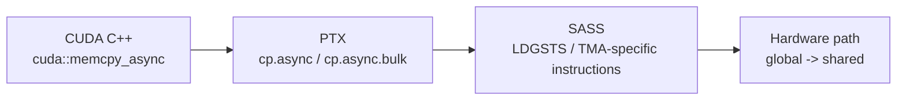
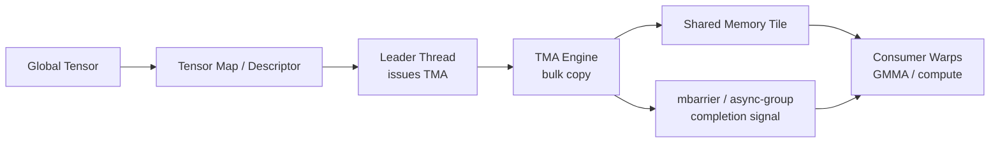
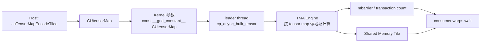

CUDA 里的异步数据拷贝，容易和 Host 侧的 `cudaMemcpyAsync` 混在一起。

这篇笔记讨论的是 **device code 里、kernel 内部发起的异步拷贝**：线程在 GPU 上把数据从 global memory 搬到 shared memory，或者在 SM90+ 上通过 TMA 做更大粒度的数据搬运。它的目标不是让 CPU 和 GPU 异步，而是让 **GPU 内部的数据搬运和计算重叠**。

官方文档里相关章节：

- [Advanced Kernel Programming: Asynchronous Data Copies](https://docs.nvidia.com/cuda/cuda-programming-guide/03-advanced/advanced-kernel-programming.html#asynchronous-data-copies)
- [Asynchronous Data Copies](https://docs.nvidia.com/cuda/cuda-programming-guide/04-special-topics/async-copies.html)

## 先分清三层：语言层、PTX 层、SASS 层

现代 CUDA 异步拷贝可以从三层看。

| 层级 | 看到的东西 | 作用 |
| --- | --- | --- |
| CUDA C++ 语言层 | `cuda::memcpy_async`、`cooperative_groups::memcpy_async` | 写 kernel 时直接调用的接口。负责把拷贝挂到 barrier、pipeline 或 cooperative group 上。 |
| PTX 层 | `cp.async`、`cp.async.bulk`、`cp.async.bulk.tensor`、`cp.async.bulk.wait_group` | CUDA 编译器生成的虚拟 ISA。表达“异步从哪里搬到哪里、怎么等待”。 |
| SASS 层 | `LDGSTS`、TMA 相关机器指令等 | 具体 GPU 架构上的真实机器指令。不同架构、不同编译器版本可能有不同名字和调度形态。 |

写 CUDA 代码时，优先用语言层 API。

PTX 层适合理解机制、分析性能瓶颈，或者在极限优化里写内联 PTX。

SASS 层适合做反汇编验证，比如确认是否真的生成了 `LDGSTS` / TMA 路径，但它不是稳定编程接口。

## 演进路线：从 LDG + STS 到 TMA

先看一张路线图。

| 阶段 | 架构 | 常见搬运方式 | 特点 |
| --- | --- | --- | --- |
| 传统同步拷贝 | Ampere 之前也常见 | `LDG` 读 global 到寄存器，再 `STS` 写 shared | 数据会经过寄存器。写法简单，但寄存器压力更大，也不容易把一批 global load 都提前发出去。 |
| element-wise async copy | SM80+ / Ampere | `cp.async`，SASS 常见为 `LDGSTS` 路径 | global 到 shared 的小粒度异步拷贝。支持 4/8/16 字节拷贝，完成信号可以接 barrier 或 pipeline。 |
| bulk async copy / TMA | SM90+ / Hopper | `cp.async.bulk`、`cp.async.bulk.tensor` | 面向大块、连续或多维 tensor tile 的异步搬运。可以由一个或少数线程发起，硬件负责地址计算和数据搬运。 |

最朴素的 global 到 shared 写法类似这样：

```cpp
__global__ void sync_copy_kernel(const float* gmem, float* out) {
    __shared__ float smem[256];

    const int tid = threadIdx.x;

    // 同步拷贝：
    // 1. 先从 global memory load 到寄存器。
    // 2. 再从寄存器 store 到 shared memory。
    smem[tid] = gmem[blockIdx.x * blockDim.x + tid];

    // 等所有线程都把 shared memory 写完。
    __syncthreads();

    out[blockIdx.x * blockDim.x + tid] = smem[tid] * 2.0f;
}
```

这段代码在语义上没问题，但从数据路径看，它大致是：

```text
global memory -> register -> shared memory -> compute
```

异步拷贝希望变成：

```text
global memory -> shared memory
                    |
                    v
                 compute
```

也就是尽量避免中间寄存器，并且让拷贝先飞起来，线程可以继续做别的工作，最后再等待数据可用。

## 先讲清楚：这里的异步到底异步在哪里

device-side asynchronous copy 的核心语义是：

1. CUDA 线程发起一个异步操作。
2. 这个操作像是交给了一个“异步线程”或硬件单元去执行。
3. 发起线程不一定立刻阻塞。
4. 程序必须通过 barrier、pipeline、cooperative group wait 或 bulk async-group 等机制等待完成。

所以异步拷贝不是“发了就能读”。正确顺序一定是：

```text
发起 async copy -> 做一些不依赖新数据的工作 -> wait -> 读 shared memory
```

如果 `wait` 之前就读目标 shared memory，本质上就是数据竞争。

## LDGSTS：SM80+ 的小粒度 global to shared 异步拷贝

Ampere / SM80 引入了硬件加速的 global memory 到 shared memory 异步拷贝。官方文档把这一类路径称作 LDGSTS。

它的几个关键点：

| 项目 | 说明 |
| --- | --- |
| 支持方向 | global memory -> CTA shared memory |
| 常见粒度 | 4、8、16 字节 |
| 完成机制 | shared memory barrier 或 pipeline |
| 适合场景 | 小块、规则或半规则 tile 预取，比如 stencil、GEMM tile load |
| 注意点 | 默认每个线程只等待自己发起的拷贝。如果拷贝结果会被别的线程读，等待 copy 完成后通常还需要 `__syncthreads()`。 |

为什么 16 字节经常被强调？

因为 16 字节拷贝更容易走高效路径，也可能避免污染 L1。实际性能还和 global/shared 地址对齐有关。官方文档提到，4/8/16 字节粒度都有要求，shared 和 global 最好能做到 128 字节对齐。

## API 1：`cuda::memcpy_async`

`cuda::memcpy_async` 是 CUDA C++ 里比较推荐的高级接口。它可以和 `cuda::barrier` 或 `cuda::pipeline` 配合。

常见头文件：

```cpp
#include <cooperative_groups.h>
#include <cuda/barrier>
#include <cuda/pipeline>
```

常见调用形态可以理解成下面几类。注意这不是完整头文件声明，CUDA 版本不同、是否传入 group、是否绑定 barrier / pipeline，都会对应不同重载：

```cpp
cuda::memcpy_async(dst, src, bytes, barrier);
cuda::memcpy_async(group, dst, src, bytes, barrier);

cuda::memcpy_async(dst, src, bytes, pipeline);
cuda::memcpy_async(group, dst, src, bytes, pipeline);
```

其中 `bytes` 常用 `cuda::aligned_size_t<N>` 包起来，告诉编译器地址和长度满足某种对齐。

```cpp
cuda::memcpy_async(
    smem + tid,
    gmem + global_idx,
    cuda::aligned_size_t<4>(sizeof(float)),
    barrier);
```

### 参数说明

| 参数 | 含义 |
| --- | --- |
| `group` | 可选。比如 `cooperative_groups::thread_block`。表示这次拷贝由一个线程组协作发起。 |
| `dst` | 目标地址。对 SM80 的 LDGSTS 路径，通常是 shared memory。 |
| `src` | 源地址。对 SM80 的 LDGSTS 路径，通常是 global memory。 |
| `bytes` | 拷贝字节数。用 `cuda::aligned_size_t<N>` 可以表达对齐信息。 |
| `barrier` | `cuda::barrier` 对象。copy 完成后会影响 barrier 当前 phase 的完成条件。 |
| `pipeline` | `cuda::pipeline` 对象。copy 被放入 pipeline stage，用 `consumer_wait()` 等待。 |

### 和 barrier 配合

这个例子展示：先把 global memory 的一段数据异步搬到 shared memory，然后等待拷贝完成，再让所有线程读 shared memory。

```cpp
#include <cooperative_groups.h>
#include <cuda/barrier>

namespace cg = cooperative_groups;

__global__ void async_copy_with_barrier(const float* __restrict__ gmem,
                                        float* __restrict__ out,
                                        int n) {
    // 示例假设 blockDim.x <= 256。
    // 真实 kernel 里建议把 shared memory 大小做成模板参数或动态 shared memory。
    auto block = cg::this_thread_block();
    const int tid = threadIdx.x;
    const int global_idx = blockIdx.x * blockDim.x + tid;

    using barrier_t = cuda::barrier<cuda::thread_scope_block>;
    __shared__ barrier_t barrier;
    __shared__ float smem[256];

    if (block.thread_rank() == 0) {
        // barrier 的参与者是整个 block。
        // 后面 arrive_and_wait() 需要所有 block 内线程都参与。
        init(&barrier, block.size());
    }
    block.sync();

    if (global_idx < n) {
        // 发起异步拷贝：
        // - 源地址在 global memory。
        // - 目标地址在 shared memory。
        // - cuda::aligned_size_t<4> 告诉编译器地址和大小至少满足 4 字节对齐。
        // - 这次拷贝绑定到 barrier 当前 phase。
        //
        // 对 barrier 来说，可以把这次 copy 理解成“额外的异步参与者”：
        // copy 没完成之前，barrier 当前 phase 不会真正通过。
        cuda::memcpy_async(
            smem + tid,
            gmem + global_idx,
            cuda::aligned_size_t<4>(sizeof(float)),
            barrier);
    }

    // 等待两件事：
    // 1. block 内线程都 arrive。
    // 2. 绑定到这个 phase 的异步拷贝都完成。
    barrier.arrive_and_wait();

    // 如果后面所有线程都可能读取 smem 中别的线程搬来的数据，
    // 再加一个 block sync 可以让 shared memory 的跨线程可见性更直观。
    block.sync();

    if (global_idx < n) {
        out[global_idx] = smem[tid] * 2.0f;
    }
}
```

这里最重要的点是：`barrier.arrive_and_wait()` 等的是 barrier 的 phase 翻转。这个 phase 既受线程 arrival 影响，也受绑定到该 phase 的异步拷贝完成影响。

### 和 pipeline 配合

pipeline 更适合写预取流水线：当前 iteration 做计算，下一份数据已经在路上。

```cpp
#include <cooperative_groups.h>
#include <cuda/pipeline>

namespace cg = cooperative_groups;

template <int BLOCK_SIZE, int STAGES>
__global__ void async_copy_pipeline(const float* __restrict__ gmem,
                                    float* __restrict__ out,
                                    int num_tiles) {
    auto block = cg::this_thread_block();
    const int tid = threadIdx.x;

    extern __shared__ float smem[];

    // block scope pipeline 表示整个 block 按同一套 stage 协作。
    __shared__ cuda::pipeline_shared_state<
        cuda::thread_scope_block,
        STAGES> shared_state;

    auto pipe = cuda::make_pipeline(block, &shared_state);

    auto copy_tile = [&](int tile, int stage) {
        const int global_idx = tile * BLOCK_SIZE + tid;

        // producer_acquire() 表示我要占用一个 pipeline stage 来写入数据。
        pipe.producer_acquire();

        // 这个 stage 的 shared memory 区间不能被消费者同时读写。
        // memcpy_async 被挂到当前 producer stage 上。
        cuda::memcpy_async(
            block,
            smem + stage * BLOCK_SIZE,
            gmem + tile * BLOCK_SIZE,
            cuda::aligned_size_t<16>(BLOCK_SIZE * sizeof(float)),
            pipe);

        // producer_commit() 表示这个 stage 的异步 copy 已经提交。
        // 注意：commit 不等于数据已经到 shared memory。
        pipe.producer_commit();
    };

    // 先填满前 STAGES 个 stage，让拷贝先飞起来。
    for (int s = 0; s < STAGES && s < num_tiles; ++s) {
        copy_tile(s, s);
    }

    for (int tile = 0; tile < num_tiles; ++tile) {
        const int stage = tile % STAGES;
        const int next_tile = tile + STAGES;

        // 等当前 consumer stage 的 copy 完成。
        // 等到这里以后，当前 stage 的 smem 数据才可以被读。
        pipe.consumer_wait();

        const float x = smem[stage * BLOCK_SIZE + tid];
        out[tile * BLOCK_SIZE + tid] = x * 2.0f;

        // 当前 stage 的数据已经消费完，可以释放给 producer 复用。
        pipe.consumer_release();

        if (next_tile < num_tiles) {
            copy_tile(next_tile, stage);
        }
    }
}
```

这段代码只是最小化展示 pipeline 结构。真实 GEMM / stencil 里，`consumer_wait()` 和计算之间通常还会有 `block.sync()` 或更细粒度的同步，取决于 shared memory 数据是不是会被跨线程读取。

## API 2：`cooperative_groups::memcpy_async`

`cooperative_groups::memcpy_async` 是 cooperative groups 风格的接口。

常见头文件：

```cpp
#include <cooperative_groups.h>
#include <cooperative_groups/memcpy_async.h>
```

它的调用形态更短：

```cpp
cooperative_groups::memcpy_async(group, dst, src, bytes);
cooperative_groups::wait(group);
```

示例：

```cpp
#include <cooperative_groups.h>
#include <cooperative_groups/memcpy_async.h>

namespace cg = cooperative_groups;

__global__ void cg_async_copy_kernel(const float* __restrict__ gmem,
                                     float* __restrict__ out) {
    // 示例假设 blockDim.x == 256。
    // 如果 block size 可变，应改成 extern __shared__ 或模板化 shared memory 大小。
    cg::thread_block block = cg::this_thread_block();
    const int tid = threadIdx.x;

    __shared__ float smem[256];

    // 整个 block 协作发起一次 async copy。
    // cooperative_groups::memcpy_async 会在 group 内部分配具体线程该搬哪些字节。
    cg::memcpy_async(
        block,
        smem,
        gmem + blockIdx.x * blockDim.x,
        blockDim.x * sizeof(float));

    // 等待这个 group 发起的 async copy 完成。
    cg::wait(block);

    // 如果后续读法涉及跨线程共享，保守地做一次 block 同步。
    block.sync();

    out[blockIdx.x * blockDim.x + tid] = smem[tid] * 2.0f;
}
```

两者怎么选？

| 接口 | 适合场景 | 特点 |
| --- | --- | --- |
| `cuda::memcpy_async` + `cuda::barrier` | 简单“发起 copy，然后等完成”的场景 | completion 逻辑明确，和异步屏障模型一致。 |
| `cuda::memcpy_async` + `cuda::pipeline` | 多 stage 预取、生产者消费者流水线 | 更适合隐藏 global memory latency。 |
| `cooperative_groups::memcpy_async` | 想用 group 风格写集体拷贝 | 写法短，和 `cg::wait()` 配套。 |

官方文档也提到，`cooperative_groups::memcpy_async` 的实现会自动协调 group 内线程，但在一些例子里它会更积极地提交 copy，不一定像手写 pipeline 那样容易批量 commit。

## 为什么这里不展开 `__pipeline_memcpy_async`

CUDA 还有一组更底层的 C primitive，比如：

```cpp
__pipeline_memcpy_async(...);
__pipeline_commit();
__pipeline_wait_prior(0);
```

它们更接近原语层，控制力强，但代码也更啰嗦。

这篇笔记主要关注现代 CUDA C++ 里更常用、更可维护的两类接口：

- `cuda::memcpy_async`
- `cooperative_groups::memcpy_async`

底层 primitive 可以帮助理解编译器和硬件怎么做事，但不作为本文重点。

## 从 CUDA C++ 到 PTX：编译器可能生成什么

当你写：

```cpp
cuda::memcpy_async(dst, src, cuda::aligned_size_t<16>(bytes), pipe);
```

编译器会根据架构、地址空间、对齐、大小、同步对象等条件决定怎么降级。

在 SM80+ 上，如果它确认这是合适的 global -> shared 小粒度拷贝，PTX 层可能走类似：

```ptx
cp.async.ca.shared.global ...
cp.async.commit_group
cp.async.wait_group ...
```

或者使用和 barrier / pipeline 对应的形式。

如果条件不满足，比如地址空间不对、大小对齐信息不足、目标架构不支持，编译器可能退回普通同步 load/store。

对 SM90+，同样的高级 API 在满足条件时还可能走 TMA 路径。官方文档特别提到：`cuda::memcpy_async` 在源地址、目标地址 16 字节对齐，并且大小是 16 字节倍数时，可以使用 TMA；否则会 fallback 到同步拷贝。更底层的 TMA API 如果条件不满足，则可能是 undefined behavior。

## 从 PTX 到 SASS：为什么反汇编里名字不一样

PTX 是虚拟 ISA，SASS 是真实机器指令。

所以你在代码里写 `cuda::memcpy_async`，PTX 里可能看到 `cp.async`，反汇编到 SASS 里又可能看到 `LDGSTS` 相关指令。

这三者关系大概是：



从工程角度看：

- 写代码时依赖 CUDA C++ API。
- 看 PTX 时理解异步 group、barrier、pipeline 怎么表达。
- 看 SASS 时确认最终机器码是否真的走了想要的路径。

不要把 SASS mnemonic 当成跨架构稳定契约。

## SM90+ 重点：TMA / bulk asynchronous copy

Hopper / SM90 引入了 Tensor Memory Accelerator，也就是常说的 TMA。

TMA 解决的是另一个量级的问题：不是“每个线程搬 4/8/16 字节”，而是 **一个或少数线程发起大块数据搬运，硬件负责把一维或多维 tensor tile 搬进 shared memory**。

官方文档里把 TMA 相关操作称作：

- bulk-asynchronous copy
- bulk-tensor asynchronous copy

这里的 bulk 用来区别 SM80 那种 element-wise async copy。

### TMA 解决了什么痛点

普通 `cp.async` 更像是：

```text
很多线程分别发起很多个小 copy
每个 copy 搬 4 / 8 / 16 字节
程序员或编译器负责把 tile 拆成许多小块
```

TMA 更像是：

```text
一个 leader thread 发起一次大 copy
硬件根据描述符计算多维地址
把一个 tensor tile 搬到 shared memory
完成后通过 barrier 或 async-group 通知线程
```

这对 Hopper 上的 GMMA / warp specialization 很关键。典型结构是：



### TMA 的几个核心概念

| 概念 | 含义 |
| --- | --- |
| tensor map | 描述 global tensor 的布局、维度、stride、元素大小等信息。多维 bulk-tensor copy 需要它。 |
| bulk copy | 一次操作描述一大块数据，而不是每个线程搬几个字节。 |
| mbarrier / transaction barrier | global -> shared 的 TMA 读可以用 shared memory barrier 跟踪完成。barrier 不只等线程 arrive，还等 transaction bytes 到达。 |
| bulk async-group | shared -> global 等方向常用 thread-local async-group 等待完成。注意它和普通 `cp.async.wait_group` 是两套不同 group。 |
| async proxy | TMA 属于 async proxy 操作。普通 shared memory store 走 generic proxy，因此某些 shared -> global TMA 前需要 proxy fence。 |

### TMA 支持的方向

SM90+ 的 TMA 不只是 global -> shared。

常见方向和完成机制可以这么记：

| 方向 | 常见完成机制 | 说明 |
| --- | --- | --- |
| global -> shared::cta | shared memory barrier | 最典型。把 global tile 搬进当前 block 的 shared memory。 |
| global -> shared::cluster | shared memory barrier / multicast | cluster 里可以把数据 multicast 到多个 block 的 distributed shared memory。 |
| shared::cta -> global | bulk async-group | 写回 global 时，通常由发起线程用 bulk async-group 等待。 |
| shared::cta -> shared::cluster | shared memory barrier | cluster 内 shared memory 搬运。 |

### 一维 TMA：`cuda::memcpy_async` 也可能使用 TMA

这是一个容易忽略的点：TMA 不一定非要手写 `cuda::ptx::cp_async_bulk`。

在 SM90+ 上，对于一维连续大块拷贝，如果满足：

- global 地址 16 字节对齐。
- shared 地址 16 字节对齐。
- 拷贝大小是 16 字节倍数。

那么 `cuda::memcpy_async` 可以使用 TMA 路径。

概念示例：

```cpp
#include <cuda/barrier>

using barrier_t = cuda::barrier<cuda::thread_scope_block>;

__global__ void sm90_tma_like_copy(const int* __restrict__ gmem,
                                   int* __restrict__ out) {
    constexpr int kElements = 1024;

    // TMA 的 shared memory 目标地址需要满足对齐要求。
    __shared__ alignas(16) int smem[kElements];
    __shared__ barrier_t barrier;

    if (threadIdx.x == 0) {
        init(&barrier, blockDim.x);
    }
    __syncthreads();

    if (threadIdx.x == 0) {
        // 在 SM90+ 且满足 16B 对齐和 size multiple-of-16 时，
        // cuda::memcpy_async 可以选择 TMA bulk copy 路径。
        //
        // 对 global -> shared 的 TMA read：
        // - copy 完成会更新 barrier 的 transaction count。
        // - barrier 只有在线程都 arrive 且数据 transaction 完成后才会通过。
        cuda::memcpy_async(
            smem,
            gmem + blockIdx.x * kElements,
            cuda::aligned_size_t<16>(sizeof(smem)),
            barrier);
    }

    // 所有线程到达 barrier，并等待 TMA / async copy 完成。
    barrier.arrive_and_wait();

    // 现在 shared memory tile 可读。
    for (int i = threadIdx.x; i < kElements; i += blockDim.x) {
        out[blockIdx.x * kElements + i] = smem[i] + 1;
    }
}
```

这段代码的重点不是“本机一定能编译成 TMA”，而是说明高级 API 的语义：`cuda::memcpy_async` 绑定 barrier，barrier 负责把 copy completion 纳入同步条件。是否真的选择 TMA，要看目标架构、CUDA 版本、对齐和编译结果。

### `cuda::device::memcpy_async_tx`

前面一直说 `cuda::memcpy_async` 在 SM90+ 上“可以”走 TMA。这里还有一个更明确的 CUDA C++ API：`cuda::device::memcpy_async_tx`。

它适合表达 **一维 global -> shared 的 TMA read**，也就是把一段连续 global memory 搬进 shared memory，并且让 shared memory barrier 作为完成机制。

**用途**

`cuda::device::memcpy_async_tx` 发起 TMA bulk copy，但它不像 `cuda::memcpy_async` 那样自动帮你把 transaction count 记到 barrier 上。你需要显式告诉 barrier：当前 phase 要等多少字节的异步事务完成。

常见写法是：

```cpp
cuda::device::memcpy_async_tx(
    smem_data,
    gmem_data,
    cuda::aligned_size_t<16>(num_bytes),
    bar);

auto token = cuda::device::barrier_arrive_tx(
    bar,
    1,
    num_bytes);
```

或者拆成：

```cpp
cuda::device::memcpy_async_tx(
    smem_data,
    gmem_data,
    cuda::aligned_size_t<16>(num_bytes),
    bar);

cuda::device::barrier_expect_tx(bar, num_bytes);
auto token = bar.arrive();
```

这两种写法的核心区别是：

| 写法 | 含义 |
| --- | --- |
| `barrier_arrive_tx(bar, 1, num_bytes)` | 当前线程 arrive，同时声明本 phase 要等 `num_bytes` 字节事务。 |
| `barrier_expect_tx(bar, num_bytes)` + `bar.arrive()` | 先声明事务量，再按普通方式 arrive。 |

**和 `cuda::memcpy_async` 的差别**

| 接口 | 是否一定走 TMA | transaction count 是否自动登记 | 条件不满足时 |
| --- | --- | --- | --- |
| `cuda::memcpy_async` | 不一定。SM90+ 且满足条件时可以走 TMA。 | 自动处理。 | 可以 fallback 到同步 copy。 |
| `cuda::device::memcpy_async_tx` | 是。它面向 TMA transaction copy。 | 需要手动配合 `barrier_arrive_tx` 或 `barrier_expect_tx`。 | 可能是未定义行为。 |
| `cuda::ptx::cp_async_bulk` | 是。更接近 PTX 指令包装。 | 需要手动登记 transaction count。 | 可能是未定义行为。 |

官方文档强调：`cuda::device::memcpy_async_tx` 和 `cuda::ptx::cp_async_bulk` 不像 `cuda::memcpy_async` 那样有 fallback 兜底。如果 global 地址、shared 地址或 size 不满足 TMA 要求，就不要指望它自动退回普通 copy。

**最小结构**

```cpp
#include <cuda/barrier>
#include <cuda/ptx>
#include <cuda/std/utility>

using barrier_t = cuda::barrier<cuda::thread_scope_block>;

__global__ void memcpy_async_tx_kernel(const int* __restrict__ gmem,
                                       int* __restrict__ out) {
    constexpr int kElements = 1024;
    constexpr int kBytes = kElements * sizeof(int);

    __shared__ alignas(16) int smem[kElements];
    __shared__ barrier_t bar;

    if (threadIdx.x == 0) {
        // 这个简化示例里，让整个 block 都参与 barrier。
        init(&bar, blockDim.x);
    }
    __syncthreads();

    barrier_t::arrival_token token;

    if (threadIdx.x == 0) {
        // 发起一维 TMA read：global -> shared。
        cuda::device::memcpy_async_tx(
            smem,
            gmem + blockIdx.x * kElements,
            cuda::aligned_size_t<16>(kBytes),
            bar);

        // 手动登记 transaction count：
        // - arrival count 减 1。
        // - expected transaction count 增加 kBytes。
        token = cuda::device::barrier_arrive_tx(bar, 1, kBytes);
    } else {
        // 其他线程不发起 copy，只参与同一个 barrier phase。
        token = bar.arrive();
    }

    // 等待两件事：
    // 1. block 内所有线程都 arrive。
    // 2. memcpy_async_tx 对应的 transaction bytes 到达 shared memory。
    bar.wait(cuda::std::move(token));

    for (int i = threadIdx.x; i < kElements; i += blockDim.x) {
        out[blockIdx.x * kElements + i] = smem[i];
    }
}
```

这个示例故意只展示 API 关系，不把完整 pipeline 写进去。真正写多 stage prefetch 时，常见模式是：每个 stage 一个 barrier，leader 线程用 `memcpy_async_tx` 发起 copy，然后用 `barrier_arrive_tx` 登记本 stage 的 transaction bytes，消费者用显式 phase tracking 等待该 stage 数据到达。

### 多维 TMA：tensor map 是关键

一维 TMA 和多维 TMA 的最大区别是：**一维连续数组可以只靠指针和字节数，多维 tensor tile 需要 tensor map**。

官方文档给出的边界很明确：

- TMA 支持一维和多维数组，多维最多到 5D。
- 一维 contiguous bulk copy 不需要 tensor map。
- 多维 bulk-tensor async copy 需要 tensor map，因为硬件要靠它理解 global memory 和 shared memory 里的布局。
- tensor map 通常在 Host 侧用 `cuTensorMapEncodeTiled` 创建，再作为 `const __grid_constant__ CUtensorMap` kernel 参数传进 device。

也就是说，TMA 不是简单地把 `memcpy(dst, src, bytes)` 做大，而是把下面这些信息打包成一个硬件能读懂的描述符：

| 信息 | 含义 |
| --- | --- |
| `globalAddress` | global memory 中 tensor 的基地址。 |
| `tensorRank` | tensor 维度数，常见是 2D / 3D，最多 5D。 |
| `globalDim` | global tensor 每一维的元素数量。 |
| `globalStrides` | global tensor 相邻高维元素之间的跨度，单位是字节，官方示例里 stride 需要是 16 字节倍数。 |
| `boxDim` | 一次 TMA 传输对应的 shared memory tile 尺寸，单位是元素个数。 |
| `elementStrides` | 每一维元素采样步长，比如只搬复数的实部时可以用 stride。 |
| `interleave` | 面向小于 4 字节元素的交错布局优化。 |
| `swizzle` | shared memory swizzle，用于缓解 bank conflict。 |
| `l2Promotion` | L2 cache promotion 策略。 |
| `oobFill` | 越界元素如何填充，常见做法是越界填 0 或不启用。 |

从数据流看，多维 TMA 是这样的：



这张图里最重要的是：**地址计算从每个线程的 index arithmetic，转移到了 tensor map + TMA hardware**。kernel 只告诉 TMA “从 tensor 的哪个坐标开始搬这个 tile”。

这一节主要对着这些资料整理：

| 资料 | 重点 |
| --- | --- |
| [CUDA Programming Guide: Using TMA](https://docs.nvidia.com/cuda/cuda-programming-guide/04-special-topics/async-copies.html#using-the-tensor-memory-accelerator-tma) | TMA 编程模型、tensor map、barrier、bulk async-group。 |
| [CCCL: `cp_async_bulk`](https://nvidia.github.io/cccl/unstable/libcudacxx/ptx/instructions/cp_async_bulk.html) | 一维 bulk copy 的 PTX API 包装。 |
| [CCCL: `cp_async_bulk_tensor`](https://nvidia.github.io/cccl/unstable/libcudacxx/ptx/instructions/cp_async_bulk_tensor.html) | 多维 bulk-tensor copy 的 PTX API 包装。 |
| [CCCL: `cp_async_bulk_commit_group`](https://nvidia.github.io/cccl/unstable/libcudacxx/ptx/instructions/cp_async_bulk_commit_group.html) | bulk async-group 的 commit。 |
| [CCCL: `cp_async_bulk_wait_group`](https://nvidia.github.io/cccl/unstable/libcudacxx/ptx/instructions/cp_async_bulk_wait_group.html) | bulk async-group 的 wait。 |
| [CCCL: `cp_async_mbarrier_arrive`](https://nvidia.github.io/cccl/unstable/libcudacxx/ptx/instructions/cp_async_mbarrier_arrive.html) | async copy 和 mbarrier 的底层衔接。 |
| [CCCL: `cp_reduce_async_bulk`](https://nvidia.github.io/cccl/unstable/libcudacxx/ptx/instructions/cp_reduce_async_bulk.html) | 一维 bulk reduce。 |
| [CCCL: `cp_reduce_async_bulk_tensor`](https://nvidia.github.io/cccl/unstable/libcudacxx/ptx/instructions/cp_reduce_async_bulk_tensor.html) | 多维 bulk-tensor reduce。 |

### Host 侧：用 `cuTensorMapEncodeTiled` 创建 tensor map

官方示例通过 Driver API 的 `cuTensorMapEncodeTiled` 创建 tensor map：

```cpp
#include <cuda.h>
#include <cudaTypedefs.h>

CUtensorMap make_tensor_map(int* tensor_ptr) {
    CUtensorMap tensor_map{};

    // 以 2D row-major int tensor 为例。
    // 注意：官方文档里最快变化的维度放在前面。
    constexpr uint32_t rank = 2;
    uint64_t global_dim[rank] = {
        GMEM_WIDTH,
        GMEM_HEIGHT,
    };

    // global_strides 的单位是字节，不是元素个数。
    // 2D tensor 只需要 rank - 1 个 stride。
    // 对 row-major 来说，从一行跳到下一行需要 GMEM_WIDTH * sizeof(int) 字节。
    uint64_t global_strides[rank - 1] = {
        GMEM_WIDTH * sizeof(int),
    };

    // box_dim 描述一次 TMA 搬到 shared memory 的 tile 大小。
    uint32_t box_dim[rank] = {
        SMEM_WIDTH,
        SMEM_HEIGHT,
    };

    // element_strides 描述每一维按什么步长采样元素。
    // 这里 {1, 1} 表示每个元素都搬。
    uint32_t element_strides[rank] = {1, 1};

    auto cuTensorMapEncodeTiled = get_cuTensorMapEncodeTiled();
    CUresult result = cuTensorMapEncodeTiled(
        &tensor_map,
        CUtensorMapDataType::CU_TENSOR_MAP_DATA_TYPE_INT32,
        rank,
        tensor_ptr,
        global_dim,
        global_strides,
        box_dim,
        element_strides,
        CUtensorMapInterleave::CU_TENSOR_MAP_INTERLEAVE_NONE,
        CUtensorMapSwizzle::CU_TENSOR_MAP_SWIZZLE_NONE,
        CUtensorMapL2promotion::CU_TENSOR_MAP_L2_PROMOTION_NONE,
        CUtensorMapFloatOOBfill::CU_TENSOR_MAP_FLOAT_OOB_FILL_NONE);

    // 示例里省略错误处理；真实代码要检查 result。
    return tensor_map;
}
```

这里最容易写错的是三个单位：

| 参数 | 单位 | 容易错的点 |
| --- | --- | --- |
| `globalDim` | 元素个数 | 不要写成字节数。 |
| `globalStrides` | 字节 | 不是元素个数，且有对齐要求。 |
| `boxDim` | 元素个数 | 表示 shared memory 目标 tile 的形状。 |

### Shared-memory bank swizzling

TMA tensor map 里还有一个很重要的字段：`CUtensorMapSwizzle`。

默认情况下，TMA 会按照 global memory 中的布局顺序，把数据搬到 shared memory。这样最直观，但不一定最适合后续 shared memory 访问。原因是 shared memory 有 bank 结构：

- shared memory 通常可以理解成 32 个 bank。
- 连续的 32-bit word 会映射到连续 bank。
- 如果同一次 shared memory transaction 里多个访问落到同一个 bank，就会产生 bank conflict，访问被拆成多次执行，带宽下降。

swizzle 的目的就是：**让 TMA 在写入 shared memory 时重新排列数据，使后续代码按某些行 / 列 / tile 模式访问时更少发生 bank conflict**。

换句话说，TMA swizzle 改的是 shared memory 里的物理摆放方式。global memory 仍然可以是正常 row-major，但 shared memory 中的 tile 可以按 swizzle pattern 存放。

#### 为什么矩阵转置容易需要 swizzle

一个典型例子是矩阵转置：

```text
global memory: row-major
shared memory: 先搬入一个 tile
后续计算: 既要按行读，也要按列写 / 读
```

如果不 swizzle，一个 8 x 8 的 `int4` tile 搬进 shared memory 后，shared memory index 基本等于 global memory index。每个 `int4` 是 16 字节，也就是 4 个 32-bit word。转置时，一组线程把一行读出来，再写到转置 buffer 的一列。这个列访问可能让多个元素落到同一组 bank 上，于是出现 8-way bank conflict。

启用 `CU_TENSOR_MAP_SWIZZLE_128B` 后，TMA 会按 128B swizzle pattern 把 tile 写入 shared memory。只要后续代码也按对应的 swizzled index 访问，就可以让行访问和列访问都避开同一 bank 的冲突。

#### swizzle 模式

`CUtensorMapSwizzle` 常见有四种：

| 模式 | swizzle width | shared box inner dimension 要求 | pattern 重复周期 | shared memory 对齐 | global memory 对齐 |
| --- | --- | --- | --- | --- | --- |
| `CU_TENSOR_MAP_SWIZZLE_NONE` | 无 swizzle | 默认普通布局 | 无 | 常规 TMA 对齐要求 | 常规 TMA 对齐要求 |
| `CU_TENSOR_MAP_SWIZZLE_32B` | 32 bytes | `<= 32 bytes` | 256 bytes | 128 bytes | 128 bytes |
| `CU_TENSOR_MAP_SWIZZLE_64B` | 64 bytes | `<= 64 bytes` | 512 bytes | 128 bytes | 128 bytes |
| `CU_TENSOR_MAP_SWIZZLE_128B` | 128 bytes | `<= 128 bytes` | 1024 bytes | 128 bytes | 128 bytes |

这里的 **shared box inner dimension** 可以理解成 shared memory tile 最内层维度的字节宽度。它必须不超过 swizzle width。比如启用 128B swizzle 时，最内层 shared box 宽度不能超过 128B。

还有两个实践规则：

- swizzle 的映射粒度固定是 **16 字节 chunk**。像 `int4`、`float4` 这类 16B 元素非常适合解释这个模型。
- shared memory 至少要满足 128B 对齐。为了让 swizzle pattern 从更自然的位置开始，示例里常把 128B swizzle 的 shared buffer 做到 1024B 对齐。

#### 在 tensor map 里启用 swizzle

swizzle 是 Host 侧创建 tensor map 时编码进去的：

```cpp
CUresult result = cuTensorMapEncodeTiled(
    &tensor_map,
    CUtensorMapDataType::CU_TENSOR_MAP_DATA_TYPE_INT32,
    rank,
    tensor_ptr,
    global_dim,
    global_strides,
    box_dim,
    element_strides,
    CUtensorMapInterleave::CU_TENSOR_MAP_INTERLEAVE_NONE,
    CUtensorMapSwizzle::CU_TENSOR_MAP_SWIZZLE_128B,
    CUtensorMapL2promotion::CU_TENSOR_MAP_L2_PROMOTION_NONE,
    CUtensorMapFloatOOBfill::CU_TENSOR_MAP_FLOAT_OOB_FILL_NONE);
```

shared memory 端也要给出合适对齐：

```cpp
// 使用 128B swizzle mode 时，官方示例把 shared buffer 对齐到 1024B。
__shared__ alignas(1024) int4 smem_buffer[8][8];
__shared__ alignas(1024) int4 smem_buffer_tr[8][8];
```

#### swizzled index 怎么读

启用 swizzle 后，shared memory 里的逻辑坐标和实际访问坐标不再完全相同。以 `CU_TENSOR_MAP_SWIZZLE_128B` 为例，如果 shared memory 指针对齐不是刚好落在 pattern 起点，还要考虑 offset：

```cpp
auto* smem_ptr = &smem[0][0];
int offset = (reinterpret_cast<uintptr_t>(smem_ptr) / 128) % 8;

// 逻辑坐标 smem[y][x] 对应的 swizzled 访问坐标：
smem[y][((y + offset) % 8) ^ x] = value;
```

三种 swizzle 的 index 关系可以记成：

| 模式 | offset 公式 | index 关系 |
| --- | --- | --- |
| `CU_TENSOR_MAP_SWIZZLE_128B` | `(reinterpret_cast<uintptr_t>(smem_ptr) / 128) % 8` | `smem[y][x]` 对应 `smem[y][((y + offset) % 8) ^ x]` |
| `CU_TENSOR_MAP_SWIZZLE_64B` | `(reinterpret_cast<uintptr_t>(smem_ptr) / 128) % 4` | `smem[y][x]` 对应 `smem[y][((y + offset) % 4) ^ x]` |
| `CU_TENSOR_MAP_SWIZZLE_32B` | `(reinterpret_cast<uintptr_t>(smem_ptr) / 128) % 2` | `smem[y][x]` 对应 `smem[y][((y + offset) % 2) ^ x]` |

如果 shared buffer 按 pattern 重复周期对齐，比如 128B swizzle 下用 `alignas(1024)`，offset 通常更容易变成 0，索引也更好理解：

```cpp
// offset = 0 时，128B swizzle 的简化形式。
int swizzled_x = (y % 8) ^ x;
```

矩阵转置里会出现两个方向的 swizzled index：

```cpp
for (int sidx_j = threadIdx.x; sidx_j < 8; sidx_j += blockDim.x) {
    for (int sidx_i = 0; sidx_i < 8; ++sidx_i) {
        // 读原 tile 时，列坐标要按原 tile 的行号 swizzle。
        int swiz_j_idx = (sidx_i % 8) ^ sidx_j;

        // 写 transpose tile 时，新的列坐标要按 transpose tile 的行号 swizzle。
        int swiz_i_idx_tr = (sidx_j % 8) ^ sidx_i;

        smem_buffer_tr[sidx_j][swiz_i_idx_tr] =
            smem_buffer[sidx_i][swiz_j_idx];
    }
}
```

这段代码的核心不是“转置算法本身”，而是：**TMA 已经按 swizzle pattern 把 shared memory 写成了特殊布局，后续读写 shared memory 时也必须使用对应的 swizzled index**。否则数据不是读错，就是重新引入 bank conflict。

#### 写回 global memory 时会 unswizzle

swizzle 不只是 global -> shared 的单向变换。TMA 从 shared memory 写回 global memory 时，会按照 tensor map 中记录的 swizzle mode 做对应的 unswizzle。

典型顺序是：

```cpp
// 1. TMA global -> shared，写入 swizzled shared layout。
ptx::cp_async_bulk_tensor(
    ptx::space_shared,
    ptx::space_global,
    &smem_buffer,
    &tensor_map,
    tensor_coords,
    cuda::device::barrier_native_handle(bar));

// 2. kernel 按 swizzled index 访问 / 转置 shared memory。
transpose_with_swizzled_indices(smem_buffer, smem_buffer_tr);

// 3. shared -> global 前，保证普通 shared store 对 async proxy 可见。
ptx::fence_proxy_async(ptx::space_shared);
__syncthreads();

// 4. TMA shared -> global，硬件按 tensor map unswizzle 后写回 global。
ptx::cp_async_bulk_tensor(
    ptx::space_global,
    ptx::space_shared,
    &tensor_map,
    tensor_coords,
    &smem_buffer_tr);
```

所以，`CUtensorMapSwizzle` 不是一个单纯的“性能开关”。它改变了 shared memory tile 的访问协议：

- Host 侧 tensor map 要声明 swizzle mode。
- shared memory buffer 要满足对应对齐和 inner dimension 要求。
- Kernel 里访问 shared memory 要使用匹配的 swizzled index。
- shared -> global 时，TMA 会根据同一个 tensor map 做 unswizzle。

### tensor map 怎么传给 kernel

官方文档列了三种方式。

| 方式 | 写法 | 适合场景 | 注意点 |
| --- | --- | --- | --- |
| kernel 参数 | `const __grid_constant__ CUtensorMap tensor_map` | 推荐方式。tensor map 作为 kernel 参数传入。 | 简洁，适合一次 launch 使用固定 tensor map。 |
| constant memory | `__constant__ CUtensorMap global_tensor_map` | 多个 kernel 或多个 block 复用同一个 descriptor。 | Host 侧用 `cudaMemcpyToSymbol` 更新。 |
| global memory pointer | `CUtensorMap* tensor_map` | tensor map 动态生成或放在 device global memory。 | 使用前需要 tensor map proxy 的 acquire fence，通常更麻烦也可能更慢。 |

推荐写法长这样：

```cpp
#include <cuda.h>

__global__ void tma_kernel(const __grid_constant__ CUtensorMap tensor_map,
                           int tile_x,
                           int tile_y) {
    // 在 kernel 内使用 tensor_map 发起 bulk-tensor async copy。
}
```

`__grid_constant__` 的意思是：这个参数在整个 grid 内按只读参数处理，编译器不必为每个线程创建可写本地副本。tensor map 这种 descriptor 很适合这样传。

### Device 侧：`cuda::ptx::cp_async_bulk_tensor`

多维 TMA 真正发起 copy 的接口在 `cuda::ptx` 命名空间里。官方 CCCL 文档把它暴露成 `cuda::ptx::cp_async_bulk_tensor`。

**用途**

发起 bulk-tensor asynchronous copy。它不是普通 C++ 层面的 `memcpy_async`，而是 PTX 指令包装。它让硬件根据 tensor map 和 tensor 坐标搬运一个 tile。

**典型原型**

global -> shared::cta，完成信号走 shared memory barrier：

```cpp
template <typename = void>
__device__ static inline void cp_async_bulk_tensor(
    cuda::ptx::space_shared_t,
    cuda::ptx::space_global_t,
    void* dstMem,
    const void* tensorMap,
    const int32_t (&tensorCoords)[N],
    uint64_t* smem_bar);
```

shared::cta -> global，完成信号走 bulk async-group：

```cpp
template <typename = void>
__device__ static inline void cp_async_bulk_tensor(
    cuda::ptx::space_global_t,
    cuda::ptx::space_shared_t,
    const void* tensorMap,
    const int32_t (&tensorCoords)[N],
    const void* srcMem);
```

这里的 `N` 可以理解成 1 到 5，对应 1D 到 5D 的 tensor 坐标。CCCL 文档里实际是为 1D / 2D / 3D / 4D / 5D 分别提供重载。

**参数**

| 参数 | 类型 | 含义 |
| --- | --- | --- |
| `space_shared` / `space_cluster` | tag 类型 | 目标或源是当前 CTA shared memory，还是 cluster shared memory。 |
| `space_global` | tag 类型 | 目标或源是 global memory。 |
| `dstMem` | `void*` | global -> shared 时的 shared memory 目标地址。通常要求足够对齐，官方多维示例使用 `alignas(128)`。 |
| `srcMem` | `const void*` | shared -> global 时的 shared memory 源地址。 |
| `tensorMap` | `const void*` | 指向 `CUtensorMap`。它描述 global tensor 和 shared tile 布局。 |
| `tensorCoords` | `const int32_t (&)[N]` | tile 在 global tensor 里的起始坐标。比如 2D 里 `{x, y}`。 |
| `smem_bar` | `uint64_t*` | shared memory barrier 的 native handle。global -> shared copy 完成时会更新这个 barrier 的 transaction 状态。 |

**副作用 / 约束**

- 它是 PTX API，需要 `#include <cuda/ptx>`。
- SM90+ 才是核心目标；某些新重载还标注到 SM100+。
- global -> shared 的版本不会自动让普通 CUDA barrier 知道“要等多少字节”，通常还要配合 `cuda::device::barrier_arrive_tx` 或底层 `mbarrier_arrive_expect_tx`。
- shared -> global 的版本通常不使用 shared barrier 等待完成，而是进入 bulk async-group，然后由发起线程 `commit_group` / `wait_group`。

### 多维 TMA 读：global -> shared

官方 2D tile load 的核心逻辑可以整理成这样：

```cpp
#include <cuda.h>
#include <cuda/barrier>
#include <cuda/ptx>

using barrier_t = cuda::barrier<cuda::thread_scope_block>;
namespace ptx = cuda::ptx;

__device__ inline bool is_elected_leader() {
    // 概念示例：真实代码里可以使用 ptx::elect_sync 选出 warp 0 的一个 leader。
    return threadIdx.x == 0;
}

__global__ void tma_load_2d_kernel(const __grid_constant__ CUtensorMap tensor_map,
                                   int tile_x,
                                   int tile_y) {
    // bulk-tensor copy 的 shared memory 目标通常至少 128B 对齐。
    // 如果 tensor map 使用 128B swizzle，官方示例会进一步使用 1024B 对齐。
    __shared__ alignas(128) int smem_tile[SMEM_HEIGHT][SMEM_WIDTH];

    #pragma nv_diag_suppress static_var_with_dynamic_init
    __shared__ barrier_t bar;

    if (threadIdx.x == 0) {
        // block 内所有线程都参与这个 barrier。
        init(&bar, blockDim.x);
    }
    __syncthreads();

    barrier_t::arrival_token token;

    if (is_elected_leader()) {
        int32_t tensor_coords[2] = {tile_x, tile_y};

        // 发起 TMA bulk-tensor read：
        // - 从 global tensor 的 tensor_coords 位置开始读。
        // - tensor_map 描述 global tensor layout 和 shared tile layout。
        // - smem_tile 是 shared memory 目标。
        // - native barrier handle 用来接收 copy completion 信号。
        ptx::cp_async_bulk_tensor(
            ptx::space_shared,
            ptx::space_global,
            &smem_tile,
            &tensor_map,
            tensor_coords,
            cuda::device::barrier_native_handle(bar));

        // 关键点：
        // global -> shared 的 TMA read 会按“字节数”更新 transaction count。
        // leader thread 需要 arrive，并告诉 barrier 这次预期有多少字节到达。
        token = cuda::device::barrier_arrive_tx(
            bar,
            1,
            sizeof(smem_tile));
    } else {
        // 非 leader thread 不发起 TMA，只作为 barrier 参与者 arrive。
        token = bar.arrive();
    }

    // 等待两类事件：
    // 1. block 内所有参与线程都 arrive。
    // 2. TMA read 的 transaction bytes 都到达 shared memory。
    bar.wait(std::move(token));

    // 到这里，smem_tile 已经可以被 block 内线程安全读取。
    // 如果后续有复杂跨线程读写，仍然要按普通 shared memory 规则安排同步。
    compute_from_shared_tile(smem_tile);
}
```

这段逻辑有三个同步层次：

| 层次 | 谁负责 | 等什么 |
| --- | --- | --- |
| 发起 | leader thread | 调用 `cp_async_bulk_tensor`，把请求交给 TMA。 |
| transaction 计数 | `barrier_arrive_tx` | 告诉 barrier 本 phase 要等多少字节到达。 |
| 消费 | `bar.wait(token)` | 等线程 arrival 和 TMA bytes 都完成。 |

这也是 TMA 和普通 `__syncthreads()` 最大的差别：`__syncthreads()` 只知道线程到了没到，**不知道异步搬运的字节到了没到**。TMA read 必须把 transaction count 纳入 barrier。

### 多维 TMA 写：shared -> global

shared -> global 的方向不靠 shared memory barrier 完成等待，而是靠 **bulk async-group**。

典型流程是：

```cpp
__global__ void tma_store_2d_kernel(const __grid_constant__ CUtensorMap tensor_map,
                                    int tile_x,
                                    int tile_y) {
    __shared__ alignas(128) int smem_tile[SMEM_HEIGHT][SMEM_WIDTH];

    // 省略：先把 smem_tile 算出来。
    compute_to_shared_tile(smem_tile);

    // TMA 属于 async proxy，普通线程写 shared memory 属于 generic proxy。
    // 如果后面要让 TMA 从 shared memory 读数据写回 global，
    // 需要先建立 generic -> async proxy 的可见性顺序。
    ptx::fence_proxy_async(ptx::space_shared);

    // 确保 block 内所有线程都完成 shared memory 写入和 proxy fence。
    __syncthreads();

    if (is_elected_leader()) {
        int32_t tensor_coords[2] = {tile_x, tile_y};

        // 发起 TMA bulk-tensor write：
        // - 目标 global 位置由 tensor_map + tensor_coords 决定。
        // - 源数据来自 smem_tile。
        // - 这个方向的完成等待走 bulk async-group。
        ptx::cp_async_bulk_tensor(
            ptx::space_global,
            ptx::space_shared,
            &tensor_map,
            tensor_coords,
            &smem_tile);

        // 把前面发起的 bulk copy 组成一个 bulk async-group。
        ptx::cp_async_bulk_commit_group();

        // 等待发起线程之前提交的 bulk async-group 完成。
        // N=0 表示等到没有未完成 group。
        ptx::cp_async_bulk_wait_group(ptx::n32_t<0>());
    }
}
```

这里有两个很容易漏掉的点：

- **`fence_proxy_async` 不是普通线程同步**。它解决的是 generic proxy 写 shared memory 和 async proxy 读 shared memory 之间的可见性顺序。
- **`cp_async_bulk_wait_group` 只对发起线程有意义**。官方文档说 shared -> global 或 shared -> distributed shared memory 这类写方向，只有 initiating thread 能等待这次 bulk operation 完成。

### generic proxy 和 async proxy

TMA 文档里反复出现 proxy（代理）这个词。这里的 proxy 可以理解成 CUDA 内存模型里的“访问通道”或“观察路径”。

| proxy | 谁在用 | 例子 |
| --- | --- | --- |
| generic proxy | 普通 CUDA 线程执行的常规 load/store | `smem[i] += 1`、普通 global/shared memory 读写。 |
| async proxy | 异步拷贝硬件或异步指令使用的访问路径 | TMA / `cp.async.bulk` 从 shared memory 读数据写回 global。 |
| tensormap proxy | tensor map 描述符相关的特殊访问路径 | 修改 global memory 中的 tensor map 后，再让 TMA 使用它。 |

为什么需要区分？

因为普通线程写 shared memory，和 TMA 从 shared memory 读数据，虽然都在访问 shared memory，但它们属于不同 proxy。**普通线程之间的同步，不必然等价于“普通线程写入已经对 async copy engine 可见”**。

典型问题是 shared -> global 的 TMA write：

```cpp
// 普通 CUDA 线程写 shared memory：generic proxy。
smem_tile[threadIdx.x] = compute_value();

// leader thread 马上发起 TMA：async proxy 读取 shared memory。
ptx::cp_async_bulk(
    ptx::space_global,
    ptx::space_shared,
    gmem_tile,
    smem_tile,
    num_bytes);
```

从人的直觉看，`smem_tile` 已经写了，TMA 应该能读到。但在 CUDA 的内存模型里，还缺少一条 **generic proxy -> async proxy** 的顺序边。`cuda::ptx::fence_proxy_async(ptx::space_shared)` 就是用来建立这条边的。

正确顺序一般是：

```cpp
// 1. 所有线程用普通 store 写 shared memory。
smem_tile[threadIdx.x] = compute_value();

// 2. 每个写 shared memory 的线程执行 proxy fence。
//    这一步让本线程对 shared memory 的 generic proxy 写入，
//    在 async proxy 视角下排在后续 TMA 读取之前。
ptx::fence_proxy_async(ptx::space_shared);

// 3. block 同步。
//    fence_proxy_async 是每个线程自己的顺序约束；
//    __syncthreads() 确保 leader 发起 TMA 前，所有线程都完成写入和 fence。
__syncthreads();

// 4. leader thread 发起 TMA，让 async proxy 读取 shared memory。
if (is_elected_leader()) {
    ptx::cp_async_bulk(
        ptx::space_global,
        ptx::space_shared,
        gmem_tile,
        smem_tile,
        num_bytes);

    ptx::cp_async_bulk_commit_group();
    ptx::cp_async_bulk_wait_group_read(ptx::n32_t<0>());
}
```

这段顺序里，两个同步点负责的事情不同：

| 操作 | 解决什么问题 | 不解决什么问题 |
| --- | --- | --- |
| `fence_proxy_async(ptx::space_shared)` | 建立本线程 generic proxy 写入到 async proxy 后续读取之间的顺序。 | 不等待其他线程，也不保证整个 block 都写完。 |
| `__syncthreads()` | 让 block 内线程在 leader 发起 TMA 前都完成写入和 fence。 | 单独使用时不建立 generic proxy -> async proxy 的可见性顺序。 |
| `cp_async_bulk_wait_group*` | 等待 leader 发起的 bulk async operation 达到指定完成点。 | 不负责让之前普通线程的 shared store 对 TMA 可见。 |

所以官方示例里会写成：

```cpp
ptx::fence_proxy_async(ptx::space_shared);
__syncthreads();
```

顺序不能反过来。反过来意味着 leader 可能在别的线程执行 `fence_proxy_async` 之前就启动 TMA，async proxy 仍然可能看不到那些普通写入。

### bulk async-group：和普通 `cp.async` 不是一套

普通 SM80 `cp.async` 有自己的 group：

```ptx
cp.async.commit_group
cp.async.wait_group N
```

TMA / bulk async copy 用的是另一套 group：

```ptx
cp.async.bulk.commit_group
cp.async.bulk.wait_group N
```

CCCL PTX API 对应：

```cpp
template <typename = void>
__device__ static inline void cp_async_bulk_commit_group();

template <int N32>
__device__ static inline void cp_async_bulk_wait_group(
    cuda::ptx::n32_t<N32> N);
```

**参数**

| 接口 | 参数 | 含义 |
| --- | --- | --- |
| `cp_async_bulk_commit_group` | 无 | 把当前线程之前发起、尚未 commit 的 bulk async 操作组成一个 group。 |
| `cp_async_bulk_wait_group` | `N` | 等到当前线程未完成的 bulk async-group 数量不超过 `N`。常见 `n32_t<0>()` 表示全部等完。 |

**注意点**

- `cp.async.wait_group` 和 `cp.async.bulk.wait_group` 是不同指令，不共享 group 状态。
- bulk async-group 是 thread-local 语义，等待者通常就是发起 bulk copy 的 leader thread。
- global -> shared 的 TMA read 更常见的完成机制是 shared memory barrier；shared -> global 的 TMA write 更常见的是 bulk async-group。

### 一维 bulk API：`cuda::ptx::cp_async_bulk`

如果只是搬一维连续内存，不需要 tensor map，可以用 `cp_async_bulk`。

**用途**

发起一维 bulk-asynchronous copy。它面向大块连续数据，和 `cp_async_bulk_tensor` 的区别是：它不需要 tensor map，也不做多维 tensor 坐标解析。

**常见原型**

shared::cta -> global，完成信号走 bulk async-group：

```cpp
template <typename = void>
__device__ static inline void cp_async_bulk(
    cuda::ptx::space_global_t,
    cuda::ptx::space_shared_t,
    void* dstMem,
    const void* srcMem,
    const uint32_t& size);
```

shared::cta -> shared::cluster，完成信号走 remote shared memory barrier：

```cpp
template <typename = void>
__device__ static inline void cp_async_bulk(
    cuda::ptx::space_cluster_t,
    cuda::ptx::space_shared_t,
    void* dstMem,
    const void* srcMem,
    const uint32_t& size,
    uint64_t* rdsmem_bar);
```

**参数**

| 参数 | 类型 | 含义 |
| --- | --- | --- |
| `dstMem` | `void*` | 目标地址，可以是 global 或 cluster shared memory，取决于 tag。 |
| `srcMem` | `const void*` | 源地址，常见是 CTA shared memory。 |
| `size` | `uint32_t` | 拷贝字节数。 |
| `rdsmem_bar` | `uint64_t*` | remote distributed shared memory barrier，用于 cluster shared memory 方向。 |

一维 global -> shared 的 TMA read，官方更推荐用 `cuda::memcpy_async` 或 `cuda::device::memcpy_async_tx` 这类 C++ API 表达；`cuda::memcpy_async` 在 16B 对齐且大小是 16B 倍数时可以选择 TMA，否则会 fallback 到同步拷贝。

### `cp.async.mbarrier.arrive`：把 async copy 和 mbarrier 接起来

`cp.async.mbarrier.arrive` 是更底层的 mbarrier 到达指令包装。

**原型**

```cpp
template <typename = void>
__device__ static inline void cp_async_mbarrier_arrive(uint64_t* addr);
```

**用途**

它对指定 mbarrier 执行 arrive，用来把异步 copy 的完成信号接入 barrier 机制。学习 TMA 时不一定要直接写它，但要理解：TMA read 的完成不是靠普通线程同步知道的，而是靠 barrier / mbarrier 的 transaction 机制表达。

如果你使用 `cuda::barrier` 和 `cuda::device::barrier_arrive_tx`，通常不需要手写这个指令；如果你写 `cuda::ptx` 级别的 TMA，就会更频繁地看到 `mbarrier_init`、`mbarrier_arrive_expect_tx`、`mbarrier_try_wait` 这一组底层接口。

### bulk reduce：`cp.reduce.async.bulk*`

SM90+ 还提供了带 reduction 的 bulk async copy。它不是普通 copy，而是把 shared memory 里的数据异步写回 global 时，在 global 目标上做 reduction。

有两类：

| 接口 | 作用 |
| --- | --- |
| `cuda::ptx::cp_reduce_async_bulk` | 一维 shared::cta -> global，并在 global 端做 reduce。 |
| `cuda::ptx::cp_reduce_async_bulk_tensor` | 多维 tensor 版本，通过 tensor map + tensor coordinates 定位 global tile。 |

一维版本的典型原型长这样：

```cpp
template <typename = void>
__device__ static inline void cp_reduce_async_bulk(
    cuda::ptx::space_global_t,
    cuda::ptx::space_shared_t,
    cuda::ptx::op_add_t,
    float* dstMem,
    const float* srcMem,
    uint32_t size);
```

多维 tensor 版本的典型原型长这样：

```cpp
template <cuda::ptx::dot_op Op>
__device__ static inline void cp_reduce_async_bulk_tensor(
    cuda::ptx::space_global_t,
    cuda::ptx::space_shared_t,
    cuda::ptx::op_t<Op> op,
    const void* tensorMap,
    const int32_t (&tensorCoords)[N],
    const void* srcMem);
```

**支持的操作**

CCCL 文档列出的 bulk-tensor reduce 操作包括：

- `add`
- `min`
- `max`
- `inc`
- `dec`
- `and`
- `or`
- `xor`

一维 `cp_reduce_async_bulk` 还按数据类型提供多组重载，例如 `u32`、`s32`、`u64`、`s64`、`f32`、`f64` 等，不是每个 op 都适用于每个类型。

**什么时候会用**

这类接口适合“多个 CTA 计算局部结果，然后异步聚合回 global memory”的场景。比如 shared memory 中已经有一块局部统计结果，想用 TMA bulk 写回并在 global 端做 `add`，就不必手写很多 scalar atomic。它仍然属于 async proxy / bulk async-group 体系，因此写回前的 shared memory 可见性和写回后的 wait 规则都不能省。

## `cp.async` 和 TMA 的对比

| 维度 | SM80 `cp.async` / LDGSTS | SM90+ TMA / bulk async copy |
| --- | --- | --- |
| 粒度 | 4 / 8 / 16 字节小拷贝 | 大块一维或多维 tile |
| 发起者 | 通常很多线程一起发起 | 推荐一个 leader thread 或少数线程发起 |
| 地址计算 | 每个线程算自己的地址 | tensor map / descriptor 描述多维布局 |
| 典型方向 | global -> shared | global -> shared、shared -> global、cluster shared 等 |
| 完成机制 | pipeline 或 shared barrier | shared barrier / transaction barrier / bulk async-group |
| 适合场景 | 传统 tile 预取、stencil、小块 shared staging | Hopper GMMA、warp specialization、大 tile、多维 tensor |

如果说 `cp.async` 是“把许多小搬运排成队”，TMA 更像是“给硬件一张搬运单，让它搬整块 tile”。

## 常见坑

### 1. 把 device-side async copy 和 host-side `cudaMemcpyAsync` 混淆

`cudaMemcpyAsync` 是 Host API，放在 stream 里，让 CPU 不必等待拷贝完成。

`cuda::memcpy_async` / `cooperative_groups::memcpy_async` 是 kernel 内部的 device API，让 GPU 线程发起异步数据搬运。

名字像，但层级完全不同。

### 2. 以为 `commit` 就等于完成

pipeline 里的 `producer_commit()` 只是提交当前 stage 的异步操作。

它不代表数据已经到 shared memory。真正读 shared memory 前，需要 `consumer_wait()` 或对应的 barrier wait。

### 3. 忘了跨线程 shared memory 可见性

LDGSTS 默认每个线程只等待自己发起的 copy。

如果线程 A 搬的数据会被线程 B 读，那么在 copy completion wait 之后，还要考虑 block/group 同步。常见做法是：

```cpp
cg::wait(block);
block.sync();
```

或者：

```cpp
barrier.arrive_and_wait();
__syncthreads();
```

具体要不要额外同步，取决于你的读写模式和同步对象覆盖范围。

### 4. 对齐信息不够，编译器可能 fallback

高级 API 不保证一定生成硬件异步拷贝。

你需要尽量提供：

- 正确地址空间：global -> shared。
- 对齐信息：如 `cuda::aligned_size_t<4>`、`cuda::aligned_size_t<16>`。
- 合适大小：SM80 小拷贝常见 4/8/16 字节，SM90 TMA 一维 bulk 需要 16 字节对齐和 16 字节倍数。
- 合适架构：SM80+ 才有 LDGSTS，SM90+ 才有 TMA。

### 5. TMA 写回前忘了 async proxy 顺序

TMA 属于 async proxy。普通 shared memory 写入属于 generic proxy。

如果要把 shared memory 里的新数据用 TMA 写回 global，需要建立 generic proxy 到 async proxy 的顺序。否则硬件 TMA 可能看不到你以为已经写好的 shared memory 数据。

## 使用建议

1. 如果只是学习或写普通 tile 预取，先用 `cuda::memcpy_async` + `cuda::pipeline`。
2. 如果只是“一次 copy，然后等它完成”，用 `cuda::memcpy_async` + `cuda::barrier` 更直观。
3. 如果代码已经大量使用 cooperative groups，可以用 `cooperative_groups::memcpy_async`。
4. 如果目标是 Hopper / SM90+ 的 GEMM、attention、warp specialization，再重点看 TMA。
5. 每次优化后都用 profiler 和反汇编确认，不要只凭 API 名字判断是否真的走了异步硬件路径。

## 小结

现代 CUDA 异步数据拷贝可以分成两条主线：

- SM80+ 的 LDGSTS / `cp.async`：面向小粒度 global -> shared 的异步预取。
- SM90+ 的 TMA / bulk async copy：面向大块、多维 tensor tile 的硬件搬运。

语言层优先记住两个 API：

- `cuda::memcpy_async`
- `cooperative_groups::memcpy_async`

再往下看，PTX 层是 `cp.async` 和 `cp.async.bulk`，SASS 层是具体架构的真实指令。真正写高性能 kernel 时，API 只是入口，关键还是让数据搬运、同步、计算三件事在时间线上严丝合缝地接起来。
