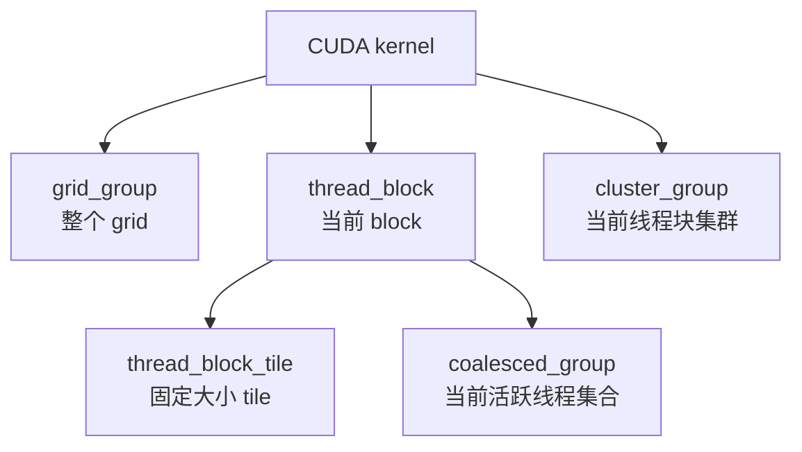

# CUDA Cooperative Groups

这篇笔记整理 CUDA Programming Guide 里的
[Cooperative Groups](https://docs.nvidia.com/cuda/cuda-programming-guide/04-special-topics/cooperative-groups.html)
章节。

先纠正一个容易混淆的点：**Cooperative Groups 不是 Hopper 才引入的特性**。它是 CUDA 里用来描述“协作线程组”的通用编程模型扩展。Hopper / Compute Capability 9.0 相关的重点是 **thread block cluster（线程块集群）**，也就是 `this_cluster()`、`cluster_group` 这一层更大的协作范围。

Cooperative Groups 要解决的问题可以概括成一句话：

> 不再只依赖 `__syncthreads()` 这种整个 block 级别的同步，而是显式表达“哪些线程在协作”。

## 总体模型

传统 CUDA 里最常见的同步方式是：

```cpp
__syncthreads();
```

它的范围固定是**当前 thread block 中所有线程**。如果想做 warp 内同步、半个 block 同步、动态分组同步，很多代码会自己写 mask、shuffle 或自定义同步协议。这类代码通常性能不错，但可维护性差，也容易随着 GPU 架构变化出现隐藏问题。

Cooperative Groups 把“线程协作范围”抽象成一个 group handle（线程组句柄）：

- 线程可以通过句柄知道自己在组内的编号。
- 线程可以通过句柄知道这个组有多少线程。
- 线程可以对这个组执行同步、规约、扫描、异步拷贝等 collective operation（集合操作）。
- 线程组可以继续拆成更小的组，例如把一个 block 拆成多个固定大小的 tile。



这张图里的核心思想是：**先拿到一个父组，再按需要拆成更小的协作组**。

## 头文件和命名空间

使用 Cooperative Groups 通常需要包含：

```cpp
#include <cooperative_groups.h>
```

如果要使用集合操作和异步拷贝，还需要按功能包含额外头文件：

| 功能 | 头文件 |
| --- | --- |
| 基础 group 类型、分组、同步 | `<cooperative_groups.h>` |
| `reduce` | `<cooperative_groups/reduce.h>` |
| `inclusive_scan` / `exclusive_scan` | `<cooperative_groups/scan.h>` |
| `memcpy_async` / `wait` | `<cooperative_groups/memcpy_async.h>` |

常见写法是给命名空间起一个短别名：

```cpp
namespace cg = cooperative_groups;
```

后面的示例都会使用 `cg`。

## 从源码看句柄是什么

`/usr/local/cuda/targets/x86_64-linux/include/cooperative_groups.h` 里最核心的类型关系是：

```cpp
class thread_group;

template <unsigned int TyId>
struct thread_group_base : public thread_group;

class grid_group : public thread_group_base<details::grid_group_id>;
class cluster_group : public thread_group_base<details::cluster_group_id>;
class thread_block : public thread_group_base<details::thread_block_id>;
class coalesced_group : public thread_group_base<details::coalesced_group_id>;

template <unsigned int Size, typename ParentT = void>
class thread_block_tile;
```

所以“句柄”不是一个单独的魔法概念，而是一组具体 C++ 类型：

- `thread_block` 是当前 block 的句柄。
- `grid_group` 是当前 grid 的句柄。
- `cluster_group` 是当前 thread block cluster 的句柄。
- `coalesced_group` 是当前 warp 中活跃线程集合的句柄。
- `thread_block_tile<Size>` 是静态大小 tile 的句柄。
- `thread_group` 是一个通用 group 类型，源码注释说所有 group 都可以转换成它，它内部保存派生 group 所需的数据，并把 API 调用 dispatch 到正确的派生 group。

也就是说，不是“每个句柄都有完全一样的接口”。准确说：

- 部分基础接口在很多 group 上都有，例如 `thread_rank()`、`num_threads()`、`size()`、`sync()`。
- 某些接口只属于特定 group，例如 `thread_block::thread_index()`、`grid_group::num_blocks()`、`cluster_group::map_shared_rank()`、`coalesced_group::shfl()`。

下面按类来整理。

## `thread_group`

**用途**

`thread_group` 是通用线程组类型。源码注释里说它可以容纳所有派生 group 所需的存储，并根据真实 group 类型分派 API 调用。

**类 / 成员来源**

源码里可以看到它内部用一个 `union` 保存不同 group 的数据：

```cpp
class thread_group {
protected:
    struct group_data {
        unsigned int _unused : 1;
        unsigned int type : 7, : 0;
    };

    struct gg_data  {
        details::grid_workspace *gridWs;
    };

    struct tg_data {
        unsigned int is_tiled : 1;
        unsigned int type : 7;
        unsigned int size : 24;
        unsigned int metaGroupSize : 16;
        unsigned int metaGroupRank : 16;
        unsigned int mask;
        unsigned int _res;
    };

    union __align__(8) {
        group_data group;
        tg_data coalesced;
        gg_data grid;
    } _data;

public:
    unsigned long long size() const;
    unsigned long long num_threads() const;
    unsigned long long thread_rank() const;
    void sync() const;
    unsigned int get_type() const;
};
```

**成员变量**

| 成员 | 类型 | 含义 |
| --- | --- | --- |
| `_data.group.type` | bit field | 当前 `thread_group` 实际代表哪类 group。 |
| `_data.grid.gridWs` | `details::grid_workspace*` | `grid_group` 使用的 grid 同步 workspace。 |
| `_data.coalesced.mask` | `unsigned int` | `coalesced_group` / 动态 tile 使用的 warp lane mask。 |
| `_data.coalesced.size` | `unsigned int` | 当前动态 group 的线程数量。 |
| `_data.coalesced.metaGroupSize` | `unsigned int` | 父组被切成多少个子组。 |
| `_data.coalesced.metaGroupRank` | `unsigned int` | 当前子组在父组划分中的编号。 |
| `_data.coalesced.is_tiled` | bit field | 当前 coalesced 数据是否来自 tiled partition。 |

**重要接口**

| 接口 | 原型 | 含义 |
| --- | --- | --- |
| `size` | `unsigned long long size() const` | 返回组内线程数。 |
| `num_threads` | `unsigned long long num_threads() const` | 返回组内线程数，语义上比 `size()` 更直观。 |
| `thread_rank` | `unsigned long long thread_rank() const` | 返回当前调用线程在组内的一维 rank。 |
| `sync` | `void sync() const` | 同步当前组。 |
| `get_type` | `unsigned int get_type() const` | 返回内部 group 类型 id，主要给实现分派使用。 |

**注意点**

- `thread_group` 更像“类型擦除后的通用 group handle”，方便动态 `tiled_partition(parent, tilesz)` 返回。
- 如果你使用模板版 `tiled_partition<Size>(...)`，通常会得到更具体的 `thread_block_tile<Size, ParentT>`。

## `thread_block`

**用途**

`thread_block` 表示当前 kernel 中的一个 thread block。它对应传统 CUDA 里的 `blockIdx` / `threadIdx` / `blockDim` 这一层协作范围。

**构造方式**

```cpp
cg::thread_block block = cg::this_thread_block();
```

源码里的构造函数是私有的，只能通过 friend 函数 `this_thread_block()` 构造：

```cpp
cg::thread_block this_thread_block();
```

**重要接口**

| 接口 | 原型 | 含义 |
| --- | --- | --- |
| `sync` | `static void sync()` | 同步当前 block，底层对应 CTA 同步。 |
| `size` | `static unsigned int size()` | 返回当前 block 的线程数。 |
| `num_threads` | `static unsigned int num_threads()` | 返回当前 block 的线程数。 |
| `thread_rank` | `static unsigned int thread_rank()` | 返回当前线程在 block 内的一维 rank。 |
| `group_index` | `static dim3 group_index()` | 返回当前 block 在 grid 中的三维 index，语义接近 `blockIdx`。 |
| `thread_index` | `static dim3 thread_index()` | 返回当前线程在 block 内的三维 index，语义接近 `threadIdx`。 |
| `group_dim` | `static dim3 group_dim()` | 返回 block 维度，语义接近 `blockDim`。 |
| `dim_threads` | `static dim3 dim_threads()` | 返回 block 的三维线程维度。 |

**生命周期 / 不变量**

- `thread_block` 表示当前线程所在的 block，不是 host 侧对象。
- 所有 block 内线程都可以构造自己的 `thread_block` 句柄。
- `sync()` 要求 block 内参与线程按同步语义到达，否则仍然可能死锁。

## `grid_group`

**用途**

`grid_group` 表示当前 kernel launch 的整个 grid。它允许在 kernel 内表达 grid 级协作，尤其是 grid 级同步。

**构造方式**

```cpp
cg::grid_group grid = cg::this_grid();
```

源码原型：

```cpp
cg::grid_group this_grid();
```

**重要接口**

| 接口 | 原型 | 含义 |
| --- | --- | --- |
| `is_valid` | `bool is_valid() const` | 判断当前 `grid_group` 是否有可用的 grid workspace。 |
| `sync` | `void sync() const` | 同步整个 grid。若 `is_valid() == false`，源码里会 `_CG_ABORT()`。 |
| `size` | `static unsigned long long size()` | 返回 grid 内线程总数。 |
| `num_threads` | `static unsigned long long num_threads()` | 返回 grid 内线程总数。 |
| `thread_rank` | `static unsigned long long thread_rank()` | 返回当前线程在整个 grid 内的一维 rank。 |
| `group_dim` | `static dim3 group_dim()` | 返回 grid 维度。 |
| `dim_blocks` | `static dim3 dim_blocks()` | 返回 grid 中 block 的三维数量。 |
| `num_blocks` | `static unsigned long long num_blocks()` | 返回 grid 中 block 总数。 |
| `block_index` | `static dim3 block_index()` | 返回当前 block 在 grid 中的三维 index。 |
| `block_rank` | `static unsigned long long block_rank()` | 返回当前 block 在 grid 中的一维 rank。 |
| `dim_clusters` | `static dim3 dim_clusters()` | 如果支持 cluster group，返回 cluster 维度。 |
| `num_clusters` | `static unsigned long long num_clusters()` | 如果支持 cluster group，返回 cluster 总数。 |
| `cluster_index` | `static dim3 cluster_index()` | 如果支持 cluster group，返回当前 cluster 的三维 index。 |
| `cluster_rank` | `static unsigned long long cluster_rank()` | 如果支持 cluster group，返回当前 cluster 的一维 rank。 |

**副作用 / 约束**

- 如果要调用 `grid.sync()`，kernel 必须通过 `cudaLaunchCooperativeKernel` 或等价 cooperative launch 发射。
- 设备必须支持 cooperative launch。
- 普通 kernel launch 下构造 `this_grid()` 不等于可以安全做 grid 同步。

## `cluster_group`

**用途**

`cluster_group` 表示 Hopper / Compute Capability 9.0+ 上的 thread block cluster。它把多个 thread block 组织成一个更大的协作组。

**构造方式**

```cpp
cg::cluster_group cluster = cg::this_cluster();
```

源码原型：

```cpp
cg::cluster_group this_cluster();
```

**重要接口**

| 接口 | 原型 | 含义 |
| --- | --- | --- |
| `sync` | `static void sync()` | 同步当前 cluster 内所有线程。 |
| `barrier_arrive` | `static arrival_token barrier_arrive()` | 到达 cluster barrier，返回一个 `arrival_token`。 |
| `barrier_wait` | `static void barrier_wait()` | 等待 cluster barrier。 |
| `barrier_wait` | `static void barrier_wait(arrival_token&&)` | 消费 `barrier_arrive()` 返回的 token 并等待。 |
| `query_shared_rank` | `static unsigned int query_shared_rank(const void* addr)` | 查询某个 shared memory 地址属于 cluster 内哪个 block rank。 |
| `map_shared_rank` | `template <typename T> static T* map_shared_rank(T* addr, int rank)` | 把本 block 的 shared memory 地址映射到 cluster 内指定 block rank 的对应地址。 |
| `block_index` | `static dim3 block_index()` | 当前 block 在 cluster 内的三维 index。 |
| `block_rank` | `static unsigned int block_rank()` | 当前 block 在 cluster 内的一维 rank。 |
| `thread_rank` | `static unsigned int thread_rank()` | 当前线程在 cluster 内的一维 rank。 |
| `dim_blocks` | `static dim3 dim_blocks()` | cluster 内 block 的三维数量。 |
| `num_blocks` | `static unsigned int num_blocks()` | cluster 内 block 总数。 |
| `dim_threads` | `static dim3 dim_threads()` | cluster 内线程的三维维度。 |
| `num_threads` | `static unsigned int num_threads()` | cluster 内线程总数。 |
| `size` | `static unsigned int size()` | `num_threads()` 的旧别名。 |

**注意点**

- `cluster_group::arrival_token` 在源码里是一个空结构体类型：`using arrival_token = struct {};`。它的作用主要是表达 arrive / wait 的配对关系，而不是承载复杂状态。
- `map_shared_rank()` 和 `query_shared_rank()` 是 cluster / distributed shared memory 相关接口，普通 block 内 shared memory 代码通常用不到。
- `this_cluster()` 需要硬件和 launch 配置支持。官方文档说明非 cluster launch 会按 `1x1x1` cluster 处理。

## `coalesced_group`

**用途**

`coalesced_group` 表示当前 warp 中在某个调用点收敛且活跃的线程集合。它不是固定 32 线程，也不保证后续执行中这个集合一直保持不变。

**构造方式**

```cpp
cg::coalesced_group group = cg::coalesced_threads();
```

源码原型：

```cpp
cg::coalesced_group coalesced_threads();
```

从源码实现看，`coalesced_threads()` 使用 `__activemask()` 构造：

```cpp
coalesced_group coalesced_threads() {
    return coalesced_group(__activemask());
}
```

**重要接口**

| 接口 | 原型 | 含义 |
| --- | --- | --- |
| `num_threads` | `unsigned int num_threads() const` | 返回当前活跃线程集合大小。 |
| `size` | `unsigned int size() const` | 返回当前活跃线程集合大小。 |
| `thread_rank` | `unsigned int thread_rank() const` | 返回当前线程在活跃集合内的 rank。 |
| `meta_group_rank` | `unsigned int meta_group_rank() const` | 当前 subgroup 在父分组中的编号。 |
| `meta_group_size` | `unsigned int meta_group_size() const` | 父组被切出的 subgroup 数量。 |
| `sync` | `void sync() const` | 对 mask 内线程执行 `__syncwarp(mask)`。 |
| `shfl` | `template <typename T> T shfl(T&& elem, int srcRank) const` | 从组内 `srcRank` 广播值。 |
| `shfl_down` | `template <typename T> T shfl_down(T&& elem, unsigned int delta) const` | 从组内 rank 增加 `delta` 的线程取值。 |
| `shfl_up` | `template <typename T> T shfl_up(T&& elem, int delta) const` | 从组内 rank 减少 `delta` 的线程取值。 |
| `any` | `int any(int predicate) const` | 组内任一线程 predicate 为真则返回真。 |
| `all` | `int all(int predicate) const` | 组内所有线程 predicate 为真才返回真。 |
| `ballot` | `unsigned int ballot(int predicate) const` | 返回组内 predicate 的压缩 bit mask。 |
| `match_any` | `template <typename T> unsigned int match_any(T val) const` | 支持时，返回组内与当前值匹配的线程 mask。 |
| `match_all` | `template <typename T> unsigned int match_all(T val, int& pred) const` | 支持时，判断组内值是否全相等并返回 mask。 |

**注意点**

- `coalesced_group` 的 rank 是相对于活跃集合的 rank，不一定等于 warp lane id。
- `ballot()` 对非 32 线程 group 会把结果压缩到 group 内 rank 空间。
- 因为它来自 `__activemask()`，所以最好只把它当成“当前调用点”的协作集合。

## `thread_block_tile<Size, ParentT>`

**用途**

`thread_block_tile<Size, ParentT>` 表示从父组里按固定大小切出来的静态 tile。它通常来自模板版 `tiled_partition<Size>(parent)`。

**构造方式**

```cpp
cg::thread_block block = cg::this_thread_block();
cg::thread_block_tile<32> warp_tile = cg::tiled_partition<32>(block);
```

源码原型：

```cpp
template <unsigned int Size, typename ParentT>
cg::thread_block_tile<Size, ParentT> tiled_partition(const ParentT& g);
```

**大小限制**

从源码可以看到两类 tile：

- 单 warp tile：`Size` 支持 `1 / 2 / 4 / 8 / 16 / 32`。
- 多 warp tile：在 C++11 支持路径下，`Size` 支持 `64 / 128 / 256 / 512`，并且需要内部 scratch / barrier 支持。

**重要接口**

| 接口 | 原型 | 含义 |
| --- | --- | --- |
| `thread_rank` | `static unsigned int thread_rank()` | 当前线程在 tile 内的 rank。 |
| `num_threads` | `static constexpr unsigned int num_threads()` | tile 的静态线程数。 |
| `size` | `static constexpr unsigned int size()` | `num_threads()` 的别名。 |
| `sync` | `void sync() const` 或 `static void sync()` | 同步 tile 内线程。 |
| `meta_group_rank` | `unsigned int meta_group_rank() const` | 当前 tile 在父组划分中的编号。 |
| `meta_group_size` | `unsigned int meta_group_size() const` | 父组被切成多少个 tile。 |
| `shfl` | `template <typename T> T shfl(T&& elem, int srcRank) const` | tile 内 shuffle。 |
| `shfl_down` | `template <typename T> T shfl_down(T&& elem, unsigned int delta) const` | tile 内向下 shuffle。 |
| `shfl_up` | `template <typename T> T shfl_up(T&& elem, unsigned int delta) const` | tile 内向上 shuffle。 |
| `shfl_xor` | `template <typename T> T shfl_xor(T&& elem, unsigned int laneMask) const` | tile 内 xor shuffle。 |
| `any` | `int any(int predicate) const` | tile 内任一线程满足条件。 |
| `all` | `int all(int predicate) const` | tile 内所有线程满足条件。 |
| `ballot` | `unsigned int ballot(int predicate) const` | tile 内 ballot，结果按 tile rank 对齐。 |

**注意点**

- 模板版 `tiled_partition<Size>` 的返回类型更精确，编译器知道 tile 大小。
- 动态版 `tiled_partition(parent, tilesz)` 返回 `thread_group` 或 `coalesced_group`，大小在运行期确定。
- 源码注释说明模板版要求父组大小能被 `Size` 整除，否则结果未定义。

## 外层辅助函数

CUDA runtime 会根据 kernel launch 配置隐式创建一些线程组。程序可以通过下面这些接口拿到句柄。

| 接口 | 组范围 | 注意点 |
| --- | --- | --- |
| `cg::this_thread_block()` | 当前 thread block 内的所有线程。 | 最接近传统 `__syncthreads()` 的使用范围。 |
| `cg::this_grid()` | 当前 grid 内的所有线程。 | 需要 cooperative launch 才能做全 grid 同步。 |
| `cg::coalesced_threads()` | 当前 warp 中正在活跃的线程集合。 | 返回的是调用点当下的活跃线程集合，不保证之后一直保持 coalesced。 |
| `cg::this_cluster()` | 当前 thread block cluster 内的线程。 | 需要 Compute Capability 9.0 或更高；非 cluster launch 时按 `1x1x1` cluster 处理。 |

源码还提供了几个外层辅助函数，用来把成员函数调用写成统一形式。

### `cg::sync`

**用途**

同步传入的 group。

**原型**

```cpp
template <class GroupT>
void sync(GroupT const& g);
```

**参数**

| 参数 | 类型 | 含义 |
| --- | --- | --- |
| `g` | `GroupT const&` | 任意支持 `g.sync()` 的 group。 |

**返回值**

| 类型 | 含义 |
| --- | --- |
| `void` | 不返回值。 |

**从源码推断**

实现就是：

```cpp
g.sync();
```

所以 `cg::sync(block)` 和 `block.sync()` 的核心语义一致，只是写法不同。

### `cg::thread_rank`

**用途**

返回当前线程在 group 内的 rank。

**原型**

```cpp
template <class GroupT>
auto thread_rank(GroupT const& g) -> decltype(g.thread_rank());
```

**返回值**

| 类型 | 含义 |
| --- | --- |
| `decltype(g.thread_rank())` | 当前线程在组内的一维 rank。不同 group 的返回类型可能不同，例如 `unsigned int` 或 `unsigned long long`。 |

### `cg::group_size`

**用途**

返回 group 内线程数量。

**原型**

```cpp
template <class GroupT>
auto group_size(GroupT const& g) -> decltype(g.num_threads());
```

**返回值**

| 类型 | 含义 |
| --- | --- |
| `decltype(g.num_threads())` | group 内线程数量。 |

### `cg::tiled_partition`

**用途**

把父 group 划分成一维 row-major 的固定大小子组。

**动态原型**

```cpp
cg::thread_group tiled_partition(const cg::thread_group& parent,
                                 unsigned int tilesz);

cg::thread_group tiled_partition(const cg::thread_block& parent,
                                 unsigned int tilesz);

cg::coalesced_group tiled_partition(const cg::coalesced_group& parent,
                                    unsigned int tilesz);
```

**模板原型**

```cpp
template <unsigned int Size, typename ParentT>
cg::thread_block_tile<Size, ParentT> tiled_partition(const ParentT& g);
```

**参数**

| 参数 | 类型 | 含义 |
| --- | --- | --- |
| `parent` / `g` | 父 group | 被划分的父线程组。 |
| `tilesz` | `unsigned int` | 动态 tile 大小，源码限制为不超过 32 的 2 的幂。 |
| `Size` | 模板参数 | 静态 tile 大小。单 warp tile 支持 `1/2/4/8/16/32`；多 warp tile 支持情况依赖 C++11 路径和内部 scratch。 |

**返回值**

| 形式 | 返回类型 | 含义 |
| --- | --- | --- |
| 动态 `thread_group` 父组 | `thread_group` | 运行期大小 tile 的通用 group 句柄。 |
| 动态 `thread_block` 父组 | `thread_group` | 当前版本返回通用 group。 |
| 动态 `coalesced_group` 父组 | `coalesced_group` | 保留 coalesced group 能力。 |
| 模板版 | `thread_block_tile<Size, ParentT>` | 编译期大小确定的 tile 句柄。 |

**副作用 / 约束**

- `tiled_partition` 是 collective operation，父 group 内所有线程必须参与。
- 源码注释说明实现可能等待父组所有成员都调用该操作后才继续执行。
- 动态版 `tilesz` 必须是 `1..32` 范围内的 2 的幂。
- 模板版要求父组大小能被 `Size` 整除，否则结果未定义。

官方建议：**尽量早地创建隐式 group handle**。也就是说，在 kernel 入口处、分支发生前先拿到句柄，然后在后续代码里复用它。

```cpp
#include <cooperative_groups.h>

namespace cg = cooperative_groups;

/**
 * @brief 展示如何在 kernel 开始处创建 block 级线程组句柄。
 *
 * @param output device 指针，保存每个 block 的线程数量。
 */
__global__ void block_info_kernel(int* output) {
    // 尽量在 kernel 入口处创建 group handle，避免不同线程走到不同创建路径。
    cg::thread_block block = cg::this_thread_block();

    // 只让 block 内 rank 为 0 的线程写一次结果，避免多个线程重复写同一地址。
    if (block.thread_rank() == 0) {
        output[blockIdx.x] = block.num_threads();
    }
}
```

## 创建子线程组

线程组可以通过 partition（划分）操作拆成更小的子组。

| 划分方式 | 含义 |
| --- | --- |
| `tiled_partition` | 把父组按固定大小拆成一系列一维 tile。 |
| `labeled_partition` | 按整数 label 把父组拆成不同一维子组。 |
| `binary_partition` | `labeled_partition` 的二分类版本，label 只能表示两类。 |

最常见的是 `tiled_partition`：

```cpp
#include <cooperative_groups.h>

namespace cg = cooperative_groups;

/**
 * @brief 把一个 thread block 划分成多个 8 线程 tile。
 *
 * @param data device 指针，每个线程读写一个元素。
 */
__global__ void tiled_partition_kernel(int* data) {
    // 父组是当前 thread block。
    cg::thread_block block = cg::this_thread_block();

    // 每 8 个线程组成一个 tile，返回当前线程所属 tile 的句柄。
    cg::thread_block_tile<8> tile = cg::tiled_partition<8>(block);

    // tile_rank 是当前线程在 8 线程 tile 内的编号。
    const int tile_rank = tile.thread_rank();

    // block_rank 是当前线程在整个 thread block 内的编号。
    const int block_rank = block.thread_rank();

    // 这里只是演示：每个线程写入自己在 tile 内的编号。
    data[blockIdx.x * block.num_threads() + block_rank] = tile_rank;
}
```

重要约束：**划分线程组是 collective operation（集合操作）**。父组里的所有线程都必须参与。如果只有部分线程进入分支并调用 `tiled_partition`，就可能导致死锁或数据错误。

错误模式大概是这样：

```cpp
if (threadIdx.x < 64) {
    // 危险：不是整个 block 都进入了这个分支。
    // 如果 parent group 是整个 block，这种分组方式可能破坏 collective 语义。
    auto tile = cg::tiled_partition<32>(cg::this_thread_block());
}
```

更稳妥的写法是先在统一路径上创建组，再在组内按 `thread_rank()` 做后续条件判断。

## 同步

### `sync`

`cg::sync(group)` 用来同步一个线程组。它的语义和 `__syncthreads()` 类似，但同步范围由传入的 group 决定。

它提供两个关键保证：

- 同步点之前，组内线程做过的内存访问，在同步点之后对组内其他线程可见。
- 组内所有线程都到达同步点后，任何线程才可以继续执行后面的代码。

```cpp
#include <cooperative_groups.h>

namespace cg = cooperative_groups;

/**
 * @brief 使用 Cooperative Groups 做 block 级共享内存同步。
 *
 * @param input device 输入数组。
 * @param output device 输出数组。
 */
__global__ void block_sync_kernel(const int* input, int* output) {
    extern __shared__ int shared_data[];

    // 当前 block 内所有线程组成一个协作组。
    cg::thread_block block = cg::this_thread_block();

    // 每个线程把一个全局内存元素搬到 shared memory。
    shared_data[threadIdx.x] = input[blockIdx.x * blockDim.x + threadIdx.x];

    // 等待整个 block 完成 shared memory 写入。
    cg::sync(block);

    // 同步之后，其他线程写入的 shared memory 数据才可以安全读取。
    output[blockIdx.x * blockDim.x + threadIdx.x] =
        shared_data[block.num_threads() - 1 - threadIdx.x];
}
```

### barrier

Cooperative Groups 还提供类似 `cuda::barrier` 的 barrier API。它适合更细的到达 / 等待拆分，例如先发出到达信号，然后做一些本地计算来隐藏同步延迟。

关键接口：

| 接口 | 含义 |
| --- | --- |
| `barrier_arrive()` | 当前线程到达当前 phase 的 barrier，返回 `arrival_token`。 |
| `barrier_wait(token)` | 等待组内线程都完成 `barrier_arrive()`，并消费 token。 |

注意点：

- 每个 phase 中，组内所有线程都必须调用一次 `barrier_arrive()` 和对应的 `barrier_wait()`。
- `barrier_arrive()` 和 `barrier_wait()` 之间不能对同一个 group 使用其他 collective operation。
- `barrier_wait()` 保证所有线程调用过 `barrier_arrive()`，但不表示所有线程都已经执行到 `barrier_wait()`。

Hopper 的 `cluster_group` 常见会和 barrier 一起使用，用来同步同一个 thread block cluster 内的多个 block：

```cpp
#include <cooperative_groups.h>
#include <cuda/std/utility>

namespace cg = cooperative_groups;

/**
 * @brief 演示 Hopper thread block cluster 内的 barrier 用法。
 *
 * 这个 kernel 需要在支持 thread block cluster 的设备上运行。
 * `__cluster_dims__` 指定一个 cluster 中包含多少个 block。
 *
 * @param data device 指针，示例中用于保存每个 block 的局部结果。
 */
__global__ __cluster_dims__(2, 1, 1)
void cluster_barrier_kernel(int* data) {
    // 当前 block 级协作组，用于 block 内局部工作。
    cg::thread_block block = cg::this_thread_block();

    // 当前 thread block cluster 级协作组，需要 Compute Capability 9.0+。
    cg::cluster_group cluster = cg::this_cluster();

    // 示例：每个 block 的第一个线程写入一个局部结果。
    if (block.thread_rank() == 0) {
        data[blockIdx.x] = blockIdx.x;
    }

    // 到达 cluster barrier，并拿到等待阶段需要消费的 token。
    auto token = cluster.barrier_arrive();

    // 在等待其他 block 到达时，可以做不依赖 cluster 共享数据的本地工作。
    int local_value = static_cast<int>(block.thread_rank());

    // 等待 cluster 内其他 block 都完成 arrive。
    cluster.barrier_wait(cuda::std::move(token));

    // barrier 之后，再访问依赖 cluster 内其他 block 初始化的数据才安全。
    if (block.thread_rank() == 0) {
        data[blockIdx.x] += local_value;
    }
}
```

## 集合操作

Cooperative Groups 提供一些常见 parallel primitive（并行原语）。这些操作都要求指定组内线程共同参与。

一个很重要的规则是：除非 API 明确允许不同线程传入不同参数，否则同一个 group 内所有线程必须给 collective operation 传入一致的对应参数，否则行为未定义。

### `reduce`

`cg::reduce(group, value, op)` 对组内每个线程提供的 `value` 做规约。

**头文件**

```cpp
#include <cooperative_groups/reduce.h>
```

**原型**

源码公开入口在 `cooperative_groups/details/reduce.h` 中，常用形式可以整理成：

```cpp
template <typename TyGroup, typename TyVal, typename TyFn>
auto reduce(const TyGroup& group, TyVal&& val, TyFn&& op)
    -> decltype(op(val, val));
```

**参数**

| 参数 | 类型 | 含义 |
| --- | --- | --- |
| `group` | `const TyGroup&` | 执行规约的线程组。源码里明确支持 `thread_block_tile<...>` 和 `coalesced_group` 等 tile / coalesced 类型。 |
| `val` | `TyVal&&` | 当前线程提供给规约的输入值。 |
| `op` | `TyFn&&` | 二元规约算子，例如 `cg::plus<int>()`。 |

**返回值**

| 类型 | 含义 |
| --- | --- |
| `decltype(op(val, val))` | 组内规约结果。每个参与线程都会得到返回值。 |

常见规约算子：

| 算子 | 含义 |
| --- | --- |
| `cg::plus<T>()` | 求和。 |
| `cg::less<T>()` | 求最小值。 |
| `cg::greater<T>()` | 求最大值。 |
| `cg::bit_and<T>()` | 按位与。 |
| `cg::bit_or<T>()` | 按位或。 |
| `cg::bit_xor<T>()` | 按位异或。 |

这些算子在 `cooperative_groups/details/functional.h` 里定义。比如：

```cpp
template <typename Ty>
struct plus;

template <typename Ty>
struct less;

template <typename Ty>
struct greater;

template <typename Ty>
struct bit_and;

template <typename Ty>
struct bit_xor;

template <typename Ty>
struct bit_or;
```

**副作用 / 约束**

- `reduce` 是 collective operation，指定 group 内线程必须共同参与。
- 算子的输入类型需要和 `val` 匹配；源码里对部分算子路径有 `static_assert` 检查。
- 官方文档说明：在硬件支持时，规约会使用硬件加速；硬件加速需要 Compute Capability 8.0 或更高，并且只有 4 字节类型会被硬件加速。

```cpp
#include <cooperative_groups.h>
#include <cooperative_groups/reduce.h>

namespace cg = cooperative_groups;

/**
 * @brief 使用 Cooperative Groups 做 block 级求和规约。
 *
 * @param input device 输入数组，每个线程读取一个元素。
 * @param block_sums device 输出数组，每个 block 输出一个求和结果。
 */
__global__ void block_reduce_sum_kernel(const int* input, int* block_sums) {
    // 当前 thread block 作为规约范围。
    cg::thread_block block = cg::this_thread_block();

    // 每个线程提供一个待规约的输入值。
    const int value = input[blockIdx.x * blockDim.x + threadIdx.x];

    // 对整个 block 的 value 做求和规约。
    const int sum = cg::reduce(block, value, cg::plus<int>());

    // 只让组内 rank 为 0 的线程写出规约结果。
    if (block.thread_rank() == 0) {
        block_sums[blockIdx.x] = sum;
    }
}
```

### `inclusive_scan` 和 `exclusive_scan`

scan（扫描 / 前缀和）会根据组内线程顺序计算前缀结果。

**头文件**

```cpp
#include <cooperative_groups/scan.h>
```

**原型**

源码公开入口在 `cooperative_groups/details/scan.h` 中，常用形式包括：

```cpp
template <typename TyGroup, typename TyVal, typename TyFn>
auto inclusive_scan(const TyGroup& group, TyVal&& val, TyFn&& op)
    -> decltype(op(val, val));

template <typename TyGroup, typename TyVal>
remove_qual<TyVal> inclusive_scan(const TyGroup& group, TyVal&& val);

template <typename TyGroup, typename TyVal, typename TyFn>
auto exclusive_scan(const TyGroup& group, TyVal&& val, TyFn&& op)
    -> decltype(op(val, val));

template <typename TyGroup, typename TyVal>
remove_qual<TyVal> exclusive_scan(const TyGroup& group, TyVal&& val);
```

| 接口 | 含义 |
| --- | --- |
| `cg::inclusive_scan(group, value, op)` | 包含当前线程 `value` 的前缀扫描。 |
| `cg::exclusive_scan(group, value, op)` | 不包含当前线程 `value` 的前缀扫描。 |
| `cg::inclusive_scan(group, value)` | 默认使用 `cg::plus<T>()` 做 inclusive scan。 |
| `cg::exclusive_scan(group, value)` | 默认使用 `cg::plus<T>()` 做 exclusive scan。 |

**参数**

| 参数 | 类型 | 含义 |
| --- | --- | --- |
| `group` | `const TyGroup&` | 执行扫描的线程组。 |
| `val` | `TyVal&&` | 当前线程提供的输入值。 |
| `op` | `TyFn&&` | 二元扫描算子。省略时使用 `cg::plus<T>()`。 |

**返回值**

| 类型 | 含义 |
| --- | --- |
| `decltype(op(val, val))` 或 `remove_qual<TyVal>` | 当前线程对应的前缀扫描结果。 |

**副作用 / 约束**

- scan 是 collective operation，group 内线程必须共同参与。
- 返回值是每个线程自己的前缀结果，不是只在 rank 0 上有效。

```cpp
#include <cooperative_groups.h>
#include <cooperative_groups/scan.h>

namespace cg = cooperative_groups;

/**
 * @brief 使用 Cooperative Groups 做 block 内 exclusive scan。
 *
 * @param input device 输入数组。
 * @param output device 输出数组，保存每个 block 内的前缀和结果。
 */
__global__ void block_exclusive_scan_kernel(const int* input, int* output) {
    // 当前 block 是 scan 的执行范围。
    cg::thread_block block = cg::this_thread_block();

    // 每个线程读取自己对应的输入值。
    const int value = input[blockIdx.x * blockDim.x + threadIdx.x];

    // 计算不包含当前线程 value 的前缀和。
    const int prefix = cg::exclusive_scan(block, value, cg::plus<int>());

    // 写回当前线程对应的前缀和。
    output[blockIdx.x * blockDim.x + threadIdx.x] = prefix;
}
```

### `invoke_one`

`cg::invoke_one(group, callable, args...)` 用于让组内**某一个任意线程**代表整个组执行一段串行逻辑。

相关接口：

| 接口 | 含义 |
| --- | --- |
| `cg::invoke_one(group, callable, args...)` | 选择组内一个线程执行 callable。 |
| `cg::invoke_one_broadcast(group, callable, args...)` | 选择一个线程执行 callable，并把返回值广播给整个组。 |

注意：官方文档明确说明，被选择的线程不保证确定。因此不要依赖“总是 rank 0”这样的假设。

```cpp
#include <cooperative_groups.h>
#include <cstdio>

namespace cg = cooperative_groups;

/**
 * @brief 演示让 block 内一个线程执行串行打印逻辑。
 */
__global__ void invoke_one_kernel() {
    // 当前 block 作为 invoke_one 的协作范围。
    cg::thread_block block = cg::this_thread_block();

    // 只选择 block 内某一个线程执行 lambda。
    cg::invoke_one(block, []() {
        printf("Hello from one thread in the block\n");
    });

    // 等待打印动作完成，避免后续代码和打印逻辑交错。
    cg::sync(block);
}
```

`invoke_one` 的 callable 内部不能和调用 group 内的其他线程通信或同步，但可以和 group 外的线程通信。

## 异步数据搬运

Cooperative Groups 也提供 `memcpy_async`，用于从 global memory 异步搬运数据到 shared memory。它的典型用途是 **prefetch（预取）**：提前把后面要用的数据搬到 shared memory，然后在等待数据期间执行一些不依赖这批数据的计算。

**头文件**

```cpp
#include <cooperative_groups/memcpy_async.h>
```

**原型**

源码公开入口在 `cooperative_groups/details/async.h` 中，常用重载包括：

```cpp
template <class TyGroup, typename TyElem, typename TySizeT>
void memcpy_async(const TyGroup& group,
                  TyElem* __restrict__ dst,
                  const TyElem* __restrict__ src,
                  const TySizeT& count);

template <class TyGroup, class TyElem, typename DstLayout, typename SrcLayout>
void memcpy_async(const TyGroup& group,
                  TyElem* __restrict__ dst,
                  const DstLayout& dstLayout,
                  const TyElem* __restrict__ src,
                  const SrcLayout& srcLayout);

template <unsigned int Stage, class TyGroup>
void wait_prior(const TyGroup& group);

template <class TyGroup>
void wait(const TyGroup& group);
```

**参数**

| 参数 | 类型 | 含义 |
| --- | --- | --- |
| `group` | `const TyGroup&` | 参与异步拷贝和等待的线程组。 |
| `dst` | `TyElem* __restrict__` | 目标地址，典型场景是 shared memory。 |
| `src` | `const TyElem* __restrict__` | 源地址，典型场景是 global memory。 |
| `count` | `const TySizeT&` | 连续 1D 拷贝的数量。源码路径名叫 `_memcpy_async_bytes`，官方示例常传 `sizeof(T)` 表示字节数。 |
| `dstLayout` / `srcLayout` | layout 类型 | layout 重载使用的目标 / 源布局；源码注释说明该路径按 datum 大小的块计数，不是按字节计数。 |
| `Stage` | 模板参数 | `wait_prior<Stage>` 等待之前第 `Stage` 阶段的异步拷贝。 |

**返回值**

| 类型 | 含义 |
| --- | --- |
| `void` | 这些接口不返回数据；数据通过 shared memory / 目标地址体现。 |

**接口行为**

| 接口 | 含义 |
| --- | --- |
| `cg::memcpy_async(group, dst, src, count)` | 发起由 group 协作完成的异步拷贝，并在内部调用 `__pipeline_commit()` 提交。 |
| `cg::memcpy_async(group, dst, dstLayout, src, srcLayout)` | 按 layout 描述发起异步拷贝。 |
| `cg::wait_prior<Stage>(group)` | 等待之前某个 pipeline stage，并在等待后调用 `group.sync()`。 |
| `cg::wait(group)` | 等待所有已经提交的 `memcpy_async`，并在等待后调用 `group.sync()`。 |

**副作用 / 约束**

- `memcpy_async` 会发起异步数据搬运，并提交到 pipeline。
- `wait(group)` 不只是 pipeline wait；源码里还会调用 `group.sync()`。
- `wait` 前不能读取依赖这次异步拷贝的 shared memory 数据。
- 官方文档说明：只有在源地址是 global memory、目标地址是 shared memory，并且两者至少 4 字节对齐时，才走异步路径；为了性能推荐 16 字节对齐。

```cpp
#include <cooperative_groups.h>
#include <cooperative_groups/memcpy_async.h>

namespace cg = cooperative_groups;

/**
 * @brief 使用 Cooperative Groups 异步预取 global memory 到 shared memory。
 *
 * @param input device 输入数组，数据位于 global memory。
 * @param output device 输出数组。
 */
__global__ void async_copy_kernel(const int* input, int* output) {
    extern __shared__ int shared_data[];

    // 当前 block 作为异步拷贝的协作组。
    cg::thread_block block = cg::this_thread_block();

    // 每个线程负责一个 int 的预取位置。
    const int local_idx = block.thread_rank();
    const int global_idx = blockIdx.x * block.num_threads() + local_idx;

    // 发起 global memory 到 shared memory 的异步拷贝。
    cg::memcpy_async(block,
                     shared_data + local_idx,
                     input + global_idx,
                     sizeof(int));

    // 这里可以执行不依赖 shared_data 的计算，用来隐藏拷贝延迟。
    const int independent_value = global_idx;

    // 等待异步拷贝完成；调用 wait 之前不能读取 shared_data 中的预取数据。
    cg::wait(block);

    // wait 之后，预取数据已经可以安全使用。
    output[global_idx] = shared_data[local_idx] + independent_value;
}
```

对齐约束：

- `memcpy_async` 只有在 **源地址是 global memory、目标地址是 shared memory**，并且两者至少 **4 字节对齐**时才是异步的。
- 为了获得更好的性能，官方推荐 global memory 和 shared memory 地址都满足 **16 字节对齐**。

## 大范围线程组和 `cudaLaunchCooperativeKernel`

Cooperative Groups 可以表达整个 grid 级别的大线程组，但有一个关键限制：如果 kernel 需要跨 block 做全 grid 同步，必须使用 cooperative launch。

对应 runtime API 是：

```cpp
cudaError_t cudaLaunchCooperativeKernel(
    const void* func,
    dim3 gridDim,
    dim3 blockDim,
    void** args,
    size_t sharedMem = 0,
    cudaStream_t stream = 0);
```

**用途**

启动一个单设备 cooperative kernel。这个 launch 会保证：如果 API 调用成功，给定数量的 thread block 会在目标设备上一起启动，从而支持 kernel 内的 grid 级协作和同步。

**参数**

| 参数 | 类型 | 含义 |
| --- | --- | --- |
| `func` | `const void*` | kernel 函数指针。 |
| `gridDim` | `dim3` | grid 维度。cooperative kernel 的 grid 规模必须满足设备可同时驻留的限制。 |
| `blockDim` | `dim3` | 每个 block 的线程维度。 |
| `args` | `void**` | kernel 参数数组，按 kernel 参数顺序传入每个参数地址。 |
| `sharedMem` | `size_t` | 每个 block 的动态 shared memory 字节数。 |
| `stream` | `cudaStream_t` | 发射 kernel 的 CUDA stream。 |

**返回值**

| 类型 | 含义 |
| --- | --- |
| `cudaError_t` | 返回 CUDA runtime 错误码。成功时为 `cudaSuccess`。 |

使用前通常要查询设备是否支持 cooperative launch：

```cpp
#include <cuda_runtime.h>
#include <cstdio>

/**
 * @brief 检查当前设备是否支持 cooperative launch。
 *
 * @param device_id CUDA 设备编号。
 * @return 支持返回 true，否则返回 false。
 */
bool supports_cooperative_launch(int device_id) {
    int supports_coop_launch = 0;

    // 查询设备属性 cudaDevAttrCooperativeLaunch。
    cudaError_t status = cudaDeviceGetAttribute(&supports_coop_launch,
                                                cudaDevAttrCooperativeLaunch,
                                                device_id);
    if (status != cudaSuccess) {
        std::fprintf(stderr,
                     "cudaDeviceGetAttribute failed: %s\n",
                     cudaGetErrorString(status));
        return false;
    }

    return supports_coop_launch != 0;
}
```

示例 launch：

```cpp
#include <cuda_runtime.h>
#include <cstdio>

/**
 * @brief 示例 cooperative kernel。
 *
 * @param data device 指针，保存每个线程写出的值。
 */
__global__ void cooperative_kernel(int* data) {
    // 这里省略具体 grid 同步逻辑，重点展示 cooperative launch 的 host 侧写法。
    const int global_idx = blockIdx.x * blockDim.x + threadIdx.x;
    data[global_idx] = global_idx;
}

/**
 * @brief 使用 cudaLaunchCooperativeKernel 启动 cooperative kernel。
 *
 * @param data device 指针，作为 kernel 参数传入。
 * @param grid_dim grid 维度。
 * @param block_dim block 维度。
 * @param stream CUDA stream。
 * @return CUDA runtime 错误码。
 */
cudaError_t launch_cooperative_kernel(int* data,
                                      dim3 grid_dim,
                                      dim3 block_dim,
                                      cudaStream_t stream) {
    // cooperative launch 的参数需要按 kernel 参数顺序组织成 void* 数组。
    void* kernel_args[] = {&data};

    return cudaLaunchCooperativeKernel(
        reinterpret_cast<const void*>(cooperative_kernel),
        grid_dim,
        block_dim,
        kernel_args,
        0,
        stream);
}
```

官方文档中还提到：

- 需要先确认设备支持 `cudaDevAttrCooperativeLaunch`。
- 只支持 Compute Capability 6.0 或更高的设备。
- CUDA 13 起，Cooperative Groups 不再用于多设备同步；多设备 launch 相关 API 和引用已经移除。

## Hopper 相关：`cluster_group`

Hopper 架构引入 thread block cluster，让多个 thread block 可以组成一个更大的硬件调度单元。Cooperative Groups 通过 `cg::this_cluster()` 暴露当前 cluster 的句柄。

`cluster_group` 的使用场景通常是：

- cluster 内多个 block 需要协作。
- block 之间需要在 kernel 内做同步。
- 代码使用 distributed shared memory（分布式 shared memory）或 cluster 级共享数据结构。

### Distributed Shared Memory

H100 白皮书里把 Hopper 的一个关键能力称为 **Distributed Shared Memory，简称 DSMEM（分布式 shared memory）**。

传统 CUDA 里，shared memory 的作用域基本是一个 thread block：block A 想把数据交给 block B，通常需要先写到 global memory，再让 block B 从 global memory 读回来。这样能工作，但代价是延迟高、带宽路径也更重。

引入 thread block cluster 之后，同一个 cluster 内的多个 block 可以直接访问彼此所在 SM 上的 shared memory。也就是说：

- 每个 block 仍然有自己的 shared memory 段。
- 这些 shared memory 段在逻辑上组成了一个 cluster 级的分布式地址空间。
- 同一个 cluster 内的线程可以通过普通 load / store / atomic 访问其他 block 的 shared memory。
- 数据交换不再必须绕到 global memory。
- Hopper 为 cluster 内 SM 到 SM 的访问提供了专门网络，因此远端 DSMEM 访问延迟比经由 global memory 交换数据低得多。

从 CUDA 编程模型看，DSMEM 的关键是：**cluster 内所有 block 的 shared memory 段会映射到每个线程都能引用的 generic address space（通用地址空间）里**。用户不需要自己手写底层地址编码，而是通过 Cooperative Groups 的接口构造指向其他 block shared memory 的普通指针：

```cpp
cg::cluster_group cluster = cg::this_cluster();

// 把本 block 的 shared memory 地址映射到 cluster 内 rank 号 block 的对应地址。
int* remote_ptr = cluster.map_shared_rank(&local_value, rank);
```

这里的 `remote_ptr` 可以像普通指针一样用于 load / store / atomic。不过它指向的是**同一个 cluster 内另一个 block 的 shared memory 段**。

所以 DSMEM 的最小心智模型是：

> cluster 内每个 block 各自贡献一段 shared memory，这些段拼成一个逻辑上可互访的分布式 shared memory 空间。`cluster_group` 负责告诉你“我在 cluster 内是谁”，`map_shared_rank()` 负责把本地 shared memory 地址映射到另一个 block 的对应 shared memory 地址。

这也是为什么前面说 `cluster_group` 不只是“更大的同步组”。它还给了 block 间交换数据的新路径：**用 DSMEM 直接交换，而不是写回 global memory 再读回来**。

最小心智模型：


`thread_block` 解决 block 内协作，`cluster_group` 解决 cluster 内多个 block 的协作，`grid_group` 则描述整个 grid。

### 使用流程

使用 `cluster_group` 时，通常按这个顺序写：

1. **决定 cluster 形状**：例如一个 cluster 里有 `2 x 1 x 1` 个 block。
2. **配置 launch**：可以用 kernel 上的 `__cluster_dims__(x, y, z)` 静态指定，也可以用 `cudaLaunchKernelEx` 动态指定。
3. **kernel 内拿句柄**：调用 `cg::this_cluster()` 得到当前线程所在 cluster 的句柄。
4. **查询 cluster 内坐标**：用 `cluster.block_rank()`、`cluster.num_blocks()`、`cluster.thread_rank()` 等接口。
5. **做 cluster 级同步或 DSM 访问**：用 `cluster.sync()` / `barrier_arrive()` / `barrier_wait()`，或者用 `map_shared_rank()` 访问其他 block 的 shared memory。

这里要特别注意：**`gridDim` 仍然表示 block 数量，不是 cluster 数量**。如果 `clusterDim.x = 2`，并且 `gridDim.x = 8`，那么逻辑上会形成 4 个 cluster，每个 cluster 包含 2 个 block。通常要求 grid 维度能被 cluster 维度整除。

### `this_cluster()`

**用途**

获取当前线程所在 thread block cluster 的 group handle。

**原型**

```cpp
cg::cluster_group cluster = cg::this_cluster();
```

**返回值**

| 类型 | 含义 |
| --- | --- |
| `cg::cluster_group` | 当前线程块集群的 group handle。 |

**约束**

- 需要 Compute Capability 9.0 或更高。
- 如果 kernel 不是 cluster launch，官方文档说明会假设 cluster 形状为 `1x1x1`。
- cluster 级同步仍然要求 cluster 内参与线程按 collective 语义到达对应同步点。

### 静态指定 cluster 维度

最直接的写法是在 kernel 声明上使用 `__cluster_dims__(x, y, z)`。

```cpp
#include <cooperative_groups.h>

namespace cg = cooperative_groups;

/**
 * @brief 使用静态 cluster 维度的示例 kernel。
 *
 * `__cluster_dims__(2, 1, 1)` 表示每个 cluster 包含 2 个 thread block。
 *
 * @param block_ranks device 输出数组，保存每个 block 在 cluster 内的 rank。
 */
__global__ __cluster_dims__(2, 1, 1)
void static_cluster_kernel(int* block_ranks) {
    // 当前 block 级句柄，用于 block 内选择一个线程写结果。
    cg::thread_block block = cg::this_thread_block();

    // 当前 cluster 级句柄，用于查询 block 在 cluster 内的编号。
    cg::cluster_group cluster = cg::this_cluster();

    // 只让每个 block 的第一个线程写一次，避免同一个 block 内重复写。
    if (block.thread_rank() == 0) {
        // block_rank 是当前 block 在 cluster 内的一维编号，范围是 [0, num_blocks)。
        block_ranks[blockIdx.x] = static_cast<int>(cluster.block_rank());
    }
}
```

host 侧正常用三尖括号 launch 即可：

```cpp
/**
 * @brief 启动静态 cluster 维度的 kernel。
 *
 * @param output device 指针，保存每个 block 的 cluster 内 rank。
 */
void launch_static_cluster_kernel(int* output) {
    // 这里 gridDim.x 是 block 数。由于 clusterDim.x = 2，gridDim.x 最好是 2 的倍数。
    dim3 grid_dim(8);
    dim3 block_dim(256);

    // cluster 维度已经写在 kernel 声明的 __cluster_dims__ 上。
    static_cluster_kernel<<<grid_dim, block_dim>>>(output);
}
```

这种写法适合 cluster 形状固定的 kernel。优点是简单，缺点是 cluster 维度写死在 kernel 声明上。

### 动态指定 cluster 维度

如果希望 launch 时再决定 cluster 形状，可以使用 `cudaLaunchKernelEx` 和 `cudaLaunchAttributeClusterDimension`。

相关 host 侧类型在 `driver_types.h` 里：

```cpp
typedef struct cudaLaunchAttribute_st {
    cudaLaunchAttributeID id;
    cudaLaunchAttributeValue val;
} cudaLaunchAttribute;

typedef struct cudaLaunchConfig_st {
    dim3 gridDim;
    dim3 blockDim;
    size_t dynamicSmemBytes;
    cudaStream_t stream;
    cudaLaunchAttribute* attrs;
    unsigned int numAttrs;
} cudaLaunchConfig_t;
```

`cudaLaunchAttributeClusterDimension` 对应的值写在 `cudaLaunchAttributeValue::clusterDim` 中：

```cpp
cudaLaunchAttribute attr{};
attr.id = cudaLaunchAttributeClusterDimension;
attr.val.clusterDim.x = 2;
attr.val.clusterDim.y = 1;
attr.val.clusterDim.z = 1;
```

完整示例：

```cpp
#include <cuda_runtime.h>
#include <cooperative_groups.h>

namespace cg = cooperative_groups;

/**
 * @brief 使用动态 launch attribute 指定 cluster 维度的 kernel。
 *
 * @param block_ranks device 输出数组，保存每个 block 在 cluster 内的 rank。
 */
__global__ void dynamic_cluster_kernel(int* block_ranks) {
    // 获取当前 block 句柄。
    cg::thread_block block = cg::this_thread_block();

    // 获取当前 cluster 句柄。cluster 形状由 host 侧 launch attribute 指定。
    cg::cluster_group cluster = cg::this_cluster();

    if (block.thread_rank() == 0) {
        block_ranks[blockIdx.x] = static_cast<int>(cluster.block_rank());
    }
}

/**
 * @brief 使用 cudaLaunchKernelEx 动态设置 cluster 维度。
 *
 * @param output device 指针，保存每个 block 的 cluster 内 rank。
 * @param stream CUDA stream。
 * @return CUDA runtime 错误码。
 */
cudaError_t launch_dynamic_cluster_kernel(int* output, cudaStream_t stream) {
    // 设置 cluster 维度。这里表示每 2 个 block 组成一个 cluster。
    cudaLaunchAttribute attr{};
    attr.id = cudaLaunchAttributeClusterDimension;
    attr.val.clusterDim.x = 2;
    attr.val.clusterDim.y = 1;
    attr.val.clusterDim.z = 1;

    // cudaLaunchConfig_t 仍然用 gridDim 表示总 block 数。
    cudaLaunchConfig_t config{};
    config.gridDim = dim3(8);
    config.blockDim = dim3(256);
    config.dynamicSmemBytes = 0;
    config.stream = stream;
    config.attrs = &attr;
    config.numAttrs = 1;

    // C++ 模板版 cudaLaunchKernelEx 可以直接传 kernel 参数。
    return cudaLaunchKernelEx(&config, dynamic_cluster_kernel, output);
}
```

这种写法适合一个 kernel 想在不同问题规模或设备上尝试不同 cluster 形状的场景。

### 查询 cluster 内坐标

`cluster_group` 最常用的一组接口是查询当前 block / thread 在 cluster 内的位置：

```cpp
cg::cluster_group cluster = cg::this_cluster();

unsigned int block_rank = cluster.block_rank();
dim3 block_index = cluster.block_index();
unsigned int num_blocks = cluster.num_blocks();
dim3 dim_blocks = cluster.dim_blocks();

unsigned int thread_rank = cluster.thread_rank();
unsigned int num_threads = cluster.num_threads();
```

这些值的语义是：

| 接口 | 语义 |
| --- | --- |
| `block_rank()` | 当前 block 在 cluster 内的一维编号。 |
| `block_index()` | 当前 block 在 cluster 内的三维坐标。 |
| `num_blocks()` | 当前 cluster 中 block 总数。 |
| `dim_blocks()` | 当前 cluster 中 block 的三维布局。 |
| `thread_rank()` | 当前线程在整个 cluster 内的一维编号。 |
| `num_threads()` | 当前 cluster 中线程总数。 |

这些接口适合做 cluster 内任务划分。例如：让 `block_rank == 0` 的 block 负责归并，让其他 block 负责生产局部结果。

### cluster 级同步

最简单的同步方式是 `cluster.sync()`：

```cpp
/**
 * @brief 演示 cluster 内多个 block 的同步点。
 *
 * @param flags device 输出数组，保存每个 block 的状态。
 */
__global__ __cluster_dims__(2, 1, 1)
void cluster_sync_kernel(int* flags) {
    cg::thread_block block = cg::this_thread_block();
    cg::cluster_group cluster = cg::this_cluster();

    // 每个 block 的第一个线程先写一个局部状态。
    if (block.thread_rank() == 0) {
        flags[blockIdx.x] = 1;
    }

    // 等待同一个 cluster 内所有 block 都执行完上面的写入。
    cluster.sync();

    // 同步后，同一个 cluster 内的 block 可以假设彼此已经到达这个点。
    if (block.thread_rank() == 0 && cluster.block_rank() == 0) {
        flags[blockIdx.x] = static_cast<int>(cluster.num_blocks());
    }
}
```

如果想拆成“到达”和“等待”两个阶段，可以使用 `barrier_arrive()` / `barrier_wait()`：

```cpp
/**
 * @brief 使用 arrive / wait 拆分 cluster barrier。
 *
 * @param output device 输出数组。
 */
__global__ __cluster_dims__(2, 1, 1)
void cluster_arrive_wait_kernel(int* output) {
    cg::thread_block block = cg::this_thread_block();
    cg::cluster_group cluster = cg::this_cluster();

    // 宣告当前线程已经到达 barrier。
    auto token = cluster.barrier_arrive();

    // 在等待其他线程到达时，可以做不依赖 cluster 共享状态的本地计算。
    int local_value = static_cast<int>(block.thread_rank());

    // 消费 token 并等待 cluster 内其他线程到达。
    cluster.barrier_wait(cuda::std::move(token));

    if (block.thread_rank() == 0) {
        output[blockIdx.x] = local_value + static_cast<int>(cluster.block_rank());
    }
}
```

注意：`barrier_arrive()` 和 `barrier_wait()` 之间不要插入同一个 group 上的其他 collective operation。

### 访问其他 block 的 shared memory

Hopper thread block cluster 的一个关键能力是 distributed shared memory（分布式 shared memory）。每个 block 仍然有自己的 shared memory，但同一个 cluster 内的 block 可以通过 `map_shared_rank()` 把“本 block 的 shared memory 地址”映射到其他 block 的对应 shared memory 地址。

核心接口：

```cpp
template <typename T>
T* cluster.map_shared_rank(T* addr, int rank);

unsigned int cluster.query_shared_rank(const void* addr);
```

一个最小示例：

```cpp
#include <cooperative_groups.h>

namespace cg = cooperative_groups;

/**
 * @brief 演示同一个 cluster 内 block 之间通过 DSM 读取 shared memory。
 *
 * 每个 block 在自己的 shared memory 中写入一个整数。
 * cluster 同步后，cluster 内 rank 0 的 block 读取所有 block 的这个整数并求和。
 *
 * @param cluster_sums device 输出数组，每个 cluster 写出一个求和结果。
 */
__global__ __cluster_dims__(2, 1, 1)
void distributed_shared_memory_kernel(int* cluster_sums) {
    // 每个 block 都有自己的 shared memory 实例。
    __shared__ int local_value;

    cg::thread_block block = cg::this_thread_block();
    cg::cluster_group cluster = cg::this_cluster();

    // 每个 block 的第一个线程初始化本 block 的 shared memory。
    if (block.thread_rank() == 0) {
        local_value = static_cast<int>(cluster.block_rank()) + 1;
    }

    // 先做 block 内同步，保证本 block 的 shared memory 初始化完成。
    block.sync();

    // 再做 cluster 同步，保证 cluster 内所有 block 都完成 shared memory 初始化。
    cluster.sync();

    // 只让 cluster 内 block_rank 为 0 的 block 负责读取其他 block 的 shared memory。
    if (cluster.block_rank() == 0 && block.thread_rank() == 0) {
        int sum = 0;

        for (unsigned int rank = 0; rank < cluster.num_blocks(); rank++) {
            // 把本 block 的 &local_value 映射到 cluster 内 rank 号 block 的 local_value 地址。
            int* remote_value = cluster.map_shared_rank(&local_value, rank);
            sum += *remote_value;
        }

        // 一个 cluster 有 num_blocks 个 block，这里用 blockIdx.x / num_blocks 得到 cluster 编号。
        const unsigned int cluster_id = blockIdx.x / cluster.num_blocks();
        cluster_sums[cluster_id] = sum;
    }
}
```

这个例子的关键点是同步顺序：

- `block.sync()` 保证本 block 内线程都看见 `local_value` 已初始化。
- `cluster.sync()` 保证 cluster 内所有 block 都已经初始化各自的 `local_value`。
- `map_shared_rank(&local_value, rank)` 不是分配新内存，而是把本 block 的 shared memory 地址映射成另一个 block 的 shared memory 地址。

### 查询 occupancy

cluster launch 会引入额外资源约束。CUDA runtime 提供 `cudaOccupancyMaxActiveClusters` 用来查询某个 launch 配置下最多能同时驻留多少个 cluster。

**原型**

```cpp
template<class T>
cudaError_t cudaOccupancyMaxActiveClusters(
    int* numClusters,
    T* func,
    const cudaLaunchConfig_t* config);
```

**示例**

```cpp
/**
 * @brief 查询某个 cluster kernel 配置下最多 active cluster 数。
 *
 * @param num_active_clusters 输出参数，保存最大 active cluster 数。
 * @return CUDA runtime 错误码。
 */
cudaError_t query_cluster_occupancy(int* num_active_clusters) {
    cudaLaunchAttribute attr{};
    attr.id = cudaLaunchAttributeClusterDimension;
    attr.val.clusterDim.x = 2;
    attr.val.clusterDim.y = 1;
    attr.val.clusterDim.z = 1;

    cudaLaunchConfig_t config{};
    config.gridDim = dim3(8);
    config.blockDim = dim3(256);
    config.dynamicSmemBytes = 0;
    config.stream = 0;
    config.attrs = &attr;
    config.numAttrs = 1;

    return cudaOccupancyMaxActiveClusters(
        num_active_clusters,
        dynamic_cluster_kernel,
        &config);
}
```

实际调优时，cluster 维度不是越大越好。更大的 cluster 可能增强 block 间协作能力，但也可能降低 occupancy（占用率），因此需要结合 `cudaOccupancyMaxActiveClusters`、Nsight Compute 指标和实际 kernel 数据流一起判断。

## 常见坑点

- **不要在不一致分支里创建 group**：分组是 collective operation，父组内所有线程必须一起参与。
- **不要把 group handle 当普通对象随意复制**：推荐声明时初始化，传参时按引用传递。
- **`coalesced_threads()` 是调用点语义**：它返回当下活跃线程集合，不保证之后还保持同样的 coalesced 状态。
- **grid 同步必须 cooperative launch**：普通 kernel launch 不支持 kernel 内跨 block 全 grid 同步。
- **`barrier_arrive()` 和 `barrier_wait()` 之间别做同组 collective**：这会破坏 barrier phase 的约束。
- **`memcpy_async` 不是无条件异步**：只有 global 到 shared 且满足至少 4 字节对齐时才是异步路径，16 字节对齐更适合性能。

## 小结

Cooperative Groups 的价值不是替代所有底层 CUDA primitive，而是把“线程协作范围”显式写进代码里：

- block 内协作：用 `cg::thread_block`。
- warp / tile 粒度协作：用 `cg::thread_block_tile<N>`。
- 当前活跃线程协作：用 `cg::coalesced_group`。
- Hopper cluster 内协作：用 `cg::cluster_group`。
- 全 grid 协作：用 `cg::grid_group`，并配合 cooperative launch。

如果只记一个使用原则，就是：**先明确谁在协作，再选择对应的 group handle 和 collective operation**。
