# CUDA Graphs 详解

CUDA Graphs 把一批 kernel、内存操作和主机操作组织成一个 **DAG（有向无环图）**。应用先定义完整工作流，再将其**实例化**为可执行图，最后反复发射。这样可以把大量逐次提交时的 CPU/驱动准备工作提前到实例化阶段，尤其适合由很多短 kernel 组成、拓扑相对稳定并且需要重复执行的工作流。

本文主要参考：

- [CUDA Programming Guide：CUDA Graphs](https://docs.nvidia.com/cuda/cuda-programming-guide/04-special-topics/cuda-graphs.html)
- [CUDA Runtime API：Graph Management](https://docs.nvidia.com/cuda/cuda-runtime-api/group__CUDART__GRAPH.html)
- [CUDA Runtime API：Stream Management](https://docs.nvidia.com/cuda/cuda-runtime-api/group__CUDART__STREAM.html)

> 本文按 **CUDA Toolkit 13.3.x** 的 Runtime API 原型整理。Programming Guide 中少量代码仍保留旧式参数列表，例如五参数 `cudaGraphInstantiate` 或四参数 `cudaGraphExecUpdate`；下面的接口原型和改写示例以当前 Runtime API 为准。使用旧 Toolkit 时，应检查对应归档版本的文档。

## 为什么需要 CUDA Graphs

普通 stream 的提交方式是“看到一项工作，就准备并提交一项工作”。即使一个 kernel 本身只运行几微秒，host runtime 和 driver 仍要为每次发射准备参数、依赖与调度信息。短 kernel 很多时，CPU 发射开销会成为端到端时间的重要部分。

CUDA Graphs 将流程分成三个阶段：


- **定义阶段**描述节点、参数和依赖关系，得到 `cudaGraph_t`。它是可修改的图模板，不是已经排队执行的工作。
- **实例化阶段**对图进行校验、建立节点映射并完成尽可能多的准备工作，得到 `cudaGraphExec_t`。
- **执行阶段**把可执行图提交到某个 stream。一次实例化可以被反复发射。
- **更新阶段**在拓扑不变或变化受支持时修改现有 `cudaGraphExec_t`，避免重新实例化。

CUDA Graphs 的主要收益有两个：

- **降低重复发射的 CPU 开销**：每次 `cudaGraphLaunch()` 提交的是整个工作流，而不是逐个节点重新准备。
- **暴露完整工作流**：CUDA 可以看到节点之间的整体依赖，获得逐项 stream 提交时不可见的优化空间。

它并不会让单个 kernel 的指令自动变快，也不会自动修复错误依赖。图的收益通常来自**提交与调度开销**，kernel 内部的计算、访存和同步仍要单独优化。

## 图结构与执行语义

### 节点、边与就绪条件

图中的一个操作对应一个 **node（节点）**，节点之间的依赖对应 **edge（边）**。若存在边 `A -> B`，则 B 只有在 A 满足该边定义的完成条件后才可执行。没有路径约束的节点可以并行，但是否以及何时并行仍由 CUDA 调度器决定。

常见节点类型如下：

| 节点类型 | 作用 | 常用创建方式 |
| --- | --- | --- |
| kernel | 发射 CUDA kernel | `cudaGraphAddKernelNode()` 或 `cudaGraphAddNode()` |
| memcpy | 执行内存复制 | `cudaGraphAddMemcpyNode*()` 或捕获 `cudaMemcpyAsync()` |
| memset | 执行内存填充 | `cudaGraphAddMemsetNode()` 或捕获 `cudaMemsetAsync()` |
| host | 在依赖满足后调用 CPU 函数 | `cudaGraphAddHostNode()` 或捕获 `cudaLaunchHostFunc()` |
| empty | 只表达依赖，不执行实际工作 | `cudaGraphAddEmptyNode()` |
| event record / wait | 记录或等待 CUDA event | 对应的 event node API，或在捕获中使用 event |
| external semaphore signal / wait | 与外部同步对象交互 | external semaphore node API |
| child graph | 把另一张图嵌入为一个节点 | `cudaGraphAddChildGraphNode()` 或通用节点 API |
| conditional | 在 device 上执行 IF、WHILE 或 SWITCH | `cudaGraphConditionalHandleCreate()` 与通用节点 API |
| memory alloc / free | 在 GPU 顺序中分配或释放图拥有的内存 | memory node API，或捕获 `cudaMallocAsync()` / `cudaFreeAsync()` |

### 图 24：子图节点

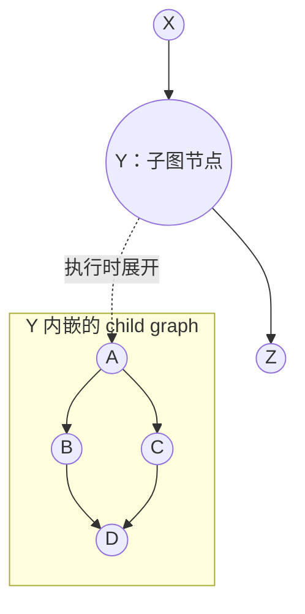

**图 24：Child Graph Example。** 父图只把 Y 看成一个节点；执行 Y 时，CUDA 执行其内部的 A、B、C、D 子图。子图适合封装可复用的局部工作流，但子图内部仍必须满足图节点和设备上下文约束。

### 图 25：最小菱形 DAG

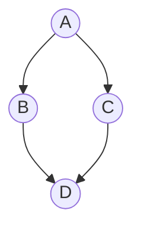

**图 25：Creating a Graph Using Graph APIs Example。** A 完成后 B 与 C 都就绪，因此它们可以并行；D 同时依赖 B 和 C，必须等两者都满足依赖后才可执行。节点在源代码中的添加顺序本身不等于执行顺序，真正约束执行的是边。

### 边数据 `cudaGraphEdgeData`

CUDA 12.3 起，边可以带 `cudaGraphEdgeData`。零初始化代表最常见的完整依赖：等待上游节点完全完成，对下游整个节点建立依赖，并提供相应的内存可见性。

```cpp
struct cudaGraphEdgeData { // 描述一条图依赖边上的可选注解。
    unsigned char from_port; // 指定上游节点在什么时刻触发该边，0 表示上游完整完成。
    unsigned char to_port; // 指定下游节点的哪一部分依赖该边；当前必须为 0。
    unsigned char type; // 保存 cudaGraphDependencyType，0 表示普通完整依赖。
    unsigned char reserved[5]; // 预留字段，必须全部清零以保持前向兼容。
}; // 结束 cudaGraphEdgeData 的概念性声明。
```

当前非默认边数据主要用于两个 kernel 节点之间的 **Programmatic Dependent Launch（程序化依赖发射）**。只有 kernel 节点定义了非零输出端口，当前没有节点定义非零输入端口，因此 `to_port` 必须为 0。查询图时若调用方忽略了实际存在的非零边数据，API 可能返回 `cudaErrorLossyQuery`，避免悄悄丢失信息。

## 关键对象与生命周期

| 对象 | 含义 | 可否修改 | 典型销毁接口 |
| --- | --- | --- | --- |
| `cudaGraph_t` | 图模板，保存节点、参数与依赖 | 可以；但不可与其他线程并发访问 | `cudaGraphDestroy()` |
| `cudaGraphNode_t` | 图模板中某个节点的句柄 | 可通过图节点 API 查询或修改 | 随图销毁，也可 `cudaGraphDestroyNode()` |
| `cudaGraphExec_t` | 实例化后的可执行图 | 拓扑固定；仅能做受支持的更新 | `cudaGraphExecDestroy()` |
| `cudaGraphConditionalHandle` | device 条件值的句柄 | device 代码可写条件值 | 不单独销毁，生命周期依附所属图 |

两个容易混淆的点：

- 销毁 `cudaGraph_t` **不会自动销毁**已经由它实例化出的 `cudaGraphExec_t`；可执行图保存了实例化快照。
- `cudaGraphExec_t` 不能与自身并发执行。再次发射同一个 exec 会排在它先前的发射之后；确实需要并发时，要实例化出多个 exec。

## Graph API：显式构图

显式 Graph API 适合拓扑已知、需要保存节点句柄、需要精确修改参数或依赖的场景。

### 创建、添加节点与依赖

**原型**

```cpp
__host__ cudaError_t cudaGraphCreate(cudaGraph_t* pGraph, unsigned int flags = 0); // 创建一张空图，当前 flags 必须为 0。
__host__ cudaError_t cudaGraphAddNode(cudaGraphNode_t* pGraphNode, cudaGraph_t graph, const cudaGraphNode_t* pDependencies, const cudaGraphEdgeData* dependencyData, size_t numDependencies, cudaGraphNodeParams* nodeParams); // 用 tagged union 参数添加任意类型节点。
__host__ cudaError_t cudaGraphAddDependencies(cudaGraph_t graph, const cudaGraphNode_t* from, const cudaGraphNode_t* to, const cudaGraphEdgeData* edgeData, size_t numDependencies); // 批量添加 from[i] 到 to[i] 的依赖边。
__host__ cudaError_t cudaGraphRemoveDependencies(cudaGraph_t graph, const cudaGraphNode_t* from, const cudaGraphNode_t* to, const cudaGraphEdgeData* edgeData, size_t numDependencies); // 批量删除完全匹配的依赖边。
__host__ cudaError_t cudaGraphDestroyNode(cudaGraphNode_t node); // 从所属图中删除一个节点及其相关边。
__host__ cudaError_t cudaGraphDestroy(cudaGraph_t graph); // 销毁图模板。
```

**参数**

| 参数 | 类型 | 含义 |
| --- | --- | --- |
| `pGraph` | `cudaGraph_t*` | 输出参数，接收新建的空图。调用方取得所有权并负责销毁。 |
| `pGraphNode` | `cudaGraphNode_t*` | 输出参数，接收新节点句柄。该句柄依附 `graph`。 |
| `graph` | `cudaGraph_t` | 被创建、添加、查询或修改的图模板。 |
| `pDependencies` | `const cudaGraphNode_t*` | 新节点的直接前驱数组；`numDependencies == 0` 时可为 `nullptr`，数组中不能有重复节点。 |
| `dependencyData` | `const cudaGraphEdgeData*` | 与前驱数组平行的边数据；传 `nullptr` 表示每条边都使用全零默认值。 |
| `nodeParams` | `cudaGraphNodeParams*` | tagged union（带类型标签的联合体）。`type` 指定节点类型，对应 union 成员保存参数；某些节点还会通过它返回输出。 |
| `from` / `to` | `const cudaGraphNode_t*` | 两个平行数组，`from[i] -> to[i]` 表示一条待添加或删除的边。 |
| `edgeData` | `const cudaGraphEdgeData*` | 与 `from` / `to` 平行；删除边时，边数据也必须匹配。 |

**返回值与约束**

- 成功返回 `cudaSuccess`；常见失败包括 `cudaErrorInvalidValue`、`cudaErrorInvalidDeviceFunction`、`cudaErrorNotSupported` 或内存分配错误。
- `cudaGraphNodeParams` 中所有未使用字节都必须为 0，推荐先用 `{}` 零初始化，再设置 `type` 和对应成员。
- `cudaGraphAddNode()` 可能写回输出字段。例如添加 `cudaGraphNodeTypeMemAlloc` 节点后，分配地址从 `nodeParams->alloc.dptr` 读出。
- `cudaGraph_t` 不提供内部线程同步，即使看起来只读的查询、克隆与实例化操作也不能在多个线程上同时访问同一张图。

`cudaGraphNodeParams` 的主要成员要直接对照 `cuda-13.3/targets/x86_64-linux/include/driver_types.h` 来看。它不是普通“参数结构体”，而是 **`type` + union 的 tagged union**：先用 `cudaGraphNodeType` 说明节点类型，再只填写 union 中与该类型对应的成员。

### `cudaGraphNodeType`

`cudaGraphNodeType` 是通用 `cudaGraphAddNode()` 的分发开关，也是 `cudaGraphNodeGetType()` 查询节点类型时返回的枚举。源码摘录如下，下面保留枚举值并补上中文注释：

```cpp
enum __device_builtin__ cudaGraphNodeType { // 定义 CUDA Graph 中所有可识别的节点类型。
    cudaGraphNodeTypeKernel = 0x00, // GPU kernel 节点，执行一个 CUDA kernel。
    cudaGraphNodeTypeMemcpy = 0x01, // memcpy 节点，执行 host/device/array 之间的数据复制。
    cudaGraphNodeTypeMemset = 0x02, // memset 节点，在 device memory 上写入固定值。
    cudaGraphNodeTypeHost = 0x03, // host 节点，在 CPU 侧执行一个 host callback。
    cudaGraphNodeTypeGraph = 0x04, // child graph 节点，把一张嵌套图作为父图中的一个节点执行。
    cudaGraphNodeTypeEmpty = 0x05, // empty 节点，不做实际工作，只承载依赖关系。
    cudaGraphNodeTypeWaitEvent = 0x06, // event wait 节点，让图等待一个 CUDA event。
    cudaGraphNodeTypeEventRecord = 0x07, // event record 节点，在图执行到这里时记录一个 CUDA event。
    cudaGraphNodeTypeExtSemaphoreSignal = 0x08, // external semaphore signal 节点，通知外部同步对象。
    cudaGraphNodeTypeExtSemaphoreWait = 0x09, // external semaphore wait 节点，等待外部同步对象。
    cudaGraphNodeTypeMemAlloc = 0x0a, // graph memory allocation 节点，在图执行中分配 device memory。
    cudaGraphNodeTypeMemFree = 0x0b, // graph memory free 节点，在图执行中释放 graph allocation。
    cudaGraphNodeTypeConditional = 0x0d, // conditional 节点，用 IF、WHILE 或 SWITCH 表达图内控制流。
    cudaGraphNodeTypeReserved16 = 0x10, // 保留值，应用代码不要主动使用。
    cudaGraphNodeTypeCount // 节点类型数量哨兵值，通常只用于范围检查或内部实现。
}; // 结束 cudaGraphNodeType 定义。
```

几个容易踩坑的点：

- **`Empty`、event、external semaphore 也是正式节点类型**。它们不在最小 kernel/memcpy/memset 示例里出现，但通用 API 必须能表达它们。
- **`Conditional` 有额外限制**：包含 conditional node 的图不能作为 child graph，任意时刻只能有一个实例化对象，且不能 clone。
- **枚举值不是连续的业务编号**。例如 `0x0c` 当前没有公开节点类型，代码里不要写“从 0 遍历到某个值并假设全有效”的逻辑。

### `cudaGraphNodeParams`

CUDA 13.3 的源码中，`cudaGraphNodeParams` 的关键结构如下。这里的 `reserved0`、`reserved1`、`reserved2` 不是装饰字段：调用 `cudaGraphAddNode()`、`cudaGraphNodeSetParams()` 或 `cudaGraphExecNodeSetParams()` 前，未使用字节必须保持 0，所以笔记里的示例都用 `{}` 零初始化。

```cpp
struct __device_builtin__ cudaGraphNodeParams { // 通用图节点参数，供 cudaGraphAddNode 等 tagged-union API 使用。
    enum cudaGraphNodeType type; // 节点类型标签，决定下面 union 中哪一个成员有效。
    int reserved0[3]; // 保留字段，必须保持为 0，通常靠 {} 零初始化满足。

    union { // 每次只使用一个成员，具体成员由 type 决定。
        long long reserved1[29]; // union padding，未使用字节必须为 0，保证 ABI 向后兼容。
        struct cudaKernelNodeParamsV2 kernel; // kernel 节点参数，CUDA 13.3 的通用节点 API 使用 V2。
        struct cudaMemcpyNodeParams memcpy; // memcpy 节点参数，描述复制源、目标、extent、context 与 kind。
        struct cudaMemsetParamsV2 memset; // memset 节点参数，描述目标地址、pitch、元素大小和值。
        struct cudaHostNodeParamsV2 host; // host callback 节点参数，描述回调函数、用户数据和 context。
        struct cudaChildGraphNodeParams graph; // child graph 节点参数，描述子图句柄和所有权策略。
        struct cudaEventWaitNodeParams eventWait; // event wait 节点参数，保存要等待的 CUDA event。
        struct cudaEventRecordNodeParams eventRecord; // event record 节点参数，保存要记录的 CUDA event。
        struct cudaExternalSemaphoreSignalNodeParamsV2 extSemSignal; // external semaphore signal 参数。
        struct cudaExternalSemaphoreWaitNodeParamsV2 extSemWait; // external semaphore wait 参数。
        struct cudaMemAllocNodeParamsV2 alloc; // graph memory alloc 节点参数，包含分配属性、大小、访问权限和输出 dptr。
        struct cudaMemFreeNodeParams free; // graph memory free 节点参数，保存要释放的 graph allocation 地址。
        struct cudaConditionalNodeParams conditional; // conditional 节点参数，保存 handle、类型和 body graph 数量。
    }; // 结束按节点类型选择的 union。

    long long reserved2; // 末尾保留字段，必须保持为 0，避免未来版本扩展时 ABI 冲突。
}; // 结束 cudaGraphNodeParams 定义。
```

`type` 到 union 成员的对应关系如下：

| `type` | 使用的成员 | 核心内容 |
| --- | --- | --- |
| `cudaGraphNodeTypeKernel` | `kernel` | 函数句柄、grid、block、动态共享内存、kernel 参数、execution context |
| `cudaGraphNodeTypeMemcpy` | `memcpy` | 源、目标、范围、复制方向与相关 context |
| `cudaGraphNodeTypeMemset` | `memset` | 目标、值、元素大小、width、height、pitch 与 context |
| `cudaGraphNodeTypeHost` | `host` | host callback、`userData` 与 context |
| `cudaGraphNodeTypeGraph` | `graph` | child graph 句柄与 `clone` / `move` 所有权策略 |
| `cudaGraphNodeTypeEmpty` | 不需要额外成员 | 只表达依赖边，不发射实际工作 |
| `cudaGraphNodeTypeWaitEvent` | `eventWait` | 等待一个 CUDA event |
| `cudaGraphNodeTypeEventRecord` | `eventRecord` | 记录一个 CUDA event |
| `cudaGraphNodeTypeExtSemaphoreSignal` | `extSemSignal` | signal 一组 external semaphore |
| `cudaGraphNodeTypeExtSemaphoreWait` | `extSemWait` | wait 一组 external semaphore |
| `cudaGraphNodeTypeMemAlloc` | `alloc` | 内存池属性、字节数、peer access 与输出地址 |
| `cudaGraphNodeTypeMemFree` | `free` | 待释放的 graph allocation 地址 |
| `cudaGraphNodeTypeConditional` | `conditional` | handle、IF/WHILE/SWITCH 类型与 body graph 数量 |

从使用角度看，`cudaGraphNodeParams` 的核心约束可以概括为：

- **先零初始化，再填字段**：`cudaGraphNodeParams params{};` 是最稳的起手式。不要只给 `type` 赋值后留下 union 里的随机字节。
- **只填当前 `type` 对应的成员**：例如 `type = cudaGraphNodeTypeKernel` 时只填 `params.kernel`，不要同时写 `params.memcpy`。
- **有些成员会被 API 写回**：`cudaGraphNodeTypeMemAlloc` 会在 `params.alloc.dptr` 中返回图分配地址，conditional node 会在 body graph 输出区域中返回子图句柄。
- **通用 API 使用 V2 参数族**：比如 `kernel` 是 `cudaKernelNodeParamsV2`，`memset` 是 `cudaMemsetParamsV2`，host/external semaphore/memalloc 也有对应 V2 结构。旧的类型专用 API 仍可能使用旧结构体。

如果不需要通用 tagged union，也可以使用类型专用接口：

```cpp
__host__ cudaError_t cudaGraphAddKernelNode(cudaGraphNode_t* pGraphNode, cudaGraph_t graph, const cudaGraphNode_t* pDependencies, size_t numDependencies, const cudaKernelNodeParams* pNodeParams); // 添加 kernel 节点。
__host__ cudaError_t cudaGraphAddMemcpyNode(cudaGraphNode_t* pGraphNode, cudaGraph_t graph, const cudaGraphNode_t* pDependencies, size_t numDependencies, const cudaMemcpy3DParms* pCopyParams); // 添加通用 memcpy 节点。
__host__ cudaError_t cudaGraphAddMemcpyNode1D(cudaGraphNode_t* pGraphNode, cudaGraph_t graph, const cudaGraphNode_t* pDependencies, size_t numDependencies, void* dst, const void* src, size_t count, cudaMemcpyKind kind); // 添加一维 memcpy 节点。
__host__ cudaError_t cudaGraphAddMemsetNode(cudaGraphNode_t* pGraphNode, cudaGraph_t graph, const cudaGraphNode_t* pDependencies, size_t numDependencies, const cudaMemsetParams* pMemsetParams); // 添加 memset 节点。
__host__ cudaError_t cudaGraphAddHostNode(cudaGraphNode_t* pGraphNode, cudaGraph_t graph, const cudaGraphNode_t* pDependencies, size_t numDependencies, const cudaHostNodeParams* pNodeParams); // 添加 host callback 节点。
__host__ cudaError_t cudaGraphAddChildGraphNode(cudaGraphNode_t* pGraphNode, cudaGraph_t graph, const cudaGraphNode_t* pDependencies, size_t numDependencies, cudaGraph_t childGraph); // 添加 child graph 节点。
__host__ cudaError_t cudaGraphAddEmptyNode(cudaGraphNode_t* pGraphNode, cudaGraph_t graph, const cudaGraphNode_t* pDependencies, size_t numDependencies); // 添加只承载依赖的空节点。
__host__ cudaError_t cudaGraphAddEventRecordNode(cudaGraphNode_t* pGraphNode, cudaGraph_t graph, const cudaGraphNode_t* pDependencies, size_t numDependencies, cudaEvent_t event); // 添加记录 CUDA event 的节点。
__host__ cudaError_t cudaGraphAddEventWaitNode(cudaGraphNode_t* pGraphNode, cudaGraph_t graph, const cudaGraphNode_t* pDependencies, size_t numDependencies, cudaEvent_t event); // 添加等待 CUDA event 的节点。
__host__ cudaError_t cudaGraphAddExternalSemaphoresSignalNode(cudaGraphNode_t* pGraphNode, cudaGraph_t graph, const cudaGraphNode_t* pDependencies, size_t numDependencies, const cudaExternalSemaphoreSignalNodeParams* nodeParams); // 添加一组 external semaphore signal 操作。
__host__ cudaError_t cudaGraphAddExternalSemaphoresWaitNode(cudaGraphNode_t* pGraphNode, cudaGraph_t graph, const cudaGraphNode_t* pDependencies, size_t numDependencies, const cudaExternalSemaphoreWaitNodeParams* nodeParams); // 添加一组 external semaphore wait 操作。
```

类型专用 API 的参数结构更小，也兼容较早的 Toolkit；通用 `cudaGraphAddNode()` 更适合统一处理新节点类型和非默认边数据。event node 把图与 CUDA event 时序连接起来；external semaphore node 面向 Vulkan、Direct3D 等外部系统导入的同步对象，其参数结构包含 semaphore 数组、逐项 signal/wait 参数和数量，这些对象必须覆盖图执行期。

### `cudaKernelNodeParams` 与 `cudaKernelNodeParamsV2`

```cpp
struct cudaKernelNodeParams { // 描述一个 kernel 节点的发射配置。
    void* func; // 指向要发射的 __global__ 函数。
    dim3 gridDim; // 指定 grid 的 x、y、z 维度。
    dim3 blockDim; // 指定每个 block 的 x、y、z 线程数。
    unsigned int sharedMemBytes; // 指定每个 block 的动态共享内存字节数。
    void** kernelParams; // 指向逐参数地址数组；与 extra 二选一。
    void** extra; // 指向打包参数缓冲区描述；与 kernelParams 二选一。
}; // 结束 cudaKernelNodeParams 的概念性声明。
```

`kernelParams[i]` 不是第 i 个参数的值，而是“指向第 i 个参数值的地址”。添加节点时，Runtime 会复制参数数组及其指向的参数值，因此这些临时 host 变量在调用返回后可以离开作用域。`kernelParams` 与 `extra` 不能同时非空。

CUDA 13.3 中 `cudaGraphNodeParams::kernel` 使用的是 `cudaKernelNodeParamsV2`。先看它依赖的函数句柄类型枚举：

```cpp
enum __device_builtin__ cudaKernelFunctionType { // 说明 V2 结构体里 kernel 函数句柄的实际类型。
    cudaKernelFunctionTypeUnspecified = 0x00, // 未指定类型，CUDA 会尝试自动推断函数句柄类型。
    cudaKernelFunctionTypeDeviceEntry = 0x01, // 句柄是 device-entry 函数指针，也就是常见的 __global__ 函数指针。
    cudaKernelFunctionTypeKernel = 0x02, // 句柄是 cudaKernel_t，通常来自 CUDA library API 或 cudaGetKernel。
    cudaKernelFunctionTypeFunction = 0x03 // 句柄是 cudaFunction_t，表示 Driver API 层面的函数对象。
}; // 结束 cudaKernelFunctionType 定义。
```

再看 `cudaKernelNodeParamsV2` 本身：

```cpp
struct __device_builtin__ cudaKernelNodeParamsV2 { // CUDA 13.3 通用图节点 API 使用的 kernel 节点参数。
    union { // 三种函数句柄共享同一块存储，由 functionType 指明当前选择。
        void* func; // functionType 为 DeviceEntry 或 Unspecified 时，保存 __global__ 函数指针。
        cudaKernel_t kern; // functionType 为 Kernel 时，保存 cudaKernel_t 句柄。
        cudaFunction_t cuFunc; // functionType 为 Function 时，保存 cudaFunction_t 句柄。
    }; // 结束函数句柄 union。

#if !defined(__cplusplus) || __cplusplus >= 201103L // C++11 及以上允许 union 外成员使用 dim3。
    dim3 gridDim; // grid 维度，语义等价于 kernel launch 的 <<<grid, block, shared, stream>>> 中的 grid。
    dim3 blockDim; // block 维度，语义等价于 kernel launch 中每个 block 的线程布局。
#else // 老 C++ 模式下 dim3 的构造语义不适合放在这个 ABI 结构里。
    uint3 gridDim; // 老 C++ 模式用 uint3 表示 grid 维度。
    uint3 blockDim; // 老 C++ 模式用 uint3 表示 block 维度。
#endif // 结束 C++ 版本相关的维度类型选择。
    unsigned int sharedMemBytes; // 每个 block 的动态共享内存字节数。
    void** kernelParams; // 指向逐参数地址数组，Runtime 会复制这些参数值。
    void** extra; // 指向 extra 格式的打包参数描述，不能和 kernelParams 同时使用。
    cudaExecutionContext_t ctx; // 指定 kernel 执行的 CUDA execution context；为 nullptr 时尝试使用当前 context。
    enum cudaKernelFunctionType functionType; // 指明上面 union 里 func、kern、cuFunc 当前哪一个有效。
}; // 结束 cudaKernelNodeParamsV2 定义。
```

两者的关键差异如下：

| 对比点 | `cudaKernelNodeParams` | `cudaKernelNodeParamsV2` |
| --- | --- | --- |
| 函数句柄 | 只有 `void* func` | `func` / `kern` / `cuFunc` 三选一 |
| 句柄类型描述 | 依赖 API 语义和 Runtime 推断 | 用 `functionType` 显式说明句柄类型 |
| execution context | 没有 `ctx` 字段 | 有 `cudaExecutionContext_t ctx` |
| 主要使用位置 | `cudaGraphAddKernelNode()`、`cudaGraphKernelNodeSetParams()`、`cudaGraphExecKernelNodeSetParams()` 这类旧专用 API | `cudaGraphNodeParams::kernel`，也就是通用 `cudaGraphAddNode()` / `cudaGraphNodeSetParams()` / `cudaGraphExecNodeSetParams()` 路径 |
| 兼容性 | 更老、更常见，适合普通 `__global__` 函数图节点 | 更适合 CUDA 13.x 的通用节点模型和 execution environment / library kernel 场景 |

普通应用里，如果只是把一个 `__global__` 函数加入 graph，旧结构仍然够用；如果使用通用 `cudaGraphAddNode()`，或者需要把 `cudaKernel_t`、`cudaFunction_t`、execution context 明确放进节点参数，就应该按 V2 的语义填写 `params.kernel`。

### 错误检查辅助函数

后续示例用下面的辅助函数快速失败。为突出 Graph 结构，示例 kernel 本身保持最小化。

```cpp
#include <cuda_runtime.h> // 引入 CUDA Runtime API、图类型和发射接口。
#include <cstddef> // 引入 std::size_t。
#include <stdexcept> // 引入 std::runtime_error 用于报告不可恢复的 CUDA 错误。
#include <string> // 引入 std::string 用于拼接错误信息。

inline void checkCuda(cudaError_t status, const char* expression) { // 检查一条 CUDA Runtime API 的返回码。
    if (status != cudaSuccess) { // 非 cudaSuccess 表示当前调用失败。
        throw std::runtime_error(std::string(expression) + ": " + cudaGetErrorString(status)); // 抛出包含调用文本和 CUDA 错误说明的异常。
    } // 结束错误分支。
} // 结束 checkCuda。

#define CUDA_CHECK(call) checkCuda((call), #call) // 保存调用文本并统一执行返回码检查。
```

### 用 Graph API 构造图 25

下面用当前六参数 `cudaGraphAddNode()` 构造 A、B、C、D 四个 kernel 节点。`dummyKernel` 只是占位，重点是依赖数组如何表达菱形拓扑。

```cpp
__global__ void dummyKernel() { // 定义一个用于演示图拓扑的空 kernel。
} // 结束 dummyKernel。

cudaGraphExec_t buildDiamondGraphWithApi(cudaStream_t launch_stream) { // 显式构造、实例化并首次发射菱形图。
    cudaGraph_t graph = nullptr; // 保存可修改的图模板。
    CUDA_CHECK(cudaGraphCreate(&graph, 0)); // 创建一张没有节点的空图。

    cudaGraphNodeParams kernel_params{}; // 零初始化 tagged union，确保所有预留字节为 0。
    kernel_params.type = cudaGraphNodeTypeKernel; // 指明 union 当前保存 kernel 节点参数。
    kernel_params.kernel.func = reinterpret_cast<void*>(dummyKernel); // 指定节点要执行的 kernel。
    kernel_params.kernel.gridDim = dim3(1, 1, 1); // 只发射一个 block。
    kernel_params.kernel.blockDim = dim3(1, 1, 1); // block 中只使用一个线程。
    kernel_params.kernel.sharedMemBytes = 0; // 该 kernel 不需要动态共享内存。
    kernel_params.kernel.kernelParams = nullptr; // 该 kernel 没有运行时参数。
    kernel_params.kernel.extra = nullptr; // 不使用打包参数缓冲区。

    cudaGraphNode_t nodes[4]{}; // 依次保存 A、B、C、D 四个节点句柄。
    CUDA_CHECK(cudaGraphAddNode(&nodes[0], graph, nullptr, nullptr, 0, &kernel_params)); // 添加无前驱的根节点 A。
    CUDA_CHECK(cudaGraphAddNode(&nodes[1], graph, &nodes[0], nullptr, 1, &kernel_params)); // 添加 B，并建立 A 到 B 的默认依赖。
    CUDA_CHECK(cudaGraphAddNode(&nodes[2], graph, &nodes[0], nullptr, 1, &kernel_params)); // 添加 C，并建立 A 到 C 的默认依赖。
    cudaGraphNode_t d_dependencies[]{nodes[1], nodes[2]}; // 准备 D 的两个直接前驱 B 和 C。
    CUDA_CHECK(cudaGraphAddNode(&nodes[3], graph, d_dependencies, nullptr, 2, &kernel_params)); // 添加 D，使其等待 B 和 C。

    cudaGraphExec_t graph_exec = nullptr; // 保存实例化后的可执行图。
    CUDA_CHECK(cudaGraphInstantiate(&graph_exec, graph, 0)); // 校验图并创建可反复发射的执行快照。
    CUDA_CHECK(cudaGraphDestroy(graph)); // 实例化后不再修改模板，因此释放 graph 句柄。
    CUDA_CHECK(cudaGraphLaunch(graph_exec, launch_stream)); // 把整张菱形图排入 launch_stream。
    return graph_exec; // 把 exec 所有权交给调用方，调用方最终需 cudaGraphExecDestroy。
} // 结束 buildDiamondGraphWithApi。
```

## Stream Capture：从现有 stream 代码生成图

流捕获适合已有异步 CUDA 代码或库调用：用 begin/end 包住原来的 stream 工作，Runtime 不立即执行这些操作，而是把它们记录为图节点。

### 捕获相关接口

**原型**

```cpp
__host__ cudaError_t cudaStreamBeginCapture(cudaStream_t stream, cudaStreamCaptureMode mode); // 开始把指定 stream 上的后续工作捕获到内部图。
__host__ cudaError_t cudaStreamBeginCaptureToGraph(cudaStream_t stream, cudaGraph_t graph, const cudaGraphNode_t* dependencies, const cudaGraphEdgeData* dependencyData, size_t numDependencies, cudaStreamCaptureMode mode); // 把后续工作捕获到已有 graph，并指定首个新节点的前驱。
__host__ cudaError_t cudaStreamEndCapture(cudaStream_t stream, cudaGraph_t* pGraph); // 在 origin stream 结束捕获并返回结果图。
__host__ cudaError_t cudaStreamIsCapturing(cudaStream_t stream, cudaStreamCaptureStatus* pCaptureStatus); // 查询 stream 是否未捕获、正在捕获或已失效。
__host__ cudaError_t cudaStreamGetCaptureInfo(cudaStream_t stream, cudaStreamCaptureStatus* captureStatus_out, unsigned long long* id_out = nullptr, cudaGraph_t* graph_out = nullptr, const cudaGraphNode_t** dependencies_out = nullptr, const cudaGraphEdgeData** edgeData_out = nullptr, size_t* numDependencies_out = nullptr); // 查询捕获 ID、底层图和下一个节点的依赖集合。
__host__ cudaError_t cudaStreamUpdateCaptureDependencies(cudaStream_t stream, cudaGraphNode_t* dependencies, const cudaGraphEdgeData* dependencyData, size_t numDependencies, unsigned int flags = 0); // 增加或替换下一个捕获节点的依赖集合。
__host__ cudaError_t cudaThreadExchangeStreamCaptureMode(cudaStreamCaptureMode* mode); // 原子交换当前线程的 capture mode，并通过 mode 返回旧值。
```

**关键参数**

| 参数 | 含义 |
| --- | --- |
| `stream` | 发起捕获的 **origin stream（起始流）**；不能是 `cudaStreamLegacy`，可以是 `cudaStreamPerThread`。 |
| `mode` | 控制捕获期间其他线程调用潜在不安全 API 时的限制范围。 |
| `graph` | `cudaStreamBeginCaptureToGraph()` 的目标已有图。调用结束前，该图仍由原所有者持有。 |
| `dependencies` / `dependencyData` | 捕获到已有图时，首个新节点的前驱及边数据；数量为 0 时可传 `nullptr`。 |
| `pGraph` | 输出捕获结果。若捕获被非法操作破坏，`cudaStreamEndCapture()` 返回错误并写出空图。 |
| `flags` | `cudaStreamAddCaptureDependencies` 表示追加，`cudaStreamSetCaptureDependencies` 表示替换；0 等价于追加。 |

捕获模式的区别如下：

`cudaStreamCaptureMode` 在 `cuda-13.3/targets/x86_64-linux/include/driver_types.h` 中的源码很短，但背后的语义很容易误会：

```cpp
enum __device_builtin__ cudaStreamCaptureMode { // 定义 stream capture 与其他线程 CUDA API 调用的交互模式。
    cudaStreamCaptureModeGlobal = 0, // 全局模式：本线程或其他线程的 global 捕获都会禁止潜在不安全 API。
    cudaStreamCaptureModeThreadLocal = 1, // 线程局部模式：只约束当前线程，不因为其他线程捕获而拦截本线程。
    cudaStreamCaptureModeRelaxed = 2 // 宽松模式：不主动禁止潜在不安全 API，但仍禁止必然破坏 capture 的操作。
}; // 结束 cudaStreamCaptureMode 定义。
```

先把几个词拆开。这里最容易糊的是：`cudaStreamBeginCapture(stream, mode)` 里的 `mode` 既会成为这个 **capture sequence（捕获序列）** 的属性，也会影响 CUDA Runtime 判断“当前线程能不能调用某些 API”。

| 说法 | 具体含义 |
| --- | --- |
| **一个 capture** | 从 `cudaStreamBeginCapture()` 到 `cudaStreamEndCapture()` 之间的那段捕获序列。 |
| **Relaxed capture** | 用 `cudaStreamCaptureModeRelaxed` 开始的捕获序列。 |
| **非 Relaxed capture** | 用 `cudaStreamCaptureModeGlobal` 或 `cudaStreamCaptureModeThreadLocal` 开始的捕获序列。 |
| **Global capture** | 用 `cudaStreamCaptureModeGlobal` 开始的捕获序列。它的影响会扩散到其他线程。 |
| **ThreadLocal capture** | 用 `cudaStreamCaptureModeThreadLocal` 开始的捕获序列。它主要限制发起捕获的线程。 |
| **冲突的 capture 操作** | 操作本身会观察、合并、逃逸或破坏正在捕获的序列；即使用 `Relaxed` 也不允许。 |
| **潜在不安全 API** | 不一定必然破坏 capture，但它的副作用不会进入 graph，Runtime 在非 Relaxed 规则下会保守拦截。典型例子是 `cudaMalloc()`。 |

一句话版本：**Global / ThreadLocal / Relaxed 不是说“哪些 kernel 被捕获”，而是说“捕获期间，CUDA 要多保守地禁止本线程或其他线程调用那些 graph 无法记录的 API”。**

可以把 Runtime 的判断想成下面这张表。假设某个线程 T 现在想调用一个潜在不安全 API，例如 `cudaMalloc()`：

| 当前情况 | T 调 `cudaMalloc()` 会怎样 | 原因 |
| --- | --- | --- |
| T 自己正在进行 `Global` capture | 禁止 | 本线程有非 Relaxed capture。 |
| T 自己正在进行 `ThreadLocal` capture | 禁止 | 本线程有非 Relaxed capture。 |
| T 自己正在进行 `Relaxed` capture | 不因为“潜在不安全”而禁止 | Relaxed 明确放松这类保守拦截。 |
| 另一个线程 U 正在进行 `Global` capture，T 自己没有 capture | 禁止 | Global capture 会让其他线程也避开潜在不安全 API。 |
| 另一个线程 U 正在进行 `ThreadLocal` capture，T 自己没有 capture | 不因为 U 的 capture 而禁止 | ThreadLocal 不把限制扩散到其他线程。 |
| 另一个线程 U 正在进行 `Relaxed` capture，T 自己没有 capture | 不因为 U 的 capture 而禁止 | Relaxed capture 不触发这类全局保守拦截。 |

所以：

- **什么叫 Global 捕获**：你调用 `cudaStreamBeginCapture(stream, cudaStreamCaptureModeGlobal)` 开始的那段 capture。它是默认、最保守模式。只要它正在进行，别的线程也会被禁止做 `cudaMalloc()` 这类潜在不安全调用。
- **什么叫非 Relaxed 捕获**：`Global` 和 `ThreadLocal` 都算。非 Relaxed 的共同点是：开始 capture 的同一个线程里，潜在不安全 API 会被拦截；结束 capture 也必须在开始 capture 的同一个线程做。
- **什么叫 Relaxed 捕获**：你用 `cudaStreamCaptureModeRelaxed` 开始 capture。Runtime 不再因为“这个 API 可能不安全”就提前拦你，但这不是免责金牌；如果 API 必然破坏捕获隔离，仍然会报错。
- **什么叫冲突的 capture**：这类不是“可能不安全”，而是“肯定和捕获模型打架”。例如查询 capture 内刚 record 的 event、把两个独立 capture 序列意外 merge、让捕获 fork 到别的 stream 后没 join 回 origin stream、跨 capture 边界制造非 in-stream 依赖。Relaxed 也不能放行这些。

所谓 **potentially unsafe API（潜在不安全 API）**，典型例子是 `cudaMalloc()`。它的问题不是“分配内存本身危险”，而是它不会作为一个异步操作排进捕获 stream，也不会变成 graph node。如果被捕获的后续 kernel 依赖这次分配，那么重放 graph 时这次分配不会跟着重放，图的语义就不完整。

```cpp
cudaGraph_t graph = nullptr; // 准备接收捕获结束后生成的图。
CUDA_CHECK(cudaStreamBeginCapture(stream, cudaStreamCaptureModeGlobal)); // 开始严格捕获，禁止潜在不安全 API。
float* d_data = nullptr; // 准备接收一次同步 cudaMalloc 的结果。
cudaError_t status = cudaMalloc(&d_data, 4096); // 错误示例：cudaMalloc 不会被 capture 记录，Global 模式会拦截它。
if (status != cudaSuccess) { // 如果捕获已经被非法 API 破坏，仍然需要结束 capture 来恢复 stream 状态。
    cudaGraph_t discarded_graph = nullptr; // 准备接收可能为空的废弃图句柄。
    cudaStreamEndCapture(stream, &discarded_graph); // 清理 invalidated capture；这里故意不再假设它会成功。
    CUDA_CHECK(status); // 报告真正触发问题的 cudaMalloc 错误。
} // 结束错误清理分支。
CUDA_CHECK(cudaStreamEndCapture(stream, &graph)); // 如果前面没有出错，结束捕获并得到结果图。
```

如果要在 capture 里表达可重放的分配，应使用 `cudaMallocAsync()` / `cudaFreeAsync()` 这种能进入 stream 顺序的异步接口，或者显式添加 graph memory node。

```cpp
cudaGraph_t graph = nullptr; // 准备接收捕获生成的图。
CUDA_CHECK(cudaStreamBeginCapture(stream, cudaStreamCaptureModeGlobal)); // 开始捕获 stream 上的异步工作。
float* d_data = nullptr; // 准备接收异步分配返回的 device 指针。
CUDA_CHECK(cudaMallocAsync(&d_data, 4096, stream)); // 正确示例：异步分配进入 stream，可捕获为 memory allocation node。
initKernel<<<16, 256, 0, stream>>>(d_data, 1024); // 使用捕获到的分配结果作为后续 kernel 参数。
CUDA_CHECK(cudaGetLastError()); // 检查 kernel launch 配置是否立即失败。
CUDA_CHECK(cudaFreeAsync(d_data, stream)); // 正确示例：异步释放进入 stream，可捕获为 memory free node。
CUDA_CHECK(cudaStreamEndCapture(stream, &graph)); // 捕获结束后得到包含 alloc、kernel、free 的图。
```

三种模式可以这样理解：

| 模式 | 它到底放松了什么 | 适合场景 | 容易踩坑 |
| --- | --- | --- | --- |
| `cudaStreamCaptureModeGlobal` | 什么都不放松；本线程非 Relaxed capture 会禁 unsafe，其他线程的 Global capture 也会禁本线程 unsafe | 默认选择；你不确定库内部或其他线程是否会碰到 CUDA Runtime 全局副作用时，用它兜住语义 | 多线程程序中，一个线程 Global capture 时，另一个看似无关的线程调用 `cudaMalloc()` 也可能失败 |
| `cudaStreamCaptureModeThreadLocal` | 放松“其他线程正在 capture 对我本线程的影响”；但本线程自己的 unsafe 仍然会被禁 | capture 调用链清晰，同时进程里其他工作线程可能独立做 CUDA 分配、查询或管理操作 | 其他线程如果实际改了本次 capture 依赖的资源，Runtime 不会替你拦住这种跨线程语义错误 |
| `cudaStreamCaptureModeRelaxed` | 放松“本线程潜在不安全 API 的保守拦截”；但必然冲突 capture 的 API 仍然非法 | 只有当你能证明这些副作用不需要进入 graph、也不影响被捕获工作语义时才用 | 容易把不可重放的外部状态混进 captured graph；调试时症状常常晚到 graph launch 阶段才暴露 |

更具体一点：

- **Global 是学习和默认工程路径的首选**。它牺牲一点多线程灵活性，换来更早发现“这个 API 不会被 capture 记录”的问题。写框架、算子库 benchmark、封装第三方调用时，除非有明确理由，先用 `Global`。
- **ThreadLocal 适合隔离良好的多线程程序**。例如线程 A 正在捕获一个固定推理图，线程 B 同时为另一个完全独立的模型准备显存。你不希望线程 A 的 capture 让线程 B 的分配失败，可以用 `ThreadLocal`。前提是线程 B 的分配结果不会被线程 A 捕获到的图依赖。
- **Relaxed 是“我知道这个副作用不用进图”的模式**。比如你在捕获期间做一次与 captured work 无关的 host 侧缓存准备、日志、或者不会影响图重放语义的 CUDA 管理调用，可以用它减少 Runtime 的保守拦截。它不是“允许所有非法操作”的模式。

下面是几个典型错误边界：

| 错误方式 | 为什么错 | 常见结果 |
| --- | --- | --- |
| 在非 Relaxed capture 期间调用 `cudaMalloc()` / 类似同步全局副作用 API | 这些操作不进入 stream，也不会成为 graph node，重放 graph 时不会自动发生 | API 返回 capture 相关错误，捕获可能变成 `cudaStreamCaptureStatusInvalidated` |
| 用 `cudaStreamLegacy` 开始 capture | legacy stream 会和 blocking stream 建立隐式依赖，不满足 capture 的隔离模型 | `cudaStreamBeginCapture()` 返回错误 |
| 非 Relaxed capture 在另一个线程调用 `cudaStreamEndCapture()` | CUDA 13.3 文档要求非 Relaxed 模式必须由开始捕获的同一线程结束 | 返回 `cudaErrorStreamCaptureWrongThread` |
| 查询在 capture 内最后一次 record 的 event，例如 `cudaEventQuery()` | 这个查询跨越 capture 边界观察内部状态，会破坏 capture 隔离 | 返回 `cudaErrorCapturedEvent` 或相关 capture 错误 |
| 捕获序列 fork 到其他 stream 后没有 join 回 origin stream | 捕获结果无法从 origin stream 闭合，图里留下不可达分支 | `cudaStreamEndCapture()` 返回 `cudaErrorStreamCaptureUnjoined` |

一个实用选择顺序是：

1. 默认写 `cudaStreamCaptureModeGlobal`，先让 Runtime 帮你抓出潜在不安全调用。
2. 如果多线程里其他线程确实需要独立 CUDA 管理操作，而且它们不参与本次捕获语义，再改成 `cudaStreamCaptureModeThreadLocal`。
3. 只有在你能逐项说明“这些被放行的调用不会成为 captured graph 的依赖”时，才考虑 `cudaStreamCaptureModeRelaxed`。

`cudaThreadExchangeStreamCaptureMode()` 是线程级别的临时模式切换工具，适合在库函数边界做 push-pop。它不会开始或结束 capture，只是改变当前线程面对“潜在不安全 API”时的交互策略：

```cpp
void callLibraryWithCaptureMode(cudaStreamCaptureMode desired_mode) { // 在一段库调用期间临时切换当前线程的 capture 交互模式。
    cudaStreamCaptureMode previous_mode = desired_mode; // 输入期望模式，调用后会被替换成旧模式。
    CUDA_CHECK(cudaThreadExchangeStreamCaptureMode(&previous_mode)); // 把当前线程切到 desired_mode，并保存旧模式。
    libraryCallThatMayTouchCudaRuntime(); // 调用可能触碰 CUDA Runtime 的库函数，具体安全性由调用者保证。
    CUDA_CHECK(cudaThreadExchangeStreamCaptureMode(&previous_mode)); // 恢复进入函数前的线程 capture 交互模式。
} // 结束临时模式切换示例。
```

### 最小流捕获

```cpp
cudaGraphExec_t captureLinearGraph(cudaStream_t stream, float* data, std::size_t count) { // 捕获一段线性 stream 工作并生成 exec。
    CUDA_CHECK(cudaStreamBeginCapture(stream, cudaStreamCaptureModeGlobal)); // 进入捕获模式，后续操作只记录、不立即执行。
    firstKernel<<<128, 256, 0, stream>>>(data, count); // 捕获第一个 kernel 节点。
    CUDA_CHECK(cudaGetLastError()); // 检查 kernel 配置与发射参数是否有效。
    libraryCall(stream); // 捕获支持 stream capture 的异步库调用所生成的节点。
    secondKernel<<<128, 256, 0, stream>>>(data, count); // 捕获第二个 kernel 节点，并继承同一 stream 的顺序依赖。
    CUDA_CHECK(cudaGetLastError()); // 检查第二个 kernel 的发射错误。

    cudaGraph_t graph = nullptr; // 准备用于接收捕获产生的图模板。
    CUDA_CHECK(cudaStreamEndCapture(stream, &graph)); // 结束捕获并取得完整图。
    cudaGraphExec_t graph_exec = nullptr; // 保存实例化结果。
    CUDA_CHECK(cudaGraphInstantiate(&graph_exec, graph, 0)); // 把捕获图实例化为可执行图。
    CUDA_CHECK(cudaGraphDestroy(graph)); // 释放已经不再需要的图模板。
    return graph_exec; // 返回 exec，稍后可用 cudaGraphLaunch 反复发射。
} // 结束 captureLinearGraph。
```

### 跨 stream 捕获：fork 与 join

事件可以在捕获期间把一条流分叉到另一条流。额外参与捕获的流必须在结束前重新 join 回 origin stream，否则 `cudaStreamEndCapture()` 会以 `cudaErrorStreamCaptureUnjoined` 失败。

理解 fork / join 的关键是 **dependency set（依赖集合）**。捕获期间，每条参与 capture 的 stream 都有一个“下一个节点应该依赖谁”的集合。每捕获一个新节点，Runtime 会：

1. 用这条 stream 当前的 dependency set 给新节点连入边。
2. 把这条 stream 的 dependency set 更新为“刚捕获的新节点”。

如果只在一条 stream 上捕获，dependency set 就退化成线性顺序：

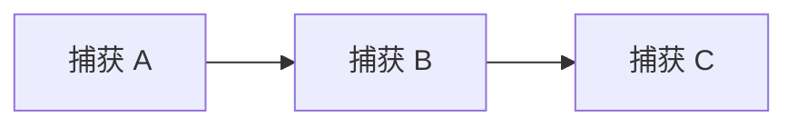

跨 stream 的神奇之处，是 event 把一条 stream 的 dependency set 复制给另一条 stream：

- `cudaEventRecord(event, stream_1)`：把 `stream_1` 此刻“已经捕获到哪里了”记录到 `event`。如果刚捕获完 A，那么 `event` 代表“等待 A”。
- `cudaStreamWaitEvent(stream_2, event, 0)`：让 `stream_2` 未来捕获的节点依赖这个 `event` 代表的依赖集合。于是 `stream_2` 的下一个节点会依赖 A。
- 这一步就是 **fork**：依赖前沿从 `stream_1` 分出一份给 `stream_2`，后面两个 stream 可以各自继续捕获节点。
- 反过来，在 `stream_2` 捕获完 C 后记录 `join_event`，再让 `stream_1` wait 这个 event，就是 **join**：把 `stream_2` 的尾部依赖重新接回 origin stream。

下面是捕获菱形图时，每一步 dependency set 的变化。这里 `frontier(stream)` 表示这条 stream 的下一个 captured node 会依赖哪些节点。

| 步骤 | 调用 | `stream_1` 的 frontier | `stream_2` 的 frontier | 图里的效果 |
| --- | --- | --- | --- | --- |
| 1 | begin capture | 空 | 未参与 | `stream_1` 成为 origin stream |
| 2 | 捕获 A 到 `stream_1` | `{A}` | 未参与 | A 是根节点 |
| 3 | record `fork_event` on `stream_1` | `{A}` | 未参与 | event 记住 `{A}` |
| 4 | `stream_2` wait `fork_event` | `{A}` | `{A}` | `stream_2` 加入同一 capture，下一节点依赖 A |
| 5 | 捕获 B 到 `stream_1` | `{B}` | `{A}` | B 依赖 A |
| 6 | 捕获 C 到 `stream_2` | `{B}` | `{C}` | C 依赖 A，且与 B 可并行 |
| 7 | record `join_event` on `stream_2` | `{B}` | `{C}` | event 记住 `{C}` |
| 8 | `stream_1` wait `join_event` | `{B, C}` | `{C}` | origin stream 的下一节点同时依赖 B 和 C |
| 9 | 捕获 D 到 `stream_1` | `{D}` | `{C}` | D 依赖 B 和 C |
| 10 | end capture on `stream_1` | 完整闭合 | 已 join | 返回菱形 DAG |

捕获出来的图不是“两个 stream 对象的录像”，而是下面这张依赖图：

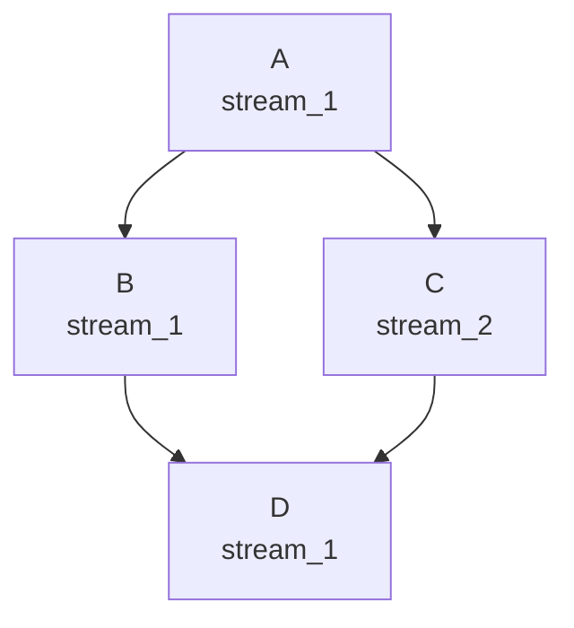

因此重放时虽然只调用一次 `cudaGraphLaunch(graph_exec, launch_stream)`，但图内部仍按 `A -> {B, C} -> D` 的 DAG 调度；`launch_stream` 只控制整张图相对外部工作的前后顺序。

下面同样生成图 25 的菱形拓扑。可以按上面的 frontier 表逐行对照：

```cpp
cudaGraphExec_t buildDiamondGraphWithCapture(cudaStream_t stream_1, cudaStream_t stream_2) { // 用两个 stream 捕获 A、B、C、D 菱形图。
    cudaEvent_t fork_event = nullptr; // 用于把 stream_1 当前捕获依赖传给 stream_2。
    cudaEvent_t join_event = nullptr; // 用于把 stream_2 的尾部依赖重新合入 stream_1。
    CUDA_CHECK(cudaEventCreateWithFlags(&fork_event, cudaEventDisableTiming)); // 创建只用于依赖、不记录时间的 fork event。
    CUDA_CHECK(cudaEventCreateWithFlags(&join_event, cudaEventDisableTiming)); // 创建只用于依赖、不记录时间的 join event。

    CUDA_CHECK(cudaStreamBeginCapture(stream_1, cudaStreamCaptureModeGlobal)); // 把 stream_1 指定为 origin stream 并开始捕获。
    kernelA<<<1, 1, 0, stream_1>>>(); // 在 origin stream 捕获根节点 A。
    CUDA_CHECK(cudaGetLastError()); // 检查 A 的发射配置。
    CUDA_CHECK(cudaEventRecord(fork_event, stream_1)); // 捕获 event record，记录 A 之后的依赖前沿。
    CUDA_CHECK(cudaStreamWaitEvent(stream_2, fork_event, 0)); // 让 stream_2 加入同一捕获图并依赖 A。
    kernelB<<<1, 1, 0, stream_1>>>(); // 在 stream_1 捕获 A 的后继 B。
    CUDA_CHECK(cudaGetLastError()); // 检查 B 的发射配置。
    kernelC<<<1, 1, 0, stream_2>>>(); // 在 stream_2 捕获 A 的另一个后继 C。
    CUDA_CHECK(cudaGetLastError()); // 检查 C 的发射配置。
    CUDA_CHECK(cudaEventRecord(join_event, stream_2)); // 在 C 后记录 join event。
    CUDA_CHECK(cudaStreamWaitEvent(stream_1, join_event, 0)); // 把 stream_2 的依赖前沿重新合入 origin stream。
    kernelD<<<1, 1, 0, stream_1>>>(); // 捕获同时依赖 B 与 C 的节点 D。
    CUDA_CHECK(cudaGetLastError()); // 检查 D 的发射配置。

    cudaGraph_t graph = nullptr; // 接收跨 stream 捕获产生的图。
    CUDA_CHECK(cudaStreamEndCapture(stream_1, &graph)); // 必须从 origin stream 结束已经完全 join 的捕获。
    cudaGraphExec_t graph_exec = nullptr; // 保存实例化后的可执行图。
    CUDA_CHECK(cudaGraphInstantiate(&graph_exec, graph, 0)); // 校验并实例化捕获结果。
    CUDA_CHECK(cudaGraphDestroy(graph)); // 释放图模板。
    CUDA_CHECK(cudaEventDestroy(fork_event)); // 捕获结束后释放 fork event 对象。
    CUDA_CHECK(cudaEventDestroy(join_event)); // 捕获结束后释放 join event 对象。
    return graph_exec; // 返回可反复发射的菱形图 exec。
} // 结束 buildDiamondGraphWithCapture。
```

### 捕获期间的非法操作与失效

捕获中的工作尚未真正进入 GPU 执行队列，所以不能询问“是否完成”，也不能同步等待它完成。需要特别避免：

- 对正在捕获的 stream 或 captured event 调用 query / synchronize。
- 在关联上下文中进行会覆盖活动捕获的 device/context 级同步。
- 捕获非 `cudaStreamNonBlocking` stream 时使用 legacy stream；同步 `cudaMemcpy()` 等隐式使用 legacy stream 的 API 也可能非法。
- 把来自两张不同 capture graph 的 captured event 合并。
- 在捕获流上调用尚不支持图的异步 API，例如 `cudaStreamAttachMemAsync()`。
- 假设 `cudaMalloc()` 会被捕获。它不是 stream-ordered 操作；需要图内分配时使用显式 memory node 或捕获 `cudaMallocAsync()`。

一旦发生非法操作，与之关联的捕获图会进入 `cudaStreamCaptureStatusInvalidated`。此时必须仍在 origin stream 调用 `cudaStreamEndCapture()`，让相关 stream 离开捕获状态；该调用会返回错误并把输出图设为空，不能继续使用半成品图。

### 捕获自省

`cudaStreamGetCaptureInfo()` 除了返回状态与进程内唯一的 capture ID，还能返回底层 `cudaGraph_t`，以及“下一个被捕获节点”当前将依赖的节点和边数据。返回的依赖数组由 Runtime 持有，只在下一次操作该 stream 的 API 调用或捕获结束前有效；节点句柄可以复制出来，并一直有效到节点或图被销毁。

只有调用成功且状态为 `cudaStreamCaptureStatusActive` 时，capture ID、底层图和依赖集合输出才有效；请求 `edgeData_out` 时也必须同时请求 `dependencies_out`。`cudaThreadExchangeStreamCaptureMode()` 主要供库在明确作用域内临时改变当前线程的安全策略，离开作用域前应交换回原模式。

这组接口适合编写可嵌入捕获的库：库可以检测调用者是否正在捕获，必要时向已有 capture graph 插入节点，并用 `cudaStreamUpdateCaptureDependencies()` 修正调用返回后的依赖前沿。

## 图 26：两阶段归约的完整工作流

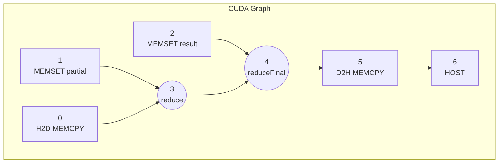

**图 26：CUDA graph example using two stage reduction kernel。** 第一阶段 `reduce` 需要输入已经复制到 device，并且部分和缓冲区已经清零；第二阶段 `reduceFinal` 同时等待第一阶段输出和最终结果缓冲区清零；结果复制回 host 后再执行 host callback。

### Graph API 写法

下面保留官方例子的核心结构，但使用当前 Runtime API、补齐错误检查，并把一维复制写成更直接的 `cudaGraphAddMemcpyNode1D()`。示例的 `input_h` 与回调结果缓冲区应使用 page-locked host memory，并且所有 host/device 缓冲区都必须覆盖图执行期。

```cpp
struct ReductionCallbackData { // 保存 host node 需要读取的回调上下文。
    double* result; // 指向 page-locked host 结果变量，生命周期必须覆盖图执行。
}; // 结束 ReductionCallbackData。

void CUDART_CB consumeReductionResult(void* user_data) { // 定义在 D2H copy 完成后运行的 host callback。
    auto* data = static_cast<ReductionCallbackData*>(user_data); // 恢复调用方提供的回调上下文类型。
    consumeOnCpu(*data->result); // 在 CPU 上消费已经复制完成的最终归约值。
} // 结束 consumeReductionResult；回调内部不得调用 CUDA API。

cudaGraph_t buildReductionGraphWithApi(float* input_h, float* input_d, double* partial_d, double* result_d, std::size_t count, std::size_t block_count, ReductionCallbackData* callback_data) { // 用显式节点 API 构造两阶段归约图。
    cudaGraph_t graph = nullptr; // 保存即将构造的图模板。
    CUDA_CHECK(cudaGraphCreate(&graph, 0)); // 创建空图。

    cudaGraphNode_t copy_input_node = nullptr; // 保存节点 0：H2D 输入复制。
    const std::size_t input_bytes = count * sizeof(float); // 计算输入数组的字节数。
    CUDA_CHECK(cudaGraphAddMemcpyNode1D(&copy_input_node, graph, nullptr, 0, input_d, input_h, input_bytes, cudaMemcpyHostToDevice)); // 添加无前驱的 H2D copy 根节点。

    cudaMemsetParams clear_partial_params{}; // 零初始化节点 1 的 memset 参数。
    clear_partial_params.dst = partial_d; // 指定部分和 device 缓冲区。
    clear_partial_params.value = 0; // 指定每个元素写入 0。
    clear_partial_params.elementSize = 1; // 按字节解释 width，避免把 double 拆分规则隐藏起来。
    clear_partial_params.width = block_count * sizeof(double); // 清零所有部分和所占字节。
    clear_partial_params.height = 1; // 使用一维 memset。
    clear_partial_params.pitch = 0; // 一维 memset 不使用 pitch。
    cudaGraphNode_t clear_partial_node = nullptr; // 保存节点 1 的句柄。
    CUDA_CHECK(cudaGraphAddMemsetNode(&clear_partial_node, graph, nullptr, 0, &clear_partial_params)); // 添加可与输入复制并行的清零根节点。

    cudaKernelNodeParams reduce_params{}; // 零初始化第一阶段 kernel 节点参数。
    reduce_params.func = reinterpret_cast<void*>(reduceKernel); // 指定第一阶段 block-level 归约 kernel。
    reduce_params.gridDim = dim3(static_cast<unsigned int>(block_count), 1, 1); // 每个 block 生成一个部分和。
    reduce_params.blockDim = dim3(256, 1, 1); // 每个 block 使用 256 个线程。
    reduce_params.sharedMemBytes = 256 * sizeof(double); // 为 block 内归约分配动态共享内存。
    void* reduce_args[]{&input_d, &partial_d, &count}; // 保存各 kernel 实参值的 host 地址。
    reduce_params.kernelParams = reduce_args; // 让 Runtime 在添加节点时复制三个参数值。
    reduce_params.extra = nullptr; // 不使用打包参数形式。
    cudaGraphNode_t reduce_dependencies[]{copy_input_node, clear_partial_node}; // 第一阶段同时依赖输入复制和部分和清零。
    cudaGraphNode_t reduce_node = nullptr; // 保存节点 3 的句柄。
    CUDA_CHECK(cudaGraphAddKernelNode(&reduce_node, graph, reduce_dependencies, 2, &reduce_params)); // 添加第一阶段 reduce 节点。

    cudaMemsetParams clear_result_params{}; // 零初始化节点 2 的 memset 参数。
    clear_result_params.dst = result_d; // 指定最终结果 device 地址。
    clear_result_params.value = 0; // 把结果初始化为 0。
    clear_result_params.elementSize = 1; // 继续按字节表达清零范围。
    clear_result_params.width = sizeof(double); // 只清零一个 double 的存储空间。
    clear_result_params.height = 1; // 使用一维 memset。
    clear_result_params.pitch = 0; // 一维操作不使用 pitch。
    cudaGraphNode_t clear_result_node = nullptr; // 保存节点 2 的句柄。
    CUDA_CHECK(cudaGraphAddMemsetNode(&clear_result_node, graph, nullptr, 0, &clear_result_params)); // 添加可提前执行的最终结果清零根节点。

    cudaKernelNodeParams final_params{}; // 零初始化第二阶段 kernel 节点参数。
    final_params.func = reinterpret_cast<void*>(reduceFinalKernel); // 指定最终归约 kernel。
    final_params.gridDim = dim3(1, 1, 1); // 最终阶段只发射一个 block。
    final_params.blockDim = dim3(256, 1, 1); // 使用 256 个线程归并部分和。
    final_params.sharedMemBytes = 256 * sizeof(double); // 为最终 block-level 归约准备共享内存。
    void* final_args[]{&partial_d, &result_d, &block_count}; // 保存最终 kernel 三个实参值的地址。
    final_params.kernelParams = final_args; // 指定逐参数地址数组。
    final_params.extra = nullptr; // 不使用额外打包参数。
    cudaGraphNode_t final_dependencies[]{reduce_node, clear_result_node}; // 最终归约必须同时等待节点 3 与节点 2。
    cudaGraphNode_t final_node = nullptr; // 保存节点 4 的句柄。
    CUDA_CHECK(cudaGraphAddKernelNode(&final_node, graph, final_dependencies, 2, &final_params)); // 添加 reduceFinal 节点。

    cudaGraphNode_t copy_result_node = nullptr; // 保存节点 5：D2H 结果复制。
    CUDA_CHECK(cudaGraphAddMemcpyNode1D(&copy_result_node, graph, &final_node, 1, callback_data->result, result_d, sizeof(double), cudaMemcpyDeviceToHost)); // 在最终归约后复制一个 double 回 host。

    cudaHostNodeParams host_params{}; // 零初始化节点 6 的 host callback 参数。
    host_params.fn = consumeReductionResult; // 指定 CPU 回调函数。
    host_params.userData = callback_data; // 传入必须覆盖图执行期的用户数据。
    cudaGraphNode_t host_node = nullptr; // 保存 host node 句柄。
    CUDA_CHECK(cudaGraphAddHostNode(&host_node, graph, &copy_result_node, 1, &host_params)); // 让回调严格发生在 D2H copy 完成之后。
    return graph; // 返回仍可查询、更新或实例化的图模板。
} // 结束 buildReductionGraphWithApi。
```

`cudaMemsetParams::elementSize` 只能是 1、2 或 4 字节，`width` 的单位是 element。官方例子用 4 字节 element 清零 `double` 缓冲区；这里改用 1 字节 element，使“清零多少字节”更直观。host callback 会阻塞图中依赖它的后继工作，而且 callback 内不能调用 CUDA API。

### Stream Capture 写法

同一工作流也可通过三条 stream 捕获。`stream_1` 是 origin；`stream_2` 清零部分和，`stream_3` 清零最终结果。两条辅助流都通过 event 汇回 `stream_1`。为保证异步 H2D / D2H 复制可被安全捕获，示例中的 `input_h` 和 `callback_data->result` 应由 `cudaMallocHost()` 等方式分配为 page-locked host memory。

```cpp
cudaGraph_t captureReductionGraph(cudaStream_t stream_1, cudaStream_t stream_2, cudaStream_t stream_3, float* input_h, float* input_d, double* partial_d, double* result_d, std::size_t count, std::size_t block_count, ReductionCallbackData* callback_data) { // 用 stream capture 生成图 26。
    cudaEvent_t fork_event = nullptr; // 把捕获起点分发到两条辅助 stream。
    cudaEvent_t partial_ready = nullptr; // 表示部分和缓冲区已经清零。
    cudaEvent_t result_ready = nullptr; // 表示最终结果缓冲区已经清零。
    CUDA_CHECK(cudaEventCreateWithFlags(&fork_event, cudaEventDisableTiming)); // 创建轻量 fork event。
    CUDA_CHECK(cudaEventCreateWithFlags(&partial_ready, cudaEventDisableTiming)); // 创建部分和就绪 event。
    CUDA_CHECK(cudaEventCreateWithFlags(&result_ready, cudaEventDisableTiming)); // 创建最终结果就绪 event。

    CUDA_CHECK(cudaStreamBeginCapture(stream_1, cudaStreamCaptureModeGlobal)); // 在 origin stream 开始捕获。
    CUDA_CHECK(cudaEventRecord(fork_event, stream_1)); // 记录捕获起点，供两条辅助流加入同一张图。
    CUDA_CHECK(cudaStreamWaitEvent(stream_2, fork_event, 0)); // 让 stream_2 从共同起点分叉。
    CUDA_CHECK(cudaStreamWaitEvent(stream_3, fork_event, 0)); // 让 stream_3 从共同起点分叉。

    CUDA_CHECK(cudaMemcpyAsync(input_d, input_h, count * sizeof(float), cudaMemcpyHostToDevice, stream_1)); // 在 origin stream 捕获 H2D 输入复制。
    CUDA_CHECK(cudaMemsetAsync(partial_d, 0, block_count * sizeof(double), stream_2)); // 在 stream_2 捕获部分和清零。
    CUDA_CHECK(cudaEventRecord(partial_ready, stream_2)); // 记录部分和清零完成的捕获依赖。
    CUDA_CHECK(cudaMemsetAsync(result_d, 0, sizeof(double), stream_3)); // 在 stream_3 捕获最终结果清零。
    CUDA_CHECK(cudaEventRecord(result_ready, stream_3)); // 记录最终结果清零完成的捕获依赖。

    CUDA_CHECK(cudaStreamWaitEvent(stream_1, partial_ready, 0)); // 在第一阶段归约前把 stream_2 汇回 origin stream。
    reduceKernel<<<block_count, 256, 256 * sizeof(double), stream_1>>>(input_d, partial_d, count); // 捕获同时依赖输入复制和部分和清零的节点 3。
    CUDA_CHECK(cudaGetLastError()); // 检查第一阶段 kernel 发射配置。
    CUDA_CHECK(cudaStreamWaitEvent(stream_1, result_ready, 0)); // 在最终归约前把 stream_3 汇回 origin stream。
    reduceFinalKernel<<<1, 256, 256 * sizeof(double), stream_1>>>(partial_d, result_d, block_count); // 捕获同时依赖节点 3 和结果清零的节点 4。
    CUDA_CHECK(cudaGetLastError()); // 检查最终归约 kernel 发射配置。
    CUDA_CHECK(cudaMemcpyAsync(callback_data->result, result_d, sizeof(double), cudaMemcpyDeviceToHost, stream_1)); // 捕获节点 5 的 D2H 复制。
    CUDA_CHECK(cudaLaunchHostFunc(stream_1, consumeReductionResult, callback_data)); // 捕获节点 6 的 host callback。

    cudaGraph_t graph = nullptr; // 接收捕获得到的图模板。
    CUDA_CHECK(cudaStreamEndCapture(stream_1, &graph)); // 从 origin stream 结束已经完全汇合的捕获。
    CUDA_CHECK(cudaEventDestroy(fork_event)); // 捕获完成后销毁 fork event。
    CUDA_CHECK(cudaEventDestroy(partial_ready)); // 捕获完成后销毁部分和就绪 event。
    CUDA_CHECK(cudaEventDestroy(result_ready)); // 捕获完成后销毁结果就绪 event。
    return graph; // 返回与显式 Graph API 版本拓扑等价的图模板。
} // 结束 captureReductionGraph。
```

两种构图方式的选择不是性能二选一：实例化后的执行成本通常取决于最终图，而不是图最初怎样得到。主要差别在**构建与维护方式**：

| 对比项 | 显式 Graph API | Stream Capture |
| --- | --- | --- |
| 拓扑控制 | 最精确，可直接添加或删除边 | 从 stream 与 event 顺序推导 |
| 节点句柄 | 创建时直接获得 | 需要捕获自省或遍历图才能找到 |
| 接入已有代码 | 需要重写为节点 API | 可以包住已有异步 stream 代码 |
| 动态更新 | 少量节点更新更方便 | 全图重捕获 + `cudaGraphExecUpdate()` 更自然 |
| 主要风险 | 参数结构、依赖数组写错 | 非法同步、legacy stream、未汇合分支导致捕获失效 |

## 实例化、上传、发射与销毁

### 核心接口

**原型**

```cpp
__host__ cudaError_t cudaGraphInstantiate(cudaGraphExec_t* pGraphExec, cudaGraph_t graph, unsigned long long flags = 0); // 校验图模板并创建执行快照。
__host__ cudaError_t cudaGraphInstantiateWithParams(cudaGraphExec_t* pGraphExec, cudaGraph_t graph, cudaGraphInstantiateParams* instantiateParams); // 用结构体传入 flags、上传 stream 并接收详细实例化结果。
__host__ cudaError_t cudaGraphUpload(cudaGraphExec_t graphExec, cudaStream_t stream); // 提前在指定 stream 上准备首次发射所需设备侧资源，减少图的冷启动开销。
__host__ __device__ cudaError_t cudaGraphLaunch(cudaGraphExec_t graphExec, cudaStream_t stream); // 从 host 或符合条件的 device 代码发射可执行图。
__host__ cudaError_t cudaGraphExecDestroy(cudaGraphExec_t graphExec); // 销毁可执行图及其执行资源。
```


CUDA 13.3 的 `/usr/local/cuda-13.3/targets/x86_64-linux/include/driver_types.h` 中，实例化结果枚举、参数结构体和 flags 原型如下。先看 `cudaGraphInstantiateResult`，它用于比 `cudaError_t` 更细地说明“图为什么不能实例化”：

```cpp
typedef __device_builtin__ enum cudaGraphInstantiateResult { // 描述 cudaGraphInstantiateWithParams 的详细实例化结果。
    cudaGraphInstantiateSuccess = 0, // 实例化成功。
    cudaGraphInstantiateError = 1, // 因意外原因失败，具体错误通常要看 API 返回的 cudaError_t。
    cudaGraphInstantiateInvalidStructure = 2, // 图结构非法，例如存在环或其他结构约束被破坏。
    cudaGraphInstantiateNodeOperationNotSupported = 3, // device launch 实例化失败，因为某个节点操作不支持。
    cudaGraphInstantiateMultipleDevicesNotSupported = 4, // device launch 或 device-side launch 相关图跨了不支持的多设备上下文。
    cudaGraphInstantiateConditionalHandleUnused = 5 // 有 conditional handle 没有关联到任何 conditional node。
} cudaGraphInstantiateResult; // 结束 cudaGraphInstantiateResult 定义。
```

再看 `cudaGraphInstantiateParams_st`。这个结构体是 `cudaGraphInstantiateWithParams()` 的参数块：`flags` 和 `uploadStream` 是输入，`errNode_out` 和 `result_out` 是输出。

```cpp
typedef __device_builtin__ struct cudaGraphInstantiateParams_st { // cudaGraphInstantiateWithParams 使用的实例化参数。
    unsigned long long flags; // 输入：实例化 flags 位掩码，控制实例化和后续 graph launch 行为。
    cudaStream_t uploadStream; // 输入：使用 cudaGraphInstantiateFlagUpload 时，上传工作排入的 stream。
    cudaGraphNode_t errNode_out; // 输出：实例化失败时尽量返回出错节点；没有具体节点时为 nullptr。
    cudaGraphInstantiateResult result_out; // 输出：返回更细的实例化结果，成功时为 cudaGraphInstantiateSuccess。
} cudaGraphInstantiateParams; // 结束 cudaGraphInstantiateParams 定义。
```

| 成员 | 方向 | 含义 |
| --- | --- | --- |
| `flags` | 输入 | 实例化选项位掩码。它不仅影响 instantiate 阶段，也可能影响之后每次 `cudaGraphLaunch()` 的行为。 |
| `uploadStream` | 输入 | 只有设置 `cudaGraphInstantiateFlagUpload` 时才有意义；CUDA 会在实例化成功后把 upload 工作排入这个 stream。 |
| `errNode_out` | 输出 | 实例化失败时尽量指向出错节点，例如非法结构中的 offending node、不支持 device launch 的节点；没有具体节点时为 `nullptr`。 |
| `result_out` | 输出 | 比 `cudaError_t` 更细的结果码，例如结构非法、不支持的节点操作、多设备不支持或 conditional handle 未使用。 |

使用时通常先 `{}` 零初始化，再填输入字段；调用返回后再读输出字段：

```cpp
cudaGraphExec_t graph_exec = nullptr; // 保存实例化成功后的 executable graph。
cudaGraphInstantiateParams instantiate_params{}; // 零初始化输入 flags、uploadStream 和输出字段。
instantiate_params.flags = cudaGraphInstantiateFlagUpload; // 请求实例化完成后顺便上传 graph。
instantiate_params.uploadStream = stream; // 指定 upload 工作排入哪个 stream。
cudaError_t status = cudaGraphInstantiateWithParams(&graph_exec, graph, &instantiate_params); // 用参数结构体实例化图。
if (status != cudaSuccess) { // 如果实例化失败，读取更细的失败信息。
    cudaGraphNode_t bad_node = instantiate_params.errNode_out; // 保存可能导致失败的节点，可能为 nullptr。
    cudaGraphInstantiateResult reason = instantiate_params.result_out; // 保存更细的失败原因。
    handleInstantiateFailure(status, bad_node, reason); // 交给应用自己的错误报告逻辑处理。
} // 结束实例化失败分支。
```

常用实例化 flags：

源码中的 `cudaGraphInstantiateFlags` 如下：

```cpp
enum __device_builtin__ cudaGraphInstantiateFlags { // 定义 graph 实例化可用的 flags 位。
    cudaGraphInstantiateFlagAutoFreeOnLaunch = 1, // 每次重新发射前，自动释放上一轮遗留的 graph allocation。
    cudaGraphInstantiateFlagUpload = 2, // 实例化后自动上传 graph，只支持 cudaGraphInstantiateWithParams。
    cudaGraphInstantiateFlagDeviceLaunch = 4, // 把 graph 实例化为可从 device 端 cudaGraphLaunch 发射。
    cudaGraphInstantiateFlagUseNodePriority = 8 // 执行 graph 时使用节点 priority 属性，而不是只使用 launch stream 的优先级。
}; // 结束 cudaGraphInstantiateFlags 定义。
```

| flag | 作用 | 主要约束 |
| --- | --- | --- |
| `cudaGraphInstantiateFlagAutoFreeOnLaunch` | 含 graph memory allocation node 的图，如果上一轮发射留下未释放的 graph allocation，下一轮发射前自动释放。 | 不能和 `cudaGraphInstantiateFlagDeviceLaunch` 同时使用；它是“重新发射前兜底清理”，不是替代正常的 memory free node 设计。 |
| `cudaGraphInstantiateFlagUpload` | 实例化成功后立刻把 graph upload 工作排入 `instantiateParams.uploadStream`，减少第一次 `cudaGraphLaunch()` 的冷启动开销。 | 只支持 `cudaGraphInstantiateWithParams()`，因为普通 `cudaGraphInstantiate()` 没有地方传 `uploadStream`。 |
| `cudaGraphInstantiateFlagDeviceLaunch` | 让返回的 `cudaGraphExec_t` 既能 host launch，也能 device-side `cudaGraphLaunch()`。 | 需要 unified addressing；不能和 `AutoFreeOnLaunch` 同用；图还要满足 device graph launch 的节点类型、单设备和操作限制。 |
| `cudaGraphInstantiateFlagUseNodePriority` | graph 执行时使用节点自己的 priority 属性，而不是统一继承 launch stream 的优先级。 | priority 主要作用于 kernel node；stream capture 时节点 priority 会从当时的 stream priority 复制过来。 |

这几个 flags 是位掩码，可以按位或组合，但要避开文档明确禁止的组合。例如 upload 和 node priority 可以一起用，device launch 和 auto-free 不能一起用：

```cpp
cudaGraphInstantiateParams instantiate_params{}; // 零初始化结构体，避免未使用字段含有随机值。
instantiate_params.flags = cudaGraphInstantiateFlagUpload | cudaGraphInstantiateFlagUseNodePriority; // 同时请求自动 upload 和使用节点优先级。
instantiate_params.uploadStream = stream; // 指定 upload 工作所在 stream。
CUDA_CHECK(cudaGraphInstantiateWithParams(&graph_exec, graph, &instantiate_params)); // 按指定 flags 实例化 graph。
```

`cudaGraphInstantiate()` 是简化入口，只能传 `flags`；如果需要 upload stream 或详细错误输出，就用 `cudaGraphInstantiateWithParams()`。

### 重复发射

如果想提前支付首次发射准备成本，有两种等价写法。第一种是 **手动 upload**：先实例化，再显式调用 `cudaGraphUpload()`。

```cpp
cudaGraphExec_t instantiateAndRunWithManualUpload(cudaGraph_t graph, cudaStream_t stream, int repeat_count) { // 用显式 cudaGraphUpload 预热并重复发射。
    cudaGraphExec_t graph_exec = nullptr; // 保存可执行图句柄。
    CUDA_CHECK(cudaGraphInstantiate(&graph_exec, graph, 0)); // 在循环外支付实例化与校验成本。
    CUDA_CHECK(cudaGraphUpload(graph_exec, stream)); // 手动把首次发射准备工作提前排入 stream。
    for (int iteration = 0; iteration < repeat_count; ++iteration) { // 按应用需要重复提交整张图。
        CUDA_CHECK(cudaGraphLaunch(graph_exec, stream)); // 同一 stream 顺序保证 launch 等待 upload 完成。
    } // 结束重复发射循环。
    CUDA_CHECK(cudaStreamSynchronize(stream)); // 仅在结果交给 CPU 或释放相关资源前等待所有发射完成。
    return graph_exec; // 返回 exec，让调用方决定何时销毁。
} // 结束 instantiateAndRunWithManualUpload。
```

第二种是 **参数结构体自动 upload**：用 `cudaGraphInstantiateFlagUpload` 告诉 `cudaGraphInstantiateWithParams()`，实例化成功后立刻把 upload 工作排入 `uploadStream`。这就是 `uploadStream` 字段真正服务的地方。

```cpp
cudaGraphExec_t instantiateAndRunWithUploadStream(cudaGraph_t graph, cudaStream_t upload_stream, cudaStream_t launch_stream, int repeat_count) { // 用 instantiate params 指定 upload stream 并重复发射。
    cudaGraphExec_t graph_exec = nullptr; // 保存实例化后的 executable graph。
    cudaGraphInstantiateParams instantiate_params{}; // 零初始化 flags、uploadStream 和输出字段。
    instantiate_params.flags = cudaGraphInstantiateFlagUpload; // 请求实例化成功后自动执行 graph upload。
    instantiate_params.uploadStream = upload_stream; // 指定自动 upload 工作排入哪条 stream。
    CUDA_CHECK(cudaGraphInstantiateWithParams(&graph_exec, graph, &instantiate_params)); // 实例化图，并把 upload 排入 upload_stream。

    if (upload_stream != launch_stream) { // 如果 upload 和 launch 使用不同 stream，需要显式建立跨 stream 顺序。
        cudaEvent_t upload_done = nullptr; // 准备用 event 表达 upload 完成后才能 launch。
        CUDA_CHECK(cudaEventCreateWithFlags(&upload_done, cudaEventDisableTiming)); // 创建轻量事件，仅用于 stream 间依赖。
        CUDA_CHECK(cudaEventRecord(upload_done, upload_stream)); // 在 upload_stream 当前尾部记录事件，代表自动 upload 已排在它之前。
        CUDA_CHECK(cudaStreamWaitEvent(launch_stream, upload_done, 0)); // 让 launch_stream 等待 upload_stream 上的 upload 完成。
        CUDA_CHECK(cudaEventDestroy(upload_done)); // wait 已经捕获事件状态，host 侧可以销毁事件对象。
    } // 结束跨 stream 顺序处理。

    for (int iteration = 0; iteration < repeat_count; ++iteration) { // 重复提交实例化好的图。
        CUDA_CHECK(cudaGraphLaunch(graph_exec, launch_stream)); // 把整张图排入 launch_stream 的外部顺序中。
    } // 结束重复发射循环。
    CUDA_CHECK(cudaStreamSynchronize(launch_stream)); // 等待最后一次 graph launch 完成，便于 CPU 读取结果或释放资源。
    return graph_exec; // 返回 exec，调用方稍后用 cudaGraphExecDestroy 销毁。
} // 结束 instantiateAndRunWithUploadStream。
```

`cudaGraphLaunch()` 是异步提交。目标 stream 只负责让整张图与 stream 中的前后工作排序，并不把图内部所有节点串行化，也不表示所有节点都在这条 stream 上执行。

## 更新已经实例化的图

当拓扑稳定、只有参数或地址变化时，更新现有 exec 通常比重新实例化便宜。更新只影响下一次及之后的发射，不改变已经提交或正在运行的发射。

### Whole Graph Update

**用途**

用一张拓扑等价的新 `cudaGraph_t` 更新已有 `cudaGraphExec_t`。适合大量节点变化，或图来自库调用的 stream capture、调用者没有具体节点句柄的场景。

**原型**

```cpp
__host__ cudaError_t cudaGraphExecUpdate(cudaGraphExec_t hGraphExec, cudaGraph_t hGraph, cudaGraphExecUpdateResultInfo* resultInfo); // 比较新图与原执行图，并在受支持时原位更新 exec。
```

CUDA 13.3 的主 Runtime API 是上面的三参数形式，声明来自 `cuda_runtime_api.h`。如果包含 `cuda_runtime.h`，还能看到一个为了 C++ 源码兼容旧写法保留的 inline 包装：

```cpp
static __inline__ __host__ cudaError_t CUDARTAPI cudaGraphExecUpdate(cudaGraphExec_t hGraphExec, cudaGraph_t hGraph, cudaGraphNode_t* hErrorNode_out, enum cudaGraphExecUpdateResult* updateResult_out) { // cuda_runtime.h 中用于兼容旧四参数写法的 C++ inline 包装。
    cudaGraphExecUpdateResultInfo resultInfo; // 创建新版三参数接口需要的详细结果结构体。
    cudaError_t status = cudaGraphExecUpdate(hGraphExec, hGraph, &resultInfo); // 调用真正的三参数 cudaGraphExecUpdate。
    if (hErrorNode_out) { // 如果调用者请求旧式错误节点输出。
        *hErrorNode_out = resultInfo.errorNode; // 把新版结构体里的 errorNode 映射回旧输出参数。
    } // 结束错误节点输出分支。
    if (updateResult_out) { // 如果调用者请求旧式更新结果输出。
        *updateResult_out = resultInfo.result; // 把新版结构体里的 result 映射回旧输出参数。
    } // 结束更新结果输出分支。
    return status; // 返回三参数接口的 cudaError_t。
} // 结束 cuda_runtime.h 兼容包装。
```

所以更准确的说法是：**13.3 的主接口是 `resultInfo` 三参数形式；`cuda_runtime.h` 里四参数形式只是 C++ convenience wrapper（源码兼容包装），不是新的底层语义**。学习和新代码建议直接使用 `cudaGraphExecUpdateResultInfo`，因为它多了 `errorFromNode`，能报告拓扑不匹配时的错误边上游节点。

`cudaGraphExecUpdateResult` 的源码如下：

```cpp
enum __device_builtin__ cudaGraphExecUpdateResult { // 描述 cudaGraphExecUpdate 的详细更新结果。
    cudaGraphExecUpdateSuccess = 0x0, // 更新成功，原 cudaGraphExec_t 已经吸收 updating graph 的可更新参数。
    cudaGraphExecUpdateError = 0x1, // 因意外原因失败，具体原因通常要结合 API 返回的 cudaError_t。
    cudaGraphExecUpdateErrorTopologyChanged = 0x2, // 图拓扑变化，节点数量、依赖数量、依赖顺序或 sink 排序等不匹配。
    cudaGraphExecUpdateErrorNodeTypeChanged = 0x3, // 配对节点的节点类型变化，例如 kernel node 变成 memcpy node。
    cudaGraphExecUpdateErrorFunctionChanged = 0x4, // kernel 函数变化导致失败；这是 CUDA driver 11.2 之前的旧结果类型。
    cudaGraphExecUpdateErrorParametersChanged = 0x5, // 节点参数变化超出 whole graph update 支持范围。
    cudaGraphExecUpdateErrorNotSupported = 0x6, // 某个节点类型、配置或操作不支持 whole graph update。
    cudaGraphExecUpdateErrorUnsupportedFunctionChange = 0x7, // kernel 的 func 字段发生了不支持的函数变化。
    cudaGraphExecUpdateErrorAttributesChanged = 0x8 // 节点属性变化超出 whole graph update 支持范围。
}; // 结束 cudaGraphExecUpdateResult 定义。
```

对应的 `cudaGraphExecUpdateResultInfo` 源码如下：

```cpp
typedef __device_builtin__ struct cudaGraphExecUpdateResultInfo_st { // cudaGraphExecUpdate 返回详细错误位置和原因的结构体。
    enum cudaGraphExecUpdateResult result; // 更具体的更新结果，例如拓扑变化、节点类型变化或参数变化。
    cudaGraphNode_t errorNode; // 出错节点；拓扑边不匹配时表示错误边的下游节点，没有具体节点时为 nullptr。
    cudaGraphNode_t errorFromNode; // 拓扑边不匹配时表示错误边的上游节点；非拓扑边错误时通常为 nullptr。
} cudaGraphExecUpdateResultInfo; // 结束 cudaGraphExecUpdateResultInfo 定义。
```

**参数与结果**

| 参数 / 成员 | 含义 |
| --- | --- |
| `hGraphExec` | 待更新的可执行图。 |
| `hGraph` | updating graph（更新图），提供新节点参数；它必须和实例化 `hGraphExec` 时使用的 original graph（原图）拓扑等价。 |
| `resultInfo->result` | 更精确的结果，例如成功、拓扑改变、节点类型改变、不支持的函数变化、参数变化或属性变化。 |
| `resultInfo->errorNode` | 发生错误的具体节点；拓扑边不匹配时表示错误边的下游节点；泛化错误时可能为空。 |
| `resultInfo->errorFromNode` | 拓扑边不匹配时，表示错误边的上游节点；非拓扑边错误通常为空。 |

`errorFromNode` 和 `errorNode` 最适合按一条 **不匹配的依赖边** 来理解。假设 original graph 里 D 的第二个依赖来自 C，但 updating graph 里 D 的第二个依赖变成了 X。Runtime 按 edge order 配对依赖时发现这条边对不上：

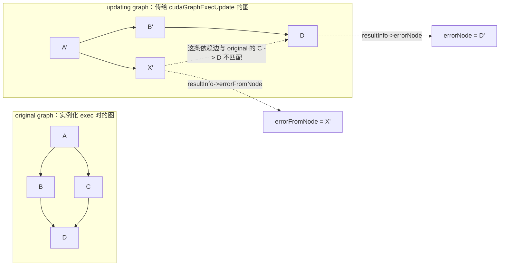

这里 `errorFromNode` 是 **错误边的 from node（上游依赖节点）**，`errorNode` 是 **错误边的 to node（下游被依赖节点）**。换成人话就是：`D'` 这个节点的某条输入依赖错了，错的那条依赖来自 `X'`。如果只是节点数量不同、没有具体错误边，`errorFromNode` 通常就是 `nullptr`。

`cudaGraphExecUpdate()` 的核心不是“两个图看起来差不多”，而是 Runtime 必须能把 original graph 和 updating graph 中的节点 **确定性一一配对**。除了拓扑相同，还要满足以下顺序规则：

1. 每条 captured stream 上的相关 API 调用顺序一致，包括 event wait。
2. 操作同一节点 incoming edge 的 API 顺序一致，依赖数组内部顺序也一致。
3. sink node 的形成顺序一致；节点添加、边删除、依赖集合更新和 `cudaStreamEndCapture()` 都可能影响 sink 排序。

更具体地说：

- **capturing stream 的 API 顺序要一致**：如果 original graph 来自 stream capture，updating graph 重捕获时，作用在同一条 stream 上的 API 调用顺序必须一致；这包括 event wait，以及那些不直接创建节点、但会影响捕获依赖前沿的 API。
- **incoming edge 的操作顺序要一致**：显式 `cudaGraphAddNode()`、`cudaGraphAddDependencies()` / `cudaGraphRemoveDependencies()`、captured stream API 等，只要会操作某个节点的入边，就要按同样顺序发生。传依赖数组时，数组内部顺序也必须匹配。
- **sink node 排序要一致**：sink node 指最终图中没有 outgoing edge 的节点。会影响 sink 排序的操作包括：添加后仍是 sink 的节点、删除边后让某节点变成 sink、`cudaStreamUpdateCaptureDependencies()` 从捕获 stream 的依赖集合移除 sink node、以及 `cudaStreamEndCapture()`。

当 `resultInfo->result == cudaGraphExecUpdateErrorTopologyChanged` 时，常见原因包括：

- original graph 和 updating graph 的直接节点数量不同，此时 `errorNode` 通常为空。
- exit / sink 侧节点集合无法按一致顺序配对，`errorNode` 可能指向 updating graph 中的某个 exit node。
- updating graph 中某个节点的依赖数量和 paired original node 不同，`errorNode` 指向 updating graph 中的该节点。
- 某条依赖边按顺序配对时不匹配，`errorNode` 指向错误边的下游节点，`errorFromNode` 指向不匹配的上游依赖节点。

下面展示“更新失败则回退到重新实例化”的当前接口写法：

```cpp
void updateOrReinstantiate(cudaGraphExec_t& graph_exec, cudaGraph_t updated_graph) { // 尝试用新图更新 exec，并提供安全回退路径。
    if (graph_exec == nullptr) { // 第一次调用还没有可更新的执行图。
        CUDA_CHECK(cudaGraphInstantiate(&graph_exec, updated_graph, 0)); // 直接从首张图完成实例化。
        return; // 首次实例化完成后结束函数。
    } // 结束首次实例化分支。

    cudaGraphExecUpdateResultInfo update_info{}; // 零初始化详细更新结果与错误节点字段。
    const cudaError_t update_status = cudaGraphExecUpdate(graph_exec, updated_graph, &update_info); // 尝试在保留 exec 的前提下更新节点参数。
    if (update_status == cudaSuccess && update_info.result == cudaGraphExecUpdateSuccess) { // Runtime 返回码和详细结果都必须表示成功。
        return; // 原 exec 已更新，无需重新实例化。
    } // 结束成功分支。

    CUDA_CHECK(cudaGraphExecDestroy(graph_exec)); // 更新失败时销毁已经过时的可执行图。
    graph_exec = nullptr; // 清除失效句柄，避免异常路径重复销毁。
    CUDA_CHECK(cudaGraphInstantiate(&graph_exec, updated_graph, 0)); // 从当前更新图重新建立执行快照。
} // 结束 updateOrReinstantiate。
```

### Individual Node Update

只改少数已知节点时，直接更新 exec 节点可以省掉重建图和全图拓扑比较。

```cpp
__host__ cudaError_t cudaGraphNodeSetParams(cudaGraphNode_t node, cudaGraphNodeParams* nodeParams); // 通过 tagged union 修改图模板中的受支持节点。
__host__ cudaError_t cudaGraphExecKernelNodeSetParams(cudaGraphExec_t hGraphExec, cudaGraphNode_t node, const cudaKernelNodeParams* pNodeParams); // 更新 exec 中一个 kernel 节点的发射参数。
__host__ cudaError_t cudaGraphExecMemcpyNodeSetParams(cudaGraphExec_t hGraphExec, cudaGraphNode_t node, const cudaMemcpy3DParms* pNodeParams); // 更新 exec 中一个通用 memcpy 节点。
__host__ cudaError_t cudaGraphExecMemcpyNodeSetParams1D(cudaGraphExec_t hGraphExec, cudaGraphNode_t node, void* dst, const void* src, size_t count, cudaMemcpyKind kind); // 更新 exec 中一个一维 memcpy 节点。
__host__ cudaError_t cudaGraphExecMemsetNodeSetParams(cudaGraphExec_t hGraphExec, cudaGraphNode_t node, const cudaMemsetParams* pNodeParams); // 更新 exec 中一个 memset 节点。
__host__ cudaError_t cudaGraphExecHostNodeSetParams(cudaGraphExec_t hGraphExec, cudaGraphNode_t node, const cudaHostNodeParams* pNodeParams); // 更新 exec 中一个 host node。
__host__ cudaError_t cudaGraphExecNodeSetParams(cudaGraphExec_t graphExec, cudaGraphNode_t node, cudaGraphNodeParams* nodeParams); // 通过 tagged union 更新受支持的 exec 节点。
```

`cudaGraphNodeSetParams()` 直接修改图模板，之后需要实例化或 whole update 才会反映到 exec。各个 `cudaGraphExec*SetParams()` 的 `node` 则是原始 `cudaGraph_t` 中用于实例化 `hGraphExec` 的节点句柄（也就是你原来用哪个cudaGraphNode_t构建的cudaGraph_t，这里传的参数也就是原来的`node`）；它们只改 executable，不会反向修改原图模板，也不会影响已经提交的发射。

```cpp
void updateScaleKernel(cudaGraphExec_t graph_exec, cudaGraphNode_t kernel_node, float* data, std::size_t count, float scale) { // 更新一个已知 scale kernel 节点的地址、长度和缩放因子。
    cudaKernelNodeParams params{}; // 零初始化新的 kernel 发射参数。
    params.func = reinterpret_cast<void*>(scaleKernel); // kernel 所属 context 必须与原节点兼容。
    params.gridDim = dim3(static_cast<unsigned int>((count + 255) / 256), 1, 1); // 根据新元素数计算 grid 大小。
    params.blockDim = dim3(256, 1, 1); // 保持每个 block 256 个线程。
    params.sharedMemBytes = 0; // scale kernel 不需要动态共享内存。
    void* kernel_args[]{&data, &count, &scale}; // 准备三个新参数值的地址。
    params.kernelParams = kernel_args; // 让更新 API 复制新参数值。
    params.extra = nullptr; // 不使用打包参数缓冲区。
    CUDA_CHECK(cudaGraphExecKernelNodeSetParams(graph_exec, kernel_node, &params)); // 原位更新未来发射使用的节点参数。
} // 结束 updateScaleKernel。
```

### 节点启用与禁用

```cpp
__host__ cudaError_t cudaGraphNodeSetEnabled(cudaGraphExec_t hGraphExec, cudaGraphNode_t hNode, unsigned int isEnabled); // 启用或禁用 exec 中的 kernel、memcpy 或 memset 节点。
__host__ cudaError_t cudaGraphNodeGetEnabled(cudaGraphExec_t hGraphExec, cudaGraphNode_t hNode, unsigned int* isEnabled); // 查询受支持节点的当前启停状态。
```

禁用节点时，它在依赖关系上等价于 empty node，原参数仍保留。启停状态不会被 whole graph update 或 individual update 重置；禁用期间更新的参数会在重新启用后生效。这种机制适合先构造“功能超集图”，再在每次发射前开关可选 kernel。

### 更新限制

- **kernel 节点**：函数所属 context 不能改变；原本不使用 CUDA Dynamic Parallelism 的函数不能改成使用它的函数；原本不做 device-side update call 的函数不能改成会做这类调用的函数；cooperative 与 non-cooperative 发射状态不能互换；如果实例化时使用了 `cudaGraphInstantiateFlagUseNodePriority`，节点 priority 属性不能改变；含 device-updatable kernel node 的图不能走 whole graph update。
- **device-side launch 相关 kernel**：如果 `hGraphExec` 不是以 device launch 方式实例化，原本不调用 device-side `cudaGraphLaunch()` 的节点，不能随意更新成会调用它的函数；除非它和实例化时已有 device-side launch 调用的节点在同一 device 上。如果实例化时没有任何这类调用，则不能通过 update 引入。
- **memcpy / memset 节点**：操作数所属 device 和 allocation / mapping context 不能改变；源/目标 memory type 不能改变，例如不能从 device memory 改成 CUDA array；2D memset 通常只能改地址和值；1D memset 允许改维度，但新维度如果无法映射到原先为节点分配的执行资源，也可能失败。
- **conditional 节点**：conditional node 自身参数不支持修改；body graph 内部节点参数递归遵循普通更新限制；conditional handle 的 flags 和默认值会作为 graph update 的一部分更新。
- **external semaphore 节点**：不能改变 semaphore 操作的数量。
- **memory alloc / free 节点**：通用 individual node update 不支持；含 memory node 的 whole update 还受到图实例化关系限制。

更新能力会随 Toolkit 演进，不能只判断“拓扑看起来相同”；必须同时检查 API 返回值和 `cudaGraphExecUpdateResultInfo::result`。

## Child Graph 的接口与所有权

图 24 中的 Y 可以通过专用 child graph API 创建：

```cpp
__host__ cudaError_t cudaGraphAddChildGraphNode(cudaGraphNode_t* pGraphNode, cudaGraph_t graph, const cudaGraphNode_t* pDependencies, size_t numDependencies, cudaGraph_t childGraph); // 克隆 childGraph 并把克隆结果嵌入父图节点。
__host__ cudaError_t cudaGraphChildGraphNodeGetGraph(cudaGraphNode_t node, cudaGraph_t* pGraph); // 取得 child node 内部嵌入图的实际句柄。
__host__ cudaError_t cudaGraphExecChildGraphNodeSetParams(cudaGraphExec_t hGraphExec, cudaGraphNode_t node, cudaGraph_t childGraph); // 用拓扑匹配的新 child graph 更新 exec 中的 child node。
```

- `cudaGraphAddChildGraphNode()` 会在调用时克隆 `childGraph`，所以调用方仍负责原 `childGraph` 的生命周期。
- `cudaGraphChildGraphNodeGetGraph()` 返回的是节点内部图，不再克隆；它由 child node 持有，不能由调用方单独销毁。
- 专用 `cudaGraphAddChildGraphNode()` 不接受含 allocation、free 或 conditional node 的 child graph。
- CUDA 12.9 起，含 memory node 的 child graph 可以通过通用 `cudaGraphAddNode()` 配合 `cudaGraphChildGraphOwnershipMove` 转移给父图，规则在图内存节点一节说明。
- 更新 exec 中的 child graph 时，新旧 child graph 必须拓扑一致，节点添加顺序也要匹配；限制递归应用到更深层子图。

## Conditional Graph Nodes

条件节点把数据相关的控制流留在 device 上，避免为了一个分支或循环条件把数据送回 host。条件在节点依赖满足时由 GPU 求值，body graph 可以继续包含受支持的 kernel、memcpy、memset、empty、child graph 和嵌套 conditional node。

### 条件 handle 与核心接口

**原型**

```cpp
__host__ cudaError_t cudaGraphConditionalHandleCreate(cudaGraphConditionalHandle* pHandle_out, cudaGraph_t graph, unsigned int defaultLaunchValue = 0, unsigned int flags = 0); // 为 graph 创建一个条件 handle。
__host__ cudaError_t cudaGraphConditionalHandleCreate_v2(cudaGraphConditionalHandle* pHandle_out, cudaGraph_t graph, cudaExecutionContext_t ctx = nullptr, unsigned int defaultLaunchValue = 0, unsigned int flags = 0); // 显式指定 execution context 并创建条件 handle。
__device__ void cudaGraphSetConditional(cudaGraphConditionalHandle handle, unsigned int value); // 从 device 代码写入条件值。
```

**参数**

| 参数 | 含义 |
| --- | --- |
| `pHandle_out` | 输出新 handle。handle 没有单独的销毁接口，生命周期依附所属图。 |
| `graph` | 将要包含该条件节点的图；handle 必须最终绑定到此图或其子图中的一个条件节点。 |
| `defaultLaunchValue` | 每次 graph execution 开始时可写入的默认条件值。 |
| `flags` | 0 或 `cudaGraphCondAssignDefault`；后者让默认值在每次图执行开始时生效。 |
| `value` | 由 device 写入的 32 位无符号条件值。IF/WHILE 把 0 当 false，SWITCH 把它当 body 下标。 |

一个 handle 必须只关联一个条件节点。若没有设置 `cudaGraphCondAssignDefault`，每次 graph execution 开始时条件值是**未定义的**，不能假设它会保留上一次执行的值；应在上游 kernel 中明确设置。创建却未绑定到条件节点的 handle 可能导致实例化失败。

`cudaConditionalNodeParams` 的关键字段：

| 字段 | 含义 |
| --- | --- |
| `handle` | 预先创建并且只绑定到这个条件节点的 handle。 |
| `type` | `cudaGraphCondTypeIf`、`cudaGraphCondTypeWhile` 或 `cudaGraphCondTypeSwitch`。 |
| `size` | body graph 数量：WHILE 必须为 1；IF 为 1 或 2；SWITCH 为任意大于 0 的值。 |
| `phGraph_out` | CUDA 创建并持有的 body graph 数组，在条件节点整个生命周期内有效。 |
| `ctx` | 条件节点使用的 CUDA execution context；普通接口通常使用当前 context。 |

### 图 27：IF 条件节点

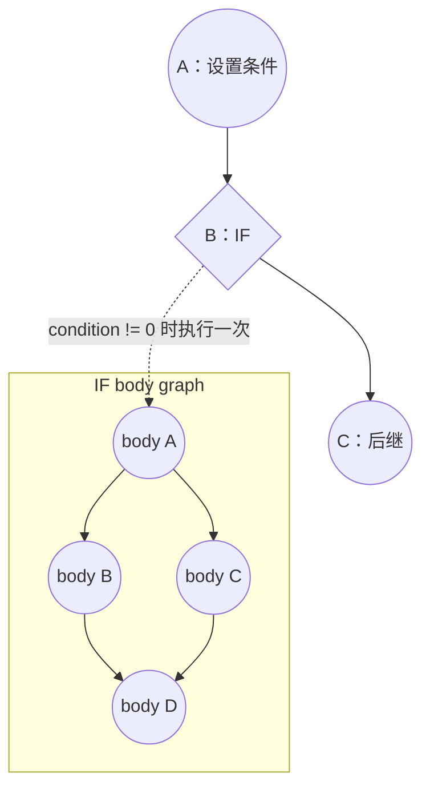

**图 27：Conditional IF Node。** 条件非零时执行 `phGraph_out[0]` 一次；若 `size == 2`，条件为零时执行 `phGraph_out[1]` 一次。`size == 1` 时，零值表示跳过 body，不存在隐式 else。

### Graph API 创建 IF

```cpp
__global__ void setConditionKernel(cudaGraphConditionalHandle handle, unsigned int value) { // 用上游 kernel 决定后续 IF 分支。
    if (blockIdx.x == 0 && threadIdx.x == 0) { // 只让一个线程写条件 handle，避免无意义的重复写入。
        cudaGraphSetConditional(handle, value); // 把非零值解释为执行 IF body。
    } // 结束单线程条件写入分支。
} // 结束 setConditionKernel。

__global__ void conditionalBodyKernel(float* data, std::size_t count) { // 定义 IF body 内的示例数据处理 kernel。
    const std::size_t index = blockIdx.x * blockDim.x + threadIdx.x; // 计算当前线程对应的一维元素下标。
    if (index < count) { // 防止 grid 向上取整后访问数组边界之外。
        data[index] *= 2.0F; // 只在 IF 条件成立时执行这一数据变换。
    } // 结束边界检查。
} // 结束 conditionalBodyKernel。

cudaGraph_t buildIfGraphWithApi(float* data, std::size_t count, unsigned int condition_value) { // 用通用 Graph API 创建一个 IF 条件图。
    cudaGraph_t graph = nullptr; // 保存父图模板。
    CUDA_CHECK(cudaGraphCreate(&graph, 0)); // 创建空父图。

    cudaGraphConditionalHandle handle{}; // 保存属于 graph 的条件 handle。
    CUDA_CHECK(cudaGraphConditionalHandleCreate(&handle, graph, 0, 0)); // 不设置默认值，要求上游 kernel 每次都写条件。

    cudaGraphNodeParams setter_params{}; // 零初始化条件设置 kernel 的通用节点参数。
    setter_params.type = cudaGraphNodeTypeKernel; // 指明这是 kernel 节点。
    setter_params.kernel.func = reinterpret_cast<void*>(setConditionKernel); // 指定写条件的 device 函数。
    setter_params.kernel.gridDim = dim3(1, 1, 1); // 只发射一个 block。
    setter_params.kernel.blockDim = dim3(1, 1, 1); // 只需要一个线程写 handle。
    setter_params.kernel.sharedMemBytes = 0; // 不使用动态共享内存。
    void* setter_args[]{&handle, &condition_value}; // 准备 handle 与本次条件值的参数地址。
    setter_params.kernel.kernelParams = setter_args; // 指定逐参数数组。
    setter_params.kernel.extra = nullptr; // 不使用打包参数。
    cudaGraphNode_t setter_node = nullptr; // 保存上游条件设置节点。
    CUDA_CHECK(cudaGraphAddNode(&setter_node, graph, nullptr, nullptr, 0, &setter_params)); // 添加无前驱的 setter kernel。

    cudaGraphNodeParams conditional_params{}; // 零初始化条件节点参数和输出区域。
    conditional_params.type = cudaGraphNodeTypeConditional; // 指明节点类型为 conditional。
    conditional_params.conditional.handle = handle; // 把预先创建的 handle 绑定到这个节点。
    conditional_params.conditional.type = cudaGraphCondTypeIf; // 选择 IF 控制流语义。
    conditional_params.conditional.size = 1; // 只创建 true body，不创建 else body。
    cudaGraphNode_t conditional_node = nullptr; // 保存 IF 节点句柄。
    CUDA_CHECK(cudaGraphAddNode(&conditional_node, graph, &setter_node, nullptr, 1, &conditional_params)); // 在 setter 之后添加 IF，并让 CUDA 写回 body graph 数组。

    cudaGraph_t body_graph = conditional_params.conditional.phGraph_out[0]; // 取得由 CUDA 创建并归条件节点持有的 true body。
    cudaGraphNodeParams body_params{}; // 零初始化 body kernel 的参数。
    body_params.type = cudaGraphNodeTypeKernel; // 指明 body 内添加 kernel 节点。
    body_params.kernel.func = reinterpret_cast<void*>(conditionalBodyKernel); // 指定真正的条件工作。
    body_params.kernel.gridDim = dim3(static_cast<unsigned int>((count + 255) / 256), 1, 1); // 覆盖全部输入元素。
    body_params.kernel.blockDim = dim3(256, 1, 1); // 每个 block 使用 256 个线程。
    body_params.kernel.sharedMemBytes = 0; // body kernel 不需要动态共享内存。
    void* body_args[]{&data, &count}; // 准备 device 指针和元素数的地址。
    body_params.kernel.kernelParams = body_args; // 指定两个 kernel 参数。
    body_params.kernel.extra = nullptr; // 不使用打包参数。
    cudaGraphNode_t body_node = nullptr; // 保存 body graph 中的 kernel 节点。
    CUDA_CHECK(cudaGraphAddNode(&body_node, body_graph, nullptr, nullptr, 0, &body_params)); // 把条件工作作为 body 的根节点加入。
    return graph; // 返回父图；销毁父图时一并销毁条件 body。
} // 结束 buildIfGraphWithApi。
```

### 用 Stream Capture 填充同一个 IF body

创建 conditional node 本身需要 Graph API，但 `phGraph_out[i]` 返回的 body graph 可以用显式节点 API，也可以用 `cudaStreamBeginCaptureToGraph()` 填充。下面的函数可以替换上例中添加 `body_node` 的部分：

```cpp
void populateIfBodyWithCapture(cudaGraph_t body_graph, cudaStream_t capture_stream, float* data, std::size_t count) { // 把已有 stream 写法捕获进一个空的条件 body graph。
    CUDA_CHECK(cudaStreamBeginCaptureToGraph(capture_stream, body_graph, nullptr, nullptr, 0, cudaStreamCaptureModeGlobal)); // 从 body graph 的根部开始向已有图捕获。
    conditionalBodyKernel<<<(count + 255) / 256, 256, 0, capture_stream>>>(data, count); // 捕获条件为真时需要执行的 kernel。
    CUDA_CHECK(cudaGetLastError()); // 检查 body kernel 发射配置。
    cudaGraph_t captured_graph = nullptr; // 接收 end capture 返回的目标图句柄。
    CUDA_CHECK(cudaStreamEndCapture(capture_stream, &captured_graph)); // 结束捕获；返回的就是已经填充的目标图。
    if (captured_graph != body_graph) { // 防御性检查 Runtime 是否返回了预期的已有图句柄。
        throw std::runtime_error("unexpected graph returned from conditional body capture"); // 避免把工作错误地认为已经加入 body graph。
    } // 结束图句柄一致性检查。
} // 结束 populateIfBodyWithCapture；body_graph 的所有权仍属于 conditional node。
```

### 图 28：WHILE 条件节点

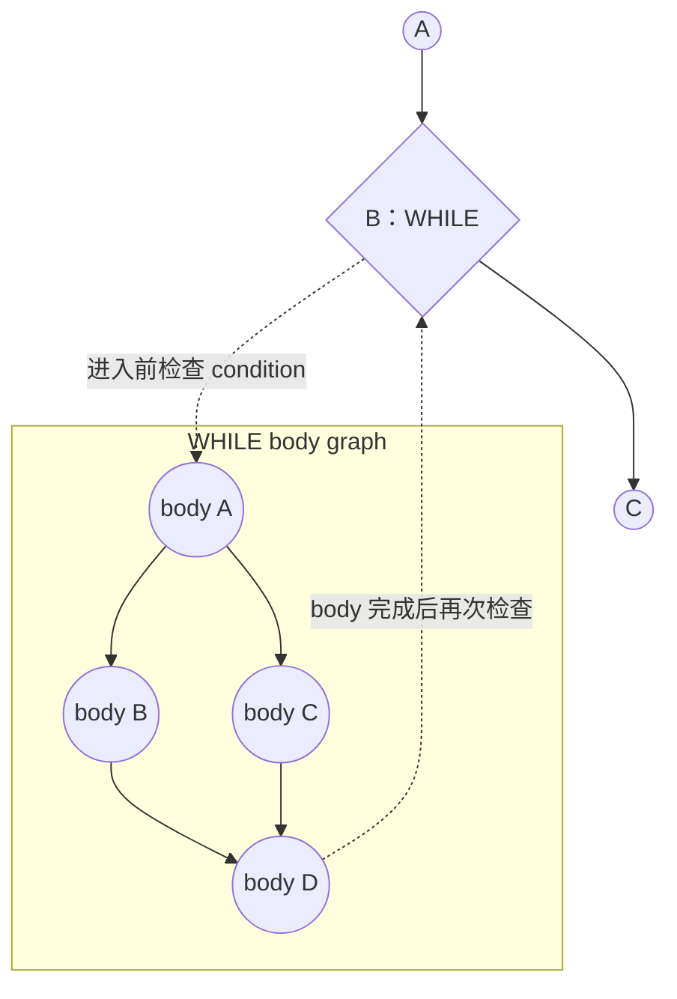

**图 28：Conditional WHILE Node。** 执行到 B 时先检查条件；非零则执行 body，body 完成后再次检查。循环若要结束，body 内必须有 kernel 把 handle 写成 0，否则图会一直循环。

```cpp
__global__ void loopBodyKernel(cudaGraphConditionalHandle handle, int* counter) { // 每轮 WHILE body 更新计数器和循环条件。
    if (blockIdx.x == 0 && threadIdx.x == 0) { // 只允许一个线程修改共享循环状态。
        const int remaining = --(*counter); // 在 device 上递减剩余迭代次数。
        if (remaining == 0) { // 计数归零时应结束循环。
            cudaGraphSetConditional(handle, 0); // 把 handle 清零，使下一次条件检查退出 WHILE。
        } // 结束退出条件分支。
    } // 结束单线程状态更新分支。
} // 结束 loopBodyKernel。

cudaGraphNode_t addWhileNode(cudaGraph_t graph, cudaGraphConditionalHandle* handle_out) { // 给 graph 添加一个每次发射默认进入的 WHILE 节点。
    CUDA_CHECK(cudaGraphConditionalHandleCreate(handle_out, graph, 1, cudaGraphCondAssignDefault)); // 每次 graph execution 开始时把条件重置为 1。
    cudaGraphNodeParams while_params{}; // 零初始化 WHILE 节点参数。
    while_params.type = cudaGraphNodeTypeConditional; // 指明通用节点类型为 conditional。
    while_params.conditional.handle = *handle_out; // 绑定调用方接收的 handle。
    while_params.conditional.type = cudaGraphCondTypeWhile; // 选择 WHILE 语义。
    while_params.conditional.size = 1; // WHILE 只能有一个 body graph。
    cudaGraphNode_t while_node = nullptr; // 保存新条件节点句柄。
    CUDA_CHECK(cudaGraphAddNode(&while_node, graph, nullptr, nullptr, 0, &while_params)); // 添加无前驱的 WHILE 节点并生成 body graph。
    return while_node; // 返回节点句柄，调用方可继续取得并填充 body。
} // 结束 addWhileNode。
```

### 图 29：SWITCH 条件节点

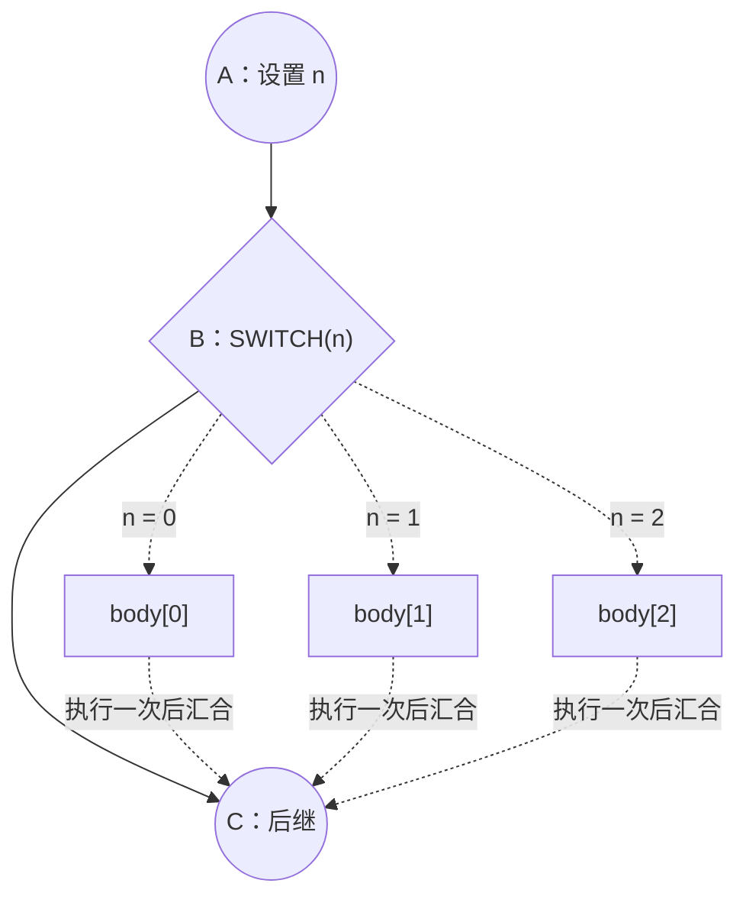

**图 29：Conditional SWITCH Node。** 条件等于从 0 开始的 `n` 时，只执行 `phGraph_out[n]` 一次；若 `n >= size`，所有 body 都不执行，然后条件节点完成。

```cpp
cudaGraphNode_t addSwitchNode(cudaGraph_t graph, cudaGraphNode_t setter_node, cudaGraphConditionalHandle handle, unsigned int branch_count, cudaGraph_t** bodies_out) { // 创建拥有 branch_count 个 body 的 SWITCH 节点。
    cudaGraphNodeParams switch_params{}; // 零初始化 SWITCH 参数和输出区域。
    switch_params.type = cudaGraphNodeTypeConditional; // 指明通用节点类型为 conditional。
    switch_params.conditional.handle = handle; // 绑定由上游 setter kernel 写入的条件 handle。
    switch_params.conditional.type = cudaGraphCondTypeSwitch; // 选择 SWITCH 分派语义。
    switch_params.conditional.size = branch_count; // 为下标 0 到 branch_count - 1 创建 body graph。
    cudaGraphNode_t switch_node = nullptr; // 保存新 SWITCH 节点句柄。
    CUDA_CHECK(cudaGraphAddNode(&switch_node, graph, &setter_node, nullptr, 1, &switch_params)); // 在 setter 之后添加条件节点并生成 body 数组。
    *bodies_out = switch_params.conditional.phGraph_out; // 把 CUDA 持有的 body graph 数组借给调用方填充。
    return switch_node; // 返回 SWITCH 节点句柄。
} // 结束 addSwitchNode；调用方不得释放 bodies_out 指向的数组或图。
```

### Conditional body 的限制

- body graph 的所有节点必须位于单个 device。
- 允许的节点类型只有 kernel、empty、memcpy、memset、child graph 与 conditional，并递归应用到嵌套图。
- body 内 kernel 不能使用 CUDA Dynamic Parallelism，也不能执行 Device Graph Launch。
- cooperative kernel 只有在不使用 MPS 时才允许。
- memcpy / memset 只能涉及 device memory 或 pinned device-mapped host memory，不能涉及 CUDA array；操作数在实例化时必须可由当前 device 访问。
- conditional 可以嵌套，但每一层都要满足相同约束；复杂控制流尤其要确保某条 device 路径最终更新 WHILE 条件。
- 多个 device 线程并发写同一个 handle 属于未定义行为；条件设置 kernel 应明确选择唯一写入者。
- 含 conditional node 的图不能 clone，不能作为 child graph，并且同一时刻只能有一个 executable instantiation。

## Graph Memory Nodes

Graph memory node 把内存的分配与释放也放进 GPU 的依赖序列。它与在 host 上提前 `cudaMalloc()` 的根本区别是：**allocation 的执行生命周期由 GPU 到达节点的先后决定**，CUDA 因而可以根据图中可证明的生命周期复用虚拟地址或物理页。

需要区分三个概念：

- **allocation node 的生命周期**：从节点加入图开始，到该节点随图被销毁为止；节点存在期间，CUDA 为它选择的虚拟地址保持固定。
- **graph allocation 的执行生命周期**：每次发射时，从 GPU 到达 allocation node 开始，到 GPU 到达对应 free node / `cudaFreeAsync()`，或 host 调用同步 `cudaFree()` 为止。
- **物理内存映射的生命周期**：由 CUDA 管理，可以在实例化、upload、launch 或执行时改变；固定虚拟地址并不代表一直映射同一批物理页。

因此，同一 allocation node 在重复实例化与重复发射之间可以直接把 `dptr` 写进 kernel 参数，无须因底层物理页变化而更新节点；但 allocation 一旦被 free，其旧内容不再持久，旧指针也不能继续访问。

### 内存节点接口

**原型**

```cpp
__host__ cudaError_t cudaGraphAddMemAllocNode(cudaGraphNode_t* pGraphNode, cudaGraph_t graph, const cudaGraphNode_t* pDependencies, size_t numDependencies, cudaMemAllocNodeParams* nodeParams); // 添加 allocation node，并通过 nodeParams->dptr 返回固定虚拟地址。
__host__ cudaError_t cudaGraphAddMemFreeNode(cudaGraphNode_t* pGraphNode, cudaGraph_t graph, const cudaGraphNode_t* pDependencies, size_t numDependencies, void* dptr); // 添加释放 graph allocation 的 free node。
__host__ cudaError_t cudaGraphMemAllocNodeGetParams(cudaGraphNode_t node, cudaMemAllocNodeParams* params_out); // 查询 allocation node 的驻留位置、访问描述、大小和地址。
__host__ cudaError_t cudaGraphMemFreeNodeGetParams(cudaGraphNode_t node, void* dptr_out); // 把 free node 保存的 device 地址写到调用方提供的输出位置。
__host__ cudaError_t cudaDeviceGraphMemTrim(int device); // 把指定 device 的未使用 graph memory 物理缓存归还给操作系统。
__host__ cudaError_t cudaDeviceGetGraphMemAttribute(int device, cudaGraphMemAttributeType attr, void* value); // 查询 graph memory pool 的当前值或高水位。
__host__ cudaError_t cudaDeviceSetGraphMemAttribute(int device, cudaGraphMemAttributeType attr, void* value); // 重置受支持的 graph memory pool 高水位属性。
```

这些专用接口仍然有效；CUDA 13.3 Programming Guide 的内存节点示例主要使用通用 `cudaGraphAddNode()`。两条路径表达的是相同节点：

```cpp
struct cudaMemAllocNodeParams { // 概念性列出 allocation node 的公共字段。
    size_t accessDescCount; // 指定 accessDescs 中的 peer GPU 访问描述数量。
    const cudaMemAccessDesc* accessDescs; // 指向 peer GPU 访问权限数组；驻留 GPU 无须重复列出。
    size_t bytesize; // 指定要分配的字节数。
    void* dptr; // 由 CUDA 写回 allocation node 对应的固定虚拟地址。
    cudaMemPoolProps poolProps; // 指定分配类型、驻留位置和不支持 IPC 的 handle 类型。
}; // 结束 cudaMemAllocNodeParams 的概念性声明。
```

| 字段或参数 | 含义与约束 |
| --- | --- |
| `poolProps.allocType` | 图内存使用 `cudaMemAllocationTypePinned`。这里的 pinned 指物理分配属性，不等同于普通语境中的 pinned host buffer。 |
| `poolProps.location` | 当前使用 `cudaMemLocationTypeDevice`，`id` 是 allocation 的驻留 device。 |
| `poolProps.handleTypes` | 必须为 `cudaMemHandleTypeNone`；graph allocation 不支持 IPC 导出。 |
| `bytesize` | 申请字节数，成功添加节点后才可使用输出 `dptr`。 |
| `accessDescs` | 描述 peer GPU 的显式访问权限；数量不能超过 GPU 数，驻留 device 的访问隐含存在。 |
| `dptr` | allocation node 创建时确定的虚拟地址。不是在 graph launch 返回后才生成。 |

成功返回 `cudaSuccess`。常见错误包括参数无效、功能不受支持和内存不足。free node 会拒绝无效地址、不是由 allocation node 返回的地址，以及同一 graph allocation 在同一图中的第二次释放。

### 图 30：合法访问区间

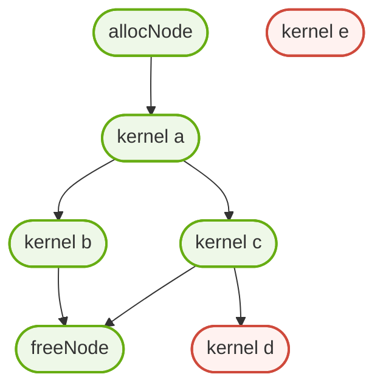

**图 30：Kernel Nodes。** a、b、c 都能从依赖路径证明“在 alloc 之后且在 free 之前”，所以可以访问 allocation。e 与 alloc 无依赖，不能访问。d 和 free 都只是 c 的后继，二者彼此无序；因此不能证明 d 在 free 前完成，d 也不能访问这块内存。源代码书写顺序、host 线程先后和 kernel 内轮询标志都不能替代这种 CUDA 可见的 GPU ordering。

### 用 Graph API 显式创建 alloc → kernel → free

下面使用通用六参数 `cudaGraphAddNode()`，因为它能直接展示 `MemAlloc` 与 `MemFree` 的 tagged-union 参数。专用 `cudaGraphAddMemAllocNode()` / `cudaGraphAddMemFreeNode()` 可以构造相同拓扑。

```cpp
__global__ void initializeGraphMemory(float* data, std::size_t count) { // 初始化 graph allocation 中的所有 float 元素。
    const std::size_t index = blockIdx.x * blockDim.x + threadIdx.x; // 计算当前线程负责的一维下标。
    if (index < count) { // 防止最后一个 block 中多余线程越界。
        data[index] = static_cast<float>(index); // 把确定性测试值写入 graph allocation。
    } // 结束边界检查。
} // 结束 initializeGraphMemory。

struct GraphMemoryObjects { // 汇总示例创建的图模板、可执行图和固定虚拟地址。
    cudaGraph_t graph; // 保存含 memory node 的图模板，调用方最终负责销毁。
    cudaGraphExec_t exec; // 保存唯一允许同时存在的 executable instantiation。
    float* device_data; // 保存 allocation node 创建时返回的固定虚拟地址。
}; // 结束 GraphMemoryObjects。

GraphMemoryObjects buildMemoryGraphWithApi(std::size_t count, int device) { // 显式构造 alloc、使用和 free 三节点图。
    cudaGraph_t graph = nullptr; // 保存将要构造的图模板。
    CUDA_CHECK(cudaGraphCreate(&graph, 0)); // 创建空图。

    cudaGraphNodeParams alloc_params{}; // 零初始化 allocation node 的 tagged union。
    alloc_params.type = cudaGraphNodeTypeMemAlloc; // 选择 graph memory allocation 节点类型。
    alloc_params.alloc.poolProps.allocType = cudaMemAllocationTypePinned; // 使用 graph allocation 支持的物理分配类型。
    alloc_params.alloc.poolProps.handleTypes = cudaMemHandleTypeNone; // 禁止为 graph allocation 请求 IPC handle。
    alloc_params.alloc.poolProps.location.type = cudaMemLocationTypeDevice; // 指明物理内存驻留在 CUDA device。
    alloc_params.alloc.poolProps.location.id = device; // 选择调用方传入的驻留 device。
    alloc_params.alloc.accessDescs = nullptr; // 此例不额外授权 peer GPU 访问。
    alloc_params.alloc.accessDescCount = 0; // peer 访问描述数组为空。
    alloc_params.alloc.bytesize = count * sizeof(float); // 请求容纳 count 个 float 的字节数。
    cudaGraphNode_t alloc_node = nullptr; // 保存 allocation node 句柄。
    CUDA_CHECK(cudaGraphAddNode(&alloc_node, graph, nullptr, nullptr, 0, &alloc_params)); // 添加根 allocation node，并让 CUDA 写回 dptr。
    float* device_data = static_cast<float*>(alloc_params.alloc.dptr); // 取得可写进后续节点参数的固定虚拟地址。

    cudaGraphNodeParams kernel_params{}; // 零初始化初始化 kernel 的节点参数。
    kernel_params.type = cudaGraphNodeTypeKernel; // 选择 kernel 节点类型。
    kernel_params.kernel.func = reinterpret_cast<void*>(initializeGraphMemory); // 指定要执行的初始化 kernel。
    kernel_params.kernel.gridDim = dim3(static_cast<unsigned int>((count + 255) / 256), 1, 1); // 创建足够线程覆盖所有元素。
    kernel_params.kernel.blockDim = dim3(256, 1, 1); // 每个 block 使用 256 个线程。
    kernel_params.kernel.sharedMemBytes = 0; // 该 kernel 不使用动态共享内存。
    void* kernel_args[]{&device_data, &count}; // 准备指针值与元素数值各自的地址。
    kernel_params.kernel.kernelParams = kernel_args; // 让 Runtime 复制两个 kernel 参数值。
    kernel_params.kernel.extra = nullptr; // 不使用打包参数缓冲区。
    cudaGraphNode_t kernel_node = nullptr; // 保存使用 allocation 的 kernel 节点句柄。
    CUDA_CHECK(cudaGraphAddNode(&kernel_node, graph, &alloc_node, nullptr, 1, &kernel_params)); // 建立 alloc 到 kernel 的 GPU 顺序。

    cudaGraphNodeParams free_params{}; // 零初始化 free node 的 tagged union。
    free_params.type = cudaGraphNodeTypeMemFree; // 选择 graph memory free 节点类型。
    free_params.free.dptr = device_data; // 指定 allocation node 返回的地址。
    cudaGraphNode_t free_node = nullptr; // 保存 free node 句柄。
    CUDA_CHECK(cudaGraphAddNode(&free_node, graph, &kernel_node, nullptr, 1, &free_params)); // 让 free 等待最后一个内存使用者完成。

    cudaGraphExec_t exec = nullptr; // 保存该内存图唯一同时存在的可执行实例。
    CUDA_CHECK(cudaGraphInstantiate(&exec, graph, 0)); // 校验内存生命周期并实例化图。
    return GraphMemoryObjects{graph, exec, device_data}; // 把三个句柄值的所有权交给调用方。
} // 结束 buildMemoryGraphWithApi。
```

含 allocation/free node 的 `cudaGraph_t` 有更严格的结构所有权：

- node 或 edge 不能被删除，图不能被 clone。
- 同一时刻只能存在一个由该图实例化的 `cudaGraphExec_t`。
- 它不能通过普通 clone 型 child API 嵌入，只能用 CUDA 12.9 起的 ownership-move 路径。
- 若 allocation 在 owner graph 内有 free node，它只能在 owner graph 中的合法区间内使用，不能再从外部或另一张图释放。

### 用 Stream Capture 捕获 `cudaMallocAsync` / `cudaFreeAsync`

流有序分配 API 在 capture 中会自动变成 allocation/free node。原来正确的 stream 顺序也就自然变成正确的图依赖：

```cpp
cudaGraph_t captureMemoryGraph(cudaStream_t stream, std::size_t count) { // 捕获一段包含异步分配和释放的现有 stream 代码。
    CUDA_CHECK(cudaStreamBeginCapture(stream, cudaStreamCaptureModeGlobal)); // 在非 legacy stream 上开始严格模式捕获。
    float* device_data = nullptr; // 接收捕获期间创建的 graph allocation 虚拟地址。
    CUDA_CHECK(cudaMallocAsync(reinterpret_cast<void**>(&device_data), count * sizeof(float), stream)); // 捕获 allocation node，并立即取得供后续捕获调用引用的地址。
    initializeGraphMemory<<<(count + 255) / 256, 256, 0, stream>>>(device_data, count); // 捕获一个排在 allocation 后的内存使用节点。
    CUDA_CHECK(cudaGetLastError()); // 检查被捕获 kernel 的发射配置。
    CUDA_CHECK(cudaFreeAsync(device_data, stream)); // 捕获排在 kernel 后的 free node。
    cudaGraph_t graph = nullptr; // 接收捕获得到的图模板。
    CUDA_CHECK(cudaStreamEndCapture(stream, &graph)); // 结束 origin stream 捕获并返回完整内存图。
    return graph; // 把图模板交给调用方实例化与销毁。
} // 结束 captureMemoryGraph。
```

需要从指定 memory pool 分配时，当前正确接口是：

```cpp
__host__ cudaError_t cudaMallocFromPoolAsync(void** ptr, size_t size, cudaMemPool_t memPool, cudaStream_t stream); // 从指定 pool 执行可捕获的流有序分配。
```

Programming Guide 的 peer-access 示例曾写成不存在的四参数 `cudaMallocAsync(..., memPool, stream)`；可编译代码应使用 `cudaMallocFromPoolAsync()`。capture 会快照 memory pool 在**捕获当时**的 peer access 设置，之后修改 pool 的访问权限不会追溯修改已经捕获的 allocation node。

### 图外使用、释放与 `AutoFreeOnLaunch`

owner graph 可以不包含 free node。此时一次发射产生的 allocation 在图完成后仍保持 live，只要后续访问通过同一 stream 或 event 建立在图执行之后，就可以在普通 stream 工作或另一张图中使用。最终可通过以下方式之一释放：

- host 调用 `cudaFree()`；其生命周期终点是该同步 API 的调用时刻。
- 在正确排序的 stream 上调用 `cudaFreeAsync()`。
- 发射一张包含该地址 free node 的图。
- 用 `cudaGraphInstantiateFlagAutoFreeOnLaunch` 实例化 owner graph，让下一次发射在重新创建 allocation 前异步释放上一轮尚未释放的 allocation。

普通 exec 在上一轮 allocation 仍 live 时直接重新发射，会返回 `cudaErrorInvalidValue`。`AutoFreeOnLaunch` 解决的是**重复发射前**的释放，不是最终资源清理：销毁 graph 或 exec 都不会自动释放仍 live 的 allocation，最后仍要显式 `cudaFree()` / `cudaFreeAsync()`。该 flag 不能与 `cudaGraphInstantiateFlagDeviceLaunch` 同时使用。

```cpp
cudaGraphExec_t instantiateAutoFreeGraph(cudaGraph_t graph) { // 为包含未配对 allocation 的图启用重复发射前自动释放。
    cudaGraphExec_t exec = nullptr; // 接收可执行图句柄。
    CUDA_CHECK(cudaGraphInstantiate(&exec, graph, cudaGraphInstantiateFlagAutoFreeOnLaunch)); // 请求每次重启前释放上一轮遗留 allocation。
    return exec; // 返回 exec；调用方仍负责最终释放 live allocation 和销毁 exec。
} // 结束 instantiateAutoFreeGraph。
```

无论哪一种释放路径，访问与 free 之间都必须存在 CUDA 能理解的 graph、stream 或 event ordering。kernel 内通过内存标志自行同步属于 out-of-band synchronization，不能证明 free 的合法顺序；虚拟别名存在时，生命周期外的访问甚至可能悄悄破坏另一块仍然 live 的 allocation。

### 含内存节点的 child graph：转移所有权

`cudaGraphAddChildGraphNode()` 会 clone 子图，因此拒绝 memory node。CUDA 12.9 起，含 allocation/free node 的子图可以通过通用节点 API 配合 `cudaGraphChildGraphOwnershipMove` 加入父图：

```cpp
cudaGraphNodeParams child_params{}; // 零初始化 child graph 的通用节点参数。
child_params.type = cudaGraphNodeTypeGraph; // 选择 child graph 节点类型。
child_params.graph.graph = child_graph_with_memory; // 指定将被转移的含内存节点子图。
child_params.graph.ownership = cudaGraphChildGraphOwnershipMove; // 把 child 的所有权整体移动给父图节点。
cudaGraphNode_t child_node = nullptr; // 接收父图中的 child node 句柄。
CUDA_CHECK(cudaGraphAddNode(&child_node, parent_graph, nullptr, nullptr, 0, &child_params)); // 以 ownership move 方式把子图加入父图。
```

move 成功后，原 child handle 由 parent 拥有：不能独立实例化或销毁，不能再加入另一 parent，不能作为 `cudaGraphExecUpdate()` 的输入，也不能继续向其中添加 allocation/free node。含 conditional node 的图仍不能作为 child graph。

### 图 31：不重叠生命周期可以复用地址

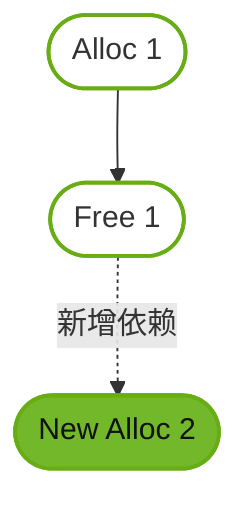

**图 31：Adding New Alloc Node 2。** `Alloc 2` 依赖 `Free 1`，两个 allocation 的 GPU 有序生命周期必定不重叠，CUDA 可以把刚释放的虚拟地址直接用于新 allocation。因此，不同 allocation 返回的指针值不保证唯一；指针相等也不代表它们是同一次 allocation。

### 图 32：可能重叠时必须使用另一地址

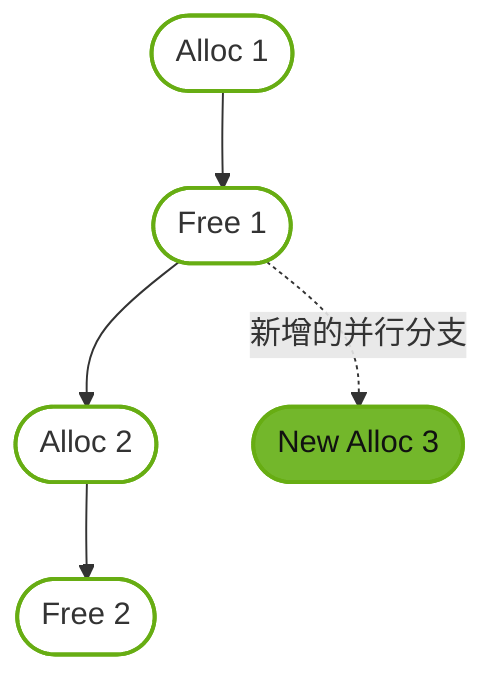

**图 32：Adding New Alloc Node 3。** `Alloc 2` 与新加入的 `Alloc 3` 都在 `Free 1` 后，但两者彼此无依赖，所以生命周期可能重叠。若 `Alloc 2` 已经复用了 `Alloc 1` 的地址，`Alloc 3` 必须使用另一个地址。Programming Guide 邻近正文一处写成“new allocation node (4)”，按图、caption 和后续描述应为 node 3。

### 图 33：不同图之间共享物理页

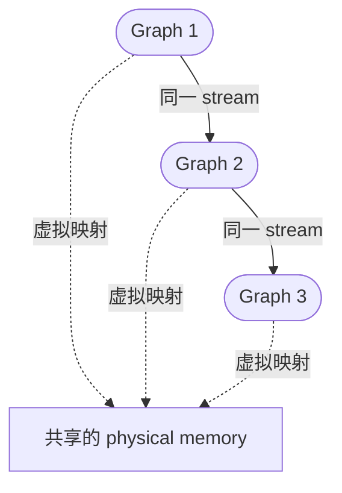

**图 33：Sequentially Launched Graphs。** 三张图在同一 stream 中顺序发射，并且各自释放自己分配的内存，因此执行不重叠。它们可以保有不同虚拟地址，却在各自执行期间映射到同一批物理页。图中的虚线表示物理别名关系，不是 graph dependency edge。

### 映射性能、pool 统计与 peer access

物理 mapping 通常被保留以优化后续 launch。以下情况容易触发相对昂贵的 remap：

- 把含 memory node 的同一张图改发射到另一条 stream，使它可能与原先共享物理页的图并发。
- 调用 `cudaDeviceGraphMemTrim()` 主动释放闲置物理页。
- 重启一张图时，另一张图仍有 live allocation 占用原本可共享的物理页。

实践上应让同一 exec 稳定使用同一条 stream。`cudaGraphUpload(exec, stream)` 可以把首次物理分配与 mapping 成本提前；随后也在**同一条 stream** 发射才最有机会避免再次映射。

graph memory pool 与 stream-ordered allocator 的 pool 相互独立，`cudaMemPoolTrimTo()` 不会裁剪 graph pool。四个查询属性都以 `uint64_t` 字节数表示：

| 属性 | 含义 | 可否通过 Set 修改 |
| --- | --- | --- |
| `cudaGraphMemAttrUsedMemCurrent` | 当前至少被一张图映射使用的物理内存 | 否 |
| `cudaGraphMemAttrUsedMemHigh` | 上次重置以来的 used 高水位 | 只能写 0 重置 |
| `cudaGraphMemAttrReservedMemCurrent` | 当前进程为 graph allocation 保留的物理内存 | 否 |
| `cudaGraphMemAttrReservedMemHigh` | 上次重置以来的 reserved 高水位 | 只能写 0 重置 |

`cudaDeviceGraphMemTrim(device)` 只归还没有被 live allocation、已经排队的图或正在执行的图使用的物理块。它能降低进程的保留显存，但下一次发射必须重新分配和映射，不能放在热路径里频繁调用。

多 GPU 场景可通过 allocation 参数中的 `accessDescs` 请求 peer 访问。驻留 device 的 read/write 权限是隐含的；其他 device 当前应使用 `cudaMemAccessFlagsProtReadWrite`。即使虚拟地址复用让某一地址偶然映射到了更多 GPU，也不能依赖未显式请求的访问权限。

## Device Graph Launch

Device Graph Launch 允许正在执行的 graph kernel 直接发射另一张 executable graph，从而把数据相关的工作调度留在 GPU，不必为每次决策往返 host。它不是 CUDA Dynamic Parallelism 的别名：发射目标是 host 预先实例化并 upload 的 `cudaGraphExec_t`，而不是由 device 动态构造一张新图。

### 核心接口与实例化参数

```cpp
__host__ __device__ cudaError_t cudaGraphLaunch(cudaGraphExec_t graphExec, cudaStream_t stream); // 在 host stream 或 device 专用 launch stream 中发射 executable graph。
__host__ cudaError_t cudaGraphUpload(cudaGraphExec_t graphExec, cudaStream_t stream); // 预先把 exec 所需的 device 资源上传并按 stream 排序。
__device__ cudaGraphExec_t cudaGetCurrentGraphExec(void); // 在 device graph 内取得当前 exec，其他 device 执行环境中返回空句柄。
__host__ cudaError_t cudaGraphInstantiate(cudaGraphExec_t* pGraphExec, cudaGraph_t graph, unsigned long long flags = 0); // 用 flags 实例化普通或 device-launchable graph。
__host__ cudaError_t cudaGraphInstantiateWithParams(cudaGraphExec_t* pGraphExec, cudaGraph_t graph, cudaGraphInstantiateParams* instantiateParams); // 用结构体指定 flags、upload stream 并接收详细结果。
```

`cudaGraphInstantiateParams` 的主要字段：

| 字段 | 方向 | 含义 |
| --- | --- | --- |
| `flags` | 输入 | 实例化行为；device graph 至少包含 `cudaGraphInstantiateFlagDeviceLaunch`。 |
| `uploadStream` | 输入 | 使用 `cudaGraphInstantiateFlagUpload` 时，指定上传工作所在 stream。 |
| `errNode_out` | 输出 | 实例化失败时，尽可能返回对应错误节点。 |
| `result_out` | 输出 | 返回更细的 `cudaGraphInstantiateResult`。 |

相关 flag：

- `cudaGraphInstantiateFlagDeviceLaunch`：让 exec 可以从 host 和 device 发射；平台必须支持 unified addressing。
- `cudaGraphInstantiateFlagUpload`：仅配合 `cudaGraphInstantiateWithParams()` 使用，在实例化期间把 exec 上传到 `uploadStream`。
- `cudaGraphInstantiateFlagAutoFreeOnLaunch`：用于 graph allocation 的重发射前释放，**不能**与 DeviceLaunch 组合。
- `cudaGraphInstantiateFlagUseNodePriority`：执行时采用节点优先级，而不是只继承 launch stream 优先级。

### 可作为 device graph 的图

device-launchable graph 的限制明显比 host graph 严格：

- 所有节点必须位于同一 device/context。
- 只允许 kernel、memcpy、memset 和 child graph node；alloc/free、conditional、host、event、external semaphore 等节点都不允许。
- 图不能为空，且最终必须包含实际 kernel、memcpy 或 memset 工作，不能只有空壳 child 层级。
- kernel 不得使用 CUDA Dynamic Parallelism；cooperative launch 仅在没有启用 MPS 时允许。
- memcpy 只能涉及 device memory 或 pinned device-mapped host memory，不能涉及 CUDA array；两端在实例化时都必须能被图所属 device 访问。

图结构仍只能在 host 上实例化。device graph 的 executable 也只能从 host 更新；更新后必须再次 upload，更新和 device-side launch 竞态属于未定义行为。

### 三种上传方式

device 第一次发射目标图之前，必须准备好 device 侧资源。三种合法路径是：

```cpp
cudaGraphExec_t instantiateAndUpload(cudaGraph_t graph, cudaStream_t stream) { // 先实例化再显式上传一张 device graph。
    cudaGraphExec_t exec = nullptr; // 接收 device-launchable executable graph。
    CUDA_CHECK(cudaGraphInstantiate(&exec, graph, cudaGraphInstantiateFlagDeviceLaunch)); // 在 host 上建立带 device-launch 能力的执行快照。
    CUDA_CHECK(cudaGraphUpload(exec, stream)); // 把 device 发射资源提前排入给定 stream。
    return exec; // 返回可从 host 或 device 使用的相同 exec handle。
} // 结束 instantiateAndUpload。

cudaGraphExec_t instantiateWithUpload(cudaGraph_t graph, cudaStream_t stream) { // 在结构化实例化调用中同时请求上传。
    cudaGraphInstantiateParams params{}; // 零初始化输入和详细输出字段。
    params.flags = cudaGraphInstantiateFlagDeviceLaunch | cudaGraphInstantiateFlagUpload; // 同时请求 device launch 能力与即时 upload。
    params.uploadStream = stream; // 指定 upload 工作的排序 stream。
    cudaGraphExec_t exec = nullptr; // 接收实例化结果。
    CUDA_CHECK(cudaGraphInstantiateWithParams(&exec, graph, &params)); // 实例化并把 upload 排入 params.uploadStream。
    return exec; // 返回已经请求 upload 的 executable graph。
} // 结束 instantiateWithUpload。

cudaGraphExec_t instantiateWithImplicitUpload(cudaGraph_t graph, cudaStream_t stream) { // 用第一次 host launch 隐式准备 device 资源。
    cudaGraphExec_t exec = nullptr; // 接收 device-launchable executable graph。
    CUDA_CHECK(cudaGraphInstantiate(&exec, graph, cudaGraphInstantiateFlagDeviceLaunch)); // 只进行实例化，不单独调用 upload。
    CUDA_CHECK(cudaGraphLaunch(exec, stream)); // 第一次 host launch 隐式执行 device resource upload。
    return exec; // 后续在正确排序后可由另一张图中的 kernel 从 device 发射该 exec。
} // 结束 instantiateWithImplicitUpload。
```

显式 upload 是异步且按 stream 排序的；让 upload 与随后启动 parent graph 使用同一 stream，最容易保证目标在 device 调用前准备完成。

### Device-only launch stream

从 device 调用 `cudaGraphLaunch()` 时，不能传普通 `cudaStream_t`，只能传以下三个特殊句柄：

| 特殊 stream | 模式 | 核心顺序 |
| --- | --- | --- |
| `cudaStreamGraphFireAndForget` | fire-and-forget | 立即发射为当前 graph environment 的 child，可与父图剩余节点并行。 |
| `cudaStreamGraphTailLaunch` | tail | 等当前 execution environment（含所有 fire-and-forget 后代）完成后，再按排队顺序执行。 |
| `cudaStreamGraphFireAndForgetAsSibling` | sibling | 作为当前 graph 的 sibling，挂到其 parent environment 下。 |

device-side launch 是逐线程调用；若 256 个线程都执行这一行，就会尝试发射 256 次。通常必须明确选出一个线程。目标 device graph 在上一次 device launch 尚未完成时再次从 device 发射会返回 `cudaErrorInvalidValue`；同一 exec 同时从 host 和 device 发射则是未定义行为。

### 图 34：Fire-and-forget 发射

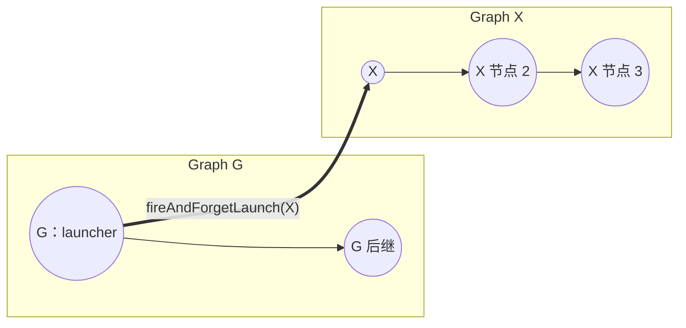

**图 34：Fire and forget launch。** G 中的 kernel 调用 `cudaGraphLaunch(X, cudaStreamGraphFireAndForget)` 后，X 立即进入自己的执行环境；G 的后继链和 X 的节点链可以独立推进。粗箭头表示运行时的动态 graph launch，不是定义 G 时添加的普通 dependency edge。

### Graph API：显式创建目标图和 launcher 图

下面先显式创建目标图 X，再显式创建包含 launcher kernel 的父图 G。`cudaGraphExec_t` 在 host 与 device 之间使用同一个 handle 值。

示例中的 `output` 与 `launch_status` 都必须指向 launcher 所属 device 可写的内存；若 host 需要读取，应在正确的 stream/environment 完成后复制或同步访问。

```cpp
__global__ void deviceGraphWork(int* output) { // 定义目标 device graph X 中的实际工作。
    if (blockIdx.x == 0 && threadIdx.x == 0) { // 只让一个线程写演示结果。
        *output = 42; // 写入可观察的完成结果。
    } // 结束单线程分支。
} // 结束 deviceGraphWork。

__global__ void launchFireAndForget(cudaGraphExec_t target_exec, int* launch_status) { // 从父图 G 的 kernel 发射目标图 X。
    if (blockIdx.x == 0 && threadIdx.x == 0) { // 明确只选择一个 device 线程发射一次。
        const cudaError_t status = cudaGraphLaunch(target_exec, cudaStreamGraphFireAndForget); // 把 X 立即发射成 G 的 child environment。
        *launch_status = static_cast<int>(status); // 保存 device 侧返回码供后续节点或 host 检查。
    } // 结束单线程发射分支。
} // 结束 launchFireAndForget。

cudaGraph_t buildDeviceTargetGraphWithApi(int* output) { // 用显式 Graph API 构造只有一个 kernel 的目标图 X。
    cudaGraph_t graph = nullptr; // 保存目标图模板。
    CUDA_CHECK(cudaGraphCreate(&graph, 0)); // 创建空目标图。
    cudaGraphNodeParams params{}; // 零初始化目标 kernel 的通用参数。
    params.type = cudaGraphNodeTypeKernel; // 选择 kernel 节点类型。
    params.kernel.func = reinterpret_cast<void*>(deviceGraphWork); // 指定 X 真正执行的 kernel。
    params.kernel.gridDim = dim3(1, 1, 1); // 只发射一个 block。
    params.kernel.blockDim = dim3(1, 1, 1); // block 中只需要一个线程。
    params.kernel.sharedMemBytes = 0; // 不使用动态共享内存。
    void* args[]{&output}; // 准备 output device 指针值的地址。
    params.kernel.kernelParams = args; // 让 Runtime 复制 kernel 参数值。
    params.kernel.extra = nullptr; // 不使用打包参数缓冲区。
    cudaGraphNode_t node = nullptr; // 接收 X 中的 kernel node 句柄。
    CUDA_CHECK(cudaGraphAddNode(&node, graph, nullptr, nullptr, 0, &params)); // 把 kernel 作为 X 的根节点加入。
    return graph; // 返回尚未实例化的目标图模板。
} // 结束 buildDeviceTargetGraphWithApi。

cudaGraph_t buildLauncherGraphWithApi(cudaGraphExec_t target_exec, int* launch_status) { // 用显式 API 创建会发射 X 的父图 G。
    cudaGraph_t graph = nullptr; // 保存父图模板。
    CUDA_CHECK(cudaGraphCreate(&graph, 0)); // 创建空父图。
    cudaGraphNodeParams params{}; // 零初始化 launcher kernel 参数。
    params.type = cudaGraphNodeTypeKernel; // 选择 kernel 节点类型。
    params.kernel.func = reinterpret_cast<void*>(launchFireAndForget); // 指定会在 device 上发射 X 的 kernel。
    params.kernel.gridDim = dim3(1, 1, 1); // 只发射一个 block。
    params.kernel.blockDim = dim3(1, 1, 1); // 只启动一个线程，天然避免重复 launch。
    params.kernel.sharedMemBytes = 0; // 不需要动态共享内存。
    void* args[]{&target_exec, &launch_status}; // 准备目标 exec handle 和状态输出地址的参数地址。
    params.kernel.kernelParams = args; // 让 Runtime 保存 launcher kernel 的两个参数值。
    params.kernel.extra = nullptr; // 不使用打包参数缓冲区。
    cudaGraphNode_t launcher_node = nullptr; // 接收父图 launcher node 句柄。
    CUDA_CHECK(cudaGraphAddNode(&launcher_node, graph, nullptr, nullptr, 0, &params)); // 把 launcher kernel 加为 G 的根节点。
    return graph; // 返回可按普通 host graph 实例化的父图模板。
} // 结束 buildLauncherGraphWithApi。
```

使用顺序是：实例化 X 时加 `cudaGraphInstantiateFlagDeviceLaunch`，upload X；随后普通实例化并从 host 发射 G。只有 X 需要 DeviceLaunch flag，因为 G 本身由 host stream 发射。

### Stream Capture：捕获同一个 launcher 图

如果原来的父流程使用 stream API，只需捕获 launcher kernel；目标图 X 仍必须预先在 host 上实例化并 upload：

```cpp
cudaGraph_t captureLauncherGraph(cudaStream_t stream, cudaGraphExec_t target_exec, int* launch_status) { // 用 stream capture 生成与显式父图相同的 launcher 图。
    CUDA_CHECK(cudaStreamBeginCapture(stream, cudaStreamCaptureModeGlobal)); // 开始捕获父图 G 的 stream 工作。
    launchFireAndForget<<<1, 1, 0, stream>>>(target_exec, launch_status); // 捕获一个会从 device 发射目标 X 的 launcher kernel。
    CUDA_CHECK(cudaGetLastError()); // 检查 launcher kernel 的发射配置。
    cudaGraph_t parent_graph = nullptr; // 接收捕获生成的父图模板。
    CUDA_CHECK(cudaStreamEndCapture(stream, &parent_graph)); // 结束 origin stream 捕获并返回 G。
    return parent_graph; // 返回父图；调用方按普通 host graph 实例化。
} // 结束 captureLauncherGraph。

struct DeviceLaunchObjects { // 汇总 target X 与 parent G 的模板和 executable handle。
    cudaGraph_t target_graph; // 保存由 Graph API 创建的目标图模板。
    cudaGraphExec_t target_exec; // 保存已启用 DeviceLaunch 并已 upload 的目标 exec。
    cudaGraph_t parent_graph; // 保存显式创建或 stream capture 得到的父图模板。
    cudaGraphExec_t parent_exec; // 保存由 host 发射的普通父图 exec。
}; // 结束 DeviceLaunchObjects。

DeviceLaunchObjects setupCapturedDeviceLaunch(int* output, int* launch_status, cudaStream_t stream) { // 按正确 handle 顺序构造目标图和捕获父图。
    cudaGraph_t target_graph = buildDeviceTargetGraphWithApi(output); // 先用显式 API 构造目标图 X。
    cudaGraphExec_t target_exec = nullptr; // 接收 X 的 device-launchable exec。
    CUDA_CHECK(cudaGraphInstantiate(&target_exec, target_graph, cudaGraphInstantiateFlagDeviceLaunch)); // 在获得 target handle 后启用 device launch。
    CUDA_CHECK(cudaGraphUpload(target_exec, stream)); // 在同一 stream 上提前准备 X 的 device 资源。
    cudaGraph_t parent_graph = captureLauncherGraph(stream, target_exec, launch_status); // 把真实 target handle 捕获进父图 G 的 kernel 参数。
    cudaGraphExec_t parent_exec = nullptr; // 接收普通 host-launchable 的 G exec。
    CUDA_CHECK(cudaGraphInstantiate(&parent_exec, parent_graph, 0)); // 实例化包含 launcher kernel 的父图。
    return DeviceLaunchObjects{target_graph, target_exec, parent_graph, parent_exec}; // 把四个对象的所有权一起返回。
} // 结束 setupCapturedDeviceLaunch；显式父图版本可用 buildLauncherGraphWithApi 替换 captureLauncherGraph。

void launchAndDestroyDeviceGraphs(DeviceLaunchObjects objects, cudaStream_t stream) { // 发射父图并在整个 environment 完成后释放图对象。
    CUDA_CHECK(cudaGraphLaunch(objects.parent_exec, stream)); // host 发射 G，G 的 kernel 随后从 device 发射 X。
    CUDA_CHECK(cudaStreamSynchronize(stream)); // 等待 G 及全部 fire-and-forget 后代完成。
    CUDA_CHECK(cudaGraphExecDestroy(objects.parent_exec)); // 销毁不再运行的父图 exec。
    CUDA_CHECK(cudaGraphDestroy(objects.parent_graph)); // 销毁父图模板。
    CUDA_CHECK(cudaGraphExecDestroy(objects.target_exec)); // 确认没有 device launch 后销毁目标 exec。
    CUDA_CHECK(cudaGraphDestroy(objects.target_graph)); // 最后销毁目标图模板。
} // 结束 launchAndDestroyDeviceGraphs；output 与 launch_status 指向的内存由调用方管理。
```

关键顺序是先获得并 upload `target_exec`，再把这个**真实 handle**写入 parent 的 kernel 参数。显式父图版本只需把 `captureLauncherGraph(...)` 换成前面的 `buildLauncherGraphWithApi(...)`，其余实例化和发射顺序相同。

### 图 35：Execution Environment

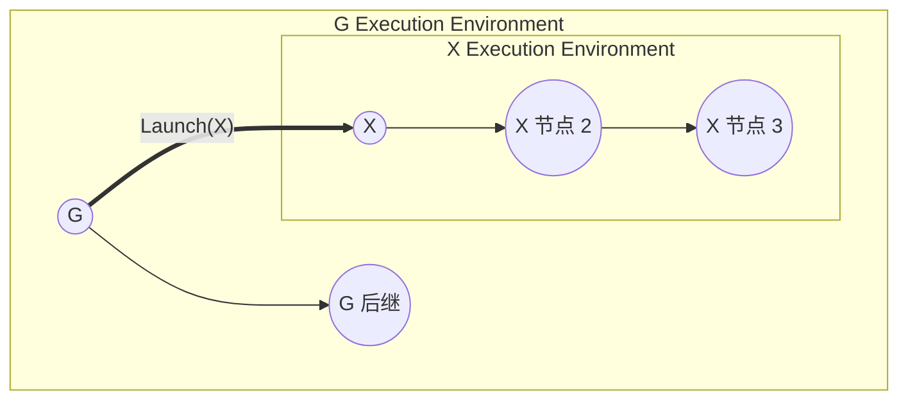

**图 35：Fire and forget launch, with execution environments。** X 的 environment 嵌套在 G 的 environment 中。G 的节点链完成并不等于 G environment 完成；只有 G 自身以及它生成的所有 fire-and-forget child work 都完成，外层环境才完成。

### 图 36：嵌套的 fire-and-forget 环境

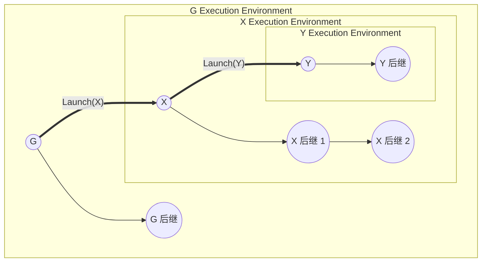

**图 36：Nested fire and forget environments。** G 发射 X，X 再发射 Y，形成 `Y environment ⊂ X environment ⊂ G environment`。完成状态从内向外传播：Y 未完成时 X environment 不能完成，X 未完成时 G environment 也不能完成。

### 图 37：最外层 stream environment

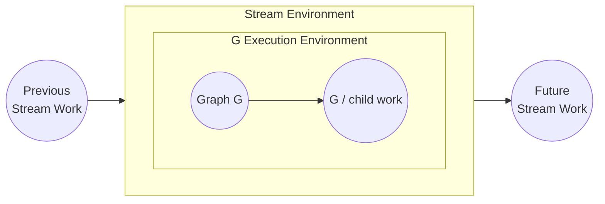

**图 37：The stream environment, visualized。** host 发射 G 时，stream environment 是最外层父环境。前序 stream work 完成后 G 才能开始；G 的节点和所有 fire-and-forget 后代都完成后，后续 stream work 才能开始。因此 fire-and-forget 可以独立于父图的**内部节点链**推进，却不会逃逸到 host stream 的后续工作之外。

### Fire-and-forget、tail 与 sibling 的边界

#### Fire-and-forget

- 每次 parent execution 累计最多创建 120 个 fire-and-forget graph；同一 parent 下一次执行时计数重置。
- child 立即提交并可与 parent 的剩余节点并行，但 parent environment 完成仍要等待所有 child environment。

#### Tail launch

tail graph 等当前 environment 中的 graph 本体及全部 fire-and-forget 后代完成后才运行，可以替代 device 端不允许的 `cudaDeviceSynchronize()` / `cudaStreamSynchronize()`。同一 graph 排入的多个 tail launch 按入队顺序逐个执行，最多允许 255 个 pending tail launch。

device graph 可以 tail-launch 自己，但同一时刻只能挂起一个 self-tail：

```cpp
__device__ unsigned int relaunch_count = 0; // 保存当前示例已经安排的自重启次数。

__global__ void tailRelaunchSelf(unsigned int relaunch_limit, int* launch_status) { // 在 device graph 中按上限安排下一轮自身执行。
    if (blockIdx.x == 0 && threadIdx.x == 0) { // 只让一个线程读取和修改发射状态。
        if (relaunch_count < relaunch_limit) { // 尚未达到预设的自重启次数时继续。
            cudaGraphExec_t current_exec = cudaGetCurrentGraphExec(); // 取得当前正在运行的 device graph exec。
            const cudaError_t status = cudaGraphLaunch(current_exec, cudaStreamGraphTailLaunch); // 把自身排到当前 environment 完成之后。
            *launch_status = static_cast<int>(status); // 保存 tail launch 返回码供调试。
        } // 结束是否继续重启的判断。
        ++relaunch_count; // 更新示例计数器；实际工程应在新任务开始前显式重置。
    } // 结束单线程控制分支。
} // 结束 tailRelaunchSelf。
```

`cudaGetCurrentGraphExec()` 只有在 device graph 节点内才返回当前 exec，在普通 kernel 或其他环境中返回 `nullptr` / 0。

#### Sibling launch

`cudaStreamGraphFireAndForgetAsSibling` 不把新图挂到当前 graph environment，而是挂到当前 graph 的 **parent environment**。它等价于由 parent 做一次 fire-and-forget，因此 sibling work 不会阻塞当前 graph 自己排入的 tail launch；是否采用它取决于动态工作应该归属哪一层生命周期。

### Device Graph Launch 检查清单

- target 是否用 `cudaGraphInstantiateFlagDeviceLaunch` 在 host 上实例化？
- target 是否已经显式 upload，或先由 host launch 隐式 upload？更新后是否重新 upload？
- 节点类型、单 device、memcpy 操作数和 kernel 能力是否满足 device graph 限制？
- device 代码是否只选择一个线程发射目标，而不是整个 grid 重复发射？
- device 侧是否只使用三个特殊 launch stream 之一？
- 是否避免同一 target 的重叠 device launch，以及同一 exec 的 host/device 并发 launch？
- fire-and-forget 与 tail 数量是否可能超过 120 / 255 的执行期上限？

## 图的查询、克隆与调试

构图错误往往不是“节点没创建”，而是少了一条边、边方向错误，或者更新时找错节点。Runtime API 提供了遍历和 DOT 导出接口：

```cpp
__host__ cudaError_t cudaGraphGetNodes(cudaGraph_t graph, cudaGraphNode_t* nodes, size_t* numNodes); // 返回全部节点，nodes 为空时只查询数量。
__host__ cudaError_t cudaGraphGetRootNodes(cudaGraph_t graph, cudaGraphNode_t* pRootNodes, size_t* pNumRootNodes); // 返回没有前驱的 root nodes。
__host__ cudaError_t cudaGraphGetEdges(cudaGraph_t graph, cudaGraphNode_t* from, cudaGraphNode_t* to, cudaGraphEdgeData* edgeData, size_t* numEdges); // 返回平行的边起点、终点和边数据数组。
__host__ cudaError_t cudaGraphNodeGetDependencies(cudaGraphNode_t node, cudaGraphNode_t* pDependencies, cudaGraphEdgeData* edgeData, size_t* pNumDependencies); // 查询一个节点的直接前驱及入边数据。
__host__ cudaError_t cudaGraphNodeGetDependentNodes(cudaGraphNode_t node, cudaGraphNode_t* pDependentNodes, cudaGraphEdgeData* edgeData, size_t* pNumDependentNodes); // 查询一个节点的直接后继及出边数据。
__host__ cudaError_t cudaGraphNodeGetType(cudaGraphNode_t node, cudaGraphNodeType* pType); // 查询节点类型。
__host__ cudaError_t cudaGraphNodeGetParams(cudaGraphNode_t node, cudaGraphNodeParams* nodeParams); // 通过 tagged union 查询当前节点参数。
__host__ cudaError_t cudaGraphClone(cudaGraph_t* pGraphClone, cudaGraph_t originalGraph); // 深复制普通图及其 child graphs。
__host__ cudaError_t cudaGraphNodeFindInClone(cudaGraphNode_t* pNode, cudaGraphNode_t originalNode, cudaGraph_t clonedGraph); // 找到 originalNode 在直接 clone 中的对应节点。
__host__ cudaError_t cudaGraphDebugDotPrint(cudaGraph_t graph, const char* path, unsigned int flags); // 把图结构和按 flags 选择的参数写入 Graphviz DOT 文件。
```

这些数组查询通常采用“两次调用”：先传空数组取得数量，再分配足够空间并再次调用。若忽略了实际非零的 `cudaGraphEdgeData`，边查询可能返回 `cudaErrorLossyQuery`；因此第二次调用应提供 edge-data 数组，而不是只读取 `from` / `to`。

```cpp
#include <vector> // 引入 std::vector 管理查询结果数组。

void inspectGraph(cudaGraph_t graph) { // 查询完整节点和边，并输出一个 DOT 调试文件。
    std::size_t node_count = 0; // 接收图中的节点总数。
    CUDA_CHECK(cudaGraphGetNodes(graph, nullptr, &node_count)); // 第一次调用只查询节点数量。
    std::vector<cudaGraphNode_t> nodes(node_count); // 为所有节点句柄分配连续空间。
    CUDA_CHECK(cudaGraphGetNodes(graph, nodes.data(), &node_count)); // 第二次调用填充节点句柄。

    for (cudaGraphNode_t node : nodes) { // 逐个检查图中的节点类型。
        cudaGraphNodeType type{}; // 接收当前节点的类型枚举。
        CUDA_CHECK(cudaGraphNodeGetType(node, &type)); // 查询节点类型，调试器可据此选择相应参数 API。
    } // 结束节点遍历。

    std::size_t edge_count = 0; // 接收图中的依赖边总数。
    const cudaError_t count_status = cudaGraphGetEdges(graph, nullptr, nullptr, nullptr, &edge_count); // 第一次调用只查询边数量。
    if (count_status != cudaSuccess && count_status != cudaErrorLossyQuery) { // 允许计数阶段因省略非零边数据报告有损查询。
        checkCuda(count_status, "cudaGraphGetEdges(count)"); // 报告真正的边查询错误。
    } // 结束计数返回码检查。
    std::vector<cudaGraphNode_t> from(edge_count); // 为每条边的上游节点分配空间。
    std::vector<cudaGraphNode_t> to(edge_count); // 为每条边的下游节点分配空间。
    std::vector<cudaGraphEdgeData> edge_data(edge_count); // 为每条边的完整 edge data 分配空间。
    CUDA_CHECK(cudaGraphGetEdges(graph, from.data(), to.data(), edge_data.data(), &edge_count)); // 无损读取所有边端点和边数据。
    CUDA_CHECK(cudaGraphDebugDotPrint(graph, "cuda-graph.dot", cudaGraphDebugDotFlagsVerbose)); // 写出包含详细节点参数的 DOT 文件供离线查看。
} // 结束 inspectGraph。
```

`cudaGraphNodeGetParams()` 返回的嵌套指针可能指向 Runtime 持有的节点内存；这些内容在节点销毁前有效，但调用方不得修改。需要改参数时，应构造自己的结构并调用相应 set-params API。

clone 得到的节点 handle 与原图不同，不能直接用原 handle 修改 clone；应调用 `cudaGraphNodeFindInClone()` 建立映射。含 allocation、free 或 conditional node 的图不能 clone，这类图应在源头保留所需句柄。

> `cudaGraphDebugDotPrint()` 会写入本地文件，适合开发调试，不建议放在高频生产路径。它输出 DOT 而不是 Mermaid；本文的 Mermaid 图是为了让笔记直接渲染，二者用途不同。

## 当前文档中的版本陷阱

CUDA Programming Guide 更强调概念和工作流，其中少量示例未与最新头文件同步。学习概念可读 Guide，复制接口原型时应以相同 Toolkit 版本的 Runtime API 和本机 `cuda_runtime_api.h` 为准。

| Guide 中可能看到的写法 | CUDA 13.3 当前写法 | 原因 |
| --- | --- | --- |
| `cudaStreamBeginCapture(stream)` | `cudaStreamBeginCapture(stream, cudaStreamCaptureModeGlobal)` | 当前接口需要显式 capture mode。 |
| 五参数 `cudaGraphAddNode(..., deps, count, params)` | 六参数 `cudaGraphAddNode(..., deps, dependencyData, count, params)` | CUDA 12.3 引入 edge data。 |
| 五参数 `cudaGraphInstantiate(&exec, graph, errorNode, log, size)` | `cudaGraphInstantiate(&exec, graph, flags)` | 详细结果改由 `cudaGraphInstantiateWithParams()` 提供。 |
| 四参数 `cudaGraphExecUpdate(exec, graph, errorNode, result)` | 新代码优先用 `cudaGraphExecUpdate(exec, graph, &resultInfo)` | `cuda_runtime.h` 仍提供四参数 C++ inline 兼容包装，但主 Runtime API 使用 `cudaGraphExecUpdateResultInfo`，并额外提供 `errorFromNode`。 |
| `cudaStreamRecordEvent(...)` | `cudaEventRecord(event, stream)` | 前者不是 Runtime API。 |
| 四参数 `cudaMallocAsync(..., pool, stream)` | `cudaMallocFromPoolAsync(..., pool, stream)` | 指定 pool 的接口名称不同。 |
| 通用 free node 直接传结构体 | 传 `&free_params` 给 `cudaGraphAddNode()` | `nodeParams` 参数是可写指针。 |

此外，图 32 邻近正文把新增 allocation node 写成 node 4；图、caption 和依赖关系都表明应为 **node 3**。这不影响内存复用规则，但阅读时不要把图号误当成节点编号。

## 实践建议

### 如何选择构图方式

| 场景 | 优先选择 | 原因 |
| --- | --- | --- |
| 新代码、拓扑清晰、少量节点经常更新 | 显式 Graph API | 节点句柄和依赖直接可控。 |
| 已有 stream 异步代码或需要包住库调用 | Stream Capture | 改造范围小，可用 event 表达跨流依赖。 |
| 大量节点参数一起变化 | 重捕获 + whole graph update | 不必逐一保存和更新节点 handle。 |
| 少数 kernel / memcpy 参数变化 | Individual node update | 避免重建整图和全图比较。 |
| 简单 device 数据分支或循环 | Conditional node | 控制流留在同一图内，语义直接。 |
| device 需要动态调度预定义工作流 | Device Graph Launch | 可以 fire-and-forget、tail 或 sibling 发射预上传 exec。 |
| 临时缓冲区生命周期能由 DAG 表达 | Graph memory node | CUDA 可基于 GPU ordering 复用地址和物理页。 |

### 性能与正确性检查

- 把 graph 创建和实例化移出热循环；测量时把首次 upload / mapping 成本和稳态 launch 成本分开。
- 不要在每次 `cudaGraphLaunch()` 后立刻同步，否则会丢失 host 与 GPU 重叠的机会；只在数据依赖或资源回收边界同步。
- 用 Nsight Systems 检查 CPU launch 间隙和图内并行度，用 Compute Sanitizer 检查 graph allocation 生命周期外访问。
- 对 memory graph 保持稳定的 launch stream，避免不必要的物理 remap。
- 把 C++ 对象、host callback 数据、kernel 参数指向的资源和图对象生命周期分开审查；Runtime 复制参数值，不会自动延长参数所引用资源的生命周期。
- 每个 Runtime API 都检查返回值，kernel 捕获后也检查 launch error；update 同时检查 API 返回码与详细 result。
- 不要从多个 host 线程并发访问同一个 `cudaGraph_t`，包括看似只读的 clone、查询和实例化操作。
- 同一个 `cudaGraphExec_t` 不会与自身并发。需要同一拓扑真正并发时，应分别实例化多个 exec，并为它们管理独立的可变资源。

## 参考资料

- [CUDA Programming Guide：CUDA Graphs](https://docs.nvidia.com/cuda/cuda-programming-guide/04-special-topics/cuda-graphs.html)
- [CUDA Programming Guide：Graph Memory Nodes](https://docs.nvidia.com/cuda/cuda-programming-guide/04-special-topics/cuda-graphs.html#graph-memory-nodes)
- [CUDA Programming Guide：Device Graph Launch](https://docs.nvidia.com/cuda/cuda-programming-guide/04-special-topics/cuda-graphs.html#device-graph-launch)
- [CUDA Runtime API：Graph Management](https://docs.nvidia.com/cuda/cuda-runtime-api/group__CUDART__GRAPH.html)
- [CUDA Runtime API：Stream Management](https://docs.nvidia.com/cuda/cuda-runtime-api/group__CUDART__STREAM.html)
- [CUDA Runtime API：Graph object thread safety](https://docs.nvidia.com/cuda/cuda-runtime-api/graphs-thread-safety.html)
- [CUDA Runtime API：`cudaGraphNodeParams`](https://docs.nvidia.com/cuda/cuda-runtime-api/structcudaGraphNodeParams.html)
- [CUDA Runtime API：`cudaMemAllocNodeParams`](https://docs.nvidia.com/cuda/cuda-runtime-api/structcudaMemAllocNodeParams.html)
- [CUDA Runtime API：`cudaGraphInstantiateParams`](https://docs.nvidia.com/cuda/cuda-runtime-api/structcudaGraphInstantiateParams.html)
