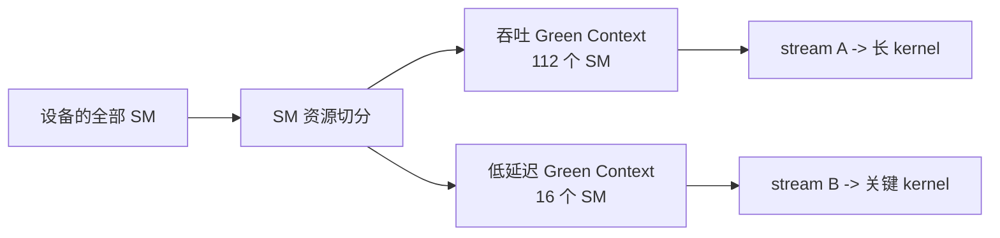

# CUDA Green Contexts 笔记

**Green Context（绿色上下文，GC）** 是 CUDA 为单个 GPU 上的应用内资源隔离提供的一套较新机制。它让应用在创建 context 时指定一组 GPU 资源，目前包括 **SM（Streaming Multiprocessor）** 与 **work queue（工作队列）**。随后，提交到该 context 所属 stream 的 kernel，只能使用被 provision（配置并保留）给它的资源。

它的名字和节能没有关系；`green` 是 NVIDIA 为这类轻量 context 取的名称。它的核心价值是：让吞吐型任务不能吞掉原本为低延迟任务留出的那部分 SM，从而改善应用内的 tail latency（尾延迟）。

参考：

- [CUDA Programming Guide：Green Contexts](https://docs.nvidia.com/cuda/cuda-programming-guide/04-special-topics/green-contexts.html)
- CUDA 13.3 本机头文件：`/usr/local/cuda-13.3/include/cuda_runtime_api.h`、`/usr/local/cuda-13.3/include/driver_types.h`

本文 API 原型按本机 CUDA 13.3 头文件整理。绿色上下文首先由 Driver API 在 CUDA 12.4 引入；从 CUDA 13.1 起，Runtime API 通过 `cudaExecutionContext_t` 暴露这套能力。对 Runtime API 项目，优先直接使用本文的 Runtime API。

## 先建立直觉

假设一个推理服务在同一张 GPU 上有两种工作：

- **后台 batch**：大量且持续的长 kernel，追求总体吞吐。
- **关键请求**：很短，但希望一到就尽快开始的 decode、采样或控制 kernel。

普通情况下，即使这两个 kernel 位于不同 stream，后台 batch 仍可能已占满全部 SM。关键 kernel 的 stream priority（流优先级）只能影响尚未开始的 block 调度，**不能抢占已经在 SM 上运行的 block**。它仍要等某些长 block 结束。

绿色上下文的做法是预先把 SM 划开，例如 112 个 SM 给 batch，16 个 SM 给关键请求。前者再忙也不能使用后者的 16 个 SM，因此关键 kernel 有机会立即开始。



这是一种**静态空间分区**：GC A 看到的不是“最多允许使用 112 个任意 SM”，而是创建时被分给它的那一组特定 SM。分区创建后并不会随负载动态伸缩。

## 它解决什么，不解决什么

**适合的场景**

- 同一进程内混合运行吞吐型与 latency-sensitive（延迟敏感）工作，希望给后者预留启动资源。
- 需要在不改 kernel 的前提下，快速实验“一个 kernel 只给 N 个 SM 时会怎样”。
- 推理服务中的 prefill / decode 分离、实时控制和后台批处理共存、同进程多个彼此独立的 GPU pipeline。
- 库接收调用方传来的 stream；只要该 stream 属于绿色上下文，库通过该 stream 发射的常规 kernel 也会自动落在对应资源上。

**它不保证的事**

- 不保证两个 GC 的 kernel 必然并发执行，也不提供 forward-progress（前进性）保证。SM 分开后，work queue、依赖关系、其他硬件资源或 kernel 本身仍可能使工作串行。
- 不保证 kernel 实际跑满分配给它的 SM。`smCount` 是它**可使用的上限资源集合**，实际使用量还取决于 grid 大小、occupancy、寄存器、共享内存和同时执行的工作。
- 不隔离显存容量、HBM 带宽、L2、PCIe/NVLink、功耗或热设计。它目前重点隔离 SM，并可用 work queue 配置尽量减少提交路径上的干扰。
- 不替代 CUDA stream。stream 负责顺序与依赖；GC 决定该 stream 提交的工作可以使用哪些执行资源。

## 与 stream、MIG、MPS 的区别

| 机制 | 主要粒度 | SM 语义 | 典型对象 | 是否适合单进程内低延迟预留 |
| --- | --- | --- | --- | --- |
| 普通 stream | 工作序列 | 不分区，所有 stream 默认竞争整张 GPU。 | 单进程的异步工作流。 | 否。 |
| stream priority | 调度 hint | 不占住一组特定 SM，不能抢占已运行 block。 | 高低优先级 kernel。 | 只能缓解，不能保证有空闲 SM。 |
| Green Context | 单进程内 execution context | 创建时指定特定 SM 子集，可选 work queue 配置。 | 同一应用中的不同 workload。 | 是，正是主要用途。 |
| MIG | GPU 实例 | 硬件级静态分割成多个“小 GPU”，隔离范围更大。 | 多租户、不同应用/容器。 | 可与 GC 叠加；GC 在一个 MIG instance 内继续切分。 |
| MPS | 多进程服务 | 默认共享 SM；动态 active thread percentage 是“任意 N 个 SM”的上限。 | MPI、多进程并发。 | 目标不同；静态 MPS 分区也主要面向进程。 |

MIG 的分区通常在应用启动前配置，面向跨应用 QoS。MPS 面向多进程共享 GPU。GC 则很轻量：它复用 primary context（主上下文）的大量底层结构，适合一个应用把自己的工作拆成若干资源域。

> 一个很关键的区别：MPS 的 active thread percentage 限制某客户端“最多能用 N 个 SM”，但 N 个 SM 可以随时间变化；GC 为 context 分到的是一组**固定身份**的 SM。

## Runtime 的 execution context 抽象

从 CUDA Runtime 的视角，`cudaExecutionContext_t` 统一表示两类 context：

- `cudaDeviceGetExecutionCtx` 得到的设备 **primary context**。
- `cudaGreenCtxCreate` 创建的 **green context**。

```cpp
/**
 * @brief CUDA Runtime 的不透明 execution context 句柄。
 *
 * 可表示设备 primary context，也可表示 cudaGreenCtxCreate 创建的绿色上下文。
 * 不应解引用或假设内部布局。
 */
typedef struct cudaExecutionContext_st* cudaExecutionContext_t;

/**
 * @brief 封装一个或多个已配置 device resource 的不透明描述符。
 */
typedef struct CUdevResourceDesc_st* cudaDevResourceDesc_t;
```

这带来一个编程模型上的变化：部分 API 显式接收 `cudaExecutionContext_t`，不再依赖调用线程的 current context（当前上下文）。例如 `cudaExecutionCtxStreamCreate` 明确把 stream 绑定到某个 context。

但不要据此误解为“所有 CUDA Runtime API 都变成 context 参数化”：

- `cudaMalloc`、`cudaEventCreate` 一类 device-wide（设备范围）资源 API 仍按设备工作；通常先 `cudaSetDevice`。
- `cudaMemcpyAsync`、`cudaLaunchKernel`、`cudaMemsetAsync` 等 context-sensitive（与上下文资源相关）操作，应使用**显式的非空 stream**。它们会沿用该 stream 创建时绑定的 execution context。
- Runtime 没有提供把 `cudaExecutionContext_t` 转成 `CUcontext` / `CUgreenCtx` 的接口。Runtime 与 Driver 的绿色上下文句柄不能混用。
- CUDA resource（memory、stream、event、module 等）的寿命按 device，而不是按 execution context 自动绑定。不要用 `cudaDeviceReset` 来管理 GC 生命周期。

## 资源模型：从资源到绿色上下文

绿色上下文的创建链条可概括为五步：


`cudaDevResource` 是资源的 tagged union（带标签联合体），而 `cudaDevResourceDesc_t` 是将一组资源封装起来的不透明描述符。描述符中的资源会在 `cudaGreenCtxCreate` 时真正 provision。

### `cudaDevResourceType`

**用途**

区分 `cudaDevResource` 当前保存的是哪一类资源，并决定应读取 union 中的哪个成员。

**本机枚举来源**

```cpp
enum cudaDevResourceType {
    /** 无效资源；不可继续访问。 */
    cudaDevResourceTypeInvalid = 0,

    /** 与 Streaming Multiprocessor 相关的资源。 */
    cudaDevResourceTypeSm = 1,

    /** work queue 配置资源。 */
    cudaDevResourceTypeWorkqueueConfig = 1000,

    /** 已存在的 work queue 资源。 */
    cudaDevResourceTypeWorkqueue = 10000,
};
```

| 枚举量 | 含义 | union 中有效成员 | 使用方式 |
| --- | --- | --- | --- |
| `cudaDevResourceTypeInvalid` | 无效或未初始化资源。 | 无。 | 不能作为切分、描述符或查询后的有效资源使用。 |
| `cudaDevResourceTypeSm` | 一组 SM 的资源描述。 | `resource.sm`。 | 从 device/context 取得后，用 SM split API 切分。 |
| `cudaDevResourceTypeWorkqueueConfig` | work queue 的配置请求。 | `resource.wqConfig`。 | 用户填写 device、并发提示和 sharing scope，再放入描述符。 |
| `cudaDevResourceTypeWorkqueue` | 已存在的 work queue 资源。 | `resource.wq`。 | 从 device 或已有 context 查询，用于复用现有 work queue。 |

### `cudaDevResource` 与三类资源结构体

**本机结构来源**

```cpp
/**
 * @brief SM 资源的查询结果。
 *
 * 所有字段均由 CUDA API 输出，用户不应直接写入。
 */
struct cudaDevSmResource {
    unsigned int smCount;
    unsigned int minSmPartitionSize;
    unsigned int smCoscheduledAlignment;
    unsigned int flags;
};

/**
 * @brief work queue 配置资源。
 */
struct cudaDevWorkqueueConfigResource {
    int device;
    unsigned int wqConcurrencyLimit;
    enum cudaDevWorkqueueConfigScope sharingScope;
};

/**
 * @brief 已存在 work queue 的不透明资源载体。
 */
struct cudaDevWorkqueueResource {
    unsigned char reserved[RESOURCE_ABI_BYTES];
};

/**
 * @brief 带标签联合体，根据 type 判断应读取哪个成员。
 */
typedef struct cudaDevResource_st {
    enum cudaDevResourceType type;
    unsigned char _internal_padding[92];
    union {
        struct cudaDevSmResource sm;
        struct cudaDevWorkqueueConfigResource wqConfig;
        struct cudaDevWorkqueueResource wq;
        unsigned char _oversize[RESOURCE_ABI_BYTES];
    };
    struct cudaDevResource_st* nextResource;
} cudaDevResource;
```

| 字段 | 含义与约束 |
| --- | --- |
| `smCount` | 此 SM 资源中可用的 SM 数量。查询或 split 输出得到，不能手写伪造。 |
| `minSmPartitionSize` | 将这组 SM 再切分时允许的最小分区大小。架构相关。 |
| `smCoscheduledAlignment` | 可保证在同一 GPU processing cluster（GPU 处理簇）上 co-scheduled（协同调度）的 SM 对齐粒度。默认 split 结果的 `smCount` 通常要满足该对齐。 |
| `flags` | 此 SM 资源已带有的 group flag，例如是否 backfill。 |
| `wqConfig.device` | 此 work queue 配置所对应的 CUDA device ordinal。必须与描述符中的其他资源属于同一设备。 |
| `wqConfig.wqConcurrencyLimit` | 应用预计会并发提交、且希望尽量避免 false dependency（伪依赖）的 stream-ordered workload 数量。它是给 driver 的提示，不是硬保证。 |
| `wqConfig.sharingScope` | work queue 的共享策略。 |
| `type` | 标签字段。只有与其匹配的 `sm`、`wqConfig` 或 `wq` union 成员可读。 |
| `_internal_padding`、`_oversize`、`nextResource` | ABI / runtime 内部布局；应用不应读写或依赖。 |

所有 `cudaDevResource` 与相关输入结构体都应使用 `{}` 零初始化。尤其不要手写 `cudaDevSmResource` 的字段；SM resource 必须来自资源查询或 split API。

### work queue 与 `cudaDevWorkqueueConfigScope`

work queue 是 CUDA 内部的提交资源抽象。若不同 stream 的独立工作映射到同一个 work queue，可能出现并非数据依赖导致的串行化，即 false dependency。应用不能直接挑选某一个 work queue，但可以通过绿色上下文表达“我预计这里有多少独立的并发流有序工作”。

```cpp
enum cudaDevWorkqueueConfigScope {
    /** 使用设备上跨 context 共享的全部 work queue 资源，默认行为。 */
    cudaDevWorkqueueConfigScopeDeviceCtx = 0,

    /** 尽可能为不同 balanced 绿色上下文使用不重叠的 work queue 资源。 */
    cudaDevWorkqueueConfigScopeGreenCtxBalanced = 1,
};
```

| 枚举量 | 含义 | 适用情况 |
| --- | --- | --- |
| `cudaDevWorkqueueConfigScopeDeviceCtx` | 所有 context 按默认方式共享设备 work queue。 | 不需要额外控制，或工作之间本来有依赖。 |
| `cudaDevWorkqueueConfigScopeGreenCtxBalanced` | 驱动尽力让不同采用 balanced 配置的 GC 使用不重叠的 work queue。 | 已划分 SM，且确实希望进一步减少独立 pipeline 的提交干扰。 |

`wqConcurrencyLimit` 受 `CUDA_DEVICE_MAX_CONNECTIONS` 影响，可先用 `cudaDeviceGetDevResource(..., cudaDevResourceTypeWorkqueueConfig)` 查询设备可用配置。即使设置 balanced scope，也只是增加避免干扰的机会，不能把它理解成并发执行承诺。

### SM 切分参数与 flags

```cpp
/**
 * @brief 结构化 SM 分组的输入参数。
 *
 * 调用 cudaDevSmResourceSplit 前必须零初始化；成功后其中部分字段会被 CUDA 更新。
 */
typedef struct cudaDevSmResourceGroupParams_st {
    unsigned int smCount;
    unsigned int coscheduledSmCount;
    unsigned int preferredCoscheduledSmCount;
    unsigned int flags;
    unsigned int reserved[12];
} cudaDevSmResourceGroupParams;

enum cudaDevSmResourceGroup_flags {
    /** 默认：分组严格满足 co-scheduled 结构。 */
    cudaDevSmResourceGroupDefault = 0,

    /** 允许用额外 SM 填充，使 smCount 不必是 coscheduledSmCount 的整数倍。 */
    cudaDevSmResourceGroupBackfill = 0x1 << 0,
};

enum cudaDevSmResourceSplitByCount_flags {
    /** 降低 SM 最小大小和对齐要求，将每个 SM 视作独立层级。 */
    cudaDevSmResourceSplitIgnoreSmCoscheduling = 0x1,

    /** 仅 CC 9.0+：尝试形成可支持最大潜在 thread block cluster 的分组。 */
    cudaDevSmResourceSplitMaxPotentialClusterSize = 0x2,
};
```

| 字段 / 枚举 | 含义与约束 |
| --- | --- |
| `smCount` | 希望放入该 group 的 SM 数。填 `0` 启用 discovery mode（发现模式），由 CUDA 根据其他约束回填实际值。非零时至少为 2，且必须满足该设备的对齐和 cluster 约束。 |
| `coscheduledSmCount` | 希望被共同调度的一组 SM 数，用于 thread block clusters。设为 `0` 使用架构默认值；CC 9.0+ 默认通常为 8，较早架构通常为 2。 |
| `preferredCoscheduledSmCount` | CC 10.0+ 的偏好提示：若可能，让 driver 把多个 co-scheduled group 合成更大的首选组，帮助 preferred cluster dimension。设为 `0` 用默认值。 |
| `cudaDevSmResourceGroupDefault` | 不使用 backfill。输出 group 的结构更规整，更适合明确依赖 thread block cluster 的 workload。 |
| `cudaDevSmResourceGroupBackfill` | 允许在已分配 co-scheduled group 之外塞入额外 SM。可获得更多 SM，但这些补入部分不具备同样的 co-scheduling 保证。 |
| `cudaDevSmResourceSplitIgnoreSmCoscheduling` | `SplitByCount` 的更细粒度切分选项；代价是弱化大型 cluster 等高级能力。 |
| `cudaDevSmResourceSplitMaxPotentialClusterSize` | `SplitByCount` 在 CC 9.0+ 尝试构造有利于最大 cluster 的 group；实际可支持 cluster 仍应用 occupancy API 验证。 |

这里的 **co-scheduled** 不是“同时运行得更快”的笼统承诺，而是资源分组为 thread block cluster 提供的结构约束。若 kernel 不使用 cluster，保守做法是设 `coscheduledSmCount = 0` 使用默认值，或按文档选择最小值 `2`。

## 查询资源

### `cudaDeviceGetDevResource`

**用途**

从整张 GPU 查询某一类初始资源。创建 GC 时通常从这里获得完整 SM 集合。

**原型**

```cpp
cudaError_t cudaDeviceGetDevResource(
    int device,
    cudaDevResource* resource,
    enum cudaDevResourceType type);
```

**参数**

| 参数 | 类型 | 含义 |
| --- | --- | --- |
| `device` | `int` | CUDA device ordinal。 |
| `resource` | `cudaDevResource*` | 输出参数，指向零初始化的资源对象。 |
| `type` | `cudaDevResourceType` | 需要查询的资源类别，可为 SM、work queue config 或已有 work queue。 |

**返回值**

返回 `cudaSuccess` 表示查询成功。设备、资源类型或平台不支持时可返回 `cudaErrorInvalidDevice`、`cudaErrorInvalidResourceType` 或 `cudaErrorNotSupported`。该 API 不支持 32 位平台。

**注意点**

- 查询到的 `resource.sm` 才能作为 SM split API 的 `input`。
- 返回的 `minSmPartitionSize` 与 `smCoscheduledAlignment` 是切分请求的真实约束来源；不要写死 H100、B200 或其他特定型号的数值。
- `cudaExecutionCtxGetDevResource` 可从一个已有 execution context 取得它当前能访问的资源；这适合在已有 GC 内继续规划资源。
- `cudaStreamGetDevResource` 只能查询 `cudaDevResourceTypeSm`，不能查询 work queue 类型。

### `cudaExecutionCtxGetDevResource` 与 `cudaStreamGetDevResource`

**原型**

```cpp
cudaError_t cudaExecutionCtxGetDevResource(
    cudaExecutionContext_t ctx,
    cudaDevResource* resource,
    enum cudaDevResourceType type);

cudaError_t cudaStreamGetDevResource(
    cudaStream_t hStream,
    cudaDevResource* resource,
    enum cudaDevResourceType type);
```

| 接口 | 查询起点 | 资源类型限制 | 常见用途 |
| --- | --- | --- | --- |
| `cudaExecutionCtxGetDevResource` | execution context | 三类有效类型均可查询。 | 验证新 GC 实际获得的 SM / work queue 资源。 |
| `cudaStreamGetDevResource` | stream | 仅 `cudaDevResourceTypeSm`。传 work queue 类型会得到 `cudaErrorInvalidResourceType`。 | 验证某个 library stream 是否确实绑定到预期 SM 资源。 |

## 切分 SM：两个 API

### `cudaDevSmResourceSplitByCount`

**用途**

把一个 SM resource 切成若干个**同构** group：每个输出 group 的 SM 数相同或满足同一颗粒度规则。它易用，但为了硬件对齐与 cluster 要求，CUDA 可能减少 group 数或把每组 SM 数向上调整。

**原型**

```cpp
cudaError_t cudaDevSmResourceSplitByCount(
    cudaDevResource* result,
    unsigned int* nbGroups,
    const cudaDevResource* input,
    cudaDevResource* remaining,
    unsigned int flags,
    unsigned int minCount);
```

**参数**

| 参数 | 类型 | 含义 |
| --- | --- | --- |
| `result` | `cudaDevResource*` | 输出数组。传 `nullptr` 时不创建资源，仅试算最终能得到多少组。 |
| `nbGroups` | `unsigned int*` | 输入时是 `result` 的容量 / 目标组数；输出时被改写为实际创建的 group 数。 |
| `input` | `const cudaDevResource*` | 输入 SM 资源，必须来自 device 或 execution context 的查询。 |
| `remaining` | `cudaDevResource*` | 可选输出，接收未被放进对称 group 的剩余 SM；不关心时传 `nullptr`。 |
| `flags` | `unsigned int` | `0` 为默认；可使用前述 `cudaDevSmResourceSplitByCount_flags`。 |
| `minCount` | `unsigned int` | 每个 group 所需的最小 SM 数，实际每组数量可能更大。 |

**副作用 / 约束**

- `remaining` 不具备 `result` 中对称分组的性能和功能结构保证，不应把它当作普通等价分区。
- `result == nullptr` 是有用的试算模式；此时用返回的 `*nbGroups` 判断请求是否可满足。
- 输出 resource 不能直接再切一次。要进一步切分，先由它创建 descriptor 和 GC，再从该 execution context 查询资源。

### `cudaDevSmResourceSplit`

**用途**

在一次调用中创建**异构**的、彼此不重叠的结构化 SM group。例如 112 个 SM 给 batch、16 个 SM 给 decode。它是创建 GC 时更通用也更推荐的 API。

**原型**

```cpp
cudaError_t cudaDevSmResourceSplit(
    cudaDevResource* result,
    unsigned int nbGroups,
    const cudaDevResource* input,
    cudaDevResource* remainder,
    unsigned int flags,
    cudaDevSmResourceGroupParams* groupParams);
```

**参数**

| 参数 | 类型 | 含义 |
| --- | --- | --- |
| `result` | `cudaDevResource*` | 输出数组，至少有 `nbGroups` 个元素。传 `nullptr` 可做 discovery / dry run。 |
| `nbGroups` | `unsigned int` | 目标 group 数，同时也是 `result` 与 `groupParams` 数组长度。 |
| `input` | `const cudaDevResource*` | 输入 SM resource。必须来自 device 或 execution context 查询。 |
| `remainder` | `cudaDevResource*` | 可选剩余资源输出。它是 unstructured（非结构化）group。 |
| `flags` | `unsigned int` | 当前必须传 `0`，还没有 API 级 flags。 |
| `groupParams` | `cudaDevSmResourceGroupParams*` | 每个输出 group 的请求，必须逐项零初始化。数组从下标 0 到 `nbGroups - 1` 依次求值。 |

**副作用 / 约束**

- `groupParams` 的顺序有语义，尤其有 `smCount = 0` 的 discovery group 时，前面的 group 会先消费资源。
- `result != nullptr` 时，每个成功的 `result[i]` 都是有效、非零的 SM group；若某组无法满足，调用失败。
- `result == nullptr` 的试算模式可能成功，即使某 discovery group 最终为 0；因此不能把 dry-run 的 `cudaSuccess` 当作实际可创建的保证。
- 单次调用完成异构切分通常优于反复对 remainder 二次切分，driver 可在全局约束下做出更好的布局。

## 组合资源并创建 context

### `cudaDevResourceGenerateDesc`

**用途**

把连续数组中的一个或多个已配置资源封装成 `cudaDevResourceDesc_t`，供 `cudaGreenCtxCreate` 使用。

**原型**

```cpp
cudaError_t cudaDevResourceGenerateDesc(
    cudaDevResourceDesc_t* phDesc,
    cudaDevResource* resources,
    unsigned int nbResources);
```

**参数**

| 参数 | 类型 | 含义 |
| --- | --- | --- |
| `phDesc` | `cudaDevResourceDesc_t*` | 输出描述符句柄。 |
| `resources` | `cudaDevResource*` | 连续资源数组。例如一个 SM group 加一个 work queue config。 |
| `nbResources` | `unsigned int` | 要纳入描述符的资源数。 |

**副作用 / 约束**

- 所有资源必须来自同一 CUDA device。
- 若放入多个 SM resource，它们必须来自**同一次** split API 调用，且非 remainder group 的 `smCoscheduledAlignment` 相同。
- 最多只能包含一个 `cudaDevResourceTypeWorkqueueConfig` 或一个 `cudaDevResourceTypeWorkqueue` 资源。
- Runtime API 没有单独暴露 resource descriptor destroy API；描述符是创建 GC 时的配置载体，不要猜测其内部所有权或手工释放方式。

### `cudaGreenCtxCreate`

**用途**

根据资源描述符创建绿色 execution context，并在此时 provision 描述符中的资源。

**原型**

```cpp
cudaError_t cudaGreenCtxCreate(
    cudaExecutionContext_t* phCtx,
    cudaDevResourceDesc_t desc,
    int device,
    unsigned int flags);
```

**参数**

| 参数 | 类型 | 含义 |
| --- | --- | --- |
| `phCtx` | `cudaExecutionContext_t*` | 输出 GC 句柄。 |
| `desc` | `cudaDevResourceDesc_t` | 由 `cudaDevResourceGenerateDesc` 生成的资源描述符。 |
| `device` | `int` | 创建 GC 的 CUDA device ordinal，必须匹配描述符资源来源。 |
| `flags` | `unsigned int` | 当前必须为 `0`，保留给未来版本。 |

**副作用 / 约束**

- GC 生命周期内会 retain（持有）设备 primary context；销毁 GC 时会释放这份 retain。
- 建议在创建前显式执行 `cudaInitDevice(device)` 或 `cudaSetDevice(device)`，避免每次 GC 创建 / 销毁触发 primary context 初始化与清理开销。
- 此 API **不会创建默认 stream**。必须随后用 `cudaExecutionCtxStreamCreate` 显式创建 stream。
- 不支持 32 位平台。

### `cudaExecutionCtxStreamCreate`

**用途**

创建并绑定到指定 execution context 的 CUDA stream。后续通过这个 stream 发射的 kernel、异步拷贝或库工作，会继承该 context 的资源限制。

**原型**

```cpp
cudaError_t cudaExecutionCtxStreamCreate(
    cudaStream_t* phStream,
    cudaExecutionContext_t ctx,
    unsigned int flags,
    int priority);
```

**参数**

| 参数 | 类型 | 含义 |
| --- | --- | --- |
| `phStream` | `cudaStream_t*` | 输出 stream 句柄。 |
| `ctx` | `cudaExecutionContext_t` | 要绑定的 primary context 或 green context。 |
| `flags` | `unsigned int` | `cudaStreamDefault` 或 `cudaStreamNonBlocking`。对 GC，`cudaStreamDefault` 等效于 `cudaStreamNonBlocking`。 |
| `priority` | `int` | stream 优先级，数值越小优先级越高；范围通过 `cudaDeviceGetStreamPriorityRange` 查询。 |

**注意点**

- priority 是调度偏好，不能抢占已在执行的 block，也不能代替 SM 分区。
- 显式传该 stream 给 `<<< >>>`、`cudaMemcpyAsync`、`cudaMemsetAsync` 和库 API。不要依赖 `nullptr` 默认 stream，否则会回到 thread-local current context 的模糊语义。
- context 销毁后，此 stream 进入 detached state；除 `cudaStreamDestroy` 外，对它的后续 API 通常返回 `cudaErrorStreamDetached`。

## 一个完整的异构分区示例

下面的示例把一张 GPU 的 SM 资源切成两个 GC：一个供后台吞吐 kernel 使用，另一个供关键 kernel 使用。请求的 SM 数并不保证在每张卡上都合法，所以代码先读取设备实际约束，并在调用失败时直接报告错误。

为了让示例更聚焦，work queue 使用默认共享配置；后文再单独给出 balanced work queue 版本。真实服务应把 `throughput_sm_count`、`critical_sm_count` 作为实验参数，而不是硬编码成产品策略。

```cpp
#include <cuda_runtime.h>

#include <cstdio>
#include <cstdlib>

/**
 * @brief 检查 CUDA Runtime API 调用结果，错误时打印位置并终止进程。
 *
 * @param status CUDA Runtime API 返回值。
 * @param expression 被检查的 API 表达式文本。
 * @param file 调用点源文件。
 * @param line 调用点行号。
 */
void check_cuda(cudaError_t status,
                const char* expression,
                const char* file,
                int line) {
    if (status == cudaSuccess) {
        return;
    }

    std::fprintf(stderr,
                 "CUDA error: %s at %s:%d: %s\\n",
                 expression,
                 file,
                 line,
                 cudaGetErrorString(status));
    std::exit(EXIT_FAILURE);
}

#define CHECK_CUDA(call) check_cuda((call), #call, __FILE__, __LINE__)

/**
 * @brief 简单计算 kernel，用于演示 stream 与绿色上下文的绑定关系。
 *
 * @param data device 指针，长度至少为 element_count；原地读写。
 * @param element_count 元素数量。
 * @param iterations 每个元素执行的计算次数，用于拉长 kernel。
 */
__global__ void busyWorkKernel(float* data, int element_count, int iterations) {
    const int global_idx = blockIdx.x * blockDim.x + threadIdx.x;
    if (global_idx >= element_count) {
        return;
    }

    float value = data[global_idx];
    for (int iteration = 0; iteration < iterations; ++iteration) {
        value = value * 1.000001f + 0.000001f;
    }
    data[global_idx] = value;
}

/**
 * @brief 一组绿色上下文及其唯一工作 stream。
 *
 * stream 必须先销毁，随后才销毁 context；context 不拥有 stream。
 */
struct GreenContextStream {
    cudaExecutionContext_t context{};
    cudaStream_t stream{};
};

/**
 * @brief 根据一个 SM resource 创建绿色上下文和绑定 stream。
 *
 * @param device CUDA device ordinal。
 * @param sm_resource 输入 SM 资源，必须是一次成功切分产生的有效 resource。
 * @param priority 新 stream 的优先级。
 * @return 已创建的绿色上下文及绑定 stream。
 */
GreenContextStream create_green_context_stream(int device,
                                               cudaDevResource sm_resource,
                                               int priority) {
    cudaDevResourceDesc_t descriptor{};
    CHECK_CUDA(cudaDevResourceGenerateDesc(&descriptor, &sm_resource, 1));

    GreenContextStream result{};
    CHECK_CUDA(cudaGreenCtxCreate(&result.context, descriptor, device, 0));
    CHECK_CUDA(cudaExecutionCtxStreamCreate(&result.stream,
                                            result.context,
                                            cudaStreamNonBlocking,
                                            priority));
    return result;
}

/**
 * @brief 销毁绿色上下文关联的 stream 和 context。
 *
 * @param green_context 要销毁的对象；调用后句柄被置空。
 */
void destroy_green_context_stream(GreenContextStream* green_context) {
    if (green_context == nullptr) {
        return;
    }

    if (green_context->stream != nullptr) {
        CHECK_CUDA(cudaStreamDestroy(green_context->stream));
        green_context->stream = nullptr;
    }
    if (green_context->context != nullptr) {
        CHECK_CUDA(cudaExecutionCtxDestroy(green_context->context));
        green_context->context = nullptr;
    }
}

/**
 * @brief 将设备 SM 资源切为吞吐和关键请求两个绿色上下文。
 *
 * @param device CUDA device ordinal。
 * @param throughput_sm_count 吞吐工作请求的 SM 数；须满足该设备的实际切分约束。
 * @param critical_sm_count 关键工作请求的 SM 数；须满足该设备的实际切分约束。
 */
void run_with_green_contexts(int device,
                             unsigned int throughput_sm_count,
                             unsigned int critical_sm_count) {
    CHECK_CUDA(cudaSetDevice(device));

    cudaDevResource all_sms{};
    CHECK_CUDA(cudaDeviceGetDevResource(device,
                                        &all_sms,
                                        cudaDevResourceTypeSm));

    std::printf("GPU has %u SMs; minimum partition size: %u; co-scheduled alignment: %u\\n",
                all_sms.sm.smCount,
                all_sms.sm.minSmPartitionSize,
                all_sms.sm.smCoscheduledAlignment);

    cudaDevResource sm_groups[2]{};
    cudaDevSmResourceGroupParams group_params[2]{};
    group_params[0].smCount = throughput_sm_count;
    group_params[0].coscheduledSmCount = 0;
    group_params[0].preferredCoscheduledSmCount = 0;
    group_params[0].flags = cudaDevSmResourceGroupDefault;

    group_params[1].smCount = critical_sm_count;
    group_params[1].coscheduledSmCount = 0;
    group_params[1].preferredCoscheduledSmCount = 0;
    group_params[1].flags = cudaDevSmResourceGroupDefault;

    CHECK_CUDA(cudaDevSmResourceSplit(sm_groups,
                                      2,
                                      &all_sms,
                                      nullptr,
                                      0,
                                      group_params));

    int least_priority = 0;
    int greatest_priority = 0;
    CHECK_CUDA(cudaDeviceGetStreamPriorityRange(&least_priority,
                                                &greatest_priority,
                                                device));

    GreenContextStream throughput = create_green_context_stream(
        device, sm_groups[0], least_priority);
    GreenContextStream critical = create_green_context_stream(
        device, sm_groups[1], greatest_priority);

    constexpr int kElementCount = 1 << 20;
    constexpr int kThreadsPerBlock = 256;
    const int block_count = (kElementCount + kThreadsPerBlock - 1) / kThreadsPerBlock;

    float* throughput_data = nullptr;
    float* critical_data = nullptr;
    CHECK_CUDA(cudaMalloc(&throughput_data, kElementCount * sizeof(float)));
    CHECK_CUDA(cudaMalloc(&critical_data, kElementCount * sizeof(float)));
    CHECK_CUDA(cudaMemsetAsync(throughput_data,
                               0,
                               kElementCount * sizeof(float),
                               throughput.stream));
    CHECK_CUDA(cudaMemsetAsync(critical_data,
                               0,
                               kElementCount * sizeof(float),
                               critical.stream));

    busyWorkKernel<<<block_count, kThreadsPerBlock, 0, throughput.stream>>>(
        throughput_data, kElementCount, 20000);
    CHECK_CUDA(cudaGetLastError());

    busyWorkKernel<<<block_count, kThreadsPerBlock, 0, critical.stream>>>(
        critical_data, kElementCount, 100);
    CHECK_CUDA(cudaGetLastError());

    CHECK_CUDA(cudaExecutionCtxSynchronize(throughput.context));
    CHECK_CUDA(cudaExecutionCtxSynchronize(critical.context));
    CHECK_CUDA(cudaFree(critical_data));
    CHECK_CUDA(cudaFree(throughput_data));

    destroy_green_context_stream(&critical);
    destroy_green_context_stream(&throughput);
}
```

这里有两个容易被忽略的点：

- 示例让两个 kernel 使用独立的 `throughput_data` / `critical_data`，因此可以并发执行。若业务上确实存在跨 context 的数据依赖，应使用 event / context 级同步建立明确的 happens-before 关系。
- `cudaExecutionCtxSynchronize` 只等待指定 GC 的全部工作；如果传入通过 `cudaDeviceGetExecutionCtx` 得到的 primary context，则会连同该 device 上已创建的绿色上下文一起同步。

## 给绿色上下文加 work queue 配置

当 SM 已经分开，但 Nsight Systems 仍显示独立工作可能因提交路径发生干扰时，可以把一个 SM resource 和一个 `cudaDevResourceTypeWorkqueueConfig` 一起放进同一个描述符。

```cpp
/**
 * @brief 为一个 SM resource 创建带 balanced work queue 配置的绿色上下文。
 *
 * @param device CUDA device ordinal。
 * @param sm_resource 已切分得到的 SM 资源。
 * @param concurrency_limit 预期互不依赖的并发 stream-ordered 工作数量。
 * @return 新绿色上下文的 execution context 句柄；调用方负责销毁。
 */
cudaExecutionContext_t create_balanced_green_context(
    int device,
    cudaDevResource sm_resource,
    unsigned int concurrency_limit) {
    cudaDevResource resources[2]{};
    resources[0] = sm_resource;

    resources[1].type = cudaDevResourceTypeWorkqueueConfig;
    resources[1].wqConfig.device = device;
    resources[1].wqConfig.wqConcurrencyLimit = concurrency_limit;
    resources[1].wqConfig.sharingScope =
        cudaDevWorkqueueConfigScopeGreenCtxBalanced;

    cudaDevResourceDesc_t descriptor{};
    CHECK_CUDA(cudaDevResourceGenerateDesc(&descriptor, resources, 2));

    cudaExecutionContext_t context{};
    CHECK_CUDA(cudaGreenCtxCreate(&context, descriptor, device, 0));
    return context;
}
```

这段代码表达的是“此 GC 预计最多有 `concurrency_limit` 份彼此独立的流有序工作，driver 应尽量与其他 balanced GC 分开安排 work queue”。它不是一个硬性的队列数量预留，更不能替代 event 依赖。

## context 级同步和查询 API

### `cudaExecutionCtxSynchronize`

**用途**

阻塞 CPU，直到指定 execution context 中此前提交的全部任务完成。

**原型**

```cpp
cudaError_t cudaExecutionCtxSynchronize(cudaExecutionContext_t ctx);
```

**注意点**

- 对 GC，它等待该 GC 所有 stream 的工作，比逐 stream `cudaStreamSynchronize` 更方便。
- 对通过 `cudaDeviceGetExecutionCtx` 获得的 primary context，它还会同步同设备的所有绿色上下文，因此不能把它当成只等待普通 default stream 的轻量操作。
- 它是 CPU 阻塞点；主机侧不需等待时优先用 event 或 `cudaExecutionCtxWaitEvent` 建立 device 端依赖。

### `cudaExecutionCtxRecordEvent`

**用途**

把某个 context 在调用时已提交的**全部活动**记录到 event 中。它对“一个 context 有多个 stream”的场景特别有价值。

**原型**

```cpp
cudaError_t cudaExecutionCtxRecordEvent(
    cudaExecutionContext_t ctx,
    cudaEvent_t event);
```

**参数与约束**

| 参数 | 类型 | 含义 |
| --- | --- | --- |
| `ctx` | `cudaExecutionContext_t` | 被快照的 execution context。 |
| `event` | `cudaEvent_t` | 接收完成状态的 event，必须和 `ctx` 属于同一 CUDA device，否则返回 `cudaErrorInvalidHandle`。 |

- 调用之后再提交到 `ctx` 的工作不会被追加到该 event。
- 若 `ctx` 是 primary context，该 event 也会捕获此设备上所有已创建 GC 的活动。
- 若 `ctx` 中有 stream 正处于 graph capture，调用会返回 `cudaErrorStreamCaptureUnsupported` 并使冲突 capture 失效。

### `cudaExecutionCtxWaitEvent`

**用途**

让之后提交到指定 context 的所有工作，在 device 端等待 event 所捕获的工作完成，不阻塞 CPU。

**原型**

```cpp
cudaError_t cudaExecutionCtxWaitEvent(
    cudaExecutionContext_t ctx,
    cudaEvent_t event);
```

**注意点**

- `event` 可以来自不同 execution context，甚至不同 device。
- 对多 stream GC，它相当于对该 context 后续所有 stream 建立统一的等待边；比逐 stream 多次 `cudaStreamWaitEvent` 更紧凑。
- 这里的“所有 future work”指此次 API 调用之后提交到该 context 的工作，不会倒过来影响已在队列中的工作。

### `cudaDeviceGetExecutionCtx`、`cudaExecutionCtxGetDevice` 与 `cudaExecutionCtxGetId`

**用途**

获取 primary context 的 execution context 视图，或查询任意 execution context 对应的 device / 程序内唯一 ID。

**原型**

```cpp
cudaError_t cudaDeviceGetExecutionCtx(
    cudaExecutionContext_t* ctx,
    int device);

cudaError_t cudaExecutionCtxGetDevice(
    int* device,
    cudaExecutionContext_t ctx);

cudaError_t cudaExecutionCtxGetId(
    cudaExecutionContext_t ctx,
    unsigned long long* ctxId);
```

| 接口 | 关键语义 |
| --- | --- |
| `cudaDeviceGetExecutionCtx` | 返回 `device` 的 primary context。它不是显式创建的 GC，**绝不能**传给 `cudaExecutionCtxDestroy`，否则是未定义行为。 |
| `cudaExecutionCtxGetDevice` | 通过 context 得到对应 CUDA device。可用于后续 `cudaSetDevice` 等 device-wide API 前的确认。 |
| `cudaExecutionCtxGetId` | 得到当前 CUDA 实例、当前程序生命周期内唯一的 context ID。适合日志、追踪和调试关联，不应序列化后跨进程当作稳定标识。 |

### `cudaExecutionCtxDestroy`

**用途**

销毁由 Runtime 显式创建的绿色上下文，归还 provision 的资源。

**原型**

```cpp
cudaError_t cudaExecutionCtxDestroy(cudaExecutionContext_t ctx);
```

**副作用 / 约束**

- 只允许销毁 `cudaGreenCtxCreate` 创建的 context；不能销毁 `cudaDeviceGetExecutionCtx` 返回的 primary context 句柄。
- 调用前应确保不再有线程会使用此 context，也要先销毁其 stream。该 API 不会自动销毁 `cudaExecutionCtxStreamCreate` 所创建的 stream。
- context 被销毁后，关联 stream 的 active capture 被失效，且大部分后续 stream API 返回 `cudaErrorStreamDetached`；仍应调用 `cudaStreamDestroy` 回收 stream 句柄。

## CUDA Graph 的一个例外

对普通 kernel launch，kernel 所在 stream 的 execution context 就决定了它使用的 GC 资源。但 CUDA Graph 有一个常见误区：**graph launch 所在 stream 主要用于依赖跟踪，不决定每个 kernel node 的 SM 资源。**

- 用 stream capture 创建 graph 时，参与 capture 的 stream 所属 context 会写入相应 node。
- 用 Graph API 手工建图时，应使用多态的 `cudaGraphAddNode`，创建 `cudaGraphNodeTypeKernel` 节点，并在 `cudaKernelNodeParamsV2` 的 `.ctx` 中显式设置 execution context。
- `cudaGraphAddKernelNode` 不能指定 execution context，因此在需要 GC 资源归属的场景不应使用它。
- 同一张 graph 的不同 node 可以属于不同 execution context。

可以用 Nsight Systems 的 node tracing 模式 `--cuda-graph-trace node` 验证 node 实际归属。默认图追踪只会让整张 graph 显示在启动 stream 的 GC 下，容易造成误判。

## 与 thread block clusters 的关系

GC 支持在其 stream 上启动使用 thread block clusters 的 kernel，但 SM 分区时必须考虑 cluster 对 co-scheduled SM 的需求：

- `cudaDevSmResourceSplit` 的 `coscheduledSmCount` 描述一组可以共同调度的 SM 数。
- 分区完成后，使用 `cudaOccupancyMaxPotentialClusterSize` 和 `cudaOccupancyMaxActiveClusters` 验证 kernel 在该 GC stream 下可用的 cluster 大小和并发 cluster 数。
- 调用 occupancy API 时，要把实际 GC stream 放进 `cudaLaunchConfig_t::stream`；否则查询结果可能按整个设备或错误资源域计算。
- `remainder` 是非结构化资源，不应假定它能够支持和正常 group 相同的 cluster 形状，必须实际查询。

## 验证是否真的生效

建议按下面顺序验证，而不只看一次端到端延迟：

1. 调用 `cudaExecutionCtxGetDevResource`，检查每个 GC 的 `resource.sm.smCount` 是否为预期值。
2. 必要时调用 `cudaStreamGetDevResource`，确认实际传入库的 stream 绑定了预期 SM resource。
3. 在 Nsight Systems 的 CUDA HW timeline 中观察不同 GC 是否出现在不同 Green Context 行。
4. 在 Nsight Compute 的 Green Context Resources 和 Launch Statistics 中确认 provision 的 SM bitmask 与 SM 数。
5. 在压测下观察关键工作从 host launch 到完成的延迟，而不仅是 kernel 本身 duration。GC 常见的收益是更早开始；因为 SM 数减少，kernel 自身持续时间反而可能变长。

## 选择与调参建议

| 问题 | 建议 |
| --- | --- |
| 关键工作只需要比后台稍微优先 | 先测试 stream priority；它更简单，也不会固定牺牲吞吐 SM。 |
| 关键工作必须避免等待后台长 block 释放 SM | 使用不重叠的 GC SM 分区。 |
| 已分 SM 但独立工作仍可能串行 | 评估 `cudaDevWorkqueueConfigScopeGreenCtxBalanced` 与合适的 `wqConcurrencyLimit`。 |
| 希望多租户 / 多进程强隔离 | 优先看 MIG；多进程共享看 MPS。GC 可在同一 MIG instance 内继续使用。 |
| kernel 使用 thread block clusters | 不要只看 `smCount`，同时规划 `coscheduledSmCount` 并调用 occupancy API 验证。 |
| 请求的 SM 数在不同 GPU 上不同 | 运行时读取 `minSmPartitionSize` 和 `smCoscheduledAlignment`，先做 split dry run，再按实际 group 结果配置。 |
| 追求绝对实时或严格 QoS | 不要把 GC 当成充分条件；仍要分析内存带宽、work queue、CPU 提交、同步依赖与 kernel 运行时间。 |

## 生命周期清单

创建顺序：

1. `cudaSetDevice` 或 `cudaInitDevice` 初始化 primary context。
2. 查询初始 `cudaDevResource`。
3. 切分 SM，必要时配置 work queue。
4. `cudaDevResourceGenerateDesc` 生成描述符。
5. `cudaGreenCtxCreate` 创建 execution context。
6. `cudaExecutionCtxStreamCreate` 创建并绑定 stream。
7. 所有 context-sensitive 工作都显式提交到该 stream。

销毁顺序：

1. 等待或正确建立所有未完成工作的依赖。
2. `cudaStreamDestroy` 销毁每一个属于 GC 的 stream。
3. `cudaExecutionCtxDestroy` 销毁 GC，归还 provision 的资源。

一句话总结：**Green Context 把“这份 GPU 工作应在哪一组 SM 上运行”从隐式调度结果，变成了创建 stream 前可显式规划的资源契约；它非常适合应用内资源预留，但不是对所有 GPU 干扰因素的完全隔离。**
