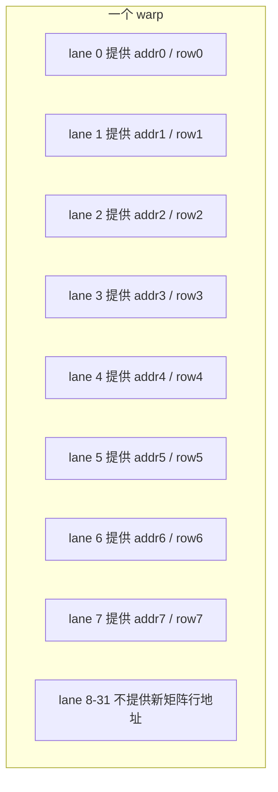
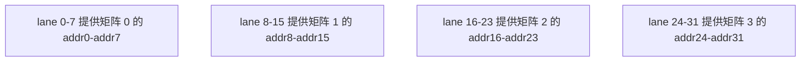
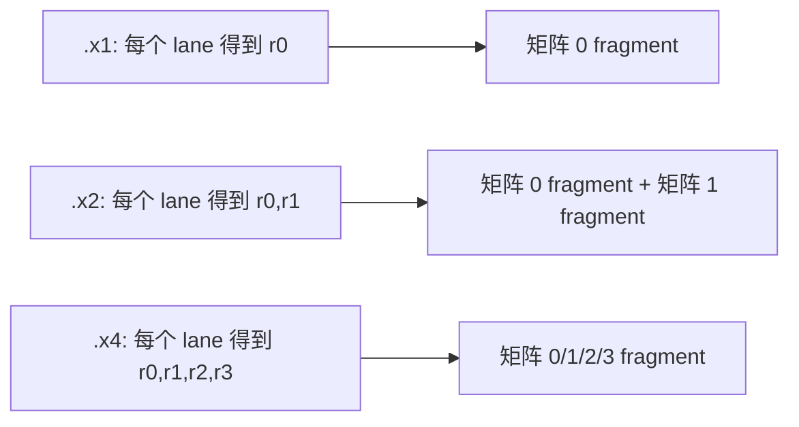
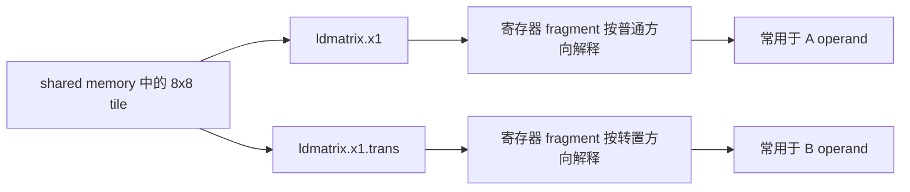
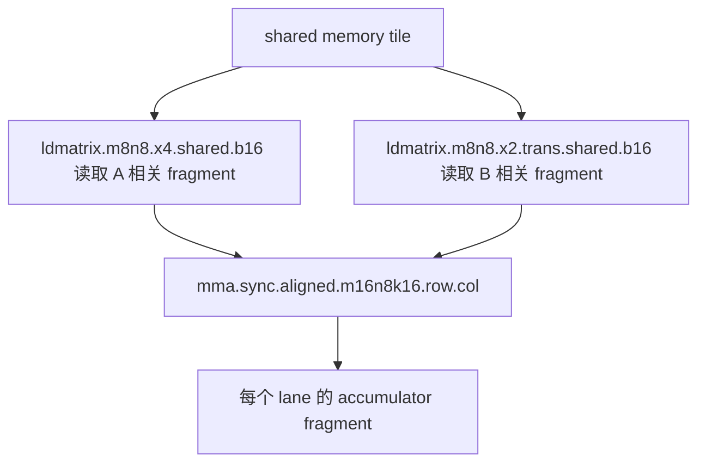

# CUDA ldmatrix 指令笔记

这篇笔记整理 `ldmatrix` 指令。它是 Tensor Core GEMM 里非常关键的一步：**把共享内存中的矩阵 tile，以 `mma` 指令需要的寄存器 fragment 格式，按 warp 协作方式加载到每个线程的寄存器里**。

本文主要参考：

- PTX 官方文档：<https://docs.nvidia.com/cuda/parallel-thread-execution/index.html#warp-level-matrix-instructions-ldmatrix>
- CuTe 源码：`include/cute/arch/copy_sm75.hpp`

先记住一句话：

> `ldmatrix` 不是普通的 per-thread load。它和 `mma.sync` 一样，是 **warp 级指令**。一个 warp 的 32 个线程共同提供地址、共同加载矩阵、共同得到后续 `mma` 能直接使用的寄存器 fragment。

## 为什么需要 `ldmatrix`

Tensor Core 的 `mma` 指令不直接从 shared memory 读矩阵元素。它需要每个 lane 手里已经有一部分 A/B fragment，形式通常是若干个 32-bit 寄存器。

所以一个典型的 CUDA Tensor Core 数据流是：


- `cp.async` 或普通 load/store：负责把 global memory 的 tile 搬到 shared memory。
- `ldmatrix`：负责把 shared memory 的小矩阵搬到 warp 内每个线程的寄存器。
- `mma.sync`：消费这些寄存器 fragment，完成矩阵乘累加。

如果没有 `ldmatrix`，就需要手写很多 shared memory load、线程重排、寄存器打包，既难写又容易破坏 `mma` 期望的 fragment layout。

## PTX 指令形式

官方文档给出的基本形式是：

```ptx
ldmatrix.sync.aligned.shape.num{.trans}{.ss}.type r, [p];
```

较新的低精度形式还有：

```ptx
ldmatrix.sync.aligned.m8n16.num{.ss}.dst_fmt.src_fmt        r, [p];
ldmatrix.sync.aligned.m16n16.num.trans{.ss}.dst_fmt.src_fmt r, [p];
```

本文先以最常用、CuTe SM75 封装也主要覆盖的形式为主：

```ptx
ldmatrix.sync.aligned.m8n8.x1.shared.b16 {r0}, [p];
ldmatrix.sync.aligned.m8n8.x2.shared.b16 {r0, r1}, [p];
ldmatrix.sync.aligned.m8n8.x4.shared.b16 {r0, r1, r2, r3}, [p];

ldmatrix.sync.aligned.m8n8.x1.trans.shared.b16 {r0}, [p];
ldmatrix.sync.aligned.m8n8.x2.trans.shared.b16 {r0, r1}, [p];
ldmatrix.sync.aligned.m8n8.x4.trans.shared.b16 {r0, r1, r2, r3}, [p];
```

## 修饰符含义

| 修饰符 | 含义 |
| --- | --- |
| `.sync` | warp 内所有线程会等待，直到整个 warp 都执行到同一条 `ldmatrix` 指令。 |
| `.aligned` | 要求 warp 内所有线程执行同一条 `ldmatrix`，并使用相同修饰符；分支条件必须 warp-uniform。 |
| `.shape` | 要加载的矩阵形状。常见是 `.m8n8`，表示 8x8 矩阵。 |
| `.num` | 一次加载几个矩阵。`.x1`、`.x2`、`.x4` 分别表示 1、2、4 个矩阵。 |
| `.trans` | 以转置形式加载，常用于给 `mma` 的 B operand 准备 col-major fragment。 |
| `.ss` | state space。常见写法是 `.shared` 或 `.shared::cta`。 |
| `.type` | 元素类型。SM75 经典形式是 `.b16`，也就是 16-bit 元素。 |

官方文档强调：如果地址没有明确写 `.shared`，会按 generic address 处理；但它必须实际指向 shared memory，否则行为未定义。

## 形状和数据类型

`ldmatrix` 不只支持一种形状，但要区分架构和数据类型。

| `.shape` | 矩阵形状 | 元素大小 | 典型用途 |
| --- | --- | --- | --- |
| `.m8n8` | 8x8 | 16-bit | SM75 以来最经典的 `mma` 数据加载。 |
| `.m16n16` | 16x16 | 8-bit / 6-bit / 4-bit | 新架构上的低精度矩阵加载。 |
| `.m8n16` | 8x16 | 6-bit / 4-bit | 新低精度格式加载。 |

CuTe 的 `copy_sm75.hpp` 主要封装的是：

```ptx
ldmatrix.sync.aligned.x{1,2,4}.m8n8.shared.b16
ldmatrix.sync.aligned.x{1,2,4}.trans.m8n8.shared.b16
```

也就是：**8x8、16-bit 元素、一次加载 1/2/4 个矩阵**。

## warp 内地址从哪里来

这是理解 `ldmatrix` 的第一道门槛：`[p]` 不是每个线程独立加载自己的一个地址那么简单。

对于 `.m8n8.b16`，一个 8x8 矩阵有：

- 8 行。
- 每行 8 个 16-bit 元素。
- 每行大小是 16 bytes。

`ldmatrix` 需要每一行的起始地址。官方规则是：**每个矩阵需要 8 个 row address，由 warp 中指定的 8 个线程提供**。

### `.x1`

`.x1` 表示加载 1 个 8x8 矩阵，需要 8 个 row address：



### `.x2`

`.x2` 表示一次加载 2 个 8x8 矩阵，需要 16 个 row address：


### `.x4`

`.x4` 表示一次加载 4 个 8x8 矩阵，需要 32 个 row address：



把它整理成表就是：

| `.num` | lane 0-7 | lane 8-15 | lane 16-23 | lane 24-31 |
| --- | --- | --- | --- | --- |
| `.x1` | 矩阵 0 的 8 个 row address | 不需要 | 不需要 | 不需要 |
| `.x2` | 矩阵 0 的 8 个 row address | 矩阵 1 的 8 个 row address | 不需要 | 不需要 |
| `.x4` | 矩阵 0 的 8 个 row address | 矩阵 1 的 8 个 row address | 矩阵 2 的 8 个 row address | 矩阵 3 的 8 个 row address |

这里容易误解的一点是：**提供地址的线程数，不等于参与加载的线程数**。即使 `.x1` 只需要 lane 0-7 提供 row address，整个 warp 的 32 个线程仍然都会得到自己的寄存器 fragment。

## `.m8n8.b16.x1` 的 32 个 lane 怎么分工

以最经典的：

```ptx
ldmatrix.sync.aligned.m8n8.x1.shared.b16 {r0}, [p];
```

为例。

一个 8x8 half 矩阵有 64 个 half 元素，也就是 128 bytes。一个 warp 有 32 个 lane。`.x1` 时，每个 lane 得到一个 32-bit 寄存器 `r0`，里面装 2 个 half 元素。

所以：

$$
32 \text{ lanes} \times 2 \text{ half/lane} = 64 \text{ half}
$$

刚好覆盖整个 8x8 矩阵。

### 行内切分

每一行有 8 个 half。4 个连续 lane 负责这一整行：  

图中每个寄存器`r`代表一个16bit元素


用公式写就是：

```cpp
int lane = threadIdx.x % 32;
int row = lane / 4;
int col_pair = lane % 4;
int col0 = col_pair * 2;
int col1 = col0 + 1;
```

这不是你要自己写的代码，而是帮助理解 `.m8n8.x1.b16` 的 fragment 分布。

### 图示

下面这张图表示一个 8x8 half 矩阵被 32 个 lane 切成 32 个 2-half fragment。

```mermaid
flowchart TB
    R0["row0: L0(c0,c1) | L1(c2,c3) | L2(c4,c5) | L3(c6,c7)"]
    R1["row1: L4(c0,c1) | L5(c2,c3) | L6(c4,c5) | L7(c6,c7)"]
    R2["row2: L8(c0,c1) | L9(c2,c3) | L10(c4,c5) | L11(c6,c7)"]
    R3["row3: L12(c0,c1) | L13(c2,c3) | L14(c4,c5) | L15(c6,c7)"]
    R4["row4: L16(c0,c1) | L17(c2,c3) | L18(c4,c5) | L19(c6,c7)"]
    R5["row5: L20(c0,c1) | L21(c2,c3) | L22(c4,c5) | L23(c6,c7)"]
    R6["row6: L24(c0,c1) | L25(c2,c3) | L26(c4,c5) | L27(c6,c7)"]
    R7["row7: L28(c0,c1) | L29(c2,c3) | L30(c4,c5) | L31(c6,c7)"]
```



关键点：

- 每个 lane 的目的寄存器是一个 32-bit register。
- 对 `.b16` 来说，一个 32-bit register 正好装两个 16-bit 元素。
- 4 个连续 lane 合起来装满一整行。
- 8 组连续 lane 合起来装满一个 8x8 矩阵。

## `.x2` 和 `.x4` 不是更多线程，而是更多寄存器

`.x1/.x2/.x4` 的区别不是 warp 线程数变了，warp 永远是 32 个 lane。区别是：**一次指令加载几个 8x8 矩阵，以及每个 lane 得到几个 32-bit 寄存器**。

| 指令 | 加载矩阵数 | 每个 lane 的目的寄存器 | 每个 warp 总寄存器数 |
| --- | --- | --- | --- |
| `.x1` | 1 个 8x8 | 1 个 `.b32` | 32 |
| `.x2` | 2 个 8x8 | 2 个 `.b32` | 64 |
| `.x4` | 4 个 8x8 | 4 个 `.b32` | 128 |

直观理解：



对于 `.x2`，每个 lane 的：

- `r0` 对应第 0 个 8x8 矩阵里该 lane 应拿的 fragment。
- `r1` 对应第 1 个 8x8 矩阵里该 lane 应拿的 fragment。

对于 `.x4`，依此类推。

这也解释了为什么 CuTe 里有：

```cpp
SM75_U32x1_LDSM_N  // 1 个 uint32_t 目的寄存器
SM75_U32x2_LDSM_N  // 2 个 uint32_t 目的寄存器
SM75_U32x4_LDSM_N  // 4 个 uint32_t 目的寄存器
```


## `.trans` 到底做什么

`ldmatrix.trans` 会把矩阵以转置布局加载到寄存器 fragment 中。它常见于给 `mma` 的 B operand 准备数据，因为很多 `mma.sync.aligned.m16n8k16.row.col...` 指令需要：

- A 按 row 语义提供。
- B 按 col 语义提供。

普通 GEMM 里，shared memory 可能为了合并访存、避免 bank conflict 或配合 tiled copy，采用某种 swizzle layout。`ldmatrix.trans` 的价值是：**让共享内存里的 row/col 组织和 `mma` 需要的寄存器 fragment 对上**。

可以粗略画成：



注意：`.trans` 不是让每个线程自己写转置代码；转置重排发生在 warp-level matrix load 的硬件语义里。

## 和 `mma.sync` 的配套关系

以 Ampere 常见的 half GEMM 指令为例：

```ptx
mma.sync.aligned.m16n8k16.row.col.f32.f16.f16.f32
```

这条指令是 warp 级矩阵乘累加。它要求 A/B 输入已经按指定 fragment layout 放在各 lane 的寄存器里。

`ldmatrix` 就是为这件事服务的：



为什么 A 常见 `.x4`、B 常见 `.x2`？

- 对 `m16n8k16` 来说，A 的逻辑 tile 是 `16x16` half，大小相当于 4 个 `8x8` half 子矩阵。
- B 的逻辑 tile 是 `16x8` half，大小相当于 2 个 `8x8` half 子矩阵。
- 所以很多 SM80 GEMM mainloop 会看到 A 用 `.x4`，B 用 `.x2.trans`。

这不是唯一写法，但它解释了为什么 CuTe / CUTLASS 代码里经常出现这些组合。

## CuTe 中的封装

CuTe 在 `include/cute/arch/copy_sm75.hpp` 中，把 SM75 的 `ldmatrix` 封装成了一组 copy atom。

### 编译开关

源码里先判断编译器和架构是否支持：

```cpp
#if (CUTE_ARCH_LDSM_SM75_ENABLED) && defined(__CUDA_ARCH__) && __CUDA_ARCH__ >= 750
  #define CUTE_ARCH_LDSM_SM75_ACTIVATED 1
#endif
```

含义：

- 编译器要支持 `ldmatrix` PTX。
- 当前 device 编译目标要是 `sm_75` 或更高。
- 否则走 `CUTE_INVALID_CONTROL_PATH`。

### 非转置版本

| CuTe 类型 | PTX 指令 | 源寄存器描述 | 目的寄存器描述 |
| --- | --- | --- | --- |
| `SM75_U32x1_LDSM_N` | `ldmatrix.sync.aligned.x1.m8n8.shared.b16` | `uint128_t[1]` | `uint32_t[1]` |
| `SM75_U32x2_LDSM_N` | `ldmatrix.sync.aligned.x2.m8n8.shared.b16` | `uint128_t[1]` | `uint32_t[2]` |
| `SM75_U32x4_LDSM_N` | `ldmatrix.sync.aligned.x4.m8n8.shared.b16` | `uint128_t[1]` | `uint32_t[4]` |

源码结构大概是：

```cpp
struct SM75_U32x4_LDSM_N
{
  using SRegisters = uint128_t[1];
  using DRegisters = uint32_t[4];

  CUTE_HOST_DEVICE static void
  copy(uint128_t const& smem_src,
       uint32_t& dst0, uint32_t& dst1, uint32_t& dst2, uint32_t& dst3)
  {
    uint32_t smem_int_ptr = cast_smem_ptr_to_uint(&smem_src);
    asm volatile (
      "ldmatrix.sync.aligned.x4.m8n8.shared.b16 {%0, %1, %2, %3}, [%4];\n"
      : "=r"(dst0), "=r"(dst1), "=r"(dst2), "=r"(dst3)
      :  "r"(smem_int_ptr));
  }
};
```

这里的 `uint128_t const& smem_src` 容易误解。它不是说每个线程真的普通加载一个 `uint128_t`。CuTe 用它表达 shared memory 中某个 16-byte 对齐 row 片段的地址类型，然后通过：

```cpp
cast_smem_ptr_to_uint(&smem_src)
```

把 shared memory 指针转成 PTX 需要的 32-bit shared address。

### 转置版本

| CuTe 类型 | PTX 指令 | 源寄存器描述 | 目的寄存器描述 |
| --- | --- | --- | --- |
| `SM75_U16x2_LDSM_T` | `ldmatrix.sync.aligned.x1.trans.m8n8.shared.b16` | `uint128_t[1]` | `uint32_t[1]` |
| `SM75_U16x4_LDSM_T` | `ldmatrix.sync.aligned.x2.trans.m8n8.shared.b16` | `uint128_t[1]` | `uint32_t[2]` |
| `SM75_U16x8_LDSM_T` | `ldmatrix.sync.aligned.x4.trans.m8n8.shared.b16` | `uint128_t[1]` | `uint32_t[4]` |

名字里的 `U16x2 / U16x4 / U16x8` 可以按“转置后每个线程得到的 16-bit 元素数量视角”理解；但实际 C++ 目的寄存器仍然是 `uint32_t`，因为 PTX 目的寄存器是 `.b32`。

### legacy helper

文件底部还有两个旧接口：

```cpp
template <class T>
CUTE_HOST_DEVICE
void copy_ldsm(uint128_t const* const smem_ptr, T* rmem_ptr);

template <class T>
CUTE_HOST_DEVICE
void copy_ldsm_trans(uint128_t const* const smem_ptr, T* rmem_ptr);
```

它们根据 `sizeof(T)` 选择 `.x1/.x2/.x4`：

| `sizeof(T)` | 非转置 helper | 转置 helper |
| --- | --- | --- |
| `4` | `SM75_U32x1_LDSM_N` | `SM75_U16x2_LDSM_T` |
| `8` | `SM75_U32x2_LDSM_N` | `SM75_U16x4_LDSM_T` |
| `16` | `SM75_U32x4_LDSM_N` | `SM75_U16x8_LDSM_T` |

源码也直接写了注释：这些 legacy LDSM interfaces 不是很有用。实际 CuTe/CUTLASS 更常通过更高层的 tiled copy atom 和 tensor layout 去选择这些底层 atom。

## 一个最小内联 PTX 示例

下面这个例子不是完整 GEMM，只展示一个 warp 如何为 `ldmatrix.x1` 准备 row address。

```cpp
#include <cuda_fp16.h>
#include <cstdint>

/**
 * @brief 演示一个 warp 使用 ldmatrix.x1 从 shared memory 加载一个 8x8 half tile。
 *
 * @param smem 指向 shared memory 中 8x8 half tile 的指针。
 * @param stride 行跨度，单位是 half 元素。
 * @param out 每个线程写出自己拿到的 32-bit fragment，仅用于观察。
 */
__device__ void load_one_m8n8_tile(const half* smem, int stride, uint32_t* out)
{
    const int lane = threadIdx.x & 31;

    // .x1 只需要 lane 0-7 提供 8 个 row address。
    // 对 sm_75 或更老目标，官方要求所有线程地址有效；
    // 因此这里给所有 lane 都构造一个合法地址，低 8 lane 的地址才真正对应 8 行。
    const int row_for_address = lane & 7;
    const half* row_ptr = smem + row_for_address * stride;

    uint32_t smem_addr = static_cast<uint32_t>(__cvta_generic_to_shared(row_ptr));
    uint32_t frag = 0;

    asm volatile(
        "ldmatrix.sync.aligned.m8n8.x1.shared.b16 {%0}, [%1];\n"
        : "=r"(frag)
        : "r"(smem_addr));

    out[lane] = frag;
}
```

这个例子的重点不是 `out`，而是三件事：

- `ldmatrix` 的地址必须是 shared memory address。
- `.x1` 只需要 8 个 row address，但整个 warp 都要执行同一条指令。
- 每个 lane 得到一个 32-bit fragment，后续通常直接作为 `mma.sync` 的输入寄存器。

## 常见坑点

- **不要把 `ldmatrix` 当普通 load。** 它是 warp 级矩阵加载，结果布局是为 `mma` 服务的。
- **分支必须 warp-uniform。** `.aligned` 要求 warp 内所有线程执行同一条指令；如果只有部分 lane 执行，行为未定义。
- **所有线程不能提前退出。** 官方文档明确说，如果 warp 中有线程已经退出，行为未定义。
- **地址必须指向 shared memory。** generic address 不落在 shared memory 时行为未定义。
- **`.x1/.x2` 在旧架构上也要照顾高 lane 地址有效性。** 对 `sm_75` 或更低目标，官方要求所有线程地址有效；常见做法是把低 lane 的合法地址复制或映射给高 lane。
- **row 不要求连续存储。** 每行地址由线程单独提供，所以行与行之间可以有 stride，也可以配合 swizzle layout。
- **对齐要认真处理。** 官方说明读取 8x8 矩阵时，4 个连续线程合计加载 16 bytes，矩阵地址需要满足自然对齐。

## 一句话总结

`ldmatrix` 是 `mma` 的“前置装填指令”：它让一个 warp 从 shared memory 协作加载 1/2/4 个小矩阵，并把数据直接放成 Tensor Core `mma.sync` 想要的 per-lane 寄存器 fragment。理解它时不要从“每个线程 load 一个地址”出发，而要从“一个 warp 一起搬一个矩阵 tile”出发。
