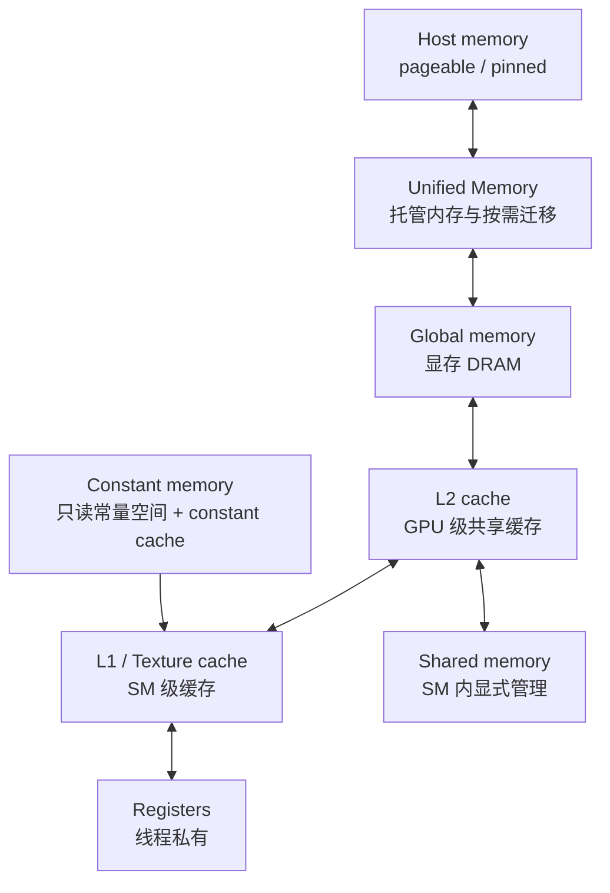

# CUDA 内存体系笔记

这篇笔记不重复展开最常见的 `cudaMalloc` / shared memory tiling，而是把注意力放在几类 CUDA 里比较“有性格”的内存：**constant memory（常量内存）**、**Unified Memory（统一内存）** 和 **page-locked host memory（页锁定主机内存 / pinned memory）**。

参考：

- [CUDA Programming Guide 中文版：Unified Memory](https://bearneck.github.io/cuda-programming-guide-zh/chapters/07-unified-memory/)
- CUDA 13.3 本机头文件：`/usr/local/cuda-13.3/include/cuda_runtime_api.h`、`/usr/local/cuda-13.3/include/cuda_runtime.h`、`/usr/local/cuda-13.3/include/driver_types.h`

## 内存层级速览

CUDA 的内存体系可以粗略看成“容量越大越远，延迟越高；越靠近 SM 越快，但容量越小、约束越多”。



- **global memory** 是大多数 device 数据的落点，容量大、延迟高，性能重点通常是合并访存、减少重复读取、提高 locality（局部性）。
- **L2 cache** 是 GPU 级共享缓存，多个 SM 都能受益；一些高级 API 可以设置 persisting L2 cache，但这里不展开。
- **L1 cache / texture cache** 更靠近 SM。不同架构上 L1、shared memory、texture 路径的组织会变化，所以写性能笔记时最好以具体 GPU 架构为准。
- **shared memory** 是 CTA 内线程显式共享的片上存储，典型用途是 tile 复用、减少 global memory 往返、做 block-level 协作。
- **registers** 是线程私有最快存储，过度使用会增加 register pressure（寄存器压力），影响 occupancy（占用率）。

## 设备内存和共享内存

设备内存和共享内存是 CUDA 优化里最常见的两块：

- `cudaMalloc` 分配的是 device memory，host 和 device 之间通常用 `cudaMemcpyAsync` 配合 stream 传输。它的优势是语义清晰、性能可控；代价是需要显式管理生命周期和数据搬运。
- `__shared__` 分配的是 block 内共享内存，生命周期跟 CTA 一致。它适合让一个 block 内的线程复用同一小块数据，例如 GEMM 的矩阵 tile、卷积窗口、block-level reduction。
- 这两者不是本文重点。本文更关注那些“不是默认选择，但用对了很有价值”的内存机制。

## 常量内存

**constant memory（常量内存）** 是一块 device 侧只读的常量地址空间，host 侧通过 symbol API 更新，kernel 内通过 `__constant__` 变量读取。它的典型价值不是“容量大”，而是当一个 warp 中很多线程读取**同一个地址**时，可以通过 constant cache 广播，减少重复访存。

### 存储区域和访问模型

- 常量变量用 `__constant__` 声明，存储在 device 的 constant address space 中。
- kernel 侧只能读取，不能写入 `__constant__` 变量。
- host 侧不能像普通指针一样直接解引用 device symbol，需要使用 `cudaMemcpyToSymbol`、`cudaMemcpyFromSymbol` 或 `cudaGetSymbolAddress`。
- 常量内存适合**小体积、只读、kernel 多次复用、warp 内访问地址一致或高度相似**的数据，例如卷积核参数、归一化系数、小查表、小型配置结构。
- 如果每个线程读取常量数组里的不同位置，访问会被序列化或退化，未必比 global memory 更好。

### 声明与使用示例

```cpp
#include <cuda_runtime.h>

#include <cstdio>
#include <cstdlib>

/**
 * @brief kernel 中使用的缩放参数，存放在 device constant memory。
 *
 * host 侧通过 cudaMemcpyToSymbol 更新该 symbol。kernel 侧只读访问，
 * 适合所有线程读取同一组小型配置参数的场景。
 */
__constant__ float gScaleFactors[4];

/**
 * @brief 检查 CUDA Runtime API 返回值，失败时打印文件和行号后退出。
 *
 * @param status CUDA Runtime API 的返回值。
 * @param file 调用点所在源文件。
 * @param line 调用点所在行号。
 */
void check_cuda(cudaError_t status, const char* file, int line) {
    if (status == cudaSuccess) {
        return;
    }
    std::fprintf(stderr, "CUDA error at %s:%d: %s\n",
                 file, line, cudaGetErrorString(status));
    std::exit(EXIT_FAILURE);
}

#define CHECK_CUDA(call) check_cuda((call), __FILE__, __LINE__)

/**
 * @brief 对输入向量按 4 路周期缩放，演示 kernel 读取 constant memory。
 *
 * @param input device 输入指针，长度至少为 n。
 * @param output device 输出指针，长度至少为 n。
 * @param n 向量元素数量。
 */
__global__ void scaleWithConstantKernel(const float* __restrict__ input,
                                        float* __restrict__ output,
                                        int n) {
    const int global_idx = blockIdx.x * blockDim.x + threadIdx.x;
    if (global_idx >= n) {
        return;
    }
    output[global_idx] = input[global_idx] * gScaleFactors[global_idx & 3];
}

/**
 * @brief 从 host 更新 constant memory 中的缩放参数。
 *
 * @param factors host 输入数组，至少包含 4 个 float。
 */
void upload_scale_factors(const float* factors) {
    CHECK_CUDA(cudaMemcpyToSymbol(gScaleFactors, factors, 4 * sizeof(float)));
}
```

### `cudaMemcpyToSymbol`

**用途**

把 host 或 device 内存中的数据复制到 CUDA symbol，例如 `__constant__` 或 `__device__` 全局变量。

**原型**

```cpp
extern __host__ cudaError_t CUDARTAPI cudaMemcpyToSymbol(
    const void* symbol,
    const void* src,
    size_t count,
    size_t offset = 0,
    enum cudaMemcpyKind kind = cudaMemcpyHostToDevice);
```

CUDA C++ 还提供模板重载，允许直接传入 symbol 名称：

```cpp
template <class T>
cudaError_t cudaMemcpyToSymbol(
    const T& symbol,
    const void* src,
    size_t count,
    size_t offset = 0,
    enum cudaMemcpyKind kind = cudaMemcpyHostToDevice);
```

**参数**

| 参数 | 类型 | 含义 |
| --- | --- | --- |
| `symbol` | `const void*` / `const T&` | 目标 CUDA symbol。C++ 代码里常直接写 `gScaleFactors`。 |
| `src` | `const void*` | 源地址，可以是 host 或 device 指针，取决于 `kind`。 |
| `count` | `size_t` | 拷贝字节数，不能越过 symbol 对应存储范围。 |
| `offset` | `size_t` | 从 symbol 起始地址算起的字节偏移，默认 0。 |
| `kind` | `cudaMemcpyKind` | 拷贝方向，默认 `cudaMemcpyHostToDevice`。 |

**返回值**

| 类型 | 含义 |
| --- | --- |
| `cudaError_t` | 成功返回 `cudaSuccess`；失败可能来自非法参数、越界、无效 symbol 或之前异步错误。 |

**副作用 / 约束**

- 会修改 device symbol 对应的存储内容。
- 对 `__constant__` symbol 来说，通常在 kernel launch 前完成更新。
- 如果使用 `cudaMemcpyToSymbolAsync`，要用 stream 依赖保证 kernel 读取前拷贝已经完成。

### `cudaMemcpyFromSymbol`

**用途**

从 CUDA symbol 复制数据回 host 或 device 内存，常用于调试 `__constant__` 或 `__device__` 全局变量内容。

**原型**

```cpp
extern __host__ cudaError_t CUDARTAPI cudaMemcpyFromSymbol(
    void* dst,
    const void* symbol,
    size_t count,
    size_t offset = 0,
    enum cudaMemcpyKind kind = cudaMemcpyDeviceToHost);
```

**参数**

| 参数 | 类型 | 含义 |
| --- | --- | --- |
| `dst` | `void*` | 目标地址，可以是 host 或 device 指针，取决于 `kind`。 |
| `symbol` | `const void*` / `const T&` | 源 CUDA symbol。 |
| `count` | `size_t` | 拷贝字节数。 |
| `offset` | `size_t` | symbol 内部字节偏移。 |
| `kind` | `cudaMemcpyKind` | 拷贝方向，默认 `cudaMemcpyDeviceToHost`。 |

**注意点**

- 这个 API 不表示 kernel 能写 `__constant__`；它只是 host 侧把 symbol 内容读出来。
- 对常量参数更推荐一次性上传后只在 kernel 内读，不要在 hot path 频繁更新。

### `cudaGetSymbolAddress`

**用途**

查询 CUDA symbol 的 device 地址，适合把某个全局 symbol 交给需要 device pointer 的底层接口。

**原型**

```cpp
extern __host__ cudaError_t CUDARTAPI cudaGetSymbolAddress(
    void** devPtr,
    const void* symbol);
```

**参数**

| 参数 | 类型 | 含义 |
| --- | --- | --- |
| `devPtr` | `void**` | 输出参数，返回 symbol 对应的 device 地址。 |
| `symbol` | `const void*` / `const T&` | 要查询的 CUDA symbol。 |

**注意点**

- 对 `__constant__` 数据，常规路径仍然是 `cudaMemcpyToSymbol` 更新、kernel 内直接读 symbol。
- 查询出来的地址不改变常量内存“kernel 只读”的语义。

## 纹理内存

早期 CUDA 书籍会花很多篇幅介绍 texture memory（纹理内存）。它的历史用途和图形管线有关，但在通用计算里也曾很有价值：

- **空间局部性友好**：二维/三维邻域访问、非完全合并访问，可以借助 texture cache 改善读取效率。
- **专用采样语义**：纹理路径天然支持坐标寻址、边界模式、格式转换、插值等，这些来自图形纹理采样的设计。
- **只读数据路径**：很多旧架构上，texture cache 是一种显式利用只读缓存的办法。

现代 CUDA 中，普通 global load、只读缓存路径、L1/L2 行为和编译器优化已经更成熟；通用计算代码里不一定需要把普通数组强行改成纹理对象。可以把 texture memory 理解成一种**带寻址和采样语义的只读数据访问抽象**：当数据天然是图像、体数据、查表，并且需要纹理采样语义时，它仍然有意义；否则优先用普通 global memory 或 shared memory。

本文不展开 texture object / CUDA array API。

## UVA、Unified Memory 和 VMM

**UVA（Unified Virtual Addressing，统一虚拟寻址）** 和 **Unified Memory（统一内存）** 不是同一个概念。名字很像，但它们解决的问题不同：

| 概念 | 解决什么问题 | 典型表现 |
| --- | --- | --- |
| UVA / Unified Addressing | **地址空间是否统一**。host 和支持 UVA 的 CUDA device 共享一个虚拟地址空间，runtime 可以从指针值推断它指向 host memory、device memory 还是 managed memory。 | 可以使用 `cudaMemcpyDefault` 让 runtime 推断拷贝方向；某些 pinned host memory 在 kernel 中可用同一个指针值访问。 |
| Unified Memory | **数据由谁管理和迁移**。通过 `cudaMallocManaged` 或 `__managed__` 创建的 managed memory，可以被 CPU/GPU 访问，CUDA driver 负责按需迁移、建立映射和维护一致性。 | 一个 managed pointer 同时给 CPU 和 GPU 使用；可能出现 page fault、prefetch、memory advice、oversubscription。 |
| VMM / Virtual Memory Management | **更底层地管理虚拟地址、物理内存和映射权限**。应用可以显式 reserve virtual address、create physical allocation、map/unmap、set access。 | 常见于内存池、稀疏映射、大模型 KV cache 管理、跨进程/跨设备共享等高级场景。 |

可以这么记：

- **UVA 是地址模型**：指针值放在一个统一虚拟地址空间里，CUDA 能更容易判断“这个地址属于谁”。
- **Unified Memory 是托管内存模型**：这块内存不仅地址可见，而且 CUDA 会管理它在 CPU/GPU 之间的驻留和迁移。
- **VMM 是手动虚拟内存工具箱**：它让你显式管理虚拟地址和映射关系，比 `cudaMalloc` / `cudaMallocManaged` 更底层。

CUDA Runtime API 头文件里，UVA 对应的分组叫 `Unified Addressing`。这一节的描述强调的是：支持 unified addressing 的设备可以和 host 共享统一地址空间；在这些设备上，某些 host pointer 和 device pointer 没有数值区别，`cudaPointerGetAttributes` 可以查询指针背后的内存类型和 device 信息。

### UVA 不等于“自动迁移”

UVA 让指针值更统一，但它本身不表示数据会自动在 CPU 和 GPU 之间迁移。例如：

- `cudaMalloc` 得到的 device pointer 可以处在统一虚拟地址空间里，但 CPU 仍然不能直接解引用它。
- `cudaMallocHost` / `cudaHostAlloc` 得到的 pinned host pointer 在支持 UVA 的设备上可能可以直接传给 kernel，但 GPU 访问的是 host memory，性能语义更接近 mapped pinned memory / zero-copy，不是把数据自动搬进显存。
- `cudaMemcpyDefault` 能工作，是因为 UVA 让 runtime 可以根据指针属性推断拷贝方向；这不等于省掉拷贝。
- `cudaMallocManaged` 才是 Unified Memory 的入口，它创建的是 managed allocation，后续才涉及 page fault、迁移、`cudaMemPrefetchAsync` 和 `cudaMemAdvise`。

所以在本文后面看到“支持 UVA 时 host pointer 和 device pointer 可能相同”，应该理解为**地址表示层面的相同**，不是 Unified Memory 的 managed migration（托管迁移）。

## 统一内存

**Unified Memory（统一内存）** 提供一类 CPU 和 GPU 都能访问的 managed allocation（托管内存分配）。程序看到的是同一个指针，CUDA driver / runtime 负责按需迁移、建立映射、维护一致性。它的优势是简化数据所有权和拷贝逻辑；代价是性能行为更依赖访问模式、页面迁移、page fault（缺页）和平台能力。

### 编程模型

- `cudaMallocManaged` 分配 managed memory，返回的指针可被 CPU 和支持 managed memory 的 GPU 访问。
- `__managed__` 可以声明 device 全局托管变量，语义类似 `__device__` 全局变量，但 host 也可以通过同一变量名访问。
- 在支持完整 Unified Memory 的平台上，数据可能按访问迁移到 CPU 或 GPU；在部分平台上，可能退化为更保守的同步/迁移模型。
- 统一内存解决的是**可访问性和一致性**，不是自动保证最优性能。高性能代码通常还要配合 `cudaMemPrefetchAsync` 和 `cudaMemAdvise`。

### 平台能力

可以用 `cudaDeviceGetAttribute` 查询相关能力：

| 属性 | 含义 |
| --- | --- |
| `cudaDevAttrManagedMemory` | 设备是否支持 managed memory。 |
| `cudaDevAttrConcurrentManagedAccess` | 是否支持 CPU/GPU 或多 GPU 对 managed memory 的并发访问模型，以及 GPU page fault / oversubscription 等能力。 |
| `cudaDevAttrPageableMemoryAccess` | 设备是否能一致地访问 pageable system memory。 |
| `cudaDevAttrPageableMemoryAccessUsesHostPageTables` | 设备访问 pageable memory 时是否使用 host page table。 |

老资料里经常把 Unified Memory 简化成“`cudaMallocManaged` 后不用 `cudaMemcpy`”。这句话只适合作为入门印象。真正写性能代码时，要关心：

- 首次访问发生在哪里，页面就可能先驻留在哪里。
- CPU 和 GPU 交替写同一批页面会造成 thrashing（页面来回迁移）。
- kernel launch 前后是否需要同步，尤其是在 `concurrentManagedAccess == 0` 的平台上。
- 多 GPU 下是否发生远程访问、peer mapping、迁移或退化到 host zero-copy。

### `cudaMallocManaged`

**用途**

分配由 Unified Memory 系统管理的内存，返回 CPU 和 GPU 都能使用的指针。

**原型**

```cpp
#if defined(__cplusplus)
extern __host__ cudaError_t CUDARTAPI cudaMallocManaged(
    void** devPtr,
    size_t size,
    unsigned int flags = cudaMemAttachGlobal);
#else
extern __host__ cudaError_t CUDARTAPI cudaMallocManaged(
    void** devPtr,
    size_t size,
    unsigned int flags);
#endif
```

CUDA C++ 常用模板重载：

```cpp
template <class T>
cudaError_t cudaMallocManaged(
    T** devPtr,
    size_t size,
    unsigned int flags = cudaMemAttachGlobal);
```

**参数**

| 参数 | 类型 | 含义 |
| --- | --- | --- |
| `devPtr` | `void**` / `T**` | 输出参数，返回 managed memory 指针。虽然参数名叫 `devPtr`，但返回指针 host 和 device 都可使用。 |
| `size` | `size_t` | 分配字节数。`size == 0` 会返回 `cudaErrorInvalidValue`。 |
| `flags` | `unsigned int` | 默认 stream 关联策略，只能是 `cudaMemAttachGlobal` 或 `cudaMemAttachHost`。 |

**返回值**

| 类型 | 含义 |
| --- | --- |
| `cudaError_t` | 成功返回 `cudaSuccess`；常见失败包括 `cudaErrorMemoryAllocation`、`cudaErrorNotSupported`、`cudaErrorInvalidValue`。 |

**副作用 / 约束**

- 分配出的内存未初始化。
- 必须用 `cudaFree` 释放，而不是 `free` 或 `cudaFreeHost`。
- `cudaMemAttachGlobal` 表示所有 stream / device 默认可访问。
- `cudaMemAttachHost` 表示默认先关联 host；在部分设备上需要 `cudaStreamAttachMemAsync` 才允许指定 stream 的 device work 访问。

### `cudaMemLocation`

CUDA 13.3 的 `cudaMemPrefetchAsync` 和 `cudaMemAdvise` 使用 `cudaMemLocation` 描述目标位置。

```cpp
enum cudaMemLocationType {
    /** 无效位置，也可作为未指定位置的编码值。 */
    cudaMemLocationTypeInvalid = 0,

    /** 未指定 preferred location，常用于 managed memory pool 创建时表示没有位置偏好。 */
    cudaMemLocationTypeNone = 0,

    /** GPU device 位置，此时 cudaMemLocation::id 表示 GPU 的 device ordinal。 */
    cudaMemLocationTypeDevice = 1,

    /** 普通 host 位置，此时 cudaMemLocation::id 会被忽略。 */
    cudaMemLocationTypeHost = 2,

    /** host NUMA node 位置，此时 cudaMemLocation::id 表示 CPU NUMA node id。 */
    cudaMemLocationTypeHostNuma = 3,

    /** 当前 CPU 线程所在或最近的 host NUMA node，此时 cudaMemLocation::id 会被忽略。 */
    cudaMemLocationTypeHostNumaCurrent = 4,

    /** 对当前进程不可见但可访问的位置，cudaMemLocation::id 固定为 cudaInvalidDeviceId。 */
    cudaMemLocationTypeInvisible = 5
};

struct cudaMemLocation {
    enum cudaMemLocationType type;
    union {
        int id;
    };
};
```

| 字段 | 类型 | 含义 |
| --- | --- | --- |
| `type` | `cudaMemLocationType` | 位置类型，例如 device、host、host NUMA node。 |
| `id` | `int` | 当 `type == cudaMemLocationTypeDevice` 时表示 GPU device ordinal；当 `type == cudaMemLocationTypeHostNuma` 时表示 NUMA node id。 |

**枚举语义**

| 枚举 | `id` 语义 | 含义 |
| --- | --- | --- |
| `cudaMemLocationTypeInvalid` | 不应使用 | 无效位置。它和 `cudaMemLocationTypeNone` 数值同为 0，但语义上通常表示“这个位置值不合法”。 |
| `cudaMemLocationTypeNone` | 忽略 | 未指定位置偏好。CUDA 头文件中特别提到它可用于 managed memory pool，表示没有 preferred location。 |
| `cudaMemLocationTypeDevice` | GPU 编号 | 指定某个 GPU，例如 `id = 0` 表示 device 0。`cudaMemPrefetchAsync` 预取到 GPU 时最常用这个枚举。 |
| `cudaMemLocationTypeHost` | 忽略 | 指定普通 CPU host memory 位置。把 managed memory 预取回 CPU 时常用这个枚举。 |
| `cudaMemLocationTypeHostNuma` | NUMA node id | 指定某个 CPU NUMA node。适合多路 CPU 或复杂拓扑机器，希望数据靠近某个 CPU socket / NUMA node。 |
| `cudaMemLocationTypeHostNumaCurrent` | 忽略 | 指定“当前 CPU 线程最近的 NUMA node”。适合不想手动查询 NUMA node id，但希望 host 侧 locality 更合理的场景。 |
| `cudaMemLocationTypeInvisible` | `cudaInvalidDeviceId` | 表示位置对当前进程不可见但 device 可访问。普通应用很少手写它，更多出现在跨进程、fabric handle 或底层虚拟内存管理语义里。 |

**NUMA 是什么**

NUMA 是 **Non-Uniform Memory Access（非一致内存访问）**。在多路 CPU 服务器上，内存不是“离所有 CPU 都一样近”的一整块资源，而是通常按 CPU socket / NUMA node 分组：

- CPU 访问**本地 NUMA node** 上的内存，延迟更低、带宽更高。
- CPU 跨 socket 访问**远端 NUMA node** 上的内存，需要走 CPU 之间的互连，延迟更高。
- GPU 通过 PCIe / NVLink / NVSwitch 接入系统时，也会有“离哪个 CPU socket 更近”的拓扑关系。

所以 `cudaMemLocationTypeHostNuma` 和 `cudaMemLocationTypeHostNumaCurrent` 的目的，是让 Unified Memory 的 host 侧驻留位置也能表达 locality（局部性）：不仅说“放回 CPU”，还可以说“尽量放到某个 CPU NUMA node 附近”。单路 CPU 桌面机上通常不需要关心它；多 CPU socket 服务器、GPU 拓扑复杂的训练/推理机器上才更有意义。

常用构造：

```cpp
cudaMemLocation gpu0_location{
    cudaMemLocationTypeDevice,
    0,
};

cudaMemLocation host_location{
    cudaMemLocationTypeHost,
    0,
};
```

### `cudaMemPrefetchAsync`

**用途**

给 Unified Memory 一个异步、stream-ordered（按 stream 排序）的迁移提示，把指定范围预取到某个处理器附近，减少后续访问时的 page fault。

**原型**

```cpp
extern __host__ cudaError_t CUDARTAPI cudaMemPrefetchAsync(
    const void* devPtr,
    size_t count,
    struct cudaMemLocation location,
    unsigned int flags,
    cudaStream_t stream);
```

**参数**

| 参数 | 类型 | 含义 |
| --- | --- | --- |
| `devPtr` | `const void*` | 目标 managed memory 或支持 Unified Memory 的内存范围起始地址。 |
| `count` | `size_t` | 预取字节数。 |
| `location` | `cudaMemLocation` | 目标位置，例如 `{cudaMemLocationTypeDevice, device_id}` 或 `{cudaMemLocationTypeHost, 0}`。 |
| `flags` | `unsigned int` | CUDA 13.3 当前常用传 0，预留给扩展。 |
| `stream` | `cudaStream_t` | 预取操作所在 stream；会等前序操作完成，且后续同 stream 操作会等预取完成。 |

**副作用 / 约束**

- 这是性能提示，不改变程序正确性语义。
- 预取期间数据仍然可以被访问，但如果访问和迁移竞争，性能可能不稳定。
- 预取到 GPU 后又由 CPU 大量写入，可能导致页面迁回 host。
- 对系统分配的 pageable memory，是否可用取决于设备和平台的完整 Unified Memory 支持。

### `cudaMemAdvise`

**用途**

告诉 Unified Memory 子系统某段内存未来的访问模式，让驱动调整迁移、映射和复制策略。

**原型**

```cpp
extern __host__ cudaError_t CUDARTAPI cudaMemAdvise(
    const void* devPtr,
    size_t count,
    enum cudaMemoryAdvise advice,
    struct cudaMemLocation location);
```

**参数**

| 参数 | 类型 | 含义 |
| --- | --- | --- |
| `devPtr` | `const void*` | 内存范围起始地址。通常是 `cudaMallocManaged` 或 `__managed__` 对应范围；完整 UM 平台上也可能是系统分配内存。 |
| `count` | `size_t` | 内存范围大小，单位字节。 |
| `advice` | `cudaMemoryAdvise` | 访问建议类型。 |
| `location` | `cudaMemLocation` | 建议所针对的位置；部分 unset 建议会忽略该参数。 |

**常见 `advice`**

| 枚举 | 含义 | 适合场景 |
| --- | --- | --- |
| `cudaMemAdviseSetReadMostly` | 数据大部分只读，偶尔写。 | 多 GPU 或 CPU/GPU 都读同一数据，允许建立只读副本来减少迁移。 |
| `cudaMemAdviseUnsetReadMostly` | 取消 read-mostly 建议。 | 数据访问模式变为频繁写。 |
| `cudaMemAdviseSetPreferredLocation` | 设置偏好的驻留位置。 | 主要由某个 GPU 反复访问，希望减少迁移决策抖动。 |
| `cudaMemAdviseUnsetPreferredLocation` | 清除偏好位置。 | 后续访问位置不固定。 |
| `cudaMemAdviseSetAccessedBy` | 指定某个处理器会访问该范围，尽量提前建立映射，减少 fault。 | 多 GPU 偶尔访问 peer 数据，迁移不划算但希望避免首次 fault。 |
| `cudaMemAdviseUnsetAccessedBy` | 取消 accessed-by 建议。 | 后续不再需要该处理器访问。 |

**注意点**

- `cudaMemAdvise` 是性能提示，不应该依赖它保证正确性。
- `SetPreferredLocation` 可能覆盖驱动的 thrashing 缓解策略；如果 CPU/GPU 频繁交替写，强设 preferred location 反而可能让页面继续来回迁移。
- `SetAccessedBy` 不主动迁移数据，只是尽量建立可访问映射。

### 统一内存示例

```cpp
#include <cuda_runtime.h>

#include <cstdio>
#include <cstdlib>
#include <numeric>
#include <vector>

/**
 * @brief 使用统一内存完成向量加法。
 *
 * @param a managed memory 指针，输入数组 A，长度至少为 n。
 * @param b managed memory 指针，输入数组 B，长度至少为 n。
 * @param c managed memory 指针，输出数组 C，长度至少为 n。
 * @param n 向量元素数量。
 */
__global__ void vectorAddManagedKernel(const float* __restrict__ a,
                                       const float* __restrict__ b,
                                       float* __restrict__ c,
                                       int n) {
    const int global_idx = blockIdx.x * blockDim.x + threadIdx.x;
    if (global_idx >= n) {
        return;
    }
    c[global_idx] = a[global_idx] + b[global_idx];
}

/**
 * @brief 演示 cudaMallocManaged、cudaMemAdvise 和 cudaMemPrefetchAsync 的组合用法。
 *
 * @param n 向量元素数量。
 * @param device_id 目标 GPU 编号。
 */
void run_managed_vector_add(int n, int device_id) {
    CHECK_CUDA(cudaSetDevice(device_id));

    float* a = nullptr;
    float* b = nullptr;
    float* c = nullptr;
    const std::size_t bytes = static_cast<std::size_t>(n) * sizeof(float);

    CHECK_CUDA(cudaMallocManaged(&a, bytes));
    CHECK_CUDA(cudaMallocManaged(&b, bytes));
    CHECK_CUDA(cudaMallocManaged(&c, bytes));

    for (int i = 0; i < n; ++i) {
        a[i] = static_cast<float>(i);
        b[i] = 1.0f;
    }

    const cudaMemLocation gpu_location{
        cudaMemLocationTypeDevice,
        device_id,
    };

    // a 和 b 主要被 kernel 读取，给 read-mostly 提示可能减少迁移和复制成本。
    CHECK_CUDA(cudaMemAdvise(a, bytes, cudaMemAdviseSetReadMostly, gpu_location));
    CHECK_CUDA(cudaMemAdvise(b, bytes, cudaMemAdviseSetReadMostly, gpu_location));

    CHECK_CUDA(cudaMemPrefetchAsync(a, bytes, gpu_location, 0, nullptr));
    CHECK_CUDA(cudaMemPrefetchAsync(b, bytes, gpu_location, 0, nullptr));
    CHECK_CUDA(cudaMemPrefetchAsync(c, bytes, gpu_location, 0, nullptr));

    constexpr int block_size = 256;
    const int grid_size = (n + block_size - 1) / block_size;
    vectorAddManagedKernel<<<grid_size, block_size>>>(a, b, c, n);
    CHECK_CUDA(cudaGetLastError());
    CHECK_CUDA(cudaDeviceSynchronize());

    const cudaMemLocation host_location{
        cudaMemLocationTypeHost,
        0,
    };
    CHECK_CUDA(cudaMemPrefetchAsync(c, bytes, host_location, 0, nullptr));
    CHECK_CUDA(cudaDeviceSynchronize());

    std::printf("c[0] = %.1f, c[%d] = %.1f\n", c[0], n - 1, c[n - 1]);

    CHECK_CUDA(cudaFree(c));
    CHECK_CUDA(cudaFree(b));
    CHECK_CUDA(cudaFree(a));
}
```

这个例子里：

- CPU 初始化 `a`、`b` 后，数据大概率先在 host 侧有有效驻留。
- kernel 前用 `cudaMemPrefetchAsync` 把 `a`、`b`、`c` 预取到 GPU，避免 kernel 第一次触碰每个页面时集中 fault。
- kernel 后把 `c` 预取回 host，再由 CPU 读取结果。
- `cudaDeviceSynchronize` 不是为了统一内存本身“必须同步”，而是为了保证 kernel 和预取完成后再由 CPU 读结果。

## 页锁定主机内存

**page-locked host memory（页锁定主机内存）**，也叫 **pinned memory**，是不能被操作系统换出的 host memory。CUDA driver 可以稳定地知道这段虚拟地址对应的物理页，因此能更高效地做 DMA 传输，也可以把它映射到 device 地址空间供 GPU 直接访问。

### 为什么需要 pinned memory

普通 `malloc` / `new` 得到的是 pageable memory。异步 H2D / D2H 传输真正要和 kernel 重叠时，通常需要 pinned memory 作为源或目标；否则 runtime 可能需要内部 staging，造成额外拷贝或同步。

pinned memory 的典型用途：

- **异步拷贝 staging buffer**：host 线程准备数据，`cudaMemcpyAsync` 把 pinned buffer 传到 device。
- **流水线传输**：多个 pinned buffer 配合多个 stream，实现 CPU 准备、H2D、kernel、D2H 重叠。
- **mapped zero-copy**：把 pinned host memory 映射到 device address space，让 GPU 直接读写 host memory。

它的代价也很明确：

- 分配/注册成本高于普通 host memory，不适合频繁小块分配。
- 过量 pinned memory 会减少 OS 可分页内存，拖慢整个系统。
- mapped zero-copy 走 PCIe/NVLink 等互连访问 host memory，延迟和带宽通常远不如 device DRAM，适合少量、流式、一次性访问，不适合反复随机读写。

### `cudaMallocHost`

**用途**

分配一段 page-locked host memory。它是最简单的 pinned memory 分配接口。

**原型**

```cpp
extern __host__ cudaError_t CUDARTAPI cudaMallocHost(
    void** ptr,
    size_t size);
```

**参数**

| 参数 | 类型 | 含义 |
| --- | --- | --- |
| `ptr` | `void**` | 输出参数，返回 host 指针。 |
| `size` | `size_t` | 分配字节数。 |

**返回值**

| 类型 | 含义 |
| --- | --- |
| `cudaError_t` | 成功返回 `cudaSuccess`；失败可能是非法参数、内存不足或外部设备错误。 |

**副作用 / 约束**

- 返回的是 host 指针，CPU 可直接读写。
- 必须用 `cudaFreeHost` 释放。
- 适合作为 `cudaMemcpyAsync` 的 host 侧输入/输出 buffer。

### `cudaHostAlloc`

**用途**

分配 pinned host memory，并用 flags 指定 portable、mapped、write-combined 等属性。

**原型**

```cpp
extern __host__ cudaError_t CUDARTAPI cudaHostAlloc(
    void** pHost,
    size_t size,
    unsigned int flags);
```

**参数**

| 参数 | 类型 | 含义 |
| --- | --- | --- |
| `pHost` | `void**` | 输出参数，返回 host 指针。 |
| `size` | `size_t` | 分配字节数。 |
| `flags` | `unsigned int` | 分配属性，可组合使用。 |

**常见 flags**

| flag | 含义 |
| --- | --- |
| `cudaHostAllocDefault` | 默认行为，等价于 `cudaMallocHost`。 |
| `cudaHostAllocPortable` | 所有 CUDA context 都把这段内存视为 pinned。 |
| `cudaHostAllocMapped` | 映射到 CUDA 地址空间，可用 `cudaHostGetDevicePointer` 取 device pointer。 |
| `cudaHostAllocWriteCombined` | 使用 write-combined 内存，CPU 写入和 H2D 传输可能更快，但 CPU 读取很慢。 |

**注意点**

- 在 Unified Virtual Addressing（统一虚拟寻址）设备上，普通 `cudaMallocHost` / `cudaHostAlloc` 返回的 host 指针通常可直接作为 kernel 参数使用；但 `cudaHostAllocWriteCombined` 等例外可能需要通过 `cudaHostGetDevicePointer` 查询 device alias。
- `cudaHostAllocMapped` 的失败可能延迟到 `cudaHostGetDevicePointer`，因为同一段 portable pinned memory 也许能在其他 context 中映射。

### `cudaHostRegister`

**用途**

把一段已经存在的 host memory 注册为 CUDA 可用的 pinned memory。适合已有分配器、第三方库 buffer、文件映射或需要复用现有 host 指针的场景。

**原型**

```cpp
extern __host__ cudaError_t CUDARTAPI cudaHostRegister(
    void* ptr,
    size_t size,
    unsigned int flags);
```

**参数**

| 参数 | 类型 | 含义 |
| --- | --- | --- |
| `ptr` | `void*` | 已存在的 host memory 起始地址。 |
| `size` | `size_t` | 注册范围大小，单位字节。 |
| `flags` | `unsigned int` | 注册属性，例如 `cudaHostRegisterMapped`、`cudaHostRegisterPortable`、`cudaHostRegisterReadOnly`。 |

**常见 flags**

| flag | 值 | 含义 |
| --- | --- | --- |
| `cudaHostRegisterDefault` | `0x00` | 默认注册属性。在支持 UVA（Unified Virtual Addressing，统一虚拟寻址）的系统上，这段内存会同时具备 mapped 和 portable 语义；在不支持 UVA 的系统上，默认不 mapped、也不 portable。 |
| `cudaHostRegisterPortable` | `0x01` | 让所有 CUDA context 都把这段 host memory 视为 pinned memory，而不只限于执行注册的 context。 |
| `cudaHostRegisterMapped` | `0x02` | 把已注册 host memory 映射到 CUDA 地址空间，可通过 `cudaHostGetDevicePointer` 查询 device 侧可用指针。适合 mapped zero-copy 或 device 直接访问 host buffer 的场景。 |
| `cudaHostRegisterIoMemory` | `0x04` | 把传入指针视为 memory-mapped I/O space，例如第三方 PCIe 设备暴露的 MMIO / BAR 空间。CUDA 会把它当成非 cache-coherent 且连续的 I/O 内存处理，普通应用很少直接使用。 |
| `cudaHostRegisterReadOnly` | `0x08` | 把这段 memory-mapped host memory 注册为 device 侧只读。适合 GPU 只读访问的映射区域；是否支持可查询 `cudaDevAttrHostRegisterReadOnlySupported`。 |

**副作用 / 约束**

- 注册成功后，这段内存进入 CUDA pinned tracking 机制，拷贝 API 可被加速。
- 必须用 `cudaHostUnregister(ptr)` 取消注册，且 `ptr` 要等于注册时的起始地址。
- 设备必须支持 host registration，可查询 `cudaDevAttrHostRegisterSupported`。
- `cudaHostRegisterMapped` 的实际映射能力取决于设备和 context，失败可能延迟到 `cudaHostGetDevicePointer`。
- `cudaHostRegisterIoMemory` 面向外设内存映射，不要拿它注册普通 `malloc` / `new` 分配的 host buffer。
- `cudaHostRegisterReadOnly` 需要设备支持；在不支持的设备上使用会返回 `cudaErrorNotSupported`。
- 过量注册同样会影响系统分页能力。

### `cudaHostGetDevicePointer`

**用途**

为 mapped pinned memory 查询 device 可使用的指针别名。

**原型**

```cpp
extern __host__ cudaError_t CUDARTAPI cudaHostGetDevicePointer(
    void** pDevice,
    void* pHost,
    unsigned int flags);
```

**参数**

| 参数 | 类型 | 含义 |
| --- | --- | --- |
| `pDevice` | `void**` | 输出参数，返回 device 侧可用地址。 |
| `pHost` | `void*` | 已用 `cudaHostAllocMapped` 分配或 `cudaHostRegisterMapped` 注册的 host 指针。 |
| `flags` | `unsigned int` | CUDA 13.3 里作为预留参数，通常传 0。 |

**注意点**

- 在支持 UVA 的设备上，有些 pinned allocation 的 host pointer 和 device pointer 数值相同；但不要把这个当成所有情况的不变量。
- 对 registered memory 和 write-combined host allocation，host/device pointer 可能不同，需要查询后使用。
- 如果设备不支持 mapped pinned memory，这个 API 会失败。

### pinned staging buffer 示例

```cpp
#include <cuda_runtime.h>

#include <algorithm>
#include <cstddef>
#include <cstdio>

/**
 * @brief 管理一段 pinned host buffer 的轻量 RAII 封装。
 *
 * @tparam T buffer 元素类型。
 */
template <typename T>
class PinnedHostBuffer {
public:
    /**
     * @brief 分配 count 个元素的 pinned host memory。
     *
     * @param count 元素数量。
     */
    explicit PinnedHostBuffer(std::size_t count)
        : mCount(count) {
        CHECK_CUDA(cudaMallocHost(reinterpret_cast<void**>(&mData),
                                  mCount * sizeof(T)));
    }

    /**
     * @brief 释放 pinned host memory。
     */
    ~PinnedHostBuffer() {
        if (mData != nullptr) {
            cudaFreeHost(mData);
        }
    }

    PinnedHostBuffer(const PinnedHostBuffer&) = delete;
    PinnedHostBuffer& operator=(const PinnedHostBuffer&) = delete;

    /**
     * @brief 返回 host 指针，CPU 可直接读写。
     *
     * @return pinned host memory 指针。
     */
    T* data() noexcept {
        return mData;
    }

    /**
     * @brief 返回元素数量。
     *
     * @return buffer 中的元素个数。
     */
    std::size_t size() const noexcept {
        return mCount;
    }

private:
    T* mData = nullptr;
    std::size_t mCount = 0;
};

/**
 * @brief 演示 pinned host memory 作为 cudaMemcpyAsync 的 host 侧 staging buffer。
 *
 * @param device_ptr device 输出指针，容量至少为 n 个 float。
 * @param n 元素数量。
 * @param stream 用于异步拷贝的 CUDA stream。
 */
void upload_with_pinned_buffer(float* device_ptr,
                               std::size_t n,
                               cudaStream_t stream) {
    PinnedHostBuffer<float> host_buffer(n);
    std::fill(host_buffer.data(), host_buffer.data() + host_buffer.size(), 1.0f);

    CHECK_CUDA(cudaMemcpyAsync(device_ptr,
                               host_buffer.data(),
                               n * sizeof(float),
                               cudaMemcpyHostToDevice,
                               stream));

    // host_buffer 析构前必须保证异步拷贝已经完成。
    CHECK_CUDA(cudaStreamSynchronize(stream));
}
```

### mapped zero-copy 示例

```cpp
/**
 * @brief 直接从 mapped pinned host memory 读取数据并写入 device memory。
 *
 * @param mapped_host_input device 可访问的 host memory 映射地址，长度至少为 n。
 * @param output device 输出指针，长度至少为 n。
 * @param n 元素数量。
 */
__global__ void readMappedHostKernel(const float* __restrict__ mapped_host_input,
                                     float* __restrict__ output,
                                     int n) {
    const int global_idx = blockIdx.x * blockDim.x + threadIdx.x;
    if (global_idx >= n) {
        return;
    }
    output[global_idx] = mapped_host_input[global_idx] * 2.0f;
}

/**
 * @brief 演示 cudaHostAllocMapped 和 cudaHostGetDevicePointer 的 zero-copy 用法。
 *
 * @param output device 输出指针，容量至少为 n 个 float。
 * @param n 元素数量。
 */
void run_zero_copy_read(float* output, int n) {
    float* host_ptr = nullptr;
    float* device_alias = nullptr;
    const std::size_t bytes = static_cast<std::size_t>(n) * sizeof(float);

    CHECK_CUDA(cudaHostAlloc(reinterpret_cast<void**>(&host_ptr),
                             bytes,
                             cudaHostAllocMapped));
    CHECK_CUDA(cudaHostGetDevicePointer(reinterpret_cast<void**>(&device_alias),
                                        host_ptr,
                                        0));

    for (int i = 0; i < n; ++i) {
        host_ptr[i] = static_cast<float>(i);
    }

    constexpr int block_size = 256;
    const int grid_size = (n + block_size - 1) / block_size;
    readMappedHostKernel<<<grid_size, block_size>>>(device_alias, output, n);
    CHECK_CUDA(cudaGetLastError());
    CHECK_CUDA(cudaDeviceSynchronize());

    CHECK_CUDA(cudaFreeHost(host_ptr));
}
```

zero-copy 的关键判断：

- 如果 GPU 对这段 host memory 只读一次，且数据量不大，zero-copy 可以省掉显式 H2D 拷贝。
- 如果 kernel 会反复访问同一批数据，把数据复制到 device memory 往往更快。
- 如果 CPU 和 GPU 同时访问同一 host buffer，要自己设计同步协议；pinned/mapped 不等于自动解决数据竞争。

## 三类机制的选型

| 机制 | 优点 | 代价 | 适合场景 |
| --- | --- | --- | --- |
| `__constant__` | warp 内同地址读取可广播；语义简单；适合小只读参数。 | 容量小；host 更新要走 symbol API；线程读不同地址时收益下降。 | 小配置、卷积核、小查表、所有线程共享的标量参数。 |
| `cudaMallocManaged` | 一个指针同时给 CPU/GPU 使用；代码简单；支持按需迁移和 oversubscription。 | page fault 和迁移可能造成抖动；平台差异明显；性能需要 hints。 | 原型开发、复杂指针结构、CPU/GPU 交替处理但访问阶段清楚的数据。 |
| `cudaMallocHost` / `cudaHostAlloc` | H2D/D2H 异步拷贝更可靠；可作为高吞吐 staging buffer。 | 过量分配影响系统；分配成本较高。 | 输入输出流水线、数据加载线程和 GPU stream 重叠。 |
| `cudaHostRegister` | 复用已有 host buffer；可接第三方分配器。 | 注册/取消注册成本高；需要设备能力支持；生命周期更容易写错。 | 大块长期复用 buffer、外部库内存、文件映射或 I/O buffer。 |
| mapped pinned memory | GPU 可直接访问 host memory，避免显式拷贝。 | 访问 host memory 延迟高、带宽低于显存；需要同步协议。 | 少量一次性读写、低延迟控制数据、集成外设/生产者 buffer。 |

## 实战注意点

- **不要把 Unified Memory 当成性能优化本身**。它首先是编程模型优化；性能要看访问阶段是否清晰、是否预取、是否避免 CPU/GPU 来回写同一页面。
- **不要过量使用 pinned memory**。它会减少 OS 可分页内存，尤其在训练/推理服务里，过量 pinned buffer 会影响整机稳定性。
- **异步拷贝想重叠，host 侧 buffer 优先 pinned**。pageable memory 参与 `cudaMemcpyAsync` 时，runtime 可能插入内部同步或 staging。
- **constant memory 适合广播，不适合每线程随机索引**。如果每个 lane 读不同地址，constant cache 的优势会被削弱。
- **纹理内存优先服务“采样语义”**。如果只是普通线性数组读取，现代 CUDA 通常先考虑 global load、只读限定、shared memory tiling 或 L2 locality。
- **API 的 flags 不是装饰品**。`cudaHostAllocWriteCombined` 对 CPU 读很慢；`cudaMemAttachHost` 影响 managed allocation 的默认关联；`cudaMemAdviseSetPreferredLocation` 可能改变驱动处理 thrashing 的策略。
