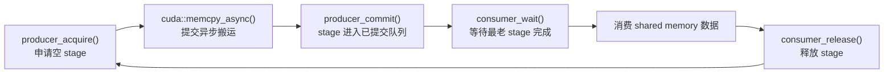
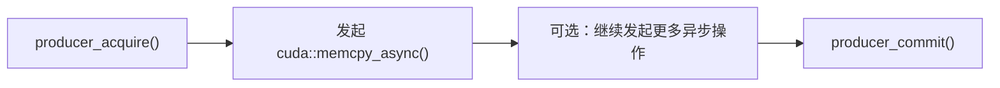
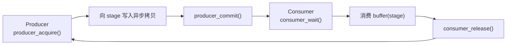

# CUDA Pipelines 笔记

这篇笔记整理 CUDA Programming Guide 里的
[Pipelines](https://docs.nvidia.com/cuda/cuda-programming-guide/04-special-topics/pipelines.html)
章节。

先记住一句话：

> 如果 `cuda::barrier` 是一个灵活的“信号灯”，那么 `cuda::pipeline` 就是一套管理多缓冲生产线的状态机：生产者申请 stage、提交异步操作，消费者等待 stage 完成、消费数据并释放 stage。

CUDA pipeline 是 advanced synchronization primitives（高级同步原语）里的一个机制，主要用来：

- **分阶段管理工作**：把数据搬运和计算拆成多个 stage（阶段）。
- **协调 multi-buffer producer-consumer pattern（多缓冲生产者-消费者模式）**：例如双缓冲、三缓冲。
- **重叠计算和异步数据拷贝**：在计算当前批次时，让硬件同时搬运后续批次。
- **封装底层同步协议**：不用手写每个 buffer 的 ready / filled barrier。

它最常见的使用对象是 `cuda::pipeline`，通常配合 `cuda::memcpy_async` 把 global memory 的数据异步搬到 shared memory。

## 总体模型

Pipeline 可以理解成一组有限的“车厢”或“槽位”，每个槽位就是一个 stage：



一个 stage 可以包含一次或多次异步操作。比如某一轮 `producer_acquire()` 和 `producer_commit()` 之间可以发出多个 `cuda::memcpy_async()`，这些拷贝共同属于同一个 stage。

## Stage 和多缓冲

高性能 CUDA kernel 里常见的目标是：

- 当前正在计算 batch $N$。
- 同时异步搬运 batch $N + 1$。
- 如果内存延迟更长，甚至提前搬运 batch $N + 2$。

这就是 stage count（阶段数）存在的意义。

| 配置 | 含义 | 典型效果 |
| --- | --- | --- |
| `stages_count = 1` | 单 stage，没有真正的多缓冲 | 语义清楚，但隐藏延迟能力弱。 |
| `stages_count = 2` | 双缓冲 | 一个 stage 被消费者计算，另一个 stage 被生产者填充。 |
| `stages_count = 3` | 三缓冲 | 更激进地隐藏长访存延迟，但占用更多 shared memory 和 pipeline 资源。 |

可以把 `stages_count` 看成“同时在流水线上流动的最大批次数”。当所有 stage 都被占用时，生产者继续 `producer_acquire()` 就会阻塞，直到消费者释放某个旧 stage。

## 头文件和基本写法

使用 pipeline 需要：

```cpp
#include <cuda/pipeline>
```

如果用 thread block 作为参与线程组，通常还会配合 Cooperative Groups：

```cpp
#include <cooperative_groups.h>
```

常见命名别名：

```cpp
namespace cg = cooperative_groups;

using pipeline_t = cuda::pipeline<cuda::thread_scope_block>;
```

## 初始化

`cuda::pipeline` 可以在不同 thread scope（线程作用域）下创建。

### 线程私有流水线

线程私有流水线的作用域是 `cuda::thread_scope_thread`。它只管理当前线程自己发起的异步操作，不需要 shared state。

```cpp
#include <cuda/pipeline>

__global__ void thread_local_pipeline_kernel(const float* input, float* output)
{
    cuda::pipeline<cuda::thread_scope_thread> pipe = cuda::make_pipeline();

    // 当前线程独立使用 pipe。不同线程之间没有 shared pipeline 状态。
}
```

这种写法开销最低，因为它不需要在 shared memory 中维护跨线程同步状态。缺点是它不负责线程间协作：如果后续要跨线程读取 shared memory 中的数据，仍然需要额外同步。

### 统一型流水线

统一型 pipeline（unified pipeline）里，所有参与线程既是 producer，也是 consumer。适合整个 thread block 一起搬运、一起计算的场景。

```cpp
#include <cuda/pipeline>
#include <cooperative_groups.h>

namespace cg = cooperative_groups;

__global__ void unified_pipeline_kernel(const float* input, float* output)
{
    constexpr auto scope = cuda::thread_scope_block;
    constexpr int stages_count = 2;

    cg::thread_block block = cg::this_thread_block();

    // shared_state 是 block scope pipeline 的共享“账本”。
    // 它记录每个 stage 的 acquire / commit / wait / release 状态。
    __shared__ cuda::pipeline_shared_state<scope, stages_count> shared_state;

    // 所有 block 内线程都参与该 pipeline，并且都是 producer + consumer。
    cuda::pipeline<scope> pipe = cuda::make_pipeline(block, &shared_state);
}
```

### 分区型流水线

分区型 pipeline（partitioned pipeline）里，每个线程在 pipeline 生命周期内角色固定：要么是 producer，要么是 consumer。它适合 warp specialization（warp 特化）或生产者-消费者流水线。

```cpp
#include <cuda/pipeline>
#include <cooperative_groups.h>

namespace cg = cooperative_groups;

__global__ void partitioned_pipeline_kernel(const float* input, float* output)
{
    constexpr auto scope = cuda::thread_scope_block;
    constexpr int stages_count = 2;

    cg::thread_block block = cg::this_thread_block();

    __shared__ cuda::pipeline_shared_state<scope, stages_count> shared_state;

    // 示例：warp 0 做 producer，其余线程做 consumer。
    cuda::pipeline_role role =
        (block.thread_rank() < warpSize)
            ? cuda::pipeline_role::producer
            : cuda::pipeline_role::consumer;

    // 所有参与线程都必须执行 make_pipeline，但它们传入的 role 可以不同。
    cuda::pipeline<scope> pipe =
        cuda::make_pipeline(block, &shared_state, role);
}
```

也可以直接传 producer 数量：

```cpp
cuda::std::size_t producer_count = block.size() / 2;
cuda::pipeline<scope> pipe =
    cuda::make_pipeline(block, &shared_state, producer_count);
```

这种方式会按 group 内 rank 自动划分角色：

| 条件 | 角色 |
| --- | --- |
| `thread_rank() < producer_count` | `cuda::pipeline_role::producer` |
| `thread_rank() >= producer_count` | `cuda::pipeline_role::consumer` |

### 初始化注意点

- `cuda::thread_scope_thread` 的 pipeline 不需要 `pipeline_shared_state`。
- 只要 scope 不是 `cuda::thread_scope_thread`，就需要 `cuda::pipeline_shared_state<scope, stages_count>` 协调参与线程。
- 线程私有 pipeline 不能分区。只有共享 pipeline 才能分成 producer / consumer。
- 共享 pipeline 为了支持分区，会使用额外同步资源，例如每个 stage 对应的一组 shared memory barrier。因此如果只是每个线程独立追踪自己的异步拷贝，优先用线程私有 pipeline。

## `cuda::pipeline_shared_state`

**用途**

`cuda::pipeline_shared_state` 是共享 pipeline 的状态存储。它记录有限 stage 资源的状态，用于协调同一 group 内参与线程。

**原型**

```cpp
template <cuda::thread_scope Scope, uint8_t StagesCount>
class cuda::pipeline_shared_state;
```

**模板参数**

| 模板参数 | 含义 |
| --- | --- |
| `Scope` | pipeline 的线程作用域，例如 `cuda::thread_scope_block`。 |
| `StagesCount` | pipeline 同时允许 in-flight 的最大 stage 数。 |

**使用方式**

```cpp
constexpr auto scope = cuda::thread_scope_block;
constexpr int stages_count = 2;

__shared__ cuda::pipeline_shared_state<scope, stages_count> shared_state;
```

**生命周期 / 不变量**

- `pipeline_shared_state` 通常放在 shared memory 中。
- `StagesCount` 越大，能容纳的 in-flight stage 越多，但需要更多资源。
- 所有共享同一 pipeline 的线程必须使用同一个 `shared_state` 创建 pipeline。
- 参与线程必须遵守 acquire / commit / wait / release 的配对协议。

## `cuda::pipeline_role`

**用途**

`cuda::pipeline_role` 描述当前线程在 partitioned pipeline 中的角色。

**原型**

```cpp
enum class pipeline_role {
    producer,
    consumer
};
```

| 枚举值 | 含义 |
| --- | --- |
| `cuda::pipeline_role::producer` | 当前线程负责申请 stage、提交异步操作。 |
| `cuda::pipeline_role::consumer` | 当前线程负责等待 stage 完成、消费数据并释放 stage。 |

**注意点**

- 角色在 pipeline 对象生命周期内固定。
- 线程私有 pipeline 不能使用分区角色。
- 在 partitioned pipeline 中，producer 不应该调用 consumer 侧接口，consumer 也不应该调用 producer 侧接口。

## `cuda::make_pipeline`

**用途**

`cuda::make_pipeline()` 是创建 `cuda::pipeline` 对象的工厂函数。它根据传入参数决定创建线程私有、统一型或分区型 pipeline。

**常见重载**

```cpp
cuda::pipeline<cuda::thread_scope_thread>
make_pipeline();

template <class Group, cuda::thread_scope Scope, uint8_t StagesCount>
cuda::pipeline<Scope>
make_pipeline(
    const Group& group,
    cuda::pipeline_shared_state<Scope, StagesCount>* shared_state);

template <class Group, cuda::thread_scope Scope, uint8_t StagesCount>
cuda::pipeline<Scope>
make_pipeline(
    const Group& group,
    cuda::pipeline_shared_state<Scope, StagesCount>* shared_state,
    cuda::std::size_t producer_count);

template <class Group, cuda::thread_scope Scope, uint8_t StagesCount>
cuda::pipeline<Scope>
make_pipeline(
    const Group& group,
    cuda::pipeline_shared_state<Scope, StagesCount>* shared_state,
    cuda::pipeline_role role);
```

**参数**

| 参数 | 类型 | 含义 |
| --- | --- | --- |
| `group` | `Group` | 参与 pipeline 的线程组，常见是 `cooperative_groups::thread_block`。 |
| `shared_state` | `pipeline_shared_state<Scope, StagesCount>*` | 共享 pipeline 状态，通常位于 shared memory。 |
| `producer_count` | `cuda::std::size_t` | 按 group rank 自动划分 producer / consumer。 |
| `role` | `cuda::pipeline_role` | 显式指定当前线程角色。 |

**返回值**

| 类型 | 含义 |
| --- | --- |
| `cuda::pipeline<Scope>` | 当前线程持有的 pipeline handle。 |

**使用场景**

| 写法 | pipeline 类型 | 说明 |
| --- | --- | --- |
| `cuda::make_pipeline()` | 线程私有 | 每个线程单独追踪自己的异步操作。 |
| `cuda::make_pipeline(group, &shared_state)` | 统一型共享 pipeline | 所有参与线程既生产又消费。 |
| `cuda::make_pipeline(group, &shared_state, producer_count)` | 分区型共享 pipeline | 按 rank 自动划分 producer / consumer。 |
| `cuda::make_pipeline(group, &shared_state, role)` | 分区型共享 pipeline | 每个线程显式传入自己的角色。 |

## 提交任务

生产者把工作提交到 pipeline stage 的流程是：



也就是：

1. `producer_acquire()`：申请 pipeline head，也就是下一个可写 stage。
2. `cuda::memcpy_async(..., pipe)`：向当前 stage 提交异步操作。
3. `producer_commit()`：提交当前 stage，并推进 pipeline head。

如果所有 stage 都正在使用中，`producer_acquire()` 会阻塞，直到消费者执行 `consumer_release()` 释放某个旧 stage。

## 消耗任务

消费者从 pipeline 中消费已提交 stage 的流程是：


也就是：

1. `consumer_wait()`：等待 tail，也就是最早提交但还没被消费的 stage。
2. 消费该 stage 对应的数据。
3. `consumer_release()`：释放该 stage，让生产者可以再次使用。

## `pipeline::producer_acquire`

**用途**

申请一个可写 stage，让生产者可以向该 stage 提交异步操作。

**原型**

```cpp
void producer_acquire();
```

**副作用 / 约束**

- 在 partitioned pipeline 中，只应由 producer 角色线程调用。
- 如果所有 stage 都被占用，它会阻塞，直到某个 consumer 调用 `consumer_release()`。
- 对共享 pipeline 来说，它是 collective（集合式）操作：生产者集合需要按协议共同调用。

**使用场景**

```cpp
pipe.producer_acquire();
cuda::memcpy_async(dst, src, bytes, pipe);
pipe.producer_commit();
```

## `pipeline::producer_commit`

**用途**

提交当前 producer stage，表示本 stage 的异步操作已经发出，可以进入等待消费者处理的队列。

**原型**

```cpp
cuda::pipeline<Scope>::producer_commit();
```

不同 CUDA 版本中返回值类型可能体现 thread perceived batch sequence（线程感知到的 batch 序号）。写学习笔记时更重要的是语义：**它把当前 stage 从 producer head 推进到 committed state**。

**副作用 / 约束**

- 在 partitioned pipeline 中，只应由 producer 角色线程调用。
- 通常它主要是提交状态，不像 `producer_acquire()` 那样因为 stage 满而等待。
- 但如果 warp divergence 导致 commit 不收敛，可能产生 warp entanglement，造成额外 batch、over-wait，甚至在错误协议下卡住。
- 在调用 `producer_commit()` 前，应该确保本 stage 需要提交的异步操作已经全部发出。

## `pipeline::consumer_wait`

**用途**

等待最老的已提交 stage 完成。完成条件通常包括：生产者已经 commit，且该 stage 内的异步内存操作已经完成。

**原型**

```cpp
void consumer_wait();
```

**副作用 / 约束**

- 在 partitioned pipeline 中，只应由 consumer 角色线程调用。
- 如果生产者还没 commit，或者 commit 了但异步拷贝还没完成，它会阻塞。
- 对共享 pipeline 来说，它也是 collective 操作：消费者集合需要按协议共同调用。

**注意点**

`consumer_wait()` 只保证 pipeline 追踪的异步操作完成。它不自动等价于“整个 block 的所有线程都已经把 shared memory 写好了”。如果后续代码要跨线程读取 shared memory，通常还需要额外的 `__syncthreads()` 或适当的 group sync。

## `pipeline::consumer_release`

**用途**

释放当前已消费 stage，把该 stage 归还给 pipeline，使 producer 后续可以再次 acquire。

**原型**

```cpp
void consumer_release();
```

**副作用 / 约束**

- 在 partitioned pipeline 中，只应由 consumer 角色线程调用。
- 它本身通常不阻塞当前 consumer。
- 它是解开 `producer_acquire()` 阻塞的重要条件：没有 release，stage 不会回到可用状态。

## 四个核心操作对照

| 操作 | 角色 | 目标 | 可能阻塞点 | 放行条件 |
| --- | --- | --- | --- | --- |
| `producer_acquire()` | producer | 申请空 stage | 所有 stage 都在使用中 | consumer 执行 `consumer_release()` |
| `cuda::memcpy_async(..., pipe)` | producer 或当前线程 | 向当前 stage 提交异步操作 | 取决于硬件和参数 | 异步拷贝被硬件接收 |
| `producer_commit()` | producer | 标记 stage 已提交 | 通常不因逻辑 stage 满而阻塞；分歧可能带来硬件层面的纠缠 | commit 指令完成 |
| `consumer_wait()` | consumer | 等待最老 stage 完成 | 未 commit 或异步操作未完成 | stage 内异步操作完成 |
| `consumer_release()` | consumer | 归还 stage | 通常不阻塞 | stage 被标记为空闲 |

## 线程块共享和线程私有的差异

### 线程块共享 pipeline

对于 `cuda::thread_scope_block` 这种共享 pipeline，四个核心操作像是角色内部的同步协议：

- producer 侧的 `producer_acquire()` / `producer_commit()` 需要生产者集合按协议执行。
- consumer 侧的 `consumer_wait()` / `consumer_release()` 需要消费者集合按协议执行。
- 如果某个参与线程提前退出、漏掉某次调用，其他线程可能永久等待。
- 如果 `stages_count = 2`，且两个 stage 都已经 commit 但 consumer 没 release，第三次 `producer_acquire()` 会阻塞。

### 线程私有 pipeline

如果 `make_pipeline()` 没有传 `group` 和 `shared_state`，这个 pipeline 就只属于当前线程：

- 每个线程独立提交和等待自己的异步操作。
- 线程 A 可以已经 commit 了多次，线程 B 可能还没开始。
- 线程之间不会因为同一个 shared pipeline 的 expected count 不一致而互相等待。
- 但它也不提供跨线程 shared memory 可见性协议。

| 维度 | 线程块共享 pipeline | 线程私有 pipeline |
| --- | --- | --- |
| 共享状态 | 需要 `pipeline_shared_state` | 不需要 |
| 分区 producer / consumer | 支持 | 不支持 |
| 阻塞原因 | stage 资源满、角色集合未按协议推进 | 当前线程自己的硬件追踪能力或流水线深度受限 |
| 阻塞影响 | 可能影响整个参与 group | 通常只影响当前线程 |
| 死锁风险 | 较高，协议不一致会卡住 | 较低，但仍可能因逻辑错误卡住当前线程 |
| 跨线程同步 | 可以表达角色协作 | 不负责跨线程同步 |

## `cuda::memcpy_async`

**用途**

`cuda::memcpy_async` 可以把异步内存拷贝绑定到 pipeline，使 pipeline 跟踪该拷贝所属 stage 的完成状态。

**常见原型**

```cpp
template <typename Group, cuda::thread_scope Scope>
cuda::async_contract_fulfillment memcpy_async(
    const Group& group,
    void* destination,
    const void* source,
    cuda::std::size_t size,
    cuda::pipeline<Scope>& pipeline);

template <cuda::thread_scope Scope>
cuda::async_contract_fulfillment memcpy_async(
    void* destination,
    const void* source,
    cuda::std::size_t size,
    cuda::pipeline<Scope>& pipeline);
```

**参数**

| 参数 | 类型 | 含义 |
| --- | --- | --- |
| `group` | `Group` | 可选线程组。使用集体拷贝语义时传入，例如 `thread_block`。 |
| `destination` | `void*` | 目标地址，常见是 shared memory。 |
| `source` | `const void*` | 源地址，常见是 global memory。 |
| `size` | `cuda::std::size_t` | 拷贝字节数。 |
| `pipeline` | `cuda::pipeline<Scope>&` | 用来追踪这次异步拷贝的 pipeline。 |

**副作用 / 约束**

- 调用 `cuda::memcpy_async(..., pipeline)` 后，通常需要 `producer_commit()` 把当前 stage 提交出去。
- `consumer_wait()` 返回后，表示 pipeline 追踪的对应 stage 内异步拷贝已经完成。
- 如果需要跨线程消费 shared memory 数据，`consumer_wait()` 后仍要根据数据共享方式考虑 `__syncthreads()`。

## `cuda::pipeline_consumer_wait_prior<N>`

**用途**

在线程私有 pipeline 中，`cuda::pipeline_consumer_wait_prior<N>()` 可以等待“除了最后 N 个 stage 之外”的所有 stage 完成。它类似 C primitives API 里的 `__pipeline_wait_prior(N)`。

**概念示例**

```cpp
cuda::pipeline_consumer_wait_prior<2>(pipe);
```

这表示保留最后 2 个较新的 batch 不等，等待更早的 batch 完成。这个接口在需要手动控制 pipeline 深度和消费距离时很有用。

## Warp Entanglement

pipeline 机制在 warp 内是共享的。也就是说，同一个 warp 内线程提交异步操作时，它们的提交序列会发生 entanglement（纠缠）。这会影响性能，严重时也会放大等待范围。

### Commit 的纠缠

如果一个 warp 完全收敛地执行 `producer_commit()`：

- 硬件把这次 commit 合并成一次序列推进。
- 这些线程提交的异步操作会被 batch 到同一个 pipeline stage。

如果一个 warp 完全分歧地执行 `producer_commit()`：

- warp-shared pipeline 的实际序列可能推进 32 次。
- 每个 lane 感知上可能都觉得“我只 commit 了一次”。
- 实际硬件层面却产生了更多 batch / stage 序列。

官方文档用两个序列描述这个差异：

| 序列 | 含义 |
| --- | --- |
| `PB = {BP0, BP1, BP2, ...}` | warp-shared pipeline 的实际 batch 序列。 |
| `TB = {BT0, BT1, BT2, ...}` | 单个线程感知到的 batch 序列。 |

线程感知序列里的某个 batch，总是对应实际序列里相同或更靠后的 batch。只有 commit 完全收敛时，两者才对齐。

### Wait 的额外等待

`consumer_wait()` 等待的是线程感知序列对应的 batch，但底层实际 batch 可能已经因为分歧扩张。结果是：线程可能不小心等待了更多、更新的 batch。

极端情况下，一个 warp 内 32 个线程完全分歧 commit，每个线程都以为自己只提交了 1 个 batch，但 warp-shared 实际序列可能包含 32 个 batch。后续 wait 时就可能发生 over-wait（过度等待）。

### 为什么分歧可能很危险

可以从硬件 tracking slot（追踪槽位）的角度理解：

- pipeline stage 对应有限的硬件追踪资源。
- `stages_count = 2` 时，逻辑上只能同时容纳两个 in-flight stage。
- 如果 warp 分歧导致本来想合并的一次 commit 变成多次实际 commit，就可能快速消耗追踪槽位。

比如 `stages_count = 2`，但一个 warp 中线程分歧提交：

1. lane 0 commit，占用 stage 0。
2. lane 1 commit，占用 stage 1。
3. lane 2 commit 时发现没有空 stage。

如果生产者因为 stage 满卡住，而消费者又在等待完整生产者集合推进，协议就可能互相卡住。实际代码里不一定总是这个简化模型，但它很好地说明了为什么 commit 前要尽量让 warp 收敛。

**实践建议**

如果 `producer_commit()` 或 wait-prior 前面的代码发生了 warp divergence，应在这些 pipeline 操作前用 `__syncwarp()` 重新收敛：

```cpp
if (predicate) {
    prepare_copy();
}

// 确保 warp 内参与 commit 的线程重新收敛，减少 pipeline 序列纠缠。
__syncwarp();
pipe.producer_commit();
```

## Early Exit

当一个参与 pipeline 的线程必须提前退出时，不能直接 `return`。它需要先用 `pipeline::quit()` 显式退出参与状态。

## `pipeline::quit`

**用途**

让当前线程退出 pipeline 参与集合，使剩余线程能继续后续 pipeline 操作。

**原型**

```cpp
void quit();
```

**副作用 / 约束**

- 当前线程不再参与后续 pipeline  collective 操作。
- pipeline 内部的预期参与数会相应调整。
- 如果参与线程直接退出而不 `quit()`，其他线程可能在后续 `producer_acquire()`、`producer_commit()`、`consumer_wait()` 或 `consumer_release()` 中永久等待。

**使用场景**

```cpp
if (should_exit) {
    pipe.quit();
    return;
}
```

这个接口和异步屏障里的 `arrive_and_drop()` 思路类似：**你要离开同步协议，就必须正式告诉协议本身**。

## 跟踪异步内存操作

下面这个例子展示线程私有 pipeline 如何追踪异步拷贝。每个线程使用自己的 pipeline，连续提交三个 stage：

- Stage 1：搬运第 1 个 block。
- Stage 2：搬运第 2 和第 3 个 block，说明一个 stage 可以包含多次拷贝。
- Stage 3：搬运第 4 个 block。

```cpp
#include <cuda/pipeline>

__global__ void thread_local_copy_kernel(const float* input)
{
    constexpr int block_size = 128;

    // 共享内存总大小为 4 个 block。
    __shared__ __align__(sizeof(float)) float buffer[4 * block_size];

    // 每个线程都有一个线程私有 pipeline，用来追踪自己发起的异步拷贝。
    cuda::pipeline<cuda::thread_scope_thread> pipe = cuda::make_pipeline();

    // Stage 1：每个线程搬运自己 lane 对应的一个元素。
    pipe.producer_acquire();
    cuda::memcpy_async(
        buffer + threadIdx.x,
        input + threadIdx.x,
        sizeof(float),
        pipe);
    pipe.producer_commit();

    // Stage 2：一个 stage 内可以包含多次异步拷贝。
    pipe.producer_acquire();
    cuda::memcpy_async(
        buffer + block_size + threadIdx.x,
        input + block_size + threadIdx.x,
        sizeof(float),
        pipe);
    cuda::memcpy_async(
        buffer + 2 * block_size + threadIdx.x,
        input + 2 * block_size + threadIdx.x,
        sizeof(float),
        pipe);
    pipe.producer_commit();

    // Stage 3：提交最后一个 block 的异步拷贝。
    pipe.producer_acquire();
    cuda::memcpy_async(
        buffer + 3 * block_size + threadIdx.x,
        input + 3 * block_size + threadIdx.x,
        sizeof(float),
        pipe);
    pipe.producer_commit();

    // 消费 Stage 1。
    pipe.consumer_wait();
    // 如果只读取自己搬运的元素，此处已经足够。
    // 如果后续跨线程读取整个 buffer，则还需要 __syncthreads()。
    pipe.consumer_release();

    // 消费 Stage 2。
    pipe.consumer_wait();
    // 此时当前线程负责的第 2 / 第 3 个 block 元素已经搬完。
    pipe.consumer_release();

    // 消费 Stage 3。
    pipe.consumer_wait();
    // 此时当前线程负责的第 4 个 block 元素已经搬完。
    pipe.consumer_release();
}
```

这里最容易误解的是 `consumer_wait()` 的同步范围：

- 如果每个线程只处理自己搬运的数据，例如 `buffer[threadIdx.x]`，线程私有 pipeline 的 `consumer_wait()` 已经能保证这份数据搬完。
- 如果线程要读取其他线程搬运到 shared memory 的数据，那么 `consumer_wait()` 不够。它只保证当前线程追踪的异步操作完成，不保证隔壁线程也完成。此时需要 `__syncthreads()` 或合适的 group sync。

## 用 pipeline 实现生产者-消费者模式

上一节异步屏障里，双缓冲 producer-consumer 需要为每个 buffer 维护两个状态：

- `ready`：buffer 空了，可以填。
- `filled`：buffer 满了，可以消费。

两个 buffer 就要四个 barrier。`cuda::pipeline` 可以把这个协议简化成：**一个 partitioned pipeline，每个数据 buffer 对应一个 stage**。



下面示例中：

- block 的前一半线程是 producer。
- block 的后一半线程是 consumer。
- `num_stages = 2`，也就是双缓冲。
- producer 先预填充前两个 batch。
- 主循环里 consumer 消费当前 batch，producer 预取未来 batch。

### 代码示例

```cpp
#include <cuda/pipeline>
#include <cooperative_groups.h>
#include <cuda_runtime.h>

#include <iostream>
#include <vector>

namespace cg = cooperative_groups;

using pipeline_t = cuda::pipeline<cuda::thread_scope_block>;

/**
 * @brief producer 线程把一个 batch 从 global memory 异步搬到 shared memory stage。
 *
 * @param pipe block scope 的分区 pipeline，当前调用线程必须是 producer 角色。
 * @param stage 双缓冲 stage 编号，决定写入 `buffer` 的哪个槽位。
 * @param batch 要搬运的 batch 编号。
 * @param num_batches 总 batch 数，越界 batch 会被忽略。
 * @param buffer shared memory 指针，容量至少为 `num_stages * buffer_len`。
 * @param buffer_len 单个 batch 的元素数。
 * @param input global memory 输入指针。
 */
__device__ void produce(
    pipeline_t& pipe,
    int stage,
    int batch,
    int num_batches,
    float* buffer,
    int buffer_len,
    const float* input)
{
    if (batch >= num_batches) {
        return;
    }

    // 申请一个可写 stage。如果双缓冲的两个 stage 都还没被 consumer release，
    // producer 会在这里等待，避免覆盖 consumer 正在读取的 shared memory。
    pipe.producer_acquire();

    float* dst = buffer + stage * buffer_len;
    const float* src = input + batch * buffer_len;

    // 示例把 block 前一半线程作为 producer，因此它们按 producer_thread_count 分摊搬运。
    int producer_thread_count = blockDim.x / 2;
    int producer_tid = threadIdx.x;

    for (int i = producer_tid; i < buffer_len; i += producer_thread_count) {
        // 把每个元素的异步拷贝绑定到当前 pipeline stage。
        cuda::memcpy_async(dst + i, src + i, sizeof(float), pipe);
    }

    // 提交当前 stage。consumer_wait() 之后会等待该 stage 内所有异步拷贝完成。
    pipe.producer_commit();
}

/**
 * @brief consumer 线程等待一个 stage 完成，然后消费 shared memory 数据并释放 stage。
 *
 * @param pipe block scope 的分区 pipeline，当前调用线程必须是 consumer 角色。
 * @param stage 双缓冲 stage 编号，决定读取 `buffer` 的哪个槽位。
 * @param batch 当前消费的 batch 编号。
 * @param buffer shared memory 指针。
 * @param buffer_len 单个 batch 的元素数。
 * @param output global memory 输出指针。
 */
__device__ void consume(
    pipeline_t& pipe,
    int stage,
    int batch,
    const float* buffer,
    int buffer_len,
    float* output)
{
    // 等待最老的已提交 stage 完成。
    // 这里既等待 producer_commit，也等待该 stage 绑定的异步拷贝真正完成。
    pipe.consumer_wait();

    const float* src = buffer + stage * buffer_len;
    float* dst = output + batch * buffer_len;

    int producer_thread_count = blockDim.x / 2;
    int consumer_thread_count = blockDim.x - producer_thread_count;
    int consumer_tid = threadIdx.x - producer_thread_count;

    for (int i = consumer_tid; i < buffer_len; i += consumer_thread_count) {
        dst[i] = src[i] * 2.0f;
    }

    // 当前 stage 的数据已经消费完。释放后 producer 才能重新 acquire 这个槽位。
    pipe.consumer_release();
}

/**
 * @brief 使用双 stage partitioned pipeline 实现 block 内生产者-消费者流水线。
 *
 * 一个 CTA 使用前一半线程做 producer，后一半线程做 consumer。
 * producer 将 global memory batch 异步搬到 shared memory，consumer 从 shared memory
 * 读取数据、执行简单计算并写回 global memory。
 */
__global__ void producer_consumer_pipeline_kernel(
    const float* input,
    float* output,
    int n,
    int buffer_len)
{
    cg::thread_block block = cg::this_thread_block();

    // 动态 shared memory，启动 kernel 时传入 2 * buffer_len * sizeof(float)。
    extern __shared__ float buffer[];

    constexpr auto scope = cuda::thread_scope_block;
    constexpr int num_stages = 2;

    int num_batches = n / buffer_len;
    cuda::std::size_t producer_count = block.size() / 2;

    // shared_state 是分区 pipeline 的共享账本。num_stages = 2 表示双缓冲。
    __shared__ cuda::pipeline_shared_state<scope, num_stages> shared_state;

    // 所有线程都必须创建同一个 pipeline handle。
    // rank < producer_count 的线程是 producer，其余线程是 consumer。
    pipeline_t pipe = cuda::make_pipeline(block, &shared_state, producer_count);

    bool is_producer = block.thread_rank() < producer_count;

    // 预填充：producer 先提交前两个 batch，让异步拷贝引擎提前工作。
    // consumer 不参与预填充，它们会在后面的 consumer_wait() 等待对应 stage。
    if (is_producer) {
        for (int stage = 0; stage < num_stages; ++stage) {
            produce(
                pipe,
                stage,
                stage,
                num_batches,
                buffer,
                buffer_len,
                input);
        }
    }

    int stage = 0;
    for (int batch = 0; batch < num_batches; ++batch) {
        if (is_producer) {
            // producer 始终预取未来 batch。
            // 例如双缓冲时，消费 batch 0 的同时尝试搬运 batch 2。
            produce(
                pipe,
                stage,
                batch + num_stages,
                num_batches,
                buffer,
                buffer_len,
                input);
        } else {
            // consumer 消费当前 batch。consumer_wait() 会等到该 stage 的异步拷贝完成。
            consume(pipe, stage, batch, buffer, buffer_len, output);
        }

        // producer 和 consumer 必须用同样的 stage 更新规则，
        // 否则双方会对同一个 physical stage 的含义产生分歧。
        stage = (stage + 1) % num_stages;
    }
}

int main()
{
    constexpr int n = 1024 * 10;
    constexpr int buffer_len = 1024;
    constexpr int threads_per_block = 128;

    std::vector<float> h_input(n);
    std::vector<float> h_output(n);

    for (int i = 0; i < n; ++i) {
        h_input[i] = static_cast<float>(i);
    }

    float* d_input = nullptr;
    float* d_output = nullptr;
    cudaMalloc(&d_input, n * sizeof(float));
    cudaMalloc(&d_output, n * sizeof(float));

    cudaMemcpy(
        d_input,
        h_input.data(),
        n * sizeof(float),
        cudaMemcpyHostToDevice);

    // 两个 shared memory stage，每个 stage 容纳一个 batch。
    std::size_t shared_mem_bytes = 2 * buffer_len * sizeof(float);

    producer_consumer_pipeline_kernel<<<1, threads_per_block, shared_mem_bytes>>>(
        d_input,
        d_output,
        n,
        buffer_len);

    cudaError_t launch_error = cudaGetLastError();
    if (launch_error != cudaSuccess) {
        std::cerr << "Kernel launch failed: "
                  << cudaGetErrorString(launch_error) << std::endl;
        return 1;
    }

    cudaMemcpy(
        h_output.data(),
        d_output,
        n * sizeof(float),
        cudaMemcpyDeviceToHost);

    std::cout << "Result [0]: " << h_output[0]
              << ", [1023]: " << h_output[1023] << std::endl;

    cudaFree(d_input);
    cudaFree(d_output);
    return 0;
}
```

### 逐步拆解

这个示例的核心是：consumer 消费旧 stage，producer 尝试填充未来 batch。二者通过 `consumer_release()` 和 `producer_acquire()` 交接 stage 所有权。

#### 预填充

进入主循环前，producer 先连续调用两次 `produce()`：

- Batch 0 搬到 Stage 0。
- Batch 1 搬到 Stage 1。

此时 consumer 不参与预填充。它们后续进入主循环后，会在 `consumer_wait()` 等待对应 stage 完成。

预填充的效果是：主循环开始之前，硬件异步拷贝引擎已经开始搬运前两个 batch，pipeline 不会空着起步。

#### 第一轮：`batch = 0, stage = 0`

consumer 处理 Batch 0：

- 调用 `consumer_wait()` 等待 Stage 0。
- 如果 Batch 0 的异步拷贝还没完成，就在这里等。
- 完成后读取 `buffer + 0 * buffer_len`，处理并写回 `output`。
- 最后调用 `consumer_release()` 释放 Stage 0。

producer 同时尝试预取 Batch 2：

- 调用 `producer_acquire()` 申请 Stage 0。
- 但 Stage 0 此时可能还在被 consumer 读取。
- 所以 producer 会等到 consumer 对 Stage 0 执行 `consumer_release()`。
- Stage 0 释放后，producer 把 Batch 2 异步搬到 Stage 0，并 `producer_commit()`。

这个时刻的语义是：**Stage 0 从 Batch 0 的消费槽位，变成 Batch 2 的预取槽位**。

#### 第二轮：`batch = 1, stage = 1`

consumer 处理 Batch 1：

- 等待 Stage 1 的拷贝完成。
- 消费 `buffer + 1 * buffer_len`。
- 释放 Stage 1。

producer 预取 Batch 3：

- 等待 Stage 1 被释放。
- 把 Batch 3 搬到 Stage 1。
- 提交 Stage 1。

之后 stage 在 0 和 1 之间循环，consumer 总是消费当前 batch，producer 总是尝试提前 `num_stages` 个 batch 预取未来数据。

### 和手写 barrier 的关系

异步屏障版双缓冲通常需要：

- buffer 0 ready barrier。
- buffer 0 filled barrier。
- buffer 1 ready barrier。
- buffer 1 filled barrier。

pipeline 版把这些状态压进了 stage 协议：

| 手写 barrier 概念 | pipeline 中的对应动作 |
| --- | --- |
| buffer 空了，可以填 | `consumer_release()` 之后，producer 的 `producer_acquire()` 可以通过 |
| buffer 满了，可以读 | `producer_commit()` 后，consumer 的 `consumer_wait()` 可以等待并通过 |
| buffer 双缓冲轮换 | `stage = (stage + 1) % num_stages` |
| 多缓冲扩展 | 增大 `num_stages`，不需要手动翻倍管理 barrier 数量 |

pipeline 的价值不是它让同步消失，而是把“谁拥有这个 buffer、什么时候可以覆盖、什么时候可以读取”包装成了统一的 acquire / commit / wait / release 协议。

## 使用建议

- **简单同步不要硬上 pipeline**：如果只是全 block 等一下，`__syncthreads()` 更直接。
- **线程私有优先用于独立异步拷贝**：如果每个线程只消费自己搬运的数据，线程私有 pipeline 成本更低。
- **共享 pipeline 要严格匹配角色协议**：producer 只调用 producer 侧接口，consumer 只调用 consumer 侧接口。
- **`consumer_release()` 不能漏**：漏掉 release 会让 stage 永远不可复用，后续 producer 可能卡在 acquire。
- **commit 前尽量让 warp 收敛**：分支后用 `__syncwarp()` 减少 warp entanglement。
- **跨线程读 shared memory 仍要同步**：`consumer_wait()` 保证 pipeline 追踪的异步操作完成，不自动替代所有线程间同步。
- **提前退出要 `quit()`**：参与过共享 pipeline 的线程不能直接离开协议。

## 小结

`cuda::pipeline` 可以理解成异步拷贝场景里的“多缓冲资源管理器”。它把手写 producer-consumer 同步中的状态转移整理成四个动作：

- producer：`producer_acquire()` -> 发起异步操作 -> `producer_commit()`。
- consumer：`consumer_wait()` -> 消费数据 -> `consumer_release()`。

理解 pipeline 时要始终追踪三件事：

- 当前 stage 表示哪个 buffer。
- producer 和 consumer 谁拥有这个 stage。
- 这个 stage 内的异步操作是否已经 commit 并完成。

这三件事清楚了，双缓冲、三缓冲、warp specialization 和异步 global-to-shared 拷贝的代码都会顺很多。
