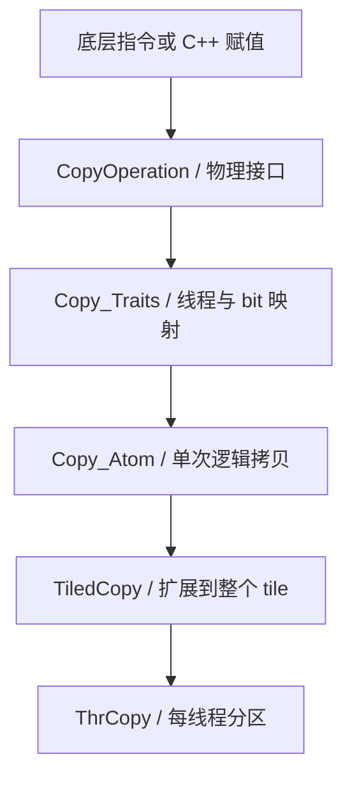
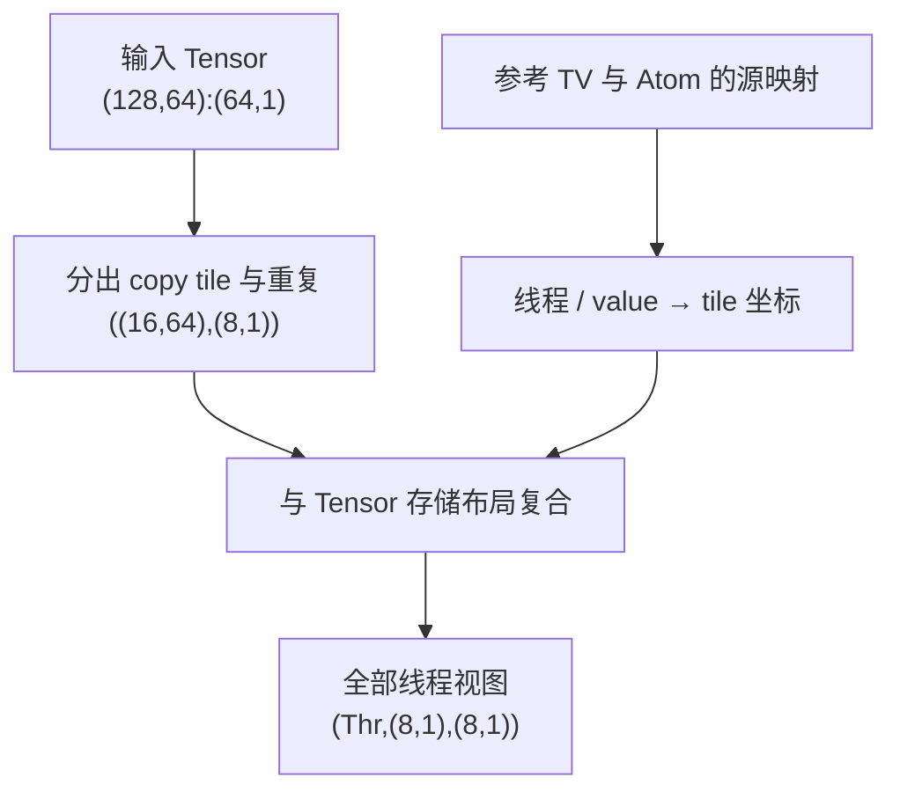

# CuTe Copy

这篇笔记整理 CuTe 如何表达 **SM80 及以前的 GPU 数据搬运**。与 [[cute-mma-atom|CuTe MMA Atom]] 一样，先从底层 Operation 看起：一次操作从哪里读、向哪里写、由多少线程参与，以及发射后怎样确认数据已经可用。

在 GEMM 中，输入通常沿着 **global memory（全局内存）→ shared memory（共享内存）→ register（寄存器）** 流动，输出则通过普通 store 写回。不同阶段适合不同操作：普通与向量化拷贝通过 C++ 赋值表达 load/store，SM75 的 `ldmatrix` 把 shared 中的矩阵分配到寄存器 fragment，SM80 的 `cp.async` 则把 global 数据异步搬入 shared。

| 源码 | 本文关注的内容 |
| --- | --- |
| [`include/cute/arch/copy.hpp`](https://github.com/NVIDIA/cutlass/blob/e406c186f510a15091cce01f782020ceb7ba8eb5/include/cute/arch/copy.hpp) | 普通拷贝、自动向量化策略、自动异步策略和 L2 预取。 |
| [`include/cute/arch/copy_sm75.hpp`](https://github.com/NVIDIA/cutlass/blob/e406c186f510a15091cce01f782020ceb7ba8eb5/include/cute/arch/copy_sm75.hpp) | `ldmatrix` 和 `movmatrix`。 |
| [`include/cute/arch/copy_sm80.hpp`](https://github.com/NVIDIA/cutlass/blob/e406c186f510a15091cce01f782020ceb7ba8eb5/include/cute/arch/copy_sm80.hpp) | `cp.async`、提交分组和等待。 |
| [`include/cute/algorithm/copy.hpp`](https://github.com/NVIDIA/cutlass/blob/e406c186f510a15091cce01f782020ceb7ba8eb5/include/cute/algorithm/copy.hpp) | 根据 Tensor、内存空间和策略选择实际拷贝。 |
| [`include/cute/atom/copy_traits.hpp`](https://github.com/NVIDIA/cutlass/blob/e406c186f510a15091cce01f782020ceb7ba8eb5/include/cute/atom/copy_traits.hpp) | Traits 接口、普通拷贝布局和通用 `copy_unpack`。 |
| [`include/cute/atom/copy_traits_sm75.hpp`](https://github.com/NVIDIA/cutlass/blob/e406c186f510a15091cce01f782020ceb7ba8eb5/include/cute/atom/copy_traits_sm75.hpp) | LDSM 的线程与 bit 映射。 |
| [`include/cute/atom/copy_traits_sm80.hpp`](https://github.com/NVIDIA/cutlass/blob/e406c186f510a15091cce01f782020ceb7ba8eb5/include/cute/atom/copy_traits_sm80.hpp) | `cp.async` 布局、ZFILL 谓词和专用 `copy_unpack`。 |
| [`include/cute/atom/copy_atom.hpp`](https://github.com/NVIDIA/cutlass/blob/e406c186f510a15091cce01f782020ceb7ba8eb5/include/cute/atom/copy_atom.hpp) | `Copy_Atom`、`TiledCopy`、`ThrCopy` 与线程分区、retile。 |
| [`include/cute/layout.hpp`](https://github.com/NVIDIA/cutlass/blob/e406c186f510a15091cce01f782020ceb7ba8eb5/include/cute/layout.hpp) | `recast_layout`、`upcast` 与 `downcast`。 |

## 总体模型

CuTe Copy 的层次与 MMA 类似：



- **CopyOperation**：描述一次底层操作的参数和 `copy` 接口，例如源、目标引用或输出寄存器。
- **`Copy_Traits`**：描述参与线程，以及源、目标、参考视角的 `(thread, value) → bit` 映射。
- **`Copy_Atom`**：把 Operation、Traits 和逻辑元素类型结合起来，把 Tensor fragment 拆成底层接口需要的参数。
- **`TiledCopy` / `ThrCopy`**：把 Atom 扩展到 tile，再取出某个线程负责的源、目标分区。

下面按 **Operation → `Copy_Traits` → `Copy_Atom` → `TiledCopy` / `ThrCopy`** 的顺序展开。Operation 的寄存器宽度和地址参数，是理解 Traits 数据映射的依据；Atom 引入逻辑元素类型，TiledCopy 再定义更大 tile 的线程 / 元素分配，ThrCopy 取出某个线程的视图。`AutoVectorizingCopy`、`AutoCopyAsync` 这样的策略还需要由 `cute::copy` 算法进一步分派。

## Operation 结构体

**用途**

封装一次数据搬运的物理接口。读源码时，优先确认以下信息：

| 问题 | 对应源码信息 |
| --- | --- |
| 源和目标在哪里？ | `src` / `dst` 引用及其对应的 global、shared 或寄存器位置。 |
| 一次搬多少？ | C++ 类型大小、寄存器数组长度和指令规定的矩阵数量。 |
| 谁参与发射？ | 每线程独立操作，或 32 个 lane 协作执行的 warp 指令。 |
| 返回后能否读取结果？ | 普通赋值、同步指令，或需要额外提交与等待的 cp.async-group。 |

本章的 Operation 通常提供 `SRegisters` 和 `DRegisters`，但这两个名字描述的是 **`copy` 的物理参数类型**，并不意味着参数总是寄存器值。`ldmatrix` 的源引用用于取 shared 地址；`cp.async` 的源、目标引用用于取 global/shared 地址；`movmatrix` 的源、目标才都是 warp 中各线程持有的寄存器 fragment。

### 操作族与数据路径

下表按本文关注的指令族归纳。花括号表示候选值，例如 `U32x{1,2,4}` 分别对应三个实际类型。

| Operation / 策略 | 数据路径 | 参与方式 | 完成方式 |
| --- | --- | --- | --- |
| `UniversalCopy<S, D>` | 由 S/D 引用所在位置决定。 | 单线程赋值。 | 普通 C++ 赋值语义。 |
| `AutoVectorizingCopyWithAssumedAlignment<MaxVecBits>` | 由 Tensor engine 决定。 | 算法选择每线程的向量宽度。 | 普通 load/store。 |
| `SM75_U32x{1,2,4}_LDSM_N` | shared → register。 | 32 个 lane 协作。 | `ldmatrix.sync.aligned`。 |
| `SM75_U16x{2,4,8}_LDSM_T` | shared → register，改变 fragment 排列。 | 32 个 lane 协作。 | 带 `.trans` 的 `ldmatrix`。 |
| `SM75_U32x1_MOVM_T` | register → register。 | 32 个 lane 协作。 | `movmatrix.sync.aligned`。 |
| `SM80_CP_ASYNC_CACHE{ALWAYS,GLOBAL}<TS, TD>` | global → shared。 | 每线程发射；CA 支持 4/8/16 B，CG 支持 16 B。 | cp.async-group 提交与等待。 |
| 上述两族追加 `_ZFILL` | global → shared，支持零填充。 | 每线程发射。 | 与普通 `cp.async` 相同。 |

架构前缀用于标识这套封装对应的指令族。编译时是否可调用，要看源码中的架构宏和目标 GPU。

### 普通拷贝：`UniversalCopy`

**原型与源码**

`copy.hpp` 中的实现很直接，下面保留完整类型定义：

```cpp
template <class S, class D = S>
struct UniversalCopy
{
  using SRegisters = S[1];
  using DRegisters = D[1];

  static_assert(sizeof_bits_v<S> >= 8);
  static_assert(sizeof_bits_v<D> >= 8);

  CUTE_HOST_DEVICE static constexpr void
  copy(S const& src,
       D      & dst)
  {
    dst = src;
  }
};
```

**参数与约束**

- `S` / `D` 是底层一次赋值的源、目标类型，默认相同，且各自至少 8 bit。
- `src` 是输入引用，`dst` 是输出引用，`copy` 返回 `void`。
- `S != D` 时，`dst = src` 可以包含类型转换，例如浮点转整数；它没有“保持所有 bit 不变”的统一保证。
- 内存空间由引用的实际位置决定。它可以用于 global → register、register → shared，也可以用于其他普通赋值场景。

**对应 PTX**

这段源码没有内联 PTX，具体指令由编译器决定。例如一个 32-bit 值从 global 搬到 shared，可以表达为：

```ptx
// 示意：先读入当前线程的寄存器，再写入 shared memory。
ld.global.u32 r0, [gmem_addr];
st.shared.u32 [smem_addr], r0;
```

若 S/D 是寄存器值，赋值可能变成 `mov`，也可能被优化掉；若发生数值转换，还可能生成 `cvt`。因此，`UniversalCopy` 的类型定义提供的是 C++ 赋值接口，不承诺某条固定 load/store 指令。PTX 的 load/store 语法可对照 [PTX `ld`](https://docs.nvidia.com/cuda/parallel-thread-execution/index.html#data-movement-and-conversion-instructions-ld) 和 [`st`](https://docs.nvidia.com/cuda/parallel-thread-execution/index.html#data-movement-and-conversion-instructions-st)。

**使用场景**

普通元素搬运、需要赋值转换的拷贝，以及不适合使用架构专用指令时的通用实现。

### 向量化拷贝：固定宽度与自动选择

向量化拷贝把同一线程负责的一段连续数据合成更宽的访问，减少 load/store 指令数量。它与 **coalesced access（合并访存）** 分别作用于两个尺度：向量化关心一个线程的一次访问宽度，合并访存关心一个 warp 中各线程的地址分布。

#### 固定宽度：`UniversalCopy<uint128_t>`

CuTe 可以直接用 128-bit 整数作为底层搬运单位：

```cpp
using CopyOp = cute::UniversalCopy<cute::uint128_t>;
using CopyAtom = cute::Copy_Atom<CopyOp, cutlass::half_t>;
```

这里 `CopyOp` 一次赋值搬 16 B，`CopyAtom` 的逻辑元素是 `half_t`，所以每次操作对应 8 个 half。后者是后续 Atom 层的元素解释，不改变 `CopyOp` 的物理宽度。

对应的 load/store 可以用以下 PTX 表达，具体编译结果仍要检查生成的 PTX 或 SASS：

```ptx
// 示意：每线程读取 4 个 32-bit 分量，共 16 B。
ld.global.v4.u32 {r0, r1, r2, r3}, [gmem_addr];

// 示意：把这 16 B 写到 shared memory。
st.shared.v4.u32 [smem_addr], {r0, r1, r2, r3};
```

一次 16 B 访问需要相应的地址对齐和连续空间。固定宽度 Operation 不会自动处理尾部：若只剩 3 个 half，不能仍然发射一次 16 B 操作。

#### 自动选择：`AutoVectorizingCopyWithAssumedAlignment`

`copy.hpp` 中的定义如下：

```cpp
template <int MaxVecBits = 128>
struct AutoVectorizingCopyWithAssumedAlignment
     : UniversalCopy<uint_bit_t<MaxVecBits>>
{
  static_assert(MaxVecBits == 8 || MaxVecBits == 16 || MaxVecBits == 32 ||
                MaxVecBits == 64 || MaxVecBits == 128,
                "Expected MaxVecBits to be 8 or 16 or 32 or 64 or 128 for alignment and performance.");
};

using AutoVectorizingCopy = AutoVectorizingCopyWithAssumedAlignment<128>;
using DefaultCopy = AutoVectorizingCopyWithAssumedAlignment<8>;
```

虽然它继承了固定宽度的 `UniversalCopy`，**自动选择宽度发生在 `cute::copy(policy, src_tensor, dst_tensor)` 的重载中**。直接调用继承的 `copy(src, dst)`，只会执行相应物理类型的赋值。

`algorithm/copy.hpp` 的选择逻辑可概括为：

```cpp
// 源码关键计算；src、dst 是已经确定分区的 Tensor。
constexpr int common_elem = CUTE_STATIC_V(max_common_vector(src, dst));
constexpr int align_bits = CUTE_STATIC_V(
    gcd(max_alignment(src), max_alignment(dst), Int<MaxVecBits>{}));
constexpr int vec_bits = gcd(
    common_elem * sizeof_bits_v<typename DstEngine::value_type>, align_bits);
```

- `common_elem` 表示源、目标能共同连续访问的元素数；仅源连续或仅目标连续都不够。
- `align_bits` 综合源、目标的对齐信息和 `MaxVecBits` 假设，单位是 bit。
- 当 `vec_bits` 是整字节且大于单个元素宽度时，算法把两个 Tensor `recast` 为 `uint_bit_t<vec_bits>` 再赋值；否则沿用元素拷贝。

源码先检查 `common_elem > 1`，再计算后两项。`max_common_vector` 还要求两边元素类型相同、可平凡复制，且 engine 返回真实引用；需要数值转换或使用隐式迭代器时，不会直接按原始 bit 合并访问。

所以 **`128` 是选择上限和对齐假设，不保证每次实际搬 128 bit**。如果共同连续区只有 2 个 half，就不能把它当作 8 个 half 来访问。

**重要入口**

| 入口 | 本地源码的选择 |
| --- | --- |
| `copy(AutoVectorizingCopy{}, src, dst)` | 显式使用最高 128-bit 的对齐假设。 |
| `copy(DefaultCopy{}, src, dst)` | 使用 8-bit 的保守策略入口。 |
| `copy(src, dst)` | 两边 layout 都为静态时采用 128-bit 假设；其余分支采用 8-bit 策略，并视静态 shape 决定是否做重复目标过滤。 |
| `copy_aligned(src, dst)` | 显式采用 128-bit 对齐假设，并根据静态 shape 决定是否过滤。 |

**约束与使用场景**

这一层通过类型与 layout 信息做编译期选择，没有运行期地址检查。调用者需要保证实际地址、动态 stride 和分区偏移满足所选策略的假设。全局分配基址对齐，并不代表 `base + offset` 也对齐。

自动向量化适用于源、目标具有共同连续区的普通搬运。它仍然使用普通赋值路径；global → shared 时，可能经过线程寄存器。专用的 `cp.async` 则提供直接异步搬运路径。

### 策略与辅助指令：`AutoCopyAsync`、`prefetch`

`copy.hpp` 还声明了一个空策略类型：

```cpp
struct AutoCopyAsync {};
```

它由 `algorithm/copy.hpp` 分派。在启用 SM80 `cp.async` 的分支中，源必须是 global Tensor、目标必须是 shared Tensor，元素大小相同且满足 4/8/16 B 条件，才选择异步 Operation；源引用为 const 且宽度为 16 B 时选择 `CACHEGLOBAL`，其他受支持宽度选择 `CACHEALWAYS`。条件不满足时选择 `UniversalCopy`。

这里检查的是**当前 Tensor 元素类型的大小**。`half_t` 只有 2 B，直接传给该策略会走普通拷贝；需要先把分区组织成合法的更宽搬运单位，或显式构造合适的 Copy Atom。策略本身也不会替调用者提交和等待异步组。

另一个辅助函数 `prefetch(void const* gmem_ptr)` 在 device 路径中发射：

```ptx
prefetch.global.L2 [gmem_addr];
```

它只向 L2 预取 global 数据，没有 shared 目标或寄存器输出；主机路径不执行这条指令。可以在将来的 global 访问前使用，具体效果取决于后续访问和缓存状态。指令定义见 [PTX `prefetch`](https://docs.nvidia.com/cuda/parallel-thread-execution/index.html#data-movement-and-conversion-instructions-prefetch-prefetchu)。

### SM75：`ldmatrix` 从 shared memory 构造寄存器 fragment

GEMM 把 A/B tile 搬入 shared memory 后，还要把元素分配到执行 `mma.sync` 的各个线程寄存器中。`ldmatrix` 在一次 warp 协作操作中完成这一步：读取 shared memory 中一个、两个或四个 $8 \times 8$ 小矩阵，并按指令规定的方式分发寄存器 fragment（每线程持有的矩阵片段）。

**源码位置**：`include/cute/arch/copy_sm75.hpp`；对应布局描述在 `include/cute/atom/copy_traits_sm75.hpp`。下面只讨论这两个文件中的 `.m8n8.shared.b16` 版本。

#### 六种 `LDSM` Operation

每个小矩阵有 $8 \times 8 \times 16 = 1024$ bit，也就是 **128 B**。`.x1/.x2/.x4` 表示整个 warp 一次处理的小矩阵数量，对应 128/256/512 B；它们也分别要求每线程提供 1/2/4 个 32-bit 目标寄存器。

| Operation | PTX 指令 | 每线程 `DRegisters` | warp 总数据量 |
| --- | --- | --- | --- |
| `SM75_U32x1_LDSM_N` | `ldmatrix.sync.aligned.x1.m8n8.shared.b16` | `uint32_t[1]` | 128 B |
| `SM75_U32x2_LDSM_N` | `ldmatrix.sync.aligned.x2.m8n8.shared.b16` | `uint32_t[2]` | 256 B |
| `SM75_U32x4_LDSM_N` | `ldmatrix.sync.aligned.x4.m8n8.shared.b16` | `uint32_t[4]` | 512 B |
| `SM75_U16x2_LDSM_T` | `ldmatrix.sync.aligned.x1.trans.m8n8.shared.b16` | `uint32_t[1]` | 128 B |
| `SM75_U16x4_LDSM_T` | `ldmatrix.sync.aligned.x2.trans.m8n8.shared.b16` | `uint32_t[2]` | 256 B |
| `SM75_U16x8_LDSM_T` | `ldmatrix.sync.aligned.x4.trans.m8n8.shared.b16` | `uint32_t[4]` | 512 B |

所有 `LDSM` Operation 的 `SRegisters` 都是 `uint128_t[1]`。这是一个类型别名，表示“长度为 1、元素类型为 `uint128_t` 的数组类型”，用于描述 `copy` 的一个源参数；这行声明不会创建数组或分配硬件寄存器。

这里的 `uint128_t const& smem_src` 用于提供 **shared memory 中一行的起始地址，这行包含连续的 8 个 16-bit 元素，共 16 B**。以 FP16 矩阵 `smem[8][8]` 为例：

```cpp
// 假设 smem 是 shared memory 中的 FP16 矩阵，各行首地址满足 16 B 对齐。
auto const* row_start = &smem[row][0];
```

`row_start` 是一个地址，指向 `smem[row][0]`。从这个位置开始，连续的 `smem[row][0]` 到 `smem[row][7]` 占据 16 B。CuTe 用 `uint128_t` 引用表达这段源数据，底层只取 `&smem_src` 作为行首地址；**不是传入 8 个独立的元素地址，也不是先把这 8 个 FP16 读入一个 128-bit 寄存器**。

对 `.x1`，lane 0–7 分别提供八行的起始地址，32 个 lane 协作读取并分配数据，每个 lane 最终得到两个 16-bit 元素。`DRegisters = uint32_t[1]` 才对应每线程实际接收的一个 32-bit 输出寄存器。

命名中，`N` 版本用 `U32x1/2/4` 描述每线程的 32-bit 分组；`T` 版本用 `U16x2/4/8` 描述重排后的 16-bit 分组。**`U16x2` 的物理接口仍是一个 `uint32_t`，其中打包两个 16-bit 元素**。`.b16` 表示按 16-bit 数据位搬运，没有规定必须是 FP16，也不做数值转换。

以 `SM75_U32x1_LDSM_N` 为例，省略架构检查分支后的源码如下：

```cpp
struct SM75_U32x1_LDSM_N {
  using SRegisters = uint128_t[1];
  using DRegisters = uint32_t[1];

  /**
   * @brief warp 协作读取一个 8x8、16-bit 元素的 shared memory 矩阵。
   * @param smem_src 输入，shared memory 中连续 8 个 16-bit 元素的引用，底层仅取其行首地址。
   * @param dst 输出，当前线程接收的两个 16-bit 元素，打包为 32 bit。
   */
  CUTE_HOST_DEVICE static void
  copy(uint128_t const& smem_src, uint32_t& dst) {
    uint32_t smem_int_ptr = cast_smem_ptr_to_uint(&smem_src);
    asm volatile(
        "ldmatrix.sync.aligned.x1.m8n8.shared.b16 {%0}, [%1];\n"
        : "=r"(dst)
        : "r"(smem_int_ptr));
  }
};
```

`cast_smem_ptr_to_uint` 将 shared memory 引用的地址转换为 PTX `.shared` 地址。源码用 `"r"` 传入 32-bit 地址，用 `"=r"` 接收 32-bit fragment；这里不会把 `smem_src` 的值作为 inline PTX 的输入。实际源码在设备架构与编译器均支持时才发射指令，否则进入 `CUTE_INVALID_CONTROL_PATH`。

#### 提供行地址与接收元素是两套映射

一次指令中，每个小矩阵需要八个行首地址，但 **32 个 lane 都参与执行、都接收数据**。

| PTX 数量 | lane 0–7 提供地址 | lane 8–15 提供地址 | lane 16–23 提供地址 | lane 24–31 提供地址 |
| --- | --- | --- | --- | --- |
| `.x1` | 矩阵 0 的八行 | 不用于选择新行 | 不用于选择新行 | 不用于选择新行 |
| `.x2` | 矩阵 0 的八行 | 矩阵 1 的八行 | 不用于选择新行 | 不用于选择新行 |
| `.x4` | 矩阵 0 的八行 | 矩阵 1 的八行 | 矩阵 2 的八行 | 矩阵 3 的八行 |

行之间可以有间隔，四个小矩阵也不必按某个大矩阵的默认 row-major 顺序排列。调用者选择行地址，就选择了本次指令读哪些 $8 \times 8$ 子块。

结合 `copy_traits_sm75.hpp` 的目标布局，可以直接推导每线程得到哪些元素。记 `lane` 为 $0\ldots31$，`q = lane / 4`，`t = lane % 4`；`M_j[r,c]` 表示第 $j$ 个小矩阵中的元素，则第 $j$ 个 32-bit 目标寄存器打包：

| 版本 | 低 16 bit | 高 16 bit |
| --- | --- | --- |
| `LDSM_N` | $M_j[q,2t]$ | $M_j[q,2t+1]$ |
| `LDSM_T` | $M_j[2t,q]$ | $M_j[2t+1,q]$ |

例如 `LDSM_N.x1` 中，lane 0–3 分别接收第 0 行的列 `(0,1)`、`(2,3)`、`(4,5)`、`(6,7)`，lane 4–7 接收第 1 行。**lane 1 提供第 1 行的地址，却接收第 0 行的列 `(2,3)`**；不能把当前线程的 `smem_src` 理解成这个线程最终得到的数据。


图参考 [NVIDIA PTX ISA 的 Figure 107](https://docs.nvidia.com/cuda/parallel-thread-execution/index.html#mma-ldmatrix-fragments) 重新绘制，并补充了行首地址提供者和寄存器位段。每个格子表示一个 16-bit 元素；`Tn: dst0` 表示它最终进入 lane n 的 `dst0`。同一行中相邻两格具有相同的 lane 标签，分别占据这个 32-bit 寄存器的低、高 16 bit。左侧的供址 lane 与格子中的接收 lane 表达两套不同的映射。

对于 `.x2`，每个 lane 的 `dst0`、`dst1` 分别来自矩阵 0、1；`.x4` 再增加矩阵 2、3。上表的 `j` 是寄存器编号，也就是小矩阵编号。

#### `.trans` 的转置范围与同步约束

从上面的坐标关系可见，`.trans` 改变的是 **每个 $8 \times 8$ 小矩阵的 shared memory 元素到寄存器 fragment 的分配**。它不改写 shared memory，也不会自动交换多个 $8 \times 8$ 子块的位置；若想实现某个更大 tile 的整体转置，还要安排子块地址及后续存储布局。

硬件约束需要与 CuTe 的类型接口一起看：

- 每个行首地址须满足 **16 B 自然对齐**。`.aligned` 这个指令修饰符另外要求整个 warp 一致执行，不能用它来代替地址对齐检查。
- warp 中的线程要执行相同形式的指令，不能只让“提供地址的八个 lane”调用 `copy`。
- 在 `sm_75` 上，`.x1/.x2` 未参与提供新行地址的高编号 lane 也要持有合法地址；可以复制低编号 lane 的地址。
- `.sync` 让本次指令的 warp 参与线程会合，**不替代 shared memory 生产者与消费者之间的同步或异步拷贝完成等待**。由其他线程填充 tile 时，仍须先满足相应内存可见性要求。

这些硬件约束可对照 [PTX 的 `ldmatrix` 说明](https://docs.nvidia.com/cuda/parallel-thread-execution/index.html#warp-level-matrix-instructions-ldmatrix)；上面的元素坐标表则由本地 `Copy_Traits` 的 bit layout 推导。

#### `movmatrix`：寄存器中的矩阵重排

同一头文件还定义了 `SM75_U32x1_MOVM_T`。它的输入和输出都是 `uint32_t[1]`，封装：

```ptx
movmatrix.sync.aligned.m8n8.trans.b16 dst, src;
```

整个 warp 各持有两个 16-bit 元素，共同表达一个 $8 \times 8$ 矩阵。该操作在 warp 的寄存器 fragment 之间完成转置重排，不经过 shared memory；它也不等于每个线程独立交换自己寄存器中的两个半字。硬件语义见 [PTX 的 `movmatrix` 说明](https://docs.nvidia.com/cuda/parallel-thread-execution/index.html#warp-level-matrix-instructions-movmatrix)。

### SM80：`cp.async`，从 global 异步搬到 shared

`include/cute/arch/copy_sm80.hpp` 封装 Ampere 的 `cp.async`。它与普通 `load → 寄存器 → store` 的区别在于：线程提供 global 源地址和 shared 目标地址，指令直接发起两者之间的搬运，线程可以继续执行后续指令。**`copy()` 返回时，目标数据还可能没有准备好。**

这个头文件只有四个 CopyOperation，模板参数都是 `<TS, TD = TS>`：

| CopyOperation | 每次搬运大小 | PTX 缓存限定符 | 边界行为 |
| --- | --- | --- | --- |
| `SM80_CP_ASYNC_CACHEALWAYS` | 4、8、16 字节 | `.ca` | 总是搬运整个块。 |
| `SM80_CP_ASYNC_CACHEGLOBAL` | 16 字节 | `.cg` | 总是搬运整个块。 |
| `SM80_CP_ASYNC_CACHEALWAYS_ZFILL` | 4、8、16 字节 | `.ca` | `pred == false` 时把整个目标块清零。 |
| `SM80_CP_ASYNC_CACHEGLOBAL_ZFILL` | 16 字节 | `.cg` | 同上。 |

四种 Operation 都要求 `sizeof(TS) == sizeof(TD)`；因此这里只搬运位模式，不做 `TS → TD` 的数值转换。每个线程独立发起一次操作，配套 Traits 的 `ThrID` 是 `Layout<_1>`，不要求像 `ldmatrix` 那样以整 warp 组成一条集体操作。

#### PTX 原语与缓存限定符

本地源码发出的四种指令分别是：

```ptx
// 普通版本：cp_size 是编译期常量，CA 允许 4/8/16，CG 只允许 16。
cp.async.ca.shared.global.L2::128B [smem_addr], [gmem_addr], cp_size;
cp.async.cg.shared.global.L2::128B [smem_addr], [gmem_addr], 16;

// ZFILL 版本：src_size 是运行期整数，CuTe 只取 cp_size 或 0。
cp.async.ca.shared.global.L2::128B [smem_addr], [gmem_addr], cp_size, src_size;
cp.async.cg.shared.global.L2::128B [smem_addr], [gmem_addr], 16, src_size;
```

`.ca` 表示允许在包括 L1 的各级缓存中缓存，`.cg` 表示仅在 L2 缓存；`.L2::128B` 是 L2 预取大小提示，**不表示向 shared 写入 128 字节**。实际写入大小由 `cp_size` 决定。缓存限定符只影响性能策略，不改变同步要求。可对照 [PTX `cp.async` 文档](https://docs.nvidia.com/cuda/parallel-thread-execution/index.html#data-movement-and-conversion-instructions-cp-async)。

源码用 `cast_smem_ptr_to_uint()` 把目标地址转成 32 位 shared 地址，global 源地址使用 64 位指针；inline PTX 中分别对应 `"r"`、`"l"` 约束。`"n"(sizeof(TS))` 则把拷贝大小作为立即数传给 PTX。

#### `SM80_CP_ASYNC_CACHEALWAYS_ZFILL`

下面保留这个 Operation 的完整实现结构，并补充参数说明；其余三种 Operation 只在缓存限定符、大小约束和是否传入 `src_size` 上有所区别：

```cpp
/**
 * @brief 通过 cp.async 把 global 数据搬到 shared，无效块填零。
 *
 * @tparam TS 源块类型，大小必须是 4、8 或 16 字节。
 * @tparam TD 目标块类型，必须与 TS 等大。
 */
template <class TS, class TD = TS>
struct SM80_CP_ASYNC_CACHEALWAYS_ZFILL
{
  using SRegisters = TS[1];
  using DRegisters = TD[1];

  static_assert(sizeof(TS) == sizeof(TD),
                "cp.async requires sizeof(src_value_type) == sizeof(dst_value_type)");
  static_assert(sizeof(TS) == 4 || sizeof(TS) == 8 || sizeof(TS) == 16,
                "cp.async sizeof(TS) is not supported");

  /**
   * @brief 发起一次搬运；调用后还需要等待完成。
   * @param gmem_src 输入，引用 global memory 中一个满足对齐要求的源块。
   * @param smem_dst 输出，引用 shared memory 中一个满足对齐要求的目标块。
   * @param pred true 时搬运整个块，false 时目标块全部填零。
   */
  CUTE_HOST_DEVICE static void
  copy(TS const& gmem_src, TD& smem_dst, bool pred)
  {
#if defined(CUTE_ARCH_CP_ASYNC_SM80_ENABLED)
    TS const* gmem_ptr = &gmem_src;
    uint32_t smem_int_ptr = cast_smem_ptr_to_uint(&smem_dst);
    int src_size = pred ? sizeof(TS) : 0;
    asm volatile("cp.async.ca.shared.global.L2::128B [%0], [%1], %2, %3;\n"
        :: "r"(smem_int_ptr),
           "l"(gmem_ptr),
           "n"(sizeof(TS)),
           "r"(src_size));
#else
    CUTE_INVALID_CONTROL_PATH("Support for cp.async instructions has not been enabled");
#endif
  }
};
```

虽然类型名保留 `SRegisters` / `DRegisters`，这里的引用用于**取得内存地址**。不能把它们理解成先在寄存器中读取 `TS`，再把寄存器中的 `TD` 存到 shared。

`_ZFILL` 的关键是 `src_size`：

- `pred == true`：`src_size == sizeof(TS)`，完整拷贝。
- `pred == false`：`src_size == 0`，从 global 读取 0 字节，目标的 `sizeof(TS)` 字节仍被写成零。它不是在指令前加 `@pred`，也不是跳过写入。
- PTX 的 `src_size` 能表达“只拷贝前几个字节，剩余字节填零”；**这个 CuTe 封装只提供整个块有效 / 整个块无效两种状态**。例如 16 字节块里只有前 12 字节有效时，不能直接把 `pred` 设为 true；应调整边界分块或使用其他边界处理。

零填充和部分字节填充的底层语义可对照 [PTX `cp.async` 的 `src-size` 说明](https://docs.nvidia.com/cuda/parallel-thread-execution/index.html#data-movement-and-conversion-instructions-cp-async)。

调用者仍需保证目标块存在且源、目标满足搬运大小对应的对齐要求。`false` 谓词也不会修正 C++ 层面的越界索引：构造源引用时可以选择有效且对齐的占位源块，然后交给 `src_size == 0` 抑制实际源读取。

配套 `copy_traits_sm80.hpp` 的 ZFILL Traits 保存 `bool pred = true`，并通过 `with(bool)` 返回带谓词的新 Traits。后面使用 `Copy_Atom` 时，这使 `copy_if(zfill_atom, ...)` 在谓词为 false 时执行零填充。普通 Operation 没有这一机制：`copy_if` 谓词为 false 时跳过拷贝，目标保留原值。`AutoCopyAsync` 的谓词拷贝也不会自动选择 ZFILL。

#### 提交与等待：`cp_async_fence` / `cp_async_wait`

发射、分组和等待是三个独立步骤，`copy_sm80.hpp` 提供的 helper 对应关系如下：

| CuTe 接口 | 实际 PTX | 作用 |
| --- | --- | --- |
| `cp_async_fence()` | `cp.async.commit_group;` | 把本线程此前尚未提交的 `cp.async` 组成一组，不等待搬运。 |
| `cp_async_wait<N>()`，`N > 0` | `cp.async.wait_group N;` | 等待较旧的组，只允许最近的至多 N 组继续未完成。 |
| `cp_async_wait<0>()` | `cp.async.wait_all;` | 提交本线程尚未分组的拷贝，并等待全部拷贝完成。 |
| `cp_async_wait(Int<N>{})` | 同 `cp_async_wait<N>()` | 通过 CuTe 的静态整数传入 N。 |

这里的 `fence` 是 **group 的提交边界**，不要按名字把它当作 `__threadfence()` 或一条阻塞式 barrier。尤其要注意 `N == 0` 的特化：源码使用 `wait_all`，而不只是 `wait_group 0`。

```ptx
cp.async.commit_group;
cp.async.wait_group N;

// wait_all 的语义等价于下面两步。
cp.async.commit_group;
cp.async.wait_group 0;
```

group 属于发射线程；wait 保证本线程相应拷贝完成，不能单独代替线程间 barrier。CTA 中各线程先 wait，再执行 `__syncthreads()`，才能安全地消费由其他线程搬入的 tile。只执行 `__syncthreads()` 不能保证异步搬运已完成。可对照 [PTX group 提交规则](https://docs.nvidia.com/cuda/parallel-thread-execution/index.html#data-movement-and-conversion-instructions-cp-async-commit-group) 和 [PTX 等待规则](https://docs.nvidia.com/cuda/parallel-thread-execution/index.html#data-movement-and-conversion-instructions-cp-async-wait-group-cp-async-wait-all)。

#### 用 group 组织流水线

下面是 kernel 内的指令顺序示意。假设所有 CTA 线程都执行这一段，每个 `gmem_srcN` / `smem_dstN` 已经是本线程对应的、16 字节对齐的块引用；目标属于三个互不重叠的 shared stage，`validN` 描述**整个 16 字节块**是否有效，无效块使用有效占位源引用：

```cpp
using CopyOp = cute::SM80_CP_ASYNC_CACHEGLOBAL_ZFILL<cute::uint128_t>;

CopyOp::copy(gmem_src0, smem_dst0, valid0);
cute::cp_async_fence();  // group 0

CopyOp::copy(gmem_src1, smem_dst1, valid1);
cute::cp_async_fence();  // group 1

CopyOp::copy(gmem_src2, smem_dst2, valid2);
cute::cp_async_fence();  // group 2

cute::cp_async_wait<1>();  // group 0、1 已完成，最新的 group 2 可以仍在搬运。
__syncthreads();          // 允许 CTA 的线程相互读取 stage 0、1。

// 此处可以从 stage 0、1 读取到寄存器并计算，不能读取尚未等完的 stage 2。

cute::cp_async_wait<0>();
__syncthreads();          // 此后可以跨线程消费 stage 2。
```

其中 `wait<1>()` 的 1 是“允许保留的未完成组数”，不是“等待 group 1”。提交了 group 0、1、2 后，等待返回意味着较旧的 group 0、1 已准备好；group 2 也可能已经完成，但程序不依赖这一点。

实际 GEMM 通常把若干 A/B 拷贝合成一个 group，再把后续 tile 的搬运与当前 tile 的 `ldmatrix` / MMA 重叠。shared stage 循环复用前，还必须保证所有消费者已经读完旧数据，不能仅凭对应拷贝完成就覆盖 stage。本地 `examples/cute/tutorial/sgemm_sm80.cu` 展示了这种多 stage 循环。

## `Copy_Traits`

Operation 描述底层调用的参数，`Copy_Traits<Operation>` 则描述**哪些线程参与，以及每个线程的输入、输出如何对应同一组数据**。例如 `ldmatrix.x1` 的输入是每线程一个 16 B shared 引用，输出是每线程一个 32-bit 寄存器；仅看参数类型，还无法知道 lane 1 为什么提供第 1 行的地址，却收到第 0 行的两个元素。

与 `MMA_Traits` 不同，这里的源、目标布局首先按 **bit** 描述，不直接绑定 FP16、FP32 等逻辑元素类型。后面的 `Copy_Atom<Operation, ValueType>` 才把这些 bit 布局转换为逻辑元素布局。

| 成员 | 提供的信息 | 单位与注意点 |
| --- | --- | --- |
| `ThrID` | 逻辑线程 ID 到参与线程索引的映射。 | `Layout<_1>` 表示一次操作由一个线程执行，`Layout<_32>` 表示一个 warp；不是整个 kernel 的线程数。 |
| `SrcLayout` | `(源线程, 源线程内的 bit) → 抽象 bit 编号`。 | 第一模式是线程，第二模式是该线程源参数覆盖的 bit。 |
| `DstLayout` | `(目标线程, 目标线程内的 bit) → 抽象 bit 编号`。 | 一个 32-bit 输出寄存器对应 32 个 bit 坐标，而不是 32 个 FP16 元素。 |
| `RefLayout` | `(参考线程, 参考线程内的 bit) → 抽象 bit 编号`。 | 为后续 tile 分配提供统一视角；可以选源布局，也可以选目标布局。 |

**这些布局返回的整数是数据的抽象编号，不是 global/shared 指针偏移。** 源码允许任意一致的编号方式，后续通过布局之间的对应关系构造源、目标分区。`RefLayout = DstLayout` 表示采用目标视角组织数据，不会额外发射拷贝，也不会指定 shared memory 的物理 stride。

读嵌套布局时，还要区分 `size(layout)` 与实际覆盖的数据量：`size` 是输入坐标的数量；如果某个模式的 stride 为 0，不同输入坐标就会映射到相同 bit。下面的 LDSM 源布局正是这种情况。

### 普通拷贝：`Copy_Traits<UniversalCopy<S, D>>`

**源码特化**

`copy_traits.hpp` 中的定义如下，补上中文注释：

```cpp
/**
 * @brief 描述单线程普通赋值的源、目标 bit 布局。
 * @tparam S 底层赋值的源类型。
 * @tparam D 底层赋值的目标类型。
 */
template <class S, class D>
struct Copy_Traits<UniversalCopy<S,D>>
{
  using ThrID = Layout<_1>;

  using SrcLayout = Layout<Shape<_1,Int<sizeof_bits<S>::value>>>;
  using DstLayout = Layout<Shape<_1,Int<sizeof_bits<D>::value>>>;
  using RefLayout = SrcLayout;
};
```

以 `UniversalCopy<uint32_t>` 为例，`S`、`D` 都是 32 bit：

| 成员 | 展开后的布局 | 含义 |
| --- | --- | --- |
| `ThrID` | `Layout<_1>` | 只有逻辑线程 0。 |
| `SrcLayout` | `Layout<Shape<_1, _32>>` | 源端 `(0, b)` 对应编号 `b`，其中 `0 ≤ b < 32`。 |
| `DstLayout` | `Layout<Shape<_1, _32>>` | 目标端使用相同编号。 |
| `RefLayout` | `SrcLayout` | 从源视角组织一次拷贝。 |

这里省略 `Stride`，CuTe 使用默认的第一模式连续布局。第一模式长度为 1，所以第二模式每增加 1，返回的编号也增加 1。

把 Operation 换成 `UniversalCopy<uint128_t>`，两个 bit 布局就都变成 `(1,128)`。这说明一次底层赋值覆盖 128 bit；如果后面选 FP16 为逻辑元素类型，它才会对应每线程 8 个逻辑元素。**Traits 的 bit 数、Operation 的参数个数和逻辑元素数，是三个不同的量。**

`S != D` 时，Traits 分别记录源、目标类型的宽度，而值的转换仍由 Operation 中的 `dst = src` 决定。不能仅凭两端的抽象编号相同，就把浮点转整数等操作理解为逐 bit 原样复制。

自动向量化策略还有一个特殊之处：`Copy_Traits<AutoVectorizingCopyWithAssumedAlignment<MaxVecBits>>` 使用的源、目标布局都是 `Layout<Shape<_1,_1>, Stride<_0,_0>>`。这是策略的占位布局，**不表示实际只搬 1 bit，也不表示必定搬 `MaxVecBits` bit**；最终宽度仍由前面介绍的 `cute::copy` 算法选择。

### SM75：拆解 `Copy_Traits<SM75_U32x1_LDSM_N>`

**源码特化**

```cpp
/** @brief 描述一个 warp 加载一个 8×8、16-bit 矩阵时的输入与输出布局。 */
template <>
struct Copy_Traits<SM75_U32x1_LDSM_N>
{
  using ThrID = Layout<_32>;

  using SrcLayout = Layout<Shape <Shape <  _8,_4>,_128>,
                           Stride<Stride<_128,_0>,  _1>>;
  using DstLayout = Layout<Shape <_32,_32>,
                           Stride<_32, _1>>;

  using RefLayout = DstLayout;
};
```

#### 源布局：32 个线程的 16 B 引用如何对应 8 行

先拆 `SrcLayout` 的 `(T,V)` 两个模式：

| 模式 | Shape | Stride | 含义 |
| --- | --- | --- | --- |
| 线程子模式 `t0` | 8 | 128 | 每增加 1，换到下一行的 128 bit。 |
| 线程子模式 `t1` | 4 | 0 | 四组线程对应相同的 8 行。 |
| 线程内 bit `b` | 128 | 1 | 在一行的 16 B 数据内逐 bit 编号。 |

线程模式虽然写成 `Shape<_8,_4>`，仍然共有 $8\times4=32$ 个线程坐标。把 lane 编号展开为：

$$
\ell=t_0+8t_1,\qquad
t_0=\ell\bmod8,\qquad
t_1=\lfloor\ell/8\rfloor
$$

代入 stride，源端 bit 编号就是：

$$
B_S(\ell,b)=128t_0+0t_1+b
           =128(\ell\bmod8)+b,
\qquad 0\le b<128
$$

因此 lane `r`、`r+8`、`r+16`、`r+24` 的源视图都对应第 `r` 行。**零步幅表达的是源视图的重复，不是 shared 中各行地址相同。** 例如重复行地址 `&smem[lane % 8][0]` 能与这个布局对应；如果 shared 采用其他 tile 布局或 swizzle，实际地址仍由 Tensor 的内存布局计算。

这也解释了看似不相等的容量：

| 数量 | 计算 | 实际含义 |
| --- | --- | --- |
| 源布局的输入坐标数 | `32 × 128 = 4096` | 32 个 lane 各有一个 128-bit 源视图。 |
| 源布局覆盖的不同 bit | `8 × 128 = 1024` | 四组视图重复，对应一个 8×8 的 16-bit 矩阵。 |
| 目标布局的输入坐标数 | `32 × 32 = 1024` | 32 个 lane 各收到一个 32-bit 寄存器，覆盖完整矩阵。 |

从指令执行来看，`.x1` 使用 lane 0–7 提供的 8 个行地址。Traits 中的重复坐标不会要求指令再读取四份矩阵；其他 lane 仍参与执行，并按前面说明的架构约束提供有效 shared 地址。

#### 目标布局：从 bit 编号还原每线程的两个元素

`DstLayout` 的两个模式是 `(32 个线程, 每线程 32 bit)`，其映射为：

$$
B_D(\ell,b)=32\ell+b,\qquad 0\le b<32
$$

为了把编号读成矩阵元素，可以把这个小矩阵的 bit 编码写成：

$$
B(r,c,k)=128r+16c+k,
\qquad 0\le r,c<8,\quad 0\le k<16
$$

这是与本特化相符的**抽象行、列编号**。每行 8 个 16-bit 元素，共 128 bit；它不要求实际 shared tile 的行间距也恰好是 16 B。

令 $q=\lfloor\ell/4\rfloor$、$t=\ell\bmod4$，则 $32\ell=128q+32t$：

- 寄存器低 16 bit，即 `b = 0…15`，对应 `M[q, 2t]`。
- 寄存器高 16 bit，即 `b = 16…31`，对应 `M[q, 2t+1]`。

以 **lane 1** 为例，源端 `B_S(1,0)=128`，对应第 1 行开头；目标端 `B_D(1,0)=32`，对应第 0 行第 2 列。目标的编号 32 又可以在源视图中找到：`B_S(0,32)=32`。这就是 lane 0 提供的行里，一部分数据进入 lane 1 的寄存器。

前面引用的 [LDSM 非转置布局图](/blog-assets/gpu-programming/cute-copy/ldmatrix-x1-fragment-layout.svg) 展示的正是这个结果：左侧表示提供行地址的 lane，矩阵内每相邻两格表示接收它们的 lane。**输入地址属于哪个线程，与输出元素属于哪个线程，要分别读 `SrcLayout` 和 `DstLayout`。**

`RefLayout = DstLayout` 则选择每线程 32 bit 的目标视角作为参考。后续 tile 的线程 / 元素分配按这个视角组织，再映射到源视图；不会把每线程源引用的 128 bit 当成该线程的 128 bit 输出。

#### 在 host 上查看布局

下面的程序只计算 CuTe Layout，不执行 GPU 拷贝。保存为 `ldsm_traits.cu` 即可编译；输出包括源视图对应的行和目标寄存器对应的两个元素：

```cpp
#include <cute/atom/copy_traits_sm75.hpp>
#include <cstdio>

/**
 * @brief 查看 LDSM.x1 的源视图和目标元素映射，不发射 GPU 指令。
 * @return 布局大小符合预期时返回 0；编译期断言失败则无法编译。
 */
int main()
{
    using Traits = cute::Copy_Traits<cute::SM75_U32x1_LDSM_N>;
    constexpr Traits::SrcLayout src_layout{};
    constexpr Traits::DstLayout dst_layout{};

    static_assert(cute::size(src_layout) == 4096);
    static_assert(cute::size(dst_layout) == 1024);

    const int lanes[] = {0, 1, 4, 8};
    for (const int lane : lanes) {
        const int src_bit = src_layout(cute::make_coord(lane, 0));
        const int low_bit = dst_layout(cute::make_coord(lane, 0));
        const int high_bit = dst_layout(cute::make_coord(lane, 16));

        // 编号按每行 128 bit、每元素 16 bit 解码。
        std::printf("lane %d: src_view_row=%d, dst=M[%d,%d], M[%d,%d]\n",
                    lane, src_bit / 128,
                    low_bit / 128, (low_bit % 128) / 16,
                    high_bit / 128, (high_bit % 128) / 16);
    }
    return 0;
}
```

编译和运行时，把 `$CUTLASS_ROOT` 设置为 CUTLASS 仓库根目录：

```shell
nvcc -std=c++17 -I"$CUTLASS_ROOT/include" ldsm_traits.cu -o ldsm_traits
./ldsm_traits
```

输出为：

```console
lane 0: src_view_row=0, dst=M[0,0], M[0,1]
lane 1: src_view_row=1, dst=M[0,2], M[0,3]
lane 4: src_view_row=4, dst=M[1,0], M[1,1]
lane 8: src_view_row=0, dst=M[2,0], M[2,1]
```

最后一行的 `src_view_row=0` 表示重复源视图；`.x1` 不使用 lane 8 的地址提供新的矩阵行。

### SM75：扩展到 `.x2/.x4` 与转置版本

#### 非转置：增加矩阵模式

`.x2` 和 `.x4` 沿用相同的 8×8 小矩阵编号方式，只增加矩阵编号 `j`。每个小矩阵占 1024 bit，因此矩阵模式的 stride 是 `_1024`：

```cpp
// SM75_U32x2_LDSM_N
using SrcLayout = Layout<Shape <Shape < _16,_2>,_128>,
                         Stride<Stride<_128,_0>,  _1>>;
using DstLayout = Layout<Shape <_32,Shape <_32,   _2>>,
                         Stride<_32,Stride< _1,_1024>>>;

// SM75_U32x4_LDSM_N
using SrcLayout = Layout<Shape < _32,_128>,
                         Stride<_128,  _1>>;
using DstLayout = Layout<Shape <_32,Shape <_32,   _4>>,
                         Stride<_32,Stride< _1,_1024>>>;
```

以上两种特化同样使用 `ThrID = Layout<_32>` 和 `RefLayout = DstLayout`。设矩阵数为 $n\in\{1,2,4\}$，就可以把三个非转置版本的源、目标映射统一写成：

$$
B_S(\ell,b)=128(\ell\bmod(8n))+b,
\qquad 0\le b<128
$$

$$
B_D(\ell,(b,j))=32\ell+b+1024j,
\qquad 0\le b<32,\quad 0\le j<n
$$

源端每线程仍是一个 128-bit 行视图；目标端的 `j` 则对应寄存器 `dstj`。矩阵 `M_j` 的第 `r` 行由 lane `8j+r` 提供地址：

| 版本 | 有效行地址提供者 | 源视图重复次数 | 每 lane 输出 |
| --- | --- | --- | --- |
| `.x1` | lane 0–7 | 4 | 一个 32-bit 寄存器，共 2 个 16-bit 元素。 |
| `.x2` | lane 0–15 | 2 | 两个 32-bit 寄存器，共 4 个 16-bit 元素。 |
| `.x4` | lane 0–31 | 1 | 四个 32-bit 寄存器，共 8 个 16-bit 元素。 |

这里的矩阵编号只说明一次指令加载的第几个小矩阵。它们在更大 tile 中的坐标、行地址之间的物理间距，仍由调用者的 Tensor 布局决定。

#### 转置：改变线程模式和寄存器内元素的步幅

转置版本的源布局与同矩阵数的非转置版本相同，目标布局则改为：

```cpp
// SM75_U16x2_LDSM_T：ldmatrix.x1.trans
using DstLayout = Layout<Shape <Shape <  _4, _8>,Shape <_16,  _2>>,
                         Stride<Stride<_256,_16>,Stride< _1,_128>>>;

// SM75_U16x4_LDSM_T：ldmatrix.x2.trans
using DstLayout = Layout<Shape <Shape <  _4, _8>,Shape <_16,  _2,   _2>>,
                         Stride<Stride<_256,_16>,Stride< _1,_128,_1024>>>;

// SM75_U16x8_LDSM_T：ldmatrix.x4.trans
using DstLayout = Layout<Shape <Shape <  _4, _8>,Shape <_16,  _2,   _4>>,
                         Stride<Stride<_256,_16>,Stride< _1,_128,_1024>>>;
```

注意类型名中的 `U16x2/x4/x8` 计数的是 **16-bit 元素**，并非 PTX 的矩阵数。三种版本仍分别输出 1、2、4 个 32-bit 寄存器，且都以 `DstLayout` 为参考布局。

以 `.x1.trans` 为例，目标线程模式变成 `Shape<_4,_8>`，因此 $\ell=t_0+4t_1$；value 模式变成 `Shape<_16,_2>`，其中 `b` 是一个元素内的 bit，`h` 区分寄存器的低、高 16 bit。推广到 $n$ 个矩阵后：

$$
B_D(\ell,(b,h,j))=256t_0+16t_1+b+128h+1024j
$$

其中 $t_0=\ell\bmod4$、$t_1=\lfloor\ell/4\rfloor$，$0\le b<16$、$h\in\{0,1\}$、$0\le j<n$。与矩阵编码比较：

$$
B(j,r,c,b)=1024j+128r+16c+b
$$

可直接得到 $r=2t_0+h$、$c=t_1$。仍然记 $q=\lfloor\ell/4\rfloor$、$t=\ell\bmod4$，两族结果是：

| 版本 | `dstj` 的低 16 bit | `dstj` 的高 16 bit |
| --- | --- | --- |
| `LDSM_N` | `M_j[q, 2t]` | `M_j[q, 2t+1]` |
| `LDSM_T` | `M_j[2t, q]` | `M_j[2t+1, q]` |

例如 lane 1 在非转置版本得到 `M_j[0,2]`、`M_j[0,3]`，在转置版本得到 `M_j[2,0]`、`M_j[3,0]`。**转置改变目标 fragment 的分配，源端仍提供同一批行首地址。** 这与前面介绍的 `.trans` 指令语义一致。

### SM80：`cp.async` 的布局与 ZFILL 状态

#### 普通 `cp.async`：每线程独立的连续 bit 布局

`copy_traits_sm80.hpp` 中，CA 版本的特化如下；CG 版本只有 Operation 类型名不同，四个布局别名的写法相同：

```cpp
/**
 * @brief 描述单线程 global → shared 异步拷贝的数据布局。
 * @tparam S 一次指令搬运的源块类型。
 * @tparam D 一次指令搬运的目标块类型。
 */
template <class S, class D>
struct Copy_Traits<SM80_CP_ASYNC_CACHEALWAYS<S,D>>
{
  using ThrID = Layout<_1>;

  using SrcLayout = Layout<Shape<_1,Int<sizeof_bits<S>::value>>>;
  using DstLayout = Layout<Shape<_1,Int<sizeof_bits<D>::value>>>;
  using RefLayout = SrcLayout;
};
```

这些别名与 `UniversalCopy<S,D>` 相同：例如 16 B 操作的两端布局都是 `(1,128)`，每线程独立发射一次搬运。两种 Operation 的数据路径与完成方式却不同；**布局描述数据分配，异步语义仍由 Operation 和调用者的同步协议决定。**

CA 的 4/8/16 B、CG 的 16 B，以及源、目标类型等宽的约束，检查在 Operation 中。`ThrID = Layout<_1>` 也不妨碍整个 CTA 共同搬一个大 tile：后续可以把单线程操作铺到多个线程和多段数据上。

#### ZFILL：布局不变，Traits 多保存一个 `pred`

ZFILL 版本仍使用相同的四个布局别名，但增加了运行时谓词和专用的参数解包函数。下面保留 CA 版本的完整实现，添加中文注释；CG 版本结构相同：

```cpp
/**
 * @brief 描述异步拷贝的 bit 布局，并保存整块加载或零填充的谓词。
 * @tparam S 底层指令的源块类型。
 * @tparam D 底层指令的目标块类型。
 */
template <class S, class D>
struct Copy_Traits<SM80_CP_ASYNC_CACHEALWAYS_ZFILL<S,D>>
{
  using ThrID = Layout<_1>;
  using SrcLayout = Layout<Shape<_1,Int<sizeof_bits<S>::value>>>;
  using DstLayout = Layout<Shape<_1,Int<sizeof_bits<D>::value>>>;
  using RefLayout = SrcLayout;

  bool pred = true;

  /**
   * @brief 返回带指定谓词的新 Traits，不修改当前对象。
   * @param pred true 表示完整加载，false 表示整块零填充。
   * @return 布局类型相同、谓词取指定值的 Traits 对象。
   */
  CUTE_HOST_DEVICE constexpr
  Copy_Traits<SM80_CP_ASYNC_CACHEALWAYS_ZFILL<S,D>>
  with(bool pred) const {
    return {pred};
  }

  /**
   * @brief 把源、目标 Tensor 重解释为块引用，并向 Operation 传递谓词。
   * @tparam TS 源 Tensor 的 engine 类型，需要指向 global memory。
   * @tparam SLayout 源 Tensor 的布局类型。
   * @tparam TD 目标 Tensor 的 engine 类型，需要指向 shared memory。
   * @tparam DLayout 目标 Tensor 的布局类型。
   * @param traits 输入的 Traits 对象，提供本次调用的谓词。
   * @param src 输入的 global Tensor，不转移其存储所有权。
   * @param dst 输出的 shared Tensor，不转移其存储所有权。
   */
  template <class TS, class SLayout,
            class TD, class DLayout>
  CUTE_HOST_DEVICE friend constexpr
  void
  copy_unpack(Copy_Traits        const& traits,
              Tensor<TS,SLayout> const& src,
              Tensor<TD,DLayout>      & dst)
  {
    static_assert(is_gmem<TS>::value, "Expected gmem source for cp.async.");
    static_assert(is_smem<TD>::value, "Expected smem destination for cp.async.");

    // 此处 recast 改变 Tensor 视图，不会先把源块读取到寄存器。
    Tensor rS = recast<S>(src);
    Tensor rD = recast<D>(dst);

    CUTE_STATIC_ASSERT_V(size(rS) == Int<1>{},
      "In CopyAtom, src layout doesn't vectorize into registers. This src layout is incompatible with this tiled copy.");
    CUTE_STATIC_ASSERT_V(size(rD) == Int<1>{},
      "In CopyAtom, dst layout doesn't vectorize into registers. This dst layout is incompatible with this tiled copy.");

    SM80_CP_ASYNC_CACHEALWAYS_ZFILL<S,D>::copy(rS[0], rD[0], traits.pred);
  }
};
```

这里容易混淆两组类型参数：外层 `S`、`D` 是一次指令搬运的块类型，例如 `uint128_t`；内层 `TS`、`TD` 是 Tensor 的 **engine 类型**，用来检查存储属于 global 还是 shared。`SLayout`、`DLayout` 则描述本次调用的 Tensor fragment。

`with(bool)` 只构造新 Traits，没有发射指令，也没有立刻把目标填零。可以单独在 host 上观察这个状态：

```cpp
using Traits = cute::Copy_Traits<
    cute::SM80_CP_ASYNC_CACHEALWAYS_ZFILL<cute::uint128_t>>;

constexpr Traits load_traits{};
constexpr auto zfill_traits = load_traits.with(false);

static_assert(load_traits.pred);     // 原对象仍然为 true。
static_assert(!zfill_traits.pred);   // 新对象保存 false。
```

两者的 `SrcLayout`、`DstLayout`、`RefLayout` 完全相同。`pred` 是控制本次操作的额外状态，不是参与数据映射的一位。

#### 专用 `copy_unpack`：把谓词传到物理调用

普通 `copy_unpack` 根据 Operation 的 `SRegisters`、`DRegisters` 解包参数，然后调用 `CopyOp::copy`。ZFILL Operation 还需要第三个参数 `bool pred`，因此 Traits 定义了一个 **friend 重载**，让参数相关查找（ADL）在解包时选中这条专用路径：

| 步骤 | 本次调用中发生的事情 |
| --- | --- |
| 检查存储空间 | 源 Tensor 必须属于 global，目标 Tensor 必须属于 shared。 |
| `recast<S/D>` | 将本线程的逻辑元素视图重解释成底层块类型的视图。 |
| 检查块数 | 重解释后，源、目标都必须恰好包含一个块，并满足可向量化的布局条件。 |
| 调用 Operation | 用 `rS[0]`、`rD[0]` 取得块引用，并传入 `traits.pred`。 |

例如底层块类型是 `uint128_t`，而逻辑 Tensor 存放 FP16，那么本次源、目标 fragment 必须能各自重解释为一个连续、正确对齐的 16 B 块，也就是 8 个 FP16 的块视图。`recast` 不会替调用者把零散元素打包，也不会自动修复地址对齐。

最后的物理调用才把 `pred` 变成前面看到的 `src_size`：true 时加载整个块，false 时 `src_size = 0`，整块目标填零。调用仍是异步的，**Traits 不负责 `commit_group`、wait 或线程间 barrier**。

这也解释了后面 `copy_if` 的两种边界行为：

| Atom 所用的 Operation | 谓词为 false 时 |
| --- | --- |
| 普通 `UniversalCopy` / 非 ZFILL `cp.async` | 跳过调用，目标保留原值。 |
| ZFILL `cp.async` | 通过 `with(false)` 将谓词交给专用 `copy_unpack`，发射零填充操作。 |

到这里，Traits 已补齐了 Operation 缺少的线程与数据映射。接下来讨论 `Copy_Atom` 时，就可以沿着两个具体问题继续：**如何把 bit 布局换成 FP16 等逻辑元素布局，以及如何把每线程的 Tensor fragment 解包为 Operation 参数。**

## `Copy_Atom`

`Copy_Atom<Operation, CopyInternalType>` 把前面的物理接口和 bit 布局，转换成**以某种逻辑元素为单位的单次拷贝**。例如：

```cpp
using LdsmAtom = cute::Copy_Atom<cute::SM75_U32x1_LDSM_N, cute::half_t>;
using AsyncAtom = cute::Copy_Atom<
    cute::SM80_CP_ASYNC_CACHEGLOBAL<cute::uint128_t>, cute::half_t>;
```

两个 Atom 的 `ValType` 都是 `half_t`，但底层参数不同：LDSM 从每线程的 8 个 FP16 源视图生成 2 个 FP16 输出；异步 Atom 每线程搬运 8 个 FP16。**逻辑元素类型相同，不代表每线程的输入、输出元素数相同。**

本节以固定物理 Operation 为例。自动向量化策略的 Atom 在 `algorithm/copy.hpp` 中有专门的 `copy` 重载，会转回自动选择宽度的算法；它的占位布局不能当作固定指令的元素数要求来读。

### 完整源码与中文注释

下面保留 `copy_atom.hpp` 中 `Copy_Atom` 的定义与四种 `call` 重载，只增加中文说明。Operation 形式先转到 Traits 形式；真正的布局计算和调用逻辑都在第二个特化中：

```cpp
template <class... Args>
struct Copy_Atom;

/**
 * @brief 将 Operation 形式转到对应的 Traits 形式。
 * @tparam CopyOperation 底层拷贝操作类型。
 * @tparam CopyInternalType Atom 使用的逻辑元素类型。
 */
template <class CopyOperation, class CopyInternalType>
struct Copy_Atom<CopyOperation, CopyInternalType>
  : Copy_Atom<Copy_Traits<CopyOperation>, CopyInternalType>
{};

/**
 * @brief 将 Traits 的 bit 布局换成元素布局，并提供 Tensor 调用接口。
 * @tparam Args 构成 Copy_Traits 的 Operation 类型及其他模板参数。
 * @tparam CopyInternalType 布局换算使用的逻辑元素类型。
 */
template <class... Args, class CopyInternalType>
struct Copy_Atom<Copy_Traits<Args...>, CopyInternalType>
  : Copy_Traits<Args...>
{
  // 继承使 Atom 同时携带 Traits 的状态，例如 ZFILL 的 pred。
  using Traits = Copy_Traits<Args...>;

  using ThrID        = typename Traits::ThrID;
  using BitLayoutSrc = typename Traits::SrcLayout;
  using BitLayoutDst = typename Traits::DstLayout;
  using BitLayoutRef = typename Traits::RefLayout;

  using ValType = CopyInternalType;

  // uint1_t 表示旧布局以 1 bit 为单位；新布局以 ValType 元素为单位。
  // decltype 只取得换算后的布局类型，不访问任何 Tensor 数据。
  using ValLayoutSrc = decltype(recast_layout<uint1_t, ValType>(BitLayoutSrc{}));
  using ValLayoutDst = decltype(recast_layout<uint1_t, ValType>(BitLayoutDst{}));
  using ValLayoutRef = decltype(recast_layout<uint1_t, ValType>(BitLayoutRef{}));

  // 元素换算不能把来自不同参与线程的 bit 合并成一个元素。
  CUTE_STATIC_ASSERT_V(size<0>(ValLayoutSrc{}) == size(ThrID{}),
    "CopyOperation is not valid for Src of ValType.");
  CUTE_STATIC_ASSERT_V(size<0>(ValLayoutDst{}) == size(ThrID{}),
    "CopyOperation is not valid for Dst of ValType.");
  CUTE_STATIC_ASSERT_V(size<0>(ValLayoutRef{}) == size(ThrID{}),
    "CopyOperation is not valid for Ref of ValType.");

  // 第二模式的大小就是一次底层调用所需的每线程逻辑元素数。
  static constexpr int NumValSrc = size<1>(ValLayoutSrc{});
  static constexpr int NumValDst = size<1>(ValLayoutDst{});

  /**
   * @brief 将额外状态交给 Traits，返回使用新状态的 Atom。
   * @tparam TraitsArgs Traits::with 接受的参数类型。
   * @param args 转发给 Traits::with 的参数，例如 ZFILL 的 bool 谓词。
   * @return 携带新 Traits、逻辑元素类型不变的 Atom。
   */
  template <class... TraitsArgs>
  CUTE_HOST_DEVICE
  auto
  with(TraitsArgs&&... args) const {
    auto traits = Traits::with(static_cast<TraitsArgs&&>(args)...);
    return Copy_Atom<decltype(traits), CopyInternalType>{traits};
  }

  /**
   * @brief 对 rank-1 fragment 执行一次物理调用，或展开嵌套模式后递归。
   * @tparam SEngine 源 Tensor 的 engine 类型。
   * @tparam SLayout 源 Tensor 的布局类型。
   * @tparam DEngine 目标 Tensor 的 engine 类型。
   * @tparam DLayout 目标 Tensor 的布局类型。
   * @param src 当前线程的输入视图，不转移存储所有权。
   * @param dst 当前线程的输出视图，不转移存储所有权。
   */
  template <class SEngine, class SLayout,
            class DEngine, class DLayout>
  CUTE_HOST_DEVICE
  void
  call(Tensor<SEngine,SLayout> const& src,
       Tensor<DEngine,DLayout>      & dst) const
  {
    static_assert(SLayout::rank == 1, "Expected rank-1 src tensor");
    static_assert(DLayout::rank == 1, "Expected rank-1 dst tensor");

    // 至少一端的元素数在编译期等于单次操作所需数量，进入解包。
    // 注意是 ||；两端的最终物理参数要求仍由 copy_unpack 检查。
    if constexpr (is_constant<NumValSrc, decltype(size(src))>::value ||
                  is_constant<NumValDst, decltype(size(dst))>::value) {
      return copy_unpack(static_cast<Traits const&>(*this), src, dst);
    } else if constexpr (is_tuple<decltype(shape(src))>::value &&
                         is_tuple<decltype(shape(dst))>::value) {
      // 尝试揭开 rank-1 的外层模式，例如 ((V, Repeat)) → (V, Repeat)。
      // tensor<0> 取该模式的子布局，不是取第 0 个数据元素。
      return copy(*this, tensor<0>(src), tensor<0>(dst));
    } else {
      static_assert(dependent_false<SEngine>,
                    "CopyAtom: Src/Dst partitioning does not match the instruction requirement.");
    }
  }

  /**
   * @brief 接受临时目标视图，转发给上述左值重载。
   * @tparam SEngine 源 Tensor 的 engine 类型。
   * @tparam SLayout 源 Tensor 的布局类型。
   * @tparam DEngine 目标 Tensor 的 engine 类型。
   * @tparam DLayout 目标 Tensor 的布局类型。
   * @param src 当前线程的输入视图。
   * @param dst 临时输出视图，其引用的底层存储必须有效。
   */
  template <class SEngine, class SLayout,
            class DEngine, class DLayout>
  CUTE_HOST_DEVICE
  void
  call(Tensor<SEngine,SLayout> const& src,
       Tensor<DEngine,DLayout>     && dst) const
  {
    return call(src, dst);
  }

  /**
   * @brief 带谓词地执行或递归拷贝，并区分 Traits 谓词与跳过调用。
   * @tparam PEngine 谓词 Tensor 的 engine 类型。
   * @tparam PLayout 谓词 Tensor 的布局类型。
   * @tparam SEngine 源 Tensor 的 engine 类型。
   * @tparam SLayout 源 Tensor 的布局类型。
   * @tparam DEngine 目标 Tensor 的 engine 类型。
   * @tparam DLayout 目标 Tensor 的布局类型。
   * @param prd 本次操作或各次重复操作的谓词视图。
   * @param src 当前线程的输入视图，不转移存储所有权。
   * @param dst 当前线程的输出视图，不转移存储所有权。
   */
  template <class PEngine, class PLayout,
            class SEngine, class SLayout,
            class DEngine, class DLayout>
  CUTE_HOST_DEVICE
  void
  call(Tensor<PEngine,PLayout> const& prd,
       Tensor<SEngine,SLayout> const& src,
       Tensor<DEngine,DLayout>      & dst) const
  {
    static_assert(PLayout::rank == 1, "Expected rank-1 prd tensor");
    static_assert(SLayout::rank == 1, "Expected rank-1 src tensor");
    static_assert(DLayout::rank == 1, "Expected rank-1 dst tensor");

    if constexpr (is_constant<NumValSrc, decltype(size(src))>::value ||
                  is_constant<NumValDst, decltype(size(dst))>::value) {
      Traits const& traits = static_cast<Traits const&>(*this);

      // 编译期检查表达式 traits.with(true) 是否有效，不会执行它。
      auto has_with_bool = cute::is_valid([](auto t)->void_t<decltype(t.with(true))>{}, traits);
      if constexpr (has_with_bool) {
        // Traits 自己解释谓词，例如 false 表示 ZFILL，仍调用 copy_unpack。
        copy_unpack(traits.with(prd(Int<0>{})), src, dst);
      } else {
        // 普通 Traits 没有 with(bool)，false 直接跳过整次调用。
        if (prd(Int<0>{})) { copy_unpack(traits, src, dst); }
      }
    } else if constexpr (is_tuple<decltype(shape(prd))>::value &&
                         is_tuple<decltype(shape(src))>::value &&
                         is_tuple<decltype(shape(dst))>::value) {
      return copy_if(*this, tensor<0>(prd), tensor<0>(src), tensor<0>(dst));
    } else {
      static_assert(dependent_false<SEngine>,
                    "CopyAtom: Src/Dst partitioning does not match the instruction requirement.");
    }
  }

  /**
   * @brief 接受临时目标视图，转发给带谓词的左值重载。
   * @tparam PEngine 谓词 Tensor 的 engine 类型。
   * @tparam PLayout 谓词 Tensor 的布局类型。
   * @tparam SEngine 源 Tensor 的 engine 类型。
   * @tparam SLayout 源 Tensor 的布局类型。
   * @tparam DEngine 目标 Tensor 的 engine 类型。
   * @tparam DLayout 目标 Tensor 的布局类型。
   * @param prd 输入的谓词视图。
   * @param src 输入的数据视图。
   * @param dst 临时输出视图，其引用的底层存储必须有效。
   */
  template <class PEngine, class PLayout,
            class SEngine, class SLayout,
            class DEngine, class DLayout>
  CUTE_HOST_DEVICE
  void
  call(Tensor<PEngine,PLayout> const& prd,
       Tensor<SEngine,SLayout> const& src,
       Tensor<DEngine,DLayout>     && dst) const
  {
    return call(prd, src, dst);
  }
};
```

这里的继承有实际用途：Atom 不只持有布局类型，还持有 Traits 的状态。`zf_atom.with(false)` 会先调用 Traits 的 `with(false)`，再将返回的 Traits 作为基类初始化进新 Atom；原 Atom 的状态不变。只有对应 Traits 支持 `with(...)`，这个接口才可用。

### `ValLayoutSrc/Dst/Ref`：从 bit 换算为逻辑元素

#### `recast_layout` 改变布局的计量单位

`recast_layout<OldType, NewType>(layout)` 将一个以 `OldType` 为单位的布局，换算成以 `NewType` 为单位的布局。它操作 **shape 和 stride**，不接收指针，不读取数据，也不进行 FP16 → FP32 这样的数值转换。

Copy Atom 使用：

```cpp
recast_layout<uint1_t, ValType>(BitLayoutSrc{})
```

`uint1_t` 是 CuTe 的 1-bit 类型，`sizeof_bits<uint1_t>::value == 1`。这里用的是 CuTe 的 `sizeof_bits`，不能用 C++ 的 `sizeof(uint1_t) * 8` 代替。若 `ValType = half_t`，新旧单位的大小之比就是 $16/1=16$。

`layout.hpp` 中的分派源码如下：

```cpp
/**
 * @brief 按新旧元素的 bit 宽度换算布局单位，不访问底层存储。
 * @tparam OldType 输入布局的元素单位。
 * @tparam NewType 输出布局的元素单位。
 * @tparam Shape 输入布局的形状类型。
 * @tparam Stride 输入布局的步幅类型。
 * @param layout 输入布局，其返回值按 OldType 元素计数。
 * @return 按 NewType 元素计数的新布局。
 */
template <class OldType, class NewType,
          class Shape, class Stride>
CUTE_HOST_DEVICE constexpr
auto
recast_layout(Layout<Shape,Stride> const& layout)
{
  using scale = decltype(trait_ratio(sizeof_bits<NewType>{}, sizeof_bits<OldType>{}));
  if constexpr (scale::num == 1 && scale::den == 1) {
    return layout;                         // 单位大小相同。
  }
  else if constexpr (scale::num == 1) {
    return downcast<scale::den>(layout);   // 新单位更小，展开连续元素。
  }
  else if constexpr (scale::den == 1) {
    return upcast<scale::num>(layout);     // 新单位更大，合并连续元素。
  }
  else {
    return downcast<scale::den>(upcast<scale::num>(layout));
  }

  CUTE_GCC_UNREACHABLE;
}
```

因此，bit → FP16 走 `upcast<16>`，bit → FP32 走 `upcast<32>`。名字里的 `upcast` 表示换成更大的元素单位，与 C++ 类的向上转换无关。

#### `upcast` 如何调整 shape 和 stride

以正 stride、静态且可以整除的布局为例，`upcast<N>` 的规则是：

| 原模式 | 换算后的 Shape | 换算后的 Stride | 原因 |
| --- | --- | --- | --- |
| stride 为 0 | 保留 | 仍为 0 | 这个模式只表达重复视图。 |
| stride 为 1 | 除以 N | 仍为 1 | N 个连续旧元素合成一个新元素。 |
| stride ≥ N 且可整除 | 保留 | 除以 N | 原来的间隔换算成新元素单位。 |
| 0 < stride < N 且 N 能被它整除 | 除以 `N / stride` | 变成 1 | 该模式也参与合并，可能改变线程模式大小。 |

这不是简单地把所有 shape 和 stride 都除以 N。下面是实际执行这些规则的 `upcast` 实现：

```cpp
/**
 * @brief 递归合并布局中的旧元素，换算到 N 倍大的元素单位。
 * @tparam N 新元素相对旧元素的大小倍数。
 * @tparam Shape 当前模式或嵌套模式的形状类型。
 * @tparam Stride 对应的步幅类型。
 * @param shape 输入形状。
 * @param stride 输入步幅，单位是旧元素。
 * @return shape 和 stride 均已换算的新布局。
 */
template <int N, class Shape, class Stride>
CUTE_HOST_DEVICE constexpr
auto
upcast(Shape const& shape, Stride const& stride)
{
  if constexpr (is_tuple<Shape>::value) {
    // 对嵌套布局的各子模式递归，保留其层次。
    return transform_layout(shape, stride,
      [](auto const& s, auto const& d) { return upcast<N>(s,d); });
  } else if constexpr (is_constant<0, Stride>::value) {
    return Layout<Shape,Stride>{shape,stride};
  } else if constexpr (is_static<Stride>::value) {
    static_assert(Stride::value % N == 0 or N % Stride::value == 0,
                  "Divisibility condition");
    return make_layout(ceil_div(shape, ceil_div(Int<N>{}, abs(stride))),
                       signum(stride) * ceil_div(abs(stride), Int<N>{}));
  } else {
    // 动态 stride 假设大于等于 N，且能被 N 整除；这里没有运行时检查。
    return make_layout(shape, safe_div(stride, Int<N>{}));
  }

  CUTE_GCC_UNREACHABLE;
}
```

源码用 `ceil_div` 计算 shape，因此不能把它理解为对任意布局都严格、无条件地除以 N；静态 stride 要通过整除关系检查，动态 stride 则依赖调用者保证条件。它也不检查实际指针的对齐。

反向的 `downcast<N>` 将更大的元素拆成更小的元素：静态 stride 为 `1` 或 `-1` 的模式扩大 shape N 倍，其他模式保持 shape、将 stride 乘 N。布局版本要求存在静态的相邻元素模式。这里的 bit → 常见数据类型只需要 `upcast`。

#### LDSM.x1：128 bit 源视图与 32 bit 输出分别变成多少 FP16

以 `Copy_Atom<SM75_U32x1_LDSM_N, half_t>` 为例，三个布局别名展开为：

```cpp
// Traits 的源 bit 布局。
using BitLayoutSrc = Layout<Shape <Shape <  _8,_4>,_128>,
                           Stride<Stride<_128,_0>,  _1>>;

// upcast<16> 后：128-bit 行视图 → 8 个 FP16。
using ValLayoutSrc = Layout<Shape <Shape <_8,_4>,_8>,
                           Stride<Stride<_8,_0>,_1>>;

// Traits 的目标 bit 布局。
using BitLayoutDst = Layout<Shape <_32,_32>, Stride<_32,_1>>;

// upcast<16> 后：32-bit 寄存器 → 2 个 FP16。
using ValLayoutDst = Layout<Shape <_32,_2>, Stride<_2,_1>>;

using ValLayoutRef = ValLayoutDst;
```

源端的 `_128` 行间步幅变成 `_8`，线程内 `_128` 个 bit 变成 `_8` 个 FP16；线程重复模式的 stride `_0` 保留。目标端 `_32` 的线程步幅变成 `_2`，线程内 `_32` 个 bit 变成 `_2` 个 FP16。

元素布局的映射于是变为：

$$
E_S(\ell,v)=8(\ell\bmod8)+v,\qquad 0\le v<8
$$

$$
E_D(\ell,v)=2\ell+v,\qquad 0\le v<2
$$

现在布局的输出编号按 **FP16 元素**计数。lane 1 的源视图起点是编号 8，目标的两个元素是编号 2、3；它们仍分别对应第 1 行开头和第 0 行第 2、3 列。换单位没有改变前面推导的数据分配。

`NumValSrc = 8`、`NumValDst = 2` 表示本次调用每线程应提供的逻辑 Tensor fragment 大小。源布局仍有重复，因此这不表示一个 warp 要读 `32 × 8` 个不同 FP16，也不要求每线程收到 8 个 FP16。

将不同 Operation 都配上 `half_t`，可得到：

| Operation | 参与线程数 | `NumValSrc` | `NumValDst` | 含义 |
| --- | --- | --- | --- | --- |
| `UniversalCopy<uint128_t>` | 1 | 8 | 8 | 一次 16 B 普通赋值。 |
| `SM80_CP_ASYNC_CACHEALWAYS<uint32_t>` | 1 | 2 | 2 | 一次 4 B 异步搬运。 |
| `SM80_CP_ASYNC_CACHEGLOBAL<uint128_t>` | 1 | 8 | 8 | 一次 16 B 异步搬运。 |
| `SM75_U32x1_LDSM_N` / `SM75_U16x2_LDSM_T` | 32 | 8 | 2 | 每 lane 提供一个行视图，输出一个 32-bit 寄存器。 |
| `SM75_U32x2_LDSM_N` / `SM75_U16x4_LDSM_T` | 32 | 8 | 4 | 源仍是一个行视图，输出两个 32-bit 寄存器。 |
| `SM75_U32x4_LDSM_N` / `SM75_U16x8_LDSM_T` | 32 | 8 | 8 | 源仍是一个行视图，输出四个 32-bit 寄存器。 |

LDSM 转置版本的目标元素布局保留嵌套模式。例如 `.x1.trans` 配 `half_t` 后，`ValLayoutDst` 的 Shape 是 `((_4,_8),(_1,_2))`，Stride 是 `((_16,_1),(_1,_8))`；第二模式大小为 `1 × 2 = 2`，并不是看到两个子模式就认为有两个寄存器。

#### 为什么要检查换算后的线程数

`size<0>(ValLayoutSrc/Dst/Ref{}) == size(ThrID{})` 检查的是：**换算元素单位后，是否还保留了原来的参与线程数。** 第一模式不能被 `upcast` 意外合并。

例如转置 LDSM 的目标 bit 布局中，线程子模式 `Shape<_4,_8>` 的 stride 是 `Stride<_256,_16>`：

- 用 `half_t` 换算，`_16` 的 stride 变成 `_1`，线程 shape 保持 `4 × 8 = 32`。
- 用 `uint32_t` 换算，`upcast<32>` 会将 stride 为 16 的线程子模式从 8 缩成 4，线程数变成 `4 × 4 = 16`；目标线程数断言失败。

这意味着 **`Copy_Atom<SM75_U16x2_LDSM_T, uint32_t>` 不能按这套 Traits 表达**，即使物理输出恰好是一个 `uint32_t` 寄存器。寄存器里的两个 16-bit 元素在转置映射中属于独立的分配粒度，不能用一个 32-bit 逻辑元素掩盖这层关系。

非转置 `SM75_U32x1_LDSM_N` 的目标线程 stride 则是 32，配 `uint32_t` 后线程数仍为 32，`NumValSrc = 4`、`NumValDst = 1`。这也体现了 `U32x1` 与 `U16x2` 命名所强调的不同粒度。

最后要区分：`ValLayoutSrc/Dst` 描述一次操作整体的**线程 / 元素分配**；传入 `call` 的 `src.layout()`、`dst.layout()` 描述**当前线程的实际 fragment 如何访问存储**。`call` 不接收 lane 参数，也不会现场用 `ValLayoutSrc` 给整个 tile 分区；这种分区由后续的 `TiledCopy` / `ThrCopy` 完成。

## `TiledCopy` 与 `ThrCopy`

`TiledCopy` 定义**一个 tile 内由哪些线程搬哪些元素**，`ThrCopy` 再选定线程，返回它对应的源、目标 Tensor 分区。两者都通过布局变换构造视图；`partition`、`retile` 本身不会搬运数据。

本章始终使用下面的例子，将两个坐标模式记为 `(M,K)`：

```cpp
TiledCopy copyA = make_tiled_copy(
    Copy_Atom<SM80_CP_ASYNC_CACHEALWAYS<uint128_t>, cute::half_t>{},
    Layout<Shape<_16,_8>, Stride<_8,_1>>{},  // 线程坐标：16×8，K 方向线程 ID 连续。
    Layout<Shape<_1,_8>>{});               // 每线程的 value 坐标：1×8。

using GmemLayout = Layout<Shape<_128,_64>, Stride<_64,_1>>;
using SmemLayout = Layout<Shape<_128,_64>, Stride<_64,_1>>;
```

结果是 **128 个线程协作覆盖一个 `(16,64)` 的 copy tile**；这个 tile 在 `(128,64)` Tensor 的 M 方向重复 8 次。每线程在每个 copy tile 中负责 8 个 FP16，整个 Tensor 中负责 64 个 FP16。

源、目标都使用 **K 连续**的布局 `(128,64):(64,1)`，不加 swizzle。每线程的一组 8 个 FP16 对应连续的 16 B，正好匹配所选 `cp.async` Atom 的搬运宽度。

### 先区分布局的输入与输出

同样一个整数，在不同 Layout 中含义不同：

| 布局 | 输入坐标 | 返回值 |
| --- | --- | --- |
| `thr_layout` | copy tile 内的线程坐标 `(tM,tK)`。 | 线程 ID。 |
| `val_layout` | 一个线程负责的局部元素坐标 `(vM,vK)`。 | 该线程内的 value ID。 |
| `layout_mn` | copy tile 坐标 `(m,k)`。 | 合并编号 `thread_id + 128 × value_id`。 |
| `TiledLayout_TV` / `get_layoutS_TV()` | `(thread_id,value_id)`。 | copy tile 的紧凑坐标编码 `m + 16k`。 |
| `GmemLayout` / `SmemLayout` | 全局 Tensor 坐标 `(m,k)`。 | FP16 存储偏移 `64m + k`。 |
| `tidfrg_S` / `partition_S` 的结果 | 线程、fragment 与 tile 重复坐标。 | 对应 Tensor 存储中的 FP16 偏移。 |

**线程 / value 分配和内存布局是两层映射。** `TiledLayout_TV` 返回 `m+16k`，并不表示实际指针也按这个编号访问；它还要与输入 Tensor 的存储布局复合。

以下表格省略 CuTe 打印静态常量时的 `_` 前缀，保留嵌套 Shape 与 Stride。长度为 1 的模式中出现 stride 0 是正常的：它只有坐标 0，不影响映射。

### `make_tiled_copy`：从线程与 value 坐标构造 tile

**源码与注释**

```cpp
/**
 * @brief 将 Atom 与线程、value 坐标布局组合成 TiledCopy。
 * @tparam Args Copy_Atom 的模板参数。
 * @tparam ThrLayout 坐标到线程 ID 的布局类型。
 * @tparam ValLayout 坐标到线程内 value ID 的布局类型。
 * @param copy_atom 底层 Atom，提供单次操作的线程 / value 映射。
 * @param thr_layout 线程在各个坐标模式中的排列。
 * @param val_layout 每个线程的 value 在各模式中的排列。
 * @return 包含参考 TV 布局和 tile 形状的 TiledCopy。
 */
template <class... Args,
          class ThrLayout,
          class ValLayout = Layout<_1>>
CUTE_HOST_DEVICE
auto constexpr
make_tiled_copy(Copy_Atom<Args...> const& copy_atom,
                ThrLayout          const& thr_layout = {},
                ValLayout          const& val_layout = {})
{
  // 按坐标模式组合：每个线程坐标位置放入该线程的局部 value 坐标。
  auto layout_mn = raked_product(thr_layout, val_layout);

  // 反解 thread/value 编号，再将输入明确分成 (thread,value) 两个模式。
  auto layout_tv = right_inverse(layout_mn).with_shape(
      make_shape(size(thr_layout), size(val_layout)));

  // 每个坐标模式内部取 shape 乘积，得到 copy tile 的形状。
  auto tiler = product_each(shape(layout_mn));

  return make_tiled_copy_impl(copy_atom, layout_tv, tiler);
}
```

`make_tiled_copy_impl` 只是用这三个参数构造类型并保存 Atom：

```cpp
/**
 * @brief 用参考 TV 布局与 tile 形状构造 TiledCopy，后两个参数只提供类型。
 * @tparam Args Copy_Atom 的模板参数。
 * @tparam LayoutCopy_TV 参考线程 / value 到 tile 坐标的布局类型。
 * @tparam Tiler tile 的坐标形状类型。
 * @param atom 被保存到 TiledCopy 基类中的 Atom。
 * @return 由三个模板类型确定的 TiledCopy。
 */
template <class... Args, class LayoutCopy_TV, class Tiler>
CUTE_HOST_DEVICE
auto constexpr
make_tiled_copy_impl(Copy_Atom<Args...> const& atom,
                     LayoutCopy_TV      const&,
                     Tiler              const&)
{
  return TiledCopy<Copy_Atom<Args...>, LayoutCopy_TV, Tiler>{atom};
}
```

本例的中间变量实际打印为：

| 变量 | Layout / Shape |
| --- | --- |
| `thr_layout` | `(16,8):(8,1)`。 |
| `val_layout` | `(1,8):(0,1)`。 |
| `layout_mn` | `((1,16),(8,8)):((0,8),(128,1))`。 |
| `right_inverse(layout_mn)` | `(8,128):(128,1)`。 |
| `layout_tv` | `((8,16),8):((128,1),16)`。 |
| `tiler` | `(16,64)`。 |

`raked_product` 在每个坐标模式中将 value 子模式放在前面、线程子模式放在后面。因而 M 模式是 `(vM,tM)=(1,16)`，K 模式是 `(vK,tK)=(8,8)`：

$$
m=v_M+1t_M=t_M,\qquad k=v_K+8t_K
$$

代入 `layout_mn` 的 stride：

$$
\operatorname{layout\_mn}(m,k)
=8t_M+t_K+128v_K
=\operatorname{thread\_id}+128\operatorname{value\_id}
$$

它的逆映射就是：给定线程 $t$ 和 value $v$，取

$$
t_M=\lfloor t/8\rfloor,\qquad t_K=t\bmod8,
\qquad m=t_M,\qquad k=8t_K+v
$$

于是 `TiledLayout_TV` 返回的 copy tile 坐标编码为：

$$
p(t,v)=m+16k
=\lfloor t/8\rfloor+128(t\bmod8)+16v
$$

这正对应 `((8,16),8):((128,1),16)`：线程 ID 分解为 `(tK,tM)`，value 模式每增加 1，tile 的 K 坐标增加 1，所以紧凑编码增加 16。**`with_shape` 将逆布局的输入整理成 TV 两个模式，没有重新分配数据。** `raked_product` 的按模式组合规则也可对照 [CuTe 布局代数文档](https://docs.nvidia.com/cutlass/latest/media/docs/cpp/cute/02_layout_algebra.html)。

### `TiledCopy` 的完整定义

`TiledCopy<Copy_Atom, LayoutCopy_TV, ShapeTiler_MN>` 继承 Atom，增加整个 copy tile 的参考 TV 布局与形状。下面完整摘录其类定义，保留所有成员、断言和接口实现，并添加中文注释；后面的推导按接口展开。

```cpp
/**
 * @brief 将 Copy_Atom 扩展到整个 tile，并提供线程分区与 fragment 重排布局。
 * @tparam Copy_Atom 底层 Atom，提供源、目标与参考元素布局。
 * @tparam LayoutCopy_TV 参考 (thread,value) 到 tile 坐标编码的布局类型。
 * @tparam ShapeTiler_MN copy tile 在各个 Tensor 坐标模式中的形状类型。
 */
template <class Copy_Atom,
          class LayoutCopy_TV,
          class ShapeTiler_MN>
struct TiledCopy : Copy_Atom
{
  // Atom 的线程索引，以及源、目标、参考侧的元素布局。
  using AtomThrID     = typename Copy_Atom::ThrID;
  using AtomLayoutSrc = typename Copy_Atom::ValLayoutSrc;
  using AtomLayoutDst = typename Copy_Atom::ValLayoutDst;
  using AtomLayoutRef = typename Copy_Atom::ValLayoutRef;

  // 按 Atom 的参考视角计算参与线程数和每线程 value 数。
  using AtomNumThr = decltype(size<0>(AtomLayoutRef{}));
  using AtomNumVal = decltype(size<1>(AtomLayoutRef{}));

  // 整个 copy tile 的形状与参考线程 / value 分配。
  using Tiler_MN       = ShapeTiler_MN;
  using TiledLayout_TV = LayoutCopy_TV;
  using TiledNumThr    = decltype(size<0>(TiledLayout_TV{}));
  using TiledNumVal    = decltype(size<1>(TiledLayout_TV{}));

  CUTE_STATIC_ASSERT_V(TiledNumThr{} % AtomNumThr{} == Int<0>{},
                      "TiledCopy uses too few thrs for selected CopyAtom");
  CUTE_STATIC_ASSERT_V(TiledNumVal{} % AtomNumVal{} == Int<0>{},
                      "TiledCopy uses too few vals for selected CopyAtom");

  /**
   * @brief 将源 Tensor 或 Layout 分成线程、源 fragment 和剩余 tile。
   * @tparam STensor 源 Tensor 或 Layout 类型。
   * @param stensor 待分区对象，不改变其存储。
   * @return 按源线程 / value 组织的视图或布局。
   */
  template <class STensor>
  CUTE_HOST_DEVICE constexpr static
  auto
  tidfrg_S(STensor&& stensor)
  {
    CUTE_STATIC_ASSERT_V(rank(stensor) >= rank(Tiler_MN{}),
                        "Rank of tensor to be partitioned too small.");
    return tile2thrfrg(
        zipped_divide(stensor,Tiler_MN{}),
        right_inverse(AtomLayoutRef{}).compose(AtomLayoutSrc{}));
  }

  /**
   * @brief 将目标 Tensor 或 Layout 分成线程、目标 fragment 和剩余 tile。
   * @tparam DTensor 目标 Tensor 或 Layout 类型。
   * @param dtensor 待分区对象，不改变其存储。
   * @return 按目标线程 / value 组织的视图或布局。
   */
  template <class DTensor>
  CUTE_HOST_DEVICE constexpr static
  auto
  tidfrg_D(DTensor&& dtensor)
  {
    CUTE_STATIC_ASSERT_V(rank(dtensor) >= rank(Tiler_MN{}),
                        "Rank of tensor to be partitioned too small.");
    return tile2thrfrg(
        zipped_divide(dtensor,Tiler_MN{}),
        right_inverse(AtomLayoutRef{}).compose(AtomLayoutDst{}));
  }

  /**
   * @brief 把已分成 (tile,rest) 的对象改写成线程 / fragment / rest 视图。
   * @tparam Tensor 已划分 tile 的 Tensor 或 Layout 类型。
   * @tparam Ref2TrgLayout 当前源 / 目标 Atom 坐标到参考 Atom 坐标的布局类型。
   * @param tensor 输入对象，形状为 ((TileM,TileK),(RestM,RestK))。
   * @param ref2trg Atom 内坐标转换；名称沿用源码，复合方向由表达式决定。
   * @return 线程模式已展开、value 和 rest 分组保留的对象。
   */
  template <class Tensor, class Ref2TrgLayout>
  CUTE_HOST_DEVICE constexpr static
  auto
  tile2thrfrg(Tensor&& tensor, Ref2TrgLayout const& ref2trg)
  {
    // 假定 Atom 的线程在 TiledCopy 线程编号中连续，且组内索引映射为恒等。
    // 在参考 TV 中取出一个 Atom，剩下的线程 / value 分别作为重复模式。
    // ((atom_tid,atom_val),(rest_tid,rest_val)) → copy tile 编码。
    auto atom_layout_TV = zipped_divide(
        TiledLayout_TV{}, make_shape(AtomNumThr{}, AtomNumVal{}));

    // 将 Atom 内的输入坐标换成当前源 / 目标坐标，重复模式保持不变。
    auto trg_layout_TV = atom_layout_TV.compose(ref2trg, _);

    // zip 将线程放到同一组、value 放到同一组。
    // coalesce 简化线程组，并分别保留 Atom value 与重复 value。
    auto thrval2mn = coalesce(zip(trg_layout_TV), Shape<_1,Shape<_1,_1>>{});

    // tile 的紧凑坐标编码继续经过 Tensor 存储布局，成为实际元素偏移。
    auto tv_tensor = tensor.compose(thrval2mn, _);

    // ((Thr,Value),Rest) → (Thr,Value,Rest)。
    return tv_tensor(make_coord(_,_), _);
  }

  /**
   * @brief 按参考 TV 的顺序，将已有线程 fragment 分成 Atom value 与剩余模式。
   * @tparam Tensor 线程 fragment 的 Tensor 或 Layout 类型。
   * @param tensor 输入对象，第一模式对应参考 TV 中最先的 V 个 value。
   * @return 保持存储映射、重新组织坐标模式的对象。
   */
  template <class Tensor>
  CUTE_HOST_DEVICE constexpr static
  auto
  retile(Tensor&& tensor)
  {
    // 输入已采用参考 value 顺序；这里不执行源 / 目标到参考布局的转换。
    constexpr int R = remove_cvref_t<Tensor>::rank;
    auto V = size<0>(tensor);

    // tile 坐标 → 合并的 thread/value 编号。
    // 按 TiledNumThr × V 缩放，得到 V 个参考 value 在各坐标模式中的分组。
    auto frg_layout_mn = upcast<TiledNumThr{} * V>(
        right_inverse(TiledLayout_TV{}).with_shape(shape(Tiler_MN{})));

    // 将输入 value 和需要从其他模式补入的坐标组合起来，按 AtomNumVal 分组。
    // 输出 (atom_vals,rest_vals) → (v,m,k) 的紧凑坐标编码。
    auto frg_layout_v = zipped_divide(
        logical_product(make_layout(V), right_inverse(frg_layout_mn)),
        make_layout(AtomNumVal{}));

    // 在输入 fragment 中取出上述坐标范围，其余坐标放入 rest。
    auto t_tensor = zipped_divide(
        tensor, prepend(product_each(shape(frg_layout_mn)), V));

    // 把 tile 内的输入模式换成 (atom_vals,rest_vals)。
    auto v_tensor = t_tensor.compose(frg_layout_v, _);

    // 固定 rest 中第一模式的坐标 0，展开后面的剩余模式。
    return v_tensor(_, append<R>(Int<0>{},_));
  }

  /** @brief 返回源线程 / value 到 copy tile 坐标编码的布局。 */
  CUTE_HOST_DEVICE constexpr static
  auto
  get_layoutS_TV()
  {
    auto ref_S = make_layout(make_shape(shape(Tiler_MN{}), Int<1>{}));
    return tile2thrfrg(
        ref_S, right_inverse(AtomLayoutRef{}).compose(AtomLayoutSrc{}))(_,_,Int<0>{});
  }

  /** @brief 返回目标线程 / value 到 copy tile 坐标编码的布局。 */
  CUTE_HOST_DEVICE constexpr static
  auto
  get_layoutD_TV()
  {
    auto ref_D = make_layout(make_shape(shape(Tiler_MN{}), Int<1>{}));
    return tile2thrfrg(
        ref_D, right_inverse(AtomLayoutRef{}).compose(AtomLayoutDst{}))(_,_,Int<0>{});
  }

  /**
   * @brief 为给定线程索引构造线程分区器。
   * @tparam ThrIdx 整数或 CuTe 整数常量类型。
   * @param thr_idx TiledCopy 内的线程索引。
   * @return 保存该索引的 ThrCopy。
   */
  template <class ThrIdx,
            __CUTE_REQUIRES(is_integral<ThrIdx>::value)>
  CUTE_HOST_DEVICE static
  auto
  get_slice(ThrIdx const& thr_idx)
  {
    return ThrCopy<TiledCopy, ThrIdx>(thr_idx);
  }

  /**
   * @brief get_slice 的别名。
   * @tparam ThrIdx 线程索引类型。
   * @param thr_idx TiledCopy 内的线程索引。
   * @return 对应的 ThrCopy。
   */
  template <class ThrIdx,
            __CUTE_REQUIRES(is_integral<ThrIdx>::value)>
  CUTE_HOST_DEVICE static
  auto
  get_thread_slice(ThrIdx const& thr_idx)
  {
    return get_slice(thr_idx);
  }
};
```

### `TiledCopy` 的成员：Atom 与整个 tile 的布局

本例中 `cp.async` 的源、目标、参考元素布局相同：

| 成员 / 接口 | 具体结果 | 含义 |
| --- | --- | --- |
| `AtomThrID` | `1:0` | 单次 Operation 由一个线程执行。 |
| `AtomLayoutSrc/Dst/Ref` | `(1,8):(0,1)` | 单次操作每线程 8 个 FP16。 |
| `AtomNumThr` / `AtomNumVal` | `1` / `8` | 一个 Atom 的参考线程数与 value 数。 |
| `Tiler_MN` | `(16,64)` | 一次 copy tile 的坐标形状。 |
| `TiledLayout_TV` | `((8,16),8):((128,1),16)` | 整个 tile 的参考线程 / value 分配。 |
| `TiledNumThr` / `TiledNumVal` | `128` / `8` | 整个 tile 用 128 个线程，每线程 8 个参考 value。 |
| `size(copyA)` | `128` | TiledCopy 的参与线程数。 |
| `tile_size(copyA)` | `1024` | copy tile 元素数，`16 × 64`。 |
| `tile_size<0>(copyA)` / `tile_size<1>(copyA)` | `16` / `64` | M、K 两个模式的 tile 大小。 |

两个取模断言要求 tile 的线程数和参考 value 数可以按完整 Atom 分组。这里是 `128 / 1 = 128` 组线程、`8 / 8 = 1` 组 value；不能把 `AtomNumVal` 误读为整个 tile 的 1024 个元素。

`size(copyA)` 和 `tile_size(copyA)` 的单位也不同：前者数线程，后者数 tile 元素；它们都不是传入 `(128,64)` Tensor 后的全部数据量。

### `tidfrg_S/D`：将整个 Tensor 改写为线程 / fragment 视图

这两个静态成员可以处理 Tensor，也可以只处理 Layout。输出的三个顶层模式是：

$$
(\mathrm{Thr},\ (\mathrm{FrgV},\mathrm{FrgX}),\ (\mathrm{RestM},\mathrm{RestK}))
$$

`FrgV` 表示一个 Atom 中当前源 / 目标侧的 value；`FrgX` 表示一个 copy tile 内同线程的 Atom 重复；`RestM/RestK` 表示整个 Tensor 在 copy tile 外的重复。

先看源端的两个输入：

- `zipped_divide(stensor,Tiler_MN{})` 把整个 Tensor 分成 `(copy tile, tile 外的重复)`。
- `right_inverse(AtomLayoutRef{}).compose(AtomLayoutSrc{})` 将**源 Atom 的 `(thread,value)` 坐标映射到参考 Atom 的坐标**：先由 Src 找到抽象元素编号，再由 Ref 的右逆找到参考坐标。目标端同理。

本例的 Src、Dst、Ref 相同，所以这个 Atom 内转换是 `(1,8):(0,1)`。对前面的 LDSM，则需要这一步将提供行地址的源视角与接收元素的参考视角对应起来。

#### `tile2thrfrg`：在 copy tile 内复合线程分配

源码假定 Atom 的线程在 TiledCopy 的线程编号中连续排列。`zipped_divide` 与 `zip` 在这里改变的是**坐标的分组方式**；`compose` 才把不同映射接起来。

对本例，沿着源端逐项打印，结果如下：

| 中间变量 / 表达式 | 具体 Layout |
| --- | --- |
| 输入 `stensor.layout()` | `(128,64):(64,1)`。 |
| `zipped_divide(stensor,Tiler_MN{})` | `((16,64),(8,1)):((64,1),(1024,0))`。 |
| `ref2trg`，源 Atom → Ref Atom | `(1,8):(0,1)`。 |
| `atom_layout_TV` | `((1,8),((8,16),1)):((0,16),((128,1),0))`。 |
| `trg_layout_TV` | `((1,8),((8,16),1)):((0,16),((128,1),0))`。 |
| `zip(trg_layout_TV)` | `((1,(8,16)),(8,1)):((0,(128,1)),(16,0))`。 |
| `thrval2mn` | `((8,16),(8,1)):((128,1),(16,0))`。 |
| `tv_tensor` | `(((8,16),(8,1)),(8,1)):(((8,64),(1,0)),(1024,0))`。 |
| 返回的 `tidfrg_S` | `((8,16),(8,1),(8,1)):((8,64),(1,0),(1024,0))`。 |

`atom_layout_TV` 的 `rest_tid` 有 128 个坐标，仍以 `(8,16)` 保存；`rest_val` 只有 1 个坐标，所以 stride 为 0。整理后的 value 模式 `(8,1)` 就表示：**一次 Atom 8 个元素、每个 copy tile 内只重复一次 Atom**。

最关键的是 `thrval2mn` 到 `tv_tensor` 的变化：

- 线程 K 子模式的 tile 编码 stride 是 128，对应 K 坐标增加 8；实际内存偏移增加 8。
- value 模式的 tile 编码 stride 是 16，对应 K 坐标增加 1；实际内存偏移增加 1。
- tile 外的 M 重复坐标每增加 1，M 增加 16；实际内存偏移增加 `16 × 64 = 1024`。

因此同一个 TV 分配，在不同的 Tensor 内存布局上会得到不同的物理 stride。



图中的两条输入分别提供“数据在哪里”和“线程负责哪些坐标”。把这两层复合，才能得到线程 fragment 的真实访问步幅。

### `get_layoutS_TV` / `get_layoutD_TV`：只查看 tile 内的分配

这两个接口构造一个紧凑的参考 tile，然后使用同一条 `tile2thrfrg` 路径，不依赖外部 global/shared Tensor 的存储布局。

本例中 `ref_S` / `ref_D` 都是 `((16,64),1):((1,16),0)`：前两个坐标形成紧凑的 tile 编码 `m+16k`，最后一个长度为 1 的模式用于走统一的 tile/rest 路径。固定其 rest 坐标 0 后，两者都返回：

```cpp
// (thread, (atom_value, repeated_value)) → m + 16k。
Layout<Shape<Shape<_8,_16>, Shape<_8,_1>>,
       Stride<Stride<_128,_1>, Stride<_16,_0>>>{};
```

它与 `TiledLayout_TV = ((8,16),8):((128,1),16)` 的映射相同，多保留了一个长度为 1 的 Atom 重复 value 模式。**源、目标 TV 相同，说明负责相同 tile 坐标；并不要求源、目标 Tensor 的内存 stride 相同。**

### `get_slice` 与 `ThrCopy::partition_S/D`：固定线程坐标

`get_slice(t)` 返回一个 `ThrCopy`，保存线程索引 `t`；`get_thread_slice(t)` 是它的别名。本例有效线程索引是 `0…127`，这两个接口不会进行运行时范围检查。

`ThrCopy` 不持有源、目标数据，也不保存一个 TiledCopy 对象；它通过 `TiledCopy` 类型调用布局方法。下面保留它的有效实现，省略源文件中已注释掉的元素类型大小断言：

```cpp
/**
 * @brief 保存线程索引，构造该线程的源、目标和重排视图。
 * @tparam TiledCopy 提供整体线程 / value 布局的类型。
 * @tparam ThrIdx 线程索引类型。
 */
template <class TiledCopy, class ThrIdx>
struct ThrCopy
{
  ThrIdx thr_idx_;

  /**
   * @brief 保存线程索引，不构造数据分区。
   * @param thr_idx TiledCopy 内的线程索引。
   */
  CUTE_HOST_DEVICE
  ThrCopy(ThrIdx const& thr_idx) : thr_idx_(thr_idx) {}

  /**
   * @brief 固定源视图的线程坐标，保留 value 与各个剩余模式。
   * @tparam STensor 源 Tensor 类型。
   * @param stensor 输入 Tensor，不转移底层存储所有权。
   * @return 当前线程的源 Tensor 视图。
   */
  template <class STensor>
  CUTE_HOST_DEVICE
  auto
  partition_S(STensor&& stensor) const {
    auto thr_tensor = make_tensor(
        static_cast<STensor&&>(stensor).data(),
        TiledCopy::tidfrg_S(stensor.layout()));
    return thr_tensor(thr_idx_, _, repeat<rank_v<STensor>>(_));
  }

  /**
   * @brief 固定目标视图的线程坐标，保留 value 与各个剩余模式。
   * @tparam DTensor 目标 Tensor 类型。
   * @param dtensor 输出存储对应的 Tensor，不转移其所有权。
   * @return 当前线程的目标 Tensor 视图。
   */
  template <class DTensor>
  CUTE_HOST_DEVICE
  auto
  partition_D(DTensor&& dtensor) const {
    auto thr_tensor = make_tensor(
        static_cast<DTensor&&>(dtensor).data(),
        TiledCopy::tidfrg_D(dtensor.layout()));
    return thr_tensor(thr_idx_, _, repeat<rank_v<DTensor>>(_));
  }

  /**
   * @brief 按 Copy 的 Atom 分组重排已有源 fragment 的视图。
   * @tparam STensor 已经属于当前线程的 Tensor 类型。
   * @param stensor 输入 fragment，不改变底层数据。
   * @return 使用新布局、数据指针不变的视图。
   */
  template <class STensor>
  CUTE_HOST_DEVICE static
  auto
  retile_S(STensor&& stensor) {
    return make_tensor(static_cast<STensor&&>(stensor).data(),
                       TiledCopy::retile(stensor.layout()));
  }

  /**
   * @brief 按 Copy 的 Atom 分组重排已有目标 fragment 的视图。
   * @tparam DTensor 已经属于当前线程的 Tensor 类型。
   * @param dtensor 输入 fragment，不改变底层数据。
   * @return 使用新布局、数据指针不变的视图。
   */
  template <class DTensor>
  CUTE_HOST_DEVICE static
  auto
  retile_D(DTensor&& dtensor) {
    return make_tensor(static_cast<DTensor&&>(dtensor).data(),
                       TiledCopy::retile(dtensor.layout()));
  }
};
```

`partition_S` 的第一步只把原指针与 `tidfrg_S` 布局组合起来。第二步固定 `thr_idx_`，把全部线程视图：

$$
(\mathrm{Thr},\ (\mathrm{FrgV},\mathrm{FrgX}),\ (\mathrm{RestM},\mathrm{RestK}))
$$

变成当前线程的：

$$
((\mathrm{FrgV},\mathrm{FrgX}),\ \mathrm{RestM},\mathrm{RestK})
$$

`repeat<rank_v<STensor>>(_)` 保留各个剩余模式；对本例的 rank-2 Tensor，就是保留 `RestM` 和 `RestK`。**线程坐标被固定后，它贡献的偏移进入返回 Tensor 的数据指针，剩余 Layout 只描述相对这个新指针的偏移。**

#### 本例的源分区与具体地址

设 `gA` 是形状 `(128,64)`、stride 为 `(64,1)` 的全局内存 FP16 Tensor。则对任意线程 `t`：

```cpp
auto thr_copy = copyA.get_slice(t);
auto tAgA = thr_copy.partition_S(gA);

// tAgA.layout() 对所有线程相同：
// ((8,1),8,1):((1,0),1024,0)
```

每个线程不同的是指针起点，按 FP16 偏移计：

$$
b(t)=64\lfloor t/8\rfloor+8(t\bmod8)
$$

固定线程后，用 `v` 表示 Atom 内的 value，`r` 表示 M 方向的 copy tile 重复：

$$
m=\lfloor t/8\rfloor+16r,\qquad
k=8(t\bmod8)+v
$$

$$
\operatorname{offset}(t,v,r)=b(t)+v+1024r,
\qquad 0\le v,r<8
$$

这与 `tAgA.layout() = ((8,1),8,1):((1,0),1024,0)` 逐项对应：第一模式有 8 个 value，每增加 1 偏移增加 1；第二模式有 8 个 M 重复，每增加 1 偏移增加 1024；第三模式长度为 1。

| 线程 `t` | `tM` / `tK` | 起点 `b(t)` | `r=0` 时的 8 个坐标 |
| --- | --- | --- | --- |
| 0 | 0 / 0 | 0 | `A[0,0…7]`。 |
| 1 | 0 / 1 | 8 | `A[0,8…15]`。 |
| 8 | 1 / 0 | 64 | `A[1,0…7]`。 |
| 127 | 15 / 7 | 1016 | `A[15,56…63]`。 |

例如线程 1 的首组相对偏移是 `0,1,2,…,7`，绝对偏移是 `8,9,10,…,15`。下一次 M 重复的首元素偏移是 `8+1024=1032`，对应 `A[16,8]`。

一个线程的 64 个元素来自 8 组 K 方向的连续 8 元素片段；各组之间相隔 1024 个 FP16。128 个线程合起来恰好覆盖整个 `128 × 64 = 8192` 元素 Tensor，每个坐标一次。

#### 源、目标使用相同的 K 连续布局

共享内存 Tensor `sA` 同样使用 `(128,64):(64,1)`。于是源、目标的布局结果相同：

| 接口 / 变量 | 具体结果 |
| --- | --- |
| `copyA.tidfrg_S(gA.layout())` / `copyA.tidfrg_D(sA.layout())` | `((8,16),(8,1),(8,1)):((8,64),(1,0),(1024,0))`。 |
| `tAgA.layout()` / `tAsA.layout()` | `((8,1),8,1):((1,0),1024,0)`。 |
| 各自指针相对底层 Tensor 的元素偏移 | `64 × floor(t/8) + 8 × (t % 8)`。 |
| `recast<uint128_t>(tAgA(_,0,0)).layout()` | `((1,1)):((1,0))`，8 个 FP16 合成一个 128-bit 块。 |

```cpp
// gA 与 sA 分别指向 global、shared；底层指针都满足 16 B 对齐。
auto gA = make_tensor(make_gmem_ptr(gmem_ptr), GmemLayout{});
auto sA = make_tensor(make_smem_ptr(smem_ptr), SmemLayout{});
auto thr_copy = copyA.get_slice(threadIdx.x);  // 一个 CTA 使用 128 个线程。
auto tAgA = thr_copy.partition_S(gA);
auto tAsA = thr_copy.partition_D(sA);
```

两份视图负责相同的 `(m,k)`，实际地址分别由 global、shared 的基指针决定。`b(t)` 和重复步幅 1024 都是 8 的倍数，所以各组起点仍然保持 16 B 对齐。每个线程以 8 次 16 B 操作覆盖自己的 64 个 FP16。

实际发射拷贝时使用 `copy(copyA, tAgA, tAsA)`，其中分区由 `thr_copy` 构造。这个版本的 `copy(ThrCopy, ...)` 重载被显式删除；`ThrCopy` 是分区接口，传给拷贝算法的是 TiledCopy 或 Atom。

### `retile_S/D`：把已有线程 fragment 整理成 Atom 的 value 分组

`partition` 的输入是包含全部线程数据的 Tensor，它需要固定线程坐标。`retile` 的输入则是**已经属于某个线程的 fragment**，它根据参考 TV 的 value 顺序，重新组织这个 fragment 的坐标模式。

上面 `ThrCopy::retile_S/D` 的有效实现完全相同，都调用完整定义中的 `TiledCopy::retile`。它们是静态函数，**不使用 `thr_idx_`**；线程选择需要在输入 fragment 构造时完成。

这里有一个输入约定：第一模式的 `V = size<0>(tensor)` 个元素，必须按 `TiledLayout_TV` 的参考 value 顺序解释；其他模式继续描述这些 value 在 tile 坐标上的扩展。函数没有像 `tidfrg_S/D` 那样复合 Src/Dst → Ref 的转换。本例三个 Atom 布局相同，满足这个约定；分析其他 Atom 时，应先确认已有 fragment 的参考顺序。

#### 本例的紧凑线程 fragment

沿用同一个 `copyA`，再给出一个明确的输入布局：每个线程持有 64 个 FP16，按 `(value,M重复,K重复)` 紧凑存储。

```cpp
using FragmentLayout = Layout<Shape<_8,_8,_1>, Stride<_1,_8,_64>>;

// fragment 已经是某线程的 64 元素视图；这里仅演示布局接口。
auto tArA = make_tensor(fragment_ptr, FragmentLayout{});
auto tArA_copy = thr_copy.retile_S(tArA);
auto tArA_copy_dst = thr_copy.retile_D(tArA);

// 输入： (8,8,1):(1,8,64)
// 输出： ((8,1),8,1):((1,0),8,0)
```

这是单独给定的线程 fragment 布局。它的 M 重复 stride 是 8，因为数据紧凑存放在这个线程的存储中；前面的 global/shared 分区 stride 是 1024，因为它们仍访问整个矩阵。

`retile` 的各个中间结果如下：

| 变量 / 表达式 | 具体结果 |
| --- | --- |
| 输入 `tensor` | `(8,8,1):(1,8,64)`。 |
| `R` / `V` | `3` / `8`。 |
| `right_inverse(TiledLayout_TV{}).with_shape(shape(Tiler_MN{}))` | `(16,(8,8)):(8,(128,1))`。 |
| `TiledNumThr{} * V` | `1024`。 |
| `frg_layout_mn` | `(1,(1,1)):(1,(1,1))`。 |
| `frg_layout_v` | `(8,1):(1,0)`。 |
| `t_tensor` | `((8,1,1),(1,8,1)):((1,0,0),(0,8,0))`。 |
| `v_tensor` | `((8,1),(1,8,1)):((1,0),(0,8,0))`。 |
| `retile` / `retile_S` / `retile_D` 的返回布局 | `((8,1),8,1):((1,0),8,0)`。 |

`frg_layout_mn` 的所有 shape 都是 1：本例输入的第一模式已经包含一个 copy tile 中该线程的全部 8 个参考 value，无须从 M、K 模式再补入 value。`frg_layout_v` 因而只需把 8 个 value 划成一个完整 Atom，得到 `(atom_vals,rest_vals)=(8,1)`。

这里 `upcast<1024>` 操作的是**参考 TV 逆布局的编号与坐标范围**，没有把 FP16 转换成某种更宽的数据类型。缩放因子中的 128 来自线程数，8 来自已有 value 数；它帮助判断还要从其他模式收集多少参考 value。

最终两个视图访问同一个元素：

$$
\operatorname{tArA}(v,r,0)
\quad\longleftrightarrow\quad
\operatorname{tArA\_copy}((v,0),r,0),
\qquad \operatorname{offset}=v+8r
$$

`retile_S/D` 保留原来的 `.data()`。它没有申请寄存器、没有从 global/shared 读取数据，也没有交换线程的数据；本例只是把 value 模式显式整理成 `(Atom内value,Atom重复)`。

### 复用已有 TV 分配的构造接口

`make_tiled_copy` 从线程坐标与局部 value 坐标开始。若已经有一个 Copy 或 MMA 的线程 / value 分配，可以直接复用：

| 接口 | 新 TiledCopy 的参考 TV | tile 坐标范围 |
| --- | --- | --- |
| `make_tiled_copy_S(atom, copy)` | `copy.get_layoutS_TV()`。 | 原 Copy 的 `Tiler_MN`。 |
| `make_tiled_copy_D(atom, copy)` | `copy.get_layoutD_TV()`。 | 原 Copy 的 `Tiler_MN`。 |
| `make_tiled_copy_A(atom, mma)` | `mma.get_layoutA_TV()`。 | MMA 的 `(M,K)` tile。 |
| `make_tiled_copy_B(atom, mma)` | `mma.get_layoutB_TV()`。 | MMA 的 `(N,K)` tile。 |
| `make_tiled_copy_C(atom, mma)` | `mma.get_layoutC_TV()`。 | MMA 的 `(M,N)` tile。 |

这里的 `get_layoutA/B/C_TV()` 分别描述 MMA 的 A、B、C 操作数如何分配给线程和每线程的 value。`make_tiled_copy_A/B/C` 把对应分配作为**新 Copy 的参考 TV**，再用 MMA 各轴的 tile 大小确定 `Tiler_MN`。因此，构造出的 Copy 沿用 MMA 操作数的线程分工；传给 `partition_S/D` 的 Tensor 才决定实际存储偏移。

**A/B/C 构造函数源码与注释**

```cpp
/**
 * @brief 按 MMA 的 A 操作数分配构造 Copy。
 * @tparam CArgs 新 Copy_Atom 的模板参数。
 * @tparam MArgs TiledMMA 的模板参数。
 * @param copy_atom 新的 Copy Atom。
 * @param mma 提供 A 的 TV 布局和 M、K tile 大小。
 * @return 以 A 的 (M,K) 坐标为 tile 的 TiledCopy。
 */
template <class... CArgs, class... MArgs>
CUTE_HOST_DEVICE
auto constexpr
make_tiled_copy_A(Copy_Atom<CArgs...> const& copy_atom,
                  TiledMMA<MArgs...>  const& mma)
{
  return make_tiled_copy_impl(copy_atom, mma.get_layoutA_TV(),
                              make_shape(tile_size<0>(mma), tile_size<2>(mma)));
}

/**
 * @brief 按 MMA 的 B 操作数分配构造 Copy。
 * @tparam CArgs 新 Copy_Atom 的模板参数。
 * @tparam MArgs TiledMMA 的模板参数。
 * @param copy_atom 新的 Copy Atom。
 * @param mma 提供 B 的 TV 布局和 N、K tile 大小。
 * @return 以 B 的 (N,K) 坐标为 tile 的 TiledCopy。
 */
template <class... CArgs, class... MArgs>
CUTE_HOST_DEVICE
auto constexpr
make_tiled_copy_B(Copy_Atom<CArgs...> const& copy_atom,
                  TiledMMA<MArgs...>  const& mma)
{
  return make_tiled_copy_impl(copy_atom, mma.get_layoutB_TV(),
                              make_shape(tile_size<1>(mma), tile_size<2>(mma)));
}

/**
 * @brief 按 MMA 的 C 操作数分配构造 Copy。
 * @tparam CArgs 新 Copy_Atom 的模板参数。
 * @tparam MArgs TiledMMA 的模板参数。
 * @param copy_atom 新的 Copy Atom。
 * @param mma 提供 C 的 TV 布局和 M、N tile 大小。
 * @return 以 C 的 (M,N) 坐标为 tile 的 TiledCopy。
 */
template <class... CArgs, class... MArgs>
CUTE_HOST_DEVICE
auto
make_tiled_copy_C(Copy_Atom<CArgs...> const& copy_atom,
                  TiledMMA<MArgs...>  const& mma)
{
  return make_tiled_copy_impl(copy_atom, mma.get_layoutC_TV(),
                              make_shape(tile_size<0>(mma), tile_size<1>(mma)));
}
```

`tile_size<0/1/2>(mma)` 分别指 MMA 的 M、N、K 轴。A 的坐标是 `(M,K)`，所以取轴 0、2；B 的坐标是 `(N,K)`，所以取轴 1、2；C 的坐标是 `(M,N)`，所以取轴 0、1。这里传入的是 **MMA 的完整操作数 TV 布局**，没有重新运行 `raked_product(thr_layout,val_layout)`；三者仅选择不同的参考 TV 与 tile 形状。

例如 CUTLASS 的 SM80 SGEMM 教程在 shared → register 阶段，用 A 操作数的 MMA 分配构造 Copy：

```cpp
TiledCopy s2r_copy_a = make_tiled_copy_A(s2r_atom_a, mma);
ThrCopy s2r_thr_copy_a = s2r_copy_a.get_slice(threadIdx.x);
Tensor tXsA = s2r_thr_copy_a.partition_S(sA);
Tensor tXrA = s2r_thr_copy_a.retile_D(tCrA);
```

`tCrA` 已按 MMA 的 A 操作数分配给当前线程；新 Copy 继承这份分配后，`retile_D(tCrA)` 可以把已有寄存器 fragment 整理成 Copy Atom 需要的 value 分组。`partition_S(sA)` 则在 shared Tensor 的实际布局上，找出对应线程应读取的元素。B 操作数用 `make_tiled_copy_B` 和 `tCrB` 走同一条布局关系；C 对应输出 fragment，tile 坐标换成 `(M,N)`。

以 S/D 两个接口为例，源码直接将已有一侧的 TV 布局交给 `make_tiled_copy_impl`：

```cpp
/**
 * @brief 复用已有 Copy 的源 TV，作为新 Copy 的参考 TV。
 * @tparam Args 新 Copy_Atom 的模板参数。
 * @tparam TiledCopy 原 Copy 的类型。
 * @param copy_atom 新的底层 Atom。
 * @param tiled_copy 提供源 TV 和 tile 形状的原 Copy。
 * @return 使用原源端元素分配的 TiledCopy。
 */
template <class... Args, class TiledCopy>
CUTE_HOST_DEVICE
auto
make_tiled_copy_S(Copy_Atom<Args...> const& copy_atom,
                  TiledCopy          const& tiled_copy)
{
  return make_tiled_copy_impl(copy_atom, tiled_copy.get_layoutS_TV(),
                             typename TiledCopy::Tiler_MN{});
}

/**
 * @brief 复用已有 Copy 的目标 TV，作为新 Copy 的参考 TV。
 * @tparam Args 新 Copy_Atom 的模板参数。
 * @tparam TiledCopy 原 Copy 的类型。
 * @param copy_atom 新的底层 Atom。
 * @param tiled_copy 提供目标 TV 和 tile 形状的原 Copy。
 * @return 使用原目标端元素分配的 TiledCopy。
 */
template <class... Args, class TiledCopy>
CUTE_HOST_DEVICE
auto
make_tiled_copy_D(Copy_Atom<Args...> const& copy_atom,
                  TiledCopy          const& tiled_copy)
{
  return make_tiled_copy_impl(copy_atom, tiled_copy.get_layoutD_TV(),
                             typename TiledCopy::Tiler_MN{});
}
```

本例用同一个 Atom 复用 `copyA`，两个新 Copy 的 `Tiler_MN` 都是 `(16,64)`，`TiledLayout_TV` 都是 `((8,16),(8,1)):((128,1),(16,0))`。相比最初的 `copyA`，它多保留一个长度为 1 的 value 模式，元素映射一致。

选用不同的新 Atom 时，这些接口仍复用原来一侧的分配，再由新 Atom 的 Src/Dst/Ref 关系推导新源、目标分区。它们不会直接把原 Tensor 的物理内存 stride 复制到新 Tensor；存储布局仍在 `partition_S/D` 时参与复合。
