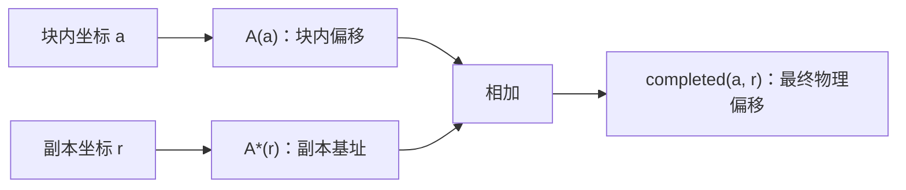
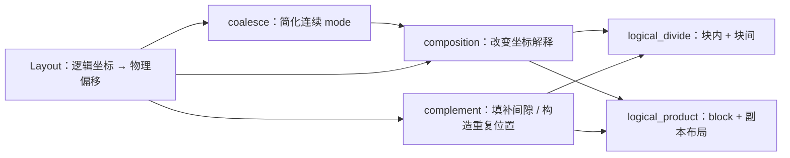

# CuTe Layout Algebra：复合、补集、分块与平铺

CuTe 把 `Layout` 看作**从逻辑坐标到物理偏移的函数**。设布局为 $L$，则可以把一次访问写成 $L(c)$：输入逻辑坐标 $c$，得到对应的内存偏移。

这套布局代数围绕三个基本动作展开：

- **复合（composition）**：改变“如何解释坐标”，即把一个布局作为另一个布局的输入。
- **补集（complement）**：构造能填补布局间隙、或描述布局重复位置的布局。
- **乘积与除法（product / divide）**：用复合和补集把布局扩展成规则的平铺，或拆成块内与块间坐标。

在进入细节前，先约定本文记法：`(s0, s1) : (d0, d1)` 表示 Shape 为 `(s0, s1)`、Stride 为 `(d0, d1)` 的 `Layout`；`_8` 是 CuTe 的编译期整数 `Int<8>`。本文所有接口以当前 CUTLASS 的 `include/cute/layout.hpp` 为准。

| 操作 | 解决的问题 | 常见用途 |
| --- | --- | --- |
| `coalesce` | 在不改变一维线性映射的前提下简化布局 | 消除 size-1 mode、暴露连续区间 |
| `composition` | 按新坐标规则访问旧布局 | reshape、采样、swizzle、分区 |
| `complement` | 找到可填补间隙或承载重复的坐标布局 | `logical_divide`、`logical_product` |
| `logical_divide` | 拆出块内坐标与块间坐标 | tensor tiling、线程块分区 |
| `logical_product` | 在 tiler 指定的位置复制一个块 | 构建块布局、线程/数据分布 |

## `coalesce`：合并连续 mode

**用途**

`coalesce` 将可合并的相邻 mode 合成更少的 mode。它不改变线性坐标 $i \in [0, \mathrm{size}(L))$ 的映射结果，因此是一个**表示形式的简化**，不是数据重排。

**原型**

```cpp
template <class Shape, class Stride>
CUTE_HOST_DEVICE constexpr auto
coalesce(Layout<Shape, Stride> const& layout);

template <class Shape, class Stride, class IntTuple>
CUTE_HOST_DEVICE constexpr auto
coalesce(Layout<Shape, Stride> const& layout,
         IntTuple const& trg_profile);
```

**源码确认的不变量**

| 性质 | 含义 |
| --- | --- |
| `size(result) == size(layout)` | 逻辑元素总数不变。 |
| `depth(result) <= 1` | 不带 profile 时，结果尽量打平。 |
| `result(i) == layout(i)` | 对任意合法的一维线性坐标，物理偏移完全相同。 |

例如，下面的嵌套布局中，第二个叶子 mode 的 Shape 是静态 `1`，其坐标恒为 `0`；剩余的 `2:1` 和 `6:2` 又在物理地址上连续：

```cpp
auto layout = Layout<Shape<_2, Shape<_1, _6>>,
                     Stride<_1, Stride<_6, _2>>>{};

auto result = coalesce(layout);  // _12:_1
```

### 合并规则

将布局的 Shape 和 Stride 展平后，`coalesce` 从相邻 mode 中归约。对 $s_0:d_0$ 与 $s_1:d_1$，可用下面四条规则理解。

| 条件 | 结果 | 原因 |
| --- | --- | --- |
| $s_1 = 1$ | $s_0:d_0$ | 右侧坐标恒为 `0`。 |
| $s_0 = 1$ | $s_1:d_1$ | 左侧坐标恒为 `0`。 |
| $d_1 = s_0 d_0$ | $(s_0s_1):d_0$ | 两个 mode 的物理地址无缝相接。 |
| 其他情况 | `(s0, s1):(d0, d1)` | 存在空洞、重叠或无法证明连续，不能合并。 |

#### 连续时为何能合并

布局 `(2, 4) : (1, 2)` 的地址序列是连续的：

- mode 0 的地址是 `0, 1`，覆盖跨度为 $2 \times 1 = 2$。
- mode 1 的 Stride 恰为 `2`，每次从前一个 mode 覆盖区域之后开始。
- 展平的地址依次为 `0, 1, 2, 3, 4, 5, 6, 7`。

因此 `(2, 4) : (1, 2)` 与 `8 : 1` 对一维坐标的映射相同，`coalesce` 可以返回 `8 : 1`。

相反，`(2, 4) : (1, 8)` 的地址为 `0, 1, 8, 9, 16, 17, 24, 25`。第二个 mode 的 Stride `8` 大于前一 mode 的覆盖跨度 `2`，中间有空洞，所以它必须保留为两个 mode。

#### size-1 mode 为什么可以消失

对 `(1, 8) : (100, 1)`，第一个坐标唯一可能是 `0`，其地址贡献始终为 $0 \times 100 = 0$。因此它和 `8 : 1` 等价。

这里要区分**数学上大小为 1**与**类型系统可静态消除的大小为 1**：当前实现可在编译期已知时激进合并；动态 Shape/Stride 为了保留类型与运行时信息，输出的嵌套形式可能更保守。

### 用 `trg_profile` 控制合并边界

第二个重载会在 `trg_profile` 的叶子处调用基础 `coalesce`。因此 profile 的**元组结构**决定“在哪些边界内合并”，叶子上写的具体整数不重要。

```cpp
auto a = Layout<Shape<_2, Shape<_3, _2>>,
                Stride<_1, Stride<_2, _6>>>{};
// a 的逻辑形状为 (2, (3, 2))，物理地址连续。
```

| 调用 | 结果 | 说明 |
| --- | --- | --- |
| `coalesce(a)` | `_12:_1` | 忽略原始结构，全部合并。 |
| `coalesce(a, Step<_1, _1>{})` | `(_2, _6):(_1, _2)` | 保留顶层 rank-2；第二个子树内部由 `(3, 2)` 合并为 `6`。 |
| `coalesce(a, Step<_1, _1, _1>{})` | `(_2, _3, _2):(_1, _2, _6)` | 指定三个叶子，嵌套被打平为 rank-3。 |
| `coalesce(a, Step<_1, Step<_1, _1>>{})` | `(_2, (_3, _2)):(_1, (_2, _6))` | profile 与原嵌套结构对应，因此保留该结构。 |

第一种按 mode 合并可写成：

```cpp
auto result = coalesce(a, Step<_1, _1>{});

auto same_result = make_layout(
    coalesce(layout<0>(a)),
    coalesce(layout<1>(a)));
```

`_1` 在这里并不是“要求保留大小 1”：实现只通过 `is_tuple<T>::value` 判断是否继续递归。任何非元组叶子都表示“在此处执行基础合并”；因此 `Step<42, 99>` 的结构效果相同，但 `_1` 更符合 CuTe 的惯例。

## `composition`：布局作为函数复合

**用途**

`composition(A, B)` 构造“先按 $B$ 解释逻辑坐标，再按 $A$ 找到物理位置”的布局。它是 reshape、采样、swizzle 和后续 tiling 操作的基础。

**原型**

```cpp
template <class LShape, class LStride,
          class RShape, class RStride>
CUTE_HOST_DEVICE constexpr auto
composition(Layout<LShape, LStride> const& lhs,
            Layout<RShape, RStride> const& rhs);

template <class LShape, class LStride, class Tiler>
CUTE_HOST_DEVICE constexpr auto
composition(Layout<LShape, LStride> const& lhs,
            Tiler const& rhs);
```

**数学定义**

$$
R := A \circ B, \qquad R(c) = A(B(c)).
$$

- $A$ 是已有布局：它把 $A$ 的逻辑坐标映射为物理偏移。
- $B$ 是新的坐标解释方式：它把 $R$ 的逻辑坐标映射为 $A$ 的逻辑坐标。
- $R$ 的定义域兼容 $B$。CuTe 单元测试验证 `compatible(B, R)`，并逐一验证 `R(c) == A(B(c))`。

| 场景 | `A` 的角色 | `B` 的角色 | `A ∘ B` 的含义 |
| --- | --- | --- | --- |
| reshape | 原始一维存储 | 新的二维坐标 | 将向量按矩阵视角解释。 |
| tile / partition | 完整张量布局 | 块内坐标或线程坐标 | 得到该坐标集合对应的物理位置。 |
| swizzle | 共享内存地址布局 | XOR 等变换 | 将逻辑顺序映射到错开的物理地址，以缓解 bank conflict（bank 冲突）。 |

### 从一维坐标理解复合

令

$$
A = (6, 2):(8, 2), \qquad B = (4, 3):(3, 1).
$$

将 `B` 当作一维函数时：`B(0)=0`、`B(1)=3`、`B(2)=6`。因此：

- $R(0)=A(B(0))=A(0)=0$。
- $R(1)=A(B(1))=A(3)=24$。`3` 被拆为 `(3, 0)`，所以偏移是 $3\times8+0\times2$。
- $R(2)=A(B(2))=A(6)=2$。`6` 被拆为 `(0, 1)`，所以偏移是 $0\times8+1\times2$。

最终可写为：

$$
R = ((2, 2), 3):((24, 2), 8).
$$


图中展示了 $A$ 与 $R$ 的二维视图；即使坐标的嵌套形状改变，`R(c)=A(B(c))` 仍是判断结果正确与否的唯一标准。

### 源码中的计算思路

对于 `Layout` 与 `Layout` 的复合，源码先按 `rhs` 的 profile 对 `lhs` 调用内部 `coalesce_x`，再进入 `composition_impl`。可将它理解为三步：

1. 将 $B$ 拆为其子布局连接：$B=(B_0,B_1,\ldots)$。
2. 对可接受的布局，利用左分配：$A\circ B=(A\circ B_0,A\circ B_1,\ldots)$。
3. 将每个叶子问题化为 $A\circ(s:d)$：先按 $d$ 选取，再取前 $s$ 个坐标。

若 $A=a:b$ 是一维布局，则最简单：

$$
(a:b) \circ (s:d) = s:(b d).
$$

若 $A$ 有多个 mode，源码要求中间形状满足可除性条件；静态整数不满足时会触发 `CUTE_STATIC_ASSERT`。对动态值，源码不会额外插入运行时断言，因此调用者应保证分块关系合法。

#### “除掉” Stride：确定采样间距

为解释多 mode 情形，记

$$
A=(s_0,s_1,\ldots):(d_0,d_1,\ldots).
$$

计算 $A / D$ 时，从低 mode 到高 mode 消耗采样间隔 $D$。在当前剩余除数 $D_i$ 下：

$$
s'_i=\max\left(1,\frac{s_i}{\min(s_i,D_i)}\right),\qquad
d'_i=\min(s_i,D_i)d_i,
$$

$$
D_{i+1}=\max\left(1,\frac{D_i}{s_i}\right).
$$

这描述的是算法直觉：每消耗一个 mode，采样步幅便乘上该 mode 已跨过的逻辑范围。为了得到整数 Shape，相关整除必须成立。

例如，对 $(3,6,2,8):(w,x,y,z)$ 除以 $9$：

| mode | 当前除数 | 新 Shape | 新 Stride | 传递给下一 mode |
| --- | --- | --- | --- | --- |
| `0`：`3:w` | `9` | `1` | `3w` | `3` |
| `1`：`6:x` | `3` | `2` | `3x` | `1` |
| `2`：`2:y` | `1` | `2` | `y` | `1` |
| `3`：`8:z` | `1` | `8` | `z` | `1` |

所以：

$$
(3,6,2,8):(w,x,y,z) / 9 = (1,2,2,8):(3w,3x,y,z).
$$

这也解释了常见的 Shape 例子：

| 原 Shape | 除数 | 结果 Shape |
| --- | --- | --- |
| `(6, 2)` | `2` | `(3, 2)` |
| `(6, 2)` | `3` | `(2, 2)` |
| `(6, 2)` | `6` | `(1, 2)` |
| `(6, 2)` | `12` | `(1, 1)` |
| `(3, 6, 2, 8)` | `3` | `(1, 6, 2, 8)` |
| `(3, 6, 2, 8)` | `6` | `(1, 3, 2, 8)` |
| `(3, 6, 2, 8)` | `9` | `(1, 2, 2, 8)` |
| `(3, 6, 2, 8)` | `72` | `(1, 1, 1, 4)` |

#### “取模” Shape：限制输出数量

在完成间距选择后，$A \bmod S$ 保留前 $S$ 个逻辑位置。当前剩余配额为 $S_i$ 时：

$$
s'_i=\min(s_i,S_i), \qquad d'_i=d_i, \qquad
S_{i+1}=\max\left(1,\frac{S_i}{s'_i}\right).
$$

它不改变 Stride，只截断可用逻辑范围。例如：

| 原 Shape | 配额 | 结果 Shape |
| --- | --- | --- |
| `(6, 2)` | `2` | `(2, 1)` |
| `(6, 2)` | `3` | `(3, 1)` |
| `(6, 2)` | `6` | `(6, 1)` |
| `(6, 2)` | `12` | `(6, 2)` |
| `(3, 6, 2, 8)` | `6` | `(3, 2, 1, 1)` |
| `(3, 6, 2, 8)` | `9` | `(3, 3, 1, 1)` |
| `(1, 2, 2, 8)` | `2` | `(1, 2, 1, 1)` |
| `(1, 2, 2, 8)` | `16` | `(1, 2, 2, 4)` |

因此，对叶子布局 $s:d$，可以把复合记成“先除掉 Stride、再按 Shape 截断”：

$$
A\circ(s:d) = (A / d) \bmod s.
$$

例如：

$$
(3,6,2,8):(w,x,y,z) \circ 16:9
= (1,2,2,4):(9w,3x,y,z).
$$

其中先除以 `9` 得到 `(1,2,2,8):(9w,3x,y,z)`，再保留 `16` 个逻辑元素，最后一个 mode 从 `8` 截断为 `4`。

### 三个复合示例

#### 示例一：分解多 mode 的右操作数

目标：

$$
(6,2):(8,2) \circ (4,3):(3,1).
$$

将右操作数拆为 `4:3` 与 `3:1`：

$$
A\circ B=(A\circ4:3,\ A\circ3:1).
$$

- 对 `4:3`：`/ 3` 得到 `(2,2):(24,2)`；其 size 恰为 `4`，再 `% 4` 不变。
- 对 `3:1`：`/ 1` 不变；`% 3` 得到 `(3,1):(8,2)`。
- 连接后为 `((2,2),(3,1)):((24,2),(8,2))`；再按可合并 mode 简化，得到：

$$
((2,2),3):((24,2),8).
$$

#### 示例二：将步长为 2 的向量视为矩阵

目标：

$$
20:2 \circ (5,4):(4,1).
$$

`(5,4):(4,1)` 可拆为 `5:4` 与 `4:1`：

$$
\begin{aligned}
20:2\circ5:4 &= 5:8,\\
20:2\circ4:1 &= 4:2.
\end{aligned}
$$

连接后：

$$
20:2 \circ (5,4):(4,1) = (5,4):(8,2).
$$

这表示物理间隔为 2 的 20 个元素，按“5 行、每行 4 个元素”的逻辑矩阵来解释。

#### 示例三：列优先视角下的矩阵重塑

目标：

$$
(10,2):(16,4) \circ (5,4):(1,5).
$$

右操作数的两个叶子为 `5:1` 与 `4:5`：

- `A ∘ 5:1`：`/1` 不变，`%5` 得到 `(5,1):(16,4)`。
- `A ∘ 4:5`：`/5` 得到 `(2,2):(80,4)`，`%4` 后不变。

连接并消去 size-1 mode：

$$
(5,(2,2)):(16,(80,4)).
$$

使用静态整数时，CuTe 可把静态 size-1 mode 简化掉；动态整数时，结果通常保留它们以维持类型结构：

```cpp
#include <cute/tensor.hpp>

using namespace cute;

auto static_a = make_layout(make_shape(Int<10>{}, Int<2>{}),
                            make_stride(Int<16>{}, Int<4>{}));
auto static_b = make_layout(make_shape(Int<5>{}, Int<4>{}),
                            make_stride(Int<1>{}, Int<5>{}));
auto static_c = composition(static_a, static_b);
// (_5, (_2, _2)) : (_16, (_80, _4))

auto dynamic_a = make_layout(make_shape(10, 2), make_stride(16, 4));
auto dynamic_b = make_layout(make_shape(5, 4), make_stride(1, 5));
auto dynamic_c = composition(dynamic_a, dynamic_b);
// ((5, 1), (2, 2)) : ((16, 4), (80, 4))
```

### 按 mode 复合：`Tiler`

当 `rhs` 是一个 Layout 元组、Shape 或 Tiler 时，`composition` 会递归地在对应 mode 上操作；当叶子是一个 `Layout` 时，才执行前面的函数复合。它适合“保持 M/N 等维度语义，只在每个维度内取子布局”的场景。

```cpp
auto a = make_layout(make_shape(12, make_shape(4, 8)),
                     make_stride(59, make_stride(13, 1)));

auto tiler = make_tile(Layout<_3, _4>{},  // mode 0：3:4
                       Layout<_8, _2>{}); // mode 1：8:2

auto result = composition(a, tiler);
// (_3, (_2, _4)) : (_236, (_26, _1))

auto same_result = make_layout(
    composition(layout<0>(a), get<0>(tiler)),
    composition(layout<1>(a), get<1>(tiler)));
```


这个 `Tiler` 选择第 `0, 4, 8` 个 mode-0 坐标，以及第 `0, 2, 4, …, 14` 个 mode-1 坐标；结果仍有 $3\times8$ 个逻辑位置，但这些位置在原 $12\times32$ 逻辑网格中是稀疏的。

Shape 也可直接充当 Tiler，此时每个叶子相当于 Stride 为 `1` 的 Layout：

```cpp
auto shape_tiler = make_shape(Int<3>{}, Int<8>{});
auto contiguous_result = composition(a, shape_tiler);
// 等价于 <3:1, 8:1>
// (_3, (_4, _2)) : (_59, (_13, _1))
```


| 维度 | 普通 `composition(A, B)` | 按 mode 的 `composition(A, tiler)` |
| --- | --- | --- |
| 逻辑视角 | 将 $A$ 线性化后按 $B$ 重新解释 | 保持 $A$ 的 mode 语义，在每个 mode 内采样 |
| 结果 Shape | 兼容 $B$ 的 Shape | 对应保留被 tiler 命中的 mode |
| 典型用途 | reshape、任意重排、MMA 寄存器分区 | 全局矩阵切 tile、线程块分区 |

在 CUDA 实现中，前者常用于让数据布局适配 MMA 指令所需的线程—值映射；后者常用于从大张量中取得某个 CTA 的子块。

## `complement`：构造 tile 基址，而非列举“剩余地址”

`complement` 是 CuTe 布局代数里最容易被名称误导的操作。

> `complement(A, T)` 的结果 $A^*$ **不是**“所有不在 $A$ 中的物理地址”的集合。它描述的是把布局 $A$ 放到不同位置时，**每个副本的基址如何移动**。

它要解决的问题是：已知一个不规则或有间隙的 block 布局 $A$，怎样构造另一个布局 $A^*$，让 $A$ 的块内坐标与 $A^*$ 的副本坐标共同覆盖目标物理地址范围？在常见的 radix-continuous（按进位连续）布局中，这个组合会精确填满；在更一般的布局上，CuTe 的公开契约更接近“覆盖范围足够大，且副本基址有序、不撞内部地址”。

### 从 `make_layout(A, A*)` 看真正的定义

令 `completed = make_layout(A, A*)`。对最常见的非嵌套布局，若 $a$ 是 block 内坐标、$r$ 是副本坐标，则：

$$
\mathrm{completed}(a,r)=A(a)+A^*(r).
$$

这里的加法来自 CuTe Layout 的坐标—Stride 内积。`A(a)` 是**一个 block 内部**的偏移，`A*(r)` 是该 block 的**基址偏移**。

因此，`A*` 的第一个值通常就是 `0`：第 0 个副本当然从原点开始。它与 `A(0)=0` 重合是正常且必要的，不表示布局冲突。



换句话说，`complement` 返回的是“**还需要怎样变化坐标，才能把已有块平铺出去**”，而不是地址位图的反集。这正是它能直接参与 `logical_divide` 和 `logical_product` 的原因。

**用途**

- 为 `logical_divide(A, B)` 构造 `B*`，把一个 tile 扩展成“tile 内 + tile 间”两类坐标。
- 为 `logical_product(A, B)` 构造 `A*`，让 `B` 的每个逻辑位置对应一个不重叠的 $A$ 副本。
- 将一个有孔洞的、非连续的 block Layout 补成能覆盖目标共域的规则坐标系统。

**原型**

```cpp
template <class Shape, class Stride, class CoTarget>
CUTE_HOST_DEVICE constexpr auto
complement(Layout<Shape, Stride> const& layout,
           CoTarget const& cotarget);

template <class Shape, class Stride>
CUTE_HOST_DEVICE constexpr auto
complement(Layout<Shape, Stride> const& layout);
```

**参数与返回值**

| 项 | 类型 | 含义 |
| --- | --- | --- |
| `layout` | `Layout<Shape, Stride> const&` | 需要重复、补齐或作为 tile 的原布局 $A$。它应是可注入的：不同逻辑坐标不能映射到同一物理偏移。 |
| `cotarget` | 整数或 `IntTuple` | 目标**共域大小**。算法保证组合布局的 `cosize` 至少达到 `size(cotarget)`，并不承诺刚好相等。 |
| 返回值 | 新的 `Layout` | 副本基址布局 $A^*$；用 `make_layout(A, A*)` 与原布局组合。 |

不传 `cotarget` 的重载使用 `cosize(filter(layout))` 作为目标。传入 Shape（如 `make_shape(_4{}, _7{})`）与传入大小为 28 的整数具有相同的数学目标，但前者能保留更多编译期可除性信息。

### 源码测试中的契约

令 $R=\mathrm{complement}(A,T)$，并令 `completed = make_layout(A, R)`。当前 CuTe 单元测试验证：

| 性质 | 含义 |
| --- | --- |
| `cosize(completed) >= size(T)` | block 与副本基址组合后，物理覆盖范围至少达到目标。 |
| `cosize(R) <= round_up(size(T), cosize(A))` | 副本基址的共域有上界，不会无界扩大。 |
| `R(i - 1) < R(i)`，`i >= 1` | 副本基址严格递增。 |
| `R(i) != A(j)`，`i >= 1` | **第 1 个及之后**的基址不与原 block 的内部偏移重合。`R(0)` 允许为 `0`，也通常等于 `A(0)`。 |
| `size(complement(completed)) == 1`（适用静态条件时） | `completed` 已经填满，不需要再增加有效的补集 mode。 |

最后一条解释了“补集”一词的代数意味：先把 $A$ 与 $A^*$ 组合成连续覆盖的结构，再取补集只会得到一个退化的单点布局。

### `cosize`：目标为什么不是 `size`

`size` 计算逻辑元素个数；`cosize` 计算容纳最大物理偏移所需的地址空间大小。对一维布局：

$$
\mathrm{cosize}(S:D)=(S-1)D+1.
$$

对已展平、正 Stride 且地址不重叠的常见布局：

$$
\mathrm{cosize}((s_0,\ldots,s_{n-1}):(d_0,\ldots,d_{n-1}))
=\sum_i(s_i-1)d_i+1.
$$

例如，`B = (2, 4) : (1, 8)` 的 `size(B)=8`，但：

$$
\mathrm{cosize}(B)=(2-1)\times1+(4-1)\times8+1=26.
$$

它可访问的最大偏移是 `25`。若要把这种带孔洞的布局扩展成连续地址范围，目标显然应由物理共域而不是逻辑元素数量决定。对零 Stride、重叠或负 Stride 布局，不应手工套用上式，应使用 CuTe 的 `cosize`。

### 例一：连续 block 只需要连续递增的基址

设 block 为 $A=4:1$，目标共域大小为 24：

$$
A^*=\mathrm{complement}(4:1,24)=6:4.
$$

不要把 `6:4` 解读成“地址 $4,5,6,\ldots$ 的集合”。它表示六个 block 的基址：

$$
A^*(r)=4r,\qquad r\in[0,6).
$$

组合布局为：

$$
\mathrm{make\_layout}(A,A^*)=(4,6):(1,4),
$$

所以：

$$
\mathrm{completed}(i,r)=i+4r.
$$

| 副本坐标 `r` | `A*(r)` | `i = 0, 1, 2, 3` 对应的最终偏移 |
| --- | --- | --- |
| `0` | `0` | `0, 1, 2, 3` |
| `1` | `4` | `4, 5, 6, 7` |
| `2` | `8` | `8, 9, 10, 11` |
| `…` | `…` | `…` |
| `5` | `20` | `20, 21, 22, 23` |

这里 $A^*(0)=0=A(0)$，但没有问题：一个是“第 0 个副本的基址”，另一个是“block 内第 0 个元素的偏移”。只有把两个坐标一起代入组合布局，才是在描述实际地址。

### 例二：`4:2` 如何先填孔洞、再重复

设：

$$
A=4:2,\qquad A(i)=2i.
$$

它的一个 block 只访问偶数地址 `0, 2, 4, 6`。目标为 24 时：

$$
A^*=\mathrm{complement}(4:2,24)=(2,3):(1,8).
$$

把 $A^*$ 的坐标写作 `(u, v)`，则：

$$
A^*(u,v)=u+8v,
$$

组合后的地址为：

$$
\mathrm{completed}(i,u,v)=2i+u+8v.
$$

`u` 的 Shape 为 2、Stride 为 1，负责在每个 8 元素大块内补上奇数地址；`v` 的 Shape 为 3、Stride 为 8，负责把已经填满的 8 元素大块复制到 `0`、`8`、`16`。

| `v` | `u` | `i=0,1,2,3` 对应的最终偏移 | 覆盖范围 |
| --- | --- | --- | --- |
| `0` | `0` | `0, 2, 4, 6` | 偶数地址 |
| `0` | `1` | `1, 3, 5, 7` | 奇数地址，填满 `0..7` |
| `1` | `0` | `8, 10, 12, 14` | 下一大块的偶数地址 |
| `1` | `1` | `9, 11, 13, 15` | 填满 `8..15` |
| `2` | `0/1` | `16..23` | 填满最后一大块 |

这正是 `(2,3):(1,8)` 的两层含义：`2:1` 是**块内填孔**，`3:8` 是**块间重复**。它也说明为什么 `complement` 的输出通常比“遗漏地址列表”小得多：它用 Layout 的规则性压缩了这些地址。

不传目标时，`complement(4:2)` 以 `cosize(4:2)=7` 为目标，静态情况下会得到 `2:1`。组合后的 `(4,2):(2,1)` 覆盖 `0..7`，即便目标是 7，`cosize` 也可以因完整 tile 而向上取整到 8。

### 例三：二维 block 的两层补集

设：

$$
A=(2,2):(1,6),\qquad A(i,j)=i+6j.
$$

一个 block 的四个地址是 `0, 1, 6, 7`：相邻的两行之间存在 `2..5` 这段空洞。对目标 24：

$$
A^*=\mathrm{complement}((2,2):(1,6),24)=(3,2):(2,12).
$$

若 $A^*$ 的坐标是 `(u,v)`，则组合布局满足：

$$
\mathrm{completed}(i,j,u,v)=i+6j+2u+12v.
$$

| `v` | `u` | `(i, j)` 在 block 内产生的地址 | 该组覆盖 |
| --- | --- | --- | --- |
| `0` | `0` | `0, 1, 6, 7` | 原 block |
| `0` | `1` | `2, 3, 8, 9` | 填第一层空洞 |
| `0` | `2` | `4, 5, 10, 11` | 完成 `0..11` |
| `1` | `0, 1, 2` | 上述地址全部加 `12` | 完成 `12..23` |

因此：

- `3:2` 选择 `0、2、4` 三个相对基址，在小尺度上把每个 `0..11` 单元填满。
- `2:12` 选择 `0、12` 两个大尺度基址，把已填满的 12 元素单元复制两次。


图中的不同颜色不应理解为“补集单独访问了哪些元素”；每种颜色表示固定 `(u,v)` 下，原 block 的四个元素经过 $A(i,j)+A^*(u,v)$ 平移后的位置。

### 其他静态示例速查

| 调用 | 结果 | 如何理解 |
| --- | --- | --- |
| `complement(4:1, 24)` | `6:4` | 一个连续 4 元素 block 的六个基址。 |
| `complement(6:4, 24)` | `4:1` | `6:4` 每次跨 4；`4:1` 提供四个相对偏移，使 `(6,4):(4,1)` 连续。 |
| `complement((4,6):(1,4), 24)` | `1:0` | 原布局已经覆盖 `0..23`，退化的补集不再改变地址。 |
| `complement(4:2, 24)` | `(2,3):(1,8)` | 见例二：`2:1` 填孔，`3:8` 重复。 |
| `complement((2,4):(1,6), 24)` | `3:2` | 原 block 地址为 `0,1,6,7,12,13,18,19`；加上 `0,2,4` 后覆盖 `0..23`。 |
| `complement((2,2):(1,6), 24)` | `(3,2):(2,12)` | 见例三：先填内层空洞，再复制完整单元。 |

### `A*` 的计算逻辑：按物理步长做 radix 填坑

**从源码确认**：`complement(layout, cotarget)` 不是枚举地址集合，而是在源码里做了一个结构化递推。

1. 先执行 `filter(layout)`。这一步会处理零 Stride mode，再做 `coalesce`，把已经连续或无效的部分化简掉。
2. 对过滤后的布局，反复选取当前最小 Stride。等价地说，可以把所有 mode 展平成一串 `(shape:stride)`，再按物理 Stride 从小到大排序。
3. 每处理一个原布局 mode，就在它前面插入一个“补集 mode”，用于填满当前连续单元到该 mode 起点之间的空洞。
4. 所有内部空洞处理完以后，再追加一个外层 mode，把完整单元复制到 `cotarget` 覆盖的范围。

把过滤并排序后的布局写成：

$$
A=(s_0,\ldots,s_{R-1}):(d_0,\ldots,d_{R-1}),
\qquad d_0\le d_1\le \cdots \le d_{R-1}.
$$

这里 $s_i$ 是第 $i$ 个原布局 mode 的 Shape，$d_i$ 是对应 Stride。然后定义一个递推量：

$$
C_0=1.
$$

$C_i$ 表示在处理第 $i$ 个原布局 mode 之前，`A` 与已经生成的 $A^*$ mode 合在一起，已经能够连续覆盖的最小物理单元大小。每遇到原布局的下一个 Stride $d_i$，就计算：

$$
q_i=\frac{d_i}{C_i}.
$$

如果 $q_i=1$，说明当前连续单元刚好接到 $d_i$，没有新的坑要填；这个 mode 后面通常会被 `coalesce` 消掉。如果 $q_i>1$，说明从 $C_i$ 到 $d_i$ 之前存在空洞，`complement` 就生成一个新 mode：

$$
q_i:C_i.
$$

这个 mode 产生的基址偏移是：

$$
0,\ C_i,\ 2C_i,\ \ldots,\ (q_i-1)C_i.
$$

它的作用是把当前连续单元复制 $q_i$ 次，正好铺到下一个原布局 Stride $d_i$ 之前。随后吸收原布局 mode $s_i:d_i$，新的连续单元大小变成：

$$
C_{i+1}=s_i d_i.
$$

所以 `A*` 的内部补全集合不是靠“第一个坑、第二个坑”逐地址找出来的，而是靠这一串 radix 因子得到的：

$$
A^*_{\text{inner, raw}}
=(q_0,\ldots,q_{R-1}):(C_0,\ldots,C_{R-1}).
$$

最后，所有原布局 mode 都吸收完以后，完整单元大小是 $C_R$。如果目标共域大小是 $T$，外层重复因子就是：

$$
q_R=\left\lceil\frac{T}{C_R}\right\rceil.
$$

对标量目标，可以把外层补集理解为：

$$
q_R:C_R.
$$

因此一个常见的一维化写法是：

$$
A^*_{\text{raw}}
=(q_0,\ldots,q_{R-1},q_R):(C_0,\ldots,C_{R-1},C_R),
$$

最终返回值是：

$$
A^*=\mathrm{coalesce}(A^*_{\text{raw}}).
$$

源码里对一般 `IntTuple` 目标不是简单追加一个标量 $q_R$，而是：

```cpp
auto rest_shape  = coalesce(ceil_div(cotarget, new_stride));
auto rest_stride = compact_major<LayoutLeft>(rest_shape, new_stride);
```

这表示外层重复本身也可以保留成多维 Shape；但数学含义仍然是“以 $C_R$ 为步长，把完整单元继续向外平铺”。

把公式和 `layout.hpp` 里的变量对应起来，就是：

| 源码变量 | 数学含义 | 说明 |
| --- | --- | --- |
| `min_stride` | $d_i$ | 当前还没处理的最小物理 Stride。 |
| `get<i>(result_stride)` | $C_i$ | 处理第 $i$ 个原布局 mode 前，已经形成的连续单元大小。 |
| `new_shape = min_stride / get<i>(result_stride)` | $q_i=d_i/C_i$ | 本轮需要插入的补集 Shape。 |
| `new_stride = min_stride * get<min_idx>(shape)` | $C_{i+1}=d_i s_i$ | 吸收当前原布局 mode 后，下一轮的连续单元大小。 |
| `rest_shape = coalesce(ceil_div(cotarget, new_stride))` | 外层重复 Shape | 将完整单元继续复制到目标共域。 |

#### 怎么判断第一个断裂点

上面的递推也可以写成更直观的“断裂点检查”：

- 初始 $C=1$。如果最小 Stride $d_0>1$，物理地址 `0` 后面立刻断开，所以补集第一维是 $d_0:1$。
- 如果某一步已经能连续覆盖 $[0,C)$，而下一个原布局 Stride 是 $d$，就检查 $C$ 与 $d$。
- 若 $C=d$，说明原布局的下一个 mode 正好接上，补集因子是 `1:C`，没有有效新维度。
- 若 $C<d$，说明中间有空洞。只要 $d$ 能被 $C$ 整除，补集因子就是 `(d/C):C`。
- 吸收这个原布局 mode `s:d` 后，新的连续单元变为 $C=s\times d$，再继续看下一个 Stride。

这里的“能被整除”很重要：常见的 CuTe tile 布局都满足这种 radix 关系，例如 `1, 2, 8, 16...` 这样的层级。对于不满足这种关系的任意 Stride，不能把 `complement` 粗暴理解成集合论意义上的“把所有缺失地址都列出来”。当前源码和测试更强调 `cosize`、有序性和不重叠基址这些结构性质。

#### 手算例二：`A=4:2`

排序后只有一个 mode：

$$
s_0=4,\qquad d_0=2.
$$

递推如下：

| 步骤 | 当前量 | 计算 | 得到的补集 mode |
| --- | --- | --- | --- |
| 初始 | $C_0=1$，$d_0=2$ | $q_0=2/1=2$ | `2:1` |
| 吸收原 mode | $s_0=4,d_0=2$ | $C_1=4\times2=8$ | 完整单元大小为 8 |
| 外层平铺 | $T=24,C_1=8$ | $q_1=\lceil24/8\rceil=3$ | `3:8` |

所以：

$$
A^*_{\text{raw}}=(2,3):(1,8).
$$

它已经不能继续合并，因此：

$$
A^*=(2,3):(1,8).
$$

这就是前面说的“先用 `2:1` 填奇偶孔洞，再用 `3:8` 复制完整 8 元素单元”。

#### 手算例三：`A=(2,2):(1,6)`

排序后两个 mode 已经按 Stride 递增：

$$
(s_0:d_0,s_1:d_1)=(2:1,\ 2:6).
$$

递推如下：

| 步骤 | 当前量 | 计算 | 得到的补集 mode |
| --- | --- | --- | --- |
| 处理 `2:1` 前 | $C_0=1,d_0=1$ | $q_0=1/1=1$ | `1:1`，后续会被消掉 |
| 吸收 `2:1` | $s_0=2,d_0=1$ | $C_1=2\times1=2$ | 已连续覆盖 `0..1` |
| 处理 `2:6` 前 | $C_1=2,d_1=6$ | $q_1=6/2=3$ | `3:2` |
| 吸收 `2:6` | $s_1=2,d_1=6$ | $C_2=2\times6=12$ | 已连续覆盖 `0..11` |
| 外层平铺 | $T=24,C_2=12$ | $q_2=\lceil24/12\rceil=2$ | `2:12` |

所以原始补集可以写成：

$$
A^*_{\text{raw}}=(1,3,2):(1,2,12).
$$

其中 `1:1` 是无效维度，`coalesce` 以后得到：

$$
A^*=(3,2):(2,12).
$$

#### 再看一个三维例子

设：

$$
A=(2,3,2):(1,2,12),\qquad T=48.
$$

这个布局的前两个 mode `2:1` 和 `3:2` 已经能连续覆盖 `0..5`，但第三个 mode 从 Stride 12 开始，中间留下 `6..11`。按递推：

| 步骤 | 计算 | 得到的补集 mode |
| --- | --- | --- |
| $C_0=1,d_0=1$ | $q_0=1$ | `1:1` |
| 吸收 `2:1` | $C_1=2$ | - |
| $C_1=2,d_1=2$ | $q_1=1$ | `1:2` |
| 吸收 `3:2` | $C_2=6$ | - |
| $C_2=6,d_2=12$ | $q_2=2$ | `2:6` |
| 吸收 `2:12` | $C_3=24$ | - |
| 外层平铺到 48 | $q_3=\lceil48/24\rceil=2$ | `2:24` |

因此：

$$
A^*_{\text{raw}}=(1,1,2,2):(1,2,6,24),
\qquad
A^*=(2,2):(6,24).
$$

这里的 `1:1` 和 `1:2` 都是递推中的 raw mode：它们表示“这一层没有实际空洞”，最终会在 `coalesce` 中消失。

组合后：

$$
\mathrm{completed}(i,j,k,u,v)=i+2j+12k+6u+24v.
$$

其中 `u` 负责把 `6..11` 和 `18..23` 这样的内部空洞补上，`v` 负责把完整的 24 元素单元复制到 `24..47`。

**副作用 / 约束**

- 这是纯 `constexpr` Layout 变换：不分配内存、不读取 tensor 数据，也不发射 CUDA kernel。
- rank 大于 1 的布局要求 Stride 为静态值；源码明确写有 `Dynamic-stride complement only for rank-1 layouts` 的编译期限制。
- 输入布局必须足够可注入；有重叠映射时无法唯一地构造这种平铺补集。
- 想确认一个结果，应直接检查 `make_layout(A, complement(A, T))` 的 `cosize` 是否覆盖目标，并用小坐标枚举验证地址是否符合预期。

## `logical_divide`：把布局拆成块内与块间坐标

**用途**

`logical_divide(A, B)` 用 tiler `B` 将布局 `A` 划分为两类 mode：第一类描述**一个 tile 内部**，第二类描述**tile 之间**如何移动。它是 tensor tiling 与 partitioning 的基础。

**原型**

```cpp
template <class LShape, class LStride,
          class TShape, class TStride>
CUTE_HOST_DEVICE constexpr auto
logical_divide(Layout<LShape, LStride> const& layout,
               Layout<TShape, TStride> const& tiler);

template <class LShape, class LStride, class Tiler>
CUTE_HOST_DEVICE constexpr auto
zipped_divide(Layout<LShape, LStride> const& layout,
              Tiler const& tiler);
```

**定义与源码实现**

$$
A \oslash B = A \circ (B, B^*).
$$

对应的核心实现是：

```cpp
return composition(
    layout,
    make_layout(tiler, complement(tiler, shape(coalesce(layout)))));
```

注意 `complement` 的目标是 `shape(coalesce(layout))`，而不是被手写为一个裸 `size(layout)`：这样既表达了线性总大小，也尽可能保留静态 Shape 信息。若 `tiler` 是元组或 Shape，函数会递归地对各个对应 mode 做 `logical_divide`；`_` 则表示该 mode 不变。

### 一维示例

令：

$$
A=(4,2,3):(2,1,8), \qquad B=4:2.
$$

`A` 逻辑上有 24 个元素。计算过程为：

1. `B* = complement(4:2, 24) = (2, 3):(1, 8)`。
2. 连接为 `(B, B*) = (4, (2, 3)) : (2, (1, 8))`。
3. 与 `A` 复合，得到：

$$
((2,2),(2,3)):((4,1),(2,8)).
$$


结果的第一个 mode 是块内坐标，第二个 mode 表示在六个同构块之间的移动。它不是仅“取出第一个块”，而是同时给出整组块的地址规律。

### 二维示例

令：

$$
A=(9,(4,8)):(59,(13,1)).
$$

对第一个 mode 使用 `3:3`，对第二个 mode 使用 `(2,4):(1,8)`，即：

$$
B=\langle 3:3,\ (2,4):(1,8)\rangle.
$$


这里共有 12 个 tile。每个原始维度都会拆成“块内 mode”和“剩余 mode”；把所有块内 mode 组合起来，得到：

$$
(3,(2,4)):(177,(13,2)).
$$

它恰好等于 `composition(A, B)`。差别在于：`composition` 只给出一个 tile 的访问布局，而 `logical_divide` 还保留了遍历全部 tile 的其余 mode。

### `zipped_divide`、`tiled_divide` 与 `flat_divide`

这三个接口都先执行 `logical_divide`，再重排 mode，方便选择 tile 与 tile 编号。若原 Shape 是 `(M, N, L, ...)`，Tiler 是 `<TileM, TileN>`：

| 操作 | 结果 mode 结构 | 使用方式 |
| --- | --- | --- |
| `logical_divide` | `((TileM, RestM), (TileN, RestN), L, ...)` | 保留每个原始 mode 的语义。 |
| `zipped_divide` | `((TileM, TileN), (RestM, RestN, L, ...))` | mode 0 是完整 tile，mode 1 是 tile 网格。 |
| `tiled_divide` | `((TileM, TileN), RestM, RestN, L, ...)` | 保持 tile 整体，展开块间 mode。 |
| `flat_divide` | `(TileM, TileN, RestM, RestN, L, ...)` | 将两类 mode 都完全展开。 |

```cpp
auto layout_a = make_layout(
    make_shape(Int<9>{}, make_shape(Int<4>{}, Int<8>{})),
    make_stride(Int<59>{}, make_stride(Int<13>{}, Int<1>{})));

auto tiler = make_tile(
    Layout<_3, _3>{},
    Layout<Shape<_2, _4>, Stride<_1, _8>>{});

auto logical = logical_divide(layout_a, tiler);
auto zipped  = zipped_divide(layout_a, tiler);

// layout<0>(zipped) 是块内布局，也满足：
// layout<0>(zipped_divide(layout_a, tiler)) == composition(layout_a, tiler)
```

这个例子的真实输出可以写成：

$$
\begin{aligned}
\mathrm{logical}
&=((3,3),((2,4),(2,2))) \\
&\quad :((177,59),((13,2),(26,1))), \\
\mathrm{zipped}
&=((3,(2,4)),(3,(2,2))) \\
&\quad :((177,(13,2)),(59,(26,1))).
\end{aligned}
$$

`logical_divide` 保留原始 mode 语义，所以结果还是“原 mode 0 被拆成 `(TileM, RestM)`，原 mode 1 被拆成 `(TileN, RestN)`”：

$$
((TileM,RestM),(TileN,RestN)).
$$

`zipped_divide` 则把所有 tile 内 mode 收到第 0 个 mode，把所有 rest mode 收到第 1 个 mode：

$$
((TileM,TileN),(RestM,RestN)).
$$

在这个例子里：

| 部分 | Layout | 语义 |
| --- | --- | --- |
| `layout<0>(zipped)` | `(3,(2,4)):(177,(13,2))` | 一个 tile 内部的 24 个元素，也就是 `composition(layout_a, tiler)`。 |
| `layout<1>(zipped)` | `(3,(2,2)):(59,(26,1))` | tile 网格，一共有 $3\times2\times2=12$ 个 tile。 |

因此，`zipped` 的完整坐标可以写成：

$$
\mathrm{zipped}\big((t_m,(t_{n0},t_{n1})),(r_m,(r_{n0},r_{n1}))\big)
=177t_m+13t_{n0}+2t_{n1}+59r_m+26r_{n0}+r_{n1}.
$$

这里第一组坐标 `(t_m,(t_{n0},t_{n1}))` 表示**tile 内第几个元素**，第二组坐标 `(r_m,(r_{n0},r_{n1}))` 表示**第几个 tile**。

所以第 `k` 个 tile 的首地址写成：

$$
\mathrm{zipped}(0,k).
$$

这里的第一个 `0` 不是“第 0 个 tile”，而是 **tile 内坐标取 0**，也就是取这个 tile 的第一个元素作为基址。第二个参数 `k` 才是在选择第几个 tile。

反过来，`zipped(k,0)` 的含义完全不同：它固定在第 0 个 tile 上，然后取这个 tile 内的第 `k` 个元素。用前几项对比最直观：

| 表达式 | 含义 | 前几项 |
| --- | --- | --- |
| `zipped(0, k)` | 第 `k` 个 tile 的首地址 | `0, 59, 118, 26, 85, 144, ...` |
| `zipped(k, 0)` | 第 0 个 tile 内第 `k` 个元素地址 | `0, 177, 354, 13, 190, 367, ...` |

如果要取第 `k` 个完整 tile，应保留第 0 个 mode，固定第 1 个 mode：

```cpp
auto tile_k = zipped(_, k);
```

如果要看所有 tile 中相同的第 `i` 个元素，应固定第 0 个 mode，保留第 1 个 mode：

```cpp
auto elem_i_across_tiles = zipped(i, _);
```


图中的“行/列”不再代表原张量的 M/N 维，而分别代表 tile 间与 tile 内的坐标空间；这正是 `zipped_divide` 为方便 tile 索引所做的语义重组。

## `logical_product`：在 tiler 上复制 block

**用途**

`logical_product(block, tiler)` 将 `block` 作为第一个 mode 原样保留，并利用 `tiler` 指定的逻辑顺序构造第二个 mode，使 `tiler` 的每个元素对应一个不冲突的 block 副本。

**原型**

```cpp
template <class LShape, class LStride,
          class TShape, class TStride>
CUTE_HOST_DEVICE constexpr auto
logical_product(Layout<LShape, LStride> const& block,
                Layout<TShape, TStride> const& tiler);

template <class TShape, class TStride,
          class UShape, class UStride>
CUTE_HOST_DEVICE constexpr auto
blocked_product(Layout<TShape, TStride> const& block,
                Layout<UShape, UStride> const& tiler);
```

**定义与约束**

$$
A\otimes B=(A, A^*\circ B).
$$

源码实现中的补集目标为 `size(block) * cosize(tiler)`：

```cpp
return make_layout(
    block,
    composition(complement(block, size(block) * cosize(tiler)), tiler));
```

由此可得到两个重要接口契约：

- 结果固定是 rank-2。
- `layout<0>(result) == block`，并且 `layout<1>(result)` 与 `tiler` 兼容。

### 一维示例

令：

$$
A=(2,2):(4,1), \qquad B=6:1.
$$

这表示将 4 元素 block 复制六次。计算为：

1. $A^*=\mathrm{complement}(A, 6\times4)=(2,3):(2,8)$。
2. $A^*\circ B=(2,3):(2,8)$。
3. 连接得到：

$$
((2,2),(2,3)):((4,1),(2,8)).
$$


改变 `B` 会同时改变副本数量和副本顺序。例如将 $B$ 改为 `(4,2):(2,1)`，会产生八个副本，且块的遍历顺序不同。


### 二维 product 与 rank-sensitive product

也可以把 `logical_product` 按 mode 应用于二维 block 与二维 Tiler；结果可表达“一个 $2\times5$ 行优先 block，按 $3\times4$ 列优先网格平铺”。不过直接构造这种 Tiler 往往依赖于 block 的具体 Shape/Stride，不够直观。


`blocked_product` 与 `raked_product` 是更常用的 rank-sensitive（秩敏感）接口。它们先将两个布局补齐到相同 top-level rank，计算 `logical_product`，再以不同的顺序 `zip` 对应 mode。

| 接口 | mode 重新关联方式 | 结果直觉 |
| --- | --- | --- |
| `blocked_product(A, B)` | `zip(get<0>(result), get<1>(result))` | 每个 block 保持成连续的块状区域。 |
| `raked_product(A, B)` | `zip(get<1>(result), get<0>(result))` | 先走 tile 网格的对应 mode，再走 block 的对应 mode，副本彼此交错。 |


`blocked_product` 的参数表达“block 是什么、tiler 如何排列”即可；源码的 `zip` 还会给出按 mode 对应的紧凑布局，适合普通块状平铺。


`raked_product` 将顺序反转，因此 block 元素在不同副本之间交错；这类分布在其他文献中也常被称为 cyclic distribution（循环分布）。

### product 的 mode 排列变体

对于 Shape 为 `(M, N, ...)` 的 block 和 `<TileM, TileN>` 的 tiler：

| 变体 | 结果 mode 结构 | 语义 |
| --- | --- | --- |
| `logical_product` | `((M, TileM), (N, TileN), ...)` | 每个原始 mode 与其平铺 mode 配对。 |
| `zipped_product` | `((M, N), (TileM, TileN, ...))` | mode 0 是完整 block，mode 1 是全部副本的布局。 |
| `tiled_product` | `((M, N), TileM, TileN, ...)` | 保持 block 整体，展开平铺 mode。 |
| `flat_product` | `(M, N, TileM, TileN, ...)` | 全部 mode 展开到顶层。 |

选择哪种接口取决于下一步如何索引：需要“块内坐标 + 块编号”时通常选 `zipped_product`；需要按原 M/N 维继续组合时选 `logical_product` 或 `blocked_product`；需要与其他扁平布局拼接时才考虑 `flat_product`。

## 复习：一条可组合的推理链

下面的关系串起了本文所有操作：



- `coalesce` 的核心是不改变 $L(i)$，只让布局更易推理。
- `composition` 的核心是不改变函数复合定义：始终用 $R(c)=A(B(c))$ 检查。
- `complement` 提供另一个有序且不重叠的坐标 mode，使“一个 tile”能够扩展为“所有 tile”。
- `logical_divide` 与 `logical_product` 都是由 `composition`、`complement` 和 `make_layout` 组合出来的高层接口；理解它们的 mode 结构，比死记输出 Shape 更可靠。
