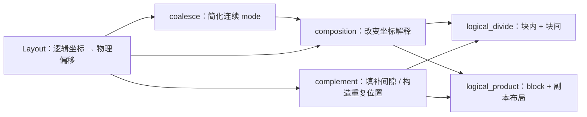

# CuTe Layout Algebra：复合、补集、分块与平铺

CuTe 把 `Layout` 看作**从逻辑坐标到物理偏移的函数**。设布局为 $L$，则可以把一次访问写成 $L(c)$：输入逻辑坐标 $c$，得到对应的内存偏移。

这套布局代数围绕三个基本动作展开：

- **复合（composition）**：改变“如何解释坐标”，即把一个布局作为另一个布局的输入。
- **补集（complement）**：构造能填补布局间隙、或描述布局重复位置的布局。
- **乘积与除法（product / divide）**：用复合和补集把布局扩展成规则的平铺，或拆成块内与块间坐标。

在进入细节前，先约定本文记法：`(s0, s1) : (d0, d1)` 表示 Shape 为 `(s0, s1)`、Stride 为 `(d0, d1)` 的 `Layout`；`_8` 是 CuTe 的编译期整数 `Int<8>`。本文所有接口以当前 CUTLASS 的 `include/cute/layout.hpp` 为准。

| 操作 | 解决的问题 | 常见用途 |
| --- | --- | --- |
| `coalesce` | 在不改变一维线性映射的前提下简化布局 | 消除 size-1 mode、暴露连续区间 |
| `composition` | 按新坐标规则访问旧布局 | reshape、采样、swizzle、分区 |
| `complement` | 找到可填补间隙或承载重复的坐标布局 | `logical_divide`、`logical_product` |
| `logical_divide` | 拆出块内坐标与块间坐标 | tensor tiling、线程块分区 |
| `logical_product` | 在 tiler 指定的位置复制一个块 | 构建块布局、线程/数据分布 |

## `coalesce`：合并连续 mode

**用途**

`coalesce` 将可合并的相邻 mode 合成更少的 mode。它不改变线性坐标 $i \in [0, \mathrm{size}(L))$ 的映射结果，因此是一个**表示形式的简化**，不是数据重排。

**原型**

```cpp
template <class Shape, class Stride>
CUTE_HOST_DEVICE constexpr auto
coalesce(Layout<Shape, Stride> const& layout);

template <class Shape, class Stride, class IntTuple>
CUTE_HOST_DEVICE constexpr auto
coalesce(Layout<Shape, Stride> const& layout,
         IntTuple const& trg_profile);
```

**源码确认的不变量**

| 性质 | 含义 |
| --- | --- |
| `size(result) == size(layout)` | 逻辑元素总数不变。 |
| `depth(result) <= 1` | 不带 profile 时，结果尽量打平。 |
| `result(i) == layout(i)` | 对任意合法的一维线性坐标，物理偏移完全相同。 |

例如，下面的嵌套布局中，第二个叶子 mode 的 Shape 是静态 `1`，其坐标恒为 `0`；剩余的 `2:1` 和 `6:2` 又在物理地址上连续：

```cpp
auto layout = Layout<Shape<_2, Shape<_1, _6>>,
                     Stride<_1, Stride<_6, _2>>>{};

auto result = coalesce(layout);  // _12:_1
```

### 合并规则

将布局的 Shape 和 Stride 展平后，`coalesce` 从相邻 mode 中归约。对 $s_0:d_0$ 与 $s_1:d_1$，可用下面四条规则理解。

| 条件 | 结果 | 原因 |
| --- | --- | --- |
| $s_1 = 1$ | $s_0:d_0$ | 右侧坐标恒为 `0`。 |
| $s_0 = 1$ | $s_1:d_1$ | 左侧坐标恒为 `0`。 |
| $d_1 = s_0 d_0$ | $(s_0s_1):d_0$ | 两个 mode 的物理地址无缝相接。 |
| 其他情况 | `(s0, s1):(d0, d1)` | 存在空洞、重叠或无法证明连续，不能合并。 |

#### 连续时为何能合并

布局 `(2, 4) : (1, 2)` 的地址序列是连续的：

- mode 0 的地址是 `0, 1`，覆盖跨度为 $2 \times 1 = 2$。
- mode 1 的 Stride 恰为 `2`，每次从前一个 mode 覆盖区域之后开始。
- 展平的地址依次为 `0, 1, 2, 3, 4, 5, 6, 7`。

因此 `(2, 4) : (1, 2)` 与 `8 : 1` 对一维坐标的映射相同，`coalesce` 可以返回 `8 : 1`。

相反，`(2, 4) : (1, 8)` 的地址为 `0, 1, 8, 9, 16, 17, 24, 25`。第二个 mode 的 Stride `8` 大于前一 mode 的覆盖跨度 `2`，中间有空洞，所以它必须保留为两个 mode。

#### size-1 mode 为什么可以消失

对 `(1, 8) : (100, 1)`，第一个坐标唯一可能是 `0`，其地址贡献始终为 $0 \times 100 = 0$。因此它和 `8 : 1` 等价。

这里要区分**数学上大小为 1**与**类型系统可静态消除的大小为 1**：当前实现可在编译期已知时激进合并；动态 Shape/Stride 为了保留类型与运行时信息，输出的嵌套形式可能更保守。

### 用 `trg_profile` 控制合并边界

第二个重载会在 `trg_profile` 的叶子处调用基础 `coalesce`。因此 profile 的**元组结构**决定“在哪些边界内合并”，叶子上写的具体整数不重要。

```cpp
auto a = Layout<Shape<_2, Shape<_3, _2>>,
                Stride<_1, Stride<_2, _6>>>{};
// a 的逻辑形状为 (2, (3, 2))，物理地址连续。
```

| 调用 | 结果 | 说明 |
| --- | --- | --- |
| `coalesce(a)` | `_12:_1` | 忽略原始结构，全部合并。 |
| `coalesce(a, Step<_1, _1>{})` | `(_2, _6):(_1, _2)` | 保留顶层 rank-2；第二个子树内部由 `(3, 2)` 合并为 `6`。 |
| `coalesce(a, Step<_1, _1, _1>{})` | `(_2, _3, _2):(_1, _2, _6)` | 指定三个叶子，嵌套被打平为 rank-3。 |
| `coalesce(a, Step<_1, Step<_1, _1>>{})` | `(_2, (_3, _2)):(_1, (_2, _6))` | profile 与原嵌套结构对应，因此保留该结构。 |

第一种按 mode 合并可写成：

```cpp
auto result = coalesce(a, Step<_1, _1>{});

auto same_result = make_layout(
    coalesce(layout<0>(a)),
    coalesce(layout<1>(a)));
```

`_1` 在这里并不是“要求保留大小 1”：实现只通过 `is_tuple<T>::value` 判断是否继续递归。任何非元组叶子都表示“在此处执行基础合并”；因此 `Step<42, 99>` 的结构效果相同，但 `_1` 更符合 CuTe 的惯例。

## `composition`：布局作为函数复合

**用途**

`composition(A, B)` 构造“先按 $B$ 解释逻辑坐标，再按 $A$ 找到物理位置”的布局。它是 reshape、采样、swizzle 和后续 tiling 操作的基础。

**原型**

```cpp
template <class LShape, class LStride,
          class RShape, class RStride>
CUTE_HOST_DEVICE constexpr auto
composition(Layout<LShape, LStride> const& lhs,
            Layout<RShape, RStride> const& rhs);

template <class LShape, class LStride, class Tiler>
CUTE_HOST_DEVICE constexpr auto
composition(Layout<LShape, LStride> const& lhs,
            Tiler const& rhs);
```

**数学定义**

$$
R := A \circ B, \qquad R(c) = A(B(c)).
$$

- $A$ 是已有布局：它把 $A$ 的逻辑坐标映射为物理偏移。
- $B$ 是新的坐标解释方式：它把 $R$ 的逻辑坐标映射为 $A$ 的逻辑坐标。
- $R$ 的定义域兼容 $B$。CuTe 单元测试验证 `compatible(B, R)`，并逐一验证 `R(c) == A(B(c))`。

| 场景 | `A` 的角色 | `B` 的角色 | `A ∘ B` 的含义 |
| --- | --- | --- | --- |
| reshape | 原始一维存储 | 新的二维坐标 | 将向量按矩阵视角解释。 |
| tile / partition | 完整张量布局 | 块内坐标或线程坐标 | 得到该坐标集合对应的物理位置。 |
| swizzle | 共享内存地址布局 | XOR 等变换 | 将逻辑顺序映射到错开的物理地址，以缓解 bank conflict（bank 冲突）。 |

### 从一维坐标理解复合

令

$$
A = (6, 2):(8, 2), \qquad B = (4, 3):(3, 1).
$$

将 `B` 当作一维函数时：`B(0)=0`、`B(1)=3`、`B(2)=6`。因此：

- $R(0)=A(B(0))=A(0)=0$。
- $R(1)=A(B(1))=A(3)=24$。`3` 被拆为 `(3, 0)`，所以偏移是 $3\times8+0\times2$。
- $R(2)=A(B(2))=A(6)=2$。`6` 被拆为 `(0, 1)`，所以偏移是 $0\times8+1\times2$。

最终可写为：

$$
R = ((2, 2), 3):((24, 2), 8).
$$


图中展示了 $A$ 与 $R$ 的二维视图；即使坐标的嵌套形状改变，`R(c)=A(B(c))` 仍是判断结果正确与否的唯一标准。

### 源码中的计算思路

对于 `Layout` 与 `Layout` 的复合，源码先按 `rhs` 的 profile 对 `lhs` 调用内部 `coalesce_x`，再进入 `composition_impl`。可将它理解为三步：

1. 将 $B$ 拆为其子布局连接：$B=(B_0,B_1,\ldots)$。
2. 对可接受的布局，利用左分配：$A\circ B=(A\circ B_0,A\circ B_1,\ldots)$。
3. 将每个叶子问题化为 $A\circ(s:d)$：先按 $d$ 选取，再取前 $s$ 个坐标。

若 $A=a:b$ 是一维布局，则最简单：

$$
(a:b) \circ (s:d) = s:(b d).
$$

若 $A$ 有多个 mode，源码要求中间形状满足可除性条件；静态整数不满足时会触发 `CUTE_STATIC_ASSERT`。对动态值，源码不会额外插入运行时断言，因此调用者应保证分块关系合法。

#### “除掉” Stride：确定采样间距

为解释多 mode 情形，记

$$
A=(s_0,s_1,\ldots):(d_0,d_1,\ldots).
$$

计算 $A / D$ 时，从低 mode 到高 mode 消耗采样间隔 $D$。在当前剩余除数 $D_i$ 下：

$$
s'_i=\max\left(1,\frac{s_i}{\min(s_i,D_i)}\right),\qquad
d'_i=\min(s_i,D_i)d_i,
$$

$$
D_{i+1}=\max\left(1,\frac{D_i}{s_i}\right).
$$

这描述的是算法直觉：每消耗一个 mode，采样步幅便乘上该 mode 已跨过的逻辑范围。为了得到整数 Shape，相关整除必须成立。

例如，对 $(3,6,2,8):(w,x,y,z)$ 除以 $9$：

| mode | 当前除数 | 新 Shape | 新 Stride | 传递给下一 mode |
| --- | --- | --- | --- | --- |
| `0`：`3:w` | `9` | `1` | `3w` | `3` |
| `1`：`6:x` | `3` | `2` | `3x` | `1` |
| `2`：`2:y` | `1` | `2` | `y` | `1` |
| `3`：`8:z` | `1` | `8` | `z` | `1` |

所以：

$$
(3,6,2,8):(w,x,y,z) / 9 = (1,2,2,8):(3w,3x,y,z).
$$

这也解释了常见的 Shape 例子：

| 原 Shape | 除数 | 结果 Shape |
| --- | --- | --- |
| `(6, 2)` | `2` | `(3, 2)` |
| `(6, 2)` | `3` | `(2, 2)` |
| `(6, 2)` | `6` | `(1, 2)` |
| `(6, 2)` | `12` | `(1, 1)` |
| `(3, 6, 2, 8)` | `3` | `(1, 6, 2, 8)` |
| `(3, 6, 2, 8)` | `6` | `(1, 3, 2, 8)` |
| `(3, 6, 2, 8)` | `9` | `(1, 2, 2, 8)` |
| `(3, 6, 2, 8)` | `72` | `(1, 1, 1, 4)` |

#### “取模” Shape：限制输出数量

在完成间距选择后，$A \bmod S$ 保留前 $S$ 个逻辑位置。当前剩余配额为 $S_i$ 时：

$$
s'_i=\min(s_i,S_i), \qquad d'_i=d_i, \qquad
S_{i+1}=\max\left(1,\frac{S_i}{s'_i}\right).
$$

它不改变 Stride，只截断可用逻辑范围。例如：

| 原 Shape | 配额 | 结果 Shape |
| --- | --- | --- |
| `(6, 2)` | `2` | `(2, 1)` |
| `(6, 2)` | `3` | `(3, 1)` |
| `(6, 2)` | `6` | `(6, 1)` |
| `(6, 2)` | `12` | `(6, 2)` |
| `(3, 6, 2, 8)` | `6` | `(3, 2, 1, 1)` |
| `(3, 6, 2, 8)` | `9` | `(3, 3, 1, 1)` |
| `(1, 2, 2, 8)` | `2` | `(1, 2, 1, 1)` |
| `(1, 2, 2, 8)` | `16` | `(1, 2, 2, 4)` |

因此，对叶子布局 $s:d$，可以把复合记成“先除掉 Stride、再按 Shape 截断”：

$$
A\circ(s:d) = (A / d) \bmod s.
$$

例如：

$$
(3,6,2,8):(w,x,y,z) \circ 16:9
= (1,2,2,4):(9w,3x,y,z).
$$

其中先除以 `9` 得到 `(1,2,2,8):(9w,3x,y,z)`，再保留 `16` 个逻辑元素，最后一个 mode 从 `8` 截断为 `4`。

### 三个复合示例

#### 示例一：分解多 mode 的右操作数

目标：

$$
(6,2):(8,2) \circ (4,3):(3,1).
$$

将右操作数拆为 `4:3` 与 `3:1`：

$$
A\circ B=(A\circ4:3,\ A\circ3:1).
$$

- 对 `4:3`：`/ 3` 得到 `(2,2):(24,2)`；其 size 恰为 `4`，再 `% 4` 不变。
- 对 `3:1`：`/ 1` 不变；`% 3` 得到 `(3,1):(8,2)`。
- 连接后为 `((2,2),(3,1)):((24,2),(8,2))`；再按可合并 mode 简化，得到：

$$
((2,2),3):((24,2),8).
$$

#### 示例二：将步长为 2 的向量视为矩阵

目标：

$$
20:2 \circ (5,4):(4,1).
$$

`(5,4):(4,1)` 可拆为 `5:4` 与 `4:1`：

$$
\begin{aligned}
20:2\circ5:4 &= 5:8,\\
20:2\circ4:1 &= 4:2.
\end{aligned}
$$

连接后：

$$
20:2 \circ (5,4):(4,1) = (5,4):(8,2).
$$

这表示物理间隔为 2 的 20 个元素，按“5 行、每行 4 个元素”的逻辑矩阵来解释。

#### 示例三：列优先视角下的矩阵重塑

目标：

$$
(10,2):(16,4) \circ (5,4):(1,5).
$$

右操作数的两个叶子为 `5:1` 与 `4:5`：

- `A ∘ 5:1`：`/1` 不变，`%5` 得到 `(5,1):(16,4)`。
- `A ∘ 4:5`：`/5` 得到 `(2,2):(80,4)`，`%4` 后不变。

连接并消去 size-1 mode：

$$
(5,(2,2)):(16,(80,4)).
$$

使用静态整数时，CuTe 可把静态 size-1 mode 简化掉；动态整数时，结果通常保留它们以维持类型结构：

```cpp
#include <cute/tensor.hpp>

using namespace cute;

auto static_a = make_layout(make_shape(Int<10>{}, Int<2>{}),
                            make_stride(Int<16>{}, Int<4>{}));
auto static_b = make_layout(make_shape(Int<5>{}, Int<4>{}),
                            make_stride(Int<1>{}, Int<5>{}));
auto static_c = composition(static_a, static_b);
// (_5, (_2, _2)) : (_16, (_80, _4))

auto dynamic_a = make_layout(make_shape(10, 2), make_stride(16, 4));
auto dynamic_b = make_layout(make_shape(5, 4), make_stride(1, 5));
auto dynamic_c = composition(dynamic_a, dynamic_b);
// ((5, 1), (2, 2)) : ((16, 4), (80, 4))
```

### 按 mode 复合：`Tiler`

当 `rhs` 是一个 Layout 元组、Shape 或 Tiler 时，`composition` 会递归地在对应 mode 上操作；当叶子是一个 `Layout` 时，才执行前面的函数复合。它适合“保持 M/N 等维度语义，只在每个维度内取子布局”的场景。

```cpp
auto a = make_layout(make_shape(12, make_shape(4, 8)),
                     make_stride(59, make_stride(13, 1)));

auto tiler = make_tile(Layout<_3, _4>{},  // mode 0：3:4
                       Layout<_8, _2>{}); // mode 1：8:2

auto result = composition(a, tiler);
// (_3, (_2, _4)) : (_236, (_26, _1))

auto same_result = make_layout(
    composition(layout<0>(a), get<0>(tiler)),
    composition(layout<1>(a), get<1>(tiler)));
```


这个 `Tiler` 选择第 `0, 4, 8` 个 mode-0 坐标，以及第 `0, 2, 4, …, 14` 个 mode-1 坐标；结果仍有 $3\times8$ 个逻辑位置，但这些位置在原 $12\times32$ 逻辑网格中是稀疏的。

Shape 也可直接充当 Tiler，此时每个叶子相当于 Stride 为 `1` 的 Layout：

```cpp
auto shape_tiler = make_shape(Int<3>{}, Int<8>{});
auto contiguous_result = composition(a, shape_tiler);
// 等价于 <3:1, 8:1>
// (_3, (_4, _2)) : (_59, (_13, _1))
```


| 维度 | 普通 `composition(A, B)` | 按 mode 的 `composition(A, tiler)` |
| --- | --- | --- |
| 逻辑视角 | 将 $A$ 线性化后按 $B$ 重新解释 | 保持 $A$ 的 mode 语义，在每个 mode 内采样 |
| 结果 Shape | 兼容 $B$ 的 Shape | 对应保留被 tiler 命中的 mode |
| 典型用途 | reshape、任意重排、MMA 寄存器分区 | 全局矩阵切 tile、线程块分区 |

在 CUDA 实现中，前者常用于让数据布局适配 MMA 指令所需的线程—值映射；后者常用于从大张量中取得某个 CTA 的子块。

## `complement`：填补间隙并描述重复位置

**用途**

`complement` 不直接返回“集合论意义上的所有未访问地址”。它构造一个有序 Layout，使其与原布局组合后覆盖指定的 `cotarget`，并且可作为后续平铺或分块的另一个坐标 mode。

**原型**

```cpp
template <class Shape, class Stride, class CoTarget>
CUTE_HOST_DEVICE constexpr auto
complement(Layout<Shape, Stride> const& layout,
           CoTarget const& cotarget);

template <class Shape, class Stride>
CUTE_HOST_DEVICE constexpr auto
complement(Layout<Shape, Stride> const& layout);
```

第二个重载以 `cosize(filter(layout))` 为目标。第一个重载中，`cotarget` 可以是一个整数，也可以是 Shape；若使用静态 Shape，例如 `make_shape(_4{}, _7{})`，可以向编译器保留“总大小为 28 且可按 4 分解”的信息。

**源码测试中的契约**

令 $R=\mathrm{complement}(A,T)$，并令 `completed = make_layout(A, R)`：

| 性质 | 含义 |
| --- | --- |
| `cosize(completed) >= size(T)` | 原布局与补集组合后至少覆盖目标共域。 |
| `cosize(R) <= round_up(size(T), cosize(A))` | 补集共域不会无界增长。 |
| `R(i - 1) < R(i)` | 补集产生的物理偏移严格递增。 |
| `R(i) != A(j)` | 补集的偏移与原布局的偏移不重叠。 |

`complement` 会先 `filter(layout)`，去除零 Stride 与 size-1 等不适合“填坑”计算的 mode。静态多 mode Stride 最容易得到精确的结构化结果；当前实现对动态 Stride 的多 mode 补集有限制。

### `cosize`：物理共域的大小

`size` 是逻辑元素数，`cosize` 则描述需要容纳最大物理偏移的连续地址空间大小。对一维布局：

$$
\mathrm{cosize}(S:D)=(S-1)D+1.
$$

对已展平、正 Stride 且地址不重叠的常见布局：

$$
\mathrm{cosize}((s_0,\ldots,s_{n-1}):(d_0,\ldots,d_{n-1}))
=\sum_i(s_i-1)d_i+1.
$$

例如，`B = (2, 4) : (1, 8)` 有：

$$
\mathrm{cosize}(B)=(2-1)\times1+(4-1)\times8+1=26.
$$

它只含 `8` 个逻辑元素，却可能访问到偏移 `25`，因此需要大小为 `26` 的物理地址范围。遇到零 Stride、重叠或负 Stride 时，不应自行套用这条简化公式，应交给 CuTe 的 `cosize` 实现判断。

### 补集示例

以下示例使用静态整数，便于观察得到的布局结构。

| 调用 | 结果 | `(A, A*)` 如何覆盖目标 |
| --- | --- | --- |
| `complement(4:1, 24)` | `6:4` | `(4, 6):(1, 4)` 覆盖 24 个连续位置。 |
| `complement(6:4, 24)` | `4:1` | `6:4` 留出的间隙由 `4:1` 填充。 |
| `complement((4, 6):(1, 4), 24)` | `1:0` | 原布局已经连续覆盖目标，不需要新的变化坐标。 |
| `complement(4:2, 24)` | `(2, 3):(1, 8)` | `2:1` 先补内层空洞，`3:8` 再将完整单元重复 3 次。 |
| `complement((2, 4):(1, 6), 24)` | `3:2` | 组合布局的共域达到 24，且映射唯一。 |
| `complement((2, 2):(1, 6), 24)` | `(3, 2):(2, 12)` | 先填内部间隔，再向外复制，组合后覆盖 24。 |


最后一行可以直观看成两层工作：`3:2` 填入原布局中较小的地址空隙，`2:12` 将已经填满的单元扩展到目标共域。

### 从源码理解“填坑”算法

源码会在过滤后的 mode 中反复找最小 Stride，并从小到大构造结果。它不是枚举每个地址，而是利用 radix（进位）连续性计算结构化的 Shape/Stride：

1. **寻找首个断裂点**：若已连续覆盖的跨度为 $C$，下一个最小 Stride 为 $d$，当 $C=d$ 时可无缝衔接；当 $C<d$ 时，二者之间存在空洞。
2. **内部补全**：断裂处需要一个 Shape $d/C$、Stride $C$ 的 mode，把地址范围填到下一个 Stride 的起点。
3. **外部平铺**：内部连续区域形成后，再以该区域大小为 Stride 增加 mode，直到 `cotarget` 被覆盖。

例如 `4:2` 的连续覆盖单元大小为 `2`，下一个完整重复单元从 `8` 开始：补集先产生 `2:1` 填 `1,3,5,7` 之间的相对位置，再以 `3:8` 平铺，得到 `(2,3):(1,8)`。

## `logical_divide`：把布局拆成块内与块间坐标

**用途**

`logical_divide(A, B)` 用 tiler `B` 将布局 `A` 划分为两类 mode：第一类描述**一个 tile 内部**，第二类描述**tile 之间**如何移动。它是 tensor tiling 与 partitioning 的基础。

**原型**

```cpp
template <class LShape, class LStride,
          class TShape, class TStride>
CUTE_HOST_DEVICE constexpr auto
logical_divide(Layout<LShape, LStride> const& layout,
               Layout<TShape, TStride> const& tiler);

template <class LShape, class LStride, class Tiler>
CUTE_HOST_DEVICE constexpr auto
zipped_divide(Layout<LShape, LStride> const& layout,
              Tiler const& tiler);
```

**定义与源码实现**

$$
A \oslash B = A \circ (B, B^*).
$$

对应的核心实现是：

```cpp
return composition(
    layout,
    make_layout(tiler, complement(tiler, shape(coalesce(layout)))));
```

注意 `complement` 的目标是 `shape(coalesce(layout))`，而不是被手写为一个裸 `size(layout)`：这样既表达了线性总大小，也尽可能保留静态 Shape 信息。若 `tiler` 是元组或 Shape，函数会递归地对各个对应 mode 做 `logical_divide`；`_` 则表示该 mode 不变。

### 一维示例

令：

$$
A=(4,2,3):(2,1,8), \qquad B=4:2.
$$

`A` 逻辑上有 24 个元素。计算过程为：

1. `B* = complement(4:2, 24) = (2, 3):(1, 8)`。
2. 连接为 `(B, B*) = (4, (2, 3)) : (2, (1, 8))`。
3. 与 `A` 复合，得到：

$$
((2,2),(2,3)):((4,1),(2,8)).
$$


结果的第一个 mode 是块内坐标，第二个 mode 表示在六个同构块之间的移动。它不是仅“取出第一个块”，而是同时给出整组块的地址规律。

### 二维示例

令：

$$
A=(9,(4,8)):(59,(13,1)).
$$

对第一个 mode 使用 `3:3`，对第二个 mode 使用 `(2,4):(1,8)`，即：

$$
B=\langle 3:3,\ (2,4):(1,8)\rangle.
$$


这里共有 12 个 tile。每个原始维度都会拆成“块内 mode”和“剩余 mode”；把所有块内 mode 组合起来，得到：

$$
(3,(2,4)):(177,(13,2)).
$$

它恰好等于 `composition(A, B)`。差别在于：`composition` 只给出一个 tile 的访问布局，而 `logical_divide` 还保留了遍历全部 tile 的其余 mode。

### `zipped_divide`、`tiled_divide` 与 `flat_divide`

这三个接口都先执行 `logical_divide`，再重排 mode，方便选择 tile 与 tile 编号。若原 Shape 是 `(M, N, L, ...)`，Tiler 是 `<TileM, TileN>`：

| 操作 | 结果 mode 结构 | 使用方式 |
| --- | --- | --- |
| `logical_divide` | `((TileM, RestM), (TileN, RestN), L, ...)` | 保留每个原始 mode 的语义。 |
| `zipped_divide` | `((TileM, TileN), (RestM, RestN, L, ...))` | mode 0 是完整 tile，mode 1 是 tile 网格。 |
| `tiled_divide` | `((TileM, TileN), RestM, RestN, L, ...)` | 保持 tile 整体，展开块间 mode。 |
| `flat_divide` | `(TileM, TileN, RestM, RestN, L, ...)` | 将两类 mode 都完全展开。 |

```cpp
auto layout_a = make_layout(
    make_shape(Int<9>{}, make_shape(Int<4>{}, Int<8>{})),
    make_stride(Int<59>{}, make_stride(Int<13>{}, Int<1>{})));

auto tiler = make_tile(
    Layout<_3, _3>{},
    Layout<Shape<_2, _4>, Stride<_1, _8>>{});

auto logical = logical_divide(layout_a, tiler);
auto zipped  = zipped_divide(layout_a, tiler);

// layout<0>(zipped) 是块内布局，也满足：
// layout<0>(zipped_divide(layout_a, tiler)) == composition(layout_a, tiler)
```

对 `zipped`，第 `k` 个 tile 的首地址可写成 `zipped(0, k)`；二维 tile 网格中 `(i, j)` 的首地址则是 `zipped(0, make_coord(i, j))`。


图中的“行/列”不再代表原张量的 M/N 维，而分别代表 tile 间与 tile 内的坐标空间；这正是 `zipped_divide` 为方便 tile 索引所做的语义重组。

## `logical_product`：在 tiler 上复制 block

**用途**

`logical_product(block, tiler)` 将 `block` 作为第一个 mode 原样保留，并利用 `tiler` 指定的逻辑顺序构造第二个 mode，使 `tiler` 的每个元素对应一个不冲突的 block 副本。

**原型**

```cpp
template <class LShape, class LStride,
          class TShape, class TStride>
CUTE_HOST_DEVICE constexpr auto
logical_product(Layout<LShape, LStride> const& block,
                Layout<TShape, TStride> const& tiler);

template <class TShape, class TStride,
          class UShape, class UStride>
CUTE_HOST_DEVICE constexpr auto
blocked_product(Layout<TShape, TStride> const& block,
                Layout<UShape, UStride> const& tiler);
```

**定义与约束**

$$
A\otimes B=(A, A^*\circ B).
$$

源码实现中的补集目标为 `size(block) * cosize(tiler)`：

```cpp
return make_layout(
    block,
    composition(complement(block, size(block) * cosize(tiler)), tiler));
```

由此可得到两个重要接口契约：

- 结果固定是 rank-2。
- `layout<0>(result) == block`，并且 `layout<1>(result)` 与 `tiler` 兼容。

### 一维示例

令：

$$
A=(2,2):(4,1), \qquad B=6:1.
$$

这表示将 4 元素 block 复制六次。计算为：

1. $A^*=\mathrm{complement}(A, 6\times4)=(2,3):(2,8)$。
2. $A^*\circ B=(2,3):(2,8)$。
3. 连接得到：

$$
((2,2),(2,3)):((4,1),(2,8)).
$$


改变 `B` 会同时改变副本数量和副本顺序。例如将 $B$ 改为 `(4,2):(2,1)`，会产生八个副本，且块的遍历顺序不同。


### 二维 product 与 rank-sensitive product

也可以把 `logical_product` 按 mode 应用于二维 block 与二维 Tiler；结果可表达“一个 $2\times5$ 行优先 block，按 $3\times4$ 列优先网格平铺”。不过直接构造这种 Tiler 往往依赖于 block 的具体 Shape/Stride，不够直观。


`blocked_product` 与 `raked_product` 是更常用的 rank-sensitive（秩敏感）接口。它们先将两个布局补齐到相同 top-level rank，计算 `logical_product`，再以不同的顺序 `zip` 对应 mode。

| 接口 | mode 重新关联方式 | 结果直觉 |
| --- | --- | --- |
| `blocked_product(A, B)` | `zip(get<0>(result), get<1>(result))` | 每个 block 保持成连续的块状区域。 |
| `raked_product(A, B)` | `zip(get<1>(result), get<0>(result))` | 先走 tile 网格的对应 mode，再走 block 的对应 mode，副本彼此交错。 |


`blocked_product` 的参数表达“block 是什么、tiler 如何排列”即可；源码的 `zip` 还会给出按 mode 对应的紧凑布局，适合普通块状平铺。


`raked_product` 将顺序反转，因此 block 元素在不同副本之间交错；这类分布在其他文献中也常被称为 cyclic distribution（循环分布）。

### product 的 mode 排列变体

对于 Shape 为 `(M, N, ...)` 的 block 和 `<TileM, TileN>` 的 tiler：

| 变体 | 结果 mode 结构 | 语义 |
| --- | --- | --- |
| `logical_product` | `((M, TileM), (N, TileN), ...)` | 每个原始 mode 与其平铺 mode 配对。 |
| `zipped_product` | `((M, N), (TileM, TileN, ...))` | mode 0 是完整 block，mode 1 是全部副本的布局。 |
| `tiled_product` | `((M, N), TileM, TileN, ...)` | 保持 block 整体，展开平铺 mode。 |
| `flat_product` | `(M, N, TileM, TileN, ...)` | 全部 mode 展开到顶层。 |

选择哪种接口取决于下一步如何索引：需要“块内坐标 + 块编号”时通常选 `zipped_product`；需要按原 M/N 维继续组合时选 `logical_product` 或 `blocked_product`；需要与其他扁平布局拼接时才考虑 `flat_product`。

## 复习：一条可组合的推理链

下面的关系串起了本文所有操作：



- `coalesce` 的核心是不改变 $L(i)$，只让布局更易推理。
- `composition` 的核心是不改变函数复合定义：始终用 $R(c)=A(B(c))$ 检查。
- `complement` 提供另一个有序且不重叠的坐标 mode，使“一个 tile”能够扩展为“所有 tile”。
- `logical_divide` 与 `logical_product` 都是由 `composition`、`complement` 和 `make_layout` 组合出来的高层接口；理解它们的 mode 结构，比死记输出 Shape 更可靠。
