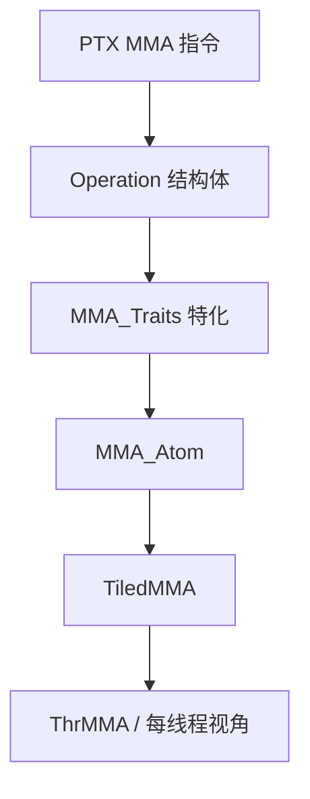
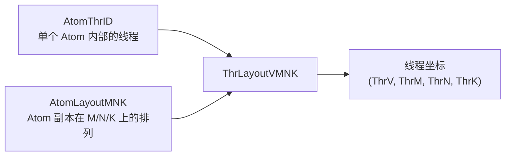
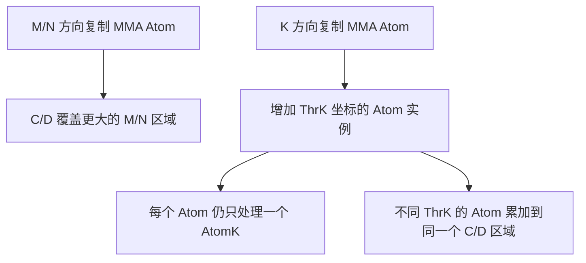
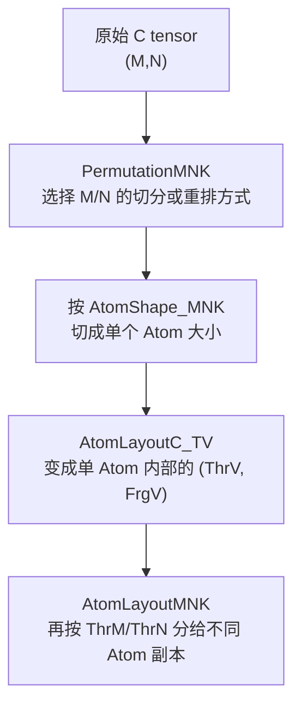

# CuTe MMA Atom

这篇笔记整理 CuTe 如何支持 GPU 的 **MMA（Matrix Multiply-Accumulate，矩阵乘累加）** 硬件指令。

MMA 指令是架构相关的：Volta、Ampere、Hopper、Blackwell 都有不同粒度、不同输入形式的 Tensor Core 指令。CuTe 的目标不是把这些差异藏起来，而是用一组 C++ 类型把它们描述清楚，让上层 GEMM 代码可以用统一的 `Tensor`、`Layout` 和 `TiledMMA` 去组织计算。

本文主要参考：

- 官方文档：<https://docs.nvidia.com/cutlass/latest/media/docs/cpp/cute/0t_mma_atom.html>
- 源码：`include/cute/arch/mma_sm70.hpp`
- 源码：`include/cute/arch/mma_sm80.hpp`
- 源码：`include/cute/arch/mma_sm89.hpp`
- 源码：`include/cute/atom/mma_traits_sm70.hpp`
- 源码：`include/cute/atom/mma_traits_sm80.hpp`
- 源码：`include/cute/atom/mma_traits_sm89.hpp`
- 源码：`include/cute/atom/mma_traits_sm90_gmma.hpp`
- 源码：`include/cute/atom/mma_atom.hpp`

图片先预留在这个目录下：

```text
public/blog-assets/gpu-programming/cute-mma-atom/
```

后面可以把官方图或自己画的图放进去，再替换成真实图片。

## 总体模型

CuTe 对 MMA 的抽象可以拆成四层：



- **Operation 结构体**：直接封装某条 PTX MMA 指令，负责寄存器参数和 `fma` 调用。
- **`MMA_Traits` 特化**：描述这条指令的逻辑类型、逻辑形状、线程映射和数据映射。
- **`MMA_Atom`**：把 Operation 和 Traits 合在一起，提供 `call` 和 fragment 构造接口。
- **`TiledMMA`**：把一个或多个 Atom 组合成更大的 tiled MMA，负责线程复制、数据分块和每线程切片。

如果只看 PTX 指令，信息是不够的：它只告诉你要传哪些寄存器。CuTe 真正补上的，是“这些寄存器分别对应矩阵里的哪个逻辑坐标”。

## Operation 结构体

**用途**

Operation 结构体封装一条具体的 PTX MMA 指令。它尽量不依赖 CuTe 的 `Tensor`、`Layout` 或复杂数值类型，只描述这条指令的**物理寄存器接口**。

**源码位置**

```text
include/cute/arch/mma_sm70.hpp
include/cute/arch/mma_sm80.hpp
include/cute/arch/mma_sm90_gmma.hpp
```

### 命名方式

以 `SM70_8x8x4_F32F16F16F32_NT` 为例：

| 片段 | 含义 |
| --- | --- |
| `SM70` | 最早支持该指令的 GPU 架构，这里是 Volta。 |
| `8x8x4` | 单条 MMA 的逻辑形状，表示 $M=8, N=8, K=4$。 |
| `F32F16F16F32` | 可以按 `D/A/B/C` 理解：输出 D 是 `float`，A/B 是 `half`，输入累加器 C 是 `float`。 |
| `NT` | CuTe Operation 后缀，描述这条 PTX MMA 指令要求的 A/B fragment 布局。对这个 Operation，PTX 指令里是 `.col.row`。 |

### `T/N` 后缀怎么理解

这里的 `T/N` 确实来自比较传统的 BLAS / GEMM 命名习惯，但要注意：**BLAS 默认按 column-major（列主序）理解矩阵**。所以 `N` 和 `T` 不是直接等价于 PTX 里的 `.row/.col`，中间还隔着一层 column-major 语境。

先看 BLAS 语义：

| 标志 | BLAS 语义 | 在 column-major 基础上的直观效果 | PTX fragment 视角 |
| --- | --- | --- | --- |
| `N` | No transpose，不转置使用原矩阵。 | 原矩阵仍按列主序解释。 | 更接近 `.col`。 |
| `T` | Transpose，转置后再参与 GEMM。 | 列主序矩阵转置以后，逻辑上变成按行方向连续的视角。 | 更接近 `.row`。 |

因此在 SM80 这类 Operation 名字里：

```text
_TN  ->  A 使用 T 视角，B 使用 N 视角
     ->  A 对应 row，B 对应 col
     ->  PTX 写成 .row.col
```

这就是为什么 `SM80_16x8x16_F32F16F16F32_TN` 的源码里是：

```cpp
"mma.sync.aligned.m16n8k16.row.col.f32.f16.f16.f32 ..."
```

它不是说 `N` 本身等于 row 或者 `T` 本身等于 col，恰好相反：**在 BLAS 的列主序前提下，`N` 对应 column-major 视角，`T` 对应 row-major 视角**。

所以更稳妥的理解是：

- **Operation 名字里的 `T/N` 保留了 BLAS 风格的 transA/transB 命名**，默认站在 column-major 矩阵的语境里。
- **PTX 里的 `.row/.col` 是底层指令真正看到的 fragment 布局**，例如 `_TN` 最终落到 `.row.col`。
- **它不是现代 C++ 代码里用户输入矩阵的唯一全局布局**。用户可能用 row-major Tensor，也可能用 column-major Tensor；CuTe 会通过上层 `Tensor/Layout/Copy` 把数据整理成 Operation 需要的 fragment。
- 真正可靠的对应关系要看 Operation 里的 PTX 字符串，以及 `MMA_Traits` 里给出的 `ALayout/BLayout`。

以源码里能直接看到的两个例子为准：

| Operation | PTX layout 修饰符 | 指令级含义 |
| --- | --- | --- |
| `SM70_8x8x4_F32F16F16F32_NT` | `.col.row` | A fragment 按 column 形式解释，B fragment 按 row 形式解释。 |
| `SM80_16x8x16_F32F16F16F32_TN` | `.row.col` | A fragment 按 row 形式解释，B fragment 按 column 形式解释。 |

所以可以把 `_TN` 翻译成“BLAS column-major 语境下的 A 转置、B 不转置”，但不要进一步误读成“用户传进来的 A 一定是转置矩阵、B 一定是列主序矩阵”。在 CuTe 里，用户矩阵从全局内存到共享内存、再到寄存器 fragment，中间会经过 `Tensor`、`Layout`、`Copy_Atom`、`TiledCopy` 和 `TiledMMA` 的组织。到了 Operation 这一层，名字最终要落到的是：**这条底层 MMA 指令希望收到什么样的 A/B fragment**。

### `SM70_8x8x4_F32F16F16F32_NT`

**用途**

封装 Volta HMMA 指令 `mma.sync.aligned.m8n8k4.col.row.f32.f16.f16.f32`。

**源码摘录**

```cpp
struct SM70_8x8x4_F32F16F16F32_NT
{
  using DRegisters = float[8];
  using ARegisters = uint32_t[2];
  using BRegisters = uint32_t[2];
  using CRegisters = float[8];

  CUTE_HOST_DEVICE static void
  fma(float& d0, float& d1, float& d2, float& d3,
      float& d4, float& d5, float& d6, float& d7,
      uint32_t const& a0, uint32_t const& a1,
      uint32_t const& b0, uint32_t const& b1,
      float const& c0, float const& c1, float const& c2, float const& c3,
      float const& c4, float const& c5, float const& c6, float const& c7);
};
```

**类型别名**

| 成员 | 类型 | 含义 |
| --- | --- | --- |
| `DRegisters` | `float[8]` | 每个参与线程输出 8 个 `float` 累加结果。 |
| `ARegisters` | `uint32_t[2]` | 每个参与线程向指令传入 2 个 32-bit A 寄存器；每个寄存器可打包两个 F16。 |
| `BRegisters` | `uint32_t[2]` | 每个参与线程向指令传入 2 个 32-bit B 寄存器。 |
| `CRegisters` | `float[8]` | 每个参与线程传入 8 个 `float` 累加器初值。 |

**重要接口**

| 接口 | 含义 |
| --- | --- |
| `fma(...)` | 调用底层 PTX MMA 指令。参数数量和类型直接对应 `D/A/B/C` 寄存器。 |

**副作用 / 约束**

- `fma` 是底层寄存器级接口，调用者必须已经准备好正确的寄存器值。
- 源码中用 `CUTE_ARCH_MMA_SM70_ENABLED` 宏保护 PTX 指令。如果当前编译目标不支持该指令，会进入 `CUTE_INVALID_CONTROL_PATH`。
- Operation 本身不说明 `(thread, value)` 到矩阵坐标的映射，这部分由 `MMA_Traits` 提供。

## `MMA_Traits`

**用途**

`MMA_Traits<Operation>` 是 Operation 的逻辑说明书。它告诉 CuTe：

- 这条 MMA 的 D/A/B/C 逻辑数据类型是什么。
- 单条 MMA 的逻辑形状 `Shape_MNK` 是什么。
- 单条 MMA 内部的逻辑线程如何映射到物理线程。
- 每个线程持有的 value 如何映射到 A、B、C 矩阵坐标。

**源码位置**

```text
include/cute/atom/mma_traits_sm70.hpp
include/cute/atom/mma_traits_sm80.hpp
include/cute/atom/mma_traits_sm89.hpp
include/cute/atom/mma_traits_sm90_gmma.hpp
```

### Volta 公共布局别名

`mma_traits_sm70.hpp` 里先定义了一组布局别名。下面这些是真实源码中的核心形态：

```cpp
using SM70_QuadPair = Layout<Shape <_4, _2>,
                             Stride<_1,_16>>;

using SM70_8x4_Row  = Layout<Shape <_8,_4>,
                             Stride<_1,_8>>;

using SM70_8x4_Col  = Layout<Shape <Shape <_4,_2>,_4>,
                             Stride<Stride<_8,_4>,_1>>;

using SM70_8x8_16b  = Layout<Shape <_8,_8>,
                             Stride<_1,_8>>;

using SM70_8x8_32b  = Layout<Shape <Shape <_2, _2,_2>,Shape <_2,_2, _2>>,
                             Stride<Stride<_1,_16,_4>,Stride<_8,_2,_32>>>;
```

**布局含义**

| 别名 | 含义 |
| --- | --- |
| `SM70_QuadPair` | 把 8 个逻辑线程映射到 warp 内的 quadpair 线程：`0,1,2,3,16,17,18,19`。 |
| `SM70_8x4_Row` | `(T8,V4) -> (M8,K4)`，常用于 row 风格的 A/B 输入映射。 |
| `SM70_8x4_Col` | `(T8,V4) -> (M8,K4)`，常用于 col 风格的 A/B 输入映射。 |
| `SM70_8x8_16b` | `(T8,V8) -> (M8,N8)`，用于 F16 累加器。 |
| `SM70_8x8_32b` | `(T8,V8) -> (M8,N8)`，用于 F32 累加器。 |

这里的 `(T,V)` 不是矩阵坐标，而是 **逻辑线程 ID** 和 **线程内 value ID**。CuTe layout 返回的是线性 index，文档和源码通常用列优先编码把 `(m,n)` 压成 `m + n * M`。

### `MMA_Traits<SM70_8x8x4_F32F16F16F32_NT>`

**用途**

描述 `SM70_8x8x4_F32F16F16F32_NT` 这条 Volta HMMA 指令的逻辑类型、形状和线程 / value 映射。

**源码摘录**

```cpp
template <>
struct MMA_Traits<SM70_8x8x4_F32F16F16F32_NT>
{
  using ValTypeD = float;
  using ValTypeA = half_t;
  using ValTypeB = half_t;
  using ValTypeC = float;

  using Shape_MNK = Shape<_8,_8,_4>;
  using ThrID   = SM70_QuadPair;
  using ALayout = SM70_8x4_Col;
  using BLayout = SM70_8x4_Col;
  using CLayout = SM70_8x8_32b;
};
```

**构造参数 / 成员变量**

这是 traits 特化，没有运行时构造参数，主要通过类型别名表达信息。

| 成员 | 类型 | 含义 |
| --- | --- | --- |
| `ValTypeD` | `float` | D 矩阵逻辑输出类型。 |
| `ValTypeA` | `half_t` | A 矩阵逻辑输入类型。 |
| `ValTypeB` | `half_t` | B 矩阵逻辑输入类型。 |
| `ValTypeC` | `float` | C 矩阵逻辑累加器类型。 |
| `Shape_MNK` | `Shape<_8,_8,_4>` | 单条 MMA 的逻辑形状。 |
| `ThrID` | `SM70_QuadPair` | 8 个逻辑线程到 warp 内物理线程的映射。 |
| `ALayout` | `SM70_8x4_Col` | `(thread,value)` 到 A 矩阵 `(M,K)` 的映射。 |
| `BLayout` | `SM70_8x4_Col` | `(thread,value)` 到 B 矩阵 `(N,K)` 的映射。 |
| `CLayout` | `SM70_8x8_32b` | `(thread,value)` 到 C/D 矩阵 `(M,N)` 的映射。 |

## Volta HMMA：从图到 Layout

Volta 的 HMMA 以 **quadpair（QP）** 为基本协作单元。一个 QP 有 8 个线程，执行一个 $8 \times 8 \times 4$ 的 MMA。一个 warp 有 32 个线程，因此可以看成 4 个 QP。

预留图：


### `ThrID`

官方文档说明，第 0 个 QP 对应 warp 内线程集合：

$$
\{0,1,2,3\} \cup \{16,17,18,19\}
$$

源码中的布局正是：

```cpp
using SM70_QuadPair = Layout<Shape <_4, _2>,
                             Stride<_1,_16>>;
```

这个 layout 把逻辑线程 `0..7` 映射到物理线程：

| 逻辑线程 | 物理线程 |
| --- | --- |
| `0,1,2,3` | `0,1,2,3` |
| `4,5,6,7` | `16,17,18,19` |

所以 `ThrID` 的职责不是“告诉你 warp 有多少线程”，而是告诉 CuTe：**这一条 MMA 内部的逻辑线程 ID 对应 warp 里的哪些 lane**。

### `CLayout`

F32 累加器使用：

```cpp
using SM70_8x8_32b =
  Layout<Shape <Shape <_2, _2,_2>,Shape <_2,_2, _2>>,
         Stride<Stride<_1,_16,_4>,Stride<_8,_2,_32>>>;
```

它表达的是：

```cpp
// (T8,V8) -> (M8,N8)
```

可以分成两部分看：

- `Shape<Shape<_2,_2,_2>, ...>`：把 8 个逻辑线程拆成三个二元子模式。
- `Stride<Stride<_1,_16,_4>, ...>`：描述逻辑线程变化时，映射到 `(m,n)` 编码后的线性 index 如何变化。

文档里对前几个点的解释是：

| 坐标 | 逻辑矩阵坐标 | 列优先编码 |
| --- | --- | --- |
| `(T0,V0)` | `(m,n)=(0,0)` | `0` |
| `(T1,V0)` | `(m,n)=(1,0)` | `1` |
| `(T2,V0)` | `(m,n)=(0,2)` | `16` |
| `(T3,V0)` | `(m,n)=(1,2)` | `17` |
| `(T4,V0)` | `(m,n)=(4,0)` | `4` |

因此，`CLayout` 不是“C 矩阵的内存布局”，而是 **单条 MMA 指令内部，线程和值如何覆盖 C 矩阵逻辑坐标**。

### A / B 输入布局

Volta 的 A/B layout 会随 `TN / NT / NN / TT` 变化。源码里对 F32 累加器的四个变体是：

| Operation | `ALayout` | `BLayout` | `CLayout` |
| --- | --- | --- | --- |
| `SM70_8x8x4_F32F16F16F32_TN` | `SM70_8x4_Row` | `SM70_8x4_Row` | `SM70_8x8_32b` |
| `SM70_8x8x4_F32F16F16F32_NT` | `SM70_8x4_Col` | `SM70_8x4_Col` | `SM70_8x8_32b` |
| `SM70_8x8x4_F32F16F16F32_NN` | `SM70_8x4_Col` | `SM70_8x4_Row` | `SM70_8x8_32b` |
| `SM70_8x8x4_F32F16F16F32_TT` | `SM70_8x4_Row` | `SM70_8x4_Col` | `SM70_8x8_32b` |

预留图：


这里最容易混淆的是：`NT` 不是简单地说“源码里的 ALayout 一定叫 Row 或 Col”。真正可靠的是看 `MMA_Traits` 特化：Operation 名字和 `ALayout/BLayout` 的对应关系以源码为准。

## Ampere MMA

Ampere 的常见 Tensor Core MMA 已经进入 **warp 级别**：一条 `mma.sync.aligned.m16n8k*` 指令由 32 个线程协作完成。和 Volta 的 QP 相比，最直观的变化是：

- Volta 示例里 `ThrID = SM70_QuadPair`，只描述 8 个逻辑线程到 warp 内部分 lane 的映射。
- Ampere 示例里 `ThrID = Layout<_32>`，表示单条 MMA 的逻辑线程就是连续的 32 个 warp lane。

预留图：


### `SM80_16x8x16_F32F16F16F32_TN`

**用途**

封装 Ampere 上的 `mma.sync.aligned.m16n8k16.row.col.f32.f16.f16.f32` 指令。它计算 $16 \times 8 \times 16$ 的 MMA，A/B 是 F16，C/D 是 F32。

**源码摘录**

```cpp
struct SM80_16x8x16_F32F16F16F32_TN
{
  using DRegisters = float[4];
  using ARegisters = uint32_t[4];
  using BRegisters = uint32_t[2];
  using CRegisters = float[4];

  CUTE_HOST_DEVICE static void
  fma(float& d0, float& d1, float& d2, float& d3,
      uint32_t const& a0, uint32_t const& a1,
      uint32_t const& a2, uint32_t const& a3,
      uint32_t const& b0, uint32_t const& b1,
      float const& c0, float const& c1,
      float const& c2, float const& c3);
};
```

这里的 `_TN` 对应源码里的 `.row.col`：

```cpp
asm volatile(
  "mma.sync.aligned.m16n8k16.row.col.f32.f16.f16.f32 "
  "{%0,%1,%2,%3}, {%4,%5,%6,%7}, {%8,%9}, {%10,%11,%12,%13};\n"
  : "=f"(d0), "=f"(d1), "=f"(d2), "=f"(d3)
  : "r"(a0), "r"(a1), "r"(a2), "r"(a3),
    "r"(b0), "r"(b1),
    "f"(c0), "f"(c1), "f"(c2), "f"(c3));
```

这段源码说明了两件事：

- `ARegisters = uint32_t[4]`，所以每个 lane 给 A operand 提供 4 个 32-bit 寄存器。
- `BRegisters = uint32_t[2]`，所以每个 lane 给 B operand 提供 2 个 32-bit 寄存器。
- PTX 后缀是 `.row.col`，也就是这条 SM80 MMA 指令按 row 形式解释 A fragment，按 column 形式解释 B fragment。

### 为什么 SM80 源码里几乎都是 `_TN`

阅读 `include/cute/arch/mma_sm80.hpp` 会发现，常见的 F16、BF16、TF32、INT8、INT4、B1 MMA Operation 基本都命名成 `_TN`，并且对应 PTX 字符串也基本都是 `.row.col`：

```cpp
SM80_16x8x16_F16F16F16F16_TN   -> mma.sync.aligned.m16n8k16.row.col...
SM80_16x8x16_F32F16F16F32_TN   -> mma.sync.aligned.m16n8k16.row.col...
SM80_16x8x8_F32TF32TF32F32_TN  -> mma.sync.aligned.m16n8k8.row.col...
SM80_16x8x32_S32S8S8S32_TN     -> mma.sync.aligned.m16n8k32.row.col...
```

原因不是说 Ampere 只能计算一种用户矩阵布局，而是 **Ampere 的 `mma.sync.aligned.m16n8k*` Operation 层使用了比较统一的指令级 operand 约定**：A 用 row 形式，B 用 column 形式。按前面 BLAS column-major 的命名方式，这正好记作 `_TN`：

```text
A: T -> column-major 矩阵转置后使用 -> row 视角
B: N -> column-major 矩阵不转置使用 -> col 视角
```

至于用户侧想做普通 GEMM、转置 GEMM，或者全局内存里 A/B 是 row-major / column-major，都不应该在 Operation 结构体这一层解决。

CuTe 通常把这些差异放在更上层处理：

- **全局内存 Tensor 的 layout** 决定用户矩阵坐标如何映射到全局地址。
- **共享内存 layout / swizzle** 决定 tile 在 shared memory 里怎么排，避免 bank conflict，同时适配后续 `ldmatrix`。
- **`Copy_Atom` / `TiledCopy`** 决定从 shared memory 到寄存器 fragment 的搬运方式，比如是否使用 `ldmatrix.trans`。
- **`MMA_Traits` / `TiledMMA`** 决定每个 lane 拿到的 fragment 如何对应到 MMA 的 A/B/C 坐标。

也就是说，SM80 这里的 `_TN` 更像一个底层“标准插座”：Tensor Core 指令希望 A/B fragment 以 `.row.col` 方式插进来。不同 GEMM 变体要做的是在前面的布局和搬运阶段把数据整理成这个插座需要的形状，而不是在 `mma_sm80.hpp` 里为每种用户矩阵转置形式都写一套 Operation。

**类型别名**

| 成员 | 类型 | 含义 |
| --- | --- | --- |
| `DRegisters` | `float[4]` | 每个线程输出 4 个 F32 累加结果。 |
| `ARegisters` | `uint32_t[4]` | 每个线程传入 4 个 32-bit A 寄存器。 |
| `BRegisters` | `uint32_t[2]` | 每个线程传入 2 个 32-bit B 寄存器。 |
| `CRegisters` | `float[4]` | 每个线程传入 4 个 F32 累加器。 |

### SM80 公共布局

`mma_traits_sm80.hpp` 中为常见 SM80 MMA 定义了几个 `(thread,value)` 到矩阵坐标的 layout：

```cpp
// (T32,V1) -> (M8,N8)
using SM80_8x4      = Layout<Shape <Shape < _4,_8>,_1>,
                             Stride<Stride< _8,_1>,_0>>;

// (T32,V2) -> (M8,N8)
using SM80_8x8_Row  = Layout<Shape <Shape < _4,_8>,_2>,
                             Stride<Stride<_16,_1>,_8>>;

// (T32,V4) -> (M8,N16)
using SM80_8x16_Row = Layout<Shape <Shape < _4,_8>,_4>,
                             Stride<Stride<_32,_1>,_8>>;

// (T32,V4) -> (M16,N8)
using SM80_16x8_Row = Layout<Shape <Shape < _4,_8>,Shape < _2,_2>>,
                             Stride<Stride<_32,_1>,Stride<_16,_8>>>;
```

这些名字里的 `8x8`、`16x8` 指的是映射覆盖的逻辑矩阵区域。注释里的 `(T32,V4)` 表示 32 个逻辑线程、每线程 4 个 value。

### `MMA_Traits<SM80_16x8x16_F32F16F16F32_TN>`

SM80 的 F32 累加版本直接继承 F16 traits，然后覆盖逻辑 value type：

```cpp
template <>
struct MMA_Traits<SM80_16x8x16_F32F16F16F32_TN>
     : MMA_Traits<SM80_16x8x16_F16F16F16F16_TN>
{
  using ValTypeD = float;
  using ValTypeA = half_t;
  using ValTypeB = half_t;
  using ValTypeC = float;
};
```

被继承的 F16 traits 给出了真正的 shape 和 layout：

```cpp
template <>
struct MMA_Traits<SM80_16x8x16_F16F16F16F16_TN>
{
  using ValTypeD = half_t;
  using ValTypeA = half_t;
  using ValTypeB = half_t;
  using ValTypeC = half_t;

  using Shape_MNK = Shape<_16,_8,_16>;
  using ThrID   = Layout<_32>;
  using ALayout = Layout<Shape <Shape < _4,_8>,Shape < _2,_2,  _2>>,
                         Stride<Stride<_32,_1>,Stride<_16,_8,_128>>>;
  using BLayout = Layout<Shape <Shape < _4,_8>,Shape <_2, _2>>,
                         Stride<Stride<_16,_1>,Stride<_8,_64>>>;
  using CLayout = SM80_16x8_Row;
};
```

**构造参数 / 成员变量**

| 成员 | 类型 | 含义 |
| --- | --- | --- |
| `Shape_MNK` | `Shape<_16,_8,_16>` | 单条 SM80 MMA 的逻辑形状。 |
| `ThrID` | `Layout<_32>` | 单条 MMA 使用一个完整 warp 的 32 个连续 lane。 |
| `ALayout` | `Layout<...>` | `(T32,V*) -> (M16,K16)` 的 A 输入映射。 |
| `BLayout` | `Layout<...>` | `(T32,V*) -> (N8,K16)` 的 B 输入映射。 |
| `CLayout` | `SM80_16x8_Row` | `(T32,V4) -> (M16,N8)` 的累加器映射。 |

### SM89：Ada FP8 MMA

SM89 可以看成 Ampere warp-level MMA 模型上的扩展之一。`mma_traits_sm89.hpp` 中给出了 FP8 相关 traits，例如：

```cpp
template <>
struct MMA_Traits<SM89_16x8x32_F32E4M3E4M3F32_TN> {
  using ValTypeD = float;
  using ValTypeA = float_e4m3_t;
  using ValTypeB = float_e4m3_t;
  using ValTypeC = float;

  using Shape_MNK = Shape<_16,_8,_32>;
  using ThrID   = Layout<_32>;
  using ALayout = Layout<Shape <Shape < _4,_8>,Shape < _4,_2,  _2>>,
                         Stride<Stride<_64,_1>,Stride<_16,_8,_256>>>;
  using BLayout = Layout<Shape <Shape < _4,_8>,Shape <_4,  _2>>,
                         Stride<Stride<_32,_1>,Stride<_8,_128>>>;
  using CLayout = SM80_16x8_Row;
};
```

这里值得注意的是：

- `ThrID` 仍然是 `Layout<_32>`，也就是 warp-level。
- `Shape_MNK` 变成 `Shape<_16,_8,_32>`，K 维更长。
- `ValTypeA/B` 可以是 `float_e4m3_t` 或 `float_e5m2_t`，不同 FP8 组合通过继承同一个基础 traits 改类型。

## Hopper GMMA

Hopper 引入的 GMMA 在更大的粒度上工作。文档里把它描述为 **warpgroup** 级别，也就是 128 个线程协作。

预留图：


### `SM90_64x128x16_F16F16F16_SS`

源码中，`SM90_64x128x16_F16F16F16_SS` 是一个别名，指向 SM90 GMMA Operation：

```cpp
template <
  GMMA::Major tnspA,
  GMMA::Major tnspB,
  GMMA::ScaleIn  scaleA = GMMA::ScaleIn::One,
  GMMA::ScaleIn  scaleB = GMMA::ScaleIn::One
>
using SM90_64x128x16_F16F16F16_SS =
  SM90::GMMA::MMA_64x128x16_F16F16F16_SS<tnspA, tnspB, scaleA, scaleB>;
```

对应的 traits 特化是：

```cpp
template <GMMA::Major tnspA, GMMA::Major tnspB, GMMA::ScaleIn scaleA, GMMA::ScaleIn scaleB>
struct MMA_Traits<SM90_64x128x16_F16F16F16_SS<tnspA, tnspB, scaleA, scaleB>>
{
  using ValTypeD = half_t;
  using ValTypeA = half_t;
  using ValTypeB = half_t;
  using ValTypeC = half_t;

  using FrgTypeA = GMMA::smem_desc<tnspA>;
  using FrgTypeB = GMMA::smem_desc<tnspB>;

  using Shape_MNK = Shape<_64,_128,_16>;
  using ThrID   = Layout<_128>;
  using ALayout = GMMA::ABLayout< 64, 16>;
  using BLayout = GMMA::ABLayout<128, 16>;
  using CLayout = GMMA::CLayout_64x128;

  GMMA::ScaleOut accumulate_ = GMMA::ScaleOut::One;
};
```

**构造参数 / 成员变量**

| 成员 | 类型 | 含义 |
| --- | --- | --- |
| `ValTypeD/A/B/C` | `half_t` | 逻辑 D/A/B/C 数据类型。 |
| `FrgTypeA` | `GMMA::smem_desc<tnspA>` | A 操作数不是普通寄存器 fragment，而是 shared memory descriptor。 |
| `FrgTypeB` | `GMMA::smem_desc<tnspB>` | B 操作数也是 shared memory descriptor。 |
| `Shape_MNK` | `Shape<_64,_128,_16>` | 单条 GMMA 的逻辑形状。 |
| `ThrID` | `Layout<_128>` | 128 个逻辑线程连续参与，即一个 warpgroup。 |
| `ALayout` | `GMMA::ABLayout<64,16>` | A 的 shared memory tile 逻辑布局。 |
| `BLayout` | `GMMA::ABLayout<128,16>` | B 的 shared memory tile 逻辑布局。 |
| `CLayout` | `GMMA::CLayout_64x128` | 累加器 `(thread,value)` 到 `(M,N)` 的映射。 |
| `accumulate_` | `GMMA::ScaleOut` | 控制 GMMA 输出累加行为，默认是 `One`。 |

### GMMA 的 A/B 布局为什么线程维度 stride 是 0

源码中 `ABLayout` 定义为：

```cpp
template <int M, int K>
using ABLayout = Layout<Shape <_128,Shape <Int<M>,Int<K>>>,
                        Stride<  _0,Stride<    _1,Int<M>>>>;
```

这表示：

```cpp
// (T128, V(M,K)) -> (M,K)
```

线程维度的 stride 是 `_0`，意味着 128 个线程在 layout 视角下都映射到同一个 tile 起点。原因是 SS 形式的 GMMA 从 shared memory descriptor 读取 A/B，不是每个线程手里各自拿一小段 A/B 寄存器。

这里需要谨慎理解：

- 这不是说 128 个线程真的都去读同一个元素。
- 它表达的是 **CuTe 的逻辑 fragment 视角**：A/B 操作数由 shared memory descriptor 描述，线程维度不再像 Volta HMMA 那样拆分 A/B 寄存器所有权。
- 真正的数据搬运和矩阵读取由 GMMA 硬件根据 descriptor 完成。

### GMMA 的 CLayout

源码中 `CLayout_64xN` 定义为：

```cpp
template<int N>
using CLayout_64xN =
  Layout<Shape <Shape <  _4,_8, _4>,Shape < _2,_2,Int<N/8>>>,
         Stride<Stride<_128,_1,_16>,Stride<_64,_8,   _512>>>;
```

`CLayout_64x128` 就是：

```cpp
using CLayout_64x128 = CLayout_64xN<128>;
```

这和官方文档里从 $64 \times 8$ 核心模式扩展到 $64 \times 128$ 的描述一致。这里先记住结论：Hopper GMMA 的 C 累加器 layout 仍然是 `(thread,value) -> (M,N)`，只是它的线程规模变成 128，N 方向也有更多重复模式。

## `MMA_Atom`

**用途**

`MMA_Atom` 把 `MMA_Traits` 包装成可调用对象。它继承 traits，暴露 value type、layout type、fragment type，并提供 `call` 和 `make_fragment_*` 接口。

**源码位置**

```text
include/cute/atom/mma_atom.hpp
```

**核心声明**

```cpp
template <class MMAOperation>
struct MMA_Atom<MMAOperation> : MMA_Atom<MMA_Traits<MMAOperation>>
{};

template <class MMAOperation, class... Args>
struct MMA_Atom<MMA_Traits<MMAOperation, Args...>>
  : MMA_Traits<MMAOperation, Args...>
{
  using MMA_Op = MMAOperation;
  using Traits = MMA_Traits<MMAOperation, Args...>;

  using ValTypeD = typename Traits::ValTypeD;
  using ValTypeA = typename Traits::ValTypeA;
  using ValTypeB = typename Traits::ValTypeB;
  using ValTypeC = typename Traits::ValTypeC;

  using Shape_MNK  = typename Traits::Shape_MNK;
  using ThrID      = typename Traits::ThrID;
  using LayoutC_TV = typename Traits::CLayout;
  using LayoutA_TV = typename Traits::ALayout;
  using LayoutB_TV = typename Traits::BLayout;
};
```

**构造参数 / 成员变量**

| 成员 | 类型 | 含义 |
| --- | --- | --- |
| `MMA_Op` | Operation 类型 | 底层 PTX Operation。 |
| `Traits` | `MMA_Traits<...>` | Operation 对应的逻辑 traits。 |
| `ValTypeD/A/B/C` | traits 中的类型 | D/A/B/C 的逻辑 value type。 |
| `Shape_MNK` | traits 中的类型 | 单条 MMA 的逻辑形状。 |
| `ThrID` | traits 中的类型 | 单条 MMA 内部的线程映射。 |
| `LayoutA_TV/B_TV/C_TV` | traits 中的类型 | `(thread,value)` 到矩阵坐标的映射。 |
| `FrgTypeA/B/C/D` | traits 或默认值 | fragment 中实际存储 / 引用的类型。 |

**重要接口**

| 接口 | 原型 | 含义 |
| --- | --- | --- |
| `with` | `auto with(TraitsArgs&&... args) const` | 基于 traits 的 `with` 生成带额外参数的新 Atom，常见于 GMMA scale / accumulate 参数。 |
| `call` | `void call(D&, A const&, B const&, C const&) const` | 检查 rank 后调用 `mma_unpack`，最终进入 Operation 的 `fma`。 |
| `call` | `void call(A const&, B const&, C&) const` | 三参数版本，表示 `D` 和 `C` 是同一个输出累加器。 |
| `make_fragment_A/B/C` | `static auto make_fragment_*(Tensor&&)` | 根据已经 partition 后的 tensor 构造适合该 Atom 的 fragment。 |

**注意点**

- `call` 要求 A/B/C/D tensor 都是 rank-1，这一点源码里有 `static_assert`。
- `make_fragment_A/B/C` 期望输入已经经过 `partition_A/B/C`，不是任意原始矩阵 tensor。
- 对 GMMA 这类 descriptor 操作数，`FrgTypeA/B` 可能是 descriptor 类型，而不是普通寄存器值类型。

## `TiledMMA`

**用途**

`TiledMMA` 把一个 `MMA_Atom` 按 `AtomLayoutMNK` 复制和排列，形成更大的 MMA tile。它不改变单条 MMA 指令本身，而是描述 **Atom 在线程空间如何复制**，以及 **逻辑 M/N/K 模式如何被重排**。

这几个名字一定要分清：

- **`MMA_Atom`**：单条 MMA 指令的逻辑封装。
- **`AtomLayoutMNK`**：多个 Atom 在线程维度上如何铺到 M/N/K。
- **`PermutationMNK`**：M/N/K 三个逻辑模式各自如何重排。
- **`ThrLayoutVMNK`**：源码里由 `tiled_product(AtomThrID{}, AtomLayoutMNK{})` 推出来的最终线程布局。

**源码声明**

```cpp
template <class MMA_Atom,
          class AtomLayoutMNK,
          class PermutationMNK = Tile<Underscore,Underscore,Underscore>>
struct TiledMMA : MMA_Atom
{
  using Atom           = MMA_Atom;
  using AtomShape_MNK  = typename MMA_Atom::Shape_MNK;
  using AtomThrID      = typename MMA_Atom::ThrID;
  using AtomLayoutC_TV = typename MMA_Atom::LayoutC_TV;
  using AtomLayoutA_TV = typename MMA_Atom::LayoutA_TV;
  using AtomLayoutB_TV = typename MMA_Atom::LayoutB_TV;

  using ThrLayoutVMNK = decltype(tiled_product(AtomThrID{}, AtomLayoutMNK{}));
  ThrLayoutVMNK thr_layout_vmnk_;
};
```

**模板参数**

| 参数 | 含义 |
| --- | --- |
| `MMA_Atom` | 要复制的基本 Atom。 |
| `AtomLayoutMNK` | Atom 在 M/N/K 维度上的线程布局。源码要求 rank 为 3。 |
| `PermutationMNK` | 对 M/N/K 模式应用的 permutation，默认三个维度都是 `_`。 |

### `AtomLayoutMNK` 怎么理解

`AtomLayoutMNK` 最好不要先理解成普通矩阵 layout，而要理解成：**我要把一个 MMA Atom 复制成多少份，这些副本分别放在 M/N/K 哪个方向上**。

先看一个基础 Atom。假设使用 SM80 的 `16x8x16` Atom：

```text
一个 MMA_Atom

        N: 8
   +-----------+
 M |           |
:16|  Atom     |   K:16 是这一次乘加吃掉的 K 深度
   |           |
   +-----------+
```

这个 Atom 自己已经知道：

- 单个 Atom 的形状是 `Shape_MNK = Shape<_16,_8,_16>`。
- 单个 Atom 内部 32 个线程怎么协作，由 `MMA_Traits::ThrID` 和 `LayoutA/B/C_TV` 描述。
- 但它只是一条 MMA 指令级别的块，还不是更大的 tiled GEMM 块。

`AtomLayoutMNK` 做的事情，就是把这个 Atom 复制成一个 Atom 网格。

例如：

```cpp
cute::Layout<cute::Shape<cute::_2, cute::_2>,
             cute::Stride<cute::_2, cute::_1>>{}
```

这表示在 M/N 方向复制成 `2 x 2` 个 Atom。因为没有显式写 K 维，`make_tiled_mma` 会在源码里补成 rank-3：

```cpp
auto thr_layout_mnk = append<3>(thr_layout, Layout<_1,_0>{});
```

所以可以把它理解成：

```cpp
// 逻辑含义：M 方向 2 份，N 方向 2 份，K 方向 1 份。
Layout<Shape<_2, _2, _1>, ...>
```

画出来就是：

```text
AtomLayoutMNK = Shape<2,2,1>

                N 方向
      Atom(0,0,0)   Atom(0,1,0)
          +------+      +------+
          |      |      |      |
          +------+      +------+
M 方向
      Atom(1,0,0)   Atom(1,1,0)
          +------+      +------+
          |      |      |      |
          +------+      +------+

每个小方块都是一个完整的 MMA_Atom。
如果基础 Atom 是 16x8x16，那么这个 tiled MMA 的自然形状是：
M = 16 * 2
N =  8 * 2
K = 16 * 1
```

也就是：

```text
最终自然 tile 形状 = (32, 16, 16)
```


这里的“自然”很重要：如果没有额外的 `PermutationMNK`，`tile_size_mnk<I>()` 就按源码里的公式计算：

```cpp
size<I>(AtomShape_MNK{}) * size<I+1>(get_thr_layout_vmnk())
```

其中 `get_thr_layout_vmnk()` 来自：

```cpp
using ThrLayoutVMNK = decltype(tiled_product(AtomThrID{}, AtomLayoutMNK{}));
```

这一步把 **Atom 内部线程** 和 **Atom 副本布局** 合成最终线程布局：



可以把 `ThrLayoutVMNK` 读成：

| 坐标 | 含义 |
| --- | --- |
| `ThrV` | 当前线程在单个 Atom 内部的逻辑线程坐标。对 SM80 常见 Atom 来说，对应 32 个 lane。 |
| `ThrM` | 当前线程属于 M 方向第几个 Atom 副本。 |
| `ThrN` | 当前线程属于 N 方向第几个 Atom 副本。 |
| `ThrK` | 当前线程属于 K 方向第几个 Atom 副本。 |

所以 `AtomLayoutMNK` 不是“这个线程加载矩阵哪个元素”，而是“这个线程属于哪个 Atom 副本”。

### `Stride` 在 `AtomLayoutMNK` 里控制什么

`AtomLayoutMNK` 的 `Stride` 控制的是 **这些 Atom 副本在线程编号空间里的排列顺序**。

还是用 `2 x 2 x 1` 举例：

```cpp
using LayoutMN = cute::Layout<
    cute::Shape<cute::_2, cute::_2>,
    cute::Stride<cute::_2, cute::_1>>;
```

坐标到副本编号的关系是：

| Atom 坐标 `(m,n,k)` | 副本编号 |
| --- | --- |
| `(0,0,0)` | `0` |
| `(1,0,0)` | `2` |
| `(0,1,0)` | `1` |
| `(1,1,0)` | `3` |

画成图是：

```text
Stride<_2,_1>：N 方向变化更快

          N0      N1
M0      mma0    mma1
M1      mma2    mma3
```

如果换成：

```cpp
cute::Layout<cute::Shape<cute::_2, cute::_2>,
             cute::Stride<cute::_1, cute::_2>>{}
```

就是：

```text
Stride<_1,_2>：M 方向变化更快

          N0      N1
M0      mma0    mma2
M1      mma1    mma3
```

这两种写法覆盖的数学 tile 形状一样，都是 `2 x 2 x 1` 个 Atom；不同的是 **Atom 副本和线程编号的对应顺序**。这个顺序会继续影响 `get_slice(thr_idx)` 得到的 `(ThrV,ThrM,ThrN,ThrK)`。

### K 维复制是什么情况

如果显式写 K 维：

```cpp
auto mma = cute::make_tiled_mma(
    cute::SM80_16x8x16_F32F16F16F32_TN{},

    // 这里 Shape 是 (M,N,K) = (2,2,2)。
    // 含义是：M/N/K 三个方向都复制 Atom。
    cute::Layout<cute::Shape<cute::_2, cute::_2, cute::_2>,
                 cute::Stride<cute::_4, cute::_2, cute::_1>>{});
```

可以画成两层 K-slice：

```text
K0 层：

          N0      N1
M0      mma0    mma2
M1      mma4    mma6

K1 层：

          N0      N1
M0      mma1    mma3
M1      mma5    mma7
```

这里 `Stride<_4,_2,_1>` 表示 K 坐标变化最快，然后是 N，最后是 M。也就是说相邻副本优先沿 K 方向变化。

如果只看 `TiledMMA` 的整体逻辑包络，基础 Atom 是 `16x8x16`，`AtomLayoutMNK = Shape<2,2,2>` 会得到：

```text
M = 16 * 2 = 32
N =  8 * 2 = 16
K = 16 * 2 = 32
```

但是这里最容易误解：**这不是说一个 warp 的 MMA 从 `16x8x16` 变成了 `16x8x32`**。

单个 SM80 MMA Atom 仍然是一个 warp 处理一个 `16x8x16`：

```text
单个 warp / 单个 MMA_Atom 的视角：

C: 16 x 8
A: 16 x 16
B:  8 x 16
K: 只有一个 AtomK = 16
```

`AtomLayoutMNK` 的 K 方向复制，意思是 **TiledMMA 里多放一组 `ThrK` 坐标的 MMA Atom 实例**。这些 Atom 实例会处理同一个 C 区域的不同 K 分片，而不是让同一个 warp 多吃一倍 K。

C 只看 M/N：

```cpp
thrfrg_C(ctensor) 使用 permutation_mnk<0>() 和 permutation_mnk<1>()
```

A 和 B 的整体分片才会看到 K 方向复制：

```cpp
thrfrg_A(atensor) 使用 permutation_mnk<0>() 和 permutation_mnk<2>()
thrfrg_B(btensor) 使用 permutation_mnk<1>() 和 permutation_mnk<2>()
```

把 C/A/B 三个视角同时画出来会更清楚。

先看 C。C 是累加结果，只由 M/N 定位，所以 K0 和 K1 的 MMA 都会累加到同一块 C tile 上：

```text
C 视角：(M,N)

          N0        N1
M0     C(0,0)    C(0,1)
M1     C(1,0)    C(1,1)

K0 层的 mma0/mma2/mma4/mma6 会累加到这些 C 块。
K1 层的 mma1/mma3/mma5/mma7 也会累加到这些 C 块。
区别只是它们各自吃不同的 K 分片。
```

A 是 `(M,K)` 视角，因此 **整个 TiledMMA** 会覆盖 M 方向复制和 K 方向复制：

```text
整个 TiledMMA 的 A 视角：(M,K)

             K0        K1
M0        A(0,0)    A(0,1)
M1        A(1,0)    A(1,1)

A(0,0) 供给 mma0 和 mma2，因为它们都是 M0、K0，只是 N 不同。
A(0,1) 供给 mma1 和 mma3，因为它们都是 M0、K1，只是 N 不同。
A(1,0) 供给 mma4 和 mma6。
A(1,1) 供给 mma5 和 mma7。
```

但落到单个 Atom / warp 上时，不会同时拿 `K0` 和 `K1`：

```text
单个 Atom 的 A 视角：

mma0: A(M0,K0)，大小仍是 16 x 16
mma1: A(M0,K1)，大小仍是 16 x 16
mma4: A(M1,K0)，大小仍是 16 x 16
mma5: A(M1,K1)，大小仍是 16 x 16

也就是说，K0 和 K1 是两个不同 Atom 实例的坐标，不是一个 warp 内部的两个 K。
```

B 是 `(N,K)` 视角，因此 **整个 TiledMMA** 会覆盖 N 方向复制和 K 方向复制：

```text
整个 TiledMMA 的 B 视角：(N,K)

             K0        K1
N0        B(0,0)    B(0,1)
N1        B(1,0)    B(1,1)

B(0,0) 供给 mma0 和 mma4，因为它们都是 N0、K0，只是 M 不同。
B(0,1) 供给 mma1 和 mma5，因为它们都是 N0、K1，只是 M 不同。
B(1,0) 供给 mma2 和 mma6。
B(1,1) 供给 mma3 和 mma7。
```

单个 Atom / warp 仍然只看其中一个 K slice：

```text
单个 Atom 的 B 视角：

mma0: B(N0,K0)，大小仍是 8 x 16
mma1: B(N0,K1)，大小仍是 8 x 16
mma2: B(N1,K0)，大小仍是 8 x 16
mma3: B(N1,K1)，大小仍是 8 x 16
```


所以 K 方向的 `AtomLayoutMNK` 可以这样记：

| 视角 | 会用到哪些 AtomLayout 维度 | 原因 |
| --- | --- | --- |
| C / D | M、N | C 是输出累加器，逻辑坐标是 `(M,N)`。 |
| A | M、K | A 参与乘法的逻辑坐标是 `(M,K)`。 |
| B | N、K | B 参与乘法的逻辑坐标是 `(N,K)`。 |

所以从数据流上看：



实际工程里是否显式复制 K，要看 mainloop 如何组织 A/B fragment、累加器和归约。它不是单独改一个 `_2` 就自动更快的参数。


### `PermutationMNK` 怎么理解

如果说 `AtomLayoutMNK` 决定“复制多少个 Atom、这些副本怎么分配给线程”，那么 `PermutationMNK` 决定的是：**M/N/K 逻辑维度在被 `logical_divide` 之前，按什么 tiler 或 layout 重新切开**。

源码里默认值是：

```cpp
Tile<Underscore, Underscore, Underscore>
```

`TiledMMA::permutation_mnk<I>()` 的逻辑是：

```cpp
auto perm = get<I>(PermutationMNK{});
return conditional_return(
    is_underscore<decltype(perm)>{},
    size<I>(AtomShape_MNK{}) * size<I+1>(get_thr_layout_vmnk()),
    perm
);
```

也就是说：

- 如果第 `I` 个 permutation 是 `_`，CuTe 就用自然大小：`AtomShape_MNK[I] * 对应线程复制数`。
- 如果第 `I` 个 permutation 是一个整数 tiler，例如 `_32`，CuTe 就按这个大小切分该逻辑维度。
- 如果第 `I` 个 permutation 是一个 layout，CuTe 就用这个 layout 作为该维度的重排规则。

然后 `thrfrg_C/A/B` 会先使用 permutation 做 `logical_divide`：

```cpp
// C 是 (M,N) 视角，所以用 M/N 两个 permutation。
auto t_tile = make_tile(permutation_mnk<0>(),
                        permutation_mnk<1>());
auto t_tensor = logical_divide(ctensor, t_tile);

// A 是 (M,K) 视角，所以用 M/K。
auto t_tile = make_tile(permutation_mnk<0>(),
                        permutation_mnk<2>());
auto t_tensor = logical_divide(atensor, t_tile);

// B 是 (N,K) 视角，所以用 N/K。
auto t_tile = make_tile(permutation_mnk<1>(),
                        permutation_mnk<2>());
auto t_tensor = logical_divide(btensor, t_tile);
```

可以用一张图理解：



更具体一点，假设基础 Atom 是 `16x8x16`，`AtomLayoutMNK = Shape<2,2,1>`。

默认 `PermutationMNK = Tile<_,_,_>` 时：

```text
M permutation = 16 * 2 = 32
N permutation =  8 * 2 = 16
K permutation = 16 * 1 = 16

C 先被看成 32 x 16 的 tile：

        N: 16
   +----------------+
 M | Atom00 Atom01  |
:32| Atom10 Atom11  |
   +----------------+
```

如果 `AtomLayoutMNK = Shape<2,2,2>`，默认 permutation 会变成：

```text
M permutation = 16 * 2 = 32
N permutation =  8 * 2 = 16
K permutation = 16 * 2 = 32
```

这表示 **TiledMMA 的整体 logical tile** 是 `32x16x32`。它不是单个 warp 的形状；单个 SM80 Atom 仍然是 `16x8x16`。

这时 C/A/B 的 `logical_divide` 整体视角分别是：

```text
C 视角：logical_divide(C, make_tile(M=32, N=16))

        N: 16
   +----------------+
 M | C tile         |
:32| 覆盖 M/N       |
   +----------------+

C 不直接看 K，所以 K permutation 不进入 thrfrg_C 的 t_tile。
```

```text
A 视角：logical_divide(A, make_tile(M=32, K=32))

        K: 32
       K0-slice     K1-slice
   +------------+------------+
 M | A(M0,K0)   | A(M0,K1)   |
:32| A(M1,K0)   | A(M1,K1)   |
   +------------+------------+

A 会同时使用 M permutation 和 K permutation。
这里的 K=32 是整个 TiledMMA 的 logical tile K。
partition 到某个 `ThrK` 坐标之后，单个 Atom / warp 仍然只拿一个 16-wide K slice。
```

```text
B 视角：logical_divide(B, make_tile(N=16, K=32))

        K: 32
       K0-slice     K1-slice
   +------------+------------+
 N | B(N0,K0)   | B(N0,K1)   |
:16| B(N1,K0)   | B(N1,K1)   |
   +------------+------------+

B 会同时使用 N permutation 和 K permutation。
这里的 K=32 也是整个 TiledMMA 的 logical tile K。
partition 到某个 `ThrK` 坐标之后，单个 Atom / warp 仍然只拿一个 16-wide K slice。
```

把 `thrfrg_A/B/C` 对应起来就是：

| 接口 | 输入逻辑平面 | 使用的 permutation | K 维是否参与 |
| --- | --- | --- | --- |
| `thrfrg_C` | `(M,N)` | `permutation_mnk<0>()`、`permutation_mnk<1>()` | 不参与。 |
| `thrfrg_A` | `(M,K)` | `permutation_mnk<0>()`、`permutation_mnk<2>()` | 参与。 |
| `thrfrg_B` | `(N,K)` | `permutation_mnk<1>()`、`permutation_mnk<2>()` | 参与。 |

所以只看 C 图会误解 K 方向。K 方向的 `AtomLayoutMNK` 和 `PermutationMNK` 主要体现在 A/B 的整体分片上；落到单个 warp 时，仍然是一个 AtomK。最终效果是多个 `ThrK` 上的 Atom 实例对同一块 C 做累加。

如果显式写：

```cpp
auto mma = cute::make_tiled_mma(
    cute::SM80_16x8x16_F32F16F16F32_TN{},

    // 复制 2x2 个 Atom。
    cute::Layout<cute::Shape<cute::_2, cute::_2>,
                 cute::Stride<cute::_2, cute::_1>>{},

    // M/N/K 三个逻辑维度分别使用指定 tiler。
    cute::Tile<cute::_32, cute::_16, cute::_16>{});
```

这个 `Tile<_32,_16,_16>` 和默认自然大小相同，所以它主要是把默认行为显式写出来。

但 `PermutationMNK` 不要求一定等于这个自然大小。CUTLASS tutorial 里有一个很典型的 SM80 例子：

```cpp
TiledMMA mmaC = make_tiled_mma(
    SM80_16x8x16_F16F16F16F16_TN{},

    // 复制 2x2x1 个 MMA Atom。
    // 基础 Atom 是 16x8x16，所以按 AtomLayout 自然推导是 32x16x16。
    Layout<Shape<_2,_2>>{},

    // 这里显式要求 logical tile 按 32x32x16 来切。
    // N=32 大于自然推导出来的 N=16，这是为了配合后面的 LDSM 分片。
    Tile<_32,_32,_16>{});
```

这段代码里最容易困惑的是：`AtomLayoutMNK` 的 N 方向只有 `_2`，基础 Atom 的 N 是 `_8`，自然覆盖应该是：

```text
N 自然大小 = AtomN * ThrN = 8 * 2 = 16
```

但第三个参数写了：

```text
PermutationN = 32
```

这不是矛盾。原因是 `PermutationMNK` 不是“Atom 副本数量”，而是 `logical_divide` 的外层 tiler。源码流程是：

```cpp
// 先按 permutation 把 C 看成 32x32 的逻辑 tile。
auto t_tile = make_tile(permutation_mnk<0>(),
                        permutation_mnk<1>());
auto t_tensor = logical_divide(ctensor, t_tile);

// 再按单个 Atom 的 16x8 把这个 tile 切成 Atom 子块。
auto c_tile = make_tile(make_layout(size<0>(AtomShape_MNK{})),
                        make_layout(size<1>(AtomShape_MNK{})));
auto c_tensor = zipped_divide(t_tensor, c_tile);

// 最后再按 Atom 内部 TV layout 和 AtomLayoutMNK 分给线程。
```

所以这个例子的 C 视角可以画成：

```text
PermutationMNK 给出的 C logical tile：32x32

                     N: 32
           8        8        8        8
      +--------+--------+--------+--------+
M 16  | Atom00 | Atom01 | Atom02 | Atom03 |
      +--------+--------+--------+--------+
  16  | Atom10 | Atom11 | Atom12 | Atom13 |
      +--------+--------+--------+--------+

单个 Atom 的 C 形状是 16x8。
因此 32x32 会被切成 2 x 4 个 Atom-sized 子块。
```

而 `AtomLayoutMNK = Shape<2,2,1>` 只提供：

```text
线程副本布局里的 Atom 网格：2x2x1

          N0      N1
M0      mma0    mma1
M1      mma2    mma3
```

两者合在一起后，可以理解成：

```text
PermutationN=32 产生 4 个 AtomN 子块。
AtomLayout 的 ThrN=2 只把其中 2 个 N 方向副本直接映射到不同线程组。
剩下的 N 方向分块不会凭空消失，而是留在 thrfrg_C 的 RestN / MMA_N 维度里。
```

这正好对应 tutorial kernel 里的注释形状：

```cpp
Tensor tCgC = thr_mma.partition_C(gC);                 // (MMA,MMA_M,MMA_N)
Tensor tCrA = thr_mma.partition_fragment_A(sA(_,_,0)); // (MMA,MMA_M,MMA_K)
Tensor tCrB = thr_mma.partition_fragment_B(sB(_,_,0)); // (MMA,MMA_N,MMA_K)
Tensor tCrC = thr_mma.make_fragment_C(tCgC);           // (MMA,MMA_M,MMA_N)
```

也就是说，`Tile<_32,_32,_16>` 的 N=32 是让整个 `TiledMMA` 面向一个 `32x32x16` 的逻辑 MMA tile；`Layout<Shape<_2,_2>>{}` 只是说明线程层面的 Atom 副本怎么铺。二者可以不完全相等，差出来的部分会作为 fragment / rest 维度继续存在。

对 A/B 来说也一样：

```text
A 视角使用 (M,K)：Tile<_32,_32,_16> 里的 M=32、K=16。
B 视角使用 (N,K)：Tile<_32,_32,_16> 里的 N=32、K=16。
```

所以这个例子里 N=32 主要会反映在 B 的 `(N,K)` 分片和 C 的 `(M,N)` 累加器分片上。tutorial 注释里说 `32x32x16 Tiled MMA for LDSM`，意思就是让 MMA 分片形状和后续 `SM75_U32x4_LDSM_N` 的 shared-memory 到 register 加载方式更容易对齐。

下面用一个完整例子把 `tCrA / tCrB / tCrC` 的形状推出来。这个例子里同时存在两个来源：

- `Tile<_32,_32,_16>` 让 `TiledMMA_N = 32`，大于 `AtomLayoutMNK` 自然覆盖的 N=16。
- CTA/shared-memory tile 的 `K=32`，大于一次 `TiledMMA` 的 `K=16`。

例如：

```text
CTA Tile (M,N,K):        32, 32, 32
A/B dtype:               cute::half_t
C/Accumulator dtype:     float
Static SMEM Bytes:       4096
MMA Atom:                SM80_16x8x16_F32F16F16F32_TN
MMA Atom Layout (M,N,K): 2, 2, 1
TiledMMA Tile (M,N,K):   32, 32, 16
MMA threads:             128
```

先看基础信息：

```text
AtomShape_MNK = 16 x 8 x 16
AtomLayoutMNK =  2 x 2 x 1
PermutationMNK / Tile = 32 x 32 x 16

ThrM = 2
ThrN = 2
ThrK = 1
```

单个 Atom 内每个线程持有多少 value，可以从寄存器数量 / 逻辑元素数理解：

```text
A atom 元素数 = 16 * 16 = 256，32 个线程平均每线程 8 个 half
B atom 元素数 =  8 * 16 = 128，32 个线程平均每线程 4 个 half
C atom 元素数 = 16 *  8 = 128，32 个线程平均每线程 4 个 float
```

所以输出 shape 的第一个维度是：

```text
tCrA 的 MMA = 8
tCrB 的 MMA = 4
tCrC 的 MMA = 4
```

接下来按源码流程推导。

#### `tCrA = (8, 1, 2)`

`thrfrg_A` 处理的是 A 的 `(M,K)` 平面。源码第一步：

```cpp
auto t_tile = make_tile(permutation_mnk<0>(),
                        permutation_mnk<2>());
auto t_tensor = logical_divide(atensor, t_tile); // (PermM,PermK)
```

对 A 来说：

```text
sA shape = CTA_A = (M,K) = 32 x 32
Permutation M/K = 32 x 16
```

所以：

```text
M 方向：32 / 32 = 1 个 TiledMMA-M 分片
K 方向：32 / 16 = 2 个 TiledMMA-K 分片
```

第二步按单个 Atom 切：

```cpp
auto a_tile = make_tile(make_layout(size<0>(AtomShape_MNK{})),
                        make_layout(size<2>(AtomShape_MNK{})));
auto a_tensor = zipped_divide(t_tensor, a_tile); // ((AtomM,AtomK),(RestM,RestK))
```

对 A 来说，单个 Atom 是：

```text
Atom A tile = (M,K) = 16 x 16
```

在一个 `32x16` 的 TiledMMA A tile 内：

```text
AtomM = 32 / 16 = 2
AtomK = 16 / 16 = 1
```

第三步 `compose(AtomLayoutA_TV{}, _)` 把单个 Atom 内的 `(AtomM,AtomK)` 变成 `(ThrV,FrgV)`，这里每线程 `FrgV=8`。

第四步按线程副本布局切：

```cpp
auto thr_tile = make_tile(_,
                          make_tile(make_layout(size<1>(thr_layout_vmnk_)),
                                    make_layout(size<3>(thr_layout_vmnk_))));
auto thr_tensor = zipped_divide(tv_tensor, thr_tile);
```

对 A 来说用的是 `ThrM` 和 `ThrK`：

```text
ThrM = 2
ThrK = 1
```

所以：

```text
MMA_M = AtomM / ThrM = 2 / 2 = 1
MMA_K = CTA_K / TiledMMA_K = 32 / 16 = 2
```

因此：

```cpp
Tensor tCrA = thr_mma.partition_fragment_A(sA); // (MMA,MMA_M,MMA_K) = (8,1,2)
```

注意：这里的 `MMA_K=2` 来自 **CTA/shared-memory 的 K=32 比 TiledMMA_K=16 多一份**，不是单个 warp 的 `AtomK` 变成 2。

#### `tCrB = (4, 2, 2)`

`thrfrg_B` 处理的是 B 的 `(N,K)` 平面。源码第一步：

```cpp
auto t_tile = make_tile(permutation_mnk<1>(),
                        permutation_mnk<2>());
auto t_tensor = logical_divide(btensor, t_tile); // (PermN,PermK)
```

对 B 来说：

```text
sB shape = CTA_B = (N,K) = 32 x 32
Permutation N/K = 32 x 16
```

所以：

```text
N 方向：32 / 32 = 1 个 TiledMMA-N 分片
K 方向：32 / 16 = 2 个 TiledMMA-K 分片
```

第二步按单个 Atom 切：

```cpp
auto b_tile = make_tile(make_layout(size<1>(AtomShape_MNK{})),
                        make_layout(size<2>(AtomShape_MNK{})));
auto b_tensor = zipped_divide(t_tensor, b_tile); // ((AtomN,AtomK),(RestN,RestK))
```

对 B 来说，单个 Atom 是：

```text
Atom B tile = (N,K) = 8 x 16
```

在一个 `32x16` 的 TiledMMA B tile 内：

```text
AtomN = 32 / 8  = 4
AtomK = 16 / 16 = 1
```

第三步 `compose(AtomLayoutB_TV{}, _)` 得到单个 Atom 内每线程 `FrgV=4`。

第四步按线程副本布局切。对 B 来说用的是 `ThrN` 和 `ThrK`：

```text
ThrN = 2
ThrK = 1
```

所以：

```text
MMA_N = AtomN / ThrN = 4 / 2 = 2
MMA_K = CTA_K / TiledMMA_K = 32 / 16 = 2
```

因此：

```cpp
Tensor tCrB = thr_mma.partition_fragment_B(sB); // (MMA,MMA_N,MMA_K) = (4,2,2)
```

这里终于能看清楚：**`MMA_N=2` 和 `MMA_K=2` 来自不同原因**。

- `MMA_N=2`：`Tile` 让 `TiledMMA_N=32`，而 `AtomN * ThrN = 8 * 2 = 16`，所以 N 方向还剩两份。
- `MMA_K=2`：CTA/shared-memory 的 `K=32`，而 `TiledMMA_K=16`，所以 K 方向还剩两份。

#### `tCrC = (4, 1, 2)`

`thrfrg_C` 处理的是 C 的 `(M,N)` 平面。源码第一步：

```cpp
auto t_tile = make_tile(permutation_mnk<0>(),
                        permutation_mnk<1>());
auto t_tensor = logical_divide(ctensor, t_tile); // (PermM,PermN)
```

对 C 来说：

```text
sC / gC shape = CTA_C = (M,N) = 32 x 32
Permutation M/N = 32 x 32
```

所以 C 没有额外的 CTA 外层分片：

```text
M 方向：32 / 32 = 1
N 方向：32 / 32 = 1
```

第二步按单个 Atom 切：

```cpp
auto c_tile = make_tile(make_layout(size<0>(AtomShape_MNK{})),
                        make_layout(size<1>(AtomShape_MNK{})));
auto c_tensor = zipped_divide(t_tensor, c_tile); // ((AtomM,AtomN),(RestM,RestN))
```

对 C 来说，单个 Atom 是：

```text
Atom C tile = (M,N) = 16 x 8
```

在一个 `32x32` 的 TiledMMA C tile 内：

```text
AtomM = 32 / 16 = 2
AtomN = 32 / 8  = 4
```

第三步 `compose(AtomLayoutC_TV{}, _)` 得到单个 Atom 内每线程 `FrgV=4`。

第四步按线程副本布局切。对 C 来说用的是 `ThrM` 和 `ThrN`：

```text
ThrM = 2
ThrN = 2
```

所以：

```text
MMA_M = AtomM / ThrM = 2 / 2 = 1
MMA_N = AtomN / ThrN = 4 / 2 = 2
```

因此：

```cpp
Tensor tCrC = thr_mma.partition_fragment_C(sC); // (MMA,MMA_M,MMA_N) = (4,1,2)
```

这也解释了为什么 `tCrC` 没有 `MMA_K`：C 是 `(M,N)` 平面，K 只通过 A/B 的多段乘加累加到 C。

把结果汇总一下：

```cpp
Tensor tCrA = thr_mma.partition_fragment_A(sA); // (MMA,MMA_M,MMA_K) = (8,1,2)
Tensor tCrB = thr_mma.partition_fragment_B(sB); // (MMA,MMA_N,MMA_K) = (4,2,2)
Tensor tCrC = thr_mma.partition_fragment_C(sC); // (MMA,MMA_M,MMA_N) = (4,1,2)
```

可以这样画：

```text
sA 视角：CTA A tile = (M,K) = 32 x 32

          TiledMMA_K0      TiledMMA_K1
          K: 0..15         K: 16..31
       +---------------+---------------+
M 0..31|   A tile 0    |   A tile 1    |
       +---------------+---------------+

TiledMMA_K = 16
CTA_K      = 32
所以当前线程的 A fragment 上出现 MMA_K = 2。
```

```text
sB 视角：CTA B tile = (N,K) = 32 x 32

          TiledMMA_K0      TiledMMA_K1
          K: 0..15         K: 16..31
       +---------------+---------------+
N 0..31|   B tile 0    |   B tile 1    |
       +---------------+---------------+

同时因为 TiledMMA_N = 32，而 AtomLayout 的自然 N 线程副本只有一部分直接覆盖，
B fragment 里还可能出现 MMA_N = 2。
```

所以 `MMA_M / MMA_N / MMA_K > 1` 可能有两个来源：

| 来源 | 含义 | 例子 |
| --- | --- | --- |
| `PermutationMNK` / `Tile` 比自然覆盖更大 | `logical_divide` 先把一个更大的 logical tile 切开，差出来的部分进入 rest / fragment 维度。 | `Tile<_32,_32,_16>` 中 N=32 大于自然 N=16。 |
| 被 partition 的 tensor 比 `TiledMMA` tile 更大 | CTA/shared-memory tile 本身包含多个 TiledMMA tile，`partition_fragment_*` 会把这些分片保留下来。 | `CTA_K=32`、`TiledMMA_K=16`，所以 `MMA_K=2`。 |

这也是为什么 tutorial 里常见：

```cpp
Tensor tCrA = thr_mma.partition_fragment_A(sA(_,_,0)); // 只取一个 pipeline stage，但仍可能含多个 MMA_K
Tensor tCrB = thr_mma.partition_fragment_B(sB(_,_,0));
```

如果传入的 `sA(_,_,0)` 形状是 CTA 级 `(M,K) = 32x32`，而 `TiledMMA` 的 K tile 是 16，那么 `tCrA` 的第三维自然就是两个 K 分片。

所以可以把二者分开记：

| 参数 | 改变什么 | 不改变什么 |
| --- | --- | --- |
| `AtomLayoutMNK` | 增加 TiledMMA 中 Atom 实例的 `(ThrM,ThrN,ThrK)` 排列。 | 不改变单个 warp / 单个 Atom 的 `Shape_MNK`。 |
| `PermutationMNK` / `Tile` | 改变 `logical_divide` 面向的 M/N/K logical tile，可能增加 fragment / rest 维度上的工作量。 | 仍然不改变硬件 MMA 指令本身的 `Shape_MNK`。 |

因此，`AtomLayoutMNK` 写成 `Shape<_2,_2,_2>` 时，一个 warp 的 A/B 视角仍然只有一个 `AtomK`；如果人为把 `Tile` 写得更大，比如把某个维度从自然大小扩到两倍，增加的是 TiledMMA 分解出来的 logical tile / fragment 工作量，而不是把单条 `mma.sync` 指令变大。

真正有差异的是某一维给一个 layout。例如：

```cpp
auto mma = cute::make_tiled_mma(
    cute::SM80_16x8x16_F32F16F16F32_TN{},

    // 仍然复制 2x2 个 Atom。
    cute::Layout<cute::Shape<cute::_2, cute::_2>,
                 cute::Stride<cute::_2, cute::_1>>{},

    cute::Tile<
        // M 维不按简单连续的 32 个元素切，而是按一个 4x8 的 layout 重排。
        cute::Layout<cute::Shape<cute::_4, cute::_8>,
                     cute::Stride<cute::_1, cute::_4>>,

        // N/K 维仍然使用简单 tiler。
        cute::_16,
        cute::_16>{});
```

示意图可以这样看：

```text
没有 M permutation layout 时：

M 维逻辑顺序：
0, 1, 2, 3, 4, 5, 6, 7, ... , 31

给 M 维一个 Layout<Shape<_4,_8>, Stride<_1,_4>> 后：

M 维先被看成 4 x 8 的二维坐标：

列0   列1   列2   列3   ...   列7
 0     4     8    12          28
 1     5     9    13          29
 2     6    10    14          30
 3     7    11    15          31

后续 thrfrg_C / thrfrg_A 会沿这个重排后的 M 维继续分给 Atom 和线程。
```

因此，`PermutationMNK` 不是“复制 Atom”，它控制的是 **逻辑矩阵维度如何被切分和重排**。复制 Atom 是 `AtomLayoutMNK` 的职责。

这就是为什么第三个参数非常重要。它不是简单“目标 tile shape”，而是告诉 `TiledMMA`：**这个逻辑维度先按什么布局重排，再参与 `thrfrg_A/B/C` 的分解**。

### `cute::Tile` 是什么

源码里 `Tile` 的定义很简单：

```cpp
template <class... Layouts>
using Tile = cute::tuple<Layouts...>;
```

所以 `cute::Tile<A, B, C>` 本质上是一个 tuple-like 容器，用来把 M/N/K 三个 mode 的 tiler 或 permutation 放在一起。

这解释了两个容易混淆的写法：

```cpp
cute::Tile<cute::_32, cute::_32, cute::_4>{}
```

这表示 M/N/K 三个维度分别给一个简单大小。可以理解为没有复杂重排，只是指定每个 mode 的 tiler 大小。

```cpp
cute::Tile<
    cute::Layout<cute::Shape<cute::_4, cute::_4, cute::_2>,
                 cute::Stride<cute::_1, cute::_8, cute::_4>>,
    cute::_32,
    cute::_4>{}
```

这表示：

- M 维不是简单 `_32`，而是一个带 shape/stride 的 layout permutation。
- N 维是简单 `_32`。
- K 维是简单 `_4`。

所以 `Tile<_32,_32,_4>` 更像“每个维度给自然大小”，而 `Tile<Layout<...>, _32, _4>` 是“某个维度要按指定 layout 重排”。

再强调一次：`cute::Tile` 和 `cute::Shape` 的语义不一样。

| 写法 | 更接近的含义 |
| --- | --- |
| `Shape<_32,_32,_4>` | 一个对象的形状大小。 |
| `Tile<_32,_32,_4>` | 三个 mode 的 tiler / permutation 组合。 |
| `Tile<Layout<...>, _32, _4>` | M 维使用 layout 重排，N/K 使用简单 tiler。 |

因此，在 `make_tiled_mma` 的第三个参数里看到 `Tile<_32,_32,_4>` 时，不要只把它理解成“目标 tile shape”。从源码接口看，它是 `PermutationMNK`，只是当每个 mode 都是简单整数时，看起来很像普通 tile shape。

**构造参数 / 成员变量**

| 成员 | 类型 | 含义 |
| --- | --- | --- |
| `thr_layout_vmnk_` | `ThrLayoutVMNK` | `tiled_product(AtomThrID{}, AtomLayoutMNK{})` 的结果，描述线程到 `(V,M,N,K)` 的映射。 |

**重要接口**

| 接口 | 含义 |
| --- | --- |
| `get_thr_layout_vmnk()` | 返回线程布局。 |
| `thrfrg_C(ctensor)` | 把 `(M,N,...)` 的 tensor/layout 分解成 `((ThrV,(ThrM,ThrN)),(FrgV,(RestM,RestN,...)))`。 |
| `thrfrg_A(atensor)` | 把 `(M,K,...)` 的 tensor/layout 分解成线程和 fragment 视角。 |
| `thrfrg_B(btensor)` | 把 `(N,K,...)` 的 tensor/layout 分解成线程和 fragment 视角。 |
| `get_slice(thr_idx)` | 返回某个线程的 `ThrMMA` 视角。 |
| `get_layoutA_TV/B_TV/C_TV()` | 返回可视化和调试用的 `(thread,value)` layout。 |

### `make_tiled_mma`

**用途**

`make_tiled_mma` 是构造 `TiledMMA` 的便捷函数。它可以接收一个 `MMA_Atom`，也可以直接接收一个 Operation，然后内部自动包成 `MMA_Atom`。

**源码摘录**

```cpp
template <class MMA_Op,
          class MMAThrLayout = Layout<Shape<_1,_1,_1>>,
          class Permutations = Tile<Underscore,Underscore,Underscore>>
CUTE_HOST_DEVICE constexpr
auto
make_tiled_mma(MMA_Atom<MMA_Op> const& mma_atom,
               MMAThrLayout     const& thr_layout   = {},
               Permutations     const& permutations = {});

template <class MMA_Op,
          class MMAThrLayout = Layout<Shape<_1,_1,_1>>,
          class Permutations = Tile<Underscore,Underscore,Underscore>>
CUTE_HOST_DEVICE constexpr
auto
make_tiled_mma(MMA_Op       const&,
               MMAThrLayout const& thr_layout   = {},
               Permutations const& permutations = {});
```

**参数**

| 参数 | 类型 | 含义 |
| --- | --- | --- |
| `mma_atom` / `MMA_Op` | `MMA_Atom<MMA_Op>` 或 Operation | 基础 MMA Atom 或可被包装成 Atom 的 Operation。 |
| `thr_layout` | `MMAThrLayout` | Atom 在 M/N/K 方向上的线程复制布局；不足 rank-3 时源码用 `append<3>` 补齐。 |
| `permutations` | `Permutations` | M/N/K 维度上的 permutation；默认使用 `_` 表示按 Atom 和线程布局自然推导。 |

**返回值**

返回一个 `TiledMMA<MMA_Atom<MMA_Op>, ...>` 对象。

### `thr_layout` 与 `permutations` 的关系

这两个参数经常一起出现，但职责完全不同。

| 参数 | 回答的问题 | 影响对象 |
| --- | --- | --- |
| `thr_layout` | “我要复制多少个 Atom？这些 Atom 的线程组怎么编号？” | 影响 `ThrLayoutVMNK` 和线程数量。 |
| `permutations` | “M/N/K 逻辑坐标在被分块前要不要重排？” | 影响 `permutation_mnk<I>()` 和 `thrfrg_A/B/C` 的分解结果。 |

一个实用判断：

- 想增加参与计算的线程组数量，改 `thr_layout`。
- 想改变每个线程拿到的 fragment 在逻辑矩阵中的连续性，改 `permutations`。

## `ThrMMA`

**用途**

`ThrMMA` 是 `TiledMMA` 的每线程视角。`TiledMMA` 描述全体线程如何组织，`ThrMMA` 描述某个 `thr_idx` 对应的线程应该看到 A/B/C 的哪一片。

**源码声明**

```cpp
template <class TiledMMA, class ThrVMNK>
struct ThrMMA : TiledMMA
{
  ThrVMNK thr_vmnk_;

  template <class CTensor>
  CUTE_HOST_DEVICE constexpr auto partition_C(CTensor&& ctensor) const;

  template <class ATensor>
  CUTE_HOST_DEVICE constexpr auto partition_A(ATensor&& atensor) const;

  template <class BTensor>
  CUTE_HOST_DEVICE constexpr auto partition_B(BTensor&& btensor) const;

  template <class CTensor>
  CUTE_HOST_DEVICE constexpr auto partition_fragment_C(CTensor&& ctensor) const;

  template <class ATensor>
  CUTE_HOST_DEVICE constexpr auto partition_fragment_A(ATensor&& atensor) const;

  template <class BTensor>
  CUTE_HOST_DEVICE constexpr auto partition_fragment_B(BTensor&& btensor) const;
};
```

**构造参数 / 成员变量**

| 成员 | 类型 | 含义 |
| --- | --- | --- |
| `thr_vmnk_` | `ThrVMNK` | 当前线程在线程布局中的坐标，包含 `ThrV / ThrM / ThrN / ThrK` 信息。 |

**重要接口**

| 接口 | 含义 |
| --- | --- |
| `partition_C(ctensor)` | 从全局 C tensor 的逻辑布局中切出当前线程负责的 C 片段视图。 |
| `partition_A(atensor)` | 从 A tensor 中切出当前线程负责的 A 片段视图。 |
| `partition_B(btensor)` | 从 B tensor 中切出当前线程负责的 B 片段视图。 |
| `partition_fragment_C(ctensor)` | 先 `partition_C`，再构造适合 MMA Atom 的 C fragment。 |
| `partition_fragment_A(atensor)` | 先 `partition_A`，再构造 A fragment。 |
| `partition_fragment_B(btensor)` | 先 `partition_B`，再构造 B fragment。 |

**使用场景**

典型写法是先从 `TiledMMA` 得到当前线程切片，再 partition A/B/C：

```cpp
// 当前线程在线程块内的线性编号。
int tid = threadIdx.x;

// 构造一个 tiled MMA。这里使用 SM80 作为例子。
auto tiled_mma = cute::make_tiled_mma(
    cute::SM80_16x8x16_F32F16F16F32_TN{},

    // 只在 M/N 方向做 2x2 Atom 复制。
    // 源码会自动补 K 维为 1。
    cute::Layout<cute::Shape<cute::_2, cute::_2>,
                 cute::Stride<cute::_2, cute::_1>>{});

// 得到当前线程的 ThrMMA 视角。
auto thr_mma = tiled_mma.get_slice(tid);

// tAgA / tBgB / tCgC 是已经构造好的 CuTe tensor。
// partition_A/B/C 返回当前线程负责的逻辑片段视图。
auto tCrA = thr_mma.partition_A(tAgA);
auto tCrB = thr_mma.partition_B(tBgB);
auto tCrC = thr_mma.partition_C(tCgC);

// partition_fragment_* 会进一步构造适合 MMA Atom 的寄存器 fragment。
auto frgA = thr_mma.partition_fragment_A(tAgA);
auto frgB = thr_mma.partition_fragment_B(tBgB);
auto frgC = thr_mma.partition_fragment_C(tCgC);
```

注意：上面 `tAgA / tBgB / tCgC` 的具体构造依赖 GEMM 主循环里的 tensor layout，这里只演示 `ThrMMA` 接口关系。

## TiledMMA 示例

### 单个 Atom

```cpp
auto mma = cute::MMA_Atom<cute::SM70_8x8x4_F32F16F16F32_NT>{};
cute::print_latex(mma);
```

预留图：


这个对象表示单条 $8 \times 8 \times 4$ 的 Volta HMMA。它已经知道：

- 使用哪个 Operation。
- 单条 MMA 的 `Shape_MNK`。
- A/B/C 的 `(thread,value)` layout。

### 线程间复制 Atom

```cpp
auto mma = cute::make_tiled_mma(
    // 基础 Operation，会被 make_tiled_mma 包成 MMA_Atom。
    cute::SM70_8x8x4_F32F16F16F32_NT{},

    // Atom 在线程空间按 M/N = 2x2 复制。
    // Stride<_2,_1> 表示 N-major 排列这些 Atom 副本。
    cute::Layout<cute::Shape<cute::_2, cute::_2>,
                 cute::Stride<cute::_2, cute::_1>>{});
cute::print_latex(mma);
```

预留图：


这表示把 Atom 在 M/N 方向做 $2 \times 2$ 的线程布局复制。对 SM70 这个 Atom 来说，单个 Atom 的形状是 $8 \times 8 \times 4$，所以自然会得到 $16 \times 16 \times 4$ 级别的组合视角。

### 扩大 tile 并使用 permutation

```cpp
auto mma = cute::make_tiled_mma(
    // 基础 Volta HMMA Atom。
    cute::SM70_8x8x4_F32F16F16F32_NT{},

    // 线程层面的 Atom 复制：M/N = 2x2，K 维由源码补成 1。
    cute::Layout<cute::Shape<cute::_2, cute::_2>,
                 cute::Stride<cute::_2, cute::_1>>{},

    // M/N/K 三个维度的 permutation。
    // M 维使用 Layout 重排，N 维使用自然大小 32，K 维使用自然大小 4。
    cute::Tile<
        cute::Layout<cute::Shape<cute::_4, cute::_4, cute::_2>,
                     cute::Stride<cute::_1, cute::_8, cute::_4>>,
        cute::_32,
        cute::_4>{});
cute::print_latex(mma);
```

预留图：


这里的第三个参数不是简单的目标 shape，而是 `PermutationMNK`。它会影响 `TiledMMA::permutation_mnk<I>()` 的结果，从而影响 `thrfrg_A/B/C` 如何把逻辑矩阵分解到线程和 fragment。

这部分不要简单理解成“把矩阵变大”。更准确地说：

- `thr_layout` 描述 Atom 在线程空间如何复制。
- `permutations` 描述 M/N/K 逻辑模式如何重排。
- `TiledMMA` 根据 Atom 自身形状、线程布局和 permutation，推导每个线程看到的 fragment 形状。

## 阅读源码时的主线

如果想继续看 CuTe MMA Atom 的源码，可以按这个顺序：

- 先看 `include/cute/arch/mma_sm70.hpp`：理解 Operation 结构体只关心寄存器和 PTX。
- 再看 `include/cute/atom/mma_traits_sm70.hpp`：理解 `MMA_Traits` 如何把 `(thread,value)` 映射到矩阵坐标。
- 再看 `include/cute/arch/mma_sm80.hpp` 和 `include/cute/atom/mma_traits_sm80.hpp`：对比 Ampere warp-level MMA 和 Volta QP-level MMA 的差异。
- 再看 `include/cute/arch/mma_sm89.hpp` 和 `include/cute/atom/mma_traits_sm89.hpp`：理解 Ada FP8 MMA 如何沿用 warp-level 组织方式。
- 然后看 `include/cute/atom/mma_atom.hpp`：理解 `MMA_Atom::call`、`make_fragment_*`、`TiledMMA::thrfrg_*` 和 `ThrMMA::partition_*`。
- 最后看 `include/cute/atom/mma_traits_sm90_gmma.hpp`：对比 Hopper GMMA 为什么 A/B 变成 descriptor，为什么 `ABLayout` 的线程 stride 是 0。

## 小结

CuTe 的 MMA 抽象不是单纯“封装一条汇编”。它把一条硬件指令拆成了两类信息：

- **物理接口**：由 Operation 结构体描述，主要是寄存器类型、寄存器数量和 `fma`。
- **逻辑映射**：由 `MMA_Traits` 描述，主要是类型、形状、线程映射和 value 映射。

`MMA_Atom` 把这两类信息合并成可调用对象，`TiledMMA` 再把 Atom 复制和排列成更大的计算 tile。理解这条链路之后，再看 CUTLASS 3.x GEMM 里的 `TiledMMA`、`ThrMMA`、`partition_fragment_A/B/C`，就不会只看到一堆模板类型，而能看出它们分别在表达硬件指令、线程布局和每线程寄存器视角。
