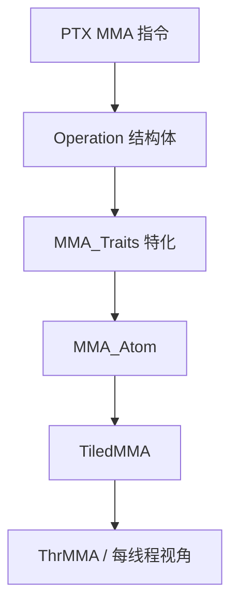

# CuTe MMA Atom

这篇笔记整理 CuTe 如何支持 GPU 的 **MMA（Matrix Multiply-Accumulate，矩阵乘累加）** 硬件指令。

MMA 指令是架构相关的：Volta、Ampere、Hopper、Blackwell 都有不同粒度、不同输入形式的 Tensor Core 指令。CuTe 的目标不是把这些差异藏起来，而是用一组 C++ 类型把它们描述清楚，让上层 GEMM 代码可以用统一的 `Tensor`、`Layout` 和 `TiledMMA` 去组织计算。

本文主要参考：

- 官方文档：<https://docs.nvidia.com/cutlass/latest/media/docs/cpp/cute/0t_mma_atom.html>
- 源码：`include/cute/arch/mma_sm70.hpp`
- 源码：`include/cute/arch/mma_sm80.hpp`
- 源码：`include/cute/arch/mma_sm89.hpp`
- 源码：`include/cute/arch/mma_sm90.hpp`
- 源码：`include/cute/arch/mma_sm90_gmma.hpp`
- 源码：`include/cute/arch/mma_sm90_gmma_sparse.hpp`
- 源码：`include/cute/atom/mma_traits_sm70.hpp`
- 源码：`include/cute/atom/mma_traits_sm80.hpp`
- 源码：`include/cute/atom/mma_traits_sm89.hpp`
- 源码：`include/cute/atom/mma_traits_sm90_gmma.hpp`
- 源码：`include/cute/atom/mma_atom.hpp`

图片先预留在这个目录下：

```text
public/blog-assets/gpu-programming/cute-mma-atom/
```

后面可以把官方图或自己画的图放进去，再替换成真实图片。

## 总体模型

CuTe 对 MMA 的抽象可以拆成四层：


```mermaid
flowchart TD
    A["PTX MMA 指令"] --> B["Operation 结构体"]
    B --> C["MMA_Traits 特化"]
    C --> D["MMA_Atom"]
    D --> E["TiledMMA"]
    E --> F["ThrMMA / 每线程视角"]
```

- **Operation 结构体**：直接封装某条 PTX MMA 指令，负责寄存器参数和 `fma` 调用。
- **`MMA_Traits` 特化**：描述这条指令的逻辑类型、逻辑形状、线程映射和数据映射。
- **`MMA_Atom`**：把 Operation 和 Traits 合在一起，提供 `call` 和 fragment 构造接口。
- **`TiledMMA`**：把一个或多个 Atom 组合成更大的 tiled MMA，负责线程复制、数据分块和每线程切片。

如果只看 PTX 指令，信息是不够的：它只告诉你要传哪些寄存器。CuTe 真正补上的，是“这些寄存器分别对应矩阵里的哪个逻辑坐标”。

## Operation 结构体

**用途**

Operation 结构体封装底层 MMA 操作，主要描述**操作数的物理接口**和 `fma` 调用，不负责 CuTe 的 `Tensor` 分块与线程映射。普通 MMA 的 A/B 是寄存器 fragment；Hopper GMMA 的输入还可以是 shared memory descriptor。复数 Operation 则由多次实数 MMA 组合实现。

**源码位置**

```text
include/cute/arch/mma_sm70.hpp
include/cute/arch/mma_sm80.hpp
include/cute/arch/mma_sm90.hpp
include/cute/arch/mma_sm90_gmma.hpp
```

### 命名方式

先看 `SM80_16x8x16_F32F16F16F32_TN`，它封装的指令是：

```ptx
mma.sync.aligned.m16n8k16.row.col.f32.f16.f16.f32
```

这条指令完成 $D = AB + C$，名字各部分与 PTX 的对应关系如下：

| 片段 | 含义 |
| --- | --- |
| `SM80` | 最早支持该指令的架构，这里是 Ampere。 |
| `16x8x16` | MMA 的逻辑形状 $M=16, N=8, K=16$，对应 `.m16n8k16`。 |
| `F32F16F16F32` | 按 **D/A/B/C** 排列：D、C 是 F32，A、B 是 F16，对应 `.f32.f16.f16.f32`。 |
| `TN` | 沿用 BLAS 的 A/B 转置命名，对应指令的 `.row.col`；此时 A、B 都是 K-major，即 K 方向连续。 |

### `TN`：BLAS 命名与 K 方向连续

`T` 表示 transpose，`N` 表示 no transpose。这里采用传统 BLAS 的 **column-major（列主序）** 语境：`TN` 对应 `transA = T`、`transB = N`。列主序的 A 转置后具有 row-major 视角，B 不转置仍具有 column-major 视角。转置参数的定义可参考 [BLAS DGEMM 文档](https://www.netlib.org/lapack/explore-html/d7/d2b/dgemm_8f.html)。

例如 BLAS 中存储的 $A_0$ 是列主序 $(K,M)$ 矩阵，$B_0$ 是列主序 $(K,N)$ 矩阵。TN 计算 $D=A_0^T B_0+C$，参与乘法的逻辑 A 就是 $A_0^T$，形状为 $(M,K)$。

理解 `.row.col` 时，先明确数学矩阵的维度：A 是 $(M,K)$，B 是 $(K,N)$。

| 操作数 | BLAS 标志 | PTX 布局 | 坐标变化 | 连续方向 |
| --- | --- | --- | --- | --- |
| A：$(M,K)$ | `T` | `.row` | 固定行 $m$，沿列 $k$ 变化。 | **K 连续**。 |
| B：$(K,N)$ | `N` | `.col` | 固定列 $n$，沿行 $k$ 变化。 | **K 连续**。 |

因此，**A 的 `.row` 和 B 的 `.col` 都表示 K 方向连续**。两者使用不同的 row/col 名字，是因为 K 在 A 中是列维度，在 B 中是行维度。用普通二维存储的元素偏移来说明就是：

$$
\operatorname{offset}_A(m,k) = m \cdot \mathrm{ld}_A + k,
\qquad
\operatorname{offset}_B(k,n) = n \cdot \mathrm{ld}_B + k
$$

这里的 $\mathrm{ld}_A$、$\mathrm{ld}_B$ 是 leading dimension，偏移以元素为单位，两式中 $k$ 的系数都是 1。对于寄存器 MMA，这两式解释的是 operand 的 row/col 语义；具体哪个 lane 的哪个寄存器持有某个元素，要继续看 `MMA_Traits`。

CuTe 为了统一收缩维度，把 A 写成 $(M,K)$，把 B 写成 **$(N,K)$**，即 `B(n,k)` 对应数学矩阵的 `B(k,n)`。所以在 CuTe 的坐标顺序下，TN 的 A、B 都是第二维 K 连续，普通未 swizzle 的 layout 都可以写成 `Stride<ld, _1>`。B 的坐标顺序改变后，不能再把 PTX 的 `.col` 直接套成 CuTe $(N,K)$ 的 column-major；[CuTe 官方文档](https://docs.nvidia.com/cutlass/latest/media/docs/cpp/cute/0t_mma_atom.html#traits) 也将 `BLayout` 定义为到 $(N,K)$ 的映射。

Volta 支持四种布局后缀，对应关系如下：

| 后缀 | PTX 布局（A/B） | A 的连续维度 | B 的连续维度 |
| --- | --- | --- | --- |
| `TN` | `.row.col` | K | K |
| `NT` | `.col.row` | M | N |
| `NN` | `.col.col` | M | K |
| `TT` | `.row.row` | K | N |

Operation 的后缀描述底层指令要求的 operand 形式。用户矩阵的全局内存布局还要通过 `Tensor/Layout/Copy` 整理为对应的 fragment；名字里的 `T` 本身不会执行一次数据转置。

### SM70、SM80、SM90 的 Operation 列表

下面对照本地 `cutlass` 的源码列出 Operation。表格按类型族合并重复项：`{...}` 表示逐项替换的候选值，`<形状>`、`<类型>` 和 `N` 表示表中给出的具体取值；这些写法用于列举，不是实际 C++ 类型名。

#### SM70：Volta

`mma_sm70.hpp` 中共 8 个 Operation，均为 `8x8x4`，A/B 都是 F16：

| Operation | C/D 类型 | A/B 布局 |
| --- | --- | --- |
| `SM70_8x8x4_F16F16F16F16_TN` | F16 | K-major / K-major |
| `SM70_8x8x4_F16F16F16F16_NT` | F16 | M-major / N-major |
| `SM70_8x8x4_F16F16F16F16_NN` | F16 | M-major / K-major |
| `SM70_8x8x4_F16F16F16F16_TT` | F16 | K-major / N-major |
| `SM70_8x8x4_F32F16F16F32_TN` | F32 | K-major / K-major |
| `SM70_8x8x4_F32F16F16F32_NT` | F32 | M-major / N-major |
| `SM70_8x8x4_F32F16F16F32_NN` | F32 | M-major / K-major |
| `SM70_8x8x4_F32F16F16F32_TT` | F32 | K-major / N-major |

#### SM80：Ampere

`mma_sm80.hpp` 中共 65 个 Operation，其中浮点与复数 Operation 如下，布局后缀都是 `TN`：

| Operation 类型族 | 说明 |
| --- | --- |
| `SM80_16x8x{8,16}_F16F16F16F16_TN` | F16 输入，F16 累加。 |
| `SM80_16x8x{8,16}_F32F16F16F32_TN` | F16 输入，F32 累加。 |
| `SM80_16x8x{8,16}_F32BF16BF16F32_TN` | BF16 输入，F32 累加。 |
| `SM80_16x8x{4,8}_F32TF32TF32F32_TN` | TF32 输入，F32 累加。 |
| `SM80_8x8x4_F64F64F64F64_TN` | FP64 MMA。 |
| `SM80_8x8x4_C64C64C64C64_TN` | 双精度复数，通过 4 次 FP64 MMA 实现。 |
| `SM80_8x8x4_GC64C64C64GC64_TN` | Gaussian 复数形式，通过 3 次 FP64 MMA 保存中间累加结果。 |

整数 Operation 的 C/D 都是 S32。下面每个类型组合都支持表中列出的全部形状，并且都有普通版本和追加 `_SATURATE` 的版本：

| D/A/B/C 类型片段 | 形状 | Operation 命名 |
| --- | --- | --- |
| `S32S8S8S32` | `8x8x16`、`16x8x16`、`16x8x32` | `SM80_<形状>_S32S8S8S32_TN` |
| `S32S8U8S32` | 同上 | `SM80_<形状>_S32S8U8S32_TN` |
| `S32U8S8S32` | 同上 | `SM80_<形状>_S32U8S8S32_TN` |
| `S32U8U8S32` | 同上 | `SM80_<形状>_S32U8U8S32_TN` |
| `S32S4S4S32` | `8x8x32`、`16x8x32`、`16x8x64` | `SM80_<形状>_S32S4S4S32_TN` |
| `S32S4U4S32` | 同上 | `SM80_<形状>_S32S4U4S32_TN` |
| `S32U4S4S32` | 同上 | `SM80_<形状>_S32U4S4S32_TN` |
| `S32U4U4S32` | 同上 | `SM80_<形状>_S32U4U4S32_TN` |

`S`/`U` 分别表示有符号 / 无符号整数。`_SATURATE` 对应 PTX 的 `.satfinite`，使溢出的整数累加结果饱和到 S32 的边界。

1-bit Operation 还有以下两组，每组各 3 个形状：

| Operation 类型族 | 形状 | 运算 |
| --- | --- | --- |
| `SM80_<形状>_S32U1U1S32_TN_ANDPOPC` | `8x8x128`、`16x8x128`、`16x8x256` | 按位 AND 后做 population count，再累加。 |
| `SM80_<形状>_S32U1U1S32_TN_XORPOPC` | 同上 | 按位 XOR 后做 population count，再累加。 |

#### SM90：Hopper

Hopper 的 Operation 分为 warp 级同步 MMA 和 warpgroup 级异步 GMMA。

`mma_sm90.hpp` 中的类型位于 `cute::SM90` 命名空间，共 6 个：

| Operation 类型族 | 说明 |
| --- | --- |
| `SM90::MMA_16x8x{4,8,16}_F64F64F64F64_TN` | 3 种 FP64 同步 MMA，PTX 为 `mma.sync.aligned`。 |
| `SM90::MMA_16x8x{4,8,16}_C64C64C64C64_TN` | 3 种双精度复数封装，每次调用组合 4 次对应的 FP64 MMA。 |

`mma_sm90_gmma.hpp` 中的类型位于 `cute::SM90::GMMA` 命名空间，封装 `wgmma.mma_async.sync.aligned`，由 128 个线程协作。其名字使用 **C/A/B** 三个类型片段，C 原地更新为结果，不再单列 D 的类型。

| 后缀 | A 输入 | B 输入 |
| --- | --- | --- |
| `SS` | shared memory descriptor | shared memory descriptor |
| `RS` | 寄存器 fragment | shared memory descriptor |

下面每个类型族都有 `SS` 和 `RS` 两种形式：

| Operation 类型族（省略 `SM90::GMMA::`） | 输入类型 / 累加类型 | 布局形式 |
| --- | --- | --- |
| `MMA_64xNx16_F16F16F16_{SS,RS}` | F16 / F16 | 由 `tnspA`、`tnspB` 模板参数指定。 |
| `MMA_64xNx16_F32F16F16_{SS,RS}` | F16 / F32 | 同上。 |
| `MMA_64xNx16_F32BF16BF16_{SS,RS}` | BF16 / F32 | 同上。 |
| `MMA_64xNx8_F32TF32TF32_{SS,RS}_TN` | TF32 / F32 | A/B 都是 K-major。 |
| `MMA_64xNx32_F16E4M3E4M3_{SS,RS}_TN` | E4M3 × E4M3 / F16 | A/B 都是 K-major。 |
| `MMA_64xNx32_F16E4M3E5M2_{SS,RS}_TN` | E4M3 × E5M2 / F16 | 同上。 |
| `MMA_64xNx32_F16E5M2E4M3_{SS,RS}_TN` | E5M2 × E4M3 / F16 | 同上。 |
| `MMA_64xNx32_F16E5M2E5M2_{SS,RS}_TN` | E5M2 × E5M2 / F16 | 同上。 |
| `MMA_64xNx32_F32E4M3E4M3_{SS,RS}_TN` | E4M3 × E4M3 / F32 | 同上。 |
| `MMA_64xNx32_F32E4M3E5M2_{SS,RS}_TN` | E4M3 × E5M2 / F32 | 同上。 |
| `MMA_64xNx32_F32E5M2E4M3_{SS,RS}_TN` | E5M2 × E4M3 / F32 | 同上。 |
| `MMA_64xNx32_F32E5M2E5M2_{SS,RS}_TN` | E5M2 × E5M2 / F32 | 同上。 |
| `MMA_64xNx32_S32S8S8_{SS,RS}_TN` | S8 × S8 / S32 | A/B 都是 K-major；另有 `_SATURATE` 版本。 |
| `MMA_64xNx32_S32S8U8_{SS,RS}_TN` | S8 × U8 / S32 | 同上。 |
| `MMA_64xNx32_S32U8S8_{SS,RS}_TN` | U8 × S8 / S32 | 同上。 |
| `MMA_64xNx32_S32U8U8_{SS,RS}_TN` | U8 × U8 / S32 | 同上。 |

每个类型族在主头文件中的 N 均取 `8, 16, 32, 64, 96, 128, 192, 256`。定义 `CUTE_SM90_EXTENDED_MMA_SHAPES_ENABLED` 后，还会包含 `mma_sm90_gmma_ext.hpp`，扩展范围按输入类型区分：

| 输入类型 | 扩展头文件补充的 N | 启用扩展后的完整范围 |
| --- | --- | --- |
| F16、BF16、TF32、FP8 | 主头文件之外其余 8 的倍数。 | `8, 16, 24, ..., 256`。 |
| S8/U8 | `24, 48, 80, 112, 144, 160, 176, 208, 224, 240`。 | `8, 16, 24, 32, 48, 64, 80, 96, 112, 128, 144, 160, 176, 192, 208, 224, 240, 256`。 |

F16/BF16 的布局参数使用 `GMMA::Major::K` 或 `GMMA::Major::MN`：前者表示 K-major，后者对 A 表示 M-major、对 B 表示 N-major。`SS` 可以分别指定 A/B 的 major；`RS` 的寄存器 A 固定要求 `tnspA == GMMA::Major::K`。`SS/RS` 描述输入位置，`TN` 描述输入布局，两者含义不同。

Hopper 还提供 `mma_sm90_gmma_sparse.hpp` 中的结构化稀疏 Operation，位于 `SM90::GMMA::SPARSE`，名字以 `GMMA_` 开头，调用 `wgmma.mma_async.sp.sync.aligned`。它们覆盖上面相同的数据类型与 `SS/RS` 组合，但逻辑 K 加倍，并增加稀疏元数据 E：

| 稀疏 Operation 类型族（省略 `SM90::GMMA::SPARSE::`） | 类型片段的候选值 |
| --- | --- |
| `GMMA_64xNx32_<类型>_{SS,RS}` | `F16F16F16`、`F32F16F16`、`F32BF16BF16` |
| `GMMA_64xNx16_F32TF32TF32_{SS,RS}_TN` | `F32TF32TF32` |
| `GMMA_64xNx64_<类型>_{SS,RS}_TN` | `F16E4M3E4M3`、`F16E4M3E5M2`、`F16E5M2E4M3`、`F16E5M2E5M2` |
| `GMMA_64xNx64_<类型>_{SS,RS}_TN` | `F32E4M3E4M3`、`F32E4M3E5M2`、`F32E5M2E4M3`、`F32E5M2E5M2` |
| `GMMA_64xNx64_<类型>_{SS,RS}_TN`，另有 `_SATURATE` 版本 | `S32S8S8`、`S32S8U8`、`S32U8S8`、`S32U8U8` |

稀疏版本的 N 候选值与稠密版本相同；扩展形状来自 `mma_sm90_gmma_sparse_ext.hpp`，由同一个宏控制。GMMA 指令在源码中受 `CUTE_ARCH_MMA_SM90A_ENABLED` 保护，编译时需要启用 `sm_90a` 对应的架构特性。

### `SM80_16x8x16_F16F16F16F16_TN`

**用途**

封装 Ampere 指令 `mma.sync.aligned.m16n8k16.row.col.f16.f16.f16.f16`。一个 warp 的 32 个线程协作完成 $16 \times 8 \times 16$ 的 MMA，A/B 输入和 C/D 累加器都是 F16，A/B 都是 K-major。

**完整源码**

以下直接复制自 `include/cute/arch/mma_sm80.hpp`，保留寄存器接口、内联 PTX 和架构保护分支：

```cpp
// MMA 16x8x16 TN
struct SM80_16x8x16_F16F16F16F16_TN
{
  using DRegisters = uint32_t[2];
  using ARegisters = uint32_t[4];
  using BRegisters = uint32_t[2];
  using CRegisters = uint32_t[2];

  CUTE_HOST_DEVICE static void
  fma(uint32_t      & d0, uint32_t      & d1,
      uint32_t const& a0, uint32_t const& a1, uint32_t const& a2, uint32_t const& a3,
      uint32_t const& b0, uint32_t const& b1,
      uint32_t const& c0, uint32_t const& c1)
  {
#if defined(CUTE_ARCH_MMA_SM80_ENABLED)
    asm volatile(
      "mma.sync.aligned.m16n8k16.row.col.f16.f16.f16.f16 "
      "{%0,  %1},"
      "{%2,  %3,  %4,  %5},"
      "{%6,  %7},"
      "{%8,  %9};\n"
      : "=r"(d0), "=r"(d1)
      :  "r"(a0),  "r"(a1),  "r"(a2),  "r"(a3),
         "r"(b0),  "r"(b1),
         "r"(c0),  "r"(c1));
#else
    CUTE_INVALID_CONTROL_PATH("Attempting to use SM80_16x8x16_F16F16F16F16_TN without CUTE_ARCH_MMA_SM80_ENABLED");
#endif
  }
};
```

**类型别名**

| 成员 | 类型 | 含义 |
| --- | --- | --- |
| `DRegisters` | `uint32_t[2]` | 每个 lane 输出 2 个 32-bit 寄存器，共 4 个 F16 结果。 |
| `ARegisters` | `uint32_t[4]` | 每个 lane 传入 4 个 32-bit 寄存器，共 8 个 F16 A 元素。 |
| `BRegisters` | `uint32_t[2]` | 每个 lane 传入 2 个 32-bit 寄存器，共 4 个 F16 B 元素。 |
| `CRegisters` | `uint32_t[2]` | 每个 lane 传入 2 个 32-bit 寄存器，共 4 个 F16 累加器初值。 |

这里的 `uint32_t` 表示传给 PTX 的寄存器位模式，每个寄存器打包两个 F16；矩阵元素的逻辑类型仍是 F16。内联 PTX 用 `"r"` 传入 32-bit 寄存器，用 `"=r"` 写出结果。

**重要接口**

| 接口 | 含义 |
| --- | --- |
| `fma(...)` | 调用底层 PTX MMA 指令。参数数量和类型直接对应 `D/A/B/C` 寄存器。 |

**副作用 / 约束**

- `fma` 是底层寄存器级接口，调用者必须已经准备好正确的寄存器值。
- `fma` 必须由整个 warp 的 32 个线程一致执行，并按照该指令的 fragment 映射准备输入。
- 源码中用 `CUTE_ARCH_MMA_SM80_ENABLED` 宏保护 PTX 指令。如果当前编译目标不支持该指令，会进入 `CUTE_INVALID_CONTROL_PATH`。
- Operation 本身不说明 `(thread, value)` 到矩阵坐标的映射，这部分由 `MMA_Traits` 提供。

### `MMA_64x8x16_F16F16F16_SS`

**用途**

这个 Operation 位于 `cute::SM90::GMMA`，封装 Hopper 的 `wgmma.mma_async.sync.aligned.m64n8k16.f16.f16.f16`。一个 warpgroup 的 128 个线程协作完成 $64 \times 8 \times 16$ 的 MMA，A/B 输入与累加器都是 F16。

`SS` 表示 A、B 都来自 shared memory（共享内存）。调用时传入两个 **64-bit descriptor（描述符）**，由硬件根据 descriptor 读取矩阵；每个线程传入的 A/B 寄存器保存的是 descriptor，而累加器仍保存在各线程的寄存器中。

**完整源码**

以下直接复制自 `include/cute/arch/mma_sm90_gmma.hpp`：

```cpp
// GMMA 64x8x16 F16+=F16*F16
template <
  GMMA::Major tnspA,
  GMMA::Major tnspB,
  GMMA::ScaleIn  scaleA = GMMA::ScaleIn::One,
  GMMA::ScaleIn  scaleB = GMMA::ScaleIn::One
>
struct MMA_64x8x16_F16F16F16_SS
{
  using DRegisters = void;
  using ARegisters = uint64_t[1];
  using BRegisters = uint64_t[1];
  using CRegisters = uint32_t[2];

  CUTE_HOST_DEVICE static void
  fma(uint64_t const& desc_a,
      uint64_t const& desc_b,
      uint32_t      & d0, uint32_t      & d1,
      GMMA::ScaleOut const scale_D = GMMA::ScaleOut::One)
  {
#if defined(CUTE_ARCH_MMA_SM90A_ENABLED)
    cutlass::arch::synclog_emit_wgmma_smem_smem(__LINE__, desc_a, desc_b);
    asm volatile(
    "{\n"
      ".reg .pred p;\n"
      "setp.ne.b32 p, %4, 0;\n"
      "wgmma.mma_async.sync.aligned.m64n8k16.f16.f16.f16 "
      "{%0, %1},"
      " %2,"
      " %3,"
      " p,  %5, %6, %7, %8;\n"
    "}\n"
      : "+r"(d0), "+r"(d1)
      :  "l"(desc_a),
         "l"(desc_b),
         "r"(int32_t(scale_D)), "n"(int32_t(scaleA)), "n"(int32_t(scaleB)), "n"(int32_t(tnspA)), "n"(int32_t(tnspB)));
#else
    CUTE_INVALID_CONTROL_PATH("Attempting to use MMA_64x8x16_F16F16F16_SS without CUTE_ARCH_MMA_SM90A_ENABLED");
#endif
  }
};
```

**寄存器接口**

| 成员 | 类型 | 含义 |
| --- | --- | --- |
| `DRegisters` | `void` | 不提供独立的 D 寄存器数组，结果原地更新累加器。 |
| `ARegisters` | `uint64_t[1]` | 一个 64-bit A descriptor，描述共享内存中的 A tile。 |
| `BRegisters` | `uint64_t[1]` | 一个 64-bit B descriptor，描述共享内存中的 B tile。 |
| `CRegisters` | `uint32_t[2]` | 每线程 2 个 32-bit 累加器寄存器，打包 4 个 F16 元素，也是输出结果。 |

`fma` 中的 `d0/d1` 同时作为输入累加器和输出，内联 PTX 用 `"+r"` 表示读写同一寄存器。descriptor 使用 `"l"` 传入 64-bit 寄存器；模板参数使用 `"n"` 传入编译期立即数。

#### 布局模板参数：K-major 与 MN-major

`tnspA`、`tnspB` 分别指定 A、B 的 major，都是**编译期参数，没有默认值**。对应枚举的源码是：

```cpp
enum class Major {
  K  = 0,
  MN = 1
};
```

这里可以理解为 **K 方向优先**和 **M/N 方向优先**。仍按 CuTe 的 A(M,K)、B(N,K) 坐标来读，先看未 swizzle 的逻辑连续方向：

| 参数值 | A 的主方向 | B 的主方向 | 传入 PTX 的转置立即数 |
| --- | --- | --- | --- |
| `GMMA::Major::K` | K-major，K 方向连续。 | K-major，K 方向连续。 | `0`。 |
| `GMMA::Major::MN` | M-major，M 方向连续。 | N-major，N 方向连续。 | `1`。 |

**`MN` 对 A 表示 M，对 B 表示 N**，二者可以独立指定。major 描述的是输入矩阵的布局方向，矩阵乘法的收缩维度仍然是 K。

与 SM80 的 `mma.sync...row.col...` 相比，这条 WGMMA 的指令名字没有 `.row/.col` 修饰符。F16/BF16 的 shared memory 输入通过末尾的 **`imm-trans-a`、`imm-trans-b`** 选择布局，源码中对应 `tnspA`、`tnspB`，即 `%7`、`%8`。其基准形式是数学上的 A row-major、B column-major，也就是前文的 TN；所以 **`Major::K, Major::K` 传入 `0,0`，对应 A/B 都 K-major**。这里 PTX 的转置立即数与 BLAS 的 `T/N` 使用不同的基准，不能按字母直接对应。具体语法见 [PTX WGMMA 指令文档](https://docs.nvidia.com/cuda/parallel-thread-execution/index.html#asynchronous-warpgroup-level-matrix-instructions-wgmma-mma)。

descriptor 描述共享内存起始地址、字节偏移和 swizzle 模式；`tnspA/tnspB` 作为独立的指令参数指定 major。**major、descriptor 和实际共享内存布局必须匹配**，更改模板参数不会重排已经存好的数据。实际布局还要满足 GMMA 的规范布局要求；启用 swizzle 后，物理地址的连续性也要结合 swizzle 理解。CuTe 通常使用对应的 `Layout_K_*_Atom`、`Layout_MN_*_Atom` 构造共享内存布局，再用 `make_gmma_desc<MajorMode>` 生成 descriptor。

例如，下面两个类型分别选择 K/K 和 M/N 主方向，输入缩放都使用默认值：

```cpp
namespace gmma = cute::SM90::GMMA;

// A、B 都是 K-major，对应前文的 TN。
using KMajorMma = gmma::MMA_64x8x16_F16F16F16_SS<
    gmma::Major::K, gmma::Major::K>;

// A 是 M-major，B 是 N-major，对应前文的 NT。
using MnMajorMma = gmma::MMA_64x8x16_F16F16F16_SS<
    gmma::Major::MN, gmma::Major::MN>;
```

#### 缩放参数：输入取负与累加控制

这里有两类 scale 参数：`scaleA/scaleB` 是模板参数，`scale_D` 是 `fma` 的运行时参数。对应枚举的源码是：

```cpp
enum class ScaleIn {
  Neg = -1,
  One =  1
};

enum class ScaleOut {
  Zero = 0,
  One  = 1
};
```

| 参数 | 取值与默认值 | 作用 |
| --- | --- | --- |
| `scaleA` | `ScaleIn::One`（默认）或 `ScaleIn::Neg`。 | 编译期选择 A 保持原值或取负。 |
| `scaleB` | `ScaleIn::One`（默认）或 `ScaleIn::Neg`。 | 编译期选择 B 保持原值或取负。 |
| `scale_D` | `ScaleOut::One`（默认）或 `ScaleOut::Zero`。 | 运行时选择保留旧累加器或忽略旧累加器。 |

用 $C_{\mathrm{old}}$ 表示调用前的累加器，$C_{\mathrm{new}}$ 表示写回同一组寄存器的结果，运算语义可以写成：

$$
C_{\mathrm{new}} = (s_A A)(s_B B) + s_D C_{\mathrm{old}},
\qquad
s_A,s_B \in \{-1,1\},\quad s_D \in \{0,1\}
$$

**输入 scale 只提供符号选择，输出 scale 只提供累加开关**，不能把它们当作任意浮点数的 GEMM `alpha/beta`。`scaleA`、`scaleB` 都为 `One` 时，`scale_D = One` 得到 $AB+C_{\mathrm{old}}$，`scale_D = Zero` 得到 $AB$；若只有一个输入设为 `Neg`，乘积项变成 $-AB$，两个输入都为 `Neg` 则仍是 $AB$。

源码中的 `setp.ne.b32 p, %4, 0` 把 `scale_D` 转成 PTX 的谓词 `p`：为真时累加旧值，为假时忽略旧值。K 循环中，首个 tile 可以用 `Zero` 开始新的累加，后续 tile 再用 `One` 继续累加。在 CuTe 的 `MMA_Traits` 层，这个参数由 `accumulate_` 成员传给 Operation。

**副作用 / 约束**

- 需要 `sm_90a` 架构特性，源码用 `CUTE_ARCH_MMA_SM90A_ENABLED` 保护指令。
- warpgroup 的 128 个线程必须一致执行该指令，A/B descriptor 在 warpgroup 内必须一致。
- WGMMA 是异步操作，`fma` 返回时结果未必完成。发射前用 `warpgroup_arrive()` 对先前的寄存器访问建立顺序；发射后用 `warpgroup_commit_batch()` 提交，再用 `warpgroup_wait<0>()` 等待所有已提交的组完成，之后才能读取结果。共享内存输入也必须按相应同步协议准备好。

## `MMA_Traits`

Operation 给出指令的寄存器或 descriptor 接口；`MMA_Traits<Operation>` 补上**逻辑矩阵、协作线程和数据坐标之间的对应关系**。从 `MMA_Traits` 读到的类型和布局，会继续被 `MMA_Atom` 用来构造 fragment、划分 tile 和调用 Operation。

| 成员 | 提供的信息 |
| --- | --- |
| `ValTypeD/A/B/C` | D、A、B、C 的**逻辑元素类型**；与 PTX 接口使用的 `uint32_t` 等寄存器类型分开。 |
| `Shape_MNK` | 一次 Operation 覆盖的 $(M,N,K)$ 逻辑形状。 |
| `ThrID` | 一次 Operation 的逻辑线程 ID 到参与线程的映射。Volta 的 quadpair 是 8 个线程；这里选的 SM80 MMA 是 32 个线程，SM90 GMMA 是 128 个线程。 |
| `ALayout/BLayout/CLayout` | `(thread, value)` 到 $A(M,K)$、$B(N,K)$、$C(M,N)$ **逻辑坐标**的映射；C 的映射也用于 D。它们不是全局或共享内存的物理存储布局。 |
| `FrgTypeA/B` | 某些 Operation 额外指定的 A/B fragment 形式。GMMA 的 `SS` 形式在这里指定共享内存 descriptor 视图，而非逐线程 A/B 数值寄存器。 |
| `accumulate_` | GMMA traits 额外保存的 `ScaleOut` 状态，决定本次乘积是否累加旧 C，默认 `One`。 |

SM70、SM80 和 SM90 的同步 `mma.sync` 都主要依靠逻辑类型、`Shape_MNK`、`ThrID`、A/B/C 布局描述寄存器级 MMA。下面的 SM90 GMMA 除了这些信息，还需要 descriptor fragment 类型和 `accumulate_`。`scaleA/scaleB` 则是 **Operation 的模板参数**，不是 traits 的运行时成员。

以下两个特化分别定义在 `include/cute/atom/mma_traits_sm80.hpp` 和 `include/cute/atom/mma_traits_sm90_gmma.hpp`。阅读 layout 前先约定：`T` 表示逻辑线程坐标，`V` 表示线程内的逻辑 value 坐标。layout 返回的整数按第一维连续编码，例如 A 的 $(m,k)$ 编码为 $m+M k$，B 的 $(n,k)$ 编码为 $n+N k$，C 的 $(m,n)$ 编码为 $m+M n$。

### SM80：`MMA_Traits<SM80_16x8x16_F16F16F16F16_TN>`

**源码特化**

```cpp
template <>
struct MMA_Traits<SM80_16x8x16_F16F16F16F16_TN>
{
  using ValTypeD = half_t;
  using ValTypeA = half_t;
  using ValTypeB = half_t;
  using ValTypeC = half_t;

  using Shape_MNK = Shape<_16,_8,_16>;
  using ThrID   = Layout<_32>;
  using ALayout = Layout<Shape <Shape < _4,_8>,Shape < _2,_2,  _2>>,
                         Stride<Stride<_32,_1>,Stride<_16,_8,_128>>>;
  using BLayout = Layout<Shape <Shape < _4,_8>,Shape <_2, _2>>,
                         Stride<Stride<_16,_1>,Stride<_8,_64>>>;
  using CLayout = SM80_16x8_Row;
};
```

`Shape_MNK` 与 Operation 名字中的 `16x8x16` 一致。`ThrID = Layout<_32>` 把逻辑线程 `0..31` 映射到一个 warp 的 32 个 lane；它只说明**谁参与**。A/B/C 布局进一步说明**各 lane 的哪个 value 对应哪个矩阵元素**。

这里 `ALayout` 和 `BLayout` 已直接写在特化中。`CLayout` 需要向上追踪 `SM80_16x8_Row` 别名：

```cpp
using SM80_16x8_Row = Layout<Shape <Shape < _4,_8>,Shape < _2,_2>>,
                             Stride<Stride<_32,_1>,Stride<_16,_8>>>;
```

把三个布局的 `Shape` 拆成 `(T,V)`，可直接核对线程数、每线程逻辑值数与矩阵大小：

| 布局 | `(T,V)` | 覆盖的逻辑矩阵 | 每线程的值数 |
| --- | --- | --- | --- |
| `ALayout` | `(4×8, 2×2×2) = (32,8)` | $A(16,16)$，共 256 个 F16。 | 8 个 A 元素，对应 Operation 的 `ARegisters = uint32_t[4]`。 |
| `BLayout` | `(4×8, 2×2) = (32,4)` | $B(8,16)$，共 128 个 F16。 | 4 个 B 元素，对应 `BRegisters = uint32_t[2]`。 |
| `CLayout` | `(4×8, 2×2) = (32,4)` | $C(16,8)$，共 128 个 F16。 | 4 个 C/D 元素，对应两个打包 F16 的 32-bit 累加器寄存器。 |

再把 `Stride` 展开成坐标。令线程坐标为 $(t_0,t_1)$，其中 $0\le t_0<4$、$0\le t_1<8$；各布局的 value 坐标用 $v_0,v_1,v_2$ 表示，只取对应 `Shape` 中存在的维度：

| 布局 | `(thread, value)` 映射到的矩阵坐标 |
| --- | --- |
| `ALayout` | $m=t_1+8v_1,\quad k=2t_0+v_0+8v_2$。 |
| `BLayout` | $n=t_1,\quad k=2t_0+v_0+8v_1$。 |
| `CLayout` | $m=t_1+8v_1,\quad n=2t_0+v_0$。 |

例如 A 的线程子模式 $t_0$ 每加 1，线性编码增加 32，也就是 K 坐标增加 2；线程子模式 $t_1$ 每加 1，M 坐标增加 1。由此可以读出一个 warp 如何覆盖完整的 A、B、C tile。这些公式描述的是**寄存器 fragment 的线程 / 元素映射**，不推断用户矩阵在 global memory 或 shared memory 中的 stride。

### SM90 GMMA：`MMA_Traits<SM90_64x16x16_F16F16F16_SS<tnspA, tnspB, scaleA, scaleB>>`

**源码别名与特化**

`SM90_64x16x16_F16F16F16_SS` 是 `cute` 命名空间中的别名，指向 `cute::SM90::GMMA::MMA_64x16x16_F16F16F16_SS`：

```cpp
template <
  GMMA::Major tnspA,
  GMMA::Major tnspB,
  GMMA::ScaleIn  scaleA = GMMA::ScaleIn::One,
  GMMA::ScaleIn  scaleB = GMMA::ScaleIn::One
>
using SM90_64x16x16_F16F16F16_SS = SM90::GMMA::MMA_64x16x16_F16F16F16_SS<tnspA, tnspB, scaleA, scaleB>;

template <GMMA::Major tnspA, GMMA::Major tnspB, GMMA::ScaleIn scaleA, GMMA::ScaleIn scaleB>
struct MMA_Traits<SM90_64x16x16_F16F16F16_SS<tnspA, tnspB, scaleA, scaleB>>
{
  using ValTypeD = half_t;
  using ValTypeA = half_t;
  using ValTypeB = half_t;
  using ValTypeC = half_t;

  using FrgTypeA = GMMA::smem_desc<tnspA>;
  using FrgTypeB = GMMA::smem_desc<tnspB>;

  using Shape_MNK = Shape<_64,_16,_16>;
  using ThrID   = Layout<_128>;
  using ALayout = GMMA::ABLayout< 64, 16>;
  using BLayout = GMMA::ABLayout< 16, 16>;
  using CLayout = GMMA::CLayout_64x16;

  GMMA::ScaleOut accumulate_ = GMMA::ScaleOut::One;
};
```

这次 `Shape_MNK = (64,16,16)`，`ThrID = Layout<_128>` 对应一个 warpgroup 的 128 个参与线程。`FrgTypeA/B`、A/B/C 布局和 `accumulate_` 需要分别向上追踪，不能按 SM80 的寄存器 fragment 直接理解。

#### `FrgTypeA/B`：从共享内存 Tensor 到 descriptor

源码中，`smem_desc<Major>` 继承 `DescriptorIterator`，后者解引用得到 `GmmaDescriptor`；它表示一种**带有主方向的 descriptor fragment 视图**：

```cpp
struct DescriptorIterator
{
  using reference    = GmmaDescriptor;
  using element_type = GmmaDescriptor;
  using value_type   = GmmaDescriptor;

  GmmaDescriptor desc_;

  CUTE_HOST_DEVICE constexpr
  reference operator*() const { return desc_; }
  // 省略其余迭代器操作。
};

template <Major>
struct smem_desc : DescriptorIterator {};
```

具体从 `include/cute/atom/mma_atom.hpp` 的 `MMA_Atom::make_fragment_A` 往下追。这个 Operation 的 `MMA_Traits` 已经声明 `FrgTypeA = GMMA::smem_desc<tnspA>`；`MMA_Atom` 通过 `FrgTypeA_or_Default<Traits>` 取到它，不会退回默认的 `ValTypeA = half_t`。`make_fragment_A` 期望传入已按 `VMK` 分区的 A Tensor，先用 `rank >= 3`、第 0 个 mode 的大小等于 `ALayout` 的 value 大小做基本形状检查，接着进行如下编译期分支。这里省略了 true 分支中的 `value_type` 静态断言：

```cpp
if constexpr (has_dereference<FrgTypeA>::value) {
  // 省略对 atensor.value_type 的静态检查。
  return make_tensor<FrgTypeA>(static_cast<ATensor&&>(atensor));
} else {
  return make_fragment_like<FrgTypeA>(atensor);
}
```

`has_dereference<T>` 用 `decltype(*declval<T&>())` 检测类型是否支持解引用。`smem_desc<tnspA>` 继承了上面 `DescriptorIterator::operator*`，所以这里**选择 true 分支**：先核对输入元素类型与 `ValTypeA` 兼容，再把整个 `atensor` 交给 `make_tensor<FrgTypeA>`。这是由 `FrgTypeA` 决定的编译期分派，不是运行时检查 `atensor` 是否位于共享内存；`make_fragment_like` 这一寄存器 fragment 路径不会被实例化。

下一跳在 `include/cute/tensor_impl.hpp`：带显式模板参数的 `make_tensor<FrgTypeA>(atensor)` 走 `make_tensor<T>(Args const&...)` 重载，调用 `MakeTensor<FrgTypeA>{}(atensor)`。由于 `FrgTypeA` 恰好是 `smem_desc<tnspA>`，于是命中 `include/cute/atom/mma_traits_sm90_gmma.hpp` 中的以下特化，而不是通用的 `MakeTensor<T>`：

```cpp
template <SM90::GMMA::Major MajorMode>
struct MakeTensor<SM90::GMMA::smem_desc<MajorMode>>
{
  template <class TEngine, class TLayout>
  CUTE_HOST_DEVICE constexpr auto
  operator()(Tensor<TEngine,TLayout> const& smem_tensor)
  {
    static_assert(is_smem<TEngine>::value, "Expected SMEM Tensor to construct a GMMA Desc Tensor");
    return make_tensor(SM90::GMMA::DescriptorIterator{SM90::GMMA::make_gmma_desc<MajorMode>(tensor<0>(smem_tensor))},
                       replace<0>(recast<uint128_t const>(smem_tensor).layout(), Layout<_1,_0>{}));
  }
};
```

这里才通过 `is_smem<TEngine>` 静态断言确认输入确实是 shared memory Tensor。`tensor<0>(smem_tensor)` 取的是分区布局的**第 0 个 mode（V mode）**，不是取坐标为 0 的一个元素；该 mode 的内部布局是二维的 M/K（B 则是 N/K）。`make_gmma_desc<MajorMode>` 因而能从这个二维共享内存布局生成初始 descriptor，并再次检查 shared memory 和 rank-2 条件；`MajorMode = tnspA` 决定按 `Major::MN` 还是 `Major::K` 的规范布局解释地址、步幅与 swizzle。

返回值中的 `recast<uint128_t const>(smem_tensor).layout()` 把布局换算到 128-bit 单位，`replace<0>(..., Layout<_1,_0>{})` 则将 V mode 换成大小为 1、stride 为 0 的 descriptor mode，保留其他分区维度。最后这个**不带显式类型参数**的 `make_tensor(DescriptorIterator{...}, layout)` 走迭代器重载；通用 `MakeTensor<DescriptorIterator>` 发现首参数可解引用，构造非拥有的 `ViewEngine<DescriptorIterator>` Tensor。它解引用时得到 `GmmaDescriptor`，并不会把 A 的所有 `half_t` 元素复制到寄存器。

`make_fragment_B` 是对称路径：检查 `VNK` 分区，`FrgTypeB = smem_desc<tnspB>` 也使 `has_dereference` 为真，随后用 `tnspB` 生成 B 的 descriptor 视图。

所以 `FrgTypeA/B` 不是 `half_t` 数组，也不是共享内存的复制品。A、B 的逻辑元素类型仍由 `ValTypeA/B = half_t` 给出；最终传给 `SS` Operation 的则是两个 64-bit descriptor。descriptor 记录共享内存 tile 的地址、步幅与 swizzle 等信息。模板参数 `tnspA/tnspB` 选择 K-major 或 M/N-major，必须与用来生成 descriptor 的实际共享内存布局一致。

#### `ALayout/BLayout`：共享输入的逻辑坐标

两个别名都来自同一个模板：

```cpp
template <int M, int K>
using ABLayout = Layout<Shape <_128,Shape <Int<M>,Int<K>>>,
                        Stride<  _0,Stride<    _1,Int<M>>>>;
```

代入参数后，`ALayout = ABLayout<64,16>` 表示 `(T128,V(64,16)) -> A(64,16)`，返回 $m+64k$；`BLayout = ABLayout<16,16>` 表示 `(T128,V(16,16)) -> B(16,16)`，返回 $n+16k$。

这里最关键的是线程维度的 stride 为 **`_0`**：同一个 value 坐标无论配哪个逻辑线程，都会得到相同的矩阵坐标。这是在**逻辑坐标层面广播共享输入 tile**；

#### `CLayout`：累加器的线程 / 元素映射

`CLayout_64x16` 是把 `N=16` 代入通用别名 `CLayout_64xN`：

```cpp
template<int N>
using CLayout_64xN =
  Layout<Shape <Shape <  _4,_8, _4>,Shape < _2,_2,Int<N/8>>>,
         Stride<Stride<_128,_1,_16>,Stride<_64,_8,   _512>>>;

using CLayout_64x16 = CLayout_64xN<16>;
```

展开后，线程形状是 $4\times8\times4=128$，value 形状是 $2\times2\times2=8$，恰好覆盖 $64\times16=1024$ 个 C/D 元素。每线程的 8 个 F16 累加值打包在 Operation 的 4 个 `uint32_t` 寄存器中。

令线程坐标为 $(t_0,t_1,t_2)$，value 坐标为 $(v_0,v_1,v_2)$。按 C 的列优先线性编码 $m+64n$ 展开 Stride，可以得到：

$$
m=t_1+16t_2+8v_1,\qquad n=2t_0+v_0+8v_2.
$$

例如 $t_0$ 增加 1 对应 N 增加 2，$v_2$ 增加 1 对应 N 增加 8。`CLayout` 描述的是**累加器寄存器如何分布到 128 个线程**，与 A/B 的 descriptor 视图不同。

最后，`accumulate_` 默认是 `GMMA::ScaleOut::One`。CuTe 的 GMMA `mma_unpack` 会把它传给 Operation 的 `fma`：`One` 继续累加旧 C，`Zero` 忽略旧 C。`scaleA/scaleB` 已在 Operation 模板实例化时确定，只负责输入的正负号；它们不由 `ALayout/BLayout/CLayout` 控制。

## `MMA_Atom`

`MMA_Atom` 将一条 Operation 的 `MMA_Traits` 变成可以构造 fragment、调用 MMA 的接口。以下只讨论 `include/cute/atom/mma_atom.hpp` 中的 `MMA_Atom` 本身；`partition_A/B/C` 属于后面的 `ThrMMA`，不是 `MMA_Atom` 的成员。

### 模板入口：先匹配偏特化，再看继承

源码从一个**只有声明、没有定义**的可变参数主模板开始。下面两段都是它的偏特化，而不是针对某条指令单独写出的特化：

```cpp
template <class... Args>
struct MMA_Atom;

template <class MMAOperation>
struct MMA_Atom<MMAOperation> : MMA_Atom<MMA_Traits<MMAOperation>>
{};

template <class MMAOperation, class... Args>
struct MMA_Atom<MMA_Traits<MMAOperation, Args...>>
  : MMA_Traits<MMAOperation, Args...>
{
  // 下面的类型别名与成员函数在后文展开。
};
```

以 `using Op = SM80_16x8x16_F16F16F16F16_TN;` 为例，`MMA_Atom<Op>` 先匹配“一个 Operation 类型”的偏特化，它继承 `MMA_Atom<MMA_Traits<Op>>`。后者同时符合两个偏特化，但 `MMA_Traits<...>` 形式更具体，所以匹配第三段，并继承 `MMA_Traits<Op>`。继承链即 `MMA_Atom<Op> → MMA_Atom<MMA_Traits<Op>> → MMA_Traits<Op>`。

这里的冒号表示**类继承**，不是“再调用一次模板”。`MMA_Atom<Op>` 和 `MMA_Atom<MMA_Traits<Op>>` 是两个不同的 C++ 类型；前者通过继承获得后者的接口。若显式以 Traits 类型作为模板实参，也可以直接写 `MMA_Atom<MMA_Traits<Op>>`。`Args...` 是 `MMA_Traits` 自己额外接受的**类型参数**；SM90 Operation 的 `tnspA/tnspB/scaleA/scaleB` 已包含在 `MMAOperation` 类型内部，不是这里的 `Args...`。

### 类型别名、继承状态与 `with`

实际实现所在的第三段偏特化，从基类 Traits 导出下面这些别名。代码保留源码结构，中文注释为本文补充：

```cpp
using MMA_Op = MMAOperation;
using Traits = MMA_Traits<MMAOperation, Args...>;

using ValTypeD = typename Traits::ValTypeD;
using ValTypeA = typename Traits::ValTypeA;
using ValTypeB = typename Traits::ValTypeB;
using ValTypeC = typename Traits::ValTypeC;

using Shape_MNK  = typename Traits::Shape_MNK;
using ThrID      = typename Traits::ThrID;
using LayoutC_TV = typename Traits::CLayout;
using LayoutA_TV = typename Traits::ALayout;
using LayoutB_TV = typename Traits::BLayout;

using FrgTypeD = typename detail::FrgTypeC_or_Default<Traits>::type;
using FrgTypeA = typename detail::FrgTypeA_or_Default<Traits>::type;
using FrgTypeB = typename detail::FrgTypeB_or_Default<Traits>::type;
using FrgTypeC = typename detail::FrgTypeC_or_Default<Traits>::type;

template <class... TraitsArgs>
CUTE_HOST_DEVICE auto
with(TraitsArgs&&... args) const {
  auto traits = Traits::with(static_cast<TraitsArgs&&>(args)...);
  return MMA_Atom<decltype(traits)>{traits};
}
```

| 名称 | 得到什么 |
| --- | --- |
| `MMA_Op`、`Traits` | 分别是底层 Operation 类型与对应的 Traits 类型；都是类型别名，不是数据成员。 |
| `ValTypeD/A/B/C` | D/A/B/C 的逻辑元素类型，不等于 Operation 声明的物理寄存器类型。 |
| `Shape_MNK`、`ThrID` | 单次 Operation 的 $(M,N,K)$ 形状，以及逻辑线程 ID 到参与线程的映射。 |
| `LayoutA_TV/B_TV/C_TV` | Traits 中 `ALayout/BLayout/CLayout` 的别名，描述 `(thread,value)` 到矩阵坐标的映射；并非共享内存 Tensor 自身的物理 layout。 |
| `FrgTypeA/B/C/D` | 构造 fragment 时使用的类型。Traits 未声明相应 `FrgTypeA/B/C` 时，分别回退到 `ValTypeA/B/C`。源码中的 `FrgTypeD` **也使用 `FrgTypeC_or_Default`**，不是独立查找 `FrgTypeD`。 |

`MMA_Atom` 本身没有另存一份这些类型信息；它**公开继承 Traits**。如果 Traits 有数据成员（例如本节 SM90 Traits 的 `accumulate_`），Atom 对象也包含这份基类状态。`with(args...)` 调用 `Traits::with(...)`，再用返回的 Traits 对象构造一个新的 `MMA_Atom<decltype(traits)>`；**只有 Traits 实际提供匹配的 `with` 时，这个成员模板才能被调用**。下面选的 SM80、SM90 Traits 都没有这样的 `with`，SM90 的 `scaleA/scaleB` 也不是通过此接口设置。

### `call`：把单次调用交给 `mma_unpack`

两个重载都返回 `void`。输入必须是**单次 Atom 指令对应的 rank-1 fragment Tensor**；由 `partition_*` 得到的高阶 Tensor，不能不切片就直接传给 `call`。源码主体如下：

```cpp
template <class TD, class DLayout,
          class TA, class ALayout,
          class TB, class BLayout,
          class TC, class CLayout>
CUTE_HOST_DEVICE constexpr void
call(Tensor<TD, DLayout>      & D,
     Tensor<TA, ALayout> const& A,
     Tensor<TB, BLayout> const& B,
     Tensor<TC, CLayout> const& C) const
{
  static_assert(DLayout::rank == 1, "Expected rank-1 D tensor");
  static_assert(ALayout::rank == 1, "Expected rank-1 A tensor");
  static_assert(BLayout::rank == 1, "Expected rank-1 B tensor");
  static_assert(CLayout::rank == 1, "Expected rank-1 C tensor");

  // 显式转成基类，使 mma_unpack 拿到 Traits 类型和其中的状态。
  return mma_unpack(static_cast<Traits const&>(*this), D, A, B, C);
}

template <class TA, class ALayout,
          class TB, class BLayout,
          class TC, class CLayout>
CUTE_HOST_DEVICE constexpr void
call(Tensor<TA, ALayout> const& A,
     Tensor<TB, BLayout> const& B,
     Tensor<TC, CLayout>      & C) const
{
  // C 同时作为可写的 D 与输入累加器 C。
  return call(C, A, B, C);
}
```

| 调用 | 参数和结果 |
| --- | --- |
| `call(D, A, B, C)` | `D` 为可写输出，`A/B/C` 为只读输入；返回 `void`，通过 `D` 写回结果。 |
| `call(A, B, C)` | `C` 既是输入累加器又是可写输出；返回 `void`，直接更新 `C`。 |

`mma_unpack` 位于 `mma_traits.hpp`（SM90 GMMA 有自己的重载）：它检查 fragment 的寄存器接口，将逻辑元素重新解释为 Operation 要求的寄存器类型，核对寄存器数量，再展开参数调用 `MMA_Op::fma`。**`call` 自身只检查 rank-1，不负责自动分块，也不返回一个新的结果 Tensor。** 对于本节的 SM90 GMMA，专用 `mma_unpack` 从可写 `D` 取得累加器，虽静态检查 `D/C` 的元素类型和 layout 相同，却不检查两者是否真的引用同一份数据；因此应优先使用三参形式 `call(A,B,C)`。

### `make_fragment_C`：创建累加器容器

参数 `ctensor` 应是已经按 `VMN` 分区的 C Tensor。源码只用它的形状，不读取、复制其元素：

```cpp
template <class CTensor>
CUTE_HOST_DEVICE static constexpr auto
make_fragment_C(CTensor&& ctensor)
{
  CUTE_STATIC_ASSERT_V(rank(ctensor) >= Int<3>{});  // VMN
  CUTE_STATIC_ASSERT_V(size<0>(ctensor) == size<1>(LayoutC_TV{}));

  // 输入 C 的元素类型不强制等于累加器类型；新 Tensor 按 FrgTypeC 构造。
  return make_tensor<FrgTypeC>(shape(ctensor));
}
```

**返回值**是一个新建的、拥有自身存储的 `Tensor`，元素类型为 `FrgTypeC`，形状与 `ctensor` 相同；它不是 `ctensor` 的视图，也不会自动填入 `ctensor` 的值。单次 Atom 的 V mode 对应每线程的 C 累加元素，额外的 M/N mode 表示外层重复。调用 `call` 之前仍须为累加器准备正确初值。

### `make_fragment_A/B`：寄存器 fragment 或 descriptor 视图

两个接口都期望输入已经按线程分区：A 为 `VMK`，B 为 `VNK`。下面保留两条源码分支；低位宽兼容条件也按源码列出，以免把静态检查误写成“总是要求元素类型完全相同”：

```cpp
template <class ATensor>
CUTE_HOST_DEVICE static constexpr auto
make_fragment_A(ATensor&& atensor)
{
  CUTE_STATIC_ASSERT_V(rank(atensor) >= Int<3>{});  // VMK
  CUTE_STATIC_ASSERT_V(size<0>(atensor) == size<1>(LayoutA_TV{}));

  if constexpr (has_dereference<FrgTypeA>::value) {
    // FrgTypeA 是迭代器/视图标志；先核对底层输入元素类型。
    static_assert(is_same<ValTypeA, typename remove_cvref_t<ATensor>::value_type>::value
                      || (sizeof_bits_v<typename remove_cvref_t<ATensor>::value_type> == 8 &&
                          (sizeof_bits_v<ValTypeA> == 8 || sizeof_bits_v<ValTypeA> == 6 || sizeof_bits_v<ValTypeA> == 4))
                      || (sizeof_bits_v<typename remove_cvref_t<ATensor>::value_type> == 4 &&
                          (sizeof_bits_v<ValTypeA> == 4 || sizeof_bits_v<ValTypeA> == 3 || sizeof_bits_v<ValTypeA> == 2)),
                  "Expecting ValTypeA type");
    return make_tensor<FrgTypeA>(static_cast<ATensor&&>(atensor));
  } else {
    // FrgTypeA 是值类型：新建寄存器 fragment，而不是复制 atensor 元素。
    return make_fragment_like<FrgTypeA>(atensor);
  }
  CUTE_GCC_UNREACHABLE;
}

template <class BTensor>
CUTE_HOST_DEVICE static constexpr auto
make_fragment_B(BTensor&& btensor)
{
  CUTE_STATIC_ASSERT_V(rank(btensor) >= Int<3>{});  // VNK
  CUTE_STATIC_ASSERT_V(size<0>(btensor) == size<1>(LayoutB_TV{}));

  if constexpr (has_dereference<FrgTypeB>::value) {
    static_assert(is_same<ValTypeB, typename remove_cvref_t<BTensor>::value_type>::value
                      || (sizeof_bits_v<typename remove_cvref_t<BTensor>::value_type> == 8 &&
                          (sizeof_bits_v<ValTypeB> == 8 || sizeof_bits_v<ValTypeB> == 6 || sizeof_bits_v<ValTypeB> == 4)),
                  "Expecting ValTypeB type");
    return make_tensor<FrgTypeB>(static_cast<BTensor&&>(btensor));
  } else {
    return make_fragment_like<FrgTypeB>(btensor);
  }
  CUTE_GCC_UNREACHABLE;
}
```

**返回值取决于 `FrgTypeA/B`，而不是只取决于传入 Tensor 在什么内存空间。** 如果它是 `half_t` 这样的值类型，`has_dereference` 为假，`make_fragment_like` 创建拥有自身存储的寄存器 fragment：逻辑形状与分区输入对应，value（第 0）mode 按适合 fragment 的紧凑布局重排，**不自动把输入数据复制进去**。如果它是可解引用的 `smem_desc<Major>`，则走 `make_tensor<FrgTypeA/B>`；上一节已追踪这个特化，它要求输入是 shared memory Tensor，返回以 `DescriptorIterator` 为引擎的非拥有 descriptor Tensor。两条路径都不是“返回原输入 Tensor 本身”。

### 代入 SM80 和 SM90 看具体类型

这里的“代入”不是为每种架构再写一份 `MMA_Atom` 特化。两者都匹配同一个 `MMA_Atom<MMAOperation>` 入口，再进入同一个 Traits 形式的实现；**变化的是 `MMA_Traits<Op>` 的具体特化**：

```cpp
using Op80 = SM80_16x8x16_F16F16F16F16_TN;
using Atom80 = MMA_Atom<Op80>;

using Op90 = SM90_64x16x16_F16F16F16_SS<
    GMMA::Major::K, GMMA::Major::K>;
using Atom90 = MMA_Atom<Op90>;
```

| 展开项 | `Atom80` | `Atom90`（`Major::K/K`） |
| --- | --- | --- |
| 继承链末端 | `MMA_Traits<Op80>` | `MMA_Traits<Op90>` |
| `Shape_MNK` / `ThrID` | `(16,8,16)` / 32 线程 | `(64,16,16)` / 128 线程 |
| `ValTypeA/B/C` | 均为 `half_t` | 均为 `half_t` |
| `FrgTypeA/B` | 回退为 `half_t` / `half_t` | `smem_desc<Major::K>` / `smem_desc<Major::K>` |
| `FrgTypeC/D` | 均回退为 `half_t` | 均回退为 `half_t` |
| `make_fragment_A/B` | 返回元素类型为 `half_t` 的新寄存器 Tensor；单个 Atom 的 V mode 分别容纳 8/4 个 F16。 | 返回非拥有的 descriptor Tensor；单个 Atom 的 A/B 各由一个 64-bit descriptor 表示，要求输入来自 shared memory。 |
| `make_fragment_C` | 返回元素类型为 `half_t` 的新寄存器 Tensor；单个 Atom 的 V mode 为 4 个 F16。 | 返回元素类型为 `half_t` 的新寄存器 Tensor；单个 Atom 的 V mode 为 8 个 F16。 |
| `call` 的物理接口 | `mma_unpack` 把 A/B/C/D 分别打包为 4/2/2/2 个 `uint32_t` 寄存器后调用 `mma.sync`。 | A/B 各为 1 个 `uint64_t` descriptor，C 为 4 个 `uint32_t`；调用 `wgmma`，累加行为还取自继承的 `accumulate_`。 |

对于 `Atom80`，`make_fragment_A/B` 的 `if constexpr` 选 **`make_fragment_like`** 分支；对于 `Atom90`，`smem_desc<Major::K>` 可解引用，选 **`make_tensor<FrgTypeA/B>`** 分支。两者的 `make_fragment_C` 都只新建累加器 Tensor。`call` 均返回 `void`，但 SM90 建议使用让 C 原位更新的三参重载。这里列的是**单次 Atom 的 V mode**；如果传入的分区 Tensor 还有外层重复，返回的完整 fragment Tensor 会保留相应的外层形状，不能把表中的元素数理解成整个分区 Tensor 的总元素数。

## `TiledMMA`

`MMA_Atom` 定义一条指令内部的线程—元素映射；`TiledMMA` 进一步指定**多个 Atom 副本如何铺到 M/N/K 方向**，并把输入 Tensor 的 `(M,K)`、`(N,K)`、`(M,N)` layout 改写成“线程坐标 + 每线程 fragment 坐标”。本节介绍的构造、布局变换和线程切片接口不发出 MMA 指令，也不搬运 Tensor 元素；`TiledMMA` 仍继承了 `MMA_Atom` 的调用接口。源码位于 `include/cute/atom/mma_atom.hpp`。

理解本节时先分清三个对象：

| 对象 | 负责什么 |
| --- | --- |
| `MMA_Atom` | 单条指令的 `Shape_MNK`、`ThrID` 和 A/B/C 的 `(thread,value)` 映射。 |
| `TiledMMA` | Atom 副本的线程布局、逻辑 tiler，以及**所有线程一起看**的 A/B/C 分解。 |
| `ThrMMA` | `get_slice(thread_id)` 返回的特定线程对象；它才把线程坐标固定，得到该线程的 A/B/C Tensor 视图。 |

### 模板参数、构造与线程布局

下面保留类的类型定义、约束和构造逻辑；Doxygen 注释为本文补充：

```cpp
/**
 * @brief 把单条 MMA Atom 按 M/N/K 副本布局组织成更大的线程级 MMA。
 *
 * @tparam MMA_Atom 单条 MMA 的类型，提供 Shape_MNK、ThrID 和 A/B/C TV layout。
 * @tparam AtomLayoutMNK rank-3 的 Atom 副本布局；三个 mode 依次对应 M/N/K。
 * @tparam PermutationMNK rank-3、静态的 M/N/K tiler，默认各维为 _。
 */
template <class MMA_Atom,
          class AtomLayoutMNK,
          class PermutationMNK = Tile<Underscore,Underscore,Underscore>>
struct TiledMMA : MMA_Atom
{
  using Atom           = MMA_Atom;
  using AtomShape_MNK  = typename MMA_Atom::Shape_MNK;
  using AtomThrID      = typename MMA_Atom::ThrID;
  using AtomLayoutC_TV = typename MMA_Atom::LayoutC_TV;
  using AtomLayoutA_TV = typename MMA_Atom::LayoutA_TV;
  using AtomLayoutB_TV = typename MMA_Atom::LayoutB_TV;

  static_assert(rank_v<AtomLayoutMNK> == 3, "TiledMMA requires rank-3 AtomLayoutMNK");
  static_assert(rank_v<PermutationMNK> == 3, "TiledMMA requires rank-3 PermutationMNK");
  static_assert(is_tuple<PermutationMNK>::value, "TiledMMA requires independent permutations of MNK.");
  static_assert(is_static<PermutationMNK>::value, "TiledMMA requires static permutations of MNK.");

  using ThrLayoutVMNK = decltype(tiled_product(AtomThrID{}, AtomLayoutMNK{}));
  ThrLayoutVMNK thr_layout_vmnk_;

  /**
   * @brief 保存 Atom 状态，并把 Atom 内部线程与 M/N/K 副本布局合成。
   *
   * @param mma_atom 基础 Atom；若 Traits 有状态，这里复制其状态。
   * @param thr_layout_mnk rank-3 的副本布局，坐标为 (ThrM,ThrN,ThrK)。
   */
  CUTE_HOST_DEVICE constexpr
  TiledMMA(MMA_Atom const& mma_atom = {}, AtomLayoutMNK const& thr_layout_mnk = {})
    : MMA_Atom(mma_atom),
      thr_layout_vmnk_(tiled_product(AtomThrID{}, thr_layout_mnk)) {}

  /**
   * @brief 查询完整的线程布局。
   * @return ThrLayoutVMNK 的值；逻辑坐标为 (ThrV,ThrM,ThrN,ThrK)，
   *         layout 值是实际的线程编号。
   */
  CUTE_HOST_DEVICE constexpr auto
  get_thr_layout_vmnk() const {
    return thr_layout_vmnk_;
  }

  // 其余接口分组列在后面；此处不是类的完整源码。
};
```

`ThrV` 是**单个 Atom 内部**的逻辑线程坐标；`ThrM/ThrN/ThrK` 指向 M/N/K 方向的 Atom 副本。`tiled_product` 把 `AtomThrID` 和 `AtomLayoutMNK` 合成 `ThrLayoutVMNK`，后者是从这些逻辑坐标到线程编号的 layout。`get_thr_layout_vmnk()` 返回这个 layout 的副本；它不接收 Tensor，也不选某个线程。

`TiledMMA` 模板本身要求 rank-3。常用的 `make_tiled_mma` 允许传 rank-2 的副本布局，并用单元素、stride 为 0 的 K mode 补齐；对 permutation 也补到三个 mode：

```cpp
/**
 * @brief 从已构造的 Atom 创建 TiledMMA。
 *
 * @tparam MMA_Op Atom 内封装的 Operation 类型。
 * @tparam MMAThrLayout Atom 副本在线程编号空间的布局类型。
 * @tparam Permutations M/N/K 三维的 tiler 类型。
 * @param mma_atom 基础 Atom；其 Traits 状态会复制到返回对象。
 * @param thr_layout Atom 副本的布局；rank 不足 3 时在末尾补单元素 mode。
 * @param permutations 三维 tiler；不足 3 个 mode 时在末尾补 _。
 * @return TiledMMA<MMA_Atom<MMA_Op>, 补维后的布局类型, 补维后的 tiler 类型>。
 */
template <class MMA_Op,
          class MMAThrLayout = Layout<Shape<_1,_1,_1>>,
          class Permutations = Tile<Underscore,Underscore,Underscore>>
CUTE_HOST_DEVICE constexpr auto
make_tiled_mma(MMA_Atom<MMA_Op> const& mma_atom,
               MMAThrLayout const& thr_layout = {},
               Permutations const& permutations = {})
{
  auto thr_layout_mnk  = append<3>(thr_layout, Layout<_1,_0>{});
  auto permutation_mnk = append<3>(permutations, _);
  return TiledMMA<MMA_Atom<MMA_Op>,
                  decltype(thr_layout_mnk),
                  decltype(permutation_mnk)>{mma_atom, thr_layout_mnk};
}
```

另一个重载可以直接传 `MMA_Op{}`：它先构造 `MMA_Atom<MMA_Op>{}`，再调用上面的重载。若需要保留一个有状态 Atom 的配置，应传入那个 Atom 对象，而不是只传 Operation 类型。

### `AtomLayoutMNK` 与 `PermutationMNK` 各管什么

`AtomLayoutMNK` 的 shape 给出 `(ThrM,ThrN,ThrK)` 各有多少个副本；stride 决定这些副本对应的**线程编号顺序**，不是 A/B/C Tensor 的内存 stride。例如 SM80 `16×8×16` Atom 使用 32 个线程，传入 `Layout<Shape<_2,_2>, Stride<_2,_1>>{}` 后，辅助函数补成 `(2,2,1):(2,1,0)`。它用四组线程铺 M/N：N 坐标变化一次，副本编号加 1；M 坐标变化一次，副本编号加 2。

`PermutationMNK` 作用在**数据的逻辑坐标**上。源码的两个查询接口是：

```cpp
/**
 * @brief 取得第 I 个 M/N/K 逻辑 mode 的 tiler。
 *
 * @tparam I 逻辑 mode 编号：0=M、1=N、2=K。
 * @return 显式指定的 tiler；若该项是 _，返回 Atom 大小乘对应副本数。
 */
template <int I>
CUTE_HOST_DEVICE constexpr auto
permutation_mnk() const {
  static_assert(0 <= I && I < 3);
  auto perm = get<I>(PermutationMNK{});
  return conditional_return(
      is_underscore<decltype(perm)>{},
      size<I>(AtomShape_MNK{}) * size<I+1>(get_thr_layout_vmnk()),
      perm);
}

/**
 * @brief 查询第 I 个逻辑 mode 的 tiler 大小。
 *
 * @tparam I 逻辑 mode 编号：0=M、1=N、2=K。
 * @return size(permutation_mnk<I>())；可能是自然大小，也可能是显式大小。
 */
template <int I>
CUTE_HOST_DEVICE constexpr auto
tile_size_mnk() const {
  static_assert(0 <= I && I < 3);
  return size(permutation_mnk<I>());
}
```

默认 `Tile<_,_,_>` 时，自然 tile 大小是 `AtomShape_MNK × (ThrM,ThrN,ThrK)`。例如上面的 `16×8×16` Atom 与 `2×2×1` 副本给出 `(32,16,16)`。显式传 `Tile<_32,_32,_16>` 时，N 的 tiler 扩成 32，但线程副本仍只有 `ThrN=2`；多出的 N 子块留在每线程的 fragment/rest mode 中，**不会额外生成线程**。若某一项是 `Layout<...>`，它还可以指定该维度的重排顺序，而不仅是大小。

### `thrfrg_A/B/C` 怎样改写输入 layout

三个接口都要求输入至少 rank-2，可以接收 `Layout` 或 `Tensor`：A 的前两维是 `(M,K)`，B 是 `(N,K)`，C 是 `(M,N)`。返回值与输入同类：传 Layout 得到新 Layout；传 Tensor 得到**共享原数据指针、换了 layout 的 Tensor 视图**，不复制元素。具体是否能满足 tiler 的静态形状与布局约束，要由 `logical_divide` 等布局运算检查。

| 接口 | 逻辑输入 | 第一步选用的 tiler | 单 Atom 的二维 tile | 副本线程维 |
| --- | --- | --- | --- | --- |
| `thrfrg_A(atensor)` | `(M,K,...)` | `permutation_mnk<0/2>()` | `(AtomM,AtomK)` | `(ThrM,ThrK)` |
| `thrfrg_B(btensor)` | `(N,K,...)` | `permutation_mnk<1/2>()` | `(AtomN,AtomK)` | `(ThrN,ThrK)` |
| `thrfrg_C(ctensor)` | `(M,N,...)` | `permutation_mnk<0/1>()` | `(AtomM,AtomN)` | `(ThrM,ThrN)` |

以 A 为例，下面保留完整的布局处理主体。四步的顺序是：按 permutation 切分 → 按单个 Atom 的 M/K 大小切分 → 用 Atom 的 `ALayout` 换成 `(ThrV,FrgV)` → 把 M/K 副本分给 `ThrM/ThrK`。

```cpp
/**
 * @brief 把 A 的 (M,K,...) layout 改写为线程/fragment layout。
 *
 * @tparam ATensor 输入 Layout 或 Tensor 的类型。
 * @param atensor 前两维为 (M,K) 的对象；若是 Tensor，返回视图借用其数据。
 * @return 形状约为 ((ThrV,(ThrM,ThrK)),(FrgV,(RestM,RestK,...))) 的
 *         Layout 或 Tensor；第一大 mode 是线程，第二大 mode 是 fragment。
 */
template <class ATensor>
CUTE_HOST_DEVICE constexpr auto
thrfrg_A(ATensor&& atensor) const
{
  CUTE_STATIC_ASSERT_V(rank(atensor) >= Int<2>{});

  auto t_tile = make_tile(permutation_mnk<0>(), permutation_mnk<2>());
  auto t_tensor = logical_divide(atensor, t_tile);

  auto a_tile = make_tile(make_layout(size<0>(AtomShape_MNK{})),
                          make_layout(size<2>(AtomShape_MNK{})));
  auto a_tensor = zipped_divide(t_tensor, a_tile);

  auto tv_tensor = a_tensor.compose(AtomLayoutA_TV{}, _);

  auto thr_tile = make_tile(
      _,
      make_tile(make_layout(size<1>(thr_layout_vmnk_)),
                make_layout(size<3>(thr_layout_vmnk_))));
  auto thr_tensor = zipped_divide(tv_tensor, thr_tile);
  return thr_tensor;
}
```

`logical_divide` 先把 M/K 分成一个 permutation tile 和剩余区域；`zipped_divide` 再把**单 Atom 内的** `(AtomM,AtomK)` 收到同一个 mode。`compose(AtomLayoutA_TV{}, _)` 用 Traits 给出的 `(ThrV,FrgV) → (AtomM,AtomK)` 映射替换单 Atom 坐标。最后一次 `zipped_divide` 才出现 `(ThrM,ThrK)`。返回的线程 mode **仍是自由维度**，尚未代入任何 `thread_id`。

B、C 的实现遵循同样四步，只替换维度与 Traits layout；下面是对应接口签名的 Doxygen 摘要，具体实现与 A 对照阅读：

```cpp
/**
 * @brief 把 B 的 (N,K,...) layout 改写为线程/fragment layout。
 *
 * @tparam BTensor 输入 Layout 或 Tensor 的类型。
 * @param btensor 前两维为 (N,K) 的对象；Tensor 情况下不复制数据。
 * @return 形状约为 ((ThrV,(ThrN,ThrK)),(FrgV,(RestN,RestK,...))) 的
 *         Layout 或 Tensor。
 */
template <class BTensor>
CUTE_HOST_DEVICE constexpr auto thrfrg_B(BTensor&& btensor) const;

/**
 * @brief 把 C 的 (M,N,...) layout 改写为线程/fragment layout。
 *
 * @tparam CTensor 输入 Layout 或 Tensor 的类型。
 * @param ctensor 前两维为 (M,N) 的对象；Tensor 情况下不复制数据。
 * @return 形状约为 ((ThrV,(ThrM,ThrN)),(FrgV,(RestM,RestN,...))) 的
 *         Layout 或 Tensor；不含 ThrK。
 */
template <class CTensor>
CUTE_HOST_DEVICE constexpr auto thrfrg_C(CTensor&& ctensor) const;
```

这两段**仅是接口签名与新增注释，不是两个函数的完整定义**。B 在源码中改用 `AtomLayoutB_TV`、`ThrN/ThrK`；C 改用 `AtomLayoutC_TV`、`ThrM/ThrN`。尤其注意：C 的 layout 不含 K 副本坐标，A 不含 N，B 不含 M。

### `get_slice(thread_id)`：从线程编号到分区坐标

`get_slice` 本身**不接收 A/B/C Tensor，也不划分数据**。它先对 `ThrLayoutVMNK` 做坐标反查，然后把完整的 `TiledMMA` 配置和该线程坐标放入一个 `ThrMMA` 对象。`get_thread_slice` 只是同义转发：

```cpp
/**
 * @brief 由线程编号取得该线程的 MMA 分区对象。
 *
 * @tparam ThrIdx 整数线程编号类型。
 * @param thr_idx 当前线程在 ThrLayoutVMNK 中的编号。
 * @return ThrMMA<TiledMMA, decltype(thr_vmnk)>；对象内保存
 *         (ThrV,ThrM,ThrN,ThrK)，尚未绑定输入 Tensor。
 */
template <class ThrIdx,
          __CUTE_REQUIRES(is_integral<ThrIdx>::value)>
CUTE_HOST_DEVICE constexpr auto
get_slice(ThrIdx const& thr_idx) const
{
  auto thr_vmnk = thr_layout_vmnk_.get_flat_coord(thr_idx);
  return ThrMMA<TiledMMA, decltype(thr_vmnk)>{*this, thr_vmnk};
}

/**
 * @brief get_slice 的同义接口。
 *
 * @tparam ThrIdx 整数线程编号类型。
 * @param thr_idx 当前线程编号。
 * @return 与 get_slice(thr_idx) 相同的 ThrMMA 对象。
 */
template <class ThrIdx,
          __CUTE_REQUIRES(is_integral<ThrIdx>::value)>
CUTE_HOST_DEVICE constexpr auto
get_thread_slice(ThrIdx const& thr_idx) const
{
  return get_slice(thr_idx);
}
```

`get_flat_coord` 计算满足当前线程 layout 的**扁平四维逻辑坐标**；它不是简单把编号按 M/N/K 连续取模，更不能无视 `AtomLayoutMNK` 的 stride。调用者应传入布局覆盖的有效线程编号，源码在此没有额外运行时越界检查。返回对象按值保存 `TiledMMA` 配置与线程坐标；这一步不创建 A/B/C fragment，也不复制 Tensor 数据。

以 `SM80_16x8x16_F16F16F16F16_TN`、`Layout<Shape<_2,_2>,Stride<_2,_1>>` 为例，补 K mode 后线程布局可读作 `(ThrV,ThrM,ThrN,ThrK):(1,64,32,0)`，其中 `ThrV` 为 0–31，`ThrM/ThrN` 各为 0–1，`ThrK` 只有 0。于是 `thread_id=37` 反查为 `(ThrV,ThrM,ThrN,ThrK)=(5,0,1,0)`。如果把副本 stride 换成 `Stride<_1,_2>`，相同的 37 会落在不同的 M/N 副本上。

接下来才由 `ThrMMA::partition_*` 固定线程 mode。为了看清“传具体线程 ID 去划分”，这里提前摘录这三个接口的**坐标选择**；完整 `ThrMMA` 实现留待下一节：

| 调用 | 从 `thr_vmnk_` 取出的线程坐标 | 忽略的副本维度 | 返回的每线程 Tensor 形状 |
| --- | --- | --- | --- |
| `partition_A(A)` | `(ThrV,(ThrM,ThrK))` | `ThrN`：同 M/K、同 Atom lane 的 N 副本可共用 A。 | `(FrgV,(RestM,RestK,...))` |
| `partition_B(B)` | `(ThrV,(ThrN,ThrK))` | `ThrM`：同 N/K、同 Atom lane 的 M 副本可共用 B。 | `(FrgV,(RestN,RestK,...))` |
| `partition_C(C)` | `(ThrV,(ThrM,ThrN))` | `ThrK`：C 只有 M/N 逻辑坐标。 | `(FrgV,(RestM,RestN,...))` |

例如在这个布局中，`thread_id=5` 的坐标是 `(5,0,0,0)`，`thread_id=37` 是 `(5,0,1,0)`。两者的 `ThrN` 不同，但 `partition_A` 选的都是 `(5,(0,0))`，因而看到相同的 A 逻辑分区；B/C 则会区分这两个 N 副本。`partition_*` 用原 Tensor 的数据指针和 `thrfrg_*` 生成的 layout 建立视图，再固定线程坐标；它不把整块矩阵复制进线程私有存储。

### 查询整块的 `(thread,value)` 映射

`get_layoutA_TV()`、`get_layoutB_TV()`、`get_layoutC_TV()` 不需要用户传 Tensor。源码先按 `tile_size_mnk<I>()` 建立一个**参考矩阵 layout**，交给相应的 `thrfrg_*`，再用 `ThrLayoutVMNK` 的逆映射把线程编号接上。返回的是 Layout，不是 Tensor，更不是某个线程的 fragment：

```cpp
/**
 * @brief 查询整块 A 的 (thread_id,value) 到 (M,K) 线性坐标的映射。
 * @return A 的 TV Layout；N 副本对 A 广播。
 */
CUTE_HOST_DEVICE constexpr auto get_layoutA_TV() const;

/**
 * @brief 查询整块 B 的 (thread_id,value) 到 (N,K) 线性坐标的映射。
 * @return B 的 TV Layout；M 副本对 B 广播。
 */
CUTE_HOST_DEVICE constexpr auto get_layoutB_TV() const;

/**
 * @brief 查询整块 C 的 (thread_id,value) 到 (M,N) 线性坐标的映射。
 * @return C 的 TV Layout；K 副本不出现在 C 的逻辑坐标中。
 */
CUTE_HOST_DEVICE constexpr auto get_layoutC_TV() const;
```

这三个片段也是**接口签名摘要**。实现中，A 的 `atile` 给 N 线程维度 stride 0，B 的 `btile` 给 M 线程维度 stride 0；C 本身只调用 M/N 方向的 `thrfrg_C`。因此这些查询适合验证线程—元素映射，不应误读为原输入 Tensor 的 global/shared memory stride。

## `ThrMMA`

`ThrMMA` 是 `TiledMMA::get_slice(thr_idx)` 返回的**每线程切片对象**。`TiledMMA` 保存整个线程布局和 MMA Atom；`ThrMMA` 继承这些配置，再保存一个线程在该布局中的坐标。这里先只读源码，不代入具体的矩阵规模或线程编号。

### 对象从哪里来

`ThrMMA` 的两个模板参数分别是 `TiledMMA` 类型和线程坐标类型 `ThrVMNK`。它没有单独定义构造函数；`get_slice` 先用线程布局把 `thr_idx` 转成四维坐标，再以 `{*this, thr_vmnk}` 初始化继承的 `TiledMMA` 部分和成员 `thr_vmnk_`：

```cpp
template <class TiledMMA, class ThrVMNK>
struct ThrMMA : TiledMMA
{
  // 当前线程在线程布局中的 (ThrV, ThrM, ThrN, ThrK) 坐标。
  ThrVMNK thr_vmnk_;

  // 下文展开六个成员函数。
};

// TiledMMA 中创建 ThrMMA 的实现。
template <class ThrIdx,
          __CUTE_REQUIRES(is_integral<ThrIdx>::value)>
CUTE_HOST_DEVICE constexpr
auto
get_slice(ThrIdx const& thr_idx) const
{
  auto thr_vmnk = thr_layout_vmnk_.get_flat_coord(thr_idx);
  return ThrMMA<TiledMMA, decltype(thr_vmnk)>{*this, thr_vmnk};
}
```

因此，`thr_vmnk_` 不是原始的线性线程编号，也不保存 A/B/C 数据。它的四个分量分别表示 Atom 内线程坐标 `ThrV`，以及 Atom 在 M、N、K 方向复制后的线程坐标 `ThrM`、`ThrN`、`ThrK`。继承 `TiledMMA` 使下面的成员函数能够使用 `thrfrg_A/B/C` 和 `make_fragment_A/B/C`。

### `partition_A/B/C`：固定线程坐标，保留 fragment 坐标

这三个函数的参数是尚未按当前线程切分的 Tensor：A 的前两维是 `(M,K)`，B 是 `(N,K)`，C 是 `(M,N)`；后面可以还有额外维度。源码如下，中文注释只解释各步的作用：

```cpp
/**
 * @brief 从 C 的 (M,N,...) Tensor 中取得当前线程的片段视图。
 * @tparam CTensor 输入 Tensor 类型。
 * @param ctensor C 的输入 Tensor。
 * @return 固定 (ThrV,ThrM,ThrN) 后、保留 fragment 维度的 Tensor 视图。
 */
template <class CTensor>
CUTE_HOST_DEVICE constexpr
auto
partition_C(CTensor&& ctensor) const
{
  // 用 thrfrg_C 重排原布局，并绑定到输入 Tensor 的数据。
  auto thr_tensor = make_tensor(static_cast<CTensor&&>(ctensor).data(),
                                this->thrfrg_C(ctensor.layout()));

  // C 不含 K 逻辑维度，因此不取 ThrK。
  auto thr_vmn = make_coord(get<0>(thr_vmnk_),
                            make_coord(get<1>(thr_vmnk_), get<2>(thr_vmnk_)));
  return thr_tensor(thr_vmn, make_coord(_, repeat<rank<1,1>(thr_tensor)>(_)));
}

/**
 * @brief 从 A 的 (M,K,...) Tensor 中取得当前线程的片段视图。
 * @tparam ATensor 输入 Tensor 类型。
 * @param atensor A 的输入 Tensor。
 * @return 固定 (ThrV,ThrM,ThrK) 后、保留 fragment 维度的 Tensor 视图。
 */
template <class ATensor>
CUTE_HOST_DEVICE constexpr
auto
partition_A(ATensor&& atensor) const
{
  auto thr_tensor = make_tensor(static_cast<ATensor&&>(atensor).data(),
                                this->thrfrg_A(atensor.layout()));

  // A 不含 N 逻辑维度，因此不取 ThrN。
  auto thr_vmk = make_coord(get<0>(thr_vmnk_),
                            make_coord(get<1>(thr_vmnk_), get<3>(thr_vmnk_)));
  return thr_tensor(thr_vmk, make_coord(_, repeat<rank<1,1>(thr_tensor)>(_)));
}

/**
 * @brief 从 B 的 (N,K,...) Tensor 中取得当前线程的片段视图。
 * @tparam BTensor 输入 Tensor 类型。
 * @param btensor B 的输入 Tensor。
 * @return 固定 (ThrV,ThrN,ThrK) 后、保留 fragment 维度的 Tensor 视图。
 */
template <class BTensor>
CUTE_HOST_DEVICE constexpr
auto
partition_B(BTensor&& btensor) const
{
  auto thr_tensor = make_tensor(static_cast<BTensor&&>(btensor).data(),
                                this->thrfrg_B(btensor.layout()));

  // B 不含 M 逻辑维度，因此不取 ThrM。
  auto thr_vnk = make_coord(get<0>(thr_vmnk_),
                            make_coord(get<2>(thr_vmnk_), get<3>(thr_vmnk_)));
  return thr_tensor(thr_vnk, make_coord(_, repeat<rank<1,1>(thr_tensor)>(_)));
}
```

每个 `partition_*` 都分两步。第一步调用继承来的 `thrfrg_*`，把输入 Layout 拆成**线程模式**与 **fragment 模式**，再由 `make_tensor(data(), layout)` 用输入数据和新 Layout 构造 Tensor。它改变的是寻址视图，不搬运元素，也不规定输入必须位于 global、shared 或 register memory。

第二步是对这个 Tensor 切片：第一个实参 `thr_vmn`、`thr_vmk` 或 `thr_vnk` 固定线程模式；第二个实参中的 `_` 保留 `FrgV`，`repeat<rank<1,1>(thr_tensor)>(_)` 为嵌套的剩余维度逐一填入通配符，保留 `RestM`、`RestN`、`RestK` 及可能的后续维度。于是返回值仍是引用输入数据的每线程 Tensor 视图，而不是新分配或已填充的 fragment；输入数据必须在视图使用期间有效。

| 接口 | `thrfrg_*` 形成的逻辑模式 | 固定的线程坐标 | 返回视图保留的模式 |
| --- | --- | --- | --- |
| `partition_A` | `((ThrV,(ThrM,ThrK)),(FrgV,(RestM,RestK,...)))` | `(ThrV,(ThrM,ThrK))` | `(FrgV,(RestM,RestK,...))` |
| `partition_B` | `((ThrV,(ThrN,ThrK)),(FrgV,(RestN,RestK,...)))` | `(ThrV,(ThrN,ThrK))` | `(FrgV,(RestN,RestK,...))` |
| `partition_C` | `((ThrV,(ThrM,ThrN)),(FrgV,(RestM,RestN,...)))` | `(ThrV,(ThrM,ThrN))` | `(FrgV,(RestM,RestN,...))` |

注意“未取用某个线程坐标”不等于把那一方向的数据丢掉：A 的复制由 N 方向的其他线程共享，B 由 M 方向的其他线程共享，C 则没有 K 逻辑维度。具体共享关系由 `TiledMMA` 的线程布局决定。

### `partition_fragment_A/B/C`：从每线程视图构造 Atom 操作数

三个组合接口本身没有新的布局计算，都是先调用上面的 `partition_*`，再调用继承自 `MMA_Atom` 的静态 `make_fragment_*`：

```cpp
/**
 * @brief 按当前线程划分 C，再构造累加器 fragment。
 * @tparam CTensor 输入 Tensor 类型。
 * @param ctensor C 的输入 Tensor。
 * @return 与当前线程 C 分区同形状、类型由 FrgTypeC 决定的 Tensor。
 */
template <class CTensor>
CUTE_HOST_DEVICE constexpr
auto
partition_fragment_C(CTensor&& ctensor) const
{
  return TiledMMA::make_fragment_C(partition_C(ctensor));
}

/**
 * @brief 按当前线程划分 A，再构造 Atom 所需的 A fragment。
 * @tparam ATensor 输入 Tensor 类型。
 * @param atensor A 的输入 Tensor。
 * @return 由 FrgTypeA 决定的 A fragment Tensor。
 */
template <class ATensor>
CUTE_HOST_DEVICE constexpr
auto
partition_fragment_A(ATensor&& atensor) const
{
  return TiledMMA::make_fragment_A(partition_A(atensor));
}

/**
 * @brief 按当前线程划分 B，再构造 Atom 所需的 B fragment。
 * @tparam BTensor 输入 Tensor 类型。
 * @param btensor B 的输入 Tensor。
 * @return 由 FrgTypeB 决定的 B fragment Tensor。
 */
template <class BTensor>
CUTE_HOST_DEVICE constexpr
auto
partition_fragment_B(BTensor&& btensor) const
{
  return TiledMMA::make_fragment_B(partition_B(btensor));
}
```

`make_fragment_C` 会按分区后的 shape 构造 `FrgTypeC` 累加器 Tensor，**不会把 `ctensor` 的原值复制进去**。A/B 则看 `FrgTypeA/B`：如果它们是可解引用的视图类型，就将分区后的 Tensor 交给 `make_tensor<FrgTypeA/B>`，例如 GMMA 的 shared-memory descriptor 路径；否则调用 `make_fragment_like<FrgTypeA/B>`，构造新的寄存器 fragment。后一种情形同样不负责把原 Tensor 的数值搬入 fragment。也就是说，`partition_fragment_*` 负责**形成操作数对象**，并不执行数据加载、初始化、同步或 MMA 指令；这些步骤由调用方按具体 Atom 的要求安排。

## 贯穿示例：从 `TiledMMA` 到每线程 fragment

固定一个 CTA 的逻辑问题规模为 `(M,N,K)=(64,64,32)`，分别在 shared memory 中放 A `(64,32)`、B `(64,32)`、C `(64,64)`。这里的 `(64,64,32)` **不是一个三维 shared-memory Tensor**，而是三块二维 Tensor 共用的 GEMM 规模。为了单独观察 shape，下例使用简单的 K 连续 A/B 和 N 连续 C 布局；它不是完整 GEMM，也未配置实际的 LDSM 搬运流程。

### 配置与可运行的检查代码

下面的 CUDA 程序只构造布局、切片和寄存器 fragment，不读取未初始化的 shared memory，也不发出 MMA 指令。一个 CTA 有 128 个线程；只让 `threadIdx.x == 37` 打印每线程结果。

```cpp
#include <cstdio>
#include <cuda_runtime.h>

#include <cute/atom/mma_atom.hpp>
#include <cute/tensor.hpp>

using namespace cute;

/**
 * @brief 检查指定 SM80 TiledMMA 在 64x64x32 CTA 数据上的线程分区形状。
 *
 * grid 只有一个 CTA，block 有 128 个线程；各线程只建立自己的
 * ThrMMA 视图，不访问 shared memory 中尚未初始化的元素。
 */
__global__ void inspect_tiled_mma()
{
  __shared__ half_t smem_a[64 * 32];
  __shared__ half_t smem_b[64 * 32];
  __shared__ half_t smem_c[64 * 64];

  TiledMMA mma_c = make_tiled_mma(
      SM80_16x8x16_F16F16F16F16_TN{},
      Layout<Shape<_2, _2>>{},       // M/N/K 方向有 2x2x1 个 Atom 副本。
      Tile<_32, _32, _16>{});        // 一次参考 tile 的逻辑形状。

  Tensor s_a = make_tensor(
      make_smem_ptr(smem_a),
      Layout<Shape<_64, _32>, Stride<_32, _1>>{});  // (M,K)，K 连续。
  Tensor s_b = make_tensor(
      make_smem_ptr(smem_b),
      Layout<Shape<_64, _32>, Stride<_32, _1>>{});  // (N,K)，K 连续。
  Tensor s_c = make_tensor(
      make_smem_ptr(smem_c),
      Layout<Shape<_64, _64>, Stride<_64, _1>>{});  // (M,N)，N 连续。

  ThrMMA thr_mma = mma_c.get_slice(threadIdx.x);
  Tensor t_a = thr_mma.partition_A(s_a);
  Tensor t_b = thr_mma.partition_B(s_b);
  Tensor t_c = thr_mma.partition_C(s_c);

  // 从每线程 shared-memory 视图构造新的寄存器 fragment；没有拷贝数据。
  Tensor f_a = mma_c.make_fragment_A(t_a);
  Tensor f_b = mma_c.make_fragment_B(t_b);
  Tensor f_c = mma_c.make_fragment_C(t_c);

  // 三个组合接口等价于先 partition，再调用对应的 make_fragment。
  Tensor f_a2 = thr_mma.partition_fragment_A(s_a);
  Tensor f_b2 = thr_mma.partition_fragment_B(s_b);
  Tensor f_c2 = thr_mma.partition_fragment_C(s_c);

  if (threadIdx.x == 37) {
    print("thread_coord = "); print(thr_mma.thr_vmnk_); print("\n");
    print("A = "); print(shape(t_a)); print(" -> ");
    print(shape(f_a)); print(" -> "); print(shape(f_a2)); print("\n");
    print("B = "); print(shape(t_b)); print(" -> ");
    print(shape(f_b)); print(" -> "); print(shape(f_b2)); print("\n");
    print("C = "); print(shape(t_c)); print(" -> ");
    print(shape(f_c)); print(" -> "); print(shape(f_c2)); print("\n");
  }
}

int main()
{
  inspect_tiled_mma<<<1, 128>>>();
  cudaError_t status = cudaGetLastError();
  if (status != cudaSuccess) {
    std::fprintf(stderr, "kernel launch: %s\n", cudaGetErrorString(status));
    return 1;
  }
  status = cudaDeviceSynchronize();  // 等待设备端打印，并检查 kernel 执行错误。
  if (status != cudaSuccess) {
    std::fprintf(stderr, "kernel execution: %s\n", cudaGetErrorString(status));
    return 1;
  }
  return 0;
}
```

### `TiledMMA` 自身的布局和 tile 大小

`SM80_16x8x16_F16F16F16F16_TN` 的单 Atom 形状是 `(16,8,16)`，内部有 32 个线程。`Layout<Shape<_2,_2>>{}` 默认紧凑布局是 `(_2,_2):(_1,_2)`；`make_tiled_mma` 再补一个大小为 1 的 K mode，得到 `(_2,_2,_1):(_1,_2,_0)`。**这与前文显式写 `Stride<_2,_1>` 的例子不是同一线程编号顺序。**

| 接口或属性 | 本例返回值 | 怎样理解 |
| --- | --- | --- |
| `MMA_Atom::Shape_MNK` | `(_16,_8,_16)` | 单条指令的 M/N/K 大小。 |
| `MMA_Atom::ThrID` | `_32:_1` | 单 Atom 的 32 个线程。 |
| `get_thr_layout_vmnk()` | `(_32,_2,_2,_1):(_1,_32,_64,_0)` | `(ThrV,ThrM,ThrN,ThrK) → thread_id`。 |
| `permutation_mnk<0/1/2>()` | `_32 / _32 / _16` | 三个显式 tiler，均只有大小，没有额外重排。 |
| `tile_size_mnk<0/1/2>()` | `_32 / _32 / _16` | 分别是三个 tiler 的 `size`。 |
| `tile_shape(mma_c)` | `(_32,_32,_16)` | 一次参考 tile 的逻辑 M/N/K 形状。 |
| `size(mma_c)`、`thr_size(mma_c)` | `_128` | 线程总数：`32 × 2 × 2 × 1`。 |

`ThrLayoutVMNK` 的 stride 表示线程编号：`thread_id = ThrV + 32 ThrM + 64 ThrN`，`ThrK` 恒为 0。`Tile<_32,_32,_16>` 的 N=32 比两份 Atom 的自然 N=16 大一倍；这部分 N 数据会落入每线程剩余 fragment 维度，**不会让线程数增加到 256**。

### Atom 的 `LayoutA/B/C_TV` 与整块的 `get_layoutA/B/C_TV()`

继承自 `MMA_Atom` 的 `LayoutA_TV`、`LayoutB_TV`、`LayoutC_TV` 描述**单条 SM80 指令**内的 `(ThrV,FrgV) → (M,K)/(N,K)/(M,N)`。本例 Traits 展开后，CuTe 打印的三个 Layout 为：

```text
LayoutA_TV = ((_4,_8),(_2,_2,_2)):((_32,_1),(_16,_8,_128))
LayoutB_TV = ((_4,_8),(_2,_2)):((_16,_1),(_8,_64))
LayoutC_TV = ((_4,_8),(_2,_2)):((_32,_1),(_16,_8))
```

第一 mode 都是 `(_4,_8)`，大小 32，对应 `ThrV`；第二 mode 分别有 8、4、4 个值，对应每线程执行**一条 Atom 指令**所需的 A、B、C 元素。冒号后的 stride 是这些 `(thread,value)` 坐标在 Atom 逻辑矩阵中的线性映射，**不是**上面三块 shared memory 的 stride。

`get_layoutA/B/C_TV()` 则把线程副本与显式 tiler 都纳入，返回**整个 `32×32×16` 参考 tile** 的 `(thread_id,value) → 逻辑元素` Layout。下面保留 CuTe 打印出来的完整 shape 和 stride；下划线表示编译期整数：

```text
get_layoutA_TV()
  = ((_4,_8,_2,_2),((_2,_2,_2),(_1,_1)))
  : ((_64,_1,_16,_0),((_32,_8,_256),(_0,_0)))

get_layoutB_TV()
  = ((_4,_8,_2,_2),((_2,_2),(_2,_1)))
  : ((_64,_1,_0,_8),((_32,_256),(_16,_0)))

get_layoutC_TV()
  = ((_4,_8,_2,_2),((_2,_2),(_1,_2)))
  : ((_64,_1,_16,_256),((_32,_8),(_0,_512)))
```

三者第一个大 mode 都有 `4×8×2×2=128` 个线程，第二个大 mode 都有 8 个 value，但**不能因此认为 A/B/C 各有 1024 个不同元素**：A 的参考矩阵只有 `32×16=512` 个元素，`ThrN` 副本复用 A，所以对应线程 stride 为 0；B 同为 512 个元素，`ThrM` 副本复用 B；C 的参考矩阵是 `32×32=1024`，没有这种 M/N 广播。`get_layout*_TV()` 内部用自己的参考 Layout 建立映射，因此这些 stride 也不能用作 `s_a/s_b/s_c` 的 shared-memory 地址步幅。

### `thrfrg_A/B/C`：把整块 shared-memory Tensor 拆成线程与 fragment

这一步才把 `(64,64,32)` 的三个输入 Tensor 代进去。传 `s_a/s_b/s_c` 返回的是借用原数据的 Tensor 视图；若传它们的 `layout()`，返回对应 Layout。两种传法的 **shape 相同**，但 stride 随原输入 Layout 而定。

| 调用 | 返回 shape | 线程 mode 大小 | fragment mode 大小 |
| --- | --- | --- | --- |
| `mma_c.thrfrg_A(s_a)` | `(((_4,_8),(_2,_1)),((_2,_2,_2),(_2,_2)))` | `32×2×1=64` | `8×2×2=32` |
| `mma_c.thrfrg_B(s_b)` | `(((_4,_8),(_2,_1)),((_2,_2),(_4,_2)))` | `32×2×1=64` | `4×4×2=32` |
| `mma_c.thrfrg_C(s_c)` | `(((_4,_8),(_2,_2)),((_2,_2),(_2,_4)))` | `32×2×2=128` | `4×2×4=32` |

A 的线程 mode 不含 `ThrN`，B 不含 `ThrM`，所以它们只有 64 个**不同的线程坐标组合**，各自被另一方向的两个线程副本共享；不是说 CTA 只运行 64 个线程。fragment 中的剩余维度可直接从题设算出：

- A：`RestM = 64/(16×2)=2`、`RestK = 32/(16×1)=2`，所以每个线程视图有 `8×2×2=32` 个元素。
- B：`RestN = 64/(8×2)=4`、`RestK=2`，所以是 `4×4×2=32` 个元素。
- C：`RestM=2`、`RestN=4`，所以是 `4×2×4=32` 个元素。

### `ThrMMA`：选定线程，再构造操作数

`get_slice(thread_id)` 和 `get_thread_slice(thread_id)` 返回同样的 `ThrMMA` 对象。这个对象**不是 Tensor，没有独立的 A/B/C shape**；它保存完整的 `TiledMMA` 配置和一个 `thr_vmnk_` 坐标。例如 `thread_id=37` 对应 `(ThrV,ThrM,ThrN,ThrK)=(5,1,0,0)`。随后 `partition_*` 固定各自需要的线程坐标，留下 fragment 维度；这一步不复制 shared-memory 数据。

| 接口 | `thread_id=37` 固定的坐标 | 返回的精确 shape | 元素数 |
| --- | --- | --- | --- |
| `partition_A(s_a)` | `(5,(1,0))` | `((_2,_2,_2),_2,_2)` | 32 |
| `partition_B(s_b)` | `(5,(0,0))` | `((_2,_2),_4,_2)` | 32 |
| `partition_C(s_c)` | `(5,(1,0))` | `((_2,_2),_2,_4)` | 32 |

其中 A/B/C 第一 mode 分别是单 Atom 的 `FrgV=8/4/4`；后两个 mode 分别是 `(RestM,RestK)`、`(RestN,RestK)`、`(RestM,RestN)`。注意 `thrfrg_*` 的返回 shape 把“线程 / fragment”两组显式嵌套；`partition_*` 用具体坐标切片后，结果显示为 `(FrgV,Rest*,Rest*)`，所以不要把它们当成不同的数据量。

这个 SM80 Atom 的 `FrgTypeA/B/C` 都是 `half_t`。将上述每线程视图传入 `make_fragment_A/B/C`，或直接调用 `partition_fragment_A/B/C(s_a/s_b/s_c)`，得到的**寄存器 Tensor shape 与各自 `partition_*` 的 shape 相同**：

| 构造路径 | 返回的寄存器 fragment shape |
| --- | --- |
| `mma_c.make_fragment_A(thr_mma.partition_A(s_a))` / `thr_mma.partition_fragment_A(s_a)` | `((_2,_2,_2),_2,_2)` |
| `mma_c.make_fragment_B(thr_mma.partition_B(s_b))` / `thr_mma.partition_fragment_B(s_b)` | `((_2,_2),_4,_2)` |
| `mma_c.make_fragment_C(thr_mma.partition_C(s_c))` / `thr_mma.partition_fragment_C(s_c)` | `((_2,_2),_2,_4)` |

两条路径返回的形状相同，但 `make_fragment_*` 只构造存储及 fragment Layout，**不会自动从 `partition_*` 视图拷入 A/B，也不会从 `s_c` 初始化累加器 C**。用来做 GEMM 时，还需要显式数据搬运、累加器初始化以及适当同步。

同一头文件里还有无需具体线程的辅助自由函数：`partition_shape_A(mma_c, Shape<_64,_32>{})`、`partition_shape_B(mma_c, Shape<_64,_32>{})`、`partition_shape_C(mma_c, Shape<_64,_64>{})`，依次也返回上表的 A/B/C shape；它们只用形状推导，不接收 Tensor 或线程编号。自由函数 `partition_fragment_C(mma_c, Shape<_64,_64>{})` 则按 C 的推导 shape 创建一个累加器 Tensor。A/B 的 fragment 仍应走具体线程的 Tensor 分区路径，因为其构造可能依赖输入 Layout 或线程坐标。

在本机 GPU 上运行上面的检查代码，`thread_id=37` 的输出为：

```text
thread_coord = (5,1,0,_0)
A = ((_2,_2,_2),_2,_2) -> ((_2,_2,_2),_2,_2) -> ((_2,_2,_2),_2,_2)
B = ((_2,_2),_4,_2) -> ((_2,_2),_4,_2) -> ((_2,_2),_4,_2)
C = ((_2,_2),_2,_4) -> ((_2,_2),_2,_4) -> ((_2,_2),_2,_4)
```
