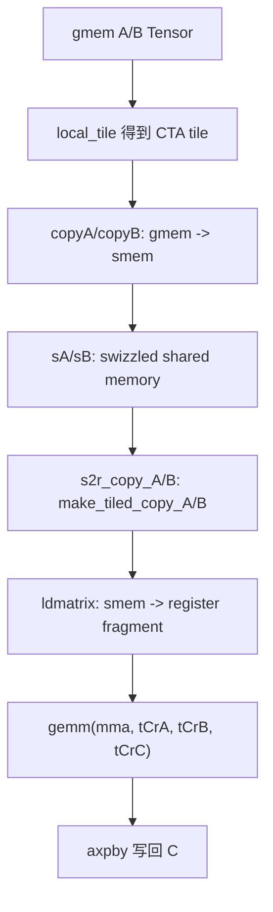
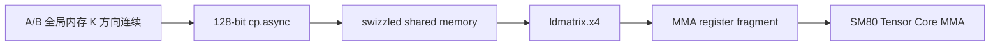

# CuTe Swizzle、向量化拷贝和 ldmatrix

这篇笔记围绕 `examples/cute/tutorial/sgemm_sm80.cu` 里的 **TN HGEMM half 特化** 展开。这里最核心的问题不是“GEMM 怎么算”，而是：

- 为什么 `A` 和 `B` 在这个 TN half 特化里都让 **K 方向连续**。
- 为什么共享内存布局要写成 `composition(Swizzle<3,3,3>{}, Layout<...>{})`。
- 为什么 gmem 到 smem 用 128-bit 向量化 `cp.async`，而 smem 到 rmem 用 `ldmatrix`。
- 为什么已经有 `TiledMMA` 之后，还要用 `make_tiled_copy_A` / `make_tiled_copy_B` 再构造 `TiledCopy`。
- `partition_S` 和 `retile_D` 分别解决什么问题。

相关源码位置：

- 示例源码：`examples/cute/tutorial/sgemm_sm80.cu`
- `Swizzle`：`include/cute/swizzle.hpp`
- `Swizzle + Layout composition`：`include/cute/swizzle_layout.hpp`
- `tile_to_shape`：`include/cute/layout.hpp`、`include/cute/layout_composed.hpp`
- `Copy_Atom` / `TiledCopy`：`include/cute/atom/copy_atom.hpp`
- `ldmatrix` 封装：`include/cute/arch/copy_sm75.hpp`
- `ldmatrix` traits：`include/cute/atom/copy_traits_sm75.hpp`

图示资源：

- [无 Swizzle 的共享内存布局](/blog-assets/gpu-programming/cute-swizzle-vectorize-ldmatrix/without-swizzle.pdf)
- [加入 Swizzle 后的共享内存布局](/blog-assets/gpu-programming/cute-swizzle-vectorize-ldmatrix/with-swizzle.pdf)
- [s2r atom A 的 TiledCopy 示意](/blog-assets/gpu-programming/cute-swizzle-vectorize-ldmatrix/s2r_atom_A.pdf)


## 启动配置

`sgemm_sm80.cu` 中有一个针对 `cute::half_t` 的 `gemm_tn` 特化。它是这篇笔记的主角：

```cpp
// Setup params for a TN HGEMM
template <class Alpha, class Beta>
void
gemm_tn(int m, int n, int k,
        Alpha alpha,
        cute::half_t const* A, int ldA,
        cute::half_t const* B, int ldB,
        Beta beta,
        cute::half_t      * C, int ldC,
        cudaStream_t stream = 0)
{
  using namespace cute;

  // 动态问题规模，逻辑形状是 (M, N, K)。
  auto M = int(m);
  auto N = int(n);
  auto K = int(k);
  auto prob_shape = make_shape(M, N, K);

  // TN strides。
  // A 视作 (M, K)，K 方向 stride 为 1。
  // B 视作 (N, K)，K 方向 stride 为 1。
  // C 视作 (M, N)，M 方向 stride 为 1。
  auto dA = make_stride(ldA, Int<1>{});
  auto dB = make_stride(ldB, Int<1>{});
  auto dC = make_stride(Int<1>{}, ldC);

  // CTA tile 形状。
  auto bM = Int<128>{};
  auto bN = Int<128>{};
  auto bK = Int< 64>{};
  auto cta_tiler = make_shape(bM, bN, bK);
  auto bP = Int<3>{};  // smem pipeline stage 数量。

  // swizzled shared memory layout。
  auto swizzle_atom = composition(
      Swizzle<3,3,3>{},
      Layout<Shape <_8,Shape <_8, _8>>,
             Stride<_8,Stride<_1,_64>>>{});

  auto sA = tile_to_shape(swizzle_atom, make_shape(bM,bK,bP));
  auto sB = tile_to_shape(swizzle_atom, make_shape(bN,bK,bP));
  auto sC = make_layout(make_shape(bM, bN));

  // gmem -> smem：128-bit cp.async。
  TiledCopy copyA = make_tiled_copy(
      Copy_Atom<SM80_CP_ASYNC_CACHEALWAYS<uint128_t>, cute::half_t>{},
      Layout<Shape<_16,_8>,Stride<_8,_1>>{},
      Layout<Shape< _1,_8>>{});

  TiledCopy copyB = make_tiled_copy(
      Copy_Atom<SM80_CP_ASYNC_CACHEALWAYS<uint128_t>, cute::half_t>{},
      Layout<Shape<_16,_8>,Stride<_8,_1>>{},
      Layout<Shape< _1,_8>>{});

  // smem -> rmem 后用于 Tensor Core MMA。
  TiledMMA mmaC = make_tiled_mma(
      SM80_16x8x16_F16F16F16F16_TN{},
      Layout<Shape<_2,_2>>{},
      Tile<_32,_32,_16>{});

  // smem -> rmem：ldmatrix.x4。
  Copy_Atom<SM75_U32x4_LDSM_N, half_t> s2r_atom_A;
  Copy_Atom<SM75_U32x4_LDSM_N, half_t> s2r_atom_B;

  int smem_size = int(sizeof(SharedStorage<
      cute::half_t, cute::half_t, decltype(sA), decltype(sB)>));

  dim3 dimBlock(size(mmaC));
  dim3 dimGrid(size(ceil_div(M, bM)), size(ceil_div(N, bN)));

  auto kernel_fptr = gemm_device<
    decltype(prob_shape), decltype(cta_tiler),
    cute::half_t, decltype(dA), decltype(sA), decltype(copyA), decltype(s2r_atom_A),
    cute::half_t, decltype(dB), decltype(sB), decltype(copyB), decltype(s2r_atom_B),
    cute::half_t, decltype(dC), decltype(sC), decltype(mmaC),
    decltype(alpha), decltype(beta)>;

  cudaFuncSetAttribute(
    kernel_fptr,
    cudaFuncAttributeMaxDynamicSharedMemorySize,
    smem_size);

  cudaFuncSetAttribute(
    kernel_fptr,
    cudaFuncAttributePreferredSharedMemoryCarveout,
    100);

  kernel_fptr<<<dimGrid, dimBlock, smem_size, stream>>>(
      prob_shape, cta_tiler,
      A, dA, sA, copyA, s2r_atom_A,
      B, dB, sB, copyB, s2r_atom_B,
      C, dC, sC, mmaC,
      alpha, beta);
}
```

这一段代码可以拆成三层：

- **问题层**：`prob_shape`、`dA/dB/dC` 描述矩阵形状和全局内存 layout。
- **CTA 层**：`cta_tiler`、`sA/sB/sC`、`copyA/copyB` 描述一个 CTA 负责的数据块和共享内存组织。
- **warp / MMA 层**：`mmaC`、`s2r_atom_A/B` 描述 warp 内部怎么用 `ldmatrix` 把共享内存数据搬到寄存器，再喂给 Tensor Core。

## 为什么 A 是行优先，B 是列优先

先看 `gemm_tn` 的 stride：

```cpp
auto dA = make_stride(ldA, Int<1>{});  // A: (M,K)
auto dB = make_stride(ldB, Int<1>{});  // B: (N,K)
auto dC = make_stride(Int<1>{}, ldC);  // C: (M,N)
```

这里最容易误读的是 `B`。示例里 `mB` 的逻辑视角不是 `(K, N)`，而是：

```cpp
Tensor mB = make_tensor(make_gmem_ptr(B), select<1,2>(shape_MNK), dB); // (N,K)
```

也就是说，`B` 在 CuTe 这个 kernel 里被看成 `(N, K)`。在这个视角下：

- `dB = (ldB, 1)`。
- `N` 方向 stride 是 `ldB`。
- `K` 方向 stride 是 `1`。

因此，**B 在 `(N, K)` 视角下是 K 方向连续**。如果硬要把它说回传统数学矩阵 `B(K,N)`，这相当于 global memory 中的 B 是 column-major 语义：同一个 `N` 列里的 K 连续。

为什么要这样做？

- gmem 到 smem 的 `copyA/copyB` 都使用 `SM80_CP_ASYNC_CACHEALWAYS<uint128_t>`。
- `half_t` 是 16 bit，`uint128_t` 一次搬 128 bit，也就是一次搬 8 个 half。
- 示例的 `Val layout` 是 `Layout<Shape<_1,_8>>{}`，表示每个 copy atom 在 K 方向拿 8 个连续 half。

所以 A 和 B 都要在 **K 方向连续**，才能让 gmem -> smem 的拷贝自然变成 128-bit 向量化拷贝。

如果 B 在传统 `(K,N)` 视角下是 row-major，看起来也可能有连续数据，但这个 kernel 的 `mB` 是 `(N,K)` 视角。为了让 `gB` 和 `sB` 的 K 方向拷贝对齐 `Layout<Shape<_1,_8>>{}`，这里选择把 B 组织成 `(N,K)` 中 K 连续。这样 `copyB` 和 `copyA` 可以使用同一套 k-major 128-bit 拷贝策略。

### `make_stride`

**用途**

`make_stride` 用来描述逻辑坐标每个维度移动 1 格时，底层指针移动多少个元素。

**示例**

```cpp
auto dA = make_stride(ldA, Int<1>{}); // (M,K)
auto dB = make_stride(ldB, Int<1>{}); // (N,K)
auto dC = make_stride(Int<1>{}, ldC); // (M,N)
```

**参数**

| 参数 | 含义 |
| --- | --- |
| 第 0 个 stride | 第 0 个逻辑维度移动 1 格时，指针增加的元素数。 |
| 第 1 个 stride | 第 1 个逻辑维度移动 1 格时，指针增加的元素数。 |

**注意点**

`make_stride(ldB, Int<1>{})` 不表示“B 一定是传统 row-major”。它只表示在当前张量视角 `(N,K)` 下，K 方向连续。

## smem layout

half 特化中的共享内存 layout 写法是：

```cpp
auto swizzle_atom = composition(
    Swizzle<3,3,3>{},
    Layout<Shape <_8,Shape <_8, _8>>,
           Stride<_8,Stride<_1,_64>>>{});

auto sA = tile_to_shape(swizzle_atom, make_shape(bM,bK,bP));
auto sB = tile_to_shape(swizzle_atom, make_shape(bN,bK,bP));
```

先只看里面的 base layout：

```cpp
Layout<Shape <_8,Shape <_8, _8>>,
       Stride<_8,Stride<_1,_64>>>{}
```

它可以看成一个 `8 x 64` 的 atom：

- 第 0 个 mode 大小是 `_8`，对应 M/N 方向的 8 行。
- 第 1 个 mode 是嵌套 `Shape<_8, _8>`，合起来是 K 方向的 64 个 half。
- stride 是 `Stride<_8, Stride<_1, _64>>`。

如果把坐标写成 `(m, k0, k1)`，线性 offset 近似是：

```cpp
offset = m * 8 + k0 * 1 + k1 * 64
```

这说明：

- `k0` 的 stride 是 1，所以局部 K 方向有连续的 8 个 half。
- 连续 8 个 half 正好是 16 Byte，也就是 128 bit。
- 这正好配合 `SM80_CP_ASYNC_CACHEALWAYS<uint128_t>` 的 gmem -> smem 向量化拷贝。

但只有这个 base layout 还不够。共享内存还要给 `ldmatrix` 服务，而 `ldmatrix` 是 warp 级指令，对共享内存 bank 冲突非常敏感。所以要在 base layout 外面套一层 `Swizzle<3,3,3>`。

这套 layout 的目标是同时满足两件事：

- **gmem -> smem**：K 方向保持 128-bit 连续搬运。
- **smem -> rmem**：共享内存地址经过 swizzle 后更适合 `ldmatrix.x4` 的 warp 级访问模式，减少 bank conflict。

## `composition` 的目的

这句代码：

```cpp
auto swizzle_atom = composition(Swizzle<3,3,3>{}, base_layout);
```

不是把 swizzle 之后的布局立即展平成普通 `Layout<Shape,Stride>`，而是构造一个组合布局：

```cpp
logical_coord -> base_layout -> linear_offset -> swizzle -> physical_offset
```

从读代码的角度看，可以先把它理解成：

```cpp
physical_offset = Swizzle<3,3,3>{}(base_layout(logical_coord))
```

也就是：

- `base_layout` 负责定义逻辑 `(m/n, k, pipe)` 到线性 offset 的正常排列。
- `Swizzle` 负责把这个线性 offset 的部分 bit 做 XOR 重排。
- 得到的 physical offset 才是真正写进 shared memory 的位置。

对照图：

- [无 Swizzle 的共享内存布局](/blog-assets/gpu-programming/cute-swizzle-vectorize-ldmatrix/without-swizzle.pdf)
- [加入 Swizzle 后的共享内存布局](/blog-assets/gpu-programming/cute-swizzle-vectorize-ldmatrix/with-swizzle.pdf)

无 swizzle 时，逻辑上连续的行/列更容易在 `ldmatrix` 访问时落到重复 bank。加入 swizzle 后，逻辑 tile 形状不变，但物理地址被重排，使 warp 内 lane 访问的 bank 分布更友好。

## `Swizzle`

**用途**

`Swizzle<BBits, MBase, SShift>` 是一个 bit-level 地址变换函数。它不改变 tensor 的逻辑 shape，只改变逻辑 offset 映射到 shared memory physical offset 的方式。

**源码摘录**

```cpp
template <int BBits, int MBase, int SShift = BBits>
struct Swizzle
{
  static constexpr int num_bits = BBits;
  static constexpr int num_base = MBase;
  static constexpr int num_shft = SShift;

  using bit_msk = cute::constant<int, (1 << num_bits) - 1>;
  using yyy_msk = cute::constant<int, bit_msk{} << (num_base + max(0,num_shft))>;
  using zzz_msk = cute::constant<int, bit_msk{} << (num_base - min(0,num_shft))>;
  using msk_sft = cute::constant<int, num_shft>;

  template <class Offset>
  CUTE_HOST_DEVICE constexpr static
  auto apply(Offset const& offset)
  {
    return offset ^ shiftr(offset & yyy_msk{}, msk_sft{});
  }

  template <class Offset>
  CUTE_HOST_DEVICE constexpr
  auto operator()(Offset const& offset) const
  {
    return apply(offset);
  }
};
```

**模板参数**

| 参数 | 含义 |
| --- | --- |
| `BBits` | 参与 XOR 的 bit 数。`Swizzle<3,3,3>` 中 `BBits = 3`，表示一次处理 3 个连续 bit，也就是有 $2^3 = 8$ 种变化。 |
| `MBase` | 保持不变的低位 bit 数。`MBase = 3` 表示最低 3 位不参与 swizzle。对当前 layout 的 offset 来说，这意味着低 3 位对应的 8 个连续位置保持连续。 |
| `SShift` | `YYY` 和 `ZZZ` 两组 bit 之间的位移距离。`SShift = 3` 表示把 `YYY` 右移 3 位后，与 `ZZZ` 所在位置做 XOR。 |

可以对照源码注释来读：

```cpp
// Given:
// 0bxxxxxxxxxxxxxxxxYYxxxxxxxxxZZxxx
//
// Result:
// 0bxxxxxxxxxxxxxxxxYYxxxxxxxxxAAxxx
//
// where AA = ZZ xor YY
```

这里每一段的长度由模板参数决定：

- 最右边 `xxx` 的个数由 `MBase` 决定。
- `ZZ` / `YY` 的长度由 `BBits` 决定。
- `ZZ` 和 `YY` 之间隔了多少位，由 `SShift` 决定。

### `Swizzle<3,3,3>` 的二进制推演

把 offset 写成二进制，可以粗略画成：

```cpp
// 高位                                                    低位
// ... Y2 Y1 Y0 Z2 Z1 Z0 C2 C1 C0
```

对 `Swizzle<3,3,3>`：

- `MBase = 3`，所以最低 3 位 `C2 C1 C0` 保持不动。
- `BBits = 3`，所以 `ZZZ` 和 `YYY` 都是 3 位。
- `SShift = 3`，所以 `YYY` 在 `ZZZ` 左边 3 位。

源码里的几个 mask 会变成：

```cpp
bit_msk = (1 << 3) - 1 = 0b000000111

zzz_msk = bit_msk << MBase
        = 0b000000111 << 3
        = 0b000111000

yyy_msk = bit_msk << (MBase + SShift)
        = 0b000000111 << 6
        = 0b111000000

msk_sft = 3
```

也就是：

```cpp
// bit 位置： 8 7 6 5 4 3 2 1 0
// yyy_msk:  1 1 1 0 0 0 0 0 0
// zzz_msk:  0 0 0 1 1 1 0 0 0
// low bits: 0 0 0 0 0 0 1 1 1
```

计算公式是：

```cpp
offset ^ shiftr(offset & yyy_msk{}, msk_sft{})
```

代入 `SShift = 3`，就是：

```cpp
new_offset = offset ^ ((offset & 0b111000000) >> 3)
```

分步骤看：

- `offset & yyy_msk`：取出 `YYY` 那一段 bit。
- `(offset & yyy_msk) >> 3`：把 `YYY` 移动到 `ZZZ` 的位置。
- `offset ^ (...)`：让 `ZZZ` 变成 `ZZZ xor YYY`。

所以最终效果是：

```cpp
ZZZ = ZZZ xor YYY
```

注意，`YYY` 自己不会被清掉，它仍然留在原来的高位位置；被改变的是 `ZZZ` 这几位。

### 为什么 64 会变成 72


先把 `64` 写成二进制：

```cpp
64 = 0b001000000
```

按 bit 位置看：

```cpp
// bit 位置： 8 7 6 5 4 3 2 1 0
// offset:   0 0 1 0 0 0 0 0 0
//              ^ Y0 在 bit 6
```

计算 `YYY`：

```cpp
offset & yyy_msk
= 0b001000000 & 0b111000000
= 0b001000000
= 64
```

把 `YYY` 右移 3 位，对齐到 `ZZZ` 的位置：

```cpp
(offset & yyy_msk) >> 3
= 0b001000000 >> 3
= 0b000001000
= 8
```

最后做 XOR：

```cpp
new_offset
= 64 ^ 8
= 0b001000000 ^ 0b000001000
= 0b001001000
= 72
```

所以：

```cpp
Swizzle<3,3,3>{}(64) == 72
```

直观理解就是：

- 原来的 offset `64` 在 `YYY` 区域有一个 bit。
- 这个 bit 被右移 3 位后，落到 `ZZZ` 区域的 bit 3。
- 原来的 `ZZZ` 是 0，所以 `0 xor 1 = 1`。
- 因此新 offset 多了 `8`，从 `64` 变成 `72`。

再看几个连续例子会更直观：

| 原 offset | 二进制 | `YYY >> 3` | 新 offset |
| --- | --- | --- | --- |
| `64` | `0b001000000` | `8` | `72` |
| `65` | `0b001000001` | `8` | `73` |
| `66` | `0b001000010` | `8` | `74` |
| `67` | `0b001000011` | `8` | `75` |
| `68` | `0b001000100` | `8` | `76` |
| `69` | `0b001000101` | `8` | `77` |
| `70` | `0b001000110` | `8` | `78` |
| `71` | `0b001000111` | `8` | `79` |

可以看到，低 3 位保持不变，所以 `64..71` 这一组内部仍然是连续的，只是整组被映射到了 `72..79`。

这就解释了为什么它还能保留局部连续性：低 3 位没有动，连续 8 个 offset 的相对顺序没有变。

### 和当前 smem layout 的关系

当前 base layout 是：

```cpp
Layout<Shape <_8,Shape <_8, _8>>,
       Stride<_8,Stride<_1,_64>>>{}
```

如果坐标写成 `(m, k0, k1)`，base offset 是：

```cpp
offset = m * 8 + k0 * 1 + k1 * 64
```

当 `k1 = 1`、`m = 0`、`k0 = 0` 时：

```cpp
base_offset = 64
swizzled_offset = 72
```

当 `k1 = 1`、`m = 0`、`k0 = 0..7` 时：

```cpp
base_offset      = 64, 65, 66, 67, 68, 69, 70, 71
swizzled_offset  = 72, 73, 74, 75, 76, 77, 78, 79
```

所以 `k0` 方向的 8 个连续 half 仍然连续。这一点很重要，因为 gmem -> smem 的 `cp.async<uint128_t>` 需要保持这 8 个 half 的连续写入形态。

但对于不同的 `m`、`k1` 组合，`YYY` 和 `ZZZ` 会产生不同 XOR 结果，于是不同逻辑行/块在 shared memory 里的物理位置会被错开。这正是 swizzle 用来改善 `ldmatrix` bank 分布的地方。

### 需要注意的单位

这里的 `offset` 是 CuTe layout 计算出来的 offset。对当前 `half_t` shared memory tensor 来说，可以按 half 元素位置理解它。`MBase = 3` 保护的是 offset 的低 3 位，也就是保护连续 8 个 half 位置的相对连续性；换算成字节就是 16 Byte，刚好对应 128-bit 向量化拷贝。

## `composition(Swizzle, Layout)`

**用途**

`composition(Swizzle, Layout)` 把一个普通 layout 变成 swizzled layout。逻辑坐标仍然按原 layout 解释，但最后得到的 offset 会被 swizzle 变换。

**原型**

```cpp
template <int B, int M, int S,
          class Shape, class Stride>
CUTE_HOST_DEVICE constexpr
auto
composition(Swizzle<B,M,S> const& sxor,
            Layout<Shape,Stride> const& layout)
{
  return composition(sxor, Int<0>{}, layout);
}
```

**参数**

| 参数 | 类型 | 含义 |
| --- | --- | --- |
| `sxor` | `Swizzle<B,M,S>` | 对线性 offset 做 XOR bit 重排的函数对象。 |
| `layout` | `Layout<Shape,Stride>` | 原始逻辑 layout。 |

**返回值**

| 类型 | 含义 |
| --- | --- |
| `ComposedLayout` | 一个组合 layout，保留 `layout` 的逻辑 shape，并在 offset 上叠加 swizzle。 |

**使用场景**

在 shared memory layout 中最常见。原因是 global memory 侧通常追求连续向量化，而 shared memory 侧还必须考虑 bank conflict。`composition` 可以让同一个逻辑 tile 同时拥有“看起来规则”的坐标和“实际更友好”的物理地址。

## `tile_to_shape`

**用途**

`tile_to_shape` 把一个小 layout atom 重复铺满到目标 shape。它适合这种场景：先设计一个局部布局 atom，再把它扩展到整个 CTA tile。

**普通 layout 原型**

```cpp
template <class Shape, class Stride,
          class TrgShape, class ModeOrder = LayoutLeft>
CUTE_HOST_DEVICE constexpr
auto
tile_to_shape(Layout<Shape,Stride> const& block,
              TrgShape             const& trg_shape,
              ModeOrder            const& ord_shape = {});
```

**composed layout 原型**

```cpp
template <class A, class O, class B,
          class Shape, class ModeOrder = GenColMajor>
CUTE_HOST_DEVICE constexpr
auto
tile_to_shape(ComposedLayout<A,O,B> const& layout,
              Shape                 const& trg_shape,
              ModeOrder             const& ord_shape = {})
{
  return composition(
      layout.layout_a(),
      layout.offset(),
      tile_to_shape(layout.layout_b(), trg_shape, ord_shape));
}
```

**参数**

| 参数 | 类型 | 含义 |
| --- | --- | --- |
| `layout` / `block` | `Layout` 或 `ComposedLayout` | 要重复铺开的局部 layout atom。 |
| `trg_shape` | shape | 目标 shape，例如 `(bM, bK, bP)`。 |
| `ord_shape` | mode order | 铺 tile 的 mode 顺序。默认按 CuTe 的默认顺序。 |

**返回值**

返回一个能覆盖 `trg_shape` 的 layout。对于 composed layout，会保留外层 swizzle，把内部 base layout 先扩展到目标 shape。

**本例**

```cpp
auto sA = tile_to_shape(swizzle_atom, make_shape(bM,bK,bP));
auto sB = tile_to_shape(swizzle_atom, make_shape(bN,bK,bP));
```

含义是：

- `swizzle_atom` 是一个小的 swizzled shared memory atom。
- `sA` 把它铺成 `(128,64,3)`，对应 `(BLK_M, BLK_K, PIPE)`。
- `sB` 把它铺成 `(128,64,3)`，对应 `(BLK_N, BLK_K, PIPE)`。

这里 `sA` 和 `sB` 使用同一个 swizzle atom，是因为它们在共享内存里都想实现 K 方向向量化写入，同时又要适配 `ldmatrix` 的读取模式。

## gmem 到 smem 的向量化拷贝

`copyA/copyB` 的定义是：

```cpp
TiledCopy copyA = make_tiled_copy(
    Copy_Atom<SM80_CP_ASYNC_CACHEALWAYS<uint128_t>, cute::half_t>{},
    Layout<Shape<_16,_8>,Stride<_8,_1>>{},  // Thr layout 16x8 k-major
    Layout<Shape< _1,_8>>{});               // Val layout  1x8 k-major

TiledCopy copyB = make_tiled_copy(
    Copy_Atom<SM80_CP_ASYNC_CACHEALWAYS<uint128_t>, cute::half_t>{},
    Layout<Shape<_16,_8>,Stride<_8,_1>>{},  // Thr layout 16x8 k-major
    Layout<Shape< _1,_8>>{});               // Val layout  1x8 k-major
```

这里有两层 layout：

- `Thr layout` 描述线程如何覆盖 copy tile。
- `Val layout` 描述每个线程一次 copy 多少个元素，以及这些元素沿哪个方向排布。

`Layout<Shape<_1,_8>>{}` 表示每个 copy atom 拿一个 `1 x 8` 的 half 向量。8 个 half 正好是 128 bit，所以可以交给 `SM80_CP_ASYNC_CACHEALWAYS<uint128_t>`。

这也是前面强调 A/B 都要 K 方向连续的原因：如果 K 方向不是 stride 1，那么 `1 x 8` 就不是连续 128 bit，向量化拷贝就不成立。

## s2r copy atom

gmem -> smem 的目标是把数据高效写进 shared memory。进入 mainloop 后，还要把 shared memory 数据搬进寄存器 fragment，给 Tensor Core MMA 使用。示例里提供了几种选择：

```cpp
// Copy_Atom<DefaultCopy, half_t> s2r_atom_A;
// Copy_Atom<UniversalCopy<half_t>, half_t> s2r_atom_A;
// Copy_Atom<SM75_U32x1_LDSM_N, half_t> s2r_atom_A;
// Copy_Atom<SM75_U32x2_LDSM_N, half_t> s2r_atom_A;
Copy_Atom<SM75_U32x4_LDSM_N, half_t> s2r_atom_A;
```

| Copy atom | 含义 | 适用场景 |
| --- | --- | --- |
| `DefaultCopy` | 默认 copy 路径，由 CuTe 根据上下文选择。 | 教程 / 泛型代码里可以先用，但性能和具体指令不够显式。 |
| `UniversalCopy<half_t>` | 通用元素级 copy。 | 语义简单，适合验证正确性，不强调 Tensor Core 路径性能。 |
| `SM75_U32x1_LDSM_N` | `ldmatrix.x1`，每个 warp 加载 1 个 `m8n8.b16` 矩阵。 | 更小的寄存器加载粒度。 |
| `SM75_U32x2_LDSM_N` | `ldmatrix.x2`，每个 warp 加载 2 个 `m8n8.b16` 矩阵。 | 中等加载粒度。 |
| `SM75_U32x4_LDSM_N` | `ldmatrix.x4`，每个 warp 加载 4 个 `m8n8.b16` 矩阵。 | 本例使用，匹配 `Tile<_32,_32,_16>` 的高吞吐 smem -> rmem 路径。 |

本例使用：

```cpp
Copy_Atom<SM75_U32x4_LDSM_N, half_t> s2r_atom_A;
Copy_Atom<SM75_U32x4_LDSM_N, half_t> s2r_atom_B;
```

这说明 A/B 从 shared memory 进入寄存器时都使用 `ldmatrix.sync.aligned.x4.m8n8.shared.b16`。

## LDSM

`copy_sm75.hpp` 中的相关封装如下：

```cpp
struct SM75_U32x4_LDSM_N
{
  using SRegisters = uint128_t[1];
  using DRegisters = uint32_t[4];

  CUTE_HOST_DEVICE static void
  copy(uint128_t const& smem_src,
       uint32_t& dst0, uint32_t& dst1, uint32_t& dst2, uint32_t& dst3)
  {
    uint32_t smem_int_ptr = cast_smem_ptr_to_uint(&smem_src);
    asm volatile (
      "ldmatrix.sync.aligned.x4.m8n8.shared.b16 {%0, %1, %2, %3}, [%4];\n"
      : "=r"(dst0), "=r"(dst1), "=r"(dst2), "=r"(dst3)
      :  "r"(smem_int_ptr));
  }
};
```

### `LDSM_N` 和 `LDSM_T`

`copy_sm75.hpp` 里有两类封装：

```cpp
SM75_U32x1_LDSM_N
SM75_U32x2_LDSM_N
SM75_U32x4_LDSM_N

SM75_U16x2_LDSM_T
SM75_U16x4_LDSM_T
SM75_U16x8_LDSM_T
```

区别在 PTX 指令上：

- `LDSM_N` 使用不带 `.trans` 的 `ldmatrix`。
- `LDSM_T` 使用带 `.trans` 的 `ldmatrix.trans`。

例如：

```cpp
// N
ldmatrix.sync.aligned.x4.m8n8.shared.b16

// T
ldmatrix.sync.aligned.x4.trans.m8n8.shared.b16
```

这里的 `N/T` 是 ldmatrix 读取 shared memory 后进入寄存器 fragment 的布局选择，不要和 GEMM 高层的 `transA/transB` 混为一谈。

本例 A/B 都选择 `SM75_U32x4_LDSM_N`，原因是：

- `TiledMMA` 的 A/B fragment layout 已经由 `SM80_16x8x16_F16F16F16F16_TN` 和 `make_tiled_copy_A/B` 组织好。
- shared memory 的 `sA/sB` swizzle atom 也是为了配合这种不带 `.trans` 的 `ldmatrix.x4` 读取。
- B 的数学意义虽然来自 TN GEMM 的 N 侧，但在这个 kernel 的 `(N,K)` 张量视角和 shared memory 组织下，仍然可以用 `LDSM_N`。

更详细的 lane 级 `ldmatrix` 行为可以看另一篇笔记：`src/content/blog/gpu-programming/cuda-ldmatrix.md`。

## kernel 内部

`gemm_device` 的主要数据流是：



这一节重点看 shared memory 到 register fragment 的部分。

### 源码摘录

```cpp
//
// Copy Atom retiling
//

TiledCopy s2r_copy_a = make_tiled_copy_A(s2r_atom_a, mma);
ThrCopy   s2r_thr_copy_a = s2r_copy_a.get_slice(threadIdx.x);
Tensor tXsA = s2r_thr_copy_a.partition_S(sA); // (CPY,MMA_M,MMA_K,PIPE)
Tensor tXrA = s2r_thr_copy_a.retile_D(tCrA);  // (CPY,MMA_M,MMA_K)

TiledCopy s2r_copy_b = make_tiled_copy_B(s2r_atom_b, mma);
ThrCopy   s2r_thr_copy_b = s2r_copy_b.get_slice(threadIdx.x);
Tensor tXsB = s2r_thr_copy_b.partition_S(sB); // (CPY,MMA_N,MMA_K,PIPE)
Tensor tXrB = s2r_thr_copy_b.retile_D(tCrB);  // (CPY,MMA_N,MMA_K)
```

这段代码做了四件事：

- 根据 `mma` 的 A/B fragment layout，构造适配 A/B operand 的 `TiledCopy`。
- 根据 `threadIdx.x` 取出当前线程负责的 copy slice。
- 用 `partition_S(sA/sB)` 把 shared memory tensor 切成当前线程要读的视图。
- 用 `retile_D(tCrA/tCrB)` 把 MMA fragment 寄存器 tensor 重新解释成 copy atom 的目的端视图。

### 为什么需要重新构造 `TiledCopy`

`copyA/copyB` 是 gmem -> smem 的 copy：

```cpp
copy(copy_a, tAgA(_,_,_,k_tile_next), tAsA(_,_,_,smem_pipe_write));
copy(copy_b, tBgB(_,_,_,k_tile_next), tBsB(_,_,_,smem_pipe_write));
```

它们服务的是 global memory 到 shared memory 的向量化搬运，关心的是：

- 哪些线程从 global memory 读。
- 每个线程读多少连续 half。
- 写到 shared memory 的哪个位置。

`s2r_copy_a/s2r_copy_b` 是 smem -> rmem 的 copy：

```cpp
copy(s2r_atom_a, tXsA_p(_,_,k_block_next), tXrA(_,_,k_block_next));
copy(s2r_atom_b, tXsB_p(_,_,k_block_next), tXrB(_,_,k_block_next));
```

它们服务的是 `ldmatrix` 和 MMA fragment，关心的是：

- `ldmatrix` 需要哪些 lane 提供 shared memory row address。
- 加载出的寄存器如何对应到 `tCrA/tCrB`。
- 这个 copy layout 必须和 `TiledMMA` 的 A/B operand layout 对齐。

所以即使已经有了 `copyA/copyB`，仍然必须用 `make_tiled_copy_A/B` 重新构造一套面向 MMA operand 的 `TiledCopy`。

## `make_tiled_copy_A` / `make_tiled_copy_B`

**用途**

这两个 API 根据 `TiledMMA` 的 A/B operand layout，把一个 `Copy_Atom` 扩展成覆盖 MMA operand tile 的 `TiledCopy`。

**源码摘录**

```cpp
template <class... CArgs, class... MArgs>
CUTE_HOST_DEVICE
auto constexpr
make_tiled_copy_A(Copy_Atom<CArgs...> const& copy_atom,
                  TiledMMA<MArgs...>  const& mma)
{
  return make_tiled_copy_impl(
      copy_atom,
      mma.get_layoutA_TV(),
      make_shape(tile_size<0>(mma), tile_size<2>(mma)));
}

template <class... CArgs, class... MArgs>
CUTE_HOST_DEVICE
auto constexpr
make_tiled_copy_B(Copy_Atom<CArgs...> const& copy_atom,
                  TiledMMA<MArgs...>  const& mma)
{
  return make_tiled_copy_impl(
      copy_atom,
      mma.get_layoutB_TV(),
      make_shape(tile_size<1>(mma), tile_size<2>(mma)));
}
```

**参数**

| 参数 | 类型 | 含义 |
| --- | --- | --- |
| `copy_atom` | `Copy_Atom<CArgs...>` | 单条 copy 原语，例如 `SM75_U32x4_LDSM_N`。 |
| `mma` | `TiledMMA<MArgs...>` | 当前 kernel 使用的 tiled MMA，提供 A/B operand 的线程-值布局。 |

**返回值**

| 类型 | 含义 |
| --- | --- |
| `TiledCopy` | 一个按 MMA operand layout 重排后的 copy 对象。 |

**从源码推断**

`make_tiled_copy_A` 使用：

```cpp
mma.get_layoutA_TV()
make_shape(tile_size<0>(mma), tile_size<2>(mma))
```

也就是覆盖 A operand 的 `(M,K)` tile。

`make_tiled_copy_B` 使用：

```cpp
mma.get_layoutB_TV()
make_shape(tile_size<1>(mma), tile_size<2>(mma))
```

也就是覆盖 B operand 的 `(N,K)` tile。

这正好对应 `gemm_device` 中的 fragment：

```cpp
Tensor tCrA = thr_mma.partition_fragment_A(sA(_,_,0)); // (MMA,MMA_M,MMA_K)
Tensor tCrB = thr_mma.partition_fragment_B(sB(_,_,0)); // (MMA,MMA_N,MMA_K)
```

## `s2r_atom_A.pdf` 示例图

这个资源对应的示例是：

```cpp
TiledMMA mma = make_tiled_mma(
    SM80_16x8x16_F16F16F16F16_TN{},
    Layout<Shape<_2,_2>>{},
    Tile<_32,_32,_16>{});

Copy_Atom<SM75_U32x1_LDSM_N, half_t> s2r_atom_A;
TiledCopy s2r_copy_a = make_tiled_copy_A(s2r_atom_A, mma);
print_latex(s2r_copy_a);
```

查看图：

- [s2r atom A 的 TiledCopy 示意](/blog-assets/gpu-programming/cute-swizzle-vectorize-ldmatrix/s2r_atom_A.pdf)

这张图应该按两个层次读：

- 左侧图的线程id指的是这一行的行起始位置是由谁提供的，比如第一行的T0代表这一行的行起始位置是T0提供的，具体可看[[cuda-ldmatrix]]
- 右侧图则是拷贝时每个线程的寄存器所负责的位置。也在[[cuda-ldmatrix]]讲到过

如果把 `SM75_U32x1_LDSM_N` 换成 `SM75_U32x4_LDSM_N`，copy atom 一次覆盖的 `m8n8.b16` 数量会变多，图里的 copy value 分布也会随之变化。

## `partition_S`

**用途**

`partition_S` 根据 `TiledCopy` 的 source layout，把一个 source tensor 切成当前线程负责读取的 view。

**源码摘录**

```cpp
template <class STensor>
CUTE_HOST_DEVICE
auto
partition_S(STensor&& stensor) const {
  auto thr_tensor = make_tensor(
      static_cast<STensor&&>(stensor).data(),
      TiledCopy::tidfrg_S(stensor.layout()));
  return thr_tensor(thr_idx_, _, repeat<rank_v<STensor>>(_));
}
```

**本例**

```cpp
Tensor tXsA = s2r_thr_copy_a.partition_S(sA); // (CPY,MMA_M,MMA_K,PIPE)
Tensor tXsB = s2r_thr_copy_b.partition_S(sB); // (CPY,MMA_N,MMA_K,PIPE)
```

含义是：

- `sA/sB` 是完整 CTA 级 shared memory tensor。
- `s2r_thr_copy_a/b` 是当前 `threadIdx.x` 对应的线程视图。
- `partition_S` 后，`tXsA/tXsB` 只保留当前线程参与 `ldmatrix` 时需要看到的 source 坐标。

注意 `tXsA` 仍然带 `PIPE` 维度，因为 shared memory 里有多级 pipeline。

## `retile_D`

**用途**

`retile_D` 不分配新的寄存器，也不 copy 数据。它只是把已有 destination tensor 的 layout 重新解释成 `TiledCopy` 期望的目的端 layout。

**源码摘录**

```cpp
template <class DTensor>
CUTE_HOST_DEVICE static
auto
retile_D(DTensor&& dtensor) {
  return make_tensor(
      static_cast<DTensor&&>(dtensor).data(),
      TiledCopy::retile(dtensor.layout()));
}
```

**参数**

| 参数 | 类型 | 含义 |
| --- | --- | --- |
| `dtensor` | tensor | 已经存在的目的端 tensor，例如 MMA A/B register fragment。 |

**返回值**

| 类型 | 含义 |
| --- | --- |
| tensor view | 与 `dtensor` 共享同一块数据，但 layout 被重排成 copy 需要的形状。 |

**本例**

```cpp
Tensor tCrA = thr_mma.partition_fragment_A(sA(_,_,0)); // (MMA,MMA_M,MMA_K)
Tensor tCrB = thr_mma.partition_fragment_B(sB(_,_,0)); // (MMA,MMA_N,MMA_K)

Tensor tXrA = s2r_thr_copy_a.retile_D(tCrA); // (CPY,MMA_M,MMA_K)
Tensor tXrB = s2r_thr_copy_b.retile_D(tCrB); // (CPY,MMA_N,MMA_K)
```

`tCrA/tCrB` 是 MMA 视角下的 register fragment。`copy(s2r_atom, src, dst)` 需要的是 copy atom 视角下的 destination fragment。`retile_D` 的作用就是把同一组寄存器换一个 layout 视角，让 `ldmatrix` 的输出可以直接落到 MMA 后续要用的 fragment 里。

更直白地说：

- `partition_fragment_A/B` 负责“申请一组 MMA 要用的寄存器 fragment”。
- `retile_D` 负责“告诉 copy atom 这些寄存器应该按什么布局写入”。
- 后续 `gemm(mma, tCrA, tCrB, tCrC)` 仍然使用原来的 `tCrA/tCrB` 视角参与计算。

## mainloop 中的配合方式

mainloop 里实际发生的是：

```cpp
copy(s2r_atom_a, tXsA_p(_,_,k_block_next), tXrA(_,_,k_block_next));
copy(s2r_atom_b, tXsB_p(_,_,k_block_next), tXrB(_,_,k_block_next));

gemm(mma, tCrA(_,_,k_block), tCrB(_,_,k_block), tCrC);
```

可以按时间线理解：

- 当前 `k_block` 正在用寄存器里的 `tCrA/tCrB` 做 MMA。
- 同时预取下一个 `k_block_next`，用 `ldmatrix` 从 `tXsA_p/tXsB_p` 读 shared memory。
- `ldmatrix` 的结果写入 `tXrA/tXrB`，而它们共享 `tCrA/tCrB` 的底层寄存器存储。
- 下一轮 `gemm` 直接从 `tCrA/tCrB` 的对应 `k_block` 使用这些寄存器。

这就是 `retile_D` 的关键价值：**copy 视角和 MMA 视角不同，但底层寄存器是同一份**。

## 小结

这段 half `gemm_tn` 的核心设计可以浓缩成一条链：



几个关键点：

- `dA = (ldA, 1)` 和 `dB = (ldB, 1)` 让 A/B 在当前张量视角下都是 K 方向连续。
- `Layout<Shape<_8,Shape<_8,_8>>, Stride<_8,Stride<_1,_64>>>` 保证局部 K 方向有 8 个连续 half，方便 128-bit copy。
- `Swizzle<3,3,3>` 改变 shared memory physical offset，用来配合 `ldmatrix` 减少 bank conflict。
- `tile_to_shape` 把局部 swizzled atom 铺满到 `(BLK_M/BLK_N, BLK_K, PIPE)`。
- `make_tiled_copy_A/B` 不是 gmem -> smem 的 copy，而是根据 `TiledMMA` 构造 smem -> rmem 的 `ldmatrix` copy。
- `partition_S` 切 shared memory source，`retile_D` 重解释 register fragment destination。

所以这套代码不是“为了 swizzle 而 swizzle”。它是在同时满足三个约束：

- 全局内存读要向量化。
- 共享内存读要适配 `ldmatrix` 并减少 bank conflict。
- 寄存器 fragment 要直接服务 `mma.sync`。
