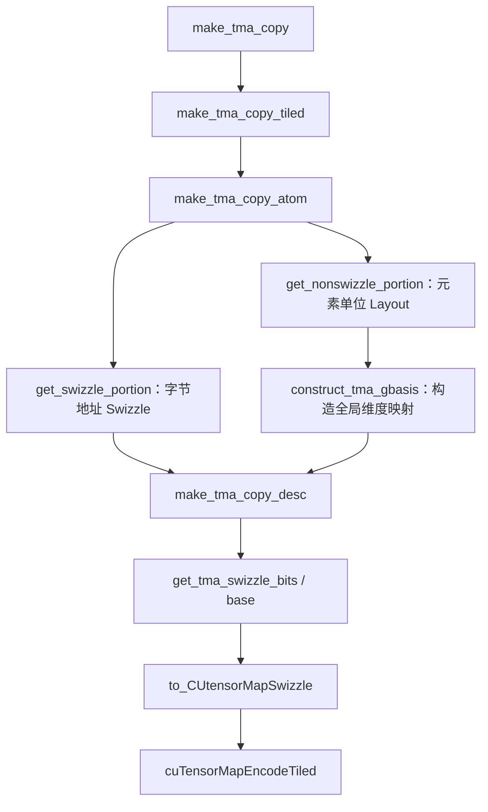

# CuTe Swizzle

## 共享内存的 bank 划分

共享内存（shared memory）是 GPU 上供线程块内线程协作使用的片上存储。为了支持并行访问，硬件将共享内存划分为多个 **bank（存储体）**，不同 bank 可以并行服务访问请求。

对于计算能力 5.x 及之后的 NVIDIA GPU，可以按下面的规则理解：

- **一共有 32 个 bank**，编号为 0～31。
- **连续的 32 bit 字依次映射到连续的 bank**。32 bit 等于 4 字节，因此相邻的两个 4 字节字会落到相邻的 bank，经过 bank 31 后回到 bank 0。
- **每个 bank 的带宽是每个时钟周期 32 bit**。这里的 32 bit 描述访问宽度，每个 bank 实际包含很多个这样的字。[参考 NVIDIA 官方说明](https://docs.nvidia.com/cuda/cuda-c-best-practices-guide/index.html#shared-memory-and-memory-banks)

如果共享内存中的字节地址为 $a$，对应的 bank 编号为：

$$
\operatorname{bank}(a) = \left\lfloor \frac{a}{4} \right\rfloor \bmod 32
$$

以 `float` 数组 `s` 为例，每个元素占 4 字节。假设 `s[0]` 位于 bank 0，那么映射关系如下：

| bank 编号 | 映射到该 bank 的元素 |
| --- | --- |
| 0 | `s[0]`、`s[32]`、`s[64]`、…… |
| 1 | `s[1]`、`s[33]`、`s[65]`、…… |
| 2 | `s[2]`、`s[34]`、`s[66]`、…… |
| …… | …… |
| 31 | `s[31]`、`s[63]`、`s[95]`、…… |

可以看到，bank 按 4 字节交错分布在整个地址空间中。对于这个数组，元素下标相差 32，就会落到同一个 bank；它们仍然是不同的存储位置。

## bank conflict 的原因

一个 warp 包含 32 个线程。分析共享内存访问时，要看**同一个 warp 在同一条访存指令中，各个活跃线程请求的地址落在哪些 bank 上**。

下面只讨论每个线程访问一个 32 bit 字的情况，例如读取一个 `float`：

- **访问不同 bank**：这些请求可以由不同 bank 并行服务。
- **访问同一 bank 中的不同字**：该 bank 需要分批服务这些请求，产生 **bank conflict（存储体冲突）**，降低有效带宽。
- **读取同一个字**：硬件可以将这个字广播给请求它的线程，不产生 bank conflict。[参考 NVIDIA 官方说明](https://docs.nvidia.com/cuda/cuda-programming-guide/02-basics/writing-cuda-kernels.html#shared-memory-access-patterns)

### 连续访问与跨步访问

令 `lane` 表示线程在 warp 内的编号，取值为 0～31，仍假设 `s[0]` 位于 bank 0：

| 每个线程读取的元素 | bank 编号 | 访问结果 |
| --- | --- | --- |
| `s[lane]` | $\mathrm{lane}$ | 32 个线程分别访问 32 个 bank，无冲突 |
| `s[2 * lane]` | $(2 \times \mathrm{lane}) \bmod 32$ | 只使用 16 个 bank，每个 bank 服务两个不同的字，产生 2 路冲突 |
| `s[32 * lane]` | $0$ | 32 个线程访问 bank 0 中的 32 个不同字，产生 32 路冲突 |
| `s[0]` | $0$ | 32 个线程读取同一个字，通过广播完成，无冲突 |

例如读取 `s[2 * lane]` 时，lane 0 读取 `s[0]`，lane 16 读取 `s[32]`。两个元素位于同一个 bank，但地址不同，因此需要分批读取。其他使用到的 bank 也有同样的情况。

读取 `s[0]` 则不同：所有线程都需要同一份数据，读取后广播即可。**判断冲突时，既要看 bank 是否相同，也要看访问的是不是同一个字。** 这里的广播指读取；多个线程向同一地址写入时，仍需处理写入竞争。

### 行优先矩阵的列访问

考虑一个存放在共享内存中的 $32 \times 32$ 的 `float` 矩阵 `tile`，采用行优先布局，每行连续存放 32 个元素。元素 `tile[r][c]` 相对于矩阵起点的元素偏移为：

$$
\operatorname{offset}(r, c) = 32r + c
$$

假设矩阵起点位于 bank 0，对应的 bank 编号为：

$$
\operatorname{bank}(r, c) = (32r + c) \bmod 32 = c
$$

这意味着**同一列的所有元素都落在同一个 bank 中**。

- **按行读取**：固定行号 `r`，lane `t` 读取 `tile[r][t]`。32 个线程分别访问 bank 0～31，无冲突。
- **按列读取**：固定列号 `c`，lane `t` 读取 `tile[t][c]`。32 个线程访问同一 bank 中的 32 个不同字，产生 32 路冲突。

矩阵转置中经常出现这种访问模式：数据按行写入共享内存，再按列读出。即使按行写入没有冲突，后续按列读取仍可能遇到冲突。起点落在其他 bank 时，上述 bank 编号会整体平移，冲突关系保持不变。

## 用 padding 改变行步幅

**padding（填充）** 的思路是在每行末尾增加空位，让相邻行的起始地址落到不同 bank。

对于上面的矩阵，可以让逻辑形状保持 $32 \times 32$，实际存储形状改为 $32 \times 33$。每行仍有 32 个有效元素，额外的一个 `float` 只用于填充，行步幅从 32 个元素变为 33 个元素。

此时，元素偏移为 $33r + c$。假设矩阵起点位于 bank 0，bank 编号变为：

$$
\operatorname{bank}(r, c) = (33r + c) \bmod 32 = (r + c) \bmod 32
$$

固定列号 `c`，让 lane `t` 读取 `tile[t][c]` 时，bank 编号会随 `t` 依次轮转，32 个线程恰好访问 32 个不同的 bank，消除了这个列访问模式中的冲突。[参考 NVIDIA 的 padding 示例](https://docs.nvidia.com/cuda/cuda-c-best-practices-guide/index.html#shared-memory-in-matrix-multiplication-c-aat)

padding 的代价是占用额外的共享内存，并要求地址计算使用填充后的行步幅。这个例子中增加了 32 个 `float`，也就是 128 字节。是否能消除冲突，需要结合元素大小、行步幅和线程访问方式分析；这里的结论针对每个线程访问一个 `float` 的模式。

## CuTe Swizzle 的源码

swizzle（交错重排）通过修改 offset 的部分位，重新安排数据的存储位置。先看 `include/cute/swizzle.hpp` 中的 `Swizzle` 定义：下面保留源码的成员和计算表达式，补充中文注释。公开源码见 [CuTe swizzle.hpp](https://github.com/NVIDIA/cutlass/blob/main/include/cute/swizzle.hpp)。

```cpp
/**
 * @brief 提取 offset 的源位段 YYY，移位后与目标位段 ZZZ 做 XOR。
 *
 * @tparam BBits 源位段和目标位段各有多少位。
 * @tparam MBase 两个位段中较低位段的起始位，最低 MBase 位保持不变。
 * @tparam SShift 源位段移到目标位段的位移量，默认等于 BBits。
 *                正数表示右移，负数表示左移。
 */
template <int BBits, int MBase, int SShift = BBits>
struct Swizzle
{
    // 将模板参数保存为编译期常量，供下面的掩码计算使用。
    static constexpr int num_bits = BBits;
    static constexpr int num_base = MBase;
    static constexpr int num_shft = SShift;

    static_assert(num_base >= 0, "MBase must be positive.");
    static_assert(num_bits >= 0, "BBits must be positive.");
    // 两个位段不能重叠，保证修改 ZZZ 时不会改变源位段 YYY。
    static_assert(abs(num_shft) >= num_bits,
                  "abs(SShift) must be more than BBits.");

    // cute::constant<int, V> 是表示编译期整数 V 的类型。
    // bit_msk 的低 num_bits 位全为 1，例如 num_bits = 3 时为 0b111。
    using bit_msk = cute::constant<int, (1 << num_bits) - 1>;

    // YYY 的掩码：用于从 offset 中提取源位段。
    // 正位移时 YYY 在高位；负位移时 YYY 在低位。
    using yyy_msk = cute::constant<int,
        bit_msk{} << (num_base + max(0, num_shft))>;

    // ZZZ 的掩码：标识哪些位会被 XOR 修改。
    // 正位移时 ZZZ 在低位；负位移时 ZZZ 在高位。
    using zzz_msk = cute::constant<int,
        bit_msk{} << (num_base - min(0, num_shft))>;

    // 编译期位移量：让 YYY 对齐到 ZZZ 的位置。
    using msk_sft = cute::constant<int, num_shft>;

    // 两个位段掩码的并集，标识参与变换的所有位。
    // 它供其他辅助接口使用，不参与 apply 的 offset 计算。
    static constexpr uint32_t swizzle_code =
        uint32_t(yyy_msk::value | zzz_msk::value);

    /**
     * @brief 计算 swizzle 后的 offset，只有 ZZZ 位段可能改变。
     * @tparam Offset 输入偏移的类型，可为普通整数或 CuTe 编译期整数。
     * @param offset 输入偏移，单位由调用者决定。
     * @return 执行 ZZZ ^= YYY 后的偏移。
     */
    template <class Offset>
    CUTE_HOST_DEVICE constexpr static
    auto apply(Offset const& offset)
    {
        // 1. offset & yyy_msk{}：提取 YYY，其他位清零。
        // 2. shiftr(..., msk_sft{})：把 YYY 移到 ZZZ 的位置。
        // 3. offset ^ ...：用 YYY 修改 ZZZ，保留其余位。
        return offset ^ shiftr(offset & yyy_msk{}, msk_sft{});
    }

    /**
     * @brief 允许用 Swizzle 对象直接调用同一个变换。
     * @tparam Offset 输入偏移的类型。
     * @param offset 输入偏移。
     * @return apply(offset) 的结果。
     */
    template <class Offset>
    CUTE_HOST_DEVICE constexpr
    auto operator()(Offset const& offset) const
    {
        return apply(offset);
    }

    /**
     * @brief 比较两个 Swizzle 的模板参数是否一致。
     * @tparam B 待比较对象的位段宽度。
     * @tparam M 待比较对象的低位段起始位。
     * @tparam S 待比较对象的位移量。
     * @param other 待比较的 Swizzle 对象，仅比较模板参数。
     * @return 三个模板参数全部相等时为 true。
     */
    template <int B, int M, int S>
    CUTE_HOST_DEVICE constexpr
    auto operator==(Swizzle<B, M, S> const& other) const
    {
        return B == BBits && M == MBase && S == SShift;
    }
};
```

这里的 `shiftr` 定义在 `include/cute/numeric/math.hpp`：位移量非负时右移，负数时左移其绝对值。`yyy_msk` 等别名是编译期整数类型，`yyy_msk{}` 可以参与整数运算，`yyy_msk::value` 则直接取出整数值。

## 例子：先处理一个整数 offset

先取一个整数 **`offset = 139`**，看看 `Swizzle<3,3,3>` 如何修改这个数字。

139 的二进制表示为 `0b010'001'011`。这里的单引号只是 C++ 数字分隔符，方便把 9 位分成三组，每组 3 位；位编号从最低位 bit 0 开始。

### 把模板参数代入掩码计算

`Swizzle<3,3,3>` 中的三个参数都为 3，源码中的常量和掩码因此为：

| 源码中的变量或类型 | 代入后的计算或数值 | 作用 |
| --- | --- | --- |
| `BBits`、`num_bits` | 3 | 源位段和目标位段各有 3 位 |
| `MBase`、`num_base` | 3 | 最低 3 位保持不变，较低位段从 bit 3 开始 |
| `SShift`、`num_shft` | 3 | 将源位段向右移动 3 位 |
| `bit_msk` | `(1 << 3) - 1 = 0b111`，即 7 | 生成 3 位宽的掩码 |
| `yyy_msk` | `0b111 << (3 + 3) = 0b111'000'000`，即 448 | 选取源位段 bit 8～6 |
| `zzz_msk` | `0b111 << (3 - 0) = 0b000'111'000`，即 56 | 标识目标位段 bit 5～3 |
| `msk_sft` | 3 | `shiftr` 使用的右移量 |
| `swizzle_code` | `448 OR 56 = 0b111'111'000`，即 504 | 标识两个位段的位置，不参与 `apply` 的计算 |
| `Offset` | `int` | 输入数字的类型 |
| `offset` | `0b010'001'011`，即 139 | 输入数字 |

`bit_msk`、`yyy_msk` 等类型在表中列出的数值，就是各自 `::value` 的值。**掩码用来选取位段；选出来的位段值取决于输入数字。** 对于 139：

| offset 的位段 | 当前值 | 如何处理 |
| --- | --- | --- |
| bit 8～6，`YYY` | `010`，即 2 | 提供 XOR 值，自身不变 |
| bit 5～3，`ZZZ` | `001`，即 1 | 与 `YYY` 做 XOR |
| bit 2～0 | `011`，即 3 | 保持不变 |

### 把 139 代入 `apply`

源码的核心表达式为：

```cpp
return offset ^ shiftr(offset & yyy_msk{}, msk_sft{});
```

代入之后，就是 `139 ^ ((139 & 448) >> 3)`。按源码的执行顺序计算：

| 计算步骤 | 二进制结果 | 十进制结果 | 含义 |
| --- | --- | --- | --- |
| `offset` | `0b010'001'011` | 139 | 原始数字 |
| `offset & yyy_msk{}` | `0b010'000'000` | 128 | 只留下源位段 `010`，其余位清零 |
| `shiftr(..., msk_sft{})` | `0b000'010'000` | 16 | 将 `010` 右移到目标位段的位置 |
| `offset ^ ...` | `0b010'011'011` | 155 | 目标位段变为 `001 XOR 010 = 011` |

所以，**`Swizzle<3,3,3>{}(139)` 的结果是 155**。高 3 位仍为 `010`，低 3 位仍为 `011`，只有中间的 3 位从 `001` 变成了 `011`。

`apply` 不需要再用 `zzz_msk` 做一次掩码操作，因为移位后的值已经只覆盖目标位段。再次对 155 执行同一个 Swizzle，会用未改变的 `YYY = 010` 再做一次 XOR：`011 XOR 010 = 001`，数字就恢复为 139。

## 例子：从矩阵的同列访问推导 Swizzle

现在把整数 offset 与矩阵坐标联系起来。考虑共享内存中的一个 **$32 \times 64$ 的 `cute::half_t` 矩阵**，每个元素占 2 字节，采用行优先布局：

```cpp
using namespace cute;

// 32 行、64 列；行步幅为 64 个元素，列步幅为 1 个元素。
using BaseLayout = Layout<Shape<_32, _64>, Stride<_64, _1>>;
constexpr BaseLayout base_layout{};
```

CuTe Layout 输出的是**元素偏移**，因此坐标 $(r,c)$ 对应的 offset 为 $x = 64r+c$，对应的字节偏移为 $2x$。假设矩阵起点按 128 字节对齐，位于 bank 0。

### 同一列为什么产生冲突

让一个 warp 的 **32 个线程全部参与读取**，lane $r$ 读取第 $r$ 行的同一列 $c$，每个线程读取一个 `half`。此时：

$$
\operatorname{bank}(r,c)
= \left\lfloor \frac{2(64r+c)}{4} \right\rfloor \bmod 32
= \left(32r+\left\lfloor \frac{c}{2} \right\rfloor\right) \bmod 32
= \left\lfloor \frac{c}{2} \right\rfloor
$$

**bank 编号与行号无关**。例如固定 $c=11$，32 个线程请求的元素偏移依次为 $11,75,139,\ldots,1995$，全部落在 bank 5，却属于 32 个不同的 32 bit 字，所以产生 32 路 bank conflict。

要消除这次访问的冲突，我们需要让**行号参与 bank 编号的计算**。可以保留逻辑坐标 $(r,c)$，只改变它最终对应的存储位置。

### 从 bank 编号确定目标位段

对 `half` 元素而言，bank 编号由**元素 offset 的 bit 5～1** 决定：

- bit 0 区分同一个 32 bit 字中的两个 `half`，不影响 bank 编号。
- bit 5～1 组成 5 位 bank 编号，对应 bank 0～31。
- bit 6 及更高位决定访问该 bank 中的哪个字。

要让同一列的 32 个线程访问 32 个不同 bank，需要让这 5 位随行号变化。**如果坚持保留连续 8 个 `half` 的组内顺序，即保留最低 3 位，那么 bank 编号中的 bit 2～1 也会被固定，同一列最多只能使用 8 个 bank，无法消除整个 warp 的冲突。**

因此，本例改为**保留一个 32 bit 字内的两个 `half` 的顺序，以 2 个 `half` 为一组重排**。只保留 bit 0，将 bit 5～1 全部作为目标位段。这就确定了 **`M = 1`**。

将列号拆成：

$$
c=2q+v,\qquad 0\le q<32,\quad 0\le v<2
$$

其中 $q$ 是行内的 32 bit 字编号，也就是列方向的组号；$v$ 是这个字内的 `half` 编号。原始元素偏移可以写为：

$$
x=64r+2q+v
$$

在这个 $32 \times 64$ 的矩阵里，offset 的位分布为：

| offset 的位 | 对应的坐标信息 | 设计目标 |
| --- | --- | --- |
| bit 10～6 | 行号 $r$，范围为 0～31 | 提供每行不同的重排依据 |
| bit 5～1 | 行内的字编号 $q$，范围为 0～31 | 改变 bank 编号 |
| bit 0 | 字内的 `half` 编号 $v$，范围为 0～1 | 保持同一个字内的顺序不变 |

这里的 `M = 1` 按**元素 offset** 计算，表示保留 $2^1=2$ 个 `half` 的组内编号。这组元素占 4 字节，但不能据此写成 `M = 2`。

### 再确定要修改几位

目标位段 bit 5～1 有 5 位，能够表示 $2^5=32$ 个 bank；行号 $r$ 也有 5 位。可以用行号的全部 5 位修改字编号：

$$
q'=q\mathbin{\oplus}r
$$

固定 $q$ 时，$r=0,\ldots,31$ 会使 $q'$ 遍历 0～31；固定 $r$ 时，这又是对行内 32 个字的一次置换，不会让两个字映射到同一个位置。

所以，**源位段和目标位段都需要 5 位，选择 `B = 5`**。如果只用 4 位行号提供 XOR 值，最多只能产生 16 种 bank 编号，仍无法区分全部 32 行。

### 最后确定从哪里移到哪里

需要提供 XOR 值的是行号，即 bit 10～6；需要修改的是字编号，即 bit 5～1。两个位段的起始位分别为 6 和 1，因此应将源位段**向右移动 5 位**：

$$
S=6-1=5
$$

代回前面源码中的掩码公式：

- `zzz_msk` 从 bit $M=1$ 开始，覆盖 $B=5$ 位，选中字编号，掩码值为 62。
- `yyy_msk` 从 bit $M+S=6$ 开始，覆盖 $B=5$ 位，选中行号，掩码值为 1984。
- `shiftr` 右移 $S=5$ 位，把行号对齐到字编号的位置，再执行 XOR。

到这里才得到本例采用的 **`Swizzle<5, 1, 5>`**：模板参数的顺序是 `B、M、S`，虽然推导时先确定的是 `M`。它满足源码要求的 $|S|\ge B$，源位段和目标位段没有重叠。

| 模板参数 | 数值 | 在这个矩阵中的含义 |
| --- | --- | --- |
| `B` | 5 | 用行号的 5 位修改 bank 编号对应的 5 位 |
| `M` | 1 | 保留一个 32 bit 字内两个 `half` 的编号 |
| `S` | 5 | 将 bit 10～6 的行号右移到 bit 5～1 |

### 检查重排后的同列访问

执行 Swizzle 后，物理元素偏移为：

$$
x'=64r+2(q\mathbin{\oplus}r)+v
$$

对应的 bank 编号为：

$$
\operatorname{bank}'(r,c)
=\left\lfloor\frac{2x'}{4}\right\rfloor\bmod32
=q\mathbin{\oplus}r
$$

固定列号时，$q$ 和 $v$ 都不变，32 行得到不同的 $q\mathbin{\oplus}r$，因此恰好访问全部 32 个 bank。仍以 $c=11$ 为例，此时 $q=5$、$v=1$，下面列出部分行：

| 行号 $r$ | 原始元素偏移 | 原始 bank | 新字编号 $5\mathbin{\oplus}r$ | 重排后的元素偏移 | 重排后的 bank |
| --- | --- | --- | --- | --- | --- |
| 0 | 11 | 5 | 5 | 11 | 5 |
| 1 | 75 | 5 | 4 | 73 | 4 |
| 2 | 139 | 5 | 7 | 143 | 7 |
| 3 | 203 | 5 | 6 | 205 | 6 |
| 4 | 267 | 5 | 1 | 259 | 1 |
| 5 | 331 | 5 | 0 | 321 | 0 |
| 6 | 395 | 5 | 3 | 391 | 3 |
| 7 | 459 | 5 | 2 | 453 | 2 |
| 8 | 523 | 5 | 13 | 539 | 13 |
| 15 | 971 | 5 | 10 | 981 | 10 |
| 16 | 1035 | 5 | 21 | 1067 | 21 |
| 23 | 1483 | 5 | 18 | 1509 | 18 |
| 24 | 1547 | 5 | 29 | 1595 | 29 |
| 31 | 1995 | 5 | 26 | 2037 | 26 |

原来的 32 路冲突被消除。这里 $(r,c)=(2,11)$ 的原始 offset 仍为 139，但本例推导出的变换是 `139 ^ ((139 & 1984) >> 5) = 143`。逻辑元素仍在第 2 行、第 11 列，实际存放在元素偏移 143 处。前面的整数示例用 `Swizzle<3,3,3>` 展示位运算过程；这里根据整个 warp 的列访问需求，选择了不同参数。

这个设计保留了每个 4 字节小组的连续性，但原本连续 16 字节的 8 个 `half` 在重排后不保证整体连续。如果还需要这样的向量访问，必须结合相应的线程访问方式重新分析布局。

## 用 composition 和 tile_to_shape 构造布局

参数确定后，用 `composition` 将 Swizzle 与原来的行优先 Layout 组合，得到基础布局块 `swizzle_atom`：

```cpp
#include <cute/layout.hpp>
#include <cute/swizzle_layout.hpp>

using namespace cute;

// 基础矩阵：32 行、64 列，offset 的单位是 half 元素。
using BaseLayout = Layout<Shape<_32, _64>, Stride<_64, _1>>;
constexpr BaseLayout base_layout{};

// 先由 base_layout 计算元素偏移，再由 Swizzle 修改偏移。
constexpr auto swizzle_atom = composition(Swizzle<5, 1, 5>{}, base_layout);

static_assert(base_layout(2, 11) == 139);
static_assert(swizzle_atom(2, 11) == 143);

// 将 32 × 64 的基础布局块沿行方向平铺成整个 128 × 64 共享内存布局。
constexpr auto smem_shape = make_shape(Int<128>{}, Int<64>{});
constexpr auto smem_layout = tile_to_shape(swizzle_atom, smem_shape);

static_assert(smem_layout(2, 11) == 143);
static_assert(smem_layout(34, 11) == 2048 + 143);
static_assert(size(smem_layout) == 8192);
static_assert(cosize(smem_layout) == 8192);
```

`composition(swizzle, base_layout)` 的调用关系是：

$$
(r,c)\xrightarrow{\mathrm{base\_layout}}64r+c
\xrightarrow{\mathrm{swizzle}}x'
$$

`tile_to_shape` 将这个基础布局块平铺到目标 shape。对于这里的行优先布局，目标矩阵有 4 个 $32 \times 64$ 的块，每个块占 $32\times64=2048$ 个元素。令全局行号 $r=32a+u$，其中 $a$ 是块编号，$u$ 是块内行号，则：

$$
\operatorname{smem\_layout}(r,c)
=2048a+64u+2(q\mathbin{\oplus}u)+v
$$

例如第 34 行属于第 1 个块，块内行号为 2，因此 `smem_layout(34, 11)` 等于 `2048 + swizzle_atom(2, 11)`。Swizzle 只使用块内行号的低 5 位，块之间的排列保持不变。`cosize` 表示布局所需覆盖的元素存储范围，本例仍为 8192 个 `half`，共 16384 字节，没有增加 padding。

每个块的起点都位于 bank 0，因此整个 warp 读取任意一个块内的同一列时，仍然访问 32 个不同 bank。使用这个布局时，写入和读取都必须按照 `smem_layout` 计算地址；这里消除的是 **32 个线程分别读取 32 行同一列、每线程一个 `half`** 的冲突，其他访问模式需要另行分析。

## 例子：用嵌套 Layout 消除 ldmatrix 的冲突

接下来换一种读取方式。共享内存中的逻辑矩阵仍然是 **$128\times64$ 的 `half` 矩阵**，初始存储采用行优先布局，但这次通过 `Copy_Atom<SM75_U32x4_LDSM_N, half_t>` 将数据读入 MMA 使用的寄存器。

这次要保留 `ldmatrix` 所需的每行连续 8 个 `half`，并让多行数据使用不同的 bank。可以直接调整 Layout 的 shape 和 stride 来做到这一点。

### ldmatrix.x4 怎样读取数据

在 `include/cute/arch/copy_sm75.hpp` 中，`SM75_U32x4_LDSM_N` 对应的 PTX 指令是：

```ptx
ldmatrix.sync.aligned.x4.m8n8.shared.b16 {r0, r1, r2, r3}, [addr];
```

这条指令由整个 warp 协作执行，一次读取 4 个 $8\times8$ 的 16 bit 元素子矩阵。每个子矩阵的一行有 8 个 `half`，占 16 字节，行起点需要按 16 字节对齐；最终每个线程得到 4 个 32 bit 寄存器。[参考 PTX 的 ldmatrix 说明](https://docs.nvidia.com/cuda/parallel-thread-execution/index.html#warp-level-matrix-instructions-ldmatrix)

32 个线程提供行起始地址的规则如下：

| warp 内的线程 | 提供的地址 |
| --- | --- |
| lane 0～7 | 第 0 个子矩阵的 8 个行起始地址 |
| lane 8～15 | 第 1 个子矩阵的 8 个行起始地址 |
| lane 16～23 | 第 2 个子矩阵的 8 个行起始地址 |
| lane 24～31 | 第 3 个子矩阵的 8 个行起始地址 |

**提供地址的线程与接收数据的线程不是一一对应的普通 load 关系。** 每个地址指定一整行连续 16 字节的数据，加载结果再按 `ldmatrix` 的规则分配到 warp 内的寄存器。

因此，这里的 bank 分析要检查**每个子矩阵的 8 行、每行 4 个 32 bit 字**。一个子矩阵占 128 字节，4 个子矩阵一共占 512 字节；不能因为整条 `.x4` 指令总共访问的数据超过 128 字节，就把必要的分批服务当作 bank conflict。

### 固定 MMA 配置和地址映射

`make_tiled_copy_A(s2r_atom_a, mma)` 使用 `mma` 的 A 操作数线程与元素映射，所以只给出 Copy Atom，还不能确定共享内存坐标。这里采用 [CUTLASS 的 sgemm_sm80 教程](https://github.com/NVIDIA/cutlass/blob/main/examples/cute/tutorial/sgemm_sm80.cu)中的配置：

```cpp
using namespace cute;

// 4 个 warp，线程布局为 2 × 2，MMA 的平铺形状为 32 × 32 × 16。
auto mma = make_tiled_mma(SM80_16x8x16_F16F16F16F16_TN{},
                          Layout<Shape<_2, _2>>{},
                          Tile<_32, _32, _16>{});

Copy_Atom<SM75_U32x4_LDSM_N, half_t> s2r_atom_a;
TiledCopy s2r_copy_a = make_tiled_copy_A(s2r_atom_a, mma);
```

下面先看 warp 0 的第一条 `ldmatrix.x4`，即 `partition_S` 结果中 `MMA_M = 0`、`MMA_K = 0` 的部分。通过 CuTe 的实际坐标分区，可以得到：

| 提供地址的线程 | 子矩阵在逻辑矩阵中的位置 | lane 对应的行起点坐标 |
| --- | --- | --- |
| lane 0～7 | 行 0～7，列 0～7 | $(\mathrm{lane},0)$ |
| lane 8～15 | 行 8～15，列 0～7 | $(\mathrm{lane},0)$ |
| lane 16～23 | 行 0～7，列 8～15 | $(\mathrm{lane}-16,8)$ |
| lane 24～31 | 行 8～15，列 8～15 | $(\mathrm{lane}-16,8)$ |

也就是说，这条指令读取逻辑上的 $16\times16$ 区域，并将它分成 4 个 $8\times8$ 子矩阵。其余 warp 和循环中的子矩阵使用相应的行、列偏移。

### 行优先布局为什么有冲突

原始布局的元素偏移为：

$$
x_{\mathrm{row}}(r,c)=64r+c
$$

将列号写成 $c=8q+v$，其中 $q$ 是列方向的 8 元素组号，$v$ 是组内位置。一个子矩阵固定 $q$，每行读取 $v=0,\ldots,7$，其 bank 编号为：

$$
\operatorname{bank}_{\mathrm{row}}(r,q,v)
=\left\lfloor\frac{2(64r+8q+v)}{4}\right\rfloor\bmod32
=4q+\left\lfloor\frac{v}{2}\right\rfloor
$$

**同一子矩阵的 8 行都使用同一组 4 个 bank**，每个 bank 都要读取 8 个不同的字，因此有 8 路 bank conflict。

例如第 0 个子矩阵的 $q=0$，8 行的起始元素偏移依次为 0、64、128、……、448，每行都使用 bank 0～3。第 2 个子矩阵的 $q=1$，每行都使用 bank 4～7，也有同样的冲突。

注意这里的 8 路来自**一个 $8\times8$ 子矩阵中，8 行的 16 字节片段挤在同一组 bank 上**。整个 warp 的 32 个线程都在执行 `.x4` 指令。

### 把 8 行的连续片段排到不同 bank

要保留每行 8 个 `half` 的连续性，同时避免冲突，可以让同一子矩阵的相邻行在物理存储中相隔 8 个元素，而不再相隔 64 个元素。

先构造一个 $8\times64$ 的基础布局块：

```cpp
// 行方向为 8 行；列方向拆成组内的 8 个元素和 8 个组。
// 组内元素连续，相邻行相隔 8 个元素，相邻组相隔 64 个元素。
using LdMatrixLayoutAtom = Layout<Shape<_8, Shape<_8, _8>>,
                                  Stride<_8, Stride<_1, _64>>>;
constexpr LdMatrixLayoutAtom layout_atom{};
```

这个 Layout 的第二个维度是嵌套 shape。将普通列号 $c$ 传入时，CuTe 按组内位置先变化的规则，将它拆成 $v=c\bmod8$ 和 $q=\lfloor c/8\rfloor$。各部分的含义为：

| shape 中的部分 | 坐标 | stride | 含义 |
| --- | --- | --- | --- |
| 第一维 `_8` | 块内行号 $u$ | `_8` | 相邻行的 16 字节片段紧邻存放 |
| 第二维中的第一个 `_8` | 组内位置 $v$ | `_1` | 一行中的 8 个 `half` 保持连续 |
| 第二维中的第二个 `_8` | 列组号 $q$ | `_64` | 相邻 $8\times8$ 子矩阵相隔 64 个元素 |

所以，基础布局块中的元素偏移为：

$$
x_{\mathrm{atom}}(u,c)=8u+v+64q
$$

它将每个 $8\times8$ 子矩阵作为一块连续存放，再沿列方向存放 8 个这样的块。对于固定 $q$ 的一个子矩阵：

$$
\operatorname{bank}_{\mathrm{atom}}(u,q,v)
=\left\lfloor\frac{2(8u+v+64q)}{4}\right\rfloor\bmod32
=4u+\left\lfloor\frac{v}{2}\right\rfloor
$$

此时 bank 编号会随块内行号 $u$ 改变。仍以第 0 个子矩阵为例：

| 子矩阵内的行号 $u$ | 行优先布局的行起始元素偏移 | 行优先布局使用的 bank | 新布局的行起始元素偏移 | 新布局使用的 bank |
| --- | --- | --- | --- | --- |
| 0 | 0 | 0～3 | 0 | 0～3 |
| 1 | 64 | 0～3 | 8 | 4～7 |
| 2 | 128 | 0～3 | 16 | 8～11 |
| 3 | 192 | 0～3 | 24 | 12～15 |
| 4 | 256 | 0～3 | 32 | 16～19 |
| 5 | 320 | 0～3 | 40 | 20～23 |
| 6 | 384 | 0～3 | 48 | 24～27 |
| 7 | 448 | 0～3 | 56 | 28～31 |

**8 行的 32 个字恰好覆盖全部 32 个 bank，每个 bank 读取一个字，消除了这个子矩阵的冲突。** 列组号 $q$ 对 bank 编号没有影响，因此其他列组也满足相同结论。

### 平铺到整个共享内存并读取

接着用 `tile_to_shape` 将基础布局块扩展到 $128\times64$：

```cpp
#include <cute/tensor.hpp>

using namespace cute;

using LdMatrixLayoutAtom = Layout<Shape<_8, Shape<_8, _8>>,
                                  Stride<_8, Stride<_1, _64>>>;
constexpr LdMatrixLayoutAtom layout_atom{};
constexpr auto smem_layout = tile_to_shape(
    layout_atom, make_shape(Int<128>{}, Int<64>{}));

static_assert(layout_atom(2, 11) == 83);
static_assert(smem_layout(2, 11) == 83);
static_assert(smem_layout(10, 11) == 512 + 83);
static_assert(size(smem_layout) == 8192);
static_assert(cosize(smem_layout) == 8192);
```

对于全局行号 $r=8a+u$，平铺后的偏移为：

$$
x_{\mathrm{smem}}(r,c)=512a+8u+v+64q
$$

每个基础布局块有 512 个 `half`，块之间增加的字节偏移为 1024，是 128 字节的整数倍，因此不会改变上述 bank 分布。整个布局仍占 8192 个 `half`，无需额外的 padding，也没有应用 Swizzle。

在 kernel 中，假设 `smem_a` 指向按 128 字节对齐、**已按这个新布局写入数据**的共享内存，可以按下面的方式建立读取视图：

```cpp
// smem_a 是 device 共享内存指针，存储 128 × 64 个 half。
// 按静态 Layout 类型在 device 端构造对象。
Tensor sA = make_tensor(make_smem_ptr(smem_a), decltype(smem_layout){});

auto mma = make_tiled_mma(SM80_16x8x16_F16F16F16F16_TN{},
                          Layout<Shape<_2, _2>>{},
                          Tile<_32, _32, _16>{});
ThrMMA thr_mma = mma.get_slice(threadIdx.x);
Tensor tCrA = thr_mma.partition_fragment_A(sA);

Copy_Atom<SM75_U32x4_LDSM_N, half_t> s2r_atom_a;
TiledCopy s2r_copy_a = make_tiled_copy_A(s2r_atom_a, mma);
ThrCopy s2r_thr_copy_a = s2r_copy_a.get_slice(threadIdx.x);

// 按 Copy Atom 划分共享内存源数据，并对齐已有的 MMA 寄存器视图。
Tensor tXsA = s2r_thr_copy_a.partition_S(sA);  // (CPY, MMA_M, MMA_K)
Tensor tXrA = s2r_thr_copy_a.retile_D(tCrA);   // (CPY, MMA_M, MMA_K)

// 读取第一个 MMA_K 分块，内部遍历 MMA_M 维度发出 ldmatrix 指令。
// 数据需要在此前由写入线程准备好，并完成必要的同步。
copy(s2r_atom_a, tXsA(_, _, Int<0>{}), tXrA(_, _, Int<0>{}));
```

`partition_S` 根据逻辑坐标和 `sA` 的 Layout 计算共享内存地址；`retile_D` 调整寄存器 Tensor 的视图，使加载结果符合 MMA 片段的排列，它本身不会读取或移动数据。真正执行读取的是 `copy`。

**修改 Layout 会改变实际的数据存储位置**，不能先按原来的行优先布局写入，再仅在读取时换一个 Layout；写入端也要按新布局存储。

## TMA 的 CUtensorMapSwizzle

TMA（Tensor Memory Accelerator，张量内存加速器）可以在全局内存与共享内存之间搬运一个多维数据块。TMA 使用 **tensor map 描述符**记录全局内存的形状、步幅、传输块形状，以及共享内存的 swizzle 模式。全局内存到共享内存的传输由硬件执行重排，反向传输则按同一模式还原数据排列。

### 重排发生在搬运时，选型要看后续访问

**在 TMA 将数据搬入共享内存、随后由线程或 GMMA 读取的流程中，swizzle 的主要用途是让后续共享内存访问减少 bank conflict。** TMA 负责把数据直接放到这种布局里，后续消费者按照同一布局找到元素。NVIDIA 的说明也从这个用途出发：全局内存中的顺序未必适合共享内存的访问方式，所以在搬运时改变共享内存排列。[参考共享内存 bank swizzling](https://docs.nvidia.com/cuda/cuda-programming-guide/04-special-topics/async-copies.html#shared-memory-bank-swizzling)


图中 TMA 是布局的写入者，线程或 GMMA 是布局的消费者。**选择哪一种 swizzle，需要先知道消费者怎样访问共享内存**。消费者是普通线程时，要分析同一条共享内存指令中的地址；消费者是 GMMA 时，要使用该指令支持的 major 方向和共享内存布局。

bank conflict 发生在共享内存端，普通线程的读取和写入都可能有冲突。例如线程做矩阵转置时，也可以利用这种布局减少写入冲突；TMA store 再按照描述符将数据还原到全局内存。这里的重排也不会改变全局矩阵的逻辑布局。

因此，分析一次 `gmem -> smem` 搬运是否有冲突，与分析随后 `smem -> register` 或 GMMA 的读取是否有冲突，是两个问题。即使写入方式已经高效，后续的列访问仍然可能需要 swizzle。TMA 由硬件执行块传输，也不能直接套用普通 warp 中 32 个线程的地址分配来推导其内部写入过程。

### 四种模式分别重排多大范围

先看本节讨论的四种 `CUtensorMapSwizzle` 模式。下面只列出相关枚举值；较新的 CUDA SDK 还包含使用 32B、64B 重排粒度的其他模式。[参考 CUDA Driver API](https://docs.nvidia.com/cuda/cuda-driver-api/group__CUDA__TENSOR__MEMORY.html)

```cpp
typedef enum CUtensorMapSwizzle_enum {
    CU_TENSOR_MAP_SWIZZLE_NONE = 0,  // 不执行 swizzle。
    CU_TENSOR_MAP_SWIZZLE_32B,       // 在 32 字节跨度内重排 16 字节小组。
    CU_TENSOR_MAP_SWIZZLE_64B,       // 在 64 字节跨度内重排 16 字节小组。
    CU_TENSOR_MAP_SWIZZLE_128B       // 在 128 字节跨度内重排 16 字节小组。
    // 其他模式在此省略。
} CUtensorMapSwizzle;
```

**32B、64B、128B 表示重排跨度，这三种模式的组内粒度都为 16 字节。** 例如 `128B` 模式有 8 个 16 字节小组，改变各组的位置，保留组内字节顺序。它也不是说整次传输只能搬运 128 字节；一个更大的 tile 可以重复使用这个模式。

对于本节采用的 `CU_TENSOR_MAP_INTERLEAVE_NONE`，传输块最内层维度的字节数不能超过 swizzle 跨度。例如 `half` 的 128B 模式最多允许这个维度有 64 个元素。这里限制的是描述符的 `boxDim[0]`，而不是整个全局矩阵的行宽。

### 从字节地址理解这三种模式

CuTe 用作用在**字节地址**上的 `Swizzle<B,4,3>` 表示这些硬件模式：

| CUDA 模式 | CuTe 的字节地址 Swizzle | 保留的低位 | XOR 的目标位段 | 提供 XOR 值的源位段 |
| --- | --- | --- | --- | --- |
| `NONE` | `Swizzle<0,4,3>` | 不修改任何位 | 无 | 无 |
| `32B` | `Swizzle<1,4,3>` | bit 3～0 | bit 4 | bit 7 |
| `64B` | `Swizzle<2,4,3>` | bit 3～0 | bit 5～4 | bit 8～7 |
| `128B` | `Swizzle<3,4,3>` | bit 3～0 | bit 6～4 | bit 9～7 |

- `M = 4`：最低 4 位是 16 字节小组内的字节位置，保持不变。
- `B = 1、2、3`：分别重排 2、4、8 个小组，对应 32、64、128 字节的跨度。
- `S = 3`：这是这些硬件模式约定的源位段与目标位段间距，源位段始终从 bit 7 开始。不能仅根据矩阵 shape 任意修改它。

以 128B 模式为例，令 $a$ 是未重排的共享内存字节地址：

$$
a'=a\mathbin{\oplus}\left((a\mathbin{\&}\mathtt{0x380})\gg3\right)
$$

`0x380` 选取 bit 9～7，右移后对齐到 bit 6～4。因而 16 字节小组的位置随地址中的高位发生变化，组内低 4 位保持不变。

### 例子：128B 模式怎样改善后续读取

仍以 $128\times64$、行优先的 `half` 矩阵为例。先固定一种消费者访问：**读取前 8 行中相同位置的 16 字节片段**。这也是前面 `ldmatrix` 分析中一个 $8\times8$ 子矩阵的访问形状，每行片段包含 8 个 `half`。

将列坐标写成 $c=8q+v$，其中 $0\le q<8$ 表示行内第几个 16 字节片段，$0\le v<8$ 表示片段内的 `half`。下面固定 $q$，让 $r=0,\ldots,7$。为简化相位计算，假设共享内存起点按 1024 字节对齐。

原始字节偏移和 bank 编号为：

$$
a(r,q,v)=128r+16q+2v
$$

$$
\operatorname{bank}(r,q,v)=4q+\left\lfloor\frac v2\right\rfloor
$$

每行片段占 4 个 32 bit 字，而 8 行的这 4 个字都映射到同一组 bank。因此，这次子矩阵读取有 **8 路 bank conflict**。

使用 128B 模式时，`Swizzle<3,4,3>` 将行号的低 3 位 XOR 到片段编号的 3 位上。对于这 8 行：

$$
a'(r,q,v)=128r+16(q\mathbin{\oplus}r)+2v
$$

$$
\operatorname{bank}'(r,q,v)
=4(q\mathbin{\oplus}r)+\left\lfloor\frac v2\right\rfloor
$$

固定 $q$ 时，$q\mathbin{\oplus}r$ 遍历 0～7。8 行分别使用不同的 4-bank 小组，合起来恰好覆盖 32 个 bank，每个 bank 只需要读取一个 32 bit 字。**改善的是这次后续读取；TMA 在搬运时提前完成了所需的存储重排。**

这个推导针对上述 8 行、每行 16 字节的读取，不能推广成“128B 模式消除了所有访问的冲突”。例如前面 32 个线程各读取一行同列 `half` 的标量访问，128B 模式只改变 bank 编号的高 3 位；32 行仍分布到 8 个 bank，每个 bank 对应 4 个不同的字，仍有 4 路冲突。那一节推导出的 `Swizzle<5,1,5>` 针对的是另一种访问，也不属于这里四种 TMA 硬件模式。

### 怎样选择 NONE、32B、64B、128B

先确定消费者，再筛选合法布局，最后判断该访问的冲突和实际性能。**仅知道共享内存 shape 和元素类型，还不足以确定最优模式。**

对于普通线程或 `ldmatrix`，按上一节的方法，列出一次指令实际读取的坐标，计算候选布局下的地址和 bank。如果原本的访问已经没有冲突，`NONE` 可以作为候选；如果目标是上面的 8 行片段读取，128B 模式能解决已经算出的冲突。

对于标准的 dense GMMA 共享内存输入，可以先采用 CUTLASS 的布局选择策略。本地 `include/cutlass/gemm/collective/builders/sm90_common.inl` 中，`ss_smem_selector` 按 major 方向，选择**能整齐平铺连续维度的最大布局 atom**。下面保留它的 K-major 分支；`BLK_K0` 是共享内存 tile 的 K 维最内层子模式的元素数，对于普通二维 tile 就是共享内存 tile 的 K 长度。**它不是单条 WGMMA 指令的 K 长度**：

```cpp
if constexpr (BLK_K0 % size<1>(GMMA::Layout_K_SW128_Atom<ElementType>{}) == 0) {
  return GMMA::Layout_K_SW128_Atom<ElementType>{};
}
else if constexpr (BLK_K0 % size<1>(GMMA::Layout_K_SW64_Atom<ElementType>{}) == 0) {
  return GMMA::Layout_K_SW64_Atom<ElementType>{};
}
else if constexpr (BLK_K0 % size<1>(GMMA::Layout_K_SW32_Atom<ElementType>{}) == 0) {
  return GMMA::Layout_K_SW32_Atom<ElementType>{};
}
else if constexpr (BLK_K0 % size<1>(GMMA::Layout_K_INTER_Atom<ElementType>{}) == 0) {
  return GMMA::Layout_K_INTER_Atom<ElementType>{};
}
else {
  static_assert(BLK_K0 % size<1>(GMMA::Layout_K_INTER_Atom<ElementType>{}) == 0,
                "BLK_K0 must be a multiple of size<1>(GMMA::Layout_K_INTER_Atom<ElementType>{})");
}
```

这些 atom 的定义后面会展开。对于 `half`，它们在 K 方向分别包含 64、32、16、8 个元素。因此，普通 K-major tile 的几个选择结果是：

| 共享内存 tile 的 K 长度 | 连续方向的字节数 | `ss_smem_selector` 的选择 | TMA 模式 |
| --- | --- | --- | --- |
| 64 | 128 | `Layout_K_SW128_Atom<half_t>` | `128B` |
| 32 | 64 | `Layout_K_SW64_Atom<half_t>` | `64B` |
| 16 | 32 | `Layout_K_SW32_Atom<half_t>` | `32B` |
| 8 | 16 | `Layout_K_INTER_Atom<half_t>` | `NONE` |

所以，对于这里 **`half`、K-major、$128\times64$ 的 tile，如果消费者使用相应的标准 GMMA 布局，SW128 是这个选择器给出的默认选项**。这是 GMMA 布局的选型策略，不能当成普通标量访问的通用无冲突结论。MN-major 分支则检查 M 或 N 连续维度的长度。层次化 shape 检查的是最内层子模式，不能只看各子模式相乘后的总长度。

TMA 描述符还要满足自己的约束。对于本节的 `CU_TENSOR_MAP_INTERLEAVE_NONE`，`boxDim[0]` 对应的字节数必须是 16 的倍数，启用 swizzle 时还必须不大于模式跨度。[参考 `cuTensorMapEncodeTiled` 的参数约束](https://docs.nvidia.com/cuda/cuda-driver-api/group__CUDA__TENSOR__MEMORY.html)

例如，一个最内层 box 宽度为 128 字节的描述符不能直接将枚举改成 `64B` 或 `32B`。要采用更小跨度，需要相应调整共享内存布局和 TMA box 的划分。如果 box 比 swizzle 跨度更窄，还需要为重排后的实际存储范围留足空间。**模式、共享内存 Layout、消费者使用的布局必须一起匹配，不能只替换一个枚举。**

### WGMMA 指令的 K 与共享内存 tile 的 K

WGMMA 的共享内存操作数通过描述符提供：warpgroup 共同发射指令，硬件按照描述符中的地址、步幅和 swizzle 模式读取矩阵。这里没有要求每个 lane 像普通 `ld.shared` 那样提供一个元素地址。不过，输出 D 的寄存器，以及 RS 形式中输入 A 的寄存器，仍然有明确的线程与元素映射。[参考 WGMMA 指令操作数](https://docs.nvidia.com/cuda/parallel-thread-execution/index.html#asynchronous-warpgroup-level-matrix-instructions-wgmma-mma)

因此，WGMMA 共享内存布局的分析应从硬件支持的 **canonical layout（规范布局）**出发。PTX 分别规定 K-major、MN-major 在四种模式下的布局 atom 和步幅关系；CuTe 的 `Layout_K_*_Atom`、`Layout_MN_*_Atom` 和 `make_gmma_desc` 就是在表达与检查这些约定。前面 8 行片段的 bank 推导解释了重排如何分散访问，但它不是 WGMMA 内部逐周期访存的模型，不能据此宣称某种模式下所有 WGMMA 访问都无冲突。[参考共享内存矩阵布局](https://docs.nvidia.com/cuda/parallel-thread-execution/index.html#asynchronous-warpgroup-level-matrix-shared-memory-layout)

以 F16 的 `wgmma.mma_async.sync.aligned.m64n64k16.f32.f16.f16` 为例，假设共享内存 A tile 是本节的 $128\times64$、K-major：

| 对象 | K 方向的元素数 | 对应的字节数 | 含义 |
| --- | --- | --- | --- |
| 单条 WGMMA 的 A 操作数 | 16 | 每行逻辑数据为 32 字节 | 一次矩阵乘累加使用的 K 片段 |
| 共享内存 A tile | 64 | 每行 128 字节 | TMA 搬入、供多次计算复用的矩阵块 |
| `Layout_K_SW128_Atom<half_t>` | 64 | 连续跨度为 128 字节 | 存储重排的基础布局，形状为 $8\times64$ |

选择器根据共享内存 tile 的 K 长度 64 选择 SW128。固定一个 64 行的 M 片段后，计算依次读取 K 为 0～15、16～31、32～47、48～63 的四个片段；每条指令的 K 仍是 16，四次读取使用同一种 SW128 存储布局。

为什么每行只读 32 字节，仍能使用 128B 重排？因为 **32 字节描述这次读取的逻辑数据量，128B 描述这些数据所在布局的重排跨度**。在起点按 1024 字节对齐的 SW128 布局中，前面已经得到：

$$
c_{\mathrm{physical}}
=8\left(\left\lfloor\frac c8\right\rfloor\mathbin{\oplus}(r\bmod8)\right)
+(c\bmod8)
$$

例如，第 6 行的逻辑列 0 位于该行的物理列 48。即使指令读取的是逻辑列 0～15，也需要从这种重排后的位置取数；描述符中的 SW128 模式告诉硬件怎样解释这些位置。

**不能用“指令 K × 元素字节数”直接确定 swizzle 跨度。** 实际选型先确定元素类型和 major 方向，再按共享内存 tile 的连续维度选择可平铺的布局 atom，匹配 TMA 与 WGMMA 描述符，最后通过性能测量判断是否需要调整。CUTLASS 的最大可平铺 atom 是默认策略，并不是由指令 K 唯一推导出的最优性能结论。

## 从 bit Layout 到 half 的共享内存访问

`include/cute/atom/mma_traits_sm90_gmma.hpp` 用一组布局别名描述 TMA 与 GMMA 共用的共享内存排列。先只看一个配置：**元素类型为 `half_t`，K 方向连续，使用 128B swizzle**。它的基础布局最终覆盖 $8\times64$ 个 `half`。[源码：mma_traits_sm90_gmma.hpp](https://github.com/NVIDIA/cutlass/blob/main/include/cute/atom/mma_traits_sm90_gmma.hpp)

### 先明确每个整数的单位

`Swizzle` 本身只做整数位运算，**它没有内置的 bit、字节或元素单位**。例如同一个 `Swizzle<3,4,3>` 可以接收任何整数；这个整数代表什么，取决于调用者。

普通 `Layout` 也只把坐标映射成整数，单位由这套布局的定义约定。本节源码的约定如下：

| 对象 | 输入 | 输出整数的含义 |
| --- | --- | --- |
| 最初的 bit Layout | 行号、行内的 bit 编号 | 相对于存储区起点的 **bit 偏移** |
| 转换后的 `half` Layout | 行号、行内的 `half` 编号 | 相对于存储区起点的 **`half` 元素偏移** |
| 绑定后的 `half_t*` 指针加法 | `half` 元素偏移 | 按每元素 2 字节计算出的 **字节地址** |
| 本节的 `Swizzle<3,4,3>` | 上一步得到的字节地址 | 重排后的 **字节地址** |

**这里的 Swizzle 最终处理字节地址，而最初的内层 Layout 按 bit 计数。** 它们通过类型转换和指针绑定接起来；下面逐步展开这个过程。

### 先建立 bit Layout

先把 Swizzle 放在一边，只看源码中的内层 Layout：

```cpp
using BitLayout = Layout<Shape<_8, _1024>, Stride<_1024, _1>>;
```

这套布局描述 8 行，每行 **1024 bit** 的存储。第二维每增加 1，表示前进 1 bit；换一行则前进 1024 bit，也就是 128 字节。

用 $(r,k_{\mathrm{bit}})$ 表示它的坐标，其中 $k_{\mathrm{bit}}$ 是行内的 bit 编号：

$$
L_{\mathrm{bit}}(r,k_{\mathrm{bit}})=1024r+k_{\mathrm{bit}}
$$

一个 `half` 占 16 bit，所以每行 1024 bit 可以容纳 $1024/16=64$ 个 `half`。**第 $c$ 个 `half` 的起始 bit 编号是 $16c$，不能直接把元素列号 $c$ 当作 bit 列号。**

例如 `half` 元素坐标 $(2,11)$ 在这套 bit Layout 中对应的起点坐标是 $(2,176)$：

$$
L_{\mathrm{bit}}(2,16\times11)=1024\times2+176=2224\ \mathrm{bit}
$$

这些坐标描述的是重排前的存储位置，Swizzle 还没有执行。

### ComposedLayout 怎样组织这些类型

`ComposedLayout<LayoutA, Offset, LayoutB>` 定义在 `include/cute/layout_composed.hpp`。它保存三个部分，普通的组合布局按下面的表达式计算：

```cpp
return layout_a()(offset() + layout_b()(coord));
```

也就是先用 `LayoutB` 计算偏移，加上 `Offset`，再调用 `LayoutA`。例如前面的 `composition(Swizzle<3,3,3>{}, base_layout)`，就是把元素偏移交给另一个同样按元素偏移解释的 Swizzle。

TMA/GMMA 的布局别名也使用这个容器，但在 `Offset` 的位置放了一个特殊类型标记。**带这个标记的布局由专门的 `make_tensor` 重载解释，在绑定指针之前用来保存访问规则。** 它的各部分不应直接按普通 `operator()` 拼成一个物理偏移。

`ComposedLayout` 的 shape 和 rank 仍来自 `LayoutB`；查看基础 shape、stride 时可以访问 `layout_b()`。外层重排通常无法用一套固定 stride 表达，因此 `ComposedLayout` 没有普通 Layout 意义上的 `stride()`。

### smem_ptr_flag 是什么

`include/cute/pointer_flagged.hpp` 中的定义为：

```cpp
// Bits 记录内层布局一个单位对应多少 bit，供之后的指针类型检查使用。
template <int Bits>
struct smem_ptr_flag_bits : Int<0> {};

using smem_ptr_flag = smem_ptr_flag_bits<1>;
```

`smem_ptr_flag` 是**等待绑定共享内存指针的类型标记**。最初内层 Layout 的一个单位是 1 bit，因此标记是 `smem_ptr_flag_bits<1>`；转换为 `half` 元素单位后，它会变成 `smem_ptr_flag_bits<16>`。

它继承 `Int<0>`，以便放进 `ComposedLayout` 的 `Offset` 位置并参与类型运算。但这个 0 并不是实际共享内存地址；标记本身也不持有指针。绑定时，`make_tensor` 会检查传入的是共享内存指针，而且指向的元素位宽与标记一致。

### GMMA 共享内存布局的完整源码

下面保留这组布局别名的完整定义，包括两种 major 的 bit 布局、转换到元素单位的别名，以及按 `Major` 选择布局的别名；只将分组注释改成中文。后面继续用 K-major、128B、`half_t` 的配置逐项展开。

```cpp
// 位于 cute::SM90::GMMA 命名空间。
// 外层 Swizzle 保留字节地址语义，由后面的指针绑定路径执行。
// smem_ptr_flag 记录内层偏移的单位位宽，等待转换和指针绑定。

// MN-major：M 或 N 方向连续，内层 Layout 的 shape 和 stride 按 bit 计数。
using Layout_MN_INTER_Atom_Bits = ComposedLayout<Swizzle<0,4,3>, smem_ptr_flag, Layout<Shape< _128,_8>,Stride<_1, _128>>>;
using Layout_MN_SW32_Atom_Bits  = ComposedLayout<Swizzle<1,4,3>, smem_ptr_flag, Layout<Shape< _256,_8>,Stride<_1, _256>>>;
using Layout_MN_SW64_Atom_Bits  = ComposedLayout<Swizzle<2,4,3>, smem_ptr_flag, Layout<Shape< _512,_8>,Stride<_1, _512>>>;
using Layout_MN_SW128_Atom_Bits = ComposedLayout<Swizzle<3,4,3>, smem_ptr_flag, Layout<Shape<_1024,_8>,Stride<_1,_1024>>>;

// K-major：K 方向连续，内层 Layout 的 shape 和 stride 按 bit 计数。
using Layout_K_INTER_Atom_Bits  = ComposedLayout<Swizzle<0,4,3>, smem_ptr_flag, Layout<Shape<_8, _128>,Stride< _128,_1>>>;
using Layout_K_SW32_Atom_Bits   = ComposedLayout<Swizzle<1,4,3>, smem_ptr_flag, Layout<Shape<_8, _256>,Stride< _256,_1>>>;
using Layout_K_SW64_Atom_Bits   = ComposedLayout<Swizzle<2,4,3>, smem_ptr_flag, Layout<Shape<_8, _512>,Stride< _512,_1>>>;
using Layout_K_SW128_Atom_Bits  = ComposedLayout<Swizzle<3,4,3>, smem_ptr_flag, Layout<Shape<_8,_1024>,Stride<_1024,_1>>>;

// MN-major：按 Type 的位宽执行 upcast，内层 Layout 改为元素单位。
template <class Type>
using Layout_MN_INTER_Atom = decltype(upcast<sizeof_bits<Type>::value>(Layout_MN_INTER_Atom_Bits{}));
template <class Type>
using Layout_MN_SW32_Atom  = decltype(upcast<sizeof_bits<Type>::value>(Layout_MN_SW32_Atom_Bits{}));
template <class Type>
using Layout_MN_SW64_Atom  = decltype(upcast<sizeof_bits<Type>::value>(Layout_MN_SW64_Atom_Bits{}));
template <class Type>
using Layout_MN_SW128_Atom = decltype(upcast<sizeof_bits<Type>::value>(Layout_MN_SW128_Atom_Bits{}));

// K-major：按 Type 的位宽执行 upcast，内层 Layout 改为元素单位。
template <class Type>
using Layout_K_INTER_Atom = decltype(upcast<sizeof_bits<Type>::value>(Layout_K_INTER_Atom_Bits{}));
template <class Type>
using Layout_K_SW32_Atom  = decltype(upcast<sizeof_bits<Type>::value>(Layout_K_SW32_Atom_Bits{}));
template <class Type>
using Layout_K_SW64_Atom  = decltype(upcast<sizeof_bits<Type>::value>(Layout_K_SW64_Atom_Bits{}));
template <class Type>
using Layout_K_SW128_Atom = decltype(upcast<sizeof_bits<Type>::value>(Layout_K_SW128_Atom_Bits{}));

// 根据 GMMA::Major 参数选择 MN-major 或 K-major 的元素布局。
template <class Type, Major tnsp>
using Layout_INTER_Atom = typename conditional<tnsp == Major::MN,
                                               Layout_MN_INTER_Atom<Type>,
                                               Layout_K_INTER_Atom<Type>>::type;
template <class Type, Major tnsp>
using Layout_SW32_Atom = typename conditional<tnsp == Major::MN,
                                              Layout_MN_SW32_Atom<Type>,
                                              Layout_K_SW32_Atom<Type>>::type;
template <class Type, Major tnsp>
using Layout_SW64_Atom = typename conditional<tnsp == Major::MN,
                                              Layout_MN_SW64_Atom<Type>,
                                              Layout_K_SW64_Atom<Type>>::type;
template <class Type, Major tnsp>
using Layout_SW128_Atom = typename conditional<tnsp == Major::MN,
                                               Layout_MN_SW128_Atom<Type>,
                                               Layout_K_SW128_Atom<Type>>::type;
```

### 现在看源码中的一个别名

有了上面三个对象，再看本节要分析的原始别名：

```cpp
// 位于 cute::SM90::GMMA 命名空间。
using Layout_K_SW128_Atom_Bits = ComposedLayout<
    Swizzle<3,4,3>,   // 之后作用于共享内存字节地址的重排规则。
    smem_ptr_flag,    // 尚未绑定的指针标记，当前单位为 1 bit。
    Layout<Shape<_8,_1024>, Stride<_1024,_1>>>;  // 坐标到 bit 偏移。
```

这个类型同时记录三件事：

- **基础存储范围**：8 行，每行 1024 bit。
- **实际地址如何重排**：绑定指针后，对字节地址执行 `Swizzle<3,4,3>`。
- **当前偏移单位与指针要求**：以 1 bit 为单位描述，等待按目标元素类型转换并绑定指针。

名字中的 `Bits` 对应内层 Layout 的单位。它没有要求外层 Swizzle 接收 bit 偏移；后者要在指针访问阶段接收字节地址。

### sizeof_bits 和 decltype 分别做什么

元素类型确定后，源码通过下面的别名获得元素布局：

```cpp
template <class Type>
using Layout_K_SW128_Atom = decltype(
    upcast<sizeof_bits<Type>::value>(Layout_K_SW128_Atom_Bits{}));
```

先拆开这个表达式：

- `sizeof_bits<Type>::value`：取得一个 `Type` 元素的位宽。对 `half_t`，结果是 16。
- `upcast<16>(...)`：把原来以 bit 计数的布局转换为以 16 bit 元素计数的布局，返回一个新的布局对象。
- `decltype(...)`：取这个返回对象的 **C++ 类型**，用它定义别名。`decltype` 中的表达式不会在运行时执行。

`cute::sizeof_bits` 定义在 `include/cute/numeric/numeric_types.hpp`，继承 `cutlass::sizeof_bits`。后者的通用定义位于 `include/cutlass/numeric_size.h`：

```cpp
// cutlass 命名空间中的通用定义。
template <typename T>
struct sizeof_bits {
    static constexpr int value = int(sizeof(T) * 8);
};
```

因此普通的 `uint8_t`、`half_t`、`float` 分别得到 8、16、32。特殊的低位宽类型有对应特化，不能一律用 C++ 对象大小来代替逻辑元素位宽。`sizeof_bits_v<T>` 则是 `sizeof_bits<T>::value` 的便捷写法。

### upcast 后的完整类型是什么

这里调用的对象带 `smem_ptr_flag_bits`，因此选择 `pointer_flagged.hpp` 中的专门重载：

```cpp
/**
 * @brief 把内层布局转换到更大的单位，同时更新待绑定指针的位宽。
 * @tparam N 新单位包含多少个旧单位。
 * @tparam SwizzleFn 之后作用于字节地址的变换类型。
 * @tparam B 标记记录的旧位宽，与 Swizzle 的 num_bits 无关。
 * @tparam Layout 内层坐标到偏移的布局类型。
 * @param layout 带共享内存指针标记的组合布局。
 * @return 保留 Swizzle、更新指针标记和内层布局后的对象。
 */
template <int N, class SwizzleFn, int B, class Layout>
CUTE_HOST_DEVICE constexpr
auto upcast(ComposedLayout<SwizzleFn, smem_ptr_flag_bits<B>, Layout> const& layout)
{
    return composition(layout.layout_a(),
                       smem_ptr_flag_bits<B * N>{},
                       upcast<N>(layout.layout_b()));
}
```

代入 $N=16$、标记位宽 $B=1$，它分别处理三个部分：

| 部分 | 转换前 | 转换后 | 为什么这样转换 |
| --- | --- | --- | --- |
| 外层 Swizzle | `Swizzle<3,4,3>` | `Swizzle<3,4,3>` | 后面仍处理字节地址，单位没有改变 |
| 指针标记 | `smem_ptr_flag_bits<1>` | `smem_ptr_flag_bits<16>` | 新的一个单位是 16 bit 的 `half` |
| 内层 Layout | shape $(8,1024)$，stride $(1024,1)$ | shape $(8,64)$，stride $(64,1)$ | 连续维度按 16 bit 一组计数，行步幅也改成元素数 |

其中内层 Layout 的 `upcast<16>` 定义在 `layout.hpp`。对本例的连续维度，shape 从 1024 除以 16 得到 64，stride 保持 1；行数仍为 8，行 stride 从 1024 除以 16 得到 64。

所以 **`Layout_K_SW128_Atom<half_t>` 的完整结果类型**为：

```cpp
using HalfAtom = ComposedLayout<
    Swizzle<3,4,3>,
    smem_ptr_flag_bits<16>,
    Layout<Shape<_8,_64>, Stride<_64,_1>>>;
```

此时内层 Layout 的输入坐标改为 $(r,c)$，第二维是 `half` 的列号，输出也是 `half` 元素偏移：

$$
L_{\mathrm{half}}(r,c)=64r+c
=\frac{L_{\mathrm{bit}}(r,16c)}{16}
$$

例如，原来通过 $(2,176)$ 算出的 2224 bit，现在通过 $(2,11)$ 直接算出 $2224/16=139$ 个 `half`。**表示的存储位置相同，坐标和偏移的计数单位都变了。** `upcast` 不会搬运数据。

反向的带标记 `downcast<N>` 重载保留 Swizzle，将标记位宽除以 $N$，并对内层 Layout 执行 `downcast<N>`。

### 绑定指针后 Tensor 保存什么

现在可以把 `HalfAtom` 与真实的共享内存指针绑定。假设 `smem_a` 是指向 device 共享内存的 `half_t*`：

```cpp
Tensor sA = make_tensor(make_smem_ptr(smem_a), HalfAtom{});
```

第一个单参数 `make_smem_ptr` 给指针添加共享内存类型标记。随后选中 `pointer_flagged.hpp` 的专门 `make_tensor` 重载：

```cpp
/**
 * @brief 将布局中的待绑定标记解释为真实的共享内存指针访问规则。
 * @tparam Iterator 共享内存指针包装类型。
 * @tparam SwizzleFn 作用于字节地址的变换类型。
 * @tparam B 布局要求的元素位宽。
 * @tparam Layout 以元素为单位的内层布局类型。
 * @param ptr 指向 device 共享内存的指针，不接管存储空间。
 * @param layout 带指针类型标记的组合布局。
 * @return 使用 Swizzle 指针和普通元素 Layout 的 Tensor 视图。
 */
template <class Iterator, class SwizzleFn, int B, class Layout>
CUTE_HOST_DEVICE constexpr
auto make_tensor(
    Iterator const& ptr,
    ComposedLayout<SwizzleFn, smem_ptr_flag_bits<B>, Layout> const& layout)
{
    static_assert(is_smem<Iterator>::value, "Expected smem.");
    static_assert(B == sizeof_bits<iter_value_t<Iterator>>::value,
                  "Expected a B-bit pointer type.");
    return make_tensor(make_smem_ptr(ptr.get(), layout.layout_a()),
                       layout.layout_b());
}
```

`iter_value_t<Iterator>` 取得指针指向的元素类型，这里是 `half_t`。断言检查共享内存标记和 16 bit 位宽都匹配，然后将 Swizzle 转移到指针上。这次构造等价于：

```cpp
using ElementLayout = Layout<Shape<_8,_64>, Stride<_64,_1>>;

// 双参数版本：共享内存指针同时带上字节地址 Swizzle。
auto swizzled_ptr = make_smem_ptr(smem_a, Swizzle<3,4,3>{});
Tensor sA = make_tensor(swizzled_ptr, ElementLayout{});
```

绑定后的两个部分为：

| Tensor 的部分 | 内容 | 访问时做什么 |
| --- | --- | --- |
| Layout | `Layout<Shape<_8,_64>, Stride<_64,_1>>` | 把元素坐标变成元素偏移 |
| 指针引擎中的 iterator | `swizzle_ptr<Swizzle<3,4,3>, smem_ptr<half_t*>>` | 先按元素偏移移动指针，再重排字节地址并解引用 |

`smem_ptr_flag_bits<16>` 完成了类型检查和构造分派，**不再作为结果 Tensor 的一部分存在**。bit Layout 也已经在类型转换时变成了元素 Layout，读取一个元素时不需要先在运行时计算 bit 坐标。

`pointer.hpp` 的双参数 `make_smem_ptr(ptr, swizzle)` 内部调用 `make_swizzle_ptr(make_smem_ptr(ptr), swizzle)`。当 Swizzle 的位数为 0 时，专门重载直接返回原指针；有重排时，生成定义在 `pointer_swizzle.hpp` 中的 `swizzle_ptr`。

### 用坐标 (2,11) 算完一次访问

现在完整计算 `sA(2, 11)`。假设共享内存指针的字节地址为 **$P=\mathtt{0x1000}$**，按 1024 字节对齐。这是用于演算的地址值。

第一步，Tensor 的元素 Layout 计算：

$$
x=L_{\mathrm{half}}(2,11)=64\times2+11=139
$$

第二步，指针仍是 `half_t*`，`smem_a + 139` 在字节地址上前进 $139\times2=278$ 字节：

$$
a=P+2x=\mathtt{0x1000}+278=\mathtt{0x1116}
$$

第三步，`swizzle_ptr` 在解引用时才将这个地址转成整数，执行 Swizzle。它在 `pointer_swizzle.hpp` 中的核心表达式为：

```cpp
return reinterpret_cast<T*>(
    SwizzleFn::apply(reinterpret_cast<uintptr_t>(ptr)));
```

这里送进 `Swizzle<3,4,3>` 的数字是 **字节地址 `0x1116`**。代入掩码与移位：

$$
a'=\mathtt{0x1116}\mathbin{\oplus}
\left((\mathtt{0x1116}\mathbin{\&}\mathtt{0x380})\gg3\right)
=\mathtt{0x1116}\mathbin{\oplus}\mathtt{0x20}
=\mathtt{0x1136}
$$

第四步，将重排后的地址转回 `half_t*`，读取该位置的元素。它相对于原始指针的距离为：

$$
\frac{\mathtt{0x1136}-\mathtt{0x1000}}{2}
=\frac{310}{2}=155
$$

因此，**在这个起始地址下，`sA(2,11)` 读取的是原始共享内存指针 `smem_a[155]` 的位置**。

将这条链与最初的 bit Layout 对照：

| 阶段 | 数值或表达式 | 单位与含义 |
| --- | --- | --- |
| 要访问的元素 | $(2,11)$ | 第 2 行、第 11 个 `half` |
| 它在旧 bit Layout 中的起点 | $(2,16\times11)=(2,176)$ | 第 2 行、行内第 176 bit |
| 旧 Layout 的偏移 | $1024\times2+176=2224$ | bit，重排前的位置 |
| 新 Layout 的偏移 | $64\times2+11=139$ | `half` 元素，重排前的位置 |
| 指针加法对应的字节偏移 | $139\times2=278$ | 字节，等于 $2224/8$ |
| Swizzle 的输入 | $P+278=\mathtt{0x1116}$ | 实际字节地址 |
| Swizzle 的输出 | $\mathtt{0x1136}=P+310$ | 重排后的字节地址 |
| 最终相对元素位置 | $310/2=155$ | 从原始指针起算的 `half` 下标 |

bit Layout 描述原始存储范围，`upcast<16>` 把它换成可以直接使用元素坐标的 Layout，类型指针完成元素到字节的换算，Swizzle 最后修改字节地址。实际访问遵循下面的顺序：


图中的相对位置使用了 $P=\mathtt{0x1000}$ 的对齐假设；实际的 Swizzle 输入始终包含指针起点。

### 起始地址变化时怎样计算

对任意起点 $P$，元素坐标 $(r,c)$ 的最终访问地址是：

$$
\operatorname{address}(r,c)
=\operatorname{Swizzle}\langle3,4,3\rangle\bigl(P+2(64r+c)\bigr)
$$

128B 模式使用地址的 bit 9～7，模式每 1024 字节重复。若起点按 1024 字节对齐，可以把结果写成一个与起点无关的相对元素布局；若只按 TMA 所需的 128 字节对齐，这几位可能不为 0，相对位置会受起点影响。[参考 NVIDIA 的 swizzle 地址偏移说明](https://docs.nvidia.com/cuda/cuda-programming-guide/04-special-topics/async-copies.html#shared-memory-bank-swizzling)

例如，将起点从 `0x1000` 改为 `0x1080`，仍读取 $(2,11)$：

| 起点 $P$ | 未重排地址 $P+278$ | 重排后地址 | 相对字节偏移 | 相对 `half` 下标 |
| --- | --- | --- | --- | --- |
| `0x1000` | `0x1116` | `0x1136` | 310 | 155 |
| `0x1080` | `0x1196` | `0x11a6` | 294 | 147 |

这就是布局必须等待真实指针绑定的原因：`smem_ptr_flag` 不知道起点，`swizzle_ptr` 在访问时才有完整的地址可供重排。

## 其他 swizzle 宽度与 major 布局

理解了 `half` 的 K-major SW128 后，其他别名只是在相同结构上改变连续范围、Swizzle 位数，或交换连续方向。

`mma_traits_sm90_gmma.hpp` 中的 bit 布局如下；各个类型都用 `ComposedLayout<对应的 Swizzle, smem_ptr_flag, 表中的内层 Layout>` 包装：

| 别名 | 内层 bit shape | 内层 bit stride | 字节地址 Swizzle |
| --- | --- | --- | --- |
| `Layout_K_INTER_Atom_Bits` | $(8,128)$ | $(128,1)$ | `Swizzle<0,4,3>` |
| `Layout_K_SW32_Atom_Bits` | $(8,256)$ | $(256,1)$ | `Swizzle<1,4,3>` |
| `Layout_K_SW64_Atom_Bits` | $(8,512)$ | $(512,1)$ | `Swizzle<2,4,3>` |
| `Layout_K_SW128_Atom_Bits` | $(8,1024)$ | $(1024,1)$ | `Swizzle<3,4,3>` |
| `Layout_MN_INTER_Atom_Bits` | $(128,8)$ | $(1,128)$ | `Swizzle<0,4,3>` |
| `Layout_MN_SW32_Atom_Bits` | $(256,8)$ | $(1,256)$ | `Swizzle<1,4,3>` |
| `Layout_MN_SW64_Atom_Bits` | $(512,8)$ | $(1,512)$ | `Swizzle<2,4,3>` |
| `Layout_MN_SW128_Atom_Bits` | $(1024,8)$ | $(1,1024)$ | `Swizzle<3,4,3>` |

K-major 的 K 方向连续；MN-major 则是 M 或 N 方向连续。A 的逻辑坐标是 $(M,K)$，B 的逻辑坐标是 $(N,K)$，因此 MN-major 分别对应 M、N 方向连续。

全部 `Layout_*_Atom<Type>` 都使用前面相同的 `upcast<sizeof_bits<Type>::value>` 规则。以 `half` 为例：

| 模式 | 连续范围的字节数 | K-major 的元素 shape | MN-major 的元素 shape |
| --- | --- | --- | --- |
| `INTER` | 16 | $(8,8)$ | $(8,8)$ |
| `SW32` | 32 | $(8,16)$ | $(16,8)$ |
| `SW64` | 64 | $(8,32)$ | $(32,8)$ |
| `SW128` | 128 | $(8,64)$ | $(64,8)$ |

`Layout_SW128_Atom<Type, MajorMode>` 等别名根据 `MajorMode == Major::MN` 选择 MN-major 或 K-major 版本：

```cpp
namespace GMMA = cute::SM90::GMMA;

using AtomA = GMMA::Layout_K_SW128_Atom<cute::half_t>;
using AtomB = GMMA::Layout_SW128_Atom<cute::half_t, GMMA::Major::K>;
static_assert(cute::is_same_v<AtomA, AtomB>);
```

其中 `INTER` 对应 GMMA 的 `INTERLEAVE` 布局类型，Swizzle 位数为 0。它与 TMA 描述符中独立的 `CUtensorMapInterleave` 参数不能直接等同。


## 转换成相对元素 offset 的 Swizzle

前面用的 `Swizzle<3,3,3>` 作用于 `half` 元素 offset，这里的 `Swizzle<3,4,3>` 作用于字节地址。它们可以在满足对齐条件时表示同一种重排，但需要显式转换单位。

### as_position_independent_swizzle_layout

`pointer_flagged.hpp` 提供这个转换接口：

```cpp
/**
 * @brief 将带指针标记的布局转换为相对元素偏移布局。
 * @tparam SwizzleFn 字节地址 Swizzle 类型。
 * @tparam B 标记记录的元素位宽。
 * @tparam Layout 内层元素布局类型。
 * @param layout 等待绑定共享内存指针的布局。
 * @return 不带指针标记的布局；用于实际访问时需满足起点对齐条件。
 */
template <class SwizzleFn, int B, class Layout>
CUTE_HOST_DEVICE
auto as_position_independent_swizzle_layout(
    ComposedLayout<SwizzleFn, smem_ptr_flag_bits<B>, Layout> const& layout)
{
    return composition(
        recast_layout<uint8_t, uint_bit_t<B>>(layout.layout_a()),
        Int<0>{},
        layout.layout_b());
}
```

这里的 `B` 仍是**标记记录的元素位宽**。`uint_bit_t<B>` 提供一个具有该逻辑位宽的类型，以便 `recast_layout` 计算单位比例；对于 `half`，比例是 $16/8=2$。

追到 `swizzle_layout.hpp`，`recast_layout<OldType, NewType>(Swizzle)` 通过 `sizeof_bits` 计算新旧单位比例，再调用 `upcast` 或 `downcast`。这次转换的是一个**独立的 Swizzle 对象**，没有指针标记，因而会调整参数：

```cpp
// upcast<N>(Swizzle<B,M,S>) 的主要分支：N 必须是 2 的幂。
constexpr int log2_n = bit_width(uint32_t(N)) - 1;
constexpr int NewM = M - log2_n;
// 当 NewM >= 0 时，结果为 Swizzle<B, NewM, S>。
```

因此，字节单位到 `half` 元素单位的转换为：

$$
\mathrm{Swizzle}\langle3,4,3\rangle
\xrightarrow{\mathrm{upcast}\langle2\rangle}
\mathrm{Swizzle}\langle3,3,3\rangle
$$

源码在 `NewM < 0` 时还会减少 `B`，避免保留已经被新单位吞并的目标位；本例不进入这个分支。反向的 `downcast<N>(Swizzle)` 则把 `M` 增加 $\log_2N$。

转换后的完整布局为：

```cpp
ComposedLayout<Swizzle<3,3,3>, Int<0>,
               Layout<Shape<_8,_64>, Stride<_64,_1>>>
```

现在内层偏移和外层 Swizzle 都按 `half` 元素计数，中间偏移是普通的 0，可以直接计算相对元素位置。例如 $(1,0)$ 的原始元素偏移是 64，转换后是 72；对应的字节偏移从 128 变成 144。

| 元素类型 | 每元素字节数 | 字节地址 Swizzle | 相对元素 offset 的 Swizzle |
| --- | --- | --- | --- |
| `uint8_t` | 1 | `Swizzle<3,4,3>` | `Swizzle<3,4,3>` |
| `half_t` | 2 | `Swizzle<3,4,3>` | `Swizzle<3,3,3>` |
| `float` | 4 | `Swizzle<3,4,3>` | `Swizzle<3,2,3>` |
| `uint128_t` | 16 | `Swizzle<3,4,3>` | `Swizzle<3,0,3>` |

**不要混淆两次 upcast**：从 `Atom_Bits` 转成 `Atom<half_t>` 时，调用带标记的 `upcast<16>`，保留字节地址 Swizzle；从字节地址 Swizzle 转成元素 offset Swizzle 时，调用独立 Swizzle 的 `upcast<2>`，才会把 `M` 从 4 改成 3。

### as_position_independent_swizzle_tensor

同一个文件还提供了已有 Tensor 的转换接口。它从指针引擎的 `get_swizzle_t<Tensor>` 取得 Swizzle，将 Swizzle 换算成元素单位，移到组合 Layout 中，再把数据指针换成普通共享内存指针。

两者的区别是：

| 接口 | 输入 | 对起点的处理 |
| --- | --- | --- |
| `as_position_independent_swizzle_layout` | 尚未绑定指针的带标记布局 | 无实际地址可检查，需要调用者满足对齐条件 |
| `as_position_independent_swizzle_tensor` | 已绑定指针的共享内存 Tensor | 在 debug 模式检查起点地址的低位和参与 Swizzle 的位均为 0 |

对于 SW128，Tensor 转换中的检查相当于要求起点按 1024 字节对齐。对于 SW32、SW64，分别按 256、512 字节对齐也足以消除起始相位。超过硬件最低要求的这些对齐，是为了使相对 offset 的表示成立，不意味着所有 TMA 传输都必须采用这样的对齐。

## 从 CuTe 布局追到 TMA 描述符

GMMA 布局别名只定义类型，真正将它编码成 `CUtensorMapSwizzle` 的入口是 `include/cute/atom/copy_traits_sm90_tma.hpp` 中的 `make_tma_copy`。

### make_tma_copy 拆分布局

以 `make_tma_copy(SM90_TMA_LOAD{}, gA, smem_layout)` 为例，三个参数分别指定复制操作、全局内存 Tensor 和共享内存目标布局。默认重载使用共享内存布局的 shape 作为 CTA tile，cluster size 为 1。

内部调用关系为：



`make_tma_copy_atom` 中的关键源码是：

```cpp
auto smem_swizzle = get_swizzle_portion(slayout);
auto smem_layout = get_nonswizzle_portion(slayout);

auto tma_gbasis = detail::construct_tma_gbasis<TmaInternalType>(
    gtensor, smem_layout, cta_v_map);
```

两个 `get_*_portion` 定义在 `swizzle_layout.hpp`：对于组合布局，分别返回 `layout_a()` 的 Swizzle 类型和 `layout_b()`；对于普通 Layout，前者返回恒等变换 `Swizzle<0,4,3>`。

`construct_tma_gbasis` 根据共享内存的连续方向、全局内存 Layout 和 CTA 坐标映射，确定 TMA 描述符维度与原始全局维度的对应关系。随后 `make_tma_copy_desc` 生成全局 shape、字节 stride、传输块 shape 和元素访问步幅等参数，并单独编码 swizzle。

**这里拆出的 Swizzle 必须保留字节地址语义。** 对 `Layout_K_SW128_Atom<half_t>`，它是 `Swizzle<3,4,3>`；如果传入刚才转换出的 `Swizzle<3,3,3>` 组合布局，这条 TMA 编码路径不会自动把它转换回字节单位。

### get_tma_swizzle_bits 和 get_tma_swizzle_base

这两个接口定义在 `include/cute/atom/copy_traits_sm90_tma_swizzle.hpp` 中：

- `get_tma_swizzle_bits(Swizzle)` 返回 `TMA::SmemSwizzleBits`，表示跨度模式。对于 `M == 4`，`B = 0、1、2、3` 分别对应 `DISABLE、B32、B64、B128`。
- `get_tma_swizzle_base(Swizzle)` 返回 `TMA::SmemSwizzleBase`，表示组内粒度。对于这四种模式，它检查 `M == 4`、`S == 3`，返回 `SWIZZLE_BASE_16B`。

两个函数都有接受 Layout 的重载，内部同样先调用 `get_swizzle_portion`。其中 `SmemSwizzleBits::B128` 的名字表示 128 字节跨度，不表示有 128 个参与 XOR 的地址位。

以 SW128 为例：

```cpp
auto swizzle = get_swizzle_portion(smem_layout);  // Swizzle<3,4,3>
auto bits = detail::get_tma_swizzle_bits(swizzle); // SmemSwizzleBits::B128
auto base = detail::get_tma_swizzle_base(swizzle); // SWIZZLE_BASE_16B
```

### to_CUtensorMapSwizzle 和 cuTensorMapEncodeTiled

`include/cute/arch/copy_sm90_desc.hpp` 中的 `TMA::to_CUtensorMapSwizzle(bits, base)` 将这两个内部枚举合并成 CUDA Driver API 枚举：

| `bits` | `base` | CUDA 枚举结果 |
| --- | --- | --- |
| `DISABLE` | `SWIZZLE_BASE_16B` | `CU_TENSOR_MAP_SWIZZLE_NONE` |
| `B32` | `SWIZZLE_BASE_16B` | `CU_TENSOR_MAP_SWIZZLE_32B` |
| `B64` | `SWIZZLE_BASE_16B` | `CU_TENSOR_MAP_SWIZZLE_64B` |
| `B128` | `SWIZZLE_BASE_16B` | `CU_TENSOR_MAP_SWIZZLE_128B` |

当前本地源码还支持 `M == 5`、`M == 6` 的其他 base，并在相应 CUDA 编译版本条件下映射到 `128B_ATOM_32B`、`128B_ATOM_64B`。这些属于另一组硬件模式，不能套用本节固定 16B 粒度的解释。

最后，`make_tma_copy_desc` 执行下面的编码。省略参数的构造过程，保留调用中的参数关系：

```cpp
CUtensorMapSwizzle smem_swizzle = TMA::to_CUtensorMapSwizzle(bits, base);

CUresult result = CUTLASS_CUDA_DRIVER_WRAPPER_CALL(cuTensorMapEncodeTiled)(
    &tma_desc,
    tma_format,
    tma_dim,
    gmem_address,
    gmem_prob_shape.data(),
    gmem_prob_stride.data() + 1,
    smem_box_shape.data(),
    smem_box_stride.data(),
    tma_interleave,
    smem_swizzle,
    tma_l2Promotion,
    tma_oobFill);
```

其中全局 stride 数组以字节为单位，box shape 以元素为单位；`smem_swizzle` 是前面得到的模式。本地实现还检查返回的 `CUresult`，不能忽略描述符编码失败。

**这个调用只创建 tensor map 描述符，没有执行数据搬运。** 之后发出 TMA load 时，`TMA_LOAD_Unpack` 从目标 Tensor 中通过 `raw_pointer_cast(dst.data())` 取得未施加 Swizzle 的指针，交给硬件；硬件按照描述符中的模式重排写入。普通线程读取同一份数据时，才通过 `swizzle_ptr` 计算对应位置，因此没有重复执行两次重排。

## GMMA 怎样识别同一份布局

同一个共享内存 Tensor 还可以作为 GMMA 的输入。`mma_traits_sm90_gmma.hpp` 中的 `make_gmma_desc<MajorMode>` 先执行：

```cpp
Tensor u128_tensor = recast<uint128_t const>(tensor);
constexpr LayoutType LAYOUT_TYPE = layout_type(u128_tensor);
```

`recast` 将数据视图改成 128 bit 单位，内层 Layout 的 shape 和 stride 随之转换。`pointer_swizzle.hpp` 的 `recast_ptr` 保留 Swizzle，因为它作用于字节地址，与指针元素类型无关：

```cpp
return make_swizzle_ptr(recast_ptr<NewT>(ptr.get()), SwizzleFn{});
```

所以 `layout_type` 仍能从 `get_swizzle_t<Engine>` 取得 `Swizzle<B,4,3>`。它检查 `M == 4`、`S == 3` 和 $0\le B\le3$，按下表生成 GMMA 布局类型：

| `B` | GMMA 的 `LayoutType` | 对应的 TMA swizzle |
| --- | --- | --- |
| 0 | `INTERLEAVE` | `NONE` |
| 1 | `B32` | `32B` |
| 2 | `B64` | `64B` |
| 3 | `B128` | `128B` |

`get_swizzle_t` 是取得 Swizzle 类型的接口：对 `swizzle_ptr` 直接取它的 `SwizzleFn`，对带 `iterator` 的引擎或 Tensor 沿类型关系继续查找。它返回的是类型信息，不会执行地址变换。

随后 `make_gmma_desc` 检查这个 GMMA 操作数视图的 canonical shape 和 stride，编码起始共享内存地址、leading byte offset 和 stride byte offset。地址和这些偏移字段以 16 字节为单位编码，源码会省去地址的低 4 位。

**TMA 描述符与 GMMA 描述符是两个不同对象**：前者控制全局内存与共享内存之间的传输，后者告诉 GMMA 从共享内存哪里读取、按什么布局解释。它们的 swizzle 模式需要一致，但不能互相替代。

这里还不能把整个 $128\times64$ 的共享内存 Tensor 直接当成一条 GMMA 指令的操作数。以本节的 dense `half`、K-major 路径为例，`make_gmma_desc` 要求操作数视图的 K 维是 2 个 `uint128_t` 单位，即 16 个 `half`；需要先按 MMA 的分块得到合适的操作数视图，再生成描述符。

## 例子：half 的 128B TMA 布局

把上面的类型关系放到一个具体配置中。仍以 $128\times64$ 的共享内存矩阵为例，K 方向连续，选择 `half` 的 SW128 基础布局：

```cpp
#include <cute/tensor.hpp>
#include <cute/atom/mma_traits_sm90_gmma.hpp>
#include <cute/atom/copy_traits_sm90_tma.hpp>

using namespace cute;
namespace GMMA = cute::SM90::GMMA;

using Element = half_t;
using SmemAtom = GMMA::Layout_K_SW128_Atom<Element>;
constexpr auto smem_layout = tile_to_shape(
    SmemAtom{}, make_shape(Int<128>{}, Int<64>{}));

using ExpectedAtom = ComposedLayout<
    Swizzle<3,4,3>, smem_ptr_flag_bits<16>,
    Layout<Shape<_8,_64>, Stride<_64,_1>>>;
static_assert(sizeof_bits<Element>::value == 16);
static_assert(is_same_v<SmemAtom, ExpectedAtom>);
static_assert(size(smem_layout) == 8192);

// 仅用于满足对齐条件时的相对 offset 分析。
using RelativeAtom = decltype(
    as_position_independent_swizzle_layout(SmemAtom{}));
static_assert(is_same_v<get_swizzle_t<RelativeAtom>, Swizzle<3,3,3>>);
static_assert(RelativeAtom{}(1, 0) == 72);
static_assert(RelativeAtom{}(2, 11) == 155);
```

`tile_to_shape` 对组合布局的重载只平铺 `layout_b()`，保留外层 Swizzle 和指针标记。这里将 $8\times64$ 的基础布局沿行方向扩展为 $128\times64$，内层仍按 $64r+c$ 计算元素偏移，实际存储位置在绑定指针后确定。

host 端建立 TMA copy 对象的代码可以写成：

```cpp
// global_a 是指向 device 全局内存的 Element*，矩阵形状为 m × k。
// 本例取 m = 128、k = 64，global_a 按 128 字节对齐。
// 全局矩阵采用行优先布局，k 是行步幅，字节行步幅需满足 16 字节对齐。
Tensor gA = make_tensor(make_gmem_ptr(global_a),
                        make_layout(make_shape(m, k), make_stride(k, Int<1>{})));

// 传入带指针标记、保留字节地址 Swizzle 的共享内存布局。
auto tma_a = make_tma_copy(SM90_TMA_LOAD{}, gA, smem_layout);
```

device 端绑定共享内存指针时：

```cpp
// smem_a 是指向 device 共享内存的 Element*。
// 布局为静态类型，在 device 端重新构造对象。
Tensor sA = make_tensor(make_smem_ptr(smem_a), decltype(smem_layout){});

// 此时 Layout 负责元素偏移，指针引擎负责字节地址重排。
using SmemTensor = decltype(sA);
static_assert(is_same_v<get_swizzle_t<SmemTensor>, Swizzle<3,4,3>>);
```

在这个配置中，最内层的 64 个 `half` 恰好占 128 字节，符合 SW128 的 box 宽度；整个共享内存 tile 占 16384 字节。若起点按 1024 字节对齐，可以将它等价地理解为前面 `Swizzle<3,3,3>` 的相对元素布局；如果只满足 128 字节对齐，应继续使用带真实指针地址的表示。

`make_tma_copy` 负责描述符和复制映射，`make_tensor` 负责共享内存访问视图，之后还需要发出 TMA 传输并等待完成，消费者才能读取。选择 SW128 也不意味着任意线程访问都无冲突：它保留 16 字节组内顺序，适合相应的向量与矩阵访问模式；之前 32 个线程各读取一行同列 `half` 的例子仍需要按它自己的访问模式判断。
