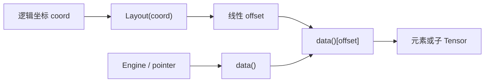

# CuTe Tensor：把 Layout 贴到真实数据上

上一篇 `Layout` 文章里，我们一直在讨论“坐标如何映射到线性偏移”。但真正写算子时，只有偏移还不够：我们还需要知道这个偏移要加到哪根指针上、读出来的是什么类型、这块数据在 gmem、smem 还是寄存器里。

这就是 `Tensor` 做的事。

> `Tensor = Engine + Layout`。  
> `Layout` 决定坐标到 offset 的映射，`Engine` 决定 offset 作用在哪段数据上。

所以 CuTe 里的 `Tensor` 不是 PyTorch 那种拥有复杂运行时元信息的大对象。它更像一个轻量 view：把一个 iterator/pointer 和一个 layout 绑在一起，然后让你用多维坐标访问数据。



如果只记一句话：

> **Layout 只回答“偏移是多少”；Tensor 进一步回答“从哪里取这个偏移上的值”。**

## `Tensor<Engine, Layout>` 的基本模型

`Tensor` 在源码中的核心声明可以简化成：

```cpp
template <class Engine, class Layout>
struct Tensor {
  using iterator     = typename Engine::iterator;
  using value_type   = typename Engine::value_type;
  using element_type = typename Engine::element_type;
  using reference    = typename Engine::reference;

  using engine_type  = Engine;
  using layout_type  = Layout;

  cute::tuple<layout_type, engine_type> rep_;
};
```

两个模板参数的职责很清楚：

| 组件 | 作用 | 常见来源 |
| --- | --- | --- |
| `Layout` | 描述 Shape/Stride，把逻辑坐标映射成线性 offset。 | `make_layout`、`Shape`、`Stride`、Layout algebra 结果。 |
| `Engine` | 持有 iterator 或数组，负责 `begin()`、元素类型、引用类型。 | `ViewEngine<Iter>`、`ConstViewEngine<Iter>`、`ArrayEngine<T,N>`。 |

`Tensor` 自己不重新发明坐标系统。它暴露的 `shape()`、`stride()`、`size()`、`rank` 基本都来自内部的 `layout()`。

```cpp
CUTE_HOST_DEVICE constexpr decltype(auto) data() {
  return engine().begin();
}

CUTE_HOST_DEVICE constexpr decltype(auto) layout() const {
  return get<0>(rep_);
}

CUTE_HOST_DEVICE constexpr decltype(auto) shape() const {
  return layout().shape();
}

CUTE_HOST_DEVICE constexpr auto size() const {
  return cute::size(shape());
}
```

这里的 `size()` 是**逻辑元素个数**，不是底层需要覆盖的物理范围。需要分配静态数组时，经常用的是 `cosize(layout)`，因为带 padding 或非紧凑 stride 的布局可能访问到更远的 offset。

## 基本接口速查

### 成员接口

| 接口 | 含义 |
| --- | --- |
| `tensor.data()` | 返回 `Engine` 持有的 iterator，也就是底层起始指针或指针包装器。 |
| `tensor.layout()` | 返回内部 `Layout`。 |
| `tensor.shape()` | 返回 `layout().shape()`。 |
| `tensor.stride()` | 返回 `layout().stride()`。 |
| `tensor.size()` | 返回逻辑元素总数，即 `size(shape())`。 |
| `tensor(coord)` | 若 `coord` 不含 `_`，返回单个元素；若含 `_`，返回切片后的子 Tensor。 |
| `tensor(c0, c1, ...)` | 等价于 `tensor(make_coord(c0, c1, ...))`。 |
| `tensor[coord]` | 直接用 `layout()(coord)` 取元素；通常用于自然坐标或 1D 遍历，不负责切片。 |
| `tensor.compose(layouts...)` | 返回共享同一份 data、但 layout 经过 composition 的新 Tensor。 |
| `tensor.tile(layouts...)` | 返回共享同一份 data、但 layout 经过 tile 操作的新 Tensor。 |

### 自由函数

这些接口和 `Layout` 版本几乎同名，区别是它们保留同一个 `data()`，只改布局：

| 接口 | 含义 |
| --- | --- |
| `rank<I...>(tensor)` | 查询第 `I...` 个 mode 的 rank。 |
| `depth<I...>(tensor)` | 查询嵌套深度。 |
| `shape<I...>(tensor)` | 查询指定 mode 的 shape。 |
| `size<I...>(tensor)` | 查询指定 mode 的逻辑大小。 |
| `layout<I...>(tensor)` | 取指定 mode 的 layout。 |
| `tensor<I...>(tensor)` | 取指定 mode 对应的子 Tensor。 |
| `flatten(tensor)` | 展平 Tensor 的 layout。 |
| `coalesce(tensor)` | 合并 layout 中可连续表达的 mode。 |
| `composition(tensor, tiler)` | 对 Tensor 的 layout 做 composition。 |
| `logical_divide(tensor, tiler)` | 按 tiler 切出 tile 内与 rest 坐标。 |
| `zipped_divide(tensor, tiler)` | 将 tile 内 mode 和 rest mode 分别打包。 |
| `tiled_divide(tensor, tiler)` | 在 `zipped_divide` 基础上展开 rest mode。 |
| `flat_divide(tensor, tiler)` | 在 `zipped_divide` 基础上同时展开 tile/rest mode。 |

注意：`Tensor` 没有实现 `_product` 系列操作。原因是 `logical_product`、`zipped_product` 这类 Layout 乘积常常会增大共域，让 Tensor 可能访问到原始数据范围之外的位置。Layout 可以做纯数学变换，Tensor 不能随便制造越界访问。

## Engine：Tensor 背后的数据入口

`Engine` 是对 iterator 或数组的包装。源码中它需要提供一组类似 `std::array` 的最小接口：

```cpp
using iterator     = ...;
using value_type   = ...;
using element_type = ...;
using reference    = ...;

iterator begin();
```

常见 Engine 有三类：

| Engine | 所有权 | 典型场景 |
| --- | --- | --- |
| `ViewEngine<Iter>` | 不拥有数据 | gmem/smem/raw pointer view。 |
| `ConstViewEngine<Iter>` | 不拥有数据，只读 | const pointer view。 |
| `ArrayEngine<T,N>` | 拥有数据 | 寄存器 Tensor、fragment、临时小数组。 |

一般不需要手写 Engine。`make_tensor(...)` 会根据传参自动选择：

- 第一个参数能解引用，例如 `float*`、`gmem_ptr<float*>`、`smem_ptr<float*>`，就构造非拥有 Tensor。
- 显式写 `make_tensor<T>(...)`，且 layout 全静态，就构造拥有型 Tensor，底层类似 `std::array<T, N>`。

### 内存空间标签

普通指针能构造 Tensor，但 CuTe 算子经常需要知道数据来自哪里。比如某些 copy atom 要求 source 是 gmem，destination 是 smem，这时裸 `float*` 的信息就不够。

CuTe 用 tagged iterator 表达内存空间：

```cpp
auto g_ptr = make_gmem_ptr(A);
auto s_ptr = make_smem_ptr(smem);
```

| 接口 | 含义 |
| --- | --- |
| `make_gmem_ptr(ptr)` | 标记为 global memory iterator。 |
| `make_smem_ptr(ptr)` | 标记为 shared memory iterator。 |
| `make_gmem_ptr<T>(void_ptr)` | 从 `void*` 转成 `T*` 后标记为 gmem。 |
| `make_smem_ptr<T>(void_ptr)` | 从 `void*` 转成 `T*` 后标记为 smem。 |

这些标签不是装饰品。它们会参与后续 copy、TMA、async copy 等接口的类型派发和编译期检查。

## 创建非拥有 Tensor

非拥有 Tensor 是最常见的形式：它只是看一段已有内存，不负责释放。

```cpp
float* A = ...;

// 未打标签的 pointer view。
auto tensor_8   = make_tensor(A, make_layout(Int<8>{}));
auto tensor_8s  = make_tensor(A, Int<8>{});
auto tensor_8d2 = make_tensor(A, 8, 2);

// global memory view。
auto gmem_8s     = make_tensor(make_gmem_ptr(A), Int<8>{});
auto gmem_8d     = make_tensor(make_gmem_ptr(A), 8);
auto gmem_8sx16d = make_tensor(make_gmem_ptr(A),
                               make_shape(Int<8>{}, 16));
auto gmem_8dx16s = make_tensor(make_gmem_ptr(A),
                               make_shape(8, Int<16>{}),
                               make_stride(Int<16>{}, Int<1>{}));

// shared memory view。
auto smem_layout = make_layout(make_shape(Int<4>{}, Int<8>{}));
__shared__ float smem[decltype(cosize(smem_layout))::value];

auto smem_4x8_col = make_tensor(make_smem_ptr(smem), smem_layout);
auto smem_4x8_row = make_tensor(make_smem_ptr(smem),
                                shape(smem_layout),
                                LayoutRight{});
```

这些 Tensor 共享同一个特点：**复制 Tensor 对象不会复制底层元素**。它们像 pointer view 一样，拷贝的是“怎么看这段内存”，不是“复制一份内存”。

`print` 的输出会把 pointer 标签、元素位宽和 layout 一起打印出来：

```txt
tensor_8     : ptr[32b](0x7f42efc00000) o _8:_1
tensor_8s    : ptr[32b](0x7f42efc00000) o _8:_1
tensor_8d2   : ptr[32b](0x7f42efc00000) o 8:2
gmem_8s      : gmem_ptr[32b](0x7f42efc00000) o _8:_1
gmem_8d      : gmem_ptr[32b](0x7f42efc00000) o 8:_1
gmem_8sx16d  : gmem_ptr[32b](0x7f42efc00000) o (_8,16):(_1,_8)
gmem_8dx16s  : gmem_ptr[32b](0x7f42efc00000) o (8,_16):(_16,_1)
smem_4x8_col : smem_ptr[32b](0x7f4316000000) o (_4,_8):(_1,_4)
smem_4x8_row : smem_ptr[32b](0x7f4316000000) o (_4,_8):(_8,_1)
```

`o` 后面的部分就是 `Shape:Stride`。这也是调试 CuTe Tensor 时最常看的信息。

## 创建拥有型 Tensor

拥有型 Tensor 用 `make_tensor<T>(...)` 创建。它会在 Tensor 内部放一个静态数组，通常代表寄存器上的临时数据。

```cpp
// register memory，要求静态 layout。
auto rmem_4x8_col = make_tensor<float>(Shape<_4, _8>{});

auto rmem_4x8_row = make_tensor<float>(Shape<_4, _8>{},
                                       LayoutRight{});

auto rmem_4x8_pad = make_tensor<float>(Shape<_4, _8>{},
                                       Stride<_32, _2>{});

auto rmem_4x8_like = make_tensor_like(rmem_4x8_pad);
```

源码里对拥有型 Tensor 有明确限制：

```cpp
static_assert((is_static<Arg0>::value && ... && is_static<Args>::value),
              "Dynamic owning tensors not supported");
```

原因很朴素：它底层类似 `std::array<T, cosize_v<Layout>>`，需要在编译期知道数组大小。CUDA kernel 里也不希望 Tensor 自己做动态内存分配。

### `cosize_v`

`cosize_v` 是把 `cosize(layout)` 变成编译期常量的工具：

```cpp
template <class Layout>
using cosize_t = decltype(cosize(declval<Layout>()));

template <class Layout>
static constexpr auto cosize_v = cosize_t<Layout>::value;
```

它回答的是“这个 layout 的最大 offset 需要多大物理空间承载”。例如 `Shape<_4,_8>, Stride<_32,_2>` 的逻辑元素是 32 个，但物理跨度不止 32，所以寄存器数组大小要看 `cosize`，不能只看 `size`。

### `make_tensor_like`

`make_tensor_like(tensor)` 会创建一个拥有型 register Tensor：

- 元素类型默认沿用输入 Tensor 的 `Engine::value_type`。
- Shape 沿用输入 Tensor。
- Stride 顺序尽量沿用输入 layout 的访问顺序。

它常用于“从 gmem/smem 切出一个 tile，然后创建一个形状匹配的寄存器 tile”：

```cpp
auto gmem_tile = gmem_tiled(_, 0);
auto rmem_tile = make_tensor_like(gmem_tile);
```

## 访问 Tensor：坐标先给 Layout，再给 data

访问单个元素时，源码逻辑非常直接：

```cpp
template <class Coord>
CUTE_HOST_DEVICE constexpr decltype(auto)
operator[](Coord const& coord) {
  return data()[layout()(coord)];
}
```

也就是说：

$$
\mathrm{tensor}(c)=\mathrm{data}[\mathrm{layout}(c)].
$$

### 复杂坐标访问示例

```cpp
auto A = make_tensor<float>(
    Shape<Shape<_4, _5>, Int<13>>{},
    Stride<Stride<_12, _1>, _64>{});

float* b_ptr = ...;
auto B = make_tensor(b_ptr, make_shape(13, 20));
```

`A` 的 Shape 是 `((4,5),13)`，第 0 个 mode 自己又嵌套成 `(4,5)`。因此你可以用完整嵌套坐标填充：

```cpp
for (int m0 = 0; m0 < size<0,0>(A); ++m0) {
  for (int m1 = 0; m1 < size<0,1>(A); ++m1) {
    for (int n = 0; n < size<1>(A); ++n) {
      A[make_coord(make_coord(m0, m1), n)] = n + 2 * m0;
    }
  }
}
```

也可以在较粗粒度上把第 0 个 mode 当作大小为 20 的整体来用：

```cpp
for (int m = 0; m < size<0>(A); ++m) {
  for (int n = 0; n < size<1>(A); ++n) {
    B(n, m) = A(m, n);
  }
}
```

这里 `A(m, n)` 中的 `m` 会按第 0 个 mode 的 layout 解释。读代码时可以把它理解成：“我不关心 `(m0,m1)` 怎么拆，先把第 0 个 mode 当成线性域遍历。”

如果两个 Tensor 的逻辑 `size` 一致，也可以用 1D 容器视角访问：

```cpp
for (int i = 0; i < A.size(); ++i) {
  A[i] = B[i];
}
```

这类写法适合初始化、elementwise、简单 copy。真正涉及矩阵语义或 tile 语义时，最好用多维坐标，代码可读性会高很多。

## 切片：`_` 表示保留这个维度

`operator()` 有一个关键分支：

```cpp
template <class Coord>
CUTE_HOST_DEVICE constexpr decltype(auto)
operator()(Coord const& coord) {
  if constexpr (has_underscore<Coord>::value) {
    auto [sliced_layout, offset] = slice_and_offset(coord, layout());
    return make_tensor(data() + offset, sliced_layout);
  } else {
    return data()[layout()(coord)];
  }
}
```

所以：

- 坐标里没有 `_`：返回一个元素。
- 坐标里有 `_`：返回一个新的 Tensor view。

切片做两件事：

1. 固定的坐标会参与 `layout()` 计算，得到一个 offset，新 Tensor 的 `data()` 会变成 `old_data + offset`。
2. `_` 对应的 mode 会被保留下来，组成新 Tensor 的 layout。

示例来自 CuTe 官方文档：

```cpp
auto A = make_tensor(
    ptr,
    make_shape(make_shape(Int<3>{}, 2),
               make_shape(2, Int<5>{}, Int<2>{})),
    make_stride(make_stride(4, 1),
                make_stride(Int<2>{}, 13, 100)));
// A: ((_3,2),(2,_5,_2)):((4,1),(_2,13,100))

auto B = A(2, _);
// B: ((2,_5,_2)):((_2,13,100))

auto C = A(_, 5);
// C: ((_3,2)):((4,1))

auto D = A(make_coord(_, _), 5);
// D: (_3,2):(4,1)

auto E = A(make_coord(_, 1), make_coord(0, _, 1));
// E: (_3,_5):(4,13)

auto F = A(make_coord(2, _), make_coord(_, 3, _));
// F: (2,2,_2):(1,_2,100)
```


这张图最值得注意的是 `C` 和 `D`：

- `C = A(_, 5)` 和 `D = A(make_coord(_, _), 5)` 访问的是同一组元素。
- 但 `C` 保留的是整个第 0 个 mode，所以 Shape 是 `((_3,2))`。
- `D` 显式保留第 0 个 mode 内部的两个子 mode，所以 Shape 是 `(_3,2)`。

这就是 CuTe slicing 的一个核心规则：

> **结果 Tensor 的 rank 等于切片坐标里 `_` 的数量和层级结构。**

`_` 不是简单的“全部取出”；它还决定结果 Tensor 的 shape 结构。

## Tensor 上的 Layout Algebra

很多 Layout 代数操作可以直接作用在 Tensor 上：

```cpp
composition(tensor, tiler);
logical_divide(tensor, tiler);
zipped_divide(tensor, tiler);
tiled_divide(tensor, tiler);
flat_divide(tensor, tiler);
```

它们的共同模式是：

```cpp
return make_tensor(tensor.data(), op(tensor.layout(), tiler));
```

也就是说，**data 不变，layout 变了**。这点很重要：tiling 一个 Tensor 并不搬数据，它只是换了一种坐标解释方式。

| 操作 | Tensor 视角 |
| --- | --- |
| `composition(tensor, tiler)` | 用 tiler 重新描述访问顺序，常用于 thread/value layout。 |
| `logical_divide(tensor, tiler)` | 按原始 mode 分别拆出 tile 内坐标和 rest 坐标。 |
| `zipped_divide(tensor, tiler)` | 把所有 tile 内坐标收成第 0 个 mode，把 rest 收成第 1 个 mode。 |
| `tiled_divide(tensor, tiler)` | 保留完整 tile mode，但展开 rest mode。 |
| `flat_divide(tensor, tiler)` | tile mode 和 rest mode 都展开，适合扁平遍历。 |

### `zipped_divide` 的实际用途

设：

```cpp
auto A = make_tensor(ptr, make_shape(8, 24));
auto tiler = Shape<_4, _8>{};

auto tiled_a = zipped_divide(A, tiler);
// shape: ((_4,_8),(2,3))
```

`tiled_a` 的坐标结构是：

```txt
((tile_m, tile_n), (rest_m, rest_n))
```

所以：

```cpp
auto tile_ij = tiled_a(make_coord(_, _),
                       make_coord(blockIdx.x, blockIdx.y));
```

含义是：

- 保留第 0 个 mode，也就是 `(_4,_8)` 的 tile 内全部元素。
- 固定第 1 个 mode，也就是选择第 `(blockIdx.x, blockIdx.y)` 个 tile。

如果把 rest mode 当作线性编号，也常写成：

```cpp
auto tile_k = tiled_a(_, k);
```

这里的 `_` 是“保留整个 tile”，`k` 是“第几个 tile”。这个写法在遍历所有 tile 时很顺手。

## `local_tile`：给 CTA/Warp 取一个完整 tile

`local_tile` 本质上是 `inner_partition`：

```cpp
template <class Tensor, class Tiler, class Coord>
CUTE_HOST_DEVICE constexpr auto
local_tile(Tensor&& tensor,
           Tiler const& tiler,
           Coord const& coord) {
  return inner_partition(static_cast<Tensor&&>(tensor), tiler, coord);
}
```

而 `inner_partition` 做的是：

```cpp
auto tensor_tiled = zipped_divide(tensor, tiler);
return tensor_tiled(repeat<R0>(_), coord);
```

通俗理解：

> 先把 Tensor 切成 `((Tile...), (Rest...))`，然后固定 Rest，保留 Tile。

因此它适合 CTA/Warp 级别取块：

```cpp
auto gmem = make_tensor(ptr, make_shape(8, 24));
auto tiler = Shape<_4, _8>{};

auto cta_tile = local_tile(gmem, tiler,
                           make_coord(blockIdx.x, blockIdx.y));
// cta_tile: (_4,_8)
```

### 带 `Step` 的投影

实际 GEMM 中经常有三维 CTA tiler：

```cpp
auto cta_tiler = Shape<_32, _64, _4>{};        // (BLK_M, BLK_N, BLK_K)
auto cta_coord = make_coord(blockIdx.x, blockIdx.y, _);
```

这里 `cta_coord` 也带了 `_`。它不是占位用的语法糖，而是切片语义：

| 坐标 | 含义 |
| --- | --- |
| `blockIdx.x` | 固定 M 方向第几个 CTA tile。 |
| `blockIdx.y` | 固定 N 方向第几个 CTA tile。 |
| `_` | 不固定 K 方向 tile，保留整个 K tile 序列。 |

也就是说，`make_coord(blockIdx.x, blockIdx.y, _)` 表示：

> 这个 CTA 固定一个 `(m,n)` 输出 tile，但要保留所有 `k` tile，后面 mainloop 会遍历这个 K 方向的 rest mode。

这和普通 Tensor slicing 的规则一致：整数坐标会固定一个位置，`_` 会保留对应 mode。

但 A/B/C Tensor 并不都拥有 M/N/K 三个维度：

- A 通常是 `(M,K)`，需要 M/K，不需要 N。
- B 通常是 `(N,K)`，需要 N/K，不需要 M。
- C 通常是 `(M,N)`，需要 M/N，不需要 K。

所以 CuTe 用 `Step` 对同一份 `cta_tiler` 和 `cta_coord` 做投影：

```cpp
auto gA = local_tile(mA, cta_tiler, cta_coord, Step<_1, X, _1>{});
auto gB = local_tile(mB, cta_tiler, cta_coord, Step<X, _1, _1>{});
auto gC = local_tile(mC, cta_tiler, cta_coord, Step<_1, _1, X>{});
```

`Step` 本身只是 `cute::tuple` 的语义别名：

```cpp
template <class... Strides>
using Step = cute::tuple<Strides...>;
```

在 `local_tile(..., proj)` 这个接口里，`Step` 被当作投影掩码使用：

| 投影 | 保留的 tiler mode | 典型结果 |
| --- | --- | --- |
| `Step<_1, X, _1>` | 保留 M/K，丢掉 N | `gA: (BLK_M, BLK_K, k)` |
| `Step<X, _1, _1>` | 保留 N/K，丢掉 M | `gB: (BLK_N, BLK_K, k)` |
| `Step<_1, _1, X>` | 保留 M/N，丢掉 K | `gC: (BLK_M, BLK_N)` |

注意这里的 `_1` 不是用来参与数值计算的步长。对 `dice` 来说，它只表示“这里不是 `X`，所以保留”。`X` 是 `Underscore` 的别名，表示这个位置要被剔除。

带 `proj` 的 `local_tile` 源码非常短：

```cpp
template <class Tensor, class Tiler, class Coord, class Proj,
          __CUTE_REQUIRES(is_tensor<remove_cvref_t<Tensor>>::value)>
CUTE_HOST_DEVICE
auto
local_tile(Tensor    && tensor,
           Tiler const& tiler,   // 原始 tiler，例如 (BLK_M, BLK_N, BLK_K)
           Coord const& coord,   // 原始 rest 坐标，例如 (blockIdx.x, blockIdx.y, _)
           Proj  const& proj)    // 投影掩码，例如 Step<_1, X, _1>
{
  // 先按 proj 同时裁剪 tiler 和 coord，再调用普通 local_tile。
  // 这样 A/B/C 可以共享同一个三维 CTA tiler，只投影出自己需要的 mode。
  return local_tile(static_cast<Tensor&&>(tensor),
                    dice(proj, tiler),
                    dice(proj, coord));
}
```

因此 A 的调用：

```cpp
auto gA = local_tile(mA, cta_tiler, cta_coord, Step<_1, X, _1>{});
```

等价于手写：

```cpp
auto gA = local_tile(mA,
                     make_shape(_32{}, _4{}),
                     make_coord(blockIdx.x, _));
```

更接近 CuTe tutorial 里的写法是：

```cpp
auto gA = local_tile(mA,
                     select<0, 2>(cta_tiler),
                     select<0, 2>(cta_coord));
```

此时普通 `local_tile` 会继续做：

```cpp
auto gA_mk = zipped_divide(mA, select<0, 2>(cta_tiler));
// gA_mk: ((BLK_M, BLK_K), (m, k))

auto gA = gA_mk(make_coord(_, _), select<0, 2>(cta_coord));
// select<0, 2>(cta_coord) = make_coord(blockIdx.x, _)
// gA: (BLK_M, BLK_K, k)
```

这个结果里的最后一个 `k` 就来自 `coord` 里的 `_`。它表示：M 方向固定到当前 CTA 的 `blockIdx.x`，K 方向不固定，保留全部 K tiles 让 mainloop 继续遍历。

如果把 `coord` 改成固定 K tile：

```cpp
auto cta_coord_k0 = make_coord(blockIdx.x, blockIdx.y, k0);
auto gA_k0 = local_tile(mA, cta_tiler, cta_coord_k0, Step<_1, X, _1>{});
```

那么投影后的 coord 是 `make_coord(blockIdx.x, k0)`，结果就只剩一个单独的 A tile：

```cpp
// gA_k0: (BLK_M, BLK_K)
```

所以 `coord` 里是否带 `_`，决定的是 `local_tile` 结果里是否保留对应的 rest mode。

### `dice` 的源码与语义

`dice` 和 `slice` 是一对互补工具：

- `slice(mask, x)` 保留 mask 中 `_` 对应的位置。
- `dice(mask, x)` 保留 mask 中**不是** `_` 的位置。

`X` 本身就是 `Underscore`：

```cpp
// For slicing
struct Underscore : Int<0> {};

CUTE_INLINE_CONSTANT Underscore _;

// Convenient alias
using X = Underscore;
```

`dice` 的核心源码在 `cute/underscore.hpp`：

```cpp
namespace detail {

template <class A, class B>
CUTE_HOST_DEVICE constexpr
auto
lift_dice(A const& a, B const& b)
{
  if constexpr (is_tuple<A>::value) {
    static_assert(tuple_size<A>::value == tuple_size<B>::value,
                  "Mismatched Ranks");

    // 如果 mask 是嵌套 tuple，就递归处理每一层。
    return filter_tuple(a, b,
                        [](auto const& x, auto const& y) {
                          return lift_dice(x, y);
                        });
  } else if constexpr (is_underscore<A>::value) {
    // mask 当前位置是 _ / X：丢掉 B 中对应元素。
    return cute::tuple<>{};
  } else {
    // mask 当前位置不是 _ / X：保留 B 中对应元素。
    return cute::tuple<B>{b};
  }
}

} // namespace detail

template <class A, class B>
CUTE_HOST_DEVICE constexpr
auto
dice(A const& a, B const& b)
{
  if constexpr (is_tuple<A>::value) {
    static_assert(tuple_size<A>::value == tuple_size<B>::value,
                  "Mismatched Ranks");

    // tuple mask：逐元素 dice，然后过滤掉空 tuple。
    return filter_tuple(a, b,
                        [](auto const& x, auto const& y) {
                          return detail::lift_dice(x, y);
                        });
  } else if constexpr (is_underscore<A>::value) {
    // 顶层 mask 是 _ / X：整个结果为空 tuple。
    return cute::tuple<>{};
  } else {
    // 顶层 mask 不是 _ / X：整个 B 原样保留。
    // 这就是源码注释里说的 dice(1, b) == b。
    return b;
  }
}
```

对 `Layout` 的 `dice` 只是同时裁剪 Shape 和 Stride：

```cpp
template <class Coord, class Shape, class Stride>
CUTE_HOST_DEVICE constexpr
auto
dice(Coord const& c, Layout<Shape,Stride> const& layout)
{
  return make_layout(dice(c, layout.shape()),
                     dice(c, layout.stride()));
}
```

把它代回 GEMM 例子：

| 表达式 | 结果 | 含义 |
| --- | --- | --- |
| `dice(Step<_1, X, _1>{}, cta_tiler)` | `(BLK_M, BLK_K)` | A 只需要 M/K tile 形状。 |
| `dice(Step<_1, X, _1>{}, cta_coord)` | `(blockIdx.x, _)` | A 固定 M tile，保留 K rest mode。 |
| `dice(Step<X, _1, _1>{}, cta_tiler)` | `(BLK_N, BLK_K)` | B 只需要 N/K tile 形状。 |
| `dice(Step<X, _1, _1>{}, cta_coord)` | `(blockIdx.y, _)` | B 固定 N tile，保留 K rest mode。 |
| `dice(Step<_1, _1, X>{}, cta_tiler)` | `(BLK_M, BLK_N)` | C 只需要 M/N tile 形状。 |
| `dice(Step<_1, _1, X>{}, cta_coord)` | `(blockIdx.x, blockIdx.y)` | C 固定 M/N tile，不保留 K mode。 |

这也是为什么结果分别是：

```cpp
gA: (BLK_M, BLK_K, k)
gB: (BLK_N, BLK_K, k)
gC: (BLK_M, BLK_N)
```

`gA` 和 `gB` 还有一个 `k` mode，是因为它们的投影后 coord 里仍然含 `_`；`gC` 没有 `k` mode，是因为 `Step<_1, _1, X>` 已经把 K 方向从 tiler 和 coord 中一起剔除了。

## `local_partition`：把一个 tile 分给线程

`local_partition` 用在线程级划分。它回答的问题不是“这个 CTA 拿哪一块 tile”，而是：

> 已经有一块或一批 tile 了，`threadIdx.x` 这个线程应该负责 tile 内的哪个相对位置？这个相对位置在所有重复 tile 中对应哪些元素？

所以它划分的不是 CTA 网格，而是**tile 内的工作位置**。如果 `local_tile` 的视角是“给我一个完整 tile”，那么 `local_partition` 的视角就是“给这个线程它在 tile 里的那一份”。

### 先看一个具体例子

假设有一个逻辑矩阵：

```cpp
auto data = make_tensor(ptr, make_shape(Int<16>{}, Int<64>{}));
// data: (16,64)
```

现在我们让 32 个线程按一个 `2x16` 的线程布局覆盖 tile 内的 32 个位置：

```cpp
auto thr_layout = Layout<Shape<_2, _16>>{};
```

这个 `thr_layout` 可以理解成：

```txt
32 个 thread 被摆进一个 2 x 16 的小 tile。
每个 thread 对应 tile 内一个坐标 (tm, tn)。
```

对 `Layout<Shape<_2,_16>>{}` 这个默认紧凑布局，可以把映射写成：

$$
\mathrm{thr\_layout}(t_m,t_n)=t_m+2t_n.
$$

所以线性 `threadIdx.x` 反解到 tile 内坐标时，会得到：

| `threadIdx.x` | tile 内坐标 `(tm, tn)` |
| --- | --- |
| `0` | `(0, 0)` |
| `1` | `(1, 0)` |
| `2` | `(0, 1)` |
| `3` | `(1, 1)` |
| `...` | `...` |
| `31` | `(1, 15)` |

调用：

```cpp
auto thr_data = local_partition(data, thr_layout, threadIdx.x);
// thr_data: (_8,_4)
```

为什么结果是 `(_8,_4)`？可以拆开看。

`local_partition` 内部会把 `data` 按 `2x16` 切开：

```cpp
auto tiled = zipped_divide(data, Shape<_2, _16>{});
// tiled: ((_2,_16),(_8,_4))
```

这里：

- `(_2,_16)` 是 tile 内坐标，也就是一个 tile 里 32 个位置。
- `(_8,_4)` 是 rest 坐标，也就是 `16x64` 里一共有 `8 x 4` 个这样的 `2x16` tile。

如果某个线程对应 tile 内坐标 `(tm, tn)`，那么：

```cpp
auto thr_data = tiled(make_coord(tm, tn), make_coord(_, _));
// thr_data: (_8,_4)
```

也就是说，这个线程不是只拿一个元素，而是拿到**所有 tile 中同一个相对位置**组成的 Tensor：

$$
\mathrm{thr\_data}(r_m,r_n)
=\mathrm{data}(2r_m+t_m,\ 16r_n+t_n).
$$

举个更具体的例子：

- `threadIdx.x = 0` 对应 `(tm,tn)=(0,0)`，它负责 `(0,0)、(2,0)、(4,0)...`，以及下一组 N tile 里的 `(0,16)、(2,16)...`。
- `threadIdx.x = 1` 对应 `(tm,tn)=(1,0)`，它负责 `(1,0)、(3,0)、(5,0)...`。
- `threadIdx.x = 2` 对应 `(tm,tn)=(0,1)`，它负责 `(0,1)、(2,1)、(4,1)...`。

这就是 `local_partition` 的核心用途：**把一个重复出现的 tile pattern 按线程布局切开，让每个线程拿到自己负责的那条“重复轨迹”。**

### 和 `local_tile` 的区别

这两个接口都可以理解成 `zipped_divide + slicing`，但切的 mode 相反：

| 接口 | 先得到的结构 | 固定哪个 mode | 保留哪个 mode | 结果是谁拿到什么 |
| --- | --- | --- | --- | --- |
| `local_tile` | `((Tile...), (Rest...))` | 固定 `Rest` | 保留 `Tile` | 一个 CTA/Warp 拿一个完整 tile。 |
| `local_partition` | `((Tile...), (Rest...))` | 固定 `Tile` | 保留 `Rest` | 一个 thread 拿它在所有 tile 中的对应位置。 |

所以：

```cpp
auto cta_tile = local_tile(data, Shape<_2, _16>{}, make_coord(0, 0));
// cta_tile: (_2,_16)，一个完整 tile

auto thr_data = local_partition(data, thr_layout, threadIdx.x);
// thr_data: (_8,_4)，某个线程跨所有 tile 的职责范围
```

`local_partition` 返回的 Tensor 通常看起来“更稀疏”，因为它保留的是 rest mode。它不是在物理上收集成连续数组，而是创建一个 view：这个 view 的 layout 描述了该线程要访问哪些位置。

### 从源码看 `outer_partition`

`local_partition` 是 `outer_partition` 的包装。先看更底层的 `outer_partition`：

```cpp
template <class Tensor, class Tiler, class Coord,
          __CUTE_REQUIRES(is_tensor<remove_cvref_t<Tensor>>::value)>
CUTE_HOST_DEVICE constexpr
auto
outer_partition(Tensor&& tensor,
                Tiler const& tiler,
                Coord const& coord)
{
  // 先把 tensor 切成 ((Tile...), (Rest...))。
  auto tensor_tiled = zipped_divide(static_cast<Tensor&&>(tensor), tiler);
  constexpr int R1 = decltype(rank<1>(tensor_tiled))::value;

  if constexpr (is_tuple<Coord>::value) {
    constexpr int R0 = decltype(rank<0>(tensor_tiled))::value;

    // coord 用来固定第 0 个 mode，也就是 tile 内位置。
    // repeat<R1>(_) 保留第 1 个 mode，也就是所有 rest tile。
    return tensor_tiled(append<R0>(coord, _), repeat<R1>(_));
  } else {
    // 如果 coord 是线性整数，就直接用它切进 tile mode。
    return tensor_tiled(coord, repeat<R1>(_));
  }
}
```

对刚才的 `2x16` 例子，`outer_partition(data, Shape<_2,_16>{}, make_coord(tm,tn))` 可以理解成：

```cpp
auto tiled = zipped_divide(data, Shape<_2, _16>{});
auto out   = tiled(make_coord(tm, tn), make_coord(_, _));
```

它固定 tile 内的 `(tm,tn)`，保留所有 rest tile，因此结果 shape 是 `(_8,_4)`。

### `local_partition` 做了什么包装

```cpp
template <class Tensor, class LShape, class LStride, class Index>
CUTE_HOST_DEVICE
auto
local_partition(Tensor                     && tensor,
                Layout<LShape,LStride> const& tile,   // thread layout: coord -> index
                Index                  const& index)  // 例如 threadIdx.x
{
  static_assert(is_integral<Index>::value);

  // product_each(shape(tile)) 提取 tile 的逻辑形状，例如 (_2,_16)。
  // tile.get_flat_coord(index) 把线性 thread id 反解成 tile 内坐标。
  return outer_partition(static_cast<Tensor&&>(tensor),
                         product_each(shape(tile)),
                         tile.get_flat_coord(index));
}
```

这里的 `tile` 参数名字有点容易误导。它不是数据 tile，而是**线程布局**：描述线性 `index` 如何映射到 tile 内坐标。

`get_flat_coord(index)` 来自 `Layout`：

```cpp
template <class IInt,
          __CUTE_REQUIRES(is_integral<IInt>::value)>
CUTE_HOST_DEVICE constexpr
auto
get_flat_coord(IInt const& idx) const {
  return cute::crd2crd(this->get_hier_coord(idx),
                       shape(),
                       repeat<rank>(Int<1>{}));
}
```

它的作用可以简单理解成：

```txt
threadIdx.x -> 这个 thread 在 tile 内的坐标
```

如果 `thr_layout = Layout<Shape<_2,_16>>{}`，那么：

```txt
threadIdx.x = 0  -> (0,0)
threadIdx.x = 1  -> (1,0)
threadIdx.x = 2  -> (0,1)
...
threadIdx.x = 31 -> (1,15)
```

接着 `outer_partition` 固定这个坐标，得到该线程跨所有 rest tile 的 Tensor view。

这也是为什么 `local_partition` 常用于 thread-level partition：你只给它 `threadIdx.x`，它就能按照你定义的 `thr_layout` 把线程映射到数据 tile 内的位置。

### `local_partition` 的投影

带 projection 的版本是：

```cpp
template <class Tensor, class LShape, class LStride,
          class Index, class Projection>
CUTE_HOST_DEVICE auto
local_partition(Tensor&& tensor,
                Layout<LShape,LStride> const& tile,
                Index const& index,
                Projection const& proj) {
  return local_partition(static_cast<Tensor&&>(tensor),
                         dice(proj, tile),
                         index);
}
```

注意这里和 `local_tile` 有个细节差异：

- `local_tile(tensor, tiler, coord, proj)` 会 `dice(proj, tiler)` 和 `dice(proj, coord)`。
- `local_partition(tensor, tile, index, proj)` 只会 `dice(proj, tile)`，不会对 `index` 做 dice。

原因是 `index` 是一个线性 thread id，不是和 tiler 同形状的 coordinate。投影先改线程布局，然后再用 `get_flat_coord(index)` 把线性 id 映射到投影后的 tile 坐标。

GEMM 中常见写法是：

```cpp
auto thr_layout = Layout<Shape<_2, _16, _1>,
                         Stride<_16, _1, _0>>{};

auto thrA = local_partition(dataA, thr_layout, threadIdx.x,
                            Step<_1, X, _1>{});
auto thrB = local_partition(dataB, thr_layout, threadIdx.x,
                            Step<X, _1, _1>{});
auto thrC = local_partition(dataC, thr_layout, threadIdx.x,
                            Step<_1, _1, X>{});
```

这和 `local_tile` 的 `Step` 是同一个思想：同一套线程布局或 CTA 布局，投影到 A/B/C 不同矩阵需要的维度上。

但它的计算顺序要看清楚。以 `thrA` 为例：

```cpp
auto thrA = local_partition(dataA, thr_layout, threadIdx.x,
                            Step<_1, X, _1>{});
```

源码等价于：

```cpp
auto thrA = local_partition(dataA,
                            dice(Step<_1, X, _1>{}, thr_layout),
                            threadIdx.x);
```

`Step<_1, X, _1>` 会从线程布局里保留 M/K，丢掉 N。然后 `threadIdx.x` 会在投影后的线程布局中被解释成 tile 内坐标，最后固定这个 tile 内坐标，保留 rest。

因此常见注释里的：

```cpp
// thrA: (M/2,K/1)
// thrB: (N/16,K/1)
// thrC: (M/2,N/16)
```

不是说一个线程只拿一个小块，而是说：

- A 上每个线程固定自己负责的 M/K 相对位置，保留 M/K 方向上剩余的重复部分。
- B 上每个线程固定自己负责的 N/K 相对位置，保留 N/K 方向上剩余的重复部分。
- C 上每个线程固定自己负责的 M/N 相对位置，保留 M/N 方向上剩余的重复部分。

一句话总结：

> `local_partition` 是把“线程布局”贴到“数据 tile”上。线程布局告诉 CuTe：`threadIdx.x` 对应 tile 内哪个位置；返回的 Tensor 告诉这个线程：你在所有重复 tile 中要处理哪些元素。

## Thread-Value Partitioning

Thread-Value layout，简称 TV layout，是 CuTe 里非常核心的一种思考方式：

> 第一个 mode 表示 thread，第二个 mode 表示这个 thread 拿到的 value。

它适合描述 MMA / Copy atom 中那种“线程 0 拿哪些元素、线程 1 拿哪些元素”的硬件映射。

```cpp
// (T8,V4) -> (M4,N8) 的 1D coord。
auto tv_layout =
    Layout<Shape<Shape<_2, _4>, Shape<_2, _2>>,
           Stride<Stride<_8, _1>, Stride<_4, _16>>>{};

// 任意 layout 的 4x8 数据。
auto A = make_tensor<float>(Shape<_4, _8>{}, LayoutRight{});

// 用 TV layout 改写访问视角。
auto tv = composition(A, tv_layout);
// tv: (8,4)

// 每个线程拿自己这一行的 4 个 value。
auto v = tv(threadIdx.x, _);
// v: (4)
```


这张图可以从三个方向读：

- 左侧是原始 `4x8 data`。它可以是任意 Layout。
- 中间是 `8x4 TV -> 4x8 1D coord`，描述 `(thread, value)` 如何映射到原数据的一维坐标。
- 右侧是复合后的 Tensor 视角：每一行对应一个 thread，行内 4 个元素是这个 thread 的 value。

底部的 inverse TV layout 则反过来回答：原数据里的某个 `(m,n)` 会落到哪个 `(thread,value)`。

这就是为什么 TV layout 在 MMA traits 和 copy traits 里这么常见：硬件指令关心的不是“矩阵第几行第几列”，而是“哪个线程持有哪个 fragment value”。

## 示例：按列搬到寄存器

下面这个模式很常见：从一个 gmem Tensor 里切出一列，搬到 register Tensor，然后处理。

```cpp
auto gmem = make_tensor(ptr, make_shape(Int<8>{}, 16));
auto rmem = make_tensor_like(gmem(_, 0));

for (int j = 0; j < size<1>(gmem); ++j) {
  copy(gmem(_, j), rmem);
  do_something(rmem);
}
```

这段代码只依赖几个接口契约：

- `gmem(_, j)` 返回第 `j` 列的 Tensor view。
- `make_tensor_like(gmem(_, 0))` 创建一个形状匹配的 register Tensor。
- `copy` 根据源/目的 Tensor 的 layout 与 pointer tag 选择合适实现。

如果希望在编译期确认这个函数只接受 rank-2 且第一维静态的 Tensor，可以写：

```cpp
CUTE_STATIC_ASSERT_V(rank(gmem) == Int<2>{});
CUTE_STATIC_ASSERT_V(is_static<decltype(shape<0>(gmem))>{});
```

这也是 CuTe 风格通用算法的味道：算法不直接写 `row * ld + col`，而是约束 Tensor 的结构，让 Layout 自己负责偏移。

## 示例：遍历所有 tile

把上一节扩展成 tile 搬运：

```cpp
auto gmem = make_tensor(ptr, make_shape(24, 16));

auto tiler = Shape<_8, _4>{};
// auto tiler = Tile<Layout<_8, _3>, Layout<_4, _2>>{};

auto gmem_tiled = zipped_divide(gmem, tiler);
// gmem_tiled: ((_8,_4), Rest)

auto rmem = make_tensor_like(gmem_tiled(_, 0));
// rmem: ((_8,_4))

for (int j = 0; j < size<1>(gmem_tiled); ++j) {
  copy(gmem_tiled(_, j), rmem);
  do_something(rmem);
}
```

这里 `gmem_tiled(_, j)` 的意思和上一篇文章讲 `zipped_divide` 时完全一致：

- 第 0 个 mode 是完整 tile，`_` 表示保留 tile 内全部元素。
- 第 1 个 mode 是 tile 网格，`j` 表示第几个 tile。

因此 `make_tensor_like(gmem_tiled(_, 0))` 正好创建一个能容纳单个 tile 的寄存器 Tensor。

## 写算子时怎么读 Tensor

读 CuTe kernel 时，不要一上来盯着完整类型名看。更实用的顺序是：

1. 看 Tensor 来自哪里：`make_gmem_ptr`、`make_smem_ptr` 还是 `make_tensor<float>`。
2. 看 `shape(tensor)`：现在这坨数据的逻辑坐标是什么。
3. 看第 0 个 mode：很多时候它表示 tile 内、thread、value 或 MMA atom 维度。
4. 看 `_` 出现在哪：`_` 保留的 mode 就是结果 Tensor 还会继续被遍历的 mode。
5. 看 `local_tile` 还是 `local_partition`：前者通常给 CTA/Warp 一整块，后者通常给 thread 分一份。

一个很实用的心智模型：

```txt
make_tensor      : 把 Layout 贴到数据上
slice with _     : 固定一部分坐标，保留一部分坐标
zipped_divide    : 整理成 (tile 内, tile 间)
local_tile       : 固定 tile 间，拿一个完整 tile
local_partition  : 固定 tile 内位置，拿这个线程负责的重复部分
composition(TV)  : 整理成 (thread, value)
```

## 小结

- `Tensor` 由 `Engine` 和 `Layout` 组成；`Engine` 提供数据入口，`Layout` 提供坐标到 offset 的映射。
- 非拥有 Tensor 是 view，拷贝它不会拷贝元素；拥有型 Tensor 类似静态数组，常用于寄存器 fragment。
- `operator()` 遇到普通坐标返回元素，遇到 `_` 返回子 Tensor。
- Tensor 上的 tiling 操作本质上是不搬数据、只换 layout。
- `local_tile` 和 `local_partition` 都是 `zipped_divide + slicing` 的封装，只是固定的 mode 不同。
- 写算子时要把 Tensor 的 shape 当成“当前数据职责说明书”，而不是只当数组维度。
